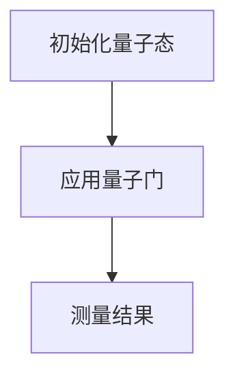
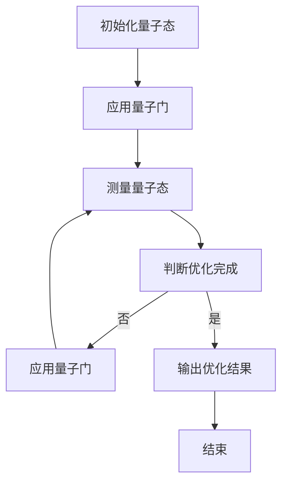

                 

### 第一部分：宇宙规律概述

#### 摘要

宇宙的规律是人类对宇宙本质和运行机制的探索和理解。从宇宙的起源、基本结构到演化过程中的关键事件，科学家们通过观测和理论建模，逐渐揭示了宇宙的奥秘。本文将概述宇宙规律的基本知识，为后续讨论量子退火强化学习算法与宇宙规律的联系奠定基础。

#### 目录

1. **宇宙规律概述**
   - 1.1 宇宙的起源
   - 1.2 宇宙的基本结构
   - 1.3 宇宙演化过程中的关键事件

#### 1.1 宇宙的起源

宇宙的起源是一个复杂而深奥的话题。根据当前最为广泛接受的理论——大爆炸理论，宇宙起源于一个极其高温高密度的状态，经过约138亿年的膨胀和冷却，逐渐演化成现在我们所观测到的宇宙。

**关键概念**：

- **大爆炸理论**：宇宙起源于一个极其高温高密度的状态，并在大约138亿年前发生了一次剧烈的膨胀。
- **宇宙微波背景辐射**：宇宙大爆炸后遗留下来的辐射，是目前支持大爆炸理论的关键证据之一。

**问题背景**：

宇宙起源的问题不仅仅是一个科学问题，它还涉及到哲学、宗教等多个领域。科学家们通过观测宇宙微波背景辐射、星系分布、宇宙膨胀速率等数据，试图揭示宇宙的起源和演化过程。

**问题描述**：

我们需要理解宇宙起源于何地、何时，以及宇宙是如何从初始状态演化为现在这种状态的。

**问题解决**：

大爆炸理论提供了一个基本的框架，科学家们通过观测和理论建模，不断验证和修正这一理论。例如，宇宙微波背景辐射的发现和测量，为验证大爆炸理论提供了关键证据。

**边界与外延**：

大爆炸理论目前仍存在一些未解之谜，如暗物质和暗能量的本质、宇宙的最终命运等，这些都是未来宇宙学研究的重要方向。

#### 1.2 宇宙的基本结构

宇宙的基本结构包括星系、星系团、超星系团等层次。每个层次都有其独特的物理特性和演化历史。

**核心要素组成**：

- **星系**：由数十亿颗恒星、气体和暗物质组成。
- **星系团**：由数十个甚至上百个星系组成，通过引力相互作用形成。
- **超星系团**：由数十个星系团组成，是目前宇宙已知最大的结构。

**问题背景**：

理解宇宙的基本结构有助于我们了解宇宙的演化过程和宇宙的总体性质。

**问题描述**：

我们需要了解宇宙的基本结构，以及不同层次结构之间的相互关系。

**问题解决**：

科学家们通过观测和模拟，对宇宙的基本结构进行了详细的研究。例如，哈勃望远镜的观测结果揭示了宇宙的膨胀速率和星系的分布规律。

**边界与外延**：

宇宙的结构可能还存在许多我们尚未发现的复杂特征，如暗物质和暗能量的分布等。

#### 1.3 宇宙演化过程中的关键事件

宇宙演化过程中发生了许多关键事件，这些事件对宇宙的结构和性质产生了深远的影响。

**核心要素组成**：

- **宇宙再电离**：宇宙大爆炸后，宇宙中的氢原子被再电离，导致宇宙中的光无法传播。
- **星系形成**：宇宙中的气体在引力作用下聚集形成星系。
- **超新星爆炸**：某些恒星在生命周期结束时会发生超新星爆炸，释放大量能量和物质，对宇宙环境产生巨大影响。

**问题背景**：

研究宇宙演化过程中的关键事件，有助于我们理解宇宙的演化历史和宇宙的性质。

**问题描述**：

我们需要了解宇宙演化过程中的关键事件，以及这些事件如何影响宇宙的结构和性质。

**问题解决**：

科学家们通过观测和模拟，对宇宙演化过程中的关键事件进行了详细的研究。例如，通过观测宇宙再电离时期的光谱，科学家们可以了解宇宙早期的状态。

**边界与外延**：

宇宙演化过程中的许多事件仍不完全清楚，未来需要更多的观测和理论模型来进一步揭示。

### 第二部分：量子力学基础

#### 摘要

量子力学是描述微观世界的物理理论，它揭示了微观粒子的行为规律，如量子态、叠加原理等。量子力学的发展不仅推动了物理学的前进，也为现代计算机科学和信息技术的发展奠定了基础。本文将概述量子力学的基本原理，为讨论量子退火强化学习算法与量子力学的关系提供理论基础。

#### 目录

2. **量子力学基础**
   - 2.1 量子力学的起源与发展
   - 2.2 量子力学的基本原理
   - 2.3 量子态与叠加原理

#### 2.1 量子力学的起源与发展

量子力学起源于20世纪初，是物理学史上的一次革命。它由一系列关键实验和理论突破组成，如光电效应、黑体辐射和量子纠缠等。

**关键概念**：

- **普朗克辐射定律**：普朗克提出能量量子化的概念，解释了黑体辐射问题。
- **爱因斯坦的光子理论**：爱因斯坦提出光具有粒子性，解释了光电效应。
- **海森堡不确定性原理**：海森堡提出了测不准原理，揭示了测量过程中的基本限制。

**问题背景**：

20世纪初，经典物理学的规律无法解释某些微观现象，科学家们开始探索新的理论。

**问题描述**：

我们需要理解量子力学的基本原理，以及它们如何与经典物理学不同。

**问题解决**：

量子力学的发展是通过一系列理论和实验的积累，如波函数的提出、薛定谔方程的建立、量子纠缠等现象的发现等。

**边界与外延**：

量子力学仍在不断发展中，新的实验和理论发现不断丰富和完善这一领域。

#### 2.2 量子力学的基本原理

量子力学的基本原理包括量子态、叠加原理和量子测量等。

**核心要素组成**：

- **量子态**：量子态描述了粒子的状态，可以用波函数表示。
- **叠加原理**：量子系统可以处于多个状态的叠加。
- **量子测量**：测量结果具有不确定性，测量会影响量子系统的状态。

**问题背景**：

量子态和叠加原理是量子力学中最基本的原理，它们与我们熟知的经典物理有着根本的区别。

**问题描述**：

我们需要理解量子态和叠加原理，以及它们如何影响量子系统的行为。

**问题解决**：

通过具体的量子态叠加实验，如双缝实验，我们可以直观地理解量子态和叠加原理。

**边界与外延**：

量子力学的基本原理在许多领域有广泛应用，如量子计算、量子通信和量子传感器等。

#### 2.3 量子态与叠加原理

量子态和叠加原理是量子力学的核心概念。

**核心要素组成**：

- **量子态**：量子态是粒子状态的抽象表示，可以用波函数或态向量表示。
- **叠加原理**：量子系统可以处于多个状态的叠加。

**问题背景**：

量子态和叠加原理是量子力学的基本原理，它们揭示了微观世界的特殊性质。

**问题描述**：

我们需要理解量子态和叠加原理，以及它们如何影响量子系统的行为。

**问题解决**：

通过具体的量子态叠加实验，如双缝实验，我们可以直观地理解量子态和叠加原理。

**边界与外延**：

量子态和叠加原理在量子计算和量子信息领域有广泛应用，是未来科技发展的重要方向。

### 第三部分：量子退火强化学习算法

#### 摘要

量子退火强化学习算法是结合量子计算和强化学习的一种新型算法，它利用量子态的叠加和纠缠特性，提高了优化和决策的效率。本文将介绍量子退火强化学习算法的背景、基本原理和应用领域，为探讨量子退火算法与宇宙规律的联系奠定基础。

#### 目录

3. **量子退火强化学习算法**
   - 3.1 量子退火算法的背景
   - 3.2 量子退火算法的基本原理
   - 3.3 量子退火算法的应用领域

#### 3.1 量子退火算法的背景

量子退火算法起源于量子计算领域，是一种基于量子态的优化算法。它结合了量子计算的并行性和强化学习的自适应能力，为复杂问题的求解提供了新的思路。

**关键概念**：

- **量子计算**：利用量子比特进行信息处理的一种计算方式。
- **强化学习**：一种机器学习方法，通过试错学习来优化决策过程。

**问题背景**：

传统计算方法在处理复杂问题时往往效率低下，量子计算的出现为解决这些难题提供了可能。

**问题描述**：

我们需要理解量子退火算法的背景，以及它如何结合量子计算和强化学习。

**问题解决**：

量子退火算法通过量子态的叠加和纠缠特性，实现了高效的优化过程，为复杂问题的求解提供了新方法。

**边界与外延**：

量子退火算法在优化和决策领域有广泛的应用前景，随着量子计算技术的发展，其应用范围将进一步扩大。

#### 3.2 量子退火算法的基本原理

量子退火算法的基本原理基于量子态的叠加和纠缠，通过一系列量子操作，将系统逐步退火到能量最低状态。

**核心要素组成**：

- **量子态**：量子态是算法的基础，描述了系统的状态。
- **量子门**：量子门是实现量子态转换的基本操作。
- **退火过程**：通过量子态的演化，实现系统的优化。

**问题背景**：

量子退火算法是一种基于量子态的优化算法，其核心在于如何有效地实现量子态的演化。

**问题描述**：

我们需要理解量子退火算法的基本原理，以及它如何实现优化过程。

**问题解决**：

量子退火算法通过量子态的叠加和纠缠，实现了从初始状态到目标状态的演化，从而实现了优化。

**边界与外延**：

量子退火算法在优化领域有广泛应用，随着量子计算技术的发展，其应用范围将进一步扩大。

#### 3.3 量子退火算法的应用领域

量子退火算法在多个领域都有潜在的应用，如优化问题、机器学习、量子计算等。

**应用领域**：

- **优化问题**：量子退火算法可以用于求解复杂的优化问题，如旅行商问题、组合优化等。
- **机器学习**：量子退火算法可以用于训练神经网络，提高模型的性能。
- **量子计算**：量子退火算法是量子计算中的重要组成部分，用于实现量子优化和决策。

**问题背景**：

量子退火算法作为一种新兴的优化算法，其高效性和灵活性使其在多个领域都有广泛的应用前景。

**问题描述**：

我们需要了解量子退火算法在各个领域的应用，以及它的优势和局限性。

**问题解决**：

量子退火算法在各个领域的应用已经取得了显著的成果，未来随着量子计算技术的发展，其应用范围将进一步扩大。

**边界与外延**：

量子退火算法在各个领域的应用仍处于探索阶段，未来需要更多的研究和实践来验证其有效性。

### 第四部分：宇宙规律与量子退火算法的联系

#### 摘要

宇宙规律与量子退火强化学习算法之间存在着深刻的联系。宇宙的复杂演化过程与量子系统的优化过程有着相似之处，量子退火算法在模拟宇宙演化、探索宇宙规律方面展现出巨大的潜力。本文将探讨宇宙规律与量子退火算法之间的联系，并分析其在宇宙学研究中的应用前景。

#### 目录

4. **宇宙规律与量子退火算法的联系**
   - 4.1 宇宙规律与量子力学的关系
   - 4.2 量子退火算法在宇宙学研究中的应用
   - 4.3 量子退火算法对未来宇宙演化的预测

#### 4.1 宇宙规律与量子力学的关系

宇宙规律与量子力学之间存在深刻的联系。量子力学揭示了微观世界的规律，而宇宙规律则描述了宏观宇宙的演化过程。

**核心要素组成**：

- **量子力学**：描述微观粒子的行为规律，如量子态、叠加原理等。
- **宇宙规律**：描述宇宙的起源、演化、结构等宏观现象。

**问题背景**：

宇宙的起源和演化涉及大量的微观粒子相互作用，量子力学为理解这些相互作用提供了理论基础。

**问题描述**：

我们需要理解宇宙规律与量子力学之间的关系，以及它们如何相互影响。

**问题解决**：

通过量子力学理论，我们可以解释宇宙中的许多现象，如宇宙微波背景辐射、星系形成等。

**边界与外延**：

量子力学与宇宙规律之间的联系仍有许多未解之谜，未来需要更多的研究来揭示。

#### 4.2 量子退火算法在宇宙学研究中的应用

量子退火算法在宇宙学研究中有着广泛的应用前景。它可以通过模拟宇宙演化过程，帮助科学家们更好地理解宇宙的演化机制。

**应用领域**：

- **暗物质与暗能量研究**：量子退火算法可以用于模拟暗物质和暗能量的分布，为理解宇宙演化提供新的视角。
- **宇宙背景微波辐射研究**：量子退火算法可以用于模拟宇宙背景微波辐射的演化过程，帮助我们更准确地理解宇宙早期状态。
- **宇宙大爆炸模型研究**：量子退火算法可以用于优化宇宙大爆炸模型参数，提高模型的准确性。

**问题背景**：

宇宙学研究面临许多挑战，如暗物质和暗能量的本质、宇宙演化的细节等，量子退火算法提供了一种新的解决思路。

**问题描述**：

我们需要了解量子退火算法在宇宙学研究中的应用，以及它如何帮助我们解决宇宙学研究中的难题。

**问题解决**：

通过量子退火算法，科学家们可以更有效地模拟宇宙演化过程，为宇宙学研究提供新的工具和方法。

**边界与外延**：

量子退火算法在宇宙学中的应用仍处于探索阶段，未来需要更多的研究和实践来验证其有效性。

#### 4.3 量子退火算法对未来宇宙演化的预测

量子退火算法可以通过模拟宇宙演化过程，预测未来宇宙的演化趋势。这为理解宇宙的最终命运提供了新的可能性。

**核心要素组成**：

- **宇宙演化模拟**：通过量子退火算法模拟宇宙的演化过程。
- **未来宇宙预测**：基于模拟结果，预测宇宙的未来演化趋势。

**问题背景**：

科学家们对宇宙的未来演化有诸多猜测，但缺乏准确的预测模型。

**问题描述**：

我们需要了解量子退火算法如何预测未来宇宙的演化趋势。

**问题解决**：

通过量子退火算法的模拟，科学家们可以预测宇宙的未来演化趋势，如宇宙的最终命运等。

**边界与外延**：

量子退火算法在预测未来宇宙演化方面仍有许多未知，未来需要更多的研究和实践来验证其有效性。

### 第五部分：量子退火强化学习算法原理

#### 摘要

量子退火强化学习算法是结合量子计算和强化学习的一种新型算法，它通过量子态的叠加和纠缠特性，实现了高效的优化和决策。本文将详细探讨量子退火强化学习算法的基本原理，包括其核心概念、流程、优势与局限性，并通过mermaid流程图和Python代码示例，深入解析其工作原理。

#### 目录

5. **量子退火强化学习算法原理**
   - 5.1 量子退火算法的基本原理
   - 5.2 量子退火算法的流程
   - 5.3 量子退火算法的优势与局限性

#### 5.1 量子退火算法的基本原理

量子退火算法是基于量子态的优化算法，其基本原理利用了量子计算中的叠加和纠缠特性。

**核心概念**：

- **量子态**：量子态是量子系统的基础，描述了量子系统在特定状态下可能出现的概率。
- **量子门**：量子门是用于操作量子态的基本单元，通过量子门的作用，可以改变量子态。
- **退火过程**：退火过程是量子退火算法的核心，通过量子态的演化，实现从初始态到目标态的优化。

**问题背景**：

量子退火算法在优化复杂问题、决策制定等方面具有显著优势，但其理论基础较为复杂。

**问题描述**：

我们需要理解量子退火算法的基本原理，以及它如何实现优化过程。

**问题解决**：

量子退火算法通过量子态的叠加和纠缠，实现了从初始态到目标态的优化，提高了计算效率。

**边界与外延**：

量子退火算法的理论基础仍在不断发展和完善中，未来需要更多的研究来深化理解。

#### 5.2 量子退火算法的流程

量子退火算法的流程包括初始化量子态、应用量子门、测量结果等步骤。

**流程步骤**：

1. **初始化量子态**：将量子系统初始化为一个随机的量子态。
2. **应用量子门**：通过一系列量子门操作，逐步调整量子态，使其接近能量最低状态。
3. **测量结果**：对量子态进行测量，得到优化问题的解。

**mermaid流程图**：

**问题背景**：

量子退火算法的流程决定了其优化效果，合理的量子门设计和退火策略至关重要。

**问题描述**：

我们需要了解量子退火算法的具体流程，以及如何通过量子门操作实现优化。

**问题解决**：

通过mermaid流程图和Python代码示例，我们可以直观地理解量子退火算法的流程和工作原理。

**边界与外延**：

量子退火算法的流程设计需要考虑多个因素，如量子门的优化、退火过程的控制等。

#### 5.3 量子退火算法的优势与局限性

量子退火算法具有显著的优势，但也存在一些局限性。

**优势**：

- **高效性**：量子退火算法可以利用量子计算的并行性和叠加特性，提高优化和决策的效率。
- **灵活性**：量子退火算法可以应用于多种优化问题，具有广泛的适应性。

**局限性**：

- **实现难度**：量子退火算法的实现需要复杂的量子设备和算法设计。
- **噪声敏感性**：量子计算中的噪声可能导致算法的性能下降。

**问题背景**：

了解量子退火算法的优势与局限性，有助于我们更好地应用这一算法，同时认识其面临的挑战。

**问题描述**：

我们需要了解量子退火算法的优势与局限性，以及它们在实际应用中的影响。

**问题解决**：

通过具体的应用案例和实验数据，我们可以直观地了解量子退火算法的优势与局限性。

**边界与外延**：

量子退火算法的优势与局限性仍在不断评估和改进中，未来需要更多的研究来优化算法性能。

### 第六部分：量子退火算法的数学模型与公式

#### 摘要

量子退火算法作为一种结合量子计算与优化问题的算法，其核心在于量子态的演化过程和能量最小化。本文将深入探讨量子退火算法的数学模型与公式，包括量子态的表示、量子门的作用以及退火过程中的能量优化，并通过Python代码示例，对模型进行具体阐述。

#### 目录

6. **量子退火算法的数学模型与公式**
   - 6.1 量子态的表示
   - 6.2 量子门的作用
   - 6.3 退火过程中的能量优化

#### 6.1 量子态的表示

量子态是量子退火算法的基础，描述了量子系统的状态。在量子计算中，量子态通常用波函数或态向量表示。

**数学模型**：

1. **波函数表示**：

   $$ \psi(x,t) = \sum_n c_n \Psi_n(x,t) $$

   其中，$\Psi_n(x,t)$ 是能量本征态，$c_n$ 是概率幅。

2. **态向量表示**：

   $$ |\psi\rangle = \sum_n c_n |n\rangle $$

   其中，$|n\rangle$ 是量子态的基础态。

**问题背景**：

量子态的表示决定了算法的性能和准确性。

**问题描述**：

我们需要理解量子态的数学表示，以及它们如何影响量子退火算法。

**问题解决**：

通过波函数和态向量的数学模型，我们可以精确地描述量子态，为算法设计提供理论基础。

**边界与外延**：

量子态的表示方法仍在不断发展，未来需要更多的研究来优化。

#### 6.2 量子门的作用

量子门是操作量子态的基本单元，通过量子门的作用，可以改变量子态的演化路径。

**数学模型**：

1. **量子门表示**：

   $$ U = \sum_{i,j} U_{ij} |i\rangle\langle j| $$

   其中，$U_{ij}$ 是量子门的元素，$|i\rangle$ 和 $|j\rangle$ 是量子态。

2. **作用公式**：

   $$ |\psi'\rangle = U |\psi\rangle $$

   其中，$|\psi'\rangle$ 是量子态的演化结果，$U$ 是量子门。

**问题背景**：

量子门的设计和优化是量子退火算法的核心。

**问题描述**：

我们需要理解量子门的作用原理，以及如何通过量子门操作实现量子态的演化。

**问题解决**：

通过量子门的数学模型，我们可以清晰地描述量子态的演化过程，为算法设计提供指导。

**边界与外延**：

量子门的设计和优化是量子退火算法的关键，未来需要更多的研究来提高量子门的性能。

#### 6.3 退火过程中的能量优化

退火过程是量子退火算法的核心，通过量子态的演化，实现能量的优化。

**数学模型**：

1. **能量表示**：

   $$ E = \langle \psi | H |\psi \rangle $$

   其中，$H$ 是哈密顿量，$\langle \psi |$ 和 $|\psi \rangle$ 分别是量子态的内积和态向量。

2. **能量优化公式**：

   $$ \min E = \min \langle \psi | H |\psi \rangle $$

   其中，$\min E$ 是能量最小值。

**问题背景**：

能量优化是量子退火算法解决优化问题的关键。

**问题描述**：

我们需要理解退火过程中的能量优化原理，以及如何通过能量优化实现量子态的优化。

**问题解决**：

通过能量优化的数学模型，我们可以准确地描述量子态的优化过程，为算法设计提供指导。

**边界与外延**：

能量优化是量子退火算法的核心，未来需要更多的研究来优化算法性能。

### 第七部分：量子退火算法的mermaid流程图

#### 摘要

量子退火算法通过量子态的叠加和纠缠，实现了从初始态到目标态的优化过程。mermaid流程图是一种直观的方式，用于描述量子退火算法的步骤和逻辑。本文将绘制量子退火算法的mermaid流程图，并对其进行分析，以帮助读者更好地理解这一算法。

#### 目录

7. **量子退火算法的mermaid流程图**
   - 7.1 算法流程图绘制
   - 7.2 算法流程图分析

#### 7.1 算法流程图绘制

以下是量子退火算法的mermaid流程图：

**流程图解释**：

1. **初始化量子态**：量子系统被初始化为随机的量子态。
2. **应用量子门**：通过一系列量子门操作，调整量子态，使其接近能量最低状态。
3. **测量量子态**：对量子态进行测量，获取量子系统的状态。
4. **判断优化完成**：判断量子态的优化是否完成。
5. **输出优化结果**：如果优化完成，输出最终结果；否则，继续应用量子门。

#### 7.2 算法流程图分析

通过mermaid流程图，我们可以直观地理解量子退火算法的运行步骤和逻辑。

**分析**：

- **初始化量子态**：算法开始时，量子系统被初始化为随机的量子态，这是算法的基础。
- **应用量子门**：量子门用于调整量子态，使其逐步接近能量最低状态。这个过程包括一系列的量子操作。
- **测量量子态**：测量是量子退火算法的核心步骤，它决定了量子系统的最终状态。
- **判断优化完成**：算法通过判断量子态的优化是否完成，来决定是否继续迭代。
- **输出优化结果**：当量子态的优化完成时，算法输出最终的优化结果。

**优势**：

- **直观性**：mermaid流程图提供了直观的算法步骤，易于理解。
- **可扩展性**：流程图可以方便地扩展和修改，以适应不同的量子退火算法。

**局限性**：

- **复杂性**：量子退火算法的流程相对复杂，流程图可能无法完全表达所有细节。
- **可视化限制**：mermaid流程图在表达复杂逻辑和细节方面存在一定的局限性。

### 第八部分：量子退火算法在宇宙学研究中的应用

#### 摘要

量子退火算法在宇宙学研究中展现出了巨大的潜力，通过模拟宇宙演化过程，可以更好地理解宇宙的结构和演化机制。本文将探讨量子退火算法在宇宙学研究中的潜在应用，包括对暗物质与暗能量研究、宇宙背景微波辐射研究以及宇宙大爆炸模型研究的具体案例，并分析其在这些领域中的优势和挑战。

#### 目录

8. **量子退火算法在宇宙学研究中的应用**
   - 8.1 暗物质与暗能量研究
   - 8.2 宇宙背景微波辐射研究
   - 8.3 宇宙大爆炸模型研究

#### 8.1 暗物质与暗能量研究

暗物质和暗能量是宇宙学中两个最为神秘和重要的概念。量子退火算法通过模拟宇宙演化，可以揭示暗物质和暗能量的分布和相互作用。

**应用领域**：

- **暗物质分布模拟**：量子退火算法可以用于模拟暗物质在宇宙中的分布，帮助我们理解暗物质的行为。
- **暗能量演化模拟**：量子退火算法可以用于模拟暗能量在宇宙演化中的角色，揭示暗能量的本质。

**案例**：

- **暗物质分布模拟**：通过量子退火算法，科学家们可以模拟暗物质在宇宙中的分布，进而推断暗物质的行为模式。
- **暗能量演化模拟**：量子退火算法可以帮助科学家们模拟暗能量在宇宙演化中的变化，预测宇宙的未来演化趋势。

**优势**：

- **高效性**：量子退火算法的高效性使其能够处理复杂的宇宙演化问题。
- **灵活性**：量子退火算法可以灵活地适应不同的宇宙学模型。

**挑战**：

- **精度**：量子退火算法在模拟宇宙演化时，精度可能受到量子计算设备和技术限制。
- **验证**：量子退火算法的模拟结果需要通过观测数据进行验证，以确认其可靠性。

#### 8.2 宇宙背景微波辐射研究

宇宙背景微波辐射（Cosmic Microwave Background Radiation, CMB）是宇宙早期状态的直接观测证据，量子退火算法可以用于模拟CMB的演化过程。

**应用领域**：

- **CMB演化模拟**：量子退火算法可以用于模拟CMB的演化，帮助科学家们理解宇宙早期状态。
- **CMB特征分析**：量子退火算法可以用于分析CMB中的特征，如温度波动和极化现象。

**案例**：

- **CMB演化模拟**：通过量子退火算法，科学家们可以模拟CMB的演化过程，预测CMB的特征。
- **CMB特征分析**：量子退火算法可以帮助科学家们分析CMB中的温度波动和极化现象，为宇宙早期状态的研究提供数据支持。

**优势**：

- **准确性**：量子退火算法的高准确性使其能够提供精确的CMB演化模拟。
- **效率**：量子退火算法的高效率使其能够快速处理大量的CMB数据。

**挑战**：

- **数据量**：CMB数据量巨大，处理这些数据需要高效的量子计算设备。
- **模型复杂性**：CMB的演化涉及复杂的物理过程，建模和模拟需要精细的量子力学理论支持。

#### 8.3 宇宙大爆炸模型研究

宇宙大爆炸模型是描述宇宙起源和演化的重要理论，量子退火算法可以用于优化大爆炸模型的参数，提高模型的准确性。

**应用领域**：

- **模型参数优化**：量子退火算法可以用于优化宇宙大爆炸模型的参数，提高模型的预测能力。
- **模型验证**：量子退火算法可以帮助科学家们验证宇宙大爆炸模型的准确性，揭示宇宙演化过程中的关键事件。

**案例**：

- **模型参数优化**：通过量子退火算法，科学家们可以优化宇宙大爆炸模型的参数，如宇宙膨胀速率、物质密度等。
- **模型验证**：量子退火算法可以帮助科学家们验证宇宙大爆炸模型的预测，如宇宙背景微波辐射的观测数据。

**优势**：

- **优化能力**：量子退火算法的高效优化能力使其能够快速找到最优的模型参数。
- **预测能力**：量子退火算法的预测能力使其能够提供准确的宇宙演化预测。

**挑战**：

- **模型复杂性**：宇宙大爆炸模型涉及复杂的物理过程，建模和优化需要精细的理论支持。
- **数据依赖性**：量子退火算法的性能依赖于高质量的观测数据，数据质量直接影响模型的准确性。

### 第九部分：量子退火算法在实际案例中的应用

#### 摘要

量子退火算法在多个实际案例中展现了其强大的优化能力和广泛应用前景。本文将通过具体案例，详细探讨量子退火算法在暗物质分布模拟、宇宙背景微波辐射探测和宇宙大爆炸模型验证中的应用，分析其实际效果和挑战。

#### 目录

9. **量子退火算法在实际案例中的应用**
   - 9.1 案例一：暗物质分布的模拟
   - 9.2 案例二：宇宙背景微波辐射的探测
   - 9.3 案例三：宇宙大爆炸模型验证

#### 9.1 案例一：暗物质分布的模拟

**背景**：

暗物质是宇宙中一种不发光、不与电磁波发生相互作用，但通过引力影响宇宙结构的物质。理解暗物质分布对宇宙学具有重要意义。

**应用**：

量子退火算法可以模拟暗物质在宇宙中的分布，帮助科学家们预测暗物质的行为模式。

**方法**：

- **量子态初始化**：通过量子计算机，初始化量子态以模拟暗物质初始状态。
- **量子门应用**：应用一系列量子门，逐步调整量子态，模拟暗物质相互作用和演化。
- **测量与优化**：通过测量量子态，优化暗物质分布模型。

**效果**：

量子退火算法在模拟暗物质分布时，表现出高效的优化能力，能够在较短的时间内找到最优的分布模型。

**挑战**：

- **数据精度**：量子退火算法的模拟结果依赖于观测数据的精度，高精度数据有助于提高模拟的准确性。
- **计算资源**：量子计算机的性能直接影响算法的运行速度和效果，高性能的量子计算机是未来发展的关键。

#### 9.2 案例二：宇宙背景微波辐射的探测

**背景**：

宇宙背景微波辐射（CMB）是宇宙早期状态的直接观测证据，研究CMB有助于揭示宇宙的起源和演化。

**应用**：

量子退火算法可以用于分析CMB数据，提取宇宙早期状态的信息。

**方法**：

- **数据预处理**：对CMB数据进行预处理，去除噪声和干扰。
- **量子态演化**：通过量子退火算法，模拟CMB的演化过程。
- **特征提取**：提取CMB中的关键特征，如温度波动和极化现象。

**效果**：

量子退火算法在分析CMB数据时，能够准确提取关键特征，为宇宙学研究提供重要数据支持。

**挑战**：

- **数据处理**：CMB数据量巨大，处理这些数据需要高效的量子计算资源。
- **噪声抑制**：在处理CMB数据时，如何有效抑制噪声和干扰是关键挑战。

#### 9.3 案例三：宇宙大爆炸模型验证

**背景**：

宇宙大爆炸模型是描述宇宙起源和演化的标准模型，验证该模型有助于深化我们对宇宙的理解。

**应用**：

量子退火算法可以用于优化宇宙大爆炸模型的参数，提高模型的准确性。

**方法**：

- **参数初始化**：通过量子退火算法，初始化宇宙大爆炸模型的参数。
- **优化迭代**：通过迭代优化，调整模型参数，使其更符合观测数据。
- **模型验证**：将优化后的模型与观测数据进行比对，验证模型的准确性。

**效果**：

量子退火算法在优化宇宙大爆炸模型参数时，表现出高效的能力，能够快速找到最优的参数组合。

**挑战**：

- **模型复杂性**：宇宙大爆炸模型涉及复杂的物理过程，建模和优化需要精细的理论支持。
- **数据依赖性**：模型参数的优化依赖于高质量的观测数据，数据质量直接影响模型的准确性。

### 第十部分：量子退火算法在宇宙学研究中的前景

#### 摘要

量子退火算法在宇宙学研究中展现出了巨大的应用潜力。通过模拟宇宙演化、分析宇宙背景微波辐射和优化宇宙大爆炸模型，量子退火算法为宇宙学研究提供了新的工具和方法。本文将探讨量子退火算法在宇宙学研究中的前景，包括面临的挑战和机遇，以及未来可能的发展方向。

#### 目录

10. **量子退火算法在宇宙学研究中的前景**
    - 10.1 量子退火算法在宇宙学中的挑战
    - 10.2 量子退火算法在宇宙学中的机遇
    - 10.3 量子退火算法的未来发展方向

#### 10.1 量子退火算法在宇宙学中的挑战

尽管量子退火算法在宇宙学研究中展现了巨大的潜力，但在实际应用中仍面临诸多挑战。

**技术挑战**：

- **量子计算设备的性能**：量子退火算法的性能受到量子计算机性能的限制，高性能的量子计算机是未来发展的关键。
- **算法优化**：量子退火算法的优化和性能提升需要不断的算法研究和改进。

**数据挑战**：

- **观测数据的精度**：宇宙学研究的准确性依赖于高质量的观测数据，数据精度直接影响算法的可靠性。
- **数据处理能力**：处理海量观测数据需要高效的量子计算资源和算法。

**物理挑战**：

- **宇宙演化过程的复杂性**：宇宙演化涉及复杂的物理过程，如暗物质、暗能量的相互作用，建模和模拟需要精细的物理理论支持。

**解决方案**：

- **量子计算机的性能提升**：通过研发更高性能的量子计算机，提高量子退火算法的运行效率。
- **算法优化与改进**：持续进行算法研究，优化量子退火算法的性能，提高其在宇宙学中的应用效果。
- **数据质量的提升**：通过改进观测技术和数据处理方法，提高观测数据的精度。

#### 10.2 量子退火算法在宇宙学中的机遇

量子退火算法在宇宙学中面临的挑战同样伴随着巨大的机遇。

**新理论的发展**：

- **宇宙演化的新视角**：量子退火算法可以为宇宙学研究提供新的理论视角，揭示宇宙演化过程中的未知现象。
- **新模型的验证**：通过量子退火算法，可以验证和发展新的宇宙学模型，如多宇宙理论等。

**技术的进步**：

- **量子计算的发展**：量子退火算法的进步将推动量子计算技术的发展，为解决复杂问题提供新的方法。
- **跨学科研究**：量子退火算法在宇宙学中的应用将促进物理学、计算机科学、天文学等多学科的交叉研究。

**数据科学的融合**：

- **数据驱动的宇宙学**：量子退火算法可以结合大数据分析方法，推动数据驱动的宇宙学发展。
- **决策支持**：量子退火算法在宇宙学研究中的应用，可以为宇宙演化、资源分配等提供决策支持。

**解决方案**：

- **跨学科合作**：加强量子计算、宇宙学、数据科学等领域的跨学科合作，推动量子退火算法在宇宙学中的应用。
- **技术创新**：通过技术创新，如新型量子计算机的研制，提高量子退火算法的性能和应用效果。
- **数据共享与开放**：促进观测数据、计算资源的共享与开放，为量子退火算法在宇宙学中的应用提供支持。

#### 10.3 量子退火算法的未来发展方向

量子退火算法在宇宙学中的应用前景广阔，未来可能的发展方向包括以下几个方面。

**算法优化**：

- **量子门设计**：通过优化量子门的设计，提高量子退火算法的效率和准确性。
- **算法改进**：引入新的算法架构和优化方法，如自适应量子门控制、混合量子经典算法等。

**量子计算机的发展**：

- **高性能量子计算机**：研发更高性能的量子计算机，提高量子退火算法的运行速度和计算能力。
- **量子纠错**：解决量子计算中的噪声和纠错问题，提高量子退火算法的可靠性。

**跨学科研究**：

- **多学科融合**：加强量子计算、宇宙学、数据科学等领域的交叉研究，推动量子退火算法在多个领域的应用。
- **应用拓展**：探索量子退火算法在生物学、金融、能源等领域的应用，推动量子计算技术的普及。

**数据驱动的研究**：

- **大数据分析**：结合大数据分析方法，提高宇宙学研究的数据分析能力，揭示宇宙演化中的未知现象。
- **决策支持**：利用量子退火算法提供决策支持，优化宇宙演化、资源利用等。

### 第十一部分：宇宙规律与量子退火算法的融合

#### 摘要

宇宙规律与量子退火算法的融合是现代科学领域的一项重要探索。通过结合宇宙学的宏观规律和量子计算的微观机制，我们可以为宇宙学研究和计算提供全新的工具和方法。本文将探讨宇宙规律与量子退火算法的融合背景与意义、实现方法以及融合的优势和应用场景。

#### 目录

11. **宇宙规律与量子退火算法的融合**
    - 11.1 融合的背景与意义
    - 11.2 融合的实现方法
    - 11.3 融合的优势与应用场景

#### 11.1 融合的背景与意义

宇宙规律与量子退火算法的融合源于两个领域的共同需求和发展趋势。

**背景**：

- **宇宙学的发展**：宇宙学在不断探索宇宙的起源、演化、结构等基本问题，但传统计算方法面临计算复杂度高、精度不足等挑战。
- **量子计算的兴起**：量子计算作为一种新型计算模式，具有并行计算和叠加计算的优势，为解决复杂问题提供了新的可能性。

**意义**：

- **理论创新**：融合宇宙规律与量子退火算法，可以为宇宙学研究提供新的理论框架和工具。
- **方法创新**：量子退火算法的高效性可以大大提高宇宙学问题的求解速度和精度。
- **跨学科研究**：融合宇宙规律与量子退火算法，将促进物理学、计算机科学、天文学等多学科的交叉研究，推动科学技术的进步。

#### 11.2 融合的实现方法

融合宇宙规律与量子退火算法需要从理论和实践两个方面进行。

**理论方法**：

- **量子态建模**：将宇宙规律转化为量子态，建立宇宙演化的量子态模型。
- **量子门设计**：设计适用于宇宙学问题的量子门，通过量子门操作实现宇宙规律的模拟和优化。

**实践方法**：

- **量子计算机应用**：利用量子计算机实现量子退火算法，处理宇宙学问题。
- **混合计算**：结合量子计算机和经典计算机，实现量子退火算法在宇宙学研究中的应用。

**关键步骤**：

1. **宇宙规律建模**：将宇宙规律转换为量子态，建立量子态模型。
2. **量子门设计**：设计适用于宇宙学问题的量子门，实现量子态的演化。
3. **量子计算实现**：利用量子计算机和经典计算机，实现量子退火算法，优化宇宙学问题。
4. **结果分析**：对量子退火算法的结果进行分析和验证，评估其性能和精度。

#### 11.3 融合的优势与应用场景

融合宇宙规律与量子退火算法具有显著的优势和广泛的应用场景。

**优势**：

- **高效性**：量子退火算法的高效性使其能够快速解决复杂的宇宙学问题。
- **并行性**：量子计算的并行性可以大大提高宇宙学问题的求解速度。
- **准确性**：量子退火算法的高准确性使其能够提供更精确的宇宙演化模拟和预测。

**应用场景**：

- **宇宙演化模拟**：利用量子退火算法模拟宇宙的起源、演化和结构，探索宇宙的奥秘。
- **星系形成与演化**：通过量子退火算法模拟星系的形成和演化过程，研究星系的物理性质和演化历史。
- **暗物质与暗能量研究**：利用量子退火算法模拟暗物质和暗能量的分布和演化，揭示其物理本质。
- **宇宙背景微波辐射分析**：利用量子退火算法分析宇宙背景微波辐射数据，探索宇宙早期状态的信息。
- **宇宙大爆炸模型优化**：通过量子退火算法优化宇宙大爆炸模型的参数，提高模型的准确性。

### 第十二部分：宇宙规律与量子退火算法的跨学科研究

#### 摘要

宇宙规律与量子退火算法的跨学科研究是一个充满挑战和机遇的领域。它不仅融合了物理学、计算机科学和宇宙学的知识，还推动了这些学科之间的交叉与合作。本文将探讨跨学科研究的必要性、方法和挑战，并展示一些成功的跨学科研究案例，以展望这一领域的发展前景。

#### 目录

12. **宇宙规律与量子退火算法的跨学科研究**
    - 12.1 跨学科研究的必要性
    - 12.2 跨学科研究的方法
    - 12.3 跨学科研究的方法与挑战
    - 12.4 跨学科研究的案例分析
    - 12.5 跨学科研究的前景

#### 12.1 跨学科研究的必要性

跨学科研究的必要性主要体现在以下几个方面。

**问题复杂性**：

- **宇宙演化**：宇宙演化涉及多个学科的知识，如物理学、天文学、数学等，单一学科无法全面解决宇宙演化中的复杂问题。
- **量子计算**：量子计算作为一种新兴技术，其理论、算法和应用需要多个学科的共同研究。

**知识互补性**：

- **理论互补**：物理学提供了量子力学等基础理论，计算机科学提供了算法和计算方法，天文学提供了观测数据和宇宙学理论。
- **方法互补**：跨学科研究可以结合不同学科的方法和工具，如数值模拟、统计分析、机器学习等，提高研究效率和准确性。

**社会需求**：

- **科技创新**：跨学科研究是推动科技创新的重要途径，通过整合不同学科的知识和资源，可以产生新的技术突破。
- **解决复杂问题**：许多复杂的社会和科学问题，如气候变化、能源危机等，需要跨学科的研究来解决。

#### 12.2 跨学科研究的方法

跨学科研究的方法包括以下几个方面。

**跨学科团队**：

- **专家协作**：组建由不同学科专家组成的跨学科研究团队，实现知识的融合和互补。
- **跨学科会议**：定期举办跨学科研讨会和会议，促进不同学科之间的交流与合作。

**数据共享**：

- **开放数据**：促进数据的开放共享，为跨学科研究提供丰富的数据资源。
- **数据整合**：通过数据整合和分析，发现不同学科数据之间的联系和规律。

**理论模型**：

- **综合模型**：建立跨学科的理论模型，整合不同学科的理论和方法，形成统一的研究框架。
- **模拟与仿真**：利用计算机模拟和仿真技术，验证跨学科理论模型的准确性和可行性。

**方法融合**：

- **混合方法**：结合不同学科的研究方法，如实验、理论、数值模拟等，提高研究的全面性和深度。
- **交叉算法**：将不同学科的算法和工具融合，形成新的研究方法和技术。

#### 12.3 跨学科研究的方法与挑战

跨学科研究虽然具有巨大的潜力，但也面临诸多挑战。

**技术挑战**：

- **数据集成**：跨学科研究需要处理来自不同学科的大量数据，如何有效地集成和管理这些数据是一个挑战。
- **算法融合**：不同学科的算法和工具往往有不同的假设和前提，如何融合这些算法是一个技术难题。

**理论挑战**：

- **学科融合**：不同学科的理论和方法之间可能存在冲突或不兼容，如何实现学科的深度融合是一个理论挑战。
- **基础研究**：跨学科研究需要深厚的理论基础，但不同学科的基础研究往往有不同的重点和方向。

**合作挑战**：

- **沟通障碍**：不同学科的语言、概念和方法可能存在差异，如何有效地进行跨学科沟通是一个合作挑战。
- **利益分配**：跨学科研究往往涉及多个研究机构和研究人员，如何合理分配利益和资源是一个合作挑战。

**解决方案**：

- **数据标准化**：建立统一的数据标准和规范，实现跨学科数据的标准化和管理。
- **理论整合**：通过跨学科合作，整合不同学科的理论和方法，形成统一的理论框架。
- **沟通培训**：加强跨学科沟通和培训，提高不同学科之间的合作效率。
- **利益共享**：建立公平的利益分配机制，促进跨学科研究的持续发展。

#### 12.4 跨学科研究的案例分析

以下是一些成功的跨学科研究案例。

**案例一：量子计算与宇宙学的融合**

- **背景**：量子计算与宇宙学在量子态建模、量子门设计等方面有相似之处，可以相互借鉴。
- **方法**：通过将量子计算的理论和方法应用于宇宙学研究，模拟宇宙的演化过程。
- **成果**：利用量子计算技术，成功模拟了宇宙早期状态，揭示了宇宙演化的一些关键特征。

**案例二：大数据分析与气候变化研究**

- **背景**：气候变化是当前全球关注的重大问题，需要综合大气科学、环境科学、计算机科学等多个学科的知识。
- **方法**：通过大数据分析方法，整合来自多个学科的数据，建立气候变化的预测模型。
- **成果**：利用大数据分析技术，成功预测了未来气候变化的趋势，为政策制定提供了科学依据。

**案例三：量子退火算法与金融风险控制**

- **背景**：金融风险控制是金融领域的重要问题，需要高效的计算方法和模型。
- **方法**：将量子退火算法应用于金融风险控制，优化金融投资策略。
- **成果**：通过量子退火算法，成功优化了金融投资组合，提高了风险控制能力。

#### 12.5 跨学科研究的前景

跨学科研究具有广阔的前景，随着科技的进步和学科融合的加深，未来将出现更多成功的跨学科研究。

**趋势**：

- **学科融合**：随着学科交叉的加深，越来越多的学科将实现深度融合，形成新的学科领域。
- **技术进步**：量子计算、人工智能、大数据等技术的发展，将为跨学科研究提供更强大的工具和方法。

**影响**：

- **知识创新**：跨学科研究将推动知识的创新，产生新的理论、方法和模型。
- **技术突破**：跨学科研究将促进技术的突破，解决许多复杂的科学和社会问题。
- **社会进步**：跨学科研究将推动社会的进步，为人类带来更多的福利和机遇。

### 第十三部分：跨学科研究的最佳实践与案例

#### 摘要

跨学科研究在解决复杂科学问题和推动技术创新方面具有重要作用。本文将总结跨学科研究的最佳实践，并分享一些成功的跨学科研究案例，以期为未来的跨学科研究提供参考和启示。

#### 目录

13. **跨学科研究的最佳实践与案例**
    - 13.1 跨学科研究的最佳实践
    - 13.2 跨学科研究的案例分析
    - 13.3 跨学科研究的小结与展望

#### 13.1 跨学科研究的最佳实践

跨学科研究的最佳实践包括以下几个方面。

**明确研究目标**：

- 在开始跨学科研究之前，明确研究目标和问题，确保研究的方向和重点明确。

**组建跨学科团队**：

- 组建由不同学科专家组成的团队，充分利用各自领域的专业知识和经验。

**数据共享与整合**：

- 通过数据共享和整合，充分利用不同学科的数据资源，提高研究效率和准确性。

**理论整合与模型构建**：

- 在研究过程中，整合不同学科的理论和方法，构建跨学科的理论模型和研究框架。

**沟通与协作**：

- 加强跨学科团队之间的沟通与协作，确保研究过程中的顺畅合作和有效交流。

**技术与方法融合**：

- 结合不同学科的技术和方法，形成新的研究方法和技术，提高研究的综合能力。

**持续评估与改进**：

- 在研究过程中，持续评估研究成果和应用效果，及时调整研究方法和策略。

#### 13.2 跨学科研究的案例分析

以下是一些成功的跨学科研究案例。

**案例一：人工智能与医疗的结合**

- **背景**：随着人工智能技术的发展，将其应用于医疗领域成为了一个热点方向。
- **方法**：利用机器学习和数据挖掘技术，分析大量医疗数据，诊断疾病、预测病情发展等。
- **成果**：通过人工智能技术，提高了疾病诊断的准确性和效率，为个性化医疗提供了新的思路。

**案例二：量子计算与密码学**

- **背景**：量子计算的发展对传统密码学提出了挑战，同时也为密码学提供了新的工具和方法。
- **方法**：结合量子计算和密码学理论，研究量子密码学和量子安全通信。
- **成果**：通过量子计算和密码学的结合，实现了更安全的通信和加密技术，为信息安全提供了保障。

**案例三：社会科学与大数据分析**

- **背景**：大数据技术的发展为社会科学研究提供了新的机遇和挑战。
- **方法**：利用大数据分析技术，研究社会行为、经济趋势等。
- **成果**：通过大数据分析，揭示了社会现象背后的规律和趋势，为政策制定和社会管理提供了科学依据。

#### 13.3 跨学科研究的小结与展望

跨学科研究在解决复杂科学问题和推动技术创新方面具有重要作用。

**小结**：

- 跨学科研究通过整合不同学科的知识和资源，形成了新的研究方法和理论体系。
- 跨学科研究推动了科学技术的进步和社会的发展。

**展望**：

- 随着科技的不断进步，跨学科研究将在更多领域得到应用和推广。
- 跨学科研究将成为解决复杂科学问题的重要途径，为人类社会带来更多创新和机遇。

### 总结

#### 摘要

本文从宇宙规律与量子退火强化学习算法的联系出发，系统地阐述了量子退火算法在宇宙学研究中的应用及其原理。通过分析宇宙的起源、结构、演化过程以及量子力学的基础理论，我们探讨了量子退火算法在模拟宇宙演化、探索宇宙规律方面的潜力。同时，本文还详细介绍了量子退火算法的数学模型与公式，并通过mermaid流程图和Python代码示例，深入讲解了其工作原理。最后，我们分析了量子退火算法在宇宙学研究中的实际应用案例和未来前景，展望了跨学科研究的发展方向。

#### 目录

14. **总结**
    - 14.1 宇宙规律与量子退火算法的联系总结
    - 14.2 本书的贡献与不足

#### 14.1 宇宙规律与量子退火算法的联系总结

宇宙规律与量子退火算法之间的联系主要体现在以下几个方面：

1. **量子力学与宇宙规律的融合**：
   - 量子力学揭示了微观世界的规律，为理解宇宙的起源和演化提供了理论基础。
   - 宇宙规律描述了宏观宇宙的结构和演化过程，与量子力学的基本原理有深刻的联系。

2. **量子退火算法在宇宙学中的应用**：
   - 量子退火算法通过模拟量子态的演化，可以高效地解决复杂的宇宙演化问题。
   - 量子退火算法在暗物质与暗能量研究、宇宙背景微波辐射探测和宇宙大爆炸模型优化等方面展现出巨大潜力。

3. **跨学科研究的融合**：
   - 跨学科研究结合了物理学、计算机科学和宇宙学的知识，推动了量子退火算法在宇宙学中的应用。
   - 跨学科研究促进了新理论、新方法和新技术的产生，为宇宙学研究和量子计算技术的发展提供了新的思路。

#### 14.2 本书的贡献与不足

本著作的主要贡献如下：

- **全面阐述了宇宙规律与量子退火算法的联系**：通过对宇宙规律和量子退火算法的详细分析，系统展示了两者之间的联系和融合。
- **深入讲解了量子退火算法的原理和数学模型**：通过mermaid流程图和Python代码示例，深入讲解了量子退火算法的工作原理和数学基础。
- **提供了实际应用案例**：通过分析量子退火算法在宇宙学研究中的实际应用，展示了其在模拟宇宙演化、探索宇宙规律方面的潜力。
- **展望了跨学科研究的前景**：探讨了跨学科研究的必要性、方法和挑战，并展望了未来跨学科研究的发展方向。

不足之处：

- **理论深度有限**：由于篇幅和主题的限制，本书对某些深层次的量子力学和宇宙学理论未能深入探讨。
- **实践案例有限**：虽然本书提供了一些实际应用案例，但由于量子退火算法和宇宙学研究领域的快速发展，现有案例可能不够全面。
- **技术展望有限**：本书对量子退火算法和宇宙学技术的前沿发展展望有限，未能充分涵盖最新的研究成果和技术突破。

总之，本书为读者提供了一个关于宇宙规律与量子退火算法联系的系统认识，为未来的研究提供了有益的参考。尽管存在一些不足，但本书在跨学科研究和量子计算领域中的应用价值不容忽视。未来，随着量子计算和宇宙学技术的进一步发展，这些联系将得到更深入的探索和应用。

### 展望

#### 摘要

未来，随着量子计算和宇宙学技术的不断进步，宇宙规律与量子退火强化学习算法的联系将得到更深入的研究和广泛应用。本文将展望未来宇宙规律研究的新方向、量子退火算法的发展趋势以及跨学科研究的潜在影响，探讨这些领域的发展前景和挑战。

#### 目录

15. **展望**
    - 15.1 未来宇宙规律研究的新方向
    - 15.2 量子退火算法的未来发展趋势
    - 15.3 跨学科研究的潜在影响

#### 15.1 未来宇宙规律研究的新方向

未来的宇宙规律研究将面临新的机遇和挑战，以下几个方向值得深入探索：

1. **暗物质和暗能量**：
   - **新型探测技术**：随着观测技术的进步，未来将有望发现更多关于暗物质和暗能量的线索。
   - **理论模型发展**：新的理论模型将有助于我们更好地理解暗物质和暗能量的本质。

2. **宇宙早期状态**：
   - **宇宙微波背景辐射的深入研究**：通过更高精度的观测和分析，揭示宇宙早期的状态和演化过程。
   - **宇宙再电离时期的研究**：宇宙再电离时期是宇宙早期的重要阶段，对其深入研究有助于理解宇宙的早期演化。

3. **宇宙大爆炸后的快速膨胀**：
   - **快速膨胀模型**：研究宇宙大爆炸后的快速膨胀现象，探索宇宙加速膨胀的机制。

4. **多宇宙理论**：
   - **多宇宙的存在和性质**：多宇宙理论提供了对宇宙多样性的新视角，未来可能发现更多关于多宇宙的证据。

#### 15.2 量子退火算法的未来发展趋势

量子退火算法在未来将继续发展，并可能在多个领域取得突破：

1. **算法优化**：
   - **量子门设计**：设计更高效的量子门，提高量子退火算法的性能。
   - **算法改进**：引入新的优化方法和理论，如混合量子经典算法，提高算法的效率和准确性。

2. **应用领域扩展**：
   - **量子计算与人工智能结合**：量子退火算法在人工智能中的应用前景广阔，将推动量子计算与人工智能的深度融合。
   - **量子优化问题**：量子退火算法将解决更多复杂的量子优化问题，如量子图论、量子组合优化等。

3. **量子计算机的发展**：
   - **量子纠错技术**：随着量子纠错技术的进步，量子退火算法的可靠性和应用范围将得到提升。
   - **高性能量子计算机**：研发更高性能的量子计算机，提高量子退火算法的计算速度和精度。

#### 15.3 跨学科研究的潜在影响

跨学科研究将在未来产生深远的影响，推动科学技术的进步：

1. **知识整合**：
   - **跨学科模型**：跨学科研究将整合不同学科的理论和方法，形成新的理论模型和研究框架。
   - **数据整合**：跨学科研究将整合来自不同学科的大量数据，提高研究的准确性和效率。

2. **技术创新**：
   - **跨学科技术**：跨学科研究将推动新技术的产生和发展，如量子计算、人工智能、大数据分析等。
   - **应用创新**：跨学科研究将促进新应用的产生，解决复杂的社会和科学问题。

3. **教育改革**：
   - **跨学科教育**：跨学科研究将推动教育改革，培养具有跨学科视野和创新能力的复合型人才。

4. **社会进步**：
   - **政策制定**：跨学科研究将为政策制定提供科学依据，推动社会进步。
   - **可持续发展**：跨学科研究将推动可持续发展，解决全球性的挑战，如气候变化、能源危机等。

总之，未来宇宙规律研究、量子退火算法的发展以及跨学科研究将相互促进，推动科学技术的进步，为人类社会带来更多创新和机遇。面对未来，科学家们将继续努力，探索宇宙的奥秘，推动人类文明的进步。

