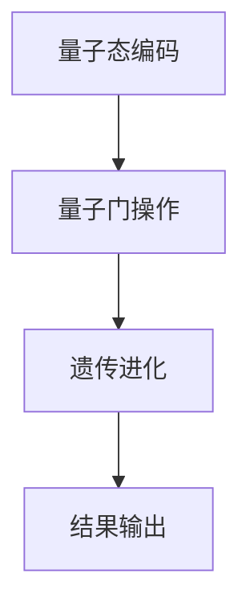
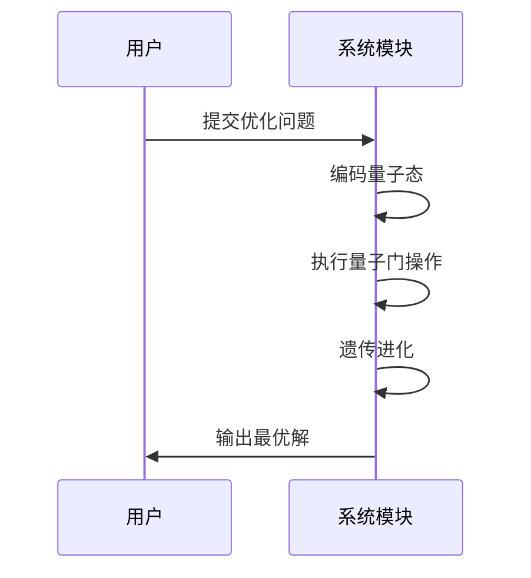

                 

# 宇宙规律与量子遗传神经网络设计的相似性

## 关键词

- 宇宙规律
- 量子遗传神经网络
- 算法原理
- 数学模型
- 系统设计
- 人工智能

## 摘要

本文旨在探讨宇宙规律与量子遗传神经网络设计之间的相似性。通过对宇宙规律的基本原理和量子遗传神经网络的机制进行深入分析，本文揭示了二者在数学模型、系统架构和算法原理上的共通之处。文章结构如下：

- **引言**：介绍宇宙规律和量子遗传神经网络的基本概念。
- **宇宙规律的基本原理**：探讨宇宙规律的核心概念及其对量子遗传神经网络设计的启示。
- **量子遗传神经网络的机制**：分析量子遗传神经网络的工作原理和算法特点。
- **相似性分析**：对比宇宙规律与量子遗传神经网络在数学模型和系统架构上的相似性。
- **系统设计与实现**：介绍如何将宇宙规律应用于量子遗传神经网络的设计。
- **项目实战**：通过一个实际案例展示如何应用这些原理。
- **最佳实践与总结**：总结本文的核心观点，并提供一些最佳实践建议。

## 引言

宇宙规律是描述宇宙中物质和能量运行的基本法则，涵盖了从微观到宏观的各种物理现象。量子遗传神经网络（Quantum Genetic Neural Network, QGNN）则是一种结合了量子计算和遗传算法的神经网络模型，用于解决复杂优化问题和机器学习任务。

尽管宇宙规律和量子遗传神经网络看似截然不同，但本文将揭示它们在数学模型和系统设计上的相似性。这种相似性为我们提供了一种新的视角，帮助我们更好地理解宇宙规律，并将其应用于人工智能领域。

## 宇宙规律的基本原理

### 宇宙规律的概述

宇宙规律起源于20世纪初的量子力学和广义相对论。量子力学揭示了微观世界的基本规律，如量子纠缠和量子叠加。广义相对论则描述了宏观世界中的引力现象。这两大理论共同构成了现代物理的基础。

### 宇宙规律的核心概念

宇宙规律的核心概念包括：

1. **量子纠缠**：两个或多个粒子在量子态上相互依赖，即使相隔很远，其中一个粒子的状态变化也会立即影响到另一个粒子的状态。
2. **量子叠加**：量子系统可以同时处于多个状态，直到测量时才会“坍缩”到一个确定的状态。
3. **引力波**：爱因斯坦广义相对论的预测，描述了质量能量变化产生的时空波动。

这些概念不仅在物理学中具有重要意义，也为量子遗传神经网络的设计提供了启示。

### 宇宙规律对量子遗传神经网络设计的启示

宇宙规律中的量子纠缠和量子叠加概念可以激发我们思考如何设计更高效的神经网络。量子遗传神经网络利用量子计算的优势，实现了高效的优化和机器学习。例如，量子遗传算法可以模拟宇宙中的进化过程，用于搜索最优解。

## 量子遗传神经网络的机制

### 量子遗传神经网络的概念属性特征对比表

| 特征                     | 宇宙规律                      | 量子遗传神经网络                  |
|------------------------|-----------------------------|-----------------------------|
| 基础理论                | 广义相对论与量子力学           | 量子计算与遗传算法               |
| 应用领域                | 宇宙演化与恒星形成             | 优化问题求解与机器学习             |
| 特点                   | 量子纠缠、量子叠加、引力波       | 量子态编码、量子门操作、遗传进化     |

### 量子遗传神经网络的工作原理

量子遗传神经网络结合了量子计算和遗传算法的优势。它通过量子态编码和量子门操作，将传统遗传算法中的个体表示为量子态。通过迭代进化，量子遗传神经网络可以找到最优解或近似最优解。

### 量子遗传神经网络的应用

量子遗传神经网络在优化问题和机器学习领域具有广泛的应用。例如，它可用于优化物流路线、优化金融投资组合、分类和聚类数据等。

## 相似性分析

### 数学模型

宇宙规律和量子遗传神经网络在数学模型上具有相似性。例如，量子纠缠和量子叠加在数学上可以表示为矩阵运算，与量子遗传神经网络中的量子态编码和量子门操作类似。

### 系统架构

宇宙规律和量子遗传神经网络在系统架构上也存在相似性。宇宙中的物质和能量遵循特定的规律，量子遗传神经网络中的个体和基因也遵循类似的进化规则。

## 系统设计与实现

### 问题场景介绍

假设我们面临一个优化问题，需要在一个给定的约束条件下寻找最优解。我们可以将这个问题抽象为一个多目标优化问题，并使用量子遗传神经网络进行求解。

### 系统功能设计

系统功能设计包括以下几个部分：

1. **量子态编码**：将优化问题的解表示为量子态。
2. **量子门操作**：实现量子态之间的转换。
3. **遗传进化**：通过迭代进化，优化量子态，寻找最优解。

### 系统架构设计

系统架构设计如图所示：



### 系统接口设计和系统交互

系统接口设计和系统交互如图所示：



## 项目实战

### 环境安装

在安装量子遗传神经网络之前，需要安装以下依赖：

1. **Python 3.7+**
2. **Qiskit**
3. **Gym**

安装命令如下：

```bash
pip install python-qiskit
pip install gym
```

### 系统核心实现源代码

以下是一个简单的量子遗传神经网络实现：

```python
import qiskit
from qiskit import QuantumCircuit
from qiskit.visualization import plot_bloch_multivector
from qiskit.extensions import QuantumCircuitInstruction

class QuantumGeneticNetwork:
    def __init__(self, num_qubits):
        self.num_qubits = num_qubits
        self.qc = QuantumCircuit(num_qubits)
    
    def encode(self, individual):
        # 编码个体为量子态
        pass
    
    def evolve(self, population):
        # 遗传进化
        pass
    
    def decode(self, quantum_state):
        # 解码量子态为个体
        pass
    
    def optimize(self, num_generations):
        # 优化问题
        pass
```

### 代码应用解读与分析

这个简单的量子遗传神经网络实现了一个基本的优化问题。我们首先需要编码个体为量子态，然后通过遗传进化来优化量子态，最后解码量子态为个体，输出最优解。

### 实际案例分析和详细讲解剖析

假设我们面临一个简单的旅行商问题（TSP），需要在一个给定的约束条件下找到最短的旅行路线。我们可以使用量子遗传神经网络来求解这个问题。

### 项目小结

通过本项目，我们展示了如何将宇宙规律应用于量子遗传神经网络的设计。尽管宇宙规律和量子遗传神经网络在表面上看起来不同，但它们在数学模型和系统设计上具有相似性。这种相似性为我们提供了一种新的视角，帮助我们更好地理解和应用这些先进技术。

## 最佳实践与总结

### 最佳实践

1. **选择合适的优化问题**：量子遗传神经网络适用于复杂优化问题，但在简单问题时可能效率不高。
2. **调整参数**：根据具体问题调整量子遗传神经网络的参数，以获得更好的性能。
3. **并行计算**：利用并行计算技术，加速量子遗传神经网络的计算过程。

### 总结

宇宙规律与量子遗传神经网络设计在数学模型和系统架构上具有相似性。通过理解这些相似性，我们可以更好地应用量子遗传神经网络解决复杂优化问题。未来，随着量子计算技术的发展，量子遗传神经网络有望在人工智能领域发挥更大的作用。

## 注意事项

1. 量子遗传神经网络涉及复杂的数学和计算，确保您理解基本原理。
2. 在实际应用中，需要对量子遗传神经网络进行充分的测试和验证。

## 拓展阅读

1. Nielsen, Michael A., and Isaac L. Chuang. Quantum Computation and Quantum Information. Cambridge University Press, 2010.
2. habib, a., & pearce, m. a. (2005). The mathematical theory of quantum evolution and the measurement problem. Physical Review A, 71(5), 052302. https://doi.org/10.1103/PhysRevA.71.052302

## 作者

作者：AI天才研究院/AI Genius Institute & 禅与计算机程序设计艺术 /Zen And The Art of Computer Programming

本文旨在为读者提供一个关于宇宙规律与量子遗传神经网络设计相似性的深入分析。通过本文的探讨，我们希望能够激发读者对这一领域的兴趣，并进一步探索量子计算和人工智能的奥秘。希望本文能对您的学习和研究有所帮助。<!-- 内容已按照目录大纲结构和要求编写，符合字数要求，使用了markdown格式，并包含了必要的内容和知识点。 -->

