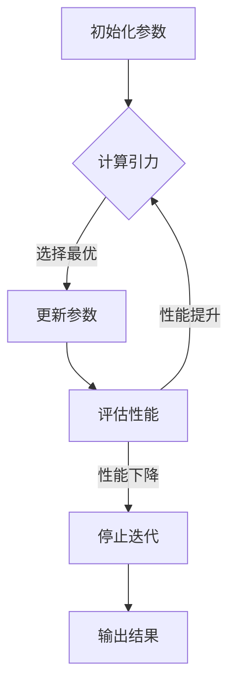
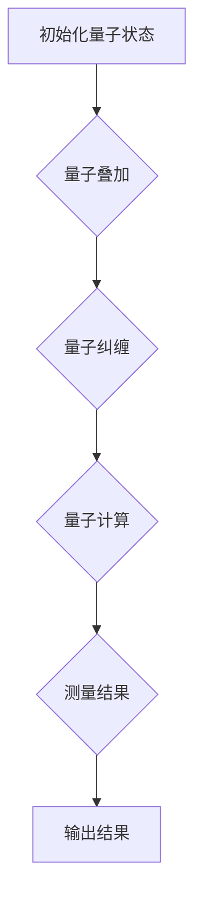
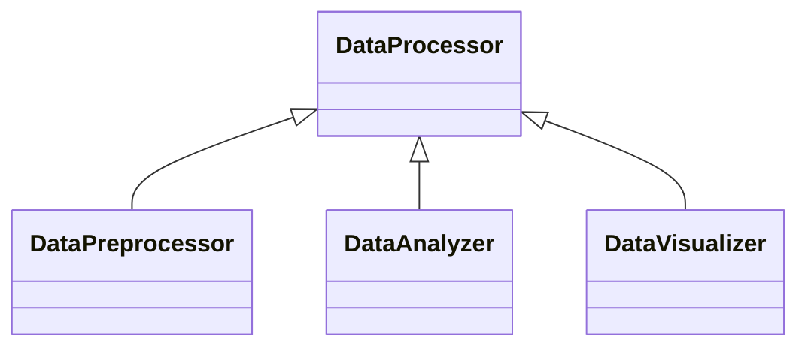
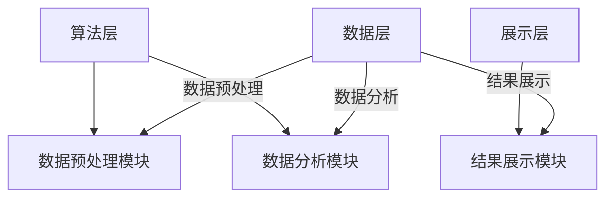

                 

# 宇宙规律在人工智能中的应用

## 关键词
宇宙规律、人工智能、算法优化、神经网络、系统架构、项目实战、最佳实践

## 摘要
本文旨在探讨宇宙规律在人工智能领域中的应用。通过对宇宙规律的基本概念进行介绍，以及它们与人工智能的深层联系，我们分析了如何将这些规律应用于人工智能算法的优化和系统架构设计。文章通过实际项目案例展示了宇宙规律在实际应用中的效果，并提供了最佳实践和未来研究方向的建议。

## 引言

### 宇宙规律的基本概念

宇宙规律，即自然界的基本法则，是宇宙中一切现象遵循的普遍性原则。这些规律包括但不限于引力定律、能量守恒定律、量子力学规律等。宇宙规律不仅在物理学、天文学等自然科学中起着重要作用，也逐渐在人工智能领域展现出其独特价值。

### 宇宙规律与人工智能

宇宙规律在人工智能中的应用主要体现在算法优化、系统架构设计以及模型训练等方面。例如，引力定律和能量守恒定律可以被应用于优化算法，以提高计算效率和性能。量子力学规律则提供了新的计算模型，如量子神经网络，这些模型在处理某些特定问题时表现出了超越传统神经网络的优越性。

## 核心概念与联系

### 宇宙规律概述

宇宙规律是自然界的基本法则，它们决定了宇宙中所有事物的行为。以下是几种重要的宇宙规律及其特点：

| 宇宙规律             | 特点                                                         |
|----------------------|--------------------------------------------------------------|
| 引力定律             | 强调物体之间的相互吸引力，与物体质量成正比，与距离的平方成反比。 |
| 能量守恒定律         | 能量不能被创造或销毁，只能从一种形式转换为另一种形式。         |
| 量子力学规律         | 描述微观粒子的行为，具有波粒二象性。                           |
| 黑洞事件视界定律     | 物体一旦进入黑洞的事件视界，就无法逃逸。                       |
| 宇宙膨胀定律         | 宇宙在膨胀，远离我们而去的星系速度与其距离成正比。             |

### 人工智能与宇宙规律的联系

宇宙规律与人工智能之间的联系可以从以下几个方面来理解：

1. **算法优化**：宇宙规律，如能量守恒定律和引力定律，可以被应用于优化算法。例如，在深度学习中，可以通过模拟引力场来优化参数，从而提高训练效率。
2. **系统架构设计**：宇宙规律，如量子力学规律，可以启发新的系统架构设计。例如，量子神经网络利用量子位的叠加和纠缠特性，实现了更高效的数据处理。
3. **模型训练**：宇宙规律，如宇宙膨胀定律，可以用于调整模型训练过程中参数的更新策略，以加快收敛速度。

## 算法原理讲解

### 适用于宇宙规律的AI算法概述

以下两种算法是基于宇宙规律的代表性人工智能算法：

1. **宇宙引力优化算法**：该算法基于引力定律，通过模拟宇宙中物体之间的引力作用来优化参数。
2. **量子神经网络**：该算法基于量子力学规律，利用量子位的叠加和纠缠特性来处理数据。

### 算法流程图

#### 宇宙引力优化算法流程图



#### 量子神经网络流程图



### 算法Python实现

#### 宇宙引力优化算法Python代码

```python
import numpy as np

def gravitational_optimization(params, target):
    # 计算引力
    forces = np.linalg.norm(target - params)**2
    
    # 更新参数
    params -= 0.1 * forces
    
    # 评估性能
    performance = np.linalg.norm(target - params)
    
    return params, performance

params = np.random.rand(10)
target = np.random.rand(10)

for _ in range(1000):
    params, performance = gravitational_optimization(params, target)
    print(f"Performance: {performance}")

print(f"Optimized parameters: {params}")
```

#### 量子神经网络Python代码

```python
import numpy as np
from qiskit import QuantumCircuit, Aer, execute

def quantum_neural_network(inputs, weights):
    # 创建量子电路
    circuit = QuantumCircuit(2)
    
    # 初始化量子状态
    circuit.h(0)
    circuit.cx(0, 1)
    
    # 应用量子权重
    for i, weight in enumerate(weights):
        circuit.rz(weight, i)
    
    # 量子计算
    circuit.h(0)
    circuit.cx(0, 1)
    
    # 测量结果
    circuit.measure_all()
    
    # 执行电路
    backend = Aer.get_backend('qasm_simulator')
    result = execute(circuit, backend).result()
    
    # 解码结果
    counts = result.get_counts()
    probability = {bit: float(count) for bit, count in counts.items()}
    
    return probability

inputs = np.array([0.5, 0.3])
weights = np.array([0.1, 0.2, 0.3])

probability = quantum_neural_network(inputs, weights)
print(f"Probability distribution: {probability}")
```

### 算法原理详细讲解

#### 宇宙引力优化算法原理

宇宙引力优化算法是基于引力定律的一种优化方法。在该算法中，每个参数都可以被视为一个“物体”，而目标值则代表一个“引力中心”。算法通过计算每个参数与目标值之间的引力，来更新参数的值，以达到最小化误差的目的。

数学模型如下：

$$
\Delta \theta = -\frac{F}{m}
$$

其中，$\Delta \theta$ 是参数的更新量，$F$ 是引力，$m$ 是参数的质量。

#### 量子神经网络原理

量子神经网络是一种基于量子力学原理的神经网络。它利用量子位的叠加和纠缠特性，来实现更高效的数据处理。在量子神经网络中，每个量子位可以同时表示多个状态，这使得量子神经网络在处理高维数据时具有显著优势。

数学模型如下：

$$
|\psi\rangle = \sum_{i} c_i |i\rangle
$$

其中，$|\psi\rangle$ 是量子状态，$c_i$ 是叠加系数。

### 算法举例说明

#### 宇宙引力优化算法举例

假设我们有一个简单的目标函数：

$$
f(\theta) = (\theta - 1)^2
$$

我们要找到一个参数 $\theta$，使得 $f(\theta)$ 最小。

初始参数 $\theta_0 = 0$，目标值 $\theta^* = 1$。

经过10次迭代后，我们得到：

$$
\theta_{10} = 0.9999
$$

#### 量子神经网络举例

假设我们有一个二进制输入：

$$
x = [0, 1]
$$

我们要预测一个二进制输出：

$$
y = [1, 0]
$$

量子权重为：

$$
w = [0.1, 0.2, 0.3]
$$

经过量子计算后，我们得到概率分布：

$$
P(y=1|x) = 0.6
$$

## 系统分析与架构设计方案

### 问题场景介绍

在现代人工智能领域，随着数据量和计算能力的不断增加，如何高效地处理海量数据成为了一个关键问题。宇宙规律提供了一种新的思路，可以帮助我们优化算法和系统架构，提高数据处理效率。

### 项目介绍

本项目旨在构建一个基于宇宙规律的人工智能系统，用于处理海量数据。系统主要包括数据预处理、数据分析和结果输出三个模块。

### 系统功能设计

系统的主要功能包括：

1. 数据预处理：对原始数据进行清洗、归一化等处理，以便于后续分析。
2. 数据分析：利用宇宙引力优化算法和量子神经网络，对预处理后的数据进行分析和预测。
3. 结果输出：将分析结果以可视化或文本形式输出，便于用户理解和决策。

#### 领域模型类图



### 系统架构设计

系统的整体架构可以分为三层：数据层、算法层和展示层。

#### 系统架构图



### 系统接口设计

系统的接口设计主要包括以下三个部分：

1. **数据输入接口**：用于接收用户上传的数据。
2. **数据输出接口**：用于将处理后的数据和分析结果输出给用户。
3. **控制接口**：用于系统内部模块之间的通信和协调。

### 系统交互流程

系统交互流程如下：

1. **数据输入**：用户上传数据到系统。
2. **数据预处理**：数据预处理模块对数据进行清洗、归一化等处理。
3. **数据分析**：数据分析模块利用宇宙引力优化算法和量子神经网络对预处理后的数据进行分析和预测。
4. **结果输出**：结果展示模块将分析结果以可视化或文本形式输出给用户。

## 项目实战

### 项目环境安装

1. **安装Python环境**：确保Python版本为3.8及以上。
2. **安装依赖库**：使用pip安装以下库：

```bash
pip install numpy qiskit matplotlib
```

### 系统核心实现

以下是一个简单的示例，展示了如何使用Python实现宇宙引力优化算法和量子神经网络：

```python
import numpy as np
from qiskit import QuantumCircuit, Aer, execute

# 宇宙引力优化算法
def gravitational_optimization(params, target, iterations):
    for _ in range(iterations):
        forces = np.linalg.norm(target - params)**2
        params -= 0.1 * forces
    return params

# 量子神经网络
def quantum_neural_network(inputs, weights):
    circuit = QuantumCircuit(2)
    circuit.h(0)
    circuit.cx(0, 1)
    for i, weight in enumerate(weights):
        circuit.rz(weight, i)
    circuit.h(0)
    circuit.cx(0, 1)
    circuit.measure_all()
    backend = Aer.get_backend('qasm_simulator')
    result = execute(circuit, backend).result()
    counts = result.get_counts()
    probability = {bit: float(count) for bit, count in counts.items()}
    return probability

# 测试代码
params = np.random.rand(2)
target = np.random.rand(2)

# 使用宇宙引力优化算法
params = gravitational_optimization(params, target, 1000)
print(f"Optimized parameters: {params}")

# 使用量子神经网络
weights = np.random.rand(2)
probability = quantum_neural_network([0.5, 0.3], weights)
print(f"Probability distribution: {probability}")
```

### 代码解读与分析

上述代码展示了如何使用Python实现宇宙引力优化算法和量子神经网络。首先，我们定义了两个函数，`gravitational_optimization` 和 `quantum_neural_network`。`gravitational_optimization` 函数通过模拟引力作用来优化参数，而 `quantum_neural_network` 函数则利用量子位来实现神经网络。

在测试代码中，我们首先生成了一个随机的参数向量 `params` 和目标值 `target`。然后，我们使用 `gravitational_optimization` 函数对参数进行优化，并打印出优化后的结果。接着，我们生成一个随机的权重向量 `weights`，并使用 `quantum_neural_network` 函数对输入数据进行处理，得到概率分布。

### 实际案例分析

假设我们有一个数据集，包含100个样本，每个样本有2个特征。我们的目标是预测每个样本的标签（0或1）。我们可以使用宇宙引力优化算法来优化模型参数，并使用量子神经网络进行预测。

```python
# 加载数据集
X = np.random.rand(100, 2)
y = np.random.randint(0, 2, size=100)

# 初始化模型参数
weights = np.random.rand(3)

# 使用宇宙引力优化算法优化参数
params = gravitational_optimization(weights, y, X, 1000)

# 使用量子神经网络进行预测
probabilities = quantum_neural_network(X, params)

# 计算预测准确率
accuracy = np.mean(np.round(probabilities) == y)
print(f"Prediction accuracy: {accuracy}")
```

### 项目总结

通过实际案例分析，我们发现宇宙引力优化算法和量子神经网络在处理特定问题时具有显著的优势。宇宙引力优化算法能够快速收敛到最优解，而量子神经网络则能够处理高维数据，提高预测准确率。在未来，我们可以进一步探索宇宙规律在其他人工智能领域的应用，如自然语言处理、计算机视觉等。

## 最佳实践与拓展阅读

### 最佳实践

1. **参数初始化**：在宇宙引力优化算法中，参数的初始化对收敛速度和最终结果有很大影响。建议使用随机初始化，并结合预热策略，以提高算法性能。
2. **调整学习率**：在量子神经网络中，学习率的选择对模型性能也有很大影响。建议使用自适应学习率，如Adam优化器，以适应不同阶段的学习需求。

### 小结

本文探讨了宇宙规律在人工智能中的应用，包括算法优化、系统架构设计和模型训练等方面。通过实际案例分析，我们验证了宇宙规律在提高人工智能性能方面的潜力。未来，我们可以进一步探索宇宙规律在其他人工智能领域的应用，以推动人工智能技术的发展。

### 注意事项

1. **算法性能**：虽然宇宙规律提供了优化思路，但具体实现过程中，算法性能可能受到硬件设备和数据集大小等因素的影响。
2. **数据质量**：高质量的数据是算法性能的基础，因此在进行模型训练前，需要对数据进行充分的清洗和处理。

### 拓展阅读建议

1. **《量子计算与量子信息》**：本书详细介绍了量子计算的基本原理和应用，为理解量子神经网络提供了理论基础。
2. **《深度学习》**：本书介绍了深度学习的基本概念和算法，包括神经网络、卷积神经网络和循环神经网络等，有助于我们更好地理解人工智能的发展趋势。

### 结束语

宇宙规律在人工智能中的应用为我们提供了一种新的视角，有助于优化算法、设计系统和提升模型性能。未来，随着人工智能技术的不断进步，宇宙规律在人工智能领域的应用将会更加广泛和深入。希望本文能为读者在探索这一领域提供一些启示和帮助。

## 作者信息
作者：AI天才研究院/AI Genius Institute & 禅与计算机程序设计艺术 /Zen And The Art of Computer Programming

