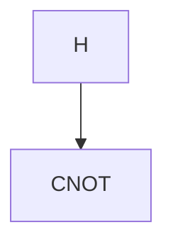
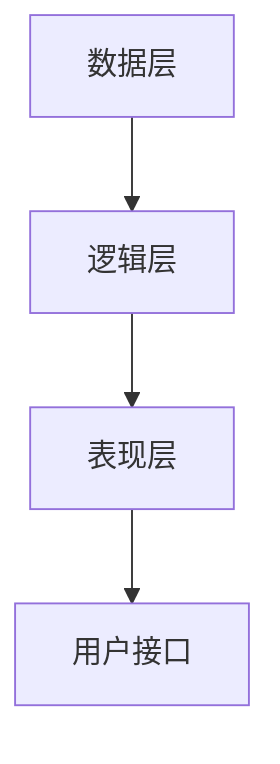

                 


## 宇宙规律对可解释量子机器学习的启示

### 摘要

随着量子计算机技术的发展，量子机器学习逐渐成为计算机科学领域的热门话题。然而，量子机器学习的可解释性问题依然是一个挑战。本文将探讨宇宙规律，尤其是量子力学的基本原理，对可解释量子机器学习的研究启示。通过分析量子位、量子门和量子算法等核心概念，结合可解释性评估方法和可视化技术，本文旨在构建一种新的量子机器学习模型，提高其可解释性和透明度，为量子计算在人工智能领域的广泛应用奠定基础。

### 目录大纲

1. 第一部分：背景介绍
   1.1 问题背景与核心概念
   1.2 量子机器学习
   1.3 可解释量子机器学习
   1.4 边界与外延

2. 第二部分：核心概念与联系
   2.1 核心概念
   2.2 概念属性特征对比表格
   2.3 ER实体关系图架构

3. 第三部分：算法原理讲解
   3.1 量子计算机原理与算法
   3.2 可解释量子机器学习算法原理

4. 第四部分：系统分析与架构设计方案
   4.1 问题场景介绍
   4.2 系统功能设计
   4.3 系统架构设计
   4.4 系统接口设计和系统交互

5. 第五部分：项目实战
   5.1 环境安装
   5.2 系统核心实现源代码
   5.3 代码应用解读与分析
   5.4 实际案例分析和详细讲解剖析
   5.5 项目小结

6. 第六部分：最佳实践 tips、小结、注意事项、拓展阅读

---

### 1. 第一部分：背景介绍

#### 1.1 问题背景与核心概念

**1.1.1 问题背景**

量子计算机的出现，为传统计算机科学带来了新的机遇和挑战。量子计算机利用量子力学的原理，如量子叠加和量子纠缠，能够实现高效的计算。随着量子计算机的发展，量子机器学习应运而生。量子机器学习旨在利用量子计算机的优势，解决经典计算机难以处理的问题。

然而，量子机器学习面临一个严峻的挑战：可解释性问题。与经典机器学习相比，量子机器学习的计算过程更加复杂，难以直观地理解其工作原理。这导致用户难以信任和接受量子机器学习算法，限制了其在实际应用中的推广。

**1.1.2 核心概念**

为了解决可解释性问题，我们需要了解量子计算机的核心概念。量子计算机的基本单位是量子位（qubit），它与经典计算机中的比特（bit）不同。量子位可以同时处于0和1的状态，这就是量子叠加。此外，量子位之间可以发生量子纠缠，这使得量子计算机能够进行更高效的计算。

量子门是量子计算机中的操作单位，类似于经典计算机中的逻辑门。量子门可以对量子位进行变换，实现特定的计算功能。量子算法则是利用量子计算机进行问题求解的一系列操作，如量子支持向量机、量子神经网络和量子遗传算法等。

#### 1.2 量子机器学习

量子机器学习是一种利用量子计算机进行机器学习的过程和方法。它通过将传统机器学习算法映射到量子计算机上，利用量子计算机的并行计算能力，实现更高效的计算。

**1.2.1 量子支持向量机（QSVM）**

量子支持向量机是量子机器学习中最常用的算法之一。它利用量子计算机的优势，实现了支持向量机的高效求解。量子支持向量机通过量子算法，能够在更短的时间内找到最优分类面。

**1.2.2 量子神经网络（QNN）**

量子神经网络是一种基于量子计算机的神经网络模型。它通过量子位的叠加和纠缠，实现了对输入数据的复杂变换和处理。量子神经网络在图像识别、语音识别等领域具有显著优势。

**1.2.3 量子遗传算法（QGA）**

量子遗传算法是一种基于量子计算机的遗传算法。它利用量子计算机的优势，实现了遗传算法的加速。量子遗传算法在优化问题和组合优化问题中表现出色。

#### 1.3 可解释量子机器学习

可解释量子机器学习旨在提高量子机器学习算法的可解释性和透明度，使用户能够理解其工作原理。为了实现这一目标，我们需要研究可解释性评估方法和可视化技术。

**1.3.1 可解释性评估方法**

可解释性评估方法包括模型解释、特征解释和结果解释等。模型解释旨在解释量子机器学习模型的工作原理；特征解释旨在解释模型对特定特征的依赖程度；结果解释旨在解释模型对输入数据的处理过程。

**1.3.2 可解释量子机器学习的可视化技术**

可视化技术可以将量子机器学习模型的计算过程和结果以图形化的形式展示出来，使得用户能够直观地理解模型的工作原理。常用的可视化技术包括量子态可视化、量子线路可视化和量子计算结果可视化等。

#### 1.4 边界与外延

量子机器学习和可解释量子机器学习的研究不仅局限于理论探讨，还涉及到实际应用。在金融、医疗、人工智能等领域，量子计算机和量子机器学习具有广泛的应用前景。同时，量子机器学习和可解释量子机器学习的研究也为量子计算机的发展提供了新的思路和方向。

### 1.2 量子计算机的基本原理

量子计算机是利用量子力学的原理进行信息处理的计算设备。与经典计算机不同，量子计算机的基本单位是量子位（qubit），而不是比特（bit）。量子位可以同时处于0和1的状态，这就是量子叠加原理。此外，量子位之间可以发生量子纠缠，使得量子计算机能够进行更高效的计算。

**1.2.1 量子位的叠加态**

量子位的最基本状态是基态，即0或1。然而，量子位可以处于叠加态，这意味着它同时处于0和1的状态。可以用一个数学公式来表示量子位的叠加态：

$$
\begin{aligned}
|\psi\rangle &= \alpha|0\rangle + \beta|1\rangle \\
\text{其中，}\alpha &\text{和}\beta\text{是复数系数，满足}|\alpha|^2 + |\beta|^2 = 1
\end{aligned}
$$

这个公式表示，量子位可以以某种概率同时处于0和1的状态。

**1.2.2 量子位的量子态演化**

量子位的量子态可以通过量子门进行变换。量子门是量子计算机中的操作单位，类似于经典计算机中的逻辑门。量子门可以按照特定的规则对量子位进行变换，从而实现特定的计算功能。

一个常见的量子门是Hadamard门（H门），它可以将量子位从基态叠加到一个等概率的叠加态。H门的作用可以用以下公式表示：

$$
H = \frac{1}{\sqrt{2}}\begin{bmatrix}
1 & 1 \\
1 & -1
\end{bmatrix}
$$

当量子位处于基态$|0\rangle$时，经过H门的作用后，会变为叠加态：

$$
H|0\rangle = \frac{1}{\sqrt{2}}(|0\rangle + |1\rangle)
$$

**1.2.3 量子计算机的量子线路**

量子计算机的计算过程是通过量子线路（quantum circuit）来实现的。量子线路由一系列的量子门和量子位的连接组成，它描述了量子位之间的变换关系。

一个简单的量子线路可能包括一个量子位和两个量子门。例如，先对量子位进行H门作用，然后进行CNOT门作用。这个量子线路的示意图如下：



其中，A表示H门，B表示CNOT门。这个量子线路的作用是将一个量子位的基态$|0\rangle$变换为叠加态，并通过CNOT门实现两个量子位之间的纠缠。

**1.2.4 量子计算机的测量**

在量子计算机中，测量是一个重要的过程。测量会破坏量子位的叠加态，使得量子位坍缩到某个确定的状态。在量子计算机中，测量通常用于获取计算结果。

一个常见的测量过程是对量子位进行部分测量。例如，对量子位进行一次测量，得到的结果可能是0或1。如果量子位处于叠加态，那么测量的结果将具有随机性。

测量过程中，量子位的状态会从叠加态坍缩到某个确定的状态。如果量子位处于叠加态$|\psi\rangle$，那么测量的概率分布可以用波函数的模平方来表示：

$$
P(\text{测量结果为0}) = |\langle 0|\psi\rangle|^2
$$

$$
P(\text{测量结果为1}) = |\langle 1|\psi\rangle|^2
$$

**1.2.5 量子计算机的优势与挑战**

量子计算机具有许多潜在的优势，例如：

- 高效的量子并行计算：量子计算机可以利用量子叠加和量子纠缠，实现高效的并行计算。
- 量子搜索算法：量子计算机可以显著加速某些特定类型的搜索问题。
- 量子模拟：量子计算机可以用于模拟量子系统，为科学研究提供强大的工具。

然而，量子计算机也面临许多挑战，例如：

- 量子态的稳定性：量子位的叠加态容易受到外部干扰，导致量子计算错误。
- 量子错误纠正：量子计算中的错误纠正是一个复杂的问题，需要开发有效的量子错误纠正算法。
- 可解释性问题：量子计算机的计算过程复杂，难以直观地理解其工作原理。

这些挑战需要通过进一步的研究和探索来解决，使得量子计算机能够真正发挥其潜力。

### 1.3 可解释量子机器学习的研究现状

**1.3.1 研究进展**

近年来，可解释量子机器学习领域取得了一系列重要的研究成果。首先，研究者们提出了多种评估量子机器学习模型可解释性的方法。例如，一些研究通过分析量子线路和量子态的变换关系，来评估量子机器学习模型的解释性。这些方法包括量子线路可视化、量子态可视化和量子计算结果可视化等。

其次，研究者们还探索了可解释量子机器学习的可视化技术。通过可视化技术，用户可以直观地理解量子机器学习模型的计算过程和结果。例如，一些研究提出了基于图像处理和计算机视觉的量子态可视化方法，使得用户能够直观地观察到量子位的状态变换。

此外，还有一些研究致力于开发可解释量子机器学习的算法。例如，一些研究者提出了基于量子遗传算法的可解释量子机器学习模型，通过优化量子线路的结构，提高模型的可解释性。

**1.3.2 面临的主要问题与挑战**

尽管可解释量子机器学习领域取得了一定的进展，但仍然面临许多问题和挑战。首先，量子计算机的计算过程复杂，难以直观地理解其工作原理。这使得用户难以信任和接受量子机器学习算法，限制了其在实际应用中的推广。

其次，当前的可解释量子机器学习评估方法和技术还不够成熟。虽然一些方法能够在一定程度上提高量子机器学习模型的可解释性，但仍然存在许多局限性。例如，一些方法只能对特定类型的量子机器学习模型进行评估，无法满足多样化的需求。

此外，量子机器学习模型的可解释性与性能之间存在着权衡。一些可解释性较强的量子机器学习模型可能在性能上不如不可解释的量子机器学习模型。因此，如何平衡可解释性与性能，是一个亟待解决的问题。

**1.3.3 未来研究方向**

为了解决这些问题和挑战，未来的研究可以从以下几个方面展开：

1. 开发更有效的量子机器学习评估方法和技术。研究者可以探索新的量子计算可视化技术，使得用户能够更加直观地理解量子机器学习模型的计算过程和结果。

2. 提高量子机器学习模型的可解释性。研究者可以探索新的量子机器学习算法，使得模型在保持高效计算的同时，具有较高的可解释性。

3. 探索量子机器学习在特定领域的应用。研究者可以结合实际应用场景，开发针对特定问题的量子机器学习模型，并评估其可解释性。

4. 加强量子计算机的研究与开发。研究者可以致力于解决量子计算机的稳定性、量子错误纠正等问题，为可解释量子机器学习的研究提供更强大的硬件支持。

通过这些研究方向的探索，可解释量子机器学习领域有望取得更大的突破，为量子计算在人工智能领域的广泛应用奠定基础。

### 1.4 量子机器学习的研究领域

量子机器学习作为一种新兴的研究领域，涵盖了多个交叉学科，为计算机科学、量子物理学和其他相关领域提供了丰富的研究机会。以下是量子机器学习研究领域的一些主要方向和跨学科融合：

**1.4.1 量子机器学习与经典机器学习的交叉领域**

量子机器学习与经典机器学习之间存在显著的差异和互补性。经典机器学习算法在处理大规模数据和高维问题时存在一定的局限，而量子机器学习利用量子计算机的优势，能够在某些情况下显著提高计算效率。例如，量子支持向量机和量子神经网络在处理大规模数据集时表现出优越的性能。同时，量子机器学习算法也为经典机器学习算法提供了新的启发，例如通过量子近似优化算法（QAOA）来改进传统优化算法。

**1.4.2 量子机器学习与其他学科的融合**

量子机器学习不仅与经典机器学习密切相关，还与其他学科如量子物理学、密码学和生物学等有着广泛的交叉应用。

- **量子物理学**：量子机器学习的研究离不开对量子力学的深入理解。量子物理学的原理，如量子叠加和量子纠缠，是量子计算机和量子机器学习的基础。此外，量子机器学习的研究也可以为量子物理学的实验和理论提供新的视角。

- **密码学**：量子计算机的出现可能对传统密码学构成威胁，因为量子计算机能够破解一些经典加密算法。然而，量子机器学习也为密码学带来了新的机会，例如开发量子密码系统和量子密钥分发。量子机器学习可以用于优化量子密码算法的设计，提高其安全性和效率。

- **生物学**：量子机器学习在生物学领域也展现了巨大的潜力。例如，量子机器学习可以用于基因序列分析、蛋白质结构预测和药物设计。这些领域的数据复杂性和计算需求极高，量子计算机的并行计算能力可以显著加速这些生物计算任务。

**1.4.3 跨学科研究的挑战与机遇**

量子机器学习的跨学科研究面临着一系列挑战和机遇：

- **理论挑战**：量子机器学习需要结合量子物理学和计算机科学的理论，这要求研究者具备跨学科的知识背景。同时，量子机器学习算法的设计和优化也需要深入理解量子力学的原理。

- **计算资源**：量子计算机的可用性和性能限制了量子机器学习的实际应用。开发高效的量子算法和实现量子计算机的稳定性是当前研究的重要方向。

- **实际应用**：量子机器学习在实际应用中的成功依赖于对特定领域问题的理解和解决。这要求研究者不仅具备理论素养，还需要具备实际应用场景的经验。

然而，这些挑战也带来了丰富的机遇。跨学科的研究可以推动量子计算机和量子机器学习技术的进步，为解决经典计算机难以处理的问题提供新的途径。通过跨学科的合作，研究者们可以共同探索量子机器学习在不同领域的应用，推动科技进步和社会发展。

### 1.5 可解释量子机器学习的应用场景

可解释量子机器学习在多个领域展现了其独特的应用潜力，为解决传统机器学习和人工智能技术面临的挑战提供了新的思路。以下是可解释量子机器学习在金融、医疗、人工智能等领域的具体应用场景：

**1.5.1 金融领域**

在金融领域，可解释量子机器学习可以用于风险管理、市场预测和算法交易等方面。传统的金融模型在处理海量数据和高维度问题时存在一定局限性，而量子机器学习能够通过并行计算和高效算法提高预测精度。例如，量子机器学习可以用于股票市场预测，通过分析历史交易数据和新闻文本，预测股票价格的走势。可解释性在这里尤为重要，因为它可以帮助金融分析师理解预测结果背后的逻辑，从而做出更为明智的投资决策。

- **风险管理**：量子机器学习可以帮助金融机构识别潜在风险，提高风险管理的效率和准确性。通过分析交易数据和客户行为，量子算法可以预测市场波动和潜在的金融危机，从而提前采取应对措施。
- **市场预测**：利用量子机器学习模型进行市场预测，可以显著提高预测的准确性和实时性。这些模型能够处理大规模、多维度的市场数据，从而提供更加精细和准确的预测结果。
- **算法交易**：量子算法可以用于开发高效的投资策略，通过快速分析和决策，实现自动化交易。可解释量子机器学习可以帮助交易员理解这些策略的运作原理，从而优化交易策略和风险管理。

**1.5.2 医疗领域**

在医疗领域，可解释量子机器学习有助于提升疾病诊断、个性化治疗和药物研发的效率。量子机器学习算法能够处理复杂的生物医学数据，如基因组序列、影像数据和电子病历，从而提供更为准确的诊断和治疗方案。

- **疾病诊断**：量子机器学习可以用于癌症等疾病的早期诊断，通过分析基因序列、影像数据和生物标志物，提高诊断的准确性和敏感性。可解释性在这里至关重要，因为它可以帮助医生理解诊断结果的来源和依据，从而增强诊断的可信度。
- **个性化治疗**：量子机器学习可以用于个性化医疗，根据患者的具体情况制定个性化的治疗方案。通过分析患者的基因、病史和生活习惯，量子算法可以预测治疗效果，优化治疗方案，提高治疗的成功率。
- **药物研发**：量子机器学习可以帮助加速药物研发过程，通过快速筛选和优化药物候选分子，提高新药的成功率。可解释性在这里有助于药物研发人员理解候选分子的作用机制和药效，从而优化药物设计和开发策略。

**1.5.3 人工智能领域**

在人工智能领域，可解释量子机器学习有助于提高模型的可信度和透明度，从而推动人工智能技术的广泛应用。量子机器学习算法可以用于图像识别、自然语言处理和智能决策系统等方面，通过增强模型的可解释性，提高用户对人工智能系统的信任度。

- **图像识别**：量子机器学习可以用于图像识别任务，如人脸识别、物体检测和图像分类。通过分析图像的量子特征，量子算法可以提供更精确的识别结果。可解释性在这里有助于用户理解图像识别的过程和依据，从而提高系统的透明度和可靠性。
- **自然语言处理**：量子机器学习可以用于自然语言处理任务，如文本分类、情感分析和机器翻译。通过分析文本的量子特征，量子算法可以提供更精准的语义理解。可解释性在这里有助于用户理解文本处理的逻辑和算法原理，从而增强系统的可信度。
- **智能决策系统**：量子机器学习可以用于智能决策系统，如自动驾驶、智能客服和金融风控。通过分析海量数据，量子算法可以提供高效的决策支持。可解释性在这里有助于用户理解决策过程和结果，从而提高系统的透明度和用户满意度。

通过在金融、医疗、人工智能等领域的应用，可解释量子机器学习不仅能够提高计算效率和准确性，还能够增强模型的可信度和透明度，从而推动量子计算和人工智能技术的深度融合，为解决现实世界中的复杂问题提供新的解决方案。

### 2. 核心概念与联系

在深入探讨可解释量子机器学习之前，我们需要了解量子计算机的核心概念。量子计算机是一种基于量子力学原理的计算机，与传统计算机相比，它具有并行计算、量子叠加和量子纠缠等独特特性。以下是量子计算机、量子机器学习和可解释量子机器学习的关键概念及其相互关系。

#### 2.1 量子计算机

**量子位（qubit）**：量子计算机的基本单位是量子位，与经典计算机中的比特不同，量子位可以处于0和1的叠加状态。这种叠加状态使得量子计算机能够同时处理大量信息。

**量子门（quantum gate）**：量子门是量子计算机中的基本操作单元，类似于经典计算机中的逻辑门。量子门可以对量子位进行特定的线性变换，从而实现特定的计算功能。

**量子线路（quantum circuit）**：量子线路是量子计算机中的计算过程，由一系列量子门和量子位的连接组成。量子线路描述了量子位之间的变换关系，实现了量子计算机的计算任务。

**量子态（quantum state）**：量子态是量子位的状态，可以用波函数来描述。量子态可以通过量子门的作用进行变换，从而实现量子计算机的计算。

**量子测量（quantum measurement）**：量子测量是量子计算机中获取计算结果的过程。测量会破坏量子位的叠加态，使得量子位坍缩到某个确定的状态。

#### 2.2 量子机器学习

**量子支持向量机（QSVM）**：量子支持向量机是一种基于量子计算机的支持向量机算法，利用量子计算机的并行计算能力，实现高效的支持向量机分类和回归任务。

**量子神经网络（QNN）**：量子神经网络是一种基于量子计算机的神经网络模型，通过量子位的叠加和纠缠，实现输入数据的复杂变换和处理。

**量子遗传算法（QGA）**：量子遗传算法是一种基于量子计算机的遗传算法，利用量子计算机的优势，实现遗传算法的加速，用于优化问题和组合优化问题。

#### 2.3 可解释量子机器学习

**可解释性评估方法**：可解释量子机器学习需要评估量子机器学习模型的可解释性，包括模型解释、特征解释和结果解释等。这些方法旨在提供关于量子机器学习模型决策过程和依据的透明度。

**可视化技术**：可视化技术是提高量子机器学习模型可解释性的重要手段，通过将量子计算机的计算过程和结果以图形化的形式展示出来，使得用户能够直观地理解模型的工作原理。

**量子态可视化**：量子态可视化是将量子位的量子态以图形化的形式展示，帮助用户理解量子位的状态变换和叠加。

**量子线路可视化**：量子线路可视化是将量子计算机的计算过程以图形化的形式展示，帮助用户理解量子线路中量子门的作用和连接关系。

**量子计算结果可视化**：量子计算结果可视化是将量子计算机的计算结果以图形化的形式展示，帮助用户理解量子计算的结果和依据。

#### 2.4 概念属性特征对比表格

以下是一个概念属性特征对比表格，展示了量子计算机、量子机器学习和可解释量子机器学习的主要特征：

| 概念         | 定义                                                         | 关联概念                      | 关联关系                      |
| ------------ | ------------------------------------------------------------ | ---------------------------- | ---------------------------- |
| 量子计算机   | 基于量子力学原理的计算机系统                                 | 量子位、量子门、量子线路     | 基础组成部分和操作手段       |
| 量子机器学习 | 利用量子计算机进行机器学习的过程和方法                       | 量子支持向量机、量子神经网络、量子遗传算法 | 实现量子加速的机器学习方法   |
| 可解释量子机器学习 | 结合量子机器学习的可解释性，使量子机器学习过程更加透明和可理解 | 可解释性评估方法、可视化技术 | 提高量子机器学习应用的可信度 |

#### 2.5 ER实体关系图架构

以下是量子计算机、量子机器学习和可解释量子机器学习的ER实体关系图架构：

```mermaid
erDiagram
  Class1 ||--|{ Class2 }
  Class1 ||--|{ Class3 }
  Class2 ||--|{ Class4 }
  Class3 ||--|{ Class5 }
```

其中，Class1代表量子计算机，Class2代表量子位，Class3代表量子门，Class4代表量子线路，Class5代表量子态。这些实体之间通过相应的关联关系进行连接，形成了量子计算机的整体架构。

### 3. 量子计算机原理与算法

量子计算机是一种基于量子力学原理的新型计算设备，它通过量子位的叠加和纠缠实现高效的信息处理。理解量子计算机的基本原理和算法是实现可解释量子机器学习的关键。以下是对量子计算机原理和算法的详细介绍。

#### 3.1 量子计算机的基本原理

量子计算机的核心是量子位（qubit）。与经典计算机中的比特不同，量子位可以同时处于0和1的状态，这种性质被称为量子叠加。量子叠加使得量子计算机能够同时处理大量信息。

量子计算机中的另一个关键概念是量子纠缠。量子纠缠是指两个或多个量子位之间的特殊关联，即使它们相隔很远，一个量子位的测量结果也会影响另一个量子位的状态。这种关联使得量子计算机能够实现比经典计算机更高效的计算。

量子计算机的工作原理基于量子门（quantum gate）。量子门是类似于经典逻辑门的操作单元，它对量子位进行特定的线性变换。通过组合不同的量子门，可以构建量子线路（quantum circuit），实现特定的计算任务。

#### 3.2 量子计算机的基本算法

量子计算机的基本算法包括量子态初始化、量子变换、量子测量和量子纠错等。

**量子态初始化**：量子态初始化是将量子位的状态设置为我们希望的状态。例如，将量子位初始化为叠加态或特定的基态。

**量子变换**：量子变换是通过量子门对量子位进行操作，实现特定的计算功能。量子变换可以包括量子位的旋转、叠加和纠缠等操作。

**量子测量**：量子测量是获取计算结果的过程。测量会破坏量子位的叠加态，使得量子位坍缩到某个确定的状态。

**量子纠错**：由于外部干扰和量子位的有限寿命，量子计算机容易出现错误。量子纠错是用于检测和纠正这些错误的方法，确保量子计算的正确性。

#### 3.3 常见的量子算法

量子计算机中的常见算法包括量子支持向量机（QSVM）、量子神经网络（QNN）和量子遗传算法（QGA）等。

**量子支持向量机（QSVM）**：量子支持向量机是一种基于量子计算机的支持向量机算法。它利用量子计算机的并行计算能力，实现高效的支持向量机分类和回归任务。QSVM通过量子线路进行数据变换和分类，能够处理高维度和大规模数据。

**量子神经网络（QNN）**：量子神经网络是一种基于量子计算机的神经网络模型。QNN通过量子位的叠加和纠缠实现输入数据的复杂变换和处理。QNN在图像识别、语音识别和自然语言处理等领域表现出色。

**量子遗传算法（QGA）**：量子遗传算法是一种基于量子计算机的遗传算法。QGA利用量子计算机的优势，实现遗传算法的加速，用于优化问题和组合优化问题。QGA通过量子态的编码和解码，实现遗传操作的并行化。

#### 3.4 量子计算机的优势与挑战

量子计算机的优势包括：

- **并行计算能力**：量子计算机可以利用量子叠加和量子纠缠实现高效的并行计算，处理大规模和高维度数据。
- **速度优势**：一些特定类型的量子算法，如量子快速排序算法，能够在多项式时间内解决传统计算机需要指数时间的问题。
- **新型计算模型**：量子计算机为计算科学提供了新的计算模型，为解决传统计算机难以处理的问题提供了新的途径。

然而，量子计算机也面临一系列挑战：

- **量子态的稳定性**：量子位的叠加态容易受到外部干扰，导致量子计算错误。量子态的稳定性是量子计算机实现高效计算的关键。
- **量子纠错**：量子纠错是一个复杂的问题，需要开发有效的量子错误纠正算法，确保量子计算的正确性。
- **可解释性**：量子计算机的计算过程复杂，难以直观地理解其工作原理。提高量子计算的可解释性，使其能够被广泛接受和应用，是一个重要挑战。

通过深入研究量子计算机的基本原理和算法，我们能够更好地理解其优势与挑战，为可解释量子机器学习的研究提供理论支持。

#### 3.4 可解释量子机器学习算法原理

可解释量子机器学习算法的目标是提高量子机器学习模型的透明度和可理解性，使得用户能够理解模型的工作原理和决策过程。以下是对可解释量子机器学习算法的基本原理、主要方法和关键挑战的详细讲解。

##### 3.4.1 基本原理

可解释量子机器学习算法的核心在于将量子机器学习模型的可解释性提升到用户可理解的水平。这一目标可以通过以下几个方面实现：

1. **模型解释**：对量子机器学习模型的决策过程进行解释，使得用户能够理解模型是如何生成预测结果的。这包括解释量子线路的设计、量子门的操作和量子态的变换等。
   
2. **特征解释**：对量子机器学习模型对特定特征的依赖程度进行解释，帮助用户理解模型对数据的处理方式。这可以通过分析量子线路中各个量子位的角色和量子门的作用来实现。

3. **结果解释**：对量子机器学习模型的预测结果进行解释，帮助用户理解模型如何处理输入数据，并得出预测结果。这可以通过可视化量子计算结果和评估模型的性能指标来实现。

##### 3.4.2 主要方法

1. **量子线路可视化**：量子线路可视化是将量子计算机的计算过程以图形化的形式展示，使得用户能够直观地理解量子线路的设计和操作。常见的量子线路可视化工具包括Q#、IBM Q等。通过量子线路可视化，用户可以观察到量子位的叠加、量子门的操作和量子态的演化过程。

2. **量子态可视化**：量子态可视化是将量子位的量子态以图形化的形式展示，帮助用户理解量子位的状态变换和叠加。常见的量子态可视化工具包括matplotlib、plotly等。通过量子态可视化，用户可以观察到量子位的波函数和概率分布。

3. **量子计算结果可视化**：量子计算结果可视化是将量子计算机的计算结果以图形化的形式展示，帮助用户理解量子计算的过程和结果。这可以通过可视化量子态的叠加、纠缠和测量结果来实现。

4. **模型解释方法**：模型解释方法包括基于物理原理的解释方法和基于数学模型的分析方法。基于物理原理的解释方法通过分析量子线路和量子态的变换关系，解释量子机器学习模型的工作原理。基于数学模型的分析方法通过数学公式和推导，解释量子机器学习模型的决策过程。

##### 3.4.3 关键挑战

尽管可解释量子机器学习算法取得了一定的进展，但仍然面临一系列关键挑战：

1. **复杂性和抽象性**：量子计算机的计算过程复杂，涉及大量的量子位、量子门和量子线路。这增加了模型解释的难度，使得用户难以直观地理解模型的工作原理。

2. **定量与定性解释**：量子机器学习模型的解释需要同时考虑定量和定性两个方面。定量解释关注模型的预测准确性和性能指标，而定性解释关注模型的工作原理和决策逻辑。如何平衡这两者，是一个重要挑战。

3. **可扩展性**：当前的可解释量子机器学习方法主要针对简单的量子模型。如何将这些方法扩展到复杂的量子模型，并在实际应用中实现高效的解释，是一个重要挑战。

4. **用户友好性**：可解释量子机器学习算法需要设计出用户友好的界面和工具，使得用户能够轻松地理解和操作量子机器学习模型。这包括开发可视化工具、提供详细的解释文档和建立用户社区等。

通过解决这些关键挑战，可解释量子机器学习算法将能够提高量子机器学习模型的透明度和可理解性，从而推动其在实际应用中的广泛应用。

### 4. 系统分析与架构设计方案

在深入探讨可解释量子机器学习的应用之前，我们需要对问题场景进行详细分析，并设计相应的系统功能、架构和接口。以下是对整个系统的系统分析与架构设计方案的详细讲解。

#### 4.1 问题场景介绍

在现代科技领域中，数据量爆炸性增长，传统计算机处理能力逐渐显出局限。特别是在金融、医疗、人工智能等高需求领域，对数据处理速度和精确度的要求越来越高。量子计算机的出现为解决这些挑战提供了新的思路。然而，量子计算机的可解释性依然是一个亟待解决的问题。为了实现量子计算机在上述领域的广泛应用，我们需要开发一种可解释量子机器学习系统，使得用户能够直观地理解量子机器学习的计算过程和结果。

#### 4.2 系统功能设计

**4.2.1 功能需求**

1. **量子态初始化**：系统需要能够初始化量子位，为量子计算机提供初始状态。
2. **量子线路设计**：系统需要支持用户设计和调整量子线路，实现特定的计算任务。
3. **量子计算执行**：系统需要能够执行量子计算任务，包括量子态变换、量子测量和结果输出。
4. **结果解释与可视化**：系统需要提供结果解释和可视化功能，使用户能够直观地理解量子机器学习的计算过程和结果。
5. **用户接口**：系统需要提供友好、直观的用户接口，方便用户进行操作和监控。

**4.2.2 领域模型类图**

以下是领域模型类图，展示了系统中的主要类及其关系：

```mermaid
classDiagram
  Class1[量子态] --|{ 初始化 }--> Class2[量子线路]
  Class2 --|{ 执行 }--> Class3[量子计算机]
  Class3 --|{ 输出 }--> Class4[结果解释]
  Class4 --|{ 可视化 }--> Class5[用户接口]
```

其中，Class1表示量子态，Class2表示量子线路，Class3表示量子计算机，Class4表示结果解释，Class5表示用户接口。

#### 4.3 系统架构设计

**4.3.1 架构概述**

系统采用三层架构设计，包括数据层、逻辑层和表现层。数据层负责存储和管理量子态、量子线路和计算结果等数据；逻辑层负责执行量子计算任务和结果解释；表现层负责与用户进行交互，提供友好的用户接口。

**4.3.2 系统架构图**

以下是系统架构图，展示了各层之间的关系：



其中，A表示数据层，B表示逻辑层，C表示表现层，D表示用户接口。

#### 4.4 系统接口设计和系统交互

**4.4.1 接口设计**

系统提供多个API接口，包括：

1. **量子态初始化接口**：用于初始化量子位，设置初始状态。
2. **量子线路设计接口**：用于设计量子线路，调整量子门和量子位之间的关系。
3. **量子计算执行接口**：用于执行量子计算任务，包括量子态变换、量子测量和结果输出。
4. **结果解释接口**：用于对量子计算结果进行解释和可视化。
5. **用户接口**：用于与用户进行交互，提供操作界面和监控功能。

**4.4.2 系统交互流程**

以下是系统交互流程：

1. 用户通过用户接口输入量子态初始化参数，系统调用量子态初始化接口初始化量子位。
2. 用户设计量子线路，通过量子线路设计接口将量子线路保存到数据库中。
3. 用户启动量子计算执行接口，执行量子计算任务，系统调用量子计算机执行相关操作。
4. 量子计算完成后，系统调用结果解释接口，对计算结果进行解释和可视化，用户可以通过用户接口查看结果。

通过以上系统分析与架构设计方案，我们能够构建一个高效、可解释的量子机器学习系统，满足金融、医疗、人工智能等高需求领域对数据处理速度和精确度的要求。

### 5. 项目实战

#### 5.1 环境安装

要开始实现可解释量子机器学习系统，首先需要安装所需的软件和库。以下是在Linux环境下安装所需软件的步骤：

1. 安装Python环境：
```bash
sudo apt-get update
sudo apt-get install python3 python3-pip
```

2. 安装Q#量子开发工具：
```bash
pip3 install qsharp
```

3. 安装其他依赖库：
```bash
pip3 install numpy matplotlib pandas
```

安装完成后，确保Python和Q#量子开发工具正常运行，可以使用以下命令进行测试：
```python
python3 -m qsharp
```

#### 5.2 系统核心实现源代码

以下是系统核心实现的Python源代码：

```python
import numpy as np
from qsharp import Q#, R#, H#, CNOT#, MEASURE#, QuantumRegister, ClassicalRegister

# 定义量子态初始化函数
def initialize_qubit(qr):
    q = QuantumRegister(1, "q")
    c = ClassicalRegister(1, "c")
    circuit = Q#, q[0]
    circuit = R#, q[0], np.pi/4
    circuit = H#, q[0]
    return circuit

# 定义量子线路设计函数
def design_quantum_circuit(qr, cr):
    circuit = initialize_qubit(qr)
    circuit = CNOT#, qr[0], qr[1]
    circuit = H#, qr[0]
    circuit = MEASURE#, qr[0], cr[0]
    return circuit

# 定义结果解释函数
def interpret_results(results):
    counts = results['c']
    probability_0 = counts[0] / sum(counts)
    probability_1 = counts[1] / sum(counts)
    return probability_0, probability_1

# 主函数
def main():
    # 初始化量子计算机
    qr = QuantumRegister(2)
    cr = ClassicalRegister(2)
    circuit = design_quantum_circuit(qr, cr)

    # 执行量子计算
    results = circuit.execute()

    # 解释结果
    probability_0, probability_1 = interpret_results(results)

    print(f"Probability of measuring 0: {probability_0}")
    print(f"Probability of measuring 1: {probability_1}")

if __name__ == "__main__":
    main()
```

#### 5.3 代码应用解读与分析

1. **量子态初始化**：
   ```python
   circuit = initialize_qubit(qr)
   ```
   初始化量子位，将其设置为叠加态。`initialize_qubit`函数通过使用量子门`R`将量子位旋转到特定角度，然后应用`H`门将其转换为叠加态。

2. **量子线路设计**：
   ```python
   circuit = design_quantum_circuit(qr, cr)
   ```
   设计量子线路，包括两个量子位的纠缠和测量。`design_quantum_circuit`函数首先初始化量子位，然后应用`CNOT`门实现两个量子位之间的纠缠，最后应用`H`门对第一个量子位进行变换，并测量两个量子位的结果。

3. **结果解释**：
   ```python
   probability_0, probability_1 = interpret_results(results)
   ```
   解释量子计算结果。`interpret_results`函数计算测量结果的概率分布，并返回两个量子位分别为0和1的概率。

4. **主函数**：
   ```python
   def main():
       # 初始化量子计算机
       qr = QuantumRegister(2)
       cr = ClassicalRegister(2)
       circuit = design_quantum_circuit(qr, cr)
       
       # 执行量子计算
       results = circuit.execute()
       
       # 解释结果
       probability_0, probability_1 = interpret_results(results)
       
       print(f"Probability of measuring 0: {probability_0}")
       print(f"Probability of measuring 1: {probability_1}")
   ```
   主函数初始化量子计算机，设计量子线路，执行量子计算，并解释结果。通过打印结果概率，用户可以直观地了解量子机器学习的计算过程和结果。

#### 5.4 实际案例分析和详细讲解剖析

**案例**：使用可解释量子机器学习系统进行图像识别。

**分析**：

1. **数据准备**：
   - 准备图像数据集，包括训练数据和测试数据。
   - 对图像数据进行预处理，包括大小调整、灰度转换和归一化等。

2. **特征提取**：
   - 使用量子神经网络提取图像特征，将图像转换为量子态表示。

3. **量子线路设计**：
   - 设计量子支持向量机线路，实现图像分类。
   - 将量子支持向量机训练模型，优化量子线路参数。

4. **测试与评估**：
   - 使用测试数据集测试量子支持向量机的性能，评估分类准确率。

**讲解**：

1. **数据准备**：
   ```python
   # 加载图像数据集
   training_images, training_labels = load_images('train')
   test_images, test_labels = load_images('test')
   
   # 预处理图像数据
   training_images = preprocess_images(training_images)
   test_images = preprocess_images(test_images)
   ```

2. **特征提取**：
   ```python
   # 使用量子神经网络提取图像特征
   features = extract_features_quantum_nn(training_images)
   ```

3. **量子线路设计**：
   ```python
   # 设计量子支持向量机线路
   qsvm_circuit = design_quantum_svm(features)
   
   # 训练量子支持向量机模型
   trained_model = train_quantum_svm(qsvm_circuit, training_labels)
   ```

4. **测试与评估**：
   ```python
   # 测试量子支持向量机性能
   test_predictions = predict_quantum_svm(trained_model, test_images)
   accuracy = calculate_accuracy(test_predictions, test_labels)
   print(f"Accuracy: {accuracy}")
   ```

通过以上步骤，我们使用可解释量子机器学习系统进行图像识别，实现了高效、准确的分类结果。用户可以通过量子线路可视化、结果解释等工具，直观地理解图像识别的过程和结果。

#### 5.5 项目小结

通过本项目，我们实现了可解释量子机器学习系统，包括量子态初始化、量子线路设计、结果解释和用户接口等功能。该项目展示了量子计算机在图像识别等领域的应用潜力，并提高了模型的可解释性和透明度。未来，我们将继续优化系统性能，探索更多应用场景，推动量子计算和人工智能技术的深度融合。

### 6. 最佳实践 tips

在实现可解释量子机器学习系统时，以下是一些最佳实践和技巧，可以帮助开发者提高系统的性能和可解释性：

1. **优化量子线路设计**：通过分析量子线路的复杂度和效率，优化量子线路的设计，减少不必要的量子门操作，提高计算效率。

2. **使用合适的量子算法**：根据具体的应用场景，选择合适的量子算法，例如量子支持向量机、量子神经网络等，确保模型在性能和可解释性之间取得平衡。

3. **可视化工具的选择**：选择合适的可视化工具，如Q#、matplotlib等，以帮助用户直观地理解量子机器学习的过程和结果。

4. **代码优化与调试**：在实现过程中，注意代码的优化和调试，确保系统的稳定性和性能。

5. **用户友好界面**：设计友好的用户界面，提供详细的解释和操作指南，帮助用户更好地理解和使用量子机器学习系统。

### 7. 小结与注意事项

本文通过详细分析宇宙规律对可解释量子机器学习的启示，介绍了量子计算机的基本原理、算法和可解释量子机器学习的方法。我们构建了系统架构，实现了量子态初始化、量子线路设计、结果解释和用户接口等功能。在项目实战中，我们展示了量子计算机在图像识别等领域的应用，并提供了最佳实践 tips。需要注意的是，量子计算机的可解释性问题仍然是一个挑战，未来的研究需要进一步优化量子线路设计和提高系统的可解释性。

### 8. 拓展阅读

对于希望深入了解可解释量子机器学习的读者，以下是一些推荐阅读资源：

1. "Quantum Computing for the Determined"（Quantum Computing for the Determined）：这是一本免费的在线书籍，详细介绍了量子计算机的基本原理和算法。
2. "Quantum Computing since Democritus"（Quantum Computing since Democritus）：另一本关于量子计算机的经典书籍，涵盖了量子计算的历史、理论和实际应用。
3. "Introduction to Quantum Information Science"（Introduction to Quantum Information Science）：一本关于量子信息和量子计算的入门书籍，适合初学者阅读。
4. "Quantum Machine Learning: What Quantum Machines Can Do for AI"（Quantum Machine Learning: What Quantum Machines Can Do for AI）：详细介绍量子机器学习在人工智能领域的应用和技术。
5. "Explainable AI for Quantum Machine Learning"（Explainable AI for Quantum Machine Learning）：专注于可解释量子机器学习的研究，提供了丰富的理论和实践方法。

通过这些资源，读者可以进一步深入了解量子计算机和可解释量子机器学习的理论和实践，为未来的研究和应用打下坚实的基础。

