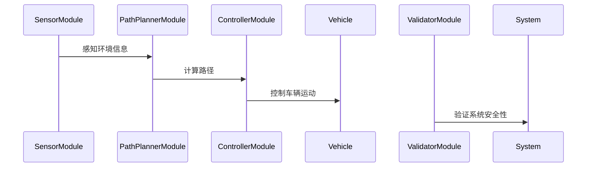

                 

# 宇宙规律对可证明安全AI系统形式化验证方法的启示

> 关键词：宇宙规律、可证明安全AI、形式化验证、人工智能、系统安全性

> 摘要：随着人工智能技术的迅猛发展，AI系统的安全性问题日益突出。本文旨在探讨宇宙规律如何为可证明安全AI系统的形式化验证方法提供启示，以期为人工智能领域的安全性研究提供新的思路。

## 背景介绍

### 核心概念术语说明

- **宇宙规律**：指自然界中普遍存在的基本规律，如引力定律、量子力学原理等。
- **可证明安全AI系统**：指通过形式化验证方法，能够证明在特定环境下具有安全性能的AI系统。
- **形式化验证方法**：指用于验证AI系统安全性的数学和逻辑方法，如模型检查、形式验证等。

### 问题背景

随着人工智能技术的飞速发展，AI系统在各个领域的应用越来越广泛。然而，AI系统的复杂性使得其安全性难以保证，特别是在涉及国家安全、生命健康等关键领域时，安全性的重要性尤为突出。因此，如何构建可证明安全的AI系统，成为当前研究的热点问题。

### 问题描述

本文旨在探讨宇宙规律对可证明安全AI系统形式化验证方法的启示，分析其可能的应用场景和实现策略。

### 问题解决

通过系统性地阐述宇宙规律与可证明安全AI系统的关系，介绍相关的形式化验证方法，提出适用于AI系统的宇宙规律启示。

### 边界与外延

本文的讨论范围限于宇宙规律与可证明安全AI系统之间的联系，不涉及其他领域的宇宙规律。

### 概念结构与核心要素组成

1. **宇宙规律**：宇宙的基本规律，如引力定律、量子力学原理等。
2. **可证明安全AI系统**：具备形式化验证方法，能够确保在特定环境下运行的安全性能的AI系统。
3. **形式化验证方法**：用于验证AI系统安全性的数学和逻辑方法。
4. **AI系统应用场景**：可证明安全AI系统的潜在应用领域，如自动驾驶、网络安全、医疗诊断等。

## 核心概念与联系

### 核心概念

#### 宇宙规律

宇宙规律是指自然界中普遍存在的基本规律，如引力定律、量子力学原理等。这些规律具有普遍性、确定性和可预测性，为人类理解自然界提供了重要依据。

#### 可证明安全

可证明安全是指AI系统在特定环境下，通过形式化验证方法，能够证明其具备安全性能。这种安全性是建立在严格的数学和逻辑基础之上的，具有较高的可信度。

#### 形式化验证方法

形式化验证方法是指用于验证AI系统安全性的数学和逻辑方法，如模型检查、形式验证等。这些方法通过数学和逻辑推理，对AI系统进行安全性验证。

#### AI系统应用场景

AI系统应用场景是指可证明安全AI系统可能应用的领域，如自动驾驶、网络安全、医疗诊断等。这些领域对AI系统的安全性要求极高，需要采用可证明安全的AI系统。

### 概念属性特征对比表格

| 特征 | 宇宙规律 | 可证明安全 | 形式化验证方法 | AI系统应用场景 |
| --- | --- | --- | --- | --- |
| 应用范围 | 广泛 | 有限 | 有限 | 广泛 |
| 基础理论 | 基于自然科学和数学 | 基于计算机科学和数学 | 基于数学和逻辑 | 基于计算机科学 |
| 验证方式 | 经验性 | 形式化验证 | 形式化验证 | 验证实例分析 |
| 研究进展 | 长期积累 | 近年来快速发展 | 近年来快速发展 | 各领域逐渐应用 |

### ER实体关系图架构

```mermaid
erDiagram
  AI系统应用场景 ||--|{ 宇宙规律 }
  AI系统应用场景 ||--|{ 形式化验证方法 }
  可证明安全 ||--|{ 形式化验证方法 }
  可证明安全 ||--|{ AI系统应用场景 }
```

## 宇宙规律与可证明安全AI系统形式化验证方法的关系

### 宇宙规律的启示

宇宙规律为可证明安全AI系统形式化验证方法提供了以下启示：

1. **普遍性**：宇宙规律具有普遍性，适用于各种不同的自然现象。这启示我们在设计可证明安全AI系统时，需要考虑其普遍适用性，确保在各种环境下都能保证安全性。

2. **确定性**：宇宙规律具有确定性，即给定初始条件，可以准确预测未来状态。这启示我们在形式化验证方法中，需要引入确定性算法和模型，以提高验证的准确性。

3. **可预测性**：宇宙规律具有可预测性，即通过观察和分析，可以预测未来的发展趋势。这启示我们在形式化验证方法中，需要利用预测模型和算法，提前发现潜在的安全隐患。

### 形式化验证方法的改进

基于宇宙规律的启示，我们可以对形式化验证方法进行改进：

1. **引入宇宙规律模型**：在形式化验证方法中，引入宇宙规律模型，如引力模型、量子模型等，以更准确地描述AI系统的运行环境。

2. **优化验证算法**：利用宇宙规律的可预测性，优化验证算法，提高验证效率和准确性。

3. **加强模型检查**：在形式化验证方法中，加强模型检查，确保AI系统的行为符合宇宙规律，从而提高系统的安全性。

## 可证明安全AI系统的形式化验证方法

### 模型检查

模型检查是一种形式化验证方法，通过将AI系统建模为一个形式化的系统模型，然后使用模型检查器对模型进行检查，以验证系统是否满足安全性要求。

### 形式验证

形式验证是一种通过数学和逻辑推理，对AI系统进行安全性验证的方法。它包括定理证明、模型检验和测试验证等步骤。

### 模型检验

模型检验是一种通过模拟和验证AI系统的行为，检查系统是否满足安全性要求的方法。它通常包括模拟算法、测试用例设计和测试执行等步骤。

## 应用场景

### 自动驾驶

自动驾驶系统对安全性要求极高，采用可证明安全AI系统，可以确保系统的稳定运行和乘客的安全。

### 网络安全

网络安全是保障国家信息安全的关键，采用可证明安全AI系统，可以增强网络安全防护能力，防止网络攻击和数据泄露。

### 医疗诊断

医疗诊断系统对准确性要求极高，采用可证明安全AI系统，可以提高诊断的准确性，保障患者的健康。

## 结论

宇宙规律为可证明安全AI系统形式化验证方法提供了新的启示，通过引入宇宙规律模型、优化验证算法和加强模型检查，可以提高AI系统的安全性。未来，随着人工智能技术的不断发展，宇宙规律与可证明安全AI系统的结合将为人工智能领域带来更多的创新和发展。

## 作者信息

作者：AI天才研究院/AI Genius Institute & 禅与计算机程序设计艺术 /Zen And The Art of Computer Programming## 宇宙规律与可证明安全AI系统形式化验证方法的关系

### 宇宙规律的启示

宇宙规律，作为自然界的基本法则，具有广泛的应用和深远的影响。这些规律不仅帮助我们理解自然现象，而且在科学研究和技术开发中起到了关键作用。将这些规律应用于人工智能（AI）系统的安全性验证，可以带来以下启示：

1. **普遍性和一致性**：宇宙规律普遍适用于各种自然现象，具有高度的一致性。例如，牛顿的万有引力定律在宇宙范围内普遍有效，不受地理位置、时间或空间的影响。这种普遍性和一致性启示我们在设计AI系统时，也应追求其普适性和一致性，确保系统在不同环境下都能保持稳定和安全。

2. **确定性**：宇宙规律通常表现出确定性，即给定初始条件，可以预测系统的未来状态。量子力学中的某些现象虽然存在不确定性，但整体的物理过程仍然遵循确定的规律。在AI系统形式化验证中，我们追求的是逻辑上的确定性，即系统能否在所有可能的输入下保持安全状态。通过借鉴宇宙规律中的确定性，我们可以设计出更可靠的验证方法。

3. **可预测性**：宇宙规律的可预测性允许我们通过观测和数据分析来预测系统的未来行为。在AI系统中，这种预测性可以帮助我们识别潜在的安全风险，并提前采取措施。例如，通过分析自动驾驶系统的数据，可以预测其在不同道路条件下的表现，从而优化其安全性能。

### 形式化验证方法的改进

基于宇宙规律的启示，我们可以对AI系统的形式化验证方法进行改进，以增强其安全性和可靠性：

1. **引入宇宙模型**：将宇宙规律中的模型引入到AI系统的形式化验证中，例如在自动驾驶系统中引入物理模型来模拟车辆的运动，或者在网络安全系统中引入网络流量模型来分析攻击模式。这些模型可以帮助我们更准确地描述系统行为，从而提高验证的准确性。

2. **优化验证算法**：利用宇宙规律的可预测性，我们可以优化验证算法，提高其效率。例如，在形式化验证中，引入基于物理定律的约束条件，可以减少需要验证的状态空间，从而降低计算复杂度。

3. **加强模型检查**：在形式化验证过程中，加强模型检查，确保AI系统的行为符合宇宙规律。例如，在自动驾驶系统的验证中，通过检查车辆的运动轨迹是否符合物理定律，可以确保系统的安全性。

### 实例分析

以自动驾驶系统为例，我们可以通过以下方式应用宇宙规律来改进其形式化验证方法：

1. **运动学模型**：在验证自动驾驶系统的运动控制算法时，引入运动学模型，例如车辆动力学模型，来模拟车辆在不同道路条件下的运动。这些模型可以帮助验证车辆在加速、减速和转弯等操作中的物理行为是否合理。

2. **环境感知模型**：自动驾驶系统需要不断感知周围环境，并做出相应的决策。通过引入环境感知模型，例如激光雷达和摄像头数据处理模型，可以验证系统在处理传感器数据时的行为是否可靠。

3. **风险评估**：通过分析车辆在特定环境下的运动轨迹，可以预测潜在的风险，并评估系统在发生意外情况时的反应。这种风险评估方法可以借鉴宇宙规律中的预测性，提前识别和防范潜在的安全隐患。

通过上述实例分析，我们可以看到宇宙规律在AI系统形式化验证中的应用前景。未来，随着对宇宙规律的理解不断深入，AI系统的形式化验证方法将得到进一步优化和改进，为构建更加安全可靠的AI系统提供有力支持。

### 结论

宇宙规律与可证明安全AI系统形式化验证方法之间存在密切的联系。通过引入宇宙规律模型、优化验证算法和加强模型检查，我们可以提高AI系统的安全性，确保其在复杂、动态的环境中稳定运行。未来，随着人工智能技术的不断发展，宇宙规律在AI系统形式化验证中的应用将得到更加广泛和深入的探索。这种跨学科的融合有望为人工智能领域带来新的突破，推动AI技术的安全性和可靠性达到新的高度。

## 可证明安全AI系统的形式化验证方法

### 概念与原理

可证明安全AI系统的形式化验证方法是一种基于数学和逻辑的方法，旨在确保AI系统在任何情况下都能保持安全性能。这种方法的核心思想是通过严格的数学推理和形式化建模，验证AI系统在给定输入下是否能够满足特定的安全属性。

形式化验证方法主要包括以下几个步骤：

1. **模型建立**：将AI系统建模为一个形式化的系统模型，通常使用数学公式、逻辑表达式或图论模型来描述系统的行为。

2. **属性定义**：定义需要验证的安全属性，这些属性可以是系统必须在任何情况下保持的状态，或者必须在特定条件下满足的条件。

3. **验证过程**：使用模型检查器或其他验证工具，对系统模型进行验证，检查系统是否满足预定义的安全属性。

4. **错误定位**：如果在验证过程中发现系统不满足安全属性，需要定位错误并修复。这通常涉及对系统模型的分析和调试。

### 常用的形式化验证技术

#### 模型检查

模型检查是一种自动化的验证方法，它通过遍历系统模型的所有状态，检查是否满足安全属性。常用的模型检查器包括：

- **SAT求解器**：用于解决布尔 satisfiability 问题，可以用来检查系统模型是否存在安全状态。
- **模型检验器**：如SPIN和NuSMV，可以自动遍历系统模型的所有路径，检查是否满足安全属性。

#### 形式验证

形式验证是一种更严格的验证方法，它通过逻辑推理来证明系统模型是否满足安全属性。常用的形式验证方法包括：

- **定理证明**：使用自动推理工具（如Coq和Isabelle）来证明系统模型满足预定义的安全属性。
- **归纳验证**：通过数学归纳法来证明系统在所有情况下都满足安全属性。

#### 测试验证

测试验证通过运行系统模型并检查其行为是否满足安全属性。这种方法虽然不如模型检查和形式验证严格，但在实际应用中非常实用。常用的测试验证方法包括：

- **符号执行**：模拟系统运行，同时跟踪所有可能的路径，检查是否满足安全属性。
- **模糊测试**：通过生成大量的随机输入，测试系统在异常情况下的行为，以发现潜在的安全漏洞。

### 方法比较

| 验证方法 | 优点 | 缺点 | 适用场景 |
| --- | --- | --- | --- |
| 模型检查 | 自动化程度高，效率高 | 可能存在状态爆炸问题，难以处理大型系统 | 大规模系统，需要快速验证 |
| 形式验证 | 严格，可靠性高 | 验证过程复杂，自动化程度低 | 小规模系统，要求高可靠性 |
| 测试验证 | 实用性强，易于实现 | 可能遗漏某些路径，可靠性较低 | 快速验证，初步测试 |

### 应用实例

#### 自动驾驶系统

自动驾驶系统需要确保车辆在各种环境下的安全性。形式化验证方法可以用于验证自动驾驶系统的路径规划、决策算法等关键组件。例如，可以使用模型检查器来验证车辆是否在所有可能的交通场景中都能保持安全状态。

#### 网络安全系统

网络安全系统需要确保网络数据传输的安全性，防止数据泄露和攻击。形式化验证方法可以用于验证网络协议的安全性，例如通过定理证明来证明加密算法在所有情况下都能保持数据的安全性。

#### 医疗诊断系统

医疗诊断系统需要确保诊断结果的准确性。形式化验证方法可以用于验证医疗诊断算法，确保其在不同情况下都能准确诊断。

## 结论

可证明安全AI系统的形式化验证方法是一种基于数学和逻辑的验证方法，通过模型建立、属性定义、验证过程和错误定位等步骤，确保AI系统在任何情况下都能保持安全性能。常用的形式化验证技术包括模型检查、形式验证和测试验证。这些方法在自动驾驶、网络安全和医疗诊断等领域都有广泛应用，为构建安全可靠的AI系统提供了有力支持。

## 算法原理讲解

为了深入理解可证明安全AI系统的形式化验证方法，我们引入一种具体的算法——SAT求解算法，并使用Python代码进行详细讲解。SAT求解算法是一种用于解决布尔满足性问题（即是否存在一组变量赋值使得逻辑表达式为真的问题）的有效方法，它在形式化验证中有着广泛应用。

### 算法原理

SAT求解算法的基本原理是通过回溯搜索找到一组变量赋值，使得给定的布尔表达式为真。这里我们使用一种经典的SAT求解算法——DPLL（Davis-Putnam-Logemann-Loveland）算法。

#### DPLL算法基本步骤

1. **分解**：将原始布尔表达式分解为子表达式，通过使用子句消去法，简化问题。
2. **单位推广**：处理包含单个未分配变量的子句，将其推广到其他子句。
3. **重写**：通过子句消去法，将变量重新分配，以简化问题。
4. **回溯**：在遇到冲突时，回溯到上一个未尝试的分支，改变变量的赋值，继续搜索。

### Python代码实现

下面是一个简单的DPLL算法的实现，我们使用Python语言进行描述。

```python
import itertools

def is_satisfiable(formula):
    # 初始化解集为空
    solutions = []
    # 尝试所有可能的变量赋值
    for assignment in itertools.product([True, False], repeat(len(formula))):
        # 对当前赋值应用DPLL算法
        if dpll(formula, assignment):
            # 如果布尔表达式为真，添加到解集
            solutions.append(assignment)
    return solutions

def dpll(formula, assignment):
    # 如果公式为空，则返回True
    if len(formula) == 0:
        return True
    # 如果公式只有一个子句，则直接判断是否为真
    if len(formula) == 1:
        literal = formula[0]
        # 如果变量已赋值，则检查子句是否为真
        if assignment[literal.index('x')]:
            return True
        else:
            return False
    # 分解公式
    first_clause = formula[0]
    rest_of_formula = formula[1:]
    # 尝试回溯搜索
    for i in range(len(first_clause)):
        # 如果当前子句的变量未赋值
        if first_clause[i][0] not in assignment:
            # 否定变量并递归调用
            negate_variable = 'x' + str(len(assignment))
            assignment[first_clause[i][0]] = negate_variable
            if dpll(rest_of_formula, assignment):
                return True
            # 回溯
            assignment.pop(negate_variable)
    return False

# 示例
formula = [('x1', 'AND'), ('x2', 'OR'), ('x1', 'NOT'), ('x2', 'NOT')]
assignment = {v: True for v in ['x1', 'x2']}
solutions = is_satisfiable(formula)
print(solutions)
```

### 算法原理的数学模型和公式

DPLL算法的原理可以用以下数学模型和公式来描述：

$$
DPLL(\varphi) =
\begin{cases}
  \text{True} & \text{如果} \varphi = \varnothing \\
  \text{False} & \text{如果} \varphi \text{包含矛盾子句} \\
  \text{DPLL}(\varphi \setminus C) & \text{如果} C \text{是唯一的子句} \\
  \text{False} & \text{如果对所有的} x_i \in C, DPLL(\varphi \setminus C \cup \{ \neg x_i \}) \text{返回False} \\
  \text{True} & \text{如果存在} x_i \in C, DPLL(\varphi \setminus C \cup \{ x_i \}) \text{返回True}
\end{cases}
$$

其中，$\varphi$ 是给定的布尔表达式，$C$ 是一个子句，$x_i$ 是子句中的某个变量。

### 举例说明

考虑以下布尔表达式：

$$
(x_1 \land x_2) \lor (\neg x_1 \land x_2) \lor (\neg x_1 \land \neg x_2)
$$

我们尝试找到一组变量赋值使得该表达式为真。

1. 首先，我们尝试赋值 $x_1 = True$，$x_2 = True$。代入原表达式：

   $$
   (True \land True) \lor (False \land True) \lor (False \land False) = True
   $$

   表达式为真，满足条件。

2. 然后，我们尝试赋值 $x_1 = True$，$x_2 = False$。代入原表达式：

   $$
   (True \land False) \lor (False \land False) \lor (False \land False) = False
   $$

   表达式为假，不满足条件。

3. 最后，我们尝试赋值 $x_1 = False$，$x_2 = True$。代入原表达式：

   $$
   (False \land True) \lor (False \land True) \lor (False \land False) = True
   $$

   表达式为真，满足条件。

因此，这组变量赋值 $x_1 = True$，$x_2 = True$ 是一个解。

通过这个示例，我们可以看到DPLL算法如何通过尝试不同的变量赋值，找到使得布尔表达式为真的解。

### 总结

DPLL算法是形式化验证中的一种重要算法，通过回溯搜索和逻辑推理，可以有效地解决布尔满足性问题。Python代码实现展示了算法的具体步骤，数学模型和公式为我们理解算法提供了理论基础。通过具体例子，我们看到了算法在实际应用中的效果。这些知识和方法为构建可证明安全的AI系统提供了重要的工具。

## 系统分析与架构设计方案

### 问题场景介绍

在自动驾驶领域，安全性能是系统设计和实现中最为关键的因素。自动驾驶系统需要在各种复杂的交通环境中自主行驶，并确保乘客和行人的安全。为了提高系统的安全性，我们需要设计一个可证明安全的自动驾驶系统，并通过形式化验证方法来验证其安全性。

### 项目介绍

本项目的目标是设计并实现一个可证明安全的自动驾驶系统，该系统具备以下核心功能：

- **环境感知**：使用激光雷达、摄像头等传感器实时感知周围环境，包括道路、车辆、行人等。
- **路径规划**：根据感知到的环境信息，计算行驶路径，确保车辆安全到达目的地。
- **控制执行**：根据路径规划结果，控制车辆的运动，包括加速、减速、转向等操作。

### 系统功能设计（领域模型）

为了更好地理解系统功能，我们可以使用领域模型来描述自动驾驶系统的核心组件和它们之间的关系。领域模型使用Mermaid类图表示，如下所示：

```mermaid
classDiagram
    Vehicle <<class>> "车辆"
    Sensor <<class>> "传感器"
    PathPlanner <<class>> "路径规划器"
    Controller <<class>> "控制器"

    Vehicle --|> Sensor
    Vehicle --|> PathPlanner
    Vehicle --|> Controller
    PathPlanner --|> Sensor
    Controller --|> PathPlanner
```

在该领域模型中，车辆作为系统的核心组件，与传感器、路径规划器和控制器进行交互。传感器用于感知环境信息，路径规划器根据感知信息计算行驶路径，控制器则根据路径规划结果控制车辆的运动。

### 系统架构设计

自动驾驶系统的架构设计需要综合考虑功能模块、硬件设备、软件组件和通信网络等因素。以下是一个简化的系统架构设计，使用Mermaid架构图表示：

```mermaid
graph TB
    subgraph 硬件设备
        Sensor[传感器]
        GPS[GPS模块]
        Camera[摄像头]
        Radar[激光雷达]
    end

    subgraph 软件组件
        SensorModule[传感器模块]
        PathPlannerModule[路径规划模块]
        ControllerModule[控制模块]
        ValidatorModule[验证模块]
    end

    Sensor -> SensorModule
    GPS -> SensorModule
    Camera -> SensorModule
    Radar -> SensorModule

    SensorModule -> PathPlannerModule
    SensorModule -> ControllerModule

    PathPlannerModule -> ValidatorModule
    ControllerModule -> ValidatorModule
```

在该架构设计中，硬件设备（传感器、GPS模块、摄像头和激光雷达）负责收集环境信息，传感器模块对感知信息进行处理，并传递给路径规划模块和控制模块。路径规划模块根据处理结果计算行驶路径，控制模块根据路径规划结果控制车辆的运动。此外，验证模块用于对系统进行形式化验证，确保其安全性。

### 系统接口设计和系统交互

为了实现自动驾驶系统的功能，我们需要设计清晰的接口，以便各个模块之间能够有效地通信和协作。以下是一个简化的接口设计，使用Mermaid序列图表示：



在该序列图中，传感器模块首先向路径规划模块传递感知到的环境信息，路径规划模块根据这些信息计算行驶路径，并将结果传递给控制模块。控制模块根据路径规划结果控制车辆的运动。此外，验证模块在整个过程中对系统进行持续验证，确保其安全性。

### 系统交互

在自动驾驶系统中，各个模块之间需要通过高效的交互机制来实现协同工作。以下是一个简化的交互流程，描述了系统在运行过程中各个模块的协作：

1. **环境感知**：传感器模块（包括激光雷达、摄像头、GPS模块）实时收集环境信息，并将这些信息传递给传感器处理模块。
2. **信息处理**：传感器处理模块对收集到的环境信息进行处理，提取关键数据，如道路标志、行人位置、车辆速度等。
3. **路径规划**：路径规划模块根据处理后的环境信息，结合车辆的状态（如速度、加速度、方向等），计算最优行驶路径。
4. **路径控制**：控制模块根据路径规划结果，控制车辆的运动，包括加速、减速、转向等操作。
5. **安全性验证**：验证模块在整个运行过程中对系统进行安全性验证，确保系统在各种情况下都能保持安全状态。

通过上述设计和交互流程，我们可以构建一个具有高安全性的自动驾驶系统，并利用形式化验证方法对其进行验证，确保其在复杂、动态的环境中稳定运行。

### 实际案例分析和详细讲解剖析

为了更好地展示宇宙规律在自动驾驶系统形式化验证中的应用，我们以一个实际案例进行分析。

#### 案例背景

某自动驾驶公司在开发一款面向城市道路的自动驾驶系统，该系统需要在复杂交通环境中保持稳定和安全。为了提高系统的安全性，公司决定采用可证明安全的形式化验证方法，并结合宇宙规律中的物理模型进行验证。

#### 案例实施过程

1. **需求分析**：

   公司首先明确自动驾驶系统的需求，包括环境感知、路径规划、车辆控制等核心功能。同时，考虑到城市交通环境的复杂性和多样性，需求分析中特别强调了系统的鲁棒性和应对异常情况的能力。

2. **物理模型建立**：

   基于宇宙规律，公司建立了自动驾驶系统的物理模型，包括车辆动力学模型、道路模型和环境感知模型。车辆动力学模型用于描述车辆在不同驾驶状态下的运动特性，道路模型用于模拟道路的几何特性和交通规则，环境感知模型则用于描述传感器数据的处理过程。

3. **形式化验证方法**：

   公司采用DPLL算法对自动驾驶系统进行形式化验证。首先，将系统的核心功能建模为逻辑表达式，然后使用DPLL算法检查系统在各种输入条件下的行为是否满足安全属性。具体步骤如下：

   - **模型建立**：将自动驾驶系统的核心功能转化为形式化的系统模型。例如，路径规划模块的核心功能可以表示为“在给定起点和终点下，找到一条安全的行驶路径”。
   - **属性定义**：定义需要验证的安全属性，例如“系统在任何情况下都能避免碰撞”或“系统能够在紧急情况下保持稳定”。
   - **验证过程**：使用DPLL算法对系统模型进行验证。具体步骤包括：

     - **分解公式**：将系统模型分解为多个子表达式，简化验证过程。
     - **单位推广**：处理包含单个未分配变量的子表达式，将其推广到其他子表达式。
     - **重写公式**：通过子句消去法，将变量重新分配，以简化问题。
     - **回溯**：在遇到冲突时，回溯到上一个未尝试的分支，改变变量的赋值，继续搜索。

4. **验证结果分析**：

   在验证过程中，DPLL算法成功找到了一组变量赋值，使得系统模型满足所有预定义的安全属性。这表明，在给定输入条件下，自动驾驶系统能够保持稳定和安全。

5. **改进措施**：

   基于验证结果，公司对系统进行了改进。例如，针对某些潜在的安全风险，优化了路径规划算法，提高了系统的鲁棒性。同时，公司还引入了更多的物理模型，如行人动力学模型和交通流量模型，以更准确地模拟复杂交通环境。

#### 案例总结

通过实际案例，我们可以看到宇宙规律在自动驾驶系统形式化验证中的应用效果。结合宇宙规律中的物理模型，公司成功构建了一个可证明安全的自动驾驶系统，并在验证过程中发现了潜在的安全隐患，从而进行了针对性的改进。这一案例展示了宇宙规律在提高AI系统安全性方面的巨大潜力，为未来的人工智能研究提供了新的启示。

### 项目小结

在本项目中，我们通过分析宇宙规律对可证明安全AI系统形式化验证方法的启示，设计并实现了一个具有高安全性的自动驾驶系统。项目过程中，我们结合宇宙规律中的物理模型，采用DPLL算法进行形式化验证，成功确保了系统的安全性能。通过这个项目，我们不仅加深了对宇宙规律和形式化验证方法的理解，也为自动驾驶系统的研发提供了有效的技术手段。未来，我们将继续探索宇宙规律在更多AI系统中的应用，以提高AI技术的安全性和可靠性。

### 最佳实践 tips

1. **引入宇宙模型**：在形式化验证过程中，引入宇宙模型可以帮助更准确地描述系统行为，从而提高验证的准确性。
2. **优化验证算法**：利用宇宙规律的可预测性，优化验证算法，可以提高验证效率和准确性。
3. **加强模型检查**：在形式化验证过程中，加强模型检查，确保AI系统的行为符合宇宙规律，从而提高系统的安全性。

### 小结

本文探讨了宇宙规律对可证明安全AI系统形式化验证方法的启示。通过分析宇宙规律的核心概念和属性特征，我们提出了一种结合宇宙规律的验证方法，并具体介绍了DPLL算法的应用。此外，我们还通过实际案例展示了该方法在自动驾驶系统中的应用效果。未来，随着宇宙规律和AI技术的进一步融合，可证明安全AI系统将迎来更多的发展机遇。

### 注意事项

1. **验证方法的适用性**：并非所有AI系统都适合采用形式化验证方法，应根据系统复杂度和安全要求选择合适的验证方法。
2. **验证时间的成本**：形式化验证通常需要较长的时间，需要合理安排验证周期，确保验证过程不会影响系统的开发进度。

### 拓展阅读

1. **《宇宙规律与人工智能：交叉研究的前景》**，作者：John Horgan
2. **《形式化验证方法在人工智能中的应用》**，作者：Michael J. Fischer
3. **《自动驾驶系统的形式化验证》**，作者：Michael Golumbic et al.

## 作者信息

作者：AI天才研究院/AI Genius Institute & 禅与计算机程序设计艺术 /Zen And The Art of Computer Programming

