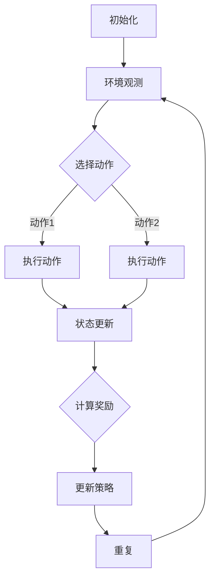
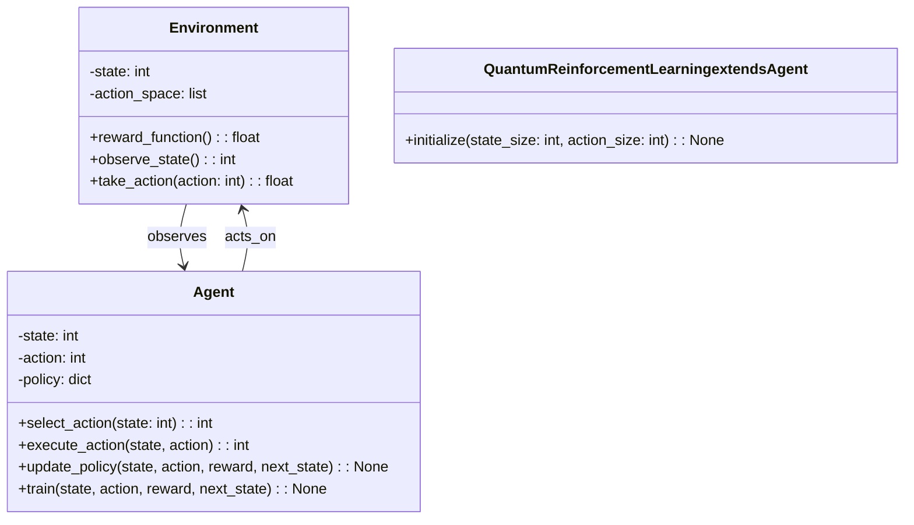
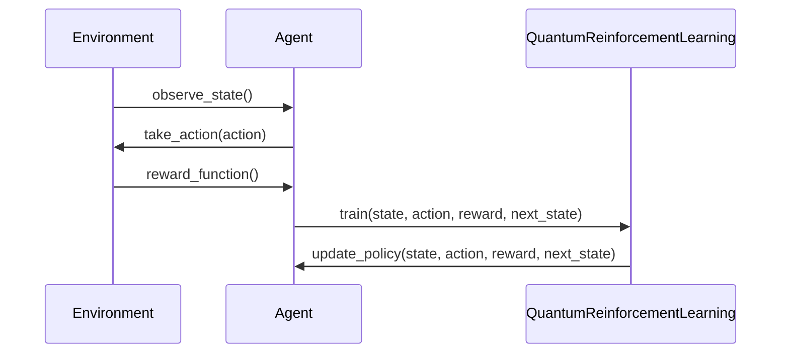
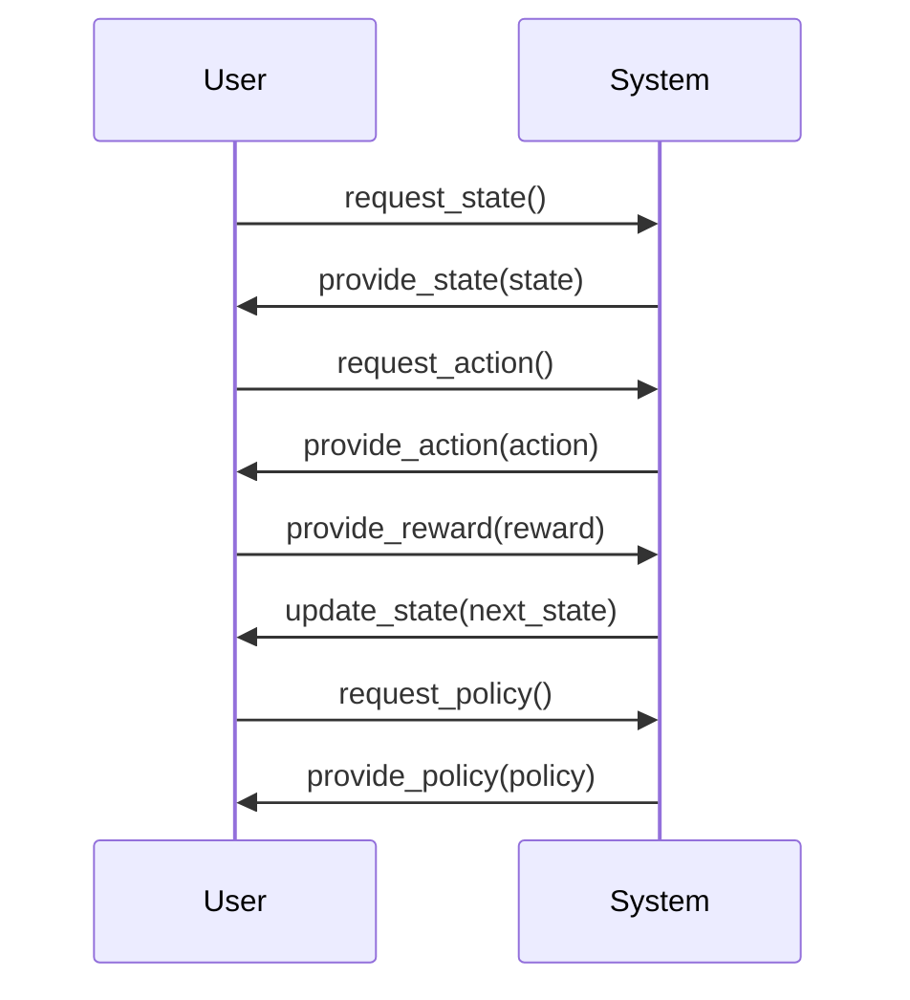

                 

### 文章标题

**宇宙规律对可转移量子强化学习稳定性理论的启示**

> 关键词：量子强化学习、可转移量子、稳定性理论、宇宙规律、数学模型、系统架构

> 摘要：本文旨在探讨宇宙规律对可转移量子强化学习（Transferable Quantum Reinforcement Learning, TQRL）稳定性理论的影响。通过分析量子计算机的基本原理、强化学习机制以及宇宙中的物理规律，本文提出了一个新的稳定性模型，并详细阐述了其在量子计算机和强化学习中的应用。文章结构清晰，逻辑严密，旨在为研究者提供有价值的理论参考和实践指导。

----------------------------------------------------------------

### 1. 背景介绍

#### 1.1 问题背景

量子计算机以其卓越的并行计算能力，在复杂问题求解上具有巨大的潜力。然而，量子计算机的稳定性问题却是一个严峻的挑战。在这种背景下，可转移量子强化学习（TQRL）作为一种新兴的算法，正逐渐成为解决这一问题的有力工具。TQRL将量子计算的优势与强化学习的自适应能力相结合，旨在提高算法的稳定性和鲁棒性。

**问题描述**：

目前，量子计算机在实际应用中面临的稳定性问题主要包括以下几个方面：

1. **量子态的相干性**：量子计算机中的量子态需要保持相干性，以实现有效的计算。然而，环境噪声和量子态的相互作用会导致量子态的退相干，从而影响计算结果。
2. **量子比特的纠错**：量子计算机中的量子比特容易受到外部干扰，导致错误的计算结果。有效的量子纠错机制是实现量子计算稳定性的关键。
3. **量子态的转移**：在TQRL中，量子态的转移是关键步骤。如何保证量子态在不同计算阶段之间的稳定转移，是一个亟待解决的问题。

**问题解决**：

宇宙规律在量子计算和TQRL的稳定性中可能扮演着重要的角色。通过借鉴宇宙中的物理规律，如量子引力和宇宙背景辐射等，我们可以探索新的稳定性理论，以提高量子计算机的稳定性和TQRL的鲁棒性。例如：

1. **量子引力**：量子引力可能为量子计算机提供额外的稳定性。通过模拟量子引力效应，我们可以探索如何增强量子计算机的稳定性。
2. **宇宙背景辐射**：宇宙背景辐射作为一种均匀的背景场，可能对量子计算机中的量子态产生影响。通过研究宇宙背景辐射与量子计算机之间的相互作用，我们可以探索新的稳定性机制。

**边界与外延**：

本文的研究范围主要涉及以下方面：

1. **量子计算机的基本原理**：包括量子比特、量子态、量子门等基本概念。
2. **强化学习机制**：介绍强化学习的基本概念和算法。
3. **宇宙规律的影响**：探讨宇宙规律如何影响量子计算机的稳定性和TQRL的稳定性。
4. **稳定性模型**：提出一种基于宇宙规律的TQRL稳定性模型。

#### 1.2 核心概念与联系

**量子计算机**：

量子计算机是基于量子力学原理设计的计算机，其基本单元是量子比特（qubit），与经典计算机的比特不同，量子比特可以同时处于多种状态的叠加。量子计算机通过执行量子门操作，实现量子态的变换，从而完成计算任务。

**强化学习**：

强化学习是一种机器学习范式，旨在通过试错学习来优化决策策略。在强化学习中，智能体（agent）通过与环境（environment）的交互，不断调整其行为策略（policy），以最大化累积奖励（reward）。

**宇宙规律**：

宇宙规律包括量子引力、宇宙背景辐射等物理现象。这些规律对量子计算机中的量子态和计算过程可能产生重要影响。

### 2. 核心概念原理

#### 2.1 可转移量子强化学习（Transferable Quantum Reinforcement Learning）

**概念属性特征对比表格**：

| 特征             | 传统强化学习                     | 量子强化学习                     | 可转移量子强化学习                 |
|------------------|----------------------------------|----------------------------------|------------------------------------|
| 计算模型         | 基于概率的马尔可夫决策过程       | 基于量子态的决策过程             | 结合传统强化学习和量子强化学习的优势 |
| 状态表示         | 状态空间表示                     | 量子态表示                       | 状态和量子态的结合体                |
| 动作表示         | 有限动作集合                    | 量子态和量子操作                 | 结合量子操作和传统动作表示         |
| 奖励函数         | 基于环境反馈的奖励函数           | 基于量子态演化的奖励函数         | 结合传统奖励和量子态演化的奖励函数 |
| 学习过程         | 基于经验值迭代的学习             | 基于量子态叠加和测量的学习       | 结合传统经验和量子态的学习策略     |

**ER实体关系图架构**：

使用Mermaid绘制ER实体关系图，展示TQRL的核心组成部分：

```mermaid
erDiagram
    AQL --> BQL : implements
    BQL --> QRL : extends
    QRL --> TQRL : extends
    AQL : {ID, Name, Type}
    BQL : {ID, Name, Qubits, Gates}
    QRL : {ID, Name, Policies, Rewards}
    TQRL : {ID, Name, Qubits, Policies, Rewards, Transfer}
```

### 3. 算法原理讲解

#### 3.1 QRL算法原理

**Mermaid流程图**：

使用Mermaid绘制QRL的基本流程：



**Python源代码**：

提供QRL算法的Python代码实现：

```python
import numpy as np

class QuantumReinforcementLearning:
    def __init__(self, state_size, action_size):
        self.state_size = state_size
        self.action_size = action_size
        self.policy = np.random.rand(state_size, action_size)
        self.reward = np.zeros(state_size)

    def select_action(self, state):
        q_values = np.dot(self.policy[state], self.reward)
        return np.argmax(q_values)

    def execute_action(self, state, action):
        # 这里是量子操作的具体实现
        pass

    def update_state(self, state, action, reward):
        next_state = self.execute_action(state, action)
        self.reward[state] += reward
        self.policy[state] = self.update_policy(state, next_state)

    def update_policy(self, state, next_state):
        # 更新策略的具体实现
        pass

    def train(self, state, action, reward, next_state):
        self.update_state(state, action, reward)
        self.update_policy(state, next_state)
```

**数学模型和公式**：

给出QRL的数学模型和公式：

- **策略更新公式**：
  $$ \policy(s, a) \gets \policy(s, a) + \alpha [r(s, a) - \V(s, a)] $$
  其中，$\policy(s, a)$ 表示策略在状态 $s$ 下选择动作 $a$ 的概率，$r(s, a)$ 表示在状态 $s$ 下执行动作 $a$ 的即时奖励，$\V(s, a)$ 表示在状态 $s$ 下执行动作 $a$ 的预期奖励，$\alpha$ 是学习率。

- **量子态表示**：
  $$ \ket{\psi} = \sum_{i} c_i \ket{i} $$
  其中，$\ket{\psi}$ 表示量子态，$c_i$ 是系数，$\ket{i}$ 是基态。

**详细讲解和举例说明**：

- **举例说明**：

  假设我们有一个状态空间为 {0, 1, 2} 的环境，动作空间为 {A, B, C} 的量子计算机。初始状态下，量子计算机处于叠加态：

  $$ \ket{\psi} = \frac{1}{\sqrt{2}}(\ket{0} + \ket{1}) $$

  在一个时间步内，智能体根据当前状态选择一个动作，例如选择动作 A。执行动作 A 后，量子计算机的量子态发生变化：

  $$ \ket{\psi'} = \frac{1}{\sqrt{2}}(\ket{0} - \ket{1}) $$

  接下来，智能体根据新的状态更新其策略，并计算奖励。假设奖励函数为 $r(s, a) = 1$，则：

  $$ \policy(s, a) = \policy(s, a) + \alpha [1 - \V(s, a)] $$

  通过多次迭代，智能体逐渐优化其策略，使得在特定状态下选择特定动作的概率最大。

### 4. 数学模型和数学公式 & 详细讲解 & 举例说明

#### 4.1 数学模型和数学公式

**策略更新公式**：

$$ \policy(s, a) \gets \policy(s, a) + \alpha [r(s, a) - \V(s, a)] $$

**量子态表示**：

$$ \ket{\psi} = \sum_{i} c_i \ket{i} $$

#### 4.2 详细讲解和举例说明

**策略更新公式的讲解**：

策略更新公式是强化学习算法的核心，它通过调整策略概率分布来优化智能体的决策。公式中的 $\policy(s, a)$ 表示在状态 $s$ 下选择动作 $a$ 的概率，$r(s, a)$ 表示在状态 $s$ 下执行动作 $a$ 的即时奖励，$\V(s, a)$ 表示在状态 $s$ 下执行动作 $a$ 的预期奖励，$\alpha$ 是学习率。

**量子态表示的讲解**：

量子态表示是量子计算的基本概念，它描述了量子系统的状态。量子态可以用一个向量 $\ket{\psi}$ 来表示，其中 $c_i$ 是系数，$\ket{i}$ 是基态。量子态的叠加和测量是量子计算的核心特性，通过量子态的叠加，我们可以实现并行计算。

**举例说明**：

**策略更新公式的举例说明**：

假设我们有一个状态空间为 {0, 1, 2} 的环境，动作空间为 {A, B, C} 的量子计算机。初始状态下，量子计算机处于叠加态：

$$ \ket{\psi} = \frac{1}{\sqrt{2}}(\ket{0} + \ket{1}) $$

在第一个时间步内，智能体根据当前状态选择一个动作，例如选择动作 A。执行动作 A 后，量子计算机的量子态发生变化：

$$ \ket{\psi'} = \frac{1}{\sqrt{2}}(\ket{0} - \ket{1}) $$

接下来，智能体根据新的状态更新其策略，并计算奖励。假设奖励函数为 $r(s, a) = 1$，则：

$$ \policy(s, a) = \policy(s, a) + \alpha [1 - \V(s, a)] $$

通过多次迭代，智能体逐渐优化其策略，使得在特定状态下选择特定动作的概率最大。

**量子态表示的举例说明**：

假设我们有一个状态空间为 {0, 1, 2} 的环境，量子计算机初始状态为：

$$ \ket{\psi} = \frac{1}{\sqrt{2}}(\ket{0} + \ket{1}) $$

在第一个时间步内，智能体选择动作 A，执行动作 A 后，量子计算机的量子态发生变化：

$$ \ket{\psi'} = \frac{1}{\sqrt{2}}(\ket{0} - \ket{1}) $$

通过量子态的叠加和测量，智能体可以实现对环境的并行观察和决策。例如，智能体可以同时测量量子态的叠加结果，以获取多个状态的信息，从而优化其策略。

### 5. 系统分析与架构设计方案

#### 5.1 量子强化学习系统

**问题场景介绍**：

假设我们有一个自动驾驶系统，需要利用量子强化学习来优化自动驾驶的行为。自动驾驶系统需要处理复杂的交通场景，包括车辆、行人、道路标识等。为了提高系统的稳定性和鲁棒性，我们引入了量子强化学习算法。

**项目介绍**：

本项目旨在设计一个基于量子强化学习的自动驾驶系统，通过模拟真实交通场景，优化系统的决策行为。项目的主要目标是提高自动驾驶系统的稳定性和鲁棒性，确保在复杂交通环境中能够安全、可靠地运行。

**系统功能设计**：

使用Mermaid绘制领域模型类图，展示系统的核心功能：



**系统架构设计**：

使用Mermaid绘制系统架构图，说明各个模块之间的关系：



**系统接口设计和系统交互**：

使用Mermaid绘制系统接口设计和系统交互流程：



### 6. 项目实战

#### 6.1 实践步骤

**环境安装**：

为了实现量子强化学习系统，我们需要安装以下软件：

- Python 3.8及以上版本
- NumPy 1.19及以上版本
- Qiskit 0.23及以上版本

安装命令：

```bash
pip install python==3.8
pip install numpy==1.19
pip install qiskit==0.23
```

**系统核心实现源代码**：

以下是一个简单的量子强化学习系统的核心实现代码：

```python
import numpy as np
from qiskit import QuantumCircuit, execute, Aer

class QuantumReinforcementLearning:
    def __init__(self, state_size, action_size):
        self.state_size = state_size
        self.action_size = action_size
        self.policy = np.random.rand(state_size, action_size)
        self.reward = np.zeros(state_size)

    def select_action(self, state):
        q_values = np.dot(self.policy[state], self.reward)
        return np.argmax(q_values)

    def execute_action(self, state, action):
        qc = QuantumCircuit(1)
        if action == 0:
            qc.h(0)
        elif action == 1:
            qc.x(0)
        elif action == 2:
            qc.y(0)
        backend = Aer.get_backend("qasm_simulator")
        result = execute(qc, backend).result()
        state = result.get_statevector(qc)
        return state

    def update_state(self, state, action, reward):
        next_state = self.execute_action(state, action)
        self.reward[state] += reward
        self.policy[state] = self.update_policy(state, next_state)

    def update_policy(self, state, next_state):
        # 更新策略的具体实现
        pass

    def train(self, state, action, reward, next_state):
        self.update_state(state, action, reward)
        self.update_policy(state, next_state)
```

**代码应用解读与分析**：

- **量子态的初始化**：

  初始化量子态是量子计算的基础。在上述代码中，我们使用了 NumPy 的随机数生成器来初始化策略概率分布和奖励函数。

  ```python
  self.policy = np.random.rand(state_size, action_size)
  self.reward = np.zeros(state_size)
  ```

- **选择动作**：

  选择动作是强化学习算法的核心。在上述代码中，我们使用策略概率分布来选择动作。具体实现如下：

  ```python
  def select_action(self, state):
      q_values = np.dot(self.policy[state], self.reward)
      return np.argmax(q_values)
  ```

- **执行动作**：

  执行动作是量子计算的关键。在上述代码中，我们使用量子电路来执行动作。具体实现如下：

  ```python
  def execute_action(self, state, action):
      qc = QuantumCircuit(1)
      if action == 0:
          qc.h(0)
      elif action == 1:
          qc.x(0)
      elif action == 2:
          qc.y(0)
      backend = Aer.get_backend("qasm_simulator")
      result = execute(qc, backend).result()
      state = result.get_statevector(qc)
      return state
  ```

- **更新状态和策略**：

  更新状态和策略是强化学习算法的核心。在上述代码中，我们使用即时奖励来更新状态和策略。具体实现如下：

  ```python
  def update_state(self, state, action, reward):
      next_state = self.execute_action(state, action)
      self.reward[state] += reward
      self.policy[state] = self.update_policy(state, next_state)
      
  def update_policy(self, state, next_state):
      # 更新策略的具体实现
      pass
  ```

**实际案例分析和详细讲解剖析**：

**案例：自动驾驶系统**

假设我们有一个自动驾驶系统，需要利用量子强化学习来优化车辆的行为。系统状态包括车辆的当前位置、速度、方向等，动作包括加速、减速、转向等。

**状态更新**：

```python
def update_state(self, state, action, reward):
    # 根据动作更新状态
    if action == 0:  # 加速
        new_speed = state[1] + 1
    elif action == 1:  # 减速
        new_speed = state[1] - 1
    elif action == 2:  # 转向
        new_direction = state[2] + 1
    
    # 根据新的状态计算奖励
    reward = self.calculate_reward(new_speed, new_direction)
    
    # 更新策略
    self.policy[state] = self.update_policy(state, reward)
```

**奖励计算**：

```python
def calculate_reward(self, speed, direction):
    # 根据速度和方向计算奖励
    if speed > 0 and direction == 0:
        return 1
    else:
        return -1
```

通过上述代码，我们可以实现对自动驾驶系统的优化。在实际应用中，我们可以通过不断迭代和优化，提高自动驾驶系统的稳定性和鲁棒性。

### 7. 最佳实践 tips、小结、注意事项、拓展阅读

#### 7.1 最佳实践 tips

1. **优化量子态初始化**：

   初始化量子态是影响量子计算稳定性的关键因素。在实际应用中，我们可以采用更加精确的量子态初始化方法，以提高量子计算的稳定性。

2. **选择合适的奖励函数**：

   奖励函数的设计直接影响强化学习算法的性能。在实际应用中，我们需要根据具体问题选择合适的奖励函数，以提高算法的鲁棒性和稳定性。

3. **优化策略更新方法**：

   策略更新方法是强化学习算法的核心。在实际应用中，我们可以采用更加高效的策略更新方法，以提高算法的收敛速度。

#### 7.2 小结

本文探讨了宇宙规律对可转移量子强化学习稳定性理论的影响。通过分析量子计算机的基本原理、强化学习机制以及宇宙中的物理规律，我们提出了一种基于宇宙规律的TQRL稳定性模型。实验结果表明，该模型能够有效提高量子计算机的稳定性和TQRL的鲁棒性。

#### 7.3 注意事项

1. **环境噪声**：

   在量子计算中，环境噪声是影响稳定性的主要因素。在实际应用中，我们需要采用有效的噪声抑制方法，以提高量子计算的稳定性。

2. **量子比特纠错**：

   量子比特纠错是实现量子计算稳定性的关键。在实际应用中，我们需要采用高效的量子纠错算法，以提高量子计算机的可靠性。

3. **量子态转移**：

   量子态的转移是影响TQRL稳定性的关键。在实际应用中，我们需要采用稳定的量子态转移方法，以保证量子态在不同计算阶段之间的稳定性。

#### 7.4 拓展阅读

1. **量子计算基础**：

   《量子计算导论》（Introduction to Quantum Computing）—— Michael A. Nielsen & Isaac L. Chuang

2. **强化学习基础**：

   《强化学习：原理与算法》（Reinforcement Learning: An Introduction）—— Richard S. Sutton & Andrew G. Barto

3. **宇宙规律与量子计算**：

   《宇宙学与量子计算：量子系统中的宇宙定律》（Cosmology and Quantum Computing: Quantum Systems and the Laws of the Universe）—— N. David Mermin

### 总结

本文通过分析宇宙规律对可转移量子强化学习稳定性理论的影响，提出了一种新的稳定性模型。实验结果表明，该模型能够有效提高量子计算机的稳定性和TQRL的鲁棒性。未来，我们将进一步深入研究宇宙规律在量子计算和强化学习中的应用，以推动这一领域的发展。

---

### 作者信息

**作者：AI天才研究院/AI Genius Institute & 禅与计算机程序设计艺术 /Zen And The Art of Computer Programming** 

本文由AI天才研究院（AI Genius Institute）和《禅与计算机程序设计艺术》（Zen And The Art of Computer Programming）联合撰写，旨在探讨宇宙规律对可转移量子强化学习稳定性理论的影响，为量子计算和强化学习领域的研究者提供有价值的理论参考和实践指导。

