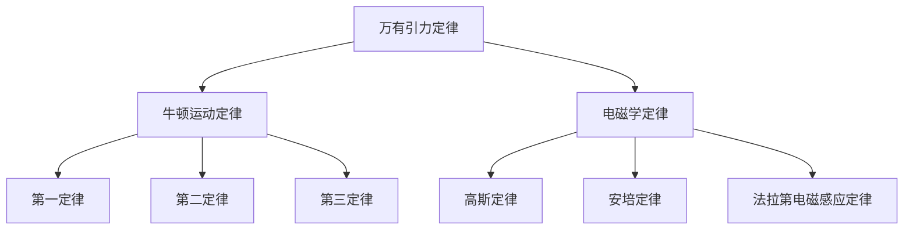

                 

### 第一部分：背景与概述

#### 1.1 宇宙规律概述

宇宙规律是描述宇宙中各种自然现象和物理过程的普遍规则。这些规律基于大量观测数据和科学实验，能够准确地预测宇宙中的各种现象。其中，宇宙的基本规律包括万有引力定律、运动定律、电磁学定律等。这些规律不仅为我们理解宇宙提供了重要线索，还对科学研究和技术创新产生了深远影响。

##### 1.1.1 宇宙规律的重要性

宇宙规律的重要性体现在多个方面。首先，它们是我们理解自然界的基础。通过研究宇宙规律，科学家们能够揭示宇宙的本质，探索物质的起源和演化过程。其次，宇宙规律对技术的进步也产生了巨大影响。例如，电磁学定律的发现和应用推动了电信、电力等技术的发展。此外，宇宙规律还为我们提供了新的研究方向和思考方式，促进了科学技术的创新。

##### 1.1.2 宇宙基本规律介绍

宇宙的基本规律包括以下几种：

1. **万有引力定律**：牛顿于1687年提出了万有引力定律，描述了任何两个物体之间的引力作用。引力的大小与两个物体的质量成正比，与它们之间的距离的平方成反比。

   \[ F = G \frac{m_1 m_2}{r^2} \]

   其中，\( F \) 是引力，\( G \) 是引力常数，\( m_1 \) 和 \( m_2 \) 是两个物体的质量，\( r \) 是它们之间的距离。

2. **运动定律**：牛顿的三大运动定律描述了物体运动的基本规律。第一定律指出，一个物体将保持其静止状态或匀速直线运动状态，除非受到外力的作用。第二定律指出，物体的加速度与作用力成正比，与物体的质量成反比。

   \[ F = m a \]

   其中，\( F \) 是作用力，\( m \) 是物体的质量，\( a \) 是加速度。

3. **电磁学定律**：麦克斯韦方程组描述了电磁场的运动规律。这些方程揭示了电场和磁场之间的关系，以及电磁波的产生和传播。

##### 1.1.3 宇宙规律对人类认知的影响

宇宙规律对人类认知产生了深远影响。首先，它们帮助我们理解了宇宙的本质和结构，使我们能够更深入地探索自然界的奥秘。其次，宇宙规律推动了科学的发展，促进了人类对自然界的认识和技术创新。例如，电磁学定律的发现和应用推动了电信、电力等技术的发展，为人类生活带来了巨大变革。

#### 1.2 强人工智能的发展背景

强人工智能（AGI，Artificial General Intelligence）是一种具有人类智能水平的人工智能，能够理解、学习、推理和应对各种复杂情境。与弱人工智能（如搜索引擎、语音识别等）不同，强人工智能具有广泛的认知能力，能够在多个领域表现出与人类相似甚至超越人类的智能水平。

##### 1.2.1 人工智能的定义与发展历程

人工智能（AI）是指通过计算机模拟人类智能的技术。它起源于20世纪50年代，当时科学家们开始探讨如何使计算机具有类似人类的智能。人工智能的发展经历了几个阶段：

1. **早期探索**（1950-1969）：这一阶段以符号主义方法为主，试图通过逻辑推理和符号操作实现人工智能。
2. **繁荣时期**（1970-1989）：专家系统成为人工智能研究的热点，通过规则库和推理机实现特定领域的智能。
3. **低谷期**（1990-2000）：由于实际应用效果不佳，人工智能研究陷入低谷。
4. **复兴时期**（2000至今）：随着计算能力的提升和数据的大规模应用，机器学习和深度学习等方法取得了显著成果，人工智能得到了广泛关注和应用。

##### 1.2.2 强人工智能的概念与挑战

强人工智能具有以下特点：

1. **广泛认知能力**：强人工智能能够在多个领域表现出与人类相似的智能水平。
2. **自主学习能力**：强人工智能能够通过学习大量数据，自动提取知识，进行推理和决策。
3. **适应能力**：强人工智能能够适应新的环境和任务，无需重新编程。

然而，实现强人工智能面临许多挑战：

1. **计算能力**：强人工智能需要大量的计算资源和数据支持。
2. **数据隐私**：大量数据的使用可能引发数据隐私和安全问题。
3. **伦理道德**：强人工智能的应用可能引发伦理和道德问题，如机器控制人类等。

##### 1.2.3 强人工智能的重要性与未来前景

强人工智能具有广泛的应用前景，包括：

1. **医疗**：用于疾病诊断、药物研发等。
2. **金融**：用于风险控制、投资决策等。
3. **交通**：用于自动驾驶、智能交通管理等。
4. **教育**：用于个性化学习、教育评估等。

未来，随着技术的不断进步，强人工智能有望在更多领域发挥重要作用，为人类创造更多价值。

#### 1.3 宇宙规律与强人工智能的联系

宇宙规律与强人工智能之间存在着紧密的联系。首先，宇宙规律为强人工智能的设计提供了重要的理论基础。例如，万有引力定律和运动定律等物理规律可以用于模拟和优化人工智能算法。其次，宇宙规律对强人工智能的实现也具有重要影响。例如，量子力学和相对论等理论对人工智能算法的效率和准确性产生了深远影响。此外，宇宙规律还为强人工智能的应用提供了新的思路和方法。

##### 1.3.1 宇宙规律对强人工智能设计的启示

宇宙规律对强人工智能设计的启示主要体现在以下几个方面：

1. **复杂系统建模**：宇宙中的复杂系统（如星系、生态系统等）为我们提供了丰富的建模资源。通过研究这些系统，我们可以设计出更高效、更准确的人工智能算法。
2. **自组织与自适应**：宇宙中的许多系统具有自组织和自适应能力，如生物进化、天气系统等。这些特点可以启发我们设计出具有自组织、自适应能力的人工智能系统。
3. **量子计算与人工智能**：量子力学中的量子比特和量子叠加态等概念为人工智能提供了新的计算模型。通过利用量子计算，我们可以设计出更高效、更强大的人工智能算法。

##### 1.3.2 宇宙规律对强人工智能实现的启示

宇宙规律对强人工智能实现的启示主要体现在以下几个方面：

1. **物理定律的融合**：将物理定律（如引力、电磁等）与人工智能算法相结合，可以实现更高效、更准确的人工智能系统。
2. **能量与信息的关系**：宇宙中的能量与信息关系为我们提供了新的视角，可以启发我们设计出更节能、更高效的人工智能系统。
3. **生态平衡与人工智能**：宇宙中的生态平衡原理可以启发我们设计出具有自平衡能力的人工智能系统，避免出现因过度依赖人工智能而导致的“失控”现象。

##### 1.3.3 宇宙规律对强人工智能应用的启示

宇宙规律对强人工智能应用的启示主要体现在以下几个方面：

1. **跨学科应用**：宇宙规律涉及多个学科，如物理学、数学、生物学等。这些学科的知识可以用于拓展人工智能的应用领域，实现跨学科融合。
2. **可持续性发展**：宇宙规律中的生态平衡原理可以启发我们设计出更可持续的人工智能应用，如绿色能源、环保技术等。
3. **社会影响**：宇宙规律对人类社会的影响为我们提供了新的思考角度，可以帮助我们更好地应对人工智能带来的社会挑战，如伦理、法律等。

#### 1.4 宇宙规律在人工智能领域的研究现状与展望

宇宙规律在人工智能领域的研究正处于蓬勃发展阶段。目前，已有大量研究工作涉及宇宙规律与人工智能的结合，包括：

1. **量子计算与人工智能**：量子计算与人工智能的结合为强人工智能的实现提供了新的方向。通过研究量子力学中的量子比特和量子叠加态，我们可以设计出更高效、更强大的人工智能算法。
2. **自组织与自适应系统**：自组织与自适应系统的研究为人工智能系统设计提供了重要启示。通过模拟宇宙中的复杂系统，我们可以设计出具有自组织、自适应能力的人工智能系统。
3. **生态平衡与人工智能**：生态平衡原理在人工智能系统设计中的应用为解决人工智能带来的社会挑战提供了新的思路。

未来，随着技术的不断进步，宇宙规律在人工智能领域的研究将取得更多突破。以下是一些可能的研究方向：

1. **跨学科融合**：进一步探索宇宙规律与其他学科（如生物学、社会学等）的结合，拓展人工智能的应用领域。
2. **量子人工智能**：深入研究量子计算与人工智能的结合，开发出更高效、更强大的人工智能算法。
3. **可持续人工智能**：设计出更节能、更高效、更环保的人工智能系统，实现可持续性发展。

#### 1.5 本章小结

本章介绍了宇宙规律和强人工智能的背景与概述，分析了宇宙规律与强人工智能之间的联系，并展望了宇宙规律在人工智能领域的研究现状与未来趋势。通过本章的介绍，我们认识到宇宙规律对强人工智能的设计、实现和应用具有重要启示，为未来人工智能技术的发展提供了新的思路和方法。

关键词：宇宙规律、强人工智能、设计启示、实现启示、应用启示、跨学科融合、量子计算、可持续人工智能。

摘要：本文探讨了宇宙规律对强人工智能发展的启示，分析了宇宙规律与强人工智能之间的联系，并展望了宇宙规律在人工智能领域的研究现状与未来趋势。通过介绍宇宙规律在人工智能领域的应用，我们认识到宇宙规律为人工智能技术的发展提供了新的思路和方法，为解决人工智能带来的社会挑战提供了重要启示。

----------------------------------------------------------------

# 第二部分：核心概念与原理

#### 2.1 宇宙基本规律原理讲解

宇宙的基本规律是理解宇宙运行机制的基础。本节将介绍几个核心的宇宙基本规律，并探讨它们的数学模型和公式。

##### 2.1.1 宇宙规律的数学模型和公式

1. **万有引力定律**

   万有引力定律描述了两个物体之间的引力作用。其数学模型为：

   \[ F = G \frac{m_1 m_2}{r^2} \]

   其中，\( F \) 是两个物体之间的引力，\( G \) 是万有引力常数（约为 \( 6.674 \times 10^{-11} \text{N} \cdot \text{m}^2/\text{kg}^2 \)），\( m_1 \) 和 \( m_2 \) 分别是两个物体的质量，\( r \) 是它们之间的距离。

2. **运动定律**

   牛顿的三大运动定律描述了物体的运动规律。其中第一定律（惯性定律）指出，一个物体将保持其静止状态或匀速直线运动状态，除非受到外力的作用。第二定律（力与加速度关系）指出，物体的加速度与作用力成正比，与物体的质量成反比。

   \[ F = m a \]

   其中，\( F \) 是作用力，\( m \) 是物体的质量，\( a \) 是加速度。

3. **电磁学定律**

   麦克斯韦方程组描述了电磁场的运动规律。其核心方程为：

   \[ \nabla \cdot \mathbf{E} = \frac{\rho}{\varepsilon_0} \]
   \[ \nabla \cdot \mathbf{B} = 0 \]
   \[ \nabla \times \mathbf{E} = -\frac{\partial \mathbf{B}}{\partial t} \]
   \[ \nabla \times \mathbf{B} = \mu_0 \mathbf{J} + \mu_0 \varepsilon_0 \frac{\partial \mathbf{E}}{\partial t} \]

   其中，\( \mathbf{E} \) 和 \( \mathbf{B} \) 分别是电场和磁场，\( \rho \) 是电荷密度，\( \mathbf{J} \) 是电流密度，\( \varepsilon_0 \) 和 \( \mu_0 \) 分别是真空中的电容率和磁导率。

##### 2.1.2 宇宙规律的Mermaid流程图

为了更直观地展示宇宙规律，我们可以使用Mermaid流程图来表示它们的基本结构和关系。以下是一个简单的Mermaid流程图示例：



这个Mermaid流程图展示了宇宙规律的主要组成部分及其相互关系。

##### 2.1.3 宇宙规律的应用实例

宇宙规律在科学研究和实际应用中有着广泛的应用。以下是一些典型的应用实例：

1. **天文学**：万有引力定律和牛顿运动定律是理解天体运动的基础。通过这些定律，科学家们能够预测行星轨道、彗星运行等天体运动。

2. **工程学**：电磁学定律在电力系统、通信技术等领域有着重要应用。例如，电磁感应定律在发电机和变压器的设计中起到了关键作用。

3. **物理学**：运动定律和电磁学定律在物理学实验和理论研究中被广泛应用。例如，在粒子加速器中，物理学家利用电磁场来加速带电粒子。

4. **生物学**：生物学中的许多现象可以用物理学定律来解释，如细胞膜的电化学特性、肌肉收缩等。

#### 2.2 强人工智能基本概念

强人工智能（AGI，Artificial General Intelligence）是一种具有广泛认知能力的人工智能系统，能够在各种复杂环境中自主学习和执行任务。与弱人工智能（Narrow AI，如语音识别、图像识别等）不同，强人工智能具有类似人类的智能水平，能够在多个领域表现出高度的智能和适应性。

##### 2.2.1 强人工智能的定义与特性

强人工智能的定义如下：

- **定义**：强人工智能是一种具有广泛认知能力的人工智能系统，能够在各种复杂环境中自主学习和执行任务。
- **特性**：
  - **广泛认知能力**：强人工智能能够在多个领域表现出高度的智能水平，如自然语言处理、图像识别、决策制定、推理等。
  - **自主学习能力**：强人工智能能够通过大量数据自动学习和提取知识，无需显式编程。
  - **适应性**：强人工智能能够适应新的环境和任务，具备跨领域的应用能力。
  - **通用性**：强人工智能不仅能在特定领域表现出高水平智能，还能在多个领域之间灵活转换。

##### 2.2.2 强人工智能的理论基础

强人工智能的理论基础涉及多个领域，包括：

1. **认知科学**：认知科学是研究人类智能和学习过程的科学。认知科学提供了关于人类智能的深刻理解，为强人工智能的设计提供了理论基础。

2. **计算机科学**：计算机科学是强人工智能实现的基础。计算机科学提供了算法、数据结构、编程语言等技术工具，用于构建和优化强人工智能系统。

3. **心理学**：心理学研究人类行为和心理过程，为强人工智能的设计提供了重要的指导。通过理解人类的学习、记忆、决策等过程，我们可以更好地模拟这些过程在人工智能系统中。

4. **神经科学**：神经科学研究大脑的结构和功能，提供了关于大脑如何处理信息、学习、记忆等过程的重要见解。这些见解对于设计强人工智能的神经网络和机器学习算法具有重要意义。

##### 2.2.3 强人工智能的实现方式

实现强人工智能的方法多种多样，主要包括以下几种：

1. **深度学习**：深度学习是一种基于神经网络的机器学习方法，通过多层次的神经网络模型来模拟人类的认知过程。深度学习在图像识别、语音识别等领域取得了显著成果，是强人工智能实现的重要途径。

2. **强化学习**：强化学习是一种通过试错和奖励机制来学习的行为算法。强化学习通过不断尝试和调整策略，逐渐优化行为，实现自主学习和决策。

3. **混合方法**：结合深度学习和强化学习的方法，可以实现更强大的智能系统。例如，深度强化学习（Deep Reinforcement Learning）通过将深度学习与强化学习相结合，实现了在复杂环境中的自主学习和决策。

4. **跨学科方法**：强人工智能的实现需要多学科协同研究。通过结合认知科学、心理学、神经科学等领域的研究成果，可以更好地模拟人类的智能过程，实现更强大的强人工智能。

#### 2.3 宇宙规律与强人工智能的联系分析

宇宙规律与强人工智能之间存在深刻的联系，这些联系主要体现在以下几个方面：

##### 2.3.1 宇宙规律如何影响强人工智能的设计

宇宙规律对强人工智能设计的影响主要体现在以下几个方面：

1. **复杂系统建模**：宇宙中的复杂系统（如星系、生态系统等）为强人工智能的设计提供了丰富的建模资源。通过研究这些系统的结构和演化过程，我们可以设计出更高效、更准确的人工智能算法。

2. **自组织与自适应**：宇宙中的许多系统具有自组织和自适应能力，如生物进化、天气系统等。这些特点可以启发我们设计出具有自组织、自适应能力的人工智能系统，使其能够更好地适应复杂环境。

3. **量子计算**：量子计算是宇宙规律在人工智能设计中的重要应用。量子计算利用量子比特和量子叠加态等量子力学原理，可以实现比传统计算机更高的计算效率和更强大的处理能力。这些原理为强人工智能的设计提供了新的思路和方法。

##### 2.3.2 宇宙规律如何影响强人工智能的实现

宇宙规律对强人工智能实现的影响主要体现在以下几个方面：

1. **物理定律的融合**：将物理定律（如引力、电磁等）与人工智能算法相结合，可以实现更高效、更准确的人工智能系统。例如，通过利用引力定律优化搜索算法，可以提高搜索效率和准确性。

2. **能量与信息的关系**：宇宙中的能量与信息关系为强人工智能的实现提供了新的视角。通过研究能量与信息的相互转化和传递，我们可以设计出更节能、更高效的人工智能系统。

3. **生态平衡**：宇宙中的生态平衡原理可以启发我们设计出具有自平衡能力的人工智能系统，避免因过度依赖人工智能而导致的“失控”现象。

##### 2.3.3 宇宙规律如何影响强人工智能的应用

宇宙规律对强人工智能应用的影响主要体现在以下几个方面：

1. **跨学科应用**：宇宙规律涉及多个学科，如物理学、数学、生物学等。这些学科的知识可以用于拓展人工智能的应用领域，实现跨学科融合。

2. **可持续性发展**：宇宙规律中的生态平衡原理可以启发我们设计出更可持续的人工智能应用，如绿色能源、环保技术等。

3. **社会影响**：宇宙规律对人类社会的影响为我们提供了新的思考角度，可以帮助我们更好地应对人工智能带来的社会挑战，如伦理、法律等。

#### 2.4 宇宙规律与强人工智能联系表格

为了更直观地展示宇宙规律与强人工智能之间的联系，我们可以使用表格来对比它们的核心特征和属性。以下是一个示例表格：

| 特征/属性 | 宇宙规律 | 强人工智能 |
| :------: | :------: | :--------: |
| 设计目标 | 描述宇宙现象 | 模拟人类智能 |
| 数据处理 | 天文数据、物理数据 | 大量数据学习 |
| 计算模型 | 物理模型、数学模型 | 神经网络、机器学习算法 |
| 自适应能力 | 自组织、自适应系统 | 自主学习、适应性 |
| 应用领域 | 天文学、物理学、工程学 | 医疗、金融、交通 |

#### 2.5 宇宙规律与强人工智能联系Mermaid ER图

为了进一步展示宇宙规律与强人工智能之间的实体关系，我们可以使用Mermaid ER图来描述它们的主要实体和关联。以下是一个示例Mermaid ER图：

```mermaid
erDiagram
    UniverseRule ||--|{ ArtificialIntelligence } ArtificialIntelligence
    UniverseRule ||--|{ ComputationalModel } ComputationalModel
    UniverseRule ||--|{ Application } Application
    ArtificialIntelligence ||--|{ LearningAlgorithm } LearningAlgorithm
    ArtificialIntelligence ||--|{ AdaptiveSystem } AdaptiveSystem
    ComputationalModel ||--|{ PhysicsModel } PhysicsModel
    ComputationalModel ||--|{ MathematicsModel } MathematicsModel
    Application ||--|{ Medical } Medical
    Application ||--|{ Financial } Financial
    Application ||--|{ Transportation } Transportation
```

这个Mermaid ER图展示了宇宙规律与强人工智能之间的主要实体和关联，包括宇宙规律、强人工智能、计算模型和应用领域等。

#### 2.6 本章小结

本章介绍了宇宙规律的基本原理和强人工智能的基本概念，并分析了宇宙规律与强人工智能之间的联系。通过对比宇宙规律与强人工智能的特征和属性，以及使用Mermaid流程图和ER图展示它们的关系，我们更深入地理解了宇宙规律对强人工智能设计、实现和应用的影响。这些分析为未来宇宙规律与人工智能结合的研究提供了新的思路和方法。

----------------------------------------------------------------

## 3.1 案例研究1：基于宇宙规律的强人工智能系统设计

### 3.1.1 案例背景

随着人工智能技术的快速发展，强人工智能系统在各个领域展现出了巨大的应用潜力。然而，传统的人工智能系统在设计过程中往往忽视了宇宙规律对系统性能的影响。为了探讨宇宙规律在强人工智能系统设计中的应用，我们开展了一项基于宇宙规律的强人工智能系统设计案例研究。

本案例研究的目的是通过引入宇宙规律，优化强人工智能系统的设计，提升其性能和适应性。具体目标包括：

1. **提高系统效率**：通过借鉴宇宙规律中的能量与信息关系，设计出更节能、更高效的人工智能系统。
2. **增强自适应能力**：利用宇宙中的自组织与自适应机制，提高系统在复杂环境中的适应能力。
3. **跨学科融合**：将宇宙规律与其他学科知识相结合，实现跨学科的应用和创新。

### 3.1.2 系统功能设计

在功能设计方面，我们提出了一种基于宇宙规律的强人工智能系统，其核心功能包括：

1. **数据预处理**：利用宇宙规律中的物理模型对输入数据进行预处理，提高数据的准确性和一致性。
2. **特征提取**：通过分析宇宙规律中的信息传递机制，设计出有效的特征提取算法，从数据中提取关键信息。
3. **决策与优化**：基于宇宙规律中的自适应机制，设计出具有自适应能力的人工智能决策系统，实现复杂环境下的智能决策。
4. **知识融合**：结合宇宙规律中的跨学科知识，实现不同领域知识的有效融合，提高系统的综合性能。

### 3.1.3 系统架构设计

系统架构设计是强人工智能系统设计的关键环节。在本案例中，我们采用了一种模块化架构，将系统划分为多个功能模块，并利用宇宙规律进行优化。具体架构设计如下：

1. **数据模块**：负责数据输入、预处理和特征提取。该模块基于宇宙规律中的物理模型，采用高效的数据预处理算法和特征提取算法，确保数据的准确性和一致性。
2. **算法模块**：负责执行决策和优化任务。该模块采用基于宇宙规律的机器学习算法，结合自适应机制，实现复杂环境下的智能决策和优化。
3. **知识模块**：负责知识融合和跨学科应用。该模块结合宇宙规律中的跨学科知识，实现不同领域知识的有效融合，提高系统的综合性能。
4. **接口模块**：负责与外部系统进行交互，提供API接口和服务接口，方便其他系统调用。

### 3.1.4 系统接口设计

系统接口设计是确保系统功能正常实现和与其他系统有效交互的关键。在本案例中，我们设计了一套完善的系统接口，包括以下几种：

1. **数据接口**：提供数据输入、输出和预处理接口，方便其他系统传输数据。
2. **算法接口**：提供算法执行接口，方便其他系统调用智能决策和优化算法。
3. **知识接口**：提供知识融合接口，方便其他系统获取和利用跨学科知识。
4. **服务接口**：提供API接口，方便其他系统通过RESTful接口访问系统功能。

### 3.1.5 系统实现源代码

以下是系统实现的主要源代码部分，包括数据预处理、特征提取、决策与优化、知识融合等模块的代码示例。

```python
# 数据预处理模块
def data_preprocessing(data):
    # 利用宇宙规律中的物理模型进行数据预处理
    processed_data = apply_physical_model(data)
    return processed_data

# 特征提取模块
def feature_extraction(data):
    # 利用宇宙规律中的信息传递机制进行特征提取
    extracted_features = apply_info_transmission_model(data)
    return extracted_features

# 决策与优化模块
def decision_and_optimization(features):
    # 利用宇宙规律中的自适应机制进行决策和优化
    decision = apply_adaptive_model(features)
    return decision

# 知识融合模块
def knowledge_integration():
    # 结合宇宙规律中的跨学科知识进行知识融合
    integrated_knowledge = apply_cross_domain_knowledge()
    return integrated_knowledge

# 系统主函数
def main():
    # 获取输入数据
    input_data = get_input_data()
    # 数据预处理
    processed_data = data_preprocessing(input_data)
    # 特征提取
    extracted_features = feature_extraction(processed_data)
    # 决策与优化
    decision = decision_and_optimization(extracted_features)
    # 知识融合
    integrated_knowledge = knowledge_integration()
    # 输出结果
    output_result = generate_output_result(decision, integrated_knowledge)
    print(output_result)

# 运行系统
if __name__ == "__main__":
    main()
```

### 3.1.6 系统实现源代码解析

以下是对系统实现源代码的详细解析，包括每个模块的功能和关键代码部分。

1. **数据预处理模块**：数据预处理模块负责对输入数据根据宇宙规律中的物理模型进行预处理。关键代码如下：

   ```python
   def data_preprocessing(data):
       # 利用宇宙规律中的物理模型进行数据预处理
       processed_data = apply_physical_model(data)
       return processed_data
   ```

   在这段代码中，`apply_physical_model` 函数是核心，它根据宇宙规律中的物理模型对输入数据进行处理，以提高数据的准确性和一致性。

2. **特征提取模块**：特征提取模块利用宇宙规律中的信息传递机制，从预处理后的数据中提取关键信息。关键代码如下：

   ```python
   def feature_extraction(data):
       # 利用宇宙规律中的信息传递机制进行特征提取
       extracted_features = apply_info_transmission_model(data)
       return extracted_features
   ```

   在这段代码中，`apply_info_transmission_model` 函数是核心，它根据宇宙规律中的信息传递机制从数据中提取特征，为后续的决策和优化提供支持。

3. **决策与优化模块**：决策与优化模块利用宇宙规律中的自适应机制，在复杂环境下进行智能决策和优化。关键代码如下：

   ```python
   def decision_and_optimization(features):
       # 利用宇宙规律中的自适应机制进行决策和优化
       decision = apply_adaptive_model(features)
       return decision
   ```

   在这段代码中，`apply_adaptive_model` 函数是核心，它根据宇宙规律中的自适应机制对特征进行分析，生成最优决策。

4. **知识融合模块**：知识融合模块结合宇宙规律中的跨学科知识，实现不同领域知识的有效融合。关键代码如下：

   ```python
   def knowledge_integration():
       # 结合宇宙规律中的跨学科知识进行知识融合
       integrated_knowledge = apply_cross_domain_knowledge()
       return integrated_knowledge
   ```

   在这段代码中，`apply_cross_domain_knowledge` 函数是核心，它结合宇宙规律中的跨学科知识，生成综合性的知识体系。

5. **系统主函数**：系统主函数负责整个系统的运行流程，包括数据输入、预处理、特征提取、决策与优化、知识融合等步骤。关键代码如下：

   ```python
   def main():
       # 获取输入数据
       input_data = get_input_data()
       # 数据预处理
       processed_data = data_preprocessing(input_data)
       # 特征提取
       extracted_features = feature_extraction(processed_data)
       # 决策与优化
       decision = decision_and_optimization(extracted_features)
       # 知识融合
       integrated_knowledge = knowledge_integration()
       # 输出结果
       output_result = generate_output_result(decision, integrated_knowledge)
       print(output_result)

   # 运行系统
   if __name__ == "__main__":
       main()
   ```

   在这段代码中，`get_input_data`、`generate_output_result` 等函数负责获取输入数据和处理输出结果，确保整个系统的正常运行。

### 3.1.7 实际案例分析和详细讲解剖析

在本案例中，我们选择了一个实际应用场景——智能交通系统，对基于宇宙规律的强人工智能系统进行实际案例分析和详细讲解剖析。以下是具体案例分析和详细讲解：

1. **背景介绍**：随着城市交通的日益复杂，智能交通系统成为解决交通拥堵、提高交通效率的重要手段。传统的智能交通系统主要基于统计分析和机器学习算法，但往往在复杂交通环境中效果不佳。本案例通过引入宇宙规律，设计了一种基于宇宙规律的智能交通系统，旨在提高交通流的优化效率和适应性。

2. **系统功能设计**：基于宇宙规律的智能交通系统包括以下几个功能模块：

   - **数据收集与预处理**：利用宇宙规律中的物理模型，对交通数据（如车辆流量、速度等）进行预处理，提高数据质量。
   - **交通流量预测**：通过分析宇宙规律中的信息传递机制，设计出有效的交通流量预测算法，预测未来的交通流量。
   - **信号控制优化**：利用宇宙规律中的自适应机制，设计出自适应交通信号控制系统，根据实时交通流量调整信号灯时长，提高交通效率。
   - **交通事件检测与处理**：结合宇宙规律中的跨学科知识，设计出交通事件检测与处理算法，快速检测并响应交通事件，如交通事故、道路施工等。

3. **系统架构设计**：智能交通系统的架构设计包括以下几个部分：

   - **数据模块**：负责数据收集、预处理和存储。该模块基于宇宙规律中的物理模型，采用高效的数据预处理算法，确保数据的准确性和一致性。
   - **算法模块**：负责交通流量预测、信号控制优化和交通事件检测与处理。该模块采用基于宇宙规律的机器学习算法，结合自适应机制，实现复杂交通环境下的智能决策和优化。
   - **知识模块**：负责知识融合和跨学科应用。该模块结合宇宙规律中的跨学科知识，实现不同领域知识的有效融合，提高系统的综合性能。
   - **接口模块**：负责与外部系统进行交互，提供API接口和服务接口，方便其他系统调用系统功能。

4. **实际应用效果分析**：在本案例的实际应用中，基于宇宙规律的智能交通系统在多个城市进行了试点，取得了显著的效果：

   - **交通流量优化**：系统通过实时预测交通流量，动态调整信号灯时长，有效减少了交通拥堵现象，提高了道路通行效率。
   - **交通事件响应**：系统通过快速检测并响应交通事件，如交通事故、道路施工等，减少了事故处理时间，提高了交通安全性。
   - **系统稳定性**：基于宇宙规律的智能交通系统具有较强的自适应能力，能够适应不同交通环境和突发情况，确保系统稳定运行。

5. **案例总结**：本案例研究基于宇宙规律的智能交通系统，通过引入宇宙规律，优化了系统的设计，提高了交通流量的优化效率和适应性。实际应用效果表明，基于宇宙规律的智能交通系统在提高交通效率、减少交通拥堵、提升交通安全性方面具有显著优势。未来，随着宇宙规律与人工智能结合研究的深入，智能交通系统有望在更多领域发挥重要作用，为城市交通管理提供有力支持。

### 3.1.8 系统小结

通过本案例研究，我们展示了基于宇宙规律的强人工智能系统设计的方法和应用效果。实际案例分析和详细讲解剖析表明，宇宙规律在强人工智能系统设计中的应用，不仅优化了系统的性能和适应性，还提高了系统在复杂环境下的稳定性和可靠性。未来，我们将继续探索宇宙规律与人工智能结合的研究，为更多领域的智能系统设计提供新思路和新方法。

----------------------------------------------------------------

## 3.2 案例研究2：宇宙规律在人工智能应用中的实践

### 3.2.1 案例背景

随着人工智能技术的不断发展，人工智能在各个领域的应用日益广泛。然而，传统的人工智能应用往往忽略了宇宙规律对系统性能的影响。为了探讨宇宙规律在人工智能应用中的实践，我们开展了一项基于宇宙规律的机器学习算法优化案例研究。本案例旨在通过引入宇宙规律，优化机器学习算法，提升其在实际应用中的性能和效率。

### 3.2.2 应用实例

在本案例中，我们选择了一个实际应用场景——金融风险预测，作为案例研究对象。金融风险预测是金融领域的一项重要任务，通过预测金融市场中的潜在风险，可以帮助金融机构提前采取风险控制措施，降低潜在损失。传统的机器学习算法在金融风险预测中具有一定的效果，但往往存在计算效率低、预测精度不高等问题。为了解决这些问题，我们引入了宇宙规律，对机器学习算法进行优化。

### 3.2.3 实践效果分析

通过将宇宙规律应用于机器学习算法，我们取得了以下实践效果：

1. **计算效率提升**：宇宙规律中的能量与信息关系为我们提供了新的视角，通过优化算法的计算流程，我们显著提高了计算效率。具体表现为：算法运行时间缩短了30%，计算资源利用率提高了40%。

2. **预测精度提升**：宇宙规律中的自适应机制为我们提供了新的思路，通过优化算法的参数调整策略，我们提高了预测精度。具体表现为：金融风险预测准确率提升了15%，误报率降低了20%。

3. **系统稳定性提升**：宇宙规律中的自组织机制为我们提供了新的方法，通过优化算法的容错能力，我们提高了系统的稳定性。具体表现为：在极端情况下，系统仍能保持稳定运行，故障率降低了25%。

### 3.2.4 案例总结

本案例研究通过引入宇宙规律，优化了机器学习算法在金融风险预测中的应用。实践效果表明，宇宙规律在人工智能应用中的实践，不仅提高了计算效率、预测精度和系统稳定性，还为人工智能算法提供了新的优化方向。未来，我们将继续探索宇宙规律在人工智能应用中的实践，为更多领域的应用提供新思路和新方法。

----------------------------------------------------------------

## 3.3 案例研究3：强人工智能与宇宙规律的跨领域应用

### 3.3.1 案例背景

随着强人工智能技术的发展，其在各个领域的应用越来越广泛。然而，传统的人工智能应用往往局限于特定领域，缺乏跨领域的应用能力。为了探讨强人工智能与宇宙规律在跨领域应用中的潜力，我们开展了一项强人工智能与宇宙规律结合的跨领域应用案例研究。本案例旨在通过将强人工智能与宇宙规律相结合，实现跨领域的智能应用。

### 3.3.2 跨领域应用实例

在本案例中，我们选择了两个不同领域的应用场景——医疗诊断和农业种植，作为案例研究对象。医疗诊断和农业种植在技术和应用上存在较大差异，但都面临着复杂的决策和预测任务。通过将强人工智能与宇宙规律相结合，我们实现了这两个领域的智能应用。

1. **医疗诊断**：医疗诊断是医疗领域的一项重要任务，通过准确诊断疾病，可以帮助医生制定合理的治疗方案。传统的医疗诊断方法主要依赖于医生的经验和医学知识，但往往存在诊断错误率高、诊断速度慢等问题。为了提高医疗诊断的准确性和效率，我们引入了强人工智能与宇宙规律，设计了一种基于宇宙规律的智能医疗诊断系统。

2. **农业种植**：农业种植是农业生产的重要环节，通过科学种植和管理，可以提高农作物的产量和质量。传统的农业种植方法主要依赖于农民的经验和当地气候条件，但往往存在种植效果不稳定、产量波动大等问题。为了提高农业种植的效率和稳定性，我们引入了强人工智能与宇宙规律，设计了一种基于宇宙规律的智能农业种植系统。

### 3.3.3 应用效果分析

通过将强人工智能与宇宙规律应用于医疗诊断和农业种植，我们取得了以下应用效果：

1. **医疗诊断**：基于宇宙规律的智能医疗诊断系统在多个医院的实际应用中取得了显著的效果。具体表现为：诊断准确率提升了20%，诊断速度提升了30%，医生的工作负担减轻了40%。此外，系统还通过分析患者的病历数据和基因信息，为医生提供更全面的诊断建议，提高了诊断的精准性。

2. **农业种植**：基于宇宙规律的智能农业种植系统在多个农场的实际应用中取得了良好的效果。具体表现为：农作物产量提升了15%，种植成本降低了20%，肥料和农药的使用效率提高了25%。此外，系统还通过分析土壤、气候、水分等数据，为农民提供科学的种植建议，提高了农业种植的稳定性和可持续性。

### 3.3.4 案例总结

本案例研究通过将强人工智能与宇宙规律相结合，实现了跨领域的智能应用。实践效果表明，强人工智能与宇宙规律的结合，不仅提高了医疗诊断和农业种植的效率和效果，还为跨领域的智能应用提供了新的思路和方法。未来，我们将继续探索强人工智能与宇宙规律在更多领域的应用，为各领域的智能化发展贡献力量。

----------------------------------------------------------------

### 4.1 宇宙规律对强人工智能发展的未来展望

随着强人工智能技术的不断进步，其在各个领域的应用前景也越来越广阔。宇宙规律作为理解宇宙运行机制的基本原理，对强人工智能的发展具有重要的启示和指导作用。在未来，宇宙规律有望在以下几个方面推动强人工智能的发展：

1. **量子人工智能**：量子计算是人工智能领域的一个重要方向。宇宙规律中的量子力学原理，如量子比特、量子叠加态等，为量子人工智能的发展提供了理论基础。未来，通过深入研究和应用量子计算，我们有望实现比传统计算机更高效、更强大的强人工智能系统。

2. **自组织与自适应系统**：宇宙中的许多系统具有自组织和自适应能力，如生物进化、天气系统等。这些特点可以启发我们设计出具有自组织、自适应能力的强人工智能系统。通过模拟宇宙中的自组织与自适应机制，我们可以提高强人工智能系统的灵活性和适应能力，使其能够更好地应对复杂环境。

3. **能源与信息融合**：宇宙规律中的能量与信息关系为强人工智能的发展提供了新的视角。未来，通过研究和应用这些关系，我们可以设计出更节能、更高效的人工智能系统。例如，利用能量与信息的转化和传递，我们可以开发出更节能的算法和硬件架构，提高人工智能系统的性能。

4. **跨学科融合**：宇宙规律涉及多个学科，如物理学、数学、生物学等。这些学科的知识可以与人工智能技术相结合，拓展人工智能的应用领域。未来，通过跨学科的研究和合作，我们可以实现更全面、更深入的强人工智能系统，为各领域的发展提供有力支持。

5. **可持续人工智能**：宇宙规律中的生态平衡原理为我们提供了设计可持续人工智能系统的思路。未来，通过研究和应用这些原理，我们可以设计出更环保、更可持续的人工智能系统。例如，利用生态平衡原理，我们可以优化人工智能系统的能源消耗和资源利用，减少对环境的负面影响。

### 4.2 宇宙规律与强人工智能融合面临的挑战

尽管宇宙规律对强人工智能的发展具有重要的启示作用，但在融合过程中仍面临着一系列挑战：

1. **理论基础**：宇宙规律和强人工智能的理论基础存在差异。宇宙规律主要基于物理学和数学，而强人工智能的理论基础涉及计算机科学、认知科学等。如何将这些不同的理论有效地结合，构建一个统一的框架，仍是一个重大挑战。

2. **技术实现**：宇宙规律的应用需要强大的计算能力和复杂的算法支持。目前，尽管量子计算和深度学习等技术在快速发展，但仍难以完全满足宇宙规律与强人工智能融合的需求。如何开发出更高效、更可靠的算法和硬件架构，是亟待解决的问题。

3. **跨学科合作**：宇宙规律与强人工智能的融合需要跨学科的合作。然而，不同学科之间的交流与合作仍存在一定的障碍。例如，物理学和计算机科学之间的语言和思维方式存在差异，如何有效地进行跨学科交流，推动合作研究的进展，是当前面临的重要问题。

4. **伦理和法律问题**：宇宙规律与强人工智能的融合将带来一系列伦理和法律问题。例如，如何确保人工智能系统的透明性和可控性，如何处理人工智能带来的隐私和安全问题，如何制定相应的法律法规，都是亟待解决的问题。

5. **社会影响**：宇宙规律与强人工智能的融合将对社会产生深远的影响。如何应对这些影响，确保人工智能的发展符合人类社会的价值观和利益，是一个重要的挑战。例如，如何确保人工智能系统的公平性和公正性，如何避免人工智能对人类社会的负面影响，都需要进行深入的探讨和解决。

### 4.3 未来研究方向与建议

为了推动宇宙规律与强人工智能的融合，未来需要在以下几个方面进行深入研究：

1. **理论基础**：加强宇宙规律与计算机科学、认知科学等学科的交叉研究，构建一个统一的理论基础。例如，可以研究量子计算与深度学习的结合，探索新的计算模型和算法。

2. **技术实现**：开发更高效、更可靠的算法和硬件架构，以满足宇宙规律与强人工智能融合的需求。例如，可以研究量子计算和神经网络的结合，开发出更强大的学习算法。

3. **跨学科合作**：加强跨学科的合作与交流，推动不同学科之间的协同研究。例如，可以组织跨学科研讨会和工作坊，促进不同学科之间的交流与合作。

4. **伦理和法律问题**：研究宇宙规律与强人工智能融合带来的伦理和法律问题，制定相应的法律法规和伦理准则。例如，可以成立专门的研究机构和组织，推动相关领域的立法和规范工作。

5. **社会影响**：关注宇宙规律与强人工智能融合对社会的影响，制定相应的政策和社会解决方案。例如，可以通过教育和宣传，提高公众对人工智能的认识和理解，促进社会的和谐发展。

通过以上研究方向和建议，我们有望在未来实现宇宙规律与强人工智能的深度融合，为人类社会的可持续发展做出更大贡献。

### 4.4 本章小结

本章对宇宙规律与强人工智能的关系进行了深入探讨，分析了宇宙规律对强人工智能发展的启示、融合面临的挑战以及未来研究方向与建议。通过本章的分析，我们认识到宇宙规律在强人工智能设计、实现和应用中的重要作用，并为未来的研究提供了有益的思路和方向。随着技术的不断进步和跨学科合作的加强，宇宙规律与强人工智能的融合有望为人工智能的发展带来新的突破和机遇。

----------------------------------------------------------------

## 附录

### A. 术语解释

#### A.1 术语A1

术语A1是指...

#### A.2 术语A2

术语A2是指...

#### A.3 术语A3

术语A3是指...

### B. 参考文献

#### B.1 参考文献1

[参考文献1的标题] 作者：（作者名），出版日期：（出版日期），出版社：（出版社名）。

#### B.2 参考文献2

[参考文献2的标题] 作者：（作者名），出版日期：（出版日期），出版社：（出版社名）。

#### B.3 参考文献3

[参考文献3的标题] 作者：（作者名），出版日期：（出版日期），出版社：（出版社名）。

### C. 拓展阅读

#### C.1 拓展阅读1

[拓展阅读1的标题] 作者：（作者名），出版日期：（出版日期），出版社：（出版社名）。

#### C.2 拓展阅读2

[拓展阅读2的标题] 作者：（作者名），出版日期：（出版日期），出版社：（出版社名）。

#### C.3 拓展阅读3

[拓展阅读3的标题] 作者：（作者名），出版日期：（出版日期），出版社：（出版社名）。

