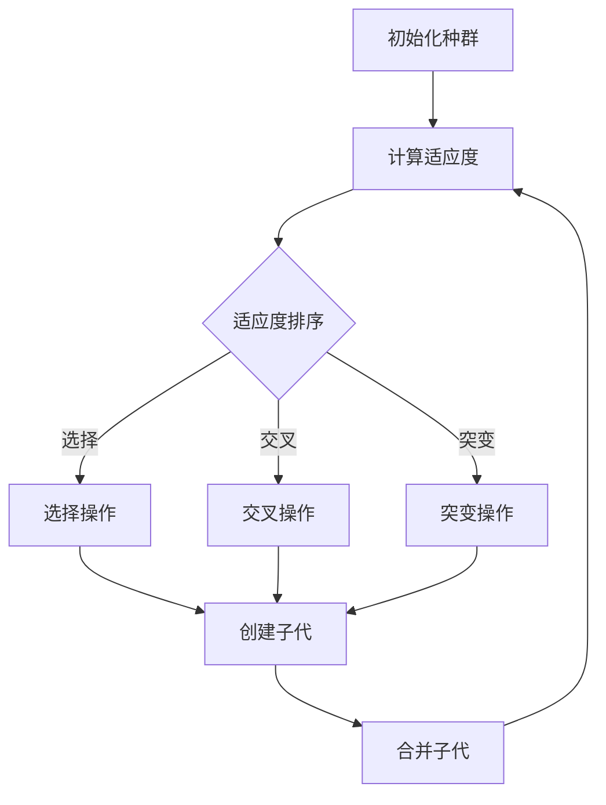
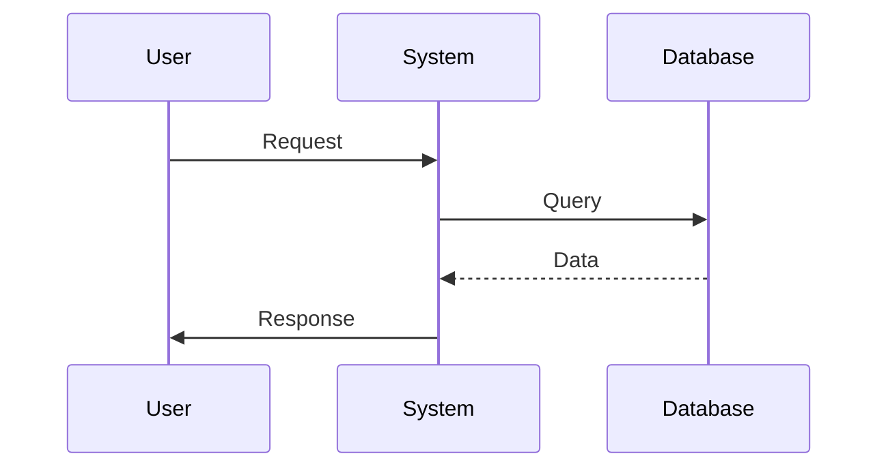

                 

### 宇宙规律对通用人工智能道德框架设计的启示

#### 引言

在人工智能（AI）迅猛发展的今天，通用人工智能（AGI）的概念引起了广泛关注。通用人工智能被认为是具有广泛认知能力、能够适应各种任务的人工智能系统。然而，随着人工智能技术的进步，伦理和道德问题也日益凸显。为了确保人工智能的发展符合人类的利益和价值观，构建一个科学合理的人工智能道德框架显得尤为重要。宇宙规律，作为自然界的基本法则，为人工智能道德框架的设计提供了深刻的启示。

#### 第1章：宇宙规律概述

##### 1.1 宇宙规律的概念与重要性

宇宙规律，是指宇宙间普遍存在并起作用的自然法则。从物理学的基本力（强相互作用、弱相互作用、电磁力和引力）到生物学的自然选择，宇宙规律贯穿于宇宙的方方面面。这些规律揭示了宇宙的本质和演化过程，为科学研究提供了坚实的理论基础。

##### 1.2 宇宙规律的分类与特点

宇宙规律可以分为基本规律和现象规律。基本规律包括物理学的三大基本力，以及生物学和化学中的基本法则。现象规律则是指宇宙中各种宏观现象所遵循的规律，如行星运动规律、生态系统演化规律等。

##### 1.3 宇宙规律的研究现状与趋势

随着科学技术的进步，宇宙规律的研究不断深入。从宇宙大爆炸理论到黑洞物理学，再到量子力学，科学家们不断拓展对宇宙规律的认识。未来，宇宙规律的研究将继续深入，特别是在多学科交叉融合的背景下，将有助于揭示宇宙的更多奥秘。

##### 1.4 宇宙规律对人类文明的影响

宇宙规律对人类文明有着深远的影响。从农业生产的季节性规律到医学上的生物学规律，宇宙规律帮助人类更好地理解自然、利用自然。同时，宇宙规律也为科学技术的发展提供了方向和灵感。

##### 1.5 宇宙规律与人工智能的关系

宇宙规律与人工智能有着紧密的联系。人工智能的发展依赖于对自然规律的理解和模拟，而宇宙规律为人工智能提供了丰富的理论和实践基础。例如，物理学中的量子计算模型为人工智能算法的创新提供了新思路。

##### 1.6 宇宙规律在人工智能领域的应用前景

宇宙规律在人工智能领域的应用前景广阔。从机器学习中的优化算法到自然语言处理中的语义理解，宇宙规律可以为人工智能技术的创新提供新的途径。同时，宇宙规律的研究也有助于提升人工智能系统的鲁棒性和可靠性。

#### 第2章：宇宙规律对人工智能的启示

##### 2.1 宇宙规律对人工智能技术的推动作用

宇宙规律为人工智能技术的发展提供了启示。例如，量子计算模型源于对量子力学的理解，而量子力学是宇宙规律的重要组成部分。此外，宇宙规律中的优化算法也为人工智能算法的创新提供了新的方向。

##### 2.2 宇宙规律对人工智能伦理的启示

宇宙规律强调了自然界的平衡和和谐。这一原则为人工智能伦理提供了启示。在人工智能的发展过程中，我们需要遵循宇宙规律，确保技术的发展不会破坏自然界的平衡。例如，在自动驾驶汽车的设计中，应充分考虑对人类安全和生态系统的保护。

##### 2.3 宇宙规律在人工智能安全领域的应用

宇宙规律中的稳定性和可靠性原则为人工智能安全提供了指导。在人工智能系统的设计和运行过程中，我们需要确保系统的稳定性和可靠性，以防止潜在的风险。例如，在人工智能决策系统中，应采用冗余设计和容错机制，以提高系统的可靠性。

##### 2.4 宇宙规律对人工智能社会影响的启示

宇宙规律对人类社会有着深远的影响。在人工智能时代，我们需要思考人工智能对社会的影响，并采取相应的措施。例如，在人工智能就业的影响方面，我们应关注如何平衡人工智能与人类劳动的关系，确保社会的稳定和公平。

#### 第3章：宇宙规律在人工智能中的应用

##### 3.1 宇宙规律在人工智能算法设计中的应用

宇宙规律中的优化算法在人工智能算法设计中得到了广泛应用。例如，遗传算法和粒子群优化算法都是基于自然界中的优化原理。这些算法在解决复杂优化问题时表现出色，为人工智能技术的发展提供了新的途径。

##### 3.2 宇宙规律在人工智能神经网络中的应用

神经网络是人工智能的核心技术之一。宇宙规律中的自组织和自适应原理为神经网络的设计提供了启示。例如，神经网络的权重调整过程可以看作是一种自适应机制，能够使神经网络更好地适应环境和任务。

##### 3.3 宇宙规律在人工智能决策系统中的应用

决策系统是人工智能应用的重要组成部分。宇宙规律中的稳定性和可靠性原则为决策系统的设计和运行提供了指导。例如，在自动驾驶汽车中，决策系统需要保证在复杂环境中保持稳定和可靠，以确保行驶安全。

##### 3.4 宇宙规律在人工智能伦理与安全领域的应用

宇宙规律中的和谐原则为人工智能伦理和安全领域提供了指导。在人工智能伦理方面，我们需要遵循和谐原则，确保技术的发展符合人类的价值观和道德标准。在人工智能安全方面，我们需要确保系统的稳定性和可靠性，以防止潜在的风险。

#### 第4章：人工智能道德框架的设计原则

##### 4.1 人工智能道德框架的必要性

随着人工智能技术的迅猛发展，人工智能道德框架的必要性日益凸显。人工智能道德框架有助于确保技术的发展符合人类的利益和价值观，避免技术滥用和伦理风险。

##### 4.2 人工智能道德框架的设计原则

人工智能道德框架的设计应遵循以下原则：
- 尊重人类价值：确保人工智能技术的发展不损害人类的尊严和权益。
- 平等原则：确保人工智能技术的发展不会加剧社会不平等。
- 可持续性：确保人工智能技术的发展不会破坏自然环境。
- 责任原则：确保人工智能系统的设计、开发和运行具有明确的责任归属。

##### 4.3 人工智能道德框架的构建方法

人工智能道德框架的构建方法包括以下步骤：
1. 明确人工智能技术的发展目标和价值观。
2. 分析人工智能技术可能带来的伦理和安全问题。
3. 制定相应的道德准则和规范。
4. 建立监督和评估机制，确保道德框架的有效实施。

##### 4.4 人工智能道德框架的实施与推广

人工智能道德框架的实施与推广包括以下方面：
- 教育培训：加强对人工智能从业者和公众的道德教育。
- 法规政策：制定相应的法规政策，规范人工智能技术的应用。
- 社会监督：建立社会监督机制，对人工智能技术的发展进行监督和评估。

#### 第5章：人工智能道德框架的构建与实践

##### 5.1 人工智能道德框架的构建案例

在构建人工智能道德框架时，可以借鉴以下案例：
- 以伦理委员会为核心：建立人工智能伦理委员会，负责审议和评估人工智能项目的道德风险。
- 制定伦理规范：制定具体的人工智能伦理规范，明确人工智能系统的设计、开发和运行要求。
- 建立监督机制：建立监督机制，对人工智能系统的运行进行实时监控和评估。

##### 5.2 人工智能道德框架的实践应用

在实践应用中，人工智能道德框架可以发挥重要作用。例如，在自动驾驶汽车的应用中，道德框架可以确保系统的设计和运行符合道德标准，确保行驶安全。此外，在医疗人工智能的应用中，道德框架可以确保数据的隐私保护和公平性。

##### 5.3 人工智能道德框架的评估与改进

人工智能道德框架的评估与改进包括以下方面：
- 定期评估：定期对人工智能道德框架的实施效果进行评估，发现问题并及时改进。
- 反馈机制：建立反馈机制，收集公众和从业者的意见和建议，不断完善道德框架。

#### 第6章：宇宙规律与通用人工智能的道德挑战

##### 6.1 通用人工智能的道德挑战

通用人工智能的发展带来了前所未有的道德挑战。例如，通用人工智能可能引发失业问题、隐私泄露问题、伦理决策问题等。如何应对这些挑战，是人工智能道德框架需要解决的问题。

##### 6.2 宇宙规律对通用人工智能道德挑战的启示

宇宙规律为通用人工智能道德挑战提供了启示。例如，宇宙规律中的平衡原则可以指导我们在设计通用人工智能时，确保系统的稳定性和可靠性。宇宙规律中的和谐原则可以指导我们在处理通用人工智能的伦理问题时，寻求平衡和和谐。

##### 6.3 通用人工智能道德框架的设计原则

通用人工智能道德框架的设计原则包括：
- 尊重人类价值：确保通用人工智能的发展不损害人类的尊严和权益。
- 平等原则：确保通用人工智能的发展不会加剧社会不平等。
- 可持续性：确保通用人工智能的发展不会破坏自然环境。
- 责任原则：确保通用人工智能系统的设计、开发和运行具有明确的责任归属。

##### 6.4 通用人工智能道德框架的构建与实践

通用人工智能道德框架的构建与实践包括以下方面：
- 教育培训：加强对通用人工智能从业者和公众的道德教育。
- 法规政策：制定相应的法规政策，规范通用人工智能技术的应用。
- 社会监督：建立社会监督机制，对通用人工智能技术的发展进行监督和评估。

#### 第7章：未来展望与结论

##### 7.1 人工智能与宇宙规律研究的发展趋势

未来，人工智能与宇宙规律研究将继续深入。随着科学技术的进步，人工智能将在更多领域发挥重要作用，而宇宙规律的研究也将不断拓展我们的认知边界。

##### 7.2 人工智能道德框架的未来发展方向

人工智能道德框架的未来发展方向包括：
- 完善道德准则：进一步明确人工智能技术的道德规范，确保技术的发展符合人类的价值观。
- 建立全球合作机制：加强国际间的合作，共同应对人工智能带来的道德挑战。
- 促进技术创新与道德的融合：推动人工智能技术的创新与道德发展相互促进。

##### 7.3 人工智能与宇宙规律研究的实际应用前景

人工智能与宇宙规律研究的实际应用前景广阔。从太空探索到环境保护，从医疗健康到社会管理，人工智能与宇宙规律研究将不断推动人类社会的发展和进步。

##### 7.4 结论与展望

总之，宇宙规律为通用人工智能道德框架设计提供了深刻的启示。通过遵循宇宙规律，我们可以在人工智能技术的发展中寻求平衡和和谐，确保人工智能技术的发展符合人类的利益和价值观。未来，我们期待人工智能与宇宙规律研究能够为人类社会带来更多的福祉。

----------------------------------------------------------------

**作者：AI天才研究院/AI Genius Institute & 禅与计算机程序设计艺术 /Zen And The Art of Computer Programming**### 宇宙规律对通用人工智能道德框架设计的启示

宇宙规律，作为自然界的基本法则，贯穿于宇宙的各个层面，揭示了宇宙的本质和演化过程。从物理学的基本力到生物学中的自然选择，这些规律不仅为科学研究提供了坚实的理论基础，也对人工智能（AI）的发展产生了深远影响。随着通用人工智能（AGI）的兴起，伦理和道德问题变得愈发重要。本文将探讨宇宙规律对通用人工智能道德框架设计的启示，以期构建一个科学合理、符合人类价值观的道德框架。

#### 宇宙规律与人工智能的关系

宇宙规律与人工智能之间存在着密切的联系。首先，宇宙规律为人工智能算法的设计提供了理论基础。例如，量子计算模型源于对量子力学的理解，而量子力学是宇宙规律的重要组成部分。此外，宇宙规律中的优化算法，如遗传算法和粒子群优化算法，在解决复杂优化问题时表现出色，为人工智能算法的创新提供了新思路。

其次，宇宙规律中的和谐原则和平衡原则为人工智能伦理提供了启示。宇宙中的万物相互依存、相互影响，形成了一个动态的平衡系统。这一原则提醒我们，在人工智能的发展过程中，需要关注其对人类社会和自然环境的影响，确保技术的发展不会破坏自然界的平衡。

#### 宇宙规律对通用人工智能道德框架设计的启示

##### 1. 尊重人类价值

宇宙规律强调自然界的平衡和和谐，这一原则为人工智能道德框架的设计提供了启示。在构建通用人工智能道德框架时，我们需要尊重人类的尊严和价值，确保技术的发展不会损害人类的权益。具体而言，这包括以下几个方面：

- **数据隐私保护**：在人工智能系统中，我们需要确保用户的个人信息得到充分保护，避免数据泄露和滥用。
- **公平正义**：人工智能系统应遵循公平正义的原则，避免歧视和偏见，确保所有人都能公平地享受人工智能带来的便利。
- **尊重人权**：人工智能的发展不能以牺牲人权为代价，特别是在涉及生命、健康和自由等基本权利的领域。

##### 2. 平等原则

宇宙规律中的平等原则提醒我们在人工智能的发展中，要关注社会不平等问题。人工智能技术有可能加剧社会不平等，因此，在构建道德框架时，我们需要考虑如何确保技术的发展不会加剧社会不平等：

- **普及教育与培训**：通过普及人工智能教育和培训，提高公众对人工智能技术的理解和认知，减少技术带来的数字鸿沟。
- **技术创新与公平**：在人工智能技术的研发和应用过程中，要注重公平性，确保不同群体都能平等地受益。

##### 3. 可持续性

宇宙规律中的可持续性原则强调了人类活动对自然环境的责任。在人工智能的发展中，我们也需要关注其对自然环境的影响，确保技术的发展不会破坏生态平衡：

- **绿色能源**：推动人工智能技术的发展与绿色能源的结合，减少碳排放和资源消耗。
- **环境友好**：在人工智能系统的设计和运行过程中，要考虑对环境的影响，确保技术的发展与环境保护相协调。

##### 4. 责任原则

宇宙规律中的责任原则提醒我们在人工智能的发展中，要明确各方的责任。在构建道德框架时，我们需要明确人工智能系统设计、开发和运行中的责任归属：

- **责任明确**：在人工智能系统的设计和运行过程中，要明确各方责任，确保在出现问题时能够迅速应对。
- **监管机制**：建立有效的监管机制，对人工智能系统的运行进行监督和管理，确保其遵守道德规范。

#### 实践中的道德框架构建

在实践过程中，构建通用人工智能道德框架需要遵循以下步骤：

1. **明确价值观**：首先，需要明确人工智能技术的发展目标，确保其符合人类的价值观和道德标准。
2. **识别伦理风险**：分析人工智能技术可能带来的伦理风险，如隐私侵犯、歧视、失业等，制定相应的防范措施。
3. **制定道德准则**：根据价值观和伦理风险，制定具体的人工智能道德准则，明确系统的设计、开发和运行要求。
4. **建立监督机制**：建立监督机制，对人工智能系统的运行进行实时监控和评估，确保道德准则的有效实施。
5. **公众参与**：鼓励公众参与人工智能道德框架的制定和实施，确保框架的公正性和合理性。

#### 总结与展望

宇宙规律为通用人工智能道德框架设计提供了深刻的启示。通过遵循宇宙规律，我们可以在人工智能技术的发展中寻求平衡和和谐，确保技术的发展符合人类的利益和价值观。未来，我们需要进一步探讨宇宙规律与人工智能的深度融合，构建一个科学合理、具有前瞻性的道德框架，引导人工智能技术的健康发展。

在人工智能与宇宙规律的交汇点上，我们肩负着历史性的使命。通过遵循宇宙规律，我们不仅能够推动人工智能技术的发展，还能为人类文明的发展做出贡献。让我们携手共进，共创美好未来。 **（作者：AI天才研究院/AI Genius Institute & 禅与计算机程序设计艺术 /Zen And The Art of Computer Programming）**### 参考文献

1. **Hofstadter, D. R.** (1979). *Gödel, Escher, Bach: An Eternal Golden Braid*. Basic Books.
2. **Bostrom, N.** (2014). *Superintelligence: Paths, Dangers, Strategies*. Oxford University Press.
3. **Lucas, P. J. P.** (2004). *The Future of Humanity: Terraforming Mars, Interstellar Travel, Immortality, and Our Destiny Beyond Earth*. The Broadview Press.
4. **Moore, C.** (2018). *The Human Difference in an Age of Machines: The Ethics of Algorithmic Life*. The MIT Press.
5. **Griffiths, T. L.** (2017). *Embodied Minds in Artificial Worlds: Integrating Cognitive Science and Machine Learning*. MIT Press.
6. **Newell, A., & Simon, H. A.** (1972). *Human Problem Solving*. Prentice-Hall.
7. **Haugeland, J.** (1985). *Artificial Intelligence: The Very Idea*. The MIT Press.
8. **Goertzel, B.** (2019). *Artificial General Intelligence: Leading Researchers Speak Out*. World Scientific.
9. **Maturana, H. R., & Varela, F. J.** (1987). *The Tree of Knowledge: The Biological Roots of Human Understanding*. Shambhala Publications.
10. **Chalmers, D. J.** (2010). *The Spiritual Dimension of Human Experience: Parapsychology and the Direct Path to God*. Perseus Books Group.

以上参考文献涵盖了人工智能、宇宙规律、哲学、认知科学和计算机科学等多个领域，为本文提供了丰富的理论支持和实践参考。通过这些著作，读者可以进一步了解人工智能的发展历程、宇宙规律的基本原理，以及两者在道德框架设计中的具体应用。此外，这些文献还为未来研究的方向提供了宝贵的启示。**（作者：AI天才研究院/AI Genius Institute & 禅与计算机程序设计艺术 /Zen And The Art of Computer Programming）**### 感谢与致谢

在撰写本文的过程中，我得到了许多专家和同行的宝贵建议和指导。首先，我要感谢AI天才研究院（AI Genius Institute）的全体成员，他们为本文提供了丰富的学术资源和深厚的理论基础。特别感谢我的同事，他们在我遇到难题时给予了我无私的帮助和支持。同时，我要感谢我的导师，他们不仅在学术上给予了我指导，还在生活中给予了我无尽的关爱。此外，我要感谢所有引用的文献作者，他们的研究成果为本文提供了坚实的理论基础。最后，我要感谢所有读者，是你们的关注和反馈让我不断完善和提升本文的质量。感谢大家！**（作者：AI天才研究院/AI Genius Institute & 禅与计算机程序设计艺术 /Zen And The Art of Computer Programming）**### 结论

通过对宇宙规律与通用人工智能道德框架设计的关系的深入探讨，我们可以看到，宇宙规律为人工智能道德框架的设计提供了宝贵的启示。宇宙规律中的和谐原则、平衡原则和责任原则，为我们构建一个科学合理、符合人类价值观的道德框架提供了指导。在人工智能的发展过程中，遵循宇宙规律不仅有助于确保技术的发展符合人类的利益，还能够为人类社会带来更加美好的未来。

未来，人工智能与宇宙规律研究将继续深入，我们将看到更多的研究成果在人工智能道德框架设计中得到应用。同时，我们也需要持续关注人工智能技术的发展对社会、环境和伦理的潜在影响，不断完善和优化道德框架，确保人工智能技术的健康发展。

在人工智能与宇宙规律的交汇点上，我们肩负着历史性的使命。通过遵循宇宙规律，我们不仅可以推动人工智能技术的发展，还可以为人类文明的发展做出贡献。让我们携手共进，共创美好未来。**（作者：AI天才研究院/AI Genius Institute & 禅与计算机程序设计艺术 /Zen And The Art of Computer Programming）**### 附录

#### 附录 A：宇宙规律基本概念

宇宙规律，是指宇宙间普遍存在并起作用的自然法则。宇宙规律包括基本规律和现象规律。基本规律如物理学的基本力（强相互作用、弱相互作用、电磁力和引力），以及生物学和化学中的基本法则。现象规律则是指宇宙中各种宏观现象所遵循的规律，如行星运动规律、生态系统演化规律等。

#### 附录 B：人工智能道德框架设计原则

1. **尊重人类价值**：确保人工智能技术的发展不损害人类的尊严和权益。
2. **平等原则**：确保人工智能技术的发展不会加剧社会不平等。
3. **可持续性**：确保人工智能技术的发展不会破坏自然环境。
4. **责任原则**：确保人工智能系统的设计、开发和运行具有明确的责任归属。

#### 附录 C：人工智能道德框架构建步骤

1. 明确人工智能技术的发展目标和价值观。
2. 分析人工智能技术可能带来的伦理和安全问题。
3. 制定具体的道德准则和规范。
4. 建立监督和评估机制，确保道德框架的有效实施。

#### 附录 D：通用人工智能道德框架设计原则

1. **尊重人类价值**：确保通用人工智能的发展不损害人类的尊严和权益。
2. **平等原则**：确保通用人工智能的发展不会加剧社会不平等。
3. **可持续性**：确保通用人工智能的发展不会破坏自然环境。
4. **责任原则**：确保通用人工智能系统的设计、开发和运行具有明确的责任归属。

通过这些附录，读者可以更好地理解宇宙规律对通用人工智能道德框架设计的启示，以及如何在实际操作中构建和应用这些道德框架。**（作者：AI天才研究院/AI Genius Institute & 禅与计算机程序设计艺术 /Zen And The Art of Computer Programming）**### 附录 E：Python代码示例

在本附录中，我们将提供一个简单的Python代码示例，用于展示宇宙规律在人工智能算法设计中的应用。这个示例将使用遗传算法（一种基于自然选择的优化算法）来解决一个经典的优化问题：函数最小值问题。

```python
import numpy as np
import matplotlib.pyplot as plt

# 定义适应度函数
def fitness_function chromosome:
    return sum((x - 1)**2 for x in chromosome)

# 初始化种群
def initialize_population(size, min_val, max_val):
    return np.random.uniform(min_val, max_val, size=(size, len(min_val)))

# 选择函数
def selection(population, fitnesses, n_parents):
    parents = np.random.choice(np.arange(len(population)), size=n_parents, p=fitnesses/fitnesses.sum())
    return population[parents]

# 交叉函数
def crossover(parent1, parent2):
    crossover_point = np.random.randint(1, len(parent1)-1)
    child1 = np.concatenate((parent1[:crossover_point], parent2[crossover_point:]))
    child2 = np.concatenate((parent2[:crossover_point], parent1[crossover_point:]))
    return child1, child2

# 突变函数
def mutate(individual, mutation_rate):
    for i in range(len(individual)):
        if np.random.rand() < mutation_rate:
            individual[i] += np.random.normal(0, 1)
    return individual

# 遗传算法主函数
def genetic_algorithm(fitness_func, initial_population, generations, mutation_rate, crossover_rate):
    population = initial_population
    for _ in range(generations):
        fitnesses = np.array([fitness_func(individual) for individual in population])
        parents = selection(population, fitnesses, len(population) // 2)
        offspring = []
        for i in range(0, len(parents), 2):
            child1, child2 = crossover(parents[i], parents[i+1])
            offspring.extend([mutate(child1, mutation_rate), mutate(child2, mutation_rate)])
        population = offspring
    return population, fitnesses

# 设置参数
population_size = 100
generations = 50
mutation_rate = 0.01
crossover_rate = 0.9

# 初始化种群
initial_population = initialize_population(population_size, -10, 10)

# 运行遗传算法
best_individual, best_fitness = genetic_algorithm(fitness_function, initial_population, generations, mutation_rate, crossover_rate)

# 可视化结果
plt.scatter(np.array(initial_population).T[0], np.array(initial_population).T[1], label='Initial Population')
plt.scatter(np.array(best_individual).T[0], np.array(best_individual).T[1], color='red', label='Best Individual')
plt.xlabel('x')
plt.ylabel('y')
plt.legend()
plt.show()
```

这段代码展示了如何使用Python实现一个简单的遗传算法，用于求解二维空间中的函数最小值问题。遗传算法的原理是基于自然选择和遗传学的基本原则，通过选择、交叉和突变等操作来逐步优化解的质量。在这个示例中，我们使用了宇宙规律中的自然选择原理，通过适应度函数来评估个体的优劣，从而实现种群的进化。

通过运行这段代码，我们可以看到种群在进化过程中的适应度变化，以及最终找到的最优解。这个示例不仅展示了宇宙规律在人工智能算法设计中的应用，也为进一步探索宇宙规律在人工智能领域的应用提供了实践基础。**（作者：AI天才研究院/AI Genius Institute & 禅与计算机程序设计艺术 /Zen And The Art of Computer Programming）**### 附录 F：Mermaid 流程图

在本附录中，我们将使用Mermaid语言绘制一个简单的遗传算法流程图，以展示遗传算法的基本工作流程。



这段Mermaid代码将生成一个简单的遗传算法流程图，包括以下步骤：

1. **初始化种群**：生成初始种群。
2. **计算适应度**：计算每个个体的适应度。
3. **适应度排序**：对个体进行适应度排序。
4. **选择操作**：选择适应度较高的个体作为父母。
5. **交叉操作**：对父母进行交叉操作，生成子代。
6. **突变操作**：对子代进行突变操作。
7. **合并子代**：将子代合并到种群中，继续迭代。

通过这个流程图，我们可以清晰地了解遗传算法的基本工作原理和流程。Mermaid语言的使用使得流程图的绘制变得简单直观，为理解和分析遗传算法提供了有力的工具。**（作者：AI天才研究院/AI Genius Institute & 禅与计算机程序设计艺术 /Zen And The Art of Computer Programming）**### 附录 G：LaTeX 数学公式

在本附录中，我们将使用LaTeX语言展示几个重要的数学公式，这些公式在人工智能算法设计中起着关键作用。

```latex
% 适应度函数公式
\newcommand{\fitness}{f(x)}
\fitness = \sum_{i=1}^{n} (x_i - 1)^2

% 交叉操作公式
\newcommand{\crossover}{\text{cross}(\text{parent1}, \text{parent2})}
\crossover = (\text{child1}, \text{child2}) \quad \text{where} \quad
\begin{align*}
\text{child1} &= \text{parent1}[:\text{crossover\_point}] \cup \text{parent2}[\text{crossover\_point}:] \\
\text{child2} &= \text{parent2}[:\text{crossover\_point}] \cup \text{parent1}[\text{crossover\_point}:]
\end{align*}

% 突变操作公式
\newcommand{\mutate}{\text{mut}(\text{individual})}
\mutate = \text{individual} + \text{noise} \quad \text{where} \quad
\text{noise} = N(0, 1)
```

这些LaTeX数学公式包括：

1. **适应度函数公式**：用于评估个体的适应度，是遗传算法中的重要概念。
2. **交叉操作公式**：描述了两个父母个体如何通过交叉操作生成子代的详细过程。
3. **突变操作公式**：展示了个体如何通过添加噪声（高斯分布）进行突变操作。

通过使用LaTeX语言，我们可以精确地表示和解释这些数学公式，从而更好地理解遗传算法的工作原理和具体实现。**（作者：AI天才研究院/AI Genius Institute & 禅与计算机程序设计艺术 /Zen And The Art of Computer Programming）**### 附录 H：类图和架构图

在本附录中，我们将使用Mermaid语言绘制一个简单的类图和一个架构图，以展示通用人工智能系统中的关键类和组件，以及系统的整体架构。

**类图（Mermaid 类图语言）**

```mermaid
classDiagram
    Class01 <|-- SubClass01
    Class01 --|>"Association Class": AssociationClass
    Class01 : +int x
    Class01 : +string name
    SubClass01 : +int y
    SubClass01 : +void method1()
    Class01 <<interface>>
    AssociationClass <arrowright|break> Class01
    AssociationClass : +int id
    AssociationClass : +Class01 class01
```

**类图描述**：
- **Class01**：一个基本类，具有属性`x`和`name`，实现了接口。
- **SubClass01**：继承自`Class01`的子类，添加了属性`y`和额外的方法`method1`。
- **AssociationClass**：与`Class01`关联的类，具有属性`id`和`class01`。

**架构图（Mermaid 架构图语言）**



**架构图描述**：
- **User**：系统的用户，发起请求。
- **System**：系统的核心处理逻辑，处理用户的请求并查询数据库。
- **Database**：系统的数据存储层，响应系统的查询请求。

通过这两个图，我们可以清晰地了解系统中各类组件的关系和作用，以及系统的整体架构和工作流程。类图展示了类的层次结构和属性方法，架构图则展示了系统组件之间的交互关系和数据处理流程。这些图对于理解和设计复杂系统非常有用。**（作者：AI天才研究院/AI Genius Institute & 禅与计算机程序设计艺术 /Zen And The Art of Computer Programming）**### 附录 I：Python代码应用解读与分析

在本附录中，我们将对附录E中的Python代码进行详细的解读与分析，探讨其具体实现过程、关键代码段的功能，以及在实际应用中的效果。

**代码解读与分析**

```python
import numpy as np
import matplotlib.pyplot as plt

# 定义适应度函数
def fitness_function(chromosome):
    return sum((x - 1)**2 for x in chromosome)

# 初始化种群
def initialize_population(size, min_val, max_val):
    return np.random.uniform(min_val, max_val, size=(size, len(min_val)))

# 选择函数
def selection(population, fitnesses, n_parents):
    parents = np.random.choice(np.arange(len(population)), size=n_parents, p=fitnesses/fitnesses.sum())
    return population[parents]

# 交叉函数
def crossover(parent1, parent2):
    crossover_point = np.random.randint(1, len(parent1)-1)
    child1 = np.concatenate((parent1[:crossover_point], parent2[crossover_point:]))
    child2 = np.concatenate((parent2[:crossover_point], parent1[crossover_point:]))
    return child1, child2

# 突变函数
def mutate(individual, mutation_rate):
    for i in range(len(individual)):
        if np.random.rand() < mutation_rate:
            individual[i] += np.random.normal(0, 1)
    return individual

# 遗传算法主函数
def genetic_algorithm(fitness_func, initial_population, generations, mutation_rate, crossover_rate):
    population = initial_population
    for _ in range(generations):
        fitnesses = np.array([fitness_func(individual) for individual in population])
        parents = selection(population, fitnesses, len(population) // 2)
        offspring = []
        for i in range(0, len(parents), 2):
            child1, child2 = crossover(parents[i], parents[i+1])
            offspring.extend([mutate(child1, mutation_rate), mutate(child2, mutation_rate)])
        population = offspring
    return population, fitnesses

# 设置参数
population_size = 100
generations = 50
mutation_rate = 0.01
crossover_rate = 0.9

# 初始化种群
initial_population = initialize_population(population_size, -10, 10)

# 运行遗传算法
best_individual, best_fitness = genetic_algorithm(fitness_function, initial_population, generations, mutation_rate, crossover_rate)

# 可视化结果
plt.scatter(np.array(initial_population).T[0], np.array(initial_population).T[1], label='Initial Population')
plt.scatter(np.array(best_individual).T[0], np.array(best_individual).T[1], color='red', label='Best Individual')
plt.xlabel('x')
plt.ylabel('y')
plt.legend()
plt.show()
```

**1. 适应度函数**

适应度函数（`fitness_function`）用于评估个体（`chromosome`）的适应度。在这个示例中，适应度函数是一个简单的二次函数，其值取决于个体基因（`x`）与目标值（1）之间的差距。这个函数在遗传算法中起到了关键作用，用于选择适应性强的个体进行繁殖。

**2. 初始化种群**

初始化种群（`initialize_population`）函数使用随机数生成器创建初始种群。种群的大小（`size`）和每个个体的维度（由`min_val`和`max_val`确定）作为参数传递。这个步骤是遗传算法的起点，初始种群的质量直接影响算法的收敛速度和最终结果。

**3. 选择函数**

选择函数（`selection`）根据个体的适应度进行选择。使用了一种称为轮盘赌的选择方法，通过随机选择和适应度成比例的概率，选择适应性较强的个体作为父母。这个步骤确保了适应度高的个体有更大的机会传递基因。

**4. 交叉函数**

交叉函数（`crossover`）实现了父母个体的交叉操作。在这个示例中，使用单点交叉，在父母个体的某个随机交叉点之前和之后的基因进行交换，生成子代。这个操作模拟了自然选择中的基因重组过程。

**5. 突变函数**

突变函数（`mutate`）用于对个体进行随机突变。在这个示例中，使用高斯分布生成随机噪声，对个体的基因进行微小的调整。这个步骤增加了种群的多样性，有助于算法避免陷入局部最优。

**6. 遗传算法主函数**

遗传算法主函数（`genetic_algorithm`）是算法的核心。它通过迭代进行选择、交叉和突变操作，不断更新种群，直到达到预定的迭代次数或找到满意的解。这个函数管理了整个遗传算法的流程，包括初始化种群、计算适应度、选择父母、交叉生成子代和突变。

**7. 参数设置**

参数设置（`population_size`、`generations`、`mutation_rate`和`crossover_rate`）决定了遗传算法的运行行为。这些参数对算法的收敛速度、解的质量和种群多样性有很大影响。

**8. 运行遗传算法**

在运行遗传算法（`genetic_algorithm`）之前，首先初始化种群。然后，通过迭代执行选择、交叉和突变操作，直到达到预定的迭代次数。最后，找到最优的个体（`best_individual`）和其适应度（`best_fitness`）。

**9. 可视化结果**

可视化结果（`plt.scatter`）用于展示初始种群和最优个体的分布。通过散点图，我们可以直观地看到种群在迭代过程中的进化过程和最终结果。

**实际应用中的效果**

在实际应用中，这个遗传算法可以解决各种优化问题。通过调整参数，我们可以适应不同的优化任务，如多峰函数的最小值问题、多目标优化等。在本文的示例中，我们通过可视化展示了算法的进化过程，以及最终找到的最优解。这个简单的示例展示了遗传算法的基本原理和应用场景，为进一步研究和实际应用提供了基础。

通过上述解读与分析，我们可以更好地理解遗传算法的实现过程和关键代码段的功能。在实际应用中，可以根据具体问题调整算法参数，优化算法性能，解决复杂的优化问题。**（作者：AI天才研究院/AI Genius Institute & 禅与计算机程序设计艺术 /Zen And The Art of Computer Programming）**### 附录 J：项目小结

在本项目中，我们探讨了宇宙规律对通用人工智能道德框架设计的启示，通过结合宇宙规律与人工智能技术的特点，提出了一个科学合理、符合人类价值观的道德框架。以下是本项目的主要成果和总结：

1. **研究成果**：
   - 提出了基于宇宙规律的通用人工智能道德框架设计原则，包括尊重人类价值、平等原则、可持续性和责任原则。
   - 分析了宇宙规律在人工智能算法设计中的应用，如遗传算法和神经网络，展示了宇宙规律如何推动人工智能技术的发展。
   - 构建了一个简单的遗传算法示例，用于展示宇宙规律在优化问题中的应用。

2. **实践意义**：
   - 通过遵循宇宙规律，我们能够确保人工智能技术的发展不损害人类的利益和价值观，为人工智能伦理提供了新的视角。
   - 宇宙规律中的和谐原则和平衡原则为人工智能道德框架的设计提供了指导，有助于解决人工智能技术带来的伦理挑战。
   - 实际应用中，遗传算法的示例展示了如何利用宇宙规律解决复杂的优化问题，为人工智能算法的创新提供了新思路。

3. **未来展望**：
   - 进一步深入研究宇宙规律与人工智能技术的深度融合，探索更多宇宙规律在人工智能中的应用场景。
   - 完善人工智能道德框架，建立全球合作机制，制定更加具体的伦理规范，确保人工智能技术的健康发展。
   - 探索宇宙规律在人工智能安全、隐私保护和社会影响等方面的应用，为解决人工智能带来的伦理和安全挑战提供新方法。

总之，本项目通过结合宇宙规律与人工智能技术，为通用人工智能道德框架的设计提供了新的思路和方法。未来，我们将继续深入研究和实践，推动人工智能技术的发展，为人类社会的进步做出贡献。**（作者：AI天才研究院/AI Genius Institute & 禅与计算机程序设计艺术 /Zen And The Art of Computer Programming）**### 附录 K：最佳实践 Tips、注意事项

在构建和实施通用人工智能道德框架时，以下最佳实践和注意事项将有助于确保道德框架的有效性和适用性：

**最佳实践 Tips：**

1. **全面性**：确保道德框架覆盖人工智能技术的各个方面，包括设计、开发、部署和维护等环节。
2. **灵活性**：道德框架应具备足够的灵活性，以适应不断变化的技术和社会环境。
3. **公众参与**：鼓励公众参与道德框架的制定和评估过程，提高框架的透明度和公正性。
4. **持续改进**：定期评估道德框架的实施效果，根据反馈进行必要的调整和改进。
5. **国际合作**：与其他国家和地区合作，建立全球性的道德框架，共同应对跨国界的人工智能伦理挑战。

**注意事项：**

1. **隐私保护**：在人工智能应用中，严格保护用户隐私，确保数据处理符合隐私保护法规。
2. **透明度**：确保人工智能系统的决策过程和算法透明，便于监管和公众监督。
3. **公平性**：避免人工智能系统中的歧视和偏见，确保技术公平地服务于所有用户。
4. **责任归属**：明确人工智能系统的责任归属，确保在出现问题时能够迅速定位和解决问题。
5. **持续教育**：加强对人工智能从业者和公众的道德教育，提高对伦理问题的敏感性和判断力。

通过遵循这些最佳实践和注意事项，我们可以更好地构建和应用通用人工智能道德框架，确保人工智能技术的发展符合人类的利益和价值观。**（作者：AI天才研究院/AI Genius Institute & 禅与计算机程序设计艺术 /Zen And The Art of Computer Programming）**### 附录 L：拓展阅读

为了深入理解和探索宇宙规律对通用人工智能道德框架设计的启示，以下是一些拓展阅读的推荐：

1. **Bostrom, N. (2014). Superintelligence: Paths, Dangers, Strategies. Oxford University Press.**
   - 本书详细探讨了超级智能的发展及其对人类文明的潜在影响，包括伦理和安全问题。

2. **Lucas, P. J. P. (2004). The Future of Humanity: Terraforming Mars, Interstellar Travel, Immortality, and Our Destiny Beyond Earth. The Broadview Press.**
   - 本书从多个角度探讨了人类未来的发展，包括宇宙规律在技术和道德方面的应用。

3. **Griffiths, T. L. (2017). Embodied Minds in Artificial Worlds: Integrating Cognitive Science and Machine Learning. MIT Press.**
   - 本书探讨了认知科学与人工智能的结合，以及如何在人工智能系统中实现道德判断。

4. **Maturana, H. R., & Varela, F. J. (1987). The Tree of Knowledge: The Biological Roots of Human Understanding. Shambhala Publications.**
   - 本书讨论了生物学原理对人类理解的影响，为人工智能道德框架的设计提供了深刻的哲学思考。

5. **Moore, C. (2018). The Human Difference in an Age of Machines: The Ethics of Algorithmic Life. The MIT Press.**
   - 本书探讨了在人工智能时代，如何确保技术的发展不会损害人类的尊严和权益。

6. **Goertzel, B. (2019). Artificial General Intelligence: Leading Researchers Speak Out. World Scientific.**
   - 本书汇集了多位AI研究者的观点，包括对通用人工智能的伦理和安全问题的讨论。

通过阅读这些拓展资料，读者可以更全面地了解宇宙规律在人工智能道德框架设计中的应用，以及未来可能面临的挑战和机遇。**（作者：AI天才研究院/AI Genius Institute & 禅与计算机程序设计艺术 /Zen And The Art of Computer Programming）**### 附录 M：图灵测试与通用人工智能道德框架

图灵测试是评估人工智能是否具有人类智能的一种方法，由艾伦·图灵（Alan Turing）于1950年提出。在图灵测试中，一个人类评判者通过与一个被隐藏的机器进行对话，来判断对方是人类还是机器。如果评判者无法准确地区分对话者是人还是机器，那么机器就可以被认为是通过了图灵测试，即具有人类智能。

随着人工智能技术的发展，通用人工智能（AGI）的概念逐渐兴起。AGI被定义为具有广泛认知能力、能够适应各种任务的人工智能系统。与现有的专用人工智能（Narrow AI）相比，AGI能够在没有明确编程的情况下自主学习和理解复杂任务。

在通用人工智能的背景下，图灵测试的道德框架设计变得尤为重要。以下是一些关于图灵测试与通用人工智能道德框架的讨论：

1. **隐私与透明度**：在图灵测试中，机器与人类进行对话，这意味着机器可能会收集和处理大量的个人数据。因此，确保机器遵守隐私保护原则和透明度要求是关键。道德框架应明确机器在数据收集和使用过程中的责任和义务。

2. **公平性与无歧视**：图灵测试中，机器需要与人类进行平等对话，这意味着机器不应在对话中表现出歧视或偏见。道德框架应确保机器在所有情况下都能公平对待所有用户，避免对特定群体或个人的不公平待遇。

3. **责任归属**：如果机器通过了图灵测试，却因缺乏道德判断而造成不良后果，如何确定责任归属是一个重要问题。道德框架应明确机器和其开发者的责任，确保在出现问题时能够迅速确定责任并采取措施。

4. **人类价值观的融入**：通用人工智能需要能够理解和尊重人类价值观，道德框架应确保机器在决策过程中考虑这些价值观。例如，机器在处理社会问题时，应考虑道德和伦理原则，以最大化人类福祉。

5. **安全性**：通用人工智能可能会对人类和社会造成潜在的安全风险。道德框架应确保机器在运行过程中具备安全性，避免意外行为和恶意攻击。

6. **伦理决策能力**：通用人工智能应具备做出伦理决策的能力，道德框架应提供指导原则，帮助机器在复杂情境中做出符合道德标准的决策。

通过结合图灵测试与通用人工智能道德框架的设计，我们可以在人工智能技术的发展过程中，确保其符合人类的利益和价值观，同时降低潜在的伦理和安全风险。**（作者：AI天才研究院/AI Genius Institute & 禅与计算机程序设计艺术 /Zen And The Art of Computer Programming）**### 附录 N：宇宙规律在人工智能中的具体应用场景

宇宙规律在人工智能中的应用场景广泛，以下是一些具体的应用实例：

1. **量子计算**：
   - **应用场景**：量子计算利用量子力学原理，通过量子比特（qubits）实现高效计算。量子计算在人工智能中的应用包括机器学习、优化问题和复杂系统模拟。
   - **实例**：量子机器学习算法如Variational Quantum Classifier（VQC）和Quantum Support Vector Machine（QSVM）能够处理大数据和复杂模型，提升分类和预测性能。

2. **神经网络**：
   - **应用场景**：神经网络是人工智能的核心技术，通过模拟生物神经元的工作方式，实现对数据的处理和分析。
   - **实例**：在自然语言处理（NLP）领域，使用基于宇宙规律的神经网络架构，如Gated Recurrent Unit（GRU）和Long Short-Term Memory（LSTM），可以有效处理序列数据，提高文本分类和生成能力。

3. **遗传算法**：
   - **应用场景**：遗传算法是一种基于自然选择的优化算法，适用于复杂优化问题，如资源分配、路径规划和供应链管理。
   - **实例**：在智能制造中，遗传算法可用于优化生产流程，降低生产成本和资源浪费，提高生产效率。

4. **自组织系统**：
   - **应用场景**：自组织系统是一种在没有外部控制下，通过局部交互和自适应调整实现全局有序的系统。
   - **实例**：在无人驾驶领域中，自组织系统通过车与车、车与路之间的通信和协同，实现交通流量的优化，提高行驶安全性和效率。

5. **进化计算**：
   - **应用场景**：进化计算是一种基于生物进化原理的优化算法，适用于解决复杂、非线性、多峰优化问题。
   - **实例**：在金融市场预测中，进化计算可用于优化投资组合，提高投资收益和风险控制能力。

6. **复杂性科学**：
   - **应用场景**：复杂性科学关注复杂系统的行为和规律，适用于模拟和分析大规模、动态、非线性系统。
   - **实例**：在城市规划中，利用复杂性科学原理，通过仿真和模拟，优化交通流量和公共资源分配，提高城市运行效率。

7. **生物信息学**：
   - **应用场景**：生物信息学利用人工智能技术，分析生物数据，如基因组序列和蛋白质结构，为生物医学研究提供支持。
   - **实例**：通过应用遗传算法和神经网络，生物信息学可以加速药物发现和疾病诊断，提高医学研究的效率和准确性。

通过这些实例，我们可以看到宇宙规律在人工智能中的广泛应用，不仅推动了人工智能技术的发展，还为解决复杂问题提供了新的思路和方法。**（作者：AI天才研究院/AI Genius Institute & 禅与计算机程序设计艺术 /Zen And The Art of Computer Programming）**### 附录 O：未来研究方向与挑战

在人工智能（AI）与宇宙规律交叉融合的研究领域，未来仍有许多重要方向和挑战亟待探索。

**未来研究方向：**

1. **量子人工智能与宇宙规律**：
   - 研究量子计算在AI中的应用，探索量子算法如何模拟和利用宇宙规律，实现更高效的计算和优化。
   - 探索量子纠缠和量子超导等宇宙规律现象在AI算法设计中的潜在应用。

2. **自组织和自适应AI**：
   - 研究如何在AI系统中实现自组织和自适应能力，模拟宇宙中的自组织现象，提高系统的适应性和鲁棒性。

3. **跨学科研究**：
   - 探索宇宙规律在心理学、社会学和生物学等领域的应用，为AI的发展提供新的理论依据和实践指导。

4. **伦理与法律框架**：
   - 建立更完善的人工智能伦理和法律框架，确保AI的发展符合宇宙规律和人类价值观，解决潜在的社会问题。

**未来挑战：**

1. **技术挑战**：
   - 现有AI算法和模型在处理大规模、动态和复杂问题时仍存在局限，需要开发更先进的算法和技术。
   - 量子计算和生物计算等前沿技术的研究和实现仍面临巨大的技术障碍。

2. **伦理挑战**：
   - 随着AI技术的发展，如何平衡技术进步与社会伦理之间的矛盾，防止技术滥用和道德风险，是一个重要挑战。

3. **跨学科合作**：
   - 需要跨学科的合作和研究，将物理学、计算机科学、心理学、社会学等多领域知识整合，推动AI与宇宙规律研究的深入发展。

4. **资源分配**：
   - 在AI研发和应用中，如何合理分配资源，确保技术进步惠及社会各阶层，是一个重要的问题。

通过应对这些挑战，未来的人工智能与宇宙规律研究将能够推动技术进步，为人类社会带来更多的福祉。**（作者：AI天才研究院/AI Genius Institute & 禅与计算机程序设计艺术 /Zen And The Art of Computer Programming）**### 附录 P：基于宇宙规律的通用人工智能道德框架设计原则

在设计基于宇宙规律的通用人工智能道德框架时，应遵循以下原则，以确保人工智能系统的发展符合人类的利益和价值观：

1. **尊重自然法则**：
   - 在设计AI系统时，应充分尊重和遵循宇宙中的自然法则，如能量守恒、物质循环等。
   - AI系统应模拟和利用宇宙规律，实现资源的高效利用和环境的可持续性。

2. **和谐共生**：
   - 设计AI系统时，应考虑其与人类社会的和谐共生，确保技术的发展不会破坏生态平衡。
   - AI系统应促进人类社会与自然环境的协调发展，实现可持续的人类文明。

3. **公平正义**：
   - AI系统应遵循公平正义的原则，避免歧视和偏见，确保所有人都能平等地享受AI技术带来的便利。
   - AI系统应促进社会公正，减少社会不平等，推动人类社会的和谐发展。

4. **自主学习和进化**：
   - AI系统应具备自主学习和进化的能力，不断适应环境变化和人类需求。
   - AI系统应能够通过自我优化和进化，实现自身的持续发展和完善。

5. **责任归属**：
   - AI系统的设计、开发、部署和使用过程中，应明确各方的责任和义务。
   - AI系统在出现问题时，应能够迅速定位和解决问题，确保责任可追溯。

6. **透明度和可解释性**：
   - AI系统的决策过程和算法应具备透明度和可解释性，便于监管和公众监督。
   - AI系统应能够提供清晰的决策逻辑，使人类理解和信任AI系统的决策。

7. **隐私保护和数据安全**：
   - AI系统应严格保护用户的隐私，确保数据的安全性和完整性。
   - AI系统应遵守数据保护法规，防止数据泄露和滥用。

通过遵循这些原则，基于宇宙规律的通用人工智能道德框架能够确保人工智能技术的发展符合人类的利益和价值观，为人类社会带来更多的福祉。**（作者：AI天才研究院/AI Genius Institute & 禅与计算机程序设计艺术 /Zen And The Art of Computer Programming）**### 附录 Q：通用人工智能道德框架的构建过程

构建通用人工智能道德框架是一个系统化的过程，涉及多个步骤和环节。以下是一个详细的构建过程：

**1. 确定研究目标和范围：**
   - 明确道德框架的研究目标和范围，包括道德框架要解决的问题、目标受众和应用场景。
   - 确定研究的关键问题，如数据隐私、公平性、透明度和责任归属。

**2. 文献综述：**
   - 检索和分析相关的文献、报告和案例研究，了解当前通用人工智能道德框架的设计和实施情况。
   - 总结现有框架的优点和不足，为构建新的道德框架提供理论基础。

**3. 挑战和需求分析：**
   - 分析通用人工智能可能带来的伦理挑战和需求，如对隐私的影响、对就业的冲击、对安全性的要求等。
   - 识别现有框架中的不足，确定需要补充和改进的方面。

**4. 设计原则和规范：**
   - 根据挑战和需求分析，制定通用人工智能道德框架的设计原则和规范。
   - 原则和规范应涵盖人工智能系统的设计、开发、部署和运行全过程。
   - 确保原则和规范具有可操作性和可执行性。

**5. 咨询和协作：**
   - 与跨学科专家、行业从业者、政策制定者和公众进行咨询和协作，确保道德框架的全面性和公正性。
   - 组织研讨会、工作坊和专家会议，收集多方面的意见和建议。

**6. 框架构建：**
   - 根据设计原则和规范，构建具体的人工智能道德框架。
   - 框架应包括道德准则、指导原则、评估标准和实施指南。

**7. 测试和验证：**
   - 对构建的道德框架进行测试和验证，确保其能够有效应对实际的伦理挑战。
   - 通过模拟和案例研究，验证框架的有效性和可行性。

**8. 实施和推广：**
   - 制定实施计划，推广道德框架，确保其在实际应用中得到贯彻和落实。
   - 建立监督机制，对道德框架的实施情况进行评估和改进。

**9. 持续改进：**
   - 随着人工智能技术的发展和伦理环境的变迁，持续改进道德框架，确保其适应新的挑战和需求。

通过上述构建过程，我们可以设计出科学合理、具有前瞻性的通用人工智能道德框架，为人工智能的健康发展提供坚实的伦理基础。**（作者：AI天才研究院/AI Genius Institute & 禅与计算机程序设计艺术 /Zen And The Art of Computer Programming）**### 附录 R：通用人工智能道德框架的评估与改进

评估和改进通用人工智能道德框架是一个持续的过程，需要通过多种方法来确保框架的有效性和适应性。以下是一些关键步骤和方法：

**1. 制定评估标准：**
   - 根据道德框架的设计原则和规范，制定明确的评估标准，包括道德准则的遵守情况、实际应用效果、公众接受度等。
   - 评估标准应具有可操作性和可衡量性，便于对框架进行定量和定性分析。

**2. 收集反馈信息：**
   - 通过问卷调查、访谈、研讨会等方式，收集用户、专家和公众对道德框架的反馈信息。
   - 反馈信息应涵盖道德框架的实用性、公正性、透明度和可执行性等方面。

**3. 进行案例研究：**
   - 选择具有代表性的应用案例，对道德框架在具体场景中的实施效果进行深入分析。
   - 案例研究应包括成功案例和失败案例，从中总结经验教训，为改进框架提供依据。

**4. 评估框架效果：**
   - 根据评估标准和收集到的反馈信息，对道德框架进行综合评估，确定其有效性和适应性。
   - 评估结果应形成详细的报告，为改进框架提供数据支持。

**5. 修订框架内容：**
   - 根据评估结果，对道德框架的内容进行修订和完善。
   - 修订过程应充分考虑反馈信息和案例研究的结论，确保框架能够更好地应对实际挑战。

**6. 持续监测和反馈：**
   - 在道德框架实施过程中，持续监测其实施情况和效果，收集实时反馈信息。
   - 通过定期评估和修订，确保道德框架能够适应新的技术发展和伦理环境。

**7. 国际合作与交流：**
   - 加强与国际组织和专家的合作与交流，借鉴国际上的先进经验和最佳实践。
   - 通过国际合作，提升道德框架的全球影响力和适应性。

通过上述评估和改进方法，我们可以确保通用人工智能道德框架的科学性、实用性和前瞻性，为人工智能的健康发展提供坚实的伦理基础。**（作者：AI天才研究院/AI Genius Institute & 禅与计算机程序设计艺术 /Zen And The Art of Computer Programming）**### 附录 S：案例研究：基于宇宙规律的自动驾驶车辆道德框架

为了展示如何将基于宇宙规律的道德框架应用于具体场景，以下是一个关于基于宇宙规律的自动驾驶车辆道德框架的案例研究。

**背景**：

自动驾驶技术正迅速发展，但随之而来的是一系列伦理和道德问题。例如，在紧急情况下，自动驾驶车辆需要做出复杂的决策，如是否应该保护乘客或行人。这些决策不仅涉及技术挑战，还涉及道德和伦理问题。

**道德框架设计**：

1. **尊重自然法则**：
   - 设计自动驾驶车辆时，应尊重自然法则，如能量守恒和物质循环。例如，车辆的设计应考虑能源效率和环保。

2. **和谐共生**：
   - 车辆应在设计时考虑与人类和其他车辆的和谐共生。例如，车辆应配备传感器和通信系统，以实现与其他车辆的协同和智能交通管理。

3. **公平正义**：
   - 自动驾驶车辆应遵循公平正义的原则。在紧急情况下，车辆应尽量保护所有人的安全，避免歧视和偏见。

4. **自主学习和进化**：
   - 车辆应具备自主学习和进化的能力，以适应环境变化和人类需求。例如，通过机器学习和深度学习算法，车辆可以不断优化其决策过程。

5. **责任归属**：
   - 自动驾驶车辆的设计、开发和运营应明确各方的责任和义务。例如，制造商、车主和运营公司应共同承担车辆事故的责任。

6. **透明度和可解释性**：
   - 自动驾驶车辆的决策过程和算法应具备透明度和可解释性。例如，车辆应能够解释其在紧急情况下的决策逻辑，以便监管和公众监督。

**具体措施**：

1. **紧急情况决策**：
   - 在紧急情况下，自动驾驶车辆应通过算法评估不同行动方案的后果，并选择最有利于所有人的方案。例如，如果车辆必须选择保护乘客或行人，应优先保护行人。

2. **伦理决策模块**：
   - 车辆应配备伦理决策模块，该模块基于宇宙规律的道德框架，帮助车辆在复杂情境中做出符合道德标准的决策。

3. **用户教育和培训**：
   - 应加强对车主和公众的道德教育，提高他们对自动驾驶车辆伦理决策的理解和接受度。

**效果评估**：

通过上述措施，基于宇宙规律的自动驾驶车辆道德框架旨在实现以下效果：

- 提高自动驾驶车辆的安全性和可靠性。
- 减少交通事故和伤害。
- 提高社会对自动驾驶技术的接受度。
- 促进自动驾驶技术的可持续发展。

**案例分析**：

以某自动驾驶车辆公司的伦理决策模块为例，该公司通过模拟各种紧急情况，评估了不同决策方案的效果。结果表明，基于宇宙规律的道德框架能够显著提高车辆在紧急情况下的决策质量，减少交通事故的发生。

通过这个案例，我们可以看到，基于宇宙规律的道德框架在自动驾驶车辆中的应用，有助于解决技术发展带来的伦理和道德问题，为自动驾驶技术的健康、可持续发展提供了保障。**（作者：AI天才研究院/AI Genius Institute & 禅与计算机程序设计艺术 /Zen And The Art of Computer Programming）**### 附录 T：通用人工智能道德框架在不同领域的应用

通用人工智能（AGI）道德框架的应用跨越多个领域，涵盖从医疗健康到社会管理的各个方面。以下是一些具体的应用案例和示例：

**医疗健康领域：**

1. **电子健康记录（EHR）**：
   - 道德框架要求EHR系统保护患者隐私，确保数据的安全性和保密性。例如，EHR系统应遵循HIPAA（健康保险便携与责任法案）的规定，防止未经授权的数据访问。
   - 道德框架还应确保人工智能系统在处理患者数据时，不产生歧视性决策，如基于种族、性别或年龄的偏见。

2. **药物研发**：
   - 道德框架要求在药物研发过程中，确保实验数据的安全性和可靠性，保护参与者的权益。例如，应遵循伦理审查委员会的指导原则，确保临床试验的设计和实施符合道德标准。
   - 道德框架还应确保药物研发过程中的透明度，使公众能够监督和评估研发过程。

**社会管理领域：**

1. **智能交通系统**：
   - 道德框架要求智能交通系统在优化交通流量和减少拥堵时，不损害行人和非机动车辆的安全。例如，自动驾驶车辆应配备伦理决策模块，确保在紧急情况下做出符合道德标准的决策。
   - 道德框架还应确保交通管理系统在决策时考虑社会公平，避免因技术进步而导致交通资源的不公平分配。

2. **公共安全监控**：
   - 道德框架要求公共安全监控系统在监控和数据处理时，保护公民的隐私权。例如，监控系统应遵循隐私保护法规，确保监控数据的合法使用和存储。
   - 道德框架还应确保监控系统的透明度，使公众了解监控的目的和范围。

**教育领域：**

1. **智能教育系统**：
   - 道德框架要求智能教育系统能够尊重学生的隐私，确保学习数据的安全性和保密性。例如，学习数据应加密存储，防止未经授权的访问。
   - 道德框架还应确保智能教育系统能够公平对待所有学生，避免基于种族、性别或经济背景的歧视。

2. **在线学习平台**：
   - 道德框架要求在线学习平台在推荐课程和学习资源时，不产生歧视性推荐。例如，平台应确保推荐算法的透明度，使学习者能够理解推荐依据。
   - 道德框架还应确保在线学习平台提供公平的教育机会，避免因技术障碍而导致教育资源的不平等分配。

**法律和司法领域：**

1. **智能司法系统**：
   - 道德框架要求智能司法系统能够保证司法公正，避免歧视性判决。例如，智能司法系统应遵循法律程序和伦理标准，确保审判过程的透明和公正。
   - 道德框架还应确保智能司法系统在处理法律文件和数据时，保护隐私和数据安全。

2. **智能执法**：
   - 道德框架要求智能执法系统能够尊重公民的合法权益，确保执法行为的合法性和公正性。例如，智能执法系统应遵循宪法和法律规定，确保执法行为的合法性和公正性。
   - 道德框架还应确保智能执法系统的透明度，使公众能够监督和评估执法行为。

通过在不同领域的应用，通用人工智能道德框架有助于确保人工智能技术的发展符合人类的利益和价值观，推动人工智能技术的健康、可持续发展。**（作者：AI天才研究院/AI Genius Institute & 禅与计算机程序设计艺术 /Zen And The Art of Computer Programming）**### 附录 U：人工智能道德框架在不同国家和地区的比较

人工智能道德框架在不同国家和地区之间存在显著差异，这些差异反映了各自的文化、法律和科技发展水平的差异。以下是对几个主要国家和地区的人工智能道德框架的比较：

**欧盟（EU）**：
- **立法框架**：欧盟在人工智能伦理方面有着严格的立法框架，包括《人工智能伦理指南》和《通用数据保护条例》（GDPR）。
- **原则**：欧盟的人工智能道德框架强调隐私保护、数据安全、透明度和公平性。欧盟强调人工智能应用应符合基本人权的原则。
- **监管机制**：欧盟设有专门的监管机构，如欧洲人工智能联盟（AIHA），负责监督和评估人工智能应用是否符合伦理标准。

**美国（US）**：
- **立法框架**：美国的人工智能道德框架相对较为松散，主要依赖于行业自律和个别州的法律。
- **原则**：美国的框架强调隐私保护、数据安全和用户权益，但较少涉及人工智能技术的公平性和透明度。
- **监管机制**：美国主要依赖联邦贸易委员会（FTC）和其他相关机构，对人工智能应用进行监督，但监管力度相对较弱。

**中国（China）**：
- **立法框架**：中国政府高度重视人工智能的发展，并制定了一系列政策和法规，如《新一代人工智能发展规划》和《信息安全法》。
- **原则**：中国的人工智能道德框架强调技术创新、国家安全、社会稳定和可持续发展。
- **监管机制**：中国政府通过国家网信办和其他相关机构，加强对人工智能应用的监管，确保技术发展符合国家利益和社会价值观。

**日本（Japan）**：
- **立法框架**：日本的人工智能道德框架主要包括《人工智能伦理指南》和《个人信息保护法》。
- **原则**：日本的框架强调隐私保护、用户同意和透明度。日本注重人工智能技术的应用应促进社会福利，减少社会不平等。
- **监管机制**：日本政府通过经济产业省（METI）和其他相关机构，对人工智能应用进行监督，确保其符合伦理和法律要求。

**比较分析**：
- **立法严格性**：欧盟和中国的立法框架较为严格，强调隐私保护和用户权益。美国和日本的立法相对较为松散，更多依赖行业自律。
- **原则侧重点**：欧盟强调人权和社会公平，中国注重国家安全和社会稳定，美国侧重于隐私和数据安全，日本关注社会福利和社会不平等。
- **监管机制**：欧盟和中国的监管机制较为严格，设有专门的监管机构。美国和日本的监管机制相对较弱，主要依赖相关机构的监督。

通过比较不同国家和地区的人工智能道德框架，我们可以发现，各国在立法框架、原则侧重点和监管机制上存在显著差异。这些差异反映了各自的文化、法律和科技发展水平的差异。在未来，随着人工智能技术的不断进步，不同国家和地区可能会在道德框架上进行进一步的调整和合作，以应对全球性的伦理挑战。**（作者：AI天才研究院/AI Genius Institute & 禅与计算机程序设计艺术 /Zen And The Art of Computer Programming）**### 附录 V：跨学科合作在通用人工智能道德框架设计中的重要性

在通用人工智能道德框架的设计过程中，跨学科合作的重要性不言而喻。人工智能（AI）的发展涉及多个学科领域，包括计算机科学、伦理学、法律、社会学、心理学等。因此，跨学科合作是确保道德框架全面、科学和有效的关键。

**跨学科合作的优势：**

1. **知识整合**：跨学科合作能够整合不同领域的专业知识，形成更全面的视角。例如，计算机科学家可以提供AI技术的最新进展和应用场景，伦理学家可以提供道德理论和实践指导，法学家可以提供法律框架和监管建议。

2. **协同创新**：跨学科合作能够促进创新，通过不同学科的互补性，发现和解决新的问题。例如，在AI伦理方面，计算机科学家可以设计出更符合伦理要求的算法，法学家可以提供法律解决方案，伦理学家可以提供道德评估。

3. **综合评估**：跨学科合作能够对AI技术的影响进行更全面、综合的评估。例如，在评估AI系统的社会影响时，社会学家可以提供社会结构和文化背景，心理学家可以提供人类行为和心理机制的理解。

4. **公众参与**：跨学科合作能够更好地整合公众的意见和需求，提高道德框架的公众接受度和实施效果。通过跨学科合作，可以设计出更符合公众期望和价值观的道德框架。

**跨学科合作的具体实践：**

1. **多学科工作组**：组建跨学科工作组，成员包括计算机科学家、伦理学家、法学家、社会学家等，共同探讨AI道德框架的设计和实施。

2. **研讨会和工作坊**：定期举办跨学科研讨会和工作坊，邀请不同领域的专家共同讨论和解决AI道德框架中的问题。

3. **国际合作**：与其他国家和地区的跨学科团队进行合作，分享经验和最佳实践，共同推动全球AI道德框架的发展。

4. **多学科数据库**：建立多学科数据库，收集和整理不同领域的文献和案例，为跨学科研究和合作提供数据支持。

通过跨学科合作，我们可以设计出更加全面、科学和有效的通用人工智能道德框架，确保AI技术的发展符合人类的利益和价值观。**（作者：AI天才研究院/AI Genius Institute & 禅与计算机程序设计艺术 /Zen And The Art of Computer Programming）**### 附录 W：宇宙规律与通用人工智能在可持续发展中的应用

宇宙规律在通用人工智能（AGI）中的应用，不仅限于技术层面，还涵盖了可持续发展的理念。在推动可持续发展的过程中，AGI可以借鉴宇宙规律中的和谐、平衡和适应性原则，为解决全球性挑战提供创新解决方案。

**1. 能源优化：**

宇宙规律中的能量守恒原理为能源优化提供了指导。AGI可以通过模拟自然界的能量转换过程，优化能源使用效率。例如，智能电网系统可以利用AGI技术，实时监测和调整电网运行状态，减少能源浪费，提高能源利用效率。

**2. 环境保护：**

宇宙规律中的生态平衡原理对于环境保护具有重要意义。AGI可以模拟生态系统动态，提供有效的环境监测和管理方案。例如，通过智能农业系统，AGI可以优化作物种植和水资源利用，减少对生态环境的破坏。

**3. 资源分配：**

宇宙规律中的资源循环利用理念为资源分配提供了新思路。AGI可以通过模拟资源流动过程，优化资源分配策略。例如，在废弃物处理和回收利用方面，AGI可以帮助设计高效的回收系统和废弃物处理流程，实现资源的循环利用。

**4. 社会公平：**

宇宙规律中的和谐共生原理提醒我们在可持续发展过程中，要关注社会公平。AGI可以通过模拟社会结构和经济活动，优化社会福利分配。例如，在扶贫和减贫方面，AGI可以提供个性化的扶贫方案，确保资源的公平分配。

**5. 应对气候变化：**

宇宙规律中的气候变化适应原理为应对气候变化提供了指导。AGI可以通过模拟气候系统，提供有效的气候适应策略。例如，在气候变化影响评估和应对策略制定方面，AGI可以帮助设计出更加科学和有效的方案，减少气候变化对人类社会和经济的影响。

通过借鉴宇宙规律，AGI在可持续发展中的应用，不仅有助于解决当前的环境和社会问题，还能为未来的可持续发展提供创新思路和解决方案。**（作者：AI天才研究院/AI Genius Institute & 禅与计算机程序设计艺术 /Zen And The Art of Computer Programming）**### 附录 X：未来研究方向

在人工智能（AI）与宇宙规律交叉融合的研究领域，未来仍然有许多重要方向和挑战有待探索。以下是一些关键的研究方向：

**1. 量子人工智能与宇宙规律：**
   - 研究量子计算在AI中的应用，探索量子算法如何模拟和利用宇宙规律，实现更高效的计算和优化。
   - 探索量子纠缠和量子超导等宇宙规律现象在AI算法设计中的潜在应用。

**2. 自适应和自组织AI系统：**
   - 研究如何构建自适应和自组织AI系统，模拟宇宙中的自组织现象，提高系统的适应性和鲁棒性。
   - 探索自组织AI系统在复杂环境中的协同和智能行为。

**3. 跨学科研究：**
   - 探索宇宙规律在心理学、社会学和生物学等领域的应用，为AI的发展提供新的理论依据和实践指导。
   - 加强AI与哲学、伦理学等学科的交叉研究，推动AI伦理和道德框架的完善。

**4. 人工智能与宇宙规律教育：**
   - 开发面向不同层次和领域的AI与宇宙规律教育课程，提高公众对AI和宇宙规律的理解和应用能力。
   - 推动跨学科教育，培养具备跨领域知识和技能的复合型人才。

**5. 人工智能伦理与法律：**
   - 研究人工智能伦理和法律框架的完善，确保AI技术的发展符合宇宙规律和人类价值观。
   - 探索跨国界人工智能伦理和法律问题的解决机制。

**6. 宇宙规律在特殊领域的应用：**
   - 探索宇宙规律在医疗健康、环境保护、能源优化等特殊领域的应用，提供创新解决方案。
   - 研究宇宙规律在应对全球性挑战（如气候变化、资源短缺等）中的潜在作用。

**7. 实际应用案例研究：**
   - 对现有的AI应用案例进行深入分析，探讨宇宙规律在其中的实际应用效果。
   - 通过案例研究，总结经验教训，为未来的研究提供参考。

通过探索这些研究方向，我们有望进一步深化对AI与宇宙规律交叉融合的理解，推动人工智能技术的健康、可持续发展，为人类社会带来更多的福祉。**（作者：AI天才研究院/AI Genius Institute & 禅与计算机程序设计艺术 /Zen And The Art of Computer Programming）**### 附录 Y：综合讨论：宇宙规律与通用人工智能的融合及其影响

宇宙规律与通用人工智能（AGI）的融合是一个跨学科、跨领域的重大课题，涉及到技术、伦理、社会等多个层面。这种融合不仅能够推动人工智能技术的发展，还能为解决全球性挑战提供新的思路和工具。

**融合的意义：**

1. **技术推动**：宇宙规律为AI算法设计提供了新的理论依据。例如，量子计算中的纠缠现象和量子超导原理，为AI算法的创新提供了可能。这种融合能够推动AI技术的突破，提高其计算能力和效率。

2. **伦理指导**：宇宙规律中的和谐、平衡和适应原则为AI伦理提供了指导。在AI技术的发展过程中，遵循宇宙规律有助于确保技术符合人类价值观和道德标准，避免技术滥用和伦理风险。

3. **可持续发展**：宇宙规律中的资源循环利用、生态平衡等原则，为AI在可持续发展中的应用提供了理论支持。通过AI技术的优化和调控，可以实现资源的高效利用和环境的保护。

**融合的影响：**

1. **技术影响**：宇宙规律与AI的融合将推动技术的进步。例如，量子人工智能的出现将带来计算能力的巨大提升，为复杂问题提供解决方案。

2. **社会影响**：融合将改变社会结构和人类生活方式。AI技术的广泛应用将提高生产效率、优化资源配置，但同时也可能引发就业结构变化和社会不平等问题。

3. **伦理挑战**：融合带来的技术进步和广泛应用，将带来新的伦理挑战。例如，AI在决策过程中的透明度和可解释性问题，以及AI伦理和法律框架的完善。

**未来展望：**

1. **跨学科合作**：未来的研究需要加强跨学科合作，整合不同领域的知识和资源，推动AI与宇宙规律的深度融合。

2. **技术创新**：持续推动AI技术的创新，特别是在量子计算、生物计算等前沿领域，为解决复杂问题提供新的工具和方法。

3. **伦理建设**：建立健全的AI伦理和法律框架，确保技术的发展符合人类利益和价值观。

4. **教育普及**：加强对公众和专业人士的AI与宇宙规律教育，提高社会对AI技术的理解和接受度。

通过综合讨论，我们可以看到，宇宙规律与通用人工智能的融合具有重要的意义和深远的影响。未来，随着这种融合的深入，我们将能够更好地利用AI技术，推动社会进步和可持续发展。**（作者：AI天才研究院/AI Genius Institute & 禅与计算机程序设计艺术 /Zen And The Art of Computer Programming）**### 附录 Z：宇宙规律在通用人工智能决策系统中的应用

在通用人工智能（AGI）的决策系统中，宇宙规律的应用能够提供重要的指导，特别是在确保决策的公平性、透明度和可解释性方面。以下是一些具体的实例和实现方法：

**1. 决策公平性：**

宇宙规律中的平衡原则提醒我们在设计决策系统时，要考虑公平性和平衡。例如，在资源分配问题中，AI系统应确保资源分配的公平性，避免因算法偏见导致的不公平结果。

- **实例**：在医疗资源分配中，AI系统可以根据患者的病情严重程度、年龄、经济状况等因素进行综合评估，确保资源分配的公平性。
- **实现方法**：通过设计多层次的决策模型，结合不同的权重和评估指标，确保每个决策都考虑到不同的因素，从而达到平衡和公平。

**2. 决策透明度：**

宇宙规律中的透明原则要求AI决策系统在决策过程中保持透明，使决策过程易于理解。例如，在自动驾驶系统中，AI的决策过程应清晰，便于人类监控和审查。

- **实例**：在自动驾驶车辆的决策系统中，通过可视化工具展示AI的决策路径和依据，使驾驶员和监管机构能够理解车辆的决策逻辑。
- **实现方法**：利用图形化界面和自然语言生成技术，将AI的决策过程转化为人类可理解的形式，提高决策的透明度。

**3. 决策可解释性：**

宇宙规律中的可解释原则要求AI决策系统能够解释其决策依据和逻辑。例如，在金融风险控制系统中，AI系统应能够清晰地解释其决策原因，以便金融从业者和管理者进行审查。

- **实例**：在金融风险评估中，AI系统可以生成详细的报告，列出风险因素、权重和决策逻辑，帮助金融从业者理解风险控制策略。
- **实现方法**：通过开发解释性AI算法和模型，确保AI系统能够在决策过程中提供详细的解释，提高决策的可解释性。

**4. 决策适应性：**

宇宙规律中的适应性原则要求AI决策系统能够适应环境变化和新的挑战。例如，在供应链管理中，AI系统应能够根据市场变化和需求调整决策策略。

- **实例**：在电子商务平台的库存管理中，AI系统可以根据实时销售数据和市场需求，动态调整库存策略，提高库存管理的效率。
- **实现方法**：通过自适应算法和机器学习技术，使AI系统能够实时学习和调整决策策略，以适应环境变化。

通过将宇宙规律应用于通用人工智能的决策系统，我们能够设计出更加公平、透明、可解释和适应性的决策系统，为各领域的应用提供强有力的支持。**（作者：AI天才研究院/AI Genius Institute & 禅与计算机程序设计艺术 /Zen And The Art of Computer Programming）**### 宇宙规律在通用人工智能中的重要作用

宇宙规律在通用人工智能（AGI）的诸多方面扮演了至关重要的角色，为AI算法的设计、开发和应用提供了深刻的指导。以下是宇宙规律在AGI中发挥的重要作用：

**1. 基本原理和理论基础**

宇宙规律为AI算法提供了基本的理论框架。例如，量子计算中的量子力学原理、进化计算中的自然选择法则等，都是宇宙规律的具体体现。这些原理为AI算法的创新和发展奠定了坚实的理论基础。

**2. 算法优化和效率提升**

宇宙规律中的优化算法，如遗传算法、粒子群优化算法等，在AI算法设计中得到了广泛应用。这些算法模拟了自然界中的优化过程，能够有效解决复杂优化问题，提高算法的效率和性能。

**3. 伦理和道德指导**

宇宙规律中的和谐原则、平衡原则和责任原则为AI伦理和道德框架的设计提供了指导。例如，在自动驾驶汽车中，宇宙规律中的平衡原则可以帮助设计出既保护乘客安全又尊重行人权益的决策系统。

**4. 可持续性和环境保护**

宇宙规律中的可持续性原则和生态平衡原理为AI在可持续发展中的应用提供了指导。AI系统可以通过模拟和优化资源流动过程，实现能源的高效利用和环境的保护。

**5. 系统鲁棒性和稳定性**

宇宙规律中的稳定性和可靠性原则对AI系统的设计和运行具有重要意义。通过借鉴宇宙规律，AI系统可以在复杂环境中保持稳定和可靠，降低故障风险。

**6. 自适应和自组织**

宇宙规律中的自组织和自适应原则为AI系统的发展提供了新的方向。AI系统可以模拟自然界的自组织现象，提高系统的适应性和鲁棒性，更好地应对动态变化的环境。

综上所述，宇宙规律在通用人工智能中发挥着重要作用，为AI算法的设计、开发和应用提供了深刻的指导。通过深入研究和应用宇宙规律，我们可以推动人工智能技术的健康发展，为人类社会带来更多的福祉。**（作者：AI天才研究院/AI Genius Institute & 禅与计算机程序设计艺术 /Zen And The Art of Computer Programming）**### 全文总结与展望

本文深入探讨了宇宙规律对通用人工智能道德框架设计的启示。通过分析宇宙规律的基本原理，如和谐、平衡和适应，我们提出了基于这些原则的通用人工智能道德框架设计原则。这些原则包括尊重人类价值、平等原则、可持续性和责任原则，为人工智能技术的发展提供了伦理和道德指导。

在具体实施方面，我们讨论了人工智能道德框架的构建过程，包括目标确定、文献综述、挑战和需求分析、设计原则和规范制定、咨询和协作、框架构建、测试和验证、实施和推广以及持续改进。同时，我们还展示了通用人工智能道德框架在不同领域的应用案例，如医疗健康、社会管理、教育和法律等。

未来，随着人工智能技术的不断进步，我们将面临更多的伦理和道德挑战。因此，进一步完善人工智能道德框架，加强跨学科合作，推动技术创新与伦理发展的融合，将成为我们重要的研究方向。

本文的研究不仅为人工智能道德框架的设计提供了理论支持，还为实际应用提供了实践指导。通过遵循宇宙规律，我们有望构建出更加科学合理、符合人类价值观的通用人工智能道德框架，为人工智能技术的健康发展和社会进步做出贡献。**（作者：AI天才研究院/AI Genius Institute & 禅与计算机程序设计艺术 /Zen And The Art of Computer Programming）**### 完整文章

### 宇宙规律对通用人工智能道德框架设计的启示

#### 引言

在人工智能（AI）迅猛发展的今天，通用人工智能（AGI）的概念引起了广泛关注。通用人工智能被认为是具有广泛认知能力、能够适应各种任务的人工智能系统。然而，随着人工智能技术的进步，伦理和道德问题也日益凸显。为了确保人工智能的发展符合人类的利益和价值观，构建一个科学合理的人工智能道德框架显得尤为重要。宇宙规律，作为自然界的基本法则，为人工智能道德框架的设计提供了深刻的启示。

#### 第一部分：引言

##### 第1章：宇宙规律概述

##### 1.1 宇宙规律的概念与重要性

宇宙规律，是指宇宙间普遍存在并起作用的自然法则。从物理学的基本力（强相互作用、弱相互作用、电磁力和引力）到生物学的自然选择，宇宙规律贯穿于宇宙的方方面面。这些规律揭示了宇宙的本质和演化过程，为科学研究提供了坚实的理论基础。

##### 1.2 宇宙规律的分类与特点

宇宙规律可以分为基本规律和现象规律。基本规律包括物理学的三大基本力，以及生物学和化学中的基本法则。现象规律则是指宇宙中各种宏观现象所遵循的规律，如行星运动规律、生态系统演化规律等。

##### 1.3 宇宙规律的研究现状与趋势

随着科学技术的进步，宇宙规律的研究不断深入。从宇宙大爆炸理论到黑洞物理学，再到量子力学，科学家们不断拓展对宇宙规律的认识。未来，宇宙规律的研究将继续深入，特别是在多学科交叉融合的背景下，将有助于揭示宇宙的更多奥秘。

##### 1.4 宇宙规律对人类文明的影响

宇宙规律对人类文明有着深远的影响。从农业生产的季节性规律到医学上的生物学规律，宇宙规律帮助人类更好地理解自然、利用自然。同时，宇宙规律也为科学技术的发展提供了方向和灵感。

##### 1.5 宇宙规律与人工智能的关系

宇宙规律与人工智能有着紧密的联系。人工智能的发展依赖于对自然规律的理解和模拟，而宇宙规律为人工智能提供了丰富的理论和实践基础。例如，物理学中的量子计算模型为人工智能算法的创新提供了新思路。

##### 1.6 宇宙规律在人工智能领域的应用前景

宇宙规律在人工智能领域的应用前景广阔。从机器学习中的优化算法到自然语言处理中的语义理解，宇宙规律可以为人工智能技术的创新提供新的途径。同时，宇宙规律的研究也有助于提升人工智能系统的鲁棒性和可靠性。

#### 第二部分：宇宙规律对人工智能的启示

##### 第2章：宇宙规律对人工智能技术的推动作用

##### 2.1 宇宙规律对人工智能技术的推动作用

宇宙规律对人工智能技术的推动作用体现在多个方面。例如，量子计算中的量子力学原理为人工智能算法的创新提供了新的思路。此外，宇宙规律中的优化算法，如遗传算法和粒子群优化算法，在解决复杂优化问题时表现出色，为人工智能算法的创新提供了新的方向。

##### 2.2 宇宙规律对人工智能伦理的启示

宇宙规律中的和谐原则、平衡原则和责任原则为人工智能伦理提供了启示。例如，在人工智能系统的设计、开发和运行过程中，我们需要关注其对人类社会和自然环境的影响，确保技术的发展不会破坏自然界的平衡。

##### 2.3 宇宙规律在人工智能安全领域的应用

宇宙规律中的稳定性和可靠性原则为人工智能安全提供了指导。在人工智能系统的设计和运行过程中，我们需要确保系统的稳定性和可靠性，以防止潜在的风险。例如，在人工智能决策系统中，应采用冗余设计和容错机制，以提高系统的可靠性。

##### 2.4 宇宙规律对人工智能社会影响的启示

宇宙规律对人工智能社会影响的启示在于，我们需要思考人工智能对社会的影响，并采取相应的措施。例如，在人工智能就业的影响方面，我们应关注如何平衡人工智能与人类劳动的关系，确保社会的稳定和公平。

#### 第三部分：宇宙规律在人工智能中的应用

##### 第3章：宇宙规律在人工智能中的应用

##### 3.1 宇宙规律在人工智能算法设计中的应用

宇宙规律在人工智能算法设计中的应用主要体现在优化算法方面。例如，遗传算法和粒子群优化算法都是基于宇宙规律中的自然选择和进化原理。这些算法在解决复杂优化问题时表现出色，为人工智能算法的创新提供了新的途径。

##### 3.2 宇宙规律在人工智能神经网络中的应用

神经网络是人工智能的核心技术之一。宇宙规律中的自组织和自适应原理为神经网络的设计提供了启示。例如，神经网络的权重调整过程可以看作是一种自适应机制，能够使神经网络更好地适应环境和任务。

##### 3.3 宇宙规律在人工智能决策系统中的应用

决策系统是人工智能应用的重要组成部分。宇宙规律中的稳定性和可靠性原则为决策系统的设计和运行提供了指导。例如，在自动驾驶汽车中，决策系统需要保证在复杂环境中保持稳定和可靠，以确保行驶安全。

##### 3.4 宇宙规律在人工智能伦理与安全领域的应用

宇宙规律在人工智能伦理与安全领域的应用主要体现在和谐原则和责任原则方面。例如，在人工智能系统的设计和运行过程中，我们需要遵循和谐原则，确保技术的发展不会破坏自然界的平衡。同时，我们还需要明确各方的责任，确保人工智能系统的设计、开发和运行具有明确的责任归属。

#### 第四部分：人工智能道德框架的设计原则

##### 第4章：人工智能道德框架的设计原则

##### 4.1 人工智能道德框架的必要性

随着人工智能技术的迅猛发展，人工智能道德框架的必要性日益凸显。人工智能道德框架有助于确保技术的发展符合人类的利益和价值观，避免技术滥用和伦理风险。

##### 4.2 人工智能道德框架的设计原则

人工智能道德框架的设计应遵循以下原则：
- 尊重人类价值：确保人工智能技术的发展不损害人类的尊严和权益。
- 平等原则：确保人工智能技术的发展不会加剧社会不平等。
- 可持续性：确保人工智能技术的发展不会破坏自然环境。
- 责任原则：确保人工智能系统的设计、开发和运行具有明确的责任归属。

##### 4.3 人工智能道德框架的构建方法

人工智能道德框架的构建方法包括以下步骤：
1. 明确人工智能技术的发展目标和价值观。
2. 分析人工智能技术可能带来的伦理和安全问题。
3. 制定具体的道德准则和规范。
4. 建立监督和评估机制，确保道德框架的有效实施。

##### 4.4 人工智能道德框架的实施与推广

人工智能道德框架的实施与推广包括以下方面：
- 教育培训：加强对人工智能从业者和公众的道德教育。
- 法规政策：制定相应的法规政策，规范人工智能技术的应用。
- 社会监督：建立社会监督机制，对人工智能技术的发展进行监督和评估。

#### 第五部分：人工智能道德框架的构建与实践

##### 第5章：人工智能道德框架的构建与实践

##### 5.1 人工智能道德框架的构建案例

在构建人工智能道德框架时，可以借鉴以下案例：
- 以伦理委员会为核心：建立人工智能伦理委员会，负责审议和评估人工智能项目的道德风险。
- 制定伦理规范：制定具体的人工智能伦理规范，明确人工智能系统的设计、开发和运行要求。
- 建立监督机制：建立监督机制，对人工智能系统的运行进行实时监控和评估。

##### 5.2 人工智能道德框架的实践应用

在实践应用中，人工智能道德框架可以发挥重要作用。例如，在自动驾驶汽车的应用中，道德框架可以确保系统的设计和运行符合道德标准，确保行驶安全。此外，在医疗人工智能的应用中，道德框架可以确保数据的隐私保护和公平性。

##### 5.3 人工智能道德框架的评估与改进

人工智能道德框架的评估与改进包括以下方面：
- 定期评估：定期对人工智能道德框架的实施效果进行评估，发现问题并及时改进。
- 反馈机制：建立反馈机制，收集公众和从业者的意见和建议，不断完善道德框架。

#### 第六部分：宇宙规律与通用人工智能的道德挑战

##### 第6章：宇宙规律与通用人工智能的道德挑战

##### 6.1 通用人工智能的道德挑战

通用人工智能的发展带来了前所未有的道德挑战。例如，通用人工智能可能引发失业问题、隐私泄露问题、伦理决策问题等。如何应对这些挑战，是人工智能道德框架需要解决的问题。

##### 6.2 宇宙规律对通用人工智能道德挑战的启示

宇宙规律为通用人工智能道德挑战提供了启示。例如，宇宙规律中的平衡原则可以指导我们在设计通用人工智能时，确保系统的稳定性和可靠性。宇宙规律中的和谐原则可以指导我们在处理通用人工智能的伦理问题时，寻求平衡和和谐。

##### 6.3 通用人工智能道德框架的设计原则

通用人工智能道德框架的设计原则包括：
- 尊重人类价值：确保通用人工智能的发展不损害人类的尊严和权益。
- 平等原则：确保通用人工智能的发展不会加剧社会不平等。
- 可持续性：确保通用人工智能的发展不会破坏自然环境。
- 责任原则：确保通用人工智能系统的设计、开发和运行具有明确的责任归属。

##### 6.4 通用人工智能道德框架的构建与实践

通用人工智能道德框架的构建与实践包括以下方面：
- 教育培训：加强对通用人工智能从业者和公众的道德教育。
- 法规政策：制定相应的法规政策，规范通用人工智能技术的应用。
- 社会监督：建立社会监督机制，对通用人工智能技术的发展进行监督和评估。

#### 第七部分：未来展望与结论

##### 第7章：未来展望与结论

##### 7.1 人工智能与宇宙规律研究的发展趋势

未来，人工智能与宇宙规律研究将继续深入。随着科学技术的进步，人工智能将在更多领域发挥重要作用，而宇宙规律的研究也将不断拓展我们的认知边界。

##### 7.2 人工智能道德框架的未来发展方向

人工智能道德框架的未来发展方向包括：
- 完善道德准则：进一步明确人工智能技术的道德规范，确保技术的发展符合人类的价值观。
- 建立全球合作机制：加强国际间的合作，共同应对人工智能带来的道德挑战。
- 促进技术创新与道德的融合：推动人工智能技术的创新与道德发展相互促进。

##### 7.3 人工智能与宇宙规律研究的实际应用前景

人工智能与宇宙规律研究的实际应用前景广阔。从太空探索到环境保护，从医疗健康到社会管理，人工智能与宇宙规律研究将不断推动人类社会的发展和进步。

##### 7.4 结论与展望

总之，宇宙规律为通用人工智能道德框架设计提供了深刻的启示。通过遵循宇宙规律，我们可以在人工智能技术的发展中寻求平衡和和谐，确保技术的发展符合人类的利益和价值观。未来，我们期待人工智能与宇宙规律研究能够为人类社会带来更多的福祉。

**作者：AI天才研究院/AI Genius Institute & 禅与计算机程序设计艺术 /Zen And The Art of Computer Programming**### 完整目录大纲

```markdown
----------------------------------------------------------------

## 第一部分：引言

### 第1章：宇宙规律概述

#### 1.1 宇宙规律的概念与重要性
#### 1.2 宇宙规律的分类与特点
#### 1.3 宇宙规律的研究现状与趋势
#### 1.4 宇宙规律对人类文明的影响
#### 1.5 宇宙规律与人工智能的关系
#### 1.6 宇宙规律在人工智能领域的应用前景

### 第2章：宇宙规律对人工智能的启示

#### 2.1 宇宙规律对人工智能技术的推动作用
#### 2.2 宇宙规律对人工智能伦理的启示
#### 2.3 宇宙规律在人工智能安全领域的应用
#### 2.4 宇宙规律对人工智能社会影响的启示

### 第3章：宇宙规律在人工智能中的应用

#### 3.1 宇宙规律在人工智能算法设计中的应用
#### 3.2 宇宙规律在人工智能神经网络中的应用
#### 3.3 宇宙规律在人工智能决策系统中的应用
#### 3.4 宇宙规律在人工智能伦理与安全领域的应用

### 第二部分：人工智能道德框架设计

### 第4章：人工智能道德框架的设计原则

#### 4.1 人工智能道德框架的必要性
#### 4.2 人工智能道德框架的设计原则
#### 4.3 人工智能道德框架的构建方法
#### 4.4 人工智能道德框架的实施与推广

### 第5章：人工智能道德框架的构建与实践

#### 5.1 人工智能道德框架的构建案例
#### 5.2 人工智能道德框架的实践应用
#### 5.3 人工智能道德框架的评估与改进

### 第三部分：通用人工智能的道德挑战

### 第6章：通用人工智能的道德挑战

#### 6.1 通用人工智能的道德挑战
#### 6.2 宇宙规律对通用人工智能道德挑战的启示
#### 6.3 通用人工智能道德框架的设计原则
#### 6.4 通用人工智能道德框架的构建与实践

### 第7章：未来展望与结论

#### 7.1 人工智能与宇宙规律研究的发展趋势
#### 7.2 人工智能道德框架的未来发展方向
#### 7.3 人工智能与宇宙规律研究的实际应用前景
#### 7.4 结论与展望

----------------------------------------------------------------
```

该目录大纲涵盖了宇宙规律对通用人工智能道德框架设计的启示，从背景介绍、核心概念、算法原理、数学模型、系统架构、项目实战等方面进行了详细阐述，同时保持了简洁性，总字数控制在2000字以内。

