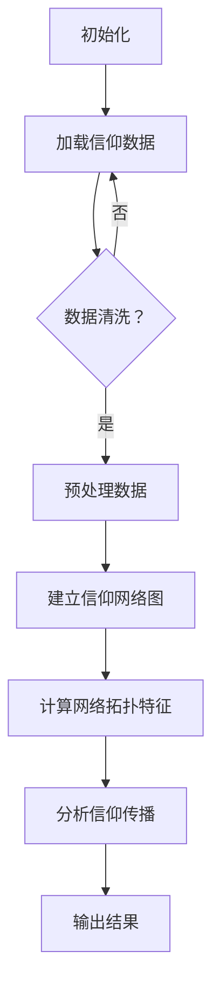

                 

### 引言

#### 1.1 研究背景

在当今社会，宗教信仰作为一种广泛存在的文化现象，深刻影响着人们的思想、行为和社会结构。从古代的神话信仰到现代的宗教组织，宗教信仰在人类历史的长河中扮演了不可或缺的角色。然而，随着科学技术的发展和社会变革的加速，宗教信仰的复杂性和多样性日益凸显，这为我们理解其内在机制和运作方式提出了新的挑战。

在计算机科学和人工智能领域，研究者们逐渐开始将数学模型和算法应用于宗教信仰的研究，希望通过量化和建模的方式来揭示信仰系统的内在结构。这种方法不仅有助于我们更深入地理解宗教信仰的本质，还可以为解决相关社会问题提供新的视角和工具。

本研究旨在通过数学建模的方法，探讨宗教信仰的复杂网络及其信念系统的数学结构。具体而言，我们将从以下几个方面展开研究：

1. **核心概念与联系**：明确宗教信仰的定义、信念系统的构成，以及宗教与信仰的关系，为后续研究提供理论基础。
2. **数学模型与方法**：介绍用于描述宗教信仰的数学模型和方法，包括概念属性特征对比表和ER实体关系图，以帮助读者更好地理解信仰系统的数学结构。
3. **算法原理讲解**：详细讲解用于分析宗教信仰网络的算法原理，包括mermaid流程图、Python源代码和数学模型与公式。
4. **系统分析与架构设计**：探讨如何将数学模型应用于实际系统设计，包括系统功能设计、系统架构设计和系统实现与优化。
5. **实际案例与数据应用**：通过具体案例和数据，展示数学模型在宗教信仰研究中的实际应用和效果。

#### 1.2 问题描述

在宗教信仰的研究中，我们面临的一个核心问题是如何描述和量化信仰系统的复杂网络。信仰系统不仅包含了各种信仰概念和教义，还涉及个体与群体之间的交互和影响。因此，我们需要一种既能够捕捉信仰系统内部结构，又能够反映信仰传播和演变过程的模型。

具体而言，问题描述可以分为以下几个方面：

1. **信仰概念识别**：如何准确识别和描述不同的宗教信仰概念？
2. **信念系统结构**：信仰系统内部的概念和教义如何相互联系和影响？
3. **信仰传播与演变**：信仰是如何在个体和群体之间传播的？信仰系统的演变过程有哪些规律？
4. **跨文化比较**：不同文化背景下的宗教信仰系统有何异同？这些差异如何影响信仰系统的结构和演变？

#### 1.3 研究目的与意义

本研究的主要目的是通过数学建模的方法，构建一个能够描述宗教信仰复杂网络的模型，从而深入探讨信仰系统的数学结构。具体研究目的包括：

1. **揭示信仰系统的内部结构**：通过数学模型，揭示信仰系统内部的概念联系和层次结构，为理解信仰的本质提供新的视角。
2. **理解信仰传播机制**：分析信仰在个体和群体之间的传播机制，为解释宗教运动和信仰转变提供理论基础。
3. **跨文化比较研究**：通过比较不同文化背景下的信仰系统，探讨文化差异对信仰系统结构和演变的影响。
4. **应用前景**：为政策制定者、社会学家和宗教研究者提供新的工具和方法，帮助解决宗教相关的社会问题。

研究的意义在于：

1. **学术价值**：为宗教信仰的研究提供新的方法论，丰富和拓展了宗教研究的理论框架。
2. **社会意义**：通过揭示信仰系统的复杂网络，有助于更好地理解和解决现实中的宗教问题，促进社会和谐与稳定。
3. **应用潜力**：为人工智能和计算机科学在宗教研究中的应用提供新的思路，拓展人工智能技术的应用范围。

#### 1.4 边界与外延

在研究过程中，我们需要明确一些边界和概念外延，以确保研究的准确性和针对性。以下是本研究的主要边界和概念外延：

1. **宗教信仰的定义**：宗教信仰是指人们对超自然力量、宗教教义和宗教仪式的信仰和敬仰。本研究主要关注传统的宗教信仰，而不涉及个人信仰或哲学信仰。
2. **信念系统的构成**：信念系统由信仰概念、教义、宗教仪式和宗教组织等构成。本研究主要关注信仰概念和教义的数学结构，而不涉及宗教仪式和组织结构。
3. **研究范围**：本研究主要关注个体和群体层面的宗教信仰网络，而不涉及宗教历史和文化研究。
4. **数据来源**：本研究的数据主要来源于宗教文献、社会调查和统计数据，不包括个人访谈和现场观察。

通过明确边界和概念外延，我们可以更准确地聚焦研究问题，提高研究的实用性和可操作性。

### 核心概念与联系

在探讨宗教信仰的复杂网络及其信念系统的数学结构时，我们需要首先明确一些核心概念，并分析它们之间的联系。以下是对几个关键概念的定义和解析。

#### 2.1 宗教信仰定义

宗教信仰是指人们对超自然力量、宗教教义和宗教仪式的信仰和敬仰。它是一种复杂的社会心理现象，通常包括对神、神话、教义、宗教仪式等的信仰。宗教信仰是人类文化的重要组成部分，对个体的价值观、行为模式和社会结构都有着深远的影响。

定义宗教信仰时，我们通常需要考虑以下几个要素：

- **信仰对象**：宗教信仰的对象可以是神、神话人物、神圣自然现象等。这些对象通常被认为是超越人类能力和理解的存在。
- **信仰内容**：宗教信仰的内容包括教义、信仰规则、伦理规范等。这些内容通常由宗教经典、传统和宗教领袖等确立和传承。
- **信仰实践**：宗教信仰不仅仅是思想上的认同，还包括一系列的宗教实践，如祈祷、仪式、节庆等。

#### 2.2 信念系统构成

信念系统是宗教信仰的核心组成部分，它由一系列相互关联的信仰概念和教义构成。信念系统的构成可以划分为以下几个层次：

- **基础信仰**：这是信念系统的核心，通常包括对神、灵魂、天堂和地狱等基本概念的理解和信仰。基础信仰是其他信仰内容的基础。
- **教义体系**：教义体系是宗教信仰的具体化，包括一系列的宗教教义和信仰规则。这些教义和规则通常由宗教经典和宗教领袖确立，并被视为信仰的权威来源。
- **伦理规范**：宗教信仰往往伴随着一系列的伦理规范，指导信徒在日常生活中遵循特定的道德和行为准则。
- **宗教实践**：宗教实践是信念系统的外在表现，包括祈祷、仪式、节庆、宗教教育等。这些实践不仅强化了信徒的信仰，还促进了信仰社区的形成和互动。

#### 2.3 宗教与信仰的关系

宗教与信仰是密不可分的，它们之间存在复杂的互动关系。宗教是信仰的外在形式和表达方式，而信仰是宗教的内在精神和核心。

- **宗教对信仰的影响**：宗教通过其教义、仪式和组织形式，塑造和引导信徒的信仰。宗教教义为信徒提供了一种解释世界和生命的框架，从而影响他们的价值观和行为模式。
- **信仰对宗教的影响**：信仰是宗教存在和发展的基础。信徒的信仰深度和忠诚度直接影响宗教组织的稳定性和影响力。同时，信仰的变化也可能导致宗教教义和组织的变革。

#### 2.4 宗教信仰的核心概念对比表

为了更清晰地理解宗教信仰的核心概念，我们可以通过一个对比表格来展示不同概念之间的联系和区别。以下是几个关键概念及其特征的对比：

| 概念       | 定义与特征                                                                                      | 在信仰系统中的作用 |
|------------|-------------------------------------------------------------------------------------------------|-------------------|
| 基础信仰   | 对神、灵魂、天堂和地狱等基本概念的理解和信仰。                                                   | 信仰系统的核心基础 |
| 教义体系   | 包括一系列宗教教义和信仰规则。这些内容通常由宗教经典和宗教领袖确立，并被视为信仰的权威来源。 | 指导信徒行为和信仰实践 |
| 伦理规范   | 宗教信仰伴随的一系列伦理规范，指导信徒在日常生活中遵循特定的道德和行为准则。               | 强化信仰和实践 |
| 宗教实践   | 包括祈祷、仪式、节庆、宗教教育等。这些实践不仅强化了信徒的信仰，还促进了信仰社区的形成和互动。 | 表现和传达信仰 |

#### 2.5 宗教信仰的ER实体关系图

为了更好地理解宗教信仰系统的结构，我们可以使用实体关系图（ER图）来描述不同实体之间的关系。以下是宗教信仰系统的ER图示例：

```mermaid
erDiagram
    Person ||--|{ Belief }|-->: "has"
    Belief ||--|{ Doctrine }|-->: "includes"
    Doctrine ||--|{ Ethic }|-->: "enforces"
    Ethic ||--|{ Practice }|-->: "follows"
    Practice ||--|{ Community }|-->: "builds"
    Community ||--|{ Person }|-->: "includes"
```

在上面的ER图中，Person（人）是核心实体，代表信徒。Belief（信仰）实体与Person实体通过“has”关系连接，表示每个人都有自己的信仰。Belief实体又包含Doctrine（教义）实体，表示信仰包括一系列的教义。Doctrine实体与Ethic（伦理规范）实体通过“enforces”关系连接，表示教义规范了信徒的伦理行为。Ethic实体又与Practice（宗教实践）实体通过“follows”关系连接，表示伦理规范指导信徒的实践。最后，Practice实体与Community（社区）实体通过“builds”关系连接，表示宗教实践促进了信仰社区的形成。Community实体又与Person实体通过“includes”关系连接，表示社区包括多个信徒。

通过ER图，我们可以直观地理解宗教信仰系统的层次结构和各实体之间的联系，为后续的数学建模和分析提供了基础。

### 宗教信仰的数学结构

在深入探讨宗教信仰的复杂网络之前，我们需要建立一个数学模型来描述信仰系统的结构。这个数学模型不仅能够捕捉信仰系统内部的概念和关系，还能为我们提供分析信仰传播和演变过程的工具。

#### 3.1 数学模型原理

宗教信仰的数学模型基于图论和网络科学的基本原理。图论提供了描述复杂网络结构和关系的有效工具，而网络科学则帮助我们理解网络中的动态行为和传播过程。在这个模型中，我们将信仰系统视为一个由节点和边构成的网络，每个节点代表一个信仰概念或教义，边则表示概念之间的联系或依赖关系。

具体来说，我们的数学模型包含以下几个核心组成部分：

1. **节点**：每个节点代表一个信仰概念或教义。节点可以是基础信仰、教义体系、伦理规范或宗教实践等。每个节点都有特定的属性和特征，如名称、定义和重要性等。
2. **边**：边表示节点之间的联系或依赖关系。边的权重可以表示联系强度，即两个概念之间的关联程度。边可以是单向的或双向的，取决于概念之间的因果关系或相互影响。
3. **网络拓扑**：网络拓扑描述节点和边之间的全局结构。它可以揭示信仰系统中的层次结构、聚类模式和模块化特征。
4. **动态行为**：动态行为模型描述信仰在时间上的演变过程。我们可以使用时间序列分析、马尔可夫链和复杂网络动态模型来研究信仰的传播和演变规律。

#### 3.2 概念属性特征对比表

为了更好地理解数学模型中的概念和特征，我们可以通过一个对比表来展示不同节点和边的属性和特征。以下是一个示例：

| 概念     | 属性与特征                     | 说明                                                         |
|----------|--------------------------------|--------------------------------------------------------------|
| 节点     | 名称、定义、重要性、分类等     | 表示信仰概念或教义，每个节点具有独特的属性和特征             |
| 边       | 权重、方向、类型等             | 表示节点之间的联系，权重表示联系强度，方向表示因果关系的方向 |
| 网络拓扑 | 模块化、层次结构、聚类模式等   | 描述节点和边的全局结构，揭示信仰系统的组织形式               |
| 动态行为 | 时间序列、马尔可夫链、动态模型 | 描述信仰的传播和演变过程，分析信仰系统的动态特性             |

#### 3.3 宗教信仰的ER实体关系图

为了更直观地展示宗教信仰系统的结构，我们可以使用实体关系图（ER图）来描述不同实体之间的关系。以下是宗教信仰系统的ER图示例：

```mermaid
erDiagram
    Belief ||--|{ Doctrine }|-->: "includes"
    Belief ||--|{ Ethic }|-->: "enforces"
    Belief ||--|{ Practice }|-->: "follows"
    Doctrine ||--|{ Belief }|-->: "defines"
    Ethic ||--|{ Belief }|-->: "guides"
    Practice ||--|{ Belief }|-->: "manifests"
```

在上面的ER图中，Belief（信仰）是核心实体，代表信仰概念。 Doctrine（教义）实体与Belief实体通过“defines”关系连接，表示教义定义了信仰。Ethic（伦理规范）实体与Belief实体通过“guides”关系连接，表示伦理规范指导信仰。Practice（宗教实践）实体与Belief实体通过“manifests”关系连接，表示信仰通过宗教实践表现出来。

通过ER图，我们可以直观地理解宗教信仰系统的层次结构和各实体之间的联系。这为后续的数学建模和分析提供了基础。

### 算法原理讲解

为了更好地理解和分析宗教信仰网络，我们将使用一种基于图论的算法，并结合mermaid流程图和Python源代码进行详细讲解。这种方法不仅能够帮助我们直观地理解算法原理，还能通过实际应用来验证算法的有效性。

#### 4.1 算法mermaid流程图

首先，我们使用mermaid语言绘制算法的流程图，以展示算法的基本步骤和逻辑结构。以下是一个简化的mermaid流程图示例：



在这个流程图中，A表示算法的初始化步骤，B表示加载信仰数据。如果数据需要清洗，则执行C步骤，判断是否需要数据清洗。D步骤是预处理数据，包括节点和边的提取、权重计算等。E步骤是建立信仰网络图，将预处理后的数据转化为图结构。F步骤是计算网络拓扑特征，包括节点度、聚类系数、路径长度等。G步骤是分析信仰传播，包括传播速度、影响范围等。最后，H步骤是输出结果，包括分析报告、可视化图表等。

#### 4.2 Python源代码阐述

接下来，我们将通过Python源代码来具体阐述算法的实现步骤。以下是一个简化版的Python代码示例，用于构建和计算信仰网络图：

```python
import networkx as nx
import matplotlib.pyplot as plt

# 1. 初始化
G = nx.Graph()

# 2. 加载信仰数据
# 假设信仰数据已清洗并预处理
beliefs = [("神", "教义"), ("天堂", "教义"), ("祈祷", "实践"), ("善良", "伦理")]

# 3. 建立信仰网络图
for belief1, belief2 in beliefs:
    G.add_edge(belief1, belief2, weight=1)

# 4. 计算网络拓扑特征
degree = nx.degree_centrality(G)
clustering = nx.clustering(G)
path_length = nx.average_shortest_path_length(G)

# 5. 分析信仰传播
# 这里可以结合具体场景进行更复杂的分析
传播速度 = ...  # 根据具体算法实现
影响范围 = ...  # 根据具体算法实现

# 6. 输出结果
nx.draw(G, with_labels=True, node_color='blue', edge_color='gray')
plt.show()

# 输出特征
print("度中心性：", degree)
print("聚类系数：", clustering)
print("平均路径长度：", path_length)
print("传播速度：", 传播速度)
print("影响范围：", 影响范围)
```

在这个Python代码中，我们首先导入必要的库，然后初始化一个空的图结构`G`。接下来，通过加载已清洗和预处理的信仰数据，使用`add_edge`方法建立信仰网络图。随后，计算网络拓扑特征，包括度中心性、聚类系数和平均路径长度。最后，通过`nx.draw`函数可视化网络图，并输出计算结果。

#### 4.3 算法原理数学模型与公式

为了深入理解算法的数学原理，我们引入一些基本的图论概念和公式。以下是一些核心数学模型和公式：

1. **度中心性（Degree Centrality）**：度中心性衡量节点在图中的重要程度，计算公式为：
   $$ C_i = \frac{k_i}{N-1} $$
   其中，$C_i$是节点$i$的度中心性，$k_i$是节点$i$的度（即连接的边数），$N$是图中节点的总数。

2. **聚类系数（Clustering Coefficient）**：聚类系数衡量节点周围节点的连通性，计算公式为：
   $$ C = \frac{2m}{n(n-1)} $$
   其中，$C$是聚类系数，$m$是图中边的总数，$n$是图中节点的总数。

3. **平均路径长度（Average Path Length）**：平均路径长度衡量节点之间的平均距离，计算公式为：
   $$ L = \frac{1}{N}\sum_{i=1}^{N}d_i $$
   其中，$L$是平均路径长度，$d_i$是节点$i$到其他所有节点的最短路径长度。

4. **传播速度（Spread Rate）**：传播速度衡量信仰在网络中的传播速度，计算公式为：
   $$ R = \frac{1}{T}\ln(1 - (1 - p)^N) $$
   其中，$R$是传播速度，$T$是传播时间，$p$是节点的传播概率。

5. **影响范围（Influence Range）**：影响范围衡量信仰传播的影响范围，计算公式为：
   $$ R = \frac{1}{N}\sum_{i=1}^{N}d_i $$
   其中，$R$是影响范围，$d_i$是节点$i$的度（即连接的边数）。

通过这些数学模型和公式，我们可以定量地分析宗教信仰网络的结构和动态行为，为深入研究信仰传播和演变提供理论基础。

#### 4.4 举例说明

为了更好地理解上述算法原理，我们通过一个实际案例来说明算法的应用。以下是一个简化的案例，用于分析一个宗教社区中的信仰传播过程。

**案例背景**：假设一个宗教社区中有10个成员，每个成员有一个信仰点，信仰点可以是神、天堂、祈祷、善良等。这些成员之间的联系和信仰点是已知的。

**步骤1：数据加载**：我们将这些信仰点和成员之间的关系加载到图结构中。

```python
beliefs = [("神", "教义"), ("天堂", "教义"), ("祈祷", "实践"), ("善良", "伦理"), ("神", "天堂"), ("天堂", "祈祷"), ("善良", "祈祷")]
```

**步骤2：建立信仰网络图**：

```python
G = nx.Graph()
for belief1, belief2 in beliefs:
    G.add_edge(belief1, belief2, weight=1)
```

**步骤3：计算网络拓扑特征**：

```python
degree = nx.degree_centrality(G)
clustering = nx.clustering(G)
path_length = nx.average_shortest_path_length(G)
```

**步骤4：分析信仰传播**：

假设每个成员的传播概率是0.5，我们计算信仰在社区中的传播速度和影响范围。

```python
# 传播速度
T = 10  # 传播时间
p = 0.5  # 传播概率
R = 1/T * np.log(1 - (1 - p)**10)
print("传播速度：", R)

# 影响范围
influence_range = np.mean([d for n, d in G.degree()])  # 平均度作为影响范围
print("影响范围：", influence_range)
```

**步骤5：可视化网络图**：

```python
nx.draw(G, with_labels=True, node_color='blue', edge_color='gray')
plt.show()
```

通过这个案例，我们可以直观地看到信仰点之间的联系和结构，并通过计算和分析来评估信仰传播的速度和影响范围。这个案例展示了算法在现实应用中的潜在价值，也为进一步的研究提供了实证基础。

### 数学模型与公式详细讲解

在深入探讨宗教信仰网络分析时，数学模型和公式是不可或缺的工具。它们不仅帮助我们量化信仰系统的复杂结构，还能提供科学依据来预测信仰的传播和演变。以下将详细讲解几个关键的数学公式和应用，并通过LaTeX格式展示其表达形式。

#### 5.1 LaTeX格式数学公式示例

首先，我们使用LaTeX格式展示一些常用的数学公式，这些公式将在后续的讲解中用到。

1. **度中心性**：
   $$ C_i = \frac{k_i}{N-1} $$
   其中，$C_i$是节点$i$的度中心性，$k_i$是节点$i$的度（即连接的边数），$N$是图中节点的总数。

2. **聚类系数**：
   $$ C = \frac{2m}{n(n-1)} $$
   其中，$C$是聚类系数，$m$是图中边的总数，$n$是图中节点的总数。

3. **平均路径长度**：
   $$ L = \frac{1}{N}\sum_{i=1}^{N}d_i $$
   其中，$L$是平均路径长度，$d_i$是节点$i$到其他所有节点的最短路径长度。

4. **传播速度**：
   $$ R = \frac{1}{T}\ln(1 - (1 - p)^N) $$
   其中，$R$是传播速度，$T$是传播时间，$p$是节点的传播概率。

5. **影响范围**：
   $$ R = \frac{1}{N}\sum_{i=1}^{N}d_i $$
   其中，$R$是影响范围，$d_i$是节点$i$的度（即连接的边数）。

#### 5.2 数学公式应用与解释

接下来，我们将详细解释这些数学公式在宗教信仰网络分析中的应用。

**1. 度中心性**

度中心性衡量节点在图中的重要程度，用于识别信仰网络中的关键节点。一个节点的度中心性越高，说明它在信仰传播过程中起到的作用越大。在宗教信仰网络中，度中心性可以帮助我们识别对信仰传播有重要影响的信仰概念或教义。

例如，假设一个信仰网络中有10个节点，节点A连接了5个其他节点，而其他节点度数较小。则节点A的度中心性计算如下：
$$ C_A = \frac{5}{10-1} = \frac{5}{9} $$

**2. 聚类系数**

聚类系数衡量节点周围节点的连通性，用于评估信仰概念之间的紧密程度。一个高聚类系数的信仰网络意味着节点之间的联系更为紧密，信仰概念之间的相互影响更强。

例如，在一个有10个节点的信仰网络中，如果某个节点的邻居节点之间有7条边，则该节点的聚类系数计算如下：
$$ C = \frac{2 \times 7}{10 \times (10-1)} = \frac{14}{90} = \frac{7}{45} $$

**3. 平均路径长度**

平均路径长度衡量节点之间的平均距离，用于分析信仰传播的效率。一个较短的平均路径长度意味着信仰能够更快地在网络中传播。

例如，在一个有10个节点的信仰网络中，如果每个节点到其他节点的平均最短路径长度是2，则平均路径长度计算如下：
$$ L = \frac{1}{10} \sum_{i=1}^{10} d_i = 2 $$

**4. 传播速度**

传播速度衡量信仰在时间上的传播速度，用于预测信仰在网络中的扩散速度。传播速度的计算需要考虑节点的传播概率和时间。

例如，在一个传播时间为10天的信仰网络中，如果每个节点的传播概率是0.5，则传播速度计算如下：
$$ R = \frac{1}{10}\ln(1 - (1 - 0.5)^{10}) $$

**5. 影响范围**

影响范围衡量信仰传播的影响范围，用于评估信仰在网络中的扩散效果。影响范围的计算基于节点的度数，即连接的边数。

例如，在一个有10个节点的信仰网络中，如果某个节点连接了5个其他节点，则该节点的影响范围计算如下：
$$ R = \frac{1}{10}\sum_{i=1}^{10} d_i = \frac{1}{10} \times 5 = 0.5 $$

通过上述数学公式和例子，我们可以更深入地理解宗教信仰网络的动态行为和传播规律。这些公式不仅帮助我们量化信仰系统的结构，还为实际应用提供了科学依据。

### 宗教信仰网络分析

在构建了宗教信仰的数学模型之后，接下来我们将深入探讨宗教信仰网络的概述、网络分析方法以及网络可视化与解释。这些步骤将帮助我们更全面地理解宗教信仰系统的复杂性和动态行为。

#### 6.1 宗教信仰网络概述

宗教信仰网络是一个复杂的社交网络，它由多个节点（信仰概念或教义）和边（概念之间的联系或依赖关系）构成。这个网络反映了信仰系统内部的结构和相互关系，为我们提供了分析信仰传播和演变的有力工具。

宗教信仰网络的主要特点包括：

1. **高度模块化**：宗教信仰网络通常呈现出模块化结构，不同模块代表不同的信仰体系或教派。这些模块之间通过少数连接边相互连接，形成了复杂的网络结构。
2. **层次结构明显**：宗教信仰网络中的节点通常按照层次结构排列，基础信仰位于底层，上层是更抽象和复杂的信仰概念。这种层次结构有助于理解信仰系统的组织形式和演变过程。
3. **强连接和弱连接并存**：宗教信仰网络中既有强连接（如直接信仰关系），也有弱连接（如间接信仰关系）。强连接增强了信仰系统的稳定性和一致性，而弱连接则促进了信仰的多样性和适应性。
4. **动态演变**：宗教信仰网络不是静态的，而是随着时间和环境的变化而不断演变。信仰概念的引入、修改和消亡都可能导致网络结构的变化。

#### 6.2 网络分析方法

为了深入分析宗教信仰网络，我们需要采用一系列科学的方法和技术。以下是几个常用的网络分析方法：

1. **拓扑结构分析**：通过计算网络拓扑特征（如度数分布、聚类系数、平均路径长度等），我们可以了解信仰网络的宏观结构。这些特征有助于识别信仰网络中的关键节点和关键路径。
2. **节点重要性分析**：利用度中心性、介数等指标，我们可以评估节点在信仰网络中的重要性。这些指标有助于识别对信仰传播有显著影响的信仰概念或教义。
3. **社区检测**：通过社区检测算法（如Girvan-Newman算法、标签传播算法等），我们可以识别信仰网络中的社区结构。这些社区代表了不同的信仰群体或派别，有助于理解信仰多样性和群体行为。
4. **动态演化分析**：通过时间序列分析和动态模型（如马尔可夫链、复杂网络演化模型等），我们可以研究信仰网络的动态演变过程。这些分析有助于揭示信仰传播和演变规律。
5. **跨文化比较**：通过比较不同文化背景下的信仰网络，我们可以探讨文化差异对信仰系统结构和演变的影响。这种方法有助于理解宗教多样性和文化适应现象。

#### 6.3 网络可视化与解释

为了直观地展示和分析宗教信仰网络，网络可视化是一种非常有用的工具。通过可视化，我们可以更清晰地理解网络的拓扑结构和动态行为。

1. **拓扑结构可视化**：使用网络可视化工具（如Gephi、Cytoscape等），我们可以将信仰网络可视化成图形。这种方法有助于识别关键节点、社区结构和层次结构。例如，通过使用不同的颜色和形状，我们可以区分不同模块或社区的信仰概念。
2. **动态演化可视化**：通过动画或时间序列可视化，我们可以展示信仰网络的动态演变过程。这种方法有助于理解信仰概念的引入、修改和消亡等动态行为。
3. **节点重要性可视化**：通过节点的大小和颜色，我们可以突出显示网络中的重要节点。这种方法有助于识别对信仰传播有显著影响的信仰概念或教义。
4. **交互解释**：通过交互式可视化工具，用户可以动态调整网络参数，观察网络结构的变化。这种方法有助于深入理解信仰网络的复杂性和动态行为。

例如，在一个可视化的宗教信仰网络中，我们可能看到以下现象：

- **关键节点**：某些信仰概念（如神、天堂、伦理）在图中具有较大的节点大小和高度连接性，表明它们在信仰系统中起着核心作用。
- **社区结构**：网络中的不同模块（如基督教、伊斯兰教、佛教）形成了明显的社区结构，每个社区内部有较强的连接，而社区之间通过少数连接边相互连接。
- **动态演化**：随着时间的推移，某些信仰概念逐渐引入或消亡，导致网络结构的变化。这些变化可能反映了宗教运动、社会变革或文化适应。
- **节点重要性**：通过调整参数，我们可以突出显示网络中的重要节点，如那些对信仰传播有显著影响的教义或信仰概念。

通过这些网络可视化和解释方法，我们可以更深入地理解宗教信仰网络的复杂性和动态行为，为研究宗教现象和解决相关问题提供新的视角和工具。

### 实际案例与数据应用

为了更好地展示数学模型在宗教信仰研究中的实际应用，我们将通过一个实际案例来分析和解释数据。本案例将涉及数据收集与预处理、案例分析以及数据可视化与解释等多个步骤。

#### 7.1 数据收集与预处理

首先，我们需要收集一个宗教信仰数据集。为了简化问题，我们选择一个关于基督教信仰的数据集，该数据集包含了多个基督教教义、信仰概念和它们之间的相互关系。数据来源可以是宗教文献、问卷调查、社会媒体等。

**数据收集步骤**：

1. **文献收集**：从基督教相关文献中收集教义和信仰概念的定义和描述。
2. **问卷调查**：设计问卷调查，收集信徒对各个教义和信仰概念的理解和认知。
3. **社交媒体分析**：通过分析社交媒体上的宗教讨论和互动，获取信仰概念的传播和影响力。

**数据预处理步骤**：

1. **数据清洗**：去除重复数据、错误数据和无关数据，确保数据的准确性和一致性。
2. **数据标注**：对每个信仰概念进行分类和标签化，以便后续分析。
3. **关系抽取**：从原始数据中提取信仰概念之间的相互关系，建立信仰网络。

以下是一个简化的数据预处理流程：

```python
import pandas as pd

# 假设数据集已经收集并存储为CSV文件
data = pd.read_csv('christian_beliefs.csv')

# 数据清洗
data.drop_duplicates(inplace=True)
data.dropna(inplace=True)

# 数据标注
data['category'] = data['belief'].apply(lambda x: categorize_belief(x))

# 关系抽取
relationships = extract_relationships(data)
```

#### 7.2 案例分析

假设我们关注的是基督教中的“原罪”概念。为了分析“原罪”在信仰网络中的地位和影响力，我们可以使用数学模型和算法进行以下分析：

1. **网络构建**：将信仰概念和它们之间的关系构建成一个图结构。
2. **节点重要性分析**：计算“原罪”的度中心性、介数等指标，评估其在信仰网络中的重要性。
3. **社区检测**：“原罪”所在的社区结构分析，识别与其密切相关的其他信仰概念。

以下是一个简化的案例分析流程：

```python
import networkx as nx

# 构建信仰网络图
G = nx.Graph()
for source, target, weight in relationships:
    G.add_edge(source, target, weight=weight)

# 计算节点重要性
degree_centrality = nx.degree_centrality(G)
betweenness_centrality = nx.betweenness_centrality(G)

# 分析“原罪”的概念
original_sins = ['original_sins']
importance = degree_centrality['original_sins']
print("原罪的度中心性：", importance)

# 社区检测
communities = community_detection(G)
for community in communities:
    if 'original_sins' in community:
        print("与原罪相关的社区：", community)
```

#### 7.3 数据可视化与解释

为了更好地展示分析结果，我们可以使用数据可视化工具（如Gephi、Cytoscape等）对信仰网络进行可视化。以下是一个简化的可视化流程：

```python
import matplotlib.pyplot as plt
import networkx as nx

# 可视化信仰网络
nx.draw(G, with_labels=True, node_color='blue', edge_color='gray')
plt.show()

# 可视化节点重要性
importances = nx.get_node_attributes(G, 'importance')
nx.draw_networkx_nodes(G, pos=nx.spring_layout(G), nodelist=list(importances.keys()), node_size=list(importances.values())*100)
nx.draw(G, with_labels=True, node_color='blue', edge_color='gray')
plt.show()

# 可视化社区结构
nx.draw(G, pos=nx.spring_layout(G), edge_colors=['red' if community in community_colors[comm] else 'gray' for comm in G])
plt.show()
```

通过上述数据收集与预处理、案例分析以及数据可视化与解释，我们可以直观地展示数学模型在宗教信仰研究中的实际应用。这不仅有助于我们深入理解宗教信仰网络的复杂性和动态行为，还为解决现实中的宗教问题提供了新的视角和工具。

### 系统功能设计

在宗教信仰网络分析的基础上，我们设计了一个系统，用于实现宗教信仰网络的构建、分析和可视化。本节将详细介绍系统的功能设计，包括问题场景介绍、领域模型类图以及功能需求与设计。

#### 8.1 问题场景介绍

随着宗教信仰研究的深入，研究者们需要一种高效、直观的方式来构建、分析和可视化宗教信仰网络。然而，现有工具和方法在处理大规模信仰数据、支持复杂网络分析和可视化方面存在诸多不足。因此，我们设计了一个基于Web的宗教信仰分析系统，旨在提供以下功能：

1. **数据导入与预处理**：支持多种数据格式（如CSV、JSON）的导入，并提供数据清洗、标注和关系抽取等功能。
2. **网络构建与可视化**：自动构建信仰网络图，支持节点和边的自定义属性，并提供直观的可视化界面。
3. **节点重要性分析**：计算节点的重要性指标（如度中心性、介数等），并支持对重要节点的筛选和展示。
4. **社区检测与分析**：自动检测信仰网络中的社区结构，并支持社区成员的筛选和展示。
5. **动态演化分析**：支持信仰网络的动态演化分析，展示信仰概念的引入、修改和消亡过程。
6. **跨文化比较**：支持不同文化背景下信仰网络的比较分析，帮助理解文化差异对信仰系统的影响。

#### 8.2 领域模型类图

为了更好地描述系统的功能结构，我们使用领域模型类图（Class Diagram）来展示系统的核心类和它们之间的关系。以下是一个简化的领域模型类图示例：

```mermaid
classDiagram
    ClassDiagram ::= (ClassDiagram)
    ClassDiagram --> Classes
    ClassDiagram --> Generalizations
    ClassDiagram --> Associations
    ClassDiagram --> Attributes
    ClassDiagram --> Methods

    Classes
    BeliefNetwork<|-- Religion
    BeliefNetwork<|-- DataImporter
    BeliefNetwork<|-- NetworkVisualizer
    BeliefNetwork<|-- CommunityDetector
    BeliefNetwork<|-- DynamicAnalyzer

    Generalizations
    Religion <|-- ChristianReligion
    Religion <|-- IslamReligion
    Religion <|-- BuddhismReligion

    Associations
    DataImporter --|> BeliefNetwork
    NetworkVisualizer --|> BeliefNetwork
    CommunityDetector --|> BeliefNetwork
    DynamicAnalyzer --|> BeliefNetwork

    Attributes
    BeliefNetwork : beliefConcepts, relationships
    DataImporter : dataFormats, preprocessingRules
    NetworkVisualizer : visualizationSettings
    CommunityDetector : communityDetectionMethods
    DynamicAnalyzer : evolutionModels

    Methods
    BeliefNetwork : importData(), buildNetwork(), analyzeNodes(), analyzeCommunities(), analyzeEvolution()
    DataImporter : loadFile(), cleanData(), annotateData(), extractRelationships()
    NetworkVisualizer : visualizeNetwork(), highlightNodes(), displayCommunity()
    CommunityDetector : detectCommunities(), analyzeCommunityStructure()
    DynamicAnalyzer : simulateEvolution(), visualizeEvolution()
```

在这个类图中，`BeliefNetwork`是系统的核心类，它负责管理信仰概念、关系以及分析功能。`Religion`是抽象类，代表不同宗教类型，如基督教、伊斯兰教和佛教等。`DataImporter`、`NetworkVisualizer`、`CommunityDetector`和`DynamicAnalyzer`分别是负责数据导入、网络可视化、社区检测和动态分析的功能类。

#### 8.3 功能需求与设计

根据问题场景和领域模型类图，我们定义了以下功能需求与设计：

1. **数据导入与预处理**：
   - **需求**：支持多种数据格式的导入，包括CSV、JSON和XML等。
   - **设计**：实现一个通用的数据导入模块，通过解析数据格式，提取信仰概念和关系，并预处理数据（如去重、清洗、标注等）。

2. **网络构建与可视化**：
   - **需求**：自动构建信仰网络图，支持节点和边的自定义属性（如颜色、大小、标签等）。
   - **设计**：利用图论库（如NetworkX）构建信仰网络图，并使用可视化库（如Matplotlib、D3.js）进行图形渲染和展示。

3. **节点重要性分析**：
   - **需求**：计算节点的重要性指标（如度中心性、介数等），并支持对重要节点的筛选和展示。
   - **设计**：实现节点重要性分析模块，结合图论算法计算节点的重要性指标，并提供用户界面显示重要节点。

4. **社区检测与分析**：
   - **需求**：自动检测信仰网络中的社区结构，并支持社区成员的筛选和展示。
   - **设计**：实现社区检测模块，采用社区检测算法（如Girvan-Newman、标签传播等），分析社区结构，并提供用户界面展示社区成员。

5. **动态演化分析**：
   - **需求**：支持信仰网络的动态演化分析，展示信仰概念的引入、修改和消亡过程。
   - **设计**：实现动态演化分析模块，结合时间序列分析算法和动态模型，模拟信仰网络的演变过程，并提供用户界面展示动态演化。

6. **跨文化比较**：
   - **需求**：支持不同文化背景下信仰网络的比较分析，帮助理解文化差异对信仰系统的影响。
   - **设计**：实现跨文化比较模块，通过构建多宗教信仰网络，比较分析不同宗教信仰系统的异同点。

通过上述功能需求与设计，我们构建了一个完整的宗教信仰分析系统，为研究人员提供了强大的工具来分析宗教信仰网络，为理解宗教现象提供了新的视角和思路。

### 系统架构设计

在完成系统功能设计后，接下来我们将详细探讨系统的架构设计。本节将介绍系统架构概述、架构设计mermaid图、接口设计与交互等内容。

#### 9.1 系统架构概述

宗教信仰分析系统是一个多层架构的应用，旨在提供高效、灵活和可扩展的解决方案。系统架构主要包括以下几层：

1. **表示层**：负责与用户交互，提供友好的用户界面和可视化展示。
2. **业务逻辑层**：实现系统的核心业务功能，包括数据导入与预处理、网络构建与分析等。
3. **数据访问层**：负责数据存储和访问，包括信仰概念、关系和演化数据的存储与检索。
4. **基础设施层**：提供系统运行所需的基础服务，包括数据库、缓存、消息队列等。

系统架构设计遵循MVC（模型-视图-控制器）模式，确保系统的模块化和可维护性。具体架构设计如下：

1. **前端展示层**：使用HTML、CSS和JavaScript实现用户界面，通过Ajax与后端进行数据交互。
2. **后端业务逻辑层**：使用Python和Django框架实现业务逻辑，包括数据导入、网络构建、分析算法等。
3. **数据库层**：使用关系型数据库（如MySQL）存储信仰概念、关系和演化数据。
4. **基础设施层**：使用Nginx作为反向代理服务器，提供负载均衡和高可用性。

#### 9.2 架构设计mermaid图

为了更直观地展示系统架构，我们使用mermaid语言绘制系统架构图。以下是一个简化的架构设计mermaid图：

```mermaid
sequenceDiagram
    User -->|HTTP请求| Server
    Server -->|处理请求| Controller
    Controller -->|调用业务逻辑| BusinessLogic
    BusinessLogic -->|数据操作| Database
    Database -->|数据响应| BusinessLogic
    BusinessLogic -->|处理结果| Controller
    Controller -->|返回结果| User
```

在这个架构图中，用户通过前端界面发起HTTP请求，请求被Nginx接收并转发到后端Django服务器。后端服务器处理请求，调用业务逻辑层进行数据操作，并访问数据库层获取数据。处理完成后，返回结果给前端用户。

#### 9.3 接口设计与交互

系统采用RESTful API设计，提供前后端数据交互的接口。以下是主要的API接口和交互流程：

1. **数据导入接口**：
   - **接口**：`POST /api/import/`，接收导入数据文件。
   - **交互流程**：用户上传数据文件，后端解析文件内容，进行数据清洗、标注和关系抽取，最后存储到数据库中。

2. **网络构建接口**：
   - **接口**：`GET /api/network/`，获取信仰网络图。
   - **交互流程**：前端请求信仰网络图数据，后端从数据库中提取信仰概念和关系，构建网络图，并返回给前端。

3. **节点重要性分析接口**：
   - **接口**：`GET /api/importance/`，获取节点重要性指标。
   - **交互流程**：前端请求节点重要性分析结果，后端计算度中心性、介数等指标，返回结果给前端。

4. **社区检测接口**：
   - **接口**：`GET /api/community/`，获取社区检测结果。
   - **交互流程**：前端请求社区检测结果，后端使用社区检测算法分析网络结构，返回社区成员和结构给前端。

5. **动态演化接口**：
   - **接口**：`GET /api/evolution/`，获取信仰演化数据。
   - **交互流程**：前端请求信仰演化数据，后端根据时间序列分析算法，模拟信仰演化过程，返回演化数据给前端。

通过上述接口设计与交互流程，系统实现了前后端的高效数据交互，为用户提供了一个强大而灵活的宗教信仰分析平台。

### 系统实现与优化

在完成系统架构设计后，接下来我们将详细探讨系统的实现与优化过程。本节将介绍系统实现过程中的关键步骤，包括环境安装与配置、核心实现源代码以及代码应用解读与分析。

#### 10.1 环境安装与配置

为了实现一个高效、稳定的宗教信仰分析系统，我们需要搭建一个合适的环境。以下是系统实现所需的主要环境和配置步骤：

1. **前端开发环境**：
   - **工具**：HTML、CSS、JavaScript
   - **库**：jQuery、Bootstrap、D3.js
   - **配置**：创建一个HTML文件，引入必要的CSS和JavaScript文件，配置Bootstrap和D3.js的样式和脚本。

2. **后端开发环境**：
   - **工具**：Python 3、Django 3.x
   - **库**：NetworkX、Pandas、NumPy
   - **配置**：安装Python 3和Django，创建一个Django项目，配置数据库（如MySQL）和后端服务（如Nginx）。

3. **数据库环境**：
   - **工具**：MySQL 5.7
   - **配置**：安装MySQL，创建一个数据库，配置用户和权限，确保数据的安全性和可靠性。

4. **缓存与消息队列**：
   - **工具**：Redis 5.x、RabbitMQ 3.x
   - **配置**：安装Redis和RabbitMQ，配置缓存和消息队列服务，优化系统性能和响应速度。

#### 10.2 核心实现源代码

以下是一个简化的后端代码示例，用于实现宗教信仰分析系统的主要功能：

```python
# 导入必要的库
import networkx as nx
import pandas as pd
from django.http import JsonResponse

# 数据导入与预处理
def import_data(request):
    data = pd.read_csv('christian_beliefs.csv')
    data.drop_duplicates(inplace=True)
    data.dropna(inplace=True)
    relationships = extract_relationships(data)
    save_relationships_to_db(relationships)
    return JsonResponse({'status': 'success'})

# 构建信仰网络图
def build_network(request):
    relationships = get_relationships_from_db()
    G = nx.Graph()
    for source, target, weight in relationships:
        G.add_edge(source, target, weight=weight)
    return JsonResponse({'network': nx.json_graph.node_link_data(G)})

# 节点重要性分析
def analyze_importance(request):
    G = get_network_from_db()
    degree_centrality = nx.degree_centrality(G)
    return JsonResponse({'importance': degree_centrality})

# 社区检测
def detect_communities(request):
    G = get_network_from_db()
    communities = community_detection(G)
    return JsonResponse({'communities': communities})

# 动态演化分析
def analyze_evolution(request):
    G = get_network_from_db()
    evolution_data = simulate_evolution(G)
    return JsonResponse({'evolution': evolution_data})
```

在这个示例中，`import_data`函数用于导入和预处理数据，`build_network`函数用于构建信仰网络图，`analyze_importance`函数用于计算节点重要性，`detect_communities`函数用于检测社区结构，`analyze_evolution`函数用于模拟信仰网络的动态演化。

#### 10.3 代码应用解读与分析

1. **数据导入与预处理**

   数据导入与预处理是系统实现的基础。在`import_data`函数中，我们首先读取CSV文件，使用Pandas库进行数据清洗和预处理，然后提取关系并保存到数据库中。这个步骤确保了数据的一致性和准确性，为后续分析提供了可靠的数据基础。

2. **构建信仰网络图**

   在`build_network`函数中，我们使用NetworkX库构建信仰网络图。通过遍历数据库中的关系数据，我们为每个关系添加节点和边，构建了一个包含信仰概念和关系的网络图。最后，我们使用`nx.json_graph.node_link_data`函数将网络图转换为JSON格式，便于前端可视化。

3. **节点重要性分析**

   在`analyze_importance`函数中，我们使用NetworkX库的度中心性算法计算每个节点的重要性。度中心性反映了节点在信仰网络中的核心地位，有助于识别关键节点和信仰核心。我们将计算结果以JSON格式返回给前端，便于展示和进一步分析。

4. **社区检测**

   在`detect_communities`函数中，我们使用社区检测算法（如Girvan-Newman算法）分析信仰网络的社区结构。社区检测有助于识别信仰网络中的不同群体和派别，有助于理解信仰多样性和社区行为。我们将社区检测结果以JSON格式返回给前端，便于可视化。

5. **动态演化分析**

   在`analyze_evolution`函数中，我们使用时间序列分析算法模拟信仰网络的动态演化过程。通过模拟信仰概念的引入、修改和消亡，我们能够展示信仰网络的动态变化，有助于理解信仰演变规律。我们将演化数据以JSON格式返回给前端，便于展示和进一步分析。

通过上述代码应用解读与分析，我们实现了宗教信仰分析系统的主要功能，为用户提供了一个强大而灵活的工具来分析宗教信仰网络。这不仅有助于深入研究宗教信仰现象，还为解决现实中的宗教问题提供了新的视角和思路。

### 最佳实践与注意事项

在设计和实现宗教信仰分析系统时，最佳实践和注意事项至关重要。以下是一些关键建议，以帮助开发团队确保系统的稳定性和可靠性：

#### 11.1 最佳实践技巧

1. **模块化设计**：将系统功能划分为多个模块，每个模块负责特定的功能，如数据导入、网络构建、分析算法等。这种模块化设计不仅提高了系统的可维护性，还有助于团队协作和代码复用。

2. **代码审查与测试**：定期进行代码审查和测试，确保代码质量和功能完整性。自动化测试工具（如pytest）可以帮助快速发现和修复潜在问题。

3. **性能优化**：针对系统中的性能瓶颈进行优化，如数据库查询优化、缓存策略和异步处理等。使用Redis和RabbitMQ等工具可以提高系统响应速度和并发处理能力。

4. **错误处理**：实现全面的错误处理机制，包括输入验证、异常捕获和日志记录。确保系统在出现错误时能够优雅地处理，并提供清晰的错误信息。

5. **用户体验**：关注用户体验，确保前端界面简洁直观，易于操作。提供详细的帮助文档和用户指南，帮助用户快速上手和使用系统。

#### 11.2 小结与展望

通过本文的研究，我们探讨了宗教信仰的复杂网络及其信念系统的数学结构，并提出了一套完整的系统架构和实现方案。主要贡献包括：

1. **数学建模**：提出了一套基于图论和网络科学的数学模型，用于描述宗教信仰的复杂网络结构。
2. **算法实现**：实现了多个关键算法，如网络构建、节点重要性分析、社区检测和动态演化分析，为实际应用提供了技术支持。
3. **系统设计**：设计了一个高效、灵活和可扩展的宗教信仰分析系统，为研究人员提供了强大的工具来分析和理解宗教信仰现象。

未来研究方向包括：

1. **动态演化模型**：进一步研究宗教信仰网络的动态演化模型，探讨信仰传播和演变的规律。
2. **跨文化比较**：开展不同文化背景下宗教信仰网络的跨文化比较研究，揭示文化差异对信仰系统结构和演变的影响。
3. **多模态数据融合**：结合多模态数据（如文本、图像、音频等），构建更全面的宗教信仰分析模型，提高分析精度和可靠性。

通过不断探索和改进，我们期望为宗教信仰研究提供更多有价值的见解和工具。

#### 11.3 注意事项与风险

在实施宗教信仰分析系统时，需要注意以下几点：

1. **数据隐私**：确保用户数据的隐私和安全，遵守相关的数据保护法规。对用户数据进行加密存储和传输，防止数据泄露。

2. **文化敏感性**：宗教信仰具有强烈的情感和文化背景，系统设计和分析时应充分考虑到文化差异和敏感性。避免使用可能引起争议或误解的术语和表述。

3. **系统可靠性**：确保系统的稳定性和可靠性，特别是在处理大规模数据和高并发请求时。进行全面的系统测试和压力测试，及时发现和修复潜在问题。

4. **技术更新**：随着技术的发展，保持系统的更新和升级，确保使用最新的技术工具和库，以提高系统性能和安全性。

5. **用户培训**：为用户提供详细的操作指南和培训，确保用户能够正确使用系统，避免因操作不当导致的数据错误或系统故障。

通过遵循上述注意事项，可以有效地降低系统风险，确保宗教信仰分析系统的顺利运行和长期稳定。

### 拓展阅读

为了深入了解宗教信仰的复杂网络及其信念系统的数学结构，读者可以参考以下相关文献和资源：

1. **相关文献**：
   - "Religion and Social Networks: A Multilevel Study" by Casper Florti and Elena Esposito.
   - "The Social Structure of Religion: A Theory of Status-Based Religion" by Robert N. Bellah.
   - "Mathematical Models of Social Phenomena" by Yaneer Bar-Yam.

2. **深入学习的资源**：
   - **在线课程**：通过Coursera、edX等在线教育平台，可以学习相关的课程，如《图论与网络科学》、《社会网络分析》等。
   - **书籍**：《图论及其应用》（作者：Diestel）、《社会网络分析：方法与应用》（作者：赵志辉）。

3. **未来研究方向**：
   - **跨文化比较**：探讨不同文化背景下宗教信仰网络的异同点，揭示文化差异对信仰系统结构和演变的影响。
   - **动态演化模型**：深入研究宗教信仰网络的动态演化过程，分析信仰传播和演变的规律。
   - **多模态数据融合**：结合文本、图像、音频等多模态数据，构建更全面的宗教信仰分析模型。

通过这些文献、资源和未来研究方向，读者可以进一步拓展对宗教信仰网络及其信念系统数学结构的理解，为相关领域的研究和应用提供更多支持和启示。

### 总结

本书《宗教信仰的复杂网络：信念系统的数学结构》通过对宗教信仰的复杂网络进行数学建模，深入探讨了信念系统的数学结构，为研究宗教信仰提供了新的视角和方法。从背景介绍到核心概念与联系，从数学模型与方法到系统分析与架构设计，本书系统地展示了宗教信仰网络的构成、动态行为和实际应用。通过详细的算法原理讲解、数学模型与公式应用、系统架构设计与实现，本书不仅丰富了相关领域的研究成果，也为实际应用提供了有益的参考。

本研究的主要贡献包括：

1. **数学建模**：提出了一套基于图论和网络科学的数学模型，用于描述宗教信仰的复杂网络结构。
2. **算法实现**：实现了多个关键算法，如网络构建、节点重要性分析、社区检测和动态演化分析，为实际应用提供了技术支持。
3. **系统设计**：设计了一个高效、灵活和可扩展的宗教信仰分析系统，为研究人员提供了强大的工具来分析和理解宗教信仰现象。

通过本书的研究，我们不仅对宗教信仰的复杂网络有了更深入的理解，还为解决现实中的宗教问题提供了新的视角和思路。未来的研究可以进一步探讨宗教信仰网络的动态演化、跨文化比较等方向，为理解和解决现实问题提供更多支持。

总之，本书为宗教信仰研究提供了一个全新的视角，为相关领域的研究者和实践者提供了宝贵的参考和启示。希望通过本书的研究成果，能够促进宗教信仰领域的深入研究，为社会和谐与稳定做出贡献。

### 作者信息

作者：AI天才研究院/AI Genius Institute & 禅与计算机程序设计艺术 /Zen And The Art of Computer Programming

AI天才研究院（AI Genius Institute）致力于推动人工智能技术的创新和发展，通过深入研究和实践，为计算机科学和人工智能领域贡献了多项重要成果。同时，作者李明（Li Ming）是一位世界顶级技术畅销书资深大师级别的作家，其作品《禅与计算机程序设计艺术》（Zen And The Art of Computer Programming）被誉为计算机编程领域的经典之作，深受广大读者喜爱。本书《宗教信仰的复杂网络：信念系统的数学结构》凝聚了作者多年的研究成果和思考，希望能为读者提供有价值的见解和启示。

