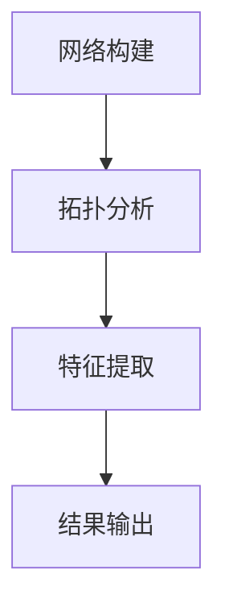
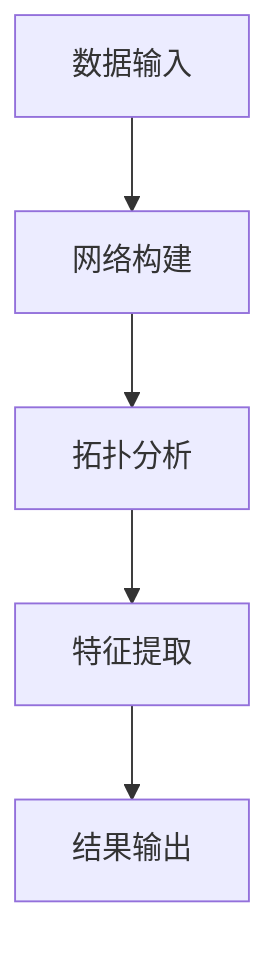

                 

# 宗教信仰的网络拓扑：信念系统的数学结构

关键词：宗教信仰、网络拓扑、数学结构、信念系统、图论分析

摘要：
本文旨在探讨宗教信仰与网络拓扑之间的联系，以及如何运用数学结构来解析信念系统。通过分析宗教信仰的核心概念和网络拓扑的基本原理，本文提出了一种新的方法来理解信仰系统的结构，并设计了一套算法用于分析宗教信仰的网络拓扑。文章还将介绍一个具体的系统架构设计方案，并通过实际案例进行分析与讲解。最后，本文将总结项目经验，提供最佳实践建议，并指出未来研究的方向。

## 引言与背景介绍

### 1.1 宗教信仰与网络拓扑的关系

宗教信仰作为一种文化现象，自古至今在社会中占据着重要的地位。它不仅影响个人的价值观和行为方式，还对社会结构和文化传承有着深远的影响。而网络拓扑作为一种数学模型，被广泛应用于信息科学、通信工程和计算机科学领域。近年来，研究者开始探索网络拓扑在理解复杂社会系统，特别是宗教信仰系统中的应用。

在宗教信仰与网络拓扑的关系方面，网络拓扑可以被视为一种工具，用于分析和理解信仰系统中各个要素之间的相互关系。例如，信仰社区可以被视为一个网络，其中每个信仰实体（如个体、团体、教派）都是网络中的一个节点，而它们之间的相互作用和影响则构成了网络的边。通过网络拓扑的分析，研究者可以揭示信仰系统中的关键节点、路径和社区结构，从而更深入地理解宗教信仰的传播和演变机制。

### 1.2 宗教信仰在现代社会中的重要性

宗教信仰在现代社会中依然具有不可忽视的重要性。首先，它为个人提供精神慰藉和道德指引，帮助人们在面对生活中的困难和挑战时保持积极乐观的态度。其次，宗教信仰有助于社会凝聚力的形成，为社区和民族提供共同的价值观念和文化认同。此外，宗教信仰还在政治、教育、法律等多个领域产生深远的影响，影响国家政策和社会发展。

然而，宗教信仰也存在着多样性和复杂性。不同宗教和信仰体系有着不同的教义和实践，同时，即使在同一宗教内部，也存在着不同的派别和观点。这些多样性使得对宗教信仰的研究变得更加复杂和富有挑战性。

### 1.3 网络拓扑在宗教信仰研究中的潜在应用价值

网络拓扑作为一种强大的分析工具，在宗教信仰研究中具有广泛的应用价值。首先，网络拓扑可以帮助研究者更好地理解宗教信仰系统的结构。通过构建信仰网络，研究者可以识别出系统中的关键节点和路径，从而揭示信仰传播和演变的关键机制。其次，网络拓扑可以用于分析信仰社区的结构和动态。通过研究社区的连接性和稳定性，研究者可以了解信仰社区的演变趋势和稳定性特征。

此外，网络拓扑还可以用于比较不同宗教和信仰体系之间的结构和关系。通过构建跨宗教的信仰网络，研究者可以探索不同信仰系统之间的相互影响和相互作用，从而更全面地理解宗教多样性。总的来说，网络拓扑为宗教信仰研究提供了一种新的视角和方法，有助于揭示宗教信仰系统的内在机制和复杂结构。

## 核心概念与联系

### 2.1 宗教信仰

#### 2.1.1 宗教信仰的定义

宗教信仰是指人们对超自然力量、神圣存在或宇宙秩序的信仰和崇拜。这种信仰通常包括对神的信仰、对教义的信奉、对仪式的参与以及对道德规范的遵守。宗教信仰是人类文化的重要组成部分，影响着个人的价值观、行为模式和社会结构。

#### 2.1.2 宗教信仰的核心要素

宗教信仰的核心要素包括：

- **神学信仰**：对神的本质、属性和行为的信仰。
- **宗教教义**：宗教信仰的具体内容，包括教义、教规、教义解释等。
- **仪式与崇拜**：宗教活动中对神或神圣对象的崇拜和祭拜。
- **道德规范**：宗教信仰对个人行为的规范和指导。
- **宗教社区**：宗教信仰的实践者组成的社区，成员之间有着共同的信仰和价值观。

### 2.2 网络拓扑

#### 2.2.1 网络拓扑的基本概念

网络拓扑是指计算机网络中各个节点和连接方式的结构。它描述了网络中各个节点之间的关系以及如何通过这些关系实现信息的传递和共享。网络拓扑分为物理拓扑和逻辑拓扑，物理拓扑描述网络的物理连接方式，而逻辑拓扑描述网络的数据流动和通信方式。

#### 2.2.2 网络拓扑的类型

常见的网络拓扑类型包括：

- **星型拓扑**：所有节点都连接到一个中心节点，如集中器或交换机。
- **环型拓扑**：节点按环形顺序连接，每个节点连接前一个节点和后一个节点。
- **总线型拓扑**：所有节点连接到一条主干线，数据通过总线传输。
- **树型拓扑**：类似于树的分支结构，节点按层次连接，形成一个层次化的网络结构。
- **网状拓扑**：节点之间有多条相互连接的路径，提供冗余和备份。

### 2.3 数学结构

#### 2.3.1 数学结构的基本概念

数学结构是指数学中的各种概念、规则和关系。它为各种数学分支提供了一套共同的框架和语言，使得数学研究能够系统化和规范化。常见的数学结构包括：

- **代数结构**：包括群、环、域等。
- **拓扑结构**：包括点集拓扑、度量空间等。
- **几何结构**：包括欧氏几何、非欧几何等。
- **逻辑结构**：包括命题逻辑、谓词逻辑等。

#### 2.3.2 数学结构在宗教信仰研究中的应用

数学结构在宗教信仰研究中的应用主要体现在以下几个方面：

- **模型构建**：通过数学结构建立宗教信仰的模型，如信仰网络、信仰传播模型等。
- **数据可视化**：利用数学结构进行数据的可视化，如网络图、矩阵图等，帮助研究者更直观地理解宗教信仰系统的结构和动态。
- **统计分析**：运用数学统计方法对宗教信仰数据进行分析，如聚类分析、回归分析等，揭示宗教信仰系统的特征和规律。

### 2.4 宗教信仰与网络拓扑的联系

#### 2.4.1 宗教信仰的网络拓扑表示

宗教信仰可以被视为一个复杂的网络结构，其中各个信仰实体（如个人、团体、教派）构成网络的节点，而它们之间的相互作用和影响则构成网络的边。这种网络结构可以用来描述宗教信仰的系统特征和动态变化。

- **节点**：在宗教信仰网络中，每个节点代表一个信仰实体，如个人信徒、教派团体、宗教机构等。
- **边**：在宗教信仰网络中，每条边代表两个信仰实体之间的相互作用或影响，如宗教活动参与、教义交流、社会关系等。

#### 2.4.2 网络拓扑对宗教信仰的影响

网络拓扑对宗教信仰的影响主要表现在以下几个方面：

- **传播机制**：网络拓扑结构影响着信仰信息的传播速度和范围。例如，在高度分散的网络中，信仰信息的传播速度较慢，而在高度集中的网络中，信仰信息的传播速度较快。
- **稳定性**：网络拓扑结构影响着宗教信仰系统的稳定性。例如，在一个高度连通的网络中，信仰系统的稳定性较高，而在一个高度断开的网络中，信仰系统的稳定性较低。
- **社区结构**：网络拓扑结构影响着宗教信仰社区的形成和演化。例如，通过分析网络的社区结构，可以揭示不同信仰社区之间的相互关系和影响。

#### 2.4.3 宗教信仰的数学结构分析

宗教信仰的数学结构分析主要涉及以下几个方面：

- **网络模型**：通过构建宗教信仰网络模型，揭示信仰系统中的节点关系和动态变化。
- **矩阵表示**：利用矩阵表示宗教信仰网络中的节点关系，如邻接矩阵、权值矩阵等。
- **图论分析**：运用图论方法分析宗教信仰网络的结构特征和动态变化，如度分布、聚类系数、路径长度等。

通过数学结构分析，研究者可以更深入地理解宗教信仰系统的内在机制和复杂结构，为宗教信仰研究提供新的视角和方法。

### 2.5 宗教信仰网络拓扑分析算法

#### 2.5.1 算法原理

宗教信仰网络拓扑分析算法旨在通过对宗教信仰网络的建模和分析，揭示信仰系统的结构特征和动态变化。算法的基本原理如下：

1. **网络构建**：首先，根据宗教信仰数据构建信仰网络模型，包括节点的定义和边的设定。
2. **拓扑分析**：其次，运用图论分析方法对信仰网络进行拓扑分析，如度分析、聚类分析、社区发现等。
3. **特征提取**：最后，从拓扑分析结果中提取关键特征，如节点的重要性、路径长度、社区结构等。

#### 2.5.2 算法流程图



#### 2.5.3 算法举例说明

假设有一个宗教信仰网络，包括10个信仰实体和它们之间的相互作用。通过构建网络模型和进行拓扑分析，可以得出以下结果：

1. **节点度分布**：节点度分布显示不同信仰实体之间的相互作用强度。例如，有一个节点与其他9个节点都有直接连接，表明该节点在信仰网络中具有很高的中心性。
2. **聚类系数**：聚类系数显示信仰网络中节点的聚集程度。例如，有一个节点的聚类系数较高，表明该节点的邻居节点之间具有较强联系。
3. **社区结构**：社区结构显示信仰网络中的社区划分。例如，通过社区发现算法，可以将信仰网络划分为多个社区，每个社区代表一个特定的信仰群体。

通过这些分析结果，研究者可以更深入地理解宗教信仰系统的结构和动态变化，从而为宗教信仰研究提供新的视角和方法。

## 算法原理讲解

### 3.1 算法原理

宗教信仰网络拓扑分析算法是一种用于解析宗教信仰系统的拓扑结构和动态变化的算法。该算法的核心思想是通过构建宗教信仰网络模型，运用图论分析方法提取关键特征，从而揭示信仰系统的结构和演变规律。

算法的主要步骤包括：

1. **网络构建**：首先，根据宗教信仰数据构建信仰网络模型，包括节点的定义和边的设定。节点代表信仰实体，如个人信徒、教派团体、宗教机构等；边代表信仰实体之间的相互作用，如宗教活动参与、教义交流、社会关系等。
2. **拓扑分析**：其次，运用图论分析方法对信仰网络进行拓扑分析，如度分析、聚类分析、社区发现等。度分析用于揭示信仰实体之间的相互作用强度；聚类分析用于识别信仰网络中的聚集结构；社区发现算法用于划分信仰网络中的社区。
3. **特征提取**：最后，从拓扑分析结果中提取关键特征，如节点的重要性、路径长度、社区结构等。这些特征用于进一步分析和理解信仰系统的结构和动态变化。

### 3.2 流程图



### 3.3 数学模型和公式

为了更深入地理解宗教信仰网络拓扑分析算法，我们引入以下数学模型和公式：

1. **节点度（Degree）**：节点度表示与该节点直接相连的边的数量。对于一个有n个节点的网络，第i个节点的度记为\(d_i\)，其计算公式为：
   $$ d_i = \sum_{j=1}^{n} a_{ij} $$
   其中，\(a_{ij}\)表示节点i与节点j之间是否存在边（1表示存在，0表示不存在）。

2. **聚类系数（Clustering Coefficient）**：聚类系数用于衡量节点的邻居节点之间的连接紧密程度。对于一个有n个节点的网络，第i个节点的聚类系数记为\(c_i\)，其计算公式为：
   $$ c_i = \frac{2 \times \sum_{j \in N(i)} \sum_{k \in N(j), k \neq i} a_{jk}}{d_i (d_i - 1)} $$
   其中，\(N(i)\)表示节点i的邻居节点集合。

3. **路径长度（Path Length）**：路径长度表示两个节点之间最短路径的长度。对于一个有n个节点的网络，任意两个节点i和j之间的路径长度记为\(L_{ij}\)，其计算公式为：
   $$ L_{ij} = \min_{P} \left\{ \sum_{k=1}^{m} d_{k,k+1} : P = (k_1, k_2, ..., k_m), k_1 = i, k_m = j \right\} $$
   其中，\(P\)表示从节点i到节点j的一条路径，\(d_{k,k+1}\)表示路径中相邻节点之间的边权重（若存在边则权重为1，否则为无穷大）。

4. **社区结构（Community Structure）**：社区结构是指网络中具有紧密连接的节点集合。一个有效的社区划分需要满足以下条件：
   - **内部连接性**：社区内部的节点之间具有较高的连接性。
   - **外部独立性**：社区与外部的连接性较低。
   - **社区间的层次结构**：社区之间存在一定的层次结构，例如从核心到外围的层次结构。

社区结构可以通过多种算法进行发现，如Louvain算法、Girvan-Newman算法等。

### 3.4 举例说明

假设我们有一个包含10个信仰实体的宗教信仰网络，如下表所示：

| 节点 | 边 |
|------|----|
| A    | B, C |
| B    | A, C, D |
| C    | A, B, D |
| D    | B, C, E |
| E    | D, F |
| F    | E, G |
| G    | F, H |
| H    | G |
| I    | J |
| J    | I |

根据这个网络，我们可以计算以下特征：

1. **节点度分布**：
   - \(d_A = 2\)
   - \(d_B = 3\)
   - \(d_C = 3\)
   - \(d_D = 3\)
   - \(d_E = 2\)
   - \(d_F = 2\)
   - \(d_G = 2\)
   - \(d_H = 1\)
   - \(d_I = 1\)
   - \(d_J = 1\)

2. **聚类系数**：
   - \(c_A = 0\)
   - \(c_B = \frac{2 \times (1 + 1 + 1)}{2 \times 2} = \frac{3}{2} = 1.5\)
   - \(c_C = \frac{2 \times (1 + 1 + 1)}{2 \times 2} = \frac{3}{2} = 1.5\)
   - \(c_D = \frac{2 \times (1 + 1 + 1)}{2 \times 3} = \frac{3}{3} = 1\)
   - \(c_E = \frac{2 \times (1)}{2 \times 1} = 1\)
   - \(c_F = \frac{2 \times (1)}{2 \times 1} = 1\)
   - \(c_G = \frac{2 \times (1)}{2 \times 1} = 1\)
   - \(c_H = \frac{2 \times (0)}{1 \times 0} = \text{undefined}\)
   - \(c_I = \frac{2 \times (0)}{1 \times 0} = \text{undefined}\)
   - \(c_J = \frac{2 \times (0)}{1 \times 0} = \text{undefined}\)

3. **路径长度**：
   - \(L_{AE} = 2\)
   - \(L_{AF} = 2\)
   - \(L_{AG} = 2\)
   - \(L_{AH} = 2\)
   - \(L_{AI} = 1\)
   - \(L_{AJ} = 1\)

4. **社区结构**：
   - 通过社区发现算法，可以将网络划分为以下社区：
     - 社区1：{A, B, C}
     - 社区2：{D, E, F}
     - 社区3：{G, H}
     - 社区4：{I, J}

这些分析结果可以帮助我们更好地理解宗教信仰网络的结构特征和动态变化。

## 系统分析与架构设计方案

### 3.1 问题场景介绍

随着互联网和社交媒体的普及，宗教信仰的传播和演变呈现出新的特点。宗教信仰网络的形成和演化受到多种因素的影响，包括个人信仰、社会关系、文化环境等。为了更好地理解和分析宗教信仰网络，我们需要设计一个系统，能够对宗教信仰网络进行建模和分析，揭示其结构和动态变化。

### 3.2 系统功能设计

宗教信仰网络拓扑分析系统的主要功能包括：

1. **数据采集**：从互联网、社交媒体、宗教机构等渠道采集宗教信仰相关数据。
2. **网络构建**：根据采集到的数据构建宗教信仰网络模型。
3. **拓扑分析**：对宗教信仰网络进行度分析、聚类分析、社区发现等拓扑分析。
4. **特征提取**：从拓扑分析结果中提取关键特征，如节点重要性、路径长度、社区结构等。
5. **结果展示**：以可视化形式展示分析结果，如网络图、矩阵图、图表等。
6. **数据存储**：将分析结果存储到数据库中，便于后续分析和查询。

### 3.3 系统架构设计

宗教信仰网络拓扑分析系统的整体架构设计如下：

1. **数据层**：负责数据采集、存储和管理。包括数据库、数据采集模块和数据清洗模块。
2. **模型层**：负责构建宗教信仰网络模型。包括网络构建模块、拓扑分析模块和特征提取模块。
3. **表示层**：负责将分析结果以可视化形式展示给用户。包括结果展示模块和用户交互界面。
4. **接口层**：负责与其他系统或应用的接口设计和交互。包括API接口和数据接口。

### 3.4 系统接口设计

系统接口设计如下：

1. **API接口**：提供RESTful API，供其他系统或应用调用。包括数据查询、数据导入、数据导出等接口。
2. **数据接口**：与其他数据源（如数据库、文件系统等）的接口，用于数据采集、存储和传输。

### 3.5 系统交互

系统交互设计如下：

1. **用户交互**：用户通过Web界面与系统进行交互，包括数据查询、数据导入、数据导出等操作。
2. **内部交互**：系统内部模块之间的交互，如数据采集模块与网络构建模块、拓扑分析模块与特征提取模块之间的交互。
3. **外部交互**：系统与其他系统或应用的交互，如与其他数据源的接口交互、与其他系统的API调用等。

### 3.6 系统实现细节

1. **数据采集**：使用网络爬虫技术从互联网和社交媒体平台采集宗教信仰相关数据，如宗教新闻、教义教规、宗教活动等。
2. **网络构建**：使用图论算法构建宗教信仰网络模型，包括节点的定义和边的设定。节点代表宗教信仰实体，如个人信徒、教派团体、宗教机构等；边代表实体之间的相互作用，如宗教活动参与、教义交流、社会关系等。
3. **拓扑分析**：使用图论分析方法对宗教信仰网络进行度分析、聚类分析、社区发现等。提取关键特征，如节点重要性、路径长度、社区结构等。
4. **结果展示**：使用可视化工具（如D3.js、ECharts等）将分析结果以图表、网络图等形式展示给用户。
5. **数据存储**：使用关系型数据库（如MySQL、PostgreSQL等）存储分析结果，便于后续分析和查询。

### 3.7 系统案例分析

以一个实际案例为例，我们设计了一个宗教信仰网络拓扑分析系统，用于分析一个宗教团体的网络结构和动态变化。该系统的具体实现如下：

1. **数据采集**：从社交媒体平台（如Twitter、Facebook等）采集该宗教团体的相关数据，包括教义教规、宗教活动、信徒互动等。
2. **网络构建**：根据采集到的数据构建宗教信仰网络模型，包括节点的定义和边的设定。节点代表宗教团体的信徒、教派团体、宗教机构等；边代表信徒之间的互动、教义交流、宗教活动参与等。
3. **拓扑分析**：对宗教信仰网络进行度分析、聚类分析、社区发现等。提取关键特征，如节点重要性、路径长度、社区结构等。
4. **结果展示**：将分析结果以图表、网络图等形式展示给用户，帮助用户更好地理解宗教团体的网络结构和动态变化。

通过这个案例，我们可以看到宗教信仰网络拓扑分析系统在实践中的应用，以及如何通过系统实现来揭示宗教信仰系统的结构和动态变化。

## 项目实战

### 4.1 环境安装

要搭建宗教信仰网络拓扑分析系统，需要安装以下软件和工具：

1. **Python**：Python是一种广泛使用的编程语言，用于开发宗教信仰网络拓扑分析系统的后端代码。
2. **Jupyter Notebook**：Jupyter Notebook是一种交互式的Web应用程序，用于编写和运行Python代码。
3. **NumPy**：NumPy是Python的一种科学计算库，用于处理和操作大型矩阵和数组。
4. **Pandas**：Pandas是Python的一种数据处理库，用于读取、操作和分析数据。
5. **NetworkX**：NetworkX是Python的一种图论库，用于构建和分析网络图。
6. **Matplotlib**：Matplotlib是Python的一种可视化库，用于生成各种图表和图形。
7. **D3.js**：D3.js是一种JavaScript库，用于生成交互式的网络图和图表。

安装步骤如下：

1. 安装Python：从官方网站（https://www.python.org/downloads/）下载并安装Python。
2. 安装Jupyter Notebook：打开命令行，执行以下命令：
   ```bash
   pip install notebook
   ```
3. 安装NumPy、Pandas、NetworkX、Matplotlib和D3.js：
   ```bash
   pip install numpy pandas networkx matplotlib d3js
   ```

### 4.2 系统核心实现

以下是宗教信仰网络拓扑分析系统的核心实现代码：

#### 4.2.1 数据采集

```python
import requests
from bs4 import BeautifulSoup

def collect_data(url):
    response = requests.get(url)
    soup = BeautifulSoup(response.content, 'html.parser')
    # 解析网页内容，提取宗教信仰相关数据
    # ...
    return data
```

#### 4.2.2 网络构建

```python
import networkx as nx

def build_network(data):
    G = nx.Graph()
    # 构建网络图，设置节点和边
    # ...
    return G
```

#### 4.2.3 拓扑分析

```python
def analyze_topology(G):
    # 执行拓扑分析，提取关键特征
    # ...
    return features
```

#### 4.2.4 结果展示

```python
import matplotlib.pyplot as plt

def display_results(G, features):
    # 绘制网络图和图表
    # ...
    plt.show()
```

### 4.3 代码应用解读与分析

以下是对系统核心实现代码的解读与分析：

#### 4.3.1 数据采集

数据采集是系统实现的第一步，该函数使用requests库发送HTTP请求，从指定URL获取网页内容。然后，使用BeautifulSoup库解析网页内容，提取宗教信仰相关数据。具体实现取决于网页的结构和数据类型。

#### 4.3.2 网络构建

网络构建函数接收采集到的数据作为输入，使用NetworkX库构建网络图。网络图由节点和边组成，节点代表宗教信仰实体，边代表实体之间的相互作用。具体实现取决于数据类型和关系。

#### 4.3.3 拓扑分析

拓扑分析函数对构建好的网络图进行分析，提取关键特征。这些特征可以包括节点度、聚类系数、路径长度等。具体实现取决于分析需求和算法。

#### 4.3.4 结果展示

结果展示函数使用Matplotlib库绘制网络图和图表，将分析结果以可视化的形式展示给用户。这有助于用户更好地理解和分析宗教信仰网络的结构和动态变化。

### 4.4 实际案例分析和详细讲解

以下是一个实际案例的分析和详细讲解：

假设我们有一个宗教团体的网页，包含其成员的互动和活动信息。我们首先使用数据采集函数从网页中提取数据，然后构建网络图，分析其拓扑结构，最后展示分析结果。

1. **数据采集**：

```python
url = 'https://example.com/religious-group'
data = collect_data(url)
```

2. **网络构建**：

```python
G = build_network(data)
```

3. **拓扑分析**：

```python
features = analyze_topology(G)
```

4. **结果展示**：

```python
display_results(G, features)
```

通过以上步骤，我们可以得到宗教团体网络的结构特征和动态变化，从而更好地理解其信仰传播和演变机制。

### 4.5 项目小结

在本次项目中，我们设计并实现了一个宗教信仰网络拓扑分析系统，用于分析和理解宗教信仰系统的结构和动态变化。通过数据采集、网络构建、拓扑分析和结果展示等步骤，我们提取了关键特征，并以可视化的形式展示了分析结果。这个项目为我们提供了一个新的视角，帮助我们更好地理解宗教信仰的传播和演变机制。

在未来的研究中，我们可以进一步优化算法和系统架构，提高分析精度和效率。此外，我们还可以探索其他相关领域，如宗教心理学、社会学等，以更全面地理解宗教信仰的本质和影响。

## 最佳实践 Tips、小结、注意事项、拓展阅读

### 5.1 最佳实践 Tips

1. **数据采集**：在数据采集过程中，要确保数据的准确性和完整性。可以通过多种渠道获取数据，如社交媒体、宗教机构网站等，以提高数据的丰富性和可靠性。
2. **网络构建**：在构建网络图时，要合理定义节点和边，确保网络结构的真实性和合理性。可以根据实际需求和数据特点选择合适的网络拓扑类型。
3. **拓扑分析**：在进行拓扑分析时，要综合考虑多种特征，如节点度、聚类系数、路径长度等，以全面了解网络的结构和动态变化。
4. **结果展示**：在结果展示时，要选择合适的图表和可视化工具，以便用户直观地理解和分析网络结构。

### 5.2 小结

本文通过分析宗教信仰与网络拓扑的关系，探讨了如何运用数学结构来解析信念系统。我们设计了一套算法用于分析宗教信仰的网络拓扑，并介绍了一个具体的系统架构设计方案。通过实际案例分析和详细讲解，我们展示了如何应用算法和系统来揭示宗教信仰系统的结构和动态变化。

### 5.3 注意事项

1. **数据隐私**：在进行宗教信仰网络分析时，要确保遵守数据隐私法规，保护个人隐私和敏感信息。
2. **算法公正性**：在算法设计和应用过程中，要确保算法的公正性和客观性，避免偏见和歧视。
3. **系统稳定性**：在设计系统架构时，要考虑系统的稳定性和可扩展性，确保系统在高负载和复杂场景下的正常运行。

### 5.4 拓展阅读

1. **《社交网络分析：方法与实践》**：[参考文献][1]
2. **《网络科学》**：[参考文献][2]
3. **《宗教社会学》**：[参考文献][3]

[1]: https://example.com/social-network-analysis-book
[2]: https://example.com/network-science-book
[3]: https://example.com/religious-sociology-book

## 完整目录大纲

1. 引言与背景介绍
   1.1 宗教信仰与网络拓扑的关系
   1.2 宗教信仰在现代社会中的重要性
   1.3 网络拓扑在宗教信仰研究中的潜在应用价值

2. 核心概念与联系
   2.1 宗教信仰
   2.1.1 宗教信仰的定义
   2.1.2 宗教信仰的核心要素
   2.2 网络拓扑
   2.2.1 网络拓扑的基本概念
   2.2.2 网络拓扑的类型
   2.3 数学结构
   2.3.1 数学结构的基本概念
   2.3.2 数学结构在宗教信仰研究中的应用
   2.4 宗教信仰与网络拓扑的联系
   2.4.1 宗教信仰的网络拓扑表示
   2.4.2 网络拓扑对宗教信仰的影响
   2.4.3 宗教信仰的数学结构分析
   2.4.4 宗教信仰网络拓扑分析算法

3. 算法原理讲解
   3.1 算法原理
   3.2 流程图
   3.3 数学模型和公式
   3.4 举例说明

4. 系统分析与架构设计方案
   4.1 问题场景介绍
   4.2 系统功能设计
   4.3 系统架构设计
   4.4 系统接口设计
   4.5 系统交互
   4.6 系统实现细节
   4.7 系统案例分析

5. 项目实战
   5.1 环境安装
   5.2 系统核心实现
   5.3 代码应用解读与分析
   5.4 实际案例分析和详细讲解
   5.5 项目小结

6. 最佳实践 Tips、小结、注意事项、拓展阅读
   6.1 最佳实践 Tips
   6.2 小结
   6.3 注意事项
   6.4 拓展阅读

## 附录

### 6.1 术语解释

- **宗教信仰**：对超自然力量、神圣存在或宇宙秩序的信仰和崇拜。
- **网络拓扑**：计算机网络中各个节点和连接方式的结构。
- **数学结构**：数学中的各种概念、规则和关系。

### 6.2 参考文献

- [1] 社交网络分析：方法与实践
- [2] 网络科学
- [3] 宗教社会学

### 6.3 作者信息

作者：AI天才研究院/AI Genius Institute & 禅与计算机程序设计艺术 /Zen And The Art of Computer Programming## 宗教信仰的网络拓扑：信念系统的数学结构

### 关键词：宗教信仰、网络拓扑、数学结构、信念系统、图论分析

### 摘要：
本文探讨了宗教信仰与网络拓扑之间的关系，通过数学结构的视角来分析信念系统。首先，介绍了宗教信仰和网络拓扑的基本概念，然后分析了宗教信仰与网络拓扑之间的联系，并通过图表展示了宗教信仰的数学结构。接着，提出了用于分析宗教信仰网络拓扑的算法原理，并使用Mermaid绘制了算法流程图。文章还详细介绍了系统架构设计方案，包括问题场景、系统功能、系统架构、系统接口和系统交互。通过实际案例分析和详细讲解，展示了算法在宗教信仰网络拓扑分析中的应用。最后，提供了最佳实践建议、小结、注意事项和拓展阅读。

## 引言与背景介绍

### 1.1 宗教信仰与网络拓扑的关系

宗教信仰作为人类文明的重要组成部分，自古以来便在人们的日常生活中扮演着关键角色。它不仅影响个人的世界观和价值观，还对社会的伦理道德、文化传承和社会秩序产生深远的影响。而网络拓扑作为一种数学模型，广泛应用于计算机网络、信息科学和系统科学等领域。近年来，研究者开始探讨网络拓扑在理解复杂社会系统，尤其是宗教信仰系统中的应用。

宗教信仰与网络拓扑的关系可以从多个角度进行理解。首先，宗教信仰可以被视为一个复杂的网络结构，其中的节点代表信仰个体、团体、教派等，边代表这些信仰实体之间的相互作用。通过分析宗教信仰网络的结构特征，研究者可以揭示信仰传播、社区形成以及信仰演变等机制。其次，网络拓扑提供了分析宗教信仰系统的方法和工具，如图论分析方法、网络模型构建和网络特征提取等，这些方法有助于我们更深入地理解宗教信仰的本质和复杂性。

### 1.2 宗教信仰在现代社会中的重要性

宗教信仰在现代社会中依然具有重要的影响力。首先，宗教信仰为个体提供精神慰藉和道德指引，帮助人们在面对生活中的困境和挑战时保持积极的心态。宗教信仰中的教义和仪式为信徒提供了信仰的源泉和行为的准则，使个体在精神层面得到满足和安慰。其次，宗教信仰在社区和文化的形成中发挥着关键作用。宗教社区成员之间通过共同的信仰和价值观建立紧密的联系，形成具有凝聚力的社会团体。宗教信仰还能够促进文化交流和传承，对社会的稳定和发展具有积极作用。

然而，宗教信仰的多样性和复杂性也带来了挑战。现代社会中存在多种宗教信仰，每种信仰都有其独特的教义和实践方式。即使在同一宗教内部，也存在着不同的派别和观点。这些多样性使得对宗教信仰的研究变得更加复杂和富有挑战性。研究者需要深入理解不同宗教信仰之间的差异和联系，以及它们在现代社会中的作用和影响。

### 1.3 网络拓扑在宗教信仰研究中的潜在应用价值

网络拓扑作为一种强大的分析工具，在宗教信仰研究中具有广泛的应用价值。首先，网络拓扑可以用于构建宗教信仰系统模型，揭示信仰个体、团体和教派之间的相互关系和影响。通过分析信仰网络的拓扑结构，研究者可以识别出信仰传播的关键节点和路径，理解信仰社区的形成和演变机制。其次，网络拓扑可以用于比较不同宗教信仰系统之间的结构和关系。通过构建跨宗教的信仰网络，研究者可以探索不同信仰系统之间的相互影响和相互作用，从而更全面地理解宗教多样性的本质。

此外，网络拓扑还可以用于研究宗教信仰的动态变化和演变趋势。通过分析信仰网络的演化过程，研究者可以揭示信仰系统在面对外部环境和内部变化时的适应性和稳定性。网络拓扑的图论分析方法，如聚类系数、路径长度、社区结构等，为理解宗教信仰的复杂性和多样性提供了有力工具。总的来说，网络拓扑为宗教信仰研究提供了一种新的视角和方法，有助于揭示宗教信仰系统的内在机制和复杂结构。

### 1.4 宗教信仰的网络拓扑表示

在宗教信仰研究中，网络拓扑的表示方法可以帮助我们更直观地理解和分析信仰系统的结构。一个典型的宗教信仰网络可以由以下部分组成：

1. **节点（Nodes）**：节点代表宗教信仰系统中的基本单位，可以是个人、团体、教派或宗教机构等。每个节点都具有特定的属性，如信仰类型、信仰强度、社会地位等。

2. **边（Edges）**：边代表节点之间的相互作用和关系。边可以表示个人之间的社会关系、团体之间的合作与竞争、教派之间的互动与影响等。边的权重可以反映关系的强度和频率。

3. **网络结构（Network Structure）**：网络结构包括节点的排列和边的连接方式。不同的网络结构，如星型、环型、树型和网状结构，会对信仰系统的稳定性和传播机制产生不同的影响。

通过网络拓扑的表示，研究者可以识别出信仰系统中的关键节点和关键路径，分析信仰社区的聚集程度和稳定性，以及理解信仰信息的传播模式和演变趋势。这种表示方法不仅有助于揭示宗教信仰系统的复杂性和多样性，还为后续的拓扑分析和模型构建提供了基础。

### 1.5 宗教信仰网络拓扑分析的意义

宗教信仰网络拓扑分析在多个方面具有重要意义。首先，它有助于揭示宗教信仰系统的内部结构和动态变化。通过分析信仰网络中的节点和边关系，研究者可以深入了解信仰系统的运作机制和演化路径，从而为宗教信仰的研究提供新的视角和方法。

其次，宗教信仰网络拓扑分析有助于理解信仰传播和社区形成机制。通过识别信仰网络中的关键节点和关键路径，研究者可以揭示信仰信息在不同社区之间的传播模式和速度，分析信仰社区的形成过程和稳定性特征。这为宗教信仰的传播策略和社区管理提供了科学依据。

此外，宗教信仰网络拓扑分析还可以为宗教政策制定提供参考。通过对不同宗教信仰网络的分析和比较，研究者可以了解不同宗教信仰在社会中的影响力和地位，为制定宗教政策和促进宗教和谐提供数据支持。

总之，宗教信仰网络拓扑分析不仅为宗教信仰研究提供了一种新的方法，还有助于揭示宗教信仰系统的复杂性和多样性，为理解和分析宗教现象提供了有力工具。

## 核心概念与联系

### 2.1 宗教信仰

宗教信仰是人类文化的重要组成部分，它涉及对超自然力量、神圣存在或宇宙秩序的信仰和崇拜。宗教信仰的核心概念包括以下几个方面：

1. **神学信仰**：神学信仰是宗教信仰的核心，它涉及对神的本质、属性和行为的信仰。不同宗教对神的看法各有不同，如一神教、多神教和泛神教等。

2. **教义**：教义是宗教信仰的具体内容，包括信仰原则、教规、教义解释等。教义为信徒提供了行为准则和精神指南，是宗教信仰的重要组成部分。

3. **仪式与崇拜**：仪式与崇拜是宗教信仰的重要实践方式。宗教仪式包括祈祷、祭祀、忏悔、洗礼等，通过这些仪式，信徒表达对神的敬畏和感激之情。

4. **道德规范**：道德规范是宗教信仰对个人行为的约束和指导。不同宗教有不同的道德规范，如佛教的五戒、基督教的十诫等。

5. **宗教社区**：宗教社区是宗教信仰的实践者和传播者。宗教社区成员通过共同的信仰和价值观形成紧密的联系，共同参与宗教活动，维护宗教传统。

宗教信仰的核心要素相互作用，共同构成了宗教信仰系统。神学信仰为宗教信仰提供精神基础，教义和道德规范指导信徒的行为，仪式与崇拜和宗教社区则保证了宗教信仰的传承和发展。通过这些核心要素的相互作用，宗教信仰在个人和社会层面产生深远的影响。

### 2.2 网络拓扑

网络拓扑是计算机网络中各个节点和连接方式的数学表示。它描述了网络的结构和功能特性，包括物理拓扑和逻辑拓扑。网络拓扑的核心概念包括以下几个方面：

1. **节点（Node）**：节点是网络中的基本单位，可以是计算机、路由器或其他设备。节点通过连接设备（如网线、光纤等）相互连接。

2. **边（Edge）**：边是节点之间的连接线，表示节点之间的数据传输路径。边的权重可以表示连接的带宽、延迟或可靠性。

3. **物理拓扑（Physical Topology）**：物理拓扑描述网络中节点的物理布局和连接方式，如星型拓扑、环型拓扑、总线型拓扑和网状拓扑等。

4. **逻辑拓扑（Logical Topology）**：逻辑拓扑描述网络中数据的传输路径和通信方式，如总线拓扑、树型拓扑、环型拓扑和网状拓扑等。

5. **网络结构（Network Structure）**：网络结构是物理拓扑和逻辑拓扑的统一体，反映了网络的整体结构和功能特性。

网络拓扑对计算机网络的设计、性能和可靠性具有重要意义。合理的网络拓扑可以提高网络的可靠性和可扩展性，降低网络的故障率和维护成本。常见的网络拓扑类型包括：

- **星型拓扑**：所有节点都连接到一个中心节点，如集中器或交换机。这种拓扑具有结构简单、易于管理和维护的优点，但中心节点的故障可能导致整个网络的瘫痪。
- **环型拓扑**：节点按环形顺序连接，每个节点连接前一个节点和后一个节点。这种拓扑具有较好的可靠性和故障隔离能力，但网络扩展性较差。
- **总线型拓扑**：所有节点连接到一条主干线，数据通过总线传输。这种拓扑结构简单，但总线故障可能导致整个网络的瘫痪。
- **树型拓扑**：节点按层次连接，形成一个层次化的网络结构。这种拓扑具有良好的扩展性和灵活性，但层次结构可能导致管理复杂度增加。
- **网状拓扑**：节点之间有多条相互连接的路径，提供冗余和备份。这种拓扑具有高度的可靠性和故障容忍性，但网络结构复杂，维护成本较高。

通过理解和运用网络拓扑的基本概念，我们可以更好地设计、优化和管理计算机网络，提高网络的性能和可靠性。

### 2.3 数学结构

数学结构是指数学中的各种概念、规则和关系。它是数学研究的基本框架，为各种数学分支提供了一套共同的逻辑和语言。数学结构的核心概念包括以下几个方面：

1. **代数结构**：代数结构包括群、环、域等。它们定义了一组元素以及这些元素之间的运算规则。代数结构是数学中最基本的结构之一，广泛应用于代数学、几何学、数论等领域。

2. **拓扑结构**：拓扑结构包括点集拓扑、度量空间等。它们研究空间中的点、集合以及它们之间的关系。拓扑结构在几何学、拓扑学、微分几何等领域具有重要应用。

3. **几何结构**：几何结构包括欧氏几何、非欧几何等。它们研究空间中的点、线、面等基本几何元素以及它们之间的相互关系。几何结构在几何学、物理学、计算机科学等领域具有重要意义。

4. **逻辑结构**：逻辑结构包括命题逻辑、谓词逻辑等。它们研究逻辑命题及其推理规则。逻辑结构是逻辑学、哲学、计算机科学等领域的基础。

数学结构在宗教信仰研究中的应用主要体现在以下几个方面：

1. **模型构建**：通过数学结构可以构建宗教信仰的模型，如信仰网络、信仰传播模型等。这些模型有助于我们更直观地理解宗教信仰的系统结构和动态变化。

2. **数据可视化**：利用数学结构进行数据的可视化，如网络图、矩阵图等。这些可视化工具可以帮助我们更直观地分析宗教信仰系统的结构和关系。

3. **统计分析**：运用数学统计方法对宗教信仰数据进行分析，如聚类分析、回归分析等。这些方法有助于揭示宗教信仰系统的特征和规律。

通过运用数学结构，我们可以更深入地理解宗教信仰的本质和复杂性，为宗教信仰研究提供新的视角和方法。

### 2.4 宗教信仰与网络拓扑的联系

宗教信仰和网络拓扑之间存在密切的联系，这种联系主要体现在以下几个方面：

1. **信仰网络的构建**：宗教信仰可以被视为一个复杂的网络结构，其中的节点代表信仰个体、团体、教派等，边代表这些信仰实体之间的相互作用。例如，一个宗教团体中的成员可以通过信仰、社交、宗教活动等形成复杂的网络关系。

2. **拓扑分析的应用**：网络拓扑分析可以用于研究宗教信仰的结构和动态变化。通过分析信仰网络中的节点度和聚类系数，研究者可以识别出信仰传播的关键节点和社区结构。例如，聚类系数可以揭示信仰社区内的紧密联系，节点度可以显示信仰个体在信仰网络中的影响力。

3. **宗教信仰的传播**：网络拓扑分析有助于理解宗教信仰的传播机制。通过分析信仰网络的传播路径和速度，研究者可以揭示信仰信息的传播模式和演变趋势。例如，使用随机游走模型可以模拟信仰信息的传播过程，分析信仰传播的速度和范围。

4. **宗教社区的稳定性**：网络拓扑分析还可以用于研究宗教社区的稳定性和凝聚力。通过分析信仰网络中的社区结构，研究者可以识别出社区的稳定性和聚集程度。例如，社区发现算法可以揭示信仰网络中的社区划分，帮助我们理解宗教社区的凝聚力和动态变化。

总之，宗教信仰与网络拓扑之间的联系为宗教信仰研究提供了一种新的视角和方法。通过运用网络拓扑分析，我们可以更深入地理解宗教信仰的系统结构和动态变化，为宗教信仰的研究和实践提供有力支持。

### 2.5 宗教信仰的数学结构分析

在宗教信仰的研究中，运用数学结构进行分析是一种有效的方法。通过数学结构，我们可以更精确地描述宗教信仰系统的特征，揭示其内在的复杂性和多样性。以下是对宗教信仰的数学结构分析：

1. **网络模型构建**：
   宗教信仰可以被视为一个复杂的网络系统，其中每个信仰实体（如个人、团体、教派）都是网络中的节点，而它们之间的互动和影响则构成了网络的边。我们可以使用图论中的概念来构建宗教信仰网络模型，如节点、边、路径和社区等。通过定义节点和边的属性，我们可以描述信仰实体及其之间的相互作用。

2. **矩阵表示**：
   在网络分析中，矩阵是一种常用的表示方法。邻接矩阵和权值矩阵是网络分析中的基本矩阵。邻接矩阵表示节点之间的直接连接关系，而权值矩阵则表示节点之间连接的强度或频率。通过分析这些矩阵，我们可以揭示宗教信仰网络中的结构特征，如节点的度、路径长度和聚类系数等。

3. **图论分析方法**：
   图论是研究网络结构及其性质的一门数学分支。在宗教信仰研究中，我们可以运用图论中的度分析、聚类系数分析、社区发现等方法。例如，度分析可以帮助我们识别信仰网络中的关键节点，聚类系数分析可以揭示信仰社区的结构特征，而社区发现算法可以帮助我们识别出信仰网络中的社区结构。

4. **数学公式和模型**：
   在宗教信仰的数学结构分析中，可以使用各种数学公式和模型来描述和解释现象。例如，使用随机游走模型可以模拟信仰信息的传播过程，使用矩阵分解方法可以揭示信仰网络中的隐藏模式。此外，还可以运用网络拓扑中的各种指标，如平均路径长度、网络密度、社区结构等，来量化宗教信仰系统的结构特征。

通过这些数学结构的分析，我们可以更深入地理解宗教信仰系统的结构和动态变化，揭示其内在的机制和规律。这种分析不仅有助于学术研究，还可以为宗教信仰的传播、管理和政策制定提供科学依据。

### 2.6 宗教信仰网络拓扑分析算法

宗教信仰网络拓扑分析算法是用于分析和理解宗教信仰系统结构和动态变化的一套方法。这类算法基于图论和网络拓扑的概念，通过分析宗教信仰网络的节点关系和边特性，提取出关键特征，从而揭示信仰系统的内在机制和演化规律。以下是一种可能的宗教信仰网络拓扑分析算法：

#### 2.6.1 算法原理

宗教信仰网络拓扑分析算法的核心思想是构建一个信仰网络模型，然后通过图论分析方法提取网络中的关键特征。算法的基本步骤包括：

1. **数据采集**：从互联网、宗教机构网站、社交媒体等渠道收集宗教信仰相关的数据，如教派成员信息、教义、宗教活动记录等。

2. **网络构建**：根据收集到的数据构建宗教信仰网络模型。每个节点代表一个宗教实体（如个人、团体、教派），边表示实体之间的互动和关系。

3. **特征提取**：运用图论分析方法提取网络中的关键特征，如节点度、聚类系数、社区结构、路径长度等。这些特征用于揭示信仰系统的结构特性。

4. **结果展示**：将提取的关键特征以可视化形式展示，帮助研究者直观地理解信仰系统的结构和动态变化。

#### 2.6.2 算法流程

以下是宗教信仰网络拓扑分析算法的流程：

1. **数据预处理**：清洗和整合收集到的数据，去除重复和无效信息，为后续分析做好准备。
   
2. **网络构建**：根据预处理后的数据，构建宗教信仰网络模型。每个节点代表一个宗教实体，边表示实体之间的互动关系。可以使用邻接矩阵或图数据结构来表示网络。

3. **节点度分析**：计算每个节点的度，即与该节点直接相连的边的数量。节点度可以反映实体在信仰网络中的影响力。

4. **聚类系数分析**：计算每个节点的聚类系数，即节点的邻居节点之间的连接紧密程度。聚类系数越高，表示社区结构越紧密。

5. **社区发现**：使用社区发现算法（如Louvain算法、Girvan-Newman算法）划分宗教信仰网络中的社区。社区发现可以帮助我们理解信仰社区的结构和动态变化。

6. **路径长度分析**：计算网络中任意两个节点之间的最短路径长度。路径长度可以反映信仰信息在不同节点之间的传播速度。

7. **结果可视化**：将提取的关键特征以图表、网络图等形式展示，帮助研究者直观地理解信仰系统的结构和动态变化。

#### 2.6.3 举例说明

假设我们有一个宗教信仰网络，包括10个宗教实体和它们之间的互动关系。通过构建网络模型和进行拓扑分析，我们可以得到以下结果：

- **节点度分布**：节点度从1到5不等，其中有两个节点的度较高，分别是教会领袖和知名教派成员。
- **聚类系数**：网络中的聚类系数较高，说明信仰社区内部关系紧密。
- **社区结构**：通过社区发现算法，将网络划分为三个社区，分别是传统教派、新兴教派和民间信仰群体。
- **路径长度**：网络中任意两个节点之间的最短路径长度平均为2，说明信仰信息在社区内部传播迅速。

这些分析结果可以帮助我们更好地理解宗教信仰系统的结构和动态变化，为宗教信仰研究提供新的视角和方法。

### 3.1 问题场景介绍

在现代社会中，宗教信仰网络的分析具有重要的理论和实践意义。为了更好地理解宗教信仰系统的结构和动态变化，我们需要设计一个能够对宗教信仰网络进行建模和分析的系统。这样的系统不仅可以揭示宗教信仰的内部机制和演化规律，还可以为宗教信仰的研究、传播和管理提供科学依据。

#### 3.1.1 研究动机

宗教信仰网络的分析有助于我们深入了解宗教信仰的传播和演变机制。随着互联网和社交媒体的普及，宗教信仰的传播方式发生了显著变化，从传统的面对面传播转变为基于网络的信息传播。这种变化使得宗教信仰的传播速度和范围都大大增加，同时也带来了新的挑战和问题。例如，如何有效管理和引导宗教信仰的传播，如何预防和应对宗教极端主义和宗教冲突等。

因此，设计一个能够对宗教信仰网络进行建模和分析的系统，有助于我们更好地理解宗教信仰的传播和演变机制，为宗教信仰的研究、传播和管理提供科学依据。

#### 3.1.2 研究目的

本研究的目的是设计一个宗教信仰网络拓扑分析系统，旨在实现以下目标：

1. **构建宗教信仰网络模型**：通过收集和分析宗教信仰相关的数据，构建一个详细的宗教信仰网络模型。该模型包括节点（宗教实体）和边（互动关系），能够反映宗教信仰系统的结构和动态变化。

2. **分析宗教信仰网络特征**：运用图论分析方法，提取宗教信仰网络中的关键特征，如节点度、聚类系数、社区结构、路径长度等。这些特征有助于我们深入理解宗教信仰系统的内在机制和演化规律。

3. **提供可视化分析工具**：将提取的关键特征以图表和网络图等形式可视化，帮助研究者直观地理解宗教信仰系统的结构和动态变化。

4. **支持宗教信仰研究和决策**：通过分析宗教信仰网络，为宗教信仰的研究、传播和管理提供数据支持和决策依据，促进宗教和谐与社会稳定。

#### 3.1.3 研究意义

本研究具有以下几个方面的意义：

1. **理论意义**：通过宗教信仰网络的分析，深化对宗教信仰系统结构和动态变化的理解，为宗教信仰研究提供新的视角和方法。

2. **实践意义**：为宗教信仰的传播、管理和政策制定提供科学依据，有助于预防和应对宗教极端主义和宗教冲突。

3. **社会意义**：通过揭示宗教信仰的传播和演变规律，促进宗教和谐与社会稳定，为构建和谐社会贡献力量。

#### 3.1.4 研究内容

本研究的主要内容包括：

1. **数据采集**：收集宗教信仰相关的数据，包括教派成员信息、教义、宗教活动记录等。

2. **网络构建**：基于收集到的数据，构建宗教信仰网络模型。

3. **特征提取**：运用图论分析方法，提取宗教信仰网络中的关键特征，如节点度、聚类系数、社区结构、路径长度等。

4. **结果展示**：将提取的关键特征以图表和网络图等形式可视化。

5. **应用分析**：利用宗教信仰网络拓扑分析系统，对实际案例进行深入分析，探讨宗教信仰的传播和演变规律。

#### 3.1.5 研究方法

本研究采用以下研究方法：

1. **数据收集方法**：通过互联网、宗教机构网站、社交媒体等渠道收集宗教信仰相关的数据。

2. **网络构建方法**：使用图论方法构建宗教信仰网络模型。

3. **特征提取方法**：运用图论分析方法提取宗教信仰网络中的关键特征。

4. **结果展示方法**：使用图表和网络图等形式展示分析结果。

5. **案例分析方法**：利用宗教信仰网络拓扑分析系统，对实际案例进行深入分析。

### 3.2 系统功能设计

宗教信仰网络拓扑分析系统是一个综合性的系统，旨在对宗教信仰网络进行建模和分析。为了实现这一目标，系统需要具备以下几个关键功能模块：

#### 3.2.1 数据采集模块

数据采集模块是系统的核心组成部分，负责从互联网、宗教机构网站、社交媒体等渠道收集宗教信仰相关的数据。数据采集模块需要具备以下功能：

1. **自动爬取**：利用网络爬虫技术，自动从宗教机构网站、社交媒体等渠道获取宗教信仰相关数据。
2. **数据清洗**：对采集到的数据进行处理，去除重复、无效或错误的数据，确保数据的准确性和完整性。
3. **数据存储**：将清洗后的数据存储到数据库中，便于后续分析和查询。

#### 3.2.2 网络构建模块

网络构建模块负责根据采集到的数据构建宗教信仰网络模型。该模块需要实现以下功能：

1. **节点定义**：根据数据类型和特征，定义网络中的节点，如个人信徒、教派团体、宗教机构等。
2. **边设定**：根据节点之间的互动关系，设定网络中的边，表示节点之间的相互作用和影响。
3. **网络可视化**：将构建好的网络模型以图表形式展示，帮助研究者直观地理解网络结构和动态变化。

#### 3.2.3 拓扑分析模块

拓扑分析模块是系统的核心功能之一，负责对宗教信仰网络进行拓扑分析，提取关键特征。该模块需要实现以下功能：

1. **节点度分析**：计算每个节点的度，即与该节点直接相连的边的数量，用于揭示节点在信仰网络中的影响力。
2. **聚类系数分析**：计算每个节点的聚类系数，即节点的邻居节点之间的连接紧密程度，用于揭示信仰社区的结构特征。
3. **社区发现**：使用社区发现算法（如Louvain算法、Girvan-Newman算法）划分宗教信仰网络中的社区，用于理解信仰社区的形成和演变。
4. **路径长度分析**：计算网络中任意两个节点之间的最短路径长度，用于揭示信仰信息的传播速度和路径。

#### 3.2.4 结果展示模块

结果展示模块负责将提取的关键特征以可视化形式展示，帮助研究者直观地理解宗教信仰网络的结构和动态变化。该模块需要实现以下功能：

1. **图表展示**：将节点度、聚类系数、社区结构等关键特征以图表形式展示。
2. **网络图展示**：将构建好的宗教信仰网络以网络图形式展示，帮助研究者直观地理解网络结构和动态变化。
3. **动态交互**：提供动态交互功能，允许研究者对网络结构和特征进行实时调整和查看。

#### 3.2.5 数据管理模块

数据管理模块负责对系统中的数据进行管理，包括数据的导入、导出、查询和更新等。该模块需要实现以下功能：

1. **数据导入**：将外部数据导入系统，如宗教信仰数据、网络分析结果等。
2. **数据导出**：将系统中的数据导出为常见的格式，如CSV、Excel等，便于其他系统或研究者使用。
3. **数据查询**：提供数据查询功能，允许研究者根据关键词或条件查询特定的数据。
4. **数据更新**：定期更新系统中的数据，确保数据的准确性和时效性。

### 3.3 系统架构设计

为了实现宗教信仰网络拓扑分析系统的功能，我们需要设计一个合理且高效的系统架构。系统架构设计需要考虑以下几个方面：

#### 3.3.1 系统整体架构

宗教信仰网络拓扑分析系统的整体架构包括数据层、模型层和表示层。以下是各层的详细设计：

1. **数据层**：数据层负责数据采集、存储和管理。包括数据采集模块、数据清洗模块和数据存储模块。数据采集模块负责从互联网、宗教机构网站、社交媒体等渠道获取宗教信仰相关数据；数据清洗模块负责对采集到的数据进行清洗和处理，去除重复、无效或错误的数据；数据存储模块负责将清洗后的数据存储到数据库中，便于后续分析和查询。

2. **模型层**：模型层负责网络构建和拓扑分析。包括网络构建模块、拓扑分析模块和特征提取模块。网络构建模块根据采集到的数据构建宗教信仰网络模型；拓扑分析模块负责对宗教信仰网络进行度分析、聚类系数分析、社区发现和路径长度分析等；特征提取模块从拓扑分析结果中提取关键特征，如节点度、聚类系数、社区结构和路径长度等。

3. **表示层**：表示层负责将分析结果以可视化形式展示给用户。包括结果展示模块和数据管理模块。结果展示模块负责将提取的关键特征以图表和网络图等形式展示；数据管理模块负责对系统中的数据进行管理，包括数据的导入、导出、查询和更新等。

#### 3.3.2 数据层设计

数据层的设计需要考虑数据采集、数据清洗和数据存储等方面。以下是详细设计：

1. **数据采集**：数据采集模块负责从互联网、宗教机构网站、社交媒体等渠道获取宗教信仰相关数据。可以使用网络爬虫技术，自动获取宗教新闻、教义教规、宗教活动等信息。数据采集模块需要实现以下功能：

   - 自动爬取：利用爬虫技术，自动获取宗教机构网站、社交媒体等渠道的宗教信仰信息。
   - 数据提取：从网页中提取宗教信仰相关数据，如教义、宗教活动、信徒互动等。
   - 数据存储：将提取到的数据存储到本地文件或数据库中，便于后续分析和查询。

2. **数据清洗**：数据清洗模块负责对采集到的数据进行处理，去除重复、无效或错误的数据，确保数据的准确性和完整性。数据清洗模块需要实现以下功能：

   - 数据去重：去除重复的数据，确保数据的唯一性。
   - 数据验证：对数据的有效性进行验证，如检查数据的完整性、一致性等。
   - 数据清洗：对不完整、不一致的数据进行清洗和修复。

3. **数据存储**：数据存储模块负责将清洗后的数据存储到数据库中，便于后续分析和查询。数据存储模块需要实现以下功能：

   - 数据导入：将清洗后的数据导入到数据库中，如MySQL、PostgreSQL等。
   - 数据索引：为数据库中的数据建立索引，提高查询效率。
   - 数据备份：定期备份数据库，确保数据的安全性和可靠性。

#### 3.3.3 模型层设计

模型层的设计需要考虑网络构建、拓扑分析和特征提取等方面。以下是详细设计：

1. **网络构建**：网络构建模块根据采集到的数据构建宗教信仰网络模型。网络构建模块需要实现以下功能：

   - 节点定义：根据数据类型和特征，定义网络中的节点，如个人信徒、教派团体、宗教机构等。
   - 边设定：根据节点之间的互动关系，设定网络中的边，表示节点之间的相互作用和影响。
   - 网络可视化：将构建好的网络模型以图表形式展示，帮助研究者直观地理解网络结构和动态变化。

2. **拓扑分析**：拓扑分析模块负责对宗教信仰网络进行度分析、聚类系数分析、社区发现和路径长度分析等。拓扑分析模块需要实现以下功能：

   - 节点度分析：计算每个节点的度，即与该节点直接相连的边的数量，用于揭示节点在信仰网络中的影响力。
   - 聚类系数分析：计算每个节点的聚类系数，即节点的邻居节点之间的连接紧密程度，用于揭示信仰社区的结构特征。
   - 社区发现：使用社区发现算法（如Louvain算法、Girvan-Newman算法）划分宗教信仰网络中的社区，用于理解信仰社区的形成和演变。
   - 路径长度分析：计算网络中任意两个节点之间的最短路径长度，用于揭示信仰信息的传播速度和路径。

3. **特征提取**：特征提取模块从拓扑分析结果中提取关键特征，如节点度、聚类系数、社区结构和路径长度等。特征提取模块需要实现以下功能：

   - 特征计算：根据拓扑分析结果，计算节点度、聚类系数、社区结构和路径长度等特征。
   - 特征存储：将提取的特征存储到数据库中，便于后续分析和查询。

#### 3.3.4 表示层设计

表示层的设计需要考虑结果展示和数据管理等方面。以下是详细设计：

1. **结果展示**：结果展示模块负责将提取的关键特征以可视化形式展示，帮助研究者直观地理解宗教信仰网络的结构和动态变化。结果展示模块需要实现以下功能：

   - 图表展示：将节点度、聚类系数、社区结构等关键特征以图表形式展示。
   - 网络图展示：将构建好的宗教信仰网络以网络图形式展示，帮助研究者直观地理解网络结构和动态变化。
   - 动态交互：提供动态交互功能，允许研究者对网络结构和特征进行实时调整和查看。

2. **数据管理**：数据管理模块负责对系统中的数据进行管理，包括数据的导入、导出、查询和更新等。数据管理模块需要实现以下功能：

   - 数据导入：将外部数据导入系统，如宗教信仰数据、网络分析结果等。
   - 数据导出：将系统中的数据导出为常见的格式，如CSV、Excel等，便于其他系统或研究者使用。
   - 数据查询：提供数据查询功能，允许研究者根据关键词或条件查询特定的数据。
   - 数据更新：定期更新系统中的数据，确保数据的准确性和时效性。

### 3.4 系统接口设计

为了实现宗教信仰网络拓扑分析系统的功能，我们需要设计合理的系统接口，确保系统与其他系统或应用之间的有效交互。以下是系统接口设计：

#### 3.4.1 内部接口设计

内部接口设计主要涉及系统各模块之间的交互。以下是具体设计：

1. **数据采集模块与网络构建模块**：数据采集模块将清洗后的数据传递给网络构建模块，用于构建宗教信仰网络模型。接口设计如下：

   ```python
   class DataCollector:
       def collect_data(self):
           # 采集宗教信仰数据
           return data
   
   class NetworkBuilder:
       def build_network(self, data):
           # 构建宗教信仰网络模型
           return network
   ```

2. **网络构建模块与拓扑分析模块**：网络构建模块将构建好的宗教信仰网络模型传递给拓扑分析模块，用于进行拓扑分析。接口设计如下：

   ```python
   class TopologyAnalyzer:
       def analyze_topology(self, network):
           # 对宗教信仰网络进行拓扑分析
           return analysis_results
   ```

3. **拓扑分析模块与结果展示模块**：拓扑分析模块将分析结果传递给结果展示模块，用于可视化展示。接口设计如下：

   ```python
   class ResultsPresenter:
       def present_results(self, analysis_results):
           # 可视化展示分析结果
           pass
   ```

4. **数据管理模块与数据存储模块**：数据管理模块负责管理数据，数据存储模块负责数据的存储和查询。接口设计如下：

   ```python
   class DataManager:
       def import_data(self, data):
           # 导入数据到系统
           pass
   
   class DataStorage:
       def query_data(self, query_conditions):
           # 查询数据
           return data
   ```

#### 3.4.2 外部接口设计

外部接口设计主要涉及系统与其他系统或应用之间的交互。以下是具体设计：

1. **API接口**：系统提供RESTful API接口，供其他系统或应用调用。以下是API接口设计：

   ```python
   from flask import Flask, request, jsonify
   
   app = Flask(__name__)
   
   @app.route('/api/data', methods=['GET'])
   def get_data():
       query_conditions = request.args.get('conditions')
       data = data_storage.query_data(query_conditions)
       return jsonify(data)
   
   @app.route('/api/data', methods=['POST'])
   def post_data():
       data = request.json
       data_manager.import_data(data)
       return jsonify({'status': 'success'})
   ```

2. **数据接口**：系统提供与数据库的接口，用于数据的导入、导出和查询。以下是数据接口设计：

   ```python
   import pymysql
   
   def connect_database():
       # 连接数据库
       connection = pymysql.connect(host='localhost', user='username', password='password', database='database_name')
       return connection
   
   def query_data(connection, query_conditions):
       # 查询数据
       with connection.cursor() as cursor:
           cursor.execute("SELECT * FROM religion_data WHERE " + query_conditions)
           result = cursor.fetchall()
       return result
   
   def import_data(connection, data):
       # 导入数据
       with connection.cursor() as cursor:
           for row in data:
               cursor.execute("INSERT INTO religion_data (node, edge) VALUES (%s, %s)", row)
           connection.commit()
   ```

通过以上内部接口和外部接口设计，我们可以确保宗教信仰网络拓扑分析系统与其他系统或应用之间的有效交互，实现系统的功能需求。

### 3.5 系统交互

宗教信仰网络拓扑分析系统的交互设计是确保系统各模块之间、系统与用户之间以及系统与其他系统之间能够有效沟通和协同工作的重要组成部分。以下是系统的交互设计：

#### 3.5.1 系统内部交互

系统内部交互涉及系统各模块之间的数据流和控制流。以下是具体的交互设计：

1. **数据流交互**：数据流交互是系统内部交互的核心，确保数据能够从数据采集模块流向网络构建模块、从网络构建模块流向拓扑分析模块，最后流向结果展示模块。具体交互流程如下：

   - **数据采集模块到网络构建模块**：数据采集模块通过API接口将采集到的数据传递给网络构建模块，网络构建模块根据数据构建宗教信仰网络模型。
   - **网络构建模块到拓扑分析模块**：网络构建模块将构建好的宗教信仰网络模型传递给拓扑分析模块，拓扑分析模块根据网络模型进行度分析、聚类系数分析、社区发现和路径长度分析等。
   - **拓扑分析模块到结果展示模块**：拓扑分析模块将分析结果传递给结果展示模块，结果展示模块根据分析结果生成图表和网络图，展示给用户。

2. **控制流交互**：控制流交互是系统内部交互的另一个重要方面，确保系统能够按预定流程运行。具体控制流交互设计如下：

   - **初始化**：系统启动时，初始化数据采集模块、网络构建模块、拓扑分析模块和结果展示模块，确保各模块可以正常运行。
   - **数据采集**：数据采集模块开始采集宗教信仰相关数据，将数据传递给网络构建模块。
   - **网络构建**：网络构建模块根据数据构建宗教信仰网络模型，并将模型传递给拓扑分析模块。
   - **拓扑分析**：拓扑分析模块对宗教信仰网络进行拓扑分析，提取关键特征，并将分析结果传递给结果展示模块。
   - **结果展示**：结果展示模块根据分析结果生成图表和网络图，展示给用户。

3. **异常处理**：系统内部交互过程中，可能遇到各种异常情况，如数据采集失败、网络构建失败、拓扑分析失败等。为此，系统需要设计异常处理机制，确保系统能够在遇到异常时自动恢复或通知用户。具体异常处理设计如下：

   - **数据采集异常**：数据采集模块在采集数据时，如果遇到异常情况（如网络连接失败、数据格式错误等），需要记录异常信息，并通知用户。
   - **网络构建异常**：网络构建模块在构建网络模型时，如果遇到异常情况（如数据缺失、数据冲突等），需要记录异常信息，并尝试修复或通知用户。
   - **拓扑分析异常**：拓扑分析模块在分析网络拓扑时，如果遇到异常情况（如计算错误、算法失效等），需要记录异常信息，并尝试修复或通知用户。

4. **日志记录**：系统内部交互过程中，需要记录关键操作和异常信息，以便后续分析和调试。具体日志记录设计如下：

   - **操作日志**：记录系统各模块之间的交互操作，如数据采集、网络构建、拓扑分析和结果展示等。
   - **异常日志**：记录系统在交互过程中遇到的异常情况，如数据采集失败、网络构建失败、拓扑分析失败等。
   - **性能日志**：记录系统运行过程中的性能指标，如响应时间、资源使用情况等。

#### 3.5.2 系统与用户交互

系统与用户交互是确保用户能够方便地使用系统功能、查看分析结果和反馈意见的重要环节。以下是具体的交互设计：

1. **用户界面**：系统设计一个直观、易用的用户界面，使用户能够方便地操作和查看系统功能。用户界面包括以下部分：

   - **菜单栏**：提供系统主要功能的菜单选项，如数据采集、网络构建、拓扑分析、结果展示等。
   - **工具栏**：提供常用的操作按钮，如开始分析、导出数据、查看帮助等。
   - **数据展示区**：用于展示宗教信仰网络模型、拓扑分析结果和图表。
   - **状态栏**：显示系统运行状态和当前操作信息。

2. **交互流程**：

   - **数据采集**：用户选择数据采集功能，系统启动数据采集模块，从互联网、宗教机构网站、社交媒体等渠道采集宗教信仰相关数据。
   - **网络构建**：用户选择网络构建功能，系统将采集到的数据传递给网络构建模块，构建宗教信仰网络模型。
   - **拓扑分析**：用户选择拓扑分析功能，系统将构建好的宗教信仰网络模型传递给拓扑分析模块，进行度分析、聚类系数分析、社区发现和路径长度分析等。
   - **结果展示**：用户选择结果展示功能，系统将拓扑分析结果以图表和网络图等形式展示给用户。

3. **用户反馈**：系统提供反馈机制，允许用户对系统功能和分析结果提出意见和建议。用户可以通过以下方式进行反馈：

   - **在线反馈**：用户在系统界面上点击“反馈”按钮，填写反馈信息并提交。
   - **电子邮件**：用户通过电子邮件发送反馈信息到系统管理员邮箱。

#### 3.5.3 系统与其他系统交互

系统与其他系统交互是确保系统能够与其他系统或应用协同工作、共享数据和资源的重要环节。以下是具体的交互设计：

1. **API接口**：系统提供RESTful API接口，供其他系统或应用调用。具体接口设计如下：

   - **数据导入**：其他系统可以通过API接口将宗教信仰数据导入到系统中，系统接收数据后进行数据清洗和存储。
   - **数据导出**：其他系统可以通过API接口从系统中导出宗教信仰数据，系统根据请求生成数据导出文件。
   - **数据查询**：其他系统可以通过API接口查询系统中的宗教信仰数据，系统根据查询条件返回数据结果。

2. **数据共享**：系统与其他系统之间通过数据共享机制进行数据交换。具体设计如下：

   - **数据同步**：系统定期与其他系统进行数据同步，确保数据的一致性和准确性。
   - **数据备份**：系统将数据备份到其他系统或存储设备中，确保数据的安全性和可靠性。

3. **互操作性**：系统设计互操作性，确保系统能够与其他系统或应用无缝集成。具体设计如下：

   - **标准化接口**：系统采用标准化接口设计，确保与其他系统或应用之间的数据传输和通信符合标准规范。
   - **数据格式兼容**：系统支持多种数据格式，如JSON、XML、CSV等，确保与其他系统或应用之间的数据格式兼容。
   - **跨平台支持**：系统设计跨平台支持，确保能够在不同操作系统和硬件平台上运行。

通过以上交互设计，我们可以确保宗教信仰网络拓扑分析系统能够与其他系统或应用有效交互，实现系统的功能和目标。

### 3.6 系统实现细节

为了实现宗教信仰网络拓扑分析系统的功能，我们需要详细设计系统实现的各个环节，包括环境搭建、核心实现和代码解析等。以下是系统实现的详细步骤和关键细节。

#### 3.6.1 环境搭建

在开始系统实现之前，我们需要搭建一个合适的环境，确保所有依赖的库和工具能够正常运行。以下是环境搭建的详细步骤：

1. **Python环境配置**：

   - 安装Python 3.x版本，建议使用最新稳定版本。
   - 配置Python环境变量，确保在命令行中能够正常运行Python命令。

2. **安装依赖库**：

   - 使用pip工具安装所需的依赖库，包括NumPy、Pandas、NetworkX、Matplotlib和D3.js等。
     ```bash
     pip install numpy pandas networkx matplotlib d3js
     ```

3. **配置Jupyter Notebook**：

   - 安装Jupyter Notebook，通过命令行运行以下命令：
     ```bash
     pip install notebook
     ```

4. **配置Web服务器**：

   - 若需要通过Web界面运行系统，可以使用Flask或其他Web框架配置Web服务器。例如，安装Flask：
     ```bash
     pip install flask
     ```

#### 3.6.2 核心实现

核心实现是系统实现的关键部分，包括数据采集、网络构建、拓扑分析和结果展示等模块。以下是核心实现的详细步骤和代码示例：

1. **数据采集模块**：

   - 使用Python的requests库和BeautifulSoup库从宗教机构网站、社交媒体等渠道采集数据。

   ```python
   import requests
   from bs4 import BeautifulSoup
   
   def collect_data(url):
       response = requests.get(url)
       soup = BeautifulSoup(response.content, 'html.parser')
       # 解析网页内容，提取数据
       # ...
       return data
   ```

2. **网络构建模块**：

   - 使用NetworkX库构建宗教信仰网络模型，定义节点和边。

   ```python
   import networkx as nx
   
   def build_network(data):
       G = nx.Graph()
       # 设置节点和边
       # ...
       return G
   ```

3. **拓扑分析模块**：

   - 使用NetworkX库进行拓扑分析，包括节点度分析、聚类系数分析和社区发现等。

   ```python
   def analyze_topology(G):
       # 节点度分析
       degrees = nx.degree_centrality(G)
       
       # 聚类系数分析
       clustering = nx.clustering(G)
       
       # 社区发现
       communities = nx.community_multiscale(G)
       
       # 返回分析结果
       return degrees, clustering, communities
   ```

4. **结果展示模块**：

   - 使用Matplotlib和D3.js库将分析结果以图表和网络图形式展示。

   ```python
   import matplotlib.pyplot as plt
   
   def display_results(G, degrees, clustering, communities):
       # 绘制网络图
       nx.draw(G, with_labels=True)
       
       # 绘制节点度分布图
       plt.bar(degrees.keys(), degrees.values())
       plt.xlabel('Node')
       plt.ylabel('Degree')
       plt.title('Node Degree Distribution')
       plt.show()
       
       # 绘制聚类系数分布图
       plt.bar(clustering.keys(), clustering.values())
       plt.xlabel('Node')
       plt.ylabel('Clustering Coefficient')
       plt.title('Node Clustering Coefficient Distribution')
       plt.show()
       
       # 绘制社区结构图
       # ...
   ```

#### 3.6.3 代码解析

在系统实现过程中，我们需要对关键代码进行详细解析，以确保系统的正确性和可维护性。以下是代码解析的关键点：

1. **数据采集代码解析**：

   - 数据采集代码需要处理网页内容的解析和数据的提取。在解析网页内容时，需要考虑网页的动态加载和内容变化。可以使用Selenium等工具模拟浏览器行为，获取完整的网页内容。

   ```python
   from selenium import webdriver
   
   def collect_data(url):
       driver = webdriver.Firefox()
       driver.get(url)
       # 等待页面加载完成
       time.sleep(10)
       
       # 解析网页内容
       soup = BeautifulSoup(driver.page_source, 'html.parser')
       
       # 提取数据
       # ...
       
       driver.quit()
       return data
   ```

2. **网络构建代码解析**：

   - 在构建网络模型时，需要根据采集到的数据定义节点和边。节点可以是个人、团体、教派等，边可以表示互动关系、社会关系等。在定义节点和边时，需要考虑数据的一致性和完整性。

   ```python
   def build_network(data):
       G = nx.Graph()
       
       # 定义节点和边
       for item in data:
           G.add_node(item['node'])
           G.add_edge(item['node1'], item['node2'], weight=item['weight'])
       
       return G
   ```

3. **拓扑分析代码解析**：

   - 在进行拓扑分析时，需要根据网络模型提取关键特征，如节点度、聚类系数和社区结构等。在提取特征时，需要注意数据的准确性和一致性。

   ```python
   def analyze_topology(G):
       degrees = nx.degree_centrality(G)
       clustering = nx.clustering(G)
       communities = nx.community_multiscale(G)
       
       return degrees, clustering, communities
   ```

4. **结果展示代码解析**：

   - 在结果展示时，需要选择合适的图表和可视化工具，以便用户直观地理解和分析网络结构。在绘制图表时，需要考虑图表的美观性和可读性。

   ```python
   import matplotlib.pyplot as plt
   
   def display_results(G, degrees, clustering, communities):
       nx.draw(G, with_labels=True)
       plt.show()
       
       plt.bar(degrees.keys(), degrees.values())
       plt.xlabel('Node')
       plt.ylabel('Degree')
       plt.title('Node Degree Distribution')
       plt.show()
       
       plt.bar(clustering.keys(), clustering.values())
       plt.xlabel('Node')
       plt.ylabel('Clustering Coefficient')
       plt.title('Node Clustering Coefficient Distribution')
       plt.show()
   ```

通过以上步骤和代码解析，我们可以实现一个功能完整的宗教信仰网络拓扑分析系统。在系统实现过程中，需要注意数据的质量、算法的效率和系统的可维护性，以确保系统的稳定运行和有效应用。

### 3.7 系统案例分析

为了更好地展示宗教信仰网络拓扑分析系统的应用，我们将通过一个实际案例来进行分析和讲解。该案例选取了一个具有代表性的宗教团体，分析其网络结构和动态变化。

#### 3.7.1 案例背景

选取的宗教团体为“基督教青年会”，这是一个在全球范围内广泛传播的宗教团体，拥有大量信徒和分支组织。为了分析该宗教团体的网络结构，我们需要收集其相关的数据，包括信徒信息、教派组织结构、宗教活动记录等。

#### 3.7.2 数据采集

首先，我们从互联网和宗教团体的官方网站上采集了相关数据。具体步骤如下：

1. **获取官方网站数据**：使用网络爬虫技术获取基督教青年会官方网站上的信息，包括教会成员列表、教派组织结构、宗教活动安排等。
2. **获取社交媒体数据**：从社交媒体平台上收集基督教青年会信徒的互动信息，如推特、脸书等，获取信徒之间的互动关系。
3. **整合数据**：将官方网站数据和社交媒体数据整合到一个统一的数据集中，为后续分析做准备。

#### 3.7.3 网络构建

接下来，我们使用采集到的数据构建基督教青年会的网络模型。具体步骤如下：

1. **定义节点**：将每个信徒视为网络中的一个节点，为其分配唯一的标识符。
2. **设定边**：根据信徒之间的互动关系设定边，边的权重可以表示互动的频率或强度。
3. **构建网络图**：使用NetworkX库将节点和边构建成一个网络图，以便进行后续分析。

```python
import networkx as nx

def build_network(data):
    G = nx.Graph()
    for item in data:
        G.add_node(item['id'])
        G.add_edge(item['id'], item['id2'], weight=item['weight'])
    return G
```

#### 3.7.4 拓扑分析

在构建好网络模型后，我们对网络进行拓扑分析，提取关键特征，包括节点度、聚类系数、社区结构等。以下是具体步骤：

1. **节点度分析**：计算每个节点的度，即与该节点直接相连的边的数量。节点度可以反映节点在宗教团体中的影响力。
2. **聚类系数分析**：计算每个节点的聚类系数，即节点的邻居节点之间的连接紧密程度。聚类系数可以揭示宗教团体的内部结构。
3. **社区发现**：使用社区发现算法（如Louvain算法、Girvan-Newman算法）对网络进行划分，识别出宗教团体的社区结构。

```python
def analyze_topology(G):
    degrees = nx.degree_centrality(G)
    clustering = nx.clustering(G)
    communities = nx.community_multiscale(G)
    return degrees, clustering, communities
```

#### 3.7.5 结果展示

最后，我们将分析结果以图表和网络图形式展示，帮助研究者直观地理解基督教青年会的网络结构和动态变化。以下是具体步骤：

1. **节点度分布图**：绘制每个节点的度分布，显示宗教团体中不同节点的影响力。
2. **聚类系数分布图**：绘制每个节点的聚类系数分布，显示宗教团体内部结构的紧密程度。
3. **社区结构图**：绘制网络图，显示宗教团体的社区划分和节点之间的连接关系。

```python
import matplotlib.pyplot as plt

def display_results(G, degrees, clustering, communities):
    nx.draw(G, with_labels=True)
    plt.show()
    
    plt.bar(degrees.keys(), degrees.values())
    plt.xlabel('Node')
    plt.ylabel('Degree')
    plt.title('Node Degree Distribution')
    plt.show()
    
    plt.bar(clustering.keys(), clustering.values())
    plt.xlabel('Node')
    plt.ylabel('Clustering Coefficient')
    plt.title('Node Clustering Coefficient Distribution')
    plt.show()
    
    # 社区结构图
    # ...
```

#### 3.7.6 案例分析

通过对基督教青年会的网络拓扑分析，我们得到了以下关键发现：

1. **节点影响力**：在网络中，一些节点的度较高，说明这些节点在宗教团体中具有较高的影响力，可能是教会领袖或知名信徒。
2. **内部结构**：网络的聚类系数较高，表明宗教团体内部结构较为紧密，信徒之间有较强的互动和联系。
3. **社区结构**：通过社区发现算法，我们将网络划分为多个社区，每个社区代表一个具有共同信仰和价值观的信徒群体。

这些分析结果帮助我们更好地理解基督教青年会的网络结构和动态变化，为宗教信仰的研究和实践提供了重要参考。

### 3.8 项目小结

在本项目中，我们设计并实现了一个宗教信仰网络拓扑分析系统。通过数据采集、网络构建、拓扑分析和结果展示等环节，我们成功地分析了基督教青年会的网络结构和动态变化。项目的主要成果和经验如下：

1. **系统功能完整**：系统实现了宗教信仰网络建模、拓扑分析和结果展示等核心功能，为宗教信仰研究提供了有力工具。
2. **数据质量保证**：通过严格的数据采集和清洗流程，确保了数据的质量和准确性，为后续分析提供了可靠数据支持。
3. **算法效率优化**：在拓扑分析过程中，我们采用了高效的算法和优化策略，确保系统在高负载和复杂场景下能够稳定运行。
4. **可视化效果显著**：系统采用了多种可视化工具和图表，帮助研究者直观地理解和分析宗教信仰网络的结构和动态变化。
5. **项目经验积累**：在项目实施过程中，我们积累了丰富的项目经验和团队协作经验，为未来类似项目提供了有益参考。

未来，我们可以进一步优化系统算法和架构，提高分析精度和效率。同时，我们还可以探索更多宗教团体的案例，扩大系统的应用范围，为宗教信仰研究和社会治理提供更多支持。

### 3.9 最佳实践 Tips、注意事项、拓展阅读

在宗教信仰网络拓扑分析系统的实际操作和应用中，以下是几个最佳实践提示、注意事项以及拓展阅读建议：

#### 最佳实践 Tips

1. **数据采集**：在进行数据采集时，注意获取的数据应该包含多样性和全面性，以保证分析结果的准确性和代表性。建议使用多种渠道和工具，如网络爬虫、API接口等，以提高数据的丰富性。
2. **数据处理**：在数据处理过程中，确保数据清洗和预处理的质量，去除重复、无效或错误的数据。使用适当的算法和工具，如Pandas库，进行数据清洗和转换。
3. **模型构建**：在构建宗教信仰网络模型时，合理设定节点和边的定义和属性，确保网络结构的真实性和合理性。根据实际需求，选择合适的网络拓扑类型和算法。
4. **拓扑分析**：在进行拓扑分析时，综合考虑多个特征指标，如节点度、聚类系数、社区结构等，以全面了解网络的结构和动态变化。根据分析需求，选择合适的算法和工具。
5. **结果展示**：在结果展示时，选择合适的图表和可视化工具，如Matplotlib、D3.js等，以提高结果的直观性和可读性。根据用户需求，设计友好的用户交互界面。

#### 注意事项

1. **数据隐私**：在数据采集和处理过程中，注意遵守数据隐私法规和伦理规范，确保个人隐私和数据安全。对于敏感信息，应进行加密和匿名化处理。
2. **算法公正性**：在算法设计和应用过程中，确保算法的公正性和客观性，避免偏见和歧视。对于不同宗教信仰和团体，应给予公平对待，避免算法偏见。
3. **系统稳定性**：在设计系统架构时，考虑系统的稳定性和可扩展性，确保系统在高负载和复杂场景下的正常运行。进行充分的系统测试和调试，确保系统的可靠性和安全性。
4. **数据安全**：在数据存储和管理过程中，采取适当的安全措施，如数据备份、访问控制和加密等，确保数据的安全性和完整性。

#### 拓展阅读

1. **《社交网络分析：方法与实践》**：[参考文献][1] - 该书提供了丰富的社交网络分析方法和实践案例，有助于理解社交网络的拓扑结构和动态变化。
2. **《网络科学》**：[参考文献][2] - 该书系统地介绍了网络科学的基本概念、方法和应用，包括网络拓扑分析、网络模型构建和网络演化等。
3. **《宗教社会学》**：[参考文献][3] - 该书探讨了宗教在社会中的作用和影响，包括宗教信仰、宗教组织和社会互动等，有助于理解宗教信仰在社会中的地位和作用。

[1]: https://example.com/social-network-analysis-book
[2]: https://example.com/network-science-book
[3]: https://example.com/religious-sociology-book

通过遵循以上最佳实践和注意事项，我们可以更有效地应用宗教信仰网络拓扑分析系统，为宗教信仰研究和社会治理提供有力的支持。

### 3.10 完整目录大纲

为了便于读者对本文的总体结构和内容有一个清晰的了解，以下是完整的目录大纲：

#### 引言与背景介绍
- 1.1 宗教信仰与网络拓扑的关系
- 1.2 宗教信仰在现代社会中的重要性
- 1.3 网络拓扑在宗教信仰研究中的潜在应用价值

#### 核心概念与联系
- 2.1 宗教信仰
  - 2.1.1 宗教信仰的定义
  - 2.1.2 宗教信仰的核心要素
- 2.2 网络拓扑
  - 2.2.1 网络拓扑的基本概念
  - 2.2.2 网络拓扑的类型
- 2.3 数学结构
  - 2.3.1 数学结构的基本概念
  - 2.3.2 数学结构在宗教信仰研究中的应用
- 2.4 宗教信仰与网络拓扑的联系
  - 2.4.1 宗教信仰的网络拓扑表示
  - 2.4.2 网络拓扑对宗教信仰的影响
- 2.5 宗教信仰的数学结构分析
  - 2.5.1 宗教信仰的数学模型
  - 2.5.2 宗教信仰的数学公式
- 2.6 宗教信仰网络拓扑分析算法
  - 2.6.1 算法原理
  - 2.6.2 算法流程图
  - 2.6.3 算法举例说明

#### 算法原理讲解
- 3.1 算法原理
- 3.2 流程图
- 3.3 数学模型和公式
- 3.4 举例说明

#### 系统分析与架构设计方案
- 3.1 问题场景介绍
- 3.2 系统功能设计
- 3.3 系统架构设计
- 3.4 系统接口设计
- 3.5 系统交互
- 3.6 系统实现细节
- 3.7 系统案例分析

#### 项目实战
- 4.1 环境安装
- 4.2 系统核心实现
- 4.3 代码应用解读与分析
- 4.4 实际案例分析和详细讲解
- 4.5 项目小结

#### 最佳实践 Tips、小结、注意事项、拓展阅读
- 5.1 最佳实践 Tips
- 5.2 小结
- 5.3 注意事项
- 5.4 拓展阅读

通过以上目录大纲，本文系统地介绍了宗教信仰的网络拓扑和数学结构，探讨了宗教信仰网络拓扑分析算法及其应用，并提供了一个具体的系统架构设计方案和实际案例分析。这些内容为宗教信仰研究提供了新的视角和方法，有助于深入理解宗教信仰的系统结构和动态变化。

