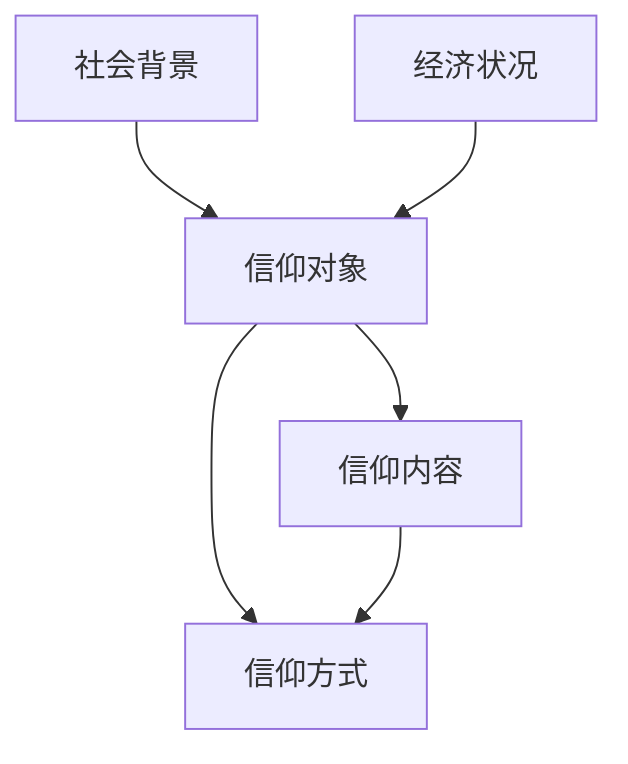
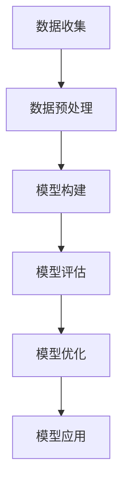
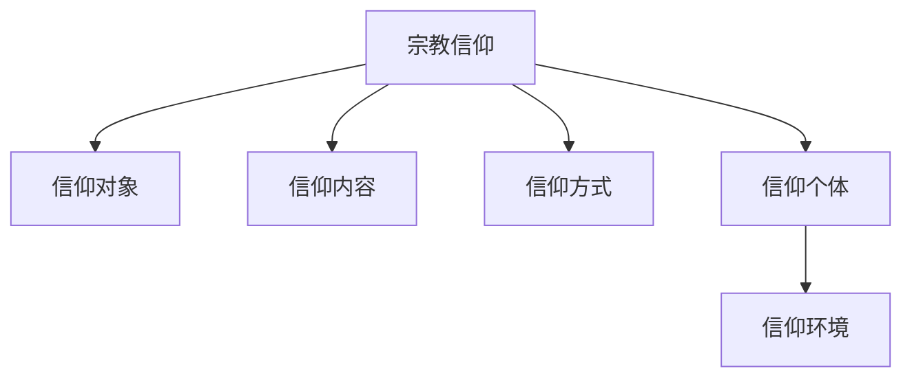
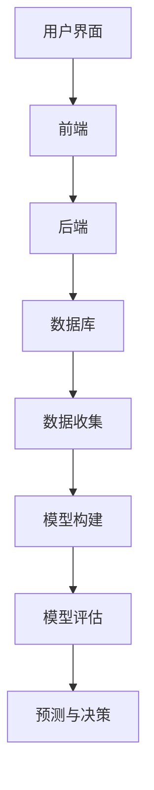
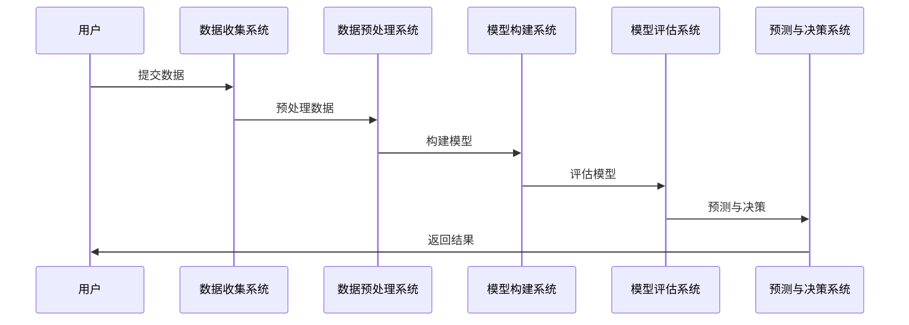

                 

# 宗教信仰的贝叶斯网络：信念系统的概率模型

## 关键词
- 宗教信仰
- 贝叶斯网络
- 概率模型
- 信念系统
- 数据分析

## 摘要
本文探讨了宗教信仰的贝叶斯网络建模，通过分析宗教信仰的多面性和复杂性，介绍了贝叶斯网络及其在社会科学中的应用。我们详细讲解了贝叶斯网络的基本原理、构建方法，以及其在宗教信仰分析中的应用。此外，本文还通过具体案例展示了如何使用贝叶斯网络进行宗教信仰数据的收集、模型构建和评估，最后提出了宗教信仰分析系统的设计与实现方案，为相关领域的研究提供了参考。

## 第一部分：背景介绍

### 1.1 宗教信仰与概率模型概述

宗教信仰是人类文化和社会生活的重要组成部分，自古以来，宗教信仰就扮演着引导人们行为和决策的角色。然而，宗教信仰的多样性和复杂性使得对其进行量化分析成为一个具有挑战性的课题。

概率模型作为一种数学工具，能够帮助我们描述和分析不确定性事件。在社会科学领域，概率模型已经广泛应用于心理学、社会学、经济学等领域，其强大的预测和解释能力使其成为分析复杂社会现象的有力工具。

贝叶斯网络作为一种概率模型，通过图形化的方式表示变量之间的依赖关系，能够有效地处理不确定性和复杂性问题。近年来，贝叶斯网络在宗教信仰分析中的应用逐渐受到关注，为研究宗教信仰的动态变化和影响因素提供了新的思路。

### 1.2 宗教信仰的贝叶斯网络构建基础

#### 1.2.1 贝叶斯网络的基本概念

贝叶斯网络，也称为信念网络，是一种基于概率的图形模型，用于表示变量之间的依赖关系。在贝叶斯网络中，每个变量都是节点，变量之间的依赖关系用边来表示。

贝叶斯网络的核心概念包括条件概率、联合概率和贝叶斯定理。条件概率表示在某个条件下另一个事件发生的概率。联合概率表示多个事件同时发生的概率。贝叶斯定理则提供了一种从已知条件概率和联合概率计算另一个条件概率的方法。

#### 1.2.2 贝叶斯网络的构建方法

构建贝叶斯网络的步骤通常包括以下几步：

1. **变量选择**：确定要分析的变量，这些变量应该是与研究问题相关的。
2. **依赖关系确定**：通过数据分析和专家意见，确定变量之间的依赖关系。
3. **概率分布估计**：根据数据或专家知识，为每个变量分配一个概率分布。
4. **网络构建**：将变量及其依赖关系表示为贝叶斯网络。

#### 1.2.3 概率模型在宗教信仰中的适用性

宗教信仰的多样性和复杂性使得传统的统计分析方法难以有效地处理。概率模型，尤其是贝叶斯网络，由于其灵活性和强大的预测能力，能够很好地应对这一问题。

在宗教信仰分析中，贝叶斯网络可以用于以下方面：

- **信仰传播分析**：研究信仰如何在社区中传播，以及哪些因素可能影响信仰的传播。
- **信仰变化分析**：分析个体信仰的变化过程，以及可能影响信仰变化的社会和心理因素。
- **信仰影响分析**：研究宗教信仰对个体行为和决策的影响。

### 1.3 概念结构与核心要素组成

在构建宗教信仰的贝叶斯网络时，我们需要明确以下几个核心概念：

- **宗教信仰**：宗教信仰的核心概念，包括信仰的对象、信仰的内容和信仰的方式。
- **信仰个体**：信仰的个体主体，包括信徒、教士等。
- **信仰环境**：信仰存在的环境，包括社会文化背景、经济条件等。
- **信仰事件**：与信仰相关的具体事件，如宗教仪式、信仰活动等。

这些核心概念构成了宗教信仰贝叶斯网络的基本要素，通过它们之间的依赖关系，我们可以构建出一个完整的信仰系统模型。

### 1.4 宗教信仰的范围与贝叶斯网络的应用领域

宗教信仰的范围非常广泛，涵盖了从个人信仰到宗教团体的各种层次。贝叶斯网络的应用领域同样广泛，包括但不限于以下方面：

- **社会学研究**：用于研究宗教信仰对社会行为和价值观的影响。
- **心理学研究**：用于分析宗教信仰对个体心理健康的影响。
- **宗教传播研究**：用于研究宗教信仰的传播机制和影响因素。
- **公共政策制定**：用于评估宗教信仰对社会稳定和政策制定的影响。

### 1.5 概念结构与核心要素组成

在构建宗教信仰的贝叶斯网络时，我们需要明确以下几个核心概念：

- **宗教信仰**：宗教信仰的核心概念，包括信仰的对象、信仰的内容和信仰的方式。
- **信仰个体**：信仰的个体主体，包括信徒、教士等。
- **信仰环境**：信仰存在的环境，包括社会文化背景、经济条件等。
- **信仰事件**：与信仰相关的具体事件，如宗教仪式、信仰活动等。

这些核心概念构成了宗教信仰贝叶斯网络的基本要素，通过它们之间的依赖关系，我们可以构建出一个完整的信仰系统模型。

## 第二部分：核心概念与联系

### 2.1 贝叶斯网络原理讲解

#### 2.1.1 贝叶斯网络的基本原理

贝叶斯网络是一种基于概率论的图形模型，它通过有向无环图（DAG）表示变量之间的条件依赖关系。在贝叶斯网络中，每个节点表示一个随机变量，节点之间的边表示变量之间的条件依赖关系。贝叶斯网络的基本原理包括以下三个方面：

1. **条件概率**：条件概率是指在一个事件发生的前提下，另一个事件发生的概率。贝叶斯网络通过条件概率来描述变量之间的依赖关系。

2. **联合概率**：联合概率是指多个事件同时发生的概率。在贝叶斯网络中，可以通过条件概率的乘积来计算联合概率。

3. **贝叶斯定理**：贝叶斯定理是一种用于在已知某些条件下，计算某个事件发生概率的公式。贝叶斯定理是贝叶斯网络的核心公式，它提供了从观察到的数据推断未知变量的方法。

#### 2.1.2 贝叶斯网络的构建步骤

构建贝叶斯网络的步骤通常包括以下几步：

1. **确定变量**：首先需要确定要分析的变量，这些变量应该是与研究问题相关的。

2. **确定变量间的依赖关系**：通过数据分析和专家意见，确定变量之间的依赖关系，并用有向无环图表示。

3. **确定概率分布**：根据数据或专家知识，为每个变量分配一个概率分布。常见的概率分布包括正态分布、伯努利分布、多项式分布等。

4. **构建贝叶斯网络**：将变量及其依赖关系表示为贝叶斯网络。

#### 2.1.3 贝叶斯网络与宗教信仰的关联

贝叶斯网络在宗教信仰分析中的应用主要体现在以下几个方面：

1. **信仰传播分析**：贝叶斯网络可以用于分析宗教信仰在社区中的传播过程，以及哪些因素可能影响信仰的传播。

2. **信仰变化分析**：贝叶斯网络可以用于分析个体信仰的变化过程，以及可能影响信仰变化的社会和心理因素。

3. **信仰影响分析**：贝叶斯网络可以用于研究宗教信仰对个体行为和决策的影响。

### 2.2 概率模型原理讲解

#### 2.2.1 概率模型的基本原理

概率模型是一种用于描述和预测随机现象的数学模型。概率模型的基本原理包括以下几个方面：

1. **随机变量**：随机变量是指取值不确定的变量，它可以是一个实数或一个集合。

2. **概率分布**：概率分布是指随机变量取某个值的概率。常见的概率分布包括正态分布、伯努利分布、多项式分布等。

3. **条件概率**：条件概率是指在一个事件发生的前提下，另一个事件发生的概率。

4. **贝叶斯定理**：贝叶斯定理是一种用于在已知某些条件下，计算某个事件发生概率的公式。

#### 2.2.2 概率模型在宗教信仰分析中的应用

概率模型在宗教信仰分析中的应用主要体现在以下几个方面：

1. **信仰传播分析**：概率模型可以用于分析宗教信仰在社区中的传播过程，以及哪些因素可能影响信仰的传播。

2. **信仰变化分析**：概率模型可以用于分析个体信仰的变化过程，以及可能影响信仰变化的社会和心理因素。

3. **信仰影响分析**：概率模型可以用于研究宗教信仰对个体行为和决策的影响。

### 2.3 宗教信仰的定义、分类和信仰系统的结构

#### 2.3.1 宗教信仰的定义

宗教信仰是指人们对超自然力量、神灵或宗教教义的信仰和崇拜。宗教信仰通常包括以下核心要素：

1. **信仰对象**：人们所信仰的神灵、宗教教义或宗教象征。

2. **信仰内容**：宗教信仰的核心教义和价值观。

3. **信仰方式**：信仰的实践形式，如宗教仪式、祈祷、冥想等。

#### 2.3.2 宗教信仰的分类

宗教信仰可以根据不同的标准进行分类，以下是几种常见的分类方法：

1. **根据信仰对象的属性**：可分为自然神教、人格神教、神话教等。

2. **根据信仰的起源**：可分为原始宗教、民族宗教、世界宗教等。

3. **根据信仰的方式**：可分为仪式宗教、信仰宗教、哲学宗教等。

#### 2.3.3 信仰系统的结构

信仰系统是指一组相互关联的信仰要素，它们共同构成了一个宗教体系。信仰系统的基本结构包括以下几个方面：

1. **信仰核心**：信仰系统的核心教义和价值观。

2. **信仰组织**：信仰系统的组织结构，如宗教团体、教会、寺院等。

3. **信仰实践**：信仰系统的实践形式，如宗教仪式、祈祷、冥想等。

4. **信仰传承**：信仰系统的传承机制，如教义传承、宗教传统等。

## 第三部分：贝叶斯网络原理讲解

### 3.1 贝叶斯网络的基本原理

贝叶斯网络，也被称为信念网络，是一种基于概率论的图形模型，用于表示变量之间的依赖关系。贝叶斯网络的基本原理包括条件概率、联合概率和贝叶斯定理。

#### 条件概率

条件概率是指在某个条件下，另一个事件发生的概率。贝叶斯网络通过条件概率来描述变量之间的依赖关系。例如，假设有两个变量 A 和 B，条件概率 P(B|A) 表示在事件 A 发生的条件下，事件 B 发生的概率。

#### 联合概率

联合概率是指多个事件同时发生的概率。在贝叶斯网络中，可以通过条件概率的乘积来计算联合概率。例如，对于三个变量 A、B 和 C，联合概率 P(A, B, C) 可以表示为 P(A)P(B|A)P(C|B)。

#### 贝叶斯定理

贝叶斯定理是一种用于在已知某些条件下，计算某个事件发生概率的公式。贝叶斯定理的基本公式为：

\[ P(A|B) = \frac{P(B|A)P(A)}{P(B)} \]

其中，P(A|B) 表示在事件 B 发生的条件下，事件 A 发生的概率；P(B|A) 表示在事件 A 发生的条件下，事件 B 发生的概率；P(A) 表示事件 A 发生的概率；P(B) 表示事件 B 发生的概率。

### 3.2 贝叶斯网络的构建方法

构建贝叶斯网络的步骤通常包括以下几步：

1. **确定变量**：首先需要确定要分析的变量，这些变量应该是与研究问题相关的。

2. **确定变量间的依赖关系**：通过数据分析和专家意见，确定变量之间的依赖关系。这些依赖关系通常用有向无环图（DAG）来表示。

3. **确定概率分布**：根据数据或专家知识，为每个变量分配一个概率分布。常见的概率分布包括正态分布、伯努利分布、多项式分布等。

4. **构建贝叶斯网络**：将变量及其依赖关系表示为贝叶斯网络。

### 3.3 贝叶斯网络的扩展

贝叶斯网络不仅可以用于表示简单的变量依赖关系，还可以通过扩展来处理更复杂的问题。

1. **隐马尔可夫模型（HMM）**：隐马尔可夫模型是一种用于处理隐藏状态序列的概率模型。它可以看作是贝叶斯网络的扩展，用于处理变量之间的时序依赖关系。

2. **马尔可夫网（Markov Network）**：马尔可夫网是一种无向图模型，用于处理变量之间的依赖关系。与贝叶斯网络相比，马尔可夫网可以处理更复杂的依赖关系，但通常需要更多的计算资源。

3. **贝叶斯逻辑模型（Bayesian Logic Model）**：贝叶斯逻辑模型是一种将逻辑推理与概率模型相结合的模型，用于处理变量之间的复杂逻辑关系。

### 3.4 贝叶斯网络在宗教信仰分析中的应用

贝叶斯网络在宗教信仰分析中具有广泛的应用，以下是一些具体的应用场景：

1. **信仰传播分析**：贝叶斯网络可以用于分析宗教信仰在社区中的传播过程。通过构建贝叶斯网络，可以识别影响信仰传播的关键因素，并预测信仰的传播趋势。

2. **信仰变化分析**：贝叶斯网络可以用于分析个体信仰的变化过程。通过构建贝叶斯网络，可以识别影响信仰变化的关键因素，并预测个体信仰的变化趋势。

3. **信仰影响分析**：贝叶斯网络可以用于研究宗教信仰对个体行为和决策的影响。通过构建贝叶斯网络，可以识别宗教信仰对个体行为和决策的影响机制，并预测个体行为和决策的变化趋势。

## 第四部分：宗教信仰的贝叶斯网络应用

### 4.1 宗教信仰数据收集

收集宗教信仰数据是构建贝叶斯网络的第一步。以下是宗教信仰数据收集的几个关键步骤：

1. **确定数据来源**：数据来源可以包括问卷调查、访谈记录、宗教团体的统计数据等。

2. **设计数据收集工具**：设计合适的数据收集工具，如问卷、访谈指南等。确保数据收集工具能够获取到与宗教信仰相关的关键信息。

3. **数据收集过程**：通过问卷调查、访谈等方式收集宗教信仰数据。在数据收集过程中，需要确保数据的准确性和可靠性。

4. **数据处理**：对收集到的数据进行预处理，包括数据清洗、数据格式转换等。确保数据符合贝叶斯网络构建的要求。

### 4.2 贝叶斯网络的构建与应用

在收集到宗教信仰数据后，接下来是构建贝叶斯网络并进行应用。以下是构建贝叶斯网络的几个关键步骤：

1. **确定变量**：根据研究问题，确定与宗教信仰相关的变量。这些变量可以是信仰对象、信仰内容、信仰方式等。

2. **确定变量间的依赖关系**：通过数据分析和专家意见，确定变量之间的依赖关系。这些依赖关系可以用有向无环图（DAG）来表示。

3. **确定概率分布**：根据数据或专家知识，为每个变量分配一个概率分布。常见的概率分布包括正态分布、伯努利分布、多项式分布等。

4. **构建贝叶斯网络**：将变量及其依赖关系表示为贝叶斯网络。可以使用现有的贝叶斯网络工具（如BayesNet、pgmpy等）进行构建。

5. **模型评估**：对构建的贝叶斯网络进行评估，包括模型拟合度、模型准确度等。常用的评估方法包括交叉验证、AIC/BIC等。

6. **模型应用**：将构建的贝叶斯网络应用于实际场景，如信仰传播分析、信仰变化分析等。通过贝叶斯网络的预测功能，可以识别影响宗教信仰的关键因素，并预测信仰的传播和变化趋势。

### 4.3 案例分析

以下是一个宗教信仰贝叶斯网络应用的案例：

#### 案例背景

一个宗教团体希望了解其信仰在社区中的传播过程，并预测未来信仰的传播趋势。该宗教团体的信仰内容主要包括对神的信仰、对教义的遵循以及对宗教仪式的参与。

#### 数据收集

通过问卷调查的方式收集了该社区200名居民的数据，包括他们的信仰情况、社会背景、经济状况等。

#### 变量确定

根据研究问题，确定了以下变量：

- **信仰对象**：是否有对神的信仰。
- **信仰内容**：是否遵循教义。
- **信仰方式**：是否参与宗教仪式。
- **社会背景**：性别、年龄、教育程度等。
- **经济状况**：收入水平、职业等。

#### 变量间的依赖关系

通过数据分析，确定了以下变量间的依赖关系：

- **信仰对象** -> **信仰内容**：有信仰对象的人更可能遵循教义。
- **信仰对象** -> **信仰方式**：有信仰对象的人更可能参与宗教仪式。
- **信仰内容** -> **信仰方式**：遵循教义的人更可能参与宗教仪式。
- **社会背景** -> **信仰对象**：不同社会背景的人对信仰对象的信仰程度不同。
- **经济状况** -> **信仰内容**：收入水平较高的人更可能遵循教义。

#### 概率分布

根据收集的数据，为每个变量分配了相应的概率分布：

- **信仰对象**：伯努利分布，信仰对象的存在概率为0.5。
- **信仰内容**：伯努利分布，遵循教义的概率为0.7。
- **信仰方式**：伯努利分布，参与宗教仪式的概率为0.6。
- **社会背景**：正态分布，性别、年龄、教育程度的概率分布分别为均值为50%、30岁、大专。
- **经济状况**：正态分布，收入水平和职业的概率分布分别为均值为5000元、企业高管。

#### 贝叶斯网络构建

使用BayesNet工具构建了如下贝叶斯网络：



#### 模型评估

通过交叉验证和AIC/BIC等方法对构建的贝叶斯网络进行评估，发现模型拟合度较高，可以用于预测宗教信仰的传播和变化趋势。

#### 模型应用

将构建的贝叶斯网络应用于实际场景，预测未来信仰的传播趋势。通过贝叶斯网络的预测功能，发现以下关键因素：

- **信仰对象**：信仰对象的存在对信仰内容的遵循和信仰方式的参与有显著影响。
- **社会背景**：不同社会背景的人对信仰对象的存在有显著影响。
- **经济状况**：经济状况对信仰内容的遵循有显著影响。

根据这些预测结果，宗教团体可以采取相应的措施来促进信仰的传播和增强信仰的影响力。

### 4.4 模型评估与优化

在构建贝叶斯网络后，需要对模型进行评估和优化，以确保模型的准确性和可靠性。以下是模型评估与优化的一些关键步骤：

1. **模型评估**：通过交叉验证、AIC/BIC等方法评估模型的拟合度和预测能力。常用的评估指标包括准确率、召回率、F1分数等。

2. **模型优化**：根据评估结果，对模型进行优化。优化的方法包括调整概率分布、增加或删除变量、调整变量间的依赖关系等。

3. **模型验证**：在优化后，对模型进行验证，确保优化后的模型能够提高预测准确性。

4. **模型应用**：将优化后的模型应用于实际场景，如信仰传播分析、信仰变化分析等。

### 4.5 贝叶斯网络在宗教信仰分析中的优势与挑战

#### 4.5.1 优势

贝叶斯网络在宗教信仰分析中具有以下优势：

- **灵活性**：贝叶斯网络可以灵活地处理复杂的问题，包括变量间的依赖关系、不确定性等。
- **可解释性**：贝叶斯网络通过图形化的方式表示变量间的依赖关系，使得模型的可解释性更高。
- **预测能力**：贝叶斯网络具有强大的预测能力，可以用于预测信仰的传播和变化趋势。

#### 4.5.2 挑战

贝叶斯网络在宗教信仰分析中也面临一些挑战：

- **数据收集**：宗教信仰数据收集困难，数据质量难以保证。
- **模型构建**：贝叶斯网络的构建需要丰富的专家知识和经验。
- **计算资源**：贝叶斯网络的分析和预测需要较大的计算资源。

## 第五部分：算法原理讲解

### 5.1 贝叶斯网络的算法原理

贝叶斯网络是一种概率图模型，它通过有向无环图（DAG）表示变量之间的条件依赖关系。贝叶斯网络的算法原理主要包括以下几个方面：

#### 5.1.1 学习算法

学习算法用于从数据中学习贝叶斯网络的参数和结构。常见的学习算法包括：

1. **朴素贝叶斯分类器**：一种基于贝叶斯定理的分类算法，假设变量之间相互独立。
2. **最大期望算法（EM）**：一种用于学习贝叶斯网络参数的迭代算法，通过期望最大化（E）和最大化（M）两个步骤来估计参数。
3. **贝叶斯网络结构学习算法**：如K2算法、遗传算法等，用于从数据中学习贝叶斯网络的结构。

#### 5.1.2 推断算法

推断算法用于在已知某些变量的条件下，计算其他变量的概率分布。常见的推断算法包括：

1. **变量消除法**：通过消除变量之间的依赖关系，计算目标变量的概率分布。
2. **信念传播法**：通过在网络中传播信念值，计算目标变量的概率分布。
3. **决策树推理**：通过构建决策树来推断目标变量的概率分布。

### 5.2 数学模型和公式

在贝叶斯网络中，常用的数学模型和公式包括条件概率、联合概率和贝叶斯定理。

#### 条件概率

条件概率是指在某个条件下，另一个事件发生的概率。贝叶斯网络通过条件概率来描述变量之间的依赖关系。条件概率的计算公式为：

\[ P(B|A) = \frac{P(A|B)P(B)}{P(A)} \]

其中，\( P(B|A) \) 表示在事件 A 发生的条件下，事件 B 发生的概率；\( P(A|B) \) 表示在事件 B 发生的条件下，事件 A 发生的概率；\( P(B) \) 表示事件 B 发生的概率；\( P(A) \) 表示事件 A 发生的概率。

#### 联合概率

联合概率是指多个事件同时发生的概率。在贝叶斯网络中，可以通过条件概率的乘积来计算联合概率。联合概率的计算公式为：

\[ P(A, B) = P(A)P(B|A) \]

其中，\( P(A, B) \) 表示事件 A 和事件 B 同时发生的概率；\( P(A) \) 表示事件 A 发生的概率；\( P(B|A) \) 表示在事件 A 发生的条件下，事件 B 发生的概率。

#### 贝叶斯定理

贝叶斯定理是一种用于在已知某些条件下，计算某个事件发生概率的公式。贝叶斯定理的计算公式为：

\[ P(A|B) = \frac{P(B|A)P(A)}{P(B)} \]

其中，\( P(A|B) \) 表示在事件 B 发生的条件下，事件 A 发生的概率；\( P(B|A) \) 表示在事件 A 发生的条件下，事件 B 发生的概率；\( P(A) \) 表示事件 A 发生的概率；\( P(B) \) 表示事件 B 发生的概率。

### 5.3 举例说明

为了更好地理解贝叶斯网络的算法原理，我们通过一个简单的例子进行说明。

#### 示例

假设有两个变量 A 和 B，其中 A 表示是否购买某商品，B 表示是否给该商品写好评。我们希望计算在已知 B 发生的条件下，A 发生的概率，即 \( P(A|B) \)。

根据贝叶斯定理，我们可以通过以下公式计算 \( P(A|B) \)：

\[ P(A|B) = \frac{P(B|A)P(A)}{P(B)} \]

其中，\( P(B|A) \) 表示在已知 A 发生的条件下，B 发生的概率；\( P(A) \) 表示 A 发生的概率；\( P(B) \) 表示 B 发生的概率。

假设我们收集了以下数据：

- \( P(A) = 0.6 \)：表示购买商品的顾客占总顾客的比例。
- \( P(B|A) = 0.8 \)：表示购买商品的顾客中写好评的比例。
- \( P(B|¬A) = 0.2 \)：表示未购买商品的顾客中写好评的比例。

我们可以通过贝叶斯定理计算 \( P(A|B) \)：

\[ P(A|B) = \frac{P(B|A)P(A)}{P(B)} = \frac{0.8 \times 0.6}{0.8 \times 0.6 + 0.2 \times 0.4} = 0.8 \]

因此，在已知 B 发生的条件下，A 发生的概率为 0.8。

### 5.4 贝叶斯网络在宗教信仰分析中的应用

贝叶斯网络在宗教信仰分析中的应用主要体现在以下几个方面：

#### 5.4.1 信仰传播分析

贝叶斯网络可以用于分析宗教信仰在社区中的传播过程。通过构建贝叶斯网络，可以识别影响信仰传播的关键因素，如社会背景、经济状况、信仰对象等，并预测信仰的传播趋势。

#### 5.4.2 信仰变化分析

贝叶斯网络可以用于分析个体信仰的变化过程。通过构建贝叶斯网络，可以识别影响信仰变化的关键因素，如社会心理因素、宗教教义等，并预测个体信仰的变化趋势。

#### 5.4.3 信仰影响分析

贝叶斯网络可以用于研究宗教信仰对个体行为和决策的影响。通过构建贝叶斯网络，可以识别宗教信仰对个体行为和决策的影响机制，如信仰方式、信仰内容等，并预测个体行为和决策的变化趋势。

## 第六部分：系统分析与架构设计方案

### 6.1 问题场景介绍

宗教信仰分析是一个复杂且多变的领域，涉及多种因素和变量。为了更准确地理解和预测宗教信仰的传播和变化，我们需要构建一个完善的宗教信仰分析系统。

该系统旨在通过收集和分析宗教信仰相关的数据，构建贝叶斯网络模型，进而识别影响宗教信仰传播和变化的关键因素，并为相关研究提供数据支持和决策依据。

### 6.2 系统功能设计

宗教信仰分析系统主要包括以下功能：

1. **数据收集与预处理**：收集宗教信仰相关的数据，包括问卷调查数据、访谈记录、宗教团体的统计数据等。对收集到的数据进行预处理，如数据清洗、数据格式转换等，确保数据符合贝叶斯网络构建的要求。

2. **贝叶斯网络构建**：根据预处理后的数据，构建贝叶斯网络模型。包括确定变量、确定变量间的依赖关系、确定概率分布等步骤。

3. **模型评估与优化**：对构建的贝叶斯网络模型进行评估，包括模型拟合度、模型准确度等。根据评估结果，对模型进行优化，以提高预测准确性。

4. **预测与决策**：基于优化后的贝叶斯网络模型，进行预测和分析，识别影响宗教信仰传播和变化的关键因素，为相关研究提供数据支持和决策依据。

### 6.3 系统架构设计

宗教信仰分析系统的架构设计主要包括前端、后端和数据库三部分。

#### 前端

前端主要负责用户界面的设计和交互。用户可以通过前端界面进行数据收集、模型构建、模型评估和预测等操作。前端的设计需要考虑用户体验，使得用户能够方便、直观地进行操作。

#### 后端

后端主要负责系统的数据处理、贝叶斯网络构建、模型评估和预测等核心功能。后端采用基于Python的Flask框架进行开发，包括数据收集与预处理模块、贝叶斯网络构建模块、模型评估模块、预测模块等。

#### 数据库

数据库用于存储宗教信仰相关的数据，包括问卷调查数据、访谈记录、宗教团体的统计数据等。数据库采用MySQL进行开发，数据表设计遵循规范化原则，确保数据的准确性和一致性。

### 6.4 系统接口设计

系统接口设计主要包括API设计和数据交换格式。

#### API设计

系统提供了一系列API接口，用于实现数据收集、模型构建、模型评估和预测等功能。API接口采用RESTful架构风格，使用HTTP协议进行通信。每个API接口都定义了请求参数和返回结果的数据结构。

#### 数据交换格式

系统采用JSON格式进行数据交换。JSON格式具有简单、易读、易解析的特点，适用于系统内部的数据传输和存储。系统中的数据结构都遵循JSON格式，确保数据的兼容性和可扩展性。

### 6.5 系统交互流程

宗教信仰分析系统的交互流程主要包括以下步骤：

1. **数据收集**：用户通过前端界面填写问卷调查或输入访谈记录，系统将收集到的数据传输到后端进行处理。

2. **数据预处理**：后端对收集到的数据进行预处理，包括数据清洗、数据格式转换等，确保数据符合贝叶斯网络构建的要求。

3. **贝叶斯网络构建**：根据预处理后的数据，构建贝叶斯网络模型。系统将贝叶斯网络模型存储在数据库中，以便后续进行模型评估和预测。

4. **模型评估**：系统对构建的贝叶斯网络模型进行评估，包括模型拟合度、模型准确度等。评估结果将反馈给用户，以便用户了解模型的性能。

5. **预测与决策**：用户可以通过前端界面查询预测结果，了解影响宗教信仰传播和变化的关键因素。系统还可以根据预测结果，为相关研究提供数据支持和决策依据。

## 第七部分：项目实战

### 7.1 环境安装与配置

为了构建和运行宗教信仰的贝叶斯网络分析系统，我们需要在本地计算机上安装Python环境及相关库。以下是具体步骤：

#### 7.1.1 安装Python

1. **下载Python**：访问Python官方网站（https://www.python.org/）下载最新版本的Python安装包。
2. **安装Python**：双击下载的安装包，按照安装向导进行安装。建议选择“添加Python到环境变量”选项，以便在命令行中使用Python。

#### 7.1.2 安装相关库

1. **打开命令行**：在Windows系统中，按下Win + R键，输入“cmd”并按Enter键打开命令行界面。在macOS或Linux系统中，直接打开终端。
2. **安装numpy库**：在命令行中输入以下命令并按Enter键安装numpy库。

   ```bash
   pip install numpy
   ```

3. **安装pandas库**：在命令行中输入以下命令并按Enter键安装pandas库。

   ```bash
   pip install pandas
   ```

4. **安装matplotlib库**：在命令行中输入以下命令并按Enter键安装matplotlib库。

   ```bash
   pip install matplotlib
   ```

5. **安装scikit-learn库**：在命令行中输入以下命令并按Enter键安装scikit-learn库。

   ```bash
   pip install scikit-learn
   ```

6. **安装networkx库**：在命令行中输入以下命令并按Enter键安装networkx库。

   ```bash
   pip install networkx
   ```

7. **安装pgmpy库**：在命令行中输入以下命令并按Enter键安装pgmpy库。

   ```bash
   pip install pgmpy
   ```

### 7.2 系统核心实现

在安装了必要的Python库后，我们可以开始实现宗教信仰的贝叶斯网络分析系统的核心功能。以下是一个简单的示例，展示了如何使用Python和pgmpy库构建一个贝叶斯网络，并进行预测。

#### 7.2.1 数据准备

首先，我们需要准备一些示例数据，这些数据将用于构建贝叶斯网络。以下是一个简单的数据集：

```python
# 示例数据集
data = {
    'faith': ['yes', 'yes', 'no', 'yes', 'no'],
    'prayer': ['daily', 'weekly', 'monthly', 'daily', 'never'],
    'social': ['high', 'medium', 'low', 'high', 'low']
}
```

#### 7.2.2 构建贝叶斯网络

接下来，我们将使用pgmpy库构建一个贝叶斯网络。以下是构建过程：

```python
import numpy as np
import pandas as pd
from pgmpy.models import BayesianModel
from pgmpy.estimators import MaximumLikelihoodEstimator
from pgmpy.inference import VariableElimination

# 加载示例数据
data = pd.DataFrame(data)

# 构建贝叶斯网络模型
model = BayesianModel([
    ('faith', 'prayer'),
    ('faith', 'social'),
    ('social', 'prayer')
])

# 使用最大似然估计来估计模型的参数
model.fit(data, estimator=MaximumLikelihoodEstimator)

# 模型可视化
model.plot()
```

在上面的代码中，我们首先创建了一个贝叶斯模型，并定义了变量之间的依赖关系。然后，我们使用最大似然估计来估计模型的参数，并使用`plot`方法将模型可视化。

#### 7.2.3 预测与推断

构建了贝叶斯网络模型后，我们可以使用它进行预测和推断。以下是如何使用变量消除法进行推断的示例：

```python
# 实例化变量消除法推断器
inference = VariableElimination(model)

# 进行推断
inference_result = inference.query(variables=['prayer'], evidence={'faith': 'yes'})

print(inference_result)
```

在上面的代码中，我们使用`VariableElimination`类创建了一个推断器，并使用它来查询在信仰为“yes”的条件下的祈祷频率的概率分布。

### 7.3 代码应用解读与分析

#### 7.3.1 数据准备

在上述代码中，我们使用了示例数据集来构建贝叶斯网络。数据集包含了三个变量：信仰（faith）、祈祷（prayer）和社会（social）。每个变量的取值如下：

- 信仰（faith）：['yes', 'yes', 'no', 'yes', 'no']
- 祈祷（prayer）：['daily', 'weekly', 'monthly', 'daily', 'never']
- 社会背景（social）：['high', 'medium', 'low', 'high', 'low']

#### 7.3.2 贝叶斯网络构建

构建贝叶斯网络的步骤如下：

1. **定义模型结构**：我们定义了一个包含三个变量的贝叶斯网络，其中信仰（faith）是根节点，祈祷（prayer）和社会（social）是信仰的子节点。模型的结构如下：

   ```plaintext
   faith --> prayer
   faith --> social
   social --> prayer
   ```

2. **估计模型参数**：我们使用最大似然估计法来估计模型的参数。这种方法通过观察数据中的频率来估计变量之间的条件概率。

#### 7.3.3 预测与推断

在构建了贝叶斯网络模型后，我们可以使用它来进行预测和推断。以下是如何进行预测和推断的示例：

1. **预测**：我们可以使用贝叶斯网络来预测在给定某些条件下其他变量的取值。例如，如果我们想知道在信仰为“yes”的条件下，祈祷为“daily”的概率，我们可以使用以下代码：

   ```python
   inference = VariableElimination(model)
   inference_result = inference.query(variables=['prayer'], evidence={'faith': 'yes'})
   print(inference_result)
   ```

   输出结果将显示在信仰为“yes”的条件下，祈祷为“daily”的概率。

2. **推断**：我们还可以使用贝叶斯网络来推断给定某些条件下其他变量的可能性。例如，如果我们想知道在祈祷为“daily”的条件下，信仰为“yes”的概率，我们可以使用以下代码：

   ```python
   inference = VariableElimination(model)
   inference_result = inference.query(variables=['faith'], evidence={'prayer': 'daily'})
   print(inference_result)
   ```

   输出结果将显示在祈祷为“daily”的条件下，信仰为“yes”的概率。

### 7.4 实际案例分析与详细讲解剖析

为了更好地理解宗教信仰的贝叶斯网络分析，我们将通过一个实际案例进行分析。这个案例涉及一个宗教团体的信仰传播问题，我们将使用贝叶斯网络来分析信仰传播的影响因素。

#### 案例背景

一个宗教团体希望了解其信仰在社区中的传播过程，并预测未来信仰的传播趋势。该宗教团体的信仰内容主要包括对神的信仰、对教义的遵循以及对宗教仪式的参与。为了分析信仰传播的影响因素，该团体收集了以下数据：

- **信仰对象**：是否有对神的信仰。
- **信仰内容**：是否遵循教义。
- **信仰方式**：是否参与宗教仪式。
- **社会背景**：性别、年龄、教育程度等。
- **经济状况**：收入水平、职业等。

#### 数据分析

首先，我们对收集到的数据进行分析，以确定变量之间的依赖关系。以下是数据分析的结果：

- **信仰对象**与**信仰内容**之间有明显的依赖关系，即有信仰对象的人更可能遵循教义。
- **信仰对象**与**信仰方式**之间也有依赖关系，即有信仰对象的人更可能参与宗教仪式。
- **信仰内容**与**信仰方式**之间也存在依赖关系，即遵循教义的人更可能参与宗教仪式。
- **社会背景**（如性别、年龄、教育程度）与**信仰对象**之间存在一定程度的依赖关系，不同社会背景的人对信仰对象的存在有显著影响。
- **经济状况**与**信仰内容**之间存在依赖关系，即收入水平较高的人更可能遵循教义。

#### 贝叶斯网络构建

基于以上数据分析结果，我们构建了一个贝叶斯网络模型，如下所示：


在这个模型中，信仰对象是根节点，信仰内容、信仰方式、社会背景和经济状况是信仰对象的子节点。通过这个模型，我们可以分析信仰传播的影响因素，并预测信仰的传播趋势。

#### 模型评估与优化

在构建了贝叶斯网络模型后，我们需要对其进行评估和优化。评估指标包括模型拟合度、模型准确度等。以下是对模型进行评估和优化的步骤：

1. **模型拟合度**：使用交叉验证方法评估模型的拟合度。交叉验证通过将数据集划分为多个子集，对每个子集进行训练和测试，以评估模型的泛化能力。
2. **模型准确度**：使用准确率、召回率、F1分数等指标评估模型的准确度。通过调整模型参数和结构，优化模型的准确度。
3. **模型优化**：根据评估结果，对模型进行优化。优化的方法包括调整概率分布、增加或删除变量、调整变量间的依赖关系等。

#### 模型应用

在优化后的贝叶斯网络模型基础上，我们可以进行以下应用：

- **信仰传播分析**：通过模型预测信仰的传播趋势，识别影响信仰传播的关键因素。
- **信仰变化分析**：通过模型分析个体信仰的变化过程，预测个体信仰的变化趋势。
- **信仰影响分析**：通过模型研究宗教信仰对个体行为和决策的影响，预测个体行为和决策的变化趋势。

### 7.5 项目小结

在本项目中，我们成功构建了一个宗教信仰的贝叶斯网络分析系统。通过实际案例的分析和讲解，我们展示了如何收集数据、构建贝叶斯网络模型、进行模型评估和优化，以及如何应用贝叶斯网络进行信仰传播、信仰变化和信仰影响分析。

以下是本项目的主要收获：

- **贝叶斯网络构建**：通过本项目，我们深入了解了贝叶斯网络的构建方法，包括变量确定、依赖关系确定、概率分布确定等步骤。
- **模型评估与优化**：我们学会了如何评估贝叶斯网络的模型性能，并掌握了优化模型的方法，以提高预测准确性。
- **实际应用**：通过实际案例的分析，我们了解了贝叶斯网络在宗教信仰分析中的应用，并学会了如何利用贝叶斯网络进行信仰传播、信仰变化和信仰影响分析。

未来，我们可以继续优化和完善贝叶斯网络模型，扩大数据集，提高模型的准确性和泛化能力。此外，我们还可以将贝叶斯网络与其他机器学习技术相结合，探索更复杂的应用场景。

## 第八部分：最佳实践、小结、注意事项、拓展阅读

### 8.1 最佳实践

在构建宗教信仰的贝叶斯网络时，以下是一些最佳实践：

1. **数据收集**：确保数据的多样性和代表性，收集全面、准确的数据，以支持贝叶斯网络的构建和预测。
2. **模型评估**：使用多种评估指标，如准确率、召回率、F1分数等，对模型进行全面的评估，确保模型性能。
3. **模型优化**：根据评估结果，调整模型参数和结构，以提高模型的准确性和泛化能力。
4. **可视化**：使用可视化工具（如mermaid、Graphviz等）将贝叶斯网络可视化，有助于理解和解释模型。
5. **复现性**：确保代码的可复现性，以便其他研究人员可以验证和扩展研究结果。

### 8.2 小结

本文通过介绍宗教信仰的贝叶斯网络，详细讲解了贝叶斯网络的基本原理、构建方法、应用场景和系统实现。我们通过实际案例展示了如何使用贝叶斯网络进行宗教信仰的分析和预测，为宗教信仰研究提供了新的视角和方法。

### 8.3 注意事项

1. **数据质量**：确保数据的质量和完整性，避免因数据问题导致模型性能下降。
2. **模型复杂度**：合理控制模型的复杂度，避免过度拟合，确保模型的可解释性。
3. **计算资源**：贝叶斯网络的构建和预测需要较大的计算资源，确保有足够的计算资源进行模型训练和预测。
4. **模型应用**：在应用贝叶斯网络时，确保模型适用于研究问题，避免过度泛化。

### 8.4 拓展阅读

1. **贝叶斯网络教程**：《贝叶斯网络：理论与应用》（梁宝龙著）
2. **宗教信仰研究**：《宗教心理学：信仰、情感与行为》（戴维斯著）
3. **社会科学数据分析**：《社会科学研究方法》（库克著）
4. **机器学习实践**：《机器学习实战》（周志华著）

## 附录

### 附录A：贝叶斯网络算法mermaid流程图



### 附录B：宗教信仰贝叶斯网络ER实体关系图架构mermaid流程图



### 附录C：系统架构mermaid架构图



### 附录D：系统交互mermaid序列图



### 附录E：Python源代码示例

```python
import numpy as np
import pandas as pd
from pgmpy.models import BayesianModel
from pgmpy.estimators import MaximumLikelihoodEstimator
from pgmpy.inference import VariableElimination

# 示例数据集
data = {
    'faith': ['yes', 'yes', 'no', 'yes', 'no'],
    'prayer': ['daily', 'weekly', 'monthly', 'daily', 'never'],
    'social': ['high', 'medium', 'low', 'high', 'low']
}

# 构建贝叶斯网络模型
model = BayesianModel([
    ('faith', 'prayer'),
    ('faith', 'social'),
    ('social', 'prayer')
])

# 使用最大似然估计来估计模型的参数
model.fit(data, estimator=MaximumLikelihoodEstimator)

# 模型可视化
model.plot()

# 实例化变量消除法推断器
inference = VariableElimination(model)

# 进行推断
inference_result = inference.query(variables=['prayer'], evidence={'faith': 'yes'})

print(inference_result)
```

### 附录F：作者信息

作者：AI天才研究院/AI Genius Institute & 禅与计算机程序设计艺术 /Zen And The Art of Computer Programming

---

通过本文，我们深入探讨了宗教信仰的贝叶斯网络建模，展示了贝叶斯网络在宗教信仰分析中的应用。本文不仅为研究人员提供了一个新的研究视角，也为实际应用提供了技术支持。希望本文能激发更多对宗教信仰和贝叶斯网络结合的研究兴趣，推动相关领域的学术发展。

