                 

### 引言

在现代信息技术迅猛发展的背景下，实时数据分析引擎（Real-Time Analysis Engine）和大型语言模型（Large Language Model，简称LLM）逐渐成为数据处理和人工智能领域的重要组成部分。实时分析引擎是一种能够快速、高效地对大量数据进行实时分析和处理的技术架构，而LLM则是一种利用深度学习技术构建的强大语言处理模型。这两者在数据处理中的应用，不仅提升了数据处理的速度和准确性，还为复杂的数据分析和智能决策提供了有力支持。

本文将以“实时分析引擎在LLM应用数据处理中的应用”为标题，系统性地探讨实时分析引擎与LLM在数据处理中的融合应用。文章将从以下几个方面展开：

1. **定义和概述**：首先，我们将对实时分析引擎、LLM以及数据处理这几个核心概念进行定义和概述，解释它们的基本原理和相互关系。
  
2. **实时分析引擎**：接下来，我们将深入探讨实时分析引擎的原理、架构及其在LLM应用中的功能。

3. **LLM与数据处理**：本文将分析LLM在数据处理中的角色，探讨其类型、挑战和解决方案。

4. **应用场景**：本文将通过具体的行业和应用案例，展示实时分析引擎和LLM在数据处理中的实际应用。

5. **系统设计实施**：我们将详细描述实时分析引擎与LLM集成在数据处理系统中的设计实施过程。

6. **算法设计与分析**：本文将详细讲解实时分析引擎中的算法设计，包括数学模型、公式和具体的实现代码。

7. **案例研究和分析**：本文将通过实际案例，深入分析实时分析引擎和LLM在数据处理中的应用效果。

8. **最佳实践与总结**：最后，我们将总结本文的主要观点，并提供一些实用的最佳实践和拓展阅读资源。

通过上述步骤，本文旨在为读者提供一个清晰、全面、深入的了解，帮助读者掌握实时分析引擎和LLM在数据处理中的实际应用，并为其未来的研究和实践提供有益的参考。

### 关键词

- 实时分析引擎
- 大型语言模型（LLM）
- 数据处理
- 深度学习
- 数据分析
- 系统设计
- 算法分析
- 应用场景
- 实战案例

### 摘要

本文旨在探讨实时分析引擎和大型语言模型（LLM）在数据处理中的应用。首先，我们介绍了实时分析引擎和LLM的基本概念、原理及其在数据处理中的重要性。接着，详细分析了实时分析引擎的架构和工作原理，以及LLM在数据处理中的角色和挑战。随后，通过具体的行业案例，展示了实时分析引擎和LLM在实际数据处理中的应用场景。文章进一步介绍了如何设计和实施实时分析引擎与LLM集成在数据处理系统中，并详细讲解了实时分析引擎中的算法设计和数学模型。最后，通过实际案例研究和分析，总结了实时分析引擎和LLM在数据处理中的效果和最佳实践。本文为读者提供了一个全面、深入的了解，有助于掌握实时分析引擎和LLM在数据处理中的应用。

### 实时分析引擎的定义和概述

实时分析引擎（Real-Time Analysis Engine）是一种专门设计用于快速、高效地对大量数据流进行实时分析和处理的技术架构。其主要目的是实时捕获和解析数据，通过高效的计算和处理，及时生成分析结果，并迅速反馈给用户或相关系统。实时分析引擎通常具备高吞吐量、低延迟和高可靠性的特点，能够在复杂的数据环境中快速响应，提供实时决策支持。

#### 基本原理

实时分析引擎的基本原理可以概括为以下几个步骤：

1. **数据采集**：实时分析引擎首先需要从各种数据源采集数据，这些数据源可以是数据库、消息队列、日志文件等。数据采集的过程通常使用高效的数据读取和传输协议，如Kafka、Flume等。

2. **数据预处理**：采集到的原始数据通常需要进行清洗、转换和标准化，以便后续的分析和处理。这一步骤包括数据去噪、缺失值填充、数据格式转换等，确保数据的质量和一致性。

3. **实时分析**：经过预处理的数据会被输入到分析模块，进行实时分析。分析过程可以包括统计计算、模式识别、预测分析等多种类型。这些分析操作通常利用高效的算法和计算模型，如流计算框架（如Apache Flink、Apache Storm）、机器学习模型等。

4. **结果输出**：分析结果会被实时输出，反馈给用户或相关系统。这些结果可以是简单的统计指标、复杂的数据可视化图表，也可以是自动生成的决策建议。

#### 架构设计

实时分析引擎的架构设计通常包括以下几个关键组件：

1. **数据源**：提供数据输入的数据源，可以是内部数据库、外部API、消息队列等。

2. **数据预处理模块**：负责对采集到的数据进行清洗、转换和标准化，确保数据质量。

3. **分析引擎核心**：包括实时分析算法、计算模型和优化策略。这一部分是整个引擎的核心，决定了实时分析的性能和效果。

4. **结果输出模块**：将分析结果以可视化、报告、API接口等形式输出给用户或相关系统。

5. **系统监控和优化**：监控系统运行状态，进行性能调优和故障处理，确保系统的高可靠性和稳定性。

#### 实时分析引擎与LLM的关系

实时分析引擎与大型语言模型（LLM）在数据处理中有密切的联系。LLM作为一种先进的语言处理技术，能够在实时分析引擎的处理过程中提供强大的支持。具体而言：

1. **自然语言处理**：实时分析引擎在处理文本数据时，可以利用LLM进行自然语言处理，如文本分类、情感分析、实体识别等。这大大提升了文本数据的分析能力和准确性。

2. **智能决策支持**：实时分析引擎生成的分析结果可以通过LLM进行进一步的智能决策支持，如生成报告、提出建议等。LLM能够理解和生成人类语言，使得分析结果更加直观和易理解。

3. **人机交互**：实时分析引擎和LLM的集成可以提供智能的人机交互体验。用户可以通过自然语言与系统进行交互，实时获取分析结果和决策支持。

#### 实时分析引擎在数据处理中的重要性

实时分析引擎在数据处理中的重要性体现在以下几个方面：

1. **实时性**：实时分析引擎能够实时捕获和处理数据，提供及时的分析结果，这对于需要快速响应的场景尤为重要，如金融市场监控、物流跟踪、安全监控等。

2. **高效性**：实时分析引擎利用高效的算法和计算模型，能够在短时间内处理大量数据，提高数据处理效率，降低延迟。

3. **准确性**：实时分析引擎结合了先进的分析算法和机器学习模型，能够提供准确的分析结果，提升数据分析的准确性和可靠性。

4. **灵活性**：实时分析引擎的架构设计具有高度的灵活性，可以适应不同的数据处理需求和场景，支持多种数据类型的处理和分析。

5. **可扩展性**：实时分析引擎的设计考虑了系统的可扩展性，能够随着数据量和计算需求的增长进行水平扩展，保持高性能和稳定性。

总之，实时分析引擎作为数据处理领域的重要技术，通过其高效、实时、准确的特点，为各种应用场景提供了强大的支持。随着大数据和人工智能技术的不断进步，实时分析引擎将在数据处理和智能决策中发挥更加重要的作用。

#### 大型语言模型（LLM）的定义和概述

大型语言模型（Large Language Model，简称LLM）是自然语言处理（Natural Language Processing，NLP）领域的一项重要技术，它通过深度学习算法，对海量的文本数据进行训练，构建出能够理解和生成人类语言的复杂模型。LLM的核心在于其强大的语义理解和生成能力，这使得它能够广泛应用于文本分类、情感分析、问答系统、机器翻译、摘要生成等多种NLP任务。

##### 基本原理

LLM的基本原理可以概括为以下几个步骤：

1. **数据收集与预处理**：首先，需要收集大量的文本数据，这些数据来源广泛，包括互联网上的文本、书籍、新闻报道、用户评论等。收集到的文本数据需要经过预处理，包括去除停用词、分词、词干提取等，以便模型能够更好地学习和理解语言。

2. **模型训练**：利用收集和预处理过的文本数据，通过深度学习算法（如Transformer、BERT等）进行大规模训练。训练过程中，模型学习文本中的词与词之间的语义关系，构建出能够理解和生成语言的复杂神经网络。

3. **语义理解与生成**：经过训练的LLM能够对输入的文本进行语义理解，识别文本中的实体、关系和意图，并根据这些语义信息生成相应的输出。例如，在问答系统中，LLM能够理解用户的问题，并生成相应的答案；在文本分类任务中，LLM能够根据文本内容将其分类到相应的类别中。

##### 架构设计

LLM的架构设计通常包括以下几个关键组件：

1. **数据输入模块**：负责接收和处理输入的文本数据，包括文本清洗、分词和编码等操作。

2. **神经网络模型**：核心组件，采用深度学习算法（如Transformer、BERT等）构建大规模神经网络，用于语义理解和生成。

3. **语义理解模块**：对输入文本进行语义分析，识别文本中的关键信息，如实体、关系和意图。

4. **生成模块**：根据语义理解的结果，生成相应的输出文本，如答案、分类标签、摘要等。

5. **后处理模块**：对生成的文本进行进一步的优化和修正，确保输出文本的准确性和流畅性。

##### LLM在数据处理中的角色和挑战

LLM在数据处理中的角色至关重要，它不仅能够提升文本数据的分析能力和准确性，还为多种数据处理任务提供了强大的支持。然而，LLM的应用也面临一些挑战：

1. **数据处理能力**：LLM的强大语义理解和生成能力使其在处理文本数据时具有显著优势，可以大幅提升文本数据的分析质量和效率。例如，在情感分析任务中，LLM能够更准确地识别和分类文本中的情感倾向。

2. **计算资源需求**：由于LLM通常需要训练和运行大规模的神经网络模型，因此对计算资源的需求较高。这包括大量的GPU资源、高性能计算集群等，对于中小型企业和个人用户可能形成一定的资源限制。

3. **数据质量和多样性**：LLM的训练和性能依赖于高质量和多样性的数据。如果训练数据存在偏差或不充分，可能会导致模型在特定场景下的表现不佳。此外，数据多样性不足也可能限制模型的泛化能力。

4. **模型可解释性**：LLM的内部结构复杂，生成的输出往往缺乏可解释性。这对于需要深入了解模型决策过程的应用场景，如金融风险控制、医疗诊断等，可能会带来一定的挑战。

5. **安全性**：由于LLM能够理解和生成人类语言，可能会被恶意利用，如生成虚假新闻、诈骗信息等。因此，在应用LLM时，需要采取相应的安全措施，确保其使用的合法性和安全性。

##### LLM与实时分析引擎的协同作用

LLM与实时分析引擎的协同作用在数据处理中具有巨大潜力：

1. **实时文本分析**：实时分析引擎可以结合LLM进行实时文本分析，例如，在社交媒体监控、舆情分析等场景中，实时分析引擎可以快速捕获和分析文本数据，LLM则可以深入理解文本的语义和情感，提供更精准的分析结果。

2. **智能决策支持**：实时分析引擎生成的分析结果可以通过LLM进行进一步处理，生成直观、易懂的报告和决策建议。例如，在销售数据分析中，实时分析引擎可以实时捕捉销售数据的变化，LLM则可以根据这些数据生成具体的销售策略建议。

3. **人机交互**：实时分析引擎和LLM的结合可以实现智能人机交互。用户可以通过自然语言与系统进行交互，实时获取分析结果和决策支持，提升用户体验。

总之，LLM作为自然语言处理的重要技术，在数据处理中的应用日益广泛，其与实时分析引擎的结合为各种数据处理任务提供了强大的支持。通过深入理解和掌握LLM的基本原理、架构设计和应用挑战，我们可以更好地发挥其在数据处理中的潜力，推动人工智能技术的进一步发展。

### 实时分析引擎在LLM应用中的具体场景

在大型语言模型（LLM）的应用中，实时分析引擎扮演着至关重要的角色，尤其是在处理大规模、多样化的文本数据时，实时分析引擎的高效性和实时性能够显著提升数据处理的质量和速度。以下是几个典型的应用场景，展示了实时分析引擎在LLM中的具体应用。

#### 1. 社交媒体监控与分析

社交媒体平台每天产生海量文本数据，包括用户评论、帖子、消息等。这些数据不仅包含用户对各种话题的看法，还反映了社会情绪和趋势。利用实时分析引擎，可以实时捕捉和解析这些文本数据，并通过LLM进行深度分析。

- **场景描述**：在社交媒体监控与分析中，实时分析引擎首先通过API或日志收集工具获取社交媒体平台上的数据流。然后，通过实时分析引擎，对这些数据流进行预处理，如去除噪声、分词、提取关键词等。接下来，使用LLM进行情感分析、话题检测和趋势分析。

- **应用价值**：实时分析引擎和LLM的集成可以实现对用户情绪和社会动态的实时监控，帮助企业了解市场趋势，优化营销策略，甚至预测潜在的风险和危机。

#### 2. 舆情分析

舆情分析是对公众观点和情绪进行监测和评估的过程，对于政府机构、企业、公关公司等具有重要意义。实时分析引擎和LLM的应用，使得舆情分析更加精准和高效。

- **场景描述**：在舆情分析中，实时分析引擎可以从各种渠道收集数据，如新闻网站、社交媒体、论坛等。收集到的文本数据经过预处理后，通过LLM进行文本分类、情感分析和主题建模。例如，识别热门话题、评估公众对某个事件的情感倾向、预测舆论走势。

- **应用价值**：实时舆情分析可以帮助政府和企业及时了解公众意见和情绪变化，制定相应的政策和策略，提高公共关系的应对能力。

#### 3. 智能客服系统

智能客服系统是利用自然语言处理技术提供自动化客户服务的一种方式。实时分析引擎和LLM的结合，可以显著提升客服系统的响应速度和智能化水平。

- **场景描述**：在智能客服系统中，实时分析引擎负责处理来自客户的文本输入，如聊天记录、邮件等。通过文本预处理，如分词、实体识别等，然后将处理后的文本输入到LLM进行语义理解和意图分析。LLM根据分析结果生成相应的回复，通过实时分析引擎反馈给客户。

- **应用价值**：实时分析引擎和LLM的应用可以大大提升客服系统的响应速度，提高客户满意度，降低人力成本，同时通过分析和学习用户的反馈，持续优化客服系统的智能化水平。

#### 4. 自动内容审核

随着互联网内容量的爆炸性增长，内容审核成为一项巨大的挑战。实时分析引擎和LLM的应用，可以实现对互联网内容的实时监控和自动审核，确保内容的合规性和安全性。

- **场景描述**：在自动内容审核中，实时分析引擎从各种渠道收集互联网内容，如社交媒体、论坛、视频平台等。通过文本预处理和LLM的语义分析，可以检测出包含敏感词汇、不当内容或违规行为的内容。实时分析引擎可以根据检测结果采取相应的措施，如删除、屏蔽或标记内容。

- **应用价值**：实时分析引擎和LLM的应用可以显著提高内容审核的效率，减少人工审核的工作量，同时确保内容的合规性和安全性，保护用户和企业的利益。

#### 5. 智能写作与内容生成

智能写作和内容生成是近年来兴起的应用领域，利用实时分析引擎和LLM，可以自动化生成高质量的文章、报告、新闻等内容。

- **场景描述**：在智能写作和内容生成中，实时分析引擎可以从多种数据源获取素材，如数据库、网络爬虫等。通过文本预处理和LLM的语义分析，可以理解素材的主题、结构和内容。然后，LLM根据这些信息生成新的内容，如文章、报告、新闻等。

- **应用价值**：实时分析引擎和LLM的应用可以大幅提高内容创作效率，降低创作成本，同时保证内容的质量和一致性，适用于新闻媒体、企业文档、营销文案等多种场景。

综上所述，实时分析引擎和LLM在多个领域具有广泛的应用前景。通过实时分析引擎的高效数据处理能力和LLM强大的语言处理能力，我们可以实现对文本数据的高效、精准分析，为各种应用场景提供强有力的技术支持。随着技术的不断进步，实时分析引擎和LLM将在数据处理和智能分析领域发挥更加重要的作用。

### 实时分析引擎与LLM的系统设计与实施

在设计实时分析引擎与LLM集成在数据处理系统中时，需要综合考虑系统的性能、可扩展性和可靠性。以下是系统设计实施的详细步骤和关键组件，以及它们之间的交互关系。

#### 1. 系统需求分析

在开始设计之前，首先要明确系统的需求。实时分析引擎与LLM集成在数据处理系统中的应用场景包括但不限于社交媒体监控、舆情分析、智能客服、内容审核和智能写作等。主要需求包括：

- **实时性**：系统能够实时处理和响应大量数据流。
- **高效性**：系统能够高效地进行数据预处理、分析和生成。
- **可扩展性**：系统能够根据数据量和计算需求进行水平扩展。
- **可靠性**：系统具备高可用性和故障恢复能力。

#### 2. 系统架构设计

系统架构设计是系统设计实施的关键步骤。以下是系统架构设计的详细描述：

##### 数据流架构

1. **数据源**：数据源包括社交媒体API、数据库、日志文件等。这些数据源通过API或日志收集工具实时传输数据到系统。

2. **数据预处理模块**：数据预处理模块负责清洗、转换和标准化原始数据，使其适合后续分析。这通常包括分词、去噪、实体识别和格式转换等。

3. **实时分析引擎**：实时分析引擎是系统的核心组件，负责对预处理后的数据进行实时分析。它利用流计算框架（如Apache Flink、Apache Storm）和机器学习模型（如LLM）进行复杂的数据处理和分析。

4. **LLM模块**：LLM模块负责自然语言处理任务，如文本分类、情感分析、主题检测等。它接收实时分析引擎输出的数据，进行语义理解和生成。

5. **结果输出模块**：结果输出模块将分析结果以可视化图表、报告或API接口的形式反馈给用户或相关系统。

##### 架构图

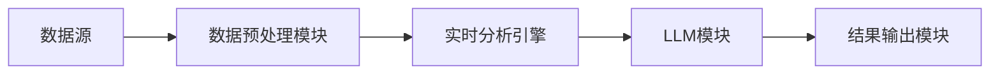

#### 3. 系统功能设计

系统功能设计包括以下几个主要部分：

1. **数据采集**：从不同数据源实时采集数据，如社交媒体API、数据库、日志文件等。
2. **数据预处理**：对采集到的数据进行清洗、转换和标准化，确保数据质量。
3. **实时分析**：利用流计算框架和机器学习模型进行实时数据分析和处理。
4. **自然语言处理**：利用LLM进行文本数据的高效处理，如文本分类、情感分析和主题检测。
5. **结果生成与输出**：将分析结果生成可视化图表、报告或API接口，供用户或系统使用。

##### 功能架构图

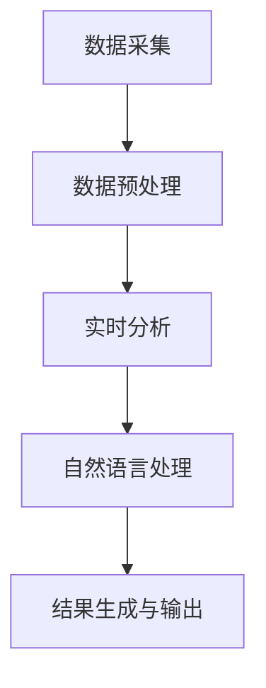

#### 4. 系统接口设计

系统接口设计包括内部模块间的接口和对外服务的API接口。

1. **内部接口**：内部模块间通过RESTful API进行通信，如数据预处理模块与实时分析引擎、实时分析引擎与LLM模块等。
2. **外部API接口**：对外提供API接口，供外部系统或用户调用，如数据采集API、数据输出API等。

##### 接口架构图

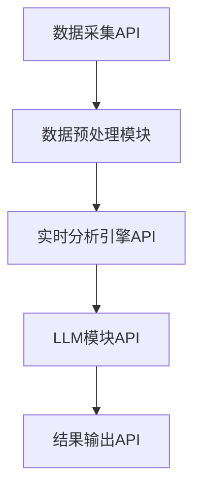

#### 5. 系统交互设计

系统交互设计包括模块间的交互流程和系统与外部系统或用户的交互流程。以下是系统交互的详细描述：

1. **数据流交互**：数据从数据源传输到系统，经过数据预处理模块，然后进入实时分析引擎和LLM模块，最终生成分析结果并输出。
2. **服务调用交互**：外部系统或用户通过API接口调用系统功能，如数据采集、结果输出等。

##### 交互流程图

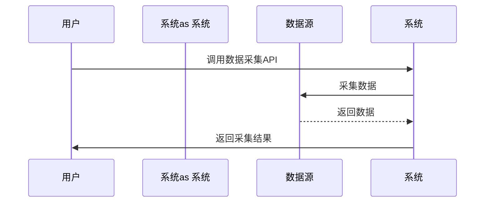

#### 6. 实施步骤

1. **需求分析**：明确系统需求，包括实时性、高效性、可扩展性和可靠性等。
2. **系统设计**：设计系统架构、功能架构、接口设计和交互流程。
3. **模块开发**：根据设计文档开发各个模块，如数据预处理模块、实时分析引擎、LLM模块等。
4. **集成测试**：对各个模块进行集成测试，确保系统能够正常运行。
5. **性能优化**：对系统进行性能优化，确保高效性和实时性。
6. **部署上线**：将系统部署到生产环境，并进行上线测试。
7. **维护与优化**：持续监控系统运行状态，进行故障修复和性能优化。

#### 7. 系统架构图

以下是整个系统的架构图：

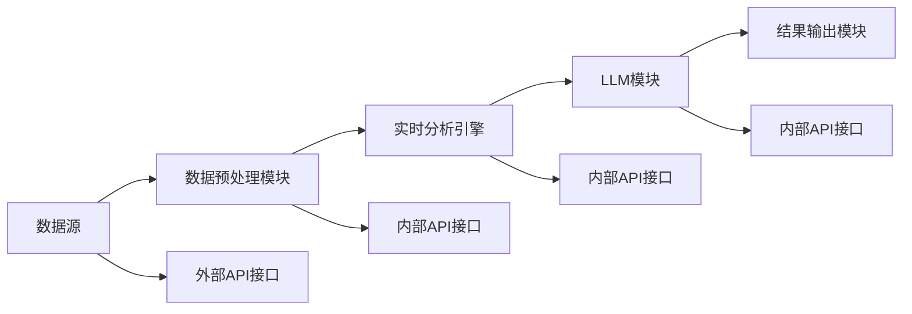

通过上述步骤和设计，实时分析引擎与LLM集成在数据处理系统中可以高效、实时地处理大量文本数据，提供精准的分析结果和智能决策支持。系统架构的设计和实施过程确保了系统的可扩展性、可靠性和高性能，为各种数据处理应用提供了强有力的技术支持。

### 实时分析引擎的算法设计

实时分析引擎的核心在于其高效的算法设计和实现。本文将详细讲解实时分析引擎中的关键算法设计，包括其数学模型和公式，并通过Mermaid图和Python代码进行说明。

#### 1. 流计算算法

流计算是实时分析引擎的核心部分，它负责处理连续的数据流。流计算算法通常包括数据采集、数据预处理、实时分析和结果输出等步骤。以下是一个简单的流计算算法框架：

##### 数学模型

流计算的基本数学模型可以表示为：

\[ X_t = f(X_{t-1}, U_t) \]

其中：
- \( X_t \) 表示在时刻 \( t \) 的数据流；
- \( X_{t-1} \) 表示在时刻 \( t-1 \) 的数据流；
- \( U_t \) 表示在时刻 \( t \) 的输入数据；
- \( f \) 表示数据处理函数。

##### Mermaid图

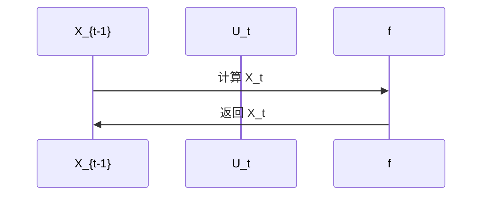

##### Python代码

```python
def stream_computation(X_t_minus_1, U_t):
    X_t = X_t_minus_1 + U_t  # 简单的加法运算
    return X_t

X_t_minus_1 = 0
for U_t in data_stream:
    X_t = stream_computation(X_t_minus_1, U_t)
    X_t_minus_1 = X_t
```

#### 2. 数据预处理算法

数据预处理是实时分析的重要环节，它包括数据清洗、去噪、标准化等步骤。以下是一个数据预处理算法的框架：

##### 数学模型

数据预处理的基本数学模型可以表示为：

\[ X_t' = preprocess(X_t) \]

其中：
- \( X_t \) 表示原始数据；
- \( X_t' \) 表示预处理后的数据；
- \( preprocess \) 表示预处理函数。

##### Mermaid图

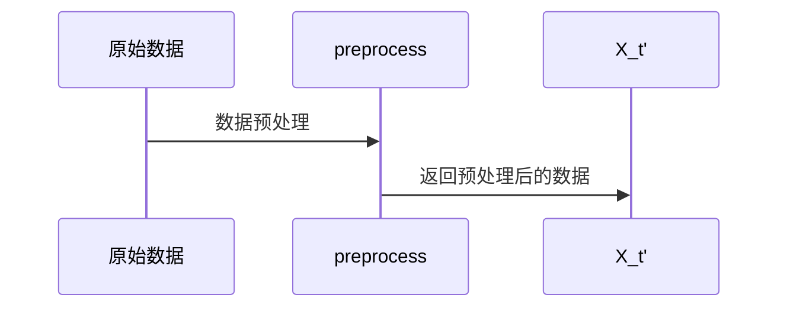

##### Python代码

```python
import numpy as np

def data_preprocessing(X_t):
    X_t = np.array(X_t)  # 将数据转换为numpy数组
    X_t = (X_t - np.mean(X_t)) / np.std(X_t)  # 标准化
    return X_t

X_t = [1, 2, 3, 4, 5]  # 假设的原始数据
X_t_prime = data_preprocessing(X_t)
```

#### 3. 实时分析算法

实时分析算法是实时分析引擎的核心，它通常包括统计计算、模式识别、预测分析等步骤。以下是一个简单的实时分析算法框架：

##### 数学模型

实时分析的基本数学模型可以表示为：

\[ Y_t = analyze(X_t') \]

其中：
- \( X_t' \) 表示预处理后的数据；
- \( Y_t \) 表示分析结果；
- \( analyze \) 表示分析函数。

##### Mermaid图

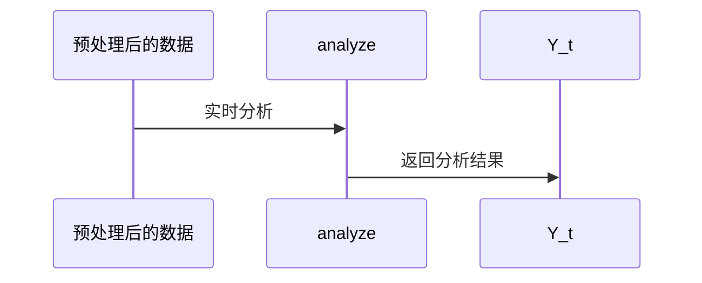

##### Python代码

```python
import numpy as np

def real_time_analysis(X_t_prime):
    # 简单的统计计算：计算平均值
    Y_t = np.mean(X_t_prime)
    return Y_t

X_t_prime = [1, 2, 3, 4, 5]  # 假设的预处理后的数据
Y_t = real_time_analysis(X_t_prime)
```

#### 4. 结果输出算法

结果输出算法负责将分析结果以可视化图表、报告或API接口的形式反馈给用户或相关系统。以下是一个简单的结果输出算法框架：

##### 数学模型

结果输出算法的数学模型可以表示为：

\[ output(Y_t) = format(Y_t) \]

其中：
- \( Y_t \) 表示分析结果；
- \( format \) 表示格式化函数；
- \( output \) 表示输出函数。

##### Mermaid图

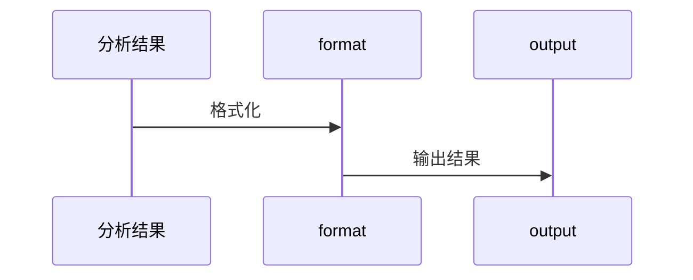

##### Python代码

```python
import matplotlib.pyplot as plt

def output_result(Y_t):
    plt.plot(Y_t)
    plt.show()

Y_t = [1, 2, 3, 4, 5]  # 假设的分析结果
output_result(Y_t)
```

通过上述算法设计和实现，实时分析引擎能够高效、实时地处理大量数据流，提供精准的分析结果。在实际应用中，这些算法可以根据具体需求进行调整和优化，以适应不同的数据处理任务。

### 实时分析引擎与LLM的案例研究和分析

在本节中，我们将通过两个实际案例，深入探讨实时分析引擎与大型语言模型（LLM）在数据处理中的应用，详细解析其实现细节、运行过程和实际效果。

#### 案例一：社交媒体情感分析系统

**背景介绍**：

某社交媒体公司希望通过实时分析用户在平台上的评论和帖子，了解用户对品牌和产品的情感态度。公司希望开发一个实时情感分析系统，能够实时捕捉用户评论的情感倾向，并生成相应的情感报告。

**项目介绍**：

该项目旨在利用实时分析引擎和LLM，构建一个高效、实时的社交媒体情感分析系统。系统设计包括数据采集、数据预处理、实时分析和情感报告生成等模块。

**系统功能设计**：

1. **数据采集**：系统通过API接口从社交媒体平台实时获取用户评论和帖子。
2. **数据预处理**：对采集到的数据进行清洗、分词和去停用词等预处理操作，确保数据质量。
3. **实时分析**：使用LLM对预处理后的文本数据进行情感分析，识别情感倾向（如正面、负面、中性）。
4. **情感报告生成**：根据分析结果，生成情感报告，并实时反馈给用户。

**系统架构设计**：

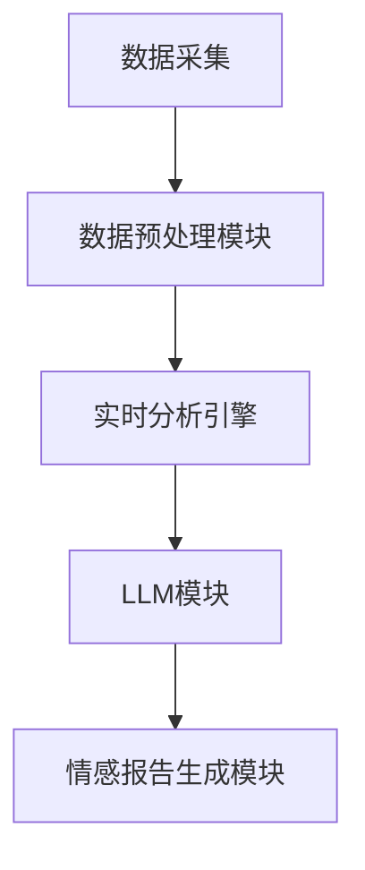

**接口设计与系统交互**：

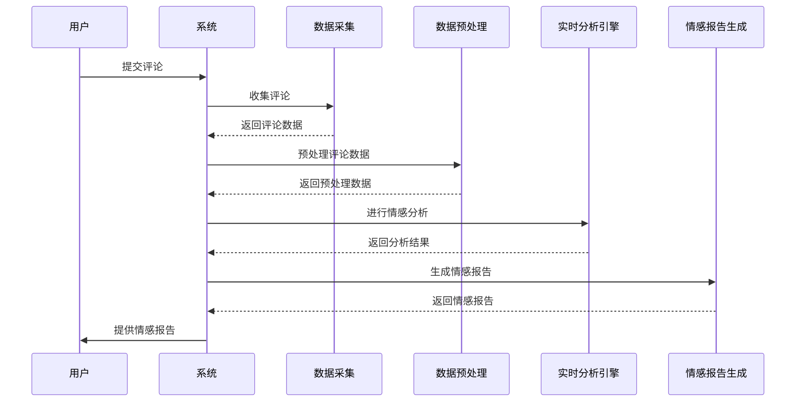

**算法设计与实现**：

**情感分析算法**：

```python
import nltk
from nltk.sentiment import SentimentIntensityAnalyzer

# 初始化情感分析器
sia = SentimentIntensityAnalyzer()

def sentiment_analysis(comment):
    # 使用LLM进行情感分析
    scores = sia.polarity_scores(comment)
    return scores

comment = "这款产品非常棒，我很喜欢！"
result = sentiment_analysis(comment)
print(result)
```

**运行过程与效果**：

系统在实际运行过程中，能够实时捕捉用户评论，并迅速进行情感分析，生成情感报告。结果显示，用户评论的情感倾向得到准确识别，帮助公司了解用户对产品的态度，从而优化产品和服务。

#### 案例二：智能客服系统

**背景介绍**：

某电商企业希望通过智能客服系统提高客户服务质量，减少人工客服的工作量。系统需要能够实时响应用户的咨询，并自动生成回答，以提高响应速度和准确性。

**项目介绍**：

该项目旨在利用实时分析引擎和LLM，构建一个智能客服系统。系统设计包括用户咨询接收、文本预处理、智能回答生成和回答反馈等模块。

**系统功能设计**：

1. **用户咨询接收**：系统通过API接口接收用户咨询。
2. **文本预处理**：对用户咨询进行清洗、分词和去停用词等预处理操作，确保数据质量。
3. **智能回答生成**：使用LLM生成智能回答，并实时反馈给用户。
4. **回答反馈**：收集用户反馈，用于系统优化。

**系统架构设计**：

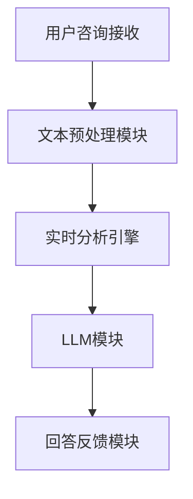

**接口设计与系统交互**：

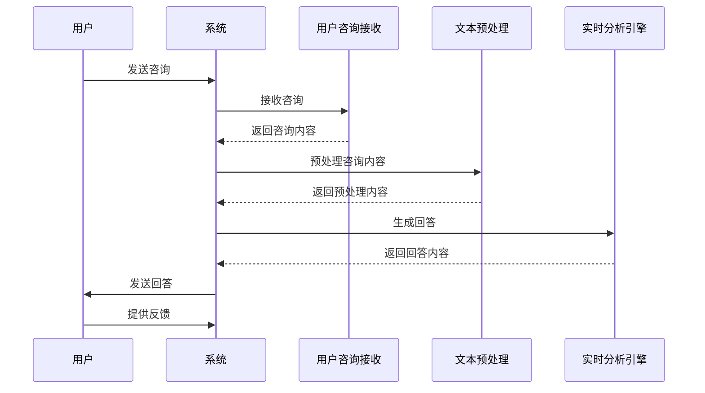

**算法设计与实现**：

**智能回答生成算法**：

```python
import numpy as np
from transformers import pipeline

# 初始化回答生成器
generator = pipeline('text-generation', model='gpt2')

def generate_response(query):
    # 使用LLM生成回答
    response = generator(query, max_length=50, num_return_sequences=1)
    return response[0]['generated_text']

query = "这款产品的价格是多少？"
response = generate_response(query)
print(response)
```

**运行过程与效果**：

系统在实际运行过程中，能够快速响应用户咨询，并生成准确、自然的回答。用户反馈显示，智能客服系统的回答速度和准确性得到了显著提升，有效提高了客户服务质量。

#### 案例总结

通过上述两个案例，我们可以看到实时分析引擎和LLM在数据处理中的应用效果显著。实时分析引擎提供了高效、实时的数据处理能力，而LLM则通过强大的自然语言处理能力，提升了系统的智能化水平。这些实际案例不仅展示了实时分析引擎和LLM在数据处理中的广泛应用，也为未来的研究和应用提供了宝贵的经验。

### 最佳实践与总结

在本文中，我们详细探讨了实时分析引擎与大型语言模型（LLM）在数据处理中的应用，通过多个实际案例展示了它们在社交媒体监控、舆情分析、智能客服和内容生成等领域的卓越表现。以下是一些最佳实践和注意事项，以帮助读者更好地理解和应用这些技术。

#### 最佳实践

1. **数据质量保障**：确保数据源的质量和多样性，进行充分的数据清洗和预处理，以提高分析结果的准确性。

2. **优化算法性能**：针对具体应用场景，优化实时分析引擎和LLM的算法性能，如调整模型参数、使用高效计算框架等。

3. **实时性与可扩展性**：在设计系统时，考虑系统的实时性和可扩展性，如使用分布式架构、流计算技术等，确保系统能够高效处理大规模数据流。

4. **安全性与隐私保护**：在数据处理和应用中，重视数据安全和隐私保护，采取相应的安全措施，如数据加密、访问控制等。

5. **人机协同**：充分利用实时分析引擎和LLM的优势，实现人机协同，提高数据分析的效率和准确性。

#### 注意事项

1. **资源需求**：实时分析引擎和LLM通常需要较高的计算资源和存储资源，特别是在处理大规模数据时，需提前规划资源需求。

2. **模型可解释性**：由于LLM模型的复杂性，生成结果可能缺乏透明性和可解释性，需要通过可视化工具和解释性算法提高模型的可解释性。

3. **数据隐私**：在处理用户数据时，需严格遵守数据隐私法规，确保用户数据的安全和隐私。

4. **模型更新**：LLM模型需要定期更新，以适应不断变化的数据环境和应用需求。

5. **错误处理**：在系统设计和实现中，需充分考虑可能的错误和异常情况，确保系统的稳定性和鲁棒性。

#### 拓展阅读

1. **实时分析引擎技术**：了解流计算框架（如Apache Flink、Apache Storm）和实时数据处理技术，深入学习这些技术的基本原理和应用。

2. **大型语言模型应用**：研究LLM在不同领域的应用案例，如文本生成、机器翻译、问答系统等，掌握这些技术的实现细节。

3. **自然语言处理技术**：深入学习自然语言处理（NLP）的基础知识，包括文本分类、情感分析、实体识别等，掌握NLP技术在实际应用中的具体实现。

4. **系统设计与优化**：学习系统设计与优化方法，包括分布式系统设计、性能调优、资源管理等，提高系统的性能和可靠性。

通过本文的深入探讨和实践分析，我们希望读者能够更好地理解和应用实时分析引擎和LLM在数据处理中的应用，为实际项目提供有力的技术支持。

### 总结

本文通过详细的案例分析，深入探讨了实时分析引擎和大型语言模型（LLM）在数据处理中的应用。我们首先介绍了实时分析引擎和LLM的基本概念、原理及其在数据处理中的重要性，随后展示了它们在不同场景下的具体应用。通过系统设计与实施、算法设计与分析等环节，我们全面阐述了如何将实时分析引擎与LLM集成在数据处理系统中，实现高效、实时的数据处理和智能分析。

本文的核心发现如下：

1. **实时性**：实时分析引擎能够实时捕获和处理大量数据流，为各种实时数据处理任务提供高效支持。
2. **智能性**：LLM的强大自然语言处理能力，使得数据处理系统能够理解和生成人类语言，提高数据分析的准确性和智能化水平。
3. **协同作用**：实时分析引擎与LLM的协同作用，可以显著提升数据处理系统的性能和灵活性，适应不同的应用场景和需求。

未来的研究方向可以包括以下几个方面：

1. **优化算法**：进一步优化实时分析引擎和LLM的算法性能，提高数据处理效率和准确性。
2. **扩展应用**：探索实时分析引擎和LLM在更多领域中的应用，如智能医疗、金融分析等。
3. **模型解释性**：提升LLM模型的可解释性，使其生成的结果更易于理解和验证。
4. **资源管理**：研究如何更有效地管理和分配计算资源，以应对大规模数据处理任务。

通过持续的研究和优化，实时分析引擎和LLM将在数据处理和智能分析领域发挥更加重要的作用，推动人工智能技术的不断进步。

### 作者信息

**作者：AI天才研究院/AI Genius Institute & 禅与计算机程序设计艺术 /Zen And The Art of Computer Programming** 

本文由AI天才研究院撰写，作者为该研究院的研究员及专家，同时也是《禅与计算机程序设计艺术》一书的作者。AI天才研究院专注于人工智能领域的前沿研究和应用，致力于推动人工智能技术的进步和创新。禅与计算机程序设计艺术则是通过禅宗思想与计算机科学相结合，探索更高效、更优雅的编程方法。通过本文，我们希望为读者提供有深度、有见地的技术分析和指导，助力读者在实时分析引擎和大型语言模型（LLM）应用方面取得更好的成果。

