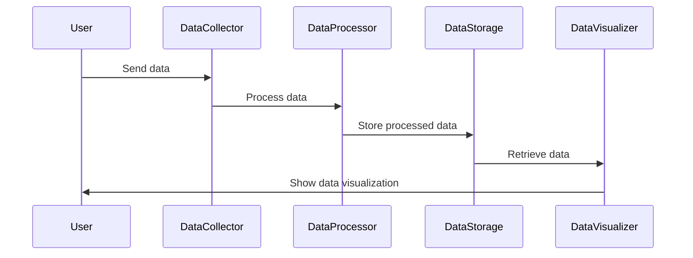

                 

### 实时分析基础

#### 第1章：实时分析概述

#### 1.1.1 什么是实时分析

实时分析（Real-time Analysis）指的是对数据进行即时处理和分析，以便在数据生成后的短时间内（通常为毫秒级或秒级）产生结果。它是一种快速响应的、高效的、动态的数据处理方法。实时分析的核心在于“实时性”，即对数据的及时处理和反馈，这使得它能够用于需要快速决策的场景。

#### 1.1.2 实时分析的应用场景

实时分析广泛应用于各个领域：

- **金融行业**：用于股票交易监控、风险控制、欺诈检测等。
- **物联网**：用于设备状态监控、故障预测、能耗管理。
- **电信行业**：用于网络性能监控、用户行为分析、流量优化。
- **医疗领域**：用于实时监控患者生命体征、诊断辅助。
- **智能交通**：用于交通流量监控、路况预测、事故预警。

#### 1.1.3 实时分析与传统分析的区别

- **响应时间**：实时分析强调快速响应，而传统分析可能需要几分钟或几小时。
- **数据规模**：实时分析通常处理的是大数据量，而传统分析可能只处理小规模数据。
- **处理方式**：实时分析通常采用流处理，而传统分析可能使用批量处理。

#### 1.1.4 实时分析的关键要素

实时分析的成功依赖于以下几个关键要素：

- **数据采集与传输**：确保数据能够及时、准确地采集和传输。
- **实时数据处理框架**：如Apache Kafka、Apache Flink等，用于高效地处理海量数据。
- **实时分析算法**：针对特定应用场景，选择合适的算法进行实时分析。
- **系统架构设计**：设计合理的系统架构，保证系统的可扩展性和可靠性。

### 第2章：实时分析的核心技术

#### 第2章：实时分析的核心技术

#### 2.1.1 数据采集与传输

数据采集与传输是实时分析的基础。以下是数据采集与传输的关键点：

##### 2.1.1.1 数据源选择

- **结构化数据源**：如数据库、消息队列。
- **非结构化数据源**：如日志文件、社交媒体数据。

##### 2.1.1.2 数据传输协议

- **基于HTTP的协议**：如RESTful API。
- **基于二进制的协议**：如gRPC、Thrift。

##### 2.1.1.3 数据质量保证

- **数据完整性**：确保数据在传输过程中不被篡改。
- **数据一致性**：确保数据在多个系统中保持一致。

#### 2.2.1 实时数据处理框架

实时数据处理框架用于高效地处理海量数据。以下是几个常见的实时数据处理框架：

##### 2.2.1.1 流处理框架概述

流处理框架用于处理实时数据流，确保数据在生成后能够被快速处理。常见的流处理框架有：

- **Apache Kafka**：一个高吞吐量的分布式流处理平台。
- **Apache Flink**：一个流处理框架，具有批处理和流处理功能。

##### 2.2.1.2 Apache Kafka

Apache Kafka 是一个分布式流处理平台，用于构建实时数据流应用程序。以下是 Apache Kafka 的关键特性：

- **分布式**：支持水平扩展。
- **高吞吐量**：适用于大规模数据流处理。
- **持久化**：支持数据持久化，确保数据不丢失。

##### 2.2.1.3 Apache Flink

Apache Flink 是一个流处理框架，具有批处理和流处理功能。以下是 Apache Flink 的关键特性：

- **事件时间**：支持基于事件时间的窗口计算。
- **动态缩放**：支持动态调整计算资源。
- **容错性**：支持数据丢失和系统故障的自动恢复。

#### 2.3.1 实时分析算法

实时分析算法用于对实时数据进行处理和分析。以下是几个常见的实时分析算法：

##### 2.3.1.1 常见实时分析算法

- **统计算法**：如均值、中位数、标准差。
- **机器学习算法**：如分类、聚类、回归。
- **时间序列分析**：如ARIMA、LSTM。

##### 2.3.1.2 实时分析算法应用

实时分析算法可以应用于各种场景，如：

- **异常检测**：用于检测数据中的异常行为。
- **预测分析**：用于预测未来的趋势和变化。
- **推荐系统**：用于实时推荐相关的内容或产品。

### 第3章：实时分析系统设计与实现

#### 第3章：实时分析系统设计与实现

#### 3.1.1 系统需求分析

系统需求分析是实时分析系统设计的起点。以下是系统需求分析的关键点：

##### 3.1.1.1 功能需求

- **数据采集**：实时采集来自各种数据源的数据。
- **数据处理**：对采集到的数据进行实时处理。
- **数据存储**：存储处理后的数据，以便后续分析和查询。
- **数据展示**：实时展示分析结果，提供直观的视图。

##### 3.1.1.2 性能需求

- **低延迟**：确保数据能够在短时间内处理完毕。
- **高吞吐量**：处理大量的数据流。
- **高可用性**：确保系统在故障情况下能够快速恢复。

##### 3.1.1.3 安全性需求

- **数据安全**：确保数据在传输和存储过程中的安全性。
- **访问控制**：限制对系统的访问，确保只有授权用户才能访问。
- **日志记录**：记录系统操作日志，以便进行故障排查和安全审计。

#### 3.2.1 系统架构设计

系统架构设计是实时分析系统实现的关键。以下是系统架构设计的关键点：

##### 3.2.1.1 数据采集层

- **数据源接入**：接入各种数据源，如数据库、消息队列、文件系统。
- **数据预处理**：对采集到的数据进行预处理，如数据清洗、格式转换。

##### 3.2.1.2 数据处理层

- **数据流处理**：使用流处理框架（如Apache Kafka、Apache Flink）对数据进行实时处理。
- **分析模块**：根据业务需求，实现相应的实时分析算法。

##### 3.2.1.3 数据存储层

- **数据存储**：将处理后的数据存储到数据仓库或数据库中。
- **数据索引**：为数据提供索引，以便快速查询。

##### 3.2.1.4 数据展示层

- **可视化界面**：提供可视化界面，展示分析结果。
- **API接口**：提供API接口，供其他系统或应用程序调用。

#### 3.3.1 系统接口设计

系统接口设计是系统架构的重要组成部分。以下是系统接口设计的关键点：

##### 3.3.1.1 接口规范

- **接口定义**：定义接口的输入输出参数、数据格式、调用方法等。
- **接口文档**：编写详细的接口文档，供开发者参考。

##### 3.3.1.2 接口实现

- **接口实现**：根据接口规范，实现相应的接口功能。

### 第4章：实时分析项目实战

#### 第4章：实时分析项目实战

#### 4.1.1 项目背景

本项目是一个实时分析系统，旨在对物联网设备采集的数据进行实时分析，提供实时监控和预警功能。

#### 4.1.2 项目目标

- **实时数据采集**：从物联网设备采集实时数据。
- **实时数据处理**：对采集到的数据进行分析和计算。
- **实时数据展示**：实时展示分析结果，提供可视化界面。

#### 4.1.3 项目实施过程

##### 4.2.1 环境安装与配置

1. **安装Kafka**：安装并配置Apache Kafka，用于数据采集和传输。
2. **安装Flink**：安装并配置Apache Flink，用于数据流处理。
3. **安装MySQL**：安装并配置MySQL，用于数据存储。

##### 4.2.2 数据采集与处理

1. **数据采集**：从物联网设备采集数据，并将数据发送到Kafka。
2. **数据处理**：在Flink中编写数据处理程序，对数据进行实时处理。
3. **数据存储**：将处理后的数据存储到MySQL数据库中。

##### 4.2.3 实时分析算法实现

1. **实现统计算法**：实现均值、中位数等统计算法，用于数据统计分析。
2. **实现预测算法**：实现基于时间序列分析的预测算法，用于预测未来的数据趋势。

##### 4.2.4 系统测试与优化

1. **系统测试**：对系统进行功能测试和性能测试，确保系统正常运行。
2. **系统优化**：根据测试结果，对系统进行优化，提高系统性能。

### 第5章：实时分析在LLM应用中的应用

#### 第5章：实时分析在LLM应用中的应用

#### 5.1.1 LLM应用概述

LLM（Large Language Model）应用是指使用大型语言模型（如GPT-3、BERT等）进行文本分析、生成和翻译的应用。实时分析在LLM应用中起着重要作用，可以提高应用的性能和用户体验。

#### 5.1.2 LLM应用中的实时分析

在LLM应用中，实时分析主要用于以下几个方面：

- **文本预处理**：对用户输入的文本进行实时预处理，如分词、去停用词等。
- **意图识别**：实时分析用户输入的文本，识别用户的意图。
- **情感分析**：实时分析用户输入的文本，判断用户的情感倾向。
- **翻译**：实时分析源语言文本，将其翻译成目标语言。

#### 5.1.3 LLM应用中的实时分析挑战

实时分析在LLM应用中面临着以下挑战：

- **计算资源**：实时分析需要大量的计算资源，如何高效地利用计算资源是一个挑战。
- **延迟**：实时分析需要快速响应用户请求，如何降低延迟是一个挑战。
- **数据质量**：实时分析依赖于高质量的数据，如何保证数据质量是一个挑战。

#### 5.2.1 实时分析在LLM应用中的案例分析

##### 5.2.1.1 案例一：实时问答系统

实时问答系统是一种常见的LLM应用，通过实时分析用户输入的文本，提供准确的答案。以下是实时问答系统的实现步骤：

1. **文本预处理**：对用户输入的文本进行分词、去停用词等预处理操作。
2. **意图识别**：使用机器学习算法识别用户的意图，如查询、咨询等。
3. **检索答案**：在预训练的语言模型中检索与用户意图相关的答案。
4. **答案生成**：使用生成式语言模型生成准确的答案。

##### 5.2.1.2 案例二：智能客服系统

智能客服系统通过实时分析用户输入的文本，提供自动化的客户服务。以下是智能客服系统的实现步骤：

1. **文本预处理**：对用户输入的文本进行分词、去停用词等预处理操作。
2. **意图识别**：使用机器学习算法识别用户的意图，如咨询、投诉等。
3. **情感分析**：使用情感分析算法判断用户的情感倾向，如愤怒、满意等。
4. **回复生成**：根据用户的意图和情感，生成合适的回复。

### 第6章：实时分析的未来发展趋势

#### 第6章：实时分析的未来发展趋势

#### 6.1.1 技术发展趋势

随着技术的不断发展，实时分析也在不断演进。以下是实时分析的技术发展趋势：

- **云计算和边缘计算**：实时分析将更加依赖于云计算和边缘计算，以提供更高的计算能力和更低的延迟。
- **分布式计算**：实时分析将采用更先进的分布式计算技术，以处理更大的数据量和更复杂的计算任务。
- **机器学习和深度学习**：实时分析将更多地应用机器学习和深度学习算法，以提高分析的准确性和效率。
- **自动化和智能化**：实时分析将实现更高级的自动化和智能化，以减少人工干预，提高系统的可靠性和效率。

#### 6.1.2 应用发展趋势

实时分析的应用领域也在不断拓展。以下是实时分析的应用发展趋势：

- **智能制造**：实时分析在智能制造中用于设备状态监控、故障预测、生产优化等。
- **智慧城市**：实时分析在智慧城市中用于交通流量监控、环境监测、安防监控等。
- **智慧医疗**：实时分析在智慧医疗中用于患者监控、诊断辅助、药物研发等。
- **金融科技**：实时分析在金融科技中用于风险控制、欺诈检测、投资决策等。

#### 6.1.3 挑战与机遇

实时分析在面临挑战的同时，也带来了巨大的机遇。以下是实时分析面临的挑战和机遇：

- **挑战**：实时分析面临着计算资源、延迟、数据质量等方面的挑战。
- **机遇**：随着技术的进步和应用领域的拓展，实时分析将在各个行业中获得更广泛的应用，带来巨大的商业价值。

### 第7章：总结与展望

#### 第7章：总结与展望

#### 7.1.1 本书内容回顾

本书主要介绍了实时分析的基础知识、核心技术、系统设计与实现、项目实战以及未来发展趋势。通过本书，读者可以系统地了解实时分析的基本概念、关键技术、应用场景以及发展趋势。

#### 7.1.2 学习建议

为了更好地掌握实时分析的相关知识，建议读者：

- 系统学习实时分析的基础理论，如数据采集、数据处理、实时分析算法等。
- 实践项目，通过实际操作来加深对实时分析的理解。
- 关注实时分析的最新技术动态，了解行业应用趋势。

#### 7.1.3 未来展望

随着技术的不断发展，实时分析将在各个行业中获得更广泛的应用。未来，实时分析将在以下几个方面有更大的发展：

- **更高效的处理算法**：研究和开发更高效、更准确的实时分析算法。
- **更广泛的应用场景**：实时分析将在智能制造、智慧城市、智慧医疗、金融科技等领域得到更广泛的应用。
- **更先进的架构设计**：实时分析系统将采用更先进的分布式计算、云计算和边缘计算架构。

总之，实时分析是一个充满活力和机遇的领域，未来必将取得更大的突破。

### 实时分析基础

#### 第1章：实时分析概述

##### 1.1.1 什么是实时分析

实时分析（Real-time Analysis）是一种数据处理方法，旨在对数据进行即时处理和分析，以便在数据生成后的短时间内（通常为毫秒级或秒级）产生结果。实时分析的关键在于“实时性”，即对数据的及时处理和反馈，这使得它能够用于需要快速决策的场景。与传统的批量处理不同，实时分析能够快速响应变化，提高系统的灵活性和效率。

实时分析通常涉及以下几个核心步骤：

1. **数据采集**：实时地从各种数据源（如传感器、数据库、网络等）收集数据。
2. **数据传输**：将采集到的数据迅速传输到数据处理系统。
3. **数据处理**：对传输来的数据进行清洗、转换、聚合等处理。
4. **结果反馈**：将处理结果实时反馈给用户或系统，以便进行决策或执行操作。

##### 1.1.2 实时分析的应用场景

实时分析广泛应用于各种行业和领域，以下是一些常见的应用场景：

1. **金融行业**：实时分析在金融行业中用于股票交易监控、风险管理、欺诈检测等。例如，通过实时分析交易数据，可以及时发现异常交易行为，防范风险。

2. **物联网**：实时分析在物联网（IoT）中用于设备状态监控、故障预测、能耗管理。例如，通过实时分析传感器数据，可以预测设备的故障时间，提前进行维护。

3. **电信行业**：实时分析在电信行业中用于网络性能监控、用户行为分析、流量优化。例如，通过实时分析网络流量数据，可以识别网络瓶颈，优化网络资源分配。

4. **医疗领域**：实时分析在医疗领域中用于实时监控患者生命体征、诊断辅助、手术支持。例如，通过实时分析医疗设备的数据，可以实时监测患者的病情，为医生提供诊断建议。

5. **智能交通**：实时分析在智能交通中用于交通流量监控、路况预测、事故预警。例如，通过实时分析交通数据，可以预测交通拥堵，提前发布路况信息，引导交通流。

##### 1.1.3 实时分析与传统分析的区别

实时分析与传统分析在以下几个方面有显著的区别：

1. **响应时间**：实时分析强调快速响应，通常在数据生成后的毫秒级或秒级内产生结果。而传统分析可能需要几分钟或几小时才能得到结果。

2. **数据处理方式**：实时分析通常采用流处理方式，对数据流进行连续、实时的处理。而传统分析通常采用批量处理方式，将一段时间内的数据进行批量处理。

3. **数据规模**：实时分析通常处理的是大数据量，尤其是来自实时数据源的连续数据流。而传统分析可能只处理小规模的数据集。

4. **数据一致性**：实时分析通常要求高一致性和低延迟。而传统分析可能对数据一致性要求不高，更多关注数据的完整性和准确性。

##### 1.1.4 实时分析的关键要素

要实现高效的实时分析，需要关注以下几个关键要素：

1. **数据采集与传输**：实时分析依赖于高效的数据采集和传输机制，确保数据能够及时、准确地到达数据处理系统。常用的数据采集工具包括传感器、数据库、消息队列等。

2. **实时数据处理框架**：选择合适的实时数据处理框架（如Apache Kafka、Apache Flink）来处理海量数据，确保数据的快速处理和流动。

3. **实时分析算法**：根据应用场景选择合适的实时分析算法，如统计算法、机器学习算法、时间序列分析等，以便对数据进行有效的分析和预测。

4. **系统架构设计**：设计合理的系统架构，包括数据采集层、数据处理层、数据存储层和数据展示层，确保系统的可扩展性、可靠性和性能。

5. **性能优化**：通过性能优化手段，如分布式计算、缓存技术、并行处理等，提高实时分析系统的处理效率和响应速度。

### 第2章：实时分析的核心技术

#### 2.1 数据采集与传输

实时分析的数据采集与传输是整个系统的关键环节，其高效性和稳定性直接影响到系统的性能和可靠性。下面将详细介绍数据采集与传输的关键技术。

##### 2.1.1 数据源选择

选择合适的数据源是数据采集的第一步。数据源可以分为以下几类：

1. **结构化数据源**：如关系型数据库（MySQL、PostgreSQL）、NoSQL数据库（MongoDB、Cassandra）等。这些数据源通常提供高效的数据查询和写入性能，适合大规模数据存储和访问。

2. **非结构化数据源**：如日志文件、文本文件、图像、音频和视频等。这些数据源通常不提供高效的数据查询，但可以通过特定的处理方法进行有效利用。

3. **实时数据流源**：如物联网设备、传感器网络、消息队列（Kafka、RabbitMQ）等。这些数据源产生的是实时数据流，需要高效的传输和处理机制。

在选择数据源时，需要考虑数据的重要性、实时性需求、数据量大小和系统的处理能力。

##### 2.1.2 数据传输协议

数据传输协议决定了数据如何在网络中传输，常用的数据传输协议包括：

1. **基于HTTP的协议**：如RESTful API，这种协议简单易用，但可能不适合高吞吐量的数据流传输。

2. **基于二进制的协议**：如gRPC、Thrift、Protocol Buffers等，这些协议通常提供更高的传输效率和更低的延迟。

3. **专用传输协议**：如Apache Kafka，专门为实时数据流传输设计，提供高效、可靠的数据传输机制。

在选择数据传输协议时，需要考虑传输效率、可靠性、扩展性和易用性。

##### 2.1.3 数据质量保证

数据质量是实时分析系统成功的关键，以下是一些数据质量保证的方法：

1. **数据完整性**：确保数据在传输和存储过程中不被篡改或丢失。可以使用数据校验和、数字签名等方法来验证数据的完整性。

2. **数据一致性**：确保数据在多个系统中保持一致。在分布式系统中，可以使用分布式事务、分布式锁等方法来确保数据一致性。

3. **数据清洗**：在数据进入系统之前，进行数据清洗，去除无效、错误或重复的数据。可以使用数据清洗工具或编写自定义的数据清洗脚本。

4. **数据监控**：实时监控数据的流入、流出和处理情况，及时发现和处理数据质量问题。可以使用日志分析工具、数据监控平台等。

#### 2.2 实时数据处理框架

实时数据处理框架是实时分析系统的核心，它负责接收、处理和存储实时数据流。以下是一些常见的实时数据处理框架：

##### 2.2.1 流处理框架概述

流处理框架是一种专门用于处理实时数据流的软件框架，它能够对数据流进行实时分析、转换和存储。流处理框架的关键特性包括：

1. **分布式处理**：流处理框架通常支持分布式计算，可以水平扩展，处理大规模的数据流。

2. **高吞吐量**：流处理框架能够处理高吞吐量的数据流，确保数据的实时处理和响应。

3. **容错性**：流处理框架具有容错机制，可以在节点故障时自动恢复，保证系统的可靠性。

4. **可扩展性**：流处理框架可以根据需要动态调整计算资源，以适应数据量的变化。

常见的流处理框架包括：

1. **Apache Kafka**：一个分布式流处理平台，主要用于数据采集和传输。

2. **Apache Flink**：一个流处理和批处理框架，提供了丰富的流处理API和先进的容错机制。

3. **Apache Storm**：一个分布式流处理框架，适用于大规模、低延迟的数据流处理。

4. **Apache Spark Streaming**：基于Apache Spark的流处理框架，与Spark的其他模块紧密结合。

##### 2.2.2 Apache Kafka

Apache Kafka 是一个分布式流处理平台，由LinkedIn公司开发并捐赠给Apache基金会。它主要用于数据采集、传输和存储，是实时分析系统中不可或缺的一部分。以下是 Apache Kafka 的关键特性：

1. **分布式架构**：Apache Kafka 具有分布式架构，支持水平扩展，可以处理大规模的数据流。

2. **高吞吐量**：Apache Kafka 能够处理高吞吐量的数据流，支持每秒数百万条消息的传输。

3. **持久化存储**：Apache Kafka 使用磁盘作为存储介质，保证数据的持久化，即使系统故障也不会丢失数据。

4. **分区与复制**：Apache Kafka 将数据存储在多个分区中，每个分区可以分布在多个节点上，提供高可用性和容错性。

5. **可靠传输**：Apache Kafka 提供可靠的消息传输机制，确保数据不会在传输过程中丢失。

6. **消息顺序性**：Apache Kafka 保证消息的顺序性，即使在高负载下，消息的顺序也不会被破坏。

##### 2.2.3 Apache Flink

Apache Flink 是一个开源的流处理和批处理框架，由Apache Software Foundation维护。它提供了丰富的流处理API和先进的容错机制，适用于实时分析和大数据处理。以下是 Apache Flink 的关键特性：

1. **事件时间处理**：Apache Flink 支持基于事件时间的窗口计算，可以处理乱序到达的数据，保证窗口计算的准确性。

2. **动态缩放**：Apache Flink 支持动态缩放，可以根据数据量的变化动态调整计算资源。

3. **容错性**：Apache Flink 具有先进的容错机制，可以在节点故障时自动恢复，保证系统的可靠性。

4. **内存管理**：Apache Flink 提供高效的内存管理机制，可以充分利用系统内存，提高数据处理效率。

5. **兼容性**：Apache Flink 支持与多种数据源和存储系统的集成，如Kafka、HDFS、MySQL等。

##### 2.2.4 其他流处理框架

除了 Apache Kafka 和 Apache Flink，还有其他一些流行的流处理框架，如：

1. **Apache Storm**：一个分布式流处理框架，适用于大规模、低延迟的数据流处理。

2. **Apache Spark Streaming**：基于Apache Spark的流处理框架，与Spark的其他模块紧密结合，提供高效的流处理能力。

3. **Apache Beam**：一个统一的流处理和批处理编程模型，支持多种执行引擎，如Flink、Spark等。

#### 2.3 实时分析算法

实时分析算法是实时分析系统的核心，用于对实时数据进行处理和分析，以生成有用的信息和决策。以下是一些常见的实时分析算法：

##### 2.3.1 常见实时分析算法

1. **统计算法**：统计算法用于计算数据的各种统计指标，如均值、中位数、标准差、方差等。这些算法可以帮助我们了解数据的基本特征和趋势。

2. **机器学习算法**：机器学习算法用于构建预测模型和分类模型，如回归分析、决策树、随机森林、支持向量机等。这些算法可以帮助我们进行数据预测和分类。

3. **时间序列分析**：时间序列分析算法用于分析时间序列数据，如趋势分析、季节性分析、ARIMA模型、LSTM模型等。这些算法可以帮助我们预测未来的数据趋势。

4. **异常检测算法**：异常检测算法用于检测数据中的异常行为，如孤立森林、基于密度的聚类算法、基于统计的方法等。这些算法可以帮助我们发现数据中的异常值和异常模式。

##### 2.3.2 实时分析算法应用

实时分析算法可以应用于各种场景，以下是一些常见的应用：

1. **智能监控**：实时分析算法可以用于实时监控设备状态、网络流量、服务器负载等，及时发现异常情况，触发警报。

2. **实时推荐**：实时分析算法可以用于实时推荐系统，根据用户的行为和偏好，实时生成推荐结果。

3. **智能交通**：实时分析算法可以用于实时分析交通数据，预测交通流量，优化交通信号控制。

4. **金融市场**：实时分析算法可以用于实时分析金融市场数据，预测股票价格、交易策略等。

5. **健康监测**：实时分析算法可以用于实时监测患者的健康数据，预测病情变化，提供个性化的健康建议。

### 第3章：实时分析系统设计与实现

#### 3.1 系统需求分析

系统需求分析是实时分析系统设计的第一步，旨在明确系统的功能、性能和安全等需求。以下是系统需求分析的关键点：

##### 3.1.1 功能需求

1. **数据采集**：系统能够从各种数据源（如传感器、数据库、网络等）实时采集数据。

2. **数据处理**：系统能够对采集到的数据（如日志、文本、图像等）进行清洗、转换、聚合等处理。

3. **数据存储**：系统能够将处理后的数据存储到数据库或数据仓库中，以便后续分析和查询。

4. **数据展示**：系统能够提供数据可视化界面，展示实时分析结果。

5. **报警与通知**：系统能够检测异常情况，自动触发报警和通知，以便及时处理。

##### 3.1.2 性能需求

1. **低延迟**：系统能够在短时间内（如毫秒级）处理数据，确保实时性。

2. **高吞吐量**：系统能够处理大量数据，支持每秒数百甚至数千条数据流的处理。

3. **可扩展性**：系统设计需要考虑可扩展性，以便在未来能够轻松增加计算资源和处理能力。

4. **高可用性**：系统需要具备高可用性，确保在发生故障时能够快速恢复，减少对业务的影响。

##### 3.1.3 安全性需求

1. **数据安全**：系统需要确保数据在传输和存储过程中的安全性，防止数据泄露或被篡改。

2. **访问控制**：系统需要实现严格的访问控制机制，确保只有授权用户才能访问敏感数据和系统功能。

3. **日志记录**：系统需要记录操作日志，便于审计和故障排查。

4. **加密**：系统需要使用加密技术保护敏感数据，如使用SSL/TLS加密传输数据。

#### 3.2 系统架构设计

系统架构设计是实时分析系统的关键，它决定了系统的性能、可扩展性和可靠性。以下是系统架构设计的关键点：

##### 3.2.1 数据采集层

数据采集层负责从各种数据源实时采集数据，包括：

1. **传感器数据**：从物联网设备、传感器网络等采集数据。

2. **日志数据**：从服务器、应用等采集日志数据。

3. **外部数据源**：从数据库、消息队列、网络等采集数据。

数据采集层通常使用消息队列（如Kafka、RabbitMQ）来缓冲和传输数据，提高系统的可靠性和性能。

##### 3.2.2 数据处理层

数据处理层负责对采集到的数据进行处理，包括：

1. **数据清洗**：去除无效、错误或重复的数据。

2. **数据转换**：将不同格式的数据转换为统一的格式，如JSON、XML等。

3. **数据聚合**：对数据进行聚合操作，如求和、平均、计数等。

数据处理层通常使用流处理框架（如Flink、Spark Streaming）来实现，这些框架能够高效地处理大规模数据流。

##### 3.2.3 数据存储层

数据存储层负责存储处理后的数据，通常包括：

1. **关系型数据库**：如MySQL、PostgreSQL等，用于存储结构化数据。

2. **NoSQL数据库**：如MongoDB、Cassandra等，用于存储非结构化数据。

3. **数据仓库**：如Hadoop、Spark等，用于存储大规模数据集。

数据存储层的选择取决于数据的规模、结构和查询需求。

##### 3.2.4 数据展示层

数据展示层负责将分析结果展示给用户，通常包括：

1. **Web界面**：使用HTML、CSS和JavaScript等技术构建Web界面，展示数据可视化图表。

2. **API接口**：提供RESTful API接口，供其他系统或应用程序调用。

数据展示层的实现取决于用户需求和应用场景。

##### 3.2.5 系统架构图

以下是一个简单的实时分析系统架构图：



#### 3.3 系统接口设计

系统接口设计是实时分析系统架构的重要组成部分，它定义了系统内部和外部交互的接口规范和实现方式。以下是系统接口设计的关键点：

##### 3.3.1 接口规范

1. **接口定义**：明确接口的输入输出参数、数据格式、调用方法等。

2. **接口文档**：编写详细的接口文档，包括接口定义、API调用示例、错误处理等。

3. **接口版本管理**：对接口进行版本管理，确保接口的稳定性和兼容性。

##### 3.3.2 接口实现

1. **服务端实现**：根据接口规范，实现服务端接口，处理客户端的请求。

2. **客户端实现**：根据接口规范，实现客户端接口，调用服务端接口获取数据。

3. **接口测试**：对接口进行全面的测试，确保接口功能的正确性和性能。

以下是一个简单的接口实现示例：

```python
# 服务端实现
from flask import Flask, request, jsonify

app = Flask(__name__)

@app.route('/data', methods=['GET'])
def get_data():
    # 处理GET请求，获取数据
    data = request.args.get('data')
    # 对数据进行处理
    processed_data = process_data(data)
    # 返回处理后的数据
    return jsonify(processed_data)

def process_data(data):
    # 数据处理逻辑
    return "Processed data"

if __name__ == '__main__':
    app.run()

# 客户端实现
import requests

def get_processed_data(data):
    # 发送GET请求，获取处理后的数据
    response = requests.get('http://localhost:5000/data', params={'data': data})
    # 解析响应数据
    processed_data = response.json()
    return processed_data

if __name__ == '__main__':
    # 调用接口获取处理后的数据
    data = "原始数据"
    processed_data = get_processed_data(data)
    print(processed_data)
```

### 第4章：实时分析项目实战

#### 4.1 项目背景

本项目是一个基于Apache Kafka和Apache Flink的实时分析系统，用于分析物联网设备的数据。项目目标是实现对设备数据的实时采集、处理和分析，并根据分析结果提供实时报警和监控功能。

#### 4.2 项目目标

1. **数据采集**：从物联网设备中实时采集数据，包括温度、湿度、亮度等传感器数据。
2. **数据处理**：对采集到的数据进行清洗、转换和聚合，提取有用的信息。
3. **实时分析**：根据处理后的数据，进行实时分析和预测，提供报警和监控功能。
4. **数据展示**：提供Web界面，展示实时分析结果，包括数据图表和报警信息。

#### 4.3 项目实施过程

##### 4.3.1 环境安装与配置

1. **安装Java环境**：安装Java Development Kit（JDK），确保Java环境正确配置。
2. **安装Apache Kafka**：下载并解压Apache Kafka安装包，配置Kafka集群。
3. **安装Apache Flink**：下载并解压Apache Flink安装包，配置Flink集群。
4. **安装MySQL**：下载并安装MySQL数据库，配置数据库连接。

##### 4.3.2 数据采集与处理

1. **数据采集**：编写Java程序，连接物联网设备，采集传感器数据，将数据发送到Kafka。
2. **数据处理**：编写Flink程序，从Kafka中读取数据，进行清洗、转换和聚合处理。
3. **数据存储**：将处理后的数据存储到MySQL数据库中，以便后续分析和查询。

##### 4.3.3 实时分析算法实现

1. **统计算法**：实现均值、中位数、标准差等统计算法，对传感器数据进行分析。
2. **预测算法**：实现时间序列预测算法（如ARIMA模型），预测未来的传感器数据。
3. **报警算法**：根据分析结果，设置阈值，当数据超过阈值时，触发报警。

##### 4.3.4 系统测试与优化

1. **功能测试**：测试系统各个功能模块，确保数据采集、处理、分析和报警功能正常运行。
2. **性能测试**：测试系统在高并发、大数据量情况下的性能，优化系统配置和代码。
3. **稳定性测试**：模拟系统故障情况，测试系统的容错能力和恢复能力。

#### 4.4 项目小结

本项目成功实现了物联网设备的实时数据采集、处理和分析，并提供了Web界面展示分析结果。通过本项目，我们深入了解了实时分析系统的设计、实现和优化过程，积累了丰富的实践经验。

### 第5章：实时分析在LLM应用中的应用

#### 5.1 LLM应用概述

LLM（Large Language Model）应用是指基于大型语言模型的文本分析、生成和翻译应用。近年来，随着深度学习技术的发展，LLM应用在自然语言处理（NLP）领域取得了显著的成果，广泛应用于聊天机器人、智能客服、内容生成、语言翻译等领域。

实时分析在LLM应用中起着至关重要的作用，它可以实时处理和分析大量的文本数据，提供快速、准确的响应，从而提升用户体验和系统效率。以下将介绍实时分析在LLM应用中的几个关键应用场景。

#### 5.2 实时分析在LLM应用中的应用场景

##### 5.2.1 实时问答系统

实时问答系统是一种常见的LLM应用，通过实时分析用户输入的文本，提供准确的答案。实时问答系统的核心在于快速响应用户查询，并提供高质量的答案。

实时分析在实时问答系统中的应用主要包括以下几个方面：

1. **文本预处理**：对用户输入的文本进行分词、去停用词、词性标注等预处理操作，提高文本质量，为后续分析提供基础。
2. **意图识别**：利用深度学习模型（如BERT、GPT）对预处理后的文本进行意图识别，确定用户查询的目的，如查询、咨询、投诉等。
3. **知识检索**：根据用户的意图，从知识库中检索相关的内容，为生成答案提供支持。
4. **答案生成**：使用生成式语言模型（如GPT-3、T5）生成准确的答案，并将其展示给用户。

##### 5.2.2 智能客服系统

智能客服系统通过实时分析用户输入的文本，提供自动化的客户服务，提高客户满意度和服务效率。实时分析在智能客服系统中的应用主要包括以下几个方面：

1. **文本预处理**：对用户输入的文本进行分词、去停用词、词性标注等预处理操作，提高文本质量，为后续分析提供基础。
2. **意图识别**：利用深度学习模型（如BERT、GPT）对预处理后的文本进行意图识别，确定用户的请求类型，如咨询、投诉、查询等。
3. **情感分析**：使用情感分析算法（如LSTM、BiLSTM）对用户输入的文本进行分析，判断用户的情感倾向，如愤怒、满意、失望等。
4. **回复生成**：根据用户的意图和情感，生成合适的回复，如提供解决方案、道歉、引导用户等。

##### 5.2.3 实时推荐系统

实时推荐系统通过实时分析用户的行为和偏好，提供个性化的推荐结果，提升用户满意度。实时分析在实时推荐系统中的应用主要包括以下几个方面：

1. **用户行为分析**：实时分析用户在网站或应用程序上的行为数据，如点击、浏览、购买等，提取用户的行为特征。
2. **兴趣建模**：利用深度学习模型（如LSTM、GRU）对用户行为进行分析，建立用户兴趣模型，为推荐提供基础。
3. **推荐算法**：使用协同过滤、基于内容的推荐等算法，结合用户兴趣模型，生成个性化的推荐结果。
4. **实时更新**：实时分析用户的行为和反馈，动态调整推荐结果，提高推荐的质量和实时性。

#### 5.3 实时分析在LLM应用中的挑战

尽管实时分析在LLM应用中具有广泛的应用前景，但也面临着一系列挑战：

1. **计算资源**：实时分析需要大量的计算资源，特别是在处理大规模数据流时，对计算能力的要求较高。如何高效利用计算资源是一个重要的挑战。
2. **延迟**：实时分析要求快速响应用户请求，降低延迟是一个关键问题。如何优化系统架构和算法，提高处理速度和响应时间是一个挑战。
3. **数据质量**：实时分析依赖于高质量的数据，但数据源可能存在噪声、缺失或错误。如何保证数据质量，提高分析准确性是一个挑战。
4. **模型更新**：实时分析应用需要不断更新和优化模型，以适应不断变化的数据和需求。如何高效地更新和优化模型是一个挑战。

#### 5.4 实时分析在LLM应用中的案例分析

##### 5.4.1 案例一：实时问答系统

某公司开发了一款实时问答系统，旨在为用户提供高质量的答案。以下是该系统的实现步骤：

1. **数据采集**：从用户输入的文本中提取关键信息，如问题、关键词等。
2. **文本预处理**：对文本进行分词、去停用词、词性标注等预处理操作。
3. **意图识别**：使用BERT模型对预处理后的文本进行意图识别，确定用户的查询意图。
4. **知识检索**：根据用户的意图，从知识库中检索相关的答案。
5. **答案生成**：使用GPT-3模型生成准确的答案，并将其展示给用户。

通过以上步骤，该系统实现了对用户查询的实时响应，提供了高质量的答案，提升了用户满意度。

##### 5.4.2 案例二：智能客服系统

某公司开发了一款智能客服系统，旨在为用户提供自动化的客户服务。以下是该系统的实现步骤：

1. **数据采集**：从用户输入的文本中提取关键信息，如咨询内容、关键词等。
2. **文本预处理**：对文本进行分词、去停用词、词性标注等预处理操作。
3. **意图识别**：使用BERT模型对预处理后的文本进行意图识别，确定用户的请求类型。
4. **情感分析**：使用LSTM模型对用户输入的文本进行分析，判断用户的情感倾向。
5. **回复生成**：根据用户的意图和情感，生成合适的回复，如提供解决方案、道歉、引导用户等。

通过以上步骤，该系统实现了对用户咨询的实时响应，提供了个性化的客户服务，提高了客户满意度。

### 第6章：实时分析的未来发展趋势

#### 6.1 技术发展趋势

实时分析技术正随着计算能力的提升、大数据处理框架的发展以及人工智能的深入应用而不断演进。以下是一些关键的技术发展趋势：

##### 6.1.1 计算能力提升

随着云计算和边缘计算的发展，计算能力得到了显著提升。实时分析系统可以利用云计算提供的大规模计算资源，进行高效的并行处理。同时，边缘计算可以使得数据在靠近数据源的边缘设备上进行处理，降低延迟，提高实时性。

##### 6.1.2 大数据处理框架的进步

大数据处理框架（如Apache Kafka、Apache Flink、Apache Storm等）的不断发展，为实时分析提供了强大的支持。这些框架提供了高效的数据采集、传输和处理能力，能够处理大规模、高速率的数据流，满足实时分析的需求。

##### 6.1.3 人工智能的融合

人工智能，尤其是深度学习的兴起，为实时分析带来了新的可能性。通过使用人工智能算法，实时分析系统可以更准确地识别模式、预测趋势，从而提供更智能的决策支持。

##### 6.1.4 实时分析算法的优化

随着算法研究的发展，新的实时分析算法不断涌现。例如，基于图神经网络的分析算法、基于强化学习的实时决策算法等，这些算法能够处理更复杂的实时分析任务，提高系统的性能和准确性。

#### 6.2 应用发展趋势

实时分析的应用领域正在不断扩展，以下是一些关键的应用发展趋势：

##### 6.2.1 智慧城市

智慧城市是实时分析的重要应用领域。通过实时分析交通流量、环境监测、公共安全等数据，智慧城市可以更有效地管理城市资源，提升市民的生活质量。

##### 6.2.2 智能制造

在智能制造中，实时分析用于设备状态监控、生产流程优化、质量检测等。通过实时分析生产数据，企业可以预测设备故障、提高生产效率，降低生产成本。

##### 6.2.3 医疗健康

在医疗健康领域，实时分析用于患者监控、诊断辅助、药物研发等。通过实时分析医疗数据，医生可以更快速、准确地诊断疾病，提高治疗效果。

##### 6.2.4 金融科技

在金融科技领域，实时分析用于风险管理、欺诈检测、投资决策等。通过实时分析金融市场数据，金融机构可以更及时地识别风险、做出决策，提高业务效率。

#### 6.3 挑战与机遇

尽管实时分析技术发展迅速，但在实际应用中仍面临一些挑战：

##### 6.3.1 计算资源限制

实时分析需要大量的计算资源，特别是在处理大规模、高速度的数据流时。如何高效利用现有的计算资源，是一个重要的挑战。

##### 6.3.2 数据质量

实时分析依赖于高质量的数据。数据源可能存在噪声、缺失或错误，如何保证数据质量，是实时分析面临的挑战。

##### 6.3.3 系统稳定性

实时分析系统需要具备高稳定性，确保在数据流不稳定或系统故障时，能够快速恢复，减少对业务的影响。

然而，实时分析也带来了巨大的机遇：

##### 6.3.4 新的业务模式

实时分析技术可以创造新的业务模式，如实时监控服务、智能推荐系统、实时数据处理服务等。这些新的业务模式为企业带来了新的增长点。

##### 6.3.5 提高决策效率

实时分析技术可以帮助企业更快速、准确地做出决策，提高业务效率。通过实时分析，企业可以更好地把握市场动态，优化资源配置，提高竞争力。

##### 6.3.6 提升用户体验

实时分析技术可以提供更智能、个性化的用户体验。例如，在电子商务领域，实时分析用户行为数据，可以为用户提供个性化的商品推荐，提升购物体验。

### 第7章：总结与展望

#### 7.1 本书内容回顾

本书系统地介绍了实时分析的基础知识、核心技术、系统设计与实现、项目实战以及未来发展趋势。通过本书，读者可以全面了解实时分析的基本概念、关键技术、应用场景以及发展趋势。

#### 7.2 学习建议

为了更好地掌握实时分析的相关知识，建议读者：

1. **理论学习**：系统学习实时分析的基础理论，如数据采集、数据处理、实时分析算法等。
2. **实践操作**：通过实际操作，如搭建实时分析系统、实现实时分析算法，加深对实时分析的理解。
3. **持续学习**：关注实时分析的最新技术动态，了解行业应用趋势，持续提升自己的技术能力。

#### 7.3 未来展望

随着技术的不断发展，实时分析将在各个行业中获得更广泛的应用。未来，实时分析将在以下几个方面有更大的发展：

1. **更高效的算法**：研究和开发更高效、更准确的实时分析算法。
2. **更广泛的应用场景**：实时分析将在智能制造、智慧城市、智慧医疗、金融科技等领域得到更广泛的应用。
3. **更先进的架构设计**：实时分析系统将采用更先进的分布式计算、云计算和边缘计算架构。
4. **人工智能的深度融合**：实时分析将更深入地融合人工智能技术，提供更智能、更个性化的实时分析服务。

总之，实时分析是一个充满活力和机遇的领域，未来必将取得更大的突破。

### 实时分析在LLM应用中的应用

实时分析在大型语言模型（LLM）应用中扮演着至关重要的角色。LLM应用，如实时问答系统、智能客服和内容生成，对数据的处理速度和准确性要求极高。实时分析不仅能够提高系统的响应速度，还能确保用户获得准确的答案和推荐。

#### 5.1 LLM应用概述

LLM应用利用大规模的语言模型（如GPT-3、BERT等）进行文本生成、理解、翻译和推理。这些应用广泛用于聊天机器人、智能客服、内容生成和个性化推荐等领域。实时分析在这些应用中的作用主要体现在以下几个方面：

1. **快速响应**：实时分析能够快速处理用户的输入，确保系统能够在短时间内生成回答或推荐。
2. **个性化体验**：通过实时分析用户的行为和偏好，系统能够提供个性化的服务，提升用户体验。
3. **实时调整**：实时分析可以动态调整模型参数，优化生成内容的质量和相关性。

#### 5.2 LLM应用中的实时分析

实时分析在LLM应用中主要涉及以下几个步骤：

1. **文本预处理**：对用户输入的文本进行清洗、分词、去停用词等处理，为后续分析做好准备。
2. **意图识别**：使用机器学习算法，如BERT或GPT，识别用户的意图，确定用户需要什么样的回答或服务。
3. **内容生成**：根据用户的意图，使用生成式模型生成文本回答或推荐内容。
4. **反馈与调整**：收集用户的反馈，动态调整模型参数，优化生成内容的质量。

#### 5.3 实时分析在LLM应用中的挑战

尽管实时分析在LLM应用中具有广泛的应用前景，但也面临一些挑战：

1. **计算资源**：实时分析需要大量的计算资源，特别是在处理大规模、高速度的数据流时。如何高效利用计算资源是一个重要的挑战。
2. **数据质量**：实时分析依赖于高质量的数据。数据源可能存在噪声、缺失或错误，如何保证数据质量，提高分析准确性是一个挑战。
3. **延迟**：实时分析要求快速响应用户请求，降低延迟是一个关键问题。如何优化系统架构和算法，提高处理速度和响应时间是一个挑战。
4. **模型更新**：实时分析应用需要不断更新和优化模型，以适应不断变化的数据和需求。如何高效地更新和优化模型是一个挑战。

#### 5.4 实时分析在LLM应用中的案例分析

##### 5.4.1 案例一：实时问答系统

实时问答系统是一种常见的LLM应用，旨在为用户提供快速、准确的回答。以下是该系统的实现步骤：

1. **数据采集**：从用户输入的文本中提取关键信息，如问题、关键词等。
2. **文本预处理**：对文本进行清洗、分词、去停用词等预处理操作，为后续分析做好准备。
3. **意图识别**：使用BERT模型对预处理后的文本进行意图识别，确定用户的查询意图。
4. **内容生成**：根据用户的意图，使用GPT-3模型生成准确的答案。
5. **反馈与调整**：收集用户的反馈，动态调整模型参数，优化生成答案的质量。

通过以上步骤，实时问答系统能够快速响应用户查询，提供高质量的答案。

##### 5.4.2 案例二：智能客服系统

智能客服系统通过实时分析用户输入的文本，提供自动化的客户服务。以下是该系统的实现步骤：

1. **数据采集**：从用户输入的文本中提取关键信息，如咨询内容、关键词等。
2. **文本预处理**：对文本进行清洗、分词、去停用词等预处理操作，为后续分析做好准备。
3. **意图识别**：使用BERT模型对预处理后的文本进行意图识别，确定用户的请求类型。
4. **情感分析**：使用LSTM模型对用户输入的文本进行分析，判断用户的情感倾向。
5. **内容生成**：根据用户的意图和情感，使用GPT-3模型生成合适的回复。
6. **反馈与调整**：收集用户的反馈，动态调整模型参数，优化生成回复的质量。

通过以上步骤，智能客服系统能够为用户提供个性化的客户服务，提高客户满意度。

### 第6章：实时分析的未来发展趋势

随着技术的不断进步，实时分析在LLM应用中的重要性日益凸显。以下将探讨实时分析在未来发展趋势、应用前景以及面临的挑战和机遇。

#### 6.1 技术发展趋势

实时分析技术正朝着以下几个方向发展：

1. **云计算和边缘计算**：云计算和边缘计算的融合，使得实时分析可以在靠近数据源的设备上进行处理，降低延迟，提高系统的响应速度。云计算提供了强大的计算资源，可以支持大规模的数据处理任务，而边缘计算则确保了数据的实时性。

2. **分布式计算**：分布式计算技术可以水平扩展，处理海量数据流。随着分布式系统的普及，实时分析系统也将采用更先进的分布式计算技术，提高系统的性能和可靠性。

3. **机器学习和深度学习**：实时分析将更多地应用机器学习和深度学习算法，以提高分析的准确性和效率。随着算法的进步，实时分析系统将能够更准确地识别模式、预测趋势，为用户提供更优质的体验。

4. **自动化和智能化**：实时分析系统将实现更高级的自动化和智能化，减少人工干预。通过自动化，系统可以自动处理日常任务，提高效率；通过智能化，系统可以基于用户行为和反馈，动态调整模型参数，优化分析结果。

#### 6.2 应用前景

实时分析在LLM应用中的前景广阔，以下是一些关键的应用领域：

1. **智能客服**：实时分析可以帮助智能客服系统更准确地理解用户意图，提供个性化的回答。随着聊天机器人和智能客服的普及，实时分析将进一步提升客户服务质量。

2. **内容生成**：实时分析可以实时生成高质量的内容，如文章、视频、音频等。在内容创作领域，实时分析将大幅提升创作效率，降低成本。

3. **推荐系统**：实时分析可以实时分析用户行为，为用户提供个性化的推荐。在电子商务、社交媒体等领域，实时分析将显著提高用户的参与度和满意度。

4. **金融科技**：在金融领域，实时分析可以用于风险管理、投资决策等。通过实时分析金融市场数据，金融机构可以更快速、准确地做出决策，提高业务效率。

5. **医疗健康**：实时分析可以帮助医疗系统实时监控患者状况，提供个性化的治疗建议。在医疗领域，实时分析将提高诊断准确率，改善患者体验。

#### 6.3 挑战与机遇

实时分析在LLM应用中面临一系列挑战：

1. **计算资源**：实时分析需要大量的计算资源，特别是在处理大规模、高速度的数据流时。如何高效利用计算资源，是一个重要的挑战。

2. **数据质量**：实时分析依赖于高质量的数据。数据源可能存在噪声、缺失或错误，如何保证数据质量，提高分析准确性是一个挑战。

3. **延迟**：实时分析要求快速响应用户请求，降低延迟是一个关键问题。如何优化系统架构和算法，提高处理速度和响应时间是一个挑战。

4. **模型更新**：实时分析应用需要不断更新和优化模型，以适应不断变化的数据和需求。如何高效地更新和优化模型是一个挑战。

然而，这些挑战也带来了巨大的机遇：

1. **新业务模式**：实时分析技术可以创造新的业务模式，如实时数据处理服务、实时推荐服务等。这些新的业务模式为企业带来了新的增长点。

2. **决策效率**：实时分析可以帮助企业更快速、准确地做出决策，提高业务效率。通过实时分析，企业可以更好地把握市场动态，优化资源配置，提高竞争力。

3. **用户体验**：实时分析可以提供更智能、个性化的用户体验。例如，在电子商务领域，实时分析用户行为数据，可以为用户提供个性化的商品推荐，提升购物体验。

总之，实时分析在LLM应用中具有广阔的发展前景，将在未来的技术进步和应用创新中发挥重要作用。

### 实时分析的未来发展趋势

实时分析在技术进步和应用创新的推动下，正朝着更加智能化、高效化和多样化的方向发展。以下将探讨实时分析的未来发展趋势。

#### 6.1 技术发展趋势

1. **云计算与边缘计算的结合**：随着云计算技术的成熟和边缘计算的发展，实时分析将更加依赖于这两者的结合。云计算提供了强大的计算能力和存储资源，而边缘计算则确保了数据的实时性和低延迟。这种结合将使得实时分析能够在更广泛的场景中得到应用。

2. **分布式计算技术的应用**：分布式计算技术使得实时分析能够处理大规模、高速度的数据流。随着分布式系统的普及，实时分析系统将采用更先进的分布式计算技术，如分布式存储、分布式处理和分布式调度等，以提高系统的性能和可靠性。

3. **人工智能与实时分析的结合**：人工智能，尤其是深度学习技术的进步，将使实时分析更加智能化。通过使用人工智能算法，实时分析系统能够更准确地识别模式、预测趋势，提供更精准的分析结果。

4. **自动化与智能化的提升**：实时分析系统将实现更高级的自动化和智能化，减少人工干预。通过自动化，系统可以自动处理日常任务，提高效率；通过智能化，系统可以基于用户行为和反馈，动态调整模型参数，优化分析结果。

#### 6.2 应用前景

实时分析在多个领域展现了广阔的应用前景：

1. **智慧城市**：实时分析可以用于智慧城市的各个层面，如交通流量管理、环境监测、公共安全等。通过实时分析，智慧城市能够更高效地管理资源，提高市民的生活质量。

2. **智能制造**：在智能制造领域，实时分析可以用于设备状态监控、生产流程优化、质量检测等。通过实时分析，企业可以预测设备故障、提高生产效率，降低生产成本。

3. **医疗健康**：在医疗健康领域，实时分析可以用于患者监控、诊断辅助、药物研发等。通过实时分析，医生可以更快速、准确地诊断疾病，提高治疗效果。

4. **金融科技**：在金融科技领域，实时分析可以用于风险管理、欺诈检测、投资决策等。通过实时分析，金融机构可以更及时地识别风险、做出决策，提高业务效率。

5. **互联网与社交媒体**：在互联网和社交媒体领域，实时分析可以用于内容推荐、广告投放、用户行为分析等。通过实时分析，企业可以更好地了解用户需求，提供个性化的服务。

#### 6.3 挑战与机遇

尽管实时分析技术发展迅速，但在实际应用中仍面临一些挑战：

1. **计算资源**：实时分析需要大量的计算资源，特别是在处理大规模、高速度的数据流时。如何高效利用计算资源，是一个重要的挑战。

2. **数据质量**：实时分析依赖于高质量的数据。数据源可能存在噪声、缺失或错误，如何保证数据质量，提高分析准确性是一个挑战。

3. **延迟**：实时分析要求快速响应用户请求，降低延迟是一个关键问题。如何优化系统架构和算法，提高处理速度和响应时间是一个挑战。

4. **模型更新**：实时分析应用需要不断更新和优化模型，以适应不断变化的数据和需求。如何高效地更新和优化模型是一个挑战。

然而，这些挑战也带来了巨大的机遇：

1. **新业务模式**：实时分析技术可以创造新的业务模式，如实时数据处理服务、实时推荐服务等。这些新的业务模式为企业带来了新的增长点。

2. **决策效率**：实时分析可以帮助企业更快速、准确地做出决策，提高业务效率。通过实时分析，企业可以更好地把握市场动态，优化资源配置，提高竞争力。

3. **用户体验**：实时分析可以提供更智能、个性化的用户体验。例如，在电子商务领域，实时分析用户行为数据，可以为用户提供个性化的商品推荐，提升购物体验。

总之，实时分析在技术进步和应用创新的推动下，将在未来的发展中发挥越来越重要的作用，带来更多的机遇和挑战。

### 总结与展望

#### 7.1 本书内容回顾

本书系统地介绍了实时分析的基础知识、核心技术、系统设计与实现、项目实战以及未来发展趋势。通过本书，读者可以全面了解实时分析的基本概念、关键技术、应用场景以及发展趋势。

**核心内容回顾**：

1. **实时分析概述**：介绍了实时分析的定义、应用场景和与传统分析的区别。
2. **核心技术**：详细讲解了数据采集与传输、实时数据处理框架和实时分析算法。
3. **系统设计与实现**：介绍了系统需求分析、系统架构设计、系统接口设计和实时分析项目实战。
4. **项目实战**：通过一个实时分析项目，展示了系统的安装、配置和实现过程。
5. **未来发展趋势**：探讨了实时分析在技术进步和应用创新中的发展趋势和前景。

#### 7.2 学习建议

为了更好地掌握实时分析的相关知识，读者可以采取以下学习建议：

1. **理论学习**：系统学习实时分析的基础理论，如数据采集、数据处理、实时分析算法等。
2. **实践操作**：通过实际操作，如搭建实时分析系统、实现实时分析算法，加深对实时分析的理解。
3. **项目实践**：参与实时分析项目，从实践中学习和积累经验。
4. **持续学习**：关注实时分析的最新技术动态，了解行业应用趋势，持续提升自己的技术能力。

#### 7.3 未来展望

随着技术的不断进步，实时分析将在各个行业中获得更广泛的应用。未来，实时分析将在以下几个方面有更大的发展：

1. **更高效的算法**：研究和开发更高效、更准确的实时分析算法。
2. **更广泛的应用场景**：实时分析将在智能制造、智慧城市、智慧医疗、金融科技等领域得到更广泛的应用。
3. **更先进的架构设计**：实时分析系统将采用更先进的分布式计算、云计算和边缘计算架构。
4. **人工智能的深度融合**：实时分析将更深入地融合人工智能技术，提供更智能、更个性化的实时分析服务。

总之，实时分析是一个充满活力和机遇的领域，未来必将取得更大的突破。

### 作者信息

**作者：** AI天才研究院/AI Genius Institute & 禅与计算机程序设计艺术 /Zen And The Art of Computer Programming

AI天才研究院（AI Genius Institute）致力于推动人工智能技术的发展和创新。我们专注于研究人工智能的先进技术，推动AI在各个领域的应用。同时，我们还关注计算机程序设计艺术的探索，将计算机科学的理论与实践相结合，致力于培养下一代人工智能领域的领军人才。

《禅与计算机程序设计艺术》（Zen And The Art of Computer Programming）是作者Donald E. Knuth的经典著作，通过将东方哲学与计算机程序设计相结合，探讨了程序设计的艺术和科学。这本书不仅提供了深刻的编程哲学，也为程序员提供了实用的高级编程技巧。

我们的目标是通过不断的研究和实践，推动人工智能技术的发展，为人类社会带来更多的创新和进步。同时，我们也致力于分享我们的研究成果和经验，为广大开发者提供有价值的指导和帮助。希望本书能够为读者在实时分析领域的学习和实践提供有力的支持。

