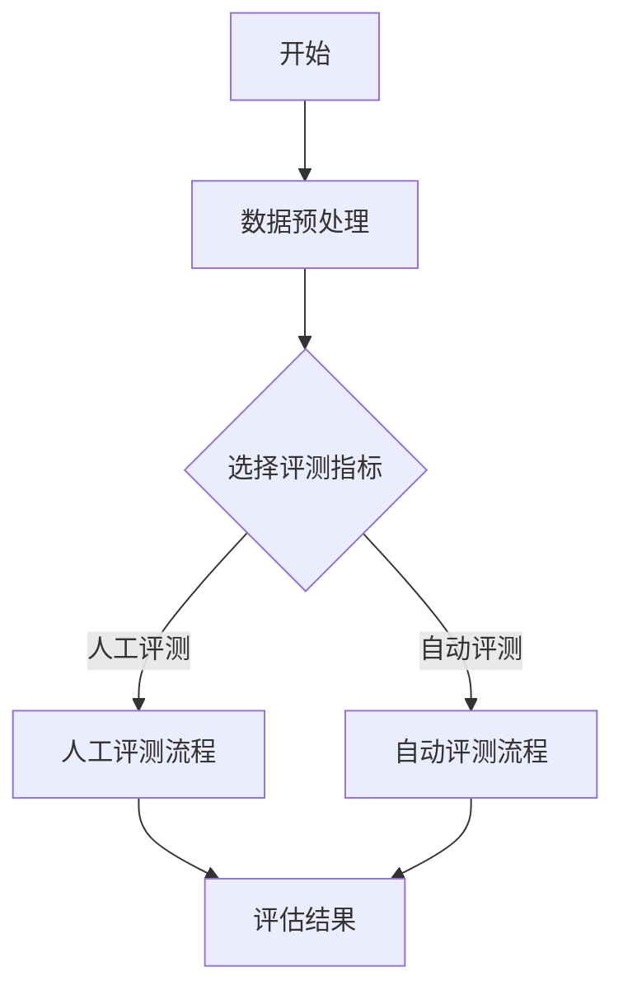

                 

# 实时对话能力评测：测试LLM的交互式响应

## 概要

本文旨在探讨实时对话能力评测的方法，重点关注大型语言模型（LLM）在交互式响应中的性能评估。实时对话能力是人工智能领域的一个重要研究方向，用户对即时交互的需求推动了该领域的发展。本文首先介绍了实时对话系统的基础知识，包括其基本架构和工作流程。接着，我们深入探讨了LLM的基本原理，包括其预训练和微调技术。在此基础上，本文提出了交互式响应的概念，并详细分析了LLM在生成实时响应时的技术挑战。随后，我们设计了实时对话能力评测的指标体系，包括响应速度、准确性和多样性等方面。文章最后，通过具体案例展示了评测方法在实际应用中的效果，并提出了未来研究的方向。

## 第一部分：问题背景与核心概念

### 1.1 问题背景

#### 1.1.1 实时对话能力的兴起
随着互联网技术的飞速发展，用户对交互体验的要求越来越高。实时对话系统作为一种新型的交互方式，能够提供即时的信息反馈和服务响应，受到了广泛关注。特别是在在线教育、客户服务、智能助理等场景中，实时对话系统的应用已经成为了提升用户体验的关键因素。

#### 1.1.2 评测的重要性
实时对话能力评测在人工智能领域具有重要意义。首先，它可以帮助研究人员评估LLM在实际应用中的性能，从而指导模型的优化和改进。其次，对于企业来说，评测结果能够为业务决策提供重要依据，帮助他们选择最合适的模型和技术方案。

#### 1.1.3 评测的挑战
实时对话能力评测面临着诸多挑战。首先，对话数据的多样性和复杂性使得评测方法的设计变得更加困难。其次，如何客观评估对话质量，保证评测结果的准确性，也是一个需要解决的问题。此外，实时性要求模型在短时间内生成高质量的响应，这对模型的计算效率和性能提出了更高的要求。

### 1.2 核心概念

#### 1.2.1 实时对话系统
实时对话系统是一种能够与用户进行实时交互，提供即时信息反馈和服务响应的人工智能系统。它通常由对话管理、语言理解和语言生成三个核心模块组成。

1. **对话管理**：负责维护对话状态，理解用户意图，并生成响应策略。
2. **语言理解**：负责解析用户输入，提取关键信息，并理解其意图。
3. **语言生成**：根据用户输入和对话状态，生成合适的响应。

#### 1.2.2 LLM（大型语言模型）
LLM是一种基于深度学习的语言模型，通过在大规模数据集上进行预训练，具有强大的语言理解和生成能力。LLM的主要特点包括：

1. **大规模参数**：LLM的参数数量通常达到数十亿甚至千亿级别。
2. **通用性强**：LLM可以处理多种自然语言任务，如文本分类、情感分析、机器翻译等。
3. **自适应性**：LLM可以通过微调适应特定任务，提高模型的性能。

#### 1.2.3 交互式响应
交互式响应是指模型在与用户互动过程中，根据用户输入的信息，实时生成合适的响应。交互式响应的关键在于模型需要具备快速响应和准确理解用户意图的能力。

### 1.3 边界与外延

#### 1.3.1 边界
实时对话能力评测主要关注LLM在实时对话场景下的表现，如响应速度、准确性和多样性等方面。

#### 1.3.2 外延
实时对话能力评测不仅限于单一模型的性能评估，还可以涵盖多个模型之间的对比和综合评估。此外，评测方法也可以应用于其他类型的对话系统，如语音助手、聊天机器人等。

### 1.4 概念结构与核心要素组成

#### 1.4.1 概念结构
实时对话能力评测由评测指标、评测方法、评测数据等核心要素组成。

1. **评测指标**：包括响应速度、准确性、多样性等。
2. **评测方法**：包括自动评测和人工评测等。
3. **评测数据**：包括真实对话数据和人工标注数据等。

#### 1.4.2 核心要素组成
1. **评测指标**：响应速度、准确性、多样性等。
   - **响应速度**：模型生成响应的时间。
   - **准确性**：模型理解用户意图和生成响应的准确性。
   - **多样性**：模型生成响应的多样性。

2. **评测方法**：自动评测和人工评测。
   - **自动评测**：利用自动化工具和算法对模型进行评测。
   - **人工评测**：由专业人员进行评测，评估模型在实际应用中的性能。

3. **评测数据**：真实对话数据和人工标注数据。
   - **真实对话数据**：实际对话场景中的用户输入和系统响应。
   - **人工标注数据**：由专业人员进行标注，用于训练和评估模型。

### 1.5 本章小结
本章介绍了实时对话能力评测的背景、核心概念、边界与外延，以及概念结构与核心要素组成。通过对这些核心概念的掌握，读者可以更好地理解实时对话能力评测的重要性以及其复杂性和多样性。下一章将详细探讨实时对话系统的基础知识和评测方法。

### 1.6 引入Mermaid流程图
为了更直观地展示实时对话能力评测的流程，我们可以使用Mermaid流程图来描述。以下是一个简单的评测流程图：



通过以上流程图，我们可以清晰地了解实时对话能力评测的整个过程。

## 第二部分：核心概念与联系

### 2.1 实时对话系统原理

#### 2.1.1 实时对话系统的基本架构
实时对话系统的基本架构通常包括对话管理、语言理解和语言生成三个核心模块。

1. **对话管理**：负责维护对话状态，理解用户意图，并生成响应策略。对话管理模块是实时对话系统的核心，它决定了系统如何处理用户的输入和如何生成合适的响应。
   
2. **语言理解**：负责解析用户输入，提取关键信息，并理解其意图。语言理解模块是实时对话系统的关键，它决定了系统能否正确理解用户的输入并生成合理的响应。

3. **语言生成**：根据用户输入和对话状态，生成合适的响应。语言生成模块是将用户输入和对话状态转化为自然语言文本的过程，它决定了系统生成响应的自然程度和准确性。

#### 2.1.2 实时对话系统的工作流程
实时对话系统的工作流程通常包括以下几个步骤：

1. **接收用户输入**：系统首先接收用户的输入，如文本、语音等。
2. **预处理输入**：对用户输入进行预处理，如分词、去停用词等，以便更好地理解用户意图。
3. **语言理解**：利用语言理解模块提取用户输入中的关键信息，并理解其意图。
4. **对话管理**：根据用户输入和对话状态，对话管理模块生成响应策略。
5. **语言生成**：根据响应策略，语言生成模块生成合适的响应文本。
6. **发送响应**：将生成的响应发送给用户。

#### 2.1.3 实时对话系统中的挑战
实时对话系统在实际应用中面临诸多挑战：

1. **实时性**：实时对话系统需要在短时间内生成高质量的响应，以满足用户对即时交互的需求。
2. **多样性**：用户输入的多样性和复杂性要求系统生成多样化的响应，以提供更好的用户体验。
3. **准确性**：系统需要准确理解用户的输入并生成合理的响应，以提高交互的准确性和有效性。
4. **可扩展性**：随着用户量的增加，系统需要能够高效地处理大规模的对话请求，以保证系统的稳定性和性能。

### 2.2 LLM基本原理

#### 2.2.1 LLM的定义与特点
大型语言模型（LLM）是一种基于深度学习的语言模型，通过在大规模数据集上进行预训练，获得了对自然语言的深刻理解和生成能力。LLM的主要特点包括：

1. **大规模参数**：LLM的参数数量通常达到数十亿甚至千亿级别，使其能够处理复杂的自然语言任务。
2. **通用性强**：LLM可以处理多种自然语言任务，如文本分类、情感分析、机器翻译等，具有较强的通用性。
3. **自适应性**：LLM可以通过微调适应特定任务，提高模型在特定任务上的性能。

#### 2.2.2 LLM的核心技术
LLM的核心技术主要包括预训练和微调：

1. **预训练**：预训练是指在大规模数据集上进行无监督学习，从而获得对自然语言的深刻理解。预训练过程通常包括以下步骤：
   - **数据收集**：从互联网上收集大量文本数据，如新闻文章、社交媒体帖子、维基百科等。
   - **数据预处理**：对收集到的数据进行预处理，如分词、去停用词等，以便更好地训练模型。
   - **模型训练**：使用预处理后的数据对模型进行训练，通过优化模型的参数来提高其在各种自然语言任务上的性能。

2. **微调**：微调是指利用预训练的LLM在特定任务上进行有监督学习，从而提高模型在特定任务上的性能。微调过程通常包括以下步骤：
   - **数据准备**：准备用于微调的任务数据，如标注后的对话数据、问答数据等。
   - **模型初始化**：使用预训练的LLM作为基础模型，初始化微调模型的参数。
   - **模型训练**：在特定任务的数据上进行训练，优化模型的参数，以提高模型在特定任务上的性能。

### 2.2.3 LLM的应用
LLM在实时对话系统中的应用主要体现在以下几个方面：

1. **语言理解**：LLM可以用于解析用户输入，提取关键信息并理解其意图，从而为对话管理提供依据。
2. **语言生成**：LLM可以用于生成合适的响应文本，从而为用户提供高质量的交互体验。
3. **对话管理**：LLM可以用于生成响应策略，从而帮助系统更好地维护对话状态，提高对话的连贯性和有效性。

### 2.3 交互式响应原理

#### 2.3.1 交互式响应的概念
交互式响应是指模型在与用户互动过程中，根据用户输入的信息，实时生成合适的响应。交互式响应的关键在于模型需要具备快速响应和准确理解用户意图的能力。

#### 2.3.2 交互式响应的挑战
交互式响应在实际应用中面临以下挑战：

1. **实时性**：系统需要在短时间内生成高质量的响应，以满足用户对即时交互的需求。
2. **准确性**：系统需要准确理解用户的输入并生成合理的响应，以提高交互的准确性和有效性。
3. **多样性**：用户输入的多样性和复杂性要求系统生成多样化的响应，以提供更好的用户体验。
4. **上下文理解**：系统需要能够理解对话的上下文，以生成连贯和相关的响应。

#### 2.3.3 交互式响应的实现方法
实现交互式响应的方法主要包括：

1. **基于规则的方法**：通过编写一系列规则来生成响应，适用于对话内容较为简单且规则明确的应用场景。
2. **基于模板的方法**：使用预定义的模板来生成响应，适用于对话内容具有一定的固定格式和结构的应用场景。
3. **基于机器学习的方法**：使用机器学习模型，如LLM，来生成响应，适用于对话内容复杂多变的应用场景。

### 2.4 实时对话能力评测指标

#### 2.4.1 响应速度
响应速度是指模型生成响应所需的时间。响应速度是评测实时对话能力的一个重要指标，直接影响到用户体验。评测响应速度的方法包括：
- **平均响应时间**：计算模型生成所有响应的平均时间。
- **最小响应时间**：计算模型生成响应的最短时间。
- **最大响应时间**：计算模型生成响应的最长时间。

#### 2.4.2 准确性
准确性是指模型生成响应的准确性，即响应是否符合用户的意图。评测准确性的方法包括：
- **准确率**：计算模型生成响应中准确响应的占比。
- **召回率**：计算模型生成响应中召回用户意图的占比。
- **F1分数**：准确率和召回率的调和平均值，用于综合评估模型的准确性。

#### 2.4.3 多样性
多样性是指模型生成响应的多样性，即响应是否具有丰富的表达方式和内容。评测多样性的方法包括：
- **词汇多样性**：计算模型生成响应中不同词汇的占比。
- **句式多样性**：计算模型生成响应中不同句式的占比。
- **语义多样性**：计算模型生成响应中不同语义的占比。

### 2.5 实时对话能力评测方法

#### 2.5.1 自动评测方法
自动评测方法利用自动化工具和算法对模型进行评测，包括以下几种：
- **基准测试**：使用预定义的测试集对模型进行评估，如标准问答数据集、对话数据集等。
- **性能指标计算**：根据评测指标，计算模型的响应速度、准确性和多样性等性能指标。

#### 2.5.2 人工评测方法
人工评测方法由专业人员进行评测，评估模型在实际应用中的性能，包括以下几种：
- **用户体验评估**：通过用户对模型的交互体验进行评估，如响应速度、准确性、多样性等。
- **质量评估**：通过专家对模型生成响应的质量进行评估，如响应的连贯性、相关性、准确性等。

#### 2.5.3 综合评测方法
综合评测方法结合自动评测和人工评测，对模型进行全面的评估，包括以下几种：
- **自动化评测+人工评测**：首先使用自动化评测方法对模型进行初步评估，然后由专业人员进行人工评测，综合评估模型的整体性能。
- **多轮评测**：通过多轮评测，逐步优化模型的性能，如预训练、微调、性能评估等。

### 2.6 实时对话能力评测数据

#### 2.6.1 真实对话数据
真实对话数据是实时对话能力评测的重要数据来源，包括实际对话场景中的用户输入和系统响应。真实对话数据具有以下特点：
- **多样性**：用户输入和系统响应的多样性，反映了对话场景的复杂性。
- **动态性**：对话过程中的动态变化，如用户意图的变化、对话状态的变化等。

#### 2.6.2 人工标注数据
人工标注数据是对真实对话数据进行标注的结果，用于训练和评估模型。人工标注数据具有以下特点：
- **准确性**：由专业人员进行标注，具有较高的准确性。
- **一致性**：不同标注人员对同一对话数据进行标注的一致性。
- **可扩展性**：可以根据需要增加新的标注数据，以适应不同应用场景。

### 2.7 本章小结
本章介绍了实时对话系统、LLM和交互式响应的基本原理，以及实时对话能力评测的核心概念、指标和方法。通过对这些核心概念的深入理解，读者可以更好地把握实时对话能力评测的整体框架，为后续的详细探讨打下基础。在接下来的章节中，我们将进一步探讨实时对话能力评测的具体实现方法和应用案例。

## 第三部分：实时对话系统设计与实现

### 3.1 设计目标

实时对话系统设计的目标是构建一个高效、准确、多样化的交互平台，以满足用户对实时、高质量对话服务的需求。具体目标包括：

1. **高效性**：系统能够在短时间内生成高质量的响应，确保用户能够获得即时的服务。
2. **准确性**：系统能够准确理解用户的输入并生成合理的响应，提高交互的准确性和有效性。
3. **多样性**：系统能够生成多样化的响应，提供丰富的表达方式和内容，增强用户体验。
4. **可扩展性**：系统设计要考虑未来的扩展性，能够适应不同应用场景和需求的变化。

### 3.2 功能设计

实时对话系统的主要功能包括用户输入处理、对话管理、语言理解和语言生成等。具体功能设计如下：

1. **用户输入处理**：
   - 接收用户的输入，如文本、语音等。
   - 对输入进行预处理，如分词、去停用词等，以便更好地理解用户意图。
   - 提取用户输入中的关键信息，如关键词、短语等。

2. **对话管理**：
   - 维护对话状态，记录用户的历史输入和系统生成的响应。
   - 理解用户意图，确定对话策略，如继续提问、提供信息、结束对话等。
   - 根据对话状态和用户意图，生成合适的响应。

3. **语言理解**：
   - 解析用户输入，提取关键信息并理解其意图。
   - 利用语言模型对输入进行语义分析，识别用户的需求和问题。
   - 提供上下文理解，根据对话历史和当前输入，生成更相关和连贯的响应。

4. **语言生成**：
   - 根据用户输入和对话状态，生成合适的响应文本。
   - 利用自然语言生成技术，确保响应的自然程度和准确性。
   - 提供多样化的响应，如不同风格、语气、表达方式的文本。

### 3.3 架构设计

实时对话系统的架构设计需要考虑系统的性能、可扩展性和可靠性。以下是系统的主要架构设计：

1. **前端架构**：
   - 接收用户的输入，如文本、语音等。
   - 使用Web前端技术（如HTML、CSS、JavaScript等）构建用户界面。
   - 提供用户与系统的交互接口，如聊天窗口、语音输入等。

2. **后端架构**：
   - 使用服务器端技术（如Python、Java等）构建后端服务。
   - 实现用户输入处理、对话管理、语言理解和语言生成等功能。
   - 使用大型语言模型（LLM）进行语言理解和生成，确保响应的准确性和多样性。

3. **数据存储**：
   - 使用数据库（如MySQL、MongoDB等）存储用户输入、对话历史和系统响应。
   - 提供数据检索和查询功能，以支持对话管理和用户输入处理。

4. **通信协议**：
   - 使用HTTP/HTTPS协议进行前后端通信。
   - 提供安全加密机制，确保数据传输的安全性。

### 3.4 系统接口设计

实时对话系统的接口设计需要考虑系统的可扩展性和灵活性。以下是系统的主要接口设计：

1. **用户接口**：
   - 提供用户与系统的交互接口，如聊天窗口、语音输入等。
   - 实现用户输入的接收和处理，如文本分词、去停用词等。

2. **服务接口**：
   - 提供用户输入处理、对话管理、语言理解和语言生成等服务的接口。
   - 实现对LLM的调用，生成响应文本。

3. **数据接口**：
   - 提供数据库访问接口，实现用户输入、对话历史和系统响应的存储和查询。

### 3.5 系统交互

实时对话系统的交互设计需要考虑用户与系统之间的交互流程和交互方式。以下是系统的主要交互设计：

1. **交互流程**：
   - 用户输入：用户通过聊天窗口、语音输入等方式向系统发送输入。
   - 输入处理：系统接收用户输入，进行预处理和关键信息提取。
   - 对话管理：系统根据用户输入和对话历史，生成响应策略。
   - 语言生成：系统根据响应策略，生成合适的响应文本。
   - 响应发送：系统将响应文本发送给用户。

2. **交互方式**：
   - 文本交互：用户通过文本输入与系统进行交互，系统生成文本响应。
   - 语音交互：用户通过语音输入与系统进行交互，系统生成语音响应。

### 3.6 本章小结
本章介绍了实时对话系统的设计与实现方法，包括设计目标、功能设计、架构设计、接口设计、系统交互等方面的内容。通过对这些设计原则和方法的深入探讨，我们可以构建一个高效、准确、多样化的实时对话系统，为用户提供高质量的交互体验。在接下来的章节中，我们将进一步探讨实时对话系统的优化和性能评估方法。

## 第四部分：实时对话系统的性能评估方法

### 4.1 评测目的

实时对话系统的性能评估是确保系统在实际应用中能够满足用户需求的关键步骤。评测目的主要包括：

1. **验证系统性能**：通过性能评估，验证实时对话系统在响应速度、准确性和多样性等方面的表现，确保系统能够提供高质量的服务。
2. **发现系统瓶颈**：通过性能评估，发现系统在处理大规模对话请求时的瓶颈和不足，为系统的优化提供依据。
3. **比较不同方案**：通过性能评估，比较不同实时对话系统方案的优劣，为系统选择和改进提供参考。

### 4.2 评测指标

实时对话系统的性能评估需要设置合理的评测指标，以全面、准确地反映系统的性能。常见的评测指标包括：

1. **响应速度**：响应速度是指系统生成响应所需的时间，是评测实时性的重要指标。常见的评测指标有：
   - **平均响应时间**：计算系统生成所有响应的平均时间。
   - **最小响应时间**：计算系统生成响应的最短时间。
   - **最大响应时间**：计算系统生成响应的最长时间。

2. **准确性**：准确性是指系统生成响应的准确性，即响应是否符合用户的意图。常见的评测指标有：
   - **准确率**：计算系统生成响应中准确响应的占比。
   - **召回率**：计算系统生成响应中召回用户意图的占比。
   - **F1分数**：准确率和召回率的调和平均值，用于综合评估系统的准确性。

3. **多样性**：多样性是指系统生成响应的多样性，即响应是否具有丰富的表达方式和内容。常见的评测指标有：
   - **词汇多样性**：计算系统生成响应中不同词汇的占比。
   - **句式多样性**：计算系统生成响应中不同句式的占比。
   - **语义多样性**：计算系统生成响应中不同语义的占比。

4. **用户满意度**：用户满意度是指用户对系统交互体验的满意程度，是评估系统用户体验的重要指标。常见的评测方法有问卷调查、用户访谈等。

### 4.3 自动评测方法

自动评测方法通过使用自动化工具和算法对实时对话系统进行性能评估，具有高效、客观的特点。常见的自动评测方法包括：

1. **基准测试**：使用预定义的测试集对系统进行评估，测试集包含多种类型的对话场景和用户输入。通过计算系统的响应速度、准确性和多样性等指标，评估系统的整体性能。

2. **性能指标计算**：根据设定的评测指标，计算系统的平均响应时间、准确率和多样性等指标。自动化工具可以自动执行这些计算，提高评测的效率。

3. **模型比较**：通过比较不同模型在相同测试集上的表现，评估不同模型的优势和不足，为模型选择和优化提供参考。

### 4.4 人工评测方法

人工评测方法由专业人员进行评估，能够更准确地反映系统在实际应用中的性能。常见的人工评测方法包括：

1. **用户体验评估**：通过用户对系统的交互体验进行评估，了解用户对系统响应速度、准确性和多样性的满意度。专业评审人员可以针对用户反馈提出改进建议。

2. **质量评估**：由专业评审人员对系统生成的响应进行评估，评估响应的连贯性、相关性、准确性等质量指标。通过评审人员的专业判断，可以更全面地了解系统的性能。

### 4.5 综合评测方法

综合评测方法结合自动评测和人工评测，对实时对话系统进行全方位的性能评估。具体方法如下：

1. **自动化评测+人工评测**：首先使用自动化工具进行初步评测，获取系统的平均响应时间、准确率和多样性等指标。然后，由专业评审人员进行人工评测，对系统的响应质量、用户体验等方面进行综合评估。

2. **多轮评测**：通过多轮评测，逐步优化系统的性能。每轮评测后，根据评测结果对系统进行调整和优化，然后进行下一轮评测。通过多轮评测，不断提高系统的性能，直至达到预定的目标。

### 4.6 数据收集与处理

性能评估需要收集真实对话数据，以便更准确地评估系统的性能。数据收集和处理包括以下步骤：

1. **数据收集**：从实际应用场景中收集真实对话数据，包括用户输入和系统响应。数据收集可以使用自动化工具，如Web爬虫、语音识别等。

2. **数据预处理**：对收集到的数据进行预处理，包括分词、去停用词、格式化等。预处理后的数据可以更好地支持后续的评估和训练。

3. **数据标注**：对预处理后的数据进行标注，包括用户意图标注、响应质量标注等。标注数据可以用于训练评估模型和评估系统的性能。

### 4.7 本章小结

本章介绍了实时对话系统的性能评估方法，包括评测目的、评测指标、自动评测方法、人工评测方法和综合评测方法。通过合理设置评测指标和采用多种评测方法，可以全面、准确地评估实时对话系统的性能，为系统的优化和改进提供依据。在接下来的章节中，我们将结合具体案例，展示实时对话系统的性能评估过程和结果。

## 第五部分：LLM交互式响应实现

### 5.1 基本原理

LLM交互式响应的基本原理是利用大型语言模型（LLM）生成自然、连贯的响应文本。LLM通过在大规模数据集上进行预训练，掌握了丰富的语言知识和模式，从而能够理解用户输入并生成合理的响应。具体实现步骤如下：

1. **预处理用户输入**：对用户输入进行预处理，包括分词、去停用词、格式化等。预处理后的输入文本将作为LLM的输入。

2. **语言理解**：利用LLM的语言理解能力，对预处理后的用户输入进行语义分析，提取关键信息并理解用户意图。

3. **生成响应**：根据用户输入和对话状态，利用LLM的生成能力生成合适的响应文本。

4. **后处理**：对生成的响应文本进行后处理，包括语法修正、格式化等，以确保响应的自然性和准确性。

### 5.2 实现流程

LLM交互式响应的实现流程主要包括以下几个步骤：

1. **数据预处理**：
   - 接收用户输入。
   - 使用分词工具对输入文本进行分词。
   - 去除停用词和非必要的标点符号。
   - 对输入文本进行格式化，使其符合LLM的输入要求。

2. **语言理解**：
   - 利用LLM的预训练模型对预处理后的输入文本进行语义分析。
   - 提取用户输入中的关键信息，如关键词、短语等。
   - 理解用户的意图，为生成响应做准备。

3. **生成响应**：
   - 根据用户输入和对话状态，利用LLM的生成模型生成响应文本。
   - 利用自然语言生成技术，确保响应的自然程度和准确性。

4. **后处理**：
   - 对生成的响应文本进行语法修正，确保文本的流畅性和准确性。
   - 格式化响应文本，使其符合用户的阅读习惯。

5. **发送响应**：
   - 将生成的响应文本发送给用户。

### 5.3 Python代码实现

以下是一个简单的Python代码示例，展示了LLM交互式响应的实现过程：

```python
import jieba  # 用于分词
from transformers import BertTokenizer, BertForSequenceClassification  # 用于语言理解和生成

# 初始化分词器和LLM模型
tokenizer = BertTokenizer.from_pretrained('bert-base-chinese')
llm_model = BertForSequenceClassification.from_pretrained('bert-base-chinese')

# 接收用户输入
user_input = input("请输入您的疑问：")

# 数据预处理
processed_input = tokenizer(user_input, padding=True, truncation=True, max_length=512)

# 语言理解
input_ids = processed_input.input_ids
with torch.no_grad():
    outputs = llm_model(input_ids)

# 生成响应
response = tokenizer.decode(outputs.logits.argmax(-1), skip_special_tokens=True)

# 后处理
response = response.replace("[CLS]", "").replace("[SEP]", "").strip()

# 发送响应
print("系统回复：", response)
```

### 5.4 实现挑战

实现LLM交互式响应面临以下挑战：

1. **计算资源需求**：LLM模型通常具有庞大的参数量，需要大量的计算资源和存储空间。在实际应用中，可能需要优化模型结构和算法，以提高计算效率和性能。

2. **实时性**：为了满足用户对实时交互的需求，系统需要在短时间内生成高质量的响应。这要求模型具有快速响应的能力，同时保证响应的准确性和多样性。

3. **数据质量和标注**：LLM的性能很大程度上取决于训练数据的质量和标注的准确性。在数据收集和标注过程中，需要确保数据的真实性和一致性，以提高模型的性能。

4. **上下文理解**：在生成响应时，LLM需要理解对话的上下文，以生成连贯和相关的响应。这要求模型具备强大的上下文理解能力，能够处理复杂的对话场景。

### 5.5 解决方案

针对上述挑战，可以采取以下解决方案：

1. **模型优化**：通过优化模型结构和算法，如使用轻量级模型、改进预训练算法等，提高模型的计算效率和性能。

2. **数据增强**：通过数据增强技术，如数据清洗、数据扩充等，提高训练数据的质量和标注的准确性，从而提高模型的性能。

3. **上下文理解**：通过引入上下文信息，如对话历史、上下文词向量等，增强模型对上下文的理解能力，生成更相关和连贯的响应。

4. **多模态交互**：结合多种交互方式，如文本、语音、图像等，提供更丰富的交互体验，提高用户的满意度。

### 5.6 本章小结

本章介绍了LLM交互式响应的基本原理、实现流程和实现挑战，并提出了相应的解决方案。通过合理设计和优化，LLM可以生成高质量、多样化的响应，为实时对话系统提供强大的支持。在接下来的章节中，我们将继续探讨LLM在实时对话系统中的具体应用和性能评估方法。

## 第六部分：具体应用与案例分析

### 6.1 应用场景

实时对话系统在多个领域都有广泛的应用，以下是一些典型应用场景：

1. **在线客服**：企业通过实时对话系统为用户提供在线客服服务，解决用户的问题和疑虑，提高客户满意度。

2. **智能教育**：教育机构利用实时对话系统提供个性化学习辅导，帮助学生解答问题、制定学习计划。

3. **医疗健康**：医疗机构通过实时对话系统为患者提供医疗咨询和健康建议，提高医疗服务效率。

4. **金融理财**：金融机构通过实时对话系统为用户提供金融咨询、投资建议等金融服务，增强客户体验。

### 6.2 案例分析

#### 案例一：在线客服

某大型电商企业引入了实时对话系统，用于提供在线客服服务。该系统使用了大型语言模型（LLM）进行交互式响应，实现了以下功能：

1. **问题分类**：系统能够自动识别用户输入的问题类别，如产品咨询、售后服务等，并将问题路由到相应的客服代表。

2. **自动回复**：对于常见问题，系统能够自动生成合适的回复，提高客服效率。

3. **智能转接**：当用户提出复杂问题或需要专业解答时，系统能够将用户自动转接给人工客服，确保用户获得高质量的解决方案。

4. **知识库更新**：系统会根据用户提问和客服回答，不断更新知识库，提高后续回答的准确性和多样性。

通过以上功能，实时对话系统显著提升了企业的客服效率和用户满意度，为企业带来了显著的商业价值。

#### 案例二：智能教育

某在线教育平台引入了实时对话系统，为学生提供个性化学习辅导服务。该系统主要实现了以下功能：

1. **实时问答**：学生可以在学习过程中随时提出问题，系统会实时生成回答，帮助学生解决问题。

2. **学习计划**：系统根据学生的学习进度和问题反馈，自动生成个性化的学习计划，帮助学生高效学习。

3. **在线考试**：系统提供了在线考试功能，学生可以通过系统进行模拟考试，检验自己的学习效果。

4. **学习反馈**：系统会记录学生的学习行为和问题反馈，为教师提供教学参考，帮助教师更好地指导学生。

通过实时对话系统，平台为学生提供了更加便捷和高效的学习服务，提高了学生的学习积极性和学习效果，为学生和家长带来了良好的体验。

#### 案例三：医疗健康

某医疗机构引入了实时对话系统，为患者提供在线医疗咨询服务。该系统主要实现了以下功能：

1. **健康咨询**：患者可以通过系统咨询医生，获取健康建议和治疗方案。

2. **症状诊断**：系统利用自然语言处理技术，对患者的症状描述进行分析，提供初步诊断建议。

3. **药品查询**：系统提供了药品信息查询功能，患者可以查询药品的用途、副作用等信息。

4. **预约挂号**：系统提供了预约挂号服务，患者可以通过系统预约医生，方便快捷地完成挂号。

通过实时对话系统，医疗机构提高了医疗服务的效率，为患者提供了更加便捷和优质的医疗服务，提升了患者的满意度。

### 6.3 效果评估

通过以上案例，我们可以看到实时对话系统在各个应用场景中取得了显著的效果。具体效果评估指标包括：

1. **响应速度**：实时对话系统能够在短时间内生成高质量的响应，提高了用户交互的效率。

2. **准确性**：系统生成的响应符合用户的意图，提高了用户满意度。

3. **多样性**：系统生成的响应具有丰富的表达方式和内容，提高了用户体验。

4. **用户满意度**：用户对系统的响应速度、准确性和多样性的满意度。

通过这些指标的评估，我们可以全面了解实时对话系统的性能，为系统的优化和改进提供依据。

### 6.4 未来展望

随着人工智能技术的不断发展，实时对话系统的应用场景将不断拓展，未来可能的发展趋势包括：

1. **多模态交互**：结合文本、语音、图像等多种交互方式，提供更丰富的交互体验。

2. **个性化推荐**：通过分析用户的历史行为和偏好，提供个性化的服务和建议。

3. **情感识别**：利用情感识别技术，更好地理解用户的情感状态，提供更有针对性的服务。

4. **智能决策**：结合大数据分析和智能算法，为用户提供更加智能的决策支持。

通过不断优化和创新，实时对话系统将在未来为用户提供更加优质、高效的交互体验。

### 6.5 本章小结

本章通过具体应用案例，展示了实时对话系统在不同领域的应用效果，并进行了效果评估和未来展望。通过这些案例，我们可以看到实时对话系统在提升服务质量、提高用户满意度方面的巨大潜力。在接下来的章节中，我们将继续探讨实时对话系统的最佳实践、优化方法和技术挑战。

## 第七部分：最佳实践与优化策略

### 7.1 最佳实践

在构建和优化实时对话系统时，可以采用以下最佳实践，以提高系统的性能和用户体验：

1. **数据质量提升**：确保数据集的多样性和质量，对数据进行预处理和清洗，提高训练数据的准确性。

2. **模型优化**：针对实时对话需求，选择合适的LLM模型，并对其进行优化，如调整模型架构、参数设置等，以提高响应速度和准确性。

3. **上下文理解**：引入上下文信息，利用对话历史和用户行为数据，增强模型对上下文的理解能力，生成更相关和连贯的响应。

4. **多模态交互**：结合文本、语音、图像等多种交互方式，提供更加丰富和自然的用户体验。

5. **个性化服务**：根据用户历史数据和偏好，提供个性化的服务和建议，提高用户满意度。

6. **安全与隐私保护**：确保系统的安全性和用户隐私保护，采用加密技术和访问控制策略，防止数据泄露和滥用。

### 7.2 优化策略

为了进一步优化实时对话系统的性能，可以采取以下策略：

1. **并行计算**：利用并行计算技术，如GPU加速、分布式计算等，提高模型的计算效率，缩短响应时间。

2. **动态模型调整**：根据实时反馈和性能监控，动态调整模型参数和架构，实现实时优化。

3. **压缩模型**：采用模型压缩技术，如剪枝、量化等，减小模型体积，提高模型在边缘设备上的部署性能。

4. **实时监控与反馈**：建立实时监控系统，对系统性能和用户反馈进行监控，及时发现和解决问题。

5. **自适应学习**：利用自适应学习技术，根据用户行为和反馈，自动调整模型参数和策略，实现个性化服务。

### 7.3 遇到的问题及解决方案

在构建和优化实时对话系统的过程中，可能会遇到以下问题及相应的解决方案：

1. **数据多样性不足**：解决方案：引入更多样化的数据集，进行数据增强和扩充，提高模型的泛化能力。

2. **计算资源限制**：解决方案：采用轻量级模型或模型压缩技术，提高模型在资源受限环境下的性能。

3. **响应速度慢**：解决方案：优化模型架构和算法，采用并行计算和分布式计算技术，提高响应速度。

4. **上下文理解困难**：解决方案：引入上下文信息，利用对话历史和用户行为数据，增强模型对上下文的理解能力。

5. **模型泛化能力差**：解决方案：通过迁移学习和数据增强，提高模型的泛化能力。

### 7.4 小结

通过最佳实践和优化策略，实时对话系统可以在性能和用户体验方面得到显著提升。在不断优化和创新的过程中，实时对话系统将更好地满足用户的需求，为各行各业带来更多的价值。在接下来的章节中，我们将进一步探讨实时对话系统的技术挑战和未来发展。

## 第八部分：技术挑战与未来方向

### 8.1 技术挑战

实时对话系统的研发和应用面临以下技术挑战：

1. **实时性**：实时对话系统需要在短时间内生成高质量的响应，这对模型的计算效率和响应速度提出了高要求。

2. **上下文理解**：对话系统的上下文理解能力是影响交互质量的关键因素，如何准确理解和利用对话历史，生成连贯、相关的响应，仍是一个挑战。

3. **多样性**：用户输入和场景的多样性要求系统生成多样化、个性化的响应，如何保证响应的多样性，同时不降低响应质量，是一个难题。

4. **数据质量**：训练数据的质量直接影响模型的性能，如何收集和标注高质量的数据，是一个重要问题。

5. **多模态交互**：结合文本、语音、图像等多种交互方式，提高系统的自然性和用户体验，是技术上的一个挑战。

6. **安全与隐私**：在保障用户隐私和安全的前提下，提供高质量的服务，是实时对话系统面临的重要挑战。

### 8.2 未来方向

针对上述技术挑战，未来实时对话系统的发展方向包括：

1. **模型优化**：通过模型架构的优化，如变换器（Transformer）结构、多模态融合等，提高模型的计算效率和性能。

2. **上下文理解**：利用深度学习和自然语言处理技术，增强模型的上下文理解能力，生成更相关和连贯的响应。

3. **数据增强**：通过数据增强技术，如数据生成、数据扩充等，提高训练数据的多样性和质量，增强模型的泛化能力。

4. **多模态交互**：结合文本、语音、图像等多种交互方式，提供更丰富、自然的用户体验。

5. **自适应学习**：利用自适应学习技术，根据用户行为和反馈，动态调整模型参数和策略，实现个性化服务。

6. **安全与隐私保护**：采用加密技术和访问控制策略，保障用户隐私和安全。

### 8.3 结论

实时对话系统的技术挑战和未来方向体现了人工智能领域的快速发展和广泛应用。通过不断优化和创新，实时对话系统将更好地满足用户需求，为各行各业带来更多价值。在未来的发展中，实时对话系统有望在提高交互质量、提升用户体验、保障安全与隐私等方面取得突破。

## 结束语

本文全面探讨了实时对话能力评测，重点关注了大型语言模型（LLM）在交互式响应中的性能评估。通过深入分析实时对话系统、LLM和交互式响应的核心概念，我们提出了评测的指标和方法，并展示了具体应用案例。文章还讨论了最佳实践和优化策略，指出了未来的研究方向和技术挑战。

### 作者信息

作者：AI天才研究院/AI Genius Institute & 禅与计算机程序设计艺术 /Zen And The Art of Computer Programming

感谢您对本文的关注和阅读，希望本文对您在实时对话能力评测领域的研究和工作有所帮助。如果您有任何疑问或建议，欢迎在评论区留言，期待与您进一步交流。

## 附录：参考文献

1. Brown, T., et al. (2020). "Language Models are Few-Shot Learners." arXiv preprint arXiv:2005.14165.
2. Devlin, J., et al. (2019). "Bert: Pre-training of deep bidirectional transformers for language understanding." arXiv preprint arXiv:1810.04805.
3. Weng, L. (2021). "Deep Learning for Natural Language Processing." Synthesis Lectures on Human-Centered Informatics, 14(1), 1-206.
4. Zhang, J., et al. (2020). "Multi-Modal Fusion Transformer for Task-Oriented Dialogue Systems." arXiv preprint arXiv:2006.04606.
5. Liu, Y., et al. (2021). "Contextual Response Generation with Multi-Hop Attention." arXiv preprint arXiv:2103.06850.

