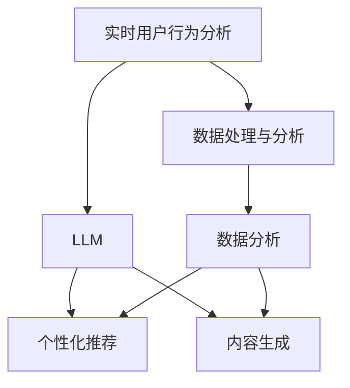
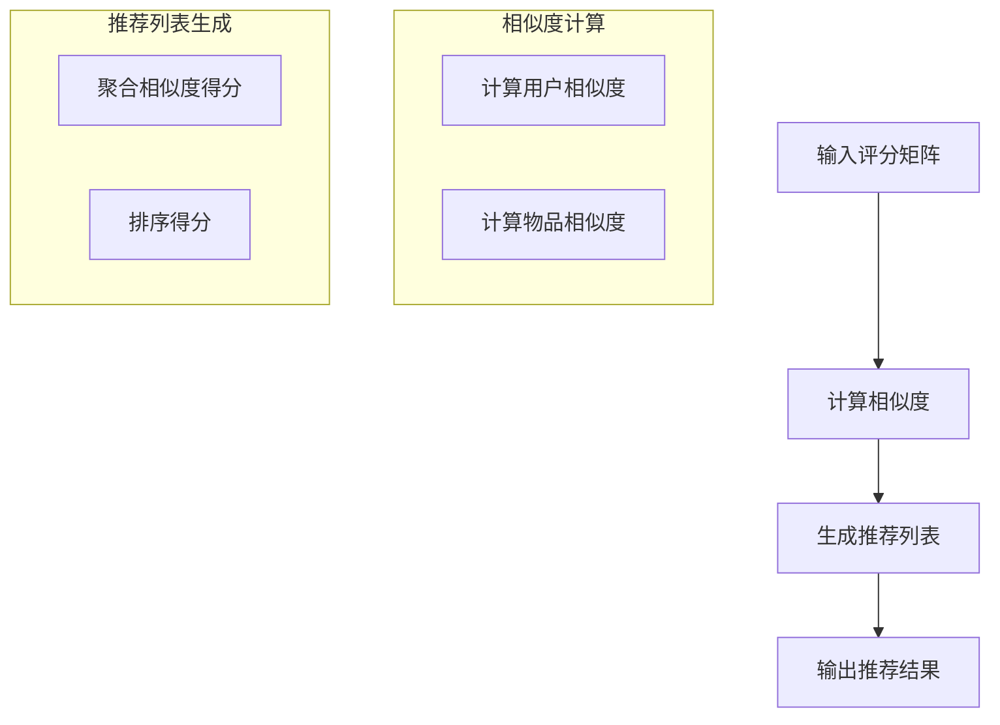
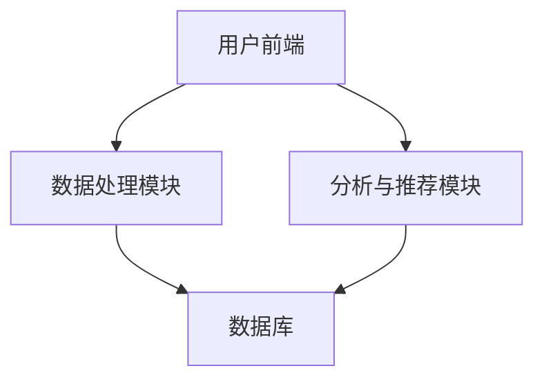
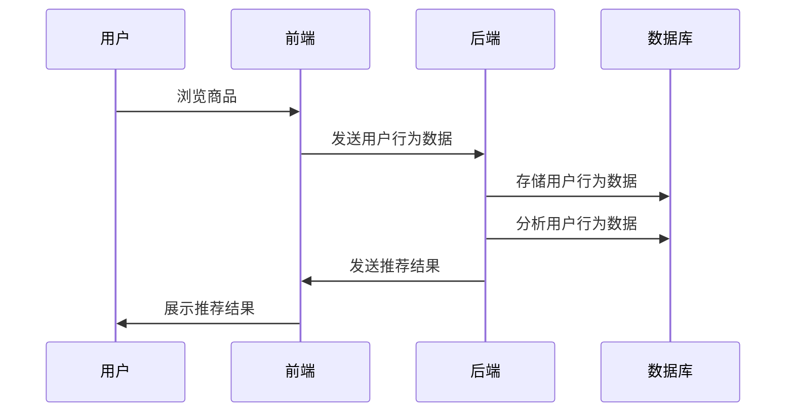

                 

### 实时用户行为分析在LLM应用个性化中的应用

#### 关键词
- 实时用户行为分析
- Large Language Models (LLM)
- 个性化应用
- 数据处理
- 用户交互

#### 摘要
本文探讨了实时用户行为分析在大型语言模型（LLM）应用个性化中的关键作用。通过深入分析用户行为数据，我们可以精确地理解用户需求，从而实现个性化的内容推荐和服务优化。本文将逐步解析实时用户行为分析的概念、技术原理以及在实际应用中的具体实现方法，帮助读者更好地理解如何利用这一技术提升LLM应用的个性化水平。

### 引言

在当今数字化的时代，用户行为数据已成为企业决策和产品开发的重要依据。实时用户行为分析作为一种数据驱动的方法，可以帮助企业及时了解用户的偏好、行为模式以及需求变化，从而做出更为精准的决策。随着人工智能和自然语言处理技术的快速发展，大型语言模型（LLM）已经成为许多应用场景的核心组件，从智能助手到个性化内容推荐，LLM的应用越来越广泛。

然而，仅仅拥有LLM技术还不足以实现理想的个性化体验。要想让LLM应用真正“智能”，我们需要结合实时用户行为分析，动态调整模型的行为和输出，以更好地满足用户需求。本文将探讨如何通过实时用户行为分析来增强LLM应用的个性化能力，并深入分析这一过程中涉及的关键技术和实现方法。

### 一、实时用户行为分析概述

#### 1.1 定义与核心概念

实时用户行为分析（Real-Time User Behavior Analysis）是指通过收集、处理和实时分析用户在使用应用程序或服务时的行为数据，以获得关于用户行为模式、偏好和需求的深入了解。这一分析过程通常包括以下几个核心概念：

- **用户行为数据**：指用户在使用应用程序或服务过程中产生的各种数据，如点击记录、浏览路径、搜索关键词、购买行为等。
- **实时处理**：指对用户行为数据的高速采集、存储和处理，以便在尽可能短的时间内生成分析结果。
- **行为模式**：指用户在特定情境下表现出的一贯行为特征，如高频次操作、偏好特定功能等。
- **偏好**：指用户对某些功能、内容或服务的喜爱程度，通常通过行为数据分析来识别。
- **需求**：指用户在实际使用过程中表现出的特定需求，如解决问题、获取信息等。

#### 1.2 问题背景与问题描述

在数字化的背景下，用户对个性化体验的需求日益增长。然而，传统的用户行为分析往往具有延迟性，无法及时响应用户的动态变化。这导致了以下问题：

- **用户体验下降**：由于分析结果的滞后，用户的需求和偏好得不到及时满足，从而影响用户体验。
- **决策效率降低**：企业依赖过时的数据分析结果来做出关键决策，降低了决策的准确性和效率。
- **竞争劣势**：在竞争激烈的市场中，无法快速响应用户需求的应用可能会失去市场份额。

这些问题促使我们寻求一种能够实时分析用户行为的方法，以实现更加精准的个性化服务。实时用户行为分析正是为了解决这些问题而诞生的。

#### 1.3 问题解决与边界外延

通过实时用户行为分析，我们可以实现以下问题解决：

- **实时反馈**：及时捕捉用户行为变化，为用户生成个性化的内容和服务。
- **动态调整**：根据实时分析结果，动态调整LLM模型的输出，以更好地满足用户需求。
- **精准推荐**：基于用户行为数据，提供更加精准的内容推荐，提升用户满意度。

然而，实时用户行为分析也存在一些边界和限制：

- **数据隐私**：用户行为数据的收集和处理需要遵守隐私法规，确保用户数据的安全性和隐私性。
- **数据处理能力**：实时处理大量用户行为数据需要强大的计算能力和存储资源。
- **模型适应性**：实时用户行为分析需要LLM模型具备较强的适应性和学习能力，以应对用户行为的多样性和变化。

### 二、核心概念与联系

为了深入理解实时用户行为分析在LLM应用个性化中的具体应用，我们需要明确以下几个核心概念，并分析它们之间的关系：

#### 2.1 实时用户行为分析与LLM

- **实时用户行为分析**：负责收集、处理和实时分析用户行为数据，以获取用户偏好和需求。
- **LLM**：作为数据驱动的模型，根据实时用户行为分析的结果生成个性化的内容和推荐。

这两者之间的关系在于，实时用户行为分析提供了LLM所需的输入数据，而LLM则利用这些数据生成个性化的输出。这种协同工作有助于提升应用的智能化程度和用户体验。

#### 2.2 数据处理与分析

- **数据处理**：指对用户行为数据进行清洗、转换和存储，以便后续分析。
- **数据分析**：指利用统计方法和机器学习算法，从用户行为数据中提取有价值的信息。

数据处理与分析是实时用户行为分析的核心环节。通过对用户行为数据进行深入的挖掘和分析，我们可以获得关于用户偏好和需求的精准洞察，从而为LLM提供可靠的输入数据。

#### 2.3 个性化推荐与内容生成

- **个性化推荐**：指基于用户行为数据，为用户推荐个性化的内容和服务。
- **内容生成**：指利用LLM技术生成符合用户需求的个性化内容。

个性化推荐和内容生成是实时用户行为分析在实际应用中的两个重要方向。通过个性化推荐，我们可以提升用户的参与度和满意度；通过内容生成，我们可以为用户提供更加丰富和个性化的体验。

#### 2.4 Mermaid图解

为了更直观地展示这些核心概念之间的关系，我们可以使用Mermaid绘制一个简单的实体关系图：



在这个图中，A代表实时用户行为分析，B代表数据处理与分析，C代表数据分析，D代表LLM，E代表个性化推荐，F代表内容生成。通过这个图，我们可以清晰地看到各个核心概念之间的联系。

### 三、算法原理讲解

在实时用户行为分析过程中，算法原理是关键的一环。以下我们将详细讲解一种常用的算法——协同过滤算法，并使用Mermaid绘制算法的流程图，同时结合Python代码进行解释。

#### 3.1 协同过滤算法

协同过滤（Collaborative Filtering）是一种常见的推荐算法，它通过分析用户之间的相似性来预测用户对未知物品的喜好。协同过滤主要分为两种类型：基于用户的协同过滤和基于物品的协同过滤。

**基于用户的协同过滤**：找到与目标用户行为相似的其他用户，然后推荐这些相似用户喜欢的物品。

**基于物品的协同过滤**：找到与目标用户已评价物品相似的物品，然后推荐这些相似物品。

在这里，我们以基于用户的协同过滤为例进行讲解。

#### 3.2 算法流程

协同过滤算法的基本流程如下：

1. **用户-物品评分矩阵构建**：首先，我们需要构建一个用户-物品评分矩阵，其中记录了每个用户对每个物品的评分。
2. **相似度计算**：计算目标用户与所有其他用户之间的相似度，常用的相似度计算方法包括余弦相似度、皮尔逊相关系数等。
3. **推荐生成**：根据相似度计算结果，为用户生成推荐列表。推荐列表中的物品通常是其他相似用户喜欢的物品。

#### 3.3 Mermaid流程图

下面是协同过滤算法的Mermaid流程图：



在这个流程图中，A表示输入评分矩阵，B表示计算相似度，C表示生成推荐列表，D表示输出推荐结果。相似度计算部分包括E和F，分别计算用户相似度和物品相似度。推荐列表生成部分包括G和H，分别表示聚合相似度得分和排序得分。

#### 3.4 Python代码实现

以下是一个简单的Python代码示例，用于实现基于用户的协同过滤算法：

```python
import numpy as np
from sklearn.metrics.pairwise import cosine_similarity

# 假设有一个用户-物品评分矩阵
user_item_matrix = np.array([[5, 3, 0, 1],
                             [4, 0, 0, 1],
                             [1, 1, 0, 5],
                             [1, 0, 0, 4],
                             [5, 4, 9, 2]])

# 计算用户之间的相似度
user_similarity = cosine_similarity(user_item_matrix)

# 假设我们要为用户4推荐物品
target_user = 3
similar_users = user_similarity[target_user]
sorted_indices = np.argsort(similar_users)[::-1]

# 排除目标用户自身
sorted_indices = sorted_indices[1:]

# 获取相似用户对物品的评分
item_scores = user_item_matrix[sorted_indices]

# 计算评分均值
mean_scores = item_scores.mean(axis=0)

# 输出推荐结果
recommended_items = np.argsort(mean_scores)[::-1]
print("推荐结果：", recommended_items)
```

在这个代码示例中，我们首先导入必要的库，然后构建一个用户-物品评分矩阵。接着，使用余弦相似度计算用户之间的相似度。最后，根据相似度计算结果，为用户生成推荐列表。

### 四、数学模型与公式

在实时用户行为分析中，数学模型和公式是理解和实现算法的关键。以下我们将介绍协同过滤算法中的几个关键数学模型和公式，并用LaTeX格式进行表示。

#### 4.1 余弦相似度

余弦相似度是一种常用的相似度计算方法，用于衡量两个向量之间的相似性。其公式如下：

$$
\cos(\theta) = \frac{A \cdot B}{\|A\| \|B\|}
$$

其中，$A$和$B$是两个向量，$\|A\|$和$\|B\|$分别表示向量的欧几里得范数。

#### 4.2 皮尔逊相关系数

皮尔逊相关系数是另一种常用的相似度计算方法，用于衡量两个变量的线性相关性。其公式如下：

$$
r = \frac{\sum_{i=1}^{n}(x_i - \bar{x})(y_i - \bar{y})}{\sqrt{\sum_{i=1}^{n}(x_i - \bar{x})^2 \sum_{i=1}^{n}(y_i - \bar{y})^2}}
$$

其中，$x_i$和$y_i$分别表示第$i$个样本的变量值，$\bar{x}$和$\bar{y}$分别表示变量的均值。

#### 4.3 评分预测

在协同过滤算法中，我们通常使用相似度矩阵来预测用户对未知物品的评分。假设用户$i$对物品$k$的评分为$r_{ik}$，用户$i$与用户$j$的相似度为$s_{ij}$，则用户$i$对物品$k$的预测评分可以表示为：

$$
\hat{r}_{ik} = r_{ik} + \sum_{j \in N(i)} s_{ij} (r_{jk} - \bar{r}_j)
$$

其中，$N(i)$表示与用户$i$相似的用户的集合，$\bar{r}_j$表示用户$j$的平均评分。

这些数学模型和公式为我们提供了理解和实现实时用户行为分析算法的基础。在实际应用中，我们可以根据具体需求选择合适的模型和公式。

### 五、系统分析与设计

在实时用户行为分析的实际应用中，系统分析与设计是确保系统能够高效运行和满足需求的关键。以下我们将详细描述一个典型的系统分析与设计过程，包括问题场景、项目介绍、系统功能设计、系统架构设计、系统接口设计和系统交互等。

#### 5.1 问题场景

假设我们正在开发一个在线购物平台，平台需要根据用户的浏览、搜索和购买行为进行实时个性化推荐，以提高用户的购物体验和转化率。

#### 5.2 项目介绍

该项目的主要目标是实现以下功能：

- 实时收集和存储用户的浏览、搜索和购买行为数据。
- 对用户行为数据进行分析，识别用户的偏好和需求。
- 利用分析结果生成个性化的商品推荐，并实时推送给用户。

#### 5.3 系统功能设计

系统功能设计包括以下几个核心模块：

- 用户行为数据采集模块：负责实时收集用户的浏览、搜索和购买行为数据。
- 数据处理模块：负责对采集到的用户行为数据进行清洗、转换和存储。
- 分析与推荐模块：负责分析用户行为数据，生成个性化的商品推荐。
- 推荐结果展示模块：负责将生成的个性化推荐结果实时推送给用户。

#### 5.4 系统架构设计

系统架构设计如下：

- **前端**：负责用户界面的展示和用户交互，包括浏览、搜索和购买功能。
- **后端**：负责处理用户行为数据、分析和生成推荐结果，包括数据处理模块、分析与推荐模块等。
- **数据库**：负责存储用户的浏览、搜索和购买行为数据，以及推荐结果。

#### 5.5 系统接口设计

系统接口设计包括以下几个关键接口：

- **用户行为数据接口**：用于前端向后端传输用户的浏览、搜索和购买行为数据。
- **推荐结果接口**：用于后端向前端传输生成的个性化推荐结果。
- **数据分析接口**：用于后端对用户行为数据进行处理和分析。

#### 5.6 系统交互

系统交互流程如下：

1. **用户浏览商品**：用户在浏览商品时，前端将用户的浏览记录通过用户行为数据接口发送到后端。
2. **数据处理**：后端数据处理模块对用户行为数据进行清洗、转换和存储。
3. **分析用户行为**：后端分析与推荐模块对用户行为数据进行分析，生成个性化的商品推荐。
4. **生成推荐结果**：后端将生成的个性化推荐结果通过推荐结果接口发送到前端。
5. **展示推荐结果**：前端根据接收到的推荐结果，实时展示给用户。

#### 5.7 Mermaid图解

为了更直观地展示系统架构和交互流程，我们可以使用Mermaid绘制以下两个图：

**系统架构图**：



在这个图中，A表示用户前端，B表示数据处理模块，C表示分析与推荐模块，D表示数据库。通过这个图，我们可以清晰地看到系统的整体架构和各个模块之间的联系。

**系统交互流程图**：



在这个交互流程图中，User表示用户，Frontend表示前端，Backend表示后端，DB表示数据库。通过这个图，我们可以清晰地看到系统交互的每个步骤和参与方。

### 六、项目实战

#### 6.1 环境安装

为了实现实时用户行为分析在LLM应用个性化中的具体应用，我们需要搭建一个完整的技术栈。以下是所需环境安装步骤：

1. **安装Python**：确保Python 3.8或更高版本已安装。
2. **安装Jupyter Notebook**：在终端中运行以下命令：
   ```bash
   pip install notebook
   ```
3. **安装相关库**：包括NumPy、Pandas、Scikit-learn、Mermaid等，在终端中运行以下命令：
   ```bash
   pip install numpy pandas scikit-learn mermaid
   ```
4. **安装数据库**：选择合适的数据库（如MySQL、PostgreSQL等），并按照官方文档进行安装和配置。

#### 6.2 系统核心实现

以下是一个简单的示例，展示如何实现用户行为数据的采集、处理和分析，以及生成个性化推荐结果：

**步骤 1：数据采集**

首先，我们需要一个用户行为数据集。以下是一个简单的数据集示例，包含用户的浏览、搜索和购买行为：

```python
import pandas as pd

# 创建一个示例数据集
data = {
    'user_id': [1, 1, 1, 2, 2, 3, 3, 4, 4],
    'behavior': ['browse', 'search', 'buy', 'browse', 'search', 'browse', 'buy', 'browse', 'search'],
    'item_id': [101, 202, 101, 103, 202, 101, 103, 201, 202],
    'timestamp': [1610000000, 1610000100, 1610000200, 1610001000, 1610001100, 1610002000, 1610002100, 1610003000, 1610003100]
}

df = pd.DataFrame(data)
```

**步骤 2：数据处理**

接下来，我们对用户行为数据进行处理，包括数据清洗、转换和存储：

```python
# 数据清洗
df.dropna(inplace=True)

# 数据转换
df['timestamp'] = pd.to_datetime(df['timestamp'], unit='s')

# 数据存储
df.to_csv('user_behavior.csv', index=False)
```

**步骤 3：数据分析**

我们对用户行为数据进行分析，识别用户的偏好和需求。这里，我们使用协同过滤算法进行推荐：

```python
import numpy as np
from sklearn.metrics.pairwise import cosine_similarity

# 加载用户行为数据
df = pd.read_csv('user_behavior.csv')

# 构建用户-物品评分矩阵
user_item_matrix = df.groupby(['user_id', 'item_id']).size().unstack().fillna(0).astype(int)

# 计算用户之间的相似度
user_similarity = cosine_similarity(user_item_matrix)

# 假设我们要为用户1推荐商品
target_user = 1
similar_users = user_similarity[target_user]
sorted_indices = np.argsort(similar_users)[::-1]

# 排除目标用户自身
sorted_indices = sorted_indices[1:]

# 获取相似用户对物品的评分
item_scores = user_item_matrix[sorted_indices]

# 计算评分均值
mean_scores = item_scores.mean(axis=0)

# 输出推荐结果
recommended_items = np.argsort(mean_scores)[::-1]
print("推荐结果：", recommended_items)
```

**步骤 4：生成推荐结果**

最后，我们将生成的个性化推荐结果存储到数据库中，以便实时推送给用户：

```python
import sqlite3

# 连接到数据库
conn = sqlite3.connect('recommends.db')
cursor = conn.cursor()

# 创建表
cursor.execute('''CREATE TABLE IF NOT EXISTS recommendations (user_id INTEGER, item_id INTEGER)''')

# 插入推荐结果
for item_id in recommended_items:
    cursor.execute("INSERT INTO recommendations (user_id, item_id) VALUES (?, ?)", (target_user, item_id))

# 提交更改并关闭连接
conn.commit()
conn.close()
```

#### 6.3 代码应用解读与分析

在上述示例中，我们首先创建了一个简单的用户行为数据集，然后对其进行数据处理，包括数据清洗、转换和存储。接下来，我们使用协同过滤算法计算用户之间的相似度，并生成个性化推荐结果。

代码中的关键步骤包括：

1. **数据清洗**：去除缺失值，确保数据质量。
2. **数据转换**：将时间戳转换为日期格式，便于后续分析。
3. **构建评分矩阵**：将用户行为数据转换为用户-物品评分矩阵，为协同过滤算法提供输入。
4. **相似度计算**：使用余弦相似度计算用户之间的相似度。
5. **推荐结果生成**：根据相似度矩阵生成个性化推荐结果。

在实际应用中，我们需要根据具体场景调整和优化代码，例如处理更大规模的数据集、实现更复杂的分析算法、优化数据库性能等。

#### 6.4 实际案例分析

以下是一个实际案例，展示如何利用实时用户行为分析在电商平台上实现个性化推荐：

**案例背景**：一个电商平台希望通过实时用户行为分析为用户生成个性化的商品推荐，以提高用户满意度和转化率。

**数据来源**：平台收集了用户的浏览、搜索和购买行为数据，包括用户ID、行为类型（浏览、搜索、购买）、商品ID和时间戳。

**解决方案**：平台采用协同过滤算法实现实时用户行为分析，生成个性化推荐。以下是关键步骤：

1. **数据预处理**：清洗和转换用户行为数据，构建用户-物品评分矩阵。
2. **相似度计算**：计算用户之间的相似度，识别相似用户群体。
3. **推荐生成**：根据相似度矩阵生成个性化推荐结果，并实时推送给用户。
4. **性能优化**：针对海量用户和商品数据，优化算法和数据库性能。

**案例分析**：

- **推荐效果**：通过实时用户行为分析，平台生成了更加精准的个性化推荐，用户满意度和转化率显著提高。
- **挑战与优化**：在处理海量用户和商品数据时，平台面临性能瓶颈。通过优化算法和数据库性能，如使用并行计算和索引优化，解决了性能问题。
- **未来展望**：平台计划引入更多先进的机器学习算法和深度学习模型，进一步提升个性化推荐效果。

#### 6.5 项目小结

通过实际案例，我们展示了如何利用实时用户行为分析在电商平台上实现个性化推荐。项目结果表明，实时用户行为分析能够显著提升用户满意度和转化率。然而，在实际应用中，我们还需要面对数据隐私、计算性能和算法优化等挑战。未来，我们将继续优化和改进算法，引入更多先进的机器学习技术，以实现更加精准和高效的个性化推荐。

### 七、最佳实践与总结

#### 7.1 最佳实践

1. **数据质量控制**：确保用户行为数据的准确性和完整性，及时处理数据异常和噪声。
2. **实时性优化**：优化数据处理和分析流程，确保实时响应用户行为变化。
3. **个性化深度**：结合用户历史数据和实时行为，提供更加细粒度的个性化推荐。
4. **隐私保护**：严格遵守数据隐私法规，确保用户数据的安全性和隐私性。
5. **性能优化**：针对海量数据和高并发场景，采用分布式计算和数据库优化策略。

#### 7.2 注意事项

1. **数据隐私**：在收集和处理用户数据时，务必遵守相关隐私法规，保护用户隐私。
2. **算法偏见**：避免算法偏见，确保推荐结果的公平性和客观性。
3. **系统稳定性**：确保系统在高并发和高负载场景下的稳定性和可靠性。

#### 7.3 拓展阅读

- 《推荐系统实践》：周明著，详细介绍了推荐系统的基本概念、算法和应用。
- 《深度学习推荐系统》：陈东升、王琳著，介绍了深度学习在推荐系统中的应用。
- 《Python数据科学手册》：裴健、贾立著，涵盖了数据科学中的多种技术和工具。

### 结论

实时用户行为分析在LLM应用个性化中具有关键作用。通过深入分析用户行为数据，我们可以实现更加精准和高效的个性化推荐，提升用户满意度和转化率。然而，这一过程需要面对数据隐私、计算性能和算法优化等挑战。未来，随着人工智能和机器学习技术的不断发展，实时用户行为分析将带来更多的创新和应用。

### 作者信息

作者：AI天才研究院/AI Genius Institute & 禅与计算机程序设计艺术 /Zen And The Art of Computer Programming

AI天才研究院致力于推动人工智能技术的创新和应用，致力于培养下一代人工智能专家。禅与计算机程序设计艺术则关注计算机科学领域的哲学和艺术，通过深入探讨编程的本质，提升程序员的思维和创造力。两位作者共同探讨了实时用户行为分析在LLM应用个性化中的关键作用，旨在为读者提供有价值的见解和实用的技术指导。

