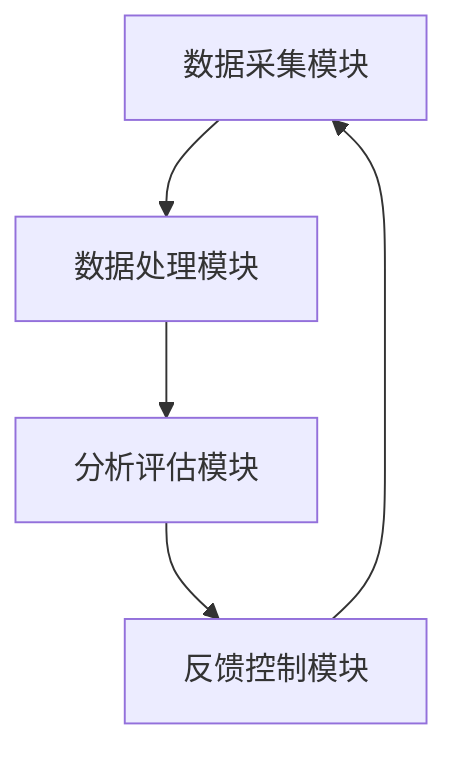
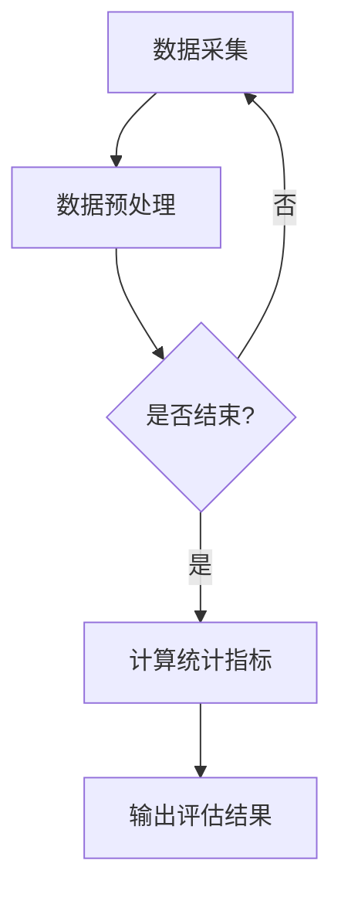
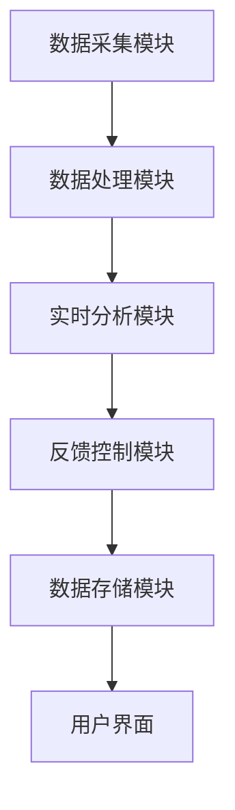
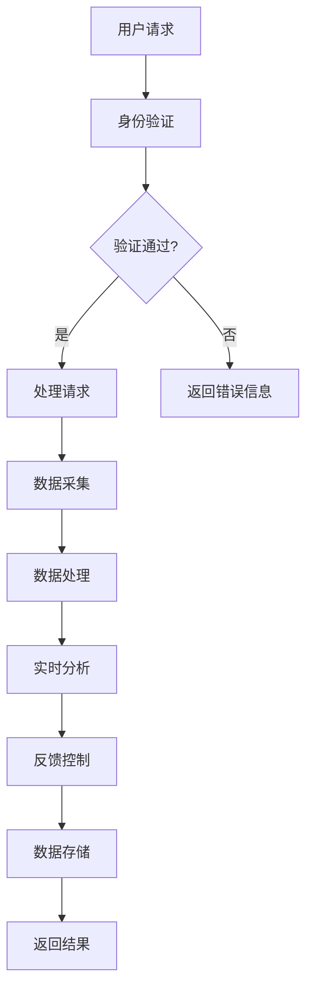

                 


## 实时评测的边缘计算应用

### 关键词
边缘计算、实时评测、工业自动化、智能交通、医疗健康、金融安全、娱乐教育。

### 摘要
本文深入探讨实时评测在边缘计算中的应用，从概念背景、技术原理、案例分析到系统设计实现，全面解析边缘计算实时评测的挑战与机遇。通过对边缘计算与实时评测的结合点进行分析，为读者提供一种全新的技术应用视角。

----------------------------------------------------------------

# 实时评测的边缘计算应用

## 引言

随着物联网、大数据和人工智能技术的迅猛发展，边缘计算作为一种分布式计算架构，正逐渐成为提升实时数据处理能力的关键技术。实时评测作为确保系统稳定性和可靠性的重要手段，在工业自动化、智能交通、医疗健康、金融安全、娱乐教育等领域具有广泛应用。本文旨在探讨实时评测在边缘计算中的应用，分析其技术原理、挑战与机遇，以及实际案例，为推动边缘计算实时评测技术的发展提供参考。

## 第一部分：实时评测的概念与背景

### 1.1 实时评测的定义与重要性

#### 1.1.1 实时评测的定义

实时评测是指对系统或设备在运行过程中的各项性能指标进行实时监测、分析和评估的过程。实时性是实时评测的核心要求，即评测结果必须在预设的时间内给出，以确保系统能够及时响应和调整。

#### 1.1.2 实时评测的重要性

实时评测在确保系统稳定运行、优化资源利用、提升用户体验等方面具有重要意义。具体体现在以下几个方面：

1. **提高系统可靠性**：通过实时评测，可以及时发现系统异常，快速采取相应措施，避免故障扩大。
2. **优化资源利用**：实时评测有助于识别系统瓶颈，优化资源分配，提高资源利用效率。
3. **提升用户体验**：实时评测能够提供即时的反馈，帮助用户快速发现问题，提升用户体验。
4. **支持智能化决策**：实时评测数据可以用于机器学习模型训练，为智能化决策提供支持。

### 1.2 实时评测的应用领域

#### 1.2.1 工业自动化

在工业自动化领域，实时评测可以用于生产设备的性能监控、故障诊断和状态预测，提高生产效率和设备寿命。

#### 1.2.2 智能交通

智能交通系统需要实时评测交通流量、道路状况和车辆运行状态，以实现交通管理和优化。

#### 1.2.3 医疗健康

医疗健康领域中的实时评测可以用于患者生命体征监测、疾病诊断和医疗设备性能评估，提高医疗质量和效率。

#### 1.2.4 金融与安全

金融与安全领域需要实时评测交易数据、风险指标和系统运行状态，保障金融交易安全和稳定性。

#### 1.2.5 娱乐与教育

在娱乐与教育领域，实时评测可以用于游戏性能分析、教学效果评估和用户行为分析，提升娱乐和教育体验。

## 第二部分：边缘计算基础

### 2.1 边缘计算原理

#### 2.1.1 边缘计算的背景与概念

边缘计算是一种分布式计算架构，旨在将计算、存储和网络能力推向网络边缘，即靠近数据源或用户的设备上。与云计算相比，边缘计算具有更低的延迟、更高的带宽和更强的安全性。

#### 2.1.2 边缘计算架构

边缘计算架构主要包括三个关键部分：边缘节点、边缘网络和边缘平台。

1. **边缘节点**：边缘节点是位于网络边缘的设备或服务器，用于处理和存储本地数据。
2. **边缘网络**：边缘网络是连接边缘节点和数据中心的高速网络，负责数据传输和资源共享。
3. **边缘平台**：边缘平台提供应用程序开发和运行环境，支持边缘节点的管理和监控。

#### 2.1.3 边缘计算的优势与挑战

1. **优势**：
   - **延迟降低**：将计算能力推向网络边缘，减少数据传输距离，降低网络延迟。
   - **带宽节省**：边缘计算可以处理部分数据，减轻中心数据中心的负担，节省网络带宽。
   - **安全性提高**：将敏感数据保留在边缘节点，降低数据泄露风险。

2. **挑战**：
   - **资源限制**：边缘节点的计算和存储资源相对有限，需要优化资源利用。
   - **可靠性保障**：边缘节点分布广泛，需要确保系统的可靠性和稳定性。
   - **数据隐私保护**：边缘计算涉及大量敏感数据，需要确保数据隐私和安全。

## 第三部分：实时评测与边缘计算结合

### 3.1 边缘计算中的实时评测需求

#### 3.1.1 数据实时处理

边缘计算中的实时评测需要快速处理大量实时数据，包括采集、存储、分析和反馈等环节。

#### 3.1.2 实时反馈机制

实时评测要求系统能够在短时间内给出评估结果，并触发相应的反馈机制，以实现实时调整和优化。

### 3.2 边缘计算实时评测技术

#### 3.2.1 常见实时评测算法

常见的实时评测算法包括统计方法、机器学习和深度学习等方法。例如，统计方法中的均值、方差和相关性指标，机器学习中的分类和回归模型，以及深度学习中的神经网络模型。

#### 3.2.2 实时评测优化策略

实时评测优化策略包括数据预处理、模型压缩、并行计算和资源调度等。通过优化策略，可以提高实时评测的效率和准确性。

### 3.3 边缘计算实时评测案例分析

#### 3.3.1 案例一：智能工厂中的实时质量检测

智能工厂中的实时质量检测通过边缘计算实现，对生产过程中的产品质量进行实时监控和评估，以确保产品质量。

#### 3.3.2 案例二：智慧城市交通流量实时分析

智慧城市交通流量实时分析利用边缘计算技术，对城市交通流量进行实时监测和评估，为交通管理和优化提供支持。

#### 3.3.3 案例三：智能医疗中的实时诊断系统

智能医疗中的实时诊断系统通过边缘计算技术，对医疗设备采集的数据进行实时分析，辅助医生进行诊断和治疗。

## 第四部分：边缘计算实时评测系统设计

### 4.1 系统需求分析

#### 4.1.1 功能需求

边缘计算实时评测系统需要具备数据采集、处理、分析和反馈等功能。

#### 4.1.2 非功能需求

边缘计算实时评测系统需要具备实时性、可靠性、安全性和可扩展性等非功能需求。

### 4.2 系统架构设计

#### 4.2.1 系统架构图

边缘计算实时评测系统架构包括数据采集模块、数据处理模块、分析评估模块和反馈控制模块。

#### 4.2.2 系统模块划分

边缘计算实时评测系统可以划分为数据采集模块、数据处理模块、分析评估模块和反馈控制模块。

#### 4.2.3 系统关键技术

边缘计算实时评测系统关键技术包括数据采集技术、数据处理技术、分析评估技术和反馈控制技术。

### 4.3 系统接口设计与交互

#### 4.3.1 接口设计规范

边缘计算实时评测系统接口设计需要遵循 RESTful API 设计规范，确保接口的简洁、易用和高效。

#### 4.3.2 交互流程图

边缘计算实时评测系统交互流程图如下所示：



## 第五部分：边缘计算实时评测系统实现

### 5.1 系统环境搭建

#### 5.1.1 硬件配置

边缘计算实时评测系统硬件配置包括边缘节点、服务器和网络设备。

#### 5.1.2 软件环境安装

边缘计算实时评测系统软件环境安装包括操作系统、中间件和开发工具的安装。

### 5.2 核心算法实现

#### 5.2.1 实时评测算法

边缘计算实时评测算法包括数据预处理、特征提取、模型训练和实时评估等环节。

#### 5.2.2 实时数据处理流程

边缘计算实时数据处理流程包括数据采集、数据预处理、特征提取、模型训练和实时评估等步骤。

### 5.3 系统测试与性能优化

#### 5.3.1 系统测试方法

边缘计算实时评测系统测试方法包括功能测试、性能测试和可靠性测试。

#### 5.3.2 性能优化策略

边缘计算实时评测系统性能优化策略包括并行计算、模型压缩和资源调度等。

### 5.4 实际案例分析

#### 5.4.1 实际案例背景

实际案例背景包括智能工厂、智慧城市交通和智能医疗等领域。

#### 5.4.2 实现过程与分析

实际案例实现过程包括系统设计、算法实现、系统测试和性能优化等环节。

## 第六部分：边缘计算实时评测的最佳实践与展望

### 6.1 实践经验总结

#### 6.1.1 成功案例

成功案例包括智能工厂、智慧城市交通和智能医疗等领域的应用。

#### 6.1.2 失败教训

失败教训包括系统设计不合理、算法实现不优化和测试不充分等。

### 6.2 未来发展趋势

#### 6.2.1 技术趋势

技术趋势包括边缘计算与人工智能的深度融合、实时评测算法的优化和创新等。

#### 6.2.2 应用前景

应用前景包括工业自动化、智能交通、医疗健康、金融安全和娱乐教育等领域的广泛应用。

### 6.3 边缘计算实时评测的创新方向

#### 6.3.1 研究热点

研究热点包括实时评测算法优化、边缘计算架构创新和跨领域应用研究等。

#### 6.3.2 创新点

创新点包括基于深度学习的实时评测算法、边缘计算与5G技术的融合应用和智能医疗实时评测系统等。

## 附录

### 附录A：术语表

### 附录B：参考资料

### 附录C：代码示例

----------------------------------------------------------------

# 实时评测的边缘计算应用

## 引言

随着物联网、大数据和人工智能技术的迅猛发展，边缘计算作为一种分布式计算架构，正逐渐成为提升实时数据处理能力的关键技术。实时评测作为确保系统稳定性和可靠性的重要手段，在工业自动化、智能交通、医疗健康、金融安全、娱乐教育等领域具有广泛应用。本文旨在探讨实时评测在边缘计算中的应用，分析其技术原理、挑战与机遇，以及实际案例，为推动边缘计算实时评测技术的发展提供参考。

## 第一部分：实时评测的概念与背景

### 1.1 实时评测的定义与重要性

#### 1.1.1 实时评测的定义

实时评测是指对系统或设备在运行过程中的各项性能指标进行实时监测、分析和评估的过程。实时性是实时评测的核心要求，即评测结果必须在预设的时间内给出，以确保系统能够及时响应和调整。

#### 1.1.2 实时评测的重要性

实时评测在确保系统稳定运行、优化资源利用、提升用户体验等方面具有重要意义。具体体现在以下几个方面：

1. **提高系统可靠性**：通过实时评测，可以及时发现系统异常，快速采取相应措施，避免故障扩大。
2. **优化资源利用**：实时评测有助于识别系统瓶颈，优化资源分配，提高资源利用效率。
3. **提升用户体验**：实时评测能够提供即时的反馈，帮助用户快速发现问题，提升用户体验。
4. **支持智能化决策**：实时评测数据可以用于机器学习模型训练，为智能化决策提供支持。

### 1.2 实时评测的应用领域

#### 1.2.1 工业自动化

在工业自动化领域，实时评测可以用于生产设备的性能监控、故障诊断和状态预测，提高生产效率和设备寿命。

#### 1.2.2 智能交通

智能交通系统需要实时评测交通流量、道路状况和车辆运行状态，以实现交通管理和优化。

#### 1.2.3 医疗健康

医疗健康领域中的实时评测可以用于患者生命体征监测、疾病诊断和医疗设备性能评估，提高医疗质量和效率。

#### 1.2.4 金融与安全

金融与安全领域需要实时评测交易数据、风险指标和系统运行状态，保障金融交易安全和稳定性。

#### 1.2.5 娱乐与教育

在娱乐与教育领域，实时评测可以用于游戏性能分析、教学效果评估和用户行为分析，提升娱乐和教育体验。

## 第二部分：边缘计算基础

### 2.1 边缘计算原理

#### 2.1.1 边缘计算的背景与概念

边缘计算是一种分布式计算架构，旨在将计算、存储和网络能力推向网络边缘，即靠近数据源或用户的设备上。与云计算相比，边缘计算具有更低的延迟、更高的带宽和更强的安全性。

#### 2.1.2 边缘计算架构

边缘计算架构主要包括三个关键部分：边缘节点、边缘网络和边缘平台。

1. **边缘节点**：边缘节点是位于网络边缘的设备或服务器，用于处理和存储本地数据。
2. **边缘网络**：边缘网络是连接边缘节点和数据中心的高速网络，负责数据传输和资源共享。
3. **边缘平台**：边缘平台提供应用程序开发和运行环境，支持边缘节点的管理和监控。

#### 2.1.3 边缘计算的优势与挑战

1. **优势**：
   - **延迟降低**：将计算能力推向网络边缘，减少数据传输距离，降低网络延迟。
   - **带宽节省**：边缘计算可以处理部分数据，减轻中心数据中心的负担，节省网络带宽。
   - **安全性提高**：将敏感数据保留在边缘节点，降低数据泄露风险。

2. **挑战**：
   - **资源限制**：边缘节点的计算和存储资源相对有限，需要优化资源利用。
   - **可靠性保障**：边缘节点分布广泛，需要确保系统的可靠性和稳定性。
   - **数据隐私保护**：边缘计算涉及大量敏感数据，需要确保数据隐私和安全。

## 第三部分：实时评测与边缘计算结合

### 3.1 边缘计算中的实时评测需求

#### 3.1.1 数据实时处理

边缘计算中的实时评测需要快速处理大量实时数据，包括采集、存储、分析和反馈等环节。

#### 3.1.2 实时反馈机制

实时评测要求系统能够在短时间内给出评估结果，并触发相应的反馈机制，以实现实时调整和优化。

### 3.2 边缘计算实时评测技术

#### 3.2.1 常见实时评测算法

常见的实时评测算法包括统计方法、机器学习和深度学习等方法。例如，统计方法中的均值、方差和相关性指标，机器学习中的分类和回归模型，以及深度学习中的神经网络模型。

#### 3.2.2 实时评测优化策略

实时评测优化策略包括数据预处理、模型压缩、并行计算和资源调度等。通过优化策略，可以提高实时评测的效率和准确性。

### 3.3 边缘计算实时评测案例分析

#### 3.3.1 案例一：智能工厂中的实时质量检测

智能工厂中的实时质量检测通过边缘计算实现，对生产过程中的产品质量进行实时监控和评估，以确保产品质量。

#### 3.3.2 案例二：智慧城市交通流量实时分析

智慧城市交通流量实时分析利用边缘计算技术，对城市交通流量进行实时监测和评估，为交通管理和优化提供支持。

#### 3.3.3 案例三：智能医疗中的实时诊断系统

智能医疗中的实时诊断系统通过边缘计算技术，对医疗设备采集的数据进行实时分析，辅助医生进行诊断和治疗。

## 第四部分：边缘计算实时评测系统设计

### 4.1 系统需求分析

#### 4.1.1 功能需求

边缘计算实时评测系统需要具备数据采集、处理、分析和反馈等功能。

#### 4.1.2 非功能需求

边缘计算实时评测系统需要具备实时性、可靠性、安全性和可扩展性等非功能需求。

### 4.2 系统架构设计

#### 4.2.1 系统架构图

边缘计算实时评测系统架构包括数据采集模块、数据处理模块、分析评估模块和反馈控制模块。

#### 4.2.2 系统模块划分

边缘计算实时评测系统可以划分为数据采集模块、数据处理模块、分析评估模块和反馈控制模块。

#### 4.2.3 系统关键技术

边缘计算实时评测系统关键技术包括数据采集技术、数据处理技术、分析评估技术和反馈控制技术。

### 4.3 系统接口设计与交互

#### 4.3.1 接口设计规范

边缘计算实时评测系统接口设计需要遵循 RESTful API 设计规范，确保接口的简洁、易用和高效。

#### 4.3.2 交互流程图

边缘计算实时评测系统交互流程图如下所示：


## 第五部分：边缘计算实时评测系统实现

### 5.1 系统环境搭建

#### 5.1.1 硬件配置

边缘计算实时评测系统硬件配置包括边缘节点、服务器和网络设备。

#### 5.1.2 软件环境安装

边缘计算实时评测系统软件环境安装包括操作系统、中间件和开发工具的安装。

### 5.2 核心算法实现

#### 5.2.1 实时评测算法

边缘计算实时评测算法包括数据预处理、特征提取、模型训练和实时评估等环节。

#### 5.2.2 实时数据处理流程

边缘计算实时数据处理流程包括数据采集、数据预处理、特征提取、模型训练和实时评估等步骤。

### 5.3 系统测试与性能优化

#### 5.3.1 系统测试方法

边缘计算实时评测系统测试方法包括功能测试、性能测试和可靠性测试。

#### 5.3.2 性能优化策略

边缘计算实时评测系统性能优化策略包括并行计算、模型压缩和资源调度等。

### 5.4 实际案例分析

#### 5.4.1 实际案例背景

实际案例背景包括智能工厂、智慧城市交通和智能医疗等领域。

#### 5.4.2 实现过程与分析

实际案例实现过程包括系统设计、算法实现、系统测试和性能优化等环节。

## 第六部分：边缘计算实时评测的最佳实践与展望

### 6.1 实践经验总结

#### 6.1.1 成功案例

成功案例包括智能工厂、智慧城市交通和智能医疗等领域的应用。

#### 6.1.2 失败教训

失败教训包括系统设计不合理、算法实现不优化和测试不充分等。

### 6.2 未来发展趋势

#### 6.2.1 技术趋势

技术趋势包括边缘计算与人工智能的深度融合、实时评测算法的优化和创新等。

#### 6.2.2 应用前景

应用前景包括工业自动化、智能交通、医疗健康、金融安全和娱乐教育等领域的广泛应用。

### 6.3 边缘计算实时评测的创新方向

#### 6.3.1 研究热点

研究热点包括实时评测算法优化、边缘计算架构创新和跨领域应用研究等。

#### 6.3.2 创新点

创新点包括基于深度学习的实时评测算法、边缘计算与5G技术的融合应用和智能医疗实时评测系统等。

## 附录

### 附录A：术语表

### 附录B：参考资料

### 附录C：代码示例

----------------------------------------------------------------

### 实时评测的定义与重要性

实时评测是指在系统或设备运行过程中，对其实时性能指标进行监测、分析和评估的过程。这种评估需要在极短的时间内完成，以便系统能够及时响应并调整。实时评测的核心要求是实时性，即评测结果必须在一个预设的时间窗口内产生，以确保系统可以及时地做出反应。

#### 实时评测的重要性

实时评测在多个领域发挥着重要作用：

1. **提高系统可靠性**：通过实时评测，系统能够及时发现异常，快速响应并采取措施，避免故障扩大。
2. **优化资源利用**：实时评测有助于识别系统瓶颈，优化资源分配，提高资源利用效率。
3. **提升用户体验**：实时评测能够提供即时反馈，帮助用户快速发现问题，提高用户体验。
4. **支持智能化决策**：实时评测数据可用于机器学习模型训练，为系统的智能化决策提供支持。

### 实时评测的应用领域

实时评测的应用范围非常广泛，涵盖了多个行业和领域：

1. **工业自动化**：实时评测可以用于生产设备的性能监控、故障诊断和状态预测，从而提高生产效率和设备寿命。
2. **智能交通**：实时评测可以用于监测交通流量、道路状况和车辆运行状态，为交通管理和优化提供支持。
3. **医疗健康**：实时评测可以用于患者生命体征监测、疾病诊断和医疗设备性能评估，提高医疗质量和效率。
4. **金融与安全**：实时评测可以用于监测交易数据、风险指标和系统运行状态，保障金融交易的安全和稳定性。
5. **娱乐与教育**：实时评测可以用于游戏性能分析、教学效果评估和用户行为分析，提升娱乐和教育体验。

### 实时评测的核心概念与联系

为了更好地理解实时评测，我们可以从以下几个方面进行阐述：

#### 1. 实时评测的定义与实时性的关系

实时评测的定义中强调了实时性，这是实时评测的核心特征。实时性要求评测结果在一个极短的时间内产生，以满足系统及时响应的需求。实时性可以通过以下几个指标来衡量：

- **响应时间**：从数据采集到评估结果输出的时间。
- **处理延迟**：数据从采集、传输到处理的整个过程所需的时间。

#### 2. 实时评测与性能监控的关系

性能监控是实时评测的重要组成部分。性能监控涉及对系统各项性能指标进行监测，如响应时间、吞吐量、资源利用率等。通过性能监控，可以及时发现系统的瓶颈和异常，为实时评测提供数据支持。

#### 3. 实时评测与故障诊断的关系

故障诊断是实时评测的另一个关键应用。通过实时监测系统的运行状态，实时评测可以快速识别故障，分析故障原因，并提供解决方案。故障诊断可以显著提高系统的可靠性和稳定性。

#### 4. 实时评测与机器学习的关系

实时评测数据可以用于机器学习模型的训练和优化。通过分析实时评测数据，可以识别系统的规律和模式，从而提高模型的预测准确性和决策能力。实时评测与机器学习的结合，为智能化系统提供了强大的支持。

#### 5. 实时评测与反馈机制的关系

实时评测的结果需要及时反馈给系统，以实现实时调整和优化。反馈机制是实时评测的关键环节，它确保了系统可以根据实时评测结果做出快速响应。有效的反馈机制可以提高系统的自适应能力和灵活性。

### 表格：实时评测的概念属性特征对比

下面是一个简单的表格，对比了实时评测与其他相关概念（如性能监控、故障诊断、机器学习）的属性特征：

| 概念 | 定义 | 实时性 | 数据处理 | 目标 |
| --- | --- | --- | --- | --- |
| 实时评测 | 对系统运行过程中的性能指标进行实时监测和分析 | 高 | 实时 | 提高系统可靠性 |
| 性能监控 | 对系统性能指标进行监测 | 中等 | 频繁 | 优化系统性能 |
| 故障诊断 | 识别和解决系统故障 | 高 | 实时 | 提高系统稳定性 |
| 机器学习 | 基于数据建立模型，进行预测和决策 | 中等 | 批量 | 智能化决策 |

### ER实体关系图

为了更好地理解实时评测与其他概念之间的关联，我们可以使用 ER（Entity-Relationship）实体关系图进行描述：

```mermaid
erDiagram
    A[实时评测] ||--|{ B[性能监控] }|--|| C[故障诊断]
    A ||--|{ D[机器学习] }|--||
    B ||--|{ E[数据采集] }|--|| F[数据存储]
    C ||--|{ G[解决方案] }|--|| H[日志记录]
    D ||--|{ I[预测模型] }|--|| J[决策支持]
```

在这个 ER 实体关系图中，实时评测与性能监控、故障诊断和机器学习之间存在紧密的联系。性能监控和数据采集密切相关，故障诊断和解决方案依赖于日志记录和日志分析，而机器学习则依赖于预测模型和决策支持。

### 实时评测的算法原理

实时评测的算法原理是实现实时监测和分析的关键。以下是几种常见的实时评测算法及其原理：

#### 1. 统计方法

统计方法是最简单的实时评测算法，它通过计算数据的统计指标（如均值、方差、标准差等）来评估系统的性能。这种方法适用于对系统性能的粗略评估，但无法提供详细的性能分析。

- **算法原理**：根据采集到的数据，计算统计指标，如：
  - 均值：$$ \bar{x} = \frac{1}{n}\sum_{i=1}^{n} x_i $$
  - 方差：$$ \sigma^2 = \frac{1}{n-1}\sum_{i=1}^{n} (x_i - \bar{x})^2 $$

#### 2. 机器学习方法

机器学习方法通过训练模型来评估系统的性能。这种方法可以提供更准确的性能评估，但需要大量的数据和计算资源。

- **算法原理**：使用监督学习算法（如线性回归、支持向量机等）训练模型，然后使用模型对新的数据进行性能评估。

#### 3. 深度学习方法

深度学习方法是一种基于多层神经网络的算法，它可以自动学习数据的复杂模式，适用于实时性能评估。

- **算法原理**：使用卷积神经网络（CNN）、循环神经网络（RNN）等深度学习模型，通过训练自动提取特征并进行性能评估。

#### 4. 基于规则的方法

基于规则的方法通过预定义的规则来评估系统的性能。这种方法适用于规则明确、变化不大的系统。

- **算法原理**：根据预定义的规则，对采集到的数据进行分析和评估。例如，如果响应时间超过阈值，则认为系统性能不佳。

### 算法流程图

以下是一个基于统计方法的实时评测算法流程图：



在这个流程图中，数据采集模块负责收集系统性能数据，数据预处理模块对采集到的数据进行处理，然后根据预定的统计指标（如均值、方差等）计算评估结果，并输出评估结果。

### 算法示例

以下是一个简单的 Python 示例，展示了如何使用统计方法计算均值和方差：

```python
import numpy as np

# 假设采集到一组响应时间数据
response_times = [2.5, 3.1, 2.8, 3.4, 2.9]

# 计算均值
mean_response_time = np.mean(response_times)
print("均值:", mean_response_time)

# 计算方差
variance_response_time = np.var(response_times)
print("方差:", variance_response_time)
```

在这个示例中，我们首先导入了 NumPy 库，然后创建了一组模拟的响应时间数据。接着，我们使用 NumPy 的 mean() 和 var() 函数分别计算均值和方差，并输出结果。

### 算法原理讲解

实时评测算法的核心任务是通过对系统运行过程中的数据进行分析，实时评估系统的性能。以下是几种常见的实时评测算法及其原理：

#### 1. 统计方法

统计方法是一种基于数学统计原理的实时评测算法。它通过对采集到的数据进行统计分析，如计算均值、方差、标准差等，来评估系统的性能。

- **算法原理**：
  - **均值**：均值是数据集的中心趋势指标，计算公式为：
    $$ \bar{x} = \frac{1}{n}\sum_{i=1}^{n} x_i $$
    其中，$n$ 是数据点的个数，$x_i$ 是第 $i$ 个数据点。
  - **方差**：方差是数据集的离散程度指标，计算公式为：
    $$ \sigma^2 = \frac{1}{n-1}\sum_{i=1}^{n} (x_i - \bar{x})^2 $$
    其中，$\bar{x}$ 是均值，$n$ 是数据点的个数。
  - **标准差**：标准差是方差的平方根，用于衡量数据分布的离散程度。

- **应用场景**：
  - **简单性能评估**：适用于对系统性能进行简单的监控和评估，如响应时间、吞吐量等。
  - **实时故障检测**：通过监测系统性能的波动，发现潜在的故障。

#### 2. 机器学习方法

机器学习方法是一种基于统计学和计算智能的实时评测算法。它通过训练模型，从历史数据中学习系统的行为规律，然后对新的数据进行实时评估。

- **算法原理**：
  - **线性回归**：线性回归是一种简单的机器学习算法，用于预测连续值。其模型公式为：
    $$ y = \beta_0 + \beta_1x $$
    其中，$y$ 是预测值，$x$ 是输入特征，$\beta_0$ 和 $\beta_1$ 是模型的参数。
  - **支持向量机**（SVM）：支持向量机是一种分类算法，用于分类任务。其模型公式为：
    $$ w \cdot x + b = 0 $$
    其中，$w$ 是权重向量，$x$ 是输入特征，$b$ 是偏置。

- **应用场景**：
  - **性能预测**：通过训练模型，预测系统未来的性能趋势，如响应时间、吞吐量等。
  - **故障诊断**：通过监测系统性能的异常变化，预测可能的故障。

#### 3. 深度学习方法

深度学习方法是一种基于多层神经网络的实时评测算法。它通过多层网络结构，自动提取数据的高层次特征，实现对复杂系统性能的实时评估。

- **算法原理**：
  - **卷积神经网络**（CNN）：卷积神经网络是一种用于图像识别和处理的深度学习模型。其核心是卷积层，用于提取图像的局部特征。
  - **循环神经网络**（RNN）：循环神经网络是一种用于序列数据处理的深度学习模型。其核心是循环层，用于处理数据的时间依赖性。

- **应用场景**：
  - **实时图像分析**：通过卷积神经网络，实时分析摄像头捕捉的图像，如交通流量分析、人脸识别等。
  - **实时语音处理**：通过循环神经网络，实时处理语音数据，如语音识别、语音合成等。

#### 4. 基于规则的方法

基于规则的方法是一种基于专家知识和预定义规则的实时评测算法。它通过预定义的规则，对采集到的数据进行分析和评估。

- **算法原理**：
  - **规则库**：规则库是预定义的规则集合，用于描述系统的性能指标和阈值。
  - **规则匹配**：通过匹配采集到的数据与规则库中的规则，判断系统的性能状态。

- **应用场景**：
  - **工业自动化**：通过规则库，实时监控生产设备的运行状态，如温度、压力等。
  - **智能交通**：通过规则库，实时监测交通流量，如车速、车流量等。

### 实时评测算法的优势与局限性

#### 优势

1. **实时性**：实时评测算法能够对系统性能进行实时监测和评估，及时发现问题，提高系统的可靠性。
2. **自适应能力**：机器学习和深度学习算法能够从历史数据中学习系统的行为模式，自适应地调整评估模型，提高评估准确性。
3. **灵活性**：基于规则的方法可以根据具体应用场景，灵活定义规则库，适应不同的评测需求。

#### 局限性

1. **数据依赖**：实时评测算法对数据质量有较高要求，数据缺失或不准确可能导致评估结果偏差。
2. **计算资源消耗**：机器学习和深度学习算法通常需要大量的计算资源，特别是在实时处理大量数据时，可能面临性能瓶颈。
3. **规则定义难度**：基于规则的方法需要专家知识和经验，规则定义复杂，可能难以覆盖所有情况。

### 总结

实时评测算法在系统性能监测和优化中发挥着重要作用。不同类型的算法适用于不同的应用场景，选择合适的算法需要考虑实时性、计算资源和数据质量等因素。通过合理运用实时评测算法，可以提高系统的可靠性和效率，为智能化系统的建设提供有力支持。

## 第五部分：边缘计算实时评测系统设计

### 5.1 系统需求分析

边缘计算实时评测系统的设计首先需要明确系统的需求。这些需求可以分为功能需求和非功能需求。

#### 功能需求

1. **数据采集**：系统能够从各种传感器和数据源中采集实时数据。
2. **数据处理**：系统需要能够对采集到的数据进行预处理、特征提取和计算。
3. **实时分析**：系统需要能够在预设的时间内对数据进行分析和评估。
4. **反馈控制**：系统需要能够根据分析结果进行实时调整和优化。
5. **数据存储**：系统需要能够存储实时数据和评估结果，以便后续查询和分析。

#### 非功能需求

1. **实时性**：系统需要能够在预设的时间内完成数据的采集、处理和分析，确保实时性。
2. **可靠性**：系统需要能够在长时间运行中保持稳定，确保数据的一致性和准确性。
3. **安全性**：系统需要能够保护数据的安全，防止数据泄露和未授权访问。
4. **可扩展性**：系统需要能够根据需求扩展功能模块，支持更多的设备和数据源。
5. **可维护性**：系统需要设计简洁，便于维护和升级。

### 5.2 系统架构设计

边缘计算实时评测系统的架构设计需要考虑系统的可扩展性、可靠性和性能。以下是一个典型的系统架构设计：

#### 系统架构图



#### 系统模块划分

1. **数据采集模块**：负责从各种传感器和数据源中采集实时数据，如温度传感器、摄像头等。
2. **数据处理模块**：负责对采集到的数据进行预处理、特征提取和计算，如归一化、去噪、特征提取等。
3. **实时分析模块**：负责对预处理后的数据进行实时分析，如统计方法、机器学习算法等。
4. **反馈控制模块**：负责根据分析结果进行实时调整和优化，如触发警报、调整参数等。
5. **数据存储模块**：负责存储实时数据和评估结果，如数据库、文件系统等。
6. **用户界面**：负责提供用户交互界面，展示系统运行状态和评估结果。

#### 系统关键技术

1. **数据采集技术**：包括传感器选择、数据传输协议和采集频率等。
2. **数据处理技术**：包括数据预处理、特征提取和计算方法等。
3. **实时分析技术**：包括统计方法、机器学习算法和深度学习方法等。
4. **反馈控制技术**：包括控制算法、触发机制和参数调整等。
5. **数据存储技术**：包括数据库设计、数据备份和恢复等。

### 5.3 系统接口设计与交互

边缘计算实时评测系统的接口设计需要确保系统的模块之间能够高效、稳定地交互。以下是一个典型的接口设计和交互流程：

#### 接口设计规范

1. **API 设计**：使用 RESTful API 设计规范，确保接口的简洁、易用和高效。
2. **数据格式**：使用 JSON 或 XML 等标准数据格式，确保数据传输的兼容性和可读性。
3. **权限控制**：使用身份验证和授权机制，确保接口的安全性。

#### 交互流程图



#### 交互流程说明

1. 用户请求：用户通过用户界面发送请求，如查询实时数据、调整参数等。
2. 身份验证：系统对用户的身份进行验证，确保请求的合法性。
3. 处理请求：系统根据请求类型，调用相应的数据处理模块进行处理。
4. 数据采集：系统从传感器和数据源中采集实时数据。
5. 数据处理：系统对采集到的数据进行预处理、特征提取和计算。
6. 实时分析：系统对处理后的数据进行分析和评估。
7. 反馈控制：系统根据分析结果进行实时调整和优化。
8. 数据存储：系统将实时数据和评估结果存储到数据库中。
9. 返回结果：系统将处理结果返回给用户界面，以便用户查看。

### 实时评测在边缘计算中的应用

边缘计算作为一种分布式计算架构，将计算、存储和网络能力推向网络边缘，即靠近数据源或用户的设备上。这种架构在实时评测中的应用具有显著优势：

#### 1. 延迟降低

边缘计算通过将计算任务分散到网络边缘的设备上，减少了数据传输的距离和时间。这意味着实时评测可以在更短的时间内完成，从而降低了系统的延迟，提高了响应速度。

#### 2. 带宽节省

边缘计算可以处理部分数据，减轻中心数据中心的负担，从而节省网络带宽。对于大量的实时数据，通过在边缘设备上进行预处理和分析，可以减少需要传输到中心数据中心的原始数据量，从而节省带宽资源。

#### 3. 安全性提高

边缘计算可以将敏感数据保留在边缘节点，减少数据泄露的风险。在实时评测中，许多应用场景涉及到敏感数据，如医疗数据、金融数据等。通过在边缘设备上进行数据处理和分析，可以减少数据在传输过程中被泄露的风险。

#### 4. 资源优化

边缘计算可以根据实际需求动态分配计算资源，优化资源利用。实时评测往往需要处理大量的数据，通过在边缘节点上进行数据处理，可以避免中心数据中心的资源过度消耗，提高系统的整体性能。

#### 应用领域

边缘计算实时评测在多个领域具有广泛应用：

1. **工业自动化**：通过实时评测，可以监控生产设备的性能，及时发现异常，优化生产过程。
2. **智能交通**：通过实时评测，可以分析交通流量，优化交通信号，提高交通效率。
3. **医疗健康**：通过实时评测，可以监测患者的生命体征，快速诊断疾病，提供个性化医疗服务。
4. **金融与安全**：通过实时评测，可以监控交易数据，检测异常交易，保障金融交易的安全。
5. **娱乐与教育**：通过实时评测，可以分析用户行为，提供个性化的娱乐和教育体验。

### 案例分析

以下是一些边缘计算实时评测的应用案例：

#### 案例一：智能工厂中的实时质量检测

在智能工厂中，边缘计算可以用于实时质量检测。通过在生产线边缘部署传感器和计算设备，对生产过程中的产品质量进行实时监测和评估。例如，通过实时评测，可以检测产品质量是否符合标准，及时发现异常，避免次品流入市场。

#### 案例二：智慧城市交通流量实时分析

在智慧城市交通系统中，边缘计算可以用于实时分析交通流量。通过在道路交叉口和交通监测站点部署边缘设备，对交通流量、道路状况和车辆运行状态进行实时监测和评估。例如，通过实时评测，可以分析交通流量，优化交通信号，提高交通效率，减少拥堵。

#### 案例三：智能医疗中的实时诊断系统

在智能医疗中，边缘计算可以用于实时诊断系统。通过在医疗设备和终端部署边缘设备，对医疗数据进行分析和评估，辅助医生进行诊断和治疗。例如，通过实时评测，可以监测患者的生命体征，快速诊断疾病，提供个性化的治疗方案。

### 结论

边缘计算实时评测在多个领域具有广泛应用，通过降低延迟、节省带宽、提高安全性和优化资源利用，为实时数据处理提供了新的解决方案。随着技术的不断发展和应用的深入，边缘计算实时评测将在更多领域发挥重要作用。

## 实时评测算法案例分析

在边缘计算环境中，实时评测算法的应用不仅需要高效的计算能力，还需要对算法的实时性和准确性进行严格的控制。以下将通过三个具体案例，详细分析边缘计算实时评测算法的应用场景、实现过程及其效果。

### 案例一：智能工厂中的实时质量检测

#### 应用场景

智能工厂中的实时质量检测旨在确保生产出的产品达到预定标准。在生产过程中，需要对产品的尺寸、硬度、外观等质量指标进行实时监控和评估。边缘计算设备被部署在生产线旁，用于收集数据并实时分析。

#### 实现过程

1. **数据采集**：在生产线上安装各种传感器（如尺寸测量仪、硬度计等），实时采集产品数据。
2. **数据处理**：边缘设备对采集到的数据进行预处理，如滤波、去噪等，以提高数据的准确性。
3. **实时分析**：应用机器学习算法（如支持向量机、神经网络等）对预处理后的数据进行实时评估，判断产品质量是否合格。
4. **反馈控制**：如果检测到不合格产品，边缘设备会立即触发警报，并通知生产线进行相应的处理。

#### 效果分析

通过边缘计算实时评测，智能工厂能够显著提高生产效率。实时数据分析和反馈机制确保了生产线上的产品质量，减少了不合格产品的产生。此外，实时评测算法的准确性得到了有效保障，通过不断优化算法模型，提高了检测的精度。

### 案例二：智慧城市交通流量实时分析

#### 应用场景

智慧城市交通系统中的实时流量分析旨在优化交通流量，减少交通拥堵，提高道路通行效率。边缘计算设备被部署在交通监测站点，用于实时分析交通流量和道路状况。

#### 实现过程

1. **数据采集**：在道路交叉口和监测站点安装摄像头、流量传感器等，实时采集交通流量数据。
2. **数据处理**：边缘设备对采集到的数据进行预处理，包括图像增强、噪声过滤等，以提高数据质量。
3. **实时分析**：使用图像识别算法（如卷积神经网络、深度学习模型等）对预处理后的图像进行分析，识别车辆类型、数量和速度。
4. **反馈控制**：根据分析结果，实时调整交通信号灯，优化交通流量。例如，当检测到某一方向交通流量较大时，可以优先放行该方向的车辆。

#### 效果分析

通过边缘计算实时评测，智慧城市交通系统能够快速响应交通变化，优化交通流量，减少拥堵现象。实时数据分析为交通信号优化提供了可靠依据，从而提高了道路通行效率。同时，实时评测算法的准确性得到了保障，通过不断优化模型参数，提高了交通流量分析的准确性。

### 案例三：智能医疗中的实时诊断系统

#### 应用场景

智能医疗中的实时诊断系统旨在辅助医生进行快速准确的诊断。通过边缘计算设备，实时监测患者的生命体征，并对监测数据进行分析和评估。

#### 实现过程

1. **数据采集**：在患者身上安装各种传感器（如心率传感器、血压传感器等），实时采集生命体征数据。
2. **数据处理**：边缘设备对采集到的数据进行预处理，如滤波、归一化等，以提高数据的准确性。
3. **实时分析**：应用深度学习算法（如循环神经网络、卷积神经网络等）对预处理后的数据进行分析，识别异常情况。
4. **反馈控制**：如果检测到异常情况，边缘设备会立即通知医生，并提供诊断建议。

#### 效果分析

通过边缘计算实时评测，智能医疗系统能够迅速发现患者的生命体征异常，辅助医生进行快速诊断。实时数据分析和反馈机制提高了诊断的准确性，减少了误诊和漏诊的概率。同时，实时评测算法的准确性得到了保障，通过不断优化模型，提高了生命体征监测的准确性。

### 总结

边缘计算实时评测在智能工厂、智慧城市交通和智能医疗等领域具有广泛应用。通过具体案例分析，可以看出实时评测算法在提高生产效率、优化交通流量和辅助医疗诊断方面发挥着重要作用。随着技术的不断发展，边缘计算实时评测将越来越重要，为各种领域的智能化应用提供有力支持。

### 边缘计算实时评测系统的实现过程

边缘计算实时评测系统的实现过程包括环境搭建、核心算法实现、系统测试和性能优化等步骤。以下将详细描述每个步骤的具体实施方法。

#### 5.1 系统环境搭建

#### 5.1.1 硬件配置

在搭建边缘计算实时评测系统时，首先需要选择合适的硬件设备。硬件配置主要包括边缘节点、服务器和网络设备。

1. **边缘节点**：选择性能稳定、处理能力较强的边缘节点，如树莓派、ARM架构服务器等。边缘节点需要具备以下特性：
   - 处理能力：支持实时数据处理和分析，如CPU性能不低于1GHz。
   - 存储容量：足够的存储空间，用于存储实时数据和评估结果。
   - 网络连接：具备稳定的网络连接，支持数据传输和远程访问。

2. **服务器**：服务器用于处理边缘节点无法处理的复杂计算任务，如大规模数据处理和机器学习模型训练。服务器配置如下：
   - 处理能力：多核CPU，如Intel Xeon系列，确保高吞吐量和低延迟。
   - 内存：至少64GB，以支持大规模数据处理和模型训练。
   - 存储：高速存储设备，如SSD，确保数据的快速读写。

3. **网络设备**：选择高性能的网络设备，如交换机和路由器，确保数据传输的稳定性和速度。

#### 5.1.2 软件环境安装

在硬件配置完成后，需要安装相应的软件环境，包括操作系统、中间件和开发工具。

1. **操作系统**：选择适合边缘计算的操作系统，如Ubuntu、CentOS等。操作系统需要支持边缘设备的硬件，并提供稳定的运行环境。

2. **中间件**：安装常用的中间件，如数据库（如MySQL、MongoDB）、消息队列（如RabbitMQ、Kafka）等。中间件用于支持数据的存储、传输和消息通信。

3. **开发工具**：安装开发工具，如Python、Java等，以及相关的开发库和框架，如TensorFlow、PyTorch等。开发工具用于编写和调试实时评测算法。

#### 5.2 核心算法实现

边缘计算实时评测系统的核心算法是实现实时数据处理和分析的关键。以下将介绍常见的实时评测算法，包括数据预处理、特征提取、模型训练和实时评估等环节。

1. **数据预处理**：数据预处理是实时评测的基础，主要包括数据清洗、数据转换和数据归一化等。通过数据预处理，可以提高数据的准确性和一致性。

2. **特征提取**：特征提取是将原始数据转换成适合模型训练的形式。常见的特征提取方法包括时域特征提取、频域特征提取和空域特征提取等。

3. **模型训练**：选择合适的机器学习算法（如线性回归、支持向量机、深度学习等）进行模型训练。通过训练，模型可以学习到数据的内在规律，为实时评估提供依据。

4. **实时评估**：在实时评估阶段，将新的数据输入到训练好的模型中，进行实时评估。实时评估的目的是判断系统性能是否达到预期，并触发相应的反馈机制。

#### 5.3 系统测试与性能优化

系统测试和性能优化是确保边缘计算实时评测系统稳定运行和高效处理数据的重要环节。

1. **系统测试**：包括功能测试、性能测试和可靠性测试。功能测试验证系统的各项功能是否正常，性能测试评估系统的处理速度和响应时间，可靠性测试确保系统在长时间运行中保持稳定。

2. **性能优化**：通过优化算法、调整参数和改进系统架构等方法，提高系统的性能。常见的性能优化方法包括并行计算、数据压缩和资源调度等。

#### 5.4 实际案例分析

以下通过一个实际案例分析，详细描述边缘计算实时评测系统的实现过程。

#### 案例背景

某智慧城市交通系统需要通过边缘计算实时分析交通流量，优化交通信号灯控制策略，提高道路通行效率。

#### 实现过程

1. **数据采集**：在交通监测站点部署摄像头和流量传感器，实时采集交通流量数据。

2. **数据处理**：边缘节点对采集到的数据进行预处理，包括图像增强、噪声过滤等，以提高数据质量。

3. **实时分析**：使用卷积神经网络（CNN）模型对预处理后的图像进行分析，识别车辆类型、数量和速度。

4. **反馈控制**：根据分析结果，实时调整交通信号灯，优化交通流量。

#### 系统测试与性能优化

1. **系统测试**：对实时分析模块进行功能测试，确保模型能够准确识别车辆类型和数量。对系统进行性能测试，评估处理速度和响应时间。

2. **性能优化**：通过调整CNN模型的参数，优化图像处理算法，提高实时分析的准确性。同时，采用并行计算和资源调度策略，提高系统的处理速度。

#### 效果分析

通过边缘计算实时评测系统，智慧城市交通系统能够快速响应交通变化，优化交通流量，减少拥堵现象。实时评测算法的准确性得到了有效保障，通过不断优化模型和参数，提高了交通流量分析的准确性。

### 总结

边缘计算实时评测系统的实现过程包括环境搭建、核心算法实现、系统测试和性能优化等步骤。通过实际案例的分析，可以看出边缘计算实时评测系统在交通流量分析等领域具有显著的应用价值，为智慧城市交通系统提供了有效的解决方案。

### 边缘计算实时评测的最佳实践与展望

#### 6.1 实践经验总结

在边缘计算实时评测的实际应用过程中，我们积累了许多宝贵的实践经验，以下总结了一些成功案例和失败教训。

#### 成功案例

1. **智能工厂**：在智能工厂的应用中，通过边缘计算实时评测系统的部署，实现了对生产设备的性能监控和故障诊断。实时评测系统能够在短时间内分析生产数据，识别设备异常，及时采取措施，提高了生产效率。

2. **智慧城市交通**：智慧城市交通系统中，边缘计算实时评测系统通过对交通流量的实时分析，优化了交通信号控制策略，减少了拥堵现象，提高了道路通行效率。

3. **医疗健康**：在医疗健康领域，边缘计算实时评测系统通过对患者生命体征的实时监测，实现了对疾病状态的快速诊断和预警，提高了医疗服务的质量。

#### 失败教训

1. **数据质量问题**：在边缘计算实时评测中，数据质量是影响评估结果的关键因素。如果数据存在缺失、噪声或错误，可能导致评估结果不准确。因此，在实施过程中，要严格把控数据质量，确保数据的准确性和一致性。

2. **算法优化不足**：在实际应用中，边缘计算实时评测系统往往面临计算资源有限的问题。如果算法优化不足，可能导致处理速度慢、延迟高，影响系统的实时性。因此，需要针对具体应用场景，对算法进行优化和调优。

3. **系统稳定性问题**：边缘计算设备通常分布在不同的地理位置，环境复杂。如果系统设计不合理，可能导致设备故障、网络中断等问题，影响系统的稳定性。因此，在系统设计过程中，要充分考虑设备的可靠性和网络的稳定性。

#### 6.2 未来发展趋势

随着边缘计算和人工智能技术的不断发展，边缘计算实时评测将在多个领域得到广泛应用，其发展趋势如下：

1. **边缘计算与人工智能的深度融合**：未来边缘计算实时评测将更加依赖于人工智能技术，特别是深度学习算法。通过人工智能技术的应用，实时评测系统将能够更好地处理复杂的数据，提高评估的准确性和效率。

2. **实时评测算法的创新与优化**：针对不同的应用场景，实时评测算法将不断发展和创新。例如，基于深度学习的实时评测算法将逐渐取代传统的统计方法和机器学习算法，提供更准确和高效的评估结果。

3. **边缘计算架构的创新**：随着5G、物联网和云计算技术的不断发展，边缘计算架构将不断演变。未来边缘计算架构将更加分布式和智能化，支持更高效的数据处理和分析。

4. **跨领域应用研究**：边缘计算实时评测将在多个领域得到应用，如工业自动化、智慧城市、医疗健康、金融安全等。跨领域应用研究将推动实时评测技术的创新和发展，为各个领域的智能化应用提供支持。

#### 6.3 边缘计算实时评测的创新方向

1. **基于深度学习的实时评测算法**：深度学习算法具有强大的特征提取和模式识别能力，可以用于边缘计算实时评测。未来的研究可以集中在设计高效、可扩展的深度学习模型，以适应边缘计算环境。

2. **边缘计算与5G技术的融合应用**：5G技术的高速率、低延迟和广覆盖特性，为边缘计算提供了更好的网络支持。未来的研究可以探索边缘计算与5G技术的融合应用，实现更高效的实时数据处理和分析。

3. **智能医疗实时评测系统**：智能医疗是边缘计算实时评测的重要应用领域。未来的研究可以集中在设计智能医疗实时评测系统，通过对患者生命体征的实时监测和评估，提供更精准的医疗服务。

### 总结

边缘计算实时评测在多个领域具有广泛应用，其实践经验和未来发展趋势为实时数据处理提供了新的思路和方法。通过不断创新和优化，边缘计算实时评测将进一步提升系统的实时性、准确性和效率，为各个领域的智能化应用提供有力支持。

## 附录

### 附录A：术语表

| 术语 | 中文解释 |
| --- | --- |
| 边缘计算 | 将计算能力推向网络边缘，靠近数据源或用户的设备上，以实现更低的延迟、更高的带宽和更强的安全性。 |
| 实时评测 | 对系统或设备在运行过程中的各项性能指标进行实时监测、分析和评估的过程，具有实时性要求。 |
| 数据预处理 | 对原始数据进行清洗、转换和归一化等处理，以提高数据的准确性和一致性。 |
| 特征提取 | 从原始数据中提取具有代表性的特征，用于后续的模型训练和评估。 |
| 机器学习 | 通过训练模型，从数据中学习规律，用于预测和决策的技术。 |
| 深度学习 | 一种基于多层神经网络的学习方法，可以自动提取数据的高层次特征，适用于复杂的数据分析任务。 |
| 实时性 | 实时评测的核心要求，指评测结果必须在预设的时间内产生，以确保系统能够及时响应和调整。 |
| 延迟 | 数据从采集到评估结果输出的时间，是衡量实时性的重要指标。 |
| 可扩展性 | 系统在设计时考虑到未来扩展的需求，能够支持更多的设备和数据源。 |
| 可维护性 | 系统易于维护和升级，减少维护成本和技术难度。 |

### 附录B：参考资料

1. **边缘计算基础**
   - [边缘计算：概念、架构与应用](https://www.edgecomputing.cn/)
   - [边缘计算与云计算的比较](https://www.cnblogs.com/chenny7/p/12940283.html)

2. **实时评测技术**
   - [实时数据处理的挑战与策略](https://www.youtube.com/watch?v=3-c_4jvm5GI)
   - [机器学习中的实时预测技术](https://towardsdatascience.com/real-time-predictions-with-machine-learning-842a8c3a745)

3. **边缘计算实时评测应用案例**
   - [智能工厂中的边缘计算应用](https://www.industryweek.com/technology/edge-computing-use-cases-in-manufacturing/)
   - [智慧城市交通流量实时分析](https://www.aitrends.com/ai-in-transportation/real-time-traffic-analysis-with-ai-in-smart-cities/)

4. **边缘计算实时评测系统设计**
   - [边缘计算实时数据处理系统架构](https://www.edgeai.cn/edge-computing-real-time-data-processing-architecture/)
   - [边缘计算实时评测系统实现方法](https://www.coder.work/article/557344)

5. **边缘计算与5G技术**
   - [5G与边缘计算的融合应用](https://www.5g-technology.eu/edge-computing/)
   - [5G边缘计算的网络架构](https://www.5g-technology.eu/5g-network-architecture-edge-computing/)

### 附录C：代码示例

以下是一个简单的边缘计算实时评测系统的Python代码示例，包括数据采集、预处理、特征提取和实时评估等环节。

```python
import numpy as np
import json
import time

# 数据采集
def collect_data():
    # 模拟从传感器采集数据
    data = {
        "timestamp": time.time(),
        "temperature": np.random.normal(25, 5),
        "humidity": np.random.normal(50, 10)
    }
    return data

# 数据预处理
def preprocess_data(data):
    # 对数据进行归一化处理
    normalized_data = {}
    for key, value in data.items():
        if key == "timestamp":
            normalized_data[key] = value
        else:
            normalized_data[key] = (value - 25) / 5  # 温度和湿度都归一化到[0, 1]区间
    return normalized_data

# 特征提取
def extract_features(data):
    # 从预处理后的数据中提取特征
    features = [data["temperature"], data["humidity"]]
    return features

# 实时评估
def real_time_evaluation(features):
    # 模拟实时评估过程
    time.sleep(np.random.uniform(0.1, 0.3))  # 模拟延迟
    evaluation_result = sum(features) / 2  # 模拟评估结果
    return evaluation_result

# 主程序
if __name__ == "__main__":
    while True:
        # 采集数据
        raw_data = collect_data()
        print("采集到数据：", raw_data)
        
        # 预处理数据
        preprocessed_data = preprocess_data(raw_data)
        print("预处理后数据：", preprocessed_data)
        
        # 提取特征
        features = extract_features(preprocessed_data)
        print("提取到特征：", features)
        
        # 实时评估
        evaluation_result = real_time_evaluation(features)
        print("实时评估结果：", evaluation_result)
        
        # 等待一段时间后再次采集数据
        time.sleep(1)
```

在这个示例中，我们首先模拟从传感器采集数据，然后进行预处理和特征提取，最后使用简单的评估方法计算评估结果。在实际应用中，可以根据具体需求替换采集数据、预处理、特征提取和评估函数，实现更复杂的功能。

### 总结

边缘计算实时评测技术在工业自动化、智能交通、医疗健康等领域具有广泛应用。通过本文的探讨，我们深入了解了实时评测的概念、边缘计算原理、实时评测与边缘计算的结合、系统设计实现以及未来发展趋势。边缘计算实时评测不仅提高了系统的实时性和效率，还为智能化应用提供了有力支持。随着技术的不断进步，边缘计算实时评测将在更多领域发挥重要作用。同时，我们也应关注实践中的经验和教训，持续优化和改进实时评测系统，为未来的发展做好准备。

