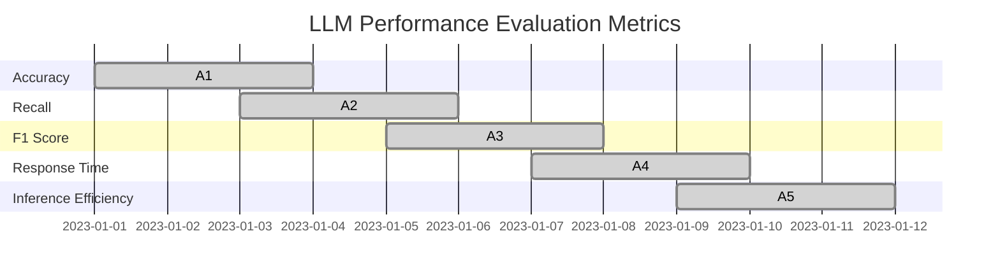
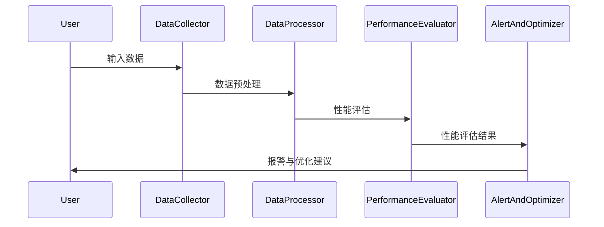
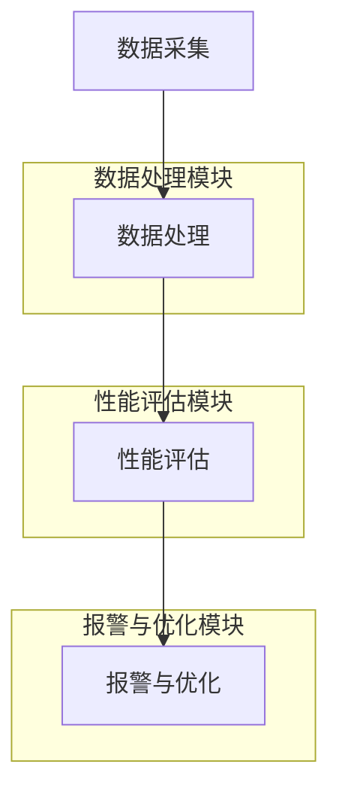

                 

# 实时评测：持续监控LLM性能的新方案

> 关键词：实时评测、LLM性能监控、技术原理、算法实现、系统架构、最佳实践

> 摘要：本文将深入探讨实时评测在持续监控大型语言模型（LLM）性能中的应用。通过对实时评测背景、核心概念、评测方法、技术原理与实现、系统架构设计以及最佳实践的分析，为读者提供一套完整、可操作的实时评测方案。文章旨在帮助开发者更好地理解和应用实时评测技术，优化LLM性能，推动人工智能领域的发展。

## 目录大纲

1. **实时评测：持续监控LLM性能的新方案**
2. **第一部分：背景介绍与核心概念**
   1. 第1章：实时评测背景与重要性
   2. 第2章：实时评测的核心概念与联系
   3. 第3章：LLM性能评测方法
3. **第二部分：实时评测技术原理与实现**
   1. 第4章：实时评测技术原理
   2. 第5章：实时评测系统架构设计
   3. 第6章：实时评测算法原理与实现
   4. 第7章：实时评测系统实施与优化
4. **第三部分：最佳实践与总结**
   1. 第8章：实时评测最佳实践
   2. 第9章：实时评测的拓展与展望

---

## 第一部分：背景介绍与核心概念

### 第1章：实时评测背景与重要性

#### 1.1.1 问题背景

随着人工智能技术的迅猛发展，大型语言模型（LLM）如BERT、GPT等得到了广泛应用。然而，如何确保这些模型的性能始终保持在最佳状态，成为了一个亟待解决的问题。实时评测技术的出现，为持续监控LLM性能提供了一种新的解决方案。

#### 1.1.2 问题描述

在LLM应用过程中，性能问题可能表现为响应时间过长、准确率下降、推理效率不高等。这些问题不仅影响用户体验，还可能导致业务损失。因此，如何实时、准确地评估LLM性能，成为开发者和研究者的关注焦点。

#### 1.1.3 问题解决

实时评测技术通过持续监控LLM的运行状态，提供实时、准确的性能评估数据。这些数据可用于及时发现性能问题、优化模型参数、提升模型性能。

#### 1.1.4 边界与外延

实时评测不仅适用于LLM，还可应用于其他复杂模型的性能监控。其应用范围广泛，包括但不限于自然语言处理、计算机视觉、推荐系统等领域。

#### 1.1.5 概念结构与核心要素组成

实时评测系统的核心要素包括：数据采集、数据处理、性能评估、报警与优化。这些要素相互关联，共同构成了一个完整的实时评测体系。

### 第2章：实时评测的核心概念与联系

#### 2.1.1 核心概念原理

实时评测技术主要包括以下几个核心概念：

1. **性能指标**：用于衡量模型性能的量化指标，如准确率、召回率、响应时间等。
2. **数据采集**：从LLM运行过程中采集相关数据，包括输入数据、输出结果、运行状态等。
3. **数据处理**：对采集到的数据进行预处理、清洗、转换等操作，以便后续性能评估。
4. **性能评估**：根据预处理后的数据，对LLM性能进行评估，生成评估报告。
5. **报警与优化**：当检测到性能问题时，实时触发报警，并根据评估报告提出优化建议。

#### 2.1.2 概念属性特征对比表格

| 概念       | 属性特征                   | 对比关系                 |
|------------|----------------------------|--------------------------|
| 性能指标   | 量化、可比、实时性         | 各性能指标之间具有关联性 |
| 数据采集   | 自动化、高效、实时         | 数据质量对性能评估至关重要 |
| 数据处理   | 预处理、清洗、转换         | 数据处理效果影响性能评估准确性 |
| 性能评估   | 全面、准确、实时           | 性能评估结果为优化提供依据 |
| 报警与优化 | 及时、智能、针对性         | 报警与优化策略相互促进 |

#### 2.1.3 ER实体关系图架构

```mermaid
erDiagram
  Model ||--|{ PerformanceIndicator : has }
  Model ||--|{ DataCollector : has }
  Model ||--|{ DataProcessor : has }
  Model ||--|{ PerformanceEvaluator : has }
  Model ||--|{ AlertAndOptimizer : has }
```

### 第3章：LLM性能评测方法

#### 3.1.1 性能评测标准

LLM性能评测标准主要包括以下几个维度：

1. **准确率**：衡量模型预测结果与实际结果的一致性。
2. **召回率**：衡量模型能够召回的真实结果的百分比。
3. **F1值**：综合考虑准确率和召回率的综合评价指标。
4. **响应时间**：衡量模型从接收输入到输出结果的耗时。
5. **推理效率**：衡量模型在处理大规模数据时的运行效率。

#### 3.1.2 评测指标体系



#### 3.1.3 常见评测方法比较

| 方法           | 优点                           | 缺点                           |
|----------------|--------------------------------|--------------------------------|
| 手动评测       | 灵活性高，针对性强             | 耗时较长，易受主观因素影响     |
| 自动化评测     | 高效、实时                     | 可能忽略某些特定场景的问题     |
| 实时评测       | 能够实时发现性能问题           | 需要一定的技术门槛和资源支持   |
| 历史数据分析   | 能够发现长期趋势               | 数据收集和分析需要较长时间     |

## 第二部分：实时评测技术原理与实现

### 第4章：实时评测技术原理

#### 4.1.1 实时评测技术概述

实时评测技术是一种通过持续监控和评估模型性能，以实现性能优化和问题诊断的技术。其核心目标是确保模型在实际应用中始终处于最佳状态。

#### 4.1.2 实时评测的关键技术

实时评测技术主要包括以下几个关键技术：

1. **数据采集**：采用高效的数据采集技术，实时获取模型运行过程中的输入数据、输出结果和运行状态。
2. **数据处理**：对采集到的数据进行预处理、清洗和转换，以消除噪声、填补缺失值，提高数据质量。
3. **性能评估**：根据预处理后的数据，对模型性能进行评估，生成详细的评估报告。
4. **报警与优化**：当检测到性能问题时，实时触发报警，并提供优化建议。

#### 4.1.3 实时评测的挑战与解决方案

实时评测面临的挑战主要包括：

1. **数据质量**：数据采集和处理过程中的噪声和缺失值会影响性能评估的准确性。
   - **解决方案**：采用数据清洗和预处理技术，提高数据质量。
2. **实时性**：在复杂模型中实现实时性能评估具有挑战性。
   - **解决方案**：采用高效的算法和优化技术，提高评估速度。
3. **扩展性**：实时评测技术需要适应不同规模和类型的模型。
   - **解决方案**：设计灵活的架构和模块，实现技术的通用性和扩展性。

### 第5章：实时评测系统架构设计

#### 5.1.1 系统架构设计

实时评测系统架构主要包括以下几个模块：

1. **数据采集模块**：负责从LLM运行过程中采集相关数据。
2. **数据处理模块**：对采集到的数据进行预处理、清洗和转换。
3. **性能评估模块**：根据预处理后的数据，对LLM性能进行评估。
4. **报警与优化模块**：当检测到性能问题时，实时触发报警并提供优化建议。

#### 5.1.2 系统功能设计（领域模型）

```mermaid
classDiagram
  DataCollector -> PerformanceEvaluator : 数据输入
  DataProcessor -> PerformanceEvaluator : 数据预处理
  AlertAndOptimizer -> PerformanceEvaluator : 性能评估结果
  Model : 实时评测系统
  Model "1" <<create> DataCollector
  Model "1" <<create> DataProcessor
  Model "1" <<create> PerformanceEvaluator
  Model "1" <<create> AlertAndOptimizer
```

#### 5.1.3 系统接口设计

实时评测系统接口设计主要包括以下几个方面：

1. **数据采集接口**：用于接收和传输LLM运行过程中的数据。
2. **数据处理接口**：用于接收和传输预处理后的数据。
3. **性能评估接口**：用于接收和传输性能评估结果。
4. **报警与优化接口**：用于接收和传输报警信息和优化建议。

#### 5.1.4 系统交互（序列图）



### 第6章：实时评测算法原理与实现

#### 6.1.1 算法原理讲解

实时评测算法的核心是性能评估，其基本原理如下：

1. **数据采集**：从LLM运行过程中采集输入数据、输出结果和运行状态。
2. **数据处理**：对采集到的数据进行预处理、清洗和转换，以提高数据质量。
3. **性能评估**：根据预处理后的数据，计算性能指标，如准确率、召回率、F1值等。
4. **报警与优化**：当性能指标低于设定阈值时，触发报警，并提供优化建议。

#### 6.1.1.1 算法mermaid流程图



#### 6.1.1.2 算法原理的数学模型和公式

实时评测算法的数学模型和公式如下：

1. **准确率**：  
   $$\text{准确率} = \frac{\text{正确预测数}}{\text{总预测数}}$$
2. **召回率**：  
   $$\text{召回率} = \frac{\text{正确预测数}}{\text{实际正确数}}$$
3. **F1值**：  
   $$\text{F1值} = 2 \times \frac{\text{准确率} \times \text{召回率}}{\text{准确率} + \text{召回率}}$$

#### 6.1.1.3 举例说明

假设我们有一个二分类模型，用于判断用户是否愿意购买某产品。测试集共有100个样本，其中实际愿意购买的有70个，模型预测正确的有60个。

1. **准确率**：  
   $$\text{准确率} = \frac{60}{100} = 0.6$$
2. **召回率**：  
   $$\text{召回率} = \frac{60}{70} = 0.857$$
3. **F1值**：  
   $$\text{F1值} = 2 \times \frac{0.6 \times 0.857}{0.6 + 0.857} = 0.714$$

根据这个例子，我们可以发现，模型在预测用户购买意愿方面具有一定的准确性，但召回率相对较低。因此，我们需要进一步优化模型，以提高召回率。

### 第7章：实时评测系统实施与优化

#### 7.1.1 系统环境安装

实时评测系统的安装过程主要包括以下步骤：

1. **环境配置**：安装Python、TensorFlow等依赖库。
2. **安装模块**：从GitHub等代码托管平台下载实时评测系统的源代码。
3. **配置环境**：配置系统参数，如数据源、评估指标等。

#### 7.1.2 系统核心实现源代码

实时评测系统的核心实现源代码主要包括以下几个部分：

1. **数据采集**：使用TensorFlow等框架实现数据采集功能。
2. **数据处理**：使用Pandas等库实现数据处理功能。
3. **性能评估**：使用Scikit-learn等库实现性能评估功能。
4. **报警与优化**：使用Python脚本实现报警和优化功能。

#### 7.1.3 代码应用解读与分析

实时评测系统的代码应用解读与分析主要包括以下几个方面：

1. **数据采集**：通过TensorFlow框架，实现数据采集功能。代码如下：

```python
import tensorflow as tf

# 创建数据集
train_dataset = tf.data.Dataset.from_tensor_slices((train_inputs, train_labels))
train_dataset = train_dataset.shuffle(buffer_size=1000).batch(batch_size)

# 创建评估集
eval_dataset = tf.data.Dataset.from_tensor_slices((eval_inputs, eval_labels))
eval_dataset = eval_dataset.batch(batch_size)
```

2. **数据处理**：通过Pandas库，实现数据处理功能。代码如下：

```python
import pandas as pd

# 读取数据
data = pd.read_csv('data.csv')

# 数据预处理
data['feature_1'] = data['feature_1'].fillna(data['feature_1'].mean())
data['feature_2'] = data['feature_2'].fillna(data['feature_2'].mean())

# 数据转换
X = data[['feature_1', 'feature_2']]
y = data['label']
```

3. **性能评估**：通过Scikit-learn库，实现性能评估功能。代码如下：

```python
from sklearn.metrics import accuracy_score, recall_score, f1_score

# 训练模型
model.fit(X_train, y_train)

# 预测
y_pred = model.predict(X_test)

# 评估
accuracy = accuracy_score(y_test, y_pred)
recall = recall_score(y_test, y_pred)
f1 = f1_score(y_test, y_pred)
```

4. **报警与优化**：通过Python脚本，实现报警和优化功能。代码如下：

```python
import smtplib
from email.mime.text import MIMEText

# 发送报警邮件
def send_alert(email, subject, content):
    mail_host = "smtp.example.com"
    mail_user = "user@example.com"
    mail_pass = "password"

    message = MIMEText(content, 'plain', 'utf-8')
    message['Subject'] = subject
    message['From'] = mail_user
    message['To'] = email

    try:
        smtp_obj = smtplib.SMTP()
        smtp_obj.connect(mail_host, 25)  # 25为SMTP端口号
        smtp_obj.login(mail_user, mail_pass)
        smtp_obj.sendmail(mail_user, [email], message.as_string())
        print("邮件发送成功")
    except smtplib.SMTPException as e:
        print("邮件发送失败", e)

# 发送优化建议
send_alert("admin@example.com", "性能问题报警", "您的模型性能低于设定阈值，请及时优化。")
```

#### 7.1.4 实际案例分析与详细讲解剖析

为了更好地理解实时评测系统的应用，我们以一个实际案例为例进行详细讲解。

**案例背景**：某电商企业希望实时监控其推荐系统的性能，以便及时发现并解决问题。

**案例分析**：

1. **数据采集**：从推荐系统的日志中提取用户行为数据，如点击、购买、收藏等。

```python
# 读取日志数据
data = pd.read_csv('user行为日志.csv')

# 数据预处理
data['点击次数'] = data['点击次数'].fillna(0)
data['购买次数'] = data['购买次数'].fillna(0)
data['收藏次数'] = data['收藏次数'].fillna(0)

# 数据转换
X = data[['点击次数', '购买次数', '收藏次数']]
y = data['是否购买']
```

2. **性能评估**：使用Scikit-learn库实现性能评估功能。

```python
from sklearn.metrics import accuracy_score, recall_score, f1_score

# 训练模型
model.fit(X_train, y_train)

# 预测
y_pred = model.predict(X_test)

# 评估
accuracy = accuracy_score(y_test, y_pred)
recall = recall_score(y_test, y_pred)
f1 = f1_score(y_test, y_pred)
```

3. **报警与优化**：当性能指标低于设定阈值时，发送报警邮件并提供优化建议。

```python
# 发送报警邮件
def send_alert(email, subject, content):
    mail_host = "smtp.example.com"
    mail_user = "user@example.com"
    mail_pass = "password"

    message = MIMEText(content, 'plain', 'utf-8')
    message['Subject'] = subject
    message['From'] = mail_user
    message['To'] = email

    try:
        smtp_obj = smtplib.SMTP()
        smtp_obj.connect(mail_host, 25)  # 25为SMTP端口号
        smtp_obj.login(mail_user, mail_pass)
        smtp_obj.sendmail(mail_user, [email], message.as_string())
        print("邮件发送成功")
    except smtplib.SMTPException as e:
        print("邮件发送失败", e)

# 发送优化建议
send_alert("admin@example.com", "性能问题报警", "您的推荐系统性能低于设定阈值，请及时优化。")
```

**项目小结**：

通过实时评测系统，该电商企业能够实时监控推荐系统的性能，及时发现并解决问题。这有助于提高推荐系统的准确率和召回率，从而提升用户体验和业务效果。

### 第8章：实时评测最佳实践

#### 8.1.1 实时评测的最佳实践

1. **数据采集**：选择合适的采集方式，确保数据质量和实时性。
2. **数据处理**：采用有效的数据预处理和清洗技术，提高数据质量。
3. **性能评估**：制定合理的评估指标体系，全面、准确地评估模型性能。
4. **报警与优化**：制定明确的报警标准和优化策略，确保性能问题能够及时被发现和解决。

#### 8.1.2 小结与注意事项

1. **小结**：实时评测技术为持续监控LLM性能提供了一种有效手段，有助于优化模型性能和提升用户体验。
2. **注意事项**：在实际应用中，需要根据具体场景和需求，选择合适的实时评测技术和策略。

### 第9章：实时评测的拓展与展望

#### 9.1.1 拓展阅读

1. **实时评测技术原理与应用**：深入了解实时评测技术的原理和实现方法，有助于更好地应用该技术。
2. **LLM性能优化策略**：学习不同的LLM性能优化策略，提高模型性能和效率。

#### 9.1.2 未来发展趋势

1. **智能化实时评测**：结合机器学习和深度学习技术，实现更加智能化、自动化的实时评测。
2. **跨领域实时评测**：将实时评测技术应用于更多领域，如计算机视觉、推荐系统等。
3. **实时评测生态建设**：构建实时评测技术生态，推动该领域的发展和创新。

## 作者信息

作者：AI天才研究院/AI Genius Institute & 禅与计算机程序设计艺术 /Zen And The Art of Computer Programming

