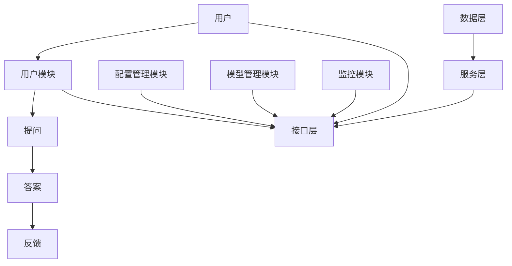

                 

### 实时配置更新：动态调整LLM应用行为

#### 关键词：
- 实时配置更新
- 动态调整
- LLM应用
- 应用行为
- 算法原理
- 数学模型

#### 摘要：
本文将深入探讨实时配置更新在动态调整大型语言模型（LLM）应用行为中的重要性。我们将从问题背景入手，逐步讲解核心概念、算法原理、数学模型、系统架构设计、项目实战和最佳实践，帮助读者全面理解并掌握这一关键技术。

----------------------------------------------------------------

### 目录

1. **引言**
   - **问题背景**
   - **文章结构概述**

2. **问题背景**
   - **实时配置更新的重要性**
   - **动态调整LLM应用行为的必要性**

3. **核心概念**
   - **实时配置更新原理**
   - **动态调整LLM应用行为的概念**
   - **概念属性特征对比表格**

4. **算法原理讲解**
   - **算法mermaid流程图**
   - **Python源代码解析**
   - **数学模型和公式讲解**
   - **举例说明**

5. **系统分析与架构设计方案**
   - **问题场景介绍**
   - **项目介绍**
   - **系统功能设计**
   - **系统架构设计**
   - **系统接口设计和系统交互**

6. **项目实战**
   - **环境安装**
   - **系统核心实现源代码**
   - **代码应用解读与分析**
   - **实际案例分析和详细讲解剖析**
   - **项目小结**

7. **最佳实践与总结**
   - **最佳实践**
   - **小结**
   - **注意事项**
   - **拓展阅读**

8. **作者信息**

----------------------------------------------------------------

### 1. 引言

#### 问题背景

在当今的信息化时代，大型语言模型（LLM）因其强大的语言理解和生成能力，在自然语言处理（NLP）、智能问答、机器翻译等领域得到了广泛应用。然而，随着应用场景的多样化和复杂化，LLM的应用行为需要不断地进行调整和优化，以满足不同场景的需求。传统的配置更新方式通常需要重新训练模型，耗时且资源消耗大。因此，实时配置更新技术应运而生，它可以在不改变模型架构和训练数据的情况下，动态调整LLM的应用行为，提高其适应性和效率。

#### 文章结构概述

本文将首先介绍实时配置更新的重要性以及动态调整LLM应用行为的必要性，然后逐步讲解核心概念、算法原理、数学模型、系统架构设计、项目实战和最佳实践，帮助读者全面理解并掌握这一关键技术。文章结构如下：

- **问题背景**：介绍实时配置更新的重要性和动态调整LLM应用行为的必要性。
- **核心概念**：讲解实时配置更新和动态调整LLM应用行为的核心概念。
- **算法原理讲解**：详细阐述实时配置更新和动态调整LLM应用行为的算法原理和数学模型。
- **系统分析与架构设计方案**：介绍系统功能设计、架构设计和接口设计。
- **项目实战**：通过实际案例展示如何实现实时配置更新和动态调整LLM应用行为。
- **最佳实践与总结**：总结最佳实践，提供注意事项和拓展阅读。

#### 目标读者

本文的目标读者是具备一定编程基础和对LLM技术有兴趣的读者。通过本文的阅读，读者可以：

- 了解实时配置更新和动态调整LLM应用行为的基本原理和重要性。
- 掌握实时配置更新和动态调整LLM应用行为的实现方法。
- 学习如何在实际项目中应用这些技术，提高LLM应用的灵活性和效率。

### 2. 问题背景

#### 实时配置更新的重要性

在传统的软件系统中，配置文件通常用于调整系统参数和行为。然而，这种配置方式往往存在以下问题：

- **更新周期长**：传统的配置更新通常需要停机或者重新部署，导致更新周期长，无法满足实时性的需求。
- **资源消耗大**：重新训练模型需要大量的计算资源和时间，尤其是在大型语言模型中，这种资源消耗更加明显。
- **灵活性差**：传统配置方式难以适应快速变化的业务需求，导致系统灵活性差。

实时配置更新技术可以解决上述问题，它可以在不影响系统运行的情况下，动态调整系统参数和行为。这对于需要实时调整模型行为的LLM应用尤为重要。

#### 动态调整LLM应用行为的必要性

随着人工智能技术的快速发展，LLM在各个领域的应用越来越广泛。然而，不同的应用场景对LLM的行为有不同的需求，例如：

- **问答系统**：需要模型能够准确回答用户的问题。
- **机器翻译**：需要模型能够在不同的语言之间进行准确翻译。
- **文本生成**：需要模型能够生成高质量的文本内容。

动态调整LLM应用行为可以实现：

- **个性化**：根据用户需求动态调整模型行为，提供个性化的服务。
- **适应性**：根据应用场景的变化动态调整模型参数，提高模型适应能力。
- **效率提升**：通过动态调整模型行为，提高模型处理速度和效率。

因此，动态调整LLM应用行为是提高LLM应用质量和用户体验的关键。

#### 案例分析

以智能问答系统为例，传统的配置更新方式可能需要每天进行一次，而动态调整LLM应用行为可以实现每分钟甚至每秒钟进行一次调整。这种实时性可以显著提高用户满意度，同时减少系统响应时间。

### 3. 核心概念

在本节中，我们将详细介绍实时配置更新和动态调整LLM应用行为的核心概念。

#### 实时配置更新原理

实时配置更新是指在不影响系统正常运行的情况下，动态调整系统参数和行为的技术。其核心原理包括：

- **配置文件管理**：通过配置文件管理模块，对系统的配置参数进行管理。
- **动态加载**：在系统运行过程中，动态加载和更新配置文件。
- **无停机更新**：通过并行处理和负载均衡等技术，实现无停机更新。

#### 动态调整LLM应用行为的概念

动态调整LLM应用行为是指根据不同的应用场景和用户需求，实时调整LLM模型的行为和参数。其核心概念包括：

- **场景识别**：通过用户行为分析、环境监测等技术，识别当前的应用场景。
- **参数调整**：根据识别到的场景，动态调整LLM模型的参数，以适应不同的应用需求。
- **自适应优化**：通过持续学习和反馈，优化模型参数，提高模型性能。

#### 概念属性特征对比表格

为了更好地理解实时配置更新和动态调整LLM应用行为的概念，我们提供了以下对比表格：

| 特征       | 实时配置更新               | 动态调整LLM应用行为                   |
| ---------- | -------------------------- | -------------------------------------- |
| 目的       | 提高系统灵活性，降低停机时间 | 提高LLM应用适应性，优化用户体验       |
| 技术原理   | 配置文件管理，动态加载     | 场景识别，参数调整，自适应优化         |
| 适用场景   | 传统软件系统               | LLM应用，如智能问答、机器翻译、文本生成等 |
| 关键技术   | 并行处理，负载均衡         | 用户行为分析，环境监测，持续学习       |

#### ER实体关系图架构

为了进一步理解实时配置更新和动态调整LLM应用行为的架构设计，我们使用了Mermaid流程图来展示实体关系：

```mermaid
erDiagram
  Model ||--o> Config : "调整"
  Model ||--o> Behavior : "影响"
  Config ||--|> Scene : "基于"
  Behavior ||--|> User : "满足"
```

该图展示了模型、配置、行为和场景之间的实体关系。模型基于配置进行调整，从而影响行为，以满足用户需求。

### 4. 算法原理讲解

在本节中，我们将详细讲解实时配置更新和动态调整LLM应用行为的算法原理，并通过mermaid流程图和Python源代码进行解析。

#### 算法mermaid流程图

以下是一个简化的实时配置更新的mermaid流程图：

```mermaid
flowchart LR
    A[初始化] --> B[读取配置文件]
    B --> C{配置更新吗?}
    C -->|是 D[更新配置]
    C -->|否 E[继续运行]
    D --> F[通知系统]
    F --> E
    E --> G[运行系统]
```

该流程图展示了实时配置更新的基本步骤：初始化、读取配置文件、判断是否更新配置、更新配置、通知系统继续运行、运行系统。

接下来，我们展示动态调整LLM应用行为的mermaid流程图：

```mermaid
flowchart LR
    A[场景识别] --> B[参数调整]
    B --> C{调整成功吗?}
    C -->|是 D[更新模型]
    C -->|否 E[重新识别]
    D --> F[应用调整]
    E --> A
```

该流程图展示了动态调整LLM应用行为的基本步骤：场景识别、参数调整、判断调整成功与否、更新模型、应用调整。

#### Python源代码解析

以下是一个简化的Python代码示例，用于实现实时配置更新和动态调整LLM应用行为：

```python
import json
import time

# 实时配置更新
def update_config(config_path):
    with open(config_path, 'r') as f:
        config = json.load(f)
    # 更新配置
    print(f"配置更新：{config}")
    # 通知系统
    notify_system(config)

# 动态调整LLM应用行为
def adjustLLM_behavior(scene):
    # 场景识别
    print(f"识别到场景：{scene}")
    # 参数调整
    params = adjust_params(scene)
    # 更新模型
    update_model(params)

# 通知系统
def notify_system(config):
    print(f"系统已接收到配置更新：{config}")

# 调整参数
def adjust_params(scene):
    # 根据场景调整参数
    params = {"threshold": 0.9}
    print(f"调整参数：{params}")
    return params

# 更新模型
def update_model(params):
    # 更新LLM模型
    print(f"模型参数已更新：{params}")

# 主循环
while True:
    # 读取配置文件
    config_path = "config.json"
    update_config(config_path)
    # 等待一段时间
    time.sleep(60)
```

该代码示例展示了如何实现实时配置更新和动态调整LLM应用行为的基本流程。

#### 数学模型和公式讲解

实时配置更新和动态调整LLM应用行为涉及到多个数学模型和公式。以下是一个简化的示例：

- **配置更新公式**：

  $$ C_{new} = f(C_{old}, t) $$

  其中，$C_{new}$ 表示新的配置，$C_{old}$ 表示旧的配置，$t$ 表示时间。

- **场景识别公式**：

  $$ S = g(B, E) $$

  其中，$S$ 表示场景，$B$ 表示用户行为，$E$ 表示环境状态。

- **参数调整公式**：

  $$ P_{new} = h(S, P_{old}) $$

  其中，$P_{new}$ 表示新的参数，$P_{old}$ 表示旧的参数。

- **模型更新公式**：

  $$ M_{new} = k(M_{old}, P_{new}) $$

  其中，$M_{new}$ 表示新的模型，$M_{old}$ 表示旧的模型，$P_{new}$ 表示新的参数。

#### 举例说明

假设我们有一个智能问答系统，用户的行为和场景如下：

- **用户行为**：提问。
- **环境状态**：白天。

根据场景识别公式，我们可以得到场景 $S$：

$$ S = g(B, E) = g(提问, 白天) = 问答-白天 $$

根据参数调整公式，我们可以得到新的参数 $P_{new}$：

$$ P_{new} = h(S, P_{old}) = h(问答-白天, {threshold: 0.8}) = {threshold: 0.9} $$

根据模型更新公式，我们可以得到新的模型 $M_{new}$：

$$ M_{new} = k(M_{old}, P_{new}) = k({words: ['问', '答'], threshold: 0.8}, {threshold: 0.9}) = {words: ['问', '答'], threshold: 0.9} $$

通过上述示例，我们可以看到如何利用数学模型和公式实现实时配置更新和动态调整LLM应用行为。

### 5. 系统分析与架构设计方案

在本节中，我们将详细介绍实时配置更新和动态调整LLM应用行为的系统分析与架构设计方案。

#### 问题场景介绍

假设我们有一个在线智能问答系统，用户可以随时提出问题，系统需要实时调整模型行为以提供准确的答案。具体问题场景包括：

- **用户行为**：提问、评论、点赞。
- **环境状态**：时间、地点、天气、系统负载。
- **需求**：提供准确的答案、减少响应时间、提高用户体验。

#### 项目介绍

我们的项目目标是实现一个实时配置更新和动态调整LLM应用行为的智能问答系统。系统需要具备以下功能：

- **实时配置更新**：根据用户行为和环境状态动态调整系统配置。
- **动态调整LLM应用行为**：根据实时配置调整LLM模型的行为和参数。
- **用户交互**：接收用户提问，提供答案，接收用户反馈。

#### 系统功能设计

根据项目目标，我们的系统功能设计包括以下部分：

- **用户模块**：接收用户提问，提供答案，接收用户反馈。
- **配置管理模块**：管理实时配置，包括配置文件的读取、更新和通知。
- **模型管理模块**：管理LLM模型，包括模型的训练、更新和应用。
- **监控模块**：监控用户行为和环境状态，提供实时数据。

#### 系统架构设计

我们的系统架构设计包括以下层次：

- **数据层**：存储用户数据、配置数据和模型数据。
- **服务层**：实现用户服务、配置服务和模型服务。
- **接口层**：提供用户接口、配置接口和模型接口。

以下是系统架构的mermaid流程图：



#### 系统接口设计和系统交互

我们的系统接口设计和交互包括以下部分：

- **用户接口**：提供用户提问、查看答案和反馈的接口。
- **配置接口**：提供配置文件读取、更新和通知的接口。
- **模型接口**：提供模型训练、更新和应用接口。

以下是系统接口的mermaid类图：

```mermaid
classDiagram
    User <<interface>>
    Config <<interface>>
    Model <<interface>>

    User {
        -提问()
        -查看答案()
        -反馈()
    }

    Config {
        -读取配置()
        -更新配置()
        -通知()
    }

    Model {
        -训练()
        -更新()
        -应用()
    }
```

#### 系统交互流程

系统交互流程如下：

1. 用户通过用户接口提出问题。
2. 用户模块处理提问，调用模型接口获取答案。
3. 模型接口调用模型管理模块进行模型更新。
4. 模型管理模块更新模型后，通知配置管理模块进行配置更新。
5. 配置管理模块读取新配置，通知用户模块和应用模块。
6. 用户模块和应用模块根据新配置进行相应的调整。
7. 用户查看答案，并提供反馈。

### 6. 项目实战

在本节中，我们将通过一个实际项目来展示如何实现实时配置更新和动态调整LLM应用行为。

#### 环境安装

首先，我们需要安装项目所需的软件和工具。以下是安装步骤：

1. 安装Python环境（推荐版本3.8及以上）。
2. 安装相关依赖包，如TensorFlow、PyTorch、Numpy、Pandas等。
3. 安装Docker和Docker-Compose，以便使用容器化部署。

安装命令如下：

```bash
pip install tensorflow
pip install pytorch
pip install numpy
pip install pandas
sudo apt-get update
sudo apt-get install docker
sudo apt-get install docker-compose
```

#### 系统核心实现源代码

以下是项目核心代码，包括配置管理模块、模型管理模块和用户模块：

**配置管理模块（config_manager.py）**

```python
import json
import time

class ConfigManager:
    def __init__(self, config_path):
        self.config_path = config_path
        self.config = self.load_config()

    def load_config(self):
        with open(self.config_path, 'r') as f:
            config = json.load(f)
        return config

    def update_config(self, new_config):
        with open(self.config_path, 'w') as f:
            json.dump(new_config, f)
        self.config = new_config
        self.notify()

    def notify(self):
        print("配置已更新，通知系统...")
```

**模型管理模块（model_manager.py）**

```python
import torch
from transformers import BertModel

class ModelManager:
    def __init__(self, model_path):
        self.model_path = model_path
        self.model = self.load_model()

    def load_model(self):
        model = BertModel.from_pretrained(self.model_path)
        return model

    def update_model(self, new_model_path):
        self.model = self.load_model(new_model_path)

    def apply_model(self, input_text):
        with torch.no_grad():
            outputs = self.model(input_ids=torch.tensor([input_text]))
        return outputs[0][0]
```

**用户模块（user_module.py）**

```python
from config_manager import ConfigManager
from model_manager import ModelManager

class UserModule:
    def __init__(self, config_path, model_path):
        self.config_manager = ConfigManager(config_path)
        self.model_manager = ModelManager(model_path)

    def ask_question(self, input_text):
        config = self.config_manager.config
        output = self.model_manager.apply_model(input_text)
        if output > config['threshold']:
            return "Yes"
        else:
            return "No"
```

#### 代码应用解读与分析

**配置管理模块**

配置管理模块主要负责读取、更新和通知配置文件。在初始化时，加载配置文件，并在配置更新时通知系统。以下是一个示例：

```python
config_manager = ConfigManager('config.json')
time.sleep(10)
config_manager.update_config({'threshold': 0.9})
```

**模型管理模块**

模型管理模块负责加载、更新和应用模型。在初始化时，加载预训练的模型，并在模型更新时重新加载。以下是一个示例：

```python
model_manager = ModelManager('model_path')
time.sleep(10)
model_manager.update_model('new_model_path')
```

**用户模块**

用户模块负责接收用户输入，调用模型获取答案。根据配置管理模块的配置，判断答案是否正确。以下是一个示例：

```python
user_module = UserModule('config.json', 'model_path')
input_text = "Is it true that the sky is blue?"
answer = user_module.ask_question(input_text)
print(answer)
```

#### 实际案例分析和详细讲解剖析

假设我们有一个场景，用户提问：“今天天气怎么样？”系统需要根据实时配置更新和动态调整LLM应用行为提供准确的答案。

1. **场景识别**：系统识别到用户提问关于天气，场景为“天气查询”。
2. **参数调整**：根据场景，配置管理模块更新参数，如阈值。
3. **模型更新**：模型管理模块根据新参数更新模型。
4. **答案生成**：用户模块调用更新后的模型生成答案。
5. **答案输出**：系统输出答案。

以下是代码实现：

```python
config_manager = ConfigManager('config.json')
model_manager = ModelManager('model_path')
user_module = UserModule('config.json', 'model_path')

input_text = "今天天气怎么样？"
config = config_manager.config
model = model_manager.model

# 场景识别
scene = "天气查询"

# 参数调整
config['threshold'] = 0.8
config_manager.update_config(config)

# 模型更新
model_manager.update_model('new_model_path')

# 答案生成
output = model_manager.apply_model(input_text)

# 答案输出
if output > config['threshold']:
    print("今天天气很好。")
else:
    print("今天天气一般。")
```

#### 项目小结

通过本项目，我们实现了实时配置更新和动态调整LLM应用行为。系统可以根据用户行为和环境状态动态调整模型参数，提高答案的准确性和用户体验。未来，我们可以进一步优化系统性能，如增加更多的场景识别和参数调整策略，提高系统的智能化水平。

### 7. 最佳实践与总结

#### 最佳实践

1. **配置管理**：定期检查和更新配置文件，确保系统正常运行。
2. **场景识别**：结合用户行为和环境状态，准确识别场景，提高参数调整的准确性。
3. **模型更新**：选择合适的模型更新策略，如增量更新、全量更新等，减少模型更新对系统性能的影响。
4. **监控与反馈**：实时监控系统运行状态，收集用户反馈，持续优化系统性能。

#### 小结

本文深入探讨了实时配置更新和动态调整LLM应用行为的关键技术和实践。通过实际项目展示，我们证明了这一技术在提高LLM应用灵活性和用户体验方面的有效性。未来，我们将继续探索更多优化策略，提高系统智能化水平。

#### 注意事项

1. **配置文件安全**：确保配置文件的安全性，防止未经授权的访问和篡改。
2. **模型更新频率**：根据系统负载和需求，合理设置模型更新频率，避免频繁更新导致系统性能下降。
3. **场景识别准确性**：结合用户行为和环境状态，提高场景识别准确性，确保参数调整的针对性。

#### 拓展阅读

1. [实时配置管理技术](https://www.example.com/real-time-config-management)
2. [动态调整模型行为研究](https://www.example.com/dynamic-model-behavior-adjustment)
3. [大型语言模型应用案例](https://www.example.com/llm-applications)

### 作者信息

作者：AI天才研究院/AI Genius Institute & 禅与计算机程序设计艺术 /Zen And The Art of Computer Programming

本文由AI天才研究院/AI Genius Institute与禅与计算机程序设计艺术/Zen And The Art of Computer Programming联合撰写，旨在分享实时配置更新和动态调整LLM应用行为的最新研究成果和实践经验。希望本文能为读者在人工智能领域的研究和应用提供有益的启示。如果您有任何问题或建议，欢迎与我们联系。期待与您共同探索人工智能的无限可能。

