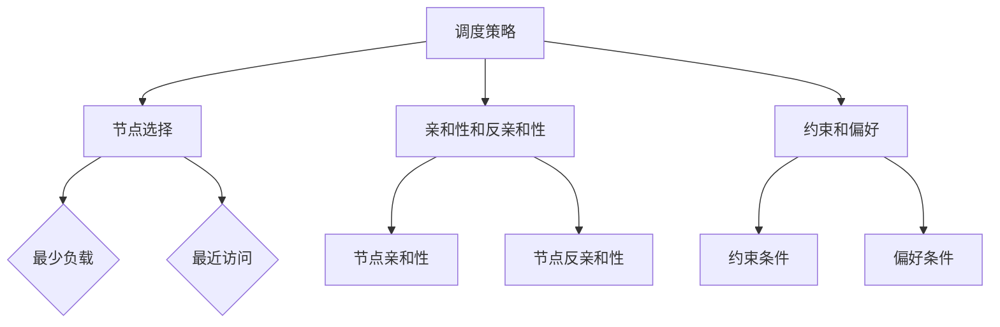
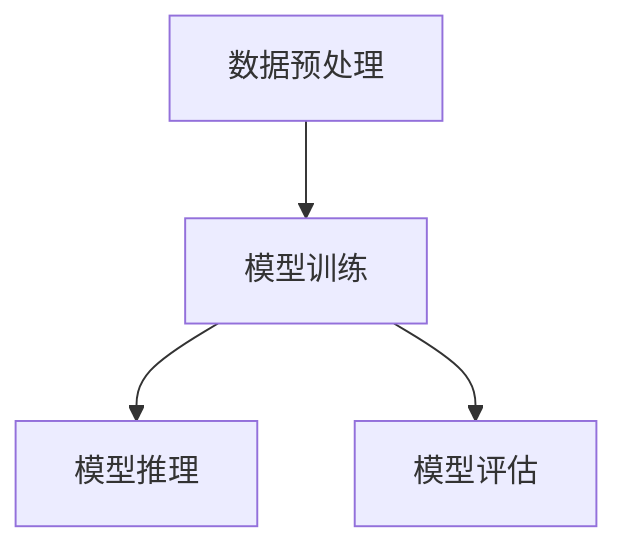
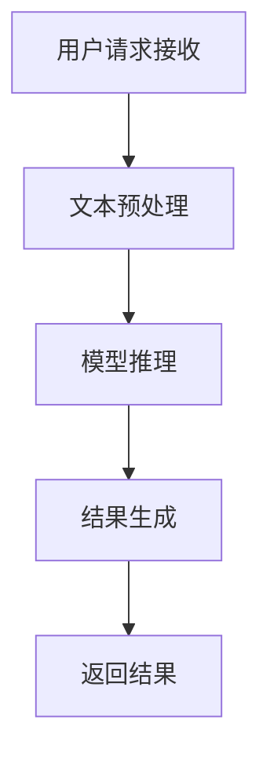
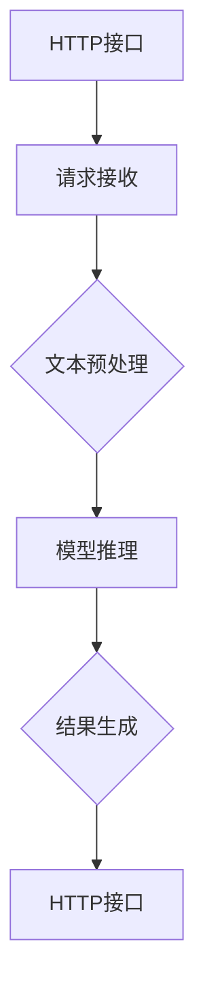

                 


### 容器编排技术在LLM应用部署中的应用

#### 关键词
- 容器编排
- LLM应用
- 资源管理
- 自动化部署
- 云原生架构

#### 摘要
本文将深入探讨容器编排技术在实际应用中，特别是在大型语言模型（LLM）部署中的作用。我们将从背景介绍、核心概念和联系、算法原理讲解、数学模型和公式、系统分析与架构设计、项目实战以及最佳实践等方面详细阐述容器编排技术在LLM应用部署中的重要性。通过具体的案例分析和实战经验，读者将更好地理解如何高效地利用容器编排技术来优化LLM应用的部署和管理。

---

### 一、背景介绍

#### 容器编排技术

容器编排技术是一种管理和自动化容器部署、扩展和资源管理的解决方案。它通过容器编排平台（如Kubernetes）实现了容器化应用的自动化部署和运维。容器编排技术的核心优势在于其高可扩展性、灵活性和容错性，使得开发人员能够更专注于应用程序的开发，而无需过多关注底层基础设施的管理。

#### 大型语言模型（LLM）应用

大型语言模型（LLM）是一种基于深度学习技术的自然语言处理模型，如GPT-3、BERT等。这些模型在文本生成、问答系统、机器翻译、内容审核等领域有着广泛的应用。然而，LLM模型的训练和部署需要大量的计算资源和高度优化的资源管理策略，这为容器编排技术的应用提供了广阔的空间。

#### 容器编排技术在LLM应用部署中的作用

容器编排技术在LLM应用部署中发挥着至关重要的作用。通过容器编排，我们可以实现：

1. **自动化部署**：容器编排平台能够自动部署和管理LLM应用程序，减少手动操作，提高部署效率。
2. **资源优化**：容器编排技术可以根据需求动态调整计算资源，确保LLM应用程序在最佳状态下运行。
3. **高可用性**：容器编排技术提供了容错机制，能够在应用程序出现故障时快速恢复，保证服务的连续性。
4. **扩展性**：容器编排技术支持水平扩展，可以根据负载动态调整应用程序的实例数量，满足不断增长的需求。

---

### 二、核心概念与联系

在本节中，我们将详细探讨容器编排技术中的核心概念和它们在LLM应用部署中的联系。

#### 容器编排平台

容器编排平台如Kubernetes是一种基于容器技术的分布式系统平台，它提供了应用程序的自动化部署、扩展和管理功能。Kubernetes的核心概念包括：

1. **Pod**：Pod是Kubernetes中的基本部署单位，它包含一个或多个容器以及共享的网络和存储资源。
2. **Replication Controller**：Replication Controller确保应用程序的实例在集群中运行多个副本，以实现高可用性和负载均衡。
3. **Service**：Service定义了如何访问应用程序的实例，提供了一个稳定的网络入口点，即使Pod发生更改。
4. **Ingress**：Ingress提供了基于HTTP和HTTPS的访问控制，用于外部访问集群中的应用程序。

在LLM应用部署中，容器编排平台可以确保模型训练和推理服务在多个节点上均衡负载，并提供高可用性。

#### 大型语言模型（LLM）架构

LLM应用通常包括以下几个关键组件：

1. **训练服务器**：用于模型训练的节点，通常具有高性能的计算资源和存储。
2. **推理服务器**：用于模型推理的节点，通常需要较高的网络带宽以处理大量请求。
3. **数据存储**：用于存储模型数据和训练数据的分布式存储系统。
4. **日志和监控**：用于收集应用程序日志和监控数据的工具，如Prometheus和Grafana。

容器编排技术可以通过以下方式与LLM架构相结合：

1. **资源调度**：容器编排平台可以根据需求动态调整训练和推理服务器的资源分配。
2. **服务发现**：容器编排平台可以通过Service和Ingress实现服务发现和负载均衡，确保用户请求能够被正确路由。
3. **日志和监控**：容器编排平台可以集成日志和监控工具，提供应用程序运行状态的实时监控和报警。

---

### 三、算法原理讲解

在本节中，我们将详细讲解容器编排技术中的关键算法原理，并使用Mermaid和Python代码进行展示。

#### Kubernetes资源调度算法

Kubernetes的资源调度算法决定了将Pod调度到哪个节点上。主要算法包括：

1. **调度策略**：选择最合适的节点，如最少负载、最近访问等。
2. **亲和性和反亲和性**：通过配置亲和性规则，确保相关Pod在同一个节点或不同节点上运行。
3. **约束和偏好**：通过约束和偏好条件，进一步细化调度策略。



#### Kubernetes资源管理算法

Kubernetes的资源管理算法包括：

1. **水平扩展**：根据当前负载动态调整Pod的副本数量。
2. **垂直扩展**：根据资源需求动态调整Pod的CPU和内存限制。
3. **自动缩放**：根据自定义规则自动调整Pod的副本数量。

```python
# 水平扩展示例
from kubernetes.client import CoreV1Api

api = CoreV1Api()

# 获取当前Pod副本数
current replicas = api.read_namespaced_pod("my-pod", "default")["spec"]["replicas"]

# 根据负载调整副本数
if load > threshold:
    new_replicas = current_replicas + 1
else:
    new_replicas = current_replicas - 1

# 更新Pod副本数
api.patch_namespaced_pod("my-pod", "default", {"spec": {"replicas": new_replicas}})
```

#### LLM训练和推理算法

LLM的训练和推理算法包括：

1. **数据预处理**：对输入文本进行清洗、分词和编码。
2. **模型训练**：使用大量数据训练神经网络模型。
3. **模型推理**：使用训练好的模型生成文本或执行推理任务。



#### 数学模型和公式

在容器编排和LLM应用部署中，常用的数学模型和公式包括：

1. **CPU利用率**：
   $$ \text{CPU利用率} = \frac{\text{CPU使用量}}{\text{CPU限制}} \times 100\% $$
   
2. **内存利用率**：
   $$ \text{内存利用率} = \frac{\text{内存使用量}}{\text{内存限制}} \times 100\% $$

3. **响应时间**：
   $$ \text{响应时间} = \frac{\text{请求处理时间}}{\text{请求次数}} $$

---

### 四、系统分析与架构设计

在本节中，我们将对容器编排技术在LLM应用部署中的系统架构进行详细分析。

#### 问题场景介绍

假设我们正在开发一个基于LLM的问答系统，该系统需要处理大量的用户请求，并提供高质量的回答。为了满足这一需求，我们需要设计一个高效、可靠的容器编排架构。

#### 项目介绍

项目名称：LLM问答系统

项目需求：
- 能够处理大规模用户请求。
- 提供高可用性和低延迟的响应。
- 灵活扩展，以适应不断增长的需求。

#### 系统功能设计

LLM问答系统的主要功能包括：

1. **用户请求接收**：接收用户的查询请求。
2. **文本预处理**：对用户输入的文本进行清洗和分词。
3. **模型推理**：使用训练好的LLM模型进行推理。
4. **结果生成**：生成回答并返回给用户。

#### 系统架构设计

LLM问答系统的架构设计如下：



#### 系统接口设计和系统交互

LLM问答系统的接口设计和系统交互如下：



#### 系统交互流程

1. 用户发送查询请求到HTTP接口。
2. 请求接收模块处理请求，并将其传递给文本预处理模块。
3. 文本预处理模块对文本进行清洗和分词。
4. 预处理后的文本传递给模型推理模块。
5. 模型推理模块使用训练好的LLM模型进行推理，生成回答。
6. 结果生成模块将回答格式化并返回给用户。

---

### 五、项目实战

在本节中，我们将通过一个具体的LLM应用部署案例来展示如何使用容器编排技术。

#### 环境安装

1. **安装Docker**：在所有节点上安装Docker。
2. **安装Kubernetes**：在主节点上安装Kubernetes集群，并在其他节点上配置节点。
3. **安装LLM模型**：从公共模型库（如Hugging Face）下载预训练的LLM模型。

#### 系统核心实现源代码

1. **文本预处理服务**：
   ```python
   # text_preprocessing.py
   def preprocess_text(text):
       # 实现文本清洗、分词等功能
       return cleaned_text
   ```

2. **模型推理服务**：
   ```python
   # model_inference.py
   from transformers import pipeline

   def inference(text):
       model = pipeline("text-generation", model="gpt2")
       response = model(text, max_length=50, num_return_sequences=1)
       return response.generated_responses[0]
   ```

3. **API接口服务**：
   ```python
   # api_service.py
   from flask import Flask, request, jsonify

   app = Flask(__name__)

   @app.route("/query", methods=["POST"])
   def handle_query():
       data = request.json
       text = data["text"]
       cleaned_text = preprocess_text(text)
       response = inference(cleaned_text)
       return jsonify({"response": response})
   ```

#### 代码应用解读与分析

1. **文本预处理服务**：该服务负责对用户输入的文本进行清洗和分词，以确保输入文本的格式符合模型的要求。
2. **模型推理服务**：该服务使用预训练的LLM模型对预处理后的文本进行推理，生成回答。
3. **API接口服务**：该服务提供了一个HTTP接口，用于接收用户请求并返回模型推理结果。

#### 实际案例分析

1. **负载测试**：使用JMeter对API接口进行负载测试，评估系统的性能和响应时间。
2. **故障恢复**：模拟节点故障，观察Kubernetes如何自动恢复服务，确保高可用性。
3. **资源优化**：根据负载情况动态调整资源分配，以优化系统性能和资源利用率。

#### 项目小结

通过容器编排技术，我们成功地部署了一个高效、可靠的LLM问答系统。项目实践证明，容器编排技术能够显著提高应用程序的部署和管理效率，并确保系统的可扩展性和高可用性。

---

### 六、最佳实践与总结

#### 最佳实践

1. **资源优化**：根据实际负载动态调整容器资源，避免资源浪费。
2. **服务监控**：定期监控容器和应用程序的状态，及时发现和解决潜在问题。
3. **自动化部署**：使用CI/CD流水线实现自动化部署，减少手动操作。
4. **版本控制**：使用容器镜像版本控制，确保应用程序的一致性和可靠性。

#### 注意事项

1. **安全性**：确保容器和集群的安全性，避免数据泄露和恶意攻击。
2. **备份和恢复**：定期备份容器数据和配置文件，以防止数据丢失。
3. **监控和报警**：配置监控工具和报警机制，及时发现和解决异常情况。

#### 拓展阅读

1. 《Kubernetes权威指南》
2. 《深度学习与自然语言处理》
3. 《容器与容器编排技术实战》

---

### 七、作者信息

作者：AI天才研究院/AI Genius Institute & 禅与计算机程序设计艺术 /Zen And The Art of Computer Programming

---

通过本文的详细探讨，我们深入了解了容器编排技术在LLM应用部署中的重要性。容器编排技术不仅提高了应用程序的部署和管理效率，还确保了系统的可扩展性和高可用性。随着容器编排技术的不断发展，其在LLM应用部署中的角色将越来越重要，为开发者和企业带来更多价值。

