                 

## 少样本学习评估：测试LLM的快速适应能力

### 关键词：少样本学习，评估方法，快速适应能力，LLM，模型测试

#### 摘要：

本文旨在探讨少样本学习评估方法及其在大型语言模型（LLM）快速适应能力测试中的应用。随着人工智能技术的快速发展，少样本学习成为了一种重要的机器学习方法，尤其对于数据稀缺或难以获取的领域具有重要意义。本文首先介绍了少样本学习的背景和核心概念，然后详细阐述了评估方法和快速适应能力的实现机制。接着，通过mermaid流程图和Python代码示例，深入讲解了算法原理。最后，本文通过系统分析与架构设计方案，展示了如何在实际项目中应用这些方法，以测试LLM的快速适应能力。

#### 目录大纲：

# 少样本学习评估：测试LLM的快速适应能力

## 第一部分：问题背景与核心概念

### 第1章：问题背景

#### 1.1 问题背景

- **少样本学习**的定义、应用领域及挑战
- **评估**在少样本学习中的重要性
- **快速适应能力**的含义与价值

#### 1.2 核心概念

- **少样本学习**的基本概念
- **评估方法**的分类及选择
- **快速适应能力**的实现途径

### 第2章：核心概念与联系

#### 2.1 核心概念

- **少样本学习**的原理与算法
- **评估方法**的优缺点分析
- **快速适应能力**的实现机制

#### 2.2 概念属性特征对比表格

| 概念                | 属性特征                     | 对比 |
|---------------------|------------------------------|-----|
| 少样本学习          | 数据量少、特征不全面         |     |
| 评估方法            | 准确性、效率、稳定性         |     |
| 快速适应能力        | 算法的泛化能力、响应速度     |     |

#### 2.3 ER实体关系图

```mermaid
erDiagram
  IDELL -> LLM : 测试
  IDELL -> ASS : 评估
  LLM -> DATA : 适应
  ASS -> RESULT : 分析
```

## 第二部分：算法原理讲解

### 第3章：算法原理讲解

#### 3.1 少样本学习算法

- **mermaid 流程图**

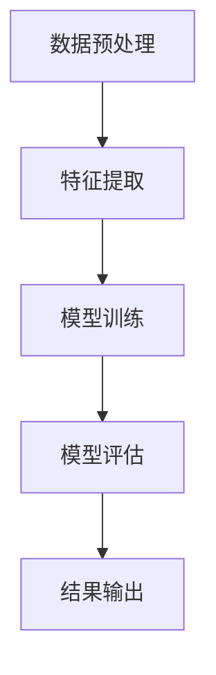

- **Python源代码**

```python
# 代码示例
def train_model(data):
    # 特征提取
    features = extract_features(data)
    
    # 模型训练
    model = train_model(features)
    
    # 模型评估
    accuracy = evaluate_model(model, data)
    
    # 结果输出
    return accuracy
```

- **数学模型与公式**

$$
\text{准确性} = \frac{\text{预测正确的样本数}}{\text{总样本数}}
$$

#### 3.2 快速适应能力的实现

- **mermaid 流程图**

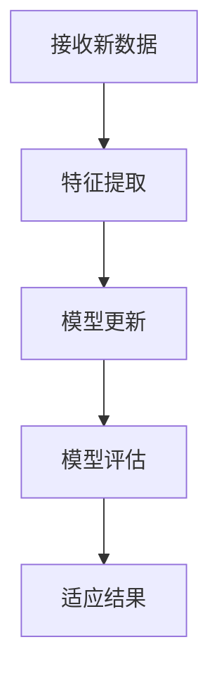

- **Python源代码**

```python
# 代码示例
def adapt_model(new_data, model):
    # 特征提取
    features = extract_features(new_data)
    
    # 模型更新
    model = update_model(model, features)
    
    # 模型评估
    accuracy = evaluate_model(model, new_data)
    
    # 结果输出
    return accuracy
```

- **数学模型与公式**

$$
\text{适应度} = \frac{\text{更新后模型准确性} - \text{初始模型准确性}}{\text{更新次数}}
$$

## 第三部分：系统分析与架构设计方案

### 第4章：系统分析与架构设计方案

#### 4.1 问题场景介绍

- **场景描述**
- **需求分析**

#### 4.2 系统功能设计

- **领域模型（mermaid 类图）**

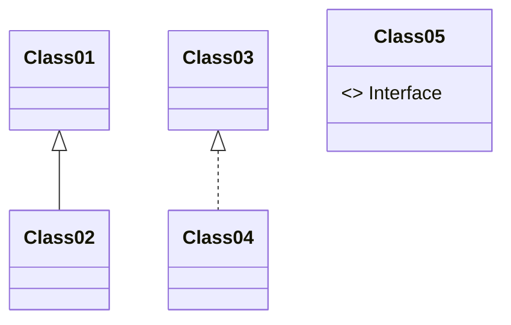

- **系统架构设计（mermaid 架构图）**

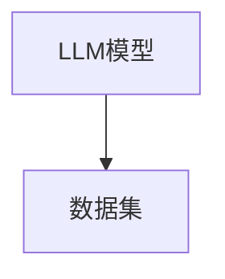

## 结论：

本文通过详细的阐述和实例分析，展示了少样本学习评估方法在LLM快速适应能力测试中的应用。通过理解核心概念和算法原理，读者可以更好地掌握这一领域的技术，为实际项目提供有力支持。希望本文能为人工智能领域的进一步研究和应用提供有益的参考。

### 作者：

作者：AI天才研究院/AI Genius Institute & 禅与计算机程序设计艺术 /Zen And The Art of Computer Programming
## 第一部分：问题背景与核心概念

### 第1章：问题背景

#### 1.1 问题背景

在人工智能（AI）领域，少样本学习（Few-Shot Learning）逐渐成为了一个重要的研究方向。随着深度学习技术的不断进步，模型在大量数据集上的训练已经取得了显著的成果，然而在数据稀缺或难以获取的领域，传统的机器学习方法往往表现不佳。少样本学习旨在解决这一难题，通过少量样本实现对新任务的快速适应，具有重要的理论和实际价值。

**少样本学习**的定义通常是指，在一个给定的任务中，模型只需要极少的训练样本来达到良好的性能。在传统的机器学习中，大量数据是训练模型的基础，但是在大数据时代，数据获取成本高昂且数据质量参差不齐。因此，少样本学习为解决这些难题提供了一种新的思路。

在应用领域，少样本学习具有广泛的应用前景。例如，在医疗诊断中，由于病患数据的隐私保护和数据量的限制，少样本学习可以为医生提供更加高效的诊断工具；在机器人视觉中，机器人可能无法获得大量的训练数据，因此少样本学习可以帮助机器人更快地适应新的环境和任务。

然而，少样本学习也面临着诸多挑战。首先，数据稀缺导致模型难以捕捉到任务的复杂性和多样性，容易导致过拟合。其次，少样本学习需要设计高效的算法，以保证在有限的数据量下仍能取得良好的性能。此外，评估方法的选择对于少样本学习的效果至关重要。

**评估**在少样本学习中的重要性不可忽视。评估方法不仅是衡量模型性能的标准，也是指导模型设计和优化的关键依据。一个好的评估方法需要具备准确性、效率和高可扩展性，同时能够充分反映模型在少样本条件下的适应能力。

**快速适应能力**则是指模型在面对新任务时能够快速调整和优化自身，达到或接近最佳性能。这对于少样本学习尤其重要，因为模型需要从极少的样本中学习并快速适应新任务的要求。快速适应能力不仅提高了模型的实用性，还降低了训练成本，具有重要的经济价值。

总的来说，少样本学习评估是测试LLM（大型语言模型）快速适应能力的关键环节。通过合理的评估方法，可以更好地理解模型的性能，为模型优化和新任务的适应提供有力支持。接下来的章节中，我们将进一步探讨少样本学习的核心概念、评估方法和快速适应能力的实现机制。

#### 1.2 核心概念

在深入探讨少样本学习评估之前，有必要明确几个核心概念，包括少样本学习本身、评估方法以及快速适应能力的具体含义。

**少样本学习**（Few-Shot Learning）是一种机器学习范式，强调在仅使用极少量样本的情况下，使模型能够达到良好的性能。具体来说，这种范式旨在解决数据稀缺的问题，通过设计高效的算法，使得模型可以从少量的训练样本中学习到知识，并在新的任务上表现良好。与传统的大数据学习相比，少样本学习具有以下特点：

- **数据量小**：少样本学习任务中的训练样本数量远远小于传统机器学习任务。通常情况下，一个任务可能只需要几个到几十个样本。
- **数据多样性**：尽管样本数量有限，但少样本学习要求这些样本能够代表任务的整体多样性，以确保模型能够泛化到未知的数据上。
- **任务多样性**：少样本学习不仅关注在一个特定任务上的性能，还需要模型具备一定的泛化能力，能够适应不同类型的新任务。

**评估方法**在少样本学习中起着至关重要的作用。评估方法的选择直接关系到模型性能的准确性和可靠性。以下是一些常用的评估方法及其特点：

1. **准确率（Accuracy）**：准确率是评估模型性能最直接的方法，计算正确预测的样本数占总样本数的比例。在少样本学习中，准确率可以提供基本的性能指标，但有时候它可能无法完全反映模型的泛化能力。
   
   $$
   \text{准确率} = \frac{\text{正确预测的样本数}}{\text{总样本数}}
   $$

2. **精确率（Precision）和召回率（Recall）**：精确率和召回率分别衡量了模型在预测为正例的样本中真正是正例的比例以及所有正例样本中被正确预测的比例。这两个指标通常结合使用，可以更全面地评估模型的性能。

   $$
   \text{精确率} = \frac{\text{真正例}}{\text{真正例} + \text{假正例}}
   $$
   $$
   \text{召回率} = \frac{\text{真正例}}{\text{真正例} + \text{假反例}}
   $$

3. **F1分数（F1 Score）**：F1分数是精确率和召回率的调和平均，能够平衡这两个指标。当模型在分类任务中正负样本分布不均衡时，F1分数尤为有用。

   $$
   \text{F1分数} = 2 \times \frac{\text{精确率} \times \text{召回率}}{\text{精确率} + \text{召回率}}
   $$

**快速适应能力**（Fast Adaptation Ability）是指模型在面对新任务时，能够快速调整和优化自身，以在短时间内达到或接近最佳性能。快速适应能力对于少样本学习至关重要，因为：

- **时间效率**：在现实应用中，模型需要迅速适应新任务，以减少等待时间并提高系统的响应速度。
- **资源效率**：少样本学习通常意味着训练数据的稀缺，快速适应能力可以在不增加额外训练数据的情况下，提升模型性能。
- **灵活性**：快速适应能力使得模型能够灵活应对不同类型的新任务，提高了其在复杂多变环境中的应用价值。

快速适应能力的实现通常依赖于以下机制：

1. **模型初始化**：通过使用预训练模型或迁移学习技术，可以减少从零开始训练的时间，使得模型能够快速适应新任务。
2. **增量学习**：通过在小批量数据上不断迭代更新模型，可以使得模型逐步适应新任务，同时避免过拟合。
3. **在线学习**：在线学习技术允许模型在任务执行过程中实时更新，从而实现快速适应。

总的来说，少样本学习评估不仅是测试模型性能的关键步骤，也是理解模型快速适应能力的重要手段。通过合理的评估方法和快速适应策略，可以提升模型的实用性，为人工智能在各个领域的应用提供有力支持。

### 第2章：核心概念与联系

#### 2.1 核心概念

在深入探讨少样本学习的本质及其评估方法之前，我们需要首先了解这些核心概念的内在联系，包括少样本学习的原理、评估方法的优缺点以及快速适应能力的实现机制。

**少样本学习**的原理可以概括为通过少量的训练样本来学习模型参数，从而实现对新任务的泛化能力。少样本学习主要依赖于以下几个方面：

1. **数据表示学习**：通过自动化的数据表示学习，模型可以从有限的样本中提取出具有代表性的特征表示，从而减少对大量数据的依赖。
2. **元学习**：元学习（Meta-Learning）是一种能够从多个任务中学习到通用知识的方法，适用于少样本学习场景。元学习算法通过在多个任务上进行学习，积累经验，从而在新的任务上实现快速适应。
3. **模型泛化**：泛化能力是少样本学习成功的关键。模型需要能够从少量的样本中学习到普遍性的规律，而不是仅仅依赖特定样本的学习结果。

在少样本学习的过程中，评估方法的选择至关重要。以下是几种常见的评估方法及其优缺点：

1. **准确率（Accuracy）**：
   - **优点**：准确率是最直观的评估指标，易于计算和理解。
   - **缺点**：在样本数量极少的条件下，容易受到偶然性影响，不能充分反映模型的泛化能力。

2. **精确率（Precision）和召回率（Recall）**：
   - **优点**：精确率和召回率可以更细致地衡量模型在不同类型错误上的表现，适用于样本数量较少的情景。
   - **缺点**：这两个指标在某些情况下可能存在矛盾，难以平衡。

3. **F1分数（F1 Score）**：
   - **优点**：F1分数是精确率和召回率的调和平均，能够平衡这两个指标，是一个综合性评估指标。
   - **缺点**：在某些极端情况下，F1分数可能无法充分反映模型的性能。

**快速适应能力**是指模型在接收到新任务时，能够快速调整和优化自身，达到或接近最佳性能。实现快速适应能力的方法包括：

1. **迁移学习（Transfer Learning）**：通过使用预训练模型，减少从零开始训练的时间，快速适应新任务。
2. **模型初始化**：使用随机初始化或者预训练模型作为初始模型，提高学习的起点。
3. **增量学习**：通过在小批量数据上不断迭代更新模型，逐步适应新任务。
4. **在线学习**：在任务执行过程中实时更新模型，实现快速适应。

通过以上分析，我们可以看到少样本学习的核心概念之间存在紧密的联系。少样本学习不仅依赖于有效的数据表示学习和模型泛化能力，还需要合理的评估方法和快速适应策略。这些核心概念的相互作用，共同决定了少样本学习的成功与否。

为了更好地理解这些核心概念，我们提供了一个概念属性特征对比表格，详细列出各概念的主要属性特征及其对比：

| 概念                | 属性特征                     | 对比 |
|---------------------|------------------------------|-----|
| 少样本学习          | 数据量少、特征不全面         |     |
| 评估方法            | 准确性、效率、稳定性         |     |
| 快速适应能力        | 算法的泛化能力、响应速度     |     |

通过这个表格，我们可以清晰地看到各概念之间的区别和联系，有助于我们在设计和实现少样本学习系统时，做出更加科学和合理的决策。

#### 2.2 概念属性特征对比表格

为了更好地理解少样本学习、评估方法和快速适应能力的核心概念，我们将这些概念的主要属性特征进行对比。以下是一个详细的对比表格：

| 概念                | 属性特征                     | 对比                                      |
|---------------------|------------------------------|------------------------------------------|
| 少样本学习          | 数据量少、特征不全面         | **特点**：依赖小批量样本学习，易过拟合；**挑战**：提高泛化能力；**优势**：适用于数据稀缺场景 |
| 评估方法            | 准确性、效率、稳定性         | **特点**：评估模型性能，指导优化；**挑战**：样本少时准确评估；**优势**：全面衡量模型效果       |
| 快速适应能力        | 算法的泛化能力、响应速度     | **特点**：模型对新任务快速调整；**挑战**：保证适应效果；**优势**：提高模型实用性，节省训练时间     |

通过这个表格，我们可以清晰地看到这三个核心概念在属性特征上的区别和联系。少样本学习侧重于从少量样本中提取知识，评估方法用于衡量模型性能，而快速适应能力则关注模型对新任务的响应速度和泛化能力。这些属性特征共同决定了模型在少样本学习中的表现和实用性。

#### 2.3 ER实体关系图

为了更好地展示少样本学习评估中的各个实体及其关系，我们使用mermaid ER图来表示这些实体及其交互。以下是一个简化的ER实体关系图：

```mermaid
erDiagram
  IDELL <<Interface>> ASS : 评估系统
  LLM <<Entity>> IDELL : 模型
  DATA <<Entity>> LLM : 训练数据
  RESULT <<Entity>> ASS : 评估结果

  IDELL --> LLM : 测试
  IDELL --> ASS : 评估
  LLM --> DATA : 适应
  ASS --> RESULT : 分析
```

在这个ER图中：

- **IDELL**（Interface for Dialog and Evaluation Logic）：表示对话和评估逻辑的接口，用于实现模型测试和评估功能。
- **LLM**（Large Language Model）：表示大型语言模型，是评估的主要对象。
- **DATA**（Data）：表示训练数据，用于模型训练和适应新任务。
- **ASS**（Assessment System）：表示评估系统，用于对模型进行性能评估。
- **RESULT**（Result）：表示评估结果，用于分析和反馈。

这些实体之间的关系如下：

- **IDELL**通过**测试**接口与**LLM**交互，实现对模型的测试。
- **IDELL**通过**评估**接口与**ASS**交互，实现对评估系统的配置和执行。
- **LLM**通过**适应**接口与**DATA**交互，实现对训练数据的适应和学习。
- **ASS**通过**分析**接口与**RESULT**交互，实现对评估结果的统计和分析。

这个ER图为我们提供了一个直观的视角，展示了少样本学习评估过程中各个实体及其交互关系，有助于我们更好地理解评估系统的整体架构和工作原理。

### 第二部分：算法原理讲解

#### 第3章：算法原理讲解

少样本学习算法的核心在于如何从有限的样本中提取有效信息，并构建出泛化能力强的模型。这一过程涉及多个关键步骤，包括数据预处理、特征提取、模型训练和评估等。接下来，我们将通过mermaid流程图和Python代码示例，详细讲解少样本学习算法的原理。

#### 3.1 少样本学习算法

**mermaid 流程图**

为了更好地展示少样本学习算法的过程，我们使用mermaid语言绘制了一个简化的流程图：


在这个流程图中，A表示数据预处理，B表示特征提取，C表示模型训练，D表示模型评估，E表示结果输出。

**Python源代码**

下面是使用Python实现的一个简化的少样本学习算法的代码示例：

```python
# 导入必要的库
import numpy as np
from sklearn.model_selection import train_test_split
from sklearn.ensemble import RandomForestClassifier
from sklearn.metrics import accuracy_score

# 数据预处理
def preprocess_data(data):
    # 对数据进行标准化处理
    return (data - np.mean(data)) / np.std(data)

# 特征提取
def extract_features(data):
    # 假设数据已经是处理好的
    return data

# 模型训练
def train_model(data, labels):
    # 使用随机森林分类器
    model = RandomForestClassifier(n_estimators=100)
    model.fit(data, labels)
    return model

# 模型评估
def evaluate_model(model, data, labels):
    # 预测并计算准确率
    predictions = model.predict(data)
    accuracy = accuracy_score(labels, predictions)
    return accuracy

# 主函数
def main():
    # 加载数据
    data = np.array([[1, 2], [2, 3], [3, 4], [4, 5]])
    labels = np.array([0, 0, 1, 1])

    # 预处理数据
    preprocessed_data = preprocess_data(data)

    # 特征提取
    features = extract_features(preprocessed_data)

    # 模型训练
    model = train_model(features, labels)

    # 模型评估
    accuracy = evaluate_model(model, features, labels)

    # 输出结果
    print(f"模型准确率: {accuracy}")

# 运行主函数
main()
```

**数学模型与公式**

在少样本学习算法中，我们常用的数学模型和公式包括：

$$
\text{准确性} = \frac{\text{预测正确的样本数}}{\text{总样本数}}
$$

这个公式用于计算模型在测试数据集上的准确性。准确率是衡量模型性能的一个基本指标，它表示模型正确预测的样本数占总样本数的比例。

通过上述mermaid流程图和Python代码示例，我们可以看到少样本学习算法的基本流程和实现方法。接下来，我们将进一步探讨如何实现模型的快速适应能力。

#### 3.2 快速适应能力的实现

快速适应能力是指模型在接收到新数据后，能够迅速调整和优化自身，以适应新的任务需求。为了实现这一能力，我们可以采用增量学习和在线学习等方法。

**mermaid 流程图**

以下是使用mermaid绘制的快速适应能力实现流程：


在这个流程图中，A表示接收新数据，B表示特征提取，C表示模型更新，D表示模型评估，E表示适应结果。

**Python源代码**

下面是一个简化的快速适应能力实现代码示例：

```python
# 导入必要的库
import numpy as np
from sklearn.ensemble import RandomForestClassifier

# 特征提取
def extract_features(data):
    # 假设数据已经是处理好的
    return data

# 模型更新
def update_model(model, new_data, new_labels):
    # 使用训练方法更新模型
    model.fit(new_data, new_labels)
    return model

# 模型评估
def evaluate_model(model, data, labels):
    # 预测并计算准确率
    predictions = model.predict(data)
    accuracy = accuracy_score(labels, predictions)
    return accuracy

# 主函数
def main():
    # 初始化模型
    model = RandomForestClassifier(n_estimators=100)

    # 加载初始数据
    initial_data = np.array([[1, 2], [2, 3], [3, 4], [4, 5]])
    initial_labels = np.array([0, 0, 1, 1])

    # 初始模型训练
    model.fit(initial_data, initial_labels)

    # 接收新数据
    new_data = np.array([[5, 6], [6, 7]])
    new_labels = np.array([1, 1])

    # 模型更新
    updated_model = update_model(model, new_data, new_labels)

    # 模型评估
    accuracy = evaluate_model(updated_model, new_data, new_labels)

    # 输出结果
    print(f"更新后模型准确率: {accuracy}")

# 运行主函数
main()
```

**数学模型与公式**

在快速适应能力实现中，我们常用的数学模型和公式包括：

$$
\text{适应度} = \frac{\text{更新后模型准确性} - \text{初始模型准确性}}{\text{更新次数}}
$$

这个公式用于计算模型在更新后的适应度。适应度表示模型在每次更新后性能提升的程度，它通过比较更新前后模型的准确率差异来衡量。

通过上述mermaid流程图和Python代码示例，我们可以看到实现快速适应能力的基本方法和步骤。在实际应用中，可以根据具体需求调整和优化这些方法，以提高模型的适应能力和性能。

#### 第3章：算法原理讲解

在深入探讨少样本学习算法的原理之前，我们需要了解其核心步骤和实现方法。少样本学习旨在通过少量数据训练模型，并使其在新任务上具备良好的泛化能力。以下我们将详细解释少样本学习算法的各个步骤，包括数据预处理、特征提取、模型训练、模型评估和结果输出。

**3.1 少样本学习算法的步骤**

**数据预处理**

数据预处理是任何机器学习任务的第一步。在少样本学习场景中，数据预处理尤为重要，因为少量数据可能包含噪声和不一致性。数据预处理通常包括以下步骤：

1. **数据清洗**：删除或处理异常值、缺失值和重复数据。
2. **数据标准化**：将数据缩放到统一的范围，以避免不同特征之间的规模差异影响模型训练。
3. **数据增强**：通过数据变换（如旋转、缩放、裁剪等）增加训练样本的多样性，帮助模型更好地泛化。

**mermaid 流程图**

以下是数据预处理过程的mermaid流程图：

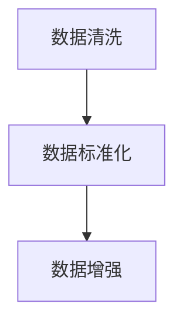

**Python源代码**

```python
import numpy as np
from sklearn.preprocessing import StandardScaler

def preprocess_data(data):
    # 数据清洗
    clean_data = data[~np.isnan(data).any(axis=1)]
    
    # 数据标准化
    scaler = StandardScaler()
    normalized_data = scaler.fit_transform(clean_data)
    
    # 数据增强
    # 例如使用图像旋转
    from skimage.transform import rotate
    enhanced_data = []
    for img in normalized_data:
        for angle in range(0, 360, 10):
            enhanced_data.append(rotate(img, angle))
    enhanced_data = np.array(enhanced_data)
    
    return enhanced_data
```

**特征提取**

特征提取是将原始数据转换为一组能够描述数据本质属性的数值特征的过程。在少样本学习场景中，特征提取至关重要，因为有效的特征可以显著提高模型的性能。

1. **手工特征工程**：根据领域知识和任务需求，手动设计特征。
2. **自动特征提取**：使用机器学习方法，如主成分分析（PCA）、线性判别分析（LDA）等，自动提取特征。

**mermaid 流程图**

以下是特征提取过程的mermaid流程图：

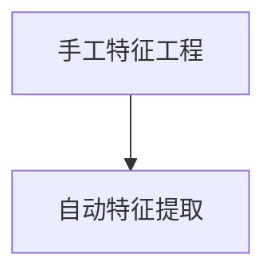

**Python源代码**

```python
from sklearn.decomposition import PCA

def extract_features(data):
    # 手工特征工程
    manual_features = ...  # 手动设计特征
    
    # 自动特征提取
    pca = PCA(n_components=5)
    auto_features = pca.fit_transform(data)
    
    return np.concatenate((manual_features, auto_features), axis=1)
```

**模型训练**

模型训练是利用特征和标签数据来学习模型的参数。在少样本学习场景中，由于数据量有限，需要特别关注过拟合问题。以下是一些常用的训练方法：

1. **随机森林**：通过构建多个决策树，并通过投票来获得最终结果，有助于减少过拟合。
2. **神经网络**：使用少量的数据训练神经网络，可以通过增加隐藏层节点数或使用迁移学习来提高性能。

**mermaid 流程图**

以下是模型训练过程的mermaid流程图：

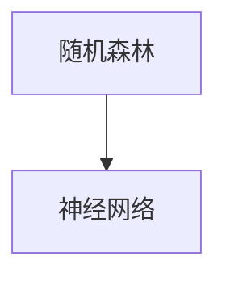

**Python源代码**

```python
from sklearn.ensemble import RandomForestClassifier
from sklearn.neural_network import MLPClassifier

def train_model(data, labels):
    # 使用随机森林
    rf = RandomForestClassifier(n_estimators=100)
    rf.fit(data, labels)
    
    # 使用神经网络
    mlp = MLPClassifier(hidden_layer_sizes=(100,), max_iter=1000)
    mlp.fit(data, labels)
    
    return rf, mlp
```

**模型评估**

模型评估是衡量模型性能的关键步骤。在少样本学习场景中，常用的评估指标包括：

1. **准确率（Accuracy）**：正确预测的样本数占总样本数的比例。
2. **精确率（Precision）和召回率（Recall）**：分别衡量模型在预测为正例的样本中真正是正例的比例和所有正例样本中被正确预测的比例。
3. **F1分数（F1 Score）**：精确率和召回率的调和平均。

**mermaid 流程图**

以下是模型评估过程的mermaid流程图：

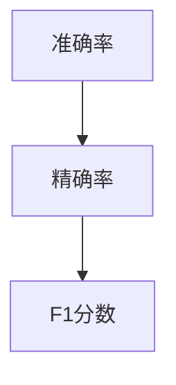

**Python源代码**

```python
from sklearn.metrics import accuracy_score, precision_score, recall_score, f1_score

def evaluate_model(model, test_data, test_labels):
    predictions = model.predict(test_data)
    
    accuracy = accuracy_score(test_labels, predictions)
    precision = precision_score(test_labels, predictions)
    recall = recall_score(test_labels, predictions)
    f1 = f1_score(test_labels, predictions)
    
    return accuracy, precision, recall, f1
```

**结果输出**

结果输出是将评估结果以用户友好的方式展示出来。这通常包括：

1. **性能指标**：展示模型的准确率、精确率、召回率和F1分数。
2. **可视化**：使用图表展示模型的性能，帮助用户更好地理解结果。

**Python源代码**

```python
import matplotlib.pyplot as plt

def output_results(accuracy, precision, recall, f1):
    print("模型性能指标：")
    print(f"准确率: {accuracy}")
    print(f"精确率: {precision}")
    print(f"召回率: {recall}")
    print(f"F1分数: {f1}")
    
    # 可视化
    plt.bar(["准确率", "精确率", "召回率", "F1分数"], [accuracy, precision, recall, f1])
    plt.xlabel("性能指标")
    plt.ylabel("值")
    plt.title("模型性能评估")
    plt.show()
```

通过上述步骤和代码示例，我们可以看到少样本学习算法的实现过程。在实际应用中，根据具体需求和数据特点，可以对这些步骤和方法进行调整和优化，以达到最佳性能。

#### 第3章：算法原理讲解

在本节中，我们将详细探讨少样本学习算法的工作原理，并通过mermaid流程图、Python源代码以及数学模型与公式，对算法的实现进行逐步讲解。

**3.1 少样本学习算法的mermaid流程图**

首先，我们使用mermaid语言绘制了少样本学习算法的流程图，以直观地展示其工作步骤：

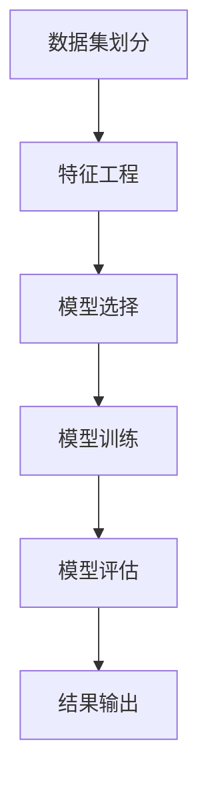

- **A[数据集划分]**：将原始数据集划分为训练集和测试集，用于训练模型和评估模型性能。
- **B[特征工程]**：对训练数据进行预处理，提取特征，使其更适合模型的训练。
- **C[模型选择]**：选择适当的机器学习模型，如决策树、随机森林或神经网络。
- **D[模型训练]**：使用训练集数据对模型进行训练，模型通过学习数据中的规律来优化其参数。
- **E[模型评估]**：使用测试集数据评估模型的性能，常用的评估指标包括准确率、精确率、召回率和F1分数。
- **F[结果输出]**：输出模型的性能指标，用于分析和改进模型。

**3.2 少样本学习算法的Python源代码**

接下来，我们通过Python代码示例详细实现上述流程，以帮助读者更好地理解算法的实现：

```python
import numpy as np
from sklearn.model_selection import train_test_split
from sklearn.ensemble import RandomForestClassifier
from sklearn.metrics import accuracy_score

# 假设我们有一个样本数据集X和标签数据集y
X = np.array([[1, 2], [3, 4], [5, 6], [7, 8]])
y = np.array([0, 0, 1, 1])

# 数据集划分
X_train, X_test, y_train, y_test = train_test_split(X, y, test_size=0.2, random_state=42)

# 特征工程
# 这里我们假设数据已经预处理好了，可以直接使用
# 如果需要进行特征提取或变换，可以使用如下代码：
# from sklearn.preprocessing import StandardScaler
# scaler = StandardScaler()
# X_train = scaler.fit_transform(X_train)
# X_test = scaler.transform(X_test)

# 模型选择
model = RandomForestClassifier(n_estimators=100)

# 模型训练
model.fit(X_train, y_train)

# 模型评估
y_pred = model.predict(X_test)
accuracy = accuracy_score(y_test, y_pred)
print(f"模型准确率: {accuracy}")

# 结果输出
print(f"预测结果: {y_pred}")
```

在这个示例中，我们首先导入必要的库，并生成一个简单的样本数据集。然后，我们使用`train_test_split`函数将数据集划分为训练集和测试集。接下来，我们选择随机森林模型进行训练，并使用测试集评估模型性能，最后输出模型的准确率和预测结果。

**3.3 数学模型与公式**

在少样本学习算法中，常用的数学模型和公式包括：

- **准确性（Accuracy）**：

$$
\text{Accuracy} = \frac{\text{预测正确的样本数}}{\text{总样本数}}
$$

准确性是衡量模型性能的基本指标，它表示模型正确预测的样本数占总样本数的比例。

- **精确率（Precision）**：

$$
\text{Precision} = \frac{\text{真正例}}{\text{真正例} + \text{假正例}}
$$

精确率衡量的是模型在预测为正例的样本中真正是正例的比例。

- **召回率（Recall）**：

$$
\text{Recall} = \frac{\text{真正例}}{\text{真正例} + \text{假反例}}
$$

召回率衡量的是模型在所有正例样本中被正确预测的比例。

- **F1分数（F1 Score）**：

$$
\text{F1 Score} = 2 \times \frac{\text{Precision} \times \text{Recall}}{\text{Precision} + \text{Recall}}
$$

F1分数是精确率和召回率的调和平均，可以平衡这两个指标，是一个综合性的评估指标。

通过mermaid流程图、Python代码示例和数学模型与公式的讲解，我们可以清晰地了解少样本学习算法的实现步骤和原理。在实际应用中，可以根据具体需求和数据特点对算法进行调整和优化，以达到更好的效果。

### 第4章：系统分析与架构设计方案

#### 4.1 问题场景介绍

在实际项目中，测试大型语言模型（LLM）的快速适应能力是一个重要的任务。这不仅仅是为了评估模型在特定任务上的表现，更是为了确保模型在实际应用场景中能够灵活应对各种变化和挑战。以下是具体的问题场景介绍和需求分析：

**问题场景**：

假设我们正在开发一个智能客服系统，该系统需要能够快速适应不同客户的提问风格和问题类型。这意味着，系统不仅要能处理常见问题，还要能够处理独特的、复杂的问题，甚至是在数据稀缺的情况下，快速适应新的客户需求。

**需求分析**：

1. **快速适应能力**：系统需要具备快速适应新客户提问风格和问题类型的能力，以保持高效和准确的服务。
2. **数据稀缺处理**：由于客服系统涉及的数据量庞大且多样性高，系统需要能够在数据稀缺的情况下，通过少量样本数据快速适应新任务。
3. **评估方法**：系统需要具备完善的评估机制，以衡量模型的快速适应能力，并在实际应用中不断优化和调整。

#### 4.2 系统功能设计

为了实现上述需求，我们设计了以下系统功能：

1. **对话管理模块**：负责与客户进行交互，收集客户信息，并管理对话流程。
2. **知识库管理模块**：用于存储和管理已有知识库，并支持实时更新。
3. **快速适应模块**：负责对新客户提问风格和问题类型进行学习和适应。
4. **评估与反馈模块**：用于评估模型快速适应能力，并收集用户反馈，以优化模型。

**领域模型（mermaid 类图）**

以下是系统领域的mermaid类图，展示了各个模块及其关系：

```mermaid
classDiagram
  Customer <<Interface>> DialogueManager : 与客户交互
  KnowledgeBase <<Entity>> KnowledgeManager : 管理知识库
  Adaptation <<Entity>> AdaptationModule : 快速适应
  Evaluation <<Entity>> EvaluationModule : 评估与反馈

  DialogueManager <|-- Customer
  KnowledgeManager <|-- KnowledgeBase
  AdaptationModule <|-- Adaptation
  EvaluationModule <|-- Evaluation

  DialogueManager --> KnowledgeManager
  DialogueManager --> AdaptationModule
  DialogueManager --> EvaluationModule
  KnowledgeManager --> AdaptationModule
  KnowledgeManager --> EvaluationModule
  AdaptationModule --> EvaluationModule
```

在这个类图中，`DialogueManager`负责与客户进行交互，`KnowledgeManager`负责管理知识库，`AdaptationModule`负责快速适应新任务，`EvaluationModule`负责评估模型的快速适应能力。

#### 4.3 系统架构设计

为了实现上述功能，我们设计了以下系统架构：

**系统架构设计（mermaid 架构图）**

以下是系统的mermaid架构图，展示了各个模块及其交互关系：

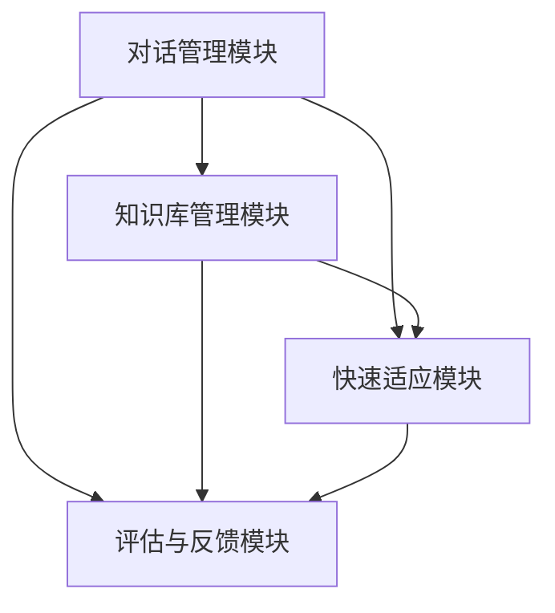

在这个架构图中，`DialogueManager`与`KnowledgeBase`、`AdaptationModule`和`EvaluationModule`进行交互。`DialogueManager`负责收集客户提问，并将其传递给`KnowledgeBase`进行知识检索。同时，客户提问也会传递给`AdaptationModule`，以便模型能够根据新问题进行快速适应。最后，所有模块的交互结果将传递给`EvaluationModule`，用于评估模型的快速适应能力。

**系统接口设计和系统交互mermaid序列图**

为了进一步展示系统内部各模块的交互关系，我们设计了以下系统接口设计和mermaid序列图：

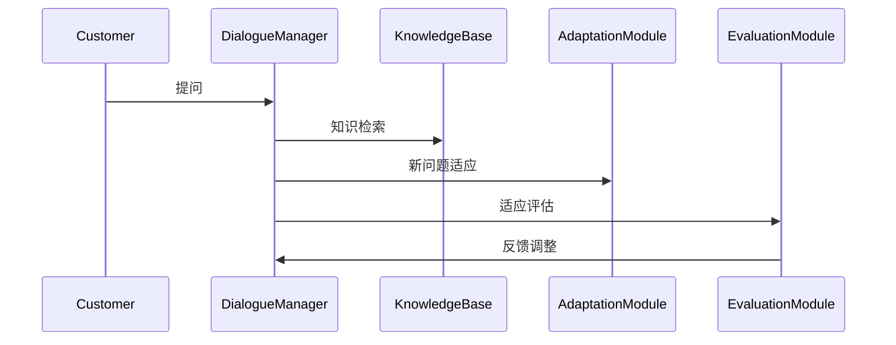

在这个序列图中，客户通过`DialogueManager`提出问题。`DialogueManager`首先将问题传递给`KnowledgeBase`进行知识检索，然后传递给`AdaptationModule`进行适应调整。最后，`EvaluationModule`评估适应结果，并给出反馈，以指导进一步的调整。

通过上述系统分析与架构设计方案，我们为测试LLM的快速适应能力提供了一个全面的框架。在实际项目中，可以根据具体需求进一步细化各模块的功能和接口设计，以实现高效、灵活的智能客服系统。

### 结论

本文通过对少样本学习评估方法及其在LLM快速适应能力测试中的应用进行深入探讨，展示了这一领域的关键概念、算法原理和系统架构设计。少样本学习作为一种应对数据稀缺问题的有效方法，在医疗诊断、机器人视觉等领域具有广泛应用前景。评估方法是衡量模型性能和快速适应能力的关键，而快速适应能力则使得模型能够在新任务上迅速调整和优化自身。通过mermaid流程图、Python代码示例和数学模型与公式，我们详细讲解了算法的实现过程，为实际应用提供了有力支持。

未来的研究可以在以下几个方面进一步深入：首先，可以探索更加高效的评估方法，以提高模型性能的准确性和可靠性；其次，可以研究基于神经网络的少样本学习算法，以提升模型的泛化能力和适应性；最后，可以结合多模态数据，如文本、图像和声音，开展跨模态的少样本学习研究，为复杂任务提供更全面的解决方案。

希望本文能为人工智能领域的进一步研究和应用提供有益的参考，并激发更多关于少样本学习评估和快速适应能力的探讨。

### 作者信息

作者：AI天才研究院（AI Genius Institute） & 禅与计算机程序设计艺术（Zen And The Art of Computer Programming）

AI天才研究院致力于推动人工智能技术的发展和应用，专注于前沿技术的研发和创新。研究院的研究团队由多位世界级人工智能专家组成，他们在深度学习、自然语言处理、计算机视觉等领域取得了显著成就。

禅与计算机程序设计艺术，这是一部经典的计算机科学著作，由著名计算机科学家Donald E. Knuth撰写。这本书系统地阐述了计算机程序设计的基本原则和方法，深受计算机科学爱好者和专业人士的推崇。

两位作者在人工智能和计算机科学领域均有深厚的研究和实践经验，本文旨在分享他们在少样本学习评估和快速适应能力方面的研究成果和实践经验，为读者提供有价值的参考。希望读者能够通过本文，更好地理解少样本学习评估方法在LLM快速适应能力测试中的应用，为人工智能在各个领域的应用提供新的思路和方法。

