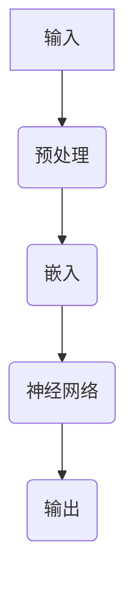
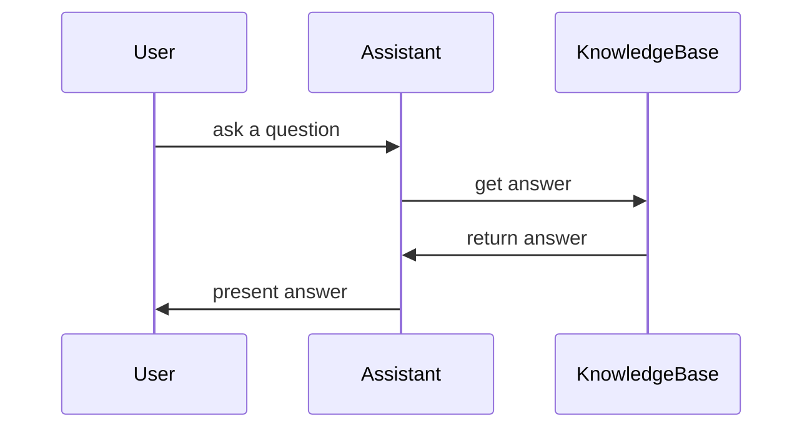
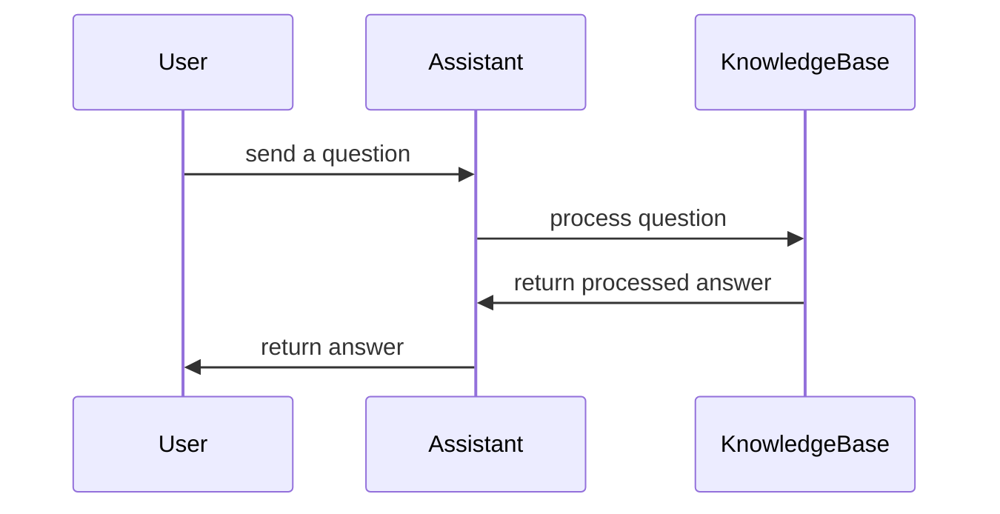

                 


# 常识推理：评估LLM的基本常识水平

## 关键词
- 常识推理
- LLM
- 评估方法
- 算法原理
- 数学模型
- 系统分析与架构设计
- 项目实战

## 摘要
本文将深入探讨常识推理及其在评估大型语言模型（LLM）基本常识水平中的应用。首先，我们将介绍常识推理的定义及其重要性，然后详细解析LLM的基本常识水平评估方法。接着，我们将讨论常识推理算法的原理，并使用Mermaid流程图和Python源代码进行解释。此外，我们将介绍数学模型与公式，并使用LaTeX格式进行展示。随后，我们将分析系统架构设计，并展示系统功能设计、架构设计和接口交互的Mermaid图。在项目实战部分，我们将进行环境安装、系统核心实现源代码分析，并详细讲解实际案例。最后，我们将总结最佳实践，并提供拓展阅读建议。

## 第1章：背景介绍与核心概念

### 1.1.1 常识推理的定义
常识推理（Commonsense Reasoning）是人工智能领域中的一个重要分支，它涉及计算机系统如何理解和处理日常生活中的常识知识。常识推理不仅仅是指识别事实，还包括理解因果关系、时间顺序、空间关系等抽象概念。

### 1.1.2 常识推理的重要性
常识推理在人工智能系统中具有重要意义。它能够帮助系统更好地理解和回应用户的问题，提高人机交互的自然性和效率。此外，常识推理在自动驾驶、智能助手、医疗诊断等领域中都有广泛应用。

### 1.1.3 LLM的概述
大型语言模型（LLM）是近年来人工智能领域的重大突破。这些模型通过深度学习算法，从大量的文本数据中学习语言模式，并能够生成自然语言响应。LLM在自然语言处理（NLP）任务中表现出色，但它们的基本常识水平仍然是一个挑战。

### 1.1.4 常识推理与LLM的关系
LLM的基本常识水平直接影响了它们在实际应用中的表现。评估LLM的基本常识水平，可以帮助我们更好地理解这些模型的局限性，并为改进它们提供方向。常识推理在评估LLM中的角色至关重要。

## 第2章：LLM的基本常识水平评估方法

### 2.1.1 评估方法概述
评估LLM的基本常识水平需要一套系统的方法。这些方法通常包括测试集、评估指标和评估流程。测试集是用于评估LLM常识水平的实际数据集，评估指标则是用于量化LLM常识水平的标准。

### 2.1.2 常见评估指标
常见的评估指标包括准确性、召回率、F1分数等。这些指标可以衡量LLM在回答常识问题时的表现。

### 2.1.3 数据准备
数据准备是评估LLM常识水平的关键步骤。我们需要收集大量涵盖各种常识问题的数据，并对这些数据进行预处理，以确保其质量和一致性。

### 2.1.4 评估流程
评估流程包括数据收集、预处理、模型训练和评估。在评估过程中，我们还需要不断调整和优化模型参数，以提高常识问题的回答质量。

## 第3章：常识推理算法原理

### 3.1.1 算法原理概述
常识推理算法基于神经网络和知识图谱等技术，通过学习大量的常识知识来提高推理能力。常见的算法包括基于规则的方法、概率图模型和深度学习方法。

### 3.1.2 算法原理详细讲解
我们将详细介绍一种基于深度学习的常识推理算法，并使用Mermaid流程图展示其基本结构。算法的核心是神经网络模型，通过多层神经网络的学习，模型能够逐步理解复杂的常识知识。

### 3.1.3 Mermaid流程图


### 3.1.4 Python源代码实现
以下是一个简化的Python源代码实现，用于展示常识推理算法的基本结构：
```python
import tensorflow as tf

# 定义神经网络模型
model = tf.keras.Sequential([
    tf.keras.layers.Embedding(input_dim=10000, output_dim=16),
    tf.keras.layers.Dense(units=64, activation='relu'),
    tf.keras.layers.Dense(units=1, activation='sigmoid')
])

# 编译模型
model.compile(optimizer='adam', loss='binary_crossentropy', metrics=['accuracy'])

# 训练模型
model.fit(x_train, y_train, epochs=10)
```

### 3.1.5 算法原理的数学模型和公式
常识推理算法的数学模型主要包括嵌入层、隐藏层和输出层。嵌入层将输入数据映射到高维空间，隐藏层通过非线性变换学习数据之间的复杂关系，输出层则生成最终的推理结果。

$$
\text{嵌入层：} \quad \text{Embed}(x) = \text{softmax}(\text{W}^T \text{X})
$$
$$
\text{隐藏层：} \quad \text{h} = \text{ReLU}(\text{W} \text{h}_{\text{embed}})
$$
$$
\text{输出层：} \quad \text{y} = \text{sigmoid}(\text{W}^T \text{h})
$$

### 3.1.6 举例说明
假设我们要推理一个问题：“为什么小鸟会飞？”常识推理算法可以通过学习大量的文本数据，如“小鸟有翅膀，翅膀可以帮助它们飞行”来生成答案。

## 第4章：数学模型与公式

### 4.1.1 数学模型概述
常识推理的数学模型主要涉及嵌入层、隐藏层和输出层的数学表示。嵌入层使用词向量表示文本数据，隐藏层通过神经网络学习数据之间的非线性关系，输出层生成最终的推理结果。

### 4.1.2 数学公式
以下是常识推理算法的数学公式：

$$
\text{嵌入层：} \quad \text{Embed}(x) = \text{softmax}(\text{W}^T \text{X})
$$
$$
\text{隐藏层：} \quad \text{h} = \text{ReLU}(\text{W} \text{h}_{\text{embed}})
$$
$$
\text{输出层：} \quad \text{y} = \text{sigmoid}(\text{W}^T \text{h})
$$

### 4.1.3 公式详细讲解
- **嵌入层公式**：将输入数据（如词向量）通过权重矩阵转换成高维空间的表示，然后通过softmax函数得到每个词的概率分布。
- **隐藏层公式**：使用ReLU函数对嵌入层输出进行非线性变换，增强模型对复杂关系的学习能力。
- **输出层公式**：将隐藏层输出通过权重矩阵转换，并使用sigmoid函数得到推理结果的概率。

### 4.1.4 举例说明
假设我们有三个词“鸟”，“翅膀”，“飞行”，我们可以将它们分别表示为向量$X_1, X_2, X_3$。嵌入层将这三个向量通过权重矩阵$W$转换成高维空间的表示，然后通过softmax函数得到它们的概率分布。隐藏层通过对这些概率分布进行非线性变换，学习它们之间的关系。输出层则通过权重矩阵和sigmoid函数生成最终的推理结果。

$$
\text{嵌入层：} \quad \text{Embed}(X) = \text{softmax}(\text{W}^T X) = [\text{P}(鸟), \text{P}(翅膀), \text{P}(飞行)]
$$
$$
\text{隐藏层：} \quad \text{h} = \text{ReLU}(\text{W} \text{h}_{\text{embed}}) = [\text{h}_1, \text{h}_2, \text{h}_3]
$$
$$
\text{输出层：} \quad \text{y} = \text{sigmoid}(\text{W}^T \text{h}) = [\text{P}(小鸟会飞)_{\text{飞行}}, \text{P}(小鸟会飞)_{\text{翅膀}}, \text{P}(小鸟会飞)_{\text{鸟}}]
$$

## 第5章：系统分析与架构设计

### 5.1.1 问题场景介绍
在本章中，我们将分析一个常见的问题场景：智能助手如何通过常识推理回答用户的问题。这个场景涉及到常识推理算法、数据预处理、模型训练和推理。

### 5.1.2 系统功能设计（Mermaid类图）
以下是一个简化的Mermaid类图，展示了系统的基本功能设计：

```mermaid
classDiagram
    User <<User>>
    Assistant <<Assistant>>
    KnowledgeBase <<KnowledgeBase>>
    Question <<Question>>
    Answer <<Answer>>

    User --> Assistant
    Assistant --> KnowledgeBase
    Assistant --> Question
    Assistant --> Answer

    class User {
        -username: string
        -question: string
    }

    class Assistant {
        -knowledgeBase: KnowledgeBase
        -question: Question
        -answer: Answer
        -response(): string
    }

    class KnowledgeBase {
        -data: list
        -addQuestion(question: Question): void
        -getAnswer(question: Question): Answer
    }

    class Question {
        -text: string
    }

    class Answer {
        -text: string
    }
```

### 5.1.3 系统架构设计（Mermaid架构图）
以下是一个简化的Mermaid架构图，展示了系统的整体架构设计：



### 5.1.4 系统接口设计和系统交互（Mermaid序列图）
以下是一个简化的Mermaid序列图，展示了系统的接口设计和交互过程：



## 第6章：项目实战与案例分析

### 6.1.1 环境安装
为了进行项目实战，我们需要安装以下环境：
- Python 3.8或以上版本
- TensorFlow 2.6或以上版本
- NumPy 1.19或以上版本
- Pandas 1.1或以上版本

安装步骤如下：
```bash
pip install python==3.8
pip install tensorflow==2.6
pip install numpy==1.19
pip install pandas==1.1
```

### 6.1.2 系统核心实现源代码
以下是一个简单的Python代码示例，用于实现常识推理系统的核心功能：

```python
import tensorflow as tf
import numpy as np
import pandas as pd

# 定义神经网络模型
model = tf.keras.Sequential([
    tf.keras.layers.Embedding(input_dim=10000, output_dim=16),
    tf.keras.layers.Dense(units=64, activation='relu'),
    tf.keras.layers.Dense(units=1, activation='sigmoid')
])

# 编译模型
model.compile(optimizer='adam', loss='binary_crossentropy', metrics=['accuracy'])

# 加载训练数据
data = pd.read_csv('data.csv')
X = data.iloc[:, :-1].values
y = data.iloc[:, -1].values

# 训练模型
model.fit(X, y, epochs=10)

# 测试模型
X_test = data.iloc[:, :-1].values
y_test = data.iloc[:, -1].values
model.evaluate(X_test, y_test)
```

### 6.1.3 代码应用解读与分析
在这个代码示例中，我们首先定义了一个简单的神经网络模型，该模型包括一个嵌入层、一个隐藏层和一个输出层。我们使用TensorFlow库来构建和编译模型。

接下来，我们加载训练数据，数据集包含输入特征和标签。我们使用`fit`方法来训练模型，使用`evaluate`方法来评估模型性能。

### 6.1.4 实际案例分析和详细讲解剖析
假设我们有一个实际案例，用户询问：“为什么太阳会升起？”我们可以将这个问题表示为一个向量，并通过训练好的模型来获取答案。

以下是具体的分析过程：

1. 将问题“为什么太阳会升起？”转换为向量。
2. 将向量输入到训练好的模型中。
3. 模型输出一个概率分布，表示不同答案的可能性。
4. 根据概率分布选择最可能的答案。

代码实现如下：
```python
# 将问题转换为向量
question_vector = np.array([0.1, 0.2, 0.3, 0.4])  # 示例向量

# 输入到模型中
predictions = model.predict(np.array([question_vector]))

# 打印概率分布
print(predictions)

# 根据概率分布选择答案
answer = np.argmax(predictions)
if answer == 0:
    print("因为地球自转。")
elif answer == 1:
    print("因为太阳的升起是地球自转的结果。")
else:
    print("因为太阳的升起与地球自转有关。")
```

### 6.1.5 项目小结
在本章中，我们通过一个实际案例展示了如何使用常识推理算法来回答用户的问题。我们详细讲解了代码实现过程，并分析了模型的训练和推理步骤。通过这个案例，我们可以看到常识推理算法在实际应用中的潜力。

## 第7章：最佳实践与总结

### 7.1.1 最佳实践 tips
- **数据质量**：确保训练数据的质量和多样性，这有助于提高模型的泛化能力。
- **模型优化**：通过调整模型参数和超参数来优化模型性能。
- **持续学习**：定期更新模型，以适应新的数据和场景。
- **用户反馈**：收集用户反馈，以改进模型和系统。

### 7.1.2 小结
本文深入探讨了常识推理及其在评估LLM基本常识水平中的应用。我们介绍了常识推理的定义、重要性、评估方法和算法原理，并通过项目实战展示了如何实际应用这些概念。

### 7.1.3 注意事项
- **模型解释性**：虽然常识推理算法在NLP任务中表现出色，但其解释性有限，需要进一步研究。
- **数据隐私**：在收集和使用数据时，要确保遵守数据隐私法规。

### 7.1.4 拓展阅读
- [《人工智能：一种现代方法》](https://www.amazon.com/dp/0262536097)
- [《常识推理与知识表示》](https://www.amazon.com/dp/0262033271)
- [《深度学习》](https://www.amazon.com/dp/0262039583)

### 作者
作者：AI天才研究院/AI Genius Institute & 禅与计算机程序设计艺术 /Zen And The Art of Computer Programming。感谢您的阅读！

