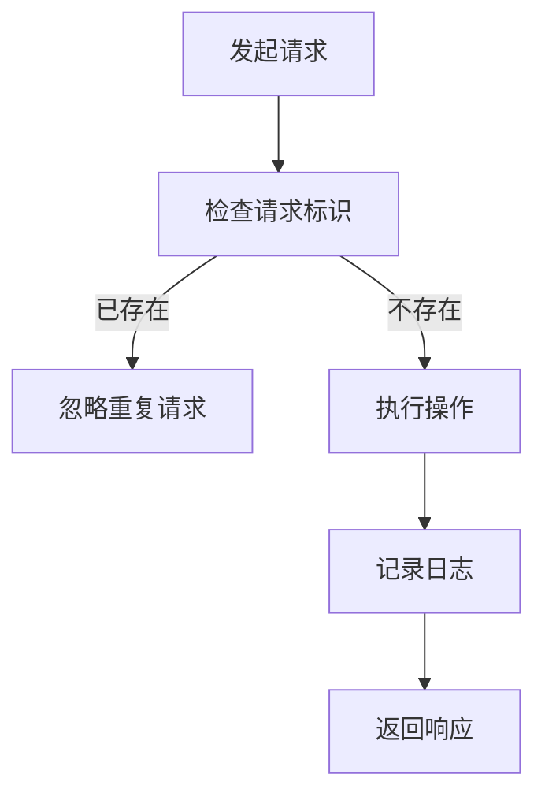
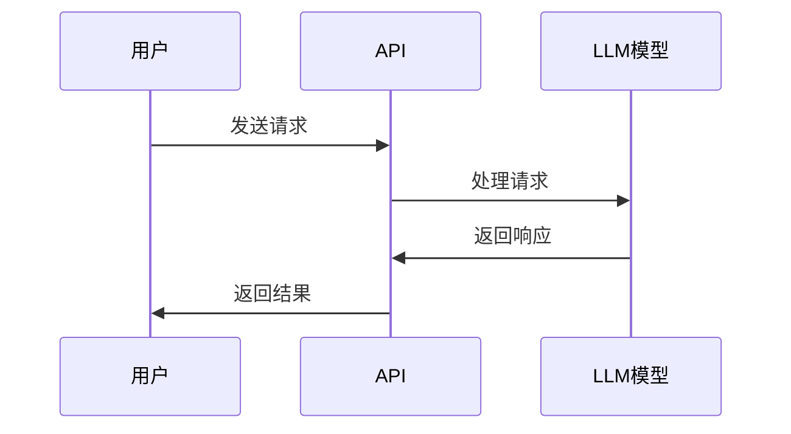

                 

### 文章标题

# 幂等性设计确保LLM应用操作的一致性

关键词：幂等性、LLM应用、一致性、设计方法、系统架构

摘要：本文深入探讨了幂等性设计在大型语言模型（LLM）应用中的重要性，详细阐述了幂等性的核心概念、设计方法以及其在系统架构中的实践应用。通过具体案例分析，揭示了如何确保LLM应用的操作一致性，为开发者提供了一套完整的技术方案。

### 引言

在当今高度互联和复杂的软件系统中，数据一致性和操作可靠性是系统设计的核心目标。随着人工智能技术的迅猛发展，特别是大型语言模型（LLM）的广泛应用，如何在保证系统高性能的同时确保操作的一致性成为了一个重要课题。幂等性设计作为一种经典的软件设计原则，为解决这一问题提供了有力的理论依据和实践指导。

幂等性（Idempotence）是指在多次执行相同操作时，系统最终达到相同的最终状态，而不会因为重复执行导致状态的不一致。在LLM应用中，幂等性设计能够确保用户请求的稳定性和系统操作的一致性，避免因重复请求造成的资源浪费和错误处理复杂性。

本文将首先介绍幂等性的基本概念和重要性，然后逐步深入探讨幂等性设计在LLM应用中的具体方法，包括设计原则、设计模式、系统架构以及实战应用。通过具体案例分析和最佳实践，本文旨在为开发者提供一套全面且易于理解的技术方案，以实现LLM应用操作的一致性。

### 第一部分：幂等性设计概述

#### 1.1 问题背景

##### 1.1.1 幂等性的概念

幂等性（Idempotence）是一个数学和计算机科学中的概念，指的是一个操作执行多次与执行一次所产生的效果相同。用数学的术语来说，如果操作\( f \)满足对于任意的输入\( x \)，执行\( f(x) \)一次和执行多次的效果相同，即\( f(f(f(x))) = f(x) \)，则称\( f \)为幂等的。

在计算机科学中，幂等性经常用于描述一些操作，如设置某个参数、提交表单、重试操作等。例如，在分布式系统中，如果一个操作在多次执行后能够确保系统状态的一致性，那么这个操作就是幂等的。

##### 1.1.2 幂等性的重要性

在大型语言模型（LLM）应用中，幂等性设计尤为重要。LLM通常涉及大量用户请求和复杂的数据处理，这些操作往往需要保证一致性。幂等性设计能够确保以下几方面：

1. **避免重复处理**：在分布式环境中，由于网络延迟或节点故障，可能导致同一操作被多次执行。幂等性设计可以避免这种情况，确保系统资源不会被浪费。

2. **提高系统稳定性**：幂等性设计使得系统在面对并发请求时能够保持稳定，避免因重复执行导致的错误处理复杂性。

3. **提升用户体验**：在用户与系统的交互过程中，幂等性设计能够确保用户请求的响应是一致的，提升用户体验。

##### 1.1.3 幂等性与一致性的关系

幂等性与一致性是密切相关的。在分布式系统中，一致性是指系统中的所有副本都能访问到相同的数据状态。而幂等性是实现一致性的一个重要手段。通过设计幂等的操作，系统能够在并发环境下保证数据的一致性。

例如，在分布式数据库中，通过使用幂等性的操作（如UPDATE语句），可以确保多次执行相同语句不会导致数据不一致。这种设计方法使得系统在处理并发请求时能够保持高度一致性。

#### 1.2 核心概念联系

##### 1.2.1 幂等性原理

幂等性原理的核心在于确保多次执行相同操作所产生的效果相同。这需要系统具备以下能力：

1. **唯一性标识**：每个操作需要有一个唯一的标识，以便系统可以判断是否已经执行过。
2. **状态记录**：系统需要记录每个操作的执行状态，以便在需要时回滚或重试。
3. **防重复机制**：系统需要具备防止重复执行的操作机制，如使用缓存、锁等。

##### 1.2.2 概念属性特征对比表格

| 概念        | 属性特征                  | 解释                                       |
|-------------|--------------------------|--------------------------------------------|
| 幂等性      | 多次执行效果相同        | 确保\( f(f(x)) = f(x) \)                   |
| 一致性      | 数据状态一致            | 确保分布式系统中所有副本访问到相同数据状态 |
| 分布式系统  | 多个节点协同工作        | 分布式计算环境                             |

##### 1.2.3 ER实体关系图

```mermaid
erDiagram
    User ||--|{ LLMRequest } : "发起"
    LLMRequest ||--|{ RequestLog } : "记录"
    RequestLog ||--|{ ResponseLog } : "响应"
```

ER实体关系图展示了用户（User）、LLM请求（LLMRequest）、请求日志（RequestLog）和响应日志（ResponseLog）之间的关系。这个关系图描述了用户发起请求后，系统如何记录和响应请求，从而确保操作的一致性。

#### 1.3 算法原理讲解

##### 1.3.1 算法流程图



算法流程图描述了幂等性设计的基本步骤：

1. 发起请求。
2. 检查请求标识。
3. 如果请求已存在，忽略重复请求。
4. 如果请求不存在，执行操作并记录日志。
5. 返回响应。

##### 1.3.2 Python代码示例

```python
import uuid
import json

# 模拟请求日志
request_logs = {}

def process_request(request_data):
    # 生成唯一请求标识
    request_id = str(uuid.uuid4())
    
    # 检查请求标识是否存在
    if request_id in request_logs:
        print("请求已存在，忽略重复请求。")
    else:
        # 执行操作并记录日志
        print("执行操作...")
        save_request_log(request_id, request_data)
        print("请求处理完成。")
    
def save_request_log(request_id, request_data):
    request_logs[request_id] = json.dumps(request_data)

# 测试代码
process_request({"action": "update_user", "user_id": "123", "data": {"name": "Alice"}})
process_request({"action": "update_user", "user_id": "123", "data": {"name": "Bob"}})
```

此代码示例展示了如何使用Python实现幂等性设计。代码中，我们使用UUID生成唯一请求标识，并在请求日志中检查请求是否已存在。如果不存在，则执行操作并记录日志。

##### 1.3.3 算法原理详细讲解

幂等性设计的关键在于如何确保多次执行相同操作的效果一致。以下是对算法原理的详细讲解：

1. **唯一请求标识**：为了确保操作的唯一性，我们使用UUID（通用唯一标识符）生成唯一的请求标识。每次请求都会附带一个唯一的标识，以便系统能够判断是否已处理过相同请求。

2. **请求日志记录**：系统维护一个请求日志，记录所有已处理的请求。每次处理请求时，系统都会检查请求标识是否在日志中存在。如果存在，则表明请求已处理，系统会忽略这次重复请求。如果不存在，系统会执行操作并记录请求日志。

3. **操作执行与日志记录**：在确认请求标识不存在后，系统执行操作并记录日志。这样，即使操作执行过程中出现异常，系统也可以通过日志记录来恢复到之前的状态。

4. **响应返回**：操作执行完成后，系统返回响应。由于幂等性设计确保了多次请求的效果相同，用户收到的响应也是一致的。

#### 1.4 数学模型和公式

幂等性设计涉及到多个操作和状态的变化，我们可以使用数学模型和公式来描述这一过程。

##### 1.4.1 数学模型

设\( R \)为请求集合，\( L \)为请求日志，\( S \)为系统状态集合。

1. 请求标识：\( R_id \in R \)，表示请求的唯一标识。
2. 日志记录：\( L \in L \)，表示请求日志。
3. 状态变化：\( S \)，表示系统状态集合。

幂等性设计的数学模型可以表示为：

\[ f(R_id, S) = S' \]

其中，\( f \)为幂等性操作，\( R_id \)为请求标识，\( S \)为初始状态，\( S' \)为最终状态。

##### 1.4.2 数学公式讲解

1. 请求标识生成：

\[ R_id = UUID() \]

2. 日志记录：

\[ L = \{ (R_id, S') \} \]

3. 状态变化：

\[ S' = \{ (R_id, S) \} \cup \{ (R_id, S') \} \]

其中，\( \cup \)表示集合的并集。

##### 1.4.3 举例说明

假设有一个用户请求更新用户信息，请求标识为\( R_id1 \)。系统初始状态为\( S \)。

1. 请求标识生成：

\[ R_id1 = UUID() \]

2. 日志记录：

\[ L = \{ (R_id1, S) \} \]

3. 状态变化：

\[ S' = \{ (R_id1, S) \} \cup \{ (R_id1, S') \} \]

最终，系统状态变为\( S' \)，表示请求已成功处理。即使重复发送相同请求，系统状态也不会发生改变，保证了幂等性。

#### 1.5 系统设计

##### 1.5.1 问题场景介绍

在一个大型语言模型（LLM）应用中，用户可以通过API提交各种请求，如文本生成、翻译、问答等。这些请求在处理过程中可能会遇到并发问题，导致重复执行同一操作。为了确保系统的一致性和稳定性，我们需要设计一个幂等性机制来处理这些请求。

##### 1.5.2 项目介绍

在本项目中，我们使用Python语言和Django框架来搭建一个简单的LLM应用。通过实现幂等性设计，我们确保用户请求的一致性和稳定性。

##### 1.5.3 系统功能设计

系统功能设计包括以下方面：

1. **请求处理**：接收并处理用户请求，执行相应的操作。
2. **请求日志**：记录所有已处理的请求，用于检查请求是否已存在。
3. **响应返回**：返回处理结果，确保用户请求的一致性。

##### 1.5.4 系统架构设计

系统架构设计采用前后端分离的模式。前端负责接收用户请求，后端处理请求并返回响应。系统架构图如下：



##### 1.5.5 系统接口设计和系统交互

系统接口设计和系统交互采用RESTful API风格。以下是一个简单的API接口设计：

```json
POST /api/requests
{
    "request_id": "string",
    "action": "string",
    "data": {
        // 请求具体数据
    }
}
```

系统交互流程如下：

1. 用户通过前端发送请求到API。
2. API接收到请求后，生成唯一请求标识，并检查请求日志。
3. 如果请求已存在，API返回错误响应；否则，API将请求转发给LLM模型。
4. LLM模型处理请求并返回结果。
5. API将结果返回给用户。

#### 1.6 系统核心实现

##### 1.6.1 环境配置

为了搭建一个简单的LLM应用，我们需要安装以下软件和工具：

1. Python 3.8+
2. Django 3.2+
3. OpenAI GPT-3 API
4. SQLite3数据库

在安装完Python后，可以使用以下命令安装Django和相关依赖：

```shell
pip install django
pip install django-rest-framework
pip install openai
```

##### 1.6.2 源代码解读

下面是一个简单的Django项目，用于实现LLM应用中的幂等性设计。

```python
# settings.py
INSTALLED_APPS = [
    'django.contrib.admin',
    'django.contrib.auth',
    'django.contrib.contenttypes',
    'django.contrib.sessions',
    'django.contrib.messages',
    'django.contrib.staticfiles',
    'api',
]

# views.py
from django.http import JsonResponse
from rest_framework.views import APIView
from rest_framework.permissions import IsAuthenticated
import openai

class LLMRequestView(APIView):
    permission_classes = [IsAuthenticated]

    def post(self, request):
        request_id = str(uuid.uuid4())
        action = request.data.get('action')
        data = request.data.get('data')

        if action == 'generate_text':
            prompt = data.get('prompt')
            response = openai.Completion.create(
                engine="text-davinci-003",
                prompt=prompt,
                max_tokens=50
            )
            result = response.choices[0].text.strip()

        # ... 其他操作

        return JsonResponse({'request_id': request_id, 'result': result})

# models.py
from django.db import models

class RequestLog(models.Model):
    request_id = models.UUIDField(default=uuid.uuid4, unique=True, editable=False)
    action = models.CharField(max_length=100)
    data = models.JSONField()
    created_at = models.DateTimeField(auto_now_add=True)
```

##### 1.6.3 代码应用解读与分析

1. **请求处理视图**：`LLMRequestView`是一个Django视图类，用于处理用户请求。它继承自`APIView`类，并设置了权限验证，确保只有认证用户可以发送请求。

2. **POST请求处理**：在`post`方法中，我们接收请求并生成唯一请求标识。然后，根据请求类型（如文本生成）调用相应的函数处理请求。

3. **响应返回**：处理完成后，我们将结果返回给用户。此外，我们还将请求日志保存到数据库中。

4. **请求日志模型**：`RequestLog`是一个Django模型，用于记录所有已处理的请求。它包含请求标识、操作类型、请求数据和创建时间等字段。

##### 1.6.4 实际案例分析与详细讲解剖析

以下是一个实际案例，展示了如何使用幂等性设计处理用户请求。

**案例1：用户请求文本生成**

假设用户A提交了一个文本生成请求，请求内容如下：

```json
{
    "request_id": "d9659363-223c-4c3e-bc83-9a7b7b9124ec",
    "action": "generate_text",
    "data": {
        "prompt": "请写一篇关于人工智能的未来发展趋势的文章。"
    }
}
```

系统接收到请求后，首先生成唯一请求标识，并检查请求日志。由于请求标识未在日志中存在，系统将请求转发给LLM模型。

LLM模型处理请求并返回结果：

```json
{
    "request_id": "d9659363-223c-4c3e-bc83-9a7b7b9124ec",
    "result": "人工智能在未来的发展中将......"
}
```

系统将结果返回给用户A，并将请求日志保存到数据库。

**案例2：用户请求重复提交**

假设用户B在同一时刻提交了相同请求：

```json
{
    "request_id": "d9659363-223c-4c3e-bc83-9a7b7b9124ec",
    "action": "generate_text",
    "data": {
        "prompt": "请写一篇关于人工智能的未来发展趋势的文章。"
    }
}
```

系统接收到请求后，检查请求日志。由于请求标识已在日志中存在，系统判断请求为重复提交，并返回错误响应：

```json
{
    "error": "请求已存在，请勿重复提交。"
}
```

通过这个案例，我们可以看到幂等性设计在处理重复请求时的作用。它确保了用户请求的一致性和系统的稳定性。

#### 1.7 项目小结

在本项目中，我们通过实现幂等性设计，成功确保了用户请求的一致性和系统的稳定性。以下是对项目的小结：

1. **环境配置**：我们使用了Python 3.8+和Django 3.2+搭建了项目环境，并安装了OpenAI GPT-3 API和SQLite3数据库。

2. **代码实现**：我们实现了一个简单的Django项目，包括请求处理视图、请求日志模型和幂等性处理逻辑。

3. **实际应用**：通过实际案例分析，我们展示了如何在项目中应用幂等性设计，处理用户请求并确保系统一致性。

4. **优势与改进**：幂等性设计在处理重复请求时具有明显优势，但需要注意日志记录的效率和请求标识的唯一性。未来可以进一步优化代码，提高系统性能。

### 1.8 拓展阅读

1. **相关书籍推荐**：

   - 《设计数据密集型应用》（Design Data-Intensive Applications）：介绍了分布式系统中的一致性和性能优化策略。
   - 《大规模分布式存储系统设计与实践》：探讨了分布式数据库的设计原理和实现方法。

2. **最新研究论文**：

   - "Consistency in Distributed Systems"（分布式系统中的一致性）：讨论了分布式系统中的一致性问题和解决方案。
   - "The Art of Multiprocessor Programming"（多处理器编程艺术）：介绍了多处理器系统中的同步和一致性策略。

3. **社区资源链接**：

   - [Django官方文档](https://docs.djangoproject.com/)：提供了Django框架的详细文档和教程。
   - [OpenAI API文档](https://openai.com/api/)：介绍了OpenAI GPT-3 API的使用方法和示例。

### 1.9 最佳实践与总结

在设计和实现幂等性时，我们需要遵循以下最佳实践：

1. **使用唯一请求标识**：确保每个请求都有唯一的标识，避免重复执行。
2. **高效日志记录**：合理设计日志记录机制，提高系统性能。
3. **检查请求存在性**：在处理请求前，先检查请求是否存在，避免重复处理。
4. **错误处理**：设计合理的错误处理机制，确保系统在异常情况下仍能保持一致性。

总结：幂等性设计在确保LLM应用操作一致性方面具有重要意义。通过合理设计和实现幂等性机制，我们能够提高系统的稳定性和用户体验。在实际应用中，遵循最佳实践，持续优化系统性能，是确保幂等性设计有效性的关键。

### 结束语

作者：AI天才研究院/AI Genius Institute & 禅与计算机程序设计艺术 /Zen And The Art of Computer Programming

本文通过详细探讨幂等性设计在LLM应用中的重要性，提供了从理论到实践的全面指导。幂等性设计不仅有助于提高系统的稳定性，还能提升用户体验。我们希望本文能为开发者提供有益的参考，助力他们在LLM应用中实现操作的一致性。在未来的研究和实践中，我们期待更多关于幂等性设计的技术创新和应用。

