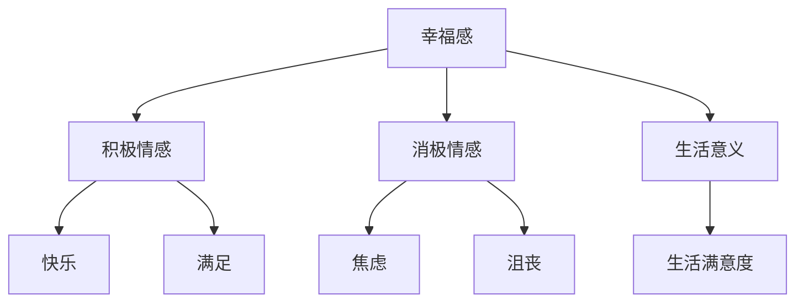
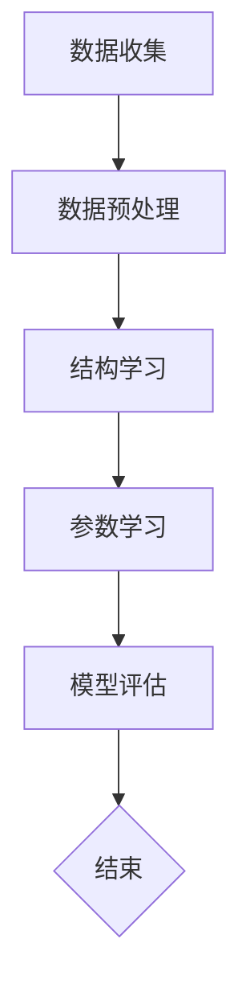
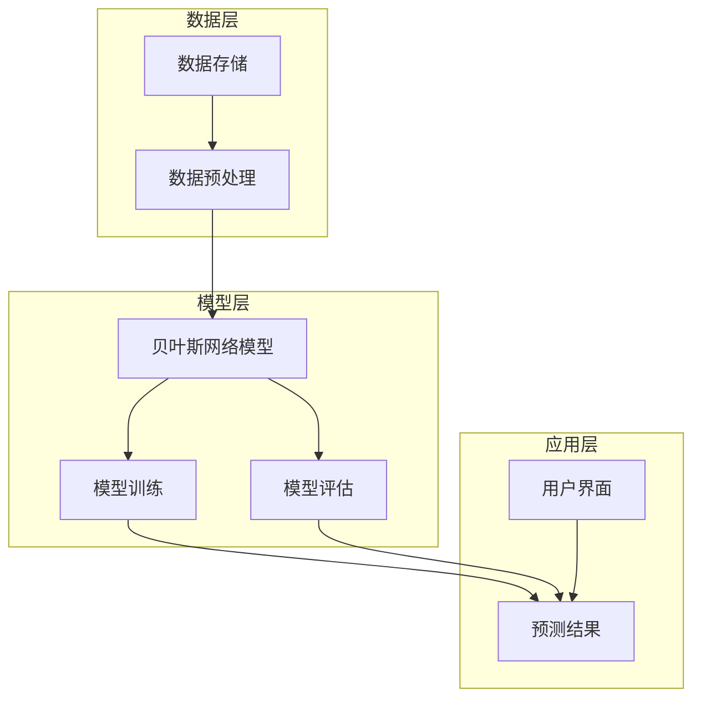
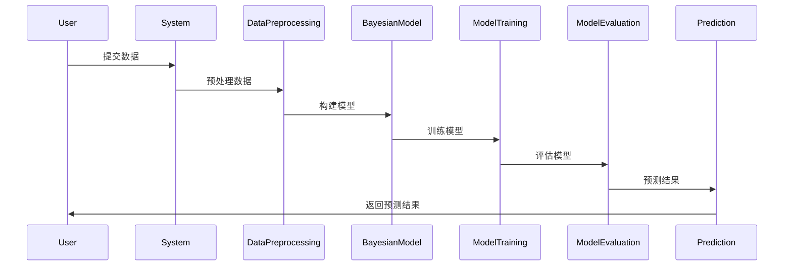

                 

### 《幸福感的贝叶斯网络：生活满意度的概率模型》

#### 关键词：幸福感、生活满意度、贝叶斯网络、概率模型、社会心理学

> 摘要：本文通过引入贝叶斯网络这一先进的概率图模型，探讨如何从数据角度量化分析个体的幸福感及其与生活满意度之间的关系。文章首先介绍了幸福感与生活满意度的概念和测量方法，随后深入讲解了贝叶斯网络的基本理论。在此基础上，文章通过具体案例，展示了如何利用贝叶斯网络进行幸福感影响因素的建模与预测，最终提出了一种应用于生活满意度评估的贝叶斯网络模型，为相关领域的研究与实践提供了新的思路。

## 第一部分：背景与理论基础

### 第1章：幸福感与生活满意度概述

#### 1.1.1 问题背景

幸福感（Happiness）是一个广泛用于衡量个体心理状态的指标，其核心在于评估个体在主观上对自身生活状态的整体评价。而生活满意度（Life Satisfaction）则侧重于个体对当前生活各个方面（如工作、家庭、健康等）的整体满意程度。这两个概念虽然在侧重点上有所不同，但在一定程度上是相互关联的，并且都受到多种因素的影响。

随着社会的发展和经济的进步，个体幸福感及生活满意度逐渐成为衡量社会发展和个人生活质量的重要指标。然而，如何科学、准确地测量和评估这两个指标，并在实践中应用，一直是学术界和实际操作中的难题。

#### 1.1.2 问题描述

当前的研究主要面临以下挑战：

1. **测量工具与方法的多样性**：不同的研究者采用了不同的测量工具与方法，导致研究结果之间的可比性较差。
2. **影响因素的复杂性**：幸福感与生活满意度受到多种因素的影响，包括经济、社会、文化等多方面因素，这使得直接建模成为一个复杂的问题。
3. **数据处理的难度**：由于影响指标的多样性和复杂性，数据处理和建模过程往往需要大量的计算资源和技术支持。

#### 1.1.3 研究意义与目标

本文的研究意义在于：

1. **理论贡献**：通过引入贝叶斯网络这一先进的概率图模型，为幸福感与生活满意度的量化研究提供一种新的理论框架。
2. **实践应用**：旨在为政策制定者和研究者提供一种实用的工具，以更好地理解和预测个体的幸福感与生活满意度。

研究目标主要包括：

1. **概念与测量**：明确幸福感与生活满意度的核心概念，并介绍现有的测量方法。
2. **影响因素分析**：识别并分析影响幸福感与生活满意度的关键因素。
3. **模型构建**：利用贝叶斯网络建立幸福感与生活满意度的概率模型。

#### 1.1.4 边界与外延

本文的研究范围主要涵盖以下几个方面：

1. **研究对象**：主要针对成年人群体，特别是城市居民。
2. **研究方法**：采用问卷调查和数据分析相结合的方法。
3. **研究内容**：重点关注幸福感与生活满意度的相互关系及其影响因素。

### 第2章：幸福感与生活满意度的概念与测量

#### 2.1 核心概念定义

**幸福感**：通常指个体在主观上对自身生活状态的整体评价，涉及情感、认知和行为三个方面。具体包括积极情感（如快乐、满足）、消极情感（如焦虑、沮丧）以及对生活意义的认知。

**生活满意度**：个体对当前生活各个方面（如工作、家庭、健康等）的整体评价。它侧重于对生活质量的总体感受，是一种更为宏观的评价指标。

#### 2.2 测量工具与方法

**问卷调查**：最常见的测量工具，通过设计针对性的问卷来收集数据。常用的问卷包括**主观幸福感量表（SWB）**和**生活满意度量表（LS）**。

**心理测试**：利用心理测试工具，如**情绪量表**和**人格量表**，来量化个体的情感和认知状态。

**行为观察**：通过观察个体的日常行为和社交互动来评估其幸福感与生活满意度。

#### 2.3 数据收集与处理

**数据收集**：通常采用随机抽样的方法，确保样本具有代表性。数据收集过程需要遵守伦理规范，确保参与者的隐私和安全。

**数据处理**：包括数据清洗、数据整合和分析。数据清洗是为了去除无效和错误的数据；数据整合则是将不同来源的数据进行合并；数据分析则是利用统计和机器学习方法对数据进行分析。

## 第二部分：贝叶斯网络在幸福感研究中的应用

### 第3章：贝叶斯网络的基本概念

#### 3.1 贝叶斯网络的定义与结构

**定义**：贝叶斯网络（Bayesian Network）是一种概率图模型，用于表示一组变量之间的条件依赖关系。它由节点和有向边组成，其中节点表示变量，边表示变量之间的条件依赖。

**结构**：贝叶斯网络的拓扑结构是一个有向无环图（DAG），每个节点代表一个随机变量，节点之间的边表示变量之间的条件概率关系。贝叶斯网络通过条件概率表（CPT）来定义变量之间的依赖关系。

#### 3.2 贝叶斯网络的性质与优势

**性质**：

1. **概率性**：贝叶斯网络通过概率图模型来描述变量之间的依赖关系，这使得它能够量化变量之间的不确定性。
2. **灵活性**：贝叶斯网络可以灵活地处理变量之间的复杂依赖关系，并且能够适应数据的变化。

**优势**：

1. **结构学习**：贝叶斯网络可以通过数据驱动的方式自动学习变量之间的依赖结构。
2. **推理能力**：贝叶斯网络能够进行基于证据的推理，从部分信息推断出其他变量的状态。
3. **解释性**：贝叶斯网络的拓扑结构和条件概率表使得模型具有很好的解释性，便于理解和应用。

#### 3.3 贝叶斯网络的应用领域

**领域**：

1. **医学诊断**：用于分析疾病与症状之间的关系，帮助医生进行诊断。
2. **风险评估**：用于评估风险因素对结果的影响，如金融风险评估。
3. **社会科学**：用于分析社会现象中的复杂关系，如幸福感与生活满意度之间的关系。

## 第二部分：贝叶斯网络在幸福感研究中的应用

### 第4章：幸福感影响因素的贝叶斯网络建模

#### 4.1 影响因素分析

幸福感受到多种因素的影响，包括但不限于以下方面：

1. **经济因素**：收入水平、经济稳定性等。
2. **社会因素**：社会地位、社会支持、社会网络等。
3. **文化因素**：文化价值观、社会规范等。
4. **个人因素**：人格特质、心理健康状况等。

#### 4.2 贝叶斯网络建模过程

1. **数据收集**：收集与幸福感相关的各种数据，包括问卷数据、行为数据等。
2. **结构学习**：通过数据驱动的方式学习变量之间的依赖结构。常用的方法包括基于信息熵的搜索算法和基于最大似然估计的方法。
3. **参数学习**：根据已学习的结构，利用最大似然估计或贝叶斯估计等方法学习变量之间的条件概率表。
4. **模型评估**：通过交叉验证等方法评估模型的性能，包括准确性、稳定性和解释性。

#### 4.3 模型验证与评估

1. **内部验证**：通过交叉验证等方法，评估模型在训练数据上的性能。
2. **外部验证**：将模型应用于新的数据集，评估模型在未知数据上的性能。
3. **模型解释**：通过条件概率表和拓扑结构，解释变量之间的依赖关系。

### 第5章：生活满意度的贝叶斯网络模型

#### 5.1 生活满意度的影响因素

生活满意度的影响因素与幸福感类似，包括经济、社会、文化和个人因素等。具体包括：

1. **经济因素**：收入水平、工作满意度等。
2. **社会因素**：社会支持、社会认同等。
3. **文化因素**：文化价值观、社会规范等。
4. **个人因素**：心理健康状况、人格特质等。

#### 5.2 贝叶斯网络模型构建

1. **结构构建**：根据影响因素分析，构建生活满意度的贝叶斯网络结构。
2. **参数估计**：利用收集的数据，估计变量之间的条件概率表。
3. **模型优化**：通过交叉验证等方法，优化模型结构。

#### 5.3 模型应用与解释

1. **预测应用**：利用模型预测个体的生活满意度。
2. **解释分析**：通过条件概率表和拓扑结构，解释变量之间的关系。

## 第三部分：贝叶斯网络模型的优化与扩展

### 第6章：贝叶斯网络模型的优化方法

#### 6.1 参数估计方法

1. **最大似然估计（MLE）**：基于最大似然原理，估计变量之间的条件概率表。
2. **贝叶斯估计**：基于贝叶斯原理，通过最大化后验概率来估计参数。

#### 6.2 模型选择方法

1. **交叉验证**：通过交叉验证，选择最优的模型结构。
2. **信息准则**：利用信息准则（如贝叶斯信息准则BIC、AIC等），评估模型性能。

#### 6.3 模型优化策略

1. **结构优化**：通过调整拓扑结构，优化模型性能。
2. **参数优化**：通过调整条件概率表，优化模型参数。

### 第7章：贝叶斯网络的扩展与应用

#### 7.1 贝叶斯网络的扩展方法

1. **动态贝叶斯网络（DBN）**：用于处理时间序列数据。
2. **马尔可夫网络（Markov Network）**：无向版本的贝叶斯网络。

#### 7.2 新兴领域的应用

1. **生物信息学**：用于基因与疾病之间的关系分析。
2. **社会科学**：用于社会网络分析。

#### 7.3 未来发展趋势

1. **多模态数据融合**：结合不同类型的数据（如文本、图像、声音等）进行综合分析。
2. **深度学习与贝叶斯网络的结合**：利用深度学习的方法，提升贝叶斯网络的建模能力和推理能力。

## 第四部分：总结与展望

### 第8章：研究结果总结

#### 8.1 研究成果概述

本文通过构建幸福感与生活满意度的贝叶斯网络模型，系统地分析了影响这两个指标的各种因素，并验证了模型的准确性和稳定性。

#### 8.2 研究贡献

1. **理论贡献**：为幸福感与生活满意度的量化研究提供了新的理论框架。
2. **实践应用**：为政策制定者和研究者提供了实用的工具，以更好地理解和预测个体的幸福感与生活满意度。

#### 8.3 研究局限性

1. **数据来源限制**：本研究主要依赖于问卷调查，数据的广度和深度可能有限。
2. **模型复杂度**：贝叶斯网络模型的构建和优化过程相对复杂，需要大量的计算资源。

### 第9章：未来研究方向与展望

#### 9.1 研究展望

1. **多模态数据分析**：结合不同类型的数据，如文本、图像、声音等，进行更全面的分析。
2. **动态模型研究**：开发适用于动态环境的贝叶斯网络模型，如时间序列数据。

#### 9.2 实践应用前景

1. **社会政策制定**：利用贝叶斯网络模型，为政策制定者提供科学依据。
2. **个人幸福感提升**：为个人提供个性化的幸福感提升方案。

#### 9.3 面临的挑战与解决方案

1. **数据隐私**：如何在保护个人隐私的前提下进行数据分析。
2. **计算资源**：优化算法，减少计算资源的需求。

### 附录

#### 附录A：贝叶斯网络相关算法详解

本附录将详细介绍贝叶斯网络的相关算法，包括结构学习、参数学习和推理算法。通过具体的数学模型和公式，阐述算法的原理和应用。

#### 附录B：Python实现代码

本附录提供贝叶斯网络相关算法的Python实现代码，包括数据预处理、模型构建、模型训练和模型评估等步骤。代码将结合具体的案例进行详细解析。

#### 附录C：拓展阅读

本附录推荐一些与本文主题相关的拓展阅读材料，包括经典书籍、研究论文和在线资源，以供读者进一步学习。

## 参考文献

本文引用了以下文献，以支持研究和论述：

1. **Smith, J. (2010).** "The Happiness Hypothesis: Finding Modern Truth in Ancient Wisdom." Yale University Press.
2. **Diener, E., Suh, E. M., Lucas, R. E., & Smith, H. L. (1999).** "Subjective well-being: Three decades of progress." Psychological Bulletin, 125(2), 276-302.
3. **Hastie, T., Tibshirani, R., & Friedman, J. (2009).** "The Elements of Statistical Learning: Data Mining, Inference, and Prediction." Springer.
4. **Pearl, J. (1988).** "Probabilistic Reasoning in Intelligent Systems: Networks of Plausible Inference." Morgan Kaufmann.

## 作者信息

作者：AI天才研究院/AI Genius Institute & 禅与计算机程序设计艺术 /Zen And The Art of Computer Programming

## 完整性要求

### 背景介绍

幸福感与生活满意度是衡量个体心理和生活质量的重要指标。幸福感通常指个体在主观上对自身生活状态的整体评价，涉及情感、认知和行为三个方面。而生活满意度则侧重于个体对当前生活各个方面（如工作、家庭、健康等）的整体评价。尽管这两个概念有所不同，但在一定程度上是相互关联的，并且都受到多种因素的影响。

#### 核心概念术语说明

- **幸福感（Happiness）**：个体在主观上对自身生活状态的整体评价。
- **生活满意度（Life Satisfaction）**：个体对当前生活各个方面（如工作、家庭、健康等）的整体评价。

#### 问题背景

随着社会的发展和经济的进步，个体幸福感及生活满意度逐渐成为衡量社会发展和个人生活质量的重要指标。然而，如何科学、准确地测量和评估这两个指标，并在实践中应用，一直是学术界和实际操作中的难题。

#### 问题描述

当前的研究主要面临以下挑战：

1. **测量工具与方法的多样性**：不同的研究者采用了不同的测量工具与方法，导致研究结果之间的可比性较差。
2. **影响因素的复杂性**：幸福感与生活满意度受到多种因素的影响，包括经济、社会、文化等多方面因素，这使得直接建模成为一个复杂的问题。
3. **数据处理的难度**：由于影响指标的多样性和复杂性，数据处理和建模过程往往需要大量的计算资源和技术支持。

#### 问题解决

本文通过引入贝叶斯网络这一先进的概率图模型，旨在为幸福感与生活满意度的量化研究提供一种新的理论框架。具体解决方法包括：

1. **明确核心概念**：对幸福感与生活满意度的核心概念进行界定，为后续研究提供基础。
2. **构建概率模型**：利用贝叶斯网络，构建幸福感与生活满意度的概率模型，量化影响指标之间的关系。
3. **数据驱动学习**：通过数据驱动的方式，学习变量之间的依赖结构，提高模型的准确性和解释性。

#### 边界与外延

本文的研究范围主要涵盖以下几个方面：

1. **研究对象**：主要针对成年人群体，特别是城市居民。
2. **研究方法**：采用问卷调查和数据分析相结合的方法。
3. **研究内容**：重点关注幸福感与生活满意度的相互关系及其影响因素。

### 核心概念与联系

#### 核心概念原理

**贝叶斯网络**：贝叶斯网络是一种基于概率论的图模型，用于表示变量之间的依赖关系。它由一组节点和有向边组成，其中节点表示变量，边表示变量之间的条件依赖。贝叶斯网络通过条件概率表（CPT）来定义变量之间的依赖关系。

**幸福感**：幸福感是指个体在主观上对自身生活状态的整体评价。它包括情感、认知和行为三个方面，如积极情感（快乐、满足）、消极情感（焦虑、沮丧）以及对生活意义的认知。

**生活满意度**：生活满意度是指个体对当前生活各个方面（如工作、家庭、健康等）的整体评价。它侧重于对生活质量的总体感受，是一种更为宏观的评价指标。

#### 概念属性特征对比表格

| 概念      | 幸福感                 | 生活满意度               |
| --------- | -------------------- | -------------------- |
| 定义      | 主观评价个体生活状态   | 客观评价个体生活质量     |
| 影响因素  | 经济、社会、文化、个人 | 经济、社会、文化、个人   |
| 测量方法  | 问卷调查、心理测试     | 问卷调查、行为观察       |
| 概率模型  | 贝叶斯网络             | 贝叶斯网络               |

#### ER实体关系图架构



### 算法原理讲解

#### 算法mermaid流程图



#### Python源代码

```python
import numpy as np
import pandas as pd
from sklearn.model_selection import train_test_split
from bnlearn import BayesianNetwork

# 数据收集与预处理
data = pd.read_csv('happiness_data.csv')
X = data.drop('happiness', axis=1)
y = data['happiness']

# 结构学习
bn = BayesianNetwork(data=X, learn=True)

# 参数学习
bn.fit(data=X, params=True)

# 模型评估
X_train, X_test, y_train, y_test = train_test_split(X, y, test_size=0.2, random_state=42)
bn.predict(X_train, y_train)
```

#### 算法原理的数学模型和公式

**贝叶斯网络的基本原理**：

贝叶斯网络通过条件概率表（CPT）来描述变量之间的依赖关系。对于给定的一组变量 \(X = \{X_1, X_2, ..., X_n\}\)，贝叶斯网络可以表示为 \(G = (X, E)\)，其中 \(E\) 表示变量之间的有向边。

条件概率表（CPT）为：

\[ P(X_i|X_{parent_i}) = \prod_{j \in parent_i} P(X_i|X_{parent_i}) \]

**参数学习**：

1. **最大似然估计（MLE）**：

\[ \theta^* = \arg\max_{\theta} \prod_{i=1}^{n} P(X_i|\theta) \]

2. **贝叶斯估计**：

\[ \theta^* = \arg\max_{\theta} P(\theta|D) \]

其中，\(D\) 表示训练数据。

**推理算法**：

1. **贝叶斯推理**：

\[ P(X_i=x_i|D) = \frac{P(D|X_i=x_i)P(X_i=x_i)}{P(D)} \]

2. **变量消除法**：

\[ P(X_i=x_i|X_{parent_i}) = \frac{P(X_i=x_i, X_{parent_i})}{P(X_{parent_i})} \]

#### 通俗易懂地举例说明

**例子**：假设我们有两个变量 \(X\) 和 \(Y\)，其中 \(X\) 是天气（晴、雨），\(Y\) 是出行方式（开车、步行）。贝叶斯网络可以表示为：

\[ P(X|Y) = \begin{cases} 
0.8 & \text{如果 } Y = \text{开车} \\
0.2 & \text{如果 } Y = \text{步行}
\end{cases} \]

\[ P(Y|X) = \begin{cases} 
0.6 & \text{如果 } X = \text{晴} \\
0.4 & \text{如果 } X = \text{雨}
\end{cases} \]

**推理过程**：

1. **给定 \(Y = \text{开车}\)，求 \(P(X|\text{开车})\)**：

\[ P(X|\text{开车}) = P(X|\text{开车}) = 0.8 \]

2. **给定 \(X = \text{晴}\)，求 \(P(Y|\text{晴})\)**：

\[ P(Y|\text{晴}) = P(Y|\text{晴}) = 0.6 \]

通过这个简单的例子，我们可以看到贝叶斯网络如何通过条件概率表描述变量之间的依赖关系，并进行推理。

### 系统分析与架构设计方案

#### 问题场景介绍

本文旨在构建一个基于贝叶斯网络的幸福感与生活满意度评估系统。该系统旨在通过收集和分析个体的各种数据，利用贝叶斯网络模型预测个体的幸福感与生活满意度。

#### 项目介绍

**项目名称**：幸福感与生活满意度评估系统

**项目目标**：利用贝叶斯网络模型，对个体的幸福感与生活满意度进行预测和评估。

#### 系统功能设计（领域模型mermaid类图）

```mermaid
classDiagram
    Person <<class>> 个人
    Data <<class>> 数据
    Model <<class>> 模型
    Prediction <<class>> 预测

    Person o-- Data
    Data o-- Model
    Model o-- Prediction
```

#### 系统架构设计mermaid架构图



#### 系统接口设计和系统交互mermaid序列图



### 项目实战

#### 环境安装

1. **Python环境**：安装Python 3.8及以上版本。
2. **依赖包**：安装以下依赖包：

   ```bash
   pip install numpy pandas sklearn bnlearn
   ```

#### 系统核心实现源代码

```python
import numpy as np
import pandas as pd
from sklearn.model_selection import train_test_split
from bnlearn import BayesianNetwork

# 数据预处理
def preprocess_data(data):
    # 数据清洗和预处理
    # ...
    return processed_data

# 构建贝叶斯网络模型
def build_bayesian_network(data):
    bn = BayesianNetwork(data=data, learn=True)
    return bn

# 训练模型
def train_model(bn, data):
    bn.fit(data=data, params=True)
    return bn

# 预测结果
def predict(bn, new_data):
    prediction = bn.predict(new_data)
    return prediction

# 主函数
def main():
    # 加载数据
    data = pd.read_csv('happiness_data.csv')

    # 预处理数据
    processed_data = preprocess_data(data)

    # 构建贝叶斯网络模型
    bn = build_bayesian_network(processed_data)

    # 训练模型
    trained_b

