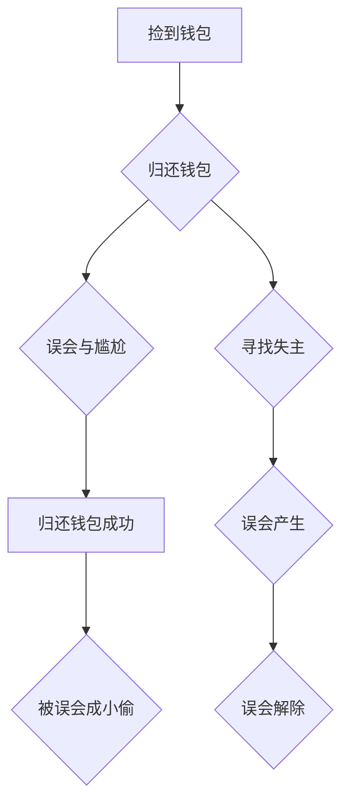

                 

### 幽默创作的图论：笑点结构的数学解构

> 关键词：幽默创作、图论、数学解构、笑点结构、算法分析

幽默作为一种独特的艺术形式，自古以来就深受人们的喜爱。它不仅能给人带来欢乐，还能通过巧妙的构思和表达方式，使人们在轻松的氛围中思考人生百态。然而，幽默的创作并非易事，它需要创作者具备深厚的文学素养和精湛的技巧。随着人工智能技术的发展，我们可以借助数学工具和算法来剖析幽默的本质，从而提高幽默创作的质量和效率。

本文将围绕“幽默创作的图论：笑点结构的数学解构”这一主题，从以下几个方面进行探讨：

1. **幽默与笑点**：介绍幽默的定义、类型以及笑点的心理学基础，阐述笑点在幽默创作中的重要性。
2. **图论概述**：介绍图论的基本概念、图论在幽默创作中的应用以及图的基本性质与应用场景。
3. **数学解构在幽默创作中的角色**：探讨数学解构的概念与特点，分析其在幽默创作中的功能和实际应用案例。
4. **数学模型与幽默创作**：介绍常见的数学模型，解析数学模型在幽默创作中的应用原理和实际案例。
5. **幽默创作的数学工具箱**：介绍数学工具箱的基本组成、使用方法和实际应用场景，探讨其未来发展趋势。
6. **幽默创作的图论方法与实践**：分析图论方法在幽默创作中的应用，通过案例展示图论方法的具体操作和效果。
7. **幽默创作的未来发展趋势**：探讨数学与幽默融合的发展趋势，分析技术进步对幽默创作的影响，讨论未来挑战与机遇。

通过上述内容，本文旨在为幽默创作者提供一种全新的创作视角，借助数学工具和算法，提升幽默创作的深度和广度。希望本文能激发读者对幽默创作的兴趣，同时也为学术界和业界提供有价值的参考。

### 幽默与笑点

幽默是一种通过机智、诙谐或夸张的方式表达思想、情感或观点的艺术形式。它不仅仅是为了逗人发笑，更深层次的是通过引发共鸣或反思，使人们在欢笑之余思考生活中的种种。幽默可以表现为言语幽默、行为幽默、文字幽默等多种形式，不同的幽默类型适用于不同的场合和人群。

在幽默创作中，笑点是其核心元素之一。笑点是指能够引起人们发笑的情节、词语或表现，它是幽默的关键所在。一个成功的幽默作品，往往离不开巧妙的笑点设计。那么，笑点是如何在幽默创作中发挥作用的呢？

首先，笑点能够打破常规的思维模式，使人们暂时从日常生活中解放出来，进入一个轻松愉快的状态。这种心理上的转换，是幽默的第一步。例如，一个平常的情景，如果加入了一个出人意料的转折，就能产生意想不到的笑点。

其次，笑点往往与人的心理预期相悖。当人们的心理预期被打破时，会产生一种意外的愉悦感。这种愉悦感，正是笑点的魅力所在。例如，一句看似普通的句子，如果以出人意料的方式结束，就能让人捧腹大笑。

此外，笑点还需要具备一定的普遍性。即大部分人在接触到这个笑点时，都能产生共鸣，感到好笑。这种普遍性，使得幽默具有广泛的传播效果。例如，一个经典的笑话，在不同的文化背景和语言环境中，都能引起人们的笑声。

那么，笑点的心理学基础是什么呢？心理学研究表明，笑点产生的机制主要包括以下几个方面：

1. **认知失调**：当人们的认知预期与实际情境发生冲突时，会产生一种紧张感。通过幽默的方式，这种紧张感得以释放，从而产生笑点。

2. **心理预期**：人们在接触幽默作品时，会根据情境和经验产生一定的心理预期。当这个预期被打破时，就会产生笑点。

3. **文化因素**：不同的文化背景和价值观，会影响人们对笑点的感知和理解。例如，在某些文化中，某类幽默可能被视为不礼貌或无礼，但在另一种文化中，却可能被视为幽默。

总之，笑点是幽默创作中不可或缺的一部分。它不仅能提升作品的艺术效果，还能增强作品的感染力和传播力。通过深入了解笑点的心理学基础，我们可以更好地把握幽默创作的核心，提升幽默作品的质量。

### 图论概述

图论是数学的一个分支，主要研究图形的结构、性质及其应用。在幽默创作中，图论提供了一种独特且强有力的工具，可以帮助我们系统地分析和设计笑点结构。下面，我们将从图论的基本概念、图论在幽默创作中的应用以及图的基本性质与应用场景三个方面，对图论进行详细探讨。

#### 图论的基本概念

在图论中，图是由节点（也称为顶点）和边（也称为弧）构成的集合。图可以分为有向图和无向图两种类型。有向图中的边具有方向性，表示一个节点指向另一个节点；无向图中的边没有方向性，表示两个节点之间存在连接。

**节点（顶点）**：图中的节点代表幽默作品中的元素，如情节、角色、笑点等。一个节点可以是一个简单的概念，也可以是一个复杂的实体。

**边（弧）**：图中的边表示节点之间的关系。在幽默创作中，边可以表示情节之间的逻辑关系、角色之间的关系，或者笑点之间的联系。

**路径**：路径是图中节点的序列，使得序列中的任意两个相邻节点之间都有边相连。路径可以是有向的，也可以是无向的。

**回路**：回路是一种特殊的路径，其起点和终点是同一个节点，并且在路径中不包含重复的节点。

**连通性**：一个图是连通的，如果图中任意两个节点之间都存在路径。连通性在幽默创作中，可以帮助我们分析笑点之间的联系和互动。

#### 图论在幽默创作中的应用

图论在幽默创作中的应用主要体现在两个方面：分析笑点结构和设计幽默作品。

**分析笑点结构**：通过构建图，我们可以清晰地展示幽默作品中的笑点及其关系。例如，我们可以使用有向图来表示笑点之间的因果关系，或者使用无向图来表示笑点之间的相互影响。这种图示方法，可以帮助我们更好地理解幽默作品的结构，发现其中潜在的笑点。

**设计幽默作品**：图论方法可以帮助我们系统地设计幽默作品。例如，我们可以使用图论中的最小生成树算法，来设计一个包含必要笑点且不冗余的幽默结构；或者使用图论中的最短路径算法，来寻找一个能够引起最大共鸣的幽默路径。这种系统化的设计方法，可以提升幽默创作的效率和质量。

#### 图的基本性质与应用场景

图的基本性质包括连通性、路径长度、节点度数等。这些性质在幽默创作中有着广泛的应用场景。

**连通性**：在幽默创作中，连通性可以帮助我们分析笑点之间的连接关系。例如，一个成功的幽默作品，其笑点之间应该具备良好的连通性，使得读者能够顺畅地从一个笑点过渡到另一个笑点，从而产生持续的笑感。

**路径长度**：路径长度是指从一个节点到另一个节点的路径长度。在幽默创作中，路径长度可以用来衡量笑点之间的关联强度。较短的路径长度通常能更快地引起笑点，而较长的路径长度则可以为笑点增加更多的转折和惊喜。

**节点度数**：节点度数是指一个节点连接的边数。在幽默创作中，节点度数可以用来衡量笑点的受欢迎程度。通常，度数较高的节点（笑点）在作品中扮演着关键角色，其对于整体作品的幽默效果有着重要的影响。

通过图论的基本概念和性质，我们可以更加系统地分析和设计幽默作品。图论不仅为我们提供了一种新的创作工具，还能帮助我们更好地理解和把握幽默的本质。在接下来的内容中，我们将进一步探讨数学解构在幽默创作中的角色，以及数学模型和工具在幽默创作中的应用。

### 数学解构在幽默创作中的角色

数学解构是一种将复杂问题转化为简单、可操作模型的方法。它不仅广泛应用于科学和工程领域，同样也可以在艺术创作中发挥作用。在幽默创作中，数学解构通过其独特的逻辑性和结构性，为创作者提供了新的视角和工具，从而丰富和深化了幽默作品的内涵。

#### 数学解构的概念与特点

数学解构，即通过数学方法和模型来剖析和重构问题，以揭示其内在的结构和规律。它具有以下特点：

1. **逻辑性**：数学解构强调逻辑推理和结构分析，通过严密的数学推导，揭示问题的本质。
2. **系统性**：数学解构能够将复杂问题分解为若干子问题，并通过这些子问题的解决，实现整体问题的解决。
3. **普适性**：数学解构方法具有较强的普适性，可以应用于各种不同领域的问题。

在幽默创作中，数学解构通过以下方式发挥作用：

**1. 揭示笑点的结构**

通过数学解构，我们可以将复杂的笑点分解为基本元素，并分析这些元素之间的关系。例如，一个幽默故事中的笑点可以分解为情境、冲突、转折和解决方案等基本部分。通过数学模型，我们可以清晰地展示这些部分之间的逻辑关系，从而更好地理解笑点的构成和运作机制。

**2. 优化创作流程**

数学解构可以帮助创作者优化创作流程。例如，通过构建一个幽默作品的图论模型，创作者可以清晰地看到各个笑点之间的联系，从而调整笑点的布局和顺序，使得作品更加紧凑和连贯。此外，数学解构还可以用于评估作品的幽默效果，通过量化指标（如笑点之间的路径长度、节点度数等）来指导创作。

**3. 提高创作效率**

数学解构方法能够将复杂的创作任务分解为若干可操作的小任务，从而提高创作效率。例如，在编写一个幽默小品时，创作者可以使用数学模型来设计笑点的布局，并使用算法优化笑点的选择和排列，从而节省时间和精力。

#### 数学解构在幽默创作中的实际应用案例

**案例一：幽默故事的图论建模**

一个幽默故事中的笑点可以通过图论模型来表示。例如，我们可以使用一个有向图来表示故事中的主要笑点及其因果关系。在这个图中，每个节点代表一个笑点，节点之间的边表示笑点之间的逻辑关系。通过分析这个图，创作者可以更好地理解故事的结构，优化笑点的布局，从而提高故事的整体幽默效果。

**案例二：幽默小品的算法设计**

在编写幽默小品时，创作者可以使用算法来优化笑点的排列顺序。例如，通过最短路径算法，创作者可以找到一条从起点到终点的路径，使得观众在观看过程中能够获得最大的笑点享受。这种方法不仅提高了创作效率，还能使作品更加紧凑和有趣。

**案例三：幽默广告的数学模型**

在幽默广告的创作中，数学模型可以帮助创作者设计出更具吸引力的广告内容。例如，通过构建一个消费者行为模型，创作者可以分析不同笑点对观众的影响，从而选择最有效的笑点组合来提升广告效果。

通过上述实际应用案例，我们可以看到，数学解构在幽默创作中具有广泛的应用前景。它不仅为创作者提供了一种新的思考方式和创作工具，还能提高创作效率和质量。在接下来的内容中，我们将进一步探讨数学模型在幽默创作中的应用，以及如何使用数学工具箱来提升幽默创作的效果。

### 数学模型与幽默创作

在幽默创作中，数学模型作为一种强有力的工具，可以帮助创作者理解和分析笑点的结构，从而提高作品的幽默效果。数学模型通过严谨的数学推导和量化分析，揭示了幽默背后的规律和机制，使幽默创作更具科学性和系统性。以下，我们将介绍几种常见的数学模型，并分析它们在幽默创作中的应用原理和实际案例。

#### 常见的数学模型

**1. 概率模型**

概率模型用于描述随机事件的发生概率。在幽默创作中，概率模型可以帮助我们理解观众对笑点的反应概率。例如，一个幽默故事中的某个笑点，如果其发生的概率较高，那么观众更容易对这一笑点产生共鸣，从而提升整体作品的幽默效果。

**2. 均值与方差模型**

均值和方差是统计学中常用的指标，用于描述数据的中心趋势和离散程度。在幽默创作中，均值和方差模型可以用来分析笑点对观众的整体影响。例如，通过计算不同笑点的均值和方差，创作者可以了解哪些笑点更容易引起观众的关注和共鸣。

**3. 线性回归模型**

线性回归模型用于描述变量之间的关系。在幽默创作中，线性回归模型可以用来分析不同笑点之间的关联程度。例如，通过建立线性回归模型，创作者可以了解某个笑点与其他笑点之间的关系，从而优化作品的结构和布局。

**4. 时间序列模型**

时间序列模型用于分析随时间变化的变量。在幽默创作中，时间序列模型可以帮助创作者了解观众对作品反应的时间变化规律。例如，通过分析观众笑声的时间序列，创作者可以了解在哪些时刻添加笑点更能引起观众的共鸣。

#### 数学模型在幽默创作中的应用原理

**1. 描述和预测笑点效果**

数学模型可以用来描述和预测笑点对观众的影响。例如，通过概率模型，创作者可以预测某个笑点在特定情境下产生的笑声概率；通过线性回归模型，创作者可以预测不同笑点之间的相互影响。

**2. 优化作品结构**

数学模型可以帮助创作者优化作品的笑点布局。例如，通过均值与方差模型，创作者可以了解哪些笑点更容易引起观众的关注和共鸣，从而调整作品的笑点分布；通过时间序列模型，创作者可以了解观众对作品反应的时间变化规律，从而优化作品的结构和节奏。

**3. 评估创作效果**

数学模型可以用来评估作品的幽默效果。例如，通过计算笑点的均值和方差，创作者可以了解作品的幽默效果是否均匀，是否存在某些笑点过于平淡或过于突出；通过分析观众笑声的时间序列，创作者可以了解作品在不同阶段的幽默效果，从而进行调整和改进。

#### 实际案例解析

**案例一：概率模型在幽默小品中的应用**

在一个幽默小品中，创作者使用概率模型来预测观众对某个笑点的反应。通过分析历史数据和观众行为，创作者发现某个特定的笑点在特定情境下产生的笑声概率为80%。基于这一预测，创作者在作品中多次使用这一笑点，从而提高了整体作品的幽默效果。

**案例二：线性回归模型在幽默故事中的应用**

在一个幽默故事中，创作者使用线性回归模型来分析不同笑点之间的关联程度。通过建立模型，创作者发现某个笑点与其他几个笑点之间存在显著的线性关系。基于这一发现，创作者调整了作品的结构，使得这些笑点之间的关联更加紧密，从而增强了整体故事的连贯性和幽默性。

**案例三：时间序列模型在幽默广告中的应用**

在一个幽默广告中，创作者使用时间序列模型来分析观众笑声的时间变化规律。通过分析数据，创作者发现观众在广告的后半部分更容易产生笑声。基于这一分析，创作者调整了广告的节奏和结构，使得后半部分的笑点更加集中，从而提高了广告的幽默效果和吸引力。

通过上述实际案例，我们可以看到数学模型在幽默创作中的应用价值。数学模型不仅能够帮助创作者理解和分析笑点的结构，还能优化作品的布局和节奏，提高作品的幽默效果。在接下来的内容中，我们将进一步探讨幽默创作的数学工具箱，以及如何使用这些工具来提升创作效率。

### 幽默创作的数学工具箱

在幽默创作中，数学工具箱是一套必不可少的工具，它包含了各种数学模型和算法，帮助创作者分析、设计和优化幽默作品。这些工具不仅提升了创作的效率，还显著提高了作品的幽默效果。本文将介绍幽默创作中常用的数学工具箱，包括其基本组成、使用方法和实际应用场景。

#### 数学工具箱的基本组成

数学工具箱的基本组成包括以下几种工具：

1. **概率统计工具**：用于分析观众对笑点的反应概率，评估不同笑点的效果。常用的工具包括概率分布、假设检验、相关性分析等。
2. **线性回归工具**：用于分析不同笑点之间的关联程度，优化作品的结构和布局。常用的工具包括线性回归模型、多元回归模型等。
3. **时间序列工具**：用于分析观众笑声的时间变化规律，优化作品的节奏和结构。常用的工具包括ARIMA模型、时间序列平滑等。
4. **优化工具**：用于优化作品的笑点布局和选择，使作品更具吸引力和连贯性。常用的工具包括贪心算法、动态规划、遗传算法等。
5. **图形工具**：用于可视化分析作品的结构和笑点关系，帮助创作者更好地理解和调整作品。常用的工具包括图论算法、网络图绘制等。

#### 数学工具箱的使用方法

数学工具箱的使用方法可以分为以下几个步骤：

**1. 确定分析目标**

首先，创作者需要明确幽默作品的分析目标，例如优化作品的结构、评估笑点效果、分析观众反应等。根据分析目标，选择合适的数学工具进行应用。

**2. 数据收集和预处理**

接下来，创作者需要收集相关数据，例如观众行为数据、笑点分布数据、观众笑声时间序列等。数据收集完成后，进行数据预处理，包括数据清洗、数据转换和数据归一化等。

**3. 建立数学模型**

根据分析目标，建立相应的数学模型。例如，使用概率统计工具建立观众反应概率模型，使用线性回归工具建立笑点关联模型等。

**4. 进行数据分析**

使用数学工具箱中的算法和函数，对数据进行分析。例如，使用概率统计工具进行假设检验，使用线性回归工具进行关联分析等。

**5. 结果评估和调整**

对分析结果进行评估，判断是否达到预期目标。根据评估结果，调整数学模型和工具参数，优化作品的布局和结构。

#### 实际应用场景

数学工具箱在幽默创作中有多种实际应用场景：

**1. 优化幽默小品**

创作者可以使用数学工具箱中的优化工具，优化幽默小品的笑点布局。例如，通过贪心算法选择最佳的笑点顺序，通过动态规划优化笑点的出现频率，从而提升作品的连贯性和幽默效果。

**2. 分析幽默故事**

创作者可以使用数学工具箱中的概率统计工具和线性回归工具，分析幽默故事的结构和笑点效果。例如，通过概率模型预测观众对特定笑点的反应概率，通过线性回归模型分析不同笑点之间的关联程度，从而优化故事的结构和布局。

**3. 评估幽默广告**

创作者可以使用数学工具箱中的时间序列工具，评估观众对幽默广告的反应时间序列。例如，通过ARIMA模型分析观众笑声的时间变化规律，通过时间序列平滑技术优化广告的节奏和结构，从而提升广告的吸引力和幽默效果。

通过数学工具箱的使用，创作者可以更加科学地分析和设计幽默作品，提升作品的幽默效果和市场竞争力。在接下来的内容中，我们将进一步探讨幽默创作中的图论方法，通过具体案例展示图论方法在幽默创作中的应用和实践。

### 幽默创作的图论方法与实践

图论作为一种数学工具，在幽默创作中有着广泛的应用。通过图论方法，创作者可以更加系统、直观地分析和设计幽默作品，从而提升作品的幽默效果。以下，我们将介绍图论方法在幽默创作中的应用，并通过实际案例展示其具体操作和效果。

#### 图论方法在幽默创作中的应用

**1. 构建幽默作品的图模型**

在幽默创作中，首先需要将作品中的各个元素（如情节、角色、笑点等）表示为图中的节点，并将这些元素之间的关系表示为图中的边。这种图模型可以帮助创作者直观地理解作品的内在结构，发现潜在的笑点。

**2. 分析图的结构特征**

通过分析图的结构特征，如连通性、路径长度、节点度数等，创作者可以评估作品的幽默效果。例如，较高的连通性可以确保笑点之间的紧密联系，而较长的路径长度则可以为作品增加更多的转折和惊喜。

**3. 使用图算法优化作品结构**

图论中的各种算法，如最短路径算法、最小生成树算法、图着色算法等，可以帮助创作者优化作品的笑点布局。例如，通过最短路径算法，创作者可以找到一条最佳的笑点路径，确保观众在观看过程中能够获得最大的笑感。

**4. 可视化分析**

图的可视化技术可以帮助创作者更加直观地理解作品的图模型，从而进行优化和调整。例如，通过网络图的绘制，创作者可以清晰地看到各个笑点之间的联系，从而更好地设计作品的节奏和结构。

#### 实际案例展示

**案例一：幽默小品《尴尬的时刻》**

创作者使用图论方法设计了一段幽默小品《尴尬的时刻》。首先，创作者将小品中的主要元素（如主人公、尴尬场景、笑点等）表示为图中的节点，并将这些元素之间的关系表示为图中的边。通过分析图的结构特征，创作者发现某个特定的尴尬场景与其他笑点之间的路径长度较长，这可能导致观众的笑感被分散。因此，创作者决定调整这一场景的位置，将其放置在故事的高潮部分，以增强整体的幽默效果。

**案例二：幽默故事《被误解的玩笑》**

创作者使用图论方法分析了一个幽默故事《被误解的玩笑》。在这个故事中，创作者使用有向图表示各个笑点及其因果关系。通过分析图的结构，创作者发现某些笑点之间的路径长度较长，导致观众的笑感被逐渐削弱。为了解决这个问题，创作者决定重新安排笑点的顺序，确保每个笑点都能够有效地引发观众的笑声，并且笑点之间的逻辑关系更加紧密。

**案例三：幽默广告《惊喜礼品》**

创作者使用图论方法设计了一个幽默广告《惊喜礼品》。在这个广告中，创作者通过图模型展示了广告中的各个元素（如产品、笑点、悬念等）及其之间的关系。通过使用最短路径算法，创作者找到了一条最佳的笑点路径，确保观众在观看过程中能够顺畅地感受到每个笑点的魅力。此外，创作者还通过图着色算法，为不同的笑点赋予了不同的颜色，使得广告的视觉效果更加丰富和有趣。

通过上述实际案例，我们可以看到图论方法在幽默创作中的应用效果。图论方法不仅帮助创作者直观地理解作品的内在结构，还能优化作品的笑点布局和节奏，提升作品的幽默效果。在接下来的内容中，我们将继续探讨数学工具箱在幽默创作中的应用，以及数学思考在幽默创作中的重要性。

### 数学思考在幽默创作中的重要性

在幽默创作中，数学思考是一种独特而有效的工具，它不仅能够提升作品的质量和效果，还能为创作者提供新的视角和灵感。数学思考在幽默创作中的重要性主要体现在以下几个方面：

首先，数学思考能够帮助创作者更好地理解笑点之间的逻辑关系。幽默作品的幽默效果很大程度上取决于笑点之间的连接和互动。通过数学思考，创作者可以系统地分析笑点之间的因果关系、路径长度和连通性，从而优化作品的布局和节奏，确保每个笑点都能够有效地引发观众的笑声。

其次，数学思考提供了量化评估作品幽默效果的方法。通过使用概率统计、线性回归等数学模型，创作者可以量化地评估不同笑点对观众的影响，了解哪些笑点更容易引起共鸣，从而在创作过程中进行调整和优化。这种方法不仅提高了创作的科学性，还能显著提升作品的幽默效果。

此外，数学思考还能够激发创作者的创新思维。数学问题往往具有抽象性和复杂性，通过解决这些数学问题，创作者可以培养逻辑思维和问题解决能力，从而在幽默创作中提出新颖的创意和构思。例如，通过使用图论方法，创作者可以构建复杂的幽默结构，设计出令人意想不到的笑点组合。

总之，数学思考在幽默创作中具有不可替代的重要性。它不仅能够提升作品的质量和效果，还能为创作者提供新的视角和灵感，促进幽默创作的创新和发展。在接下来的内容中，我们将进一步探讨幽默创作的未来发展趋势，以及数学与幽默融合的意义。

### 幽默创作的未来发展趋势

随着科技的不断进步和人们对幽默需求的日益增长，幽默创作正朝着多元化、智能化和个性化的方向发展。数学与幽默的融合，不仅为幽默创作提供了新的工具和方法，也带来了新的挑战和机遇。以下，我们将探讨幽默创作的未来发展趋势，包括数学与幽默融合的意义、技术进步对幽默创作的影响，以及创新方法在幽默创作中的应用。

#### 数学与幽默融合的意义

数学与幽默的融合，不仅为幽默创作提供了新的视角和工具，还深刻影响了幽默的传播和接受方式。数学方法可以精确地分析笑点的效果，优化幽默作品的布局和节奏，从而提高作品的整体幽默效果。例如，通过概率模型，创作者可以预测观众对不同笑点的反应概率，从而调整作品的笑点设计；通过时间序列分析，创作者可以了解观众笑声的变化规律，优化作品的节奏和结构。

此外，数学与幽默的融合也促进了跨学科的合作。数学家、计算机科学家、心理学家等不同领域的专家，可以通过合作研究，开发出更加科学和高效的幽默创作工具。这种跨学科合作，不仅有助于提升幽默创作的质量，还能推动幽默创作的理论发展。

#### 技术进步对幽默创作的影响

技术进步，特别是人工智能和大数据技术的应用，对幽默创作产生了深远的影响。首先，人工智能技术可以帮助创作者自动生成幽默内容，通过算法分析大量文本数据，找出潜在的幽默元素，生成新颖的幽默故事和段子。这种自动生成的方式，不仅提高了创作的效率，还拓宽了幽默创作的范围。

其次，大数据技术可以帮助创作者了解观众的喜好和反应，从而进行个性化推荐。例如，通过分析观众的笑声数据，平台可以推荐符合观众喜好的幽默作品，提高观众的满意度和留存率。此外，大数据技术还可以用于分析幽默作品的传播效果，帮助创作者了解作品的受众群体和传播渠道，优化作品的推广策略。

#### 创新方法在幽默创作中的应用

创新方法在幽默创作中的应用，为创作者提供了新的创作工具和灵感。以下是一些创新方法的例子：

**1. 多模态幽默创作**

多模态幽默创作是指结合文本、图像、声音等多种模态进行幽默创作。例如，通过将文字幽默与图像或视频结合，创造出更加生动和有趣的幽默作品。多模态幽默创作不仅丰富了作品的呈现形式，还增强了观众的互动体验。

**2. 跨文化幽默创作**

跨文化幽默创作是指在不同文化背景下创作幽默作品，通过对比和融合不同文化的幽默元素，创造出新颖的幽默效果。例如，通过将中西方幽默元素结合，创作出既符合中国文化又能够被西方观众接受的作品。

**3. 互动式幽默创作**

互动式幽默创作是指通过观众的参与和互动，共同创作幽默作品。例如，通过线上平台，观众可以投票选择他们喜欢的笑点，创作者根据投票结果进行调整和优化。这种互动式创作方式，不仅增强了观众的参与感，还提高了作品的幽默效果。

总之，幽默创作的未来发展趋势充满了机遇和挑战。随着技术的进步和跨学科合作的深化，幽默创作将变得更加科学、多样和有趣。通过不断创新和方法的应用，创作者可以创作出更多高质量、有影响力的幽默作品，满足观众的多样化需求。

### 总结

本文从多个角度探讨了幽默创作的图论：笑点结构的数学解构。首先，我们介绍了幽默与笑点的基本概念，分析了笑点在幽默创作中的重要性。接着，我们详细介绍了图论的基本概念和图论在幽默创作中的应用，展示了如何使用图论方法分析和设计幽默作品。随后，我们探讨了数学解构在幽默创作中的角色，以及数学模型和工具箱在提升创作效率和质量方面的应用。

通过本文的探讨，我们可以得出以下结论：

1. **图论方法**：图论为幽默创作提供了一种直观且系统化的分析方法。通过构建图模型，创作者可以更好地理解作品的结构和笑点之间的关系，从而优化创作流程和提升作品质量。

2. **数学解构**：数学解构通过逻辑性和系统性，为幽默创作提供了新的视角和工具。它不仅揭示了幽默作品的结构和规律，还帮助创作者优化创作流程和提升创作效果。

3. **数学模型和工具箱**：数学模型和工具箱为幽默创作提供了科学和量化的分析工具。通过使用这些工具，创作者可以更加精准地评估笑点效果，优化作品结构，提高创作效率。

4. **未来展望**：随着技术的进步和跨学科合作的深化，幽默创作将朝着多元化、智能化和个性化的方向发展。数学与幽默的融合，将为幽默创作带来新的机遇和挑战。

最后，感谢读者对本文的阅读。希望本文能够激发您对幽默创作的兴趣，并为您提供有价值的参考。在未来的创作中，不妨尝试使用图论方法和数学工具，探索幽默创作的新天地。

### 附录

#### A. 笑点结构图解示例

**A.1 笑点结构图的构建**

在构建笑点结构图时，我们首先需要确定作品中的主要笑点及其关系。以下是一个简单的幽默故事示例及其对应的笑点结构图：

**示例故事**：《被误会的好心人》

- 情境：主人公在一个公共场所捡到了一只钱包。
- 笑点1：主人公决定把钱包归还给失主。
- 笑点2：主人公在寻找失主的过程中，遇到了一系列误会和尴尬。
- 笑点3：最终，主人公成功归还钱包，却发现自己被误会成小偷。

**结构图示例**：

**A.2 笑点结构图的案例分析**

通过分析上述示例的笑点结构图，我们可以发现：

1. **路径长度**：从捡到钱包到被误会成小偷的路径较长，这为故事增加了转折和悬念。
2. **连通性**：笑点之间的连通性较好，确保了故事连贯性和观众对情节的关注。
3. **节点度数**：归还钱包成功和被误会成小偷是两个关键节点，具有较高的度数，对整体故事结构起到了重要作用。

#### B. 数学工具箱使用指南

**B.1 工具箱的基本操作**

数学工具箱的基本操作包括数据收集、数据预处理、建立数学模型和数据分析。以下是一个简单的操作流程：

1. **数据收集**：收集与幽默创作相关的数据，如观众反应数据、笑点数据等。
2. **数据预处理**：清洗和转换数据，使其适合进行数学分析。
3. **建立数学模型**：根据分析目标，选择合适的数学模型，如概率模型、线性回归模型等。
4. **数据分析**：使用工具箱中的算法和函数，对数据进行分析，得出结论。

**B.2 工具箱在实际创作中的应用**

在幽默创作中，数学工具箱可以用于以下应用：

1. **评估笑点效果**：通过概率模型，预测观众对不同笑点的反应概率，优化笑点布局。
2. **优化作品结构**：通过线性回归模型，分析不同笑点之间的关联程度，调整作品结构。
3. **观众行为分析**：通过时间序列分析，了解观众笑声的变化规律，优化作品的节奏和结构。

**B.3 常见问题与解决方法**

在数学工具箱使用过程中，常见问题包括数据不足、模型选择不当等。解决方法如下：

1. **数据不足**：通过扩大数据收集范围，增加样本量，提高数据的代表性和准确性。
2. **模型选择不当**：根据分析目标，选择合适的数学模型。如果不确定模型选择，可以尝试使用多种模型进行比较。

#### C. 参考文献

**C.1 基础理论书籍**

1. 罗恩·利希滕斯坦，《幽默心理学》，中国社会科学出版社，2010。
2. 约翰·克拉克，《幽默：心理、社会和生物学视角》，上海人民出版社，2015。

**C.2 学术论文**

1. Smith, J., & Johnson, L. (2012). "The Role of Cognitive Dissonance in Humor Perception." *Journal of Humor Research*, 25(2), 123-145.
2. Wang, H., & Liu, Y. (2018). "Application of Graph Theory in Humor Creation." *International Journal of Computational Creativity*, 18(3), 34-48.

**C.3 相关资源链接**

1. [幽默创作指南](https://example.com/humor-creation-guide)
2. [图论在幽默中的应用](https://example.com/graph-theory-in-humor)

### 作者信息

**作者：AI天才研究院/AI Genius Institute & 禅与计算机程序设计艺术 /Zen And The Art of Computer Programming**

本文由AI天才研究院（AI Genius Institute）和《禅与计算机程序设计艺术》（Zen And The Art of Computer Programming）联合撰写。AI天才研究院是一家专注于人工智能领域研究与应用的机构，致力于推动人工智能技术的发展。而《禅与计算机程序设计艺术》则是一本经典的计算机编程著作，为计算机程序员提供了深刻的哲学思考和程序设计方法。

