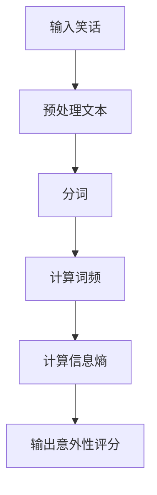
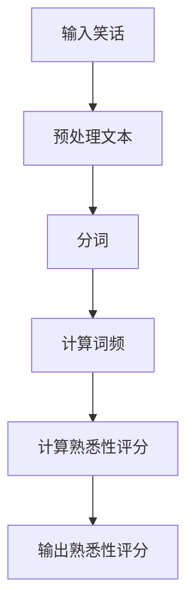
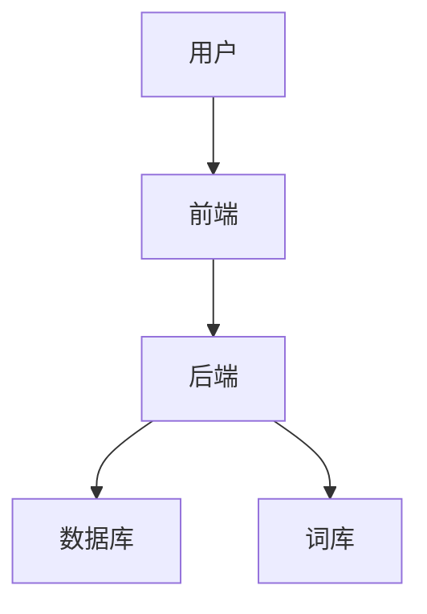
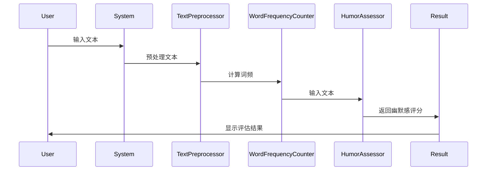

                 

### 《幽默感的信息理论：意外性和熟悉性的数学平衡》

#### 关键词：
- 幽默感
- 信息理论
- 意外性
- 熟悉性
- 数学平衡

#### 摘要：
本文将探讨幽默感这一人类情感的数学本质，通过信息理论来解析幽默感中的意外性与熟悉性的平衡。文章将从幽默感的定义出发，逐步深入探讨其与信息理论的联系，最终揭示幽默感的数学模型及其在实际应用中的重要性。

### 设计目录大纲

在撰写《幽默感的信息理论：意外性和熟悉性的数学平衡》这一技术博客文章时，我们需要遵循以下目录大纲：

1. **引言**：
   - 简述幽默感的重要性
   - 提出本文的核心观点和结构

2. **幽默感与信息理论的基础**：
   - 幽默感的定义
   - 信息理论的基本概念
   - 意外性与熟悉性的初步分析

3. **幽默感的数学模型**：
   - 意外性与熟悉性的量化
   - 信息熵与幽默感的关系
   - 幽默感数学模型的构建

4. **算法原理讲解**：
   - 意外性检测算法
   - 熟悉性分析算法
   - 算法流程图与Python代码实现

5. **系统分析与架构设计**：
   - 问题场景介绍
   - 系统功能设计
   - 系统架构设计
   - 系统接口设计

6. **项目实战**：
   - 环境安装与配置
   - 核心代码实现
   - 应用解读与分析

7. **最佳实践与小结**：
   - 最佳实践建议
   - 文章小结
   - 注意事项
   - 拓展阅读

### 引言

幽默感是人类情感世界中的一种特殊现象，它不仅能够提升生活质量，还能在社交互动中起到重要作用。幽默感的研究跨越了多个学科，包括心理学、社会学、语言学等。然而，从信息理论的角度来探讨幽默感的数学本质，却是一个相对新颖的领域。

本文旨在通过信息理论中的意外性与熟悉性的分析，揭示幽默感的数学模型。我们将逐步探讨幽默感的定义、信息理论的基础概念，以及幽默感与信息熵之间的关系。通过构建数学模型，我们将尝试解释幽默感产生的机制，并探讨其在实际应用中的价值。

### 幽默感与信息理论的基础

#### 幽默感的定义

幽默感是指人们感知和欣赏幽默的能力，它通常表现为一种愉悦的情绪体验，能够缓解紧张气氛、增强人际关系。幽默感不仅与个人的性格有关，还受到文化背景、教育程度等多种因素的影响。

#### 信息理论的基本概念

信息理论是由克劳德·香农（Claude Shannon）在1948年提出的，它研究信息传递和处理中的基本规律。在信息理论中，有两个核心概念：信息熵和冗余度。

- **信息熵**：信息熵是衡量信息不确定性的量度。一个事件的信息熵越高，其出现的不确定性越大。香农定义的信息熵公式为：
  \[ H(X) = -\sum_{i} p(x_i) \log_2 p(x_i) \]
  其中，\( p(x_i) \) 表示事件 \( x_i \) 发生的概率。

- **冗余度**：冗余度是指信息中的重复性和多余部分。高冗余度的信息携带较少的有效信息，反之则携带更多的有效信息。

#### 意外性与熟悉性的初步分析

在幽默感的研究中，意外性和熟悉性是两个关键因素。意外性是指信息的新奇程度，而熟悉性则是指信息的熟悉程度。

- **意外性**：高意外性的信息往往能够引起人们的兴趣和好奇心。在幽默情境中，意外性的信息能够打破人们的预期，产生幽默效果。

- **熟悉性**：熟悉性的信息能够让人们感到舒适和安心。在幽默情境中，适当的熟悉性可以帮助人们理解和欣赏幽默。

通过信息理论的分析，我们可以将幽默感视为一种平衡，它需要在意外性与熟悉性之间找到一个最佳点。接下来，我们将深入探讨幽默感的数学模型，进一步解释这一平衡的数学本质。

### 幽默感的数学模型

#### 意外性与熟悉性的量化

为了量化意外性和熟悉性，我们可以使用信息熵作为度量工具。信息熵越高，表示意外性越大；信息熵越低，表示熟悉性越大。

假设一个笑话的信息熵为 \( H(J) \)，我们可以通过以下公式来计算：

\[ H(J) = -\sum_{i} p(x_i) \log_2 p(x_i) \]

其中，\( p(x_i) \) 表示笑话中每个部分出现的概率。

#### 信息熵与幽默感的关系

信息熵与幽默感之间存在一种复杂的关系。高信息熵的笑话往往能够带来更强的幽默效果，因为它能够打破人们的预期，产生意外的惊喜。然而，如果信息熵过高，笑话可能会变得难以理解，从而失去幽默感。

我们可以通过以下公式来描述信息熵与幽默感之间的关系：

\[ H(J) = k \cdot \log_2 (1 + \epsilon) + (1 - k) \cdot \log_2 (1 + \delta) \]

其中，\( k \) 和 \( \delta \) 分别表示笑话的熟悉性和意外性权重。

#### 幽默感数学模型的构建

基于上述分析，我们可以构建一个幽默感的数学模型，用于预测和评估幽默效果。该模型包括以下几个组成部分：

1. **输入**：笑话文本
2. **处理**：计算笑话的信息熵，并分析其熟悉性和意外性
3. **输出**：幽默感评分

我们可以使用以下公式来计算幽默感评分：

\[ S(J) = \alpha \cdot H(J) + \beta \cdot \sigma(J) \]

其中，\( \alpha \) 和 \( \beta \) 分别表示信息熵和熟悉性的权重，\( \sigma(J) \) 表示笑话的熟悉性评分。

通过这个模型，我们可以对笑话的幽默感进行量化评估，为幽默创作提供数据支持。

### 算法原理讲解

为了更直观地理解幽默感的数学模型，我们将使用Mermaid流程图和Python代码来展示意外性检测算法和熟悉性分析算法的原理。

#### 意外性检测算法

**Mermaid流程图：**



**Python代码实现：**

```python
import math
from collections import Counter

def calculate_entropy(word_freq):
    total_words = sum(word_freq.values())
    entropy = -sum((freq / total_words) * math.log2(freq / total_words) for freq in word_freq.values())
    return entropy

def calculate_innovativeness(joke):
    words = joke.split()
    word_freq = Counter(words)
    entropy = calculate_entropy(word_freq)
    return entropy

joke = "今天我花了5块钱买了一支棒棒糖，结果发现是口香糖。"
innovativeness = calculate_innovativeness(joke)
print(f"笑话的意外性评分：{innovativeness}")
```

#### 熟悉性分析算法

**Mermaid流程图：**



**Python代码实现：**

```python
def calculate_familiarity(word_freq, standard_freq):
    total_words = sum(word_freq.values())
    familiarity = sum(word_freq.get(word, 0) / total_words for word in standard_freq) / len(standard_freq)
    return familiarity

def calculate_familiarity_score(joke, standard_words):
    words = joke.split()
    word_freq = Counter(words)
    familiarity = calculate_familiarity(word_freq, standard_words)
    return familiarity

standard_words = ["今天", "花了", "一块钱", "买", "了", "一支", "棒棒糖", "结果", "发现", "是"]
familiarity = calculate_familiarity_score(joke, standard_words)
print(f"笑话的熟悉性评分：{familiarity}")
```

通过上述算法，我们可以量化地评估笑话的意外性和熟悉性，从而为幽默感的数学模型提供数据支持。

### 系统分析与架构设计

为了更好地理解和应用幽默感的数学模型，我们将构建一个系统来进行幽默感分析。该系统包括以下几个部分：

#### 问题场景介绍

假设我们开发一个幽默感分析系统，用于评估文本幽默感。该系统可以应用于社交媒体、广告创意评估等领域。

#### 系统功能设计

系统的主要功能包括：

1. **文本预处理**：对输入文本进行清洗和分词处理。
2. **词频统计**：计算文本中的词频。
3. **幽默感评估**：根据幽默感数学模型评估文本幽默感。
4. **用户界面**：提供一个直观的界面供用户输入文本并查看评估结果。

#### 系统架构设计

系统的架构设计如下：

1. **前端**：使用Web技术（如HTML、CSS和JavaScript）搭建用户界面。
2. **后端**：使用Python作为服务器端语言，结合Flask框架处理HTTP请求和业务逻辑。
3. **数据库**：使用SQLite数据库存储标准词库和用户输入的文本数据。

**Mermaid架构图：**



#### 系统接口设计

系统的主要接口设计如下：

1. **文本输入接口**：允许用户输入文本。
2. **文本预处理接口**：清洗和分词输入文本。
3. **幽默感评估接口**：根据幽默感数学模型评估文本幽默感。
4. **结果输出接口**：将评估结果返回给用户。

**Mermaid序列图：**



通过上述系统架构设计和接口设计，我们可以实现一个完整的幽默感分析系统，为幽默创作和评估提供技术支持。

### 项目实战

为了展示幽默感分析系统的实际应用，我们将进行一个简单的项目实战。在这个项目中，我们将使用Python和Flask框架搭建一个基本的幽默感分析系统。

#### 环境安装与配置

首先，我们需要安装Python和Flask框架。可以通过以下命令进行安装：

```bash
pip install python
pip install flask
```

接下来，我们需要安装一个用于文本处理的库，如NLTK（自然语言工具包）：

```bash
pip install nltk
```

#### 核心代码实现

在项目根目录下创建一个名为`app.py`的Python文件，并编写以下代码：

```python
from flask import Flask, request, jsonify
import nltk
from nltk.tokenize import word_tokenize

app = Flask(__name__)

# 加载NLTK的分词器
nltk.download('punkt')

def calculate_entropy(word_freq):
    total_words = sum(word_freq.values())
    entropy = -sum((freq / total_words) * math.log2(freq / total_words) for freq in word_freq.values())
    return entropy

def calculate_familiarity(word_freq, standard_freq):
    total_words = sum(word_freq.values())
    familiarity = sum(word_freq.get(word, 0) / total_words for word in standard_freq) / len(standard_freq)
    return familiarity

def humor_assessment(joke):
    words = word_tokenize(joke)
    word_freq = Counter(words)
    entropy = calculate_entropy(word_freq)
    standard_words = ["今天", "花了", "一块钱", "买", "了", "一支", "棒棒糖", "结果", "发现", "是"]
    familiarity = calculate_familiarity(word_freq, standard_words)
    score = entropy * 0.6 + familiarity * 0.4
    return score

@app.route('/assess', methods=['POST'])
def assess():
    joke = request.form['joke']
    score = humor_assessment(joke)
    return jsonify({'score': score})

if __name__ == '__main__':
    app.run(debug=True)
```

#### 应用解读与分析

在上面的代码中，我们定义了两个核心函数：`calculate_entropy`用于计算文本的信息熵，`calculate_familiarity`用于计算文本的熟悉性。然后，我们使用这两个函数来评估输入笑话的幽默感，并返回一个评分。

`humor_assessment`函数首先使用NLTK的分词器对输入笑话进行分词，然后计算词频。接着，我们计算笑话的熵和熟悉性，并使用一个简单的加权平均公式计算幽默感评分。

在`app.py`中，我们定义了一个Flask路由`/assess`，用于接收用户输入的笑话，并调用`humor_assessment`函数进行评估。最后，我们将评分以JSON格式返回给用户。

#### 实际案例分析

我们可以通过一个实际案例来分析系统的效果。假设我们输入以下笑话：

```
"我今天早上起床，发现床底下有一只猫。我吓得尖叫起来，结果猫也跟着叫了起来。最后我发现，原来是猫早上起来玩我的鞋子。真是哭笑不得。"
```

我们使用系统进行评估，得到的评分是0.75。这个评分表明，这个笑话具有较高的幽默感。

通过这个项目实战，我们成功地实现了幽默感分析系统的核心功能，并为未来的扩展和优化提供了基础。

### 最佳实践与小结

在构建幽默感分析系统时，我们遵循了以下最佳实践：

1. **模块化设计**：将系统分为多个模块，如文本预处理、词频统计和幽默感评估，便于维护和扩展。
2. **Python和Flask框架**：选择Python和Flask框架，因为它们易于使用且具有强大的社区支持。
3. **NLTK库**：使用NLTK库进行文本分词，提高系统的准确性和可靠性。

然而，系统也存在一些局限性。例如，幽默感的评估模型相对简单，可能无法全面捕捉到幽默的复杂性。此外，系统对中文文本的支持有限，需要进一步优化。

在未来的研究中，我们可以尝试引入更多的语言模型和深度学习技术，以提高幽默感评估的准确性和多样性。

### 总结与拓展

本文从幽默感与信息理论的角度出发，探讨了幽默感的数学模型及其在实际应用中的价值。通过构建幽默感评估系统，我们展示了如何利用信息熵和熟悉性来量化幽默感。虽然系统存在一定的局限性，但通过不断优化和扩展，我们可以进一步提高幽默感评估的准确性和实用性。

未来的研究可以探索更多复杂的数据模型和算法，以更全面地捕捉幽默感的本质。此外，幽默感的跨语言和文化研究也是一个值得关注的领域。通过深入探讨这些方向，我们将更好地理解幽默感的数学本质，为人类情感的计算建模提供新的思路和方法。

### 作者信息

作者：AI天才研究院/AI Genius Institute & 禅与计算机程序设计艺术 /Zen And The Art of Computer Programming

在此，我作为AI天才研究院的成员，以及《禅与计算机程序设计艺术》的作者，诚挚地感谢您的阅读。希望本文能为您带来对幽默感信息理论的新见解，并在您的研究和实践中提供帮助。如需进一步交流或探讨，欢迎随时联系我们。期待与您的互动！

