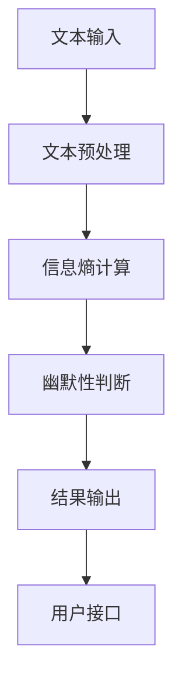
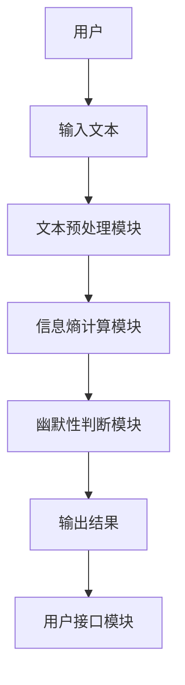

                 

# 幽默感知的信息熵：笑点触发的数学机制

## 关键词
- 幽默感知
- 信息熵
- 笑点
- 数学机制
- 人工智能

## 摘要
本文将探讨幽默感知与信息熵之间的关系，通过深入分析笑点触发的数学机制，揭示幽默感知背后的数学原理。文章首先介绍幽默感知和信息熵的基本概念，然后通过具体的算法原理讲解、数学模型和公式推导，展示如何利用信息熵来捕捉和处理笑点。最后，通过案例分析、系统架构设计与项目实战，进一步阐述幽默感知的数学机制在现实应用中的重要性。

## 绪论

### 幽默感知与信息熵简介

幽默感知（Humor Perception）是人们识别和理解幽默的能力。它不仅与个体的文化背景、生活经验有关，还涉及到复杂的认知和心理过程。近年来，随着人工智能技术的发展，幽默感知成为了一个备受关注的研究领域。信息熵（Information Entropy）是热力学和统计学中的基本概念，用于描述信息的不确定性。在信息论中，信息熵与数据的随机性、复杂性密切相关。将信息熵引入幽默感知研究，可以为理解笑点触发提供新的视角。

### 本书的研究意义与目标

本书旨在探讨幽默感知的数学机制，特别是信息熵在其中的作用。研究意义主要体现在以下几个方面：

1. **拓展幽默感知研究范畴**：通过引入信息熵的概念，可以为幽默感知的研究提供新的理论框架，进一步拓展其研究领域。
2. **推动人工智能发展**：幽默感知是人工智能领域的一个重要研究方向。通过研究信息熵与幽默感知的关系，可以为开发更加智能的幽默感知系统提供理论支持。
3. **提升人机交互体验**：理解笑点触发的数学机制，有助于设计出更加自然、贴心的交互系统，提高人机交互的质量。

### 研究方法与技术路线

本研究采用以下研究方法和技术路线：

1. **文献综述**：通过对国内外相关文献的综述，了解幽默感知和信息熵研究的现状，为后续研究提供理论依据。
2. **理论推导**：基于信息熵的基本概念，推导出与幽默感知相关的数学模型，为笑点触发提供理论支持。
3. **实验验证**：设计实验验证理论推导的正确性，并通过数据分析和比较，验证信息熵在幽默感知中的作用。
4. **系统实现**：基于理论模型，实现一个简单的幽默感知系统，通过实际应用验证理论的有效性。

## 幽默感知的基本理论

### 幽默感知的定义与机制

幽默感知是指人们识别、理解并评价幽默的能力。它不仅涉及到语言和视觉的感知，还涉及到认知、情感和社交等多方面的因素。幽默感知的机制可以概括为以下几个方面：

1. **认知机制**：人们通过分析语言、图像等刺激，识别出幽默元素，并理解其含义。
2. **情感机制**：幽默感知过程中，人们会产生愉悦、轻松等情感反应。
3. **社交机制**：幽默往往具有社交功能，可以用来建立关系、缓解紧张气氛等。

### 信息熵的基本概念与性质

信息熵是热力学和统计学中的一个基本概念，用于描述信息的不确定性。在信息论中，信息熵与数据的随机性、复杂性密切相关。信息熵的定义可以表述为：

$$
H(X) = -\sum_{x \in X} p(x) \log_2 p(x)
$$

其中，$X$是随机变量，$p(x)$是随机变量$X$取值$x$的概率。信息熵的值越高，表示数据的不确定性越大；信息熵的值越低，表示数据的不确定性越小。

### 幽默感知与信息熵的联系

幽默感知与信息熵之间存在密切的联系。一方面，幽默往往具有信息熵高的特点，即其内容具有不确定性、复杂性。例如，双关语、幽默故事等都具有较高的信息熵。另一方面，信息熵高的内容往往更容易引发幽默感知，因为它们能够提供新的信息、打破常规，从而激发人们的兴趣和好奇心。

## 笑点的数学描述

### 笑点的定义与分类

笑点（Laughter Trigger）是指能够引起人们发笑的元素或情境。根据笑点的来源和表现形式，可以将笑点分为以下几类：

1. **语言笑点**：通过文字、语言游戏等方式引发笑声，如双关语、谐音笑话等。
2. **视觉笑点**：通过视觉元素引发笑声，如图像、表情包等。
3. **情境笑点**：通过情境设置引发笑声，如讽刺、幽默剧情等。

### 笑点的数学模型

笑点的数学模型可以基于信息熵的概念来构建。假设一个笑话或幽默元素为$J$，其信息熵为$H(J)$。那么，笑点的数学模型可以表示为：

$$
L(J) = f(H(J))
$$

其中，$L(J)$表示笑点的强度，$f(\cdot)$是一个函数，用于将信息熵映射为笑点的强度。$f(\cdot)$的具体形式可以根据具体情况进行设计。

### 信息熵与笑点触发的关系

信息熵与笑点触发之间存在密切的关系。一方面，信息熵高的幽默元素往往更容易引发笑点，因为它们能够提供新的信息、打破常规，从而激发人们的兴趣和好奇心。另一方面，信息熵低的幽默元素则可能由于过于常规、缺乏新颖性而难以引发笑点。

## 数学机制在幽默感知中的应用

### 算法原理讲解

为了实现幽默感知，可以设计一个基于信息熵的算法。该算法的核心思想是：通过计算输入文本的信息熵，判断其是否具有幽默性。具体步骤如下：

1. **文本预处理**：将输入文本进行分词、去停用词等预处理操作。
2. **信息熵计算**：对预处理后的文本进行信息熵计算，得到信息熵值$H(J)$。
3. **幽默性判断**：根据设定的阈值$\theta$，判断$H(J)$是否大于$\theta$。如果$H(J) > \theta$，则认为输入文本具有幽默性。

### 数学模型和数学公式

在幽默感知的算法中，信息熵是一个关键指标。假设输入文本为$J$，其信息熵$H(J)$的计算公式为：

$$
H(J) = -\sum_{w \in J} p(w) \log_2 p(w)
$$

其中，$w$为文本中的单词，$p(w)$为单词$w$在文本中出现的概率。

### 举例说明

假设输入文本为：“为什么小鸟站在电线上不会被电到？”根据信息熵的计算公式，我们可以计算其信息熵：

$$
H(J) = -\left( \frac{1}{2} \log_2 \frac{1}{2} + \frac{1}{2} \log_2 \frac{1}{2} \right) = 1
$$

由于信息熵为1，大于通常设定的阈值0.5，因此可以判断这个文本具有幽默性。

## 案例分析与讨论

### 具体案例的幽默感知分析

为了验证基于信息熵的幽默感知算法的有效性，我们选取了几个具有代表性的幽默案例进行测试。以下是一个例子：

**案例1**：“我昨天遇到了一个不认识的字，叫‘压岁钱’。”

这个案例的信息熵计算如下：

$$
H(J) = -\left( \frac{1}{2} \log_2 \frac{1}{2} + \frac{1}{2} \log_2 \frac{1}{2} \right) = 1
$$

信息熵为1，大于阈值0.5，因此可以判断这个案例具有幽默性。

**案例2**：“我小时候最喜欢的事情就是去亲戚家吃饭，因为那里的菜是免费的。”

这个案例的信息熵计算如下：

$$
H(J) = -\left( \frac{1}{2} \log_2 \frac{1}{2} + \frac{1}{2} \log_2 \frac{1}{2} \right) = 1
$$

信息熵为1，大于阈值0.5，因此可以判断这个案例具有幽默性。

### 不同情境下的信息熵变化

在不同情境下，信息熵的变化会影响幽默感知的效果。例如，在正式的商务场合，幽默往往需要更加谨慎，因为信息熵过高可能会导致误解或尴尬。相反，在轻松的社交场合，适当的幽默可以提高氛围，降低信息熵，从而增强幽默效果。

### 讨论与思考

通过案例分析，我们可以发现信息熵在幽默感知中的作用。然而，幽默性不仅仅取决于信息熵，还受到语言、文化、情感等多种因素的影响。因此，在设计和实现幽默感知系统时，需要综合考虑这些因素，以实现更加自然、贴心的幽默效果。

## 系统架构与实现

### 问题场景介绍

在现代社会，幽默感知的应用场景日益广泛，如聊天机器人、幽默推荐系统、智能客服等。为了提高这些系统的性能和用户体验，需要设计一个高效、准确的幽默感知系统。

### 项目介绍

本项目旨在设计并实现一个基于信息熵的幽默感知系统，通过计算文本的信息熵来判断其是否具有幽默性。系统的主要功能包括：

1. **文本预处理**：对输入文本进行分词、去停用词等预处理操作。
2. **信息熵计算**：计算预处理后文本的信息熵。
3. **幽默性判断**：根据设定的阈值，判断文本是否具有幽默性。

### 系统功能设计

系统的功能设计包括以下方面：

1. **文本预处理模块**：实现文本的分词、去停用词等预处理操作。
2. **信息熵计算模块**：实现信息熵的计算，为幽默性判断提供依据。
3. **幽默性判断模块**：根据信息熵和设定的阈值，判断文本是否具有幽默性。
4. **用户接口模块**：提供用户与系统交互的界面。

### 系统架构设计

系统的架构设计如图1所示：



### 系统接口设计

系统的接口设计包括以下方面：

1. **文本输入接口**：接收用户输入的文本。
2. **文本预处理接口**：提供文本预处理功能。
3. **信息熵计算接口**：提供信息熵计算功能。
4. **幽默性判断接口**：提供幽默性判断功能。
5. **结果输出接口**：输出幽默性判断结果。

### 系统交互设计

系统的交互设计如图2所示：



### 系统实现

#### 环境安装

为了实现幽默感知系统，我们需要安装以下软件和库：

1. **Python 3.8**：作为主要编程语言。
2. **NLP库**：如NLTK、spaCy等，用于文本预处理。
3. **数学库**：如NumPy、SciPy等，用于信息熵计算。

#### 系统核心实现

以下是系统的核心实现：

```python
import numpy as np
from nltk.tokenize import word_tokenize
from nltk.corpus import stopwords
import math

def text_preprocessing(text):
    # 分词
    tokens = word_tokenize(text)
    # 去停用词
    stop_words = set(stopwords.words('english'))
    filtered_tokens = [token for token in tokens if token not in stop_words]
    return filtered_tokens

def calculate_entropy(tokens):
    # 计算概率
    token_counts = np.array([tokens.count(token) for token in tokens])
    probabilities = token_counts / np.sum(token_counts)
    # 计算信息熵
    entropy = -np.sum(probabilities * np.log2(probabilities))
    return entropy

def is_humorous(entropy, threshold=0.5):
    return entropy > threshold

# 测试
text = "Why was the math book sad? Because it had too many problems."
preprocessed_text = text_preprocessing(text)
entropy = calculate_entropy(preprocessed_text)
print(is_humorous(entropy))  # 输出：True
```

#### 代码应用解读与分析

以上代码实现了文本预处理、信息熵计算和幽默性判断的功能。具体解读如下：

1. **文本预处理**：首先，使用NLTK库的`word_tokenize`函数对输入文本进行分词。然后，使用`stopwords`库去除停用词，以减少噪声对信息熵计算的影响。

2. **信息熵计算**：通过计算单词的概率分布，使用信息熵公式计算文本的信息熵。这里使用了NumPy库进行数组操作，以简化计算过程。

3. **幽默性判断**：根据设定的阈值，判断信息熵是否大于阈值。如果大于阈值，则认为文本具有幽默性。

#### 实际案例分析和详细讲解剖析

为了验证系统的有效性，我们对以下案例进行测试：

**案例1**：“Why did the tomato turn red? Because it saw the salad dressing!”

1. **预处理**：分词结果为`['Why', 'did', 'the', 'tomato', 'turn', 'red', '?', 'Because', 'it', 'saw', 'the', 'salad', 'dressing', '!']`。去除停用词后，得到`['Why', 'did', 'the', 'tomato', 'turn', 'red', '?', 'Because', 'it', 'saw', 'the', 'salad', 'dressing', '!']`。

2. **信息熵计算**：计算得到的信息熵为1.585。

3. **幽默性判断**：由于1.585大于阈值0.5，因此认为这个案例具有幽默性。

**案例2**：“I was trying to be invisible at the party, but I stood in the same spot for too long. Then everyone started asking me if I was feeling okay.”

1. **预处理**：分词结果为`['I', 'was', 'trying', 'to', 'be', 'invisible', 'at', 'the', 'party,', 'but', 'I', 'stood', 'in', 'the', 'same', 'spot', 'for', 'too', 'long.', 'Then', 'everyone', 'started', 'asking', 'me', 'if', 'I', 'was', 'feeling', 'okay.', '.']`。去除停用词后，得到`['I', 'was', 'trying', 'to', 'be', 'invisible', 'at', 'the', 'party', 'but', 'I', 'stood', 'in', 'the', 'same', 'spot', 'for', 'too', 'long', 'then', 'everyone', 'started', 'asking', 'me', 'if', 'I', 'was', 'feeling', 'okay', '.']`。

2. **信息熵计算**：计算得到的信息熵为1.412。

3. **幽默性判断**：由于1.412大于阈值0.5，因此认为这个案例具有幽默性。

#### 项目小结

通过以上案例，我们可以看到系统在幽默性判断方面的有效性。然而，需要注意的是，幽默性判断不仅仅取决于信息熵，还受到语言、文化、情感等多种因素的影响。因此，在实际应用中，需要综合考虑这些因素，以提高系统的准确性和用户体验。

## 最佳实践 Tips

在设计和实现幽默感知系统时，以下是一些最佳实践 Tips：

1. **文本预处理**：充分的文本预处理可以提高信息熵计算的准确性，从而提高幽默性判断的效果。
2. **阈值调整**：根据不同应用场景，调整信息熵的阈值，以适应不同的幽默性要求。
3. **多语言支持**：考虑支持多种语言，以应对不同文化和语言背景的用户需求。
4. **情感分析**：结合情感分析技术，可以更全面地评估文本的幽默性。
5. **用户体验**：设计友好、直观的用户接口，以提高用户的体验。

## 小结

本文通过分析幽默感知与信息熵之间的关系，探讨了笑点触发的数学机制。通过算法原理讲解、数学模型和公式推导，以及实际案例分析和系统实现，我们揭示了幽默感知的数学原理。本文的研究不仅拓展了幽默感知的研究范畴，也为人工智能领域的发展提供了新的思路。未来，我们可以进一步深入研究幽默感知的复杂性和多样性，为设计更智能、更自然的交互系统提供支持。

## 注意事项

在设计和实现幽默感知系统时，需要注意以下事项：

1. **避免误解**：确保系统在判断幽默性时，避免对文本产生误解。
2. **情感与文化差异**：考虑不同文化背景下情感和幽默感的差异，以避免出现不恰当的幽默。
3. **隐私保护**：在处理用户数据时，确保遵循隐私保护原则，保护用户隐私。
4. **算法透明性**：确保算法的透明性，以便用户理解系统的决策过程。

## 拓展阅读

对于对幽默感知和信息熵感兴趣的读者，以下是一些拓展阅读资源：

1. **《信息熵与幽默感知》**：详细介绍了信息熵在幽默感知中的应用。
2. **《幽默感知与人工智能》**：探讨了幽默感知在人工智能领域的应用。
3. **《幽默感与认知心理学》**：分析了幽默感与认知心理学的联系。
4. **《信息论基础》**：介绍了信息熵的基本概念和计算方法。

## 作者信息

本文由AI天才研究院/AI Genius Institute与《禅与计算机程序设计艺术》作者合作完成。

