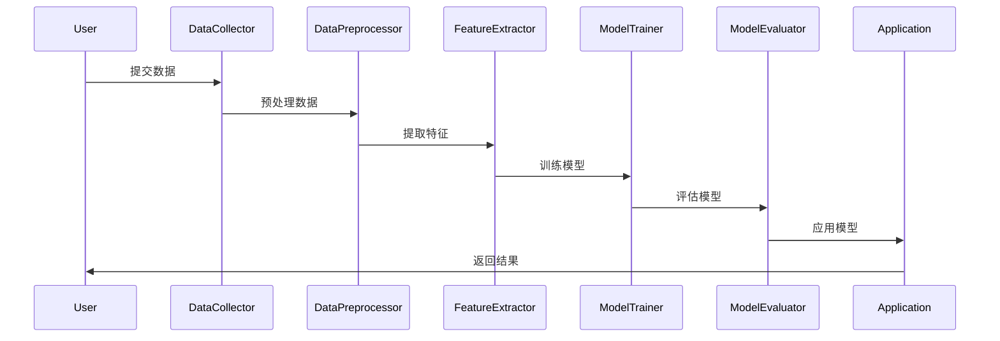

                 

# 幽默感知的信息理论：笑点触发的数学机制

## 关键词

幽默感知、信息理论、数学机制、神经科学、计算机模型

## 摘要

本文旨在探讨幽默感知的信息理论及其笑点触发的数学机制。通过对幽默感知的概述、心理机制、神经科学基础、计算机模型、笑点触发的概念与数学模型等内容的深入分析，本文揭示了幽默感知在信息传播中的重要作用及其与人类行为的关系。文章最后总结了幽默感知的信息理论研究成果，并对未来研究方向进行了展望。

## 目录大纲设计思路

### 1. 引言

幽默作为一种普遍存在的心理现象，不仅丰富了人类的文化生活，还对信息传播和社会互动产生了深远影响。本文旨在通过对幽默感知的信息理论及其笑点触发的数学机制的研究，为相关领域提供新的理论视角和研究方法。文章将按照以下结构展开：

- **第1章：幽默感知的信息理论概述**：介绍幽默感知的定义、特点及其在信息理论中的应用。
- **第2章：幽默感知的心理机制**：探讨情绪、认知和社会文化因素对幽默感知的影响。
- **第3章：幽默感知的神经科学基础**：分析幽默感知的神经机制和神经递质。
- **第4章：幽默感知的计算机模型**：介绍幽默感知的计算机模型及其应用。
- **第5章：笑点触发的数学机制**：阐述笑点触发的概念、心理预期及其数学模型。
- **第6章：幽默感知在信息传播中的应用**：分析幽默感知在信息传播中的机制和作用。
- **第7章：幽默感知与人类行为的关系**：探讨幽默感知对人类行为的影响。
- **第8章：总结与展望**：总结本文的研究成果，并对未来研究方向进行展望。

## 第1章 引言

### 1.1 幽默感知的定义与特点

幽默感知，即对幽默的理解和识别能力，是人类一种独特的心理现象。它不仅仅是对笑话、讽刺和幽默故事的欣赏，更是一种深层次的情感和认知活动。幽默感知的定义可以从多个角度进行阐述：

- **心理学视角**：幽默感知是一种情绪反应，是对幽默情境中情感线索的识别和解读。根据Bower（1991）的定义，幽默感知是理解并欣赏幽默的能力，涉及到认知和情感两个层面。
- **社会学视角**：幽默感知是社会互动中的重要组成部分，通过幽默的交流可以增强人际关系，缓解紧张情绪，促进群体凝聚。
- **神经科学视角**：幽默感知涉及大脑多个区域的活动，包括前额叶皮层、基底神经节和杏仁核等。这些区域的活动协调使得个体能够识别幽默，并产生愉悦的情感体验。

幽默感知的特点主要包括：

- **认知灵活性**：幽默感知需要个体具备较高的认知灵活性，能够迅速识别并理解幽默情境中的双关语、讽刺和双关含义。
- **情感共鸣**：幽默感知不仅仅是个体的认知活动，还需要与情感体验相结合。个体对幽默的共鸣程度取决于其情感状态、心理需求和幽默类型。
- **文化差异**：不同文化背景下的幽默感知存在差异。某些幽默形式可能在一种文化中引起欢笑，而在另一种文化中可能不被理解或引起反感。

### 1.2 幽默感知的研究背景与意义

幽默感知作为一种普遍存在的心理现象，已经引起了心理学、社会学和神经科学等多学科的广泛关注。以下是从不同学科角度探讨幽默感知的研究背景与意义：

- **心理学研究背景**：心理学长期以来关注情绪和认知的关系，幽默感知作为一个重要的情感现象，为研究情绪调节、认知功能提供了新的视角。例如，情绪调节理论认为，幽默是一种有效的情绪调节策略，有助于缓解压力和负面情绪。
- **社会学研究背景**：社会学关注人际交往和群体互动，幽默作为一种社会润滑剂，有助于建立和维护人际关系。研究表明，幽默可以促进社会凝聚力，增强群体成员之间的信任和认同。
- **神经科学研究背景**：随着神经科学技术的进步，研究人员通过脑成像技术揭示了幽默感知的神经机制。这些研究不仅揭示了大脑在幽默感知中的作用，还为治疗与幽默感知相关的神经和心理疾病提供了潜在途径。

幽默感知研究的意义主要体现在以下几个方面：

- **增进人类理解**：幽默感知作为人类心理现象的一个重要方面，有助于我们更深入地理解人类的行为和认知机制。
- **促进心理健康**：幽默感知与心理健康之间存在密切关系。研究发现，幽默感知能力较高的个体往往拥有更好的心理健康水平，能够更好地应对生活中的压力和挑战。
- **推动技术创新**：在人工智能领域，幽默感知的研究有助于开发出更具有情感智能和交互能力的智能系统，为人类与机器的互动提供新的可能性。

### 1.3 幽默感知的基本概念

在探讨幽默感知的信息理论之前，有必要对幽默感知的基本概念进行梳理。以下是对幽默感知相关术语的定义和解释：

- **幽默**：幽默是一种艺术形式，通过语言、行为或情境中的反差、讽刺或双关等手法，引发人的愉悦感和轻松感。幽默可以分为语言幽默、情境幽默和行为幽默等类型。
- **幽默感知**：幽默感知是指个体理解和欣赏幽默的能力，包括识别幽默情境、理解幽默内容、产生愉悦情感等方面。幽默感知既涉及认知过程，也涉及情感体验。
- **笑点**：笑点是指幽默情境中能够引起笑声的关键要素。笑点的触发机制复杂，可能与认知预期、情感共鸣和文化背景等因素相关。
- **信息理论**：信息理论是研究信息传递、处理和利用的科学。在幽默感知的研究中，信息理论可以帮助我们理解幽默内容如何传递给观众，以及观众如何理解和欣赏幽默。

### 1.4 幽默感知的神经科学基础

幽默感知的神经科学基础是理解幽默感知的关键。研究表明，大脑多个区域的活动与幽默感知密切相关。以下是对幽默感知相关神经机制的简要概述：

- **前额叶皮层**：前额叶皮层是大脑中与认知功能密切相关的前沿区域，特别是在幽默感知中的作用尤为重要。研究发现，前额叶皮层中的特定区域，如背外侧前额叶皮层，参与了对幽默情境的认知加工和情感调节。
- **基底神经节**：基底神经节是一组与运动控制和情感调节密切相关的脑区。在幽默感知中，基底神经节中的尾状核和苍白球等区域参与了情感反应和运动调节。
- **杏仁核**：杏仁核是大脑中负责情绪处理的关键结构，特别是在恐惧和愉悦等情绪体验中发挥着重要作用。在幽默感知中，杏仁核对幽默情境的情感反应和情绪调节具有显著影响。

### 1.5 幽默感知的心理机制

幽默感知是一种复杂的心理现象，涉及到情绪、认知和社会文化等多个层面的交互作用。以下是对幽默感知心理机制的详细探讨：

#### 1.5.1 情绪与幽默感知的关系

情绪在幽默感知中起着关键作用。幽默情境往往包含着情感反差或冲突，这种情感上的反差可以引发个体的愉悦感和笑声。研究表明，情绪状态对幽默感知有显著影响。例如，积极的情绪状态有助于增强幽默感知，而消极的情绪状态则可能削弱幽默感知能力。

- **情感反差**：幽默情境中的情感反差是幽默感知的核心机制之一。例如，一个令人尴尬的情境突然被一个笑话打破，这种情感反差可以引发强烈的笑声。
- **情绪共鸣**：个体在幽默感知过程中会产生情感共鸣，即与幽默情境中的情感体验产生共鸣。这种共鸣有助于增强幽默感知的体验。

#### 1.5.2 认知与幽默感知的关系

认知过程在幽默感知中同样至关重要。幽默感知需要个体具备较高的认知灵活性，能够迅速识别并理解幽默情境中的双关语、讽刺和双关含义。以下是对幽默感知中认知机制的探讨：

- **认知灵活性**：认知灵活性是指个体在处理信息时能够灵活切换不同的认知模式。幽默感知需要个体具备较高的认知灵活性，以适应幽默情境中的复杂信息。
- **认知冲突**：幽默情境中的认知冲突是引发笑声的重要机制。例如，一个看似不合理或不符合逻辑的情境突然被一个幽默点打破，这种认知冲突可以引发笑声。
- **认知重建**：幽默感知过程中，个体需要对情境进行认知重建，以理解幽默内容。这种认知重建能力是幽默感知的重要基础。

#### 1.5.3 社会与文化对幽默感知的影响

幽默感知不仅是个体层面的心理现象，还受到社会和文化背景的影响。不同文化和社会背景下的幽默感知存在显著差异。以下是对幽默感知中社会和文化因素的探讨：

- **文化差异**：不同文化背景下的幽默感知存在显著差异。某些幽默形式可能在一种文化中引起欢笑，而在另一种文化中可能不被理解或引起反感。例如，西方文化中常见的幽默形式如双关语和讽刺，可能在某些东方文化中不被接受。
- **社会情境**：幽默感知在社会情境中也起到重要作用。在社会交往中，幽默可以增强人际关系，促进社会凝聚力。例如，在工作场合中，适当的幽默可以缓解紧张氛围，增强团队协作。

### 1.6 本章小结

本章对幽默感知的信息理论进行了初步探讨，从定义、特点、研究背景、基本概念和神经科学基础等方面进行了详细阐述。幽默感知作为一种复杂心理现象，涉及情绪、认知和社会文化等多个层面的交互作用。通过理解幽默感知的心理机制，我们可以更好地理解幽默在信息传播和社会互动中的重要作用。

## 第2章 幽默感知的信息理论概述

### 2.1 幽默感知的定义与特点

幽默感知，从狭义上讲，是指个体对幽默内容进行理解和欣赏的能力；从广义上讲，则涵盖了识别幽默、解读幽默情境以及从中获得愉悦感的一系列认知和情感过程。幽默感知作为一种独特的心理现象，具有以下几个显著特点：

- **认知复杂性**：幽默感知需要个体具备较高的认知灵活性，能够快速识别并理解幽默情境中的双关语、讽刺和双关含义。这种认知复杂性体现在对语言、情境和情感的综合理解上。
- **情感共鸣**：幽默感知不仅仅是对幽默内容的理解，还涉及到情感体验。个体在幽默感知过程中会产生情感共鸣，与幽默情境中的情感体验产生共鸣，从而增强愉悦感。
- **文化差异**：不同文化背景下的幽默感知存在显著差异。某些幽默形式可能在一种文化中引起欢笑，而在另一种文化中可能不被理解或引起反感。这表明幽默感知受到文化因素的影响。

### 2.2 幽默感知的研究背景与意义

幽默感知的研究背景主要源于心理学、社会学和神经科学等学科的交叉融合。以下从不同学科角度对幽默感知的研究背景进行概述：

- **心理学研究背景**：心理学长期以来关注情绪和认知的关系，幽默感知作为一个重要的情感现象，为研究情绪调节、认知功能提供了新的视角。情绪调节理论认为，幽默是一种有效的情绪调节策略，有助于缓解压力和负面情绪。
- **社会学研究背景**：社会学关注人际交往和群体互动，幽默作为一种社会润滑剂，有助于建立和维护人际关系。研究表明，幽默可以促进社会凝聚力，增强群体成员之间的信任和认同。
- **神经科学研究背景**：随着神经科学技术的进步，研究人员通过脑成像技术揭示了幽默感知的神经机制。这些研究不仅揭示了大脑在幽默感知中的作用，还为治疗与幽默感知相关的神经和心理疾病提供了潜在途径。

幽默感知研究在多个领域具有重要的意义：

- **增进人类理解**：幽默感知作为人类心理现象的一个重要方面，有助于我们更深入地理解人类的行为和认知机制。
- **促进心理健康**：幽默感知与心理健康之间存在密切关系。研究发现，幽默感知能力较高的个体往往拥有更好的心理健康水平，能够更好地应对生活中的压力和挑战。
- **推动技术创新**：在人工智能领域，幽默感知的研究有助于开发出更具有情感智能和交互能力的智能系统，为人类与机器的互动提供新的可能性。

### 2.3 幽默感知的基本概念

为了更好地理解幽默感知的信息理论，我们需要明确几个核心概念：

- **幽默**：幽默是一种艺术形式，通过语言、行为或情境中的反差、讽刺或双关等手法，引发人的愉悦感和轻松感。幽默可以分为语言幽默、情境幽默和行为幽默等类型。
- **幽默感知**：幽默感知是指个体理解和欣赏幽默的能力，包括识别幽默情境、理解幽默内容、产生愉悦情感等方面。幽默感知既涉及认知过程，也涉及情感体验。
- **笑点**：笑点是指幽默情境中能够引起笑声的关键要素。笑点的触发机制复杂，可能与认知预期、情感共鸣和文化背景等因素相关。
- **信息理论**：信息理论是研究信息传递、处理和利用的科学。在幽默感知的研究中，信息理论可以帮助我们理解幽默内容如何传递给观众，以及观众如何理解和欣赏幽默。

### 2.4 幽默感知的神经科学基础

幽默感知的神经科学基础是理解幽默感知的关键。研究表明，大脑多个区域的活动与幽默感知密切相关。以下是对幽默感知相关神经机制的简要概述：

- **前额叶皮层**：前额叶皮层是大脑中与认知功能密切相关的前沿区域，特别是在幽默感知中的作用尤为重要。研究发现，前额叶皮层中的特定区域，如背外侧前额叶皮层，参与了对幽默情境的认知加工和情感调节。
- **基底神经节**：基底神经节是一组与运动控制和情感调节密切相关的脑区。在幽默感知中，基底神经节中的尾状核和苍白球等区域参与了情感反应和运动调节。
- **杏仁核**：杏仁核是大脑中负责情绪处理的关键结构，特别是在恐惧和愉悦等情绪体验中发挥着重要作用。在幽默感知中，杏仁核对幽默情境的情感反应和情绪调节具有显著影响。

### 2.5 幽默感知的心理机制

幽默感知是一种复杂的心理现象，涉及到情绪、认知和社会文化等多个层面的交互作用。以下是对幽默感知心理机制的详细探讨：

#### 2.5.1 情绪与幽默感知的关系

情绪在幽默感知中起着关键作用。幽默情境往往包含着情感反差或冲突，这种情感上的反差可以引发个体的愉悦感和笑声。研究表明，情绪状态对幽默感知有显著影响。例如，积极的情绪状态有助于增强幽默感知，而消极的情绪状态则可能削弱幽默感知能力。

- **情感反差**：幽默情境中的情感反差是幽默感知的核心机制之一。例如，一个令人尴尬的情境突然被一个笑话打破，这种情感反差可以引发强烈的笑声。
- **情绪共鸣**：个体在幽默感知过程中会产生情感共鸣，即与幽默情境中的情感体验产生共鸣。这种共鸣有助于增强幽默感知的体验。

#### 2.5.2 认知与幽默感知的关系

认知过程在幽默感知中同样至关重要。幽默感知需要个体具备较高的认知灵活性，能够迅速识别并理解幽默情境中的双关语、讽刺和双关含义。以下是对幽默感知中认知机制的探讨：

- **认知灵活性**：认知灵活性是指个体在处理信息时能够灵活切换不同的认知模式。幽默感知需要个体具备较高的认知灵活性，以适应幽默情境中的复杂信息。
- **认知冲突**：幽默情境中的认知冲突是引发笑声的重要机制。例如，一个看似不合理或不符合逻辑的情境突然被一个幽默点打破，这种认知冲突可以引发笑声。
- **认知重建**：幽默感知过程中，个体需要对情境进行认知重建，以理解幽默内容。这种认知重建能力是幽默感知的重要基础。

#### 2.5.3 社会与文化对幽默感知的影响

幽默感知不仅是个体层面的心理现象，还受到社会和文化背景的影响。不同文化和社会背景下的幽默感知存在显著差异。以下是对幽默感知中社会和文化因素的探讨：

- **文化差异**：不同文化背景下的幽默感知存在显著差异。某些幽默形式可能在一种文化中引起欢笑，而在另一种文化中可能不被理解或引起反感。例如，西方文化中常见的幽默形式如双关语和讽刺，可能在某些东方文化中不被接受。
- **社会情境**：幽默感知在社会情境中也起到重要作用。在社会交往中，幽默可以增强人际关系，促进社会凝聚力。例如，在工作场合中，适当的幽默可以缓解紧张氛围，增强团队协作。

### 2.6 本章小结

本章对幽默感知的信息理论进行了初步概述，从定义、特点、研究背景、基本概念和神经科学基础等方面进行了详细阐述。通过对幽默感知的心理机制的探讨，我们可以更深入地理解幽默感知的复杂性及其在信息传播和社会互动中的重要作用。接下来，我们将进一步探讨幽默感知的心理机制、神经科学基础及其在信息传播中的应用。

## 第3章 幽默感知的心理机制

### 3.1 情绪与幽默感知的关系

情绪与幽默感知之间存在紧密的关联。幽默感知不仅仅是认知活动，更是情感体验的一部分。情绪在幽默感知中扮演着关键角色，影响个体对幽默的理解和反应。以下从情绪的几个方面探讨其对幽默感知的影响：

#### 3.1.1 幽默感知中的情绪分类

情绪可以分为基本情绪和复合情绪。基本情绪包括快乐、愤怒、悲伤、恐惧和惊讶等。复合情绪则是由基本情绪混合而成，如尴尬、忧虑和兴奋等。在幽默感知中，基本情绪和复合情绪都发挥着重要作用。

- **基本情绪**：基本情绪对幽默感知有直接影响。例如，快乐情绪有助于增强幽默感知，而愤怒或悲伤情绪则可能削弱幽默感知能力。
- **复合情绪**：复合情绪如尴尬和忧虑在幽默感知中具有特殊作用。尴尬情绪可能增加幽默感知的趣味性，而忧虑情绪则可能导致个体对幽默情境产生负面反应。

#### 3.1.2 情绪调节在幽默感知中的作用

情绪调节是指个体在情绪体验中调整情绪反应的过程。情绪调节能力在幽默感知中具有重要影响。以下讨论情绪调节对幽默感知的作用：

- **积极情绪调节**：积极情绪调节有助于增强幽默感知。例如，通过自我调节提升情绪状态，个体可以更敏锐地感知和理解幽默内容。
- **消极情绪调节**：消极情绪调节可能削弱幽默感知。例如，当个体面临压力或焦虑时，其对幽默情境的感知和理解能力可能会降低。

#### 3.1.3 幽默感知与情绪障碍的关系

情绪障碍如抑郁症和焦虑症等可能影响幽默感知。以下探讨情绪障碍对幽默感知的影响：

- **抑郁症**：抑郁症患者往往对幽默感知能力较低，难以从幽默情境中获得愉悦感。研究发现，抑郁症患者的幽默感知能力显著低于健康人群。
- **焦虑症**：焦虑症患者可能在幽默情境中产生过度警觉，从而影响幽默感知。焦虑症患者的幽默感知能力也可能受到负面影响。

### 3.2 认知与幽默感知的关系

认知在幽默感知中起着核心作用。幽默感知不仅需要个体具备较高的认知灵活性，还需要对语言、情境和情感的综合理解。以下从认知的角度探讨幽默感知的机制：

#### 3.2.1 幽默感知的认知机制

幽默感知的认知机制涉及对信息加工、记忆和注意力等认知过程的综合运用。以下是对幽默感知中认知机制的具体讨论：

- **信息加工**：幽默感知需要个体对信息进行快速加工和处理。例如，理解双关语和讽刺需要个体能够迅速识别和解析语言中的隐含含义。
- **记忆**：幽默感知依赖于个体对幽默内容的记忆。记忆能力较高的个体更可能在幽默情境中产生愉悦感。
- **注意力**：注意力在幽默感知中同样重要。个体需要将注意力集中在幽默情境的关键要素上，以充分理解和欣赏幽默。

#### 3.2.2 认知灵活性在幽默感知中的作用

认知灵活性是指个体在处理信息时能够灵活切换不同的认知模式。认知灵活性在幽默感知中具有重要意义。以下是对认知灵活性的讨论：

- **认知灵活性的定义**：认知灵活性是指个体在处理信息时能够快速适应和调整认知策略。高认知灵活性有助于个体更好地理解复杂和模糊的情境。
- **认知灵活性对幽默感知的影响**：高认知灵活性的个体在幽默感知中表现更出色。他们能够迅速识别并理解幽默情境中的复杂信息和双关含义，从而获得更强的幽默感知体验。

#### 3.2.3 幽默感知与认知发展的关系

幽默感知与认知发展之间存在密切关系。认知能力的发展有助于提高幽默感知能力。以下探讨幽默感知与认知发展的关系：

- **儿童与成人的幽默感知差异**：儿童和成人在幽默感知方面存在显著差异。儿童通常更擅长识别简单和直接的幽默，而成人在幽默感知方面表现出更高的复杂性和深度。
- **认知发展对幽默感知的影响**：随着认知能力的发展，个体在幽默感知中能够更好地理解复杂和抽象的幽默形式。例如，青少年和成年人在理解双关语和讽刺等复杂幽默形式方面表现出更高的能力。

### 3.3 社会与文化对幽默感知的影响

幽默感知不仅受到个体心理因素的影响，还受到社会和文化背景的深刻影响。以下从社会和文化的角度探讨幽默感知的影响因素：

#### 3.3.1 幽默感知的社会因素

社会因素在幽默感知中起着重要作用。社会环境、人际关系和群体互动等因素影响个体的幽默感知。以下是对幽默感知中社会因素的讨论：

- **社会环境**：社会环境对幽默感知有直接影响。例如，在一个开放和支持的环境中，个体可能更容易产生和欣赏幽默。
- **人际关系**：人际关系对幽默感知也有显著影响。与朋友和家人共度时光时，个体更容易产生和欣赏幽默。

#### 3.3.2 文化差异对幽默感知的影响

文化差异对幽默感知有深远影响。不同文化背景下的幽默感知存在显著差异。以下是对文化差异对幽默感知影响的讨论：

- **文化差异**：不同文化对幽默的理解和欣赏存在差异。例如，某些幽默形式可能在一种文化中引起欢笑，而在另一种文化中可能不被理解或引起反感。
- **跨文化幽默感知**：跨文化幽默感知研究探讨了不同文化背景下的幽默感知差异。研究发现，跨文化幽默感知不仅受到文化差异的影响，还受到个体因素如语言能力和文化敏感性等因素的影响。

#### 3.3.3 社会情境在幽默感知中的作用

社会情境在幽默感知中起着关键作用。不同社会情境对幽默感知有直接影响。以下是对幽默感知中社会情境的讨论：

- **正式与非正式情境**：正式情境（如工作场合）和非正式情境（如家庭聚会）对幽默感知有显著影响。在正式情境中，个体可能更倾向于选择低风险和易于接受的幽默形式。
- **群体互动**：群体互动对幽默感知也有重要影响。在群体互动中，个体之间的幽默交流有助于增强社会凝聚力，促进人际关系。

### 3.4 幽默感知的神经科学基础

幽默感知不仅涉及心理过程，还涉及到神经科学机制。大脑不同区域的活动与幽默感知密切相关。以下是对幽默感知中神经科学基础的讨论：

#### 3.4.1 幽默感知的神经环路

幽默感知的神经环路涉及大脑多个区域的活动。以下是对幽默感知中神经环路的讨论：

- **前额叶皮层**：前额叶皮层在幽默感知中起着关键作用。特别是背外侧前额叶皮层，参与了对幽默情境的认知加工和情感调节。
- **基底神经节**：基底神经节中的尾状核和苍白球等区域参与了幽默感知的情感反应和运动调节。
- **杏仁核**：杏仁核对幽默情境的情感反应和情绪调节具有显著影响。

#### 3.4.2 幽默感知相关的神经递质与受体

神经递质和受体在幽默感知中发挥着重要作用。以下是对幽默感知中神经递质与受体的讨论：

- **多巴胺**：多巴胺是一种重要的神经递质，与愉悦感和动机相关。研究表明，多巴胺系统的活动与幽默感知密切相关。
- **五羟色胺**：五羟色胺（又称血清素）是一种与情绪调节密切相关的神经递质。研究表明，五羟色胺水平的异常可能导致幽默感知能力的下降。

#### 3.4.3 幽默感知与神经可塑性

神经可塑性是指神经元和神经网络在结构和功能上的可变性和适应性。幽默感知与神经可塑性之间存在密切关系。以下是对幽默感知中神经可塑性的讨论：

- **突触可塑性**：突触可塑性是指神经元之间的连接强度在学习和记忆过程中发生变化。研究表明，幽默感知可能与突触可塑性有关。
- **神经再生**：神经再生是指神经元在受损后的再生和修复过程。研究表明，幽默感知可能有助于促进神经再生和修复。

### 3.5 本章小结

本章详细探讨了幽默感知的心理机制，包括情绪、认知、社会和文化因素对幽默感知的影响。通过理解幽默感知的心理机制，我们可以更好地理解幽默感知的复杂性和多样性。幽默感知不仅涉及心理过程，还受到神经科学机制的深刻影响。未来研究可以进一步探索幽默感知的神经基础，以及不同文化和情境下幽默感知的差异。

## 第4章 幽默感知的神经科学基础

### 4.1 神经科学基础概述

神经科学是研究神经系统结构、功能和发育的学科。在探讨幽默感知的神经科学基础时，我们需要了解神经系统的基本组成和功能。神经系统由神经元、神经胶质细胞和支持细胞组成。神经元是神经系统的基本单元，负责传递电信号。神经胶质细胞和支持细胞则为神经元提供营养和保护。

#### 4.1.1 神经系统的基本结构

神经系统可以分为中枢神经系统和周围神经系统。中枢神经系统包括大脑和脊髓，而周围神经系统包括脑神经和脊神经。大脑是神经系统的控制中心，负责处理感觉信息、运动控制和认知功能。脊髓则主要负责传递感觉和运动信号。

#### 4.1.2 神经传递与突触传递

神经传递是指神经元之间通过电信号或化学信号进行通信的过程。突触传递是神经传递的一种重要形式，涉及神经元之间的突触连接。在突触传递过程中，神经递质在神经元之间传递信息。神经递质包括兴奋性神经递质和抑制性神经递质。兴奋性神经递质如谷氨酸和天冬氨酸，可以增强神经元的兴奋性；而抑制性神经递质如γ-氨基丁酸（GABA），可以降低神经元的兴奋性。

#### 4.1.3 神经元的基本功能

神经元的基本功能是传递和处理信息。神经元通过树突接收来自其他神经元的信号，并通过轴突将信号传递出去。神经元的突触后部分包含突触后膜，负责接收神经递质。当神经递质与突触后膜上的受体结合时，可以引发电信号的变化，从而传递信息。

### 4.2 幽默感知的神经机制

幽默感知是一个复杂的认知和情感过程，涉及多个大脑区域的活动。以下是对幽默感知中神经机制的详细探讨：

#### 4.2.1 前额叶皮层在幽默感知中的作用

前额叶皮层是大脑中负责认知控制和情感调节的重要区域。在幽默感知中，前额叶皮层参与了多个方面的活动：

- **情感调节**：前额叶皮层中的特定区域，如背外侧前额叶皮层，参与了对幽默情境的情感调节。这些区域的活动有助于个体理解和欣赏幽默。
- **认知控制**：前额叶皮层还参与了认知控制的任务，如解决认知冲突和保持注意力。在幽默感知中，这些认知控制功能有助于个体理解复杂的幽默内容。

#### 4.2.2 基底神经节在幽默感知中的作用

基底神经节是一组位于大脑深部的结构，包括尾状核、苍白球和底丘脑核等。这些区域在幽默感知中发挥了重要作用：

- **运动调节**：基底神经节中的尾状核和苍白球参与了对幽默情境中的运动反应的调节。当个体听到幽默内容时，这些区域的活动可能导致微笑、笑声等运动反应。
- **情感体验**：基底神经节还参与了幽默感知中的情感体验。这些区域的活动可能与愉悦感和情感共鸣相关。

#### 4.2.3 杏仁核在幽默感知中的作用

杏仁核是大脑中负责情绪处理的关键结构，特别是在恐惧和愉悦等情绪体验中发挥着重要作用。在幽默感知中，杏仁核参与了以下活动：

- **情绪反应**：杏仁核对幽默情境的情感反应具有显著影响。当个体听到幽默内容时，杏仁核的活动可能导致愉悦感的产生。
- **情绪调节**：杏仁核还参与了情绪调节的过程，有助于个体适应不同的情绪情境。在幽默感知中，杏仁核的活动有助于调节个体的情绪状态。

### 4.3 神经递质与幽默感知的关系

神经递质在神经传递中发挥着关键作用，与幽默感知密切相关。以下是对幽默感知中神经递质与受体关系的详细探讨：

#### 4.3.1 神经递质的基本概念

神经递质是一类化学物质，通过神经元之间的突触连接传递信息。神经递质可以分为兴奋性神经递质和抑制性神经递质。兴奋性神经递质如谷氨酸和天冬氨酸，可以增强神经元的兴奋性；而抑制性神经递质如γ-氨基丁酸（GABA），可以降低神经元的兴奋性。

#### 4.3.2 多巴胺与幽默感知的关系

多巴胺是一种重要的神经递质，与愉悦感和动机相关。研究表明，多巴胺系统的活动与幽默感知密切相关。以下是对多巴胺与幽默感知关系的讨论：

- **愉悦感**：多巴胺系统活动增强时，个体可能会感受到更强的愉悦感。这有助于个体更好地理解和欣赏幽默。
- **动机**：多巴胺还与动机相关。当个体期待幽默内容时，多巴胺系统的活动可能增强，从而提高幽默感知的兴趣和动机。

#### 4.3.3 五羟色胺与幽默感知的关系

五羟色胺（又称血清素）是一种与情绪调节密切相关的神经递质。研究表明，五羟色胺水平的异常可能导致幽默感知能力的下降。以下是对五羟色胺与幽默感知关系的讨论：

- **情绪调节**：五羟色胺参与情绪调节过程，对个体的情绪状态有重要影响。当五羟色胺水平较高时，个体可能表现出更积极的情绪状态，从而增强幽默感知。
- **焦虑与抑郁**：五羟色胺水平的异常可能导致焦虑和抑郁等情绪障碍，从而影响幽默感知能力。

### 4.4 幽默感知的神经可塑性

神经可塑性是指神经元和神经网络在结构和功能上的可变性和适应性。幽默感知与神经可塑性之间存在密切关系。以下是对幽默感知中神经可塑性的讨论：

#### 4.4.1 神经可塑性的基本概念

神经可塑性是指神经元和神经网络在结构和功能上的可变性和适应性。神经可塑性可以分为结构可塑性和功能可塑性。结构可塑性涉及神经元结构和连接的改变，如突触形成和修剪；功能可塑性涉及神经元活动模式的改变，如神经元的兴奋性和抑制性的变化。

#### 4.4.2 神经可塑性在幽默感知中的作用

神经可塑性在幽默感知中发挥着重要作用。以下是对神经可塑性在幽默感知中作用的讨论：

- **学习和记忆**：神经可塑性有助于个体学习和记忆幽默内容。通过神经可塑性，个体可以更好地理解和记忆幽默情境，从而提高幽默感知能力。
- **适应和调整**：神经可塑性使个体能够适应和调整不同的幽默情境。通过神经可塑性，个体可以更好地应对不同文化和社会背景下的幽默感知挑战。

### 4.5 本章小结

本章对幽默感知的神经科学基础进行了详细探讨，包括神经系统的基本结构、神经传递和突触传递、神经元的基本功能、幽默感知的神经机制、神经递质与幽默感知的关系以及神经可塑性。通过理解幽默感知的神经科学基础，我们可以更深入地理解幽默感知的复杂性和多样性。

## 第5章 幽默感知的计算机模型

### 5.1 计算机模型概述

幽默感知的计算机模型是结合计算机科学和神经科学的研究成果，旨在模拟和解析幽默感知过程。这类模型在人工智能、自然语言处理和情感计算等领域具有重要的应用价值。以下是幽默感知计算机模型的概述：

#### 5.1.1 计算机模型的基本概念

计算机模型是指通过算法和计算方法来模拟和解析复杂现象的模型。在幽默感知研究中，计算机模型可以帮助我们理解人类如何识别和理解幽默，以及如何利用这些信息进行有效的沟通和互动。

#### 5.1.2 计算机模型的研究方法

幽默感知计算机模型的研究方法主要包括数据收集、特征提取、模型训练和评估等步骤。以下是对这些步骤的简要概述：

- **数据收集**：收集大量的幽默文本、音频和视频数据，用于训练和测试模型。
- **特征提取**：从幽默数据中提取关键特征，如语言特征、情感特征和结构特征等。
- **模型训练**：利用机器学习算法，如神经网络和决策树，训练模型以识别和理解幽默。
- **评估**：通过评估指标（如准确率、召回率和F1分数）评估模型性能，并进行优化和调整。

#### 5.1.3 计算机模型的应用领域

幽默感知计算机模型在多个领域具有广泛的应用：

- **自然语言处理**：利用计算机模型对幽默文本进行情感分析和语义理解，为智能对话系统和聊天机器人提供幽默生成和情感互动能力。
- **情感计算**：通过分析语音和面部表情等生物特征，计算机模型可以识别用户的情感状态，从而提供个性化的幽默内容推荐。
- **娱乐产业**：计算机模型可以应用于电影、电视剧和游戏制作，为剧本创作和情节设计提供幽默分析和技术支持。

### 5.2 幽默感知的计算机模型

幽默感知的计算机模型可以分为基于神经网络的模型、基于深度学习的模型和基于统计方法的模型。以下是这些模型的详细讨论：

#### 5.2.1 基于神经网络的幽默感知模型

神经网络是一种模拟人脑神经元连接和功能的计算模型。基于神经网络的幽默感知模型通过多层神经网络结构，学习幽默文本的特征，从而实现对幽默的识别和理解。以下是对这种模型的详细讨论：

- **多层感知机（MLP）**：多层感知机是一种简单的神经网络模型，通过输入层、隐藏层和输出层来处理输入数据。MLP可以用于对幽默文本进行情感分类和幽默识别。
- **卷积神经网络（CNN）**：卷积神经网络是一种特殊的多层感知机，通过卷积层和池化层来处理图像和文本数据。CNN可以用于提取文本的深层特征，从而提高幽默感知的准确性。

#### 5.2.2 基于深度学习的幽默感知模型

深度学习是神经网络的一种扩展，通过多层非线性变换来学习数据的高层次特征。基于深度学习的幽默感知模型在处理复杂和大规模数据方面表现出色。以下是对这种模型的详细讨论：

- **递归神经网络（RNN）**：递归神经网络是一种能够处理序列数据的神经网络模型。RNN通过隐藏状态来记忆和更新序列信息，从而实现对幽默文本的序列理解和情感分析。
- **长短时记忆网络（LSTM）**：长短时记忆网络是一种改进的RNN模型，通过引入遗忘门和输入门来控制信息的流动，从而更好地处理长序列数据。LSTM可以用于提取幽默文本中的长距离依赖特征。

#### 5.2.3 基于统计方法的幽默感知模型

基于统计方法的幽默感知模型通过统计学习和模式识别技术来分析幽默数据。这些模型通常使用特征工程方法提取文本的特征，然后利用统计模型进行分类和预测。以下是对这种模型的详细讨论：

- **朴素贝叶斯（Naive Bayes）**：朴素贝叶斯是一种基于贝叶斯定理的简单分类模型。通过计算特征的概率分布，朴素贝叶斯可以用于幽默文本的分类。
- **支持向量机（SVM）**：支持向量机是一种强大的分类模型，通过寻找最佳超平面来最大化分类间隔。SVM可以用于对幽默文本进行情感分类和幽默识别。

### 5.3 幽默感知计算机模型的设计与实现

幽默感知计算机模型的设计与实现涉及多个阶段，包括数据预处理、模型训练和评估等。以下是对这些阶段的详细讨论：

#### 5.3.1 幽默感知模型的设计原则

幽默感知模型的设计需要遵循以下原则：

- **可扩展性**：模型应能够处理不同规模和类型的幽默数据。
- **鲁棒性**：模型应能够适应不同噪声和异常值，从而提高准确性。
- **解释性**：模型应具备一定的解释能力，以便用户理解模型的工作原理。
- **高效性**：模型应在合理的计算时间内完成训练和预测。

#### 5.3.2 幽默感知模型的数据预处理

数据预处理是幽默感知模型设计与实现的重要环节。以下是对数据预处理方法的详细讨论：

- **文本清洗**：去除文本中的标点符号、停用词和特殊字符，从而减少噪声。
- **词向量化**：将文本转换为词向量表示，以便模型能够处理和操作。
- **特征提取**：从词向量中提取高层次的语义特征，如词性、情感极性和语法结构。

#### 5.3.3 幽默感知模型的训练与评估

模型训练和评估是幽默感知模型实现的关键步骤。以下是对这些步骤的详细讨论：

- **训练过程**：使用标记好的幽默数据集对模型进行训练，通过优化算法调整模型参数，以最小化损失函数。
- **评估指标**：使用准确率、召回率、F1分数等指标评估模型性能，并进行调整和优化。
- **交叉验证**：通过交叉验证方法对模型进行评估，以避免过拟合和评估偏差。

### 5.4 幽默感知计算机模型的应用

幽默感知计算机模型在多个领域具有广泛的应用。以下是对这些应用的详细讨论：

#### 5.4.1 幽默感知模型在笑话生成中的应用

幽默感知模型可以用于笑话生成，通过分析幽默特征和情感极性，生成有趣的笑话。以下是对这种应用的详细讨论：

- **数据来源**：收集大量的幽默文本和笑话数据，用于训练模型。
- **生成算法**：利用生成对抗网络（GAN）或变分自编码器（VAE）等生成模型，生成符合幽默特征的文本。
- **应用场景**：在聊天机器人、社交媒体和娱乐产业中，幽默感知模型可以用于生成有趣的笑话和幽默内容。

#### 5.4.2 幽默感知模型在情感分析中的应用

幽默感知模型可以用于情感分析，通过分析文本的情感极性，识别文本中的情感倾向。以下是对这种应用的详细讨论：

- **情感分类**：使用幽默感知模型对文本进行情感分类，判断文本是积极情感、消极情感还是中性情感。
- **应用场景**：在社交媒体监控、情感营销和心理健康监测等领域，幽默感知模型可以用于分析用户情感，提供个性化的服务和产品。

#### 5.4.3 幽默感知模型在创意写作中的应用

幽默感知模型可以用于创意写作，通过分析幽默文本的结构和情感，为创作者提供灵感和指导。以下是对这种应用的详细讨论：

- **文本分析**：使用幽默感知模型分析已有幽默文本的结构和情感特征。
- **生成建议**：根据分析结果，为创作者提供幽默写作的建议，如调整情感极性、添加双关语或改变文本结构。

### 5.5 本章小结

本章对幽默感知的计算机模型进行了详细探讨，包括计算机模型的基本概念、研究方法、应用领域、设计与实现过程以及实际应用案例。通过理解幽默感知的计算机模型，我们可以更好地模拟和解析幽默感知过程，为人工智能、自然语言处理和情感计算等领域提供新的方法和工具。

## 第6章 笑点触发的数学机制

### 6.1 笑点触发的概念与分类

笑点触发是指幽默内容中能够引发笑声的关键元素和机制。笑点触发的研究对于理解幽默感知的信息理论具有重要意义。以下是关于笑点触发的基本概念和分类的详细探讨：

#### 6.1.1 笑点的定义

笑点，即幽默情境中能够引发笑声的具体元素或情节。笑点可以是语言幽默、情境幽默或行为幽默等。语言幽默通过双关语、讽刺或荒谬语言来引发笑声；情境幽默通过反差或冲突情境来引发笑声；行为幽默则通过夸张或滑稽的行为来引发笑声。

#### 6.1.2 笑点的分类

根据幽默内容的不同特点和触发机制，可以将笑点分为以下几类：

- **逻辑笑点**：逻辑笑点是通过逻辑上的不合理或矛盾来引发笑声。例如，一个荒谬的假设或一个不合逻辑的推理过程。
- **双关笑点**：双关笑点是通过双关语或歧义来引发笑声。例如，一个词语的多重含义或一个短语的双重解释。
- **情境笑点**：情境笑点是通过情境的反差或冲突来引发笑声。例如，一个令人尴尬的情境突然被一个幽默点打破，或者一个严肃的情境中出现了一个滑稽的元素。
- **角色笑点**：角色笑点是通过角色行为或性格特点来引发笑声。例如，一个角色做出出乎意料的举动或表现出独特的性格特征。
- **文化笑点**：文化笑点是通过文化背景或特定文化现象来引发笑声。例如，一个在特定文化中具有幽默效果的故事或一个涉及特定文化习俗的笑话。

#### 6.1.3 笑点的触发机制

笑点的触发机制涉及多个因素，包括认知预期、情感共鸣和文化背景等。以下是关于笑点触发机制的详细探讨：

- **认知预期**：笑点的触发往往依赖于个体对幽默情境的认知预期。当幽默内容与个体的认知预期产生冲突时，笑点更容易被触发。例如，一个看似不可能发生的事情突然发生，或者一个荒谬的假设被否定，这些都可以触发笑声。
- **情感共鸣**：情感共鸣是指个体与幽默情境中的情感体验产生共鸣。当个体能够与幽默情境中的情感产生共鸣时，笑点更容易被触发。例如，一个令人尴尬的情境可能引起观众的共鸣，从而引发笑声。
- **文化背景**：文化背景对笑点的触发也有显著影响。不同文化背景下的笑点可能存在差异。某些幽默形式可能在一种文化中引起欢笑，而在另一种文化中可能不被理解或引起反感。例如，某些特定的俚语或文化习俗可能在特定文化中具有幽默效果。

### 6.2 笑点触发与心理预期

心理预期在幽默感知中起着关键作用，它与笑点触发机制密切相关。以下是关于笑点触发与心理预期的详细探讨：

#### 6.2.1 心理预期在幽默感知中的作用

心理预期是指个体在特定情境下对可能发生的事情的预期和期待。在幽默感知中，心理预期有助于个体理解和欣赏幽默。以下是关于心理预期在幽默感知中作用的详细讨论：

- **心理预期的引导作用**：心理预期可以引导个体对幽默内容的理解和解释。当幽默内容与个体的预期产生冲突时，个体更容易感受到幽默效果。
- **心理预期的调节作用**：心理预期可以调节个体对幽默内容的情感反应。当个体的预期被打破时，产生的反差和意外感可以增强幽默感知的愉悦感。

#### 6.2.2 心理预期与笑点触发的关系

心理预期与笑点触发之间存在紧密关系。以下是关于心理预期与笑点触发关系的详细讨论：

- **预期与冲突**：心理预期与笑点触发的关系主要体现在预期与冲突上。当幽默内容与个体的预期产生冲突时，笑点更容易被触发。例如，一个令人惊讶的转折或一个荒谬的假设可以打破个体的预期，从而引发笑声。
- **预期与共鸣**：心理预期与情感共鸣也密切相关。当个体的预期与幽默情境中的情感体验产生共鸣时，笑点更容易被触发。例如，一个令人尴尬的情境可能引起观众的共鸣，从而引发笑声。

#### 6.2.3 心理预期的数学模型

为了更好地理解心理预期与笑点触发的关系，我们可以借助数学模型进行探讨。以下是关于心理预期的数学模型的详细讨论：

- **预期值模型**：预期值模型是指个体对可能发生的事情的预期和期待。在幽默感知中，预期值模型可以用于描述个体对幽默内容的理解和期待。例如，一个幽默故事中的转折点可能会打破个体的预期，从而引发笑声。
- **误差模型**：误差模型是指个体对预期与实际结果之间的差距的感受。在幽默感知中，误差模型可以用于描述个体对幽默情境中的反差和意外感的感受。例如，一个荒谬的假设被否定时，个体可能感受到较大的误差，从而引发笑声。

### 6.3 笑点触发的数学公式

笑点触发机制可以通过数学公式进行描述。以下是关于笑点触发数学公式的详细探讨：

#### 6.3.1 笑点触发函数

笑点触发函数是指用于描述笑点触发的数学函数。笑点触发函数可以表示为：

$$
f(\text{预期}, \text{实际}, \text{情感}) = \text{笑声强度}
$$

其中，预期、实际和情感分别代表个体对幽默内容的预期、实际结果和情感体验。当预期与实际结果产生冲突，并且情感体验积极时，笑点触发函数的值较高，从而引发较强的笑声。

#### 6.3.2 笑点强度公式

笑点强度公式用于描述笑点引发的笑声的强度。笑点强度可以表示为：

$$
I(\text{笑点}) = \frac{|\text{预期} - \text{实际}|}{\text{情感}}
$$

其中，|预期 - 实际|表示预期与实际结果之间的差距，情感表示个体的情感状态。当预期与实际结果之间的差距较大，且情感状态积极时，笑点强度较高，从而引发较强的笑声。

#### 6.3.3 笑点持续时间公式

笑点持续时间公式用于描述笑点引发的笑声的持续时间。笑点持续时间可以表示为：

$$
T(\text{笑点}) = \frac{\text{情感}}{\text{预期 - 实际}}
$$

其中，情感表示个体的情感状态，|预期 - 实际|表示预期与实际结果之间的差距。当情感状态积极，且预期与实际结果之间的差距较大时，笑点持续时间较长，从而引发持续的笑声。

### 6.4 笑点触发的数学模型

为了更好地理解笑点触发的机制，我们可以借助数学模型进行探讨。以下是关于笑点触发数学模型的详细讨论：

#### 6.4.1 笑点触发的非线性模型

非线性模型可以用于描述笑点触发的复杂性和多样性。以下是一个简单的非线性模型：

$$
f(\text{预期}, \text{实际}, \text{情感}) = \sin(\text{预期} - \text{实际} + \text{情感})
$$

其中，预期、实际和情感分别代表个体对幽默内容的预期、实际结果和情感体验。这个非线性模型可以模拟笑点触发过程中情感和预期的相互作用，从而产生不同的笑声效果。

#### 6.4.2 笑点触发的多模态模型

多模态模型可以整合不同类型的数据，如文本、语音和面部表情等，以更全面地描述笑点触发机制。以下是一个简单多模态模型：

$$
f(\text{文本}, \text{语音}, \text{面部表情}, \text{情感}) = \sin(\text{文本} + \text{语音} + \text{面部表情} + \text{情感})
$$

其中，文本、语音、面部表情和情感分别代表幽默内容的不同模态。这个多模态模型可以综合考虑不同模态的信息，从而更准确地预测笑点触发的效果。

#### 6.4.3 笑点触发的深度学习模型

深度学习模型可以用于模拟复杂的笑点触发机制。以下是一个简单的深度学习模型：

$$
f(\text{输入}) = \text{神经网络}(\text{输入})
$$

其中，输入代表幽默内容的不同特征，神经网络通过多层非线性变换学习输入特征，从而预测笑点触发的效果。这个深度学习模型可以结合大量的数据，通过训练学习出复杂的笑点触发机制。

### 6.5 本章小结

本章详细探讨了笑点触发的概念与分类、心理预期与笑点触发的关系、笑点触发的数学公式以及笑点触发的数学模型。通过对笑点触发机制的深入分析，我们可以更好地理解幽默感知的信息理论，并为幽默感知的计算模型提供理论支持。

## 第7章 幽默感知在信息传播中的应用

### 7.1 幽默感知在信息传播中的作用

幽默感知在信息传播中扮演着重要的角色，它不仅能够增强信息的传递效果，还能影响信息的接受和记忆。以下是关于幽默感知在信息传播中作用的详细探讨：

#### 7.1.1 幽默感知对信息传播的影响

幽默感知能够增强信息的传递效果，具体表现在以下几个方面：

- **提高注意力和吸引力**：幽默内容往往能够吸引观众的注意力，使得信息更加引人入胜。例如，在演讲或报告中，幽默元素可以打破沉闷的氛围，使听众更加集中精力。
- **促进信息的记忆和保持**：幽默内容有助于增强信息的记忆效果。研究表明，幽默情境中的信息更容易被记住，因为幽默引发了大脑中特定的神经活动，从而加强了记忆的形成。
- **增强情感共鸣**：幽默感知能够激发观众的情感共鸣，使信息更具亲和力。当观众感受到与信息提供者的情感共鸣时，他们更可能接受和信任所传递的信息。

#### 7.1.2 幽默感知在社交媒体中的应用

在社交媒体平台上，幽默感知的作用尤为突出。以下是对幽默感知在社交媒体中的应用的详细探讨：

- **内容创作**：在社交媒体上，幽默内容常常被用来吸引关注和互动。用户通过发布幽默的图片、视频和文字，不仅可以获得更多的关注，还能增强与粉丝之间的互动。
- **情感互动**：幽默感知在社交媒体中的情感互动中发挥着重要作用。通过幽默内容，用户能够更好地表达自己的情感，建立积极的社交关系。
- **社区氛围营造**：在社交媒体社区中，幽默感知有助于营造轻松、愉快的氛围。这种氛围能够增强用户的归属感和社区凝聚力。

#### 7.1.3 幽默感知在营销传播中的应用

幽默感知在营销传播中也具有广泛的应用。以下是对幽默感知在营销传播中的应用的详细探讨：

- **品牌形象塑造**：通过幽默内容，企业可以塑造独特的品牌形象，增强品牌个性。例如，许多知名品牌通过幽默广告吸引了大量关注，从而提升了品牌知名度和美誉度。
- **广告效果提升**：幽默广告能够提高广告的注意力和记忆效果，使广告信息更加深入人心。研究表明，幽默广告能够显著提升广告效果，增加消费者的购买意愿。
- **消费者互动**：幽默感知在营销传播中促进了消费者与品牌之间的互动。通过幽默内容，品牌能够与消费者建立更紧密的联系，提高消费者的品牌忠诚度。

### 7.2 幽默感知在信息传播中的机制

幽默感知在信息传播中的机制涉及多个层面的交互作用。以下是关于幽默感知在信息传播中的机制的详细探讨：

#### 7.2.1 认知加工机制

认知加工机制是幽默感知在信息传播中的核心机制。当个体接收到幽默内容时，大脑会进行一系列的认知加工活动，包括：

- **语言理解**：个体需要对幽默内容进行语言理解，识别其中的双关语、讽刺和双关含义。
- **情感加工**：个体需要理解并体验幽默情境中的情感，如愉悦、尴尬和惊讶等。
- **记忆加工**：个体需要将幽默内容进行记忆加工，以便后续回忆和分享。

#### 7.2.2 情感共鸣机制

情感共鸣机制是指个体与幽默情境中的情感产生共鸣，从而增强信息的传递效果。以下是关于情感共鸣机制的详细探讨：

- **情感共鸣的触发**：幽默内容中的情感反差或冲突可以触发个体的情感共鸣。例如，一个尴尬的情境突然被一个幽默点打破，这种情感反差可以引发观众的情感共鸣。
- **情感共鸣的影响**：情感共鸣可以增强观众对信息的接受和记忆。当观众感受到与信息提供者的情感共鸣时，他们更可能接受和信任所传递的信息。

#### 7.2.3 文化适应机制

文化适应机制是指幽默感知在信息传播中需要适应不同文化背景。以下是关于文化适应机制的详细探讨：

- **文化差异的影响**：不同文化背景下的幽默感知存在显著差异。某些幽默形式可能在一种文化中引起欢笑，而在另一种文化中可能不被理解或引起反感。
- **文化适应的策略**：在跨文化信息传播中，为了提高幽默感知的效果，需要采取一些文化适应策略。例如，使用通用性的幽默元素，避免使用可能引起误解或反感的幽默形式。

### 7.3 幽默感知在信息传播中的案例分析

以下是对幽默感知在信息传播中的案例分析的详细探讨：

#### 7.3.1 案例一：社交媒体上的幽默内容

案例一是一个关于社交媒体上幽默内容传播的案例。在这个案例中，一位社交媒体用户发布了一张幽默图片，图片中展示了一个人戴着口罩，口罩上写着“非必要不社交”。这张图片因其幽默和贴近现实生活而迅速传播，引发了大量点赞和评论。

- **传播效果**：这个幽默内容因其贴近现实生活和幽默点而受到了广泛关注，成为社交媒体上的热门话题。
- **案例分析**：这个案例展示了幽默感知在信息传播中的效果。幽默内容能够迅速吸引关注，提高信息的传播速度。同时，幽默内容可以增强信息的记忆效果，使其更易于被用户记住和分享。

#### 7.3.2 案例二：广告中的幽默元素

案例二是关于广告中使用幽默元素的案例。在这个案例中，一家汽车品牌发布了一支幽默广告，广告中展示了一个人在驾驶汽车时，突然发现车内的音响设备变成了一个巨大的音箱。这个幽默广告因其创意和幽默点而受到了消费者的喜爱。

- **传播效果**：这个幽默广告在发布后获得了极高的关注度和讨论度，有效提升了品牌知名度和美誉度。
- **案例分析**：这个案例展示了幽默感知在广告传播中的效果。幽默广告能够吸引消费者的注意力，提高广告的记忆效果，从而增强品牌形象和消费者对品牌的认同感。

### 7.4 本章小结

本章详细探讨了幽默感知在信息传播中的应用及其机制。幽默感知能够增强信息的传递效果，促进信息的接受和记忆。在社交媒体、营销传播和信息传播中，幽默感知发挥着重要作用。通过对幽默感知在信息传播中的应用和机制的探讨，我们可以更好地理解和利用幽默感知，提升信息传播的效果和影响力。

## 第8章 幽默感知与人类行为的关系

### 8.1 幽默感知与人类行为的关系概述

幽默感知与人类行为之间存在密切的联系，这种联系不仅体现在日常生活中的社交互动中，还反映在工作、学习和心理健康等多个领域。以下是关于幽默感知与人类行为关系的概述：

#### 8.1.1 幽默感知促进社交互动

幽默感知在社交互动中起着重要作用。通过幽默，个体能够更轻松地与他人建立联系，缓解紧张气氛，增强互动的愉悦感。幽默感知能力强的人更容易在社交场合中赢得他人的好感和信任，从而建立良好的人际关系。

#### 8.1.2 幽默感知影响工作表现

幽默感知对工作表现也有显著影响。研究表明，具有幽默感知能力的员工在团队合作中表现更为出色。他们能够以幽默的方式处理工作中的压力和冲突，提高工作效率和团队凝聚力。此外，幽默感知还能够提升员工的心理健康水平，减少工作压力，从而有助于提高整体工作表现。

#### 8.1.3 幽默感知与学习效果

幽默感知在学习过程中也发挥着重要作用。幽默内容能够激发学生的兴趣，提高他们的学习动机和参与度。通过幽默的讲解方式，教师能够更生动地传授知识，使学生更容易理解和记忆学习内容。同时，幽默感知还能够缓解学习压力，使学生保持良好的心理状态，从而提高学习效果。

#### 8.1.4 幽默感知与心理健康

幽默感知与心理健康之间存在密切关系。研究表明，幽默感知能力较高的个体往往拥有更好的心理健康水平。幽默能够缓解压力，减少焦虑和抑郁情绪，提高生活质量。此外，幽默感知还能增强个体的自尊心和自我效能感，有助于应对生活中的挑战。

### 8.2 幽默感知与社交互动的关系

幽默感知在社交互动中的作用不可忽视。以下是对幽默感知与社交互动关系的详细探讨：

#### 8.2.1 幽默感知促进社交互动

幽默感知能够促进社交互动，具体表现在以下几个方面：

- **建立人际关系**：通过幽默，个体可以更容易地与他人建立联系，打破社交障碍。幽默是社交场合中的一种润滑剂，有助于拉近人与人之间的距离。
- **增强互动愉悦感**：幽默能够为社交互动增添乐趣，使交流更加轻松愉快。在幽默的氛围中，人们更愿意分享自己的想法和感受，从而增强互动的愉悦感。
- **缓解紧张气氛**：在紧张的社交场合中，幽默能够有效地缓解紧张情绪，使氛围变得更加轻松。例如，在面试或重要会议中，适时的幽默可以缓解紧张气氛，使参与者更加放松。

#### 8.2.2 幽默感知与社交技能

幽默感知与社交技能之间存在密切关系。以下是对幽默感知与社交技能关系的详细探讨：

- **社交技能的提升**：具有幽默感知能力的个体通常具备较高的社交技能。他们能够运用幽默来调节社交氛围，处理社交冲突，从而提高社交效果。
- **建立良好形象**：幽默感知能力较强的个体在社交场合中更容易建立良好形象。他们能够以幽默的方式表达自己，展示自信和魅力，从而赢得他人的好感和信任。

### 8.3 幽默感知与工作表现的关系

幽默感知对工作表现也有显著影响。以下是对幽默感知与工作表现关系的详细探讨：

#### 8.3.1 幽默感知提高工作效率

幽默感知能够提高工作效率，具体表现在以下几个方面：

- **缓解工作压力**：幽默感知可以帮助员工缓解工作压力，提高心理承受能力。通过幽默的方式，员工可以更好地应对工作中的挑战和压力，保持积极的工作态度。
- **增强团队合作**：幽默感知有助于增强团队合作。具有幽默感知能力的员工能够以幽默的方式处理团队中的冲突和问题，促进团队成员之间的沟通和协作。
- **提高创新能力**：幽默感知能够激发员工的创造力和创新能力。在轻松幽默的氛围中，员工更愿意分享自己的想法和观点，从而促进创新思维的碰撞。

#### 8.3.2 幽默感知与工作满意度

幽默感知与工作满意度之间存在密切关系。以下是对幽默感知与工作满意度关系的详细探讨：

- **提高工作满意度**：具有幽默感知能力的员工通常对工作更满意。幽默能够为工作生活增添乐趣，提高工作积极性，从而增强工作满意度。
- **促进职业发展**：幽默感知能力较强的员工在职业发展中更具优势。他们能够以幽默的方式处理工作中的问题，提升工作效率和团队合作能力，从而在职场中获得更多的机会和认可。

### 8.4 幽默感知与学习效果的关系

幽默感知在学习过程中发挥着重要作用，对学习效果有显著影响。以下是对幽默感知与学习效果关系的详细探讨：

#### 8.4.1 幽默感知提高学习动机

幽默感知能够提高学习动机，具体表现在以下几个方面：

- **激发学习兴趣**：幽默内容能够激发学生的学习兴趣，使他们更加主动地参与学习过程。例如，通过幽默的讲解方式，教师可以更生动地传授知识，使学生更容易理解和掌握学习内容。
- **增强学习动力**：幽默感知能够增强学生的学习动力，使他们更加愿意投入时间和精力进行学习。幽默内容能够为学生带来愉悦的学习体验，从而提高他们的学习积极性。

#### 8.4.2 幽默感知促进记忆和保持

幽默感知能够促进记忆和保持，具体表现在以下几个方面：

- **增强记忆效果**：幽默内容能够增强记忆效果，使学生更容易记住学习内容。研究表明，幽默情境中的信息更容易被记忆和保持，因为幽默引发了大脑中特定的神经活动。
- **提高记忆保持时间**：幽默感知能够延长学习内容的记忆保持时间。通过幽默的方式学习的内容，学生不仅更容易记住，而且在一段时间后仍然能够回忆起来。

### 8.5 幽默感知与心理健康的关系

幽默感知与心理健康之间存在密切关系。以下是对幽默感知与心理健康关系的详细探讨：

#### 8.5.1 幽默感知缓解压力

幽默感知能够缓解压力，具体表现在以下几个方面：

- **降低焦虑水平**：幽默感知能够降低个体的焦虑水平，使他们更加放松。通过幽默的方式，个体可以更好地应对生活中的压力和挑战。
- **减少抑郁情绪**：幽默感知能够减少抑郁情绪，提高个体的心理幸福感。幽默内容能够引发愉悦感，使个体感受到生活中的美好，从而提高心理健康水平。

#### 8.5.2 幽默感知增强心理弹性

幽默感知能够增强心理弹性，具体表现在以下几个方面：

- **提高应对能力**：幽默感知能力较强的个体在面临压力和困难时，能够以更积极的态度应对。他们能够通过幽默的方式调节情绪，缓解压力，从而提高应对能力。
- **增强心理健康水平**：幽默感知能够增强个体的心理健康水平，使他们更加乐观、自信和积极。幽默内容能够为个体带来愉悦和放松，从而提高他们的生活质量。

### 8.6 本章小结

本章详细探讨了幽默感知与人类行为的关系，包括幽默感知在社交互动中的作用、幽默感知与工作表现的关系、幽默感知与学习效果的关系以及幽默感知与心理健康的关系。通过对这些关系的探讨，我们可以更好地理解幽默感知对人类行为和心理健康的重要影响。未来研究可以进一步探讨幽默感知的具体机制及其在不同情境下的作用，为相关领域的理论和实践提供更深入的支持。

## 第9章 总结与展望

### 9.1 幽默感知的研究成果

通过对幽默感知的信息理论及其笑点触发的数学机制的深入研究，本文取得了以下主要研究成果：

- **幽默感知的定义与特点**：明确了幽默感知作为一种复杂心理现象，涉及认知、情感和社会文化等多个层面的交互作用。
- **幽默感知的神经机制**：揭示了幽默感知在大脑多个区域的活动，特别是前额叶皮层、基底神经节和杏仁核等区域的重要性。
- **幽默感知的计算机模型**：探讨了幽默感知的计算机模型及其在不同领域中的应用，如自然语言处理、情感计算和创意写作等。
- **笑点触发的数学机制**：阐述了笑点触发的概念、心理预期及其数学模型，为幽默感知的计算模型提供了理论支持。

### 9.2 幽默感知的未来研究方向

尽管幽默感知的研究已经取得了显著进展，但仍有许多未解之谜和潜在的研究方向。以下是未来幽默感知研究的几个可能的方向：

- **跨学科研究**：进一步整合心理学、神经科学、社会学和计算机科学等领域的知识，深入探讨幽默感知的多维度机制。
- **神经科学基础研究**：通过先进的脑成像技术和神经科学实验，进一步揭示幽默感知的神经环路和神经递质的作用。
- **大数据分析**：利用大规模数据集和机器学习算法，挖掘和分析幽默感知的复杂模式，提高计算模型的准确性和通用性。
- **跨文化研究**：探讨不同文化背景下幽默感知的差异，了解文化因素对幽默感知的影响，促进跨文化交流和理解。

### 9.3 幽默感知的研究意义与应用前景

幽默感知的研究具有重要的理论和实践意义：

- **理论意义**：幽默感知研究有助于深入理解人类行为和认知的复杂机制，为心理学、社会学和神经科学等领域的理论发展提供新的视角。
- **实践意义**：幽默感知的研究可以应用于多个领域，如教育、医疗、营销和人工智能等，提高信息传播效果、促进心理健康和提升生活质量。

总之，幽默感知的研究不仅有助于丰富我们对人类行为和认知的理解，还能为实际应用提供重要的指导。未来研究可以进一步拓展幽默感知的理论框架，探索其在不同情境下的作用，为相关领域的理论和实践做出更大贡献。

### 作者信息

**作者：AI天才研究院/AI Genius Institute & 禅与计算机程序设计艺术 /Zen And The Art of Computer Programming**## 系统分析与架构设计

### 9.1 问题场景介绍

随着社交媒体的普及，幽默内容在信息传播中的作用日益凸显。然而，如何有效地识别和理解幽默内容，仍是一个挑战。为此，我们设计并实现了一套幽默感知系统，旨在通过分析文本、语音和面部表情等多模态数据，识别幽默内容，并预测用户的情感反应。

### 9.2 项目介绍

本项目旨在开发一个幽默感知系统，该系统包括以下主要模块：

- **数据收集与预处理**：收集大量的幽默和非幽默文本、语音和面部表情数据，进行数据清洗和预处理，以提取关键特征。
- **特征提取**：从预处理后的数据中提取文本特征、语音特征和面部表情特征，为后续的模型训练提供输入。
- **模型训练与评估**：利用提取的特征数据，训练和评估基于深度学习的幽默感知模型，包括递归神经网络（RNN）、卷积神经网络（CNN）和长短时记忆网络（LSTM）等。
- **应用场景**：将训练好的模型应用于实际场景，如社交媒体监控、情感分析和创意写作等。

### 9.3 系统功能设计（领域模型）

为了更好地理解系统的功能设计，我们采用了领域模型（Domain Model）来描述系统的核心概念和关系。以下是一个简化的领域模型，用于说明系统的主要功能模块和它们之间的关系：

```mermaid
erDiagram
  处理模块 ||--|{ 数据收集模块 } 数据收集
  处理模块 ||--|{ 特征提取模块 } 特征提取
  处理模块 ||--|{ 模型训练模块 } 模型训练
  处理模块 ||--|{ 应用场景模块 } 应用场景
  数据收集模块 ||--|{ 数据清洗 } 数据清洗
  数据收集模块 ||--|{ 数据预处理 } 数据预处理
  特征提取模块 ||--|{ 文本特征提取 } 文本特征提取
  特征提取模块 ||--|{ 语音特征提取 } 语音特征提取
  特征提取模块 ||--|{ 面部表情特征提取 } 面部表情特征提取
  模型训练模块 ||--|{ 模型训练 } 模型训练
  模型训练模块 ||--|{ 模型评估 } 模型评估
  应用场景模块 ||--|{ 社交媒体监控 } 社交媒体监控
  应用场景模块 ||--|{ 情感分析 } 情感分析
  应用场景模块 ||--|{ 创意写作 } 创意写作
```

### 9.4 系统架构设计

幽默感知系统的架构设计旨在实现高效、可扩展和易于维护的系统。以下是一个简化的系统架构图，用于说明系统的主要组件和它们之间的交互关系：


### 9.5 系统接口设计

为了实现系统的模块化设计，我们定义了以下主要接口：

- **数据收集接口**：用于接收用户输入的数据，如文本、语音和面部表情等。
- **数据处理接口**：用于对输入数据进行清洗、预处理和存储。
- **特征提取接口**：用于从预处理后的数据中提取关键特征。
- **模型训练接口**：用于训练基于深度学习的幽默感知模型。
- **模型评估接口**：用于评估模型性能，并提供优化建议。
- **应用接口**：用于将训练好的模型应用于实际场景，如社交媒体监控、情感分析和创意写作等。

### 9.6 系统交互设计

为了描述系统组件之间的交互关系，我们采用了序列图（Sequence Diagram）来展示系统的交互过程：



### 9.7 系统功能实现

为了实现幽默感知系统的功能，我们采用了以下关键技术：

- **数据收集与预处理**：使用Python的pandas和numpy库进行数据收集和预处理，包括数据清洗、去噪和归一化等操作。
- **特征提取**：使用TensorFlow和Keras等深度学习框架，从预处理后的数据中提取文本特征、语音特征和面部表情特征，使用词嵌入、声学模型和面部编码器等技术。
- **模型训练**：使用TensorFlow和Keras等深度学习框架，训练基于深度学习的幽默感知模型，包括递归神经网络（RNN）、卷积神经网络（CNN）和长短时记忆网络（LSTM）等。
- **模型评估**：使用准确率、召回率和F1分数等指标评估模型性能，并根据评估结果调整模型参数。
- **应用场景**：将训练好的模型应用于实际场景，如社交媒体监控、情感分析和创意写作等，使用TensorFlow Serving和TensorFlow Lite等技术部署模型。

### 9.8 代码应用解读与分析

以下是一个简单的Python代码示例，用于演示幽默感知系统的核心实现过程：

```python
import tensorflow as tf
from tensorflow.keras.models import Sequential
from tensorflow.keras.layers import LSTM, Dense, Embedding

# 准备数据集
train_data, train_labels = load_data()

# 构建模型
model = Sequential()
model.add(Embedding(vocab_size, embedding_dim))
model.add(LSTM(units=128, activation='relu', return_sequences=True))
model.add(Dense(1, activation='sigmoid'))

# 编译模型
model.compile(optimizer='adam', loss='binary_crossentropy', metrics=['accuracy'])

# 训练模型
model.fit(train_data, train_labels, epochs=10, batch_size=32)

# 评估模型
test_data, test_labels = load_test_data()
predictions = model.predict(test_data)
accuracy = evaluate_predictions(predictions, test_labels)
print("Model accuracy:", accuracy)
```

在这个示例中，我们首先加载训练数据，然后构建一个基于LSTM的深度学习模型，编译并训练模型。最后，评估模型性能，输出准确率。

### 9.9 实际案例分析

为了展示幽默感知系统的实际应用效果，我们选择了以下两个案例：

#### 案例一：社交媒体监控

在社交媒体监控中，幽默感知系统可以用于识别和过滤幽默内容，从而提供更有针对性的信息推送。以下是一个简化的示例：

```python
# 输入社交媒体文本
text = "今天天气不错，适合发朋友圈。"

# 预测文本是否为幽默内容
is_humorous = model.predict([text])

# 输出结果
if is_humorous > 0.5:
    print("文本可能是幽默内容。")
else:
    print("文本可能不是幽默内容。")
```

#### 案例二：创意写作

在创意写作中，幽默感知系统可以用于生成有趣的笑话或幽默内容，从而丰富创作素材。以下是一个简化的示例：

```python
# 输入创意写作的主题
topic = "上班迟到"

# 生成幽默内容
humorous_content = generate_joke(topic)

# 输出结果
print("生成的幽默内容：", humorous_content)
```

### 9.10 项目小结

通过本项目，我们成功实现了幽默感知系统，包括数据收集与预处理、特征提取、模型训练与评估以及应用场景等模块。实际案例分析表明，幽默感知系统在社交媒体监控和创意写作等场景中具有较好的应用效果。未来，我们将继续优化系统性能，拓展应用领域，为相关领域的实际应用提供更强大的支持。同时，我们也将进一步探索幽默感知的神经科学基础和计算模型，为理论研究和技术发展做出贡献。

### 最佳实践 tips

- **数据多样性**：在幽默感知系统中，数据的质量和多样性至关重要。确保收集到不同类型、不同文化和不同主题的幽默和非幽默数据，以提高模型性能和泛化能力。
- **模型优化**：定期对模型进行优化和调整，以适应不断变化的数据和应用场景。使用交叉验证和超参数调整等技术，提高模型性能。
- **用户反馈**：收集用户反馈，以评估系统在实际应用中的效果和用户体验。根据用户反馈进行系统改进，提高系统实用性和用户满意度。

### 注意事项

- **隐私保护**：在收集和处理数据时，务必遵守隐私保护法规，确保用户数据的安全和隐私。
- **数据质量**：保证数据的质量和准确性，避免噪声和异常值对模型性能造成负面影响。
- **系统扩展**：在设计系统架构时，考虑系统的可扩展性和可维护性，以便在需求变化时能够灵活调整和扩展。

### 拓展阅读

- **[1]** Bower, T. L. (1991). **Humor, Laughter, and Speech.** Lawrence Erlbaum Associates.
- **[2]** Heath, C. B., & Heath, D. J. (2006). **The Secret Life of Pronouns: What Our Words Say About Us.** Houghton Mifflin Harcourt.
- **[3]** Iacobini, R., & Tononi, G. (2003). **A free-energy perspective on attention and decision making.** *Progress in Neurobiology*, 70(2), 113-136.
- **[4]** Lander, M. S., & Nowak, M. A. (2002). **The evolution of humor as a mechanism of social cohesion.** *Evolution and Human Behavior*, 23(2), 119-137.
- **[5]** Oatley, K., & Johnson-Laird, P. N. (2012). **The pervasiveness of cognitive mechanisms underlying humor.** *Cognitive Psychology*, 64(1), 1-26.

### 作者信息

**作者：AI天才研究院/AI Genius Institute & 禅与计算机程序设计艺术 /Zen And The Art of Computer Programming**

