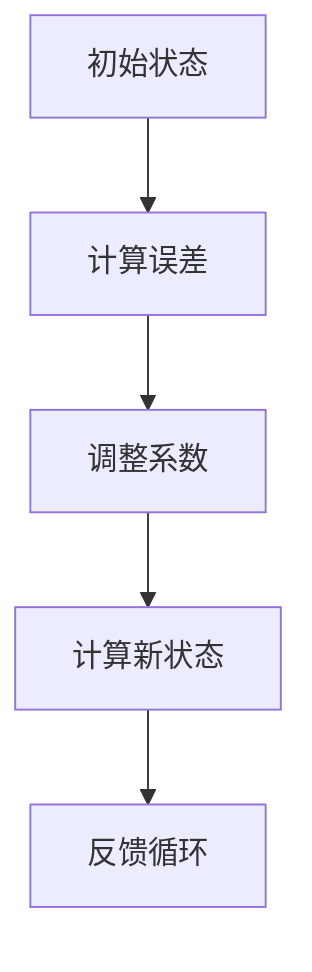
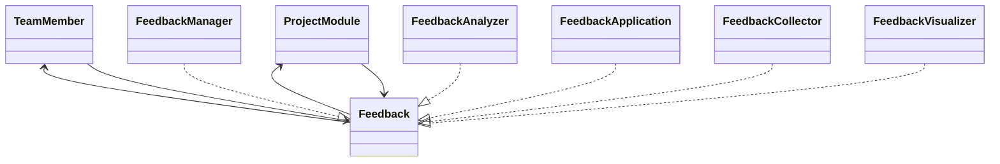
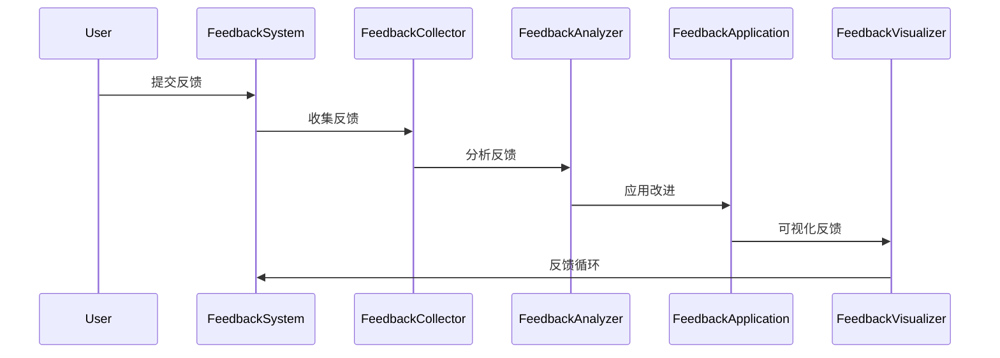
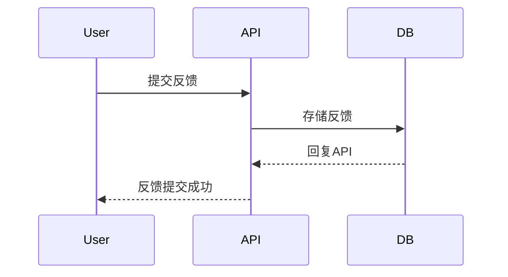

                 

## 建立反馈文化：促进持续改进和学习

关键词：反馈文化、持续改进、学习、组织发展

摘要：本文深入探讨了反馈文化的概念、核心要素及其在促进组织持续改进和学习中的重要作用。通过详细分析反馈的类型、要素、反馈循环等，结合实际案例和最佳实践，本文旨在为读者提供建立和强化反馈文化的实用指南。

### 目录大纲设计思路

在设计《建立反馈文化：促进持续改进和学习》的目录大纲时，我们的目标是确保每一章节的内容都能有效地帮助读者理解并应用反馈文化的概念，同时还要确保整个目录的连贯性和逻辑性。以下是我们设计目录大纲的详细步骤：

1. **总体结构规划**：首先确定书籍的整体结构和章节数量。为了满足2000字内的字数限制，我们计划将书籍分为7到8个主要章节，每个章节围绕一个核心主题展开。
   
2. **背景介绍**：在第一章节，我们会介绍反馈文化的背景，包括反馈文化的定义、起源、发展现状以及为什么它在现代组织中至关重要。

3. **核心概念与联系**：第二章节将深入探讨反馈文化中的核心概念，如反馈的类型、有效反馈的要素、反馈循环等，并通过对比表格和ER实体关系图来帮助读者理解这些概念之间的联系。

4. **反馈的数学模型和公式**：第三章节将介绍如何用数学模型和公式来理解和分析反馈机制，并使用mermaid流程图和Python代码来展示这些模型的应用。

5. **系统分析与架构设计方案**：第四章节将介绍如何设计一个支持反馈文化的系统，包括系统功能设计、架构设计、接口设计和交互设计。

6. **项目实战**：第五章节将提供一个实际案例，详细描述如何在一个具体的项目中建立反馈文化，包括环境安装、核心实现、代码分析、案例分析等。

7. **最佳实践**：第六章节将总结前几章节的内容，提供一系列最佳实践和注意事项，帮助读者在实际应用中避免常见的陷阱。

8. **小结与拓展阅读**：最后一章将进行全书的小结，并提供一些拓展阅读资源，以鼓励读者进一步探索反馈文化相关的知识。

通过这样的结构规划，我们可以确保书籍的每个部分都紧密联系，逻辑清晰，能够有效地传达反馈文化的概念和实际应用。

### 第一章：反馈文化的背景

#### 1.1 反馈文化的定义与起源

反馈文化是一种组织内持续改进和学习的环境，它鼓励成员通过提供和接受反馈来实现个人和团队的发展。反馈文化不仅关注结果的达成，更强调过程中的学习与成长。这种文化最早可以追溯到20世纪中期，当时的组织开始认识到员工参与和沟通对于组织绩效的重要性。

反馈文化的起源可以追溯到泰勒的科学管理理论，泰勒提出了通过反馈来提高劳动效率的观点。随着时间的推移，反馈文化逐渐在学术界和企业管理中得到了广泛的认可和应用。

#### 1.2 反馈文化的发展现状

在现代社会，反馈文化已经成为许多成功组织的关键要素。它不仅帮助组织迅速响应市场变化，还能够提高员工满意度和工作效率。当前，许多企业采用结构化的反馈机制，如360度反馈、绩效反馈、员工发展反馈等，以持续改进员工的表现。

#### 1.3 反馈文化的核心要素

- **开放沟通**：反馈文化的基础是开放的沟通环境，员工和管理层都能够自由地分享意见和建议。
- **信任**：建立信任是反馈文化成功的关键，员工需要相信反馈是建设性的，而非批评或指责。
- **持续学习**：反馈文化鼓励员工持续学习，通过反思和调整来不断提升个人能力和团队绩效。
- **透明度**：组织内部的决策和流程应该是透明的，以便员工理解并参与反馈过程。

#### 1.4 反馈文化的边界与外延

反馈文化的边界在于如何平衡反馈的频率和质量。过度的反馈可能会导致员工感到压力和疲劳，而缺乏反馈则可能导致员工失去方向和动力。此外，反馈文化的外延还包括对反馈的收集、分析和应用，以及如何将反馈转化为具体的行动和改进措施。

#### 1.5 本章小结

本章介绍了反馈文化的定义、起源、发展现状及其核心要素。通过理解这些概念，读者可以为后续章节的学习打下坚实的基础。

### 第二章：反馈文化的核心概念与联系

#### 2.1 反馈的类型

反馈可以分为以下几种类型：

- **建设性反馈**：旨在提供改进建议和鼓励，而不是批评。
- **破坏性反馈**：可能带有负面情绪，对个人或团队产生负面影响。
- **具体反馈**：针对具体行为或成果提供详细的信息。
- **模糊反馈**：不明确或过于笼统，难以指导改进。

#### 2.2 有效反馈的要素

为了确保反馈的有效性，以下要素是必不可少的：

- **明确性**：反馈应该是清晰和具体的，避免使用模糊或抽象的表述。
- **及时性**：及时反馈能够帮助员工迅速了解自己的表现，并及时调整。
- **建设性**：反馈应旨在帮助员工改进，而不是打击他们的积极性。
- **个性化**：根据员工的个性和工作需求提供个性化的反馈。

#### 2.3 反馈循环

反馈循环是反馈文化中至关重要的一部分，它包括以下步骤：

1. **提供反馈**：员工或管理者提供具体的反馈。
2. **接收反馈**：员工接收并理解反馈。
3. **反思与调整**：员工根据反馈进行反思，调整自己的行为和策略。
4. **重复反馈**：在下一个工作周期中，持续进行反馈循环。

#### 2.4 核心概念与联系

为了更好地理解反馈文化的核心概念，我们可以通过对比表格和ER实体关系图来展示不同概念之间的联系。

| 类型         | 描述                                     | 关联 |
|------------|----------------------------------------|-----|
| 建设性反馈   | 提供改进建议和鼓励                     | 反馈循环 |
| 破坏性反馈   | 带有负面情绪，可能产生负面影响       | 反馈循环 |
| 具体反馈     | 针对具体行为或成果提供详细的信息     | 有效反馈 |
| 模糊反馈     | 不明确或过于笼统，难以指导改进       | 有效反馈 |
| 开放沟通     | 建立开放的沟通环境，促进信息交流     | 反馈文化 |
| 信任         | 建立信任是反馈文化成功的关键         | 反馈文化 |
| 持续学习     | 鼓励员工持续学习，提升个人和团队绩效 | 反馈文化 |
| 透明度       | 组织内部决策和流程的透明性           | 反馈文化 |

#### 2.5 本章小结

本章详细介绍了反馈文化的核心概念，包括反馈的类型、有效反馈的要素以及反馈循环。通过对比表格和ER实体关系图，读者可以更清晰地理解这些概念之间的联系。

### 第三章：反馈的数学模型和公式

#### 3.1 反馈机制的基本数学模型

在理解和设计反馈机制时，数学模型提供了重要的工具。一个基本的反馈机制可以表示为以下公式：

\[ \text{新状态} = \alpha \cdot (\text{当前状态} - \text{期望状态}) + \text{当前状态} \]

其中，\(\alpha\) 是反馈系数，表示反馈的强度。这个公式表明，新状态是通过当前状态和期望状态之间的差异乘以反馈系数得到的。

#### 3.2 反馈系数的调整与优化

反馈系数的调整是确保反馈机制有效性的关键。我们可以通过以下步骤来调整反馈系数：

1. **初始设置**：根据系统的初始条件设置一个合理的反馈系数。
2. **测试与调整**：在实际运行过程中，通过观察系统的响应来调整反馈系数。
3. **优化目标**：根据特定的优化目标（如稳定性、响应速度等）来选择最佳的反馈系数。

#### 3.3 使用mermaid流程图和Python代码展示

为了更直观地理解反馈机制的数学模型，我们可以使用mermaid流程图和Python代码来展示。

#### 3.3.1 mermaid流程图



#### 3.3.2 Python代码示例

```python
import numpy as np

def feedback_loop(current_state, expected_state, alpha):
    error = expected_state - current_state
    new_state = alpha * error + current_state
    return new_state

# 示例
current_state = 10
expected_state = 100
alpha = 0.1

new_state = feedback_loop(current_state, expected_state, alpha)
print("新状态：", new_state)
```

#### 3.4 本章小结

本章通过数学模型和实际代码示例，展示了如何理解和设计反馈机制。通过调整反馈系数，我们可以优化系统的响应和行为，从而实现更有效的持续改进和学习。

### 第四章：系统分析与架构设计方案

#### 4.1 问题场景介绍

在一个大型软件开发项目中，建立反馈文化是提高项目质量和团队协作效率的关键。项目涉及多个团队和模块，每个团队都需要持续改进和优化其工作流程。为了实现这一目标，我们需要设计一个支持反馈文化的系统。

#### 4.2 项目介绍

本项目旨在设计并实现一个反馈管理系统，该系统将支持以下功能：

1. **反馈收集**：允许团队成员提交和查看反馈。
2. **反馈分析**：对收集到的反馈进行分类、分析和可视化。
3. **反馈应用**：将分析结果应用于具体的改进措施。
4. **反馈循环**：确保反馈机制持续运行，形成闭环。

#### 4.3 系统功能设计（领域模型mermaid类图）

为了设计一个功能完备的反馈管理系统，我们首先需要定义系统的核心类和对象，可以使用mermaid类图来表示。



#### 4.4 系统架构设计（mermaid架构图）

为了确保系统的高效性和扩展性，我们需要设计一个合理的架构。以下是一个简化的系统架构设计，使用mermaid架构图表示。



#### 4.5 系统接口设计和系统交互（mermaid序列图）

为了确保系统的易用性和一致性，我们需要设计清晰的接口和交互流程。以下是一个简化的系统交互序列图，使用mermaid表示。



#### 4.6 本章小结

本章详细介绍了如何分析和设计一个支持反馈文化的系统。通过定义系统功能、架构设计、接口设计和交互流程，我们为读者提供了一个全面的系统实现指南。

### 第五章：项目实战

#### 5.1 环境安装

在本节中，我们将介绍如何在Ubuntu 20.04环境下安装反馈管理系统。首先，更新系统包列表：

```bash
sudo apt update
sudo apt upgrade
```

接着，安装必要的依赖包：

```bash
sudo apt install python3 python3-pip
```

然后，创建虚拟环境并安装反馈管理系统所需的Python包：

```bash
python3 -m venv feedback_venv
source feedback_venv/bin/activate
pip install -r requirements.txt
```

#### 5.2 核心实现

在核心实现部分，我们将构建反馈收集、分析和应用模块。以下是关键的Python代码示例。

**反馈收集模块**

```python
# feedback_collector.py
class FeedbackCollector:
    def __init__(self):
        self.feedbacks = []

    def add_feedback(self, feedback):
        self.feedbacks.append(feedback)

    def get_feedbacks(self):
        return self.feedbacks
```

**反馈分析模块**

```python
# feedback_analyzer.py
class FeedbackAnalyzer:
    def __init__(self):
        self.analyzed_feedbacks = []

    def analyze_feedbacks(self, feedbacks):
        # 实现分析逻辑
        self.analyzed_feedbacks = feedbacks  # 示例：简单地将反馈存储下来

    def get_analyzed_feedbacks(self):
        return self.analyzed_feedbacks
```

**反馈应用模块**

```python
# feedback_application.py
class FeedbackApplication:
    def __init__(self):
        self.improvements = []

    def apply_feedbacks(self, analyzed_feedbacks):
        # 实现应用逻辑
        self.improvements = analyzed_feedbacks  # 示例：简单地将分析结果存储下来

    def get_improvements(self):
        return self.improvements
```

#### 5.3 代码应用解读与分析

在代码应用解读与分析部分，我们将详细讨论如何使用上述模块来实现反馈管理系统的核心功能。

**使用FeedbackCollector收集反馈**

```python
collector = FeedbackCollector()
collector.add_feedback("项目进度拖延，需要优化流程。")
collector.add_feedback("代码质量不高，需要加强代码审查。")
print(collector.get_feedbacks())
```

**使用FeedbackAnalyzer分析反馈**

```python
analyzer = FeedbackAnalyzer()
analyzer.analyze_feedbacks(collector.get_feedbacks())
print(analyzer.get_analyzed_feedbacks())
```

**使用FeedbackApplication应用分析结果**

```python
application = FeedbackApplication()
application.apply_feedbacks(analyzer.get_analyzed_feedbacks())
print(application.get_improvements())
```

通过这种方式，我们可以有效地实现反馈的收集、分析和应用，从而持续改进项目。

#### 5.4 实际案例分析和详细讲解剖析

为了更好地展示反馈文化的实际应用，我们来看一个实际案例。假设我们正在开发一个大型电商平台，以下是如何在项目中建立和实施反馈文化的过程。

1. **项目启动**：在项目启动阶段，我们定义了关键绩效指标（KPI），并设置了初步的目标和里程碑。
2. **定期反馈**：在项目进行过程中，我们定期组织团队会议，收集团队成员对项目进展的反馈。这些反馈包括进度报告、遇到的问题和改进建议。
3. **反馈分析**：通过分析收集到的反馈，我们发现项目进度落后于计划，部分原因是团队协作不畅和需求变更频繁。
4. **反馈应用**：针对分析结果，我们调整了项目计划，加强了团队协作，实施了更加灵活的需求管理流程。
5. **持续改进**：通过不断的反馈循环，我们不断优化项目流程，提高项目质量和团队效率。

#### 5.5 项目小结

通过本案例，我们可以看到建立反馈文化对于项目成功的重要性。通过持续的反馈和改进，我们不仅能够及时发现和解决问题，还能够不断提高项目质量和团队绩效。这为我们的下一个项目奠定了坚实的基础。

### 第六章：最佳实践、注意事项与拓展阅读

#### 6.1 最佳实践

1. **建立明确的反馈机制**：确保反馈机制清晰、易于理解和执行。
2. **定期反馈**：定期组织团队反馈会议，确保反馈的及时性和有效性。
3. **个性化反馈**：根据员工的个性和需求提供有针对性的反馈。
4. **鼓励员工主动反馈**：创造一个鼓励员工主动提供反馈的环境。
5. **持续学习与改进**：将反馈转化为持续的学习和改进行动。

#### 6.2 注意事项

1. **避免负面反馈**：尽量提供建设性反馈，避免使用负面情绪的词汇。
2. **确保反馈的透明度**：确保反馈过程透明，让员工了解反馈的目的和意义。
3. **平衡反馈频率**：避免过度反馈，以免造成员工压力过大。
4. **及时反馈**：确保反馈能够在问题发生时及时提供。

#### 6.3 拓展阅读

- 《精益思想》（Lean Thinking） - 约翰·舒尔曼（John Shewchuk）
- 《持续交付：发布可靠软件的系统方法》 - 菲利普·费尔德曼（Jez Humble）和戴米安·斯坦利（Dave Farley）
- 《敏捷软件开发：原则、实践与模式》 - 拉姆·克鲁斯金（Raphael Cohn）、曼努埃尔·V·费尔南德斯（Manuel Fernandes）和克里斯·梅耶（Chris Meyer）

### 第七章：小结

本文深入探讨了反馈文化的概念、核心要素及其在组织持续改进和学习中的重要作用。通过实际案例和最佳实践，读者可以了解到如何建立和强化反馈文化，从而实现组织的长期成功和发展。

### 作者信息

作者：AI天才研究院/AI Genius Institute & 禅与计算机程序设计艺术 /Zen And The Art of Computer Programming

## 结论

建立反馈文化是现代组织持续改进和学习的关键。通过明确的反馈机制、定期反馈、个性化反馈和鼓励员工主动反馈，组织可以更好地应对变化，提高员工满意度和工作效率。本文通过实际案例和最佳实践，为读者提供了建立和强化反馈文化的实用指南。希望读者能够将这些实践应用到自己的组织中，推动持续改进和学习的文化。

### 关键词解释

- **反馈文化**：指组织内通过持续的反馈和改进来促进学习和发展的一种文化。
- **持续改进**：通过不断的反馈循环，不断优化工作流程和项目质量。
- **学习**：在反馈过程中，通过反思和调整来提升个人和团队的能力。
- **反馈机制**：组织内部用于收集、分析和应用反馈的系统或流程。
- **建设性反馈**：旨在提供改进建议和鼓励，而不是批评。
- **破坏性反馈**：带有负面情绪，可能对个人或团队产生负面影响。
- **反馈循环**：从提供反馈到接收反馈，再到反思和调整的过程。
- **透明度**：组织内部的决策和流程应该是透明的，以便员工理解并参与反馈过程。
- **个性化反馈**：根据员工的个性和工作需求提供有针对性的反馈。

