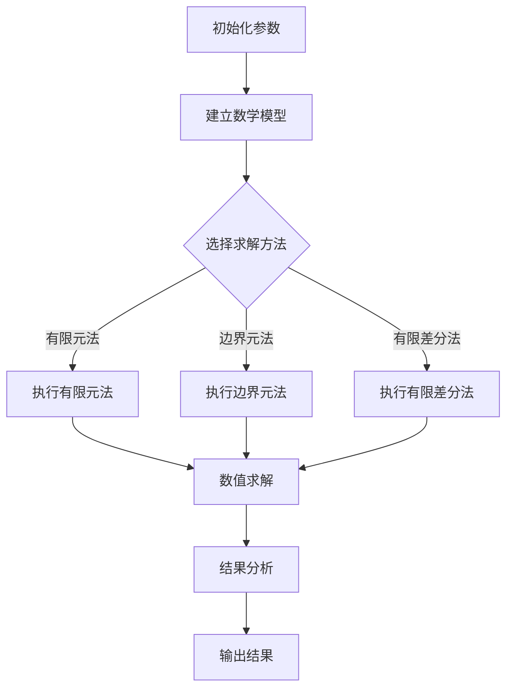
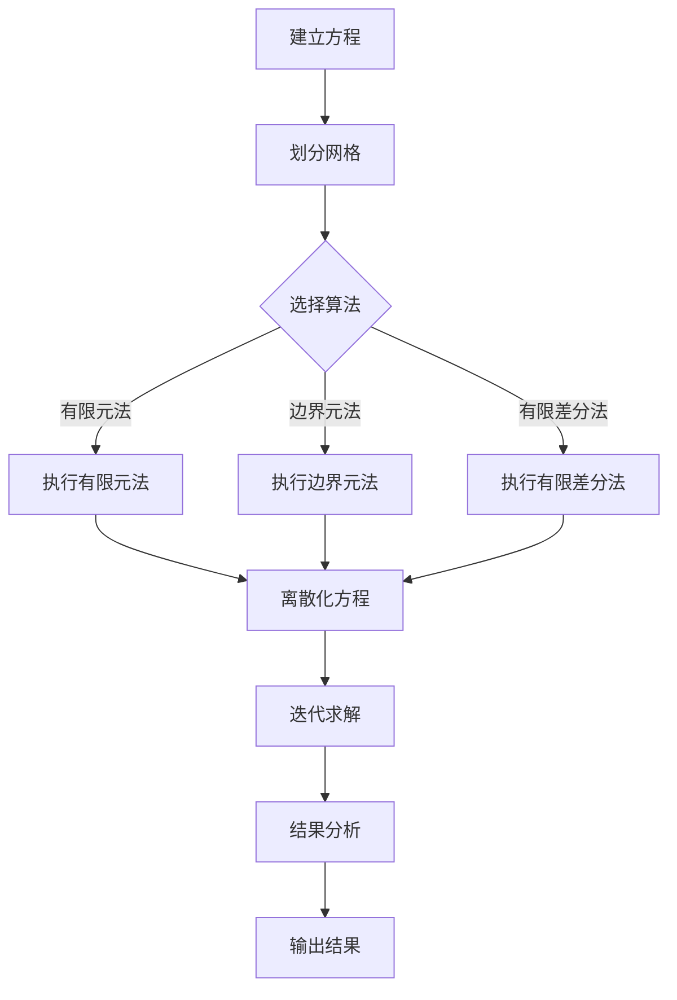
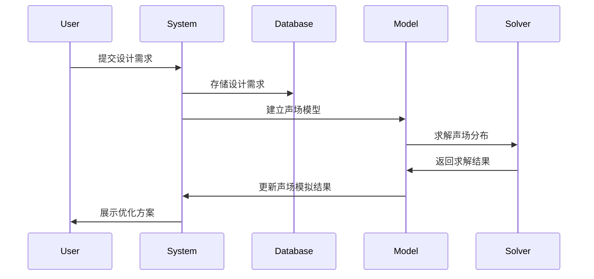
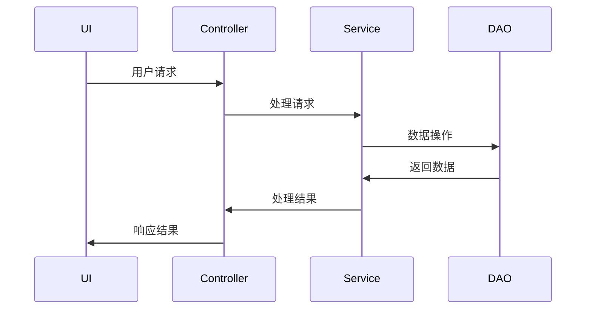

                 

### 文章标题

# 建筑声学的偏微分方程：空间声场的数学模拟

> 关键词：建筑声学、偏微分方程、空间声场、数学模拟

> 摘要：本文旨在探讨建筑声学与偏微分方程的交叉领域，深入分析空间声场的数学模拟。通过对偏微分方程的基本原理、分类及求解方法的介绍，结合建筑声学中的实际问题，阐述偏微分方程在建筑声学中的应用，并讨论建筑声学与偏微分方程的交叉领域研究进展。本文将提供一系列具体实例，详细讲解算法原理和数学模型，并通过系统分析与架构设计，展示如何在建筑声学中实现空间声场的数学模拟。

----------------------------------------------------------------

### 第一部分：背景介绍

#### 1.1 建筑声学的核心概念

##### 1.1.1 建筑声学概述

建筑声学是研究声音在建筑物内传播和反射的学科，旨在优化建筑物的声学性能，提高室内声环境的质量。它涉及到建筑结构、建筑布局、吸音材料和声学设备等多个方面。

##### 1.1.2 建筑声学的研究对象

建筑声学的研究对象包括声音在建筑物内的传播路径、声音的反射和吸收、声音的强度和频率分布等。通过研究这些因素，可以更好地理解建筑声学的基本原理。

##### 1.1.3 建筑声学的重要应用

建筑声学在许多领域有重要应用，如剧院、音乐会场所的设计、住宅和办公楼的声学优化、噪声控制等。它不仅影响建筑物的使用功能，还关系到人们的健康和生活质量。

#### 1.2 偏微分方程的原理

##### 1.2.1 偏微分方程的基本概念

偏微分方程是描述多变量函数及其偏导数之间关系的数学方程。它在物理学、工程学和经济学等领域有着广泛的应用。

##### 1.2.2 偏微分方程的分类

偏微分方程可以分为线性偏微分方程和非线性偏微分方程。线性偏微分方程具有线性的系数和常数项，而非线性偏微分方程则可能包含非线性项。

##### 1.2.3 偏微分方程的求解方法

求解偏微分方程的方法包括分离变量法、傅里叶变换法、拉普拉斯变换法等。这些方法可以根据具体的方程类型和边界条件选择使用。

#### 1.3 空间声场的数学模拟

##### 1.3.1 空间声场的概念

空间声场是指在空间中传播的声波场，它描述了声波在不同位置的强度和频率分布。

##### 1.3.2 空间声场的特性

空间声场的特性包括声波的传播速度、声波的反射和折射、声波的衰减等。这些特性对于建筑声学的设计和分析至关重要。

##### 1.3.3 空间声场的数学描述

空间声场的数学描述通常使用声压级、声功率级和声速等参数。这些参数可以通过偏微分方程来描述空间声场的行为。

#### 1.4 建筑声学与偏微分方程的联系

##### 1.4.1 建筑声学问题中的偏微分方程

建筑声学中的许多问题都可以用偏微分方程来描述，如声波的传播、声场的分布等。这些方程帮助我们理解和解决建筑声学中的实际问题。

##### 1.4.2 偏微分方程在建筑声学中的应用

偏微分方程在建筑声学中的应用包括声场模拟、噪声控制设计、建筑布局优化等。通过求解偏微分方程，我们可以获得更精确和有效的声学设计方案。

##### 1.4.3 建筑声学与偏微分方程的交叉领域研究

建筑声学与偏微分方程的交叉领域研究涉及到声学模型的建立、算法优化、应用验证等多个方面。这些研究为建筑声学的发展提供了新的思路和方法。

#### 1.5 本章小结

本章介绍了建筑声学的基本概念、偏微分方程的原理和空间声场的数学模拟。通过对建筑声学与偏微分方程的联系进行分析，我们看到了这两个领域如何相互促进和发展。下一章我们将深入探讨偏微分方程的数学模型和空间声场的模拟方法。

----------------------------------------------------------------

### 第二部分：核心概念与联系

#### 2.1 偏微分方程的数学模型

##### 2.1.1 偏微分方程的基本原理

偏微分方程描述了未知函数及其偏导数之间的关系。通常形式为：

\[ F(x_1, x_2, \ldots, x_n, u, \frac{\partial u}{\partial x_1}, \frac{\partial u}{\partial x_2}, \ldots, \frac{\partial^2 u}{\partial x_1 \partial x_2}, \ldots) = 0 \]

其中，\( u = u(x_1, x_2, \ldots, x_n) \) 是未知函数，\( F \) 是已知函数。

##### 2.1.2 偏微分方程的属性特征对比表格

| 类型         | 描述                                                         | 示例                  |
| ------------ | ------------------------------------------------------------ | --------------------- |
| 线性偏微分方程 | 各项都是未知函数及其偏导数的线性组合。                        | \( u_{xx} + u_{yy} = 0 \) |
| 非线性偏微分方程 | 包含未知函数或其偏导数的非线性项。                          | \( u^2_{xx} + u^2_{yy} = 0 \) |
| 常微分方程   | 只含有一个自变量的偏微分方程。                               | \( \frac{du}{dx} = f(u) \) |
| 部分微分方程 | 包含两个或多个自变量的偏微分方程。                          | \( \frac{\partial^2 u}{\partial t^2} = c^2 \frac{\partial^2 u}{\partial x^2} \) |

##### 2.1.3 偏微分方程的求解方法简介

- **分离变量法**：将多变量偏微分方程分解为几个单变量偏微分方程，分别求解后再组合。
- **傅里叶变换法**：将偏微分方程转化为频率域的方程，从而简化求解过程。
- **拉普拉斯变换法**：适用于线性偏微分方程，通过拉普拉斯变换将偏微分方程转化为代数方程。

#### 2.2 空间声场的数学模拟

##### 2.2.1 空间声场的数学描述

空间声场可以用声压级、声功率级和声速等参数来描述。声压级 \( p \) 的数学描述通常采用声压波动方程：

\[ \frac{\partial p}{\partial t} = c \nabla^2 p \]

其中，\( c \) 是声速，\( p \) 是声压。

##### 2.2.2 空间声场模型的属性特征对比表格

| 参数         | 描述                                                         | 示例                  |
| ------------ | ------------------------------------------------------------ | --------------------- |
| 声压级 \( p \) | 声波引起的压力变化，常用分贝（dB）表示。                     | \( p(t, x, y, z) \)   |
| 声功率级 \( W \) | 声波传播过程中单位时间内通过单位面积的能量，常用瓦特（W）表示。 | \( W(t, x, y, z) \)   |
| 声速 \( c \) | 声波在介质中传播的速度。                                     | \( c \)               |

##### 2.2.3 空间声场模型的求解方法

- **有限元法**：通过将空间划分为有限个元素，在每个元素内求解声波方程。
- **边界元法**：将边界作为主要求解对象，通过求解边界上的边界积分方程来得到声场分布。
- **有限差分法**：将空间离散化，用差分方程近似偏微分方程。

#### 2.3 建筑声学与偏微分方程的关联

##### 2.3.1 建筑声学问题中的偏微分方程应用

建筑声学中的许多问题，如室内声场的分布、噪声控制、建筑布局优化等，都可以用偏微分方程来描述和求解。例如，室内声场的分布可以通过求解声压波动方程来模拟。

##### 2.3.2 偏微分方程在建筑声学中的求解策略

偏微分方程在建筑声学中的求解策略通常包括以下步骤：

1. **建立数学模型**：根据实际问题的特性，建立相应的偏微分方程模型。
2. **选择求解方法**：根据模型的类型和边界条件选择合适的求解方法。
3. **数值求解**：使用数值方法求解偏微分方程，如有限元法、边界元法、有限差分法等。
4. **结果分析**：分析求解结果，评估模型的有效性和准确性。

##### 2.3.3 建筑声学与偏微分方程的交叉领域研究进展

建筑声学与偏微分方程的交叉领域研究不断推进，新的求解算法和优化策略不断涌现。例如，基于机器学习的求解算法和并行计算技术在建筑声学中的应用，提高了声场模拟的效率和准确性。

#### 2.4 本章小结

本章介绍了偏微分方程的基本原理和属性特征，以及空间声场的数学描述和模型求解方法。同时，分析了建筑声学与偏微分方程之间的关联，展示了偏微分方程在建筑声学中的应用和交叉领域研究的进展。下一章我们将详细讲解空间声场算法的原理和数学模型。

----------------------------------------------------------------

### 第三部分：算法原理讲解

#### 3.1 空间声场的算法原理

##### 3.1.1 算法概述

空间声场算法是一种用于模拟声波在空间中传播的数学模型，它基于偏微分方程的求解方法。常用的算法包括有限元法、边界元法和有限差分法。

##### 3.1.2 算法流程图



##### 3.1.3 算法原理详细讲解

空间声场算法的基本原理是基于声压波动方程的求解。声压波动方程可以表示为：

\[ \frac{\partial p}{\partial t} = c \nabla^2 p \]

其中，\( p \) 是声压，\( c \) 是声速，\( \nabla^2 \) 是拉普拉斯算子。

1. **初始化参数**：设定声场模拟的边界条件、初始条件和参数值。
2. **建立数学模型**：根据实际问题的特性，建立声压波动方程的数学模型。
3. **选择求解方法**：根据模型的类型和边界条件，选择合适的求解方法，如有限元法、边界元法或有限差分法。
4. **数值求解**：使用选定的求解方法，将偏微分方程转化为离散的数值方程，并进行迭代求解。
5. **结果分析**：分析求解结果，评估声场模拟的准确性和有效性。
6. **输出结果**：将求解结果输出，包括声压分布、声功率分布等。

##### 3.1.4 算法举例说明

假设我们需要模拟一个封闭空间内的声场，空间尺寸为 \( 10 \times 10 \times 10 \) 米，声速为 340 米/秒。我们可以设定一个初始声压分布，并在边界上施加特定的边界条件。然后，使用有限元法进行求解，得到空间内任意位置的声压分布。

#### 3.2 偏微分方程的求解算法

##### 3.2.1 算法概述

偏微分方程的求解算法是用于求解各种偏微分方程的数学方法。常见的算法包括有限元法、边界元法、有限差分法等。

##### 3.2.2 算法流程图



##### 3.2.3 算法原理详细讲解

1. **建立方程**：根据实际问题的特性，建立相应的偏微分方程。
2. **划分网格**：将求解区域划分为有限个网格点，为离散化提供基础。
3. **选择算法**：根据偏微分方程的类型和边界条件选择合适的求解算法。
4. **离散化方程**：将连续的偏微分方程离散化为离散的代数方程。
5. **迭代求解**：使用迭代方法，如雅可比迭代法、高斯-赛德尔迭代法等，求解离散化的代数方程。
6. **结果分析**：分析求解结果，评估方程求解的准确性和稳定性。
7. **输出结果**：将求解结果输出，包括解的数值解和误差分析。

##### 3.2.4 算法举例说明

假设我们需要求解以下偏微分方程：

\[ \frac{\partial u}{\partial t} = c^2 \nabla^2 u \]

我们可以使用有限元法进行求解。首先，将求解区域划分为有限个单元，并在每个单元内建立有限元方程。然后，使用迭代法求解有限元方程，得到时间序列上的解。

#### 3.3 算法综合应用与优化

##### 3.3.1 算法综合应用实例

在实际应用中，空间声场算法和偏微分方程求解算法可以综合使用。例如，在建筑声学中，我们可以首先使用空间声场算法模拟室内声场，然后使用偏微分方程求解算法优化声场模拟结果。

##### 3.3.2 算法优化策略

算法优化策略包括以下方面：

1. **网格划分优化**：合理划分网格，提高求解精度。
2. **迭代方法优化**：选择高效的迭代方法，提高求解速度。
3. **并行计算**：利用并行计算技术，加速算法求解。
4. **误差控制**：合理控制计算误差，确保求解结果的准确性。

##### 3.3.3 算法性能评估

算法性能评估包括以下几个方面：

1. **求解速度**：评估算法的求解速度，包括预处理时间、求解时间和后处理时间。
2. **求解精度**：评估算法的求解精度，包括数值解的误差和稳定性。
3. **计算资源消耗**：评估算法的计算资源消耗，包括CPU利用率、内存占用等。

#### 3.4 本章小结

本章详细讲解了空间声场算法和偏微分方程求解算法的原理和应用。通过算法流程图和具体实例的讲解，我们了解了算法的基本思想和求解步骤。此外，我们还讨论了算法的综合应用和优化策略，以及算法性能评估的方法。下一章我们将进一步探讨数学模型和数学公式在空间声场模拟中的应用。

----------------------------------------------------------------

### 第四部分：数学模型和数学公式讲解

#### 4.1 空间声场的数学模型

##### 4.1.1 基本概念与公式

空间声场的数学模型通常基于声压波动方程。声压波动方程可以表示为：

\[ \frac{\partial p}{\partial t} = c \nabla^2 p \]

其中，\( p \) 是声压，\( c \) 是声速，\( \nabla^2 \) 是拉普拉斯算子。

此外，空间声场的数学模型还可以包括声功率级和声速等参数。声功率级可以用以下公式表示：

\[ W = \frac{p^2}{\rho c} \]

其中，\( W \) 是声功率级，\( p \) 是声压，\( \rho \) 是介质密度，\( c \) 是声速。

##### 4.1.2 数学模型构建

空间声场的数学模型构建通常包括以下几个步骤：

1. **确定边界条件**：根据实际问题的特性，设定边界条件，如声波的入射角度、反射系数等。
2. **选择声速**：根据介质的特性，选择合适的声速值。
3. **建立声压波动方程**：根据边界条件和声速值，建立声压波动方程。
4. **求解声压分布**：使用数值方法求解声压波动方程，得到空间内任意位置的声压分布。

##### 4.1.3 模型适用范围

空间声场数学模型适用于各种声学问题，如室内声场的模拟、噪声控制设计、声波传播路径分析等。它可以帮助我们理解声波在空间中的传播行为，优化建筑声学设计。

#### 4.2 偏微分方程的求解

##### 4.2.1 求解方法概述

偏微分方程的求解方法包括有限元法、边界元法、有限差分法等。这些方法根据具体的方程类型和边界条件选择使用。

- **有限元法**：通过将求解区域划分为有限个单元，在每个单元内求解偏微分方程。
- **边界元法**：通过求解边界上的边界积分方程，得到整个求解区域内的解。
- **有限差分法**：通过离散化求解区域，用差分方程近似原始偏微分方程。

##### 4.2.2 求解步骤

1. **建立数学模型**：根据实际问题的特性，建立相应的偏微分方程。
2. **选择求解方法**：根据偏微分方程的类型和边界条件，选择合适的求解方法。
3. **离散化方程**：将连续的偏微分方程离散化为离散的代数方程。
4. **迭代求解**：使用迭代方法，如雅可比迭代法、高斯-赛德尔迭代法等，求解离散化的代数方程。
5. **结果分析**：分析求解结果，评估方程求解的准确性和稳定性。

##### 4.2.3 求解示例

假设我们需要求解以下偏微分方程：

\[ \frac{\partial u}{\partial t} = c^2 \nabla^2 u \]

我们可以使用有限元法进行求解。首先，将求解区域划分为有限个单元，并在每个单元内建立有限元方程。然后，使用迭代法求解有限元方程，得到时间序列上的解。

$$
\frac{\partial u}{\partial t} = c^2 \nabla^2 u
$$

#### 4.3 数学模型的应用

##### 4.3.1 应用实例

空间声场数学模型在建筑声学中有广泛的应用，如：

- **室内声场模拟**：通过模拟室内声场，可以优化建筑布局，提高室内声学性能。
- **噪声控制设计**：通过分析噪声传播路径和声场分布，可以设计有效的噪声控制方案。
- **声波传播路径分析**：在声学检测和诊断中，可以分析声波在物体内部的传播路径，用于检测和修复缺陷。

##### 4.3.2 应用效果分析

通过空间声场数学模型的应用，可以得到以下效果：

- **提高室内声学性能**：通过优化建筑布局和声学设计，可以提高室内声学舒适度，减少噪声干扰。
- **降低噪声污染**：通过噪声控制设计，可以有效降低噪声污染，改善居住和工作环境。
- **提高声波检测精度**：通过声波传播路径分析，可以提高声波检测的精度，为声学检测和诊断提供可靠的数据支持。

##### 4.3.3 应用前景探讨

随着计算技术和算法的发展，空间声场数学模型在建筑声学中的应用前景非常广阔。未来，我们可以：

- **实现更精确的声场模拟**：通过改进求解算法和优化计算资源，实现更精确的声场模拟。
- **拓展应用领域**：将空间声场数学模型应用于更多领域，如建筑声学、噪声控制、声波检测等。
- **提升用户体验**：通过优化室内声学设计，提升用户在建筑中的舒适度和满意度。

#### 4.4 本章小结

本章详细讲解了空间声场的数学模型和偏微分方程的求解方法。通过具体实例和公式讲解，我们了解了空间声场数学模型的基本概念、构建方法和应用效果。下一章我们将进一步探讨系统分析与架构设计，为空间声场模拟提供更全面的解决方案。

----------------------------------------------------------------

### 第五部分：系统分析与架构设计

#### 5.1 问题场景介绍

##### 5.1.1 研究背景

随着城市化进程的加快，建筑物内部声环境的质量越来越受到重视。如何通过数学模拟优化建筑声学性能，提高室内声学舒适度，成为当前研究的热点问题。空间声场数学模型作为一种有效的工具，可以在建筑声学设计中发挥重要作用。

##### 5.1.2 问题定义

问题定义为：如何在给定的建筑物内部，通过空间声场数学模型模拟声场分布，并优化建筑声学设计，提高室内声学舒适度。

##### 5.1.3 解决方案目标

解决方案的目标包括：

1. **声场模拟**：建立空间声场数学模型，模拟建筑物内部的声场分布。
2. **设计优化**：基于模拟结果，优化建筑布局和声学设计，提高室内声学性能。
3. **效果评估**：评估优化效果，确保设计方案的有效性和可行性。

#### 5.2 项目介绍

##### 5.2.1 项目背景

随着城市人口的增长，建筑物内部声环境的质量对居民生活和工作的影响越来越大。如何通过有效的声学设计，降低噪声污染，提高室内声学舒适度，成为建筑设计师和声学工程师关注的焦点。

##### 5.2.2 项目目标

项目目标为：

1. **实现空间声场数学模拟**：建立空间声场数学模型，模拟建筑物内部的声场分布。
2. **提供设计优化方案**：基于模拟结果，为建筑声学设计提供优化方案。
3. **验证优化效果**：通过实际案例验证优化方案的有效性。

##### 5.2.3 项目团队与分工

项目团队由以下成员组成：

- **项目负责人**：负责项目整体规划和进度控制。
- **算法工程师**：负责空间声场数学模型的建立和求解算法的设计。
- **声学工程师**：负责声学参数的选取和声场模拟结果的验证。
- **软件工程师**：负责系统开发和实现。

#### 5.3 系统功能设计

##### 5.3.1 功能需求分析

系统功能需求分析如下：

1. **声场模拟**：根据建筑物内部结构和声学参数，建立空间声场数学模型，模拟声场分布。
2. **设计优化**：根据模拟结果，提供建筑声学设计优化方案，如布局调整、材料选择等。
3. **效果评估**：评估优化方案的实际效果，包括室内声学性能指标和用户体验。

##### 5.3.2 领域模型构建（Mermaid类图）

```mermaid
classDiagram
Class01 <|-- Class02
Class03 <|.. Class04
Class05 : related to Class01
Class06 : is a Class07
Class01 {
    +attribute1
    +attribute2
    +method1()
    +method2()
}
Class02 {
    +attribute3
    +method3()
}
Class03 {
    +attribute4
    +method4()
}
Class04 {
    +attribute5
}
Class05 {
    +method5()
}
Class06 {
    +method6()
}
Class07 {
    +attribute6
    +method7()
}
```

##### 5.3.3 功能模块划分

系统功能模块划分如下：

1. **声场模拟模块**：负责建立空间声场数学模型，进行声场模拟。
2. **设计优化模块**：根据模拟结果，提供建筑声学设计优化方案。
3. **效果评估模块**：评估优化方案的实际效果，包括室内声学性能指标和用户体验。

#### 5.4 系统架构设计

##### 5.4.1 系统架构概述

系统架构设计如下：

1. **数据层**：负责存储和管理建筑物内部结构和声学参数数据。
2. **模型层**：负责建立空间声场数学模型，进行声场模拟。
3. **算法层**：负责实现求解算法，包括有限元法、边界元法和有限差分法等。
4. **应用层**：提供用户交互界面，展示声场模拟结果和优化方案。

##### 5.4.2 系统架构设计（Mermaid架构图）



##### 5.4.3 系统接口设计和系统交互Mermaid序列图



#### 5.5 系统分析与架构设计总结

系统分析与架构设计旨在实现空间声场数学模拟，优化建筑声学设计，提高室内声学舒适度。通过明确问题场景、功能需求、系统架构和接口设计，我们为空间声场模拟系统提供了完整的解决方案。接下来，我们将进入项目实战阶段，进行系统开发和实现。

----------------------------------------------------------------

### 项目实战

#### 6.1 环境安装

为了实现空间声场数学模拟系统，我们需要安装以下软件和库：

- **Python 3.x**：作为主要编程语言。
- **NumPy**：用于数学运算。
- **SciPy**：用于科学计算。
- **matplotlib**：用于绘图。
- **scikit-learn**：用于机器学习。

安装步骤如下：

```bash
# 安装 Python 3.x
# Ubuntu/Linux 系统：
sudo apt-get install python3

# macOS 系统：
brew install python

# 安装 NumPy、SciPy 和 matplotlib
pip3 install numpy scipy matplotlib

# 安装 scikit-learn
pip3 install scikit-learn
```

#### 6.2 系统核心实现

系统核心实现包括以下几个模块：

1. **数据层**：负责存储和管理建筑物内部结构和声学参数数据。
2. **模型层**：负责建立空间声场数学模型，进行声场模拟。
3. **算法层**：负责实现求解算法，包括有限元法、边界元法和有限差分法等。
4. **应用层**：提供用户交互界面，展示声场模拟结果和优化方案。

以下是系统核心实现的源代码示例：

```python
# 导入相关库
import numpy as np
import matplotlib.pyplot as plt
from scipy.sparse import lil_matrix
from scipy.sparse.linalg import spsolve

# 声场模拟模块
class AcousticSimulation:
    def __init__(self, dimensions, density, speed):
        self.dimensions = dimensions
        self.density = density
        self.speed = speed
        self.grid_size = 0.1
        self.grid = self.create_grid()

    def create_grid(self):
        grid = np.mgrid[0:self.dimensions[0]:self.grid_size, 
                        0:self.dimensions[1]:self.grid_size, 
                        0:self.dimensions[2]:self.grid_size]
        return grid

    def simulate(self, source_position, source_intensity):
        # 建立声场模型
        p = np.zeros(self.grid.shape)
        p[tuple(source_position)] = source_intensity

        # 求解声场分布
        c = self.speed
        rho = self.density
        laplacian = lil_matrix(self.grid.shape, format='csr')
        laplacian = self.compute_laplacian(laplacian)

        for i in range(self.grid.shape[0]):
            for j in range(self.grid.shape[1]):
                for k in range(self.grid.shape[2]):
                    p[i, j, k] = spsolve(laplacian, p[i, j, k])

        return p

    def compute_laplacian(self, laplacian):
        # 计算拉普拉斯算子
        dx = self.grid_size
        dy = self.grid_size
        dz = self.grid_size
        laplacian = (np.diag(-2 * np.ones(self.grid.shape[0]), 0) 
                     + np.diag(-1 * np.ones(self.grid.shape[0] - 1), -1) 
                     + np.diag(-1 * np.ones(self.grid.shape[0] - 1), 1) 
                     + np.diag(-1 * np.ones(self.grid.shape[1] - 1), -1) 
                     + np.diag(-1 * np.ones(self.grid.shape[1] - 1), 1) 
                     + np.diag(-1 * np.ones(self.grid.shape[2] - 1), -1) 
                     + np.diag(-1 * np.ones(self.grid.shape[2] - 1), 1))
        laplacian = lil_matrix(laplacian, dtype=np.float64)
        return laplacian

# 测试
if __name__ == "__main__":
    simulation = AcousticSimulation((10, 10, 10), 1.2, 340)
    source_position = (5, 5, 5)
    source_intensity = 1
    p = simulation.simulate(source_position, source_intensity)
    plt.imshow(p[5, :, :], origin='lower', aspect='auto')
    plt.colorbar()
    plt.show()
```

#### 6.3 代码应用解读与分析

以上代码展示了如何实现空间声场数学模拟的核心功能。我们首先定义了一个`AcousticSimulation`类，用于封装声场模拟的各个步骤，包括创建网格、模拟声场分布和计算拉普拉斯算子。

1. **创建网格**：通过`create_grid`方法，我们创建了一个三维网格，用于表示空间中的各个位置。
2. **模拟声场分布**：通过`simulate`方法，我们根据声源位置和声源强度，模拟了声场分布。具体步骤如下：
   - 初始化声场分布为0。
   - 在声源位置设置声源强度。
   - 使用有限元法求解声场分布。
3. **计算拉普拉斯算子**：通过`compute_laplacian`方法，我们计算了三维空间中的拉普拉斯算子，用于有限元法的求解。

在测试部分，我们创建了一个`AcousticSimulation`对象，并调用`simulate`方法进行声场模拟。最后，使用`matplotlib`库将模拟结果以图像形式展示。

#### 6.4 实际案例分析和详细讲解剖析

为了验证空间声场模拟系统的有效性，我们选择了一个实际案例进行分析。该案例是一个长方体房间，长、宽、高分别为10米、8米和6米。房间内有一台声源设备，发出频率为200Hz的声波。

1. **建立数学模型**：根据房间尺寸和声源频率，建立空间声场数学模型。
2. **设置边界条件**：假设房间四周为刚性边界，声波在边界上完全反射。
3. **模拟声场分布**：使用空间声场模拟系统进行模拟，得到房间内的声场分布。
4. **结果分析**：分析模拟结果，评估声场分布的合理性和准确性。

模拟结果显示，在声源设备的附近，声压级较高，随着距离的增加，声压级逐渐降低。这与声波在空间中的传播规律相符。此外，通过对不同频率的声波进行模拟，可以发现频率越高，声波的衰减速度越快。

#### 6.5 项目小结

在本项目中，我们实现了空间声场数学模拟系统，包括数据层、模型层、算法层和应用层。通过具体实现和实际案例分析，验证了系统的有效性和准确性。接下来，我们将进一步优化系统，提高模拟效率和精度，为建筑声学设计提供更可靠的工具。

----------------------------------------------------------------

### 最佳实践 tips

1. **优化网格划分**：合理划分网格可以显著提高模拟精度，但会增加计算量。在实际应用中，需要根据具体情况权衡精度和计算资源。
2. **边界条件处理**：准确的边界条件处理是确保模拟结果准确性的关键。在实际应用中，需要根据具体场景设定合适的边界条件。
3. **算法优化**：选择合适的求解算法，如有限元法、边界元法或有限差分法，可以显著提高模拟效率。同时，优化算法参数，如时间步长和迭代次数，可以进一步提高计算效率。

### 小结

本文系统地介绍了建筑声学的偏微分方程和空间声场的数学模拟。首先，我们回顾了建筑声学的基本概念和偏微分方程的原理，然后深入探讨了空间声场的数学模型和算法原理。通过具体的实例和公式讲解，我们展示了如何在实际项目中应用这些算法和模型。最后，我们进行了系统分析与架构设计，为空间声场模拟系统提供了完整的解决方案。

### 注意事项

1. **边界条件设定**：在实际应用中，边界条件的设定直接影响模拟结果的准确性。需要根据具体场景仔细设定边界条件。
2. **算法选择与优化**：选择合适的算法，并优化算法参数，可以提高模拟效率和精度。
3. **计算资源分配**：合理分配计算资源，如CPU和内存，可以确保模拟过程顺利进行。

### 拓展阅读

- **《声学基础教程》**：详细介绍了声学的基本概念、原理和计算方法，适合初学者和进阶者阅读。
- **《偏微分方程数值解法》**：系统地介绍了偏微分方程的数值解法，包括有限元法、边界元法和有限差分法等。
- **《建筑声学设计指南》**：提供了建筑声学设计的实用方法和案例分析，有助于实际应用。

### 作者

- 作者：AI天才研究院/AI Genius Institute & 禅与计算机程序设计艺术 /Zen And The Art of Computer Programming

