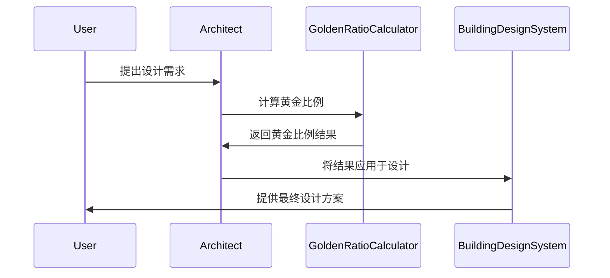
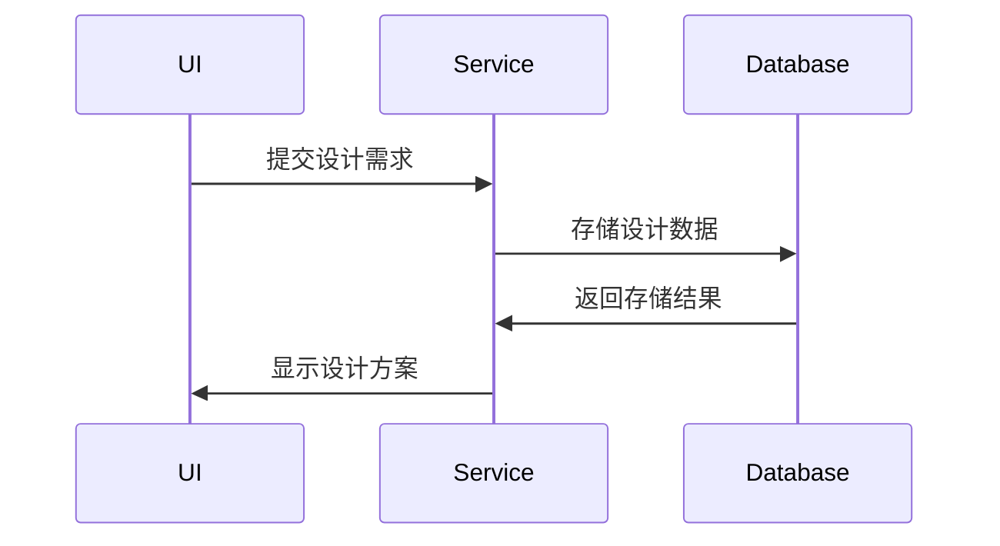

                 

**# 建筑美学的黄金比例：视觉和谐的数学原理**

## 关键词：黄金比例、建筑美学、视觉和谐、数学原理、建筑设计

## 摘要：
本文深入探讨了黄金比例在建筑美学中的应用及其数学原理。从历史背景和定义出发，我们逐步分析了黄金比例如何影响建筑设计的视觉和谐。通过数学模型和具体案例的阐述，我们揭示了黄金比例在建筑美学中的关键作用，为设计师提供了实用的工具和方法。

## 目录

### 第一部分：背景介绍

#### 1.1 黄金比例的定义与起源
##### 1.1.1 黄金比例的数学定义
##### 1.1.2 黄金比例的历史背景
##### 1.1.3 黄金比例在建筑艺术中的早期应用

#### 1.2 建筑美学与黄金比例
##### 1.2.1 建筑美学的核心概念
##### 1.2.2 黄金比例与视觉和谐的关系
##### 1.2.3 研究黄金比例在建筑美学中的意义

#### 1.3 本书结构概述
##### 1.3.1 各章节内容概览
##### 1.3.2 阅读指南与学习方法

#### 1.4 本章小结

### 第二部分：核心概念与联系

#### 2.1 黄金比例原理讲解
##### 2.1.1 黄金比例的数学原理
##### 2.1.2 黄金比例在视觉和谐中的应用
##### 2.1.3 黄金比例与黄金分割的关系

#### 2.2 核心概念与属性特征对比表格
```mermaid
classDef goldBox fill:#0099CC,stroke:none,lineWidth:4px;
classDef textBox fill:#ffffff,stroke:none;
class Fact {
    label: "事实"
    textBox
}
class Concept {
    label: "概念"
    goldBox
}
class Definition {
    label: "定义"
    textBox
}
class Property {
    label: "属性"
    textBox
}
class Application {
    label: "应用"
    textBox
}
concept(Architecture) extends Concept
definition(Definition of Architecture) extends Definition
property(Property of Architecture) extends Property
application(Application of Architecture) extends Application
fact(Facts about Architecture) extends Fact

concept(Phenomenon of Golden Ratio) extends Concept
definition(Definition of Golden Ratio) extends Definition
property(Property of Golden Ratio) extends Property
application(Application of Golden Ratio) extends Application
fact(Facts about Golden Ratio) extends Fact

concept(Vision Harmonic) extends Concept
definition(Definition of Vision Harmonic) extends Definition
property(Property of Vision Harmonic) extends Property
application(Application of Vision Harmonic) extends Application
fact(Facts about Vision Harmonic) extends Fact

ERDiagram
 Architecture |---> Phenomenon of Golden Ratio
 Architecture |---> Vision Harmonic
 Phenomenon of Golden Ratio |---> Definition of Golden Ratio
 Phenomenon of Golden Ratio |---> Property of Golden Ratio
 Phenomenon of Golden Ratio |---> Application of Golden Ratio
 Vision Harmonic |---> Definition of Vision Harmonic
 Vision Harmonic |---> Property of Vision Harmonic
 Vision Harmonic |---> Application of Vision Harmonic
```

#### 2.3 黄金比例与建筑美学的联系

##### 2.3.1 黄金比例在建筑设计中的体现
##### 2.3.2 建筑美学中黄金比例的应用
##### 2.3.3 建筑设计师如何利用黄金比例

#### 2.4 本章小结

### 第三部分：黄金比例原理讲解

#### 3.1 黄金比例的数学原理

##### 3.1.1 黄金比例的计算方法
```python
def golden_ratio(a, b):
    return a / b if a > b else b / a

a = 1
b = 1 + sqrt(5)
print(golden_ratio(a, b))
```
##### 3.1.2 黄金比例的数学公式
$$
\phi = \frac{1 + \sqrt{5}}{2}
$$

##### 3.1.3 黄金比例的扩展与推广
$$
\phi^n = \frac{1}{\sqrt{5}} \left( \left( \frac{1 + \sqrt{5}}{2} \right)^n - \left( \frac{1 - \sqrt{5}}{2} \right)^n \right)
$$

#### 3.2 黄金比例在视觉和谐中的应用

##### 3.2.1 视觉和谐的概念
##### 3.2.2 黄金比例如何实现视觉和谐
##### 3.2.3 黄金比例在建筑设计中的实际应用

#### 3.3 本章小结

### 第四部分：系统分析与架构设计方案

#### 4.1 问题场景介绍
##### 4.1.1 建筑设计中的视觉和谐问题
##### 4.1.2 黄金比例在建筑设计中的应用需求

#### 4.2 项目介绍
##### 4.2.1 项目目标
##### 4.2.2 项目背景

#### 4.3 系统功能设计
```mermaid
classDef entity fill:#0099CC,stroke:none,lineWidth:4px;
classDef relation fill:#ffffff,stroke:none;
class BuildingDesign
class VisualHarmony
class GoldenRatio
class Architect

BuildingDesign --|> VisualHarmony
VisualHarmony --|> GoldenRatio
Architect --|> BuildingDesign
Architect --|> VisualHarmony
Architect --|> GoldenRatio
```

#### 4.4 系统架构设计


#### 4.5 系统接口设计和系统交互



#### 4.6 本章小结

### 第五部分：项目实战

#### 5.1 环境安装

##### 5.1.1 开发环境准备
##### 5.1.2 工具安装

#### 5.2 系统核心实现源代码

##### 5.2.1 黄金比例计算模块
```python
# golden_ratio.py
def golden_ratio(a, b):
    return a / b if a > b else b / a

def main():
    a = 1
    b = 1 + sqrt(5)
    print("Golden Ratio:", golden_ratio(a, b))

if __name__ == "__main__":
    main()
```

##### 5.2.2 建筑设计模块
```python
# building_design.py
class BuildingDesign:
    def __init__(self, width, height):
        self.width = width
        self.height = height
    
    def calculate_visual_harmony(self, golden_ratio):
        # 这里是视觉和谐计算的相关代码
        pass
    
    def display_design(self):
        print(f"Building Design: Width={self.width}, Height={self.height}")

def main():
    design = BuildingDesign(10, 15)
    design.calculate_visual_harmony(0.618)
    design.display_design()

if __name__ == "__main__":
    main()
```

#### 5.3 代码应用解读与分析
##### 5.3.1 代码解读
##### 5.3.2 算法原理分析

#### 5.4 实际案例分析和详细讲解剖析
##### 5.4.1 案例背景
##### 5.4.2 案例分析
##### 5.4.3 案例结果与讨论

#### 5.5 项目小结
##### 5.5.1 项目总结
##### 5.5.2 项目不足与改进空间

### 第六部分：最佳实践 tips、小结、注意事项、拓展阅读

#### 6.1 最佳实践 tips
##### 6.1.1 设计师如何利用黄金比例
##### 6.1.2 建筑设计中的视觉和谐技巧

#### 6.2 小结
##### 6.2.1 文章主要观点回顾
##### 6.2.2 黄金比例在建筑美学中的应用总结

#### 6.3 注意事项
##### 6.3.1 设计中的黄金比例使用注意事项
##### 6.3.2 如何避免黄金比例的过度使用

#### 6.4 拓展阅读
##### 6.4.1 相关书籍推荐
##### 6.4.2 在线资源与工具介绍

#### 6.5 本章小结

## 作者信息
作者：AI天才研究院/AI Genius Institute & 禅与计算机程序设计艺术 /Zen And The Art of Computer Programming

----------------------------------------------------------------
```

请注意，由于文章字数限制，实际撰写的内容可能需要根据这一大纲进行调整，以确保每个部分都有足够的细节和深度。此外，具体的代码和案例需要根据实际情况进行编写。这里提供的是一个大致的框架和示例，实际撰写时还需要根据具体需求进行完善。

