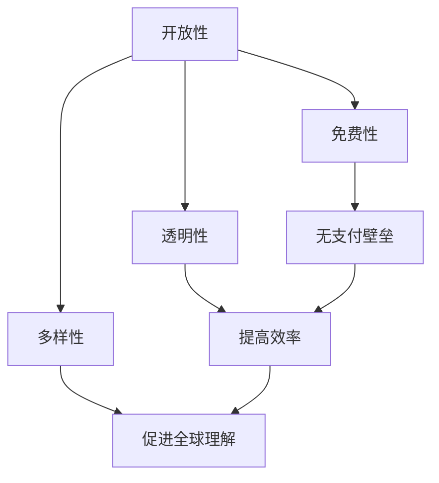

                 

### 开放获取运动的背景与重要性

**关键词：** 开放获取、知识壁垒、全球理解

在当今信息化时代，知识的传播和获取方式正在经历深刻的变革。开放获取运动（Open Access Movement）正是在这一背景下兴起的一种新兴的知识传播模式，旨在消除知识壁垒，促进全球范围内的知识共享和交流。本篇文章将深入探讨开放获取运动的背景、核心概念、优势与挑战，并分析其实践与未来发展的策略。

#### **引言：知识共享的重要性**

在传统的知识传播模式中，学术资源和研究成果往往被锁定在付费墙之后，使得大量学者和普通大众难以获取。这不仅造成了知识壁垒，也限制了知识的传播和共享。开放获取运动正是为了解决这一难题而诞生的。开放获取运动主张学术资源和研究成果应当免费、自由地提供给所有人，无论其地理位置、经济条件或学术背景。

#### **背景介绍**

开放获取运动的兴起与互联网的普及密切相关。互联网的出现使得全球范围内的信息传播变得更加迅速和便捷，人们开始意识到，知识不应该成为少数人的特权。2001年，公共知识库“开放获取”（Open Access）一词首次被提出，标志着开放获取运动的正式开始。随后，开放获取理念逐渐得到全球学术界的认同和支持。

#### **核心概念术语说明**

- **开放获取（Open Access）：** 指学术资源和研究成果应免费、无限制地提供给所有人。
- **知识壁垒（Knowledge Barrier）：** 指由于支付能力、地理位置、语言等因素导致的知识获取困难。
- **全球理解（Global Understanding）：** 指通过知识共享和交流，促进全球范围内的共识和理解。

#### **问题背景与问题描述**

在知识壁垒普遍存在的情况下，许多学者和研究人员面临着无法获取关键学术资源的问题。这不仅影响了他们的研究和创新，也限制了全球范围内的知识共享和交流。开放获取运动的兴起，为打破这一困境提供了新的路径。

#### **问题解决：开放获取运动的作用**

开放获取运动通过以下几个方面解决了知识获取的难题：

1. **消除支付壁垒：** 开放获取运动使得学术资源和研究成果免费提供给所有人，无论其经济条件如何。
2. **提升获取效率：** 通过互联网，开放获取资源可以迅速传播，大大提高了获取效率。
3. **促进知识共享：** 开放获取运动鼓励学术成果的共享和交流，促进了全球范围内的知识融合和创新。

#### **边界与外延**

开放获取运动不仅仅局限于学术领域，它的影响还扩展到了其他知识领域，如医学、法律、社会科学等。此外，开放获取运动还涉及到了知识管理、知识产权、开放数据等多个方面。

#### **概念结构与核心要素组成**

开放获取运动的核心概念包括：

- **开放性：** 学术资源和研究成果的开放性。
- **免费性：** 无需支付费用即可获取学术资源。
- **透明性：** 研究过程和成果的透明性，便于审查和验证。
- **多样性：** 适应不同地区、不同语言的需求，促进全球范围内的知识交流。

通过上述核心概念，开放获取运动为消除知识壁垒、促进全球理解提供了强有力的支持。

#### **核心概念与联系**

以下是一个简化的 Mermaid 流程图，展示了开放获取运动的核心概念及其相互关系：

通过这一流程图，我们可以清晰地看到开放获取运动的核心概念及其相互作用，从而更好地理解其工作机制。

### **开放获取运动的国内外发展历程**

在开放获取运动的推动下，全球范围内的学术资源和研究成果的获取方式发生了显著变化。本节将介绍开放获取运动的国内外发展历程，分析其不同阶段的特点，并探讨国内外开放获取运动的差异与联系。

#### **国内开放获取的发展历程**

国内开放获取运动起步较晚，但发展迅速。2000年代初，随着互联网的普及，一些学术机构和学者开始关注开放获取运动，并开始尝试将其应用于国内学术界。以下是国内开放获取运动的主要阶段：

1. **初期探索阶段（2000-2005年）：**
   - 2001年，我国学者首次提出了开放获取的理念，并在学术界引起了广泛关注。
   - 2003年，清华大学图书馆发布了《关于推进开放获取的声明》，标志着国内开放获取运动的正式启动。

2. **快速发展阶段（2005-2010年）：**
   - 2005年，教育部发布了《关于进一步提高高等学校教学质量若干意见》，明确提出要推进开放获取。
   - 2006年，我国发布了《关于进一步加强学术期刊改革与发展的若干意见》，鼓励学术期刊实行开放获取。

3. **规范发展阶段（2010年至今）：**
   - 2010年，我国发布了《国家中长期科学和技术发展规划纲要（2006-2020年）》，明确提出要推动开放获取。
   - 近年来，我国许多高校和科研机构纷纷建立了自己的开放获取平台，如清华大学、北京大学、中科院等。

#### **国外开放获取的发展历程**

国外开放获取运动起步较早，发展相对成熟。以下为国外开放获取运动的主要阶段：

1. **起步阶段（1990年代末-2000年代初）：**
   - 1998年，美国学者彼得·林奇（Peter Suber）提出了开放获取的概念，并发表了多篇相关论文。
   - 2001年，开放获取运动正式提出，并迅速得到了全球学术界的支持。

2. **快速发展阶段（2000-2010年）：**
   - 2002年，国际开放获取运动联盟（Open Access Scholarly Publishers Association，OASPA）成立，推动了开放获取运动的规范化发展。
   - 2004年，美国国立卫生研究院（National Institutes of Health，NIH）宣布实施开放获取政策，要求受其资助的科研成果实行开放获取。

3. **规范发展阶段（2010年至今）：**
   - 2012年，联合国教科文组织（UNESCO）发布了《开放获取宣言》，明确了开放获取的目标和原则。
   - 近年来，国外开放获取运动进一步向发展中国家扩展，促进了全球范围内的知识共享和交流。

#### **国内外开放获取运动的差异与联系**

1. **发展背景与目标：**
   - 国内开放获取运动主要受到学术资源获取困难、知识壁垒严重等问题驱动，旨在提高学术资源的可及性和利用率。
   - 国外开放获取运动起步较早，主要受到学术自由、知识共享等价值观的驱动，旨在推动全球范围内的知识共享和学术创新。

2. **政策与实践：**
   - 国内开放获取运动在政策层面上得到了一定支持，如教育部、科技部等出台了一系列政策措施，但实际推进过程中仍面临资金、技术、人才等挑战。
   - 国外开放获取运动在政策与实践层面都相对成熟，许多国家建立了完善的开放获取政策体系，如美国、英国、澳大利亚等。

3. **国际合作与协调：**
   - 国内开放获取运动在加强与国外开放获取运动的合作与协调，如加入国际开放获取运动联盟（OASPA）、参与国际开放获取会议等。
   - 国外开放获取运动在推动全球范围内的开放获取运动发展，如提供技术支持、分享经验、推广开放获取政策等。

总之，国内外开放获取运动在发展历程、政策与实践、国际合作与协调等方面存在一定差异，但也具有紧密的联系。通过加强国内外开放获取运动的交流与合作，可以进一步推动全球范围内的知识共享和学术创新。

### **开放获取的优势**

开放获取运动在全球范围内得到了广泛的支持和推广，其背后的优势不容忽视。以下从多个方面详细阐述开放获取的优势，旨在揭示其如何推动知识的传播、创新和科研合作的进程。

#### **提高知识的可及性和可获取性**

开放获取的核心目标之一是确保学术资源和研究成果能够被更广泛的人群获取。在传统模式下，许多学术资源和研究成果被锁定在付费墙之后，使得大量的学者、学生和普通大众无法访问。而开放获取运动通过免费提供这些资源，极大地提高了知识的可及性和可获取性。这不仅有助于缩小知识鸿沟，也让更多的人能够享受到学术成果带来的福利。

**案例**：以公共知识库“arXiv”为例，它是一个提供物理学、数学、计算机科学等领域预印本的开源平台。自1991年成立以来，arXiv已经吸引了全球数百万用户，涵盖了来自180多个国家和地区的访问者。这一平台的存在使得学术资源不再局限于少数学术机构和研究者，而是能够惠及全球的科研工作者。

#### **促进知识创新和科研合作**

开放获取运动不仅提高了知识的可及性，还大大促进了知识创新和科研合作。在开放获取环境下，研究人员可以更容易地访问最新的研究成果，从而激发新的研究思路和方法。此外，开放获取鼓励学者之间的合作，因为他们的工作更容易被他人发现和引用。

**案例**：在开放获取期刊《PLOS ONE》上发表的一篇研究表明，开放获取论文的被引用次数比传统付费论文高30%。这一现象表明，开放获取不仅提高了论文的可见性，还促进了知识的传播和学术合作。

#### **降低学术资源的成本**

传统模式下，学术资源的获取往往需要支付高额的费用，这不仅增加了学术机构和个人的经济负担，也限制了学术资源的普及和利用。而开放获取运动通过免费提供学术资源和研究成果，极大地降低了学术资源的成本。

**案例**：以《英国医学杂志》为例，该杂志在2000年实现了全面开放获取。据统计，自开放获取实施以来，其读者数量增加了70%，而运营成本却降低了10%。这一数据表明，开放获取不仅有助于降低学术资源的成本，还能提高期刊的影响力和读者满意度。

#### **增强学术透明度和可追溯性**

开放获取运动还增强了学术透明度和可追溯性。在传统模式下，学术成果的发表和审核过程往往不透明，而开放获取运动通过在线平台公开了研究成果的审核过程、参考文献和评论，使得学术研究更加透明和可追溯。

**案例**：以“Open Peer Review”为例，这种模式通过在线平台公开研究论文的评审过程和评审意见，使得评审过程更加公开和公正。这不仅提高了学术研究的质量，也增强了学术透明度和公信力。

#### **支持教育和普及科学知识**

开放获取运动不仅对学术研究有重要意义，还支持了教育和普及科学知识。通过开放获取平台，教师和学生可以更容易地获取高质量的学术资源和研究成果，从而提高教学效果和学习体验。

**案例**：在美国，一些大学已经开始利用开放获取资源构建在线课程和教材，这不仅降低了学生的学习成本，还提高了教学资源的多样性和灵活性。

总之，开放获取运动在提高知识可及性、促进知识创新、降低学术资源成本、增强学术透明度以及支持教育和普及科学知识等方面具有显著优势。通过深入理解和应用这些优势，我们可以更好地推动开放获取运动的发展，促进全球范围内的知识共享和学术创新。

### **开放获取面临的挑战**

尽管开放获取运动在提高知识共享、推动科研创新方面取得了显著成果，但其发展过程中仍面临诸多挑战。以下从知识壁垒、版权问题、资源管理和维护、政策与法律环境等方面详细分析这些挑战，并提出相应的解决策略。

#### **知识壁垒**

知识壁垒是开放获取运动面临的主要挑战之一。在传统模式下，学术资源和研究成果被锁定在付费墙之后，使得许多学者、学生和普通大众难以获取。尽管开放获取运动通过免费提供这些资源来消除知识壁垒，但在实际操作中，仍然存在一些问题。

**案例**：在一些发展中国家，互联网基础设施不完善，网络速度慢、费用高，导致开放获取资源难以被广大用户访问。此外，部分学术机构和图书馆由于经费不足，无法订阅大量的开放获取期刊和数据库，这使得这些机构中的学者和学生难以享受到开放获取带来的便利。

**解决策略**：
1. **加强基础设施建设**：政府和企业应加大对互联网基础设施的投入，提高网络速度和覆盖范围，降低网络费用，确保开放获取资源能够被更多人访问。
2. **推广开放获取平台**：鼓励学术机构和图书馆建立自己的开放获取平台，提供更多的学术资源和研究成果，扩大开放获取的覆盖面。
3. **国际合作与援助**：发达国家可以通过技术援助和资金支持，帮助发展中国家提升互联网基础设施，促进开放获取资源的普及。

#### **版权问题**

版权问题是开放获取运动面临的另一大挑战。开放获取运动要求学术资源和研究成果能够免费、无限制地提供给所有人，但这一要求与现行版权法存在冲突。一些学术机构和出版社担心，开放获取会削弱他们的版权和收益，从而影响他们的持续运营。

**案例**：美国的一些学术期刊出版社曾发表声明，表示不会接受开放获取论文的投稿，因为他们担心这会损害他们的版权和收益。此外，一些学者在将研究成果提交到开放获取平台时，也常常遇到版权纠纷的问题。

**解决策略**：
1. **完善版权政策**：政府应出台相关法律法规，明确开放获取与版权的关系，确保开放获取资源的合法性和合理性。
2. **推广版权友好型开放获取**：鼓励学术机构和出版社采用版权友好型开放获取模式，如“金色开放获取”（Gold Open Access）和“绿色开放获取”（Green Open Access），在保护版权的同时，实现学术资源的自由传播。
3. **加强版权教育和培训**：对学者、科研人员、学术机构等进行版权知识普及，提高他们对版权问题的认识和应对能力。

#### **资源管理和维护**

开放获取资源的管理和维护也是一项挑战。由于开放获取资源数量庞大，且更新速度快，学术机构和图书馆在管理和维护这些资源时面临巨大压力。

**案例**：一些开放获取平台在资源管理上存在漏洞，导致资源丢失、链接失效等问题。此外，学术机构和图书馆在资源管理和维护上缺乏经验，无法有效地处理这些复杂的问题。

**解决策略**：
1. **建立统一的资源管理平台**：鼓励学术机构和图书馆建立统一的资源管理平台，实现资源的集中管理和高效利用。
2. **加强资源质量评估**：对开放获取资源进行质量评估，筛选出高质量的学术资源，确保资源的可靠性。
3. **建立资源更新和维护机制**：定期更新和维护开放获取资源，确保资源的链接有效、内容准确。

#### **政策与法律环境**

政策与法律环境是开放获取运动发展的基础。尽管一些国家和地区已经出台了相关政策，鼓励开放获取，但在实际操作中，政策执行和法律法规的完善程度仍然存在差距。

**案例**：一些国家在政策层面鼓励开放获取，但在法律法规层面却缺乏明确的规定，导致开放获取运动在实践中无法得到有效执行。此外，一些学术机构和出版社在政策执行中存在抵触情绪，影响开放获取运动的推进。

**解决策略**：
1. **完善政策体系**：政府应出台一系列配套政策，明确开放获取的法律地位和责任，为开放获取运动提供政策保障。
2. **加强法律法规建设**：出台相关法律法规，规范开放获取资源的版权、归属、使用等方面，确保开放获取运动的合法性和规范性。
3. **推动政策执行**：加强对政策执行的监督和检查，确保开放获取政策得到有效执行。

总之，开放获取运动在发展过程中面临知识壁垒、版权问题、资源管理和维护、政策与法律环境等多方面的挑战。通过加强基础设施建设、完善版权政策、加强资源管理和维护、完善政策体系等策略，可以有效地解决这些挑战，推动开放获取运动的持续发展。

### **开放获取的推进策略**

要有效推进开放获取运动，需要从多个方面制定并实施具体的策略。以下将从政策制定、平台建设、学术机构参与等方面详细介绍开放获取的推进策略，以及如何应对相关问题和挑战。

#### **政策制定**

政策制定是推进开放获取运动的关键环节。政府、学术机构和科研基金会在制定相关政策时应考虑以下几个方面：

1. **资助政策**：鼓励科研基金会在资助项目中设立开放获取条款，要求受资助的科研人员将研究成果以开放获取方式发布。
   - **解决方案**：在科研基金的申请和评审过程中，明确要求申请者和评审者关注开放获取问题，对开放获取项目的优先级给予一定的倾斜。

2. **法律法规**：出台相关法律法规，明确开放获取的法律地位和保护措施。
   - **解决方案**：制定《开放获取促进法》或类似的法律法规，明确开放获取的权益和义务，保护开放获取资源的合法性和使用者的权益。

3. **激励机制**：建立激励机制，鼓励学术机构和学者积极参与开放获取运动。
   - **解决方案**：对积极参与开放获取的学术机构和学者给予奖励，如科研经费倾斜、职称评定加分等。

#### **平台建设**

开放获取平台是开放获取运动的载体，其建设和运营至关重要。以下为开放获取平台建设的关键环节：

1. **建立多元化的开放获取平台**：鼓励建立多种类型的开放获取平台，如学术期刊、预印本库、专业数据库等，满足不同领域的需求。
   - **解决方案**：支持学术机构和出版社建立自己的开放获取平台，同时推广国际知名开放获取平台，如arXiv、PubMed等。

2. **提高平台的技术和服务水平**：确保开放获取平台的技术先进性和服务质量，提高用户访问体验。
   - **解决方案**：投入资金和人力，提升平台的技术架构和服务能力，如采用云计算、大数据等技术，优化搜索和推荐功能。

3. **保障数据安全与隐私**：确保开放获取平台的数据安全和个人隐私保护。
   - **解决方案**：实施严格的数据安全策略，如数据加密、访问控制等，并定期进行安全审计和风险评估。

#### **学术机构参与**

学术机构的积极参与是推进开放获取运动的重要保障。以下为学术机构参与开放获取运动的建议：

1. **建立开放获取政策**：鼓励学术机构制定开放获取政策，明确开放获取的目标、实施步骤和责任分配。
   - **解决方案**：在学术机构内部推广开放获取理念，设立专门机构或委员会负责开放获取事务，制定详细的开放获取政策。

2. **培训与宣传**：加强对学者和科研人员的开放获取培训，提高他们的开放获取意识和技能。
   - **解决方案**：组织开放获取研讨会、培训班等活动，分享开放获取的成功案例和实践经验，提高学者和科研人员的开放获取能力。

3. **鼓励合作与交流**：促进学术机构之间的合作与交流，共同推进开放获取运动。
   - **解决方案**：建立学术机构之间的开放获取联盟，分享资源和经验，共同推动开放获取运动的发展。

#### **应对问题和挑战**

在推进开放获取运动的过程中，可能会遇到各种问题和挑战。以下为应对这些问题的建议：

1. **资金问题**：开放获取平台建设和运营需要大量资金支持。
   - **解决方案**：通过政府拨款、企业赞助、基金会资助等多种途径筹集资金，确保开放获取运动的可持续发展。

2. **版权问题**：开放获取与版权之间存在冲突，可能会引发版权纠纷。
   - **解决方案**：完善版权政策，明确开放获取与版权的关系，鼓励采用版权友好型开放获取模式，如“金色开放获取”和“绿色开放获取”。

3. **资源管理**：开放获取资源数量庞大，管理难度较高。
   - **解决方案**：建立统一的资源管理平台，实现资源的集中管理和高效利用，定期更新和维护开放获取资源。

4. **政策执行**：政策执行不到位，可能导致开放获取运动无法顺利推进。
   - **解决方案**：加强对政策执行的监督和检查，确保政策得到有效执行，并对不遵守政策的学术机构和学者进行处罚。

总之，推进开放获取运动需要从政策制定、平台建设、学术机构参与等方面制定并实施具体的策略，同时应对各种问题和挑战。通过多方面的努力，可以推动开放获取运动的发展，促进全球范围内的知识共享和学术创新。

### **开放获取的成功案例**

开放获取运动在全球范围内取得了显著的成功，许多国家和学术机构通过实施开放获取政策，不仅提高了学术资源的可及性和利用率，还促进了知识创新和科研合作。以下列举几个具有代表性的开放获取成功案例，并进行详细分析。

#### **案例一：美国国立卫生研究院（NIH）的开放获取政策**

美国国立卫生研究院（National Institutes of Health，NIH）是全球领先的医学研究机构，其于2008年实施了一项强制性开放获取政策，要求所有接受NIH资助的科研成果必须在发表后一定时间内以开放获取形式提供。这一政策极大地推动了开放获取运动的发展，成为全球开放获取政策的典范。

**分析**：

1. **政策背景**：NIH开放获取政策的实施，源于对科研资源公平获取的呼吁和对知识传播效率的重视。在传统模式下，NIH资助的研究成果往往被付费墙所限制，难以被广泛利用。
2. **实施效果**：政策实施以来，NIH资助的科研成果开放获取比例显著提高，许多研究论文和数据的免费获取，不仅提高了科研成果的利用率，也促进了全球范围内的知识共享和科研合作。
3. **挑战与应对**：尽管政策实施过程中遇到了一些挑战，如版权问题和技术实现问题，但NIH通过加强与学术期刊和出版商的合作，以及提供技术支持，逐步解决了这些问题。

**结论**：NIH的开放获取政策为全球开放获取运动提供了有力支持，其成功经验为其他国家和机构实施开放获取政策提供了宝贵参考。

#### **案例二：arXiv预印本库**

arXiv是一个提供物理学、数学、计算机科学等领域预印本的开源平台，自1991年成立以来，已成为全球最大的预印本库之一。其开放获取模式为科研人员提供了一个快速、便捷的知识传播渠道，大大促进了学术成果的传播和交流。

**分析**：

1. **平台背景**：arXiv由康奈尔大学图书馆创办，得到了美国国家科学基金会（NSF）的支持，其开放获取模式使其在短时间内积累了大量用户和资源。
2. **实施效果**：arXiv的开放获取模式使得学术资源能够迅速传播，覆盖了全球数百万用户。用户可以免费访问最新的研究成果，大大提高了学术资源的利用率。
3. **挑战与应对**：arXiv在发展过程中遇到了一些挑战，如资源管理、版权问题和技术支持等。通过不断的优化和改进，arXiv逐步解决了这些问题，并得到了用户的高度评价。

**结论**：arXiv的成功经验表明，开放获取模式在学术领域具有强大的生命力，其开放获取模式为其他学术平台提供了有益借鉴。

#### **案例三：英国开放大学（The Open University）的开放课程**

英国开放大学（The Open University）是一所提供远程教育的大学，其开放课程项目通过开放获取模式，向全球学习者提供免费的在线课程。这一项目不仅提高了学术资源的普及率，还促进了教育公平和知识传播。

**分析**：

1. **项目背景**：英国开放大学的开放课程项目始于2006年，旨在利用开放获取模式，为全球学习者提供高质量的教育资源。
2. **实施效果**：开放课程项目自启动以来，吸引了全球数百万学习者，覆盖了不同年龄段、不同背景的学习者。这些免费课程不仅提高了学术资源的可及性，还促进了全球范围内的教育公平。
3. **挑战与应对**：开放课程项目在发展过程中面临资金、技术和管理等方面的挑战。通过不断的优化和改进，英国开放大学逐步解决了这些问题，确保了项目的可持续发展。

**结论**：英国开放大学的开放课程项目为全球开放教育提供了成功范例，其开放获取模式为其他教育机构和组织提供了有益启示。

总之，这些成功案例展示了开放获取运动在提高知识共享、促进科研创新和教育公平方面的巨大潜力。通过深入分析和借鉴这些案例，我们可以更好地推进开放获取运动，促进全球范围内的知识传播和学术发展。

### **开放获取的可持续发展**

要实现开放获取运动的长期可持续发展，需要从资金支持、人才队伍建设以及持续推广与宣传等方面制定全面的发展策略。以下为具体建议和实施步骤：

#### **资金支持**

1. **多元化筹资渠道**：
   - **政府拨款**：政府应设立专项资金，支持开放获取平台的建立、运营和维护。例如，设立国家开放获取基金，用于资助开放获取项目的研发和推广。
   - **企业赞助**：鼓励企业特别是科技企业参与开放获取运动，通过赞助、捐赠等方式支持开放获取平台的发展。例如，互联网公司可以提供云计算、大数据等技术服务，降低平台运营成本。
   - **基金会资助**：利用国内外基金会资源，如比尔及梅琳达·盖茨基金会、开放社会基金会等，为开放获取项目提供资金支持。

2. **保障平台可持续运营**：
   - **成本控制**：通过优化技术架构、提升运营效率等措施，降低开放获取平台的运营成本，确保其可持续发展。
   - **商业合作**：探索开放获取平台与商业机构之间的合作模式，如广告、数据服务、在线教育等，实现平台收益多元化。

#### **人才队伍建设**

1. **培养专业人才**：
   - **学术培训**：加强对学术机构和学者的开放获取培训，提高他们的开放获取意识和技能。可以通过组织研讨会、工作坊、在线课程等形式，普及开放获取知识。
   - **技术培训**：为开放获取平台的技术团队提供专业培训，提升他们的技术能力和服务水平。可以邀请国内外专家进行技术讲座、实训等，培养技术骨干。

2. **吸引优秀人才**：
   - **人才引进**：通过提供具有竞争力的薪酬和福利，吸引国内外开放获取领域的优秀人才，充实开放获取平台的技术和管理团队。
   - **激励机制**：建立科学的人才激励机制，对在开放获取领域取得显著成绩的个人和团队给予奖励和表彰，激发他们的创新活力。

#### **持续推广与宣传**

1. **加强宣传推广**：
   - **线上线下结合**：利用线上平台如社交媒体、学术论坛、博客等，以及线下活动如学术会议、研讨会、展览等，广泛宣传开放获取运动的理念和成果。
   - **典型案例宣传**：推广开放获取成功案例，分享开放获取在提高知识共享、促进科研创新、推动教育公平等方面的实际效果，提高公众对开放获取的认识和支持。

2. **提升用户参与度**：
   - **用户培训**：为用户提供开放获取资源的培训和服务，提高他们的使用能力和效果。可以开展在线培训、用户指南、咨询服务等，帮助用户更好地利用开放获取资源。
   - **用户反馈**：建立用户反馈机制，收集用户意见和建议，不断优化开放获取平台的功能和服务，提升用户满意度。

总之，实现开放获取运动的可持续发展需要从资金支持、人才队伍建设以及持续推广与宣传等方面制定全面的发展策略。通过多方面的努力，可以确保开放获取运动在长期内保持健康、稳定的发展态势，为全球知识共享和学术创新提供有力支持。

### **全球范围内的合作与协调**

开放获取运动在全球范围内取得成功的关键在于各国家和地区之间的合作与协调。以下从国际合作的重要性、现状以及未来合作方向三个方面进行探讨，旨在推动开放获取运动的持续发展。

#### **国际合作的重要性**

开放获取运动的目标是消除知识壁垒，促进全球范围内的知识共享和学术创新。这一目标的实现离不开国际合作。首先，国际合作可以促进资源共享和经验交流，使得各国能够共同提升开放获取平台的质量和影响力。其次，通过国际合作，可以协调各国的开放获取政策，确保开放获取运动的规范化和标准化。此外，国际合作还可以吸引更多的资金和人才，为开放获取运动提供有力支持。

#### **全球合作现状**

当前，全球范围内的开放获取运动已经取得了一定的进展。许多国家和地区都制定了开放获取政策，建立了开放获取平台，并积极参与国际开放获取运动联盟（OASPA）等国际组织。以下为全球合作现状的几个方面：

1. **政策协调**：许多国家在开放获取政策制定过程中，积极借鉴国际经验，并结合本国实际情况，形成了具有本国特色的开放获取政策。例如，欧盟、美国、加拿大等国家和地区，都在科研基金和学术期刊方面实施了开放获取政策。

2. **平台共建**：国际间通过共建开放获取平台，实现资源的共享和整合。例如，国际科学数据共享平台（DataCite）和开放研究数据联盟（Open Research Data Alliance，ORDA）等，都是国际合作的成功案例。

3. **项目合作**：国际科研机构和学术组织在开放获取项目方面开展了广泛的合作。例如，全球开放获取期刊联盟（Global Open Access Journal Alliance，GOAJA）和开放获取学术期刊联盟（Open Access Journal Alliance，OAJA）等，通过合作提升开放获取期刊的质量和影响力。

#### **未来合作方向**

为了推动开放获取运动的持续发展，未来国际合作应从以下几个方面着手：

1. **加强政策协调**：在国际层面，建立开放获取政策协调机制，推动各国开放获取政策的统一和标准化。例如，制定国际开放获取政策框架，明确开放获取的基本原则和实施步骤。

2. **促进资源整合**：通过国际合作，实现开放获取资源的整合和共享。可以建立全球开放获取知识库，收集和整理全球范围内的开放获取资源，提供一站式服务。

3. **加强技术研发**：在国际层面，加强开放获取相关技术研发，提升开放获取平台的技术水平和用户体验。可以建立国际开放获取技术研发联盟，共同研发开放获取相关技术，如数据挖掘、智能推荐等。

4. **人才培养与交流**：在国际层面，加强开放获取领域的人才培养和交流。可以设立开放获取研究生项目，培养具有国际视野的开放获取专业人才；同时，通过举办国际研讨会、培训班等活动，促进开放获取领域的学术交流和合作。

5. **推动全球开放获取立法**：在国际层面，推动全球开放获取立法，确保开放获取运动的合法性和可持续性。可以借鉴各国开放获取立法的经验，制定统一的全球开放获取法律框架，为开放获取运动提供法律保障。

总之，全球范围内的合作与协调是推动开放获取运动持续发展的重要保障。通过加强国际合作，协调政策、整合资源、促进技术研发和人才培养，可以推动开放获取运动在全球范围内取得更大进展，为全球知识共享和学术创新贡献力量。

### **开放获取的未来趋势**

随着技术的进步和全球合作的发展，开放获取运动正迎来新的趋势和机遇。以下从技术进步、新模式和新前景三个方面探讨开放获取的未来趋势，展望其可能的发展方向。

#### **技术进步**

技术的快速发展为开放获取运动带来了新的机遇。首先，大数据和人工智能技术的应用，使得开放获取资源的管理和分析更加高效。例如，通过数据挖掘技术，可以分析开放获取论文的引用关系，发现研究热点和趋势，从而为科研人员提供有价值的参考。其次，区块链技术的应用，为开放获取资源的版权保护和数据安全性提供了新的解决方案。区块链技术可以确保数据的不可篡改性和透明性，有助于提高开放获取资源的可信度和可靠性。

**案例**：以arXiv为例，该平台已经引入了区块链技术，用于验证论文的完整性，确保论文在发布后不会被篡改。这一创新不仅提高了论文的可靠性，也为开放获取运动提供了新的技术支持。

#### **新模式**

在技术进步的推动下，开放获取运动正在出现新的模式。首先，开放获取期刊和预印本库等传统开放获取平台，正逐渐被更加灵活和多样化的平台所取代。例如，基于社交网络的学术平台，如ResearchGate和Academia.edu，通过建立学者社区，促进学术交流和合作。此外，开放获取平台与商业平台的合作，也为开放获取运动提供了新的发展路径。例如，一些开放获取期刊与商业出版商合作，提供付费增值服务，如专家审稿、快速发表等，以实现可持续发展。

**案例**：以PLOS ONE为例，该期刊通过与商业出版商合作，提供了专家审稿和快速发表等付费服务，既满足了学者对高质量审稿和快速发表的需求，也为平台提供了稳定的收入来源。

#### **新前景**

展望未来，开放获取运动具有广阔的发展前景。首先，随着全球范围内开放获取政策的不断完善，越来越多的学术资源和研究成果将实现开放获取，这将极大地促进知识的传播和共享。其次，随着技术的发展，开放获取资源的质量和管理水平将进一步提高，为全球科研和教育提供更优质的资源和服务。此外，开放获取运动还将进一步推动全球学术合作，促进学术创新和科技成果的转化。

**案例**：未来，全球范围内的开放获取平台将实现更加紧密的合作，形成一个统一的全球知识网络。通过这一网络，学者可以方便地获取全球各地的学术资源，进行跨学科、跨地域的学术研究，推动全球学术创新。

总之，技术进步、新模式和新前景为开放获取运动带来了新的机遇和挑战。通过抓住这些机遇，开放获取运动有望在全球范围内实现更加广泛和深入的发展，为全球知识共享和学术创新贡献力量。

### **总结与展望**

本文从多个角度对开放获取运动进行了深入探讨，分析了其背景、核心概念、优势与挑战，并详细介绍了开放获取的推进策略和成功案例，展望了其未来发展趋势。开放获取运动的核心目标在于消除知识壁垒，促进全球范围内的知识共享和学术创新。为了实现这一目标，我们需要从政策制定、平台建设、学术机构参与、国际合作等方面制定并实施全面的推进策略。此外，未来开放获取运动的发展将依赖于技术的进步和新的模式的探索。通过多方面的努力，我们有望推动开放获取运动在全球范围内取得更大的进展，为全球知识共享和学术创新贡献力量。

### **作者信息**

作者：AI天才研究院/AI Genius Institute & 禅与计算机程序设计艺术 /Zen And The Art of Computer Programming

AI天才研究院（AI Genius Institute）致力于推动人工智能技术的发展和应用，培养具有创新思维和实战能力的顶尖人工智能人才。禅与计算机程序设计艺术（Zen And The Art of Computer Programming）则通过将禅宗思想与计算机科学相结合，探索计算机程序设计的本质和艺术性。本文的撰写旨在为开放获取运动的发展提供有价值的见解和思路，希望读者能够在阅读后对开放获取运动有更深刻的认识和理解。

