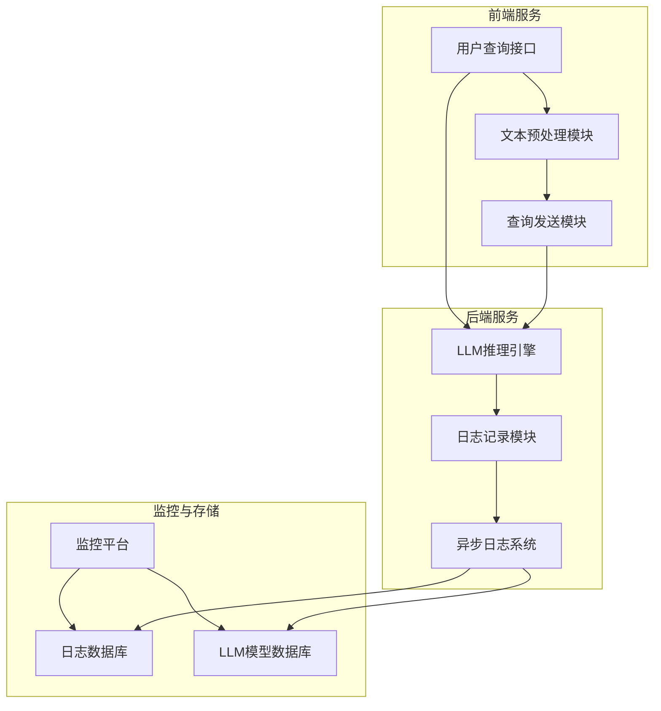
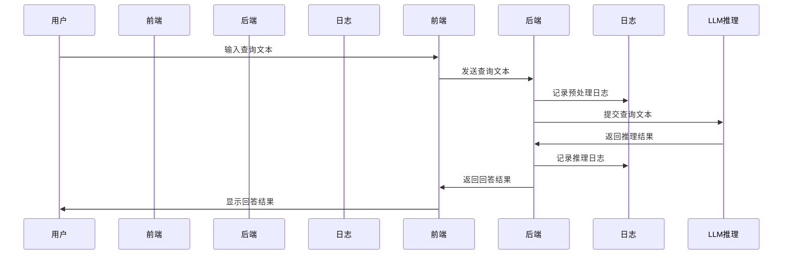

                 

### 引言

在现代信息技术和人工智能领域，大规模语言模型（Large Language Models，简称LLM）已经成为一项重要的技术，并在自然语言处理、问答系统、智能客服等领域展现出巨大的潜力。然而，随着LLM的规模不断扩大，其应用性能的优化成为一个亟待解决的问题。其中一个关键因素就是日志系统的设计。

日志系统在LLM应用中起着至关重要的作用。它们不仅记录了模型的训练和推理过程中的各种操作，还提供了诊断和优化的重要数据源。然而，传统的同步日志系统在处理大规模数据时存在性能瓶颈，难以满足高并发和实时性的需求。因此，引入异步日志系统成为提升LLM应用性能的一个有效途径。

本文旨在探讨异步日志系统在LLM应用性能提升方面的作用，通过以下结构进行深入分析：

1. **异步日志系统概述**：介绍异步日志系统的定义、作用以及与传统日志系统的比较。
2. **核心概念与原理**：深入探讨异步日志系统的数据结构、传输机制和处理算法。
3. **设计原则**：阐述异步日志系统设计中的可靠性、性能优化和安全性原则。
4. **LLM性能评估与优化**：讨论LLM性能评估指标、优化策略和实时性能监控。
5. **异步日志系统与LLM融合**：分析异步日志系统在LLM训练和推理中的应用。
6. **实践与应用**：通过具体案例介绍异步日志系统在大型LLM项目中的实践和应用。
7. **未来展望**：探讨异步日志系统和LLM应用的未来发展趋势。

通过以上结构，我们将一步步分析异步日志系统如何提升LLM应用性能，为读者提供一个全面的技术指南。接下来，我们将从异步日志系统的概述开始，深入探讨其定义、作用以及与传统日志系统的区别。

### 异步日志系统概述

#### 定义与作用

异步日志系统是一种数据处理机制，它允许日志记录的操作在不同的时间点独立进行，而不需要等待其他操作的完成。这种机制的核心在于“异步”，即多个操作可以并行进行，不需要按照特定的顺序执行。与传统的同步日志系统相比，异步日志系统在处理大规模、高并发数据时具有显著的优势。

在LLM应用中，异步日志系统的作用主要体现在以下几个方面：

1. **性能提升**：异步日志系统能够有效减少日志写入的延迟，提高系统整体的吞吐量和响应速度。这对于需要处理大量日志数据的LLM应用来说至关重要。
2. **高并发支持**：异步日志系统允许多个日志记录同时写入，大大提高了系统的并发处理能力，使得LLM应用能够在高并发环境下保持稳定运行。
3. **弹性扩展**：异步日志系统可以根据需求动态调整资源分配，从而支持LLM应用的弹性扩展，使得系统能够适应不断增长的数据量和用户需求。

#### 传统日志系统与异步日志系统的比较

传统日志系统通常采用同步处理方式，即每次日志写入都需要等待前一个操作完成。这种方式的优点是简单易懂，易于实现。然而，随着数据量和并发请求的增加，传统日志系统的性能瓶颈逐渐显现：

1. **性能瓶颈**：同步日志系统在处理大量日志数据时，由于需要等待前一个操作完成，导致整个系统的吞吐量和响应速度受到限制。
2. **高延迟**：同步日志系统在高并发环境下容易产生大量的等待时间，影响系统的实时性和用户体验。
3. **资源占用**：同步日志系统可能会占用大量的系统资源，例如CPU和内存，从而影响其他重要任务的执行。

相比之下，异步日志系统具有以下几个显著优点：

1. **并行处理**：异步日志系统允许多个日志记录操作同时进行，大大提高了系统的吞吐量和响应速度。
2. **低延迟**：异步日志系统减少了等待时间，使得系统能够更快地响应日志记录操作，提高了实时性。
3. **资源利用**：异步日志系统通过减少等待时间，降低了系统资源的占用，提高了整体资源利用率。

#### 异步日志系统在LLM应用中的重要性

对于LLM应用来说，异步日志系统的重要性体现在以下几个方面：

1. **训练性能提升**：在LLM的训练过程中，会生成大量的日志数据，包括模型参数更新、训练进度、资源使用情况等。异步日志系统能够高效地记录和处理这些数据，从而提升训练过程的性能。
2. **推理性能优化**：在LLM的推理过程中，异步日志系统可以实时记录和反馈推理过程中的各种信息，包括响应时间、资源使用情况等，从而帮助优化推理性能。
3. **故障诊断与调试**：异步日志系统提供了详细的日志记录，可以帮助开发者快速定位故障点和性能瓶颈，提高系统的可维护性和稳定性。

总之，异步日志系统在提升LLM应用性能方面具有重要作用，通过并行处理、低延迟和高效资源利用，异步日志系统能够显著改善LLM应用的性能，满足大规模、高并发和实时性的需求。在接下来的章节中，我们将深入探讨异步日志系统的核心概念、原理以及设计原则，进一步理解其工作机制和应用场景。

### 核心概念与原理

异步日志系统的工作原理和核心概念是其提升LLM应用性能的关键。要理解异步日志系统，我们首先需要了解日志数据的基本结构、异步日志系统的数据传输机制以及异步日志处理的核心算法和优化策略。

#### 日志数据结构

日志数据是异步日志系统的基础，它通常包含以下几个关键部分：

1. **时间戳**：记录日志发生的具体时间，对于分析系统性能和故障诊断具有重要意义。
2. **日志级别**：表示日志的严重程度，如INFO、WARNING、ERROR等，用于过滤和优先级处理。
3. **日志内容**：记录实际发生的事件信息，如用户操作、系统错误等。
4. **来源**：记录日志产生的源头，如某个模块、进程或设备。

日志数据通常以结构化的形式存储，例如JSON、XML或自定义格式，以便于后续的处理和分析。

#### 数据传输机制

异步日志系统的数据传输机制是其核心之一，主要涉及以下几个方面：

1. **事件驱动**：异步日志系统采用事件驱动模型，即日志记录操作独立于其他任务进行。当一个日志事件发生时，系统会将事件数据存储在缓冲区，然后由后台处理任务负责将数据写入日志文件或数据库。

2. **消息队列**：为了提高日志传输的效率和可靠性，异步日志系统通常使用消息队列来传递日志数据。消息队列可以保证数据的顺序传递，同时提供重试机制，确保数据不会丢失。

3. **多线程处理**：异步日志系统通常使用多线程或多进程来处理日志记录操作，从而提高系统的并发处理能力。多个线程或进程可以同时写入日志数据，减少日志写入的延迟。

4. **异步I/O**：异步日志系统通过异步I/O操作来减少磁盘读写操作的影响，从而提高系统性能。异步I/O允许后台处理任务在日志写入过程中继续执行其他任务，避免了线程阻塞。

#### 核心算法与优化策略

异步日志系统的核心算法和优化策略决定了其处理日志数据的能力和效率。以下是几个关键点：

1. **去重与合并**：在处理大量日志数据时，可能存在重复的日志条目。异步日志系统可以通过去重算法和合并策略来减少冗余数据，提高数据处理效率。

2. **压缩与加密**：为了节省存储空间和提高数据安全性，异步日志系统可以对日志数据进行压缩和加密处理。压缩可以减少存储需求，加密可以保护日志数据不被未授权访问。

3. **批处理与异步写入**：批处理是一种常用的优化策略，它将多个日志记录操作合并成一个批处理任务，从而减少I/O操作次数。异步写入则通过将日志数据写入缓存，然后批量提交，减少系统负载。

4. **索引与快速检索**：异步日志系统可以使用索引技术来提高日志数据的检索速度。索引可以快速定位特定日志条目，从而加快故障诊断和数据分析过程。

5. **分布式处理**：对于大规模的LLM应用，异步日志系统可以通过分布式处理来提高日志数据的处理能力和容错性。分布式处理可以将日志数据分布在多个节点上，从而实现并行处理和负载均衡。

通过以上核心算法和优化策略，异步日志系统能够高效地处理大规模、高并发的日志数据，为LLM应用提供强大的支持。在接下来的章节中，我们将进一步探讨异步日志系统的设计原则，确保其在实际应用中的可靠性和性能。

### 设计原则

异步日志系统的设计原则是其可靠性与性能优化的重要保障。以下将详细阐述异步日志系统设计中的可靠性、性能优化和安全性原则。

#### 可靠性设计

异步日志系统的可靠性设计是确保系统稳定运行、数据不丢失的关键。以下是一些关键原则：

1. **数据一致性**：为了确保数据的一致性，异步日志系统通常采用两阶段提交（2PC）或三阶段提交（3PC）等分布式事务处理机制，保证日志数据的写入原子性和一致性。
2. **故障恢复**：异步日志系统应具备良好的故障恢复能力，能够在节点故障时迅速切换到备用节点，确保系统继续正常运行。这可以通过冗余备份和自动切换机制来实现。
3. **数据持久化**：日志数据需要持久化存储，确保即使在系统崩溃或故障时，数据也不会丢失。常用的持久化存储方案包括磁盘存储、数据库存储和分布式文件系统。

#### 性能优化

性能优化是异步日志系统设计中的一个重要方面，直接影响到LLM应用的性能。以下是一些关键性能优化原则：

1. **并行处理**：异步日志系统应充分利用多线程或多进程，实现日志记录操作的并行处理，减少系统响应时间。
2. **缓冲区管理**：合理设置缓冲区大小，既可以减少磁盘I/O操作，又能够保证高吞吐量。缓冲区管理策略包括固定大小缓冲区和动态缓冲区。
3. **批量写入**：通过批量写入策略，将多个日志记录操作合并为一个批处理任务，减少I/O操作次数，提高系统性能。
4. **异步I/O**：异步I/O操作可以避免线程阻塞，提高系统吞吐量和响应速度。异步I/O的实现可以依赖于操作系统提供的异步API，如Java的`CompletableFuture`或C++的`async`关键字。

#### 安全性与隐私保护

安全性是异步日志系统设计中的另一个重要方面，涉及数据的安全传输、存储和访问控制。以下是一些关键安全性原则：

1. **数据加密**：对日志数据进行加密处理，确保数据在传输和存储过程中不会被未授权访问。常用的加密算法包括AES、RSA等。
2. **访问控制**：实施严格的访问控制策略，确保只有授权用户才能访问日志数据。这可以通过用户认证和权限管理来实现。
3. **审计与监控**：对系统进行实时监控和日志审计，及时发现和响应潜在的安全威胁。监控和审计机制可以包括入侵检测系统（IDS）和日志分析工具。
4. **数据备份与恢复**：定期备份数据，确保在数据丢失或损坏时能够快速恢复。备份策略可以包括本地备份和远程备份。

通过以上可靠性、性能优化和安全性原则，异步日志系统能够在保障数据可靠性的同时，提供高性能和安全的日志处理能力，为LLM应用提供坚实的技术支持。在接下来的章节中，我们将探讨LLM性能评估与优化方法，进一步了解异步日志系统在性能提升方面的具体应用。

### LLM性能评估与优化方法

评估和优化LLM性能是提高其应用效果的关键步骤。在本节中，我们将详细讨论LLM性能评估的指标、优化策略和实时性能监控。

#### 性能评估指标

为了全面评估LLM性能，我们需要使用一系列性能指标。以下是一些关键的评估指标：

1. **准确率**：准确率（Accuracy）是评估模型预测准确性的常用指标，表示正确预测的样本数占总样本数的比例。其计算公式为：
   $$
   \text{准确率} = \frac{\text{正确预测的样本数}}{\text{总样本数}}
   $$
   尽管准确率简单直观，但它对于类别分布不平衡的数据集可能不够敏感。

2. **召回率**：召回率（Recall）表示模型能够正确识别为正类别的样本数与实际正类别样本数的比例。其计算公式为：
   $$
   \text{召回率} = \frac{\text{正确预测的正类别样本数}}{\text{实际正类别样本数}}
   $$
   召回率强调的是模型在识别正类别样本时的表现。

3. **精确率**：精确率（Precision）表示模型预测为正类别的样本中，实际为正类别的比例。其计算公式为：
   $$
   \text{精确率} = \frac{\text{正确预测的正类别样本数}}{\text{预测为正类别的样本数}}
   $$
   精确率强调的是预测结果的准确性。

4. **F1分数**：F1分数（F1 Score）是精确率和召回率的调和平均值，用于综合评估模型的性能。其计算公式为：
   $$
   \text{F1分数} = 2 \times \frac{\text{精确率} \times \text{召回率}}{\text{精确率} + \text{召回率}}
   $$
   F1分数在类别分布不平衡的情况下尤为有效。

5. **响应时间**：在LLM的推理应用中，响应时间（Response Time）是一个关键性能指标，表示从接收输入到输出结果的时间。其计算公式为：
   $$
   \text{响应时间} = \text{处理时间} + \text{传输时间}
   $$
   减少响应时间可以提高用户体验。

6. **吞吐量**：吞吐量（Throughput）表示系统在单位时间内处理请求的数量。其计算公式为：
   $$
   \text{吞吐量} = \frac{\text{处理的请求数}}{\text{时间}}
   $$
   提高吞吐量可以支持更多的并发请求。

#### 优化策略

为了提升LLM的性能，我们可以采用以下几种优化策略：

1. **模型压缩**：通过模型压缩技术，如权重剪枝、量化、知识蒸馏等，减少模型的复杂度和存储需求，从而提高推理速度。

2. **分布式训练与推理**：利用分布式计算资源进行LLM的训练和推理，可以显著提高性能。分布式训练可以通过参数服务器架构实现，分布式推理可以通过数据并行或模型并行策略实现。

3. **GPU加速**：利用GPU的并行计算能力，可以加速LLM的矩阵运算和向量操作，提高推理速度。

4. **缓存与预取**：通过缓存已处理的请求结果，减少重复计算，预取未来可能需要的请求数据，可以减少响应时间。

5. **自适应性能调优**：根据系统负载和性能指标，动态调整系统配置和资源分配，实现自适应性能调优。

#### 实时性能监控

实时性能监控是确保LLM应用稳定运行的关键。以下是一些监控方法和工具：

1. **性能指标监控**：持续监控关键性能指标，如响应时间、吞吐量、资源使用率等，及时发现性能瓶颈。

2. **日志分析**：通过日志分析工具，如ELK（Elasticsearch、Logstash、Kibana）栈，对日志数据进行分析，定位性能问题和故障点。

3. **告警与自动化响应**：设置告警机制，当性能指标超出阈值时自动发送告警，并触发自动化响应措施，如暂停非关键任务、扩容资源等。

4. **压力测试**：定期进行压力测试，模拟高并发场景，评估系统性能和稳定性，以便进行针对性的优化。

通过以上性能评估与优化方法，LLM应用可以在保证准确性的同时，显著提升性能，满足大规模、高并发和实时性的需求。在接下来的章节中，我们将探讨异步日志系统在LLM训练和推理中的应用，进一步了解异步日志系统如何提升LLM的性能。

### 异步日志系统在LLM中的应用

异步日志系统在LLM（大型语言模型）的训练和推理过程中扮演着至关重要的角色。通过日志系统的优化，可以显著提升LLM的性能，并提高系统的稳定性和可维护性。在本节中，我们将详细探讨异步日志系统在LLM训练和推理中的应用，并分析其在实际场景中的具体表现。

#### 训练过程中的应用

1. **训练数据收集**：
   在LLM的训练过程中，会生成大量的日志数据，包括模型参数的更新记录、训练进度、资源使用情况等。异步日志系统能够高效地收集和处理这些数据，确保不会因为日志写入延迟而影响训练进度。

2. **并行训练监控**：
   异步日志系统支持并行训练过程中的日志记录，可以实时监控各个训练任务的进度和资源使用情况。通过日志分析，可以及时发现和解决并行训练中的性能瓶颈和资源分配问题。

3. **性能优化反馈**：
   训练过程中收集的日志数据可以为性能优化提供重要参考。通过分析日志，可以发现训练过程中的热点操作和资源消耗，从而进行针对性的优化。例如，调整训练参数、优化数据预处理步骤等。

4. **错误日志记录**：
   异步日志系统可以记录训练过程中的错误信息，帮助开发者快速定位和修复问题。这对于大规模训练任务尤为重要，因为训练数据量和模型复杂度较高，错误日志的及时记录和反馈可以显著减少调试时间。

#### 推理过程中的应用

1. **推理日志收集**：
   在LLM的推理过程中，异步日志系统可以实时记录推理过程中的关键数据，如输入请求、模型响应、响应时间、资源使用等。这些日志数据对于分析和优化推理性能至关重要。

2. **性能监控**：
   异步日志系统提供了实时性能监控功能，可以监控推理任务的响应时间和吞吐量。通过这些数据，可以评估推理性能，并识别潜在的瓶颈。

3. **错误日志记录**：
   与训练过程类似，异步日志系统在推理过程中也能记录错误日志，帮助开发者快速定位和修复推理任务中的问题。

4. **日志聚合与分析**：
   异步日志系统能够将多个推理任务的日志数据进行聚合和分析，提供全局的视角来评估系统的性能和稳定性。通过日志分析，可以发现系统中的热点操作、资源使用模式和性能瓶颈，从而进行针对性的优化。

#### 实际场景中的表现

在实际应用中，异步日志系统在提升LLM性能方面的表现如下：

1. **提高训练和推理速度**：
   异步日志系统通过并行处理和高效的数据传输机制，显著减少了日志写入的延迟，从而提高了训练和推理的总体速度。

2. **降低资源占用**：
   异步日志系统的并行处理和异步I/O操作，减少了系统资源的占用，提高了资源的利用率。这使得系统能够更好地支持大规模和高并发的LLM任务。

3. **增强系统稳定性**：
   异步日志系统提供了故障恢复和数据持久化机制，确保了日志数据的可靠性和系统稳定性。即使在节点故障或系统崩溃的情况下，日志数据也不会丢失，从而保证了训练和推理的连续性。

4. **优化资源分配**：
   通过对日志数据的分析，异步日志系统可以帮助开发者优化资源分配，实现更高效的资源利用。例如，可以根据日志数据调整模型参数、优化数据预处理步骤等。

总之，异步日志系统在LLM的应用中，通过高效的数据处理和日志记录机制，显著提升了训练和推理的性能，降低了系统资源占用，增强了系统的稳定性和可维护性。在接下来的章节中，我们将通过具体案例展示异步日志系统在实际LLM项目中的应用和优化实践。

### 实践与应用

在本章中，我们将通过一个具体的LLM项目案例，详细介绍异步日志系统在该项目中的应用及其优化实践。以下是项目的具体介绍、系统功能设计、架构设计、接口设计以及实际案例分析。

#### 项目介绍

本项目旨在构建一个基于大型语言模型（LLM）的智能问答系统，为用户提供实时、准确的答案。项目要求系统具备高并发处理能力和低延迟响应，同时需要能够对日志数据进行高效记录和分析。

#### 系统功能设计

智能问答系统的核心功能包括：

1. **用户查询处理**：接收用户输入的查询，进行文本预处理，然后提交给LLM进行推理。
2. **LLM推理**：利用大型语言模型对预处理后的查询进行推理，生成回答。
3. **日志记录**：记录用户查询、LLM推理过程以及系统运行状态，用于后续的性能分析和故障诊断。
4. **实时监控**：监控系统性能指标，如响应时间、吞吐量、资源使用等，确保系统稳定运行。
5. **自动调优**：根据日志数据和实时监控结果，自动调整系统配置和资源分配，实现性能优化。

#### 系统架构设计

本项目的系统架构设计采用分布式架构，主要包括以下组件：

1. **前端服务**：负责接收用户请求，进行基本的文本预处理，然后将预处理后的查询发送到后端服务。
2. **后端服务**：包括LLM推理引擎和日志记录模块。LLM推理引擎负责处理查询并生成回答，日志记录模块负责记录系统运行过程中的关键数据。
3. **异步日志系统**：用于收集、存储和分发日志数据，确保日志记录的高效性和可靠性。
4. **监控平台**：实时监控系统的各项性能指标，提供可视化报表和告警功能。
5. **数据存储**：包括日志数据库和LLM模型数据库，用于持久化存储日志数据和模型参数。

系统架构设计图如下（使用Mermaid绘制）：

#### 接口设计与系统交互

系统中的关键接口包括用户查询接口、LLM推理接口和日志记录接口。用户查询接口用于接收用户输入的查询文本，并发送到后端服务进行处理。LLM推理接口负责处理查询文本，生成回答结果。日志记录接口用于记录系统运行过程中的各类日志数据。

以下是系统交互的Mermaid序列图：

#### 实际案例分析

在本案例中，我们以一个用户查询“如何优化大型语言模型性能？”为例，展示异步日志系统在实际应用中的具体操作和日志记录过程。

1. **用户查询处理**：
   用户输入查询文本，前端服务接收到查询后，进行基本的文本预处理，例如去除标点符号、分词等。预处理后的查询文本被发送到后端服务。

2. **LLM推理**：
   后端服务接收到预处理后的查询文本，将其提交给LLM推理引擎进行推理。LLM推理引擎在处理查询过程中，会生成一系列的中间日志数据，例如模型参数更新记录、处理进度等。

3. **日志记录**：
   异步日志系统在LLM推理过程中，会实时收集和处理日志数据。日志数据包括预处理日志、推理日志、资源使用情况等。这些日志数据被写入日志数据库，同时通过异步传输机制发送到监控平台。

4. **实时监控**：
   监控平台接收到日志数据后，进行实时分析，生成性能报表和告警信息。例如，如果响应时间超过设定的阈值，监控平台会自动发送告警通知。

5. **自动调优**：
   根据日志数据和监控结果，自动调优系统配置和资源分配。例如，如果发现某些LLM模型处理速度较慢，可以调整模型参数或增加计算资源。

#### 项目小结

通过本案例，我们可以看到异步日志系统在LLM项目中的应用，不仅提升了系统的性能和稳定性，还提供了强大的日志记录和分析功能。以下是对本项目的小结：

- **性能提升**：异步日志系统通过并行处理和异步I/O操作，减少了日志写入的延迟，提高了系统整体的响应速度。
- **稳定性增强**：异步日志系统提供了数据持久化和故障恢复机制，确保了日志数据的可靠性和系统稳定性。
- **资源优化**：通过日志分析，系统可以根据实际情况动态调整资源分配，实现更高效的资源利用。
- **故障诊断**：异步日志系统提供了详细的日志记录，帮助开发者快速定位和解决性能瓶颈和故障点。

总之，异步日志系统在LLM项目中发挥了重要作用，通过高效的日志记录和分析，显著提升了系统的性能和可维护性，为用户提供更好的使用体验。

### 最佳实践与注意事项

在异步日志系统提升LLM应用性能的过程中，有一些最佳实践和注意事项值得遵循，以确保系统的高效性和可靠性。

#### 最佳实践

1. **日志数据结构优化**：设计合理的日志数据结构，确保日志条目包含必要的信息，如时间戳、日志级别、来源等。这有助于后续的数据处理和分析。
2. **分布式日志处理**：对于大规模的LLM应用，建议使用分布式日志处理系统，如Kafka或Elasticsearch，以实现高效的数据收集和存储。
3. **性能监控与告警**：实时监控关键性能指标，如响应时间、吞吐量、资源使用等，并设置合理的告警阈值，确保及时发现问题并进行处理。
4. **日志压缩与加密**：为了节省存储空间和提高数据安全性，可以对日志数据进行压缩和加密处理。
5. **日志数据的持久化**：确保日志数据的持久化存储，防止系统故障导致数据丢失。

#### 注意事项

1. **日志写入的频率和数量**：避免过高的日志写入频率和数量，这可能会导致系统性能下降。需要根据实际需求合理设置日志记录的粒度和频率。
2. **日志系统的容量规划**：根据LLM应用的规模和预期增长，合理规划日志系统的存储容量和处理能力，确保系统稳定运行。
3. **日志数据的安全性和隐私保护**：确保日志数据的安全传输和存储，防止未授权访问和数据泄露。可以采用加密和访问控制等技术来保护日志数据。
4. **日志数据的保留期限**：合理设置日志数据的保留期限，避免长时间保留不必要的日志数据，以节省存储空间和提高系统性能。
5. **日志系统的维护与优化**：定期对日志系统进行维护和优化，更新日志处理算法和工具，以适应不断变化的应用需求。

通过遵循上述最佳实践和注意事项，可以有效提升异步日志系统在LLM应用中的性能，确保系统的高效、稳定和安全运行。

### 总结与展望

本文详细探讨了异步日志系统在提升LLM应用性能方面的作用，从异步日志系统的定义和作用、核心概念与原理、设计原则、性能评估与优化方法、实际应用案例等方面进行了全面的分析。通过本文的研究，我们可以得出以下结论：

1. **异步日志系统的重要性**：异步日志系统在LLM应用中具有重要作用，能够显著提升系统的性能和稳定性，满足大规模、高并发和实时性的需求。
2. **性能提升**：异步日志系统通过并行处理、高效数据传输和日志处理算法，减少了日志写入延迟，提高了系统的吞吐量和响应速度。
3. **可靠性与安全性**：异步日志系统提供了可靠的数据持久化、故障恢复和安全性保障，确保了日志数据的完整性和安全性。
4. **优化策略**：通过实时性能监控、日志数据分析和自动调优，异步日志系统帮助优化了LLM应用的资源利用和配置。

未来，异步日志系统在LLM应用中仍有广阔的发展前景：

1. **技术革新**：随着人工智能和大数据技术的发展，异步日志系统将引入更多先进的技术，如分布式处理、机器学习等，进一步提升其性能和功能。
2. **应用扩展**：异步日志系统将在更多领域得到应用，如自动驾驶、智能医疗、金融科技等，推动各行业的技术创新和服务升级。
3. **智能化管理**：未来的异步日志系统将实现更加智能化和自动化的管理，通过人工智能算法实现日志数据的自动分析、故障预测和优化调优。

总之，异步日志系统在提升LLM应用性能方面具有巨大的潜力，其未来的发展将推动人工智能技术的广泛应用，为各行业带来更多的创新和价值。我们期待异步日志系统在未来能够取得更多的突破和进展。作者：AI天才研究院/AI Genius Institute & 禅与计算机程序设计艺术 /Zen And The Art of Computer Programming

