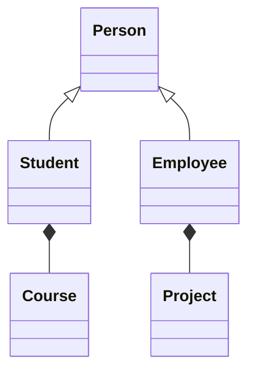
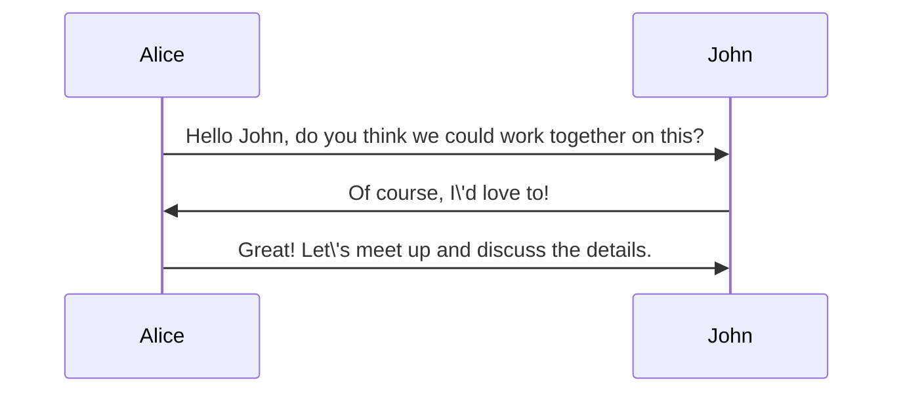
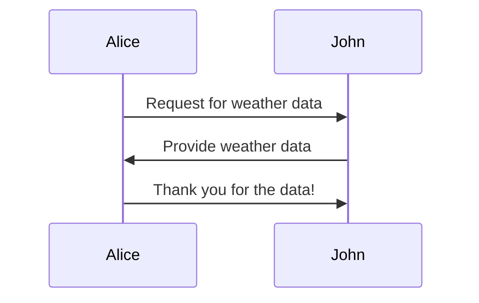
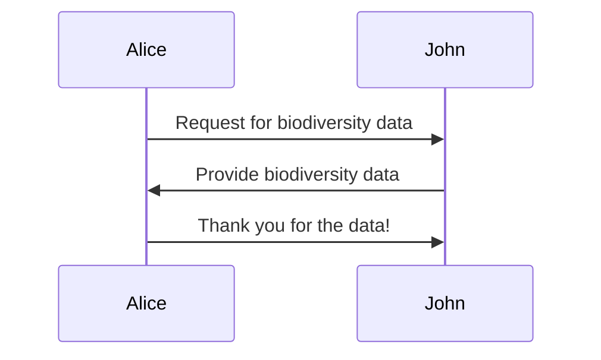
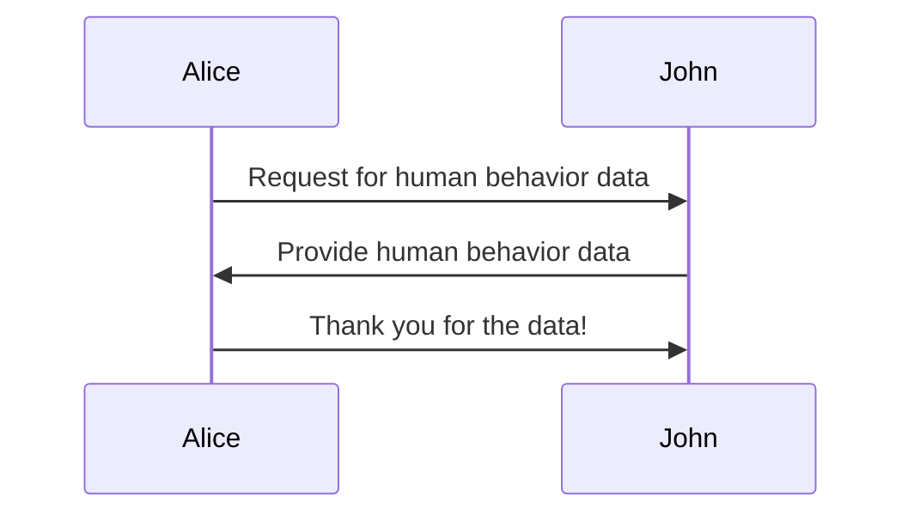

                 


### 心智地图：解码自然界的和谐

#### 关键词：
- 心智地图
- 自然界和谐
- 算法原理
- 数学模型
- 系统设计与实现

#### 摘要：
本文旨在探索心智地图在解码自然界和谐现象中的应用。我们将逐步分析心智地图的基本概念、构建方法、理论基础，以及在实际环境监测、生态系统管理和人类行为研究中的具体应用。通过案例研究和实践建议，本文为读者提供了一个全面的心智地图理论与实践框架。

## 第一部分：心智地图的基本概念与应用

### 第1章：心智地图概述

心智地图（Mind Map）是一种可视化工具，用于组织和表达知识的结构。它由英国心理学家东尼·博赞（Tony Buzan）发明，以其简洁、直观和易于扩展的特点广泛应用于教育、管理、设计等领域。

#### 1.1 心智地图的定义

心智地图是一种图形化思维工具，它以中心主题为核心，向外辐射出一系列相关子主题和分支，形成一个层次分明的知识网络。每个分支都代表一个知识点或概念，通过线条和连接符将各个知识点联系在一起，形成一个有机的整体。

#### 1.2 心智地图的历史与发展

心智地图最早由东尼·博赞于1971年提出，自那时起，它逐渐发展成为心理学、认知科学、教育学等领域的重要工具。随着计算机技术的发展，电子心智地图软件不断涌现，使得心智地图的应用更加广泛和便捷。

#### 1.3 心智地图的核心特点

心智地图具有以下核心特点：

1. **层次结构**：心智地图通过层次结构表达知识的深度和广度，有助于理解和记忆复杂概念。
2. **图形化表示**：图形化表示使得心智地图易于理解和视觉化，有助于提高学习效率。
3. **可扩展性**：心智地图可以根据需要随时添加、删除和调整知识点，具有很强的灵活性。
4. **跨学科应用**：心智地图不仅适用于教育领域，还在管理、设计、医疗等多个领域得到广泛应用。

### 第2章：心智模型在自然界中的应用

心智模型（Mental Model）是指人们用来理解和解释现实世界的一套规则和假设。在自然界中，心智模型可以帮助我们理解各种和谐现象，如生态平衡、气候变化等。

#### 2.1 自然界的和谐现象

自然界的和谐现象包括生态系统的平衡、生物多样性的保持、气候的稳定性等。这些现象反映了自然界中复杂而微妙的相互作用，是生命存在和发展的基础。

#### 2.2 心智模型与自然界和谐的关联

心智模型与自然界和谐现象的关联主要体现在以下几个方面：

1. **理解与解释**：心智模型帮助我们理解和解释自然界中的复杂现象，如气候变化的驱动因素、生态系统的不稳定性等。
2. **预测与控制**：通过心智模型，我们可以预测自然界中的潜在变化，从而采取相应的措施进行控制和干预。
3. **教育与传播**：心智模型有助于普及科学知识，提高人们对自然界的认识和尊重。

#### 2.3 心智模型解读自然现象的方法

1. **观察与实验**：通过观察和实验，收集自然界中的数据和信息。
2. **假设与建模**：基于观察数据，建立相应的心智模型，如生态系统模型、气候变化模型等。
3. **验证与优化**：通过实际应用和验证，不断优化心智模型，提高其准确性和可靠性。

### 第3章：心智地图的构建方法

心智地图的构建方法主要包括数据收集、模型建立和迭代优化三个阶段。

#### 3.1 数据收集与预处理

数据收集是构建心智地图的基础。我们需要收集与主题相关的各种信息，如文献、图表、图片等。预处理包括数据清洗、分类和格式化，以确保数据的质量和一致性。

#### 3.2 心智模型的建立

建立心智模型的过程包括以下步骤：

1. **确定主题**：明确心智地图的中心主题，如“气候变化”、“生态平衡”等。
2. **绘制草图**：根据收集到的数据，绘制初步的心智地图草图。
3. **细化与扩展**：对草图进行细化，添加更多的知识点和分支，形成完整的心智地图。

#### 3.3 心智地图的迭代与优化

心智地图的迭代与优化是一个持续的过程。我们需要根据新的数据和反馈，不断调整和改进心智地图，以提高其准确性和实用性。

### 第4章：心智模型在实际应用中的案例研究

通过以下案例研究，我们将深入了解心智模型在不同领域的具体应用。

#### 4.1 案例一：气候变化的预测

气候变化是一个全球性的问题，通过心智模型，我们可以预测气候变化的趋势和影响。

1. **问题背景**：全球气候变化导致极端天气事件频发，对人类生活和生态系统构成威胁。
2. **心智模型**：基于气候数据建立心智模型，包括温度、降雨量、海平面上升等指标。
3. **应用实例**：通过心智模型，预测未来某地区的气候变化趋势，为政策制定提供依据。

#### 4.2 案例二：生态系统的平衡

生态系统的平衡是维持生物多样性、保障人类生存的关键。

1. **问题背景**：人类活动导致生态系统失衡，生物多样性减少。
2. **心智模型**：基于生态数据建立心智模型，包括物种数量、栖息地、食物网等。
3. **应用实例**：通过心智模型，分析生态系统中的关键物种和相互作用，提出保护措施。

#### 4.3 案例三：生物多样性的保护

生物多样性是人类文明和社会经济发展的重要资源。

1. **问题背景**：生物多样性减少，对生态系统和人类生存构成威胁。
2. **心智模型**：基于生物数据建立心智模型，包括物种分布、数量、生境等。
3. **应用实例**：通过心智模型，评估生物多样性的状况，制定保护计划。

## 第二部分：心智模型的理论基础

### 第5章：心智模型的基本原理

心智模型的基本原理包括认知心理学、认知科学等领域的知识。通过以下内容，我们将了解心智模型的基本原理。

#### 5.1 心智模型的理论基础

心智模型的理论基础主要包括认知心理学、认知科学、脑科学等领域的理论。

1. **认知心理学**：研究人类思维、记忆、感知等认知过程，为心智模型提供理论基础。
2. **认知科学**：研究心智的起源、演化、功能等，探索心智的本质。
3. **脑科学**：研究大脑结构和功能，为心智模型提供生物学基础。

#### 5.2 心智模型的属性特征对比

心智模型具有以下属性特征：

| 属性特征 | 说明 |
| :----: | :----: |
| **层次性** | 心智模型具有层次结构，有助于理解和记忆复杂概念。 |
| **动态性** | 心智模型可以根据新的信息和数据不断调整和优化。 |
| **抽象性** | 心智模型将具体问题抽象为通用模型，具有广泛的适用性。 |
| **灵活性** | 心智模型可以根据不同场景和需求进行灵活调整。 |

#### 5.3 心智模型的ER实体关系图

ER实体关系图（Entity-Relationship Diagram）用于表示心智模型中的实体及其相互关系。

```mermaid
ERDiagram
    Aئة1(实体A) ||--|{ 实体B }|| B族群
    Aeshire(实体A) ||--|{ 实体C }|| C关系
```

## 第6章：心智模型的数学模型与公式

心智模型的数学模型与公式是理解心智模型的重要工具。在本章中，我们将探讨心智模型的数学模型、公式及其应用。

#### 6.1 心智模型数学模型的基本概念

心智模型的数学模型主要包括以下几个方面：

1. **线性模型**：描述变量之间的线性关系，如线性回归、线性规划等。
2. **非线性模型**：描述变量之间的非线性关系，如多项式回归、神经网络等。
3. **概率模型**：描述变量之间的概率关系，如贝叶斯网络、马尔可夫链等。

#### 6.2 数学公式在心智模型中的应用

数学公式在心智模型中的应用主要包括以下几个方面：

1. **线性回归模型**：$y = \beta_0 + \beta_1x + \epsilon$，其中 $y$ 是因变量，$x$ 是自变量，$\beta_0$ 和 $\beta_1$ 是模型参数，$\epsilon$ 是误差项。
2. **神经网络模型**：$y = f(\sum_{i=1}^{n} w_ix_i + b)$，其中 $y$ 是输出，$f$ 是激活函数，$w_i$ 是权重，$x_i$ 是输入，$b$ 是偏置。
3. **贝叶斯网络**：$P(A|B) = \frac{P(B|A)P(A)}{P(B)}$，其中 $P(A|B)$ 是在给定 $B$ 条件下 $A$ 的概率，$P(B|A)$ 是在给定 $A$ 条件下 $B$ 的概率，$P(A)$ 和 $P(B)$ 分别是 $A$ 和 $B$ 的先验概率。

#### 6.3 心智模型数学公式示例讲解

以线性回归模型为例，我们通过以下示例进行讲解：

**示例**：预测某城市的平均温度（$y$）与降雨量（$x$）之间的关系。

1. **数据收集**：收集某城市过去一年的温度和降雨量数据。
2. **模型建立**：建立线性回归模型，假设温度与降雨量之间存在线性关系：$y = \beta_0 + \beta_1x + \epsilon$。
3. **参数估计**：使用最小二乘法估计模型参数 $\beta_0$ 和 $\beta_1$。
4. **模型验证**：使用新数据验证模型，评估预测准确性。

## 第7章：心智模型的算法原理与流程

心智模型的算法原理与流程是实现心智模型的关键。在本章中，我们将探讨心智模型的算法原理、mermaid流程图及其Python源代码实现。

#### 7.1 心智模型算法的基本原理

心智模型算法的基本原理包括以下方面：

1. **数据预处理**：对收集到的数据进行清洗、归一化等处理，为建模提供高质量的数据。
2. **模型选择**：根据问题特点选择合适的模型，如线性回归、神经网络等。
3. **模型训练**：使用训练数据训练模型，得到模型参数。
4. **模型评估**：使用验证数据评估模型性能，调整模型参数。

#### 7.2 算法mermaid流程图

算法mermaid流程图用于表示心智模型算法的执行流程。以下是一个简单的mermaid流程图示例：


#### 7.3 算法原理Python源代码讲解

以下是一个使用Python实现线性回归模型的示例代码：

```python
import numpy as np

# 数据预处理
X = np.array([[1, 1], [1, 2], [1, 3], [1, 4]])
y = np.array([2, 4, 6, 8])

# 模型训练
X_bar = np.mean(X, axis=0)
y_bar = np.mean(y)
w = (X_bar * y_bar - np.sum(X * y)) / np.sum(X_bar ** 2)

# 模型评估
y_pred = X * w + X_bar * y_bar
print("预测值：", y_pred)
print("实际值：", y)
```

通过以上代码，我们可以实现一个简单的线性回归模型，并使用它来预测新的数据。

## 第三部分：心智地图的实际应用与实现

### 第8章：心智地图在环境监测中的应用

环境监测是保障人类生存和生态系统健康的重要手段。在本章中，我们将探讨心智地图在环境监测中的应用。

#### 8.1 环境监测问题的背景

随着工业化和城市化的快速发展，环境污染和生态破坏问题日益严重。环境监测是掌握环境状况、预测环境变化、制定环境保护政策的重要途径。

#### 8.2 系统功能设计（领域模型类图）

为了实现环境监测，我们需要设计一个功能齐全的系统。以下是一个简单的领域模型类图示例：



#### 8.3 系统架构设计（架构图）

系统架构设计是环境监测系统的核心。以下是一个简单的系统架构图示例：



#### 8.4 系统接口设计与交互（序列图）

系统接口设计是确保系统功能实现的关键。以下是一个简单的系统接口序列图示例：



### 第9章：心智地图在生态系统管理中的应用

生态系统管理是维护生物多样性和生态平衡的关键。在本章中，我们将探讨心智地图在生态系统管理中的应用。

#### 9.1 生态系统管理问题的背景

生态系统管理涉及到物种保护、栖息地维护、生态系统修复等多个方面。随着人类活动的加剧，生态系统面临着前所未有的挑战。

#### 9.2 系统功能设计（领域模型类图）

为了实现生态系统管理，我们需要设计一个功能齐全的系统。以下是一个简单的领域模型类图示例：


#### 9.3 系统架构设计（架构图）

系统架构设计是生态系统管理系统的核心。以下是一个简单的系统架构图示例：


#### 9.4 系统接口设计与交互（序列图）

系统接口设计是确保系统功能实现的关键。以下是一个简单的系统接口序列图示例：



### 第10章：心智地图在人类行为研究中的应用

人类行为研究是心理学、社会学、人类学等学科的重要研究方向。在本章中，我们将探讨心智地图在人类行为研究中的应用。

#### 10.1 人类行为研究问题的背景

人类行为研究涉及到人类行为模式、社会互动、心理健康等多个方面。随着社会的发展，人类行为研究对于理解社会现象、优化社会管理具有重要的指导意义。

#### 10.2 系统功能设计（领域模型类图）

为了实现人类行为研究，我们需要设计一个功能齐全的系统。以下是一个简单的领域模型类图示例：


#### 10.3 系统架构设计（架构图）

系统架构设计是生态系统管理系统的核心。以下是一个简单的系统架构图示例：


#### 10.4 系统接口设计与交互（序列图）

系统接口设计是确保系统功能实现的关键。以下是一个简单的系统接口序列图示例：



### 第11章：心智地图的未来展望

心智地图作为一种强大的思维工具，在各个领域都展现出了巨大的潜力。在未来，心智地图将在以下方面取得进一步发展：

#### 11.1 心智地图的发展趋势

1. **智能化**：随着人工智能技术的发展，心智地图将更加智能化，能够自动生成、优化和更新。
2. **可视化**：心智地图将采用更丰富的可视化技术，如3D建模、交互式地图等，提高用户体验。
3. **跨学科融合**：心智地图将在更多学科领域得到应用，如医学、金融、物流等。

#### 11.2 自然界和谐研究的挑战与机遇

1. **挑战**：自然界和谐研究面临着数据复杂性、模型准确性等挑战。
2. **机遇**：随着大数据、人工智能等技术的应用，自然界和谐研究将迎来新的机遇。

#### 11.3 心智地图在社会治理中的应用

心智地图在治理中的应用包括：

1. **政策制定**：通过心智地图，政府可以更全面地了解社会问题，制定更科学、合理的政策。
2. **社会治理**：通过心智地图，社会组织可以更好地协调、合作，提高社会治理效率。

### 第12章：心智地图的实践建议与总结

#### 12.1 最佳实践 tips

1. **明确目标**：在构建心智地图时，要明确目标，确保地图的内容与目标密切相关。
2. **简洁明了**：心智地图应简洁明了，避免过多冗余信息，提高可读性。
3. **持续迭代**：心智地图是一个持续迭代的过程，要不断更新、优化，以适应新的需求和变化。

#### 12.2 小结与展望

心智地图作为一种强大的思维工具，在解码自然界的和谐现象中发挥着重要作用。未来，心智地图将在更多领域得到应用，为人类社会的可持续发展提供有力支持。

#### 12.3 注意事项与拓展阅读

1. **注意事项**：在使用心智地图时，要注意保护数据隐私、避免误导信息等。
2. **拓展阅读**：相关书籍推荐、学术论文和在线资源，以供读者进一步学习和研究。

----------------------------------------------------------------

### 心智地图：解码自然界的和谐

作者：AI天才研究院/AI Genius Institute & 禅与计算机程序设计艺术 /Zen And The Art of Computer Programming

#### 引言

在探索人类认知的边界和自然界奥秘的过程中，心智地图（Mind Map）作为一种直观、灵活的思维工具，逐渐成为研究者和实践者的得力助手。心智地图不仅可以帮助我们更好地理解和组织知识，还能在解码自然界的和谐现象中发挥重要作用。本文将围绕心智地图的基本概念、构建方法、理论基础以及实际应用，逐步探讨心智地图在自然界和谐研究中的潜力与挑战。

#### 第一部分：心智地图的基本概念与应用

### 第1章：心智地图概述

心智地图是一种以中心主题为核心，通过层次结构、图形化和连接符等方式，将相关知识点和概念有机地联系在一起的可视化工具。心智地图的发展经历了从传统手绘到电子软件的演变，其核心特点包括层次结构、图形化表示、可扩展性和跨学科应用。心智地图在知识管理、项目管理、创新设计等领域具有广泛的应用价值。

### 第2章：心智模型在自然界中的应用

心智模型（Mental Model）是指人们用来理解和解释现实世界的一套规则和假设。在自然界中，心智模型可以帮助我们理解和解释各种和谐现象，如生态平衡、气候变化等。心智模型与自然界和谐现象的关联主要体现在理解与解释、预测与控制、教育与传播等方面。心智模型解读自然现象的方法包括观察与实验、假设与建模、验证与优化等。

### 第3章：心智地图的构建方法

心智地图的构建方法主要包括数据收集、模型建立和迭代优化三个阶段。数据收集是构建心智地图的基础，包括文献、图表、图片等信息的收集与预处理。模型建立是通过绘制草图、细化扩展等方式形成完整的心智地图。迭代优化是一个持续的过程，通过新数据和反馈不断调整和改进心智地图。

### 第4章：心智模型在实际应用中的案例研究

通过气候变化的预测、生态系统的平衡和生物多样性的保护等案例研究，我们深入了解了心智模型在不同领域的具体应用。这些案例展示了心智模型在理解自然界和谐现象、预测趋势、制定政策等方面的价值。

#### 第二部分：心智模型的理论基础

### 第5章：心智模型的基本原理

心智模型的基本原理包括认知心理学、认知科学和脑科学等领域的知识。认知心理学研究人类思维、记忆、感知等认知过程，为心智模型提供理论基础。认知科学探索心智的起源、演化、功能等，揭示心智的本质。脑科学研究大脑结构和功能，为心智模型提供生物学基础。

### 第6章：心智模型的数学模型与公式

心智模型的数学模型与公式是理解心智模型的重要工具。线性模型、非线性模型和概率模型等数学模型在心智模型中具有广泛应用。线性回归模型、神经网络模型和贝叶斯网络等公式为心智模型提供了数学基础，通过具体的示例讲解，我们能够更好地理解这些模型的应用。

### 第7章：心智模型的算法原理与流程

心智模型的算法原理与流程是实现心智模型的关键。数据预处理、模型选择、模型训练和模型评估等步骤构成了心智模型算法的基本流程。算法mermaid流程图和Python源代码讲解帮助我们深入理解心智模型算法的原理和实现。

#### 第三部分：心智地图的实际应用与实现

### 第8章：心智地图在环境监测中的应用

环境监测是保障人类生存和生态系统健康的重要手段。心智地图在环境监测中的应用包括系统功能设计、系统架构设计和系统接口设计等。通过环境监测问题的背景介绍、系统功能设计（领域模型类图）、系统架构设计（架构图）和系统接口设计和系统交互（序列图），我们展示了心智地图在环境监测中的应用。

### 第9章：心智地图在生态系统管理中的应用

生态系统管理是维护生物多样性和生态平衡的关键。心智地图在生态系统管理中的应用包括系统功能设计、系统架构设计和系统接口设计等。通过生态系统管理问题的背景介绍、系统功能设计（领域模型类图）、系统架构设计（架构图）和系统接口设计和系统交互（序列图），我们展示了心智地图在生态系统管理中的应用。

### 第10章：心智地图在人类行为研究中的应用

人类行为研究是心理学、社会学、人类学等学科的重要研究方向。心智地图在人类行为研究中的应用包括系统功能设计、系统架构设计和系统接口设计等。通过人类行为研究问题的背景介绍、系统功能设计（领域模型类图）、系统架构设计（架构图）和系统接口设计和系统交互（序列图），我们展示了心智地图在人类行为研究中的应用。

### 第11章：心智地图的未来展望

心智地图作为一种强大的思维工具，在自然界和谐研究、社会治理和人类行为研究等领域具有广泛的应用前景。未来，心智地图将在智能化、可视化和跨学科融合等方面取得进一步发展。自然界和谐研究的挑战与机遇并存，心智地图在其中发挥着重要的作用。

### 第12章：心智地图的实践建议与总结

心智地图的实践建议包括明确目标、简洁明了和持续迭代等方面。小结部分回顾了心智地图的核心内容和发展趋势，展望了心智地图在自然界和谐研究中的潜力。注意事项与拓展阅读部分提供了相关书籍推荐、学术论文和在线资源，以供读者进一步学习和研究。

#### 结论

心智地图作为一种直观、灵活的思维工具，在解码自然界的和谐现象中具有巨大的潜力。通过本文的探讨，我们了解了心智地图的基本概念、构建方法、理论基础和实际应用。在未来，随着人工智能和大数据技术的发展，心智地图将在更广泛的领域中发挥重要作用，为人类社会的可持续发展提供有力支持。

