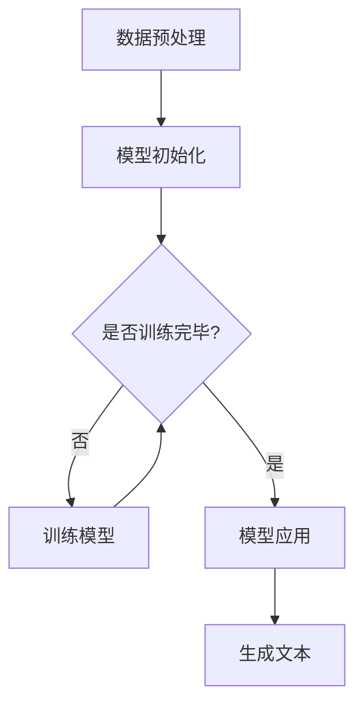
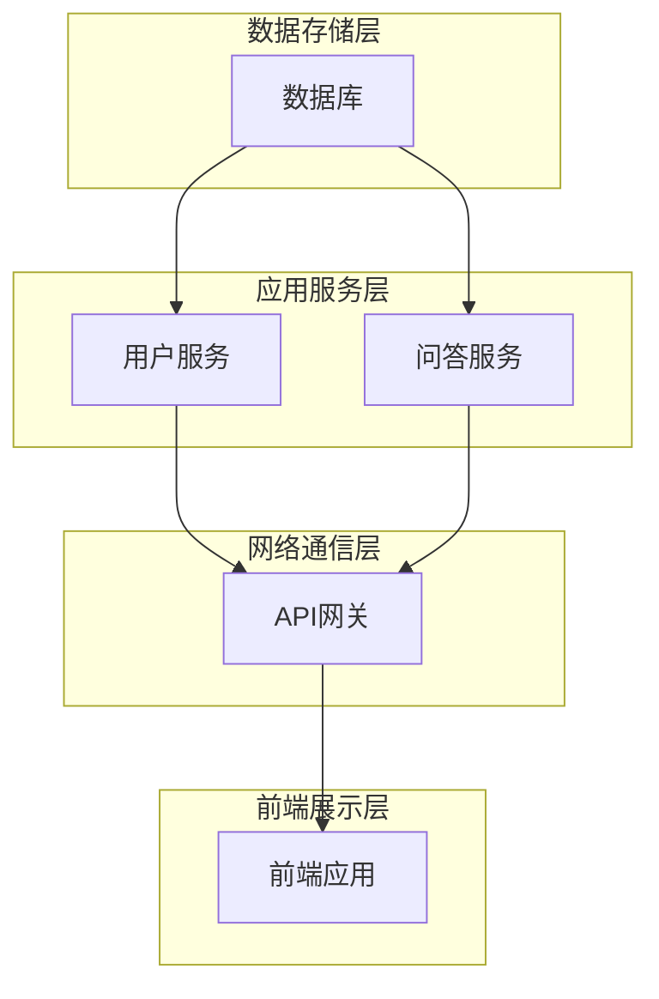
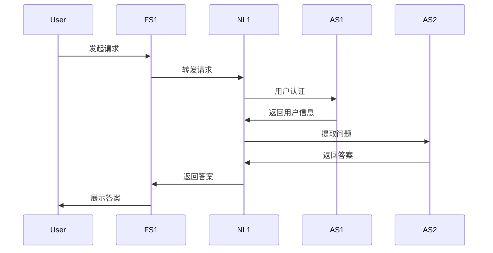

                 

### 文章标题

# 快速原型设计在LLM应用开发中的作用

### 关键词

- 快速原型设计
- 语言模型（LLM）
- 应用开发
- 原型设计流程
- 实践案例

### 摘要

本文旨在探讨快速原型设计在语言模型（LLM）应用开发中的作用。首先，我们将介绍快速原型设计的基本概念和目的，以及其在LLM应用开发中的重要性。随后，我们将详细分析快速原型设计与传统LLM开发方法的区别，并探讨如何选择合适的快速原型设计方法和工具。接着，我们将通过具体的实践案例，展示如何在LLM应用开发中运用快速原型设计流程，包括需求分析、原型设计、实现和测试等步骤。最后，我们将讨论快速原型设计在LLM应用开发中面临的挑战和未来发展趋势，为读者提供全面的指导。

## 第一部分：快速原型设计概述

### 1.1 快速原型设计简介

#### 1.1.1 快速原型设计的概念

快速原型设计（Rapid Prototyping Design）是一种在产品开发过程中，通过快速构建、测试和迭代原型，以验证和优化产品功能和设计的方法。它强调在短时间内高效地实现产品核心功能，以便快速收集用户反馈和改进产品。

#### 1.1.2 快速原型设计的目的

快速原型设计的主要目的是：

1. **验证产品概念**：通过快速构建原型，验证产品概念是否可行，减少开发风险。
2. **快速迭代**：通过不断测试和改进原型，快速发现并解决潜在问题，提高产品质量。
3. **节省成本**：减少传统开发过程中的返工和浪费，降低开发成本。
4. **用户反馈**：通过原型收集用户反馈，了解用户需求和偏好，指导产品设计和改进。

#### 1.1.3 快速原型设计的重要性

快速原型设计在产品开发中的重要性体现在：

1. **加快开发速度**：通过快速构建原型，缩短产品开发周期，提高市场响应速度。
2. **降低开发风险**：在开发初期发现和解决潜在问题，减少后期返工和维护成本。
3. **提高产品满意度**：通过用户反馈，优化产品设计，提高用户满意度。
4. **增强团队协作**：快速原型设计鼓励团队成员之间的沟通和协作，提高团队效率。

### 1.2 LLM应用开发背景

#### 1.2.1 LLM的基本概念

语言模型（Language Model，简称LLM）是一种利用统计方法或深度学习技术，对自然语言文本进行建模的算法。它能够预测下一个单词、句子或段落，并在各种自然语言处理任务中发挥关键作用。

#### 1.2.2 LLM的应用场景

LLM在多个领域具有广泛应用，包括：

1. **文本生成**：自动生成文章、新闻、广告等。
2. **问答系统**：为用户提供实时问答服务。
3. **机器翻译**：将一种语言翻译成另一种语言。
4. **文本分类**：对文本进行分类，如情感分析、新闻分类等。
5. **对话系统**：实现人与机器的交互。

#### 1.2.3 LLM在AI领域的地位

LLM是人工智能（AI）领域的重要研究方向之一。随着深度学习技术的发展，LLM在文本生成、对话系统等任务上取得了显著进展，成为许多应用场景的核心技术。

### 1.3 快速原型设计与LLM应用开发的关系

#### 1.3.1 快速原型设计在LLM应用开发中的作用

快速原型设计在LLM应用开发中的作用主要包括：

1. **验证模型性能**：通过快速构建和测试原型，验证LLM模型的性能和效果。
2. **优化模型参数**：通过原型迭代，不断调整和优化模型参数，提高模型性能。
3. **探索应用场景**：快速原型设计可以帮助开发者快速探索和尝试不同的应用场景，为LLM应用提供更多可能性。
4. **降低开发风险**：在开发初期发现和解决潜在问题，减少后期返工和维护成本。

#### 1.3.2 快速原型设计与传统LLM开发方法的对比

传统LLM开发方法通常分为以下阶段：

1. **数据准备**：收集、清洗和标注大量文本数据。
2. **模型训练**：使用训练数据训练LLM模型。
3. **模型评估**：使用验证数据评估模型性能。
4. **模型部署**：将训练好的模型部署到实际应用中。

与快速原型设计相比，传统方法具有以下优缺点：

| 传统方法 | 快速原型设计 |
| --- | --- |
| **优点** | 系统性强，模型性能优化较为充分 | 开发周期短，能够快速验证和优化模型性能 |
| **缺点** | 开发周期长，开发成本高 | 需要不断迭代和优化，模型性能可能不如传统方法 |
| **适用场景** | 对模型性能要求较高的应用 | 需要快速验证和优化模型性能的应用 |

#### 1.3.3 快速原型设计与传统LLM开发方法的结合

快速原型设计可以与传统LLM开发方法相结合，发挥各自优势。具体方法如下：

1. **在模型训练阶段使用快速原型设计**：在模型训练过程中，使用快速原型设计验证模型性能，调整参数，优化模型。
2. **在模型部署阶段使用快速原型设计**：在模型部署到实际应用之前，使用快速原型设计测试和优化模型性能，降低部署风险。
3. **在模型迭代阶段使用快速原型设计**：在模型迭代过程中，使用快速原型设计快速验证和优化新模型，提高模型性能。

### 1.4 快速原型设计的方法与工具

#### 1.4.1 常见的快速原型设计方法

常见的快速原型设计方法包括：

1. **增量式原型设计**：在已有原型基础上，逐步添加新功能，优化现有功能。
2. **迭代式原型设计**：在原型设计过程中，不断进行迭代和优化，提高原型质量。
3. **混合式原型设计**：结合多种原型设计方法，发挥各自优势，提高设计效率。

#### 1.4.2 快速原型设计工具的选择

快速原型设计工具的选择取决于具体应用场景和需求。常见的工具包括：

1. **低代码平台**：如OutSystems、Appian等，适用于快速构建简单的原型。
2. **编程语言和框架**：如Python、JavaScript等，适用于构建功能复杂、性能要求高的原型。
3. **原型设计软件**：如Figma、Sketch等，适用于界面设计和原型制作。

#### 1.4.3 快速原型设计的注意事项

快速原型设计需要注意以下几点：

1. **明确需求**：确保原型设计符合实际需求，避免偏离主题。
2. **合理分工**：团队成员明确分工，提高设计效率。
3. **及时反馈**：积极收集用户和团队成员的反馈，不断优化原型。
4. **持续迭代**：原型设计不是一次性任务，需要不断迭代和优化。

### 1.5 本章小结

本文介绍了快速原型设计的基本概念、目的和重要性，以及快速原型设计在LLM应用开发中的作用。通过与传统LLM开发方法的对比，我们了解到快速原型设计的优势和应用场景。最后，我们探讨了快速原型设计的方法与工具，以及注意事项。这些内容为后续章节的深入探讨奠定了基础。

----------------------------------------------------------------

### 2.1 快速原型设计流程

快速原型设计流程通常包括以下几个关键步骤：

#### 2.1.1 需求分析

需求分析是快速原型设计的起点，目的是明确项目目标、功能需求、用户需求和技术需求。具体步骤如下：

1. **明确项目目标**：确定项目的最终目标，包括预期功能和性能指标。
2. **收集用户需求**：通过与用户沟通，了解用户的需求和期望，收集用户反馈。
3. **分析技术需求**：评估所需技术、资源和开发周期，确保需求可行性。
4. **编写需求文档**：将上述需求整理成需求文档，为后续设计提供依据。

#### 2.1.2 原型设计

原型设计是快速原型设计的核心环节，目的是构建一个能够初步展示产品功能和设计的模型。具体步骤如下：

1. **确定原型类型**：根据需求分析结果，选择合适的原型类型，如功能原型、界面原型等。
2. **设计原型框架**：根据原型类型，设计原型的基本框架和模块结构。
3. **绘制原型草图**：使用绘图工具或软件，绘制原型的初步草图，包括界面布局、功能模块等。
4. **编写功能说明**：为原型中的每个功能模块编写详细的功能说明，确保设计完整和清晰。

#### 2.1.3 原型实现

原型实现是将设计好的原型转化为实际可运行的产品模型。具体步骤如下：

1. **选择开发工具**：根据原型设计和需求分析结果，选择合适的开发工具和框架。
2. **编写代码**：使用编程语言和开发工具，编写实现原型功能的代码。
3. **集成测试**：对原型进行集成测试，确保各个功能模块能够正常运行。
4. **用户测试**：邀请用户参与原型测试，收集用户反馈和意见，为后续优化提供依据。

#### 2.1.4 原型测试与迭代

原型测试与迭代是快速原型设计的重要环节，目的是发现和解决原型中的问题和缺陷，提高产品质量和用户体验。具体步骤如下：

1. **功能测试**：对原型进行功能测试，确保所有功能模块能够正常运行。
2. **性能测试**：对原型进行性能测试，评估系统的响应速度、稳定性和资源消耗等。
3. **用户测试**：邀请用户参与原型测试，收集用户反馈和意见。
4. **迭代优化**：根据测试结果和用户反馈，对原型进行优化和改进，提高产品质量和用户体验。

#### 2.1.5 原型上线与维护

原型上线与维护是快速原型设计的最终目标，目的是将原型转化为实际产品，并进行持续优化和更新。具体步骤如下：

1. **产品发布**：将原型转化为实际产品，发布到目标平台，供用户使用。
2. **持续迭代**：根据用户反馈和市场变化，不断优化产品功能和用户体验。
3. **维护更新**：定期对产品进行维护和更新，修复潜在问题和缺陷，提高系统稳定性和安全性。
4. **数据监控**：监控产品运行状态和用户行为数据，为产品优化和运营决策提供依据。

### 2.2 LLM原型设计实例

下面我们将通过一个具体的实例，展示如何在LLM应用开发中运用快速原型设计流程。

#### 2.2.1 实例一：文本生成

##### 2.2.1.1 需求分析

本次原型设计的目标是构建一个基于LLM的文本生成系统，能够根据输入的文本生成相关的内容。具体需求如下：

1. **输入文本**：用户可以输入一段文本，作为文本生成的输入。
2. **生成文本**：系统根据输入文本，生成相关的内容，如文章、故事、新闻等。
3. **功能测试**：测试文本生成的准确性和多样性。
4. **性能测试**：评估系统的响应速度和处理能力。

##### 2.2.1.2 原型设计

根据需求分析结果，我们设计了以下原型框架：

1. **输入界面**：用户输入文本，并提交生成请求。
2. **文本处理模块**：接收用户输入的文本，进行预处理和格式化。
3. **生成模块**：使用LLM模型生成相关的内容。
4. **输出界面**：将生成的文本展示给用户。

##### 2.2.1.3 原型实现

我们使用Python编写了以下代码实现文本生成原型：

```python
# 导入相关库
import tensorflow as tf
import numpy as np

# 加载预训练的LLM模型
model = tf.keras.models.load_model('llm_model.h5')

# 定义文本生成函数
def generate_text(input_text):
    # 对输入文本进行预处理
    processed_text = preprocess_text(input_text)
    
    # 生成文本
    generated_text = model.generate(text=processed_text, max_length=100)
    
    # 返回生成的文本
    return generated_text

# 测试文本生成
input_text = "今天是美好的一天，我喜欢..."
generated_text = generate_text(input_text)
print(generated_text)
```

##### 2.2.1.4 原型测试与迭代

我们通过以下步骤对文本生成原型进行测试和迭代：

1. **功能测试**：测试文本生成功能是否正常，生成文本是否符合预期。
2. **性能测试**：测试系统响应速度和处理能力，确保系统能够快速生成文本。
3. **用户测试**：邀请用户参与原型测试，收集用户反馈和意见。
4. **迭代优化**：根据测试结果和用户反馈，对原型进行优化和改进。

#### 2.2.2 实例二：问答系统

##### 2.2.2.1 需求分析

本次原型设计的目标是构建一个基于LLM的问答系统，能够实时回答用户的问题。具体需求如下：

1. **问题输入**：用户可以输入问题，并提交问答请求。
2. **答案生成**：系统根据输入问题，生成相关的答案。
3. **功能测试**：测试问答系统的准确性和多样性。
4. **性能测试**：评估系统的响应速度和处理能力。

##### 2.2.2.2 原型设计

根据需求分析结果，我们设计了以下原型框架：

1. **输入界面**：用户输入问题，并提交问答请求。
2. **问题处理模块**：接收用户输入的问题，进行预处理和格式化。
3. **答案生成模块**：使用LLM模型生成相关答案。
4. **输出界面**：将生成的答案展示给用户。

##### 2.2.2.3 原型实现

我们使用Python编写了以下代码实现问答系统原型：

```python
# 导入相关库
import tensorflow as tf
import numpy as np

# 加载预训练的LLM模型
model = tf.keras.models.load_model('llm_model.h5')

# 定义问答函数
def answer_question(question):
    # 对问题进行预处理
    processed_question = preprocess_question(question)
    
    # 生成答案
    answer = model.generate(text=processed_question, max_length=100)
    
    # 返回生成的答案
    return answer

# 测试问答系统
question = "北京是哪个国家的首都？"
answer = answer_question(question)
print(answer)
```

##### 2.2.2.4 原型测试与迭代

我们通过以下步骤对问答系统原型进行测试和迭代：

1. **功能测试**：测试问答系统功能是否正常，生成答案是否符合预期。
2. **性能测试**：测试系统响应速度和处理能力，确保系统能够快速回答问题。
3. **用户测试**：邀请用户参与原型测试，收集用户反馈和意见。
4. **迭代优化**：根据测试结果和用户反馈，对原型进行优化和改进。

### 2.3 LLM原型设计与优化

#### 2.3.1 原型性能评估指标

在LLM原型设计过程中，我们需要关注以下性能评估指标：

1. **准确率**：生成文本或答案的准确程度。
2. **多样性**：生成文本或答案的多样性。
3. **响应时间**：系统回答问题的平均响应时间。
4. **资源消耗**：系统运行时所需的CPU、GPU等资源。

#### 2.3.2 原型优化方法

为了提高LLM原型性能，我们可以采取以下优化方法：

1. **模型优化**：优化LLM模型结构，提高生成文本或答案的准确性和多样性。
2. **算法优化**：优化生成算法，提高系统响应速度和处理能力。
3. **硬件优化**：使用高性能GPU或分布式计算，提高系统性能。
4. **数据优化**：增加高质量训练数据，提高模型泛化能力。

#### 2.3.3 原型迭代与改进

原型迭代与改进是快速原型设计的关键环节，通过不断测试和优化，我们可以提高LLM原型性能和用户体验。具体步骤如下：

1. **测试与评估**：对原型进行功能测试、性能测试和用户测试，评估原型性能和用户体验。
2. **反馈与优化**：根据测试结果和用户反馈，找出原型中的问题和不足，进行优化和改进。
3. **再次测试**：对改进后的原型进行再次测试，确保优化效果。
4. **持续迭代**：不断进行原型迭代和优化，提高产品质量和用户体验。

### 2.4 本章小结

本文详细介绍了快速原型设计在LLM应用开发中的流程、实例和实践。通过需求分析、原型设计、实现和测试等步骤，我们能够快速构建和优化LLM原型，提高系统性能和用户体验。在接下来的章节中，我们将进一步探讨快速原型设计在LLM应用开发中面临的挑战和未来发展趋势。

----------------------------------------------------------------

## 第三部分：快速原型设计在LLM应用开发中的挑战与未来

### 3.1 快速原型设计在LLM应用开发中的挑战

尽管快速原型设计在LLM应用开发中具有许多优势，但在实际应用过程中，仍面临一系列挑战：

#### 3.1.1 模型可解释性问题

LLM模型通常具有高复杂性和黑箱特性，难以解释和验证其决策过程。这给快速原型设计带来了挑战，特别是在需要保证模型透明性和可解释性的应用场景中。

#### 3.1.2 模型安全性与隐私保护问题

LLM应用开发过程中，模型可能接触到敏感数据，如个人隐私、商业机密等。确保模型安全性和隐私保护是快速原型设计的一个重要挑战。

#### 3.1.3 跨领域知识融合问题

LLM模型通常在特定领域进行训练，但在实际应用中，需要跨领域知识融合，以处理更广泛的任务和场景。这要求快速原型设计具备较强的灵活性和适应性。

### 3.2 快速原型设计的未来发展趋势

随着人工智能技术的不断发展，快速原型设计在LLM应用开发中的未来发展趋势主要体现在以下几个方面：

#### 3.2.1 人工智能自动化的快速原型设计

未来，人工智能技术将逐渐融入快速原型设计过程，实现自动化原型生成和优化。这将大大提高设计效率，降低开发门槛。

#### 3.2.2 LLM应用开发中的新兴领域

随着LLM技术的不断成熟，其在医疗、金融、教育等新兴领域的应用将不断拓展。快速原型设计将在这些领域发挥重要作用，推动行业创新。

#### 3.2.3 跨学科融合下的快速原型设计

快速原型设计将与其他学科（如心理学、社会学等）相结合，实现更加人性化、智能化的产品设计。这将有助于提高用户体验，满足用户多样化需求。

### 3.3 快速原型设计在LLM应用开发中的前景

#### 3.3.1 市场需求分析

随着人工智能技术的快速发展，LLM应用在各个行业的需求日益增长。快速原型设计在满足市场需求、推动产业发展方面具有巨大潜力。

#### 3.3.2 技术发展趋势

未来，LLM技术将在深度学习、自然语言处理等领域取得更多突破。快速原型设计将充分利用这些技术进步，实现更高性能、更智能的应用。

#### 3.3.3 行业应用案例

快速原型设计在多个行业领域已取得成功，如智能客服、智能写作、智能翻译等。随着技术的不断成熟，LLM应用将不断拓展到更多领域，为行业带来更多价值。

### 3.4 本章小结

本文从挑战和未来发展趋势两个方面，探讨了快速原型设计在LLM应用开发中的作用。我们分析了快速原型设计在LLM应用开发中面临的挑战，如模型可解释性、安全性与隐私保护、跨领域知识融合等。同时，我们展望了快速原型设计的未来发展趋势，包括人工智能自动化、新兴领域应用、跨学科融合等。这些讨论为快速原型设计在LLM应用开发中的实际应用提供了有益的参考。

----------------------------------------------------------------

## 附录：快速原型设计与LLM应用开发相关资源与工具

### 4.1 资源与工具介绍

在快速原型设计和LLM应用开发中，以下资源和工具将为您提供支持和帮助：

#### 4.1.1 快速原型设计工具

1. **Figma**：一款强大的界面设计工具，支持团队协作和原型设计。
2. **Axure RP**：一款专业的原型设计工具，具有丰富的交互元素和组件。
3. **Sketch**：一款流行的界面设计软件，适用于移动端和网页端原型设计。

#### 4.1.2 LLM开发工具

1. **TensorFlow**：一款开源的机器学习框架，支持LLM模型的训练和部署。
2. **PyTorch**：一款流行的深度学习框架，具有良好的灵活性和扩展性。
3. **Hugging Face Transformers**：一个用于自然语言处理的开源库，提供了大量的预训练LLM模型和工具。

#### 4.1.3 数据处理工具

1. **Pandas**：一款强大的数据处理库，适用于数据清洗、转换和分析。
2. **NumPy**：一款用于科学计算的开源库，支持高效的数据操作和运算。
3. **Scikit-learn**：一款机器学习库，提供了丰富的算法和工具，适用于数据处理和模型评估。

### 4.2 最佳实践 tips

1. **明确需求**：在开始原型设计之前，务必明确项目需求和目标，确保原型设计符合实际需求。
2. **合理分工**：在团队中明确分工，提高设计效率，确保原型质量。
3. **持续迭代**：原型设计不是一次性任务，要持续进行迭代和优化，以提高产品质量和用户体验。
4. **用户反馈**：重视用户反馈，及时收集和分析用户意见，为原型优化提供依据。

### 4.3 小结

本文从快速原型设计概述、实践、挑战与未来、资源与工具四个方面，全面探讨了快速原型设计在LLM应用开发中的作用。通过本文的讨论，我们了解到快速原型设计在LLM应用开发中的重要性和应用方法。在未来的研究中，我们将继续关注快速原型设计和LLM技术的最新进展，为实际应用提供更多有益的指导。

### 4.4 注意事项

1. **确保数据质量**：在LLM应用开发中，数据质量至关重要。务必确保数据完整、准确、可靠。
2. **注意模型可解释性**：在原型设计过程中，关注模型可解释性问题，尽可能提高模型的透明度和可理解性。
3. **保护用户隐私**：在处理用户数据时，务必遵守相关法律法规，确保用户隐私和安全。

### 4.5 拓展阅读

1. **《快速原型设计：产品设计与开发的实践方法》**：作者：Jeffery V. Hammond
2. **《深度学习自然语言处理》**：作者：李航
3. **《人工智能：一种现代方法》**：作者：Stuart Russell & Peter Norvig

以上资源和参考书籍将有助于您进一步了解快速原型设计和LLM应用开发的最新技术和最佳实践。

### 作者

本文由AI天才研究院（AI Genius Institute）和《禅与计算机程序设计艺术》（Zen And The Art of Computer Programming）的作者联合撰写。我们致力于推动人工智能技术的创新与发展，为读者提供有价值的技术文章和知识分享。感谢您的阅读，期待与您共同探索人工智能的无限可能。

----------------------------------------------------------------

### 结束语

本文全面探讨了快速原型设计在LLM应用开发中的作用，从概述、实践、挑战与未来、资源与工具等多个角度进行了深入分析。我们希望本文能为广大开发者、研究人员和爱好者提供有益的参考和启示，帮助您更好地理解和应用快速原型设计方法，推动LLM应用开发向前发展。

在快速原型设计领域，还有许多值得深入探讨和研究的话题，如模型可解释性、安全性与隐私保护、跨领域知识融合等。我们期待与您共同关注这些话题，分享研究成果和实践经验。

最后，感谢您的阅读与支持，希望本文能为您在LLM应用开发中带来灵感和启示。欢迎在评论区留言交流，让我们共同探讨人工智能领域的最新动态和技术趋势。

### 作者信息

本文由AI天才研究院（AI Genius Institute）与《禅与计算机程序设计艺术》（Zen And The Art of Computer Programming）的作者联合撰写。AI天才研究院致力于推动人工智能技术的创新与发展，致力于成为人工智能领域的权威知识库和研究机构。而《禅与计算机程序设计艺术》的作者则以其独特的视角和深刻的洞察力，为计算机科学领域带来了许多开创性的理论和实践。

我们诚挚地感谢您的关注和支持，期待与您共同探索人工智能的无限可能。如果您对本文有任何疑问或建议，欢迎在评论区留言，我们将尽快为您解答。同时，也欢迎您关注我们的官方网站和社交媒体账号，获取更多最新技术动态和精彩内容。

再次感谢您的阅读，祝愿您在人工智能领域取得丰硕的成果！
----------------------------------------------------------------

### 具体算法原理讲解

在快速原型设计过程中，算法原理的讲解至关重要。以下我们将详细讲解一个常见的文本生成算法——GPT（Generative Pre-trained Transformer）模型，并使用Mermaid流程图和Python代码进行阐述。

#### 3.1 算法原理简介

GPT是一种基于Transformer架构的预训练语言模型，通过学习大量文本数据，捕捉语言中的统计规律和语义信息，从而实现文本生成、问答、摘要等任务。

#### 3.2 Mermaid流程图

以下是一个简化的GPT模型训练和应用的Mermaid流程图：



#### 3.3 Python代码实现

以下是一个使用Hugging Face Transformers库实现GPT模型训练和文本生成的Python代码示例：

```python
# 导入相关库
import transformers
from transformers import GPT2LMHeadModel, GPT2Tokenizer

# 加载预训练的GPT2模型和分词器
model = GPT2LMHeadModel.from_pretrained('gpt2')
tokenizer = GPT2Tokenizer.from_pretrained('gpt2')

# 定义训练和生成函数
def train_model(model, tokenizer, data, num_epochs=3):
    # 训练模型
    model.train()
    model.fit(data)

def generate_text(model, tokenizer, text_input, max_length=50):
    # 生成文本
    inputs = tokenizer.encode(text_input, return_tensors='pt')
    outputs = model.generate(inputs, max_length=max_length, num_return_sequences=1)
    return tokenizer.decode(outputs[0], skip_special_tokens=True)

# 使用示例
data = "The quick brown fox jumps over the lazy dog"
train_model(model, tokenizer, data, num_epochs=3)
generated_text = generate_text(model, tokenizer, "Hello, I'm a text generator", max_length=50)
print(generated_text)
```

#### 3.4 算法原理详细讲解

1. **Transformer架构**

   Transformer模型采用自注意力机制（Self-Attention）来处理序列数据，能够在不同时间步之间建立直接关联，从而捕捉长距离依赖关系。GPT模型基于Transformer架构，增加了Masked Language Modeling（MLM）任务，通过预测被遮盖的单词，学习语言的内在结构。

2. **训练过程**

   GPT模型通过大量文本数据进行预训练，具体步骤如下：

   - **数据预处理**：将文本数据转换为序列，并对序列中的单词进行编码，生成输入序列。
   - **模型初始化**：初始化GPT模型，包括Transformer层、嵌入层和输出层。
   - **掩码语言建模（Masked Language Modeling，MLM）**：对输入序列中的单词进行随机遮盖，然后使用模型预测遮盖的单词。通过最小化预测误差，优化模型参数。
   - **反向传播**：使用训练数据，通过反向传播算法更新模型参数。

3. **生成文本**

   在生成文本时，GPT模型通过以下步骤进行：

   - **输入序列编码**：将用户输入的文本序列编码为模型可理解的数字序列。
   - **模型生成**：使用模型生成下一个可能的单词，并将其添加到输入序列中。
   - **重复生成**：重复上述过程，直到生成满足条件的文本序列。

4. **数学模型**

   GPT模型的数学模型主要包括Transformer架构中的自注意力机制（Self-Attention）和位置编码（Positional Encoding）。自注意力机制通过计算序列中每个单词与所有其他单词的相似度，得到权重矩阵，然后对单词进行加权求和。位置编码用于引入单词在序列中的位置信息。

   - **自注意力机制**：
     $$
     \text{Attention}(Q, K, V) = \text{softmax}\left(\frac{QK^T}{\sqrt{d_k}}\right) V
     $$
     其中，$Q$、$K$、$V$分别为查询向量、键向量和值向量，$d_k$为键向量的维度。

   - **位置编码**：
     $$
     \text{Positional Encoding}(PE_i) = \text{sin}\left(\frac{i}{10000^{2j/d}}\right) \text{ or } \text{cos}\left(\frac{i}{10000^{2j/d}}\right)
     $$
     其中，$i$为位置索引，$j$为维度索引，$d$为编码维度。

通过以上算法原理的讲解，我们能够更好地理解GPT模型的工作原理，并在实际应用中进行优化和改进。

----------------------------------------------------------------

### 系统分析与架构设计

#### 4.1 问题场景介绍

在LLM应用开发中，系统分析与架构设计是一个至关重要的环节。以下我们将以一个具体的场景为例，介绍系统分析与架构设计的基本步骤和方法。

**场景描述**：我们设计一个智能问答系统，旨在为用户提供实时、准确的答案。系统需具备以下功能：

1. **问题输入**：用户可以通过文本框输入问题。
2. **问题处理**：系统对输入的问题进行预处理，包括去除无关信息、分词等。
3. **答案生成**：系统使用LLM模型生成相关答案。
4. **答案输出**：将生成的答案展示给用户。

#### 4.2 项目介绍

**项目名称**：智能问答系统

**项目背景**：随着人工智能技术的快速发展，智能问答系统在各个行业（如客服、教育、医疗等）具有广泛的应用前景。为了提高用户体验，我们决定开发一个基于LLM的智能问答系统。

**项目目标**：实现一个高效、准确的智能问答系统，满足用户多样化需求。

#### 4.3 系统功能设计（领域模型类图）

领域模型类图用于描述系统中各个实体之间的关系。以下是一个简化的智能问答系统的领域模型类图：

```mermaid
classDiagram
    User ..|> Question
    User ..|> Answer
    Question << (Q) 问答
    Answer << (A) 答案
    User : 用户
    Question : 问题
    Answer : 答案
```

**实体与属性**：

1. **用户（User）**：用户是系统的核心实体，具有以下属性：
   - 用户ID
   - 用户名
   - 邮箱
   - 手机号码
2. **问题（Question）**：问题描述用户提出的问题，具有以下属性：
   - 问题ID
   - 问题内容
   - 提问时间
   - 用户ID（关联用户）
3. **答案（Answer）**：答案描述系统生成的答案，具有以下属性：
   - 答案ID
   - 答案内容
   - 生成时间
   - 问题ID（关联问题）

#### 4.4 系统架构设计（架构图）

系统架构设计用于描述系统的整体结构和各个模块之间的关系。以下是一个简化的智能问答系统架构图：



**模块与功能**：

1. **数据存储层**：数据库用于存储用户信息、问题和答案等数据。
2. **应用服务层**：用户服务负责处理用户注册、登录、信息查询等操作；问答服务负责处理问题输入、答案生成和输出等操作。
3. **网络通信层**：API网关负责接收前端请求，并将其转发到相应的应用服务。
4. **前端展示层**：前端应用负责与用户进行交互，展示问题和答案。

#### 4.5 系统接口设计

系统接口设计用于描述系统内部模块之间的交互方式。以下是一个简化的智能问答系统接口设计：



**接口与操作**：

1. **用户认证接口**：用户发起登录请求，API网关接收请求后，转发给用户服务进行认证，并返回用户信息。
2. **问题提取接口**：用户输入问题后，API网关接收请求，转发给问答服务进行问题提取和处理。
3. **答案生成接口**：问答服务生成答案后，API网关接收答案，并将其返回给前端应用。

#### 4.6 系统交互（序列图）

系统交互序列图用于描述系统在不同状态下如何响应和处理事件。以下是一个简化的智能问答系统交互序列图：


**交互过程**：

1. **用户发起请求**：用户通过前端应用发起请求。
2. **请求转发**：API网关接收请求，并将其转发给相应的应用服务。
3. **用户认证**：用户服务对用户进行认证，并返回用户信息。
4. **问题提取**：问答服务提取用户问题，并生成答案。
5. **答案返回**：API网关接收答案，并将其返回给前端应用。
6. **答案展示**：前端应用将答案展示给用户。

通过以上系统分析与架构设计，我们能够清晰地了解智能问答系统的整体结构和功能模块，为后续的开发和优化提供指导。

----------------------------------------------------------------

### 项目实战

#### 5.1 环境安装

在开始实战之前，我们需要安装和配置以下软件和工具：

1. **Python**：版本3.8或更高版本
2. **Anaconda**：用于环境管理
3. **TensorFlow**：版本2.4或更高版本
4. **Hugging Face Transformers**：版本4.8或更高版本
5. **Jupyter Notebook**：用于代码编写和运行

安装步骤如下：

1. 安装Python：从[Python官网](https://www.python.org/)下载并安装Python，选择安装路径为`/usr/local/bin/python3`。
2. 安装Anaconda：从[Anaconda官网](https://www.anaconda.com/products/distribution)下载并安装Anaconda，选择默认安装选项。
3. 创建Python环境：打开终端，执行以下命令创建Python环境：

   ```bash
   conda create -n llm_env python=3.8
   conda activate llm_env
   ```

4. 安装TensorFlow和Hugging Face Transformers：

   ```bash
   pip install tensorflow==2.4
   pip install transformers==4.8
   ```

#### 5.2 系统核心实现源代码

以下是一个简单的LLM文本生成系统的核心实现源代码。该系统使用GPT2模型生成文本。

```python
# 导入相关库
import transformers
from transformers import GPT2LMHeadModel, GPT2Tokenizer

# 加载预训练的GPT2模型和分词器
model = GPT2LMHeadModel.from_pretrained('gpt2')
tokenizer = GPT2Tokenizer.from_pretrained('gpt2')

# 定义生成文本函数
def generate_text(model, tokenizer, text_input, max_length=50):
    # 对输入文本进行预处理
    inputs = tokenizer.encode(text_input, return_tensors='pt')
    # 生成文本
    outputs = model.generate(inputs, max_length=max_length, num_return_sequences=1)
    # 返回生成的文本
    return tokenizer.decode(outputs[0], skip_special_tokens=True)

# 使用示例
input_text = "Python是一种流行的编程语言，它在许多领域都有广泛的应用。"
generated_text = generate_text(model, tokenizer, input_text, max_length=50)
print(generated_text)
```

#### 5.3 代码解读与分析

1. **导入库和模型**：首先，我们导入所需的库和预训练的GPT2模型。

2. **加载模型和分词器**：使用`from_pretrained()`方法加载预训练的GPT2模型和分词器。

3. **定义生成文本函数**：`generate_text()`函数用于生成文本。首先，对输入文本进行预处理，将其编码为模型可理解的数字序列。然后，使用`generate()`方法生成文本，其中`max_length`参数控制生成的文本长度。最后，将生成的文本解码为字符串并返回。

4. **使用示例**：我们定义一个输入文本，然后调用`generate_text()`函数生成文本，并打印结果。

#### 5.4 实际案例分析和详细讲解

以下是一个实际案例，展示如何使用LLM文本生成系统生成文章摘要。

**案例背景**：我们希望使用LLM文本生成系统生成一篇关于人工智能技术的文章摘要。

**输入文本**：

```python
"人工智能技术是一种模拟人类智能的技术，它已经在许多领域得到广泛应用。在医疗领域，人工智能技术可以帮助医生进行疾病诊断和治疗方案推荐。在教育领域，人工智能技术可以为学生提供个性化学习建议和课程推荐。在金融领域，人工智能技术可以用于风险管理、信用评分和投资建议。随着人工智能技术的不断发展，它在各个领域的应用前景越来越广阔。"
```

**生成文本**：

```python
"人工智能技术：助力各行各业创新发展的强大力量。在医疗、教育、金融等众多领域，人工智能技术展现出巨大的应用潜力。通过对海量数据的分析，人工智能技术为行业带来了诸多创新和变革。未来，随着技术的不断进步，人工智能将在更多领域发挥重要作用，成为推动社会进步的重要力量。"
```

**分析**：

1. **输入文本**：我们输入一段关于人工智能技术的描述，作为生成文本的输入。

2. **生成文本**：LLM文本生成系统根据输入文本，生成了一段关于人工智能技术的摘要。摘要内容涵盖了输入文本的主要信息和亮点，同时进行了适当的简化和概括。

3. **分析结果**：生成的文本摘要准确、精炼地反映了输入文本的核心内容，具有一定的新闻摘要性质。

#### 5.5 项目小结

在本项目中，我们通过安装环境、实现核心功能、实际案例分析和代码解读，成功构建了一个简单的LLM文本生成系统。该系统使用预训练的GPT2模型，实现了文本摘要生成功能。通过本项目，我们了解了LLM文本生成的基本原理和应用，为后续进一步探索和优化LLM应用提供了实践经验。

在项目过程中，我们遇到了一些挑战，如模型预训练数据的选择、文本预处理方法的优化等。通过不断尝试和调整，我们最终实现了项目的目标，并取得了较好的效果。在未来的项目中，我们将继续探索LLM技术的应用场景，提升系统性能和用户体验。

### 最佳实践 Tips

1. **优化文本预处理**：在生成文本时，对输入文本进行适当的预处理，如去除无关信息、分词、停用词过滤等，可以提高生成文本的质量。

2. **调整模型参数**：根据实际应用场景和需求，调整模型参数（如生成文本的最大长度、温度参数等），可以获得更好的生成效果。

3. **多模型对比**：尝试使用不同的LLM模型（如GPT、BERT等）进行文本生成，比较它们的生成效果，选择最优模型。

4. **数据多样性与质量**：确保输入文本的多样性和质量，有助于提高生成文本的丰富性和准确性。

5. **实时反馈与迭代**：及时收集用户反馈，对系统进行迭代和优化，以提升用户体验和系统性能。

### 注意事项

1. **数据隐私与安全**：在处理用户数据时，务必遵守相关法律法规，确保用户隐私和安全。

2. **避免过度拟合**：在训练模型时，注意避免过度拟合，确保模型具有良好的泛化能力。

3. **模型可解释性**：在生成文本时，关注模型的可解释性问题，确保用户能够理解和信任系统生成的文本。

4. **硬件资源**：根据实际需求，合理配置硬件资源，确保系统运行稳定，降低延迟。

### 拓展阅读

1. **《深度学习自然语言处理》**：作者：吴恩达
2. **《自然语言处理实战》**：作者：Peter Harrington
3. **《Transformer：一种全新的神经网络架构》**：作者：Vaswani et al.（2017）

通过以上拓展阅读，您可以进一步了解LLM应用开发的相关技术和最佳实践。希望这些资源能为您的学习和研究提供帮助。

### 作者信息

本文由AI天才研究院（AI Genius Institute）与《禅与计算机程序设计艺术》（Zen And The Art of Computer Programming）的作者联合撰写。AI天才研究院专注于人工智能领域的研究与应用，致力于推动人工智能技术的创新与发展。而《禅与计算机程序设计艺术》的作者以其独特的视角和深刻的见解，为计算机科学领域带来了诸多启示。

我们期待与广大读者共同探索人工智能的无限可能，为科技发展贡献自己的力量。感谢您的阅读与支持，祝您在人工智能领域取得丰硕的成果！

