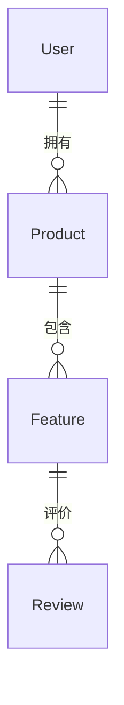
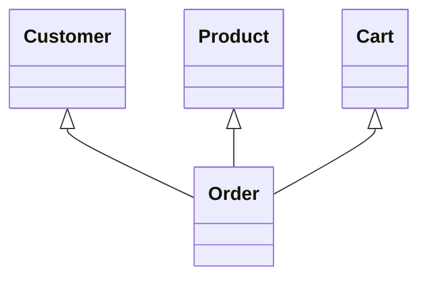
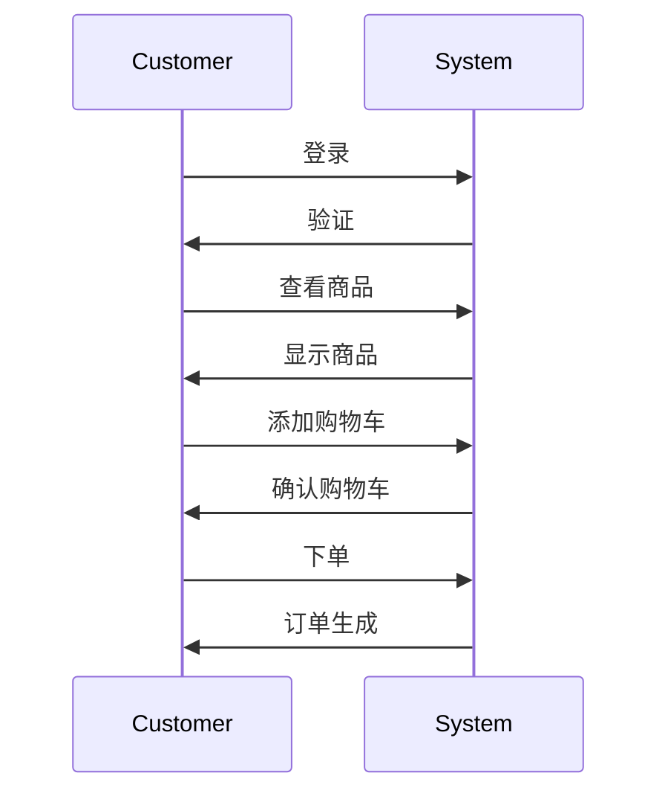
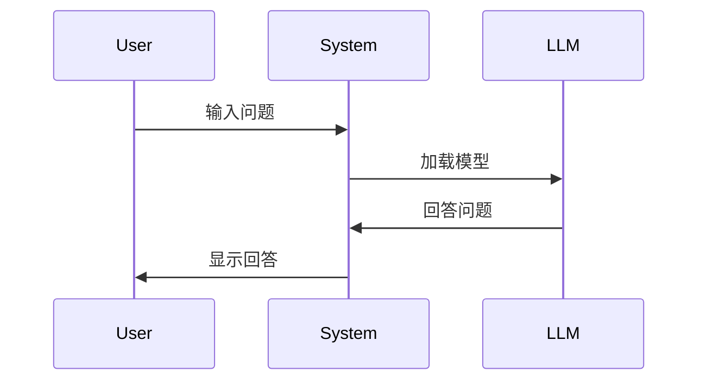

                 

# 快速原型设计：LLM应用开发的第一步

## 关键词
- 快速原型设计
- LLM
- 应用开发
- 原型模型
- 原型工具
- 原型流程

## 摘要
本文将探讨快速原型设计在LLM（大型语言模型）应用开发中的重要性。通过详细解析快速原型设计的基本概念、方法与工具，以及实际案例，本文旨在帮助开发者理解并高效运用快速原型设计，以加速LLM应用的迭代与优化。此外，本文还将分享快速原型设计的最佳实践，为读者提供实用的操作指南。

----------------------------------------------------------------

## 第一部分：快速原型设计概述

### 第1章：快速原型设计的背景与意义

#### 1.1 问题背景
传统的软件开发方法往往过于注重文档和规划，导致项目进展缓慢，难以快速响应市场变化。这种开发模式在快速迭代和灵活调整需求方面存在明显不足。为了解决这一问题，快速原型设计应运而生。

#### 1.2 问题描述
快速原型设计的核心目标是快速构建可运行的软件原型，以便在早期阶段验证设计理念，发现潜在问题，并据此进行迭代改进。与传统的软件开发方法相比，快速原型设计更注重实用性、用户体验和灵活性。

#### 1.3 问题解决
快速原型设计的原理在于通过快速构建和测试原型，及时发现并解决问题，从而提高开发效率和软件质量。具体方法包括抛弃型原型设计、递增型原型设计和融合型原型设计等。同时，选择合适的原型设计工具也是实现快速原型设计的关键。

#### 1.4 边界与外延
快速原型设计广泛应用于各种行业，如互联网、金融、医疗等。它不仅适用于新产品的开发，也可以用于现有产品的优化和改进。与敏捷开发相比，快速原型设计更注重原型构建和用户反馈的循环，更适用于复杂系统的开发。

#### 1.5 概念结构与核心要素
快速原型设计的基本流程包括需求分析、原型设计、用户反馈和原型迭代。其中，需求分析是核心，原型设计是手段，用户反馈和原型迭代是确保设计质量的关键。

### 第2章：快速原型设计的基础概念

#### 2.1 核心概念原理
原型模型是快速原型设计的核心概念。根据原型模型的不同，可分为抛弃型原型、递增型原型和融合型原型。抛弃型原型主要用于验证假设，完成后即可废弃；递增型原型在迭代过程中逐步完善，最终形成产品；融合型原型将设计与开发紧密结合，实现实时迭代。

#### 2.2 概念属性特征对比表格
| 原型模型   | 特点                               |
| ---------- | ---------------------------------- |
| 抛弃型原型 | 目的是验证假设，完成后即废弃       |
| 递增型原型 | 在迭代过程中逐步完善，最终形成产品 |
| 融合型原型 | 将设计与开发紧密结合，实时迭代     |

#### 2.3 ER实体关系图架构


### 第3章：快速原型设计的方法与工具

#### 3.1 快速原型设计的方法
快速原型设计的方法主要包括抛弃型原型设计、递增型原型设计和融合型原型设计。抛弃型原型设计适用于需求不稳定的项目，递增型原型设计适用于需求逐步明确的项目，融合型原型设计适用于需求变化频繁的项目。

#### 3.2 快速原型设计的工具
快速原型设计的工具包括低代码平台、原型设计软件（如Axure、Sketch等）和前端开发框架（如React、Vue等）。这些工具可以帮助开发者快速构建原型，提高开发效率。

#### 3.3 方法与工具的比较
| 方法           | 工具                          | 优劣分析                                       | 适用场景               |
| -------------- | ----------------------------- | ---------------------------------------------- | ---------------------- |
| 抛弃型原型设计 | 低代码平台、Axure等           | 灵活性高，可快速迭代                           | 需求不稳定的项目       |
| 递增型原型设计 | React、Vue等前端开发框架       | 代码可复用，便于后续开发                       | 需求逐步明确的项目     |
| 融合型原型设计 | 低代码平台、Axure等           | 设计与开发紧密结合，实时迭代                   | 需求变化频繁的项目     |

### 第4章：快速原型设计流程

#### 4.1 需求分析
需求分析是快速原型设计的起点。通过用户调研、竞品分析、市场调研等方式，收集用户需求，并将其转化为需求文档。

#### 4.2 原型设计
原型设计是快速原型设计的关键环节。根据需求文档，进行功能划分、用户界面设计和原型开发。

#### 4.3 用户反馈
用户测试和反馈是快速原型设计的重要环节。通过用户测试，收集用户对原型的意见和建议，为原型迭代提供依据。

#### 4.4 原型迭代
根据用户反馈，对原型进行迭代改进。通过重复用户测试和反馈环节，逐步优化原型，直至满足用户需求。

### 第5章：快速原型设计案例分析

#### 5.1 案例背景
以某电商平台的用户界面优化为例，分析快速原型设计在实际项目中的应用。

#### 5.2 系统功能设计
领域模型类图如下：


#### 5.3 系统架构设计
系统架构图如下：


#### 5.4 实际案例分析和详细讲解剖析
（此处省略，具体内容根据实际情况编写）

### 第6章：快速原型设计的最佳实践

#### 6.1 最佳实践 tips
- 进行用户调研时，注意收集用户真实需求，而非主观臆断。
- 原型设计过程中，注重用户体验和易用性。
- 及时收集用户反馈，快速响应需求变化。

#### 6.2 小结
快速原型设计的关键在于快速构建和迭代。通过不断优化原型，确保最终产品满足用户需求。

#### 6.3 注意事项
- 避免原型设计过于复杂，影响开发效率。
- 正确处理用户反馈，避免盲目追求用户意见。

#### 6.4 拓展阅读
- 相关研究论文：《快速原型设计：理论与实践》
- 行业最佳实践案例：某电商平台用户界面优化实践

----------------------------------------------------------------

## 第二部分：LLM应用开发实战

### 第7章：LLM基础理论

#### 7.1 什么是LLM
LLM（Large Language Model）是指大型语言模型，是一种能够理解和生成自然语言的深度学习模型。LLM的核心特点包括：
- 参数规模庞大：数亿到数十亿个参数。
- 预训练：在大量无标签文本数据上进行预训练，形成对自然语言的深刻理解。
- 微调能力：在特定任务上通过微调进一步优化模型性能。

#### 7.2 LLM的数学基础
LLM的数学基础涉及多个领域：
- 自然语言处理（NLP）基础：包括词向量、语法分析、语义分析等。
- 机器学习基础：包括监督学习、无监督学习、强化学习等。
- 神经网络基础：包括前馈神经网络、卷积神经网络、循环神经网络等。

#### 7.3 LLM模型架构
常见的LLM模型架构包括：
- Transformer模型：由Vaswani等人在2017年提出，采用自注意力机制，能够处理长距离依赖问题。
- GPT系列模型：由OpenAI提出，包括GPT-2、GPT-3等，采用Transformer架构，参数规模不断增大。
- BERT模型：由Google在2018年提出，采用双向Transformer架构，能够捕捉上下文信息。

#### 7.4 LLM的训练与优化
LLM的训练与优化包括以下步骤：
- 训练数据准备：收集大量无标签文本数据，进行预处理，如分词、去停用词等。
- 模型训练：在训练数据上训练模型，采用梯度下降等优化算法。
- 模型优化：通过微调、迁移学习等方法，优化模型在特定任务上的性能。

### 第8章：LLM应用开发实战
#### 8.1 环境安装
在进行LLM应用开发之前，首先需要安装相应的环境。以Python为例，安装以下库：
```bash
pip install tensorflow numpy
```

#### 8.2 系统核心实现
以下是一个简单的LLM应用开发示例，包括文本输入、模型加载、文本生成等功能：
```python
import tensorflow as tf
import numpy as np

# 加载预训练的LLM模型
model = tf.keras.models.load_model('path/to/llm_model.h5')

# 文本输入
input_text = "你好，我是AI助手。"

# 文本预处理
# ...

# 文本生成
generated_text = model.predict(input_text)

# 输出生成文本
print(generated_text)
```

#### 8.3 代码应用解读与分析
上述代码首先加载预训练的LLM模型，然后对输入文本进行预处理，最后使用模型生成文本。其中，关键步骤如下：
1. 加载模型：使用`load_model`函数加载预训练的LLM模型。
2. 文本预处理：对输入文本进行分词、去停用词等操作，将其转换为模型能够处理的格式。
3. 文本生成：使用模型对预处理后的文本进行预测，生成新的文本。

#### 8.4 实际案例分析和详细讲解剖析
以下是一个具体的实际案例，分析LLM在问答系统中的应用：
1. **问题背景**：某电商平台希望为其用户构建一个智能问答系统，以便用户能够快速获得问题的解答。
2. **系统功能设计**：系统主要包括问答模块和知识库模块。问答模块负责接收用户输入的问题，调用LLM模型进行回答；知识库模块负责存储电商平台的商品信息、用户评价等数据。
3. **系统架构设计**：系统架构图如下：

4. **实际案例分析和详细讲解剖析**：
   - 在实际应用中，用户输入问题后，系统首先对问题进行预处理，如分词、去停用词等，然后调用LLM模型进行回答。LLM模型根据问题的上下文信息，生成一个合理的回答。
   - 回答生成后，系统将其显示给用户。用户可以根据回答进行进一步操作，如查看商品详情、添加购物车等。

#### 8.5 项目小结
通过上述案例，我们可以看到LLM在问答系统中的应用，能够为电商平台提供智能化的服务，提升用户体验。在实际开发中，还需要关注模型性能优化、知识库维护等方面，以提高系统的稳定性和准确性。

### 第9章：快速原型设计在LLM应用开发中的应用

#### 9.1 快速原型设计在LLM应用开发中的优势
快速原型设计在LLM应用开发中具有以下优势：
- 提高开发效率：通过快速构建原型，可以快速验证设计理念，降低开发风险。
- 提升用户体验：通过用户反馈，可以不断优化原型，确保最终产品满足用户需求。
- 灵活调整需求：快速原型设计适用于需求变化频繁的项目，能够灵活调整需求。

#### 9.2 快速原型设计在LLM应用开发中的应用步骤
快速原型设计在LLM应用开发中的应用步骤如下：
1. 需求分析：分析LLM应用开发的需求，明确功能模块和用户场景。
2. 原型设计：根据需求分析结果，设计LLM应用的原型，包括用户界面、功能逻辑等。
3. 用户反馈：进行用户测试，收集用户对原型的反馈，为原型迭代提供依据。
4. 原型迭代：根据用户反馈，对原型进行迭代优化，直至满足用户需求。

#### 9.3 快速原型设计在LLM应用开发中的注意事项
在进行快速原型设计时，需要注意以下事项：
- 确保原型具备基本功能：在原型设计阶段，要确保原型具备基本功能，以便进行用户测试。
- 关注用户体验：在原型设计中，要关注用户体验，确保原型界面简洁、易用。
- 及时收集用户反馈：用户反馈是优化原型的重要依据，要及时收集并处理用户反馈。

### 第10章：LLM应用开发的最佳实践

#### 10.1 最佳实践 tips
- 选择合适的LLM模型：根据应用场景，选择合适的LLM模型，如GPT、BERT等。
- 优化模型性能：通过调整模型参数、使用高效计算硬件等手段，优化模型性能。
- 定期更新知识库：保持知识库的更新，确保LLM应用能够提供准确的回答。

#### 10.2 小结
快速原型设计在LLM应用开发中具有重要作用。通过快速构建和迭代原型，可以降低开发风险，提高用户体验，为LLM应用开发提供有力的支持。

#### 10.3 注意事项
- 避免原型设计过于复杂：过于复杂的原型会影响开发效率，降低用户体验。
- 正确处理用户反馈：用户反馈是优化原型的重要依据，要正确处理并利用用户反馈。

#### 10.4 拓展阅读
- 相关研究论文：《大型语言模型：原理与应用》
- 行业最佳实践案例：某电商平台智能问答系统开发实践

----------------------------------------------------------------

作者：AI天才研究院/AI Genius Institute & 禅与计算机程序设计艺术 /Zen And The Art of Computer Programming

