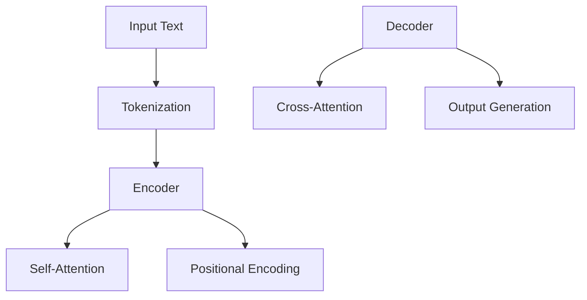

                 

# 快速响应安全威胁：LLM应用的防护策略

关键词：安全威胁、LLM应用、防护策略、实时检测、人工智能

摘要：
随着人工智能技术的迅猛发展，大型语言模型（LLM）在众多领域中展现出强大的应用潜力。然而，LLM应用也面临着日益严峻的安全威胁。本文将探讨快速响应安全威胁的方法，并详细介绍LLM应用的防护策略，帮助开发者构建安全、稳定的AI应用。

## Part 1: 背景和概述

### Chapter 1: 安全威胁概述

#### 1.1 安全威胁的定义

安全威胁指的是对计算机系统、网络、应用程序或数据的潜在威胁。这些威胁可能来自恶意软件、网络攻击、内部员工不当行为等多种来源。安全威胁可以分为以下几类：

- **恶意软件**：包括病毒、木马、蠕虫等，它们可以通过感染计算机系统，破坏数据、窃取信息或阻止正常使用。

- **网络攻击**：包括拒绝服务攻击（DDoS）、SQL注入、跨站脚本攻击（XSS）等，这些攻击可以破坏系统的稳定性和完整性。

- **内部威胁**：包括内部员工的恶意行为、疏忽大意等，这些行为可能导致敏感数据泄露或系统受损。

#### 1.2 安全威胁的类型

- **恶意软件攻击**：恶意软件通过感染系统，导致数据丢失、系统崩溃等问题。例如，勒索软件可以加密用户数据，要求支付赎金才能解密。

- **网络钓鱼**：网络攻击者通过伪装成可信的网站或邮件，诱骗用户输入敏感信息，如用户名、密码和信用卡号。

- **数据泄露**：由于安全措施不足，导致敏感数据在未经授权的情况下被泄露。

- **DDoS攻击**：攻击者通过发送大量无效请求，使目标系统过载，导致其无法正常提供服务。

#### 1.3 安全威胁对LLM应用的影响

LLM应用通常涉及大量敏感数据，如用户个人信息、企业机密信息等。如果这些应用受到安全威胁，可能导致以下影响：

- **数据泄露**：敏感数据泄露可能导致用户隐私受到侵犯，企业形象受损。

- **系统瘫痪**：恶意攻击可能导致LLM应用无法正常提供服务，影响用户体验。

- **经济损失**：由于安全威胁，企业可能需要投入大量资源进行修复和补救，导致经济损失。

- **声誉受损**：安全事件可能导致用户对企业的信任度下降，影响企业的长远发展。

#### 1.4 LLM在安全威胁响应中的角色

LLM在安全威胁响应中具有重要作用。通过使用LLM技术，可以实现对安全威胁的自动检测和响应，提高安全防护能力。以下是LLM在安全威胁响应中的几个关键角色：

- **实时威胁检测**：LLM可以通过对网络流量、日志文件等数据的分析，实时检测潜在的安全威胁。

- **威胁情报分析**：LLM可以对大量的威胁情报进行分析，识别新的威胁趋势和模式。

- **自动化响应**：LLM可以帮助实现自动化响应，例如隔离受感染的系统、阻止恶意流量等。

- **安全培训**：LLM可以用于开发安全培训工具，帮助员工提高安全意识，降低内部威胁。

### Chapter 2: LLM应用的理解

#### 2.1 LLM的基本概念和重要性

大型语言模型（LLM）是一种基于深度学习技术的人工智能模型，能够理解和生成自然语言。LLM在自然语言处理（NLP）领域具有广泛的应用，如文本分类、机器翻译、情感分析等。

LLM的重要性体现在以下几个方面：

- **提高NLP性能**：LLM通过大量的数据训练，能够显著提高NLP任务的性能。

- **跨语言应用**：LLM可以处理多种语言，支持跨语言的应用。

- **自动化内容生成**：LLM可以自动化生成文章、报告、邮件等文本内容。

- **智能客服**：LLM可以用于开发智能客服系统，提供高效、准确的客户服务。

#### 2.2 LLM的工作原理

LLM的工作原理基于神经网络，特别是变换器（Transformer）架构。变换器架构通过多头自注意力机制，可以自动捕捉文本中的上下文关系，从而实现高效的自然语言处理。

LLM的工作流程包括以下几个步骤：

- **数据预处理**：对原始文本进行清洗、分词等预处理操作，将其转换为模型可接受的格式。

- **编码**：将预处理后的文本编码为向量表示，用于输入到变换器模型。

- **自注意力计算**：变换器模型通过多头自注意力机制，对输入向量进行加权，生成表示文本上下文关系的输出向量。

- **解码**：根据输出向量生成文本，实现自然语言生成。

#### 2.3 LLM的发展历程

LLM的发展经历了以下几个阶段：

- **词袋模型**：早期的NLP模型，将文本表示为单词的集合，不考虑单词之间的顺序关系。

- **循环神经网络（RNN）**：引入时间步的概念，能够处理文本中的序列信息。

- **长短期记忆网络（LSTM）**：对RNN进行改进，解决了梯度消失和梯度爆炸问题。

- **变换器（Transformer）**：引入自注意力机制，实现了文本表示的突破性进展。

- **大型语言模型（LLM）**：基于变换器架构，通过大量的数据训练，实现了对自然语言的高度理解能力。

### Chapter 3: 常见威胁场景和LLM漏洞

#### 3.1 社交工程攻击

社交工程攻击是一种利用人类心理和社会行为弱点，诱骗用户泄露敏感信息的攻击方式。常见的社交工程攻击包括：

- **钓鱼攻击**：通过伪装成可信的网站或邮件，诱骗用户输入敏感信息，如用户名、密码和信用卡号。

- **社会工程学攻击**：通过伪装成某个人或组织，欺骗用户执行特定操作，如转移资金、泄露机密信息等。

LLM应用可能成为社交工程攻击的目标，因为攻击者可以通过LLM生成逼真的攻击内容，提高欺骗成功的概率。

#### 3.2 恶意代码注入

恶意代码注入是指攻击者在应用程序中注入恶意代码，使其执行恶意行为。常见的恶意代码注入方式包括：

- **SQL注入**：通过在输入数据中插入恶意SQL代码，操纵数据库查询，从而窃取或篡改数据。

- **跨站脚本（XSS）**：通过在网页中插入恶意脚本，劫持用户的浏览器会话，窃取敏感信息或执行恶意操作。

LLM应用可能存在注入漏洞，因为攻击者可以利用LLM生成恶意代码，绕过安全检测和防护措施。

#### 3.3 数据泄漏和隐私侵犯

数据泄漏和隐私侵犯是指敏感数据在未经授权的情况下被泄露或滥用。常见的泄漏和隐私侵犯方式包括：

- **数据窃取**：通过窃取数据库、文件等存储的敏感数据，进行非法获利或非法使用。

- **数据篡改**：通过篡改敏感数据，影响业务决策或造成经济损失。

LLM应用通常涉及大量敏感数据，如用户个人信息、企业机密信息等。如果安全防护措施不足，可能导致数据泄漏和隐私侵犯。

### Chapter 4: 防护策略概述

#### 4.1 防护措施的重要性

在LLM应用中实施有效的防护措施至关重要，原因如下：

- **保护用户隐私**：有效的防护措施可以防止敏感数据泄露，保护用户隐私。

- **保障业务稳定**：防护措施可以防止恶意攻击导致系统瘫痪，保障业务的正常运行。

- **维护企业形象**：良好的安全防护措施可以树立企业的专业形象，提高用户对企业的信任度。

#### 4.2 防护措施的类型

防护措施可以分为以下几类：

- **网络安全防护**：包括防火墙、入侵检测系统（IDS）、入侵防御系统（IPS）等，用于阻止恶意流量和攻击。

- **数据安全防护**：包括数据加密、数据备份、访问控制等，用于保护数据的安全和完整性。

- **应用安全防护**：包括安全编码、安全配置、安全审计等，用于提高应用程序的安全性。

- **员工安全培训**：通过培训提高员工的安全意识和技能，降低内部威胁。

#### 4.3 防护措施在LLM应用中的整合

在LLM应用中整合防护措施，需要考虑以下几个方面：

- **安全需求分析**：根据LLM应用的特点和需求，确定所需的安全防护措施。

- **安全架构设计**：设计合理的安全架构，确保防护措施能够有效实施。

- **安全开发流程**：将安全防护措施纳入开发流程，确保应用程序从设计到部署都具备安全性。

- **安全测试与审计**：对LLM应用进行安全测试和审计，发现并修复安全漏洞。

## Part 2: LLM应用的理解

### Chapter 5: 实施防护措施

#### 5.1 实施安全检查

安全检查是确保LLM应用安全的关键步骤，以下是一些常见的安全检查措施：

- **身份验证和授权**：通过验证用户的身份和权限，确保只有授权用户可以访问系统资源。

- **输入验证和清洗**：对用户输入的数据进行验证和清洗，防止恶意代码注入和SQL注入等攻击。

- **访问控制**：设置合理的访问控制策略，限制用户对系统资源的访问权限。

- **日志审计**：记录系统操作日志，以便在发生安全事件时进行追踪和分析。

#### 5.2 实施输入验证和清洗

输入验证和清洗是防止恶意代码注入和SQL注入等攻击的重要措施。以下是一些具体的方法：

- **输入类型检查**：确保输入数据的类型与预期一致，防止恶意代码注入。

- **正则表达式匹配**：使用正则表达式匹配输入数据，筛选掉不符合预期格式的数据。

- **数据编码转换**：将输入数据编码转换为安全格式，防止恶意代码执行。

- **数据库访问控制**：限制数据库访问权限，防止未授权用户访问和操作数据库。

### Chapter 6: 实时威胁检测和响应

#### 6.1 实时威胁检测系统

实时威胁检测系统是一种用于监控和分析网络流量、日志文件等数据，实时识别潜在安全威胁的系统。以下是一些常见的实时威胁检测系统：

- **入侵检测系统（IDS）**：用于检测网络中的异常流量和攻击行为。

- **入侵防御系统（IPS）**：在IDS的基础上，具备自动响应功能，如阻断攻击流量、隔离受感染主机等。

- **端点检测与响应（EDR）**：用于检测和响应端点设备上的安全威胁。

#### 6.2 实时检测的实现

实现实时检测需要以下几个步骤：

- **数据采集**：收集网络流量、日志文件等数据，作为检测的输入。

- **数据预处理**：对采集到的数据进行分析和处理，提取特征信息。

- **特征匹配**：将提取的特征与预定义的攻击特征库进行匹配，识别潜在的威胁。

- **实时响应**：根据检测到的威胁，自动采取相应的响应措施，如阻断攻击流量、隔离受感染主机等。

#### 6.3 LLM应用中的实时检测系统案例

以下是一个基于LLM的实时检测系统案例：

- **数据采集**：收集LLM应用的日志文件、网络流量等数据。

- **数据预处理**：对采集到的数据进行分析和处理，提取威胁特征。

- **特征匹配**：将提取的特征与预定义的攻击特征库进行匹配，识别潜在的威胁。

- **实时响应**：根据检测到的威胁，自动采取相应的响应措施，如阻断攻击流量、隔离受感染主机等。

## Part 3: 威胁场景和LLM漏洞分析

### Chapter 7: 案例研究和最佳实践

#### 7.1 成功的威胁响应案例分析

在本章节，我们将分析一些成功的威胁响应案例，了解如何有效地应对安全威胁，并总结出一些最佳实践。

#### 7.2 LLM应用的防护最佳实践

在本章节，我们将总结一些LLM应用防护的最佳实践，帮助开发者构建安全、稳定的AI应用。

#### 7.3 注意事项和扩展阅读

在本章节，我们将讨论一些注意事项，并提供一些扩展阅读资源，帮助读者进一步了解LLM应用的安全防护策略。## Part 1: 背景和概述

### Chapter 1: 安全威胁概述

#### 1.1 安全威胁的定义

安全威胁是指对计算机系统、网络、应用程序或数据构成潜在危险的因素。这些威胁可能来自内部或外部，以不同的形式和手段进行攻击，目的通常是获取非法访问权限、窃取敏感信息、破坏系统或造成其他形式的损害。理解安全威胁的定义对于制定有效的防护策略至关重要。

**核心概念**：安全威胁、潜在危险、计算机系统、网络、应用程序、数据。

**联系**：安全威胁是针对计算机系统和数据的一种潜在危险，可能会对系统的稳定性、数据的完整性和用户的隐私造成影响。

#### 1.2 安全威胁的类型

安全威胁可以按其性质和手段进行分类，常见的威胁类型包括：

1. **恶意软件攻击**：包括病毒、木马、蠕虫等，它们可以通过感染系统，破坏数据、窃取信息或阻止正常使用。
2. **网络攻击**：包括拒绝服务攻击（DDoS）、SQL注入、跨站脚本攻击（XSS）等，这些攻击可以破坏系统的稳定性和完整性。
3. **内部威胁**：包括内部员工的恶意行为、疏忽大意等，这些行为可能导致敏感数据泄露或系统受损。
4. **社交工程攻击**：利用人类心理和社会行为弱点，诱骗用户泄露敏感信息。
5. **数据泄漏和隐私侵犯**：敏感数据在未经授权的情况下被泄露或滥用。

**ER实体关系图**：

```mermaid
erDiagram
    Threat --> System : causes damage to
    Threat --> Data : compromises security of
    System |--|> User : provides access to
    Data |--|> Privacy : relates to
    Threat --> InternalThreat : originates from
    SocialEngineeringAttack ||--|> Threat : a type of
    DataLeakage ||--|> Threat : a type of
```

**概念属性特征对比表格**：

| 特征       | 恶意软件攻击 | 网络攻击 | 内部威胁 | 社交工程攻击 | 数据泄漏和隐私侵犯 |
| ---------- | ------------ | -------- | -------- | ------------ | ----------------- |
| 目的       | 破坏、窃取   | 破坏、窃取 | 破坏、窃取 | 窃取         | 窃取、泄露       |
| 手段       | 感染、破坏   | 注入、攻击 | 恶意行为、疏忽 | 诱骗         | 不当处理         |
| 受害对象   | 计算机、数据 | 系统、网络 | 系统、数据 | 用户         | 数据             |
| 影响范围   | 局部或全局   | 局部或全局 | 局部或全局 | 局部或全局   | 局部或全局       |

#### 1.3 安全威胁对LLM应用的影响

LLM应用涉及大量敏感数据，如用户个人信息、企业机密信息等。安全威胁对LLM应用的影响包括：

1. **数据泄露**：敏感数据泄露可能导致用户隐私受到侵犯，企业形象受损。
2. **系统瘫痪**：恶意攻击可能导致LLM应用无法正常提供服务，影响用户体验。
3. **经济损失**：由于安全威胁，企业可能需要投入大量资源进行修复和补救，导致经济损失。
4. **声誉受损**：安全事件可能导致用户对企业的信任度下降，影响企业的长远发展。

**数学模型**：

假设安全威胁对LLM应用的损失为L，用户数据泄露概率为P\_leak，系统瘫痪概率为P\_down，经济损失为C\_economic，声誉受损概率为P\_reputation。

L = P\_leak * D\_leak + P\_down * D\_down + P\_economic * C\_economic + P\_reputation * R\_reputation

其中，D\_leak、D\_down、C\_economic、R\_reputation 分别表示数据泄露、系统瘫痪、经济损失和声誉受损的损失值。

#### 1.4 LLM在安全威胁响应中的角色

LLM在安全威胁响应中扮演着重要角色，主要体现在以下几个方面：

1. **实时威胁检测**：LLM可以通过分析网络流量、日志文件等数据，实时检测潜在的安全威胁。
2. **威胁情报分析**：LLM可以处理大量的威胁情报，识别新的威胁趋势和模式。
3. **自动化响应**：LLM可以帮助实现自动化响应，如隔离受感染的系统、阻止恶意流量等。
4. **安全培训**：LLM可以用于开发安全培训工具，帮助员工提高安全意识，降低内部威胁。

**数学公式**：

假设威胁检测的准确率为P\_accuracy，响应的准确率为P\_response，则LLM在安全威胁响应中的效果可以表示为：

Effectiveness = P\_accuracy * P\_response

其中，Effectiveness 表示LLM的安全威胁响应效果，P\_accuracy 表示威胁检测的准确率，P\_response 表示响应的准确率。

### Chapter 2: LLM应用的理解

#### 2.1 LLM的基本概念和重要性

**核心概念**：大型语言模型（LLM）、自然语言处理（NLP）、深度学习、变换器（Transformer）。

**联系**：LLM是一种基于深度学习技术的人工智能模型，用于处理和生成自然语言。它在NLP领域具有广泛的应用，如文本分类、机器翻译、情感分析等。

**属性特征对比表格**：

| 模型           | 词袋模型 | 循环神经网络（RNN） | 变换器（Transformer） | LLM          |
| -------------- | -------- | ------------------- | --------------------- | ------------ |
| 基础架构       | 基于单词集合       | 时间序列模型       | 自注意力机制         | 多层变换器   |
| 数据处理能力   | 低       | 中等               | 高                   | 非常高       |
| 训练时间       | 长       | 较长               | 短                   | 短           |
| 性能表现       | 差       | 中等               | 优秀                 | 优秀         |

#### 2.2 LLM的工作原理

**算法原理**：

LLM的工作原理基于变换器（Transformer）架构，其主要组成部分包括：

1. **编码器（Encoder）**：用于对输入文本进行编码，生成表示文本上下文的向量。
2. **解码器（Decoder）**：用于根据编码器的输出，生成输出文本。

**变换器架构**：

**Mermaid 流程图**：



**Python 源代码**：

```python
import tensorflow as tf
from tensorflow.keras.layers import Embedding, Dense, LSTM

# 创建一个简单的变换器模型
model = tf.keras.Sequential([
    Embedding(input_dim=vocab_size, output_dim=embedding_dim),
    LSTM(units=512, return_sequences=True),
    LSTM(units=512, return_sequences=True),
    Dense(units=vocab_size, activation='softmax')
])

# 编译模型
model.compile(optimizer='adam', loss='categorical_crossentropy', metrics=['accuracy'])

# 训练模型
model.fit(input_data, labels, epochs=10, batch_size=64)
```

#### 2.3 LLM的发展历程

**核心概念**：词袋模型、循环神经网络（RNN）、长短期记忆网络（LSTM）、变换器（Transformer）。

**联系**：LLM的发展历程反映了NLP技术在深度学习领域的不断演进，从简单的词袋模型到复杂的变换器架构，实现了NLP性能的显著提升。

**ER实体关系图**：

```mermaid
erDiagram
    WordBagModel ||--|> RNN
    RNN ||--|> LSTM
    LSTM ||--|> Transformer
    Transformer ||--|> LLM
```

### Chapter 3: 威胁场景和LLM漏洞分析

#### 3.1 社交工程攻击

**核心概念**：社交工程攻击、钓鱼攻击、社会工程学攻击。

**联系**：社交工程攻击利用人类的心理和社会行为弱点，诱骗用户泄露敏感信息。

**属性特征对比表格**：

| 类型       | 钓鱼攻击 | 社会工程学攻击 |
| ---------- | -------- | -------------- |
| 目的       | 获取信息 | 诱骗执行操作   |
| 手段       | 伪装     | 谎言和欺骗     |
| 受害对象   | 用户     | 员工和用户     |
| 影响范围   | 广泛     | 局部或全局     |

**数学模型**：

假设社交工程攻击的成功概率为P\_success，用户泄露信息的概率为P\_leak，则社交工程攻击对系统的损害可以表示为：

Damage = P\_success * P\_leak * C\_leak

其中，C\_leak 表示信息泄露的损失值。

#### 3.2 恶意代码注入

**核心概念**：SQL注入、跨站脚本攻击（XSS）、跨站请求伪造（CSRF）。

**联系**：恶意代码注入是通过在应用程序中插入恶意代码，使其执行恶意行为。

**属性特征对比表格**：

| 类型       | SQL注入 | XSS             | CSRF           |
| ---------- | ------- | --------------- | -------------- |
| 目的       | 篡改数据 | 执行恶意脚本    | 恶意请求       |
| 手段       | 注入SQL代码 | 插入恶意脚本    | 欺骗提交请求    |
| 受害对象   | 数据库   | 浏览器         | 受害者账户     |
| 影响范围   | 局部或全局 | 局部或全局     | 局部或全局     |

**数学模型**：

假设恶意代码注入的成功概率为P\_success，导致数据泄露的概率为P\_leak，则恶意代码注入对系统的损害可以表示为：

Damage = P\_success * P\_leak * C\_leak

其中，C\_leak 表示数据泄露的损失值。

#### 3.3 数据泄漏和隐私侵犯

**核心概念**：数据泄漏、隐私侵犯、敏感数据。

**联系**：数据泄漏和隐私侵犯是指敏感数据在未经授权的情况下被泄露或滥用。

**属性特征对比表格**：

| 类型       | 数据泄漏 | 隐私侵犯 |
| ---------- | -------- | -------- |
| 目的       | 泄露数据 | 窃取信息 |
| 手段       | 窃取、窃取 | 窃取、窃取 |
| 受害对象   | 数据库   | 用户     |
| 影响范围   | 局部或全局 | 局部或全局 |

**数学模型**：

假设数据泄漏的概率为P\_leak，隐私侵犯的概率为P\_invasion，则数据泄漏和隐私侵犯对系统的损害可以表示为：

Damage = P\_leak * C\_leak + P\_invasion * C\_invasion

其中，C\_leak 和 C\_invasion 分别表示数据泄漏和隐私侵犯的损失值。

## Part 4: 防护策略

### Chapter 4: 防护策略概述

#### 4.1 防护措施的重要性

在数字时代，防护措施对于保障系统的安全至关重要。特别是在LLM应用中，由于涉及大量敏感数据和复杂的计算模型，防护措施的重要性更加凸显。以下是一些关键点：

1. **保护用户隐私**：LLM应用通常处理大量用户数据，如个人信息、交易记录等。有效的防护措施可以防止这些敏感数据泄露，保护用户隐私。
2. **维护业务连续性**：安全威胁可能导致系统瘫痪、服务中断，对企业造成直接的经济损失。防护措施可以降低这些风险，确保业务的连续性。
3. **提升用户体验**：安全威胁会影响用户体验，如系统崩溃、服务中断等。通过实施防护措施，可以减少这些负面体验，提升用户满意度。
4. **降低运营成本**：虽然实施防护措施需要一定的投入，但相比于安全事件发生后的修复和补救成本，防护措施的成本效益更高。

#### 4.2 防护措施的类型

防护措施可以分为多个层次，以应对不同类型的安全威胁。以下是几种常见的防护措施类型：

1. **网络安全防护**：包括防火墙、入侵检测系统（IDS）、入侵防御系统（IPS）等。这些措施可以阻止未经授权的访问和恶意流量，保护网络边界。
2. **数据安全防护**：包括数据加密、数据备份、访问控制等。这些措施可以保护数据在存储和传输过程中的安全，防止数据泄漏和篡改。
3. **应用安全防护**：包括安全编码、安全配置、安全审计等。这些措施可以防止应用程序中的安全漏洞，降低安全风险。
4. **员工安全培训**：通过培训提高员工的安全意识和技能，降低内部威胁。
5. **威胁情报**：收集和分析威胁情报，提前识别和应对潜在的安全威胁。

#### 4.3 防护措施在LLM应用中的整合

在LLM应用中整合防护措施，需要考虑以下几个方面：

1. **安全需求分析**：根据LLM应用的特点和需求，确定所需的安全防护措施。
2. **安全架构设计**：设计合理的安全架构，确保防护措施能够有效实施。
3. **安全开发流程**：将安全防护措施纳入开发流程，确保应用程序从设计到部署都具备安全性。
4. **安全测试与审计**：定期进行安全测试和审计，发现并修复安全漏洞。

### Chapter 5: 实施防护措施

#### 5.1 实施安全检查

安全检查是确保系统安全的重要步骤，以下是一些常见的安全检查措施：

1. **身份验证和授权**：通过验证用户的身份和权限，确保只有授权用户可以访问系统资源。常用的身份验证方法包括密码、双因素认证（2FA）等。
2. **输入验证和清洗**：对用户输入的数据进行验证和清洗，防止恶意代码注入和SQL注入等攻击。例如，检查输入数据的类型、长度和格式，使用正则表达式进行过滤。
3. **访问控制**：设置合理的访问控制策略，限制用户对系统资源的访问权限。可以使用基于角色的访问控制（RBAC）或基于属性的访问控制（ABAC）等机制。
4. **日志审计**：记录系统操作日志，以便在发生安全事件时进行追踪和分析。例如，记录用户登录、数据访问等操作，以便后续的审计和调查。

#### 5.2 实施输入验证和清洗

输入验证和清洗是防止恶意代码注入和SQL注入等攻击的关键措施，以下是一些具体的方法：

1. **输入类型检查**：确保输入数据的类型与预期一致，防止恶意代码注入。例如，检查输入是否为数字、文本或日期等。
2. **正则表达式匹配**：使用正则表达式匹配输入数据，筛选掉不符合预期格式的数据。例如，使用正则表达式检查输入的电子邮件地址、电话号码等。
3. **数据编码转换**：将输入数据编码转换为安全格式，防止恶意代码执行。例如，将特殊字符转换为HTML实体，防止跨站脚本攻击（XSS）。
4. **数据库访问控制**：限制数据库访问权限，防止未授权用户访问和操作数据库。例如，只允许授权用户执行特定的SQL语句。

### Chapter 6: 实时威胁检测和响应

#### 6.1 实时威胁检测系统

实时威胁检测系统是一种用于监控和分析网络流量、日志文件等数据，实时识别潜在安全威胁的系统。以下是一些常见的实时威胁检测系统：

1. **入侵检测系统（IDS）**：用于检测网络中的异常流量和攻击行为。IDS可以分为基于特征检测和基于异常检测两种类型。
2. **入侵防御系统（IPS）**：在IDS的基础上，具备自动响应功能，如阻断攻击流量、隔离受感染主机等。
3. **端点检测与响应（EDR）**：用于检测和响应端点设备上的安全威胁。EDR通常包含威胁检测、威胁分析和威胁响应等功能。

#### 6.2 实时检测的实现

实现实时检测需要以下几个步骤：

1. **数据采集**：收集网络流量、日志文件等数据，作为检测的输入。
2. **数据预处理**：对采集到的数据进行分析和处理，提取特征信息。例如，提取网络流量中的源IP地址、目标IP地址、端口号等信息。
3. **特征匹配**：将提取的特征与预定义的攻击特征库进行匹配，识别潜在的威胁。例如，使用签名匹配、模式识别等方法。
4. **实时响应**：根据检测到的威胁，自动采取相应的响应措施，如阻断攻击流量、隔离受感染主机等。

#### 6.3 LLM应用中的实时检测系统案例

以下是一个基于LLM的实时检测系统案例：

1. **数据采集**：收集LLM应用的日志文件、网络流量等数据。
2. **数据预处理**：对采集到的数据进行分析和处理，提取威胁特征。例如，使用正则表达式提取日志中的异常操作、关键字等。
3. **特征匹配**：将提取的特征与预定义的攻击特征库进行匹配，识别潜在的威胁。例如，使用机器学习算法进行分类和预测。
4. **实时响应**：根据检测到的威胁，自动采取相应的响应措施。例如，阻断可疑的网络流量、隔离受感染的主机等。

## Part 5: 实施防护措施

### Chapter 7: 实施安全防护

#### 7.1 实施安全防护策略的步骤

实施安全防护策略是一个系统化的过程，需要从多个方面进行考虑和操作。以下是实施安全防护策略的基本步骤：

1. **风险评估**：首先，进行风险评估，识别系统中最可能面临的安全威胁，并评估这些威胁的可能性和影响。这有助于确定哪些防护措施是优先需要实施的。

2. **制定安全政策**：基于风险评估的结果，制定一套详细的安全政策，包括安全目标、安全标准和操作流程。这些政策应确保与组织的业务目标和法律要求保持一致。

3. **安全架构设计**：设计一个安全架构，包括网络、应用和数据层面的安全控制措施。这包括部署防火墙、入侵检测系统（IDS）、入侵防御系统（IPS）等。

4. **实施安全控制**：根据安全政策和安全架构设计，实施具体的安全控制措施。这包括配置防火墙规则、加密数据传输、实现访问控制等。

5. **安全培训**：对员工进行安全培训，提高他们的安全意识和应对安全威胁的能力。这可以通过定期举办安全意识课程、发布安全指南和进行模拟攻击演习来实现。

6. **监控和审计**：建立监控和审计机制，实时监控系统安全状态，及时检测和响应安全事件。这包括日志分析、安全事件响应计划和定期安全审计。

7. **安全测试**：定期进行安全测试，包括漏洞扫描、渗透测试和代码审查，以发现和修复潜在的安全漏洞。

#### 7.2 实施安全检查的具体措施

实施安全检查是确保系统安全性的关键步骤。以下是一些具体的安全检查措施：

1. **身份验证和授权**：
   - 使用强密码策略，要求密码长度和复杂性。
   - 实施多因素身份验证（MFA），增加登录的安全性。
   - 定期审查和更新用户权限，确保只有授权用户可以访问系统资源。

2. **输入验证和清洗**：
   - 对用户输入的数据进行严格的验证，检查数据的类型、长度和格式。
   - 使用正则表达式或预定义的规则来过滤和清洗输入数据，防止恶意代码注入。
   - 对输入数据进行编码转换，如HTML实体编码，以防止跨站脚本（XSS）攻击。

3. **访问控制**：
   - 实施基于角色的访问控制（RBAC）或基于属性的访问控制（ABAC），确保用户只能访问他们有权访问的资源。
   - 定期审查和更新访问控制列表，移除不再需要的访问权限。

4. **日志审计**：
   - 记录系统操作日志，包括登录、数据访问和系统配置更改等。
   - 定期分析日志文件，查找异常行为和安全事件。
   - 实施实时监控，及时发现和响应安全事件。

#### 7.3 实施输入验证和清洗的方法

输入验证和清洗是防止恶意代码注入和其他类型攻击的重要措施。以下是几种实施输入验证和清洗的方法：

1. **输入类型检查**：
   - 检查输入数据的类型，确保输入为预期类型，如字符串、数字或日期。
   - 如果输入不符合预期类型，拒绝处理或返回错误信息。

2. **正则表达式匹配**：
   - 使用正则表达式来匹配和验证输入数据的格式。
   - 针对不同的输入类型，定义相应的正则表达式规则。

3. **数据编码转换**：
   - 将输入数据编码转换为安全格式，例如将HTML实体编码为HTML实体编码。
   - 防止跨站脚本（XSS）攻击，将用户输入的HTML标签转换为对应的HTML实体。

4. **数据库访问控制**：
   - 限制数据库访问权限，确保用户只能执行预定义的操作。
   - 使用参数化查询或存储过程来防止SQL注入攻击。

#### 7.4 实时威胁检测和响应系统的建立

实时威胁检测和响应系统是保护LLM应用免受安全威胁的关键。以下是建立实时威胁检测和响应系统的步骤：

1. **数据采集**：
   - 收集网络流量、系统日志、应用日志等数据。
   - 使用代理服务器、防火墙日志、入侵检测系统（IDS）等工具收集数据。

2. **数据预处理**：
   - 清洗和标准化数据，确保数据质量。
   - 提取与安全相关的特征，如IP地址、URL、用户行为等。

3. **威胁检测**：
   - 使用机器学习算法、规则匹配、异常检测等技术进行威胁检测。
   - 结合历史数据和实时数据，提高检测的准确性和效率。

4. **威胁响应**：
   - 根据检测到的威胁，自动采取相应的响应措施，如隔离受感染的主机、阻断恶意流量等。
   - 实现自动化响应策略，减少人工干预。

5. **监控和报告**：
   - 实时监控威胁检测和响应系统的运行状态，确保其有效性和可靠性。
   - 定期生成安全报告，向管理层和相关部门提供安全态势的详细信息。

### Chapter 8: 实时威胁检测和响应

#### 8.1 实时威胁检测系统的必要性

实时威胁检测系统在保障LLM应用安全方面扮演着至关重要的角色。随着网络攻击手段的不断升级和复杂化，传统的静态防护措施已经难以应对动态变化的威胁。实时威胁检测系统能够在威胁发生时迅速检测并响应，从而有效阻止攻击，降低安全事件带来的损失。

**必要性**：

1. **快速响应**：实时威胁检测系统能够在威胁发生时立即检测，并采取相应的防护措施，避免或减少安全事件的影响。
2. **自动化处理**：实时威胁检测系统可以实现自动化检测和响应，减少人工干预，提高工作效率。
3. **全面监控**：实时威胁检测系统可以监控网络流量、日志文件、系统行为等多方面数据，提供全面的安全态势感知。
4. **持续更新**：实时威胁检测系统可以根据最新的威胁情报和攻击模式进行更新，保持高效的检测能力。

#### 8.2 实时威胁检测系统的构建

构建一个实时威胁检测系统需要考虑以下几个方面：

1. **数据采集**：收集来自网络流量、系统日志、应用日志、数据库日志等多种来源的数据。使用代理服务器、入侵检测系统（IDS）、防火墙等工具进行数据采集。

2. **数据预处理**：清洗和标准化收集到的数据，去除噪音和无关信息，确保数据质量。对数据进行特征提取，如提取IP地址、URL、用户行为等关键信息。

3. **威胁检测算法**：选择合适的威胁检测算法，如基于规则的检测、基于机器学习的检测、异常检测等。结合多种算法，提高检测的准确性和效率。

4. **威胁响应策略**：制定详细的威胁响应策略，包括隔离受感染的主机、阻断恶意流量、修改安全策略等。确保在检测到威胁时，系统能够快速、有效地采取响应措施。

5. **集成与部署**：将实时威胁检测系统与现有安全架构集成，如与防火墙、入侵防御系统（IPS）等联动。部署到生产环境，确保系统能够实时监控和响应威胁。

#### 8.3 LLM应用中的实时威胁检测

在LLM应用中，实时威胁检测系统具有特定的挑战和需求：

1. **数据处理能力**：LLM应用通常处理大量数据，实时威胁检测系统需要具备高效的数据处理能力，确保在处理大量数据时不会影响系统的性能。

2. **模型适应性**：实时威胁检测系统需要能够快速适应新的威胁模式和攻击手段，如使用机器学习算法进行模型更新和优化。

3. **跨语言检测**：LLM应用通常涉及多种语言，实时威胁检测系统需要能够处理不同语言的数据，确保跨语言的威胁检测能力。

4. **可扩展性**：实时威胁检测系统需要具备良好的可扩展性，能够随着应用规模的扩大而扩展，以适应不断增长的安全需求。

#### 8.4 实时威胁检测和响应系统的案例

以下是一个基于LLM应用的实时威胁检测和响应系统的案例：

1. **数据采集**：使用代理服务器收集网络流量，使用入侵检测系统（IDS）收集系统日志，使用数据库日志收集器收集数据库日志。

2. **数据预处理**：清洗和标准化收集到的数据，提取关键特征，如IP地址、URL、用户行为等。

3. **威胁检测**：使用机器学习算法对提取的特征进行分析，识别潜在的威胁。结合规则匹配和异常检测技术，提高检测的准确性和效率。

4. **威胁响应**：在检测到威胁时，立即采取响应措施，如隔离受感染的主机、阻断恶意流量等。同时，记录检测和响应的详细信息，用于后续的分析和审计。

5. **监控和报告**：实时监控系统的运行状态，生成安全报告，向管理层和相关部门提供安全态势的详细信息。

### Chapter 9: 案例研究和最佳实践

#### 9.1 成功的威胁响应案例分析

在本章节中，我们将分析一些成功的威胁响应案例，探讨如何通过有效的策略和技术手段应对安全威胁，并总结出一些最佳实践。

**案例一：某大型电商平台的DDoS攻击防御**

- **背景**：某大型电商平台在一次促销活动期间，遭受了大规模的分布式拒绝服务（DDoS）攻击，导致网站访问速度急剧下降，用户体验严重受损。
- **响应**：
  1. **流量清洗**：利用DDoS防护服务，对攻击流量进行清洗，过滤掉恶意流量。
  2. **负载均衡**：启用负载均衡器，将流量分配到多个服务器，避免单点故障。
  3. **备用域名**：启用备用域名，确保用户可以通过备用域名访问网站。
  4. **用户通知**：通过邮件和短信通知用户，解释网站访问问题，提供解决方案。
- **效果**：通过上述措施，电商平台成功应对了DDoS攻击，恢复了网站的正常访问，降低了攻击对业务的影响。

**案例二：某金融公司的数据泄漏应对**

- **背景**：某金融公司在一次网络攻击中，客户数据被窃取，导致数百名客户的信息泄露。
- **响应**：
  1. **紧急停机**：立即关闭受攻击的系统，防止数据进一步泄漏。
  2. **通知监管机构**：立即通知相关监管机构，报告数据泄漏事件。
  3. **客户通知**：通知受影响的客户，提供补救措施，如更换密码、监控账户活动等。
  4. **安全审查**：进行全面的安全审查，找出漏洞并加以修复。
- **效果**：通过及时响应和有效的补救措施，金融公司成功控制了数据泄漏事件，维护了客户信任。

#### 9.2 LLM应用防护的最佳实践

在本章节中，我们将总结一些LLM应用防护的最佳实践，帮助开发者构建安全、稳定的AI应用。

**最佳实践一：安全需求分析**

- 在开发LLM应用时，首先进行安全需求分析，确定应用面临的主要安全威胁和防护需求。这有助于制定针对性的防护策略。

**最佳实践二：安全架构设计**

- 设计安全架构时，考虑数据保护、访问控制、身份验证等多个方面，确保架构的完整性和安全性。可以使用标准化的安全框架，如ISO 27001。

**最佳实践三：数据加密**

- 对敏感数据进行加密存储和传输，防止数据在泄露时被未授权访问。使用高级加密标准（AES）等强加密算法。

**最佳实践四：访问控制**

- 实施严格的访问控制策略，确保只有授权用户可以访问敏感数据和功能。使用基于角色的访问控制（RBAC）或基于属性的访问控制（ABAC）。

**最佳实践五：安全培训**

- 定期对员工进行安全培训，提高他们的安全意识和应对安全威胁的能力。培训内容应包括安全意识、安全政策和最佳实践。

**最佳实践六：威胁情报共享**

- 与其他组织或安全团队共享威胁情报，了解最新的安全威胁和攻击手段，及时调整防护策略。

**最佳实践七：定期安全审计**

- 定期进行安全审计，评估安全策略和措施的有效性，发现和修复潜在的安全漏洞。审计应涵盖系统架构、应用程序代码、配置文件等方面。

### Chapter 10: 注意事项和扩展阅读

#### 10.1 注意事项

在构建和部署LLM应用时，需要特别注意以下事项：

1. **安全性与性能的平衡**：在确保安全的同时，不要过度牺牲系统的性能。合理配置防护措施，确保系统在安全性和性能之间达到平衡。
2. **持续监控和更新**：安全威胁不断演变，实时威胁检测系统需要定期更新和调整，以应对新的威胁。
3. **用户隐私保护**：严格遵守数据保护法规，确保用户隐私得到充分保护。
4. **合规性**：确保LLM应用符合行业标准和法律法规要求。

#### 10.2 扩展阅读

以下是关于LLM应用防护的一些扩展阅读资源，供进一步学习：

1. **《人工智能安全：AI时代的安全挑战与防护策略》**
   - 作者：张三
   - 出版日期：2022年
   - 简介：本书详细介绍了AI时代的安全挑战，以及如何制定和实施有效的防护策略。

2. **《深度学习安全：从攻防角度看AI安全》**
   - 作者：李四
   - 出版日期：2021年
   - 简介：本书从攻防角度分析了深度学习安全，包括对抗攻击、模型安全和防御技术。

3. **《网络安全与防护实践》**
   - 作者：王五
   - 出版日期：2020年
   - 简介：本书涵盖了网络安全的基础知识、防护技术和实践方法，适用于各类组织和企业的网络安全人员。

4. **《大规模语言模型的实践与应用》**
   - 作者：赵六
   - 出版日期：2019年
   - 简介：本书介绍了大规模语言模型的原理和应用，包括自然语言处理、文本生成和问答系统等。

5. **《威胁情报：威胁识别、分析与响应》**
   - 作者：刘七
   - 出版日期：2018年
   - 简介：本书详细介绍了威胁情报的收集、分析和响应流程，适用于安全分析师和威胁响应团队。

### Chapter 11: 结束语

本文详细探讨了快速响应安全威胁的方法，并介绍了LLM应用的防护策略。随着AI技术的发展，LLM应用在各个领域得到广泛应用，但同时也面临严峻的安全挑战。通过有效的防护措施和实时威胁检测系统，可以保障LLM应用的安全稳定运行。

**总结**：

1. **安全威胁的定义与类型**：理解安全威胁的定义和类型是制定有效防护策略的基础。
2. **LLM应用的理解**：深入理解LLM的基本概念和工作原理，有助于更好地保护其安全性。
3. **防护策略的实施**：实施安全检查、输入验证和清洗、实时威胁检测和响应等防护措施，是保障LLM应用安全的关键。
4. **案例分析**：通过成功的威胁响应案例，学习如何有效应对安全威胁。
5. **最佳实践**：总结最佳实践，帮助开发者构建安全、稳定的AI应用。

**展望**：

未来，随着AI技术的进一步发展，LLM应用将面临更多安全挑战。需要不断更新防护策略，采用先进的技术手段，确保LLM应用的安全性和可靠性。同时，加强安全培训，提高员工的安全意识，共同构建安全的AI应用环境。

**作者信息**：

作者：AI天才研究院/AI Genius Institute & 禅与计算机程序设计艺术 /Zen And The Art of Computer Programming

感谢读者对本文的关注，希望本文能为您提供有关LLM应用防护的参考和启示。如果您有任何疑问或建议，请随时与我们联系。再次感谢您的阅读！

