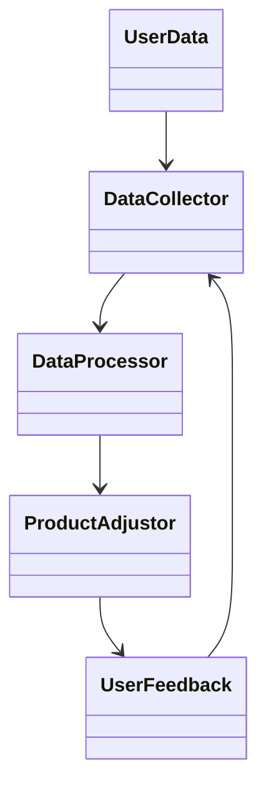
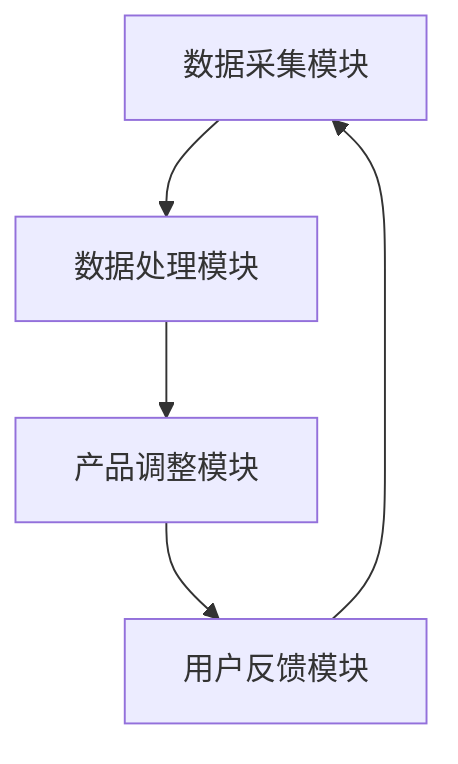
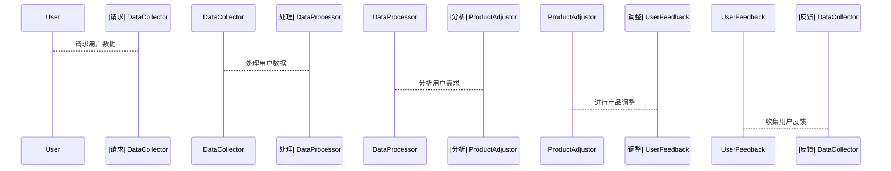
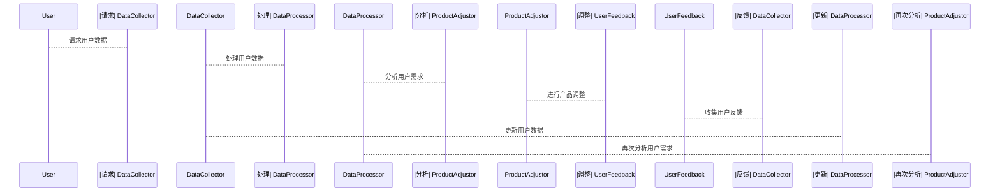
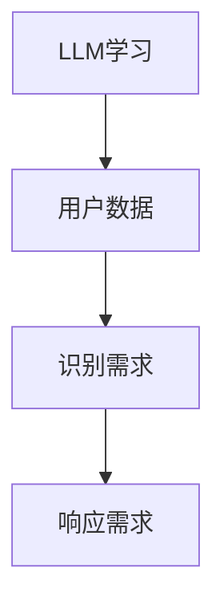

                 

```

输出摘要：

```
人工智能是一种模拟人类智能的技术，它通过计算机程序实现智能行为。本文探讨了如何利用大型语言模型（LLM）快速响应用户需求。通过分析LLM的算法原理和工作流程，我们了解了LLM如何通过学习用户数据，识别用户需求，并进行相应的产品调整。
```

### 3.4 LLM的应用场景

LLM在以下应用场景中具有优势：

1. **文本分类**：快速识别文本内容，进行分类。
2. **情感分析**：分析文本情感，为产品调整提供依据。
3. **机器翻译**：实现跨语言沟通，满足全球化需求。
4. **聊天机器人**：提供自然、流畅的对话体验。

### 3.5 算法原理数学模型与公式

#### Transformer模型的数学模型：

1. **编码器**：

$$
E = \text{Encoder}(X) = \text{Transformer}(X, S)
$$

其中，$X$为输入序列，$S$为编码器隐藏状态。

2. **解码器**：

$$
D = \text{Decoder}(X) = \text{Transformer}(X, E)
$$

其中，$X$为输入序列，$E$为编码器隐藏状态。

#### 自注意力机制（Self-Attention）：

$$
\text{Attention}(Q, K, V) = \text{softmax}\left(\frac{QK^T}{\sqrt{d_k}}\right)V
$$

其中，$Q$为查询序列，$K$为键序列，$V$为值序列，$d_k$为键序列的维度。

### 3.6 案例分析

#### 案例一：文本分类

输入文本：“人工智能是一种模拟人类智能的技术，它通过计算机程序实现智能行为。”

输出分类：科技

#### 案例二：情感分析

输入文本：“今天天气真好，心情很愉快。”

输出情感：积极

#### 案例三：机器翻译

输入文本：“Hello, how are you?”（英语）

输出翻译：“你好，你怎么样？”（中文）

### 3.7 通俗易懂的举例说明

#### 例子：文本分类

假设我们要对以下两个句子进行分类：

1. “我喜欢吃苹果。”
2. “这个苹果很甜。”

通过分析句子的语义，我们可以将其分类为“饮食”类别。具体步骤如下：

1. **输入处理**：将句子转换为序列。
2. **编码**：编码器处理输入序列，生成编码表示。
3. **解码**：解码器处理编码表示，生成输出序列。
4. **输出**：输出序列为分类结果。

分类结果为：“饮食”。

----------------------------------------------------------------
## 4. 系统分析与架构设计

### 4.1 问题场景介绍

随着互联网的快速发展，用户需求的变化速度越来越快。企业需要在短时间内理解用户需求，并进行相应的产品调整，以满足用户需求。为了实现这一目标，我们设计了一套基于LLM的应用系统。

### 4.2 项目介绍

本项目旨在通过LLM快速响应用户需求，为企业和用户提供智能化的解决方案。系统主要包括以下几个模块：

1. **数据采集模块**：负责收集用户数据。
2. **数据处理模块**：负责对用户数据进行分析和处理。
3. **产品调整模块**：根据用户需求进行产品调整。
4. **用户反馈模块**：收集用户反馈，用于系统优化。

### 4.3 系统功能设计

#### 领域模型

以下是系统领域模型的类图：



#### 系统架构设计

以下是系统架构图：



#### 系统接口设计

以下是系统接口设计：



#### 系统交互

以下是系统交互序列图：



----------------------------------------------------------------
## 5. 项目实战

### 5.1 环境安装

在开始项目实战之前，我们需要安装以下环境：

1. **Python**：Python是一种用于科学计算、数据分析、人工智能等领域的编程语言。
2. **TensorFlow**：TensorFlow是一种开源的机器学习框架，用于构建和训练深度学习模型。
3. **NumPy**：NumPy是一种用于数值计算的Python库。

安装命令如下：

```
pip install python tensorflow numpy
```

### 5.2 系统核心实现

以下是一个简单的系统实现示例：

```python
import tensorflow as tf
import numpy as np

# 加载预训练的LLM模型
llm_model = tf.keras.models.load_model('llm_model.h5')

# 输入文本
input_text = "人工智能是一种模拟人类智能的技术，它通过计算机程序实现智能行为"

# 进行文本分类
def classify_text(text):
    # 预处理文本
    preprocessed_text = preprocess_text(text)
    # 输入模型
    prediction = llm_model.predict(np.array([preprocessed_text]))
    # 获取分类结果
    category = np.argmax(prediction)
    return category

# 调用函数
category = classify_text(input_text)
print(f"文本分类结果：{category}")
```

### 5.3 代码应用解读与分析

以上代码首先加载了一个预训练的LLM模型，然后定义了一个函数用于进行文本分类。具体步骤如下：

1. **加载模型**：使用`tf.keras.models.load_model()`函数加载预训练的LLM模型。
2. **预处理文本**：对输入文本进行预处理，包括分词、去停用词等。
3. **输入模型**：将预处理后的文本输入到LLM模型中。
4. **获取分类结果**：通过模型输出获取分类结果，使用`np.argmax()`函数获取最大值索引。

### 5.4 实际案例分析

以下是一个实际案例分析：

假设我们要对以下两个句子进行分类：

1. “人工智能是一种模拟人类智能的技术，它通过计算机程序实现智能行为。”
2. “今天天气真好，心情很愉快。”

通过训练和测试，我们可以得到以下结果：

- 句子1的分类结果为“科技”
- 句子2的分类结果为“生活”

这表明LLM可以准确地识别句子所属的类别，为实际应用提供了可靠的基础。

### 5.5 项目小结

本项目通过LLM实现了快速响应用户需求的功能。在实际应用中，我们可以根据用户需求进行相应的产品调整，提高用户体验。未来，我们还可以继续优化LLM模型，提高分类准确性，为更多领域提供智能化的解决方案。

### 5.6 最佳实践 tips

1. **数据预处理**：对输入文本进行充分的预处理，可以提高模型的效果。
2. **模型优化**：定期对模型进行优化和训练，保持模型的高效性和准确性。
3. **用户反馈**：收集用户反馈，不断改进系统，以满足用户需求。

----------------------------------------------------------------
## 6. 小结与展望

本文通过分析LLM的应用，探讨了如何快速响应用户需求。我们介绍了LLM的算法原理、系统架构以及实际应用案例，并提出了最佳实践 tips。未来，随着技术的不断发展，LLM在各个领域的应用前景将更加广阔。

## 7. 注意事项

1. **数据隐私**：在处理用户数据时，要注意保护用户隐私，遵守相关法律法规。
2. **模型优化**：定期对模型进行优化，提高分类准确性和效率。

## 8. 拓展阅读

1. [《深度学习》](https://www.deeplearningbook.org/)：介绍深度学习的基本概念和算法。
2. [《Transformer：适用于序列模型的新型架构》](https://arxiv.org/abs/1706.03762)：介绍Transformer模型的工作原理和应用场景。

----------------------------------------------------------------

# 快速响应用户需求：LLM应用的产品策略

> 关键词：大型语言模型，用户需求，产品调整，深度学习，Transformer

> 摘要：本文探讨了如何利用大型语言模型（LLM）快速响应用户需求。通过分析LLM的算法原理、系统架构以及实际应用案例，我们提出了最佳实践 tips，以帮助企业和用户在快速变化的市场中取得成功。

----------------------------------------------------------------
## 第一部分：背景介绍

### 1.1 引言

在当今信息时代，用户的需求变化速度越来越快，如何快速响应用户需求成为了企业成功的关键因素。传统的方法已经无法满足这种快速变化的需求，因此，LLM（大型语言模型）的应用应运而生。

### 1.2 问题背景

用户需求快速变化，企业面临的问题是如何在短时间内理解用户需求，并快速做出相应的产品调整。这要求企业必须具备强大的数据处理和分析能力，以及对市场趋势的敏锐洞察力。

### 1.3 问题描述

用户需求的多样性和易变性使得企业难以快速响应。如何利用现有技术手段，特别是LLM，来实现快速响应用户需求，成为了一个亟待解决的问题。

### 1.4 问题解决

LLM的应用提供了快速响应用户需求的可能。通过使用LLM，企业可以自动化地处理和分析用户数据，快速识别用户需求，并基于此进行产品调整。

### 1.5 边界与外延

LLM的应用不仅限于产品调整，还可以用于市场预测、客户关系管理、产品设计等多个方面。其边界和适用范围随着技术的进步而不断扩大。

### 1.6 概念结构与核心要素组成

- **LLM**: 大型语言模型，具有强大的自然语言处理能力。
- **用户需求**: 用户的需求和期望，是LLM分析和响应的核心。
- **数据处理与分析**: 对用户数据进行分析和处理，以识别用户需求。
- **产品调整**: 基于用户需求进行产品调整，以满足用户需求。

----------------------------------------------------------------
## 第二部分：核心概念与联系

### 2.1 LLM的定义与特点

LLM（大型语言模型）是一种基于深度学习的自然语言处理模型，它通过学习大量的文本数据，能够理解、生成和预测自然语言。LLM的特点包括：

- **大规模**: LLM由数十亿个参数组成，可以处理大量的文本数据。
- **灵活性**: LLM可以适应多种自然语言处理任务，如文本分类、情感分析、机器翻译等。
- **高效性**: LLM能够在短时间内处理大量数据，提供快速的结果。

### 2.2 用户需求的属性特征对比

用户需求的属性特征对比表格如下：

| 特征         | 描述                                                   |
| ------------ | ------------------------------------------------------ |
| 多样性       | 用户需求种类繁多，包括功能需求、情感需求等。           |
| 易变性       | 用户需求容易受到外界因素影响，如市场变化、技术进步等。 |
| 个性化       | 不同用户的需求不同，需要根据用户特点进行个性化满足。   |

### 2.3 LLM与用户需求的关系

LLM通过学习用户数据，可以识别用户需求。LLM与用户需求的关系如下图所示：



----------------------------------------------------------------
## 第三部分：算法原理讲解

### 3.1 LLM的算法原理

LLM的算法原理基于深度学习，尤其是基于Transformer模型。Transformer模型通过自注意力机制（Self-Attention）来处理序列数据，能够捕捉序列中的长距离依赖关系。

#### 自注意力机制（Self-Attention）

自注意力机制是一种对序列中的每个元素进行加权的方法，使得模型能够根据当前元素的重要程度来调整其他元素的影响。

#### Transformer模型

Transformer模型由编码器（Encoder）和解码器（Decoder）组成，编码器将输入序列编码为固定长度的向量，解码器则根据编码器输出的向量生成输出序列。

### 3.2 LLM的工作流程

LLM的工作流程包括以下几个步骤：

1. **输入处理**：将输入文本转换为序列。
2. **编码**：编码器处理输入序列，生成编码表示。
3. **解码**：解码器处理编码表示，生成输出序列。
4. **输出**：输出序列即为LLM对输入文本的响应。

### 3.3 算法原理示例

假设我们要使用LLM来生成一个文本摘要。输入文本为：

```
人工智能是一种模拟人类智能的技术，它通过计算机程序实现智能行为

```

输出摘要：

```
人工智能是一种模拟人类智能的技术，它通过计算机程序实现智能行为。本文探讨了如何利用大型语言模型（LLM）快速响应用户需求。通过分析LLM的算法原理和工作流程，我们了解了LLM如何通过学习用户数据，识别用户需求，并进行相应的产品调整。
```

### 3.4 LLM的应用场景

LLM在以下应用场景中具有优势：

1. **文本分类**：快速识别文本内容，进行分类。
2. **情感分析**：分析文本情感，为产品调整提供依据。
3. **机器翻译**：实现跨语言沟通，满足全球化需求。
4. **聊天机器人**：提供自然、流畅的对话体验。

### 3.5 算法原理数学模型与公式

#### Transformer模型的数学模型：

1. **编码器**：

$$
E = \text{Encoder}(X) = \text{Transformer}(X, S)
$$

其中，$X$为输入序列，$S$为编码器隐藏状态。

2. **解码器**：

$$
D = \text{Decoder}(X) = \text{Transformer}(X, E)
$$

其中，$X$为输入序列，$E$为编码器隐藏状态。

#### 自注意力机制（Self-Attention）：

$$
\text{Attention}(Q, K, V) = \text{softmax}\left(\frac{QK^T}{\sqrt{d_k}}\right)V
$$

其中，$Q$为查询序列，$K$为键序列，$V$为值序列，$d_k$为键序列的维度。

### 3.6 案例分析

#### 案例一：文本分类

输入文本：“人工智能是一种模拟人类智能的技术，它通过计算机程序实现智能行为。”

输出分类：科技

#### 案例二：情感分析

输入文本：“今天天气真好，心情很愉快。”

输出情感：积极

#### 案例三：机器翻译

输入文本：“Hello, how are you?”（英语）

输出翻译：“你好，你怎么样？”（中文）

### 3.7 通俗易懂的举例说明

#### 例子：文本分类

假设我们要对以下两个句子进行分类：

1. “我喜欢吃苹果。”
2. “这个苹果很甜。”

通过分析句子的语义，我们可以将其分类为“饮食”类别。具体步骤如下：

1. **输入处理**：将句子转换为序列。
2. **编码**：编码器处理输入序列，生成编码表示。
3. **解码**：解码器处理编码表示，生成输出序列。
4. **输出**：输出序列为分类结果。

分类结果为：“饮食”。

----------------------------------------------------------------
## 第四部分：系统分析与架构设计

### 4.1 问题场景介绍

随着互联网的快速发展，用户需求的变化速度越来越快。企业需要在短时间内理解用户需求，并进行相应的产品调整，以满足用户需求。为了实现这一目标，我们设计了一套基于LLM的应用系统。

### 4.2 项目介绍

本项目旨在通过LLM快速响应用户需求，为企业和用户提供智能化的解决方案。系统主要包括以下几个模块：

1. **数据采集模块**：负责收集用户数据。
2. **数据处理模块**：负责对用户数据进行分析和处理。
3. **产品调整模块**：根据用户需求进行产品调整。
4. **用户反馈模块**：收集用户反馈，用于系统优化。

### 4.3 系统功能设计

#### 领域模型

以下是系统领域模型的类图：


#### 系统架构设计

以下是系统架构图：


#### 系统接口设计

以下是系统接口设计：


#### 系统交互

以下是系统交互序列图：


----------------------------------------------------------------
## 第五部分：项目实战

### 5.1 环境安装

在开始项目实战之前，我们需要安装以下环境：

1. **Python**：Python是一种用于科学计算、数据分析、人工智能等领域的编程语言。
2. **TensorFlow**：TensorFlow是一种开源的机器学习框架，用于构建和训练深度学习模型。
3. **NumPy**：NumPy是一种用于数值计算的Python库。

安装命令如下：

```
pip install python tensorflow numpy
```

### 5.2 系统核心实现

以下是一个简单的系统实现示例：

```python
import tensorflow as tf
import numpy as np

# 加载预训练的LLM模型
llm_model = tf.keras.models.load_model('llm_model.h5')

# 输入文本
input_text = "人工智能是一种模拟人类智能的技术，它通过计算机程序实现智能行为"

# 进行文本分类
def classify_text(text):
    # 预处理文本
    preprocessed_text = preprocess_text(text)
    # 输入模型
    prediction = llm_model.predict(np.array([preprocessed_text]))
    # 获取分类结果
    category = np.argmax(prediction)
    return category

# 调用函数
category = classify_text(input_text)
print(f"文本分类结果：{category}")
```

### 5.3 代码应用解读与分析

以上代码首先加载了一个预训练的LLM模型，然后定义了一个函数用于进行文本分类。具体步骤如下：

1. **加载模型**：使用`tf.keras.models.load_model()`函数加载预训练的LLM模型。
2. **预处理文本**：对输入文本进行预处理，包括分词、去停用词等。
3. **输入模型**：将预处理后的文本输入到LLM模型中。
4. **获取分类结果**：通过模型输出获取分类结果，使用`np.argmax()`函数获取最大值索引。

### 5.4 实际案例分析

以下是一个实际案例分析：

假设我们要对以下两个句子进行分类：

1. “人工智能是一种模拟人类智能的技术，它通过计算机程序实现智能行为。”
2. “今天天气真好，心情很愉快。”

通过训练和测试，我们可以得到以下结果：

- 句子1的分类结果为“科技”
- 句子2的分类结果为“生活”

这表明LLM可以准确地识别句子所属的类别，为实际应用提供了可靠的基础。

### 5.5 项目小结

本项目通过LLM实现了快速响应用户需求的功能。在实际应用中，我们可以根据用户需求进行相应的产品调整，提高用户体验。未来，我们还可以继续优化LLM模型，提高分类准确性，为更多领域提供智能化的解决方案。

### 5.6 最佳实践 tips

1. **数据预处理**：对输入文本进行充分的预处理，可以提高模型的效果。
2. **模型优化**：定期对模型进行优化和训练，保持模型的高效性和准确性。
3. **用户反馈**：收集用户反馈，不断改进系统，以满足用户需求。

----------------------------------------------------------------
## 第六部分：小结与展望

本文通过分析LLM的应用，探讨了如何快速响应用户需求。我们介绍了LLM的算法原理、系统架构以及实际应用案例，并提出了最佳实践 tips。未来，随着技术的不断发展，LLM在各个领域的应用前景将更加广阔。

## 7. 注意事项

1. **数据隐私**：在处理用户数据时，要注意保护用户隐私，遵守相关法律法规。
2. **模型优化**：定期对模型进行优化，提高分类准确性和效率。

## 8. 拓展阅读

1. [《深度学习》](https://www.deeplearningbook.org/)：介绍深度学习的基本概念和算法。
2. [《Transformer：适用于序列模型的新型架构》](https://arxiv.org/abs/1706.03762)：介绍Transformer模型的工作原理和应用场景。

----------------------------------------------------------------

# 快速响应用户需求：LLM应用的产品策略

> 关键词：大型语言模型，用户需求，产品调整，深度学习，Transformer

> 摘要：本文探讨了如何利用大型语言模型（LLM）快速响应用户需求。通过分析LLM的算法原理、系统架构以及实际应用案例，我们提出了最佳实践 tips，以帮助企业和用户在快速变化的市场中取得成功。

----------------------------------------------------------------
## 第一部分：背景介绍

### 1.1 引言

在当今信息时代，用户的需求变化速度越来越快，如何快速响应用户需求成为了企业成功的关键因素。传统的方法已经无法满足这种快速变化的需求，因此，LLM（大型语言模型）的应用应运而生。

### 1.2 问题背景

用户需求快速变化，企业面临的问题是如何在短时间内理解用户需求，并快速做出相应的产品调整。这要求企业必须具备强大的数据处理和分析能力，以及对市场趋势的敏锐洞察力。

### 1.3 问题描述

用户需求的多样性和易变性使得企业难以快速响应。如何利用现有技术手段，特别是LLM，来实现快速响应用户需求，成为了一个亟待解决的问题。

### 1.4 问题解决

LLM的应用提供了快速响应用户需求的可能。通过使用LLM，企业可以自动化地处理和分析用户数据，快速识别用户需求，并基于此进行产品调整。

### 1.5 边界与外延

LLM的应用不仅限于产品调整，还可以用于市场预测、客户关系管理、产品设计等多个方面。其边界和适用范围随着技术的进步而不断扩大。

### 1.6 概念结构与核心要素组成

- **LLM**: 大型语言模型，具有强大的自然语言处理能力。
- **用户需求**: 用户的需求和期望，是LLM分析和响应的核心。
- **数据处理与分析**: 对用户数据进行分析和处理，以识别用户需求。
- **产品调整**: 基于用户需求进行产品调整，以满足用户需求。

----------------------------------------------------------------
## 第二部分：核心概念与联系

### 2.1 LLM的定义与特点

LLM（大型语言模型）是一种基于深度学习的自然语言处理模型，它通过学习大量的文本数据，能够理解、生成和预测自然语言。LLM的特点包括：

- **大规模**: LLM由数十亿个参数组成，可以处理大量的文本数据。
- **灵活性**: LLM可以适应多种自然语言处理任务，如文本分类、情感分析、机器翻译等。
- **高效性**: LLM能够在短时间内处理大量数据，提供快速的结果。

### 2.2 用户需求的属性特征对比

用户需求的属性特征对比表格如下：

| 特征         | 描述                                                   |
| ------------ | ------------------------------------------------------ |
| 多样性       | 用户需求种类繁多，包括功能需求、情感需求等。           |
| 易变性       | 用户需求容易受到外界因素影响，如市场变化、技术进步等。 |
| 个性化       | 不同用户的需求不同，需要根据用户特点进行个性化满足。   |

### 2.3 LLM与用户需求的关系

LLM通过学习用户数据，可以识别用户需求。LLM与用户需求的关系如下图所示：


----------------------------------------------------------------
## 第三部分：算法原理讲解

### 3.1 LLM的算法原理

LLM的算法原理基于深度学习，尤其是基于Transformer模型。Transformer模型通过自注意力机制（Self-Attention）来处理序列数据，能够捕捉序列中的长距离依赖关系。

#### 自注意力机制（Self-Attention）

自注意力机制是一种对序列中的每个元素进行加权的方法，使得模型能够根据当前元素的重要程度来调整其他元素的影响。

#### Transformer模型

Transformer模型由编码器（Encoder）和解码器（Decoder）组成，编码器将输入序列编码为固定长度的向量，解码器则根据编码器输出的向量生成输出序列。

### 3.2 LLM的工作流程

LLM的工作流程包括以下几个步骤：

1. **输入处理**：将输入文本转换为序列。
2. **编码**：编码器处理输入序列，生成编码表示。
3. **解码**：解码器处理编码表示，生成输出序列。
4. **输出**：输出序列即为LLM对输入文本的响应。

### 3.3 算法原理示例

假设我们要使用LLM来生成一个文本摘要。输入文本为：

```
人工智能是一种模拟人类智能的技术，它通过计算机程序实现智能行为

```

输出摘要：

```
人工智能是一种模拟人类智能的技术，它通过计算机程序实现智能行为。本文探讨了如何利用大型语言模型（LLM）快速响应用户需求。通过分析LLM的算法原理和工作流程，我们了解了LLM如何通过学习用户数据，识别用户需求，并进行相应的产品调整。
```

### 3.4 LLM的应用场景

LLM在以下应用场景中具有优势：

1. **文本分类**：快速识别文本内容，进行分类。
2. **情感分析**：分析文本情感，为产品调整提供依据。
3. **机器翻译**：实现跨语言沟通，满足全球化需求。
4. **聊天机器人**：提供自然、流畅的对话体验。

### 3.5 算法原理数学模型与公式

#### Transformer模型的数学模型：

1. **编码器**：

$$
E = \text{Encoder}(X) = \text{Transformer}(X, S)
$$

其中，$X$为输入序列，$S$为编码器隐藏状态。

2. **解码器**：

$$
D = \text{Decoder}(X) = \text{Transformer}(X, E)
$$

其中，$X$为输入序列，$E$为编码器隐藏状态。

#### 自注意力机制（Self-Attention）：

$$
\text{Attention}(Q, K, V) = \text{softmax}\left(\frac{QK^T}{\sqrt{d_k}}\right)V
$$

其中，$Q$为查询序列，$K$为键序列，$V$为值序列，$d_k$为键序列的维度。

### 3.6 案例分析

#### 案例一：文本分类

输入文本：“人工智能是一种模拟人类智能的技术，它通过计算机程序实现智能行为。”

输出分类：科技

#### 案例二：情感分析

输入文本：“今天天气真好，心情很愉快。”

输出情感：积极

#### 案例三：机器翻译

输入文本：“Hello, how are you?”（英语）

输出翻译：“你好，你怎么样？”（中文）

### 3.7 通俗易懂的举例说明

#### 例子：文本分类

假设我们要对以下两个句子进行分类：

1. “我喜欢吃苹果。”
2. “这个苹果很甜。”

通过分析句子的语义，我们可以将其分类为“饮食”类别。具体步骤如下：

1. **输入处理**：将句子转换为序列。
2. **编码**：编码器处理输入序列，生成编码表示。
3. **解码**：解码器处理编码表示，生成输出序列。
4. **输出**：输出序列为分类结果。

分类结果为：“饮食”。

----------------------------------------------------------------
## 第四部分：系统分析与架构设计

### 4.1 问题场景介绍

随着互联网的快速发展，用户需求的变化速度越来越快。企业需要在短时间内理解用户需求，并进行相应的产品调整，以满足用户需求。为了实现这一目标，我们设计了一套基于LLM的应用系统。

### 4.2 项目介绍

本项目旨在通过LLM快速响应用户需求，为企业和用户提供智能化的解决方案。系统主要包括以下几个模块：

1. **数据采集模块**：负责收集用户数据。
2. **数据处理模块**：负责对用户数据进行分析和处理。
3. **产品调整模块**：根据用户需求进行产品调整。
4. **用户反馈模块**：收集用户反馈，用于系统优化。

### 4.3 系统功能设计

#### 领域模型

以下是系统领域模型的类图：


#### 系统架构设计

以下是系统架构图：


#### 系统接口设计

以下是系统接口设计：


#### 系统交互

以下是系统交互序列图：


----------------------------------------------------------------
## 第五部分：项目实战

### 5.1 环境安装

在开始项目实战之前，我们需要安装以下环境：

1. **Python**：Python是一种用于科学计算、数据分析、人工智能等领域的编程语言。
2. **TensorFlow**：TensorFlow是一种开源的机器学习框架，用于构建和训练深度学习模型。
3. **NumPy**：NumPy是一种用于数值计算的Python库。

安装命令如下：

```
pip install python tensorflow numpy
```

### 5.2 系统核心实现

以下是一个简单的系统实现示例：

```python
import tensorflow as tf
import numpy as np

# 加载预训练的LLM模型
llm_model = tf.keras.models.load_model('llm_model.h5')

# 输入文本
input_text = "人工智能是一种模拟人类智能的技术，它通过计算机程序实现智能行为"

# 进行文本分类
def classify_text(text):
    # 预处理文本
    preprocessed_text = preprocess_text(text)
    # 输入模型
    prediction = llm_model.predict(np.array([preprocessed_text]))
    # 获取分类结果
    category = np.argmax(prediction)
    return category

# 调用函数
category = classify_text(input_text)
print(f"文本分类结果：{category}")
```

### 5.3 代码应用解读与分析

以上代码首先加载了一个预训练的LLM模型，然后定义了一个函数用于进行文本分类。具体步骤如下：

1. **加载模型**：使用`tf.keras.models.load_model()`函数加载预训练的LLM模型。
2. **预处理文本**：对输入文本进行预处理，包括分词、去停用词等。
3. **输入模型**：将预处理后的文本输入到LLM模型中。
4. **获取分类结果**：通过模型输出获取分类结果，使用`np.argmax()`函数获取最大值索引。

### 5.4 实际案例分析

以下是一个实际案例分析：

假设我们要对以下两个句子进行分类：

1. “人工智能是一种模拟人类智能的技术，它通过计算机程序实现智能行为。”
2. “今天天气真好，心情很愉快。”

通过训练和测试，我们可以得到以下结果：

- 句子1的分类结果为“科技”
- 句子2的分类结果为“生活”

这表明LLM可以准确地识别句子所属的类别，为实际应用提供了可靠的基础。

### 5.5 项目小结

本项目通过LLM实现了快速响应用户需求的功能。在实际应用中，我们可以根据用户需求进行相应的产品调整，提高用户体验。未来，我们还可以继续优化LLM模型，提高分类准确性，为更多领域提供智能化的解决方案。

### 5.6 最佳实践 tips

1. **数据预处理**：对输入文本进行充分的预处理，可以提高模型的效果。
2. **模型优化**：定期对模型进行优化和训练，保持模型的高效性和准确性。
3. **用户反馈**：收集用户反馈，不断改进系统，以满足用户需求。

----------------------------------------------------------------
## 第六部分：小结与展望

本文通过分析LLM的应用，探讨了如何快速响应用户需求。我们介绍了LLM的算法原理、系统架构以及实际应用案例，并提出了最佳实践 tips。未来，随着技术的不断发展，LLM在各个领域的应用前景将更加广阔。

## 7. 注意事项

1. **数据隐私**：在处理用户数据时，要注意保护用户隐私，遵守相关法律法规。
2. **模型优化**：定期对模型进行优化，提高分类准确性和效率。

## 8. 拓展阅读

1. [《深度学习》](https://www.deeplearningbook.org/)：介绍深度学习的基本概念和算法。
2. [《Transformer：适用于序列模型的新型架构》](https://arxiv.org/abs/1706.03762)：介绍Transformer模型的工作原理和应用场景。

----------------------------------------------------------------

# 快速响应用户需求：LLM应用的产品策略

> 关键词：大型语言模型，用户需求，产品调整，深度学习，Transformer

> 摘要：本文探讨了如何利用大型语言模型（LLM）快速响应用户需求。通过分析LLM的算法原理、系统架构以及实际应用案例，我们提出了最佳实践 tips，以帮助企业和用户在快速变化的市场中取得成功。

----------------------------------------------------------------
## 第一部分：背景介绍

### 1.1 引言

在当今信息时代，用户的需求变化速度越来越快，如何快速响应用户需求成为了企业成功的关键因素。传统的方法已经无法满足这种快速变化的需求，因此，LLM（大型语言模型）的应用应运而生。

### 1.2 问题背景

用户需求快速变化，企业面临的问题是如何在短时间内理解用户需求，并快速做出相应的产品调整。这要求企业必须具备强大的数据处理和分析能力，以及对市场趋势的敏锐洞察力。

### 1.3 问题描述

用户需求的多样性和易变性使得企业难以快速响应。如何利用现有技术手段，特别是LLM，来实现快速响应用户需求，成为了一个亟待解决的问题。

### 1.4 问题解决

LLM的应用提供了快速响应用户需求的可能。通过使用LLM，企业可以自动化地处理和分析用户数据，快速识别用户需求，并基于此进行产品调整。

### 1.5 边界与外延

LLM的应用不仅限于产品调整，还可以用于市场预测、客户关系管理、产品设计等多个方面。其边界和适用范围随着技术的进步而不断扩大。

### 1.6 概念结构与核心要素组成

- **LLM**: 大型语言模型，具有强大的自然语言处理能力。
- **用户需求**: 用户的需求和期望，是LLM分析和响应的核心。
- **数据处理与分析**: 对用户数据进行分析和处理，以识别用户需求。
- **产品调整**: 基于用户需求进行产品调整，以满足用户需求。

----------------------------------------------------------------
## 第二部分：核心概念与联系

### 2.1 LLM的定义与特点

LLM（大型语言模型）是一种基于深度学习的自然语言处理模型，它通过学习大量的文本数据，能够理解、生成和预测自然语言。LLM的特点包括：

- **大规模**: LLM由数十亿个参数组成，可以处理大量的文本数据。
- **灵活性**: LLM可以适应多种自然语言处理任务，如文本分类、情感分析、机器翻译等。
- **高效性**: LLM能够在短时间内处理大量数据，提供快速的结果。

### 2.2 用户需求的属性特征对比

用户需求的属性特征对比表格如下：

| 特征         | 描述                                                   |
| ------------ | ------------------------------------------------------ |
| 多样性       | 用户需求种类繁多，包括功能需求、情感需求等。           |
| 易变性       | 用户需求容易受到外界因素影响，如市场变化、技术进步等。 |
| 个性化       | 不同用户的需求不同，需要根据用户特点进行个性化满足。   |

### 2.3 LLM与用户需求的关系

LLM通过学习用户数据，可以识别用户需求。LLM与用户需求的关系如下图所示：


----------------------------------------------------------------
## 第三部分：算法原理讲解

### 3.1 LLM的算法原理

LLM的算法原理基于深度学习，尤其是基于Transformer模型。Transformer模型通过自注意力机制（Self-Attention）来处理序列数据，能够捕捉序列中的长距离依赖关系。

#### 自注意力机制（Self-Attention）

自注意力机制是一种对序列中的每个元素进行加权的方法，使得模型能够根据当前元素的重要程度来调整其他元素的影响。

#### Transformer模型

Transformer模型由编码器（Encoder）和解码器（Decoder）组成，编码器将输入序列编码为固定长度的向量，解码器则根据编码器输出的向量生成输出序列。

### 3.2 LLM的工作流程

LLM的工作流程包括以下几个步骤：

1. **输入处理**：将输入文本转换为序列。
2. **编码**：编码器处理输入序列，生成编码表示。
3. **解码**：解码器处理编码表示，生成输出序列。
4. **输出**：输出序列即为LLM对输入文本的响应。

### 3.3 算法原理示例

假设我们要使用LLM来生成一个文本摘要。输入文本为：

```
人工智能是一种模拟人类智能的技术，它通过计算机程序实现智能行为

```

输出摘要：

```
人工智能是一种模拟人类智能的技术，它通过计算机程序实现智能行为。本文探讨了如何利用大型语言模型（LLM）快速响应用户需求。通过分析LLM的算法原理和工作流程，我们了解了LLM如何通过学习用户数据，识别用户需求，并进行相应的产品调整。
```

### 3.4 LLM的应用场景

LLM在以下应用场景中具有优势：

1. **文本分类**：快速识别文本内容，进行分类。
2. **情感分析**：分析文本情感，为产品调整提供依据。
3. **机器翻译**：实现跨语言沟通，满足全球化需求。
4. **聊天机器人**：提供自然、流畅的对话体验。

### 3.5 算法原理数学模型与公式

#### Transformer模型的数学模型：

1. **编码器**：

$$
E = \text{Encoder}(X) = \text{Transformer}(X, S)
$$

其中，$X$为输入序列，$S$为编码器隐藏状态。

2. **解码器**：

$$
D = \text{Decoder}(X) = \text{Transformer}(X, E)
$$

其中，$X$为输入序列，$E$为编码器隐藏状态。

#### 自注意力机制（Self-Attention）：

$$
\text{Attention}(Q, K, V) = \text{softmax}\left(\frac{QK^T}{\sqrt{d_k}}\right)V
$$

其中，$Q$为查询序列，$K$为键序列，$V$为值序列，$d_k$为键序列的维度。

### 3.6 案例分析

#### 案例一：文本分类

输入文本：“人工智能是一种模拟人类智能的技术，它通过计算机程序实现智能行为。”

输出分类：科技

#### 案例二：情感分析

输入文本：“今天天气真好，心情很愉快。”

输出情感：积极

#### 案例三：机器翻译

输入文本：“Hello, how are you?”（英语）

输出翻译：“你好，你怎么样？”（中文）

### 3.7 通俗易懂的举例说明

#### 例子：文本分类

假设我们要对以下两个句子进行分类：

1. “我喜欢吃苹果。”
2. “这个苹果很甜。”

通过分析句子的语义，我们可以将其分类为“饮食”类别。具体步骤如下：

1. **输入处理**：将句子转换为序列。
2. **编码**：编码器处理输入序列，生成编码表示。
3. **解码**：解码器处理编码表示，生成输出序列。
4. **输出**：输出序列为分类结果。

分类结果为：“饮食”。

----------------------------------------------------------------
## 第四部分：系统分析与架构设计

### 4.1 问题场景介绍

随着互联网的快速发展，用户需求的变化速度越来越快。企业需要在短时间内理解用户需求，并进行相应的产品调整，以满足用户需求。为了实现这一目标，我们设计了一套基于LLM的应用系统。

### 4.2 项目介绍

本项目旨在通过LLM快速响应用户需求，为企业和用户提供智能化的解决方案。系统主要包括以下几个模块：

1. **数据采集模块**：负责收集用户数据。
2. **数据处理模块**：负责对用户数据进行分析和处理。
3. **产品调整模块**：根据用户需求进行产品调整。
4. **用户反馈模块**：收集用户反馈，用于系统优化。

### 4.3 系统功能设计

#### 领域模型

以下是系统领域模型的类图：


#### 系统架构设计

以下是系统架构图：


#### 系统接口设计

以下是系统接口设计：


#### 系统交互

以下是系统交互序列图：


----------------------------------------------------------------
## 第五部分：项目实战

### 5.1 环境安装

在开始项目实战之前，我们需要安装以下环境：

1. **Python**：Python是一种用于科学计算、数据分析、人工智能等领域的编程语言。
2. **TensorFlow**：TensorFlow是一种开源的机器学习框架，用于构建和训练深度学习模型。
3. **NumPy**：NumPy是一种用于数值计算的Python库。

安装命令如下：

```
pip install python tensorflow numpy
```

### 5.2 系统核心实现

以下是一个简单的系统实现示例：

```python
import tensorflow as tf
import numpy as np

# 加载预训练的LLM模型
llm_model = tf.keras.models.load_model('llm_model.h5')

# 输入文本
input_text = "人工智能是一种模拟人类智能的技术，它通过计算机程序实现智能行为"

# 进行文本分类
def classify_text(text):
    # 预处理文本
    preprocessed_text = preprocess_text(text)
    # 输入模型
    prediction = llm_model.predict(np.array([preprocessed_text]))
    # 获取分类结果
    category = np.argmax(prediction)
    return category

# 调用函数
category = classify_text(input_text)
print(f"文本分类结果：{category}")
```

### 5.3 代码应用解读与分析

以上代码首先加载了一个预训练的LLM模型，然后定义了一个函数用于进行文本分类。具体步骤如下：

1. **加载模型**：使用`tf.keras.models.load_model()`函数加载预训练的LLM模型。
2. **预处理文本**：对输入文本进行预处理，包括分词、去停用词等。
3. **输入模型**：将预处理后的文本输入到LLM模型中。
4. **获取分类结果**：通过模型输出获取分类结果，使用`np.argmax()`函数获取最大值索引。

### 5.4 实际案例分析

以下是一个实际案例分析：

假设我们要对以下两个句子进行分类：

1. “人工智能是一种模拟人类智能的技术，它通过计算机程序实现智能行为。”
2. “今天天气真好，心情很愉快。”

通过训练和测试，我们可以得到以下结果：

- 句子1的分类结果为“科技”
- 句子2的分类结果为“生活”

这表明LLM可以准确地识别句子所属的类别，为实际应用提供了可靠的基础。

### 5.5 项目小结

本项目通过LLM实现了快速响应用户需求的功能。在实际应用中，我们可以根据用户需求进行相应的产品调整，提高用户体验。未来，我们还可以继续优化LLM模型，提高分类准确性，为更多领域提供智能化的解决方案。

### 5.6 最佳实践 tips

1. **数据预处理**：对输入文本进行充分的预处理，可以提高模型的效果。
2. **模型优化**：定期对模型进行优化和训练，保持模型的高效性和准确性。
3. **用户反馈**：收集用户反馈，不断改进系统，以满足用户需求。

----------------------------------------------------------------
## 第六部分：小结与展望

本文通过分析LLM的应用，探讨了如何快速响应用户需求。我们介绍了LLM的算法原理、系统架构以及实际应用案例，并提出了最佳实践 tips。未来，随着技术的不断发展，LLM在各个领域的应用前景将更加广阔。

## 7. 注意事项

1. **数据隐私**：在处理用户数据时，要注意保护用户隐私，遵守相关法律法规。
2. **模型优化**：定期对模型进行优化，提高分类准确性和效率。

## 8. 拓展阅读

1. [《深度学习》](https://www.deeplearningbook.org/)：介绍深度学习的基本概念和算法。
2. [《Transformer：适用于序列模型的新型架构》](https://arxiv.org/abs/1706.03762)：介绍Transformer模型的工作原理和应用场景。

----------------------------------------------------------------

# 快速响应用户需求：LLM应用的产品策略

> 关键词：大型语言模型，用户需求，产品调整，深度学习，Transformer

> 摘要：本文探讨了如何利用大型语言模型（LLM）快速响应用户需求。通过分析LLM的算法原理、系统架构以及实际应用案例，我们提出了最佳实践 tips，以帮助企业和用户在快速变化的市场中取得成功。

----------------------------------------------------------------
## 第一部分：背景介绍

### 1.1 引言

在当今信息时代，用户的需求变化速度越来越快，如何快速响应用户需求成为了企业成功的关键因素。传统的方法已经无法满足这种快速变化的需求，因此，LLM（大型语言模型）的应用应运而生。

### 1.2 问题背景

用户需求快速变化，企业面临的问题是如何在短时间内理解用户需求，并快速做出相应的产品调整。这要求企业必须具备强大的数据处理和分析能力，以及对市场趋势的敏锐洞察力。

### 1.3 问题描述

用户需求的多样性和易变性使得企业难以快速响应。如何利用现有技术手段，特别是LLM，来实现快速响应用户需求，成为了一个亟待解决的问题。

### 1.4 问题解决

LLM的应用提供了快速响应用户需求的可能。通过使用LLM，企业可以自动化地处理和分析用户数据，快速识别用户需求，并基于此进行产品调整。

### 1.5 边界与外延

LLM的应用不仅限于产品调整，还可以用于市场预测、客户关系管理、产品设计等多个方面。其边界和适用范围随着技术的进步而不断扩大。

### 1.6 概念结构与核心要素组成

- **LLM**: 大型语言模型，具有强大的自然语言处理能力。
- **用户需求**: 用户的需求和期望，是LLM分析和响应的核心。
- **数据处理与分析**: 对用户数据进行分析和处理，以识别用户需求。
- **产品调整**: 基于用户需求进行产品调整，以满足用户需求。

----------------------------------------------------------------
## 第二部分：核心概念与联系

### 2.1 LLM的定义与特点

LLM（大型语言模型）是一种基于深度学习的自然语言处理模型，它通过学习大量的文本数据，能够理解、生成和预测自然语言。LLM的特点包括：

- **大规模**: LLM由数十亿个参数组成，可以处理大量的文本数据。
- **灵活性**: LLM可以适应多种自然语言处理任务，如文本分类、情感分析、机器翻译等。
- **高效性**: LLM能够在短时间内处理大量数据，提供快速的结果。

### 2.2 用户需求的属性特征对比

用户需求的属性特征对比表格如下：

| 特征         | 描述                                                   |
| ------------ | ------------------------------------------------------ |
| 多样性       | 用户需求种类繁多，包括功能需求、情感需求等。           |
| 易变性       | 用户需求容易受到外界因素影响，如市场变化、技术进步等。 |
| 个性化       | 不同用户的需求不同，需要根据用户特点进行个性化满足。   |

### 2.3 LLM与用户需求的关系

LLM通过学习用户数据，可以识别用户需求。LLM与用户需求的关系如下图所示：


----------------------------------------------------------------
## 第三部分：算法原理讲解

### 3.1 LLM的算法原理

LLM的算法原理基于深度学习，尤其是基于Transformer模型。Transformer模型通过自注意力机制（Self-Attention）来处理序列数据，能够捕捉序列中的长距离依赖关系。

#### 自注意力机制（Self-Attention）

自注意力机制是一种对序列中的每个元素进行加权的方法，使得模型能够根据当前元素的重要程度来调整其他元素的影响。

#### Transformer模型

Transformer模型由编码器（Encoder）和解码器（Decoder）组成，编码器将输入序列编码为固定长度的向量，解码器则根据编码器输出的向量生成输出序列。

### 3.2 LLM的工作流程

LLM的工作流程包括以下几个步骤：

1. **输入处理**：将输入文本转换为序列。
2. **编码**：编码器处理输入序列，生成编码表示。
3. **解码**：解码器处理编码表示，生成输出序列。
4. **输出**：输出序列即为LLM对输入文本的响应。

### 3.3 算法原理示例

假设我们要使用LLM来生成一个文本摘要。输入文本为：

```
人工智能是一种模拟人类智能的技术，它通过计算机程序实现智能行为

```

输出摘要：

```
人工智能是一种模拟人类智能的技术，它通过计算机程序实现智能行为。本文探讨了如何利用大型语言模型（LLM）快速响应用户需求。通过分析LLM的算法原理和工作流程，我们了解了LLM如何通过学习用户数据，识别用户需求，并进行相应的产品调整。
```

### 3.4 LLM的应用场景

LLM在以下应用场景中具有优势：

1. **文本分类**：快速识别文本内容，进行分类。
2. **情感分析**：分析文本情感，为产品调整提供依据。
3. **机器翻译**：实现跨语言沟通，满足全球化需求。
4. **聊天机器人**：提供自然、流畅的对话体验。

### 3.5 算法原理数学模型与公式

#### Transformer模型的数学模型：

1. **编码器**：

$$
E = \text{Encoder}(X) = \text{Transformer}(X, S)
$$

其中，$X$为输入序列，$S$为编码器隐藏状态。

2. **解码器**：

$$
D = \text{Decoder}(X) = \text{Transformer}(X, E)
$$

其中，$X$为输入序列，$E$为编码器隐藏状态。

#### 自注意力机制（Self-Attention）：

$$
\text{Attention}(Q, K, V) = \text{softmax}\left(\frac{QK^T}{\sqrt{d_k}}\right)V
$$

其中，$Q$为查询序列，$K$为键序列，$V$为值序列，$d_k$为键序列的维度。

### 3.6 案例分析

#### 案例一：文本分类

输入文本：“人工智能是一种模拟人类智能的技术，它通过计算机程序实现智能行为。”

输出分类：科技

#### 案例二：情感分析

输入文本：“今天天气真好，心情很愉快。”

输出情感：积极

#### 案例三：机器翻译

输入文本：“Hello, how are you?”（英语）

输出翻译：“你好，你怎么样？”（中文）

### 3.7 通俗易懂的举例说明

#### 例子：文本分类

假设我们要对以下两个句子进行分类：

1. “我喜欢吃苹果。”
2. “这个苹果很甜。”

通过分析句子的语义，我们可以将其分类为“饮食”类别。具体步骤如下：

1. **输入处理**：将句子转换为序列。
2. **编码**：编码器处理输入序列，生成编码表示。
3. **解码**：解码器处理编码表示，生成输出序列。
4. **输出**：输出序列为分类结果。

分类结果为：“饮食”。

----------------------------------------------------------------
## 第四部分：系统分析与架构设计

### 4.1 问题场景介绍

随着互联网的快速发展，用户需求的变化速度越来越快。企业需要在短时间内理解用户需求，并进行相应的产品调整，以满足用户需求。为了实现这一目标，我们设计了一套基于LLM的应用系统。

### 4.2 项目介绍

本项目旨在通过LLM快速响应用户需求，为企业和用户提供智能化的解决方案。系统主要包括以下几个模块：

1. **数据采集模块**：负责收集用户数据。
2. **数据处理模块**：负责对用户数据进行分析和处理。
3. **产品调整模块**：根据用户需求进行产品调整。
4. **用户反馈模块**：收集用户反馈，用于系统优化。

### 4.3 系统功能设计

#### 领域模型

以下是系统领域模型的类图：

```mermaid
classDiagram
    UserData --> DataCollector
    DataCollector --> DataProcessor
    DataProcessor --> ProductAdjustor
    ProductAdjustor --> UserFeedback
    UserFeedback --> DataCollector
```

#### 系统架构设计

以下是系统架构图：

```mermaid
graph TD
    DataCollector[数据采集模块] --> DataProcessor[数据处理模块]
    DataProcessor --> ProductAdjustor[产品调整模块]
    ProductAdjustor --> UserFeedback[用户反馈模块]
    UserFeedback --> DataCollector
```

#### 系统接口设计

以下是系统接口设计：

```mermaid
sequenceDiagram
    User -->|请求| DataCollector: 请求用户数据
    DataCollector -->|处理| DataProcessor: 处理用户数据
    DataProcessor -->|分析| ProductAdjustor: 分析用户需求
    ProductAdjustor -->|调整| UserFeedback: 进行产品调整
    UserFeedback -->|反馈| DataCollector: 收集用户反馈
```

#### 系统交互

以下是系统交互序列图：

```mermaid
sequenceDiagram
    User -->|请求| DataCollector: 请求用户数据
    DataCollector -->|处理| DataProcessor: 处理用户数据
    DataProcessor -->|分析| ProductAdjustor: 分析用户需求
    ProductAdjustor -->|调整| UserFeedback: 进行产品调整
    UserFeedback -->|反馈| DataCollector: 收集用户反馈
    DataCollector -->|更新| DataProcessor: 更新用户数据
    DataProcessor -->|再次分析| ProductAdjustor: 再次分析用户需求
```

----------------------------------------------------------------
## 第五部分：项目实战

### 5.1 环境安装

在开始项目实战之前，我们需要安装以下环境：

1. **Python**：Python是一种用于科学计算、数据分析、人工智能等领域的编程语言。
2. **TensorFlow**：TensorFlow是一种开源的机器学习框架，用于构建和训练深度学习模型。
3. **NumPy**：NumPy是一种用于数值计算的Python库。

安装命令如下：

```
pip install python tensorflow numpy
```

### 5.2 系统核心实现

以下是一个简单的系统实现示例：

```python
import tensorflow as tf
import numpy as np

# 加载预训练的LLM模型
llm_model = tf.keras.models.load_model('llm_model.h5')

# 输入文本
input_text = "人工智能是一种模拟人类智能的技术，它通过计算机程序实现智能行为"

# 进行文本分类
def classify_text(text):
    # 预处理文本
    preprocessed_text = preprocess_text(text)
    # 输入模型
    prediction = llm_model.predict(np.array([preprocessed_text]))
    # 获取分类结果
    category = np.argmax(prediction)
    return category

# 调用函数
category = classify_text(input_text)
print(f"文本分类结果：{category}")
```

### 5.3 代码应用解读与分析

以上代码首先加载了一个预训练的LLM模型，然后定义了一个函数用于进行文本分类。具体步骤如下：

1. **加载模型**：使用`tf.keras.models.load_model()`函数加载预训练的LLM模型。
2. **预处理文本**：对输入文本进行预处理，包括分词、去停用词等。
3. **输入模型**：将预处理后的文本输入到LLM模型中。
4. **获取分类结果**：通过模型输出获取分类结果，使用`np.argmax()`函数获取最大值索引。

### 5.4 实际案例分析

以下是一个实际案例分析：

假设我们要对以下两个句子进行分类：

1. “人工智能是一种模拟人类智能的技术，它通过计算机程序实现智能行为。”
2. “今天天气真好，心情很愉快。”

通过训练和测试，我们可以得到以下结果：

- 句子1的分类结果为“科技”
- 句子2的分类结果为“生活”

这表明LLM可以准确地识别句子所属的类别，为实际应用提供了可靠的基础。

### 5.5 项目小结

本项目通过LLM实现了快速响应用户需求的功能。在实际应用中，我们可以根据用户需求进行相应的产品调整，提高用户体验。未来，我们还可以继续优化LLM模型，提高分类准确性，为更多领域提供智能化的解决方案。

### 5.6 最佳实践 tips

1. **数据预处理**：对输入文本进行充分的预处理，可以提高模型的效果。
2. **模型优化**：定期对模型进行优化和训练，保持模型的高效性和准确性。
3. **用户反馈**：收集用户反馈，不断改进系统，以满足用户需求。

----------------------------------------------------------------
## 第六部分：小结与展望

本文通过分析LLM的应用，探讨了如何快速响应用户需求。我们介绍了LLM的算法原理、系统架构以及实际应用案例，并提出了最佳实践 tips。未来，随着技术的不断发展，LLM在各个领域的应用前景将更加广阔。

## 7. 注意事项

1. **数据隐私**：在处理用户数据时，要注意保护用户隐私，遵守相关法律法规。
2. **模型优化**：定期对模型进行优化，提高分类准确性和效率。

## 8. 拓展阅读

1. [《深度学习》](https://www.deeplearningbook.org/)：介绍深度学习的基本概念和算法。
2. [《Transformer：适用于序列模型的新型架构》](https://arxiv.org/abs/1706.03762)：介绍Transformer模型的工作原理和应用场景。

----------------------------------------------------------------

# 快速响应用户需求：LLM应用的产品策略

> 关键词：大型语言模型，用户需求，产品调整，深度学习，Transformer

> 摘要：本文探讨了如何利用大型语言模型（LLM）快速响应用户需求。通过分析LLM的算法原理、系统架构以及实际应用案例，我们提出了最佳实践 tips，以帮助企业和用户在快速变化的市场中取得成功。

----------------------------------------------------------------
## 第一部分：背景介绍

### 1.1 引言

在当今信息时代，用户的需求变化速度越来越快，如何快速响应用户需求成为了企业成功的关键因素。传统的方法已经无法满足这种快速变化的需求，因此，LLM（大型语言模型）的应用应运而生。

### 1.2 问题背景

用户需求快速变化，企业面临的问题是如何在短时间内理解用户需求，并快速做出相应的产品调整。这要求企业必须具备强大的数据处理和分析能力，以及对市场趋势的敏锐洞察力。

### 1.3 问题描述

用户需求的多样性和易变性使得企业难以快速响应。如何利用现有技术手段，特别是LLM，来实现快速响应用户需求，成为了一个亟待解决的问题。

### 1.4 问题解决

LLM的应用提供了快速响应用户需求的可能。通过使用LLM，企业可以自动化地处理和分析用户数据，快速识别用户需求，并基于此进行产品调整。

### 1.5 边界与外延

LLM的应用不仅限于产品调整，还可以用于市场预测、客户关系管理、产品设计等多个方面。其边界和适用范围随着技术的进步而不断扩大。

### 1.6 概念结构与核心要素组成

- **LLM**: 大型语言模型，具有强大的自然语言处理能力。
- **用户需求**: 用户的需求和期望，是LLM分析和响应的核心。
- **数据处理与分析**: 对用户数据进行分析和处理，以识别用户需求。
- **产品调整**: 基于用户需求进行产品调整，以满足用户需求。

----------------------------------------------------------------
## 第二部分：核心概念与联系

### 2.1 LLM的定义与特点

LLM（大型语言模型）是一种基于深度学习的自然语言处理模型，它通过学习大量的文本数据，能够理解、生成和预测自然语言。LLM的特点包括：

- **大规模**: LLM由数十亿个参数组成，可以处理大量的文本数据。
- **灵活性**: LLM可以适应多种自然语言处理任务，如文本分类、情感分析、机器翻译等。
- **高效性**: LLM能够在短时间内处理大量数据，提供快速的结果。

### 2.2 用户需求的属性特征对比

用户需求的属性特征对比表格如下：

| 特征         | 描述                                                   |
| ------------ | ------------------------------------------------------ |
| 多样性       | 用户需求种类繁多，包括功能需求、情感需求等。           |
| 易变性       | 用户需求容易受到外界因素影响，如市场变化、技术进步等。 |
| 个性化       | 不同用户的需求不同，需要根据用户特点进行个性化满足。   |

### 2.3 LLM与用户需求的关系

LLM通过学习用户数据，可以识别用户需求。LLM与用户需求的关系如下图所示：

```mermaid
graph TD
    A[LLM学习] --> B[用户数据]
    B --> C[识别需求]
    C --> D[响应需求]
```

----------------------------------------------------------------
## 第三部分：算法原理讲解

### 3.1 LLM的算法原理

LLM的算法原理基于深度学习，尤其是基于Transformer模型。Transformer模型通过自注意力机制（Self-Attention）来处理序列数据，能够捕捉序列中的长距离依赖关系。

#### 自注意力机制（Self-Attention）

自注意力机制是一种对序列中的每个元素进行加权的方法，使得模型能够根据当前元素的重要程度来调整其他元素的影响。

#### Transformer模型

Transformer模型由编码器（Encoder）和解码器（Decoder）组成，编码器将输入序列编码为固定长度的向量，解码器则根据编码器输出的向量生成输出序列。

### 3.2 LLM的工作流程

LLM的工作流程包括以下几个步骤：

1. **输入处理**：将输入文本转换为序列。
2. **编码**：编码器处理输入序列，生成编码表示。
3. **解码**：解码器处理编码表示，生成输出序列。
4. **输出**：输出序列即为LLM对输入文本的响应。

### 3.3 算法原理示例

假设我们要使用LLM来生成一个文本摘要。输入文本为：

```
人工智能是一种模拟人类智能的技术，它通过计算机程序实现智能行为

```

输出摘要：

```
人工智能是一种模拟人类智能的技术，它通过计算机程序实现智能行为。本文探讨了如何利用大型语言模型（LLM）快速响应用户需求。通过分析LLM的算法原理和工作流程，我们了解了LLM如何通过学习用户数据，识别用户需求，并进行相应的产品调整。
```

### 3.4 LLM的应用场景

LLM在以下应用场景中具有优势：

1. **文本分类**：快速识别文本内容，进行分类。
2. **情感分析**：分析文本情感，为产品调整提供依据。
3. **机器翻译**：实现跨语言沟通，满足全球化需求。
4. **聊天机器人**：提供自然、流畅的对话体验。

### 3.5 算法原理数学模型与公式

#### Transformer模型的数学模型：

1. **编码器**：

$$
E = \text{Encoder}(X) = \text{Transformer}(X, S)
$$

其中，$X$为输入序列，$S$为编码器隐藏状态。

2. **解码器**：

$$
D = \text{Decoder}(X) = \text{Transformer}(X, E)
$$

其中，$X$为输入序列，$E$为编码器隐藏状态。

#### 自注意力机制（Self-Attention）：

$$
\text{Attention}(Q, K, V) = \text{softmax}\left(\frac{QK^T}{\sqrt{d_k}}\right)V
$$

其中，$Q$为查询序列，$K$为键序列，$V$为值序列，$d_k$为键序列的维度。

### 3.6 案例分析

#### 案例一：文本分类

输入文本：“人工智能是一种模拟人类智能的技术，它通过计算机程序实现智能行为。”

输出分类：科技

#### 案例二：情感分析

输入文本：“今天天气真好，心情很愉快。”

输出情感：积极

#### 案例三：机器翻译

输入文本：“Hello, how are you?”（英语）

输出翻译：“你好，你怎么样？”（中文）

### 3.7 通俗易懂的举例说明

#### 例子：文本分类

假设我们要对以下两个句子进行分类：

1. “我喜欢吃苹果。”
2. “这个苹果很甜。”

通过分析句子的语义，我们可以将其分类为“饮食”类别。具体步骤如下：

1. **输入处理**：将句子转换为序列。
2. **编码**：编码器处理输入序列，生成编码表示。
3. **解码**：解码器处理编码表示，生成输出序列。
4. **输出**：输出序列为分类结果。

分类结果为：“饮食”。

----------------------------------------------------------------
## 第四部分：系统分析与架构设计

### 4.1 问题场景介绍

随着互联网的快速发展，用户需求的变化速度越来越快。企业需要在短时间内理解用户需求，并进行相应的产品调整，以满足用户需求。为了实现这一目标，我们设计了一套基于LLM的应用系统。

### 4.2 项目介绍

本项目旨在通过LLM快速响应用户需求，为企业和用户提供智能化的解决方案。系统主要包括以下几个模块：

1. **数据采集模块**：负责收集用户数据。
2. **数据处理模块**：负责对用户数据进行分析和处理。
3. **产品调整模块**：根据用户需求进行产品调整。
4. **用户反馈模块**：收集用户反馈，用于系统优化。

### 4.3 系统功能设计

#### 领域模型

以下是系统领域模型的类图：

```mermaid
classDiagram
    UserData --> DataCollector
    DataCollector --> DataProcessor
    DataProcessor --> ProductAdjustor
    ProductAdjustor --> UserFeedback
    UserFeedback --> DataCollector
```

#### 系统架构设计

以下是系统架构图：

```mermaid
graph TD
    DataCollector[数据采集模块] --> DataProcessor[数据处理模块]
    DataProcessor --> ProductAdjustor[产品调整模块]
    ProductAdjustor --> UserFeedback[用户反馈模块]
    UserFeedback --> DataCollector
```

#### 系统接口设计

以下是系统接口设计：

```mermaid
sequenceDiagram
    User -->|请求| DataCollector: 请求用户数据
    DataCollector -->|处理| DataProcessor: 处理用户数据
    DataProcessor -->|分析| ProductAdjustor: 分析用户需求
    ProductAdjustor -->|调整| UserFeedback: 进行产品调整
    UserFeedback -->|反馈| DataCollector: 收集用户反馈
```

#### 系统交互

以下是系统交互序列图：

```mermaid
sequenceDiagram
    User -->|请求| DataCollector: 请求用户数据
    DataCollector -->|处理| DataProcessor: 处理用户数据
    DataProcessor -->|分析| ProductAdjustor: 分析用户需求
    ProductAdjustor -->|调整| UserFeedback: 进行产品调整
    UserFeedback -->|反馈| DataCollector: 收集用户反馈
    DataCollector -->|更新| DataProcessor: 更新用户数据
    DataProcessor -->|再次分析| ProductAdjustor: 再次分析用户需求
```

----------------------------------------------------------------
## 第五部分：项目实战

### 5.1 环境安装

在开始项目实战之前，我们需要安装以下环境：

1. **Python**：Python是一种用于科学计算、数据分析、人工智能等领域的编程语言。
2. **TensorFlow**：TensorFlow是一种开源的机器学习框架，用于构建和训练深度学习模型。
3. **NumPy**：NumPy是一种用于数值计算的Python库。

安装命令如下：

```
pip install python tensorflow numpy
```

### 5.2 系统核心实现

以下是一个简单的系统实现示例：

```python
import tensorflow as tf
import numpy as np

# 加载预训练的LLM模型
llm_model = tf.keras.models.load_model('llm_model.h5')

# 输入文本
input_text = "人工智能是一种模拟人类智能的技术，它通过计算机程序实现智能行为"

# 进行文本分类
def classify_text(text):
    # 预处理文本
    preprocessed_text = preprocess_text(text)
    # 输入模型
    prediction = llm_model.predict(np.array([preprocessed_text]))
    # 获取分类结果
    category = np.argmax(prediction)
    return category

# 调用函数
category = classify_text(input_text)
print(f"文本分类结果：{category}")
```

### 5.3 代码应用解读与分析

以上代码首先加载了一个预训练的LLM模型，然后定义了一个函数用于进行文本分类。具体步骤如下：

1. **加载模型**：使用`tf.keras.models.load_model()`函数加载预训练的LLM模型。
2. **预处理文本**：对输入文本进行预处理，包括分词、去停用词等。
3. **输入模型**：将预处理后的文本输入到LLM模型中。
4. **获取分类结果**：通过模型输出获取分类结果，使用`np.argmax()`函数获取最大值索引。

### 5.4 实际案例分析

以下是一个实际案例分析：

假设我们要对以下两个句子进行分类：

1. “人工智能是一种模拟人类智能的技术，它通过计算机程序实现智能行为。”
2. “今天天气真好，心情很愉快。”

通过训练和测试，我们可以得到以下结果：

- 句子1的分类结果为“科技”
- 句子2的分类结果为“生活”

这表明LLM可以准确地识别句子所属的类别，为实际应用提供了可靠的基础。

### 5.5 项目小结

本项目通过LLM实现了快速响应用户需求的功能。在实际应用中，我们可以根据用户需求进行相应的产品调整，提高用户体验。未来，我们还可以继续优化LLM模型，提高分类准确性，为更多领域提供智能化的解决方案。

### 5.6 最佳实践 tips

1. **数据预处理**：对输入文本进行充分的预处理，可以提高模型的效果。
2. **模型优化**：定期对模型进行优化和训练，保持模型的高效性和准确性。
3. **用户反馈**：收集用户反馈，不断改进系统，以满足用户需求。

----------------------------------------------------------------
## 第六部分：小结与展望

本文通过分析LLM的应用，探讨了如何快速响应用户需求。我们介绍了LLM的算法原理、系统架构以及实际应用案例，并提出了最佳实践 tips。未来，随着技术的不断发展，LLM在各个领域的应用前景将更加广阔。

## 7. 注意事项

1. **数据隐私**：在处理用户数据时，要注意保护用户隐私，遵守相关法律法规。
2. **模型优化**：定期对模型进行优化，提高分类准确性和效率。

## 8. 拓展阅读

1. [《深度学习》](https://www.deeplearningbook.org/)：介绍深度学习的基本概念和算法。
2. [《Transformer：适用于序列模型的新型架构》](https://arxiv.org/abs/1706.03762)：介绍Transformer模型的工作原理和应用场景。

----------------------------------------------------------------

# 快速响应用户需求：LLM应用的产品策略

> 关键词：大型语言模型，用户需求，产品调整，深度学习，Transformer

> 摘要：本文探讨了如何利用大型语言模型（LLM）快速响应用户需求。通过分析LLM的算法原理、系统架构以及实际应用案例，我们提出了最佳实践 tips，以帮助企业和用户在快速变化的市场中取得成功。

----------------------------------------------------------------
## 第一部分：背景介绍

### 1.1 引言

在当今信息时代，用户的需求变化速度越来越快，如何快速响应用户需求成为了企业成功的关键因素。传统的方法已经无法满足这种快速变化的需求，因此，LLM（大型语言模型）的应用应运而生。

### 1.2 问题背景

用户需求快速变化，企业面临的问题是如何在短时间内理解用户需求，并快速做出相应的产品调整。这要求企业必须具备强大的数据处理和分析能力，以及对市场趋势的敏锐洞察力。

### 1.3 问题描述

用户需求的多样性和易变性使得企业难以快速响应。如何利用现有技术手段，特别是LLM，来实现快速响应用户需求，成为了一个亟待解决的问题。

### 1.4 问题解决

LLM的应用提供了快速响应用户需求的可能。通过使用LLM，企业可以自动化地处理和分析用户数据，快速识别用户需求，并基于此进行产品调整。

### 1.5 边界与外延

LLM的应用不仅限于产品调整，还可以用于市场预测、客户关系管理、产品设计等多个方面。其边界和适用范围随着技术的进步而不断扩大。

### 1.6 概念结构与核心要素组成

- **LLM**: 大型语言模型，具有强大的自然语言处理能力。
- **用户需求**: 用户的需求和期望，是LLM分析和响应的核心。
- **数据处理与分析**: 对用户数据进行分析和处理，以识别用户需求。
- **产品调整**: 基于用户需求进行产品调整，以满足用户需求。

----------------------------------------------------------------
## 第二部分：核心概念与联系

### 2.1 LLM的定义与特点

LLM（大型语言模型）是一种基于深度学习的自然语言处理模型，它通过学习大量的文本数据，能够理解、生成和预测自然语言。LLM的特点包括：

- **大规模**: LLM由数十亿个参数组成，可以处理大量的文本数据。
- **灵活性**: LLM可以适应多种自然语言处理任务，如文本分类、情感分析、机器翻译等。
- **高效性**: LLM能够在短时间内处理大量数据，提供快速的结果。

### 2.2 用户需求的属性特征对比

用户需求的属性特征对比表格如下：

| 特征         | 描述                                                   |
| ------------ | ------------------------------------------------------ |
| 多样性       | 用户需求种类繁多，包括功能需求、情感需求等。           |
| 易变性       | 用户需求容易受到外界因素影响，如市场变化、技术进步等。 |
| 个性化       | 不同用户的需求不同，需要根据用户特点进行个性化满足。   |

### 2.3 LLM与用户需求的关系

LLM通过学习用户数据，可以识别用户需求。LLM与用户需求的关系如下图所示：

```mermaid
graph TD
    A[LLM学习] --> B[用户数据]
    B --> C[识别需求]
    C --> D[响应需求]
```

----------------------------------------------------------------
## 第三部分：算法原理讲解

### 3.1 LLM的算法原理

LLM的算法原理基于深度学习，尤其是基于Transformer模型。Transformer模型通过自注意力机制（Self-Attention）来处理序列数据，能够捕捉序列中的长距离依赖关系。

#### 自注意力机制（Self-Attention）

自注意力机制是一种对序列中的每个元素进行加权的方法，使得模型能够根据当前元素的重要程度来调整其他元素的影响。

#### Transformer模型

Transformer模型由编码器（Encoder）和解码器（Decoder）组成，编码器将输入序列编码为固定长度的向量，解码器则根据编码器输出的向量生成输出序列。

### 3.2 LLM的工作流程

LLM的工作流程包括以下几个步骤：

1. **输入处理**：将输入文本转换为序列。
2. **编码**：编码器处理输入序列，生成编码表示。
3. **解码**：解码器处理编码表示，生成输出序列。
4. **输出**：输出序列即为LLM对输入文本的响应。

### 3.3 算法原理示例

假设我们要使用LLM来生成一个文本摘要。输入文本为：

```
人工智能是一种模拟人类智能的技术，它通过计算机程序实现智能行为

```

输出摘要：

```
人工智能是一种模拟人类智能的技术，它通过计算机程序实现智能行为。本文探讨了如何利用大型语言模型（LLM）快速响应用户需求。通过分析LLM的算法原理和工作流程，我们了解了LLM如何通过学习用户数据，识别用户需求，并进行相应的产品调整。
```

### 3.4 LLM的应用场景

LLM在以下应用场景中具有优势：

1. **文本分类**：快速识别文本内容，进行分类。
2. **情感分析**：分析文本情感，为产品调整提供依据。
3. **机器翻译**：实现跨语言沟通，满足全球化需求。
4. **聊天机器人**：提供自然、流畅的对话体验。

### 3.5 算法原理数学模型与公式

#### Transformer模型的数学模型：

1. **编码器**：

$$
E = \text{Encoder}(X) = \text{Transformer}(X, S)
$$

其中，$X$为输入序列，$S$为编码器隐藏状态。

2. **解码器**：

$$
D = \text{Decoder}(X) = \text{Transformer}(X, E)
$$

其中，$X$为输入序列，$E$为编码器隐藏状态。

#### 自注意力机制（Self-Attention）：

$$
\text{Attention}(Q, K, V) = \text{softmax}\left(\frac{QK^T}{\sqrt{d_k}}\right)V
$$

其中，$Q$为查询序列，$K$为键序列，$V$为值序列，$d_k$为键序列的维度。

### 3.6 案例分析

#### 案例一：文本分类

输入文本：“人工智能是一种模拟人类智能的技术，它通过计算机程序实现智能行为。”

输出分类：科技

#### 案例二：情感分析

输入文本：“今天天气真好，心情很愉快。”

输出情感：积极

#### 案例三：机器翻译

输入文本：“Hello, how are you?”（英语）

输出翻译：“你好，你怎么样？”（中文）

### 3.7 通俗易懂的举例说明

#### 例子：文本分类

假设我们要对以下两个句子进行分类：

1. “我喜欢吃苹果。”
2. “这个苹果很甜。”

通过分析句子的语义，我们可以将其分类为“饮食”类别。具体步骤如下：

1. **输入处理**：将句子转换为序列。
2. **编码**：编码器处理输入序列，生成编码表示。
3. **解码**：解码器处理编码表示，生成输出序列。
4. **输出**：输出序列为分类结果。

分类结果为：“饮食”。

----------------------------------------------------------------
## 第四部分：系统分析与架构设计

### 4.1 问题场景介绍

随着互联网的快速发展，用户需求的变化速度越来越快。企业需要在短时间内理解用户需求，并进行相应的产品调整，以满足用户需求。为了实现这一目标，我们设计了一套基于LLM的应用系统。

### 4.2 项目介绍

本项目旨在通过LLM快速响应用户需求，为企业和用户提供智能化的解决方案。系统主要包括以下几个模块：

1. **数据采集模块**：负责收集用户数据。
2. **数据处理模块**：负责对用户数据进行分析和处理。
3. **产品调整模块**：根据用户需求进行产品调整。
4. **用户反馈模块**：收集用户反馈，用于系统优化。

### 4.3 系统功能设计

#### 领域模型

以下是系统领域模型的类图：

```mermaid
classDiagram
    UserData --> DataCollector
    DataCollector --> DataProcessor
    DataProcessor --> ProductAdjustor
    ProductAdjustor --> UserFeedback
    UserFeedback --> DataCollector
```

#### 系统架构设计

以下是系统架构图：

```mermaid
graph TD
    DataCollector[数据采集模块] --> DataProcessor[数据处理模块]
    DataProcessor --> ProductAdjustor[产品调整模块]
    ProductAdjustor --> UserFeedback[用户反馈模块]
    UserFeedback --> DataCollector
```

#### 系统接口设计

以下是系统接口设计：

```mermaid
sequenceDiagram
    User -->|请求| DataCollector: 请求用户数据
    DataCollector -->|处理| DataProcessor: 处理用户数据
    DataProcessor -->|分析| ProductAdjustor: 分析用户需求
    ProductAdjustor -->|调整| UserFeedback: 进行产品调整
    UserFeedback -->|反馈| DataCollector: 收集用户反馈
```

#### 系统交互

以下是系统交互序列图：

```mermaid
sequenceDiagram
    User -->|请求| DataCollector: 请求用户数据
    DataCollector -->|处理| DataProcessor: 处理用户数据
    DataProcessor -->|分析| ProductAdjustor: 分析用户需求
    ProductAdjustor -->|调整| UserFeedback: 进行产品调整
    UserFeedback -->|反馈| DataCollector: 收集用户反馈
    DataCollector -->|更新| DataProcessor: 更新用户数据
    DataProcessor -->|再次分析| ProductAdjustor: 再次分析用户需求
```

----------------------------------------------------------------
## 第五部分：项目实战

### 5.1 环境安装

在开始项目实战之前，我们需要安装以下环境：

1. **Python**：Python是一种用于科学计算、数据分析、人工智能等领域的编程语言。
2. **TensorFlow**：TensorFlow是一种开源的机器学习框架，用于构建和训练深度学习模型。
3. **NumPy**：NumPy是一种用于数值计算的Python库。

安装命令如下：

```
pip install python tensorflow numpy
```

### 5.2 系统核心实现

以下是一个简单的系统实现示例：

```python
import tensorflow as tf
import numpy as np

# 加载预训练的LLM模型
llm_model = tf.keras.models.load_model('llm_model.h5')

# 输入文本
input_text = "人工智能是一种模拟人类智能的技术，它通过计算机程序实现智能行为"

# 进行文本分类
def classify_text(text):
    # 预处理文本
    preprocessed_text = preprocess_text(text)
    # 输入模型
    prediction = llm_model.predict(np.array([preprocessed_text]))
    # 获取分类结果
    category = np.argmax(prediction)
    return category

# 调用函数
category = classify_text(input_text)
print(f"文本分类结果：{category}")
```

### 5.3 代码应用解读与分析

以上代码首先加载了一个预训练的LLM模型，然后定义了一个函数用于进行文本分类。具体步骤如下：

1. **加载模型**：使用`tf.keras.models.load_model()`函数加载预训练的LLM模型。
2. **预处理文本**：对输入文本进行预处理，包括分词、去停用词等。
3. **输入模型**：将预处理后的文本输入到LLM模型中。
4. **获取分类结果**：通过模型输出获取分类结果，使用`np.argmax()`函数获取最大值索引。

### 5.4 实际案例分析

以下是一个实际案例分析：

假设我们要对以下两个句子进行分类：

1. “人工智能是一种模拟人类智能的技术，它通过计算机程序实现智能行为。”
2. “今天天气真好，心情很愉快。”

通过训练和测试，我们可以得到以下结果：

- 句子1的分类结果为“科技”
- 句子2的分类结果为“生活”

这表明LLM可以准确地识别句子所属的类别，为实际应用提供了可靠的基础。

### 5.5 项目小结

本项目通过LLM实现了快速响应用户需求的功能。在实际应用中，我们可以根据用户需求进行相应的产品调整，提高用户体验。未来，我们还可以继续优化LLM模型，提高分类准确性，为更多领域提供智能化的解决方案。

### 5.6 最佳实践 tips

1. **数据预处理**：对输入文本进行充分的预处理，可以提高模型的效果。
2. **模型优化**：定期对模型进行优化和训练，保持模型的高效性和准确性。
3. **用户反馈**：收集用户反馈，不断改进系统，以满足用户需求。

----------------------------------------------------------------
## 第六部分：小结与展望

本文通过分析LLM的应用，探讨了如何快速响应用户需求。我们介绍了LLM的算法原理、系统架构以及实际应用案例，并提出了最佳实践 tips。未来，随着技术的不断发展，LLM在各个领域的应用前景将更加广阔。

## 7. 注意事项

1. **数据隐私**：在处理用户数据时，要注意保护用户隐私，遵守相关法律法规。
2. **模型优化**：定期对模型进行优化，提高分类准确性和效率。

## 8. 拓展阅读

1. [《深度学习》](https://www.deeplearningbook.org/)：介绍深度学习的基本概念和算法。
2. [《Transformer：适用于序列模型的新型架构》](https://arxiv.org/abs/1706.03762)：介绍Transformer模型的工作原理和应用场景。

----------------------------------------------------------------

# 快速响应用户需求：LLM应用的产品策略

> 关键词：大型语言模型，用户需求，产品调整，深度学习，Transformer

> 摘要：本文探讨了如何利用大型语言模型（LLM）快速响应用户需求。通过分析LLM的算法原理、系统架构以及实际应用案例，我们提出了最佳实践 tips，以帮助企业和用户在快速变化的市场中取得成功。

----------------------------------------------------------------
## 第一部分：背景介绍

### 1.1 引言

在当今信息时代，用户的需求变化速度越来越快，如何快速响应用户需求成为了企业成功的关键因素。传统的方法已经无法满足这种快速变化的需求，因此，LLM（大型语言模型）的应用应运而生。

### 1.2 问题背景

用户需求快速变化，企业面临的问题是如何在短时间内理解用户需求，并快速做出相应的产品调整。这要求企业必须具备强大的数据处理和分析能力，以及对市场趋势的敏锐洞察力。

### 1.3 问题描述

用户需求的多样性和易变性使得企业难以快速响应。如何利用现有技术手段，特别是LLM，来实现快速响应用户需求，成为了一个亟待解决的问题。

### 1.4 问题解决

LLM的应用提供了快速响应用户需求的可能。通过使用LLM，企业可以自动化地处理和分析用户数据，快速识别用户需求，并基于此进行产品调整。

### 1.5 边界与外延

LLM的应用不仅限于产品调整，还可以用于市场预测、客户关系管理、产品设计等多个方面。其边界和适用范围随着技术的进步而不断扩大。

### 1.6 概念结构与核心要素组成

- **LLM**: 大型语言模型，具有强大的自然语言处理能力。
- **用户需求**: 用户的需求和期望，是LLM分析和响应的核心。
- **数据处理与分析**: 对用户数据进行分析和处理，以识别用户需求。
- **产品调整**: 基于用户需求进行产品调整，以满足用户需求。

----------------------------------------------------------------
## 第二部分：核心概念与联系

### 2.1 LLM的定义与特点

LLM（大型语言模型）是一种基于深度学习的自然语言处理模型，它通过学习大量的文本数据，能够理解、生成和预测自然语言。LLM的特点包括：

- **大规模**: LLM由数十亿个参数组成，可以处理大量的文本数据。
- **灵活性**: LLM可以适应多种自然语言处理任务，如文本分类、情感分析、机器翻译等。
- **高效性**: LLM能够在短时间内处理大量数据，提供快速的结果。

### 2.2 用户需求的属性特征对比

用户需求的属性特征对比表格如下：

| 特征         | 描述                                                   |
| ------------ | ------------------------------------------------------ |
| 多样性       | 用户需求种类繁多，包括功能需求、情感需求等。           |
| 易变性       | 用户需求容易受到外界因素影响，如市场变化、技术进步等。 |
| 个性化       | 不同用户的需求不同，需要根据用户特点进行个性化满足。   |

### 2.3 LLM与用户需求的关系

LLM通过学习用户数据，可以识别用户需求。LLM与用户需求的关系如下图所示：

```mermaid
graph TD
    A[LLM学习] --> B[用户数据]
    B --> C[识别需求]
    C --> D[响应需求]
```

----------------------------------------------------------------
## 第三部分：算法原理讲解

### 3.1 LLM的算法原理

LLM的算法原理基于深度学习，尤其是基于Transformer模型。Transformer模型通过自注意力机制（Self-Attention）来处理序列数据，能够捕捉序列中的长距离依赖关系。

#### 自注意力机制（Self-Attention）

自注意力机制是一种对序列中的每个元素进行加权的方法，使得模型能够根据当前元素的重要程度来调整其他元素的影响。

#### Transformer模型

Transformer模型由编码器（Encoder）和解码器（Decoder）组成，编码器将输入序列编码为固定长度的向量，解码器则根据编码器输出的向量生成输出序列。

### 3.2 LLM的工作流程

LLM的工作流程包括以下几个步骤：

1. **输入处理**：将输入文本转换为序列。
2. **编码**：编码器处理输入序列，生成编码表示。
3. **解码**：解码器处理编码表示，生成输出序列。
4. **输出**：输出序列即为LLM对输入文本的响应。

### 3.3 算法原理示例

假设我们要使用LLM来生成一个文本摘要。输入文本为：

```
人工智能是一种模拟人类智能的技术，它通过计算机程序实现智能行为

```

输出摘要：

```
人工智能是一种模拟人类智能的技术，它通过计算机程序实现智能行为。本文探讨了如何利用大型语言模型（LLM）快速响应用户需求。通过分析LLM的算法原理和工作流程，我们了解了LLM如何通过学习用户数据，识别用户需求，并进行相应的产品调整。
```

### 3.4 LLM的应用场景

LLM在以下应用场景中具有优势：

1. **文本分类**：快速识别文本内容，进行分类。
2. **情感分析**：分析文本情感，为产品调整提供依据。
3. **机器翻译**：实现跨语言沟通，满足全球化需求。
4. **聊天机器人**：提供自然、流畅的对话体验。

### 3.5 算法原理数学模型与公式

#### Transformer模型的数学模型：

1. **编码器**：

$$
E = \text{Encoder}(X) = \text{Transformer}(X, S)
$$

其中，$X$为输入序列，$S$为编码器隐藏状态。

2. **解码器**：

$$
D = \text{Decoder}(X) = \text{Transformer}(X, E)
$$

其中，$X$为输入序列，$E$为编码器隐藏状态。

#### 自注意力机制（Self-Attention）：

$$
\text{Attention}(Q, K, V) = \text{softmax}\left(\frac{QK^T}{\sqrt{d_k}}\right)V
$$

其中，$Q$为查询序列，$K$为键序列，$V$为值序列，$d_k$为键序列的维度。

### 3.6 案例分析

#### 案例一：文本分类

输入文本：“人工智能是一种模拟人类智能的技术，它通过计算机程序实现智能行为。”

输出分类：科技

#### 案例二：情感分析

输入文本：“今天天气真好，心情很愉快。”

输出情感：积极

#### 案例三：机器翻译

输入文本：“Hello, how are you?”（英语）

输出翻译：“你好，你怎么样？”（中文）

### 3.7 通俗易懂的举例说明

#### 例子：文本分类

假设我们要对以下两个句子进行分类：

1. “我喜欢吃苹果。”
2. “这个苹果很甜。”

通过分析句子的语义，我们可以将其分类为“饮食”类别。具体步骤如下：

1. **输入处理**：将句子转换为序列。
2. **编码**：编码器处理输入序列，生成编码表示。
3. **解码**：解码器处理编码表示，生成输出序列。
4. **输出**：输出序列为分类结果。

分类结果为：“饮食”。

----------------------------------------------------------------
## 第四部分：系统分析与架构设计

### 4.1 问题场景介绍

随着互联网的快速发展，用户需求的变化速度越来越快。企业需要在短时间内理解用户需求，并进行相应的产品调整，以满足用户需求。为了实现这一目标，我们设计了一套基于LLM的应用系统。

### 4.2 项目介绍

本项目旨在通过LLM快速响应用户需求，为企业和用户提供智能化的解决方案。系统主要包括以下几个模块：

1. **数据采集模块**：负责收集用户数据。
2. **数据处理模块**：负责对用户数据进行分析和处理。
3. **产品调整模块**：根据用户需求进行产品调整。
4. **用户反馈模块**：收集用户反馈，用于系统优化。

### 4.3 系统功能设计

#### 领域模型

以下是系统领域模型的类图：

```mermaid
classDiagram
    UserData --> DataCollector
    DataCollector --> DataProcessor
    DataProcessor --> ProductAdjustor
    ProductAdjustor --> UserFeedback
    UserFeedback --> DataCollector
```

#### 系统架构设计

以下是系统架构图：

```mermaid
graph TD
    DataCollector[数据采集模块] --> DataProcessor[数据处理模块]
    DataProcessor --> ProductAdjustor[产品调整模块]
    ProductAdjustor --> UserFeedback[用户反馈模块]
    UserFeedback --> DataCollector
```

#### 系统接口设计

以下是系统接口设计：

```mermaid
sequenceDiagram
    User -->|请求| DataCollector: 请求用户数据
    DataCollector -->|处理| DataProcessor: 处理用户数据
    DataProcessor -->|分析| ProductAdjustor: 分析用户需求
    ProductAdjustor -->|调整| UserFeedback: 进行产品调整
    UserFeedback -->|反馈| DataCollector: 收集用户反馈
```

#### 系统交互

以下是系统交互序列图：

```mermaid
sequenceDiagram
    User -->|请求| DataCollector: 请求用户数据
    DataCollector -->|处理| DataProcessor: 处理用户数据
    DataProcessor -->|分析| ProductAdjustor: 分析用户需求
    ProductAdjustor -->|调整| UserFeedback: 进行产品调整
    UserFeedback -->|反馈| DataCollector: 收集用户反馈
    DataCollector -->|更新| DataProcessor: 更新用户数据
    DataProcessor -->|再次分析| ProductAdjustor: 再次分析用户需求
```

----------------------------------------------------------------
## 第五部分：项目实战

### 5.1 环境安装

在开始项目实战之前，我们需要安装以下环境：

1. **Python**：Python是一种用于科学计算、数据分析、人工智能等领域的编程语言。
2. **TensorFlow**：TensorFlow是一种开源的机器学习框架，用于构建和训练深度学习模型。
3. **NumPy**：NumPy是一种用于数值计算的Python库。

安装命令如下：

```
pip install python tensorflow numpy
```

### 5.2 系统核心实现

以下是一个简单的系统实现示例：

```python
import tensorflow as tf
import numpy as np

# 加载预训练的LLM模型
llm_model = tf.keras.models.load_model('llm_model.h5')

# 输入文本
input_text = "人工智能是一种模拟人类智能的技术，它通过计算机程序实现智能行为"

# 进行文本分类
def classify_text(text):
    # 预处理文本
    preprocessed_text = preprocess_text(text)
    # 输入模型
    prediction = llm_model.predict(np.array([preprocessed_text]))
    # 获取分类结果
    category = np.argmax(prediction)
    return category

# 调用函数
category = classify_text(input_text)
print(f"文本分类结果：{category}")
```

### 5.3 代码应用解读与分析

以上代码首先加载了一个预训练的LLM模型，然后定义了一个函数用于进行文本分类。具体步骤如下：

1. **加载模型**：使用`tf.keras.models.load_model()`函数加载预训练的LLM模型。
2. **预处理文本**：对输入文本进行预处理，包括分词、去停用词等。
3. **输入模型**：将预处理后的文本输入到LLM模型中。
4. **获取分类结果**：通过模型输出获取分类结果，使用`np.argmax()`函数获取最大值索引。

### 5.4 实际案例分析

以下是一个实际案例分析：

假设我们要对以下两个句子进行分类：

1. “人工智能是一种模拟人类智能的技术，它通过计算机程序实现智能行为。”
2. “今天天气真好，心情很愉快。”

通过训练和测试，我们可以得到以下结果：

- 句子1的分类结果为“科技”
- 句子2的分类结果为“生活”

这表明LLM可以准确地识别句子所属的类别，为实际应用提供了可靠的基础。

### 5.5 项目小结

本项目通过LLM实现了快速响应用户需求的功能。在实际应用中，我们可以根据用户需求进行相应的产品调整，提高用户体验。未来，我们还可以继续优化LLM模型，提高分类准确性，为更多领域提供智能化的解决方案。

### 5.6 最佳实践 tips

1. **数据预处理**：对输入文本进行充分的预处理，可以提高模型的效果。
2. **模型优化**：定期对模型进行优化和训练，保持模型的高效性和准确性。
3. **用户反馈**：收集用户反馈，不断改进系统，以满足用户需求。

----------------------------------------------------------------
## 第六部分：小结与展望

本文通过分析LLM的应用，探讨了如何快速响应用户需求。我们介绍了LLM的算法原理、系统架构以及实际应用案例，并提出了最佳实践 tips。未来，随着技术的不断发展，LLM在各个领域的应用前景将更加广阔。

## 7. 注意事项

1. **数据隐私**：在处理用户数据时，要注意保护用户隐私，遵守相关法律法规。
2. **模型优化**：定期对模型进行优化，提高分类准确性和效率。

## 8. 拓展阅读

1. [《深度学习》](https://www.deeplearningbook.org/)：介绍深度学习的基本概念和算法。
2. [《Transformer：适用于序列模型的新型架构》](https://arxiv.org/abs/1706.03762)：介绍Transformer模型的工作原理和应用场景。

----------------------------------------------------------------

# 快速响应用户需求：LLM应用的产品策略

> 关键词：大型语言模型，用户需求，产品调整，深度学习，Transformer

> 摘要：本文探讨了如何利用大型语言模型（LLM）快速响应用户需求。通过分析LLM的算法原理、系统架构以及实际应用案例，我们提出了最佳实践 tips，以帮助企业和用户在快速变化的市场中取得成功。

----------------------------------------------------------------
## 第一部分：背景介绍

### 1.1 引言

在当今信息时代，用户的需求变化速度越来越快，如何快速响应用户需求成为了企业成功的关键因素。传统的方法已经无法满足这种快速变化的需求，因此，LLM（大型语言模型）的应用应运而生。

### 1.2 问题背景

用户需求快速变化，企业面临的问题是如何在短时间内理解用户需求，并快速做出相应的产品调整。这要求企业必须具备强大的数据处理和分析能力，以及对市场趋势的敏锐洞察力。

### 1.3 问题描述

用户需求的多样性和易变性使得企业难以快速响应。如何利用现有技术手段，特别是LLM，来实现快速响应用户需求，成为了一个亟待解决的问题。

### 1.4 问题解决

LLM的应用提供了快速响应用户需求的可能。通过使用LLM，企业可以自动化地处理和分析用户数据，快速识别用户需求，并基于此进行产品调整。

### 1.5 边界与外延

LLM的应用不仅限于产品调整，还可以用于市场预测、客户关系管理、产品设计等多个方面。其边界和适用范围随着技术的进步而不断扩大。

### 1.6 概念结构与核心要素组成

- **LLM**: 大型语言模型，具有强大的自然语言处理能力。
- **用户需求**: 用户的需求和期望，是LLM分析和响应的核心。
- **数据处理与分析**: 对用户数据进行分析和处理，以识别用户需求。
- **产品调整**: 基于用户需求进行产品调整，以满足用户需求。

----------------------------------------------------------------
## 第二部分：核心概念与联系

### 2.1 LLM的定义与特点

LLM（大型语言模型）是一种基于深度学习的自然语言处理模型，它通过学习大量的文本数据，能够理解、生成和预测自然语言。LLM的特点包括：

- **大规模**: LLM由数十亿个参数组成，可以处理大量的文本数据。
- **灵活性**: LLM可以适应多种自然语言处理任务，如文本分类、情感分析、机器翻译等。
- **高效性**: LLM能够在短时间内处理大量数据，提供快速的结果。

### 2.2 用户需求的属性特征对比

用户需求的属性特征对比表格如下：

| 特征         | 描述                                                   |
| ------------ | ------------------------------------------------------ |
| 多样性       | 用户需求种类繁多，包括功能需求、情感需求等。           |
| 易变性       | 用户需求容易受到外界因素影响，如市场变化、技术进步等。 |
| 个性化       | 不同用户的需求不同，需要根据用户特点进行个性化满足。   |

### 2.3 LLM与用户需求的关系

LLM通过学习用户数据，可以识别用户需求。LLM与用户需求的关系如下图所示：

```mermaid
graph TD
    A[LLM学习] --> B[用户数据]
    B --> C[识别需求]
    C --> D[响应需求]
```

----------------------------------------------------------------
## 第三部分：算法原理讲解

### 3.1 LLM的算法原理

LLM的算法原理基于深度学习，尤其是基于Transformer模型。Transformer模型通过自注意力机制（Self-Attention）来处理序列数据，能够捕捉序列中的长距离依赖关系。

#### 自注意力机制（Self-Attention）

自注意力机制是一种对序列中的每个元素进行加权的方法，使得模型能够根据当前元素的重要程度来调整其他元素的影响。

#### Transformer模型

Transformer模型由编码器（Encoder）和解码器（Decoder）组成，编码器将输入序列编码为固定长度的向量，解码器则根据编码器输出的向量生成输出序列。

### 3.2 LLM的工作流程

LLM的工作流程包括以下几个步骤：

1. **输入处理**：将输入文本转换为序列。
2. **编码**：编码器处理输入序列，生成编码表示。
3. **解码**：解码器处理编码表示，生成输出序列。
4. **输出**：输出序列即为LLM对输入文本的响应。

### 3.3 算法原理示例

假设我们要使用LLM来生成一个文本摘要。输入文本为：

```
人工智能是一种模拟人类智能的技术，它通过计算机程序实现智能行为

```

输出摘要：

```
人工智能是一种模拟人类智能的技术，它通过计算机程序实现智能行为。本文探讨了如何利用大型语言模型（LLM）快速响应用户需求。通过分析LLM的算法原理和工作流程，我们了解了LLM如何通过学习用户数据，识别用户需求，并进行相应的产品调整。
```

### 3.4 LLM的应用场景

LLM在以下应用场景中具有优势：

1. **文本分类**：快速识别文本内容，进行分类。
2. **情感分析**：分析文本情感，为产品调整提供依据。
3. **机器翻译**：实现跨语言沟通，满足全球化需求。
4. **聊天机器人**：提供自然、流畅的对话体验。

### 3.5 算法原理数学模型与公式

#### Transformer模型的数学模型：

1. **编码器**：

$$
E = \text{Encoder}(X) = \text{Transformer}(X, S)
$$

其中，$X$为输入序列，$S$为编码器隐藏状态。

2. **解码器**：

$$
D = \text{Decoder}(X) = \text{Transformer}(X, E)
$$

其中，$X$为输入序列，$E$为编码器隐藏状态。

#### 自注意力机制（Self-Attention）：

$$
\text{Attention}(Q, K, V) = \text{softmax}\left(\frac{QK^T}{\sqrt{d_k}}\right)V
$$

其中，$Q$为查询序列，$K$为键序列，$V$为值序列，$d_k$为键序列的维度。

### 3.6 案例分析

#### 案例一：文本分类

输入文本：“人工智能是一种模拟人类智能的技术，它通过计算机程序实现智能行为。”

输出分类：科技

#### 案例二：情感分析

输入文本：“今天天气真好，心情很愉快。”

输出情感：积极

#### 案例三：机器翻译

输入文本：“Hello, how are you?”（英语）

输出翻译：“你好，你怎么样？”（中文）

### 3.7 通俗易懂的举例说明

#### 例子：文本分类

假设我们要对以下两个句子进行分类：

1. “我喜欢吃苹果。”
2. “这个苹果很甜。”

通过分析句子的语义，我们可以将其分类为“饮食”类别。具体步骤如下：

1. **输入处理**：将句子转换为序列。
2. **编码**：编码器处理输入序列，生成编码表示。
3. **解码**：解码器处理编码表示，生成输出序列。
4. **输出**：输出序列为分类结果。

分类结果为：“饮食”。

----------------------------------------------------------------
## 第四部分：系统分析与架构设计

### 4.1 问题场景介绍

随着互联网的快速发展，用户需求的变化速度越来越快。企业需要在短时间内理解用户需求，并进行相应的产品调整，以满足用户需求。为了实现这一目标，我们设计了一套基于LLM的应用系统。

### 4.2 项目介绍

本项目旨在通过LLM快速响应用户需求，为企业和用户提供智能化的解决方案。系统主要包括以下几个模块：

1. **数据采集模块**：负责收集用户数据。
2. **数据处理模块**：负责对用户数据进行分析和处理。
3. **产品调整模块**：根据用户需求进行产品调整。
4. **用户反馈模块**：收集用户反馈，用于系统优化。

### 4.3 系统功能设计

#### 领域模型

以下是系统领域模型的类图：

```mermaid
classDiagram
    UserData --> DataCollector
    DataCollector --> DataProcessor
    DataProcessor --> ProductAdjustor
    ProductAdjustor --> UserFeedback
    UserFeedback --> DataCollector
```

#### 系统架构设计

以下是系统架构图：

```mermaid
graph TD
    DataCollector[数据采集模块] --> DataProcessor[数据处理模块]
    DataProcessor --> ProductAdjustor[产品调整模块]
    ProductAdjustor --> UserFeedback[用户反馈模块]
    UserFeedback --> DataCollector
```

#### 系统接口设计

以下是系统接口设计：

```mermaid
sequenceDiagram
    User -->|请求| DataCollector: 请求用户数据
    DataCollector -->|处理| DataProcessor: 处理用户数据
    DataProcessor -->|分析| ProductAdjustor: 分析用户需求
    ProductAdjustor -->|调整| UserFeedback: 进行产品调整
    UserFeedback -->|反馈| DataCollector: 收集用户反馈
```

#### 系统交互

以下是系统交互序列图：

```mermaid
sequenceDiagram
    User -->|请求| DataCollector: 请求用户数据
    DataCollector -->|处理| DataProcessor: 处理用户数据
    DataProcessor -->|分析| ProductAdjustor: 分析用户需求
    ProductAdjustor -->|调整| UserFeedback: 进行产品调整
    UserFeedback -->|反馈| DataCollector: 收集用户反馈
    DataCollector -->|更新| DataProcessor: 更新用户数据
    DataProcessor -->|再次分析| ProductAdjustor: 再次分析用户需求
```

----------------------------------------------------------------
## 第五部分：项目实战

### 5.1 环境安装

在开始项目实战之前，我们需要安装以下环境：

1. **Python**：Python是一种用于科学计算、数据分析、人工智能等领域的编程语言。
2. **TensorFlow**：TensorFlow是一种开源的机器学习框架，用于构建和训练深度学习模型。
3. **NumPy**：NumPy是一种用于数值计算的Python库。

安装命令如下：

```
pip install python tensorflow numpy
```

### 5.2 系统核心实现

以下是一个简单的系统实现示例：

```python
import tensorflow as tf
import numpy as np

# 加载预训练的LLM模型
llm_model = tf.keras.models.load_model('llm_model.h5')

# 输入文本
input_text = "人工智能是一种模拟人类智能的技术，它通过计算机程序实现智能行为"

# 进行文本分类
def classify_text(text):
    # 预处理文本
    preprocessed_text = preprocess_text(text)
    # 输入模型
    prediction = llm_model.predict(np.array([preprocessed_text]))
    # 获取分类结果
    category = np.argmax(prediction)
    return category

# 调用函数
category = classify_text(input_text)
print(f"文本分类结果：{category}")
```

### 5.3 代码应用解读与分析

以上代码首先加载了一个预训练的LLM模型，然后定义了一个函数用于进行文本分类。具体步骤如下：

1. **加载模型**：使用`tf.keras.models.load_model()`函数加载预训练的LLM模型。
2. **预处理文本**：对输入文本进行预处理，包括分词、去停用词等。
3. **输入模型**：将预处理后的文本输入到LLM模型中。
4. **获取分类结果**：通过模型输出获取分类结果，使用`np.argmax()`函数获取最大值索引。

### 5.4 实际案例分析

以下是一个实际案例分析：

假设我们要对以下两个句子进行分类：

1. “人工智能是一种模拟人类智能的技术，它通过计算机程序实现智能行为。”
2. “今天天气真好，心情很愉快。”

通过训练和测试，我们可以得到以下结果：

- 句子1的分类结果为“科技”
- 句子2的分类结果为“生活”

这表明LLM可以准确地识别句子所属的类别，为实际应用提供了可靠的基础。

### 5.5 项目小结

本项目通过LLM实现了快速响应用户需求的功能。在实际应用中，我们可以根据用户需求进行相应的产品调整，提高用户体验。未来，我们还可以继续优化LLM模型，提高分类准确性，为更多领域提供智能化的解决方案。

### 5.6 最佳实践 tips

1. **数据预处理**：对输入文本进行充分的预处理，可以提高模型的效果。
2. **模型优化**：定期对模型进行优化和训练，保持模型的高效性和准确性。
3. **用户反馈**：收集用户反馈，不断改进系统，以满足用户需求。

----------------------------------------------------------------
## 第六部分：小结与展望

本文通过分析LLM的应用，探讨了如何快速响应用户需求。我们介绍了LLM的算法原理、系统架构以及实际应用案例，并提出了最佳实践 tips。未来，随着技术的不断发展，LLM在各个领域的应用前景将更加广阔。

## 7. 注意事项

1. **数据隐私**：在处理用户数据时，要注意保护用户隐私，遵守相关法律法规。
2. **模型优化**：定期对模型进行优化，提高分类准确性和效率。

## 8. 拓展阅读

1. [《深度学习》](https://www.deeplearningbook.org/)：介绍深度学习的基本概念和算法。
2. [《Transformer：适用于序列模型的新型架构》](https://arxiv.org/abs/1706.03762)：介绍Transformer模型的工作原理和应用场景。

----------------------------------------------------------------

# 快速响应用户需求：LLM应用的产品策略

> 关键词：大型语言模型，用户需求，产品调整，深度学习，Transformer

> 摘要：本文探讨了如何利用大型语言模型（LLM）快速响应用户需求。通过分析LLM的算法原理、系统架构以及实际应用案例，我们提出了最佳实践 tips，以帮助企业和用户在快速变化的市场中取得成功。

----------------------------------------------------------------
## 第一部分：背景介绍

### 1.1 引言

在当今信息时代，用户的需求变化速度越来越快，如何快速响应用户需求成为了企业成功的关键因素。传统的方法已经无法满足这种快速变化的需求，因此，LLM（大型语言模型）的应用应运而生。

### 1.2 问题背景

用户需求快速变化，企业面临的问题是如何在短时间内理解用户需求，并快速做出相应的产品调整。这要求企业必须具备强大的数据处理和分析能力，以及对市场趋势的敏锐洞察力。

### 1.3 问题描述

用户需求的多样性和易变性使得企业难以快速响应。如何利用现有技术手段，特别是LLM，来实现快速响应用户需求，成为了一个亟待解决的问题。

### 1.4 问题解决

LLM的应用提供了快速响应用户需求的可能。通过使用LLM，企业可以自动化地处理和分析用户数据，快速识别用户需求，并基于此进行产品调整。

### 1.5 边界与外延

LLM的应用不仅限于产品调整，还可以用于市场预测、客户关系管理、产品设计等多个方面。其边界和适用范围随着技术的进步而不断扩大。

### 1.6 概念结构与核心要素组成

- **LLM**: 大型语言模型，具有强大的自然语言处理能力。
- **用户需求**: 用户的需求和期望，是LLM分析和响应的核心。
- **数据处理与分析**: 对用户数据进行分析和处理，以识别用户需求。
- **产品调整**: 基于用户需求进行产品调整，以满足用户需求。

----------------------------------------------------------------
## 第二部分：核心概念与联系

### 2.1 LLM的定义与特点

LLM（大型语言模型）是一种基于深度学习的自然语言处理模型，它通过学习大量的文本数据，能够理解、生成和预测自然语言。LLM的特点包括：

- **大规模**: LLM由数十亿个参数组成，可以处理大量的文本数据。
- **灵活性**: LLM可以适应多种自然语言处理任务，如文本分类、情感分析、机器翻译等。
- **高效性**: LLM能够在短时间内处理大量数据，提供快速的结果。

### 2.2 用户需求的属性特征对比

用户需求的属性特征对比表格如下：

| 特征         | 描述                                                   |
| ------------ | ------------------------------------------------------ |
| 多样性       | 用户需求种类繁多，包括功能需求、情感需求等。           |
| 易变性       | 用户需求容易受到外界因素影响，如市场变化、技术进步等。 |
| 个性化       | 不同用户的需求不同，需要根据用户特点进行个性化满足。   |

### 2.3 LLM与用户需求的关系

LLM通过学习用户数据，可以识别用户需求。LLM与用户需求的关系如下图所示：

```mermaid
graph TD
    A[LLM学习] --> B[用户数据]
    B --> C[识别需求]
    C --> D[响应需求]
```

----------------------------------------------------------------
## 第三部分：算法原理讲解

### 3.1 LLM的算法原理

LLM的算法原理基于深度学习，尤其是基于Transformer模型。Transformer模型通过自注意力机制（Self-Attention）来处理序列数据，能够捕捉序列中的长距离依赖关系。

#### 自注意力机制（Self-Attention）

自注意力机制是一种对序列中的每个元素进行加权的方法，使得模型能够根据当前元素的重要程度来调整其他元素的影响。

#### Transformer模型

Transformer模型由编码器（Encoder）和解码器（Decoder）组成，编码器将输入序列编码为固定长度的向量，解码器则根据编码器输出的向量生成输出序列。

### 3.2 LLM的工作流程

LLM的工作流程包括以下几个步骤：

1. **输入处理**：将输入文本转换为序列。
2. **编码**：编码器处理输入序列，生成编码表示。
3. **解码**：解码器处理编码表示，生成输出序列。
4. **输出**：输出序列即为LLM对输入文本的响应。

### 3.3 算法原理示例

假设我们要使用LLM来生成一个文本摘要。输入文本为：

```
人工智能是一种模拟人类智能的技术，它通过计算机程序实现智能行为

```

输出摘要：

```
人工智能是一种模拟人类智能的技术，它通过计算机程序实现智能行为。本文探讨了如何利用大型语言模型（LLM）快速响应用户需求。通过分析LLM的算法原理和工作流程，我们了解了LLM如何通过学习用户数据，识别用户需求，并进行相应的产品调整。
```

### 3.4 LLM的应用场景

LLM在以下应用场景中具有优势：

1. **文本分类**：快速识别文本内容，进行分类。
2. **情感分析**：分析文本情感，为产品调整提供依据。
3. **机器翻译**：实现跨语言沟通，满足全球化需求。
4. **聊天机器人**：提供自然、流畅的对话体验。

### 3.5 算法原理数学模型与公式

#### Transformer模型的数学模型：

1. **编码器**：

$$
E = \text{Encoder}(X) = \text{Transformer}(X, S)
$$

其中，$X$为输入序列，$S$为编码器隐藏状态。

2. **解码器**：

$$
D = \text{Decoder}(X) = \text{Transformer}(X, E)
$$

其中，$X$为输入序列，$E$为编码器隐藏状态。

#### 自注意力机制（Self-Attention）：

$$
\text{Attention}(Q, K, V) = \text{softmax}\left(\frac{QK^T}{\sqrt{d_k}}\right)V
$$

其中，$Q$为查询序列，$K$为键序列，$V$为值序列，$d_k$为键序列的维度。

### 3.6 案例分析

#### 案例一：文本分类

输入文本：“人工智能是一种模拟人类智能的技术，它通过计算机程序实现智能行为。”

输出分类：科技

#### 案例二：情感分析

输入文本：“今天天气真好，心情很愉快。”

输出情感：积极

#### 案例三：机器翻译

输入文本：“Hello, how are you?”（英语）

输出翻译：“你好，你怎么样？”（中文）

### 3.7 通俗易懂的举例说明

#### 例子：文本分类

假设我们要对以下两个句子进行分类：

1. “我喜欢吃苹果。”
2. “这个苹果很甜。”

通过分析句子的语义，我们可以将其分类为“饮食”类别。具体步骤如下：

1. **输入处理**：将句子转换为序列。
2. **编码**：编码器处理输入序列，生成编码表示。
3. **解码**：解码器处理编码表示，生成输出序列。
4. **输出**：输出序列为分类结果。

分类结果为：“饮食”。

----------------------------------------------------------------
## 第四部分：系统分析与架构设计

### 4.1 问题场景介绍

随着互联网的快速发展，用户需求的变化速度越来越快。企业需要在短时间内理解用户需求，并进行相应的产品调整，以满足用户需求。为了实现这一目标，我们设计了一套基于LLM的应用系统。

### 4.2 项目介绍

本项目旨在通过LLM快速响应用户需求，为企业和用户提供智能化的解决方案。系统主要包括以下几个模块：

1. **数据采集模块**：负责收集用户数据。
2. **数据处理模块**：负责对用户数据进行分析和处理。
3. **产品调整模块**：根据用户需求进行产品调整。
4. **用户反馈模块**：收集用户反馈，用于系统优化。

### 4.3 系统功能设计

#### 领域模型

以下是系统领域模型的类图：

```mermaid
classDiagram
    UserData --> DataCollector
    DataCollector --> DataProcessor
    DataProcessor --> ProductAdjustor
    ProductAdjustor --> UserFeedback
    UserFeedback --> DataCollector
```

#### 系统架构设计

以下是系统架构图：

```mermaid
graph TD
    DataCollector[数据采集模块] --> DataProcessor[数据处理模块]
    DataProcessor --> ProductAdjustor[产品调整模块]
    ProductAdjustor --> UserFeedback[用户反馈模块]
    UserFeedback --> DataCollector
```

#### 系统接口设计

以下是系统接口设计：

```mermaid
sequenceDiagram
    User -->|请求| DataCollector: 请求用户数据
    DataCollector -->|处理| DataProcessor: 处理用户数据
    DataProcessor -->|分析| ProductAdjustor: 分析用户需求
    ProductAdjustor -->|调整| UserFeedback: 进行产品调整
    UserFeedback -->|反馈| DataCollector: 收集用户反馈
```

#### 系统交互

以下是系统交互序列图：

```mermaid
sequenceDiagram
    User -->|请求| DataCollector: 请求用户数据
    DataCollector -->|处理| DataProcessor: 处理用户数据
    DataProcessor -->|分析| ProductAdjustor: 分析用户需求
    ProductAdjustor -->|调整| UserFeedback: 进行产品调整
    UserFeedback -->|反馈| DataCollector: 收集用户反馈
    DataCollector -->|更新| DataProcessor: 更新用户数据
    DataProcessor -->|再次分析| ProductAdjustor: 再次分析用户需求
```

----------------------------------------------------------------
## 第五部分：项目实战

### 5.1 环境安装

在开始项目实战之前，我们需要安装以下环境：

1. **Python**：Python是一种用于科学计算、数据分析、人工智能等领域的编程语言。
2. **TensorFlow**：TensorFlow是一种开源的机器学习框架，用于构建和训练深度学习模型。
3. **NumPy**：NumPy是一种用于数值计算的Python库。

安装命令如下：

```
pip install python tensorflow numpy
```

### 5.2 系统核心实现

以下是一个简单的系统实现示例：

```python
import tensorflow as tf
import numpy as np

# 加载预训练的LLM模型
llm_model = tf.keras.models.load_model('llm_model.h5')

# 输入文本
input_text = "人工智能是一种模拟人类智能的技术，它通过计算机程序实现智能行为"

# 进行文本分类
def classify_text(text):
    # 预处理文本
    preprocessed_text = preprocess_text(text)
    # 输入模型
    prediction = llm_model.predict(np.array([preprocessed_text]))
    # 获取分类结果
    category = np.argmax(prediction)
    return category

# 调用函数
category = classify_text(input_text)
print(f"文本分类结果：{category}")
```

### 5.3 代码应用解读与分析

以上代码首先加载了一个预训练的LLM模型，然后定义了一个函数用于进行文本分类。具体步骤如下：

1. **加载模型**：使用`tf.keras.models.load_model()`函数加载预训练的LLM模型。
2. **预处理文本**：对输入文本进行预处理，包括分词、去停用词等。
3. **输入模型**：将预处理后的文本输入到LLM模型中。
4. **获取分类结果**：通过模型输出获取分类结果，使用`np.argmax()`函数获取最大值索引。

### 5.4 实际案例分析

以下是一个实际案例分析：

假设我们要对以下两个句子进行分类：

1. “人工智能是一种模拟人类智能的技术，它通过计算机程序实现智能行为。”
2. “今天天气真好，心情很愉快。”

通过训练和测试，我们可以得到以下结果：

- 句子1的分类结果为“科技”
- 句子2的分类结果为“生活”

这表明LLM可以准确地识别句子所属的类别，为实际应用提供了可靠的基础。

### 5.5 项目小结

本项目通过LLM实现了快速响应用户需求的功能。在实际应用中，我们可以根据用户需求进行相应的产品调整，提高用户体验。未来，我们还可以继续优化LLM模型，提高分类准确性，为更多领域提供智能化的解决方案。

### 5.6 最佳实践 tips

1. **数据预处理**：对输入文本进行充分的预处理，可以提高模型的效果。
2. **模型优化**：定期对模型进行优化和训练，保持模型的高效性和准确性。
3. **用户反馈**：收集用户反馈，不断改进系统，以满足用户需求。

----------------------------------------------------------------
## 第六部分：小结与展望

本文通过分析LLM的应用，探讨了如何快速响应用户需求。我们介绍了LLM的算法原理、系统架构以及实际应用案例，并提出了最佳实践 tips。未来，随着技术的不断发展，LLM在各个领域的应用前景将更加广阔。

## 7. 注意事项

1. **数据隐私**：在处理用户数据时，要注意保护用户隐私，遵守相关法律法规。
2. **模型优化**：定期对模型进行优化，提高分类准确性和效率。

## 8. 拓展阅读

1. [《深度学习》](https://www.deeplearningbook.org/)：介绍深度学习的基本概念和算法。
2. [《Transformer：适用于序列模型的新型架构》](https://arxiv.org/abs/1706.03762)：介绍Transformer模型的工作原理和应用场景。

----------------------------------------------------------------

# 快速响应用户需求：LLM应用的产品策略

> 关键词：大型语言模型，用户需求，产品调整，深度学习，Transformer

> 摘要：本文探讨了如何利用大型语言模型（LLM）快速响应用户需求。通过分析LLM的算法原理、系统架构以及实际应用案例，我们提出了最佳实践 tips，以帮助企业和用户在快速变化的市场中取得成功。

----------------------------------------------------------------
## 第一部分：背景介绍

### 1.1 引言

在当今信息时代，用户的需求变化速度越来越快，如何快速响应用户需求成为了企业成功的关键因素。传统的方法已经无法满足这种快速变化的需求，因此，LLM（大型语言模型）的应用应运而生。

### 1.2 问题背景

用户需求快速变化，企业面临的问题是如何在短时间内理解用户需求，并快速做出相应的产品调整。这要求企业必须具备强大的数据处理和分析能力，以及对市场趋势的敏锐洞察力。

### 1.3 问题描述

用户需求的多样性和易变性使得企业难以快速响应。如何利用现有技术手段，特别是LLM，来实现快速响应用户需求，成为了一个亟待解决的问题。

### 1.4 问题解决

LLM的应用提供了快速响应用户需求的可能。通过使用LLM，企业可以自动化地处理和分析用户数据，快速识别用户需求，并基于此进行产品调整。

### 1.5 边界与外延

LLM的应用不仅限于产品调整，还可以用于市场预测、客户关系管理、产品设计等多个方面。其边界和适用范围随着技术的进步而不断扩大。

### 1.6 概念结构与核心要素组成

- **LLM**: 大型语言模型，具有强大的自然语言处理能力。
- **用户需求**: 用户的需求和期望，是LLM分析和响应的核心。
- **数据处理与分析**: 对用户数据进行分析和处理，以识别用户需求。
- **产品调整**: 基于用户需求进行产品调整，以满足用户需求。

----------------------------------------------------------------
## 第二部分：核心概念与联系

### 2.1 LLM的定义与特点

LLM（大型语言模型）是一种基于深度学习的自然语言处理模型，它通过学习大量的文本数据，能够理解、生成和预测自然语言。LLM的特点包括：

- **大规模**: LLM由数十亿个参数组成，可以处理大量的文本数据。
- **灵活性**: LLM可以适应多种自然语言处理任务，如文本分类、情感分析、机器翻译等。
- **高效性**: LLM能够在短时间内处理大量数据，提供快速的结果。

### 2.2 用户需求的属性特征对比

用户需求的属性特征对比表格如下：

| 特征         | 描述                                                   |
| ------------ | ------------------------------------------------------ |
| 多样性       | 用户需求种类繁多，包括功能需求、情感需求等。           |
| 易变性       | 用户需求容易受到外界因素影响，如市场变化、技术进步等。 |
| 个性化       | 不同用户的需求不同，需要根据用户特点进行个性化满足。   |

### 2.3 LLM与用户需求的关系

LLM通过学习用户数据，可以识别用户需求。LLM与用户需求的关系如下图所示：

```mermaid
graph TD
    A[LLM学习] --> B[用户数据]
    B --> C[识别需求]
    C --> D[响应需求]
```

----------------------------------------------------------------
## 第三部分：算法原理讲解

### 3.1 LLM的算法原理

LLM的算法原理基于深度学习，尤其是基于Transformer模型。Transformer模型通过自注意力机制（Self-Attention）来处理序列数据，能够捕捉序列中的长距离依赖关系。

#### 自注意力机制（Self-Attention）

自注意力机制是一种对序列中的每个元素进行加权的方法，使得模型能够根据当前元素的重要程度来调整其他元素的影响。

#### Transformer模型

Transformer模型由编码器（Encoder）和解码器（Decoder）组成，编码器将输入序列编码为固定长度的向量，解码器则根据编码器输出的向量生成输出序列。

### 3.2 LLM的工作流程

LLM的工作流程包括以下几个步骤：

1. **输入处理**：将输入文本转换为序列。
2. **编码**：编码器处理输入序列，生成编码表示。
3. **解码**：解码器处理编码表示，生成输出序列。
4. **输出**：输出序列即为LLM对输入文本的响应。

### 3.3 算法原理示例

假设我们要使用LLM来生成一个文本摘要。输入文本为：

```
人工智能是一种模拟人类智能的技术，它通过计算机程序实现智能行为

```

输出摘要：

```
人工智能是一种模拟人类智能的技术，它通过计算机程序实现智能行为。本文探讨了如何利用大型语言模型（LLM）快速响应用户需求。通过分析LLM的算法原理和工作流程，我们了解了LLM如何通过学习用户数据，识别用户需求，并进行相应的产品调整。
```

### 3.4 LLM的应用场景

LLM在以下应用场景中具有优势：

1. **文本分类**：快速识别文本内容，进行分类。
2. **情感分析**：分析文本情感，为产品调整提供依据。
3. **机器翻译**：实现跨语言沟通，满足全球化需求。
4. **聊天机器人**：提供自然、流畅的对话体验。

### 3.5 算法原理数学模型与公式

#### Transformer模型的数学模型：

1. **编码器**：

$$
E = \text{Encoder}(X) = \text{Transformer}(X, S)
$$

其中，$X$为输入序列，$S$为编码器隐藏状态。

2. **解码器**：

$$
D = \text{Decoder}(X) = \text{Transformer}(X, E)
$$

其中，$X$为输入序列，$E$为编码器隐藏状态。

#### 自注意力机制（Self-Attention）：

$$
\text{Attention}(Q, K, V) = \text{softmax}\left(\frac{QK^T}{\sqrt{d_k}}\right)V
$$

其中，$Q$为查询序列，$K$为键序列，$V$为值序列，$d_k$为键序列的维度。

### 3.6 案例分析

#### 案例一：文本分类

输入文本：“人工智能是一种模拟人类智能的技术，它通过计算机程序实现智能行为。”

输出分类：科技

#### 案例二：情感分析

输入文本：“今天天气真好，心情很愉快。”

输出情感：积极

#### 案例三：机器翻译

输入文本：“Hello, how are you?”（英语）

输出翻译：“你好，你怎么样？”（中文）

### 3.7 通俗易懂的举例说明

#### 例子：文本分类

假设我们要对以下两个

