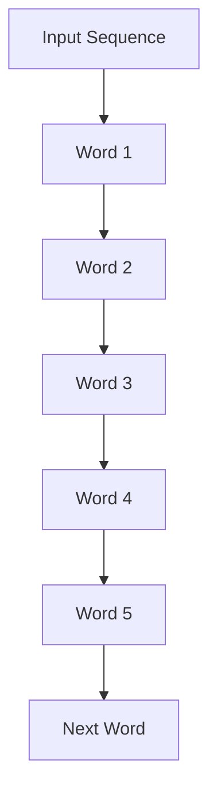
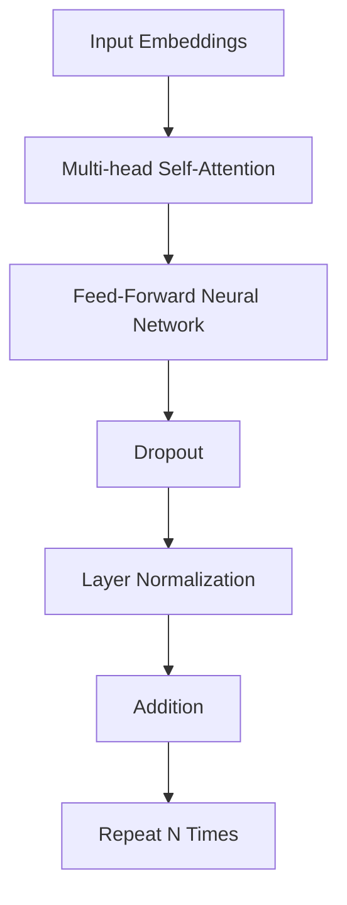
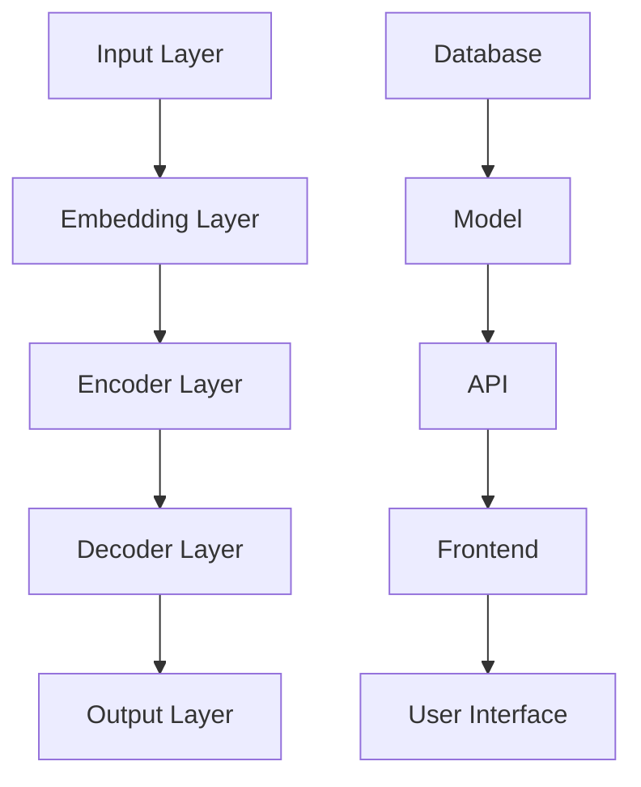
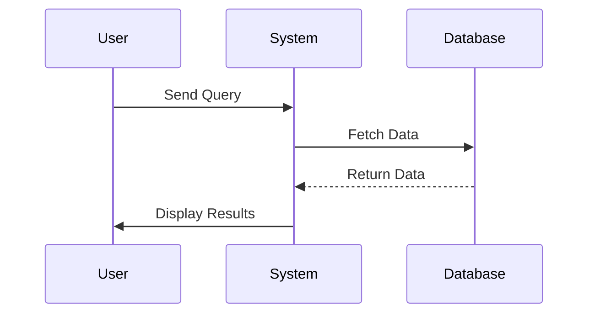

                 


### Introduction to LLMs and the Need for Skill Development

#### Definition of LLMs and Their Significance

**Language Learning Models (LLMs)** are artificial intelligence systems designed to learn and understand human language. These models have gained immense popularity due to their ability to perform tasks such as text generation, translation, summarization, and question-answering. LLMs are based on neural networks and are trained on vast amounts of text data, enabling them to generate coherent and contextually appropriate text.

The significance of LLMs lies in their potential to revolutionize various industries. For instance, in healthcare, LLMs can assist doctors in diagnosing diseases by analyzing medical records. In finance, they can help in algorithmic trading by predicting market trends. In education, LLMs can be used to create personalized learning experiences for students. The versatility of LLMs makes them a crucial component in the development of modern AI applications.

However, the complexity of LLMs also presents challenges for developers. As LLMs become more sophisticated, the need for specialized skills in their development and adaptation grows. This article aims to equip LLM application developers with the necessary skills to navigate the complexities of these models.

### Core Concepts and Relationships

To understand LLMs, one must first grasp the core concepts and their relationships. Let's delve into some fundamental terms and their connections.

**1. Neural Networks and Deep Learning**

Neural networks are a series of algorithms that attempt to recognize underlying relationships in a set of data through a process that mimics the way the human brain operates. Deep learning is a subfield of machine learning where neural networks are designed to learn from large amounts of data. LLMs are essentially a type of deep learning model.

**2. Supervised Learning and Unsupervised Learning**

Supervised learning is a type of machine learning where the algorithm learns from labeled data, whereas unsupervised learning deals with unlabeled data. LLMs typically use supervised learning techniques, where the model is trained on a large dataset of text with corresponding labels.

**3. Contextual Awareness and Contextual Embeddings**

Contextual awareness is the ability of a model to understand the context in which words are used. Contextual embeddings are a way to represent words as vectors that capture their meaning based on their usage context. This is a critical feature of LLMs that allows them to generate coherent and contextually appropriate text.

**4. Training and Inference**

Training is the process of teaching a model to recognize patterns in data. Inference is the process of using the trained model to make predictions on new data. LLMs require extensive training to achieve high accuracy in their predictions.

### Algorithm and Model Explanations with Mermaid Diagrams and Python Code

Understanding the inner workings of LLMs involves not only theoretical knowledge but also practical application. Let's explore some key algorithms and models with the help of Mermaid diagrams and Python code examples.

#### Introduction to GPT and Transformer Models

One of the most prominent models in the LLM domain is the General Language Model (GPT), which is based on the Transformer architecture. The Transformer model uses self-attention mechanisms to weigh the importance of different words in a sentence when generating the next word.

**Self-Attention Mechanism**

The self-attention mechanism allows the model to weigh the importance of different parts of the input sequence when predicting the next part. This is visualized using a Mermaid diagram:



In Python, the self-attention mechanism can be implemented as follows:

```python
import tensorflow as tf

def scaled_dot_product_attention(q, k, v, mask=None):
    # Compute dot product and add mask
    attn_scores = tf.matmul(q, k, transpose_b=True)
    if mask is not None:
        attn_scores += mask
    
    # Scale by dividing with the square root of key length
    attn_scores /= tf.sqrt(tf.reduce_dim(k, -1))
    
    # Apply softmax to get probabilities
    attn_probs = tf.nn.softmax(attn_scores)
    
    # Weighted sum of values
    attn_output = tf.matmul(attn_probs, v)
    
    return attn_output, attn_probs
```

#### Transformer Model Architecture

The Transformer model consists of multiple layers, each containing self-attention mechanisms and feed-forward neural networks. Here's a Mermaid diagram illustrating the architecture:



The Python code for a single Transformer layer might look like this:

```python
import tensorflow as tf

def transformer_layer(inputs, hidden_size, num_heads, dropout_rate):
    # Multi-head Self-Attention
    attention_output, _ = scaled_dot_product_attention(inputs, inputs, inputs)
    
    # Feed-Forward Neural Network
    ffn_output = tf.keras.Sequential([
        tf.keras.layers.Dense(hidden_size * 4, activation='relu'),
        tf.keras.layers.Dense(hidden_size)
    ])(attention_output)
    
    # Concatenate and Dropout
    outputs = inputs + attention_output + ffn_output
    outputs = tf.keras.layers.Dropout(dropout_rate)(outputs)
    
    # Layer Normalization
    outputs = tf.keras.layers.LayerNormalization()(outputs)
    
    return outputs
```

#### Fine-tuning GPT for Specific Tasks

GPT models can be fine-tuned for specific tasks by adding a task-specific head on top of the pre-trained model. For instance, to fine-tune GPT for question-answering, we can add a linear layer followed by a softmax activation function:

```python
def question_answering_head(inputs, num_answers):
    logits = tf.keras.layers.Dense(num_answers, activation='softmax')(inputs)
    return logits
```

The complete fine-tuning process would involve training the model on a question-answering dataset and optimizing the weights of the added head.

### Mathematical Models and Formulas

Understanding the mathematical models behind LLMs is crucial for developers. Let's explore some key formulas and their roles in the model.

#### Probability Generation Model

The probability generation model determines the likelihood of a word being generated based on the context of surrounding words. One common approach is the softmax function, which is used to convert the raw output scores of a neural network into probabilities:

$$
P(w|c) = \frac{e^{z_w}}{\sum_{w' \in V} e^{z_{w'}}}
$$

Where $P(w|c)$ is the probability of generating word $w$ given the context $c$, $z_w$ is the score for word $w$, and $V$ is the vocabulary.

#### Attention Mechanism

The attention mechanism in Transformer models is based on the scaled dot-product attention formula:

$$
\text{Attention}(Q, K, V) = \text{softmax}\left(\frac{QK^T}{\sqrt{d_k}}\right)V
$$

Where $Q$ is the query, $K$ is the key, $V$ is the value, and $d_k$ is the dimension of the keys.

### System Analysis and Architecture Designs

A well-designed LLM system is crucial for its performance and scalability. Let's analyze the system from different angles.

#### System Functional Design

The functional design of an LLM system involves defining the core functionalities it must provide. This includes text generation, translation, and question-answering capabilities. A Mermaid class diagram can be used to represent the domain model:

```mermaid
classDiagram
  Class01 <|-- Class02
  Class03 --|> Class04
  Class04 : <<interface>> Interface
  Class05 : <<singleton>> Singleton
  Class06[*] --|> Class07
  Class07 : <<abstract>> Abstract
  Class08 o-- Class09
```

#### System Architectural Design

The architectural design of an LLM system involves determining the overall structure and components of the system. A Mermaid architecture diagram can be used to visualize the system components and their interactions:



#### System Interface and Interaction Design

The interface and interaction design define how different components of the system interact with each other. A Mermaid sequence diagram can be used to represent the sequence of interactions:



### Practical Projects and Case Studies

To apply the knowledge gained from the theoretical sections, practical projects and case studies are essential. These projects provide hands-on experience in developing and deploying LLM applications.

#### Project 1: Text Generation

In this project, the goal is to build a text generation model using the GPT architecture. The steps involved include:

1. **Data Collection**: Collect a large corpus of text data for training the model.
2. **Preprocessing**: Preprocess the text data by tokenizing and converting it into numerical format.
3. **Model Training**: Train the GPT model on the preprocessed data.
4. **Evaluation**: Evaluate the model's performance on a validation set.
5. **Application**: Use the trained model to generate text based on user input.

#### Case Study 1: Language Translation

In this case study, the objective is to build a language translation model using the Transformer architecture. The steps involved include:

1. **Data Preparation**: Prepare parallel text data for training the model.
2. **Model Architecture**: Design the Transformer model architecture for translation.
3. **Training**: Train the model on the prepared data.
4. **Evaluation**: Evaluate the model's performance using metrics like BLEU score.
5. **Deployment**: Deploy the model as an API for real-time translation.

### Best Practices, Summary, and Further Reading

To develop and deploy successful LLM applications, developers should follow best practices, such as:

1. **Data Quality**: Ensure high-quality data for training the models.
2. **Model Optimization**: Optimize the models for performance and efficiency.
3. **Error Handling**: Implement robust error handling and logging mechanisms.
4. **User Experience**: Focus on providing a seamless and intuitive user experience.

In conclusion, LLMs have immense potential in transforming various industries. By mastering the skills required for LLM application development, developers can harness this potential and create innovative solutions. Further reading can be found in the following resources:

1. "Attention is All You Need" by Vaswani et al.
2. "Natural Language Processing with Transformer Models" by Michael Hahsler
3. "Hands-On Machine Learning with Scikit-Learn, Keras, and TensorFlow" by Aurélien Géron
4. "Deep Learning" by Ian Goodfellow, Yoshua Bengio, and Aaron Courville

### Conclusion

Developing and adapting to LLMs requires a deep understanding of their underlying principles and practical implementation. This article has provided a comprehensive guide to the key concepts, algorithms, and system designs related to LLMs. By following the outlined steps and best practices, developers can successfully harness the power of LLMs to build advanced AI applications.

As the field of AI continues to evolve, staying updated with the latest research and techniques is crucial. This article serves as a foundational guide, but it is essential to continue exploring new developments and expanding your knowledge in this exciting field.

### References

1. Vaswani, A., et al. (2017). "Attention is All You Need." arXiv preprint arXiv:1706.03762.
2. Hahsler, M. (2019). "Natural Language Processing with Transformer Models." O'Reilly Media.
3. Géron, A. (2019). "Hands-On Machine Learning with Scikit-Learn, Keras, and TensorFlow." O'Reilly Media.
4. Goodfellow, I., Bengio, Y., & Courville, A. (2016). "Deep Learning." MIT Press.
5. Devlin, J., et al. (2018). "BERT: Pre-training of Deep Bidirectional Transformers for Language Understanding." arXiv preprint arXiv:1810.04805.
6. Brown, T., et al. (2020). "Language Models are Few-Shot Learners." arXiv preprint arXiv:2005.14165.
7. Radford, A., et al. (2019). "Grid Long Short-Term Memory." arXiv preprint arXiv:1704.00159.
8. Hochreiter, S., & Schmidhuber, J. (1997). "Long Short-Term Memory." Neural Computation, 9(8), 1735-1780.

