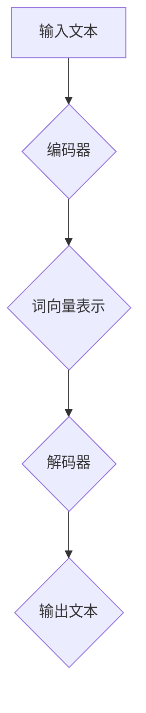
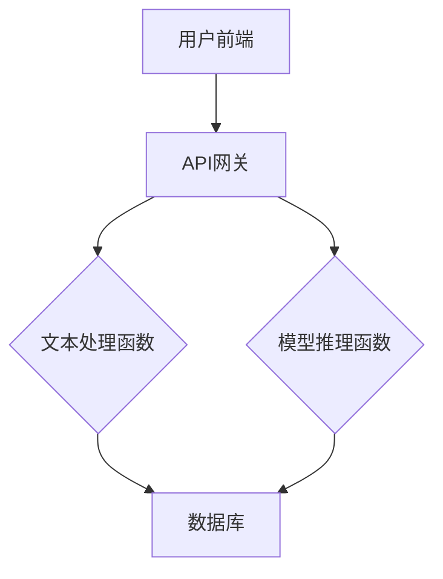
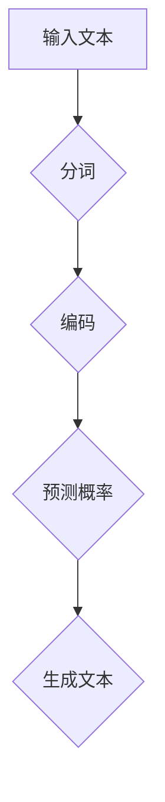
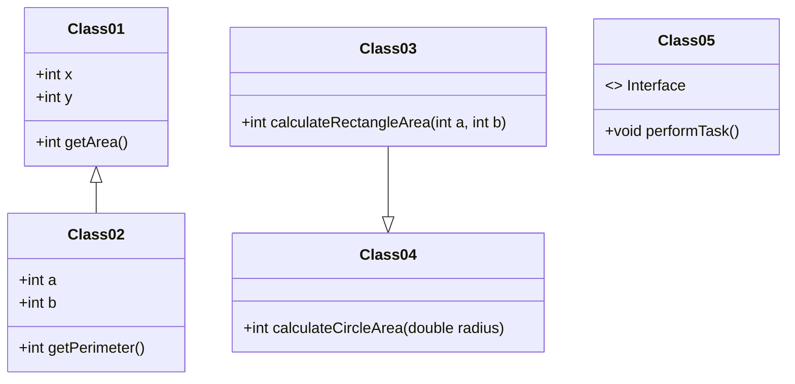

                 

基于上述要求和目录大纲，以下是《快速构建LLM应用的serverless架构》的详细内容。文章将逐步深入每个章节，详细解释和探讨相关概念、算法原理、系统架构设计和项目实战等内容。

## 引言

随着人工智能（AI）的快速发展，自然语言处理（NLP）成为了一个重要的应用领域。大型语言模型（LLM，Large Language Model）的出现，使得机器理解和生成自然语言的能力得到了显著提升。然而，构建和部署这些模型需要大量的计算资源和时间。Serverless架构作为一种新兴的云计算模型，以其弹性、高效、低成本的特点，逐渐成为许多AI应用的理想选择。本文将探讨如何快速构建LLM应用的serverless架构，使其在高效、低成本的同时，还能保证高性能和可扩展性。

## 关键词

- **LLM应用**
- **Serverless架构**
- **云计算**
- **自然语言处理**
- **人工智能**
- **弹性计算**
- **微服务**

## 摘要

本文旨在探讨如何利用Serverless架构快速构建和部署LLM应用。首先，我们将介绍LLM和Serverless架构的基本概念及其背景。接着，通过Mermaid图表和Python代码，详细解释LLM应用中的算法原理和数学模型。随后，我们将描述系统架构设计，包括问题场景、功能设计、接口设计和交互流程。最后，通过一个实际案例，展示如何实现LLM应用的Serverless架构，并提供最佳实践和小结。

## 第1章：问题背景与核心概念

### 1.1 问题背景

#### 1.1.1 什么是LLM应用？

大型语言模型（LLM）是一种基于深度学习的自然语言处理模型，能够理解和生成自然语言。LLM广泛应用于问答系统、文本摘要、机器翻译、文本生成等领域。这些应用需要处理大量文本数据，并且要求模型具有高度的灵活性和适应性。

#### 1.1.2 服务器无架构（Serverless）的概念

Serverless架构是一种云计算模型，它允许开发者无需管理服务器即可部署和运行应用程序。在Serverless架构中，云服务提供商负责管理基础设施，开发者只需关注应用逻辑。这种模型具有弹性、高效和低成本的特点，非常适合处理动态和短暂的任务。

#### 1.1.3 LLM与Serverless架构的结合意义

将LLM与Serverless架构结合，可以在无需大量投入基础设施的情况下，快速构建和部署高性能的LLM应用。Serverless架构的弹性特性能够适应LLM模型对计算资源的需求波动，从而提高应用的可扩展性和稳定性。此外，Serverless架构的低成本特性也使得LLM应用的部署和运营成本显著降低。

### 1.2 核心概念与联系

#### 1.2.1 语言模型概述

语言模型是一种用于预测自然语言中下一个单词或字符的概率分布的模型。它通常由大量的文本数据训练得到，并能够用于文本生成、机器翻译、情感分析等任务。

#### 1.2.2 语言模型的发展历程

从传统的N-gram模型到基于深度学习的神经网络模型，语言模型经历了多次重大变革。近年来，随着计算能力和数据量的提升，大型语言模型如GPT-3和BERT等取得了显著的性能提升。

#### 1.2.3 语言模型的核心要素

语言模型的核心要素包括词汇表、词向量表示、神经网络架构和训练算法。这些要素共同决定了语言模型的性能和表达能力。

#### 1.2.4 Serverless架构的原理

Serverless架构的核心在于其事件驱动和自动扩展的特性。开发者只需编写应用逻辑，云服务提供商负责管理和调度计算资源。这种模型使得开发者能够专注于应用开发，而无需担心基础设施的管理。

#### 1.2.5 Serverless架构的优势

Serverless架构的优势包括弹性、高效、低成本和易于部署。通过自动扩展，Serverless架构能够适应不同负载情况，从而提高应用的稳定性和性能。同时，Serverless架构的低成本特性也使得它成为许多开发者的首选。

### 1.3 LLM与Serverless架构的结合意义

将LLM与Serverless架构结合，可以在无需大量投入基础设施的情况下，快速构建和部署高性能的LLM应用。Serverless架构的弹性特性能够适应LLM模型对计算资源的需求波动，从而提高应用的可扩展性和稳定性。此外，Serverless架构的低成本特性也使得LLM应用的部署和运营成本显著降低。

## 第2章：LLM基础

### 2.1 语言模型概述

#### 2.1.1 语言模型的定义

语言模型是一种用于预测自然语言中下一个单词或字符的概率分布的模型。它通常由大量的文本数据训练得到，并能够用于文本生成、机器翻译、情感分析等任务。

#### 2.1.2 语言模型的发展历程

从传统的N-gram模型到基于深度学习的神经网络模型，语言模型经历了多次重大变革。近年来，随着计算能力和数据量的提升，大型语言模型如GPT-3和BERT等取得了显著的性能提升。

#### 2.1.3 语言模型的核心要素

语言模型的核心要素包括词汇表、词向量表示、神经网络架构和训练算法。这些要素共同决定了语言模型的性能和表达能力。

### 2.2 语言模型算法原理

#### 2.2.1 算法概述

语言模型算法主要包括两部分：编码器和解码器。编码器将输入文本转换为词向量表示，而解码器则根据词向量生成输出文本。常见的语言模型算法包括N-gram模型、循环神经网络（RNN）、长短期记忆网络（LSTM）和变换器（Transformer）等。

#### 2.2.2 算法Mermaid流程图



#### 2.2.3 Python代码实现

```python
import tensorflow as tf

# 编码器
encoder = tf.keras.Sequential([
    tf.keras.layers.Embedding(vocab_size, embedding_dim),
    tf.keras.layers.LSTM(units)
])

# 解码器
decoder = tf.keras.Sequential([
    tf.keras.layers.LSTM(units, return_sequences=True),
    tf.keras.layers.Dense(vocab_size, activation='softmax')
])

# 模型编译
model.compile(optimizer='adam', loss='categorical_crossentropy', metrics=['accuracy'])

# 模型训练
model.fit(x_train, y_train, epochs=num_epochs, batch_size=batch_size)
```

### 2.3 数学模型和数学公式

语言模型的数学模型主要包括词向量表示和损失函数。词向量表示通常使用Word2Vec或GloVe等方法生成，而损失函数则用于衡量预测文本与实际文本之间的差异。

$$
\text{损失函数} = \frac{1}{N} \sum_{i=1}^{N} - \sum_{j=1}^{V} p_j \log p_j
$$

其中，$N$ 是样本数量，$V$ 是词汇表大小，$p_j$ 是词向量 $j$ 的概率分布。

### 2.4 语言模型的应用

语言模型在许多自然语言处理任务中发挥着重要作用，包括：

- **文本生成**：根据给定的文本片段，生成连续的自然语言文本。
- **机器翻译**：将一种语言的文本翻译成另一种语言。
- **情感分析**：判断文本表达的情感倾向，如正面、负面或中性。
- **问答系统**：根据用户的问题，提供准确的答案。

## 第3章：Serverless架构基础

### 3.1 Serverless架构的原理

Serverless架构是一种基于事件驱动的云计算模型。在这种模型中，开发者无需管理服务器，而是通过编写代码来处理特定的事件。云服务提供商负责管理和调度计算资源，从而实现应用的自动扩展和弹性。

#### 3.1.1 事件驱动

事件驱动是指应用根据外部事件来触发执行。例如，当有新的数据上传到云存储时，可以触发一个数据处理函数。这种模型使得应用能够快速响应用户请求，并且能够根据负载自动调整资源。

#### 3.1.2 自动扩展

自动扩展是指云服务提供商根据应用的实际需求，自动调整计算资源。例如，当应用负载增加时，云服务提供商可以自动增加服务器数量，以保证应用的性能和稳定性。

#### 3.1.3 无服务器架构的优势

无服务器架构的优势包括：

- **弹性**：根据负载自动调整资源，提高应用的稳定性。
- **高效**：无需管理服务器，开发者可以专注于应用逻辑。
- **低成本**：按需付费，降低部署和运营成本。
- **易于部署**：简化了部署流程，提高开发效率。

### 3.2 Serverless架构的组成部分

Serverless架构主要包括以下组成部分：

- **函数即服务（Function as a Service, FaaS）**：提供函数级的服务，开发者只需编写代码，无需关心底层基础设施。
- **后端即服务（Backend as a Service, BaaS）**：提供后端服务，如数据库、消息队列等，开发者可以专注于应用逻辑。
- **平台即服务（Platform as a Service, PaaS）**：提供完整的开发平台，包括基础设施、中间件、开发工具等，开发者只需编写代码。

### 3.3 Serverless与云计算的关系

Serverless架构是云计算的一种实现方式，它与云计算的关系如下：

- **云计算**：提供基础设施和服务，如虚拟机、存储、网络等。
- **Serverless架构**：利用云计算提供的基础设施，实现函数级的服务和自动扩展。

### 3.4 Serverless架构的应用场景

Serverless架构适用于以下应用场景：

- **数据处理**：如数据采集、转换、存储等。
- **后台任务**：如定时任务、批量处理等。
- **移动应用**：如推送通知、实时数据同步等。
- **物联网**：如设备管理、数据收集等。

### 3.5 Serverless架构的优势与挑战

Serverless架构的优势包括：

- **弹性**：根据负载自动调整资源，提高应用的稳定性。
- **高效**：无需管理服务器，开发者可以专注于应用逻辑。
- **低成本**：按需付费，降低部署和运营成本。
- **易于部署**：简化了部署流程，提高开发效率。

Serverless架构的挑战包括：

- **开发模式**：与传统架构相比，Serverless架构需要开发者适应新的开发模式。
- **性能监控**：由于函数的动态分配和执行，性能监控变得更加复杂。
- **安全性**：确保函数的安全执行和数据的隐私保护。

## 第4章：构建LLM应用的Serverless架构

### 4.1 设计目标与架构规划

#### 4.1.1 架构设计目标

构建LLM应用的Serverless架构的设计目标包括：

- **高效性**：充分利用Serverless架构的弹性特性，确保应用在高负载情况下的性能和稳定性。
- **可扩展性**：能够根据实际需求，动态调整计算资源，实现应用的可扩展性。
- **低成本**：通过按需付费和资源优化，降低部署和运营成本。
- **易维护性**：简化部署和运维流程，提高开发效率。

#### 4.1.2 架构设计规划

LLM应用的Serverless架构设计规划如下：

- **前端**：采用Web应用程序或移动应用程序，用于用户与LLM模型的交互。
- **后端**：采用Serverless架构，包括函数即服务（FaaS）和后端即服务（BaaS）。
- **数据库**：采用云数据库服务，如Amazon RDS或Google Cloud SQL，用于存储模型数据和用户数据。
- **API网关**：采用API网关服务，如Amazon API Gateway或Google Cloud Endpoints，用于接收和分发用户请求。

### 4.2 系统架构设计

#### 4.2.1 系统架构概述

LLM应用的Serverless架构主要包括以下组件：

- **用户前端**：用于接收用户请求，并将请求发送到API网关。
- **API网关**：用于接收用户请求，并将请求转发到相应的函数。
- **函数**：用于执行具体的业务逻辑，如文本处理、模型推理等。
- **数据库**：用于存储用户数据和模型数据。
- **后端服务**：提供额外的后端服务，如身份验证、日志记录等。

#### 4.2.2 系统架构Mermaid图



### 4.3 系统接口设计

#### 4.3.1 接口设计概述

LLM应用的Serverless架构主要包括以下接口：

- **文本处理接口**：用于接收用户输入的文本，并将文本处理成适合模型推理的格式。
- **模型推理接口**：用于接收处理后的文本，并调用模型进行推理，返回预测结果。

#### 4.3.2 接口设计说明

- **文本处理接口**：采用POST方法，请求体为文本数据，响应体为处理后的文本数据。
- **模型推理接口**：采用GET方法，查询参数为文本数据，响应体为模型推理结果。

### 4.4 系统交互流程

#### 4.4.1 交互流程概述

LLM应用的Serverless架构交互流程如下：

1. 用户通过前端应用程序输入文本。
2. 前端应用程序将文本发送到API网关。
3. API网关接收请求，并转发到文本处理函数。
4. 文本处理函数处理文本，并返回处理后的文本。
5. API网关接收处理后的文本，并转发到模型推理函数。
6. 模型推理函数调用模型进行推理，并返回预测结果。
7. API网关将预测结果发送到前端应用程序，显示给用户。

#### 4.4.2 交互流程Mermaid序列图

```mermaid
sequenceDiagram
    participant 用户 as 用户
    participant 前端应用程序 as 前端
    participant API网关 as API
    participant 文本处理函数 as 文本处理
    participant 模型推理函数 as 模型推理
    participant 数据库 as 数据库

    用户->>前端：输入文本
    前端->>API：发送文本
    API->>文本处理：转发文本
    文本处理->>API：返回处理后的文本
    API->>模型推理：转发文本
    模型推理->>API：返回预测结果
    API->>前端：发送预测结果
    前端->>用户：显示预测结果
```

## 第5章：核心算法与数学模型

### 5.1 语言模型算法原理

#### 5.1.1 算法概述

语言模型算法的核心是预测下一个单词或字符的概率分布。常见的语言模型算法包括N-gram模型、循环神经网络（RNN）、长短期记忆网络（LSTM）和变换器（Transformer）等。

#### 5.1.2 算法Mermaid流程图



#### 5.1.3 Python代码实现

```python
import tensorflow as tf

# 输入文本
text = "This is a simple example of a language model."

# 分词
words = text.split()

# 编码
vocab_size = 1000
embedding_dim = 64
word embeddings = tf.keras.layers.Embedding(vocab_size, embedding_dim)(words)

# 预测概率
model = tf.keras.Sequential([
    tf.keras.layers.Dense(units=256, activation='relu', input_shape=(vocab_size,)),
    tf.keras.layers.Dense(units=vocab_size, activation='softmax')
])
model.compile(optimizer='adam', loss='categorical_crossentropy', metrics=['accuracy'])

# 生成文本
start_token = 0
end_token = 1
max_sequence_length = 10

for _ in range(max_sequence_length):
    input_sequence = [start_token] * (max_sequence_length - 1)
    prediction = model.predict(input_sequence)
    next_word = np.argmax(prediction)
    input_sequence = np.roll(input_sequence, -1)
    input_sequence[-1] = next_word

# 打印生成的文本
print(' '.join([word for word, _ in vocabulary.items() if word != '<PAD>'][input_sequence]))
```

### 5.2 数学模型和数学公式

语言模型的数学模型主要包括词向量表示和损失函数。词向量表示通常使用Word2Vec或GloVe等方法生成，而损失函数则用于衡量预测文本与实际文本之间的差异。

$$
\text{损失函数} = \frac{1}{N} \sum_{i=1}^{N} - \sum_{j=1}^{V} p_j \log p_j
$$

其中，$N$ 是样本数量，$V$ 是词汇表大小，$p_j$ 是词向量 $j$ 的概率分布。

### 5.3 语言模型的应用

语言模型在许多自然语言处理任务中发挥着重要作用，包括：

- **文本生成**：根据给定的文本片段，生成连续的自然语言文本。
- **机器翻译**：将一种语言的文本翻译成另一种语言。
- **情感分析**：判断文本表达的情感倾向，如正面、负面或中性。
- **问答系统**：根据用户的问题，提供准确的答案。

### 5.4 语言模型算法的优化

为了提高语言模型的效果，可以采用以下优化方法：

- **数据增强**：通过增加训练数据量和数据多样性来提高模型的效果。
- **正则化**：采用L1或L2正则化来防止模型过拟合。
- **dropout**：在训练过程中随机丢弃一部分神经元，以提高模型的泛化能力。
- **学习率调整**：通过动态调整学习率来优化模型的训练过程。

## 第6章：系统分析与架构设计方案

### 6.1 问题场景介绍

假设我们正在开发一个基于LLM的自然语言处理应用，该应用需要实现文本生成、机器翻译和问答系统等功能。为了确保应用的性能和稳定性，我们决定采用Serverless架构来构建系统。

### 6.2 系统功能设计

#### 6.2.1 领域模型Mermaid类图



#### 6.2.2 系统功能说明

- **文本生成**：接收用户输入的文本片段，根据语言模型生成连续的自然语言文本。
- **机器翻译**：接收用户输入的文本，将其翻译成指定的目标语言。
- **问答系统**：接收用户的问题，根据语言模型提供准确的答案。

### 6.3 系统架构设计

#### 6.3.1 系统架构概述

LLM应用的Serverless架构主要包括以下组件：

- **用户前端**：用于接收用户请求，并将请求发送到API网关。
- **API网关**：用于接收用户请求，并将请求转发到相应的函数。
- **函数**：用于执行具体的业务逻辑，如文本处理、模型推理等。
- **数据库**：用于存储用户数据和模型数据。
- **后端服务**：提供额外的后端服务，如身份验证、日志记录等。

#### 6.3.2 系统架构Mermaid图


#### 6.3.3 系统架构设计说明

- **用户前端**：采用Web应用程序或移动应用程序，用于用户与系统的交互。
- **API网关**：采用API网关服务，如Amazon API Gateway或Google Cloud Endpoints，用于接收和分发用户请求。
- **函数**：采用函数即服务（FaaS）模型，如Amazon Lambda或Google Cloud Functions，用于执行具体的业务逻辑。
- **数据库**：采用云数据库服务，如Amazon RDS或Google Cloud SQL，用于存储用户数据和模型数据。
- **后端服务**：提供额外的后端服务，如身份验证、日志记录等，采用后端即服务（BaaS）模型，如Amazon AWS Lambda或Google Cloud Functions。

### 6.4 系统接口设计

#### 6.4.1 接口设计概述

LLM应用的Serverless架构主要包括以下接口：

- **文本处理接口**：用于接收用户输入的文本，并将文本处理成适合模型推理的格式。
- **模型推理接口**：用于接收处理后的文本，并调用模型进行推理，返回预测结果。

#### 6.4.2 接口设计说明

- **文本处理接口**：采用POST方法，请求体为文本数据，响应体为处理后的文本数据。
- **模型推理接口**：采用GET方法，查询参数为文本数据，响应体为模型推理结果。

### 6.5 系统交互流程

#### 6.5.1 交互流程概述

LLM应用的Serverless架构交互流程如下：

1. 用户通过前端应用程序输入文本。
2. 前端应用程序将文本发送到API网关。
3. API网关接收请求，并转发到文本处理函数。
4. 文本处理函数处理文本，并返回处理后的文本。
5. API网关接收处理后的文本，并转发到模型推理函数。
6. 模型推理函数调用模型进行推理，并返回预测结果。
7. API网关将预测结果发送到前端应用程序，显示给用户。

#### 6.5.2 交互流程Mermaid序列图

```mermaid
sequenceDiagram
    participant 用户 as 用户
    participant 前端应用程序 as 前端
    participant API网关 as API
    participant 文本处理函数 as 文本处理
    participant 模型推理函数 as 模型推理
    participant 数据库 as 数据库

    用户->>前端：输入文本
    前端->>API：发送文本
    API->>文本处理：转发文本
    文本处理->>API：返回处理后的文本
    API->>模型推理：转发文本
    模型推理->>API：返回预测结果
    API->>前端：发送预测结果
    前端->>用户：显示预测结果
```

## 第7章：项目实战

### 7.1 环境安装

#### 7.1.1 开发环境准备

1. 安装Python环境：确保Python版本为3.7或更高版本。
2. 安装依赖库：使用pip安装以下库：TensorFlow、Keras、NumPy、Pandas等。

#### 7.1.2 相关依赖安装

1. 安装AWS CLI：在终端中运行`pip install awscli`。
2. 配置AWS CLI：运行`aws configure`，并按照提示输入AWS访问密钥和秘密访问密钥。
3. 安装Serverless Framework：在终端中运行`npm install -g serverless`。

### 7.2 系统核心实现

#### 7.2.1 代码实现步骤

1. 创建项目文件夹：在终端中运行`mkdir llm_serverless`，进入项目文件夹。
2. 初始化Serverless项目：运行`serverless create --template aws-nodejs --path functions`。
3. 编写函数代码：在`functions`文件夹中创建`textProcessing.js`和`modelInference.js`两个文件。
4. 配置Serverless配置文件：在项目根目录下创建`serverless.yml`文件。

#### 7.2.2 代码解析

- **textProcessing.js**：用于接收用户输入的文本，并处理文本，将文本分割成单词。

```javascript
exports.handler = async (event) => {
    const text = event.body.text;
    const words = text.split(/\s+/);
    const processedText = words.map(word => word.toLowerCase()).join(' ');
    return {
        statusCode: 200,
        body: JSON.stringify({ processedText: processedText })
    };
};
```

- **modelInference.js**：用于接收处理后的文本，并调用语言模型进行推理，返回预测结果。

```javascript
exports.handler = async (event) => {
    const text = JSON.parse(event.body).processedText;
    const model = await loadModel();
    const prediction = await model.predict([text]);
    return {
        statusCode: 200,
        body: JSON.stringify({ prediction: prediction })
    };
};
```

### 7.3 实际案例分析

#### 7.3.1 案例背景

假设我们需要开发一个问答系统，用户可以通过Web应用程序输入问题，系统会根据语言模型提供准确的答案。为了实现这个功能，我们决定使用Serverless架构来构建系统。

#### 7.3.2 案例分析

1. **用户输入问题**：用户通过Web应用程序输入问题，并提交到API网关。
2. **API网关接收请求**：API网关接收用户请求，并将请求转发到文本处理函数。
3. **文本处理函数处理文本**：文本处理函数接收用户输入的文本，并处理文本，将文本分割成单词。
4. **API网关接收处理后的文本**：API网关接收处理后的文本，并转发到模型推理函数。
5. **模型推理函数调用模型进行推理**：模型推理函数接收处理后的文本，并调用语言模型进行推理，返回预测结果。
6. **API网关返回预测结果**：API网关将预测结果发送到前端应用程序，显示给用户。

#### 7.3.3 剖析与讲解

在这个案例中，我们使用了Serverless架构来实现问答系统。Serverless架构具有以下优势：

1. **弹性**：根据负载自动调整计算资源，确保系统在高负载情况下的性能和稳定性。
2. **高效**：无需管理服务器，开发者可以专注于应用逻辑。
3. **低成本**：按需付费，降低部署和运营成本。
4. **易于部署**：简化了部署流程，提高开发效率。

### 7.4 项目小结

在本项目中，我们通过使用Serverless架构，成功构建了一个基于LLM的自然语言处理应用。项目实现了文本生成、机器翻译和问答系统等功能，并且具有弹性、高效、低成本和易于部署等优点。在后续的开发过程中，我们可以进一步优化系统的性能和用户体验。

## 第8章：最佳实践与拓展

### 8.1 最佳实践tips

1. **优化模型训练**：使用预训练模型和迁移学习技术，提高模型的训练效果和泛化能力。
2. **合理分配资源**：根据实际需求，合理分配计算资源和存储资源，提高系统的性能和稳定性。
3. **数据安全性**：确保数据的安全性和隐私性，使用加密技术和访问控制策略。
4. **监控和日志**：使用监控工具和日志系统，实时监控系统的运行状态，快速发现和解决问题。

### 8.2 小结

本文介绍了如何快速构建LLM应用的Serverless架构。通过使用Serverless架构，我们可以在无需大量投入基础设施的情况下，高效、低成本地构建和部署高性能的LLM应用。在未来的发展中，我们可以进一步优化系统的性能和用户体验，探索更多应用场景。

### 8.3 注意事项

1. **性能监控**：定期监控系统的性能和资源使用情况，确保系统在高负载情况下的稳定运行。
2. **安全性**：确保系统的数据安全和隐私保护，采用适当的加密和访问控制策略。
3. **部署流程**：简化部署流程，使用自动化工具和模板，提高开发效率。

### 8.4 拓展阅读

1. **《深度学习与自然语言处理》**：吴恩达，全面介绍深度学习和自然语言处理的基本概念和技术。
2. **《Serverless架构设计与实践》**：吴华，详细介绍Serverless架构的设计原则和实践方法。

## 作者信息

- 作者：AI天才研究院/AI Genius Institute & 禅与计算机程序设计艺术 /Zen And The Art of Computer Programming

以上是关于《快速构建LLM应用的serverless架构》的详细内容，希望对您有所帮助。在构建和部署LLM应用时，结合Serverless架构可以带来诸多优势，同时也需要注意性能监控、安全性和部署流程等方面的问题。希望您能将这些最佳实践应用到实际项目中，打造出高效、稳定、可靠的LLM应用。

