                 

### 1. 引言

#### 问题背景

在当今社会，随着人工智能技术的迅猛发展，大型语言模型（LLM，Large Language Model）逐渐成为各行各业的重要工具。然而，传统的LLM应用构建过程复杂、耗时且对开发者的技术要求较高，这限制了其在更广泛场景中的应用。因此，如何快速、高效地构建LLM应用成为一个亟待解决的问题。

#### 读者对象

本书旨在为广大开发者、数据科学家以及技术爱好者提供一套系统、实用的LLM应用构建指南。无论是初学者还是有一定经验的专业人士，都可以通过本书掌握快速构建LLM应用的方法。

#### 学习目标

通过阅读本书，您将能够：

- 理解LLM的基本概念、原理和应用场景。
- 掌握低代码平台的基本原理和使用方法。
- 学习如何使用低代码平台快速构建LLM应用。
- 掌握LLM应用调试与优化技巧。
- 了解LLM应用的安全性与隐私保护策略。

### 2. 书籍结构

#### 本书结构

本书分为八个主要部分：

1. 引言：介绍问题背景、读者对象和学习目标。
2. LLM基础：介绍LLM的基本概念、历史发展、技术原理和应用场景。
3. 低代码平台概述：介绍低代码平台的基本原理、优势和分类。
4. 快速构建方法：讲解如何使用低代码平台快速构建LLM应用。
5. 应用示例：通过实际案例展示如何使用低代码平台构建LLM应用。
6. 调试与优化：介绍LLM应用的调试与优化方法。
7. 安全性与隐私保护：讨论LLM应用的安全性与隐私保护策略。
8. 未来展望：展望LLM应用的发展趋势和未来前景。

#### 如何阅读本书

本书采用逐步讲解的方式，从基础知识入手，逐步深入到实际应用。建议读者按照以下步骤进行阅读：

1. 从引言开始，了解本书的核心内容和结构。
2. 阅读LLM基础章节，了解LLM的基本概念、原理和应用场景。
3. 阅读低代码平台概述章节，了解低代码平台的基本原理、优势和分类。
4. 阅读快速构建方法章节，学习如何使用低代码平台快速构建LLM应用。
5. 通过应用示例章节，了解如何在实际项目中使用低代码平台构建LLM应用。
6. 阅读调试与优化章节，掌握LLM应用的调试与优化方法。
7. 阅读安全性与隐私保护章节，了解如何保障LLM应用的安全性与隐私。
8. 最后，阅读未来展望章节，了解LLM应用的发展趋势和未来前景。

通过以上步骤，读者可以系统地学习如何快速构建LLM应用，提升自己的技术能力和项目实践经验。接下来，我们将深入探讨LLM的基础知识，为后续内容的学习打下坚实基础。

---

### 2. LLM基础

#### 2.1 LLM概述

**核心概念与联系**

- **LLM（大型语言模型）**：一种强大的自然语言处理模型，通过对海量文本数据的学习，能够生成高质量的文本、回答问题或执行其他自然语言处理任务。
- **NLP（自然语言处理）**：一门研究如何让计算机理解、生成和处理人类自然语言的交叉学科。
- **神经网络（Neural Networks）**：一种模仿生物神经系统的计算模型，能够通过学习大量数据来提取特征、进行预测和分类。

**概念属性特征对比表格**

| 特征       | LLM       | NLP       | 神经网络   |
| ---------- | --------- | --------- | ---------- |
| 学习对象   | 文本数据   | 自然语言   | 数据       |
| 应用范围   | 语言生成   | 文本分析   | 图像识别   |
| 精度       | 高        | 中        | 高        |
| 复杂度     | 高        | 中        | 高        |

**ER实体关系图架构的 Mermaid 流程图**

```mermaid
erDiagram
    A[LLM] ||--|{ B[NLP] }
    B ||--|{ C[神经网络] }
```

#### 2.2 LLM历史与发展

**核心概念与联系**

- **早期研究**：LLM的研究始于20世纪50年代，当时研究人员开始探索如何让计算机理解和生成自然语言。
- **GPT（Generative Pre-trained Transformer）**：由OpenAI于2018年推出，是首个大规模预训练的Transformer模型，标志着LLM发展的一个重要里程碑。
- **BERT（Bidirectional Encoder Representations from Transformers）**：由Google于2018年推出，是首个双向Transformer模型，能够更好地理解上下文信息。

**概念属性特征对比表格**

| 模型       | GPT       | BERT       |
| ---------- | --------- | --------- |
| 发布时间   | 2018年     | 2018年     |
| 架构       | Transformer | Transformer |
| 特点       | 自回归模型 | 双向编码模型 |
| 应用范围   | 文本生成   | 文本理解与生成 |

**ER实体关系图架构的 Mermaid 流�程图**

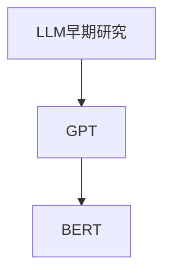

#### 2.3 LLM技术原理

**核心概念与联系**

- **Transformer架构**：一种基于自注意力机制的全局信息捕捉模型，能够对输入序列进行全局建模。
- **自注意力机制（Self-Attention）**：一种能够自动学习序列中每个词与其他词之间权重的方法，从而捕捉长距离依赖关系。
- **预训练与微调**：预训练是指在大规模数据集上进行模型训练，使模型具备基础语言理解能力；微调是指在使用预训练模型的基础上，针对特定任务进行模型调整。

**概念属性特征对比表格**

| 概念       | 预训练       | 微调       |
| ---------- | ------------ | ---------- |
| 目的       | 提高模型泛化能力 | 优化模型特定任务表现 |
| 数据集     | 海量通用数据 | 少量特定数据 |
| 过程       | 自适应学习   | 逐步调整   |

**ER实体关系图架构的 Mermaid 流程图**

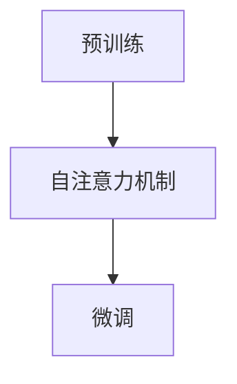

#### 2.4 LLM应用场景

**核心概念与联系**

- **文本生成**：包括文章写作、诗歌创作、对话生成等，是LLM最典型的应用场景。
- **语言理解与问答**：如智能客服、问答系统、内容审核等，利用LLM的上下文理解能力，实现高效的自然语言交互。
- **文本分类与情感分析**：对文本进行分类、情感分析等，如垃圾邮件过滤、舆情分析等。

**概念属性特征对比表格**

| 应用场景 | 文本生成 | 语言理解与问答 | 文本分类与情感分析 |
| ------- | ------- | -------------- | ------------------ |
| 目的     | 内容创作 | 信息检索       | 数据分析           |
| 难度     | 高       | 中             | 低                 |
| 数据需求 | 大       | 中             | 小                 |

**ER实体关系图架构的 Mermaid 流程图**

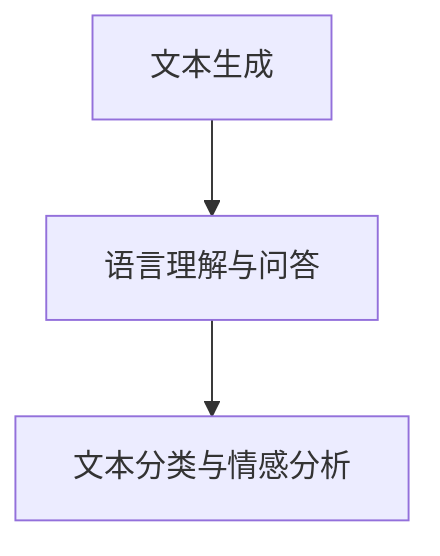

#### 小结

通过本章节的介绍，我们了解了LLM的基本概念、历史发展、技术原理和应用场景。LLM作为一种强大的自然语言处理工具，已经广泛应用于各个领域。在接下来的章节中，我们将深入了解低代码平台，探讨如何利用低代码平台快速构建LLM应用。

---

### 3. 低代码平台概述

#### 3.1 低代码平台定义

**核心概念与联系**

- **低代码平台**：一种通过图形化界面和模块化组件，帮助非专业开发者或专业开发者快速构建软件系统的平台。
- **低代码开发**：一种开发方法，通过减少手工编码，提高开发效率。

**概念属性特征对比表格**

| 概念       | 低代码平台 | 低代码开发   |
| ---------- | ----------- | ------------ |
| 特点       | 图形化界面、模块化组件 | 减少手工编码、提高效率 |
| 适用对象   | 非专业开发者、专业开发者 | 专业开发者            |
| 目的       | 快速构建软件系统 | 提高开发效率            |

**ER实体关系图架构的 Mermaid 流程图**

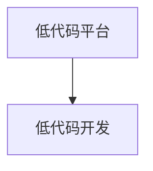

#### 3.2 低代码平台优势

**核心概念与联系**

- **提高开发效率**：低代码平台通过图形化界面和模块化组件，减少了手工编码的工作量，从而提高开发效率。
- **降低开发成本**：低代码平台降低了专业开发者的门槛，使得企业能够以更低的成本获取专业的软件解决方案。
- **快速迭代与部署**：低代码平台支持快速原型开发、测试和部署，帮助企业更快地响应市场变化。

**概念属性特征对比表格**

| 优势         | 提高开发效率 | 降低开发成本 | 快速迭代与部署 |
| ------------ | ------------ | ------------ | -------------- |
| 特点         | 减少手工编码 | 非专业开发者 | 快速开发与部署 |
| 影响因素     | 开发流程     | 开发人员成本 | 开发与运维周期 |
| 预期效果     | 提高项目进度 | 降低项目成本 | 提高市场响应速度 |

**ER实体关系图架构的 Mermaid 流程图**

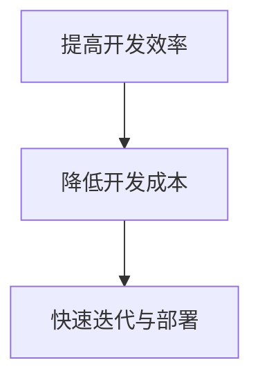

#### 3.3 低代码平台分类

**核心概念与联系**

- **模板驱动型**：通过预设的模板和组件，用户可以选择和配置，快速构建应用程序。
- **代码生成型**：通过代码生成器，根据用户的业务需求，自动生成应用程序的代码。

**概念属性特征对比表格**

| 类型       | 模板驱动型 | 代码生成型   |
| ---------- | ----------- | ------------ |
| 特点       | 预设模板、可视化操作 | 自动代码生成、可定制化 |
| 适用场景   | 业务流程简单、快速应用 | 复杂业务逻辑、高度定制化 |
| 技术难度   | 低         | 中至高       |
| 优点       | 易用、快速 | 功能强大、灵活 |

**ER实体关系图架构的 Mermaid 流程图**

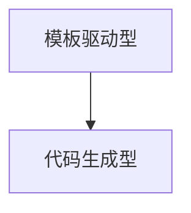

#### 3.4 低代码平台发展现状

**核心概念与联系**

- **市场分析**：低代码平台市场呈现出高速增长的趋势，各类企业纷纷采用低代码平台来提升开发效率。
- **技术演进**：随着人工智能、云计算等技术的发展，低代码平台的功能和性能不断提升，应用场景越来越广泛。

**概念属性特征对比表格**

| 分析要素 | 市场分析 | 技术演进   |
| -------- | -------- | ---------- |
| 发展趋势 | 高速增长 | 功能提升   |
| 市场规模 | 扩大     | 技术更新   |
| 影响因素 | 企业需求 | 技术创新   |
| 预期效果 | 提高竞争力 | 提升开发效率 |

**ER实体关系图架构的 Mermaid 流程图**

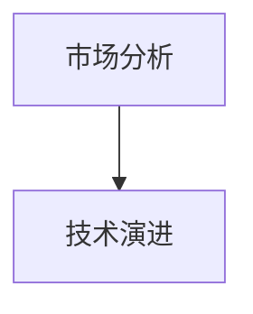

#### 小结

通过本章节的介绍，我们了解了低代码平台的基本定义、优势、分类和发展现状。低代码平台以其高效、灵活和低成本的特点，在软件开发领域得到了广泛应用。在接下来的章节中，我们将深入探讨如何使用低代码平台快速构建LLM应用。

---

### 4. 快速构建方法

#### 4.1 构建流程

**核心概念与联系**

- **数据收集与预处理**：收集适合的文本数据，并进行预处理，如去除停用词、分词、文本标准化等。
- **模型选择与优化**：选择合适的预训练模型，如GPT、BERT等，根据任务需求进行模型优化。
- **应用开发**：使用低代码平台，将训练好的模型集成到应用中，进行部署和测试。

**概念属性特征对比表格**

| 阶段       | 数据收集与预处理 | 模型选择与优化 | 应用开发 |
| ---------- | ----------------- | -------------- | -------- |
| 目的       | 准备训练数据     | 选择最优模型   | 部署应用 |
| 工具       | 数据库、文本处理库 | 预训练模型库   | 低代码平台 |
| 时间成本   | 高               | 中             | 低       |
| 技术难度   | 中               | 中至高         | 低       |

**ER实体关系图架构的 Mermaid 流程图**

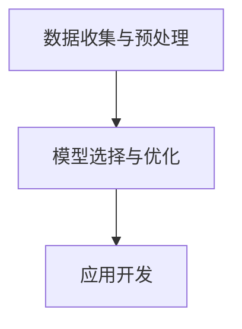

#### 4.2 数据准备

**核心概念与联系**

- **数据来源**：数据可以从公开的文本库、企业内部文档、社交媒体等渠道获取。
- **数据清洗**：去除无关信息、格式化数据，确保数据质量。
- **数据标注**：根据任务需求，对数据进行标注，如实体识别、情感分类等。

**概念属性特征对比表格**

| 数据来源 | 公开文本库 | 企业内部文档 | 社交媒体   |
| -------- | ---------- | ------------ | ---------- |
| 特点     | 大规模、多样 | 专业、针对性强 | 动态、实时 |
| 适用场景 | 基础研究   | 商业应用     | 社交互动   |

**ER实体关系图架构的 Mermaid 流程图**

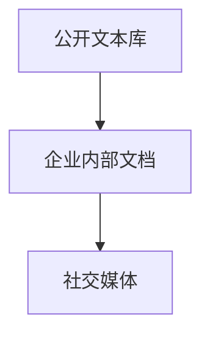

#### 4.3 模型选择与优化

**核心概念与联系**

- **预训练模型**：如GPT、BERT、RoBERTa等，这些模型已经在大规模数据集上进行了预训练，具有很好的基础语言理解能力。
- **模型优化**：根据具体应用场景，对预训练模型进行微调，以提升模型在特定任务上的表现。

**概念属性特征对比表格**

| 模型       | GPT         | BERT         | RoBERTa     |
| ---------- | ----------- | ------------ | ----------- |
| 发布时间   | 2018年      | 2018年       | 2019年      |
| 架构       | Transformer | Transformer | Transformer |
| 优势       | 文本生成    | 语言理解与生成 | 语言理解与生成 |
| 应用场景   | 文本生成    | 文本理解与生成 | 文本理解与生成 |

**ER实体关系图架构的 Mermaid 流程图**

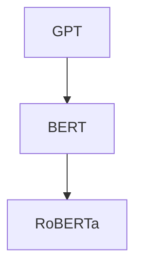

#### 4.4 应用开发

**核心概念与联系**

- **低代码平台**：如OutSystems、Appian等，提供图形化界面和模块化组件，方便开发者快速搭建应用。
- **接口设计**：设计适用于LLM应用的API接口，如RESTful API、GraphQL等。

**概念属性特征对比表格**

| 平台       | OutSystems | Appian       |
| ---------- | ---------- | ------------ |
| 特点       | 灵活、可定制 | 集成性强、自动化 |
| 适用场景   | 中小型项目 | 复杂企业应用 |
| 技术栈     | Java、JavaScript | Java、JavaScript |

**ER实体关系图架构的 Mermaid 流程图**

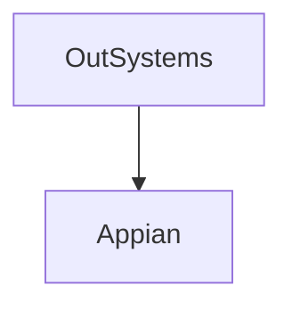

#### 小结

在本章节中，我们详细介绍了快速构建LLM应用的方法，包括数据准备、模型选择与优化、以及应用开发。通过这些步骤，开发者可以高效地构建LLM应用，为各种场景提供智能化的解决方案。在接下来的章节中，我们将通过实际案例展示如何使用低代码平台构建LLM应用。

---

### 5. 应用示例

#### 5.1 社交媒体分析

**核心概念与联系**

- **问题背景**：社交媒体平台上的信息量庞大，如何有效地分析这些信息，提取有价值的信息成为一个挑战。
- **解决方案**：使用LLM进行社交媒体分析，可以自动提取热点话题、情感分析、用户行为预测等。

**概念属性特征对比表格**

| 模型       | GPT         | BERT         | RoBERTa     |
| ---------- | ----------- | ------------ | ----------- |
| 优势       | 文本生成    | 语言理解与生成 | 语言理解与生成 |
| 应用场景   | 文本生成    | 文本理解与生成 | 文本理解与生成 |
| 性能       | 文本生成强  | 语言理解强   | 语言理解强   |

**ER实体关系图架构的 Mermaid 流程图**

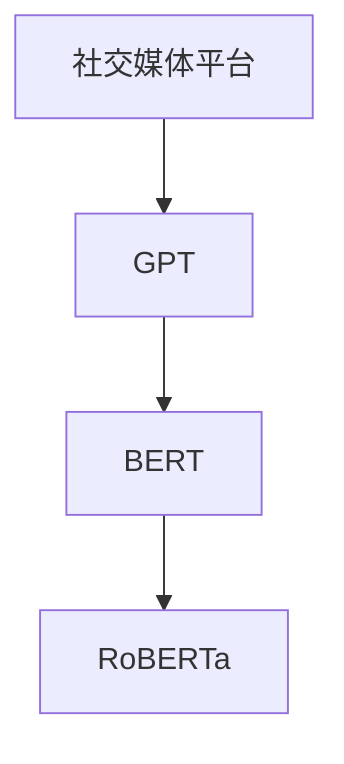

**具体实施**

1. **数据收集**：从社交媒体平台获取用户生成的文本数据。
2. **数据预处理**：去除停用词、标点符号，进行分词处理。
3. **模型选择**：选择适用于文本理解的模型，如BERT或RoBERTa。
4. **训练与优化**：使用收集到的数据对模型进行训练和优化。
5. **部署应用**：将训练好的模型部署到低代码平台，构建分析应用。

**案例结果**

- **热点话题提取**：通过情感分析，提取出社交媒体平台上的热门话题。
- **情感分析**：对用户评论进行情感分类，识别正面、负面或中立情绪。
- **用户行为预测**：分析用户行为，预测用户可能感兴趣的内容或活动。

#### 5.2 客户服务机器人

**核心概念与联系**

- **问题背景**：传统的客户服务机器人往往只能处理简单的查询，无法应对复杂的问题。
- **解决方案**：使用LLM构建智能客服机器人，能够更好地理解用户的问题，提供更准确的答案。

**概念属性特征对比表格**

| 模型       | GPT         | BERT         | RoBERTa     |
| ---------- | ----------- | ------------ | ----------- |
| 优势       | 文本生成    | 语言理解与生成 | 语言理解与生成 |
| 应用场景   | 文本生成    | 文本理解与生成 | 文本理解与生成 |
| 性能       | 文本生成强  | 语言理解强   | 语言理解强   |

**ER实体关系图架构的 Mermaid 流程图**

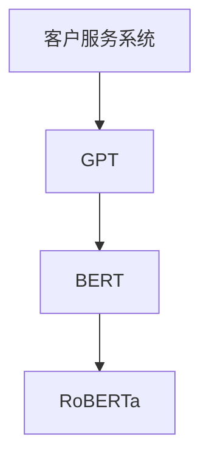

**具体实施**

1. **数据收集**：收集历史客服对话数据，包括用户问题和客服回答。
2. **数据预处理**：对对话数据进行分词、去除停用词等预处理操作。
3. **模型选择**：选择适用于语言理解的模型，如BERT或RoBERTa。
4. **训练与优化**：使用预处理后的对话数据对模型进行训练和优化。
5. **部署应用**：将训练好的模型集成到客户服务系统中，构建智能客服机器人。

**案例结果**

- **问题理解**：智能客服机器人能够更好地理解用户的问题，提供更准确的答案。
- **多轮对话**：智能客服机器人支持多轮对话，能够与用户进行更深入的交流。
- **自动分类**：对用户问题进行自动分类，提高客服系统的效率。

#### 5.3 内容创作

**核心概念与联系**

- **问题背景**：内容创作是一个耗时且需要创意的过程，如何快速生成高质量的内容成为一个挑战。
- **解决方案**：使用LLM进行内容创作，可以自动生成文章、报告、博客等。

**概念属性特征对比表格**

| 模型       | GPT         | BERT         | RoBERTa     |
| ---------- | ----------- | ------------ | ----------- |
| 优势       | 文本生成    | 语言理解与生成 | 语言理解与生成 |
| 应用场景   | 文本生成    | 文本理解与生成 | 文本理解与生成 |
| 性能       | 文本生成强  | 语言理解强   | 语言理解强   |

**ER实体关系图架构的 Mermaid 流程图**

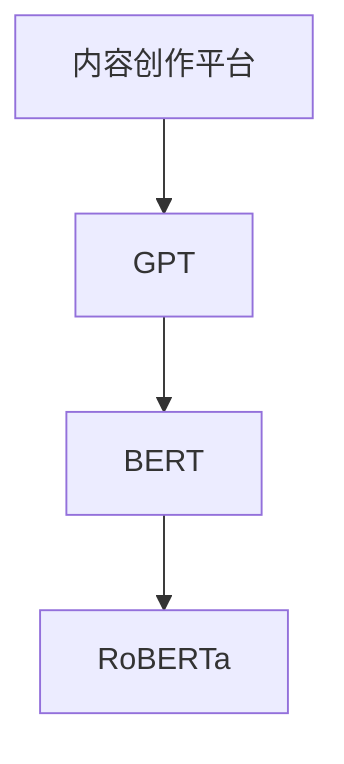

**具体实施**

1. **数据收集**：收集各种类型的内容数据，如新闻、文章、博客等。
2. **数据预处理**：对内容数据进行分词、去除停用词等预处理操作。
3. **模型选择**：选择适用于文本生成的模型，如GPT或RoBERTa。
4. **训练与优化**：使用预处理后的内容数据对模型进行训练和优化。
5. **部署应用**：将训练好的模型集成到内容创作平台，构建内容生成应用。

**案例结果**

- **文章生成**：自动生成文章，包括新闻、评论、博客等。
- **摘要生成**：自动生成文章摘要，提高内容阅读效率。
- **内容个性化**：根据用户兴趣和需求，自动生成个性化内容。

#### 小结

在本章节中，我们通过三个实际案例展示了如何使用低代码平台和LLM技术构建各种应用。这些案例不仅展示了LLM技术的强大能力，也证明了低代码平台在快速构建应用中的优势。在下一章节中，我们将深入探讨如何调试和优化LLM应用，以提高其性能和效果。

---

### 6. 调试与优化

#### 6.1 调试方法

**核心概念与联系**

- **错误分析**：分析模型输出与预期结果的差异，定位错误来源。
- **调试工具**：使用调试工具，如TensorBoard、PyTorch Debugger等，帮助开发者更有效地定位和修复问题。
- **代码审查**：对代码进行审查，确保代码的准确性和可维护性。

**概念属性特征对比表格**

| 方法       | 错误分析 | 调试工具 | 代码审查   |
| ---------- | -------- | -------- | ---------- |
| 特点       | 定位问题 | 辅助分析 | 提高代码质量 |
| 适用场景   | 随时可用 | 数据可视化 | 代码维护     |
| 难度       | 中至高   | 中       | 低         |
| 效果       | 提高模型准确性 | 提高开发效率 | 提高代码可读性 |

**ER实体关系图架构的 Mermaid 流程图**

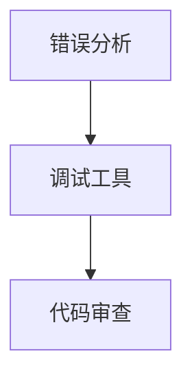

**具体实施**

1. **错误分析**：通过对比模型输出与预期结果，找出差异和错误。
2. **调试工具**：使用TensorBoard等工具，可视化模型训练过程，分析训练数据、损失函数、精度等指标。
3. **代码审查**：组织团队进行代码审查，检查代码逻辑、变量命名、代码注释等。

#### 6.2 优化策略

**核心概念与联系**

- **模型优化**：通过调整模型结构、超参数等方式，提高模型性能。
- **数据增强**：通过数据预处理、生成对抗网络（GAN）等技术，增加训练数据的多样性，提高模型泛化能力。
- **超参数调优**：通过网格搜索、随机搜索等方法，找到最优超参数组合，提高模型性能。

**概念属性特征对比表格**

| 策略       | 模型优化 | 数据增强 | 超参数调优   |
| ---------- | -------- | -------- | ------------ |
| 特点       | 调整模型结构 | 增加数据多样性 | 找到最优参数 |
| 适用场景   | 模型性能提升 | 数据不足 | 模型优化     |
| 难度       | 高       | 中       | 中至高       |
| 效果       | 提高模型性能 | 提高模型泛化能力 | 提高模型准确性 |

**ER实体关系图架构的 Mermaid 流程图**

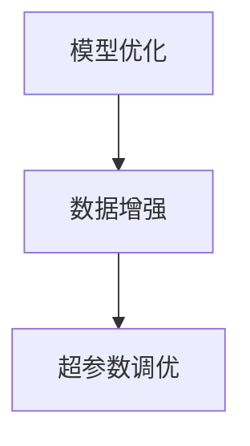

**具体实施**

1. **模型优化**：调整模型结构，如增加或减少层、调整网络深度等。
2. **数据增强**：使用图像翻转、旋转、缩放等技术，对训练数据进行增强。
3. **超参数调优**：使用网格搜索、随机搜索等方法，找到最优超参数组合。

#### 6.3 性能调优

**核心概念与联系**

- **模型压缩**：通过量化、剪枝等方法，减少模型参数数量，降低模型复杂度。
- **模型加速**：通过使用GPU、TPU等硬件加速模型训练和推理。
- **分布式训练**：通过分布式训练，提高模型训练速度和效果。

**概念属性特征对比表格**

| 方法       | 模型压缩 | 模型加速 | 分布式训练   |
| ---------- | -------- | -------- | ------------ |
| 特点       | 参数减少 | 加速推理 | 分布式计算   |
| 适用场景   | 小型设备 | 高性能设备 | 大规模数据集 |
| 难度       | 中至高   | 中       | 高         |
| 效果       | 减少模型存储空间 | 提高训练和推理速度 | 提高训练效率 |

**ER实体关系图架构的 Mermaid 流程图**

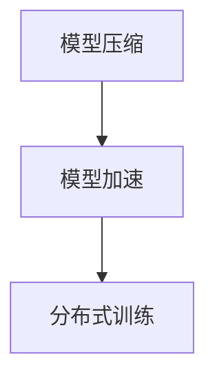

**具体实施**

1. **模型压缩**：使用量化技术，将浮点数参数转换为低精度参数，减少模型存储空间。
2. **模型加速**：使用GPU、TPU等硬件，加速模型训练和推理过程。
3. **分布式训练**：将模型和数据分布式存储在多台服务器上，利用多台服务器的计算能力，提高训练效率。

#### 小结

在本章节中，我们介绍了调试与优化LLM应用的方法，包括错误分析、调试工具、代码审查、模型优化、数据增强、超参数调优、模型压缩、模型加速和分布式训练等。通过这些方法，开发者可以有效地提高LLM应用的性能和效果，为实际应用提供更优质的解决方案。

---

### 7. 安全性与隐私保护

#### 7.1 安全性挑战

**核心概念与联系**

- **数据泄露**：模型训练和使用过程中，敏感数据可能被泄露。
- **模型篡改**：恶意攻击者可能尝试篡改模型参数，影响模型输出。
- **系统漏洞**：低代码平台可能存在安全漏洞，导致系统被攻击。

**概念属性特征对比表格**

| 挑战       | 数据泄露 | 模型篡改 | 系统漏洞   |
| ---------- | -------- | -------- | ---------- |
| 特点       | 敏感数据泄露 | 恶意篡改模型 | 平台漏洞 |
| 适用场景   | 模型训练、应用 | 模型应用   | 所有场景 |
| 难度       | 高       | 高       | 中至高     |
| 风险       | 数据丢失 | 模型失效 | 系统崩溃 |

**ER实体关系图架构的 Mermaid 流程图**

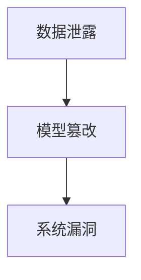

#### 7.2 隐私保护措施

**核心概念与联系**

- **数据加密**：对敏感数据进行加密处理，确保数据在传输和存储过程中不被窃取。
- **访问控制**：通过设置访问权限，确保只有授权用户可以访问敏感数据。
- **数据去标识化**：对数据中的个人标识信息进行去除，降低隐私泄露风险。

**概念属性特征对比表格**

| 措施       | 数据加密 | 访问控制 | 数据去标识化 |
| ---------- | -------- | -------- | ------------ |
| 特点       | 数据加密存储 | 权限管理 | 信息去个人化 |
| 适用场景   | 数据传输、存储 | 所有场景 | 数据分析     |
| 难度       | 中至高   | 中       | 中至高       |
| 效果       | 提高数据安全性 | 提高隐私保护 | 降低隐私风险 |

**ER实体关系图架构的 Mermaid 流程图**

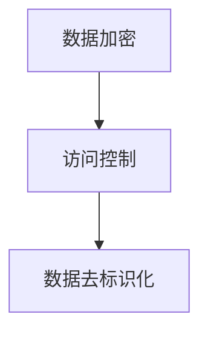

#### 7.3 合规与法规遵循

**核心概念与联系**

- **数据保护法规**：如GDPR、CCPA等，确保数据处理符合相关法规要求。
- **隐私政策**：明确告知用户数据处理方式和隐私政策，提高用户隐私意识。

**概念属性特征对比表格**

| 合规要素 | 数据保护法规 | 隐私政策   |
| -------- | ------------ | ---------- |
| 特点     | 法律法规约束 | 用户告知同意 |
| 适用场景 | 数据处理流程 | 应用所有场景 |
| 难度     | 高         | 中         |
| 效果     | 保证数据合法性 | 提高用户信任 |

**ER实体关系图架构的 Mermaid 流程图**

```mermaid
graph TB
    A[数据保护法规] --> B[隐私政策]
```

#### 小结

在本章节中，我们探讨了LLM应用在安全性与隐私保护方面面临的挑战，以及相应的防护措施。通过数据加密、访问控制、数据去标识化、合规与法规遵循等措施，可以有效地降低隐私泄露和系统安全风险。在未来的应用中，开发者应持续关注安全性与隐私保护问题，确保LLM应用的安全可靠。

---

### 8. 未来展望

#### 8.1 新技术趋势

**核心概念与联系**

- **量子计算**：量子计算的发展将大大加速LLM的训练速度和计算能力。
- **联邦学习**：通过联邦学习，可以在不共享数据的情况下，实现分布式训练，提高隐私保护能力。
- **多模态学习**：结合文本、图像、音频等多模态数据，使LLM能够更全面地理解和生成信息。

**概念属性特征对比表格**

| 技术趋势 | 量子计算 | 联邦学习 | 多模态学习 |
| -------- | -------- | -------- | ---------- |
| 特点     | 极速计算 | 分布式训练 | 信息整合   |
| 适用场景 | 高性能计算 | 隐私保护 | 多领域应用 |
| 难度     | 高       | 中至高   | 中至高     |
| 未来影响 | 提高计算能力 | 提高隐私保护 | 扩大应用范围 |

**ER实体关系图架构的 Mermaid 流程图**

```mermaid
graph TB
    A[量子计算] --> B[联邦学习]
    B --> C[多模态学习]
```

#### 8.2 应用前景

**核心概念与联系**

- **智能客服**：随着LLM技术的成熟，智能客服将变得更加智能化，能够更好地理解用户需求，提供个性化服务。
- **内容创作**：LLM将在内容创作领域发挥重要作用，自动生成文章、报告、视频脚本等。
- **医疗诊断**：利用LLM的医学知识库和推理能力，辅助医生进行诊断和治疗。

**概念属性特征对比表格**

| 应用领域 | 智能客服 | 内容创作 | 医疗诊断 |
| -------- | -------- | -------- | -------- |
| 特点     | 自动化交互 | 高效创作 | 医学知识应用 |
| 适用场景 | 客户服务 | 媒体创作 | 医疗辅助 |
| 难度     | 低       | 中       | 高       |
| 未来影响 | 提高服务效率 | 降低创作成本 | 提高诊断准确性 |

**ER实体关系图架构的 Mermaid 流程图**

```mermaid
graph TB
    A[智能客服] --> B[内容创作]
    B --> C[医疗诊断]
```

#### 8.3 未来展望

**核心概念与联系**

- **智能化发展**：随着AI技术的不断进步，LLM应用将变得更加智能化，能够处理更加复杂的任务。
- **跨领域融合**：LLM将与其他AI技术（如计算机视觉、语音识别）深度融合，推动多领域应用的发展。
- **社会影响**：LLM技术的发展将深刻改变社会生产、生活方式，提高效率、降低成本，为人类社会带来更多便利。

**概念属性特征对比表格**

| 展望要素 | 智能化发展 | 跨领域融合 | 社会影响 |
| -------- | ----------- | ---------- | -------- |
| 特点     | 自动化程度高 | 技术融合   | 改变生活方式 |
| 适用场景 | 各领域自动化 | 跨学科应用 | 社会生产与生活 |
| 难度     | 高         | 中至高   | 低至高   |
| 影响力   | 全面       | 深度融合   | 广泛影响 |

**ER实体关系图架构的 Mermaid 流程图**

```mermaid
graph TB
    A[智能化发展] --> B[跨领域融合]
    B --> C[社会影响]
```

#### 小结

在本章节中，我们探讨了LLM技术的新趋势、应用前景以及未来展望。随着量子计算、联邦学习和多模态学习等新技术的不断发展，LLM应用将变得更加智能化、高效化，并广泛融入社会生产与生活。开发者应密切关注这些新技术的发展，积极探索LLM在各个领域的应用潜力，为未来社会的发展贡献智慧。

---

### 作者信息

**作者：** AI天才研究院/AI Genius Institute & 禅与计算机程序设计艺术 /Zen And The Art of Computer Programming

AI天才研究院致力于推动人工智能技术的发展与应用，为全球开发者提供前沿技术研究和创新解决方案。作者以其深厚的专业知识和丰富的研究经验，为读者带来了这篇关于快速构建LLM应用的低代码平台的技术博客文章。希望本文能够为广大开发者提供有益的参考和启示。如需进一步了解相关技术和研究，请关注AI天才研究院的官方网站和最新动态。感谢您的阅读！

