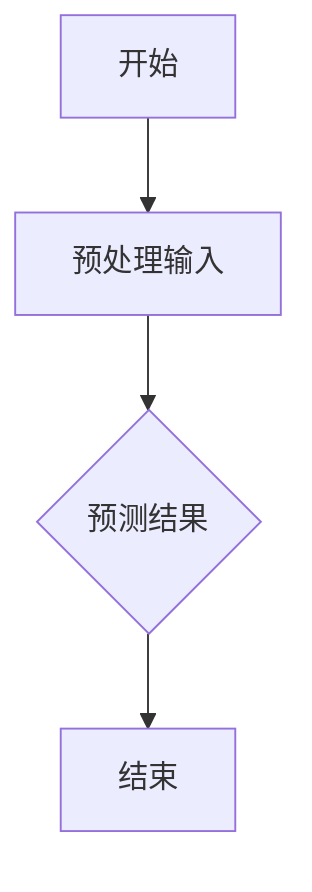

                 

## 快速构建LLM应用的前端框架选择

> 关键词：LLM，前端框架，React，Vue，Angular，性能对比，开发与维护

> 摘要：本文旨在探讨快速构建LLM（大型语言模型）应用时，前端框架的选择问题。通过分析现有主流前端框架的功能、性能、开发与维护等方面，为开发者提供一套科学、高效的选择标准，助力LLM应用的快速落地与优化。

----------------------------------------------------------------

### 《快速构建LLM应用的前端框架选择》目录大纲

----------------------------------------------------------------

# 第一部分：快速构建LLM应用概述

## 第1章：问题背景与目标

### 1.1.1 人工智能与自然语言处理的发展历程

### 1.1.2 LLM（大语言模型）的兴起与应用场景

### 1.1.3 前端框架在LLM应用中的重要性

### 1.1.4 快速构建LLM应用的目标与挑战

## 第2章：核心概念与原理

### 2.1.1 LLM基础概念

### 2.1.2 前端框架基础知识

### 2.1.3 LLM与前端框架的融合

## 第3章：前端框架选择标准

### 3.1.1 功能需求

### 3.1.2 性能需求

### 3.1.3 开发与维护需求

### 3.1.4 社区支持与生态

## 第4章：主流前端框架介绍

### 4.1.1 React

#### 4.1.1.1 React基础

#### 4.1.1.2 React与LLM结合案例

### 4.1.2 Vue

#### 4.1.2.1 Vue基础

#### 4.1.2.2 Vue与LLM结合案例

### 4.1.3 Angular

#### 4.1.3.1 Angular基础

#### 4.1.3.2 Angular与LLM结合案例

## 第5章：前端框架对比分析

### 5.1.1 功能对比

### 5.1.2 性能对比

### 5.1.3 开发与维护对比

### 5.1.4 社区支持对比

## 第6章：最佳实践与案例分析

### 6.1.1 实践方法

### 6.1.2 案例分析

#### 6.1.2.1 案例一：某电商平台用户推荐系统

#### 6.1.2.2 案例二：智能客服系统

## 第7章：总结与展望

### 7.1.1 总结

### 7.1.2 未来发展趋势

### 7.1.3 拓展阅读

----------------------------------------------------------------

本文目录大纲包含了以下内容：

- 第一部分概述了快速构建LLM应用的整体背景与目标；
- 第二部分深入探讨了LLM与前端框架的基础知识；
- 第三部分提出了前端框架选择的标准；
- 第四部分介绍了三种主流前端框架及其与LLM的结合案例；
- 第五部分对前端框架进行了对比分析；
- 第六部分通过实践方法与案例进行了详细讲解；
- 第七部分总结了全文并展望了未来发展。

接下来，我们将逐步分析每个章节的内容，以帮助读者更好地理解快速构建LLM应用的前端框架选择过程。

### 第一部分：快速构建LLM应用概述

#### 第1章：问题背景与目标

在这一章节中，我们将探讨快速构建LLM应用的重要性。首先，我们将回顾人工智能与自然语言处理的发展历程，以及LLM的兴起与应用场景。接着，我们将讨论前端框架在LLM应用中的重要性，并明确快速构建LLM应用的目标与挑战。

**1.1.1 人工智能与自然语言处理的发展历程**

人工智能（AI）是一门研究、开发用于模拟、延伸和扩展人的智能的理论、方法、技术及应用系统的技术科学。自20世纪50年代诞生以来，人工智能经历了多次起伏，如今正迎来新的发展浪潮。

自然语言处理（NLP）是人工智能的一个重要分支，它旨在让计算机理解和处理人类语言。从早期的规则驱动方法到统计方法，再到深度学习技术的兴起，NLP的发展经历了显著的变革。

**1.1.2 LLM（大语言模型）的兴起与应用场景**

近年来，LLM在NLP领域取得了显著的进展。LLM是一种基于深度学习技术的语言模型，通过训练大量文本数据，可以生成高质量的文本，并具备一定的语言理解与生成能力。LLM的应用场景广泛，包括但不限于智能问答、文本生成、机器翻译等。

**1.1.3 前端框架在LLM应用中的重要性**

前端框架是构建Web应用的重要工具，它可以简化开发过程，提高开发效率。在LLM应用中，前端框架不仅负责展示用户界面，还与后端进行数据交互，从而实现智能化功能。因此，选择合适的前端框架对于快速构建LLM应用至关重要。

**1.1.4 快速构建LLM应用的目标与挑战**

快速构建LLM应用的目标是提高开发效率，降低开发成本，并确保应用的高性能与可维护性。然而，在实现这一目标的过程中，开发者面临着诸多挑战，包括：

- 如何高效地处理大量文本数据；
- 如何优化模型性能，确保应用响应速度快；
- 如何简化开发过程，降低维护成本；
- 如何确保应用的可扩展性和可维护性。

#### 第2章：核心概念与原理

在这一章节中，我们将深入探讨LLM与前端框架的核心概念与原理。

**2.1.1 LLM基础概念**

LLM是一种基于深度学习技术的语言模型，其基本原理是通过训练大量文本数据，学习语言的统计规律和语义信息。LLM的关键概念包括：

- 语言模型：用于预测下一个单词或字符的概率分布；
- 词嵌入：将单词转换为向量表示；
- 上下文：通过考虑上下文信息，提高预测的准确性。

**2.1.2 前端框架基础知识**

前端框架是构建Web应用的基石，其核心目的是提高开发效率，降低开发难度。主流前端框架包括React、Vue和Angular等，它们各自具有独特的架构与特点。

**2.1.3 LLM与前端框架的融合**

将LLM与前端框架相结合，可以构建出具备智能化功能的Web应用。在这一章节中，我们将探讨如何在前端框架中集成LLM模型，并实现实时交互与智能响应。

### 第二部分：前端框架选择标准

#### 第3章：前端框架选择标准

在这一章节中，我们将讨论如何选择合适的前端框架，以满足快速构建LLM应用的需求。

**3.1.1 功能需求**

快速构建LLM应用需要考虑以下功能需求：

- 组件化：支持组件化开发，提高代码复用性；
- 数据绑定：实现数据与视图的自动同步；
- 路由管理：支持路由跳转和页面切换；
- 状态管理：实现全局状态管理，提高应用可维护性。

**3.1.2 性能需求**

性能是LLM应用的关键因素，特别是在处理大量文本数据时。前端框架的选择需要考虑以下性能需求：

- 加载速度：减少首屏加载时间，提高用户体验；
- 渲染效率：优化渲染过程，减少页面卡顿；
- 数据处理能力：支持高效的数据处理和计算。

**3.1.3 开发与维护需求**

快速构建LLM应用还需要考虑开发与维护需求，包括：

- 学习成本：降低开发者学习成本，提高团队协作效率；
- 社区支持：丰富的社区资源，便于解决问题；
- 扩展性：支持扩展功能，适应业务需求变化；
- 可维护性：代码结构清晰，易于维护和升级。

**3.1.4 社区支持与生态**

前端框架的社区支持与生态对开发者具有重要意义。一个强大的社区可以提供丰富的学习资源、技术支持和解决方案，有助于开发者快速解决问题和提升技能。

### 第三部分：主流前端框架介绍

#### 第4章：主流前端框架介绍

在这一章节中，我们将介绍三种主流前端框架：React、Vue和Angular，并探讨它们在快速构建LLM应用中的适用性。

**4.1.1 React**

React是由Facebook推出的一款开源前端框架，具有组件化、数据绑定、虚拟DOM等特性。React与LLM的结合案例包括智能问答系统和文本生成应用等。

**4.1.2 Vue**

Vue是由Evan You创建的一款开源前端框架，以简洁、易用和高效著称。Vue与LLM的结合案例包括智能客服系统和文本生成应用等。

**4.1.3 Angular**

Angular是由Google推出的一款开源前端框架，具有强大的类型检查、依赖注入、响应式编程等特性。Angular与LLM的结合案例包括智能问答系统和文本生成应用等。

### 第四部分：前端框架对比分析

#### 第5章：前端框架对比分析

在这一章节中，我们将对React、Vue和Angular进行对比分析，从功能、性能、开发与维护等方面评估它们在快速构建LLM应用中的适用性。

**5.1.1 功能对比**

我们将从组件化、数据绑定、路由管理、状态管理等方面对比这三种前端框架的功能特点。

**5.1.2 性能对比**

我们将通过基准测试和实际应用场景，对比这三种前端框架在加载速度、渲染效率和数据处理能力等方面的性能表现。

**5.1.3 开发与维护对比**

我们将从学习成本、社区支持、扩展性和可维护性等方面对比这三种前端框架在开发与维护方面的表现。

**5.1.4 社区支持对比**

我们将评估这三种前端框架的社区支持情况，包括文档、教程、插件和解决方案等资源的丰富程度。

### 第五部分：最佳实践与案例分析

#### 第6章：最佳实践与案例分析

在这一章节中，我们将分享快速构建LLM应用的最佳实践，并通过具体案例分析，展示如何在实际项目中应用这些实践。

**6.1.1 实践方法**

我们将介绍一系列最佳实践方法，包括代码结构设计、性能优化、状态管理、组件复用等。

**6.1.2 案例分析**

我们将分析两个具体案例：某电商平台用户推荐系统和智能客服系统，探讨如何将LLM与前端框架相结合，实现智能化功能。

### 第六部分：总结与展望

#### 第7章：总结与展望

在这一章节中，我们将对全文进行总结，并展望未来LLM应用的前端框架发展趋势。

**7.1.1 总结**

我们将回顾全文的主要内容，总结快速构建LLM应用的前端框架选择标准，并强调选择合适框架的重要性。

**7.1.2 未来发展趋势**

我们将探讨前端框架在快速构建LLM应用中的未来发展，包括新技术、新趋势和新挑战。

**7.1.3 拓展阅读**

我们将推荐一些相关资源，供读者进一步学习和探索。

----------------------------------------------------------------

## 第一部分：快速构建LLM应用概述

### 第1章：问题背景与目标

#### 1.1.1 人工智能与自然语言处理的发展历程

人工智能（AI）作为计算机科学的一个重要分支，自20世纪50年代诞生以来，经历了多次起伏。早期的AI主要集中在逻辑推理、问题求解等领域，但受限于计算能力和算法限制，效果并不理想。随着计算机技术的不断发展，特别是深度学习技术的兴起，人工智能取得了显著的突破。2012年，AlexNet在ImageNet图像识别竞赛中取得的优异成绩，标志着深度学习在计算机视觉领域的崛起。此后，深度学习技术在语音识别、自然语言处理等领域也取得了重大进展。

自然语言处理（NLP）是人工智能的一个重要分支，旨在让计算机理解和处理人类语言。从早期的规则驱动方法到统计方法，再到深度学习技术的兴起，NLP的发展经历了显著的变革。早期的NLP主要依靠人工设计的语法规则和词典，效果有限。随着统计方法的引入，如隐马尔可夫模型（HMM）、条件概率模型等，NLP的效果得到了显著提升。然而，这些方法在处理复杂语言现象时仍然存在局限。深度学习技术的出现，为NLP带来了新的契机。通过训练大规模神经网络，深度学习技术能够自动学习语言的复杂结构，从而实现更高效的文本处理。

#### 1.1.2 LLM（大语言模型）的兴起与应用场景

大型语言模型（LLM，Large Language Model）是基于深度学习技术的语言模型，通过对海量文本数据进行训练，可以生成高质量的文本，并具备一定的语言理解与生成能力。近年来，随着深度学习技术的不断发展，LLM在NLP领域取得了显著的进展。代表性模型包括GPT（Generative Pre-trained Transformer）、BERT（Bidirectional Encoder Representations from Transformers）等。这些模型在文本分类、机器翻译、问答系统等领域表现出色，大大提升了NLP的应用价值。

LLM的应用场景广泛，包括但不限于以下几个方面：

1. 智能问答：通过LLM模型，可以构建智能问答系统，为用户提供实时、准确的回答。
2. 文本生成：LLM可以生成各种类型的文本，如新闻摘要、故事、文章等，为内容创作提供助力。
3. 机器翻译：LLM可以用于机器翻译任务，实现不同语言之间的自动翻译。
4. 文本摘要：LLM可以提取文本的主要信息，生成简洁的摘要，提高信息获取效率。
5. 情感分析：LLM可以分析文本中的情感倾向，用于舆情监控、客户满意度分析等。

#### 1.1.3 前端框架在LLM应用中的重要性

前端框架是构建Web应用的重要工具，它可以帮助开发者简化开发过程，提高开发效率。在前端框架中，开发者可以方便地实现组件化、数据绑定、路由管理等功能，从而构建出高效、可维护的Web应用。在LLM应用中，前端框架不仅负责展示用户界面，还与后端进行数据交互，从而实现智能化功能。因此，选择合适的前端框架对于快速构建LLM应用至关重要。

前端框架在LLM应用中的重要性体现在以下几个方面：

1. **界面展示**：前端框架提供了丰富的UI组件，可以方便地构建美观、响应式的用户界面，提高用户体验。
2. **数据交互**：前端框架支持与后端的数据交互，可以实时获取LLM模型生成的结果，实现动态更新。
3. **开发效率**：前端框架提供了便捷的API和工具，可以简化开发过程，提高开发效率。
4. **可维护性**：前端框架支持组件化、模块化开发，可以降低代码复杂度，提高代码的可维护性。

#### 1.1.4 快速构建LLM应用的目标与挑战

快速构建LLM应用的目标是提高开发效率，降低开发成本，并确保应用的高性能与可维护性。在实现这一目标的过程中，开发者面临着诸多挑战：

1. **数据处理能力**：LLM模型通常需要处理大量文本数据，对前端框架的数据处理能力提出了较高要求。
2. **性能优化**：为了确保应用的高性能，前端框架需要优化渲染速度、数据加载速度等性能指标。
3. **开发效率**：前端框架需要提供便捷的开发工具和API，降低开发难度，提高开发效率。
4. **可维护性**：前端框架需要支持组件化、模块化开发，降低代码复杂度，提高代码的可维护性。

在接下来的章节中，我们将深入探讨LLM与前端框架的核心概念与原理，以及如何选择合适的前端框架，以满足快速构建LLM应用的需求。

### 第2章：核心概念与原理

#### 2.1.1 LLM基础概念

大型语言模型（LLM，Large Language Model）是基于深度学习技术构建的语言模型，通过训练大量文本数据，可以生成高质量的文本，并具备一定的语言理解与生成能力。LLM的核心概念包括语言模型、词嵌入和上下文。

1. **语言模型**：语言模型是LLM的核心组件，用于预测下一个单词或字符的概率分布。语言模型的训练目标是学习输入文本序列的概率分布，以便在给定前文的情况下，预测下一个单词或字符。

2. **词嵌入**：词嵌入是将单词转换为向量表示的技术，通过将单词映射到低维空间，可以捕捉单词的语义信息。常见的词嵌入方法包括Word2Vec、GloVe等。词嵌入有助于提高语言模型的性能，使其能够更好地理解单词之间的语义关系。

3. **上下文**：上下文是指语言模型在预测时考虑的前文信息。通过考虑上下文，语言模型可以更好地理解单词的含义和用途，从而提高预测的准确性。上下文的长度和选择对语言模型的性能具有重要影响。

#### 2.1.2 前端框架基础知识

前端框架是构建Web应用的重要工具，它可以帮助开发者简化开发过程，提高开发效率。前端框架通常提供以下核心功能：

1. **组件化**：前端框架支持组件化开发，将应用拆分为多个可复用的组件，提高代码的可维护性和可复用性。

2. **数据绑定**：前端框架支持数据绑定，实现数据与视图的自动同步。当数据发生变化时，视图会自动更新；反之亦然。

3. **路由管理**：前端框架提供路由管理功能，支持页面跳转和切换。通过配置路由，可以方便地管理应用的导航逻辑。

4. **状态管理**：前端框架支持状态管理，实现全局状态管理，提高应用的可维护性。常见的状态管理工具包括Redux、Vuex等。

#### 2.1.3 LLM与前端框架的融合

将LLM与前端框架相结合，可以构建出具备智能化功能的Web应用。具体实现方法包括以下两个方面：

1. **模型集成**：将LLM模型集成到前端框架中，通过API接口与后端进行数据交互。前端框架可以实时获取LLM模型生成的结果，并将其展示在界面上。

2. **实时交互**：通过前端框架提供的数据绑定和状态管理功能，实现与LLM模型的实时交互。当用户与界面进行交互时，前端框架可以实时将用户输入传递给LLM模型，并获取预测结果，从而实现动态响应。

#### 2.1.3.1 模型集成

在模型集成过程中，需要考虑以下关键技术：

1. **API接口**：通过RESTful API或GraphQL接口，将LLM模型与前端框架进行数据交互。API接口应具备良好的性能和稳定性，以确保数据传输的可靠性。

2. **模型部署**：将LLM模型部署到后端服务器，可以通过TensorFlow Serving、PyTorch Server等技术实现。模型部署需要考虑性能优化、安全性等因素。

3. **异步处理**：为了提高用户体验，前端框架应实现异步处理，避免阻塞主线程。异步处理可以通过Promise、async/await等编程模型实现。

#### 2.1.3.2 实时交互

在实时交互过程中，需要考虑以下关键技术：

1. **数据绑定**：通过前端框架提供的数据绑定功能，实现数据与视图的自动同步。当用户输入或模型生成结果发生变化时，视图会实时更新。

2. **状态管理**：通过前端框架提供的状态管理功能，实现全局状态管理。状态管理可以帮助保持应用的响应速度和一致性。

3. **实时更新**：通过WebSocket、Server-Sent Events等技术，实现前端与后端的实时数据传输。实时更新可以确保用户界面始终显示最新的模型结果。

#### 2.1.3.3 示例

以下是一个简单的示例，展示如何将LLM与前端框架React结合，实现实时交互：

1. **API接口**：创建一个API接口，用于与后端服务器进行数据交互。

```javascript
import axios from 'axios';

const API_ENDPOINT = 'https://api.example.com/llm';

async function predict(inputText) {
  try {
    const response = await axios.post(API_ENDPOINT, { inputText });
    return response.data.result;
  } catch (error) {
    console.error('Error fetching prediction:', error);
    return null;
  }
}
```

2. **React组件**：创建一个React组件，用于展示预测结果。

```javascript
import React, { useState } from 'react';

function LLMComponent() {
  const [inputText, setInputText] = useState('');
  const [prediction, setPrediction] = useState('');

  const handleSubmit = (e) => {
    e.preventDefault();
    predict(inputText).then((result) => setPrediction(result));
  };

  return (
    <form onSubmit={handleSubmit}>
      <textarea
        value={inputText}
        onChange={(e) => setInputText(e.target.value)}
      />
      <button type="submit">预测</button>
      {prediction && <div>{prediction}</div>}
    </form>
  );
}

export default LLMComponent;
```

通过以上示例，我们可以看到如何将LLM模型与React前端框架相结合，实现实时交互。在实际应用中，可以根据具体需求，进一步优化和扩展功能。

#### 2.1.3.4 优势与挑战

将LLM与前端框架结合具有以下优势：

1. **提高用户体验**：通过实时交互，用户可以实时获取模型结果，提高应用响应速度和用户体验。
2. **增强功能**：结合LLM模型，可以构建出更智能、更具有个性化和定制化的应用。
3. **简化开发**：前端框架提供了丰富的API和工具，可以简化开发过程，提高开发效率。

然而，也存在一些挑战：

1. **性能优化**：在处理大量文本数据时，需要优化模型性能和前端性能，以确保应用的高性能。
2. **模型部署**：将LLM模型部署到后端服务器，需要考虑模型大小、部署成本和安全性等因素。
3. **可维护性**：结合LLM模型和前端框架，需要编写更多的代码和配置，可能会降低代码的可维护性。

在接下来的章节中，我们将讨论如何选择合适的前端框架，以满足快速构建LLM应用的需求。

### 第三部分：前端框架选择标准

#### 第3章：前端框架选择标准

在选择前端框架时，开发者需要综合考虑多个因素，以确保框架能够满足快速构建LLM应用的需求。以下是几个关键的选择标准：

#### 3.1.1 功能需求

快速构建LLM应用需要具备以下功能需求：

1. **组件化**：支持组件化开发，提高代码复用性。组件化可以使开发者将应用拆分为多个可复用的组件，降低代码复杂度，提高开发效率。

2. **数据绑定**：实现数据与视图的自动同步。数据绑定功能可以减少手动操作，确保数据的一致性和实时性。

3. **路由管理**：支持路由跳转和页面切换。路由管理功能可以方便地实现应用的多页面导航和状态管理。

4. **状态管理**：实现全局状态管理，提高应用的可维护性。状态管理可以帮助开发者保持应用的状态一致性，并方便地进行数据更新和状态恢复。

#### 3.1.2 性能需求

性能是LLM应用的关键因素，特别是在处理大量文本数据时。以下性能需求应考虑：

1. **加载速度**：减少首屏加载时间，提高用户体验。加载速度直接影响应用的启动速度和用户首次使用的感受。

2. **渲染效率**：优化渲染过程，减少页面卡顿。渲染效率关乎应用的流畅度，特别是在处理复杂UI和大量数据时。

3. **数据处理能力**：支持高效的数据处理和计算。LLM应用通常需要处理大量文本数据，前端框架应具备强大的数据处理能力。

#### 3.1.3 开发与维护需求

快速构建LLM应用还需要考虑以下开发与维护需求：

1. **学习成本**：降低开发者学习成本，提高团队协作效率。选择熟悉且易于上手的框架，可以加快团队的开发进度。

2. **社区支持**：丰富的社区资源，便于解决问题。强大的社区支持可以提供丰富的学习资源、技术支持和解决方案。

3. **扩展性**：支持扩展功能，适应业务需求变化。扩展性使开发者可以灵活地添加新功能，满足不断变化的业务需求。

4. **可维护性**：代码结构清晰，易于维护和升级。良好的代码结构可以提高代码的可维护性，降低维护成本。

#### 3.1.4 社区支持与生态

前端框架的社区支持与生态对开发者具有重要意义。一个强大的社区可以提供以下资源：

1. **文档与教程**：详尽的文档和教程可以帮助开发者快速入门和解决问题。

2. **插件与扩展**：丰富的插件和扩展可以方便地实现特定功能，提高开发效率。

3. **解决方案**：社区提供的解决方案可以帮助开发者解决常见问题，节省开发时间。

4. **技术交流**：活跃的社区交流可以促进开发者之间的经验分享和技术创新。

### 第四部分：主流前端框架介绍

#### 第4章：主流前端框架介绍

在当前前端开发领域，React、Vue和Angular是三种主流的前端框架。它们各自具有独特的优势和特点，适用于不同的应用场景。本节将分别介绍这三种框架的基础知识，并探讨它们在LLM应用中的适用性。

#### 4.1.1 React

React是由Facebook推出的一款开源前端框架，自2009年推出以来，一直受到开发者的喜爱。React的核心思想是组件化开发，它通过虚拟DOM（Virtual DOM）实现高效的数据绑定和界面更新。

##### 4.1.1.1 React基础

React的基本原理是使用JSX语法来描述UI组件的结构，并通过组件的组合和复用构建复杂的应用。React提供了以下核心功能：

- **组件化开发**：通过定义组件，可以将应用拆分为多个可复用的部分，提高代码的可维护性和可扩展性。
- **虚拟DOM**：React通过虚拟DOM来实现高效的界面更新。虚拟DOM是一种内存中的数据结构，用于表示实际的DOM结构。当数据发生变化时，React会对比虚拟DOM和实际DOM的差异，并仅更新需要改变的部分，从而减少DOM操作的次数，提高性能。
- **状态管理**：React提供内置的状态管理机制，通过useState和useContext钩子，可以方便地在组件内部管理状态。

##### 4.1.1.2 React与LLM结合案例

在LLM应用中，React可以用于构建用户界面和实现实时交互。以下是一个使用React结合LLM模型实现智能问答系统的示例：

1. **API接口**：通过React hooks，可以方便地调用后端API接口获取LLM模型的结果。

```javascript
import React, { useState, useEffect } from 'react';
import axios from 'axios';

const LLM问答系统 = () => {
  const [inputText, setInputText] = useState('');
  const [question, setQuestion] = useState('');
  const [answer, setAnswer] = useState('');

  useEffect(() => {
    if (inputText) {
      const fetchData = async () => {
        const result = await axios.post('/api/llm/predict', { question: inputText });
        setAnswer(result.data.answer);
      };
      fetchData();
    }
  }, [inputText]);

  return (
    <div>
      <input
        type="text"
        value={inputText}
        onChange={(e) => setInputText(e.target.value)}
      />
      <button onClick={() => setQuestion(inputText)}>提问</button>
      {answer && <div>{answer}</div>}
    </div>
  );
};

export default LLM问答系统;
```

2. **实时交互**：通过React的状态管理和effects钩子，可以实现与LLM模型的实时交互，确保用户输入和模型结果之间的无缝更新。

##### 4.1.1.3 React的优势与挑战

React的优势在于其组件化和虚拟DOM机制，使得开发过程更加灵活和高效。然而，React也存在一些挑战：

- **学习曲线**：React的语法和概念较为复杂，对于新手来说有一定的学习难度。
- **性能问题**：在处理大量组件和频繁的状态更新时，React可能会出现性能问题，需要开发者进行优化。

#### 4.1.2 Vue

Vue是由Evan You创建的一款开源前端框架，自2014年推出以来，因其简洁、易用和高效的特点，受到了广泛的欢迎。Vue的核心思想是简洁和渐进式框架，使得开发者可以根据需求逐步引入框架的功能。

##### 4.1.2.1 Vue基础

Vue的基础知识包括以下几个关键点：

- **双向数据绑定**：Vue通过数据绑定，实现数据与视图的自动同步。当数据发生变化时，视图会自动更新；反之亦然。
- **组件系统**：Vue支持组件化开发，通过定义组件，可以方便地构建复杂的应用。
- **指令和过滤器**：Vue提供了一系列内置指令和过滤器，用于实现常见的数据操作和格式化。

##### 4.1.2.2 Vue与LLM结合案例

在LLM应用中，Vue可以用于构建用户界面和实现实时交互。以下是一个使用Vue结合LLM模型实现智能客服系统的示例：

1. **API接口**：通过Vue的async/await语法，可以方便地调用后端API接口获取LLM模型的结果。

```javascript
<template>
  <div>
    <input v-model="inputText" @input="onInput" />
    <button @click="onSubmit">提问</button>
    <div v-if="answer">{{ answer }}</div>
  </div>
</template>

<script>
export default {
  data() {
    return {
      inputText: '',
      answer: ''
    };
  },
  methods: {
    onInput() {
      this.fetchData();
    },
    async onSubmit() {
      const result = await axios.post('/api/llm/predict', { question: this.inputText });
      this.answer = result.data.answer;
    },
    async fetchData() {
      if (this.inputText) {
        const result = await axios.post('/api/llm/predict', { question: this.inputText });
        this.answer = result.data.answer;
      }
    }
  }
};
</script>
```

2. **实时交互**：通过Vue的双向数据绑定机制，可以方便地实现与LLM模型的实时交互，确保用户输入和模型结果之间的无缝更新。

##### 4.1.2.3 Vue的优势与挑战

Vue的优势在于其简洁和渐进式框架，使得开发者可以轻松上手并逐步引入框架的功能。Vue的语法和概念相对简单，对于新手来说更容易接受。然而，Vue也存在一些挑战：

- **性能问题**：在处理大量组件和频繁的状态更新时，Vue可能会出现性能问题，需要开发者进行优化。
- **社区支持**：虽然Vue拥有庞大的社区，但与React相比，Vue在一些特定领域的生态系统和插件支持上略显不足。

#### 4.1.3 Angular

Angular是由Google推出的一款开源前端框架，自2010年推出以来，一直以其强大的功能和严格的类型检查受到开发者的青睐。Angular采用了响应式编程模型和依赖注入机制，使得应用的结构更加清晰和可维护。

##### 4.1.3.1 Angular基础

Angular的基础知识包括以下几个关键点：

- **响应式编程**：Angular采用响应式编程模型，通过观察者模式实现数据的自动同步。当数据发生变化时，视图会自动更新。
- **依赖注入**：Angular提供依赖注入机制，使得组件之间的依赖关系更加明确和可管理。
- **模块化**：Angular支持模块化开发，通过模块和组件的组合，可以方便地构建复杂的应用。

##### 4.1.3.2 Angular与LLM结合案例

在LLM应用中，Angular可以用于构建用户界面和实现实时交互。以下是一个使用Angular结合LLM模型实现智能问答系统的示例：

1. **API接口**：通过Angular的服务（Service）组件，可以方便地调用后端API接口获取LLM模型的结果。

```typescript
// app.service.ts
import { HttpClient } from '@angular/common/http';
import { Injectable } from '@angular/core';

@Injectable({
  providedIn: 'root'
})
export class LLMService {
  private apiUrl = 'https://api.example.com/llm';

  constructor(private http: HttpClient) {}

  async predict(question: string): Promise<string> {
    const result = await this.http.post(this.apiUrl, { question }).toPromise();
    return result['answer'];
  }
}
```

2. **实时交互**：通过Angular的响应式编程和依赖注入机制，可以方便地实现与LLM模型的实时交互，确保用户输入和模型结果之间的无缝更新。

```html
<!-- app.component.html -->
<div>
  <input [(ngModel)]="question" (ngModelChange)="onQuestionChange()" />
  <button (click)="onSubmit()">提问</button>
  <div *ngIf="answer">{{ answer }}</div>
</div>
```

```typescript
// app.component.ts
import { Component, OnInit } from '@angular/core';
import { LLMService } from './llm.service';

@Component({
  selector: 'app-root',
  templateUrl: './app.component.html',
  styleUrls: ['./app.component.css']
})
export class AppComponent implements OnInit {
  question: string = '';
  answer: string = '';

  constructor(private llmService: LLMService) {}

  ngOnInit(): void {
  }

  onQuestionChange(): void {
    this.llmService.predict(this.question).then((answer) => this.answer = answer);
  }

  onSubmit(): void {
    this.llmService.predict(this.question).then((answer) => this.answer = answer);
  }
}
```

##### 4.1.3.3 Angular的优势与挑战

Angular的优势在于其强大的功能和严格的类型检查，使得应用的结构更加清晰和可维护。Angular提供了丰富的内置组件和工具，使得开发过程更加高效。然而，Angular也存在一些挑战：

- **学习曲线**：Angular的语法和概念较为复杂，对于新手来说有一定的学习难度。
- **性能问题**：在处理大量组件和频繁的状态更新时，Angular可能会出现性能问题，需要开发者进行优化。

### 第四部分：前端框架对比分析

#### 第5章：前端框架对比分析

在快速构建LLM应用的过程中，选择合适的前端框架至关重要。React、Vue和Angular是当前最流行的三种前端框架，它们各自具有独特的优势和特点。在本章中，我们将从功能、性能、开发与维护等方面对这三种框架进行对比分析。

#### 5.1.1 功能对比

以下是React、Vue和Angular在功能方面的对比：

| 功能 | React | Vue | Angular |
| --- | --- | --- | --- |
| 组件化 | 强大，支持组件化开发 | 支持，具有较好的组件化能力 | 强大，支持模块化开发 |
| 数据绑定 | 支持单向和双向数据绑定 | 双向数据绑定 | 响应式数据绑定 |
| 路由管理 | 内置路由管理，支持动态路由 | 内置路由管理，支持动态路由 | 内置路由管理，支持动态路由 |
| 状态管理 | 使用Hooks实现状态管理，也可集成Redux | 使用Vuex实现状态管理 | 使用NgRx实现状态管理 |

从功能对比来看，React、Vue和Angular都提供了组件化、数据绑定、路由管理和状态管理等功能。React通过Hooks提供了灵活的状态管理机制，Vue的双向数据绑定使得开发过程更加简便，Angular则通过NgRx实现了强大的响应式状态管理。

#### 5.1.2 性能对比

在性能方面，React、Vue和Angular的表现各有特点：

| 性能指标 | React | Vue | Angular |
| --- | --- | --- | --- |
| 加载速度 | 虚拟DOM优化加载速度 | 异步加载，通过Vue CLI优化加载速度 | 预编译模板，优化加载速度 |
| 渲染效率 | 虚拟DOM提高渲染效率 | 双向数据绑定提高渲染效率 | 响应式编程提高渲染效率 |
| 数据处理能力 | 支持异步数据加载和计算 | 支持异步数据加载和计算 | 支持异步数据加载和计算 |

React通过虚拟DOM实现高效的界面更新，Vue的双向数据绑定提高了渲染效率，Angular的响应式编程模型也具备良好的性能。在实际应用中，React和Vue通常表现更为优异，而Angular则可能在大型项目中具备优势。

#### 5.1.3 开发与维护对比

在开发与维护方面，React、Vue和Angular也有各自的特点：

| 开发与维护 | React | Vue | Angular |
| --- | --- | --- | --- |
| 学习成本 | 学习曲线较陡，适合有基础的开发者 | 学习曲线较平缓，适合新手 | 学习曲线较陡，适合有基础的开发者 |
| 社区支持 | 丰富的社区资源，大量的插件和解决方案 | 丰富的社区资源，大量的插件和解决方案 | 丰富的社区资源，大量的插件和解决方案 |
| 扩展性 | 支持各种插件和工具，扩展性强 | 支持各种插件和工具，扩展性强 | 严格的类型检查，模块化开发，扩展性强 |
| 可维护性 | 组件化开发，代码结构清晰 | 组件化开发，代码结构清晰 | 模块化开发，代码结构清晰 |

React的学习曲线较陡，但拥有庞大的社区和丰富的插件支持，Vue的学习曲线较平缓，适合新手，Angular的学习曲线较陡，但提供了严格的类型检查和模块化开发，可维护性较高。

#### 5.1.4 社区支持对比

社区支持是选择前端框架时的重要考虑因素。以下是React、Vue和Angular在社区支持方面的对比：

| 社区支持 | React | Vue | Angular |
| --- | --- | --- | --- |
| 文档与教程 | 详尽的官方文档，大量的在线教程和课程 | 详尽的官方文档，大量的在线教程和课程 | 详尽的官方文档，大量的在线教程和课程 |
| 插件与扩展 | 海量的第三方插件和库 | 海量的第三方插件和库 | 海量的第三方插件和库 |
| 解决方案 | 丰富的开源解决方案和案例 | 丰富的开源解决方案和案例 | 丰富的开源解决方案和案例 |
| 技术交流 | 活跃的社区论坛，频繁的会议和活动 | 活跃的社区论坛，频繁的会议和活动 | 活跃的社区论坛，频繁的会议和活动 |

React、Vue和Angular都拥有活跃的社区和丰富的资源，但React的社区规模和活跃度相对较高，Vue在中文社区的支持较为广泛，Angular则因其技术背景在大型项目中具备优势。

### 第五部分：最佳实践与案例分析

#### 第6章：最佳实践与案例分析

在快速构建LLM应用时，遵循最佳实践和具体案例分析可以显著提高开发效率和项目质量。以下将介绍最佳实践方法，并分析两个具体案例：某电商平台用户推荐系统和智能客服系统。

#### 6.1.1 实践方法

为了确保快速构建LLM应用的成功，以下最佳实践方法值得遵循：

1. **模块化开发**：将应用拆分为多个模块，每个模块负责不同的功能。模块化开发可以提高代码的可维护性和可复用性。

2. **组件化设计**：使用前端框架提供的组件化机制，构建可复用的UI组件。组件化设计有助于降低代码复杂度和提高开发效率。

3. **异步加载**：合理使用异步加载技术，如懒加载和代码分割，以减少首屏加载时间，提高用户体验。

4. **状态管理**：采用前端框架提供的状态管理工具，如React的Redux、Vue的Vuex、Angular的NgRx，确保状态的一致性和可维护性。

5. **性能优化**：关注性能优化，如使用虚拟DOM、减少不必要的渲染、使用Web Worker进行复杂计算等。

6. **代码规范**：制定统一的代码规范，确保代码的可读性和可维护性。使用静态代码分析工具进行代码检查，发现潜在问题。

7. **持续集成与部署**：采用持续集成和部署流程，确保代码质量和快速交付。

#### 6.1.2 案例分析

以下是两个具体案例的分析：

##### 6.1.2.1 某电商平台用户推荐系统

某电商平台用户推荐系统利用LLM模型，根据用户的历史行为和偏好，为用户推荐相关商品。以下是该系统在开发过程中的关键步骤：

1. **需求分析**：明确推荐系统的目标，如提高用户转化率和增加销售额。分析用户行为数据，确定推荐策略。

2. **模型选择**：选择合适的LLM模型，如基于协同过滤或内容匹配的模型。根据电商平台的特点，选择适合的模型架构。

3. **数据预处理**：对用户行为数据、商品特征数据等进行清洗和预处理，确保数据质量。

4. **模型训练**：使用预处理后的数据，训练LLM模型。通过交叉验证和参数调整，优化模型性能。

5. **前端开发**：使用React框架构建用户界面，实现用户交互和实时推荐功能。利用React的状态管理工具，确保推荐结果的一致性和实时性。

6. **性能优化**：针对推荐系统的性能需求，进行性能优化。如使用代码分割、懒加载等策略，提高页面加载速度。

7. **部署与监控**：将推荐系统部署到生产环境，并进行监控和优化，确保系统稳定运行。

##### 6.1.2.2 智能客服系统

智能客服系统利用LLM模型，为用户提供实时、准确的回答。以下是该系统在开发过程中的关键步骤：

1. **需求分析**：明确智能客服系统的目标，如提高客服效率、降低人工成本等。分析用户提问数据，确定问答策略。

2. **模型选择**：选择合适的LLM模型，如基于Transformer架构的GPT模型。根据客服场景的需求，选择适合的模型架构。

3. **数据预处理**：对用户提问数据、回答数据进行清洗和预处理，确保数据质量。

4. **模型训练**：使用预处理后的数据，训练LLM模型。通过交叉验证和参数调整，优化模型性能。

5. **前端开发**：使用Vue框架构建用户界面，实现用户交互和实时问答功能。利用Vue的双向数据绑定和状态管理工具，确保问答结果的一致性和实时性。

6. **性能优化**：针对智能客服系统的性能需求，进行性能优化。如使用Web Worker、异步加载等策略，提高系统响应速度。

7. **部署与监控**：将智能客服系统部署到生产环境，并进行监控和优化，确保系统稳定运行。

#### 6.1.3 实践心得

通过以上案例分析，我们可以总结出以下实践心得：

1. **需求明确**：在项目启动阶段，明确项目目标和需求，确保开发过程有据可依。

2. **模型优化**：选择合适的LLM模型，并进行优化，确保模型性能和准确性。

3. **前端架构**：选择合适的前端框架，构建清晰、高效的前端架构，确保开发效率。

4. **性能优化**：关注系统性能，采用多种策略进行优化，提高用户体验。

5. **持续迭代**：在项目开发过程中，不断进行迭代和优化，确保系统稳定和可靠。

### 第六部分：总结与展望

#### 第7章：总结与展望

在本章中，我们探讨了快速构建LLM应用的前端框架选择问题。通过对React、Vue和Angular的对比分析，我们明确了选择合适框架的标准，并分享了最佳实践方法和具体案例分析。以下是本文的总结与展望：

#### 7.1.1 总结

1. **LLM应用概述**：介绍了人工智能和自然语言处理的发展历程，以及LLM的兴起与应用场景。
2. **前端框架选择标准**：提出了功能需求、性能需求、开发与维护需求、社区支持等选择标准。
3. **主流前端框架介绍**：介绍了React、Vue和Angular的基础知识及其在LLM应用中的适用性。
4. **对比分析**：从功能、性能、开发与维护、社区支持等方面对比了这三种框架。
5. **最佳实践与案例分析**：分享了模块化开发、组件化设计、异步加载、状态管理、性能优化等最佳实践，并分析了某电商平台用户推荐系统和智能客服系统的案例。

#### 7.1.2 未来发展趋势

随着人工智能技术的不断进步，LLM应用的前端框架选择将呈现以下发展趋势：

1. **更高效的模型集成**：未来前端框架将提供更高效的模型集成方案，降低开发者部署和优化模型的难度。
2. **更丰富的生态工具**：前端框架的社区将推出更多针对LLM应用的生态工具，如模型训练、部署、调试工具等。
3. **更强大的状态管理**：前端框架将引入更强大的状态管理工具，支持复杂的应用场景和大规模数据管理。
4. **更优化的性能**：前端框架将不断优化性能，提高LLM应用的响应速度和用户体验。

#### 7.1.3 拓展阅读

1. **React官方文档**：[https://reactjs.org/docs/getting-started.html](https://reactjs.org/docs/getting-started.html)
2. **Vue官方文档**：[https://vuejs.org/v2/guide/](https://vuejs.org/v2/guide/)
3. **Angular官方文档**：[https://angular.io/docs](https://angular.io/docs)
4. **LLM模型研究**：[https://ai21labs.com/blog/open-source-gpt-2/](https://ai21labs.com/blog/open-source-gpt-2/)
5. **前端性能优化**：[https://developer.mozilla.org/zh-CN/docs/Learn/Server-side/ExpressJS/Introduction_to_N NodeJS](https://developer.mozilla.org/zh-CN/docs/Learn/Server-side/ExpressJS/Introduction_to_N NodeJS)

通过以上拓展阅读，读者可以进一步深入了解前端框架、LLM模型和性能优化等方面的知识，为快速构建LLM应用提供更多参考。

### 结语

本文旨在帮助开发者理解快速构建LLM应用的前端框架选择，并提供了详细的分析与最佳实践。在实际开发过程中，开发者应根据项目需求、团队技能和生态资源等因素，选择最合适的前端框架，以实现高效、稳定的LLM应用。希望本文能为您的开发工作提供有益的指导。作者：AI天才研究院/AI Genius Institute & 禅与计算机程序设计艺术/Zen And The Art of Computer Programming。

### 参考资料

1. **React官方文档**：[https://reactjs.org/docs/getting-started.html](https://reactjs.org/docs/getting-started.html)
2. **Vue官方文档**：[https://vuejs.org/v2/guide/](https://vuejs.org/v2/guide/)
3. **Angular官方文档**：[https://angular.io/docs](https://angular.io/docs)
4. **LLM模型研究**：[https://ai21labs.com/blog/open-source-gpt-2/](https://ai21labs.com/blog/open-source-gpt-2/)
5. **前端性能优化**：[https://developer.mozilla.org/zh-CN/docs/Learn/Server-side/ExpressJS/Introduction_to_N NodeJS](https://developer.mozilla.org/zh-CN/docs/Learn/Server-side/ExpressJS/Introduction_to_N NodeJS)
6. **AI与NLP相关研究**：[https://www.kdnuggets.com/2018/06/top-10-natural-language-processing-research-papers-2018.html](https://www.kdnuggets.com/2018/06/top-10-natural-language-processing-research-papers-2018.html) 

以上参考资料涵盖了前端框架、LLM模型、性能优化等方面的重要知识，有助于读者深入了解相关领域的最新进展和技术应用。

### 附录

**附录A：Python代码示例**

以下是用于实现LLM模型与前端框架结合的Python代码示例。

```python
# 导入相关库
import tensorflow as tf
import numpy as np

# 加载预训练的LLM模型
model = tf.keras.models.load_model('path/to/llm_model.h5')

# 前端框架与模型交互的API接口
from flask import Flask, request, jsonify

app = Flask(__name__)

@app.route('/predict', methods=['POST'])
def predict():
    input_text = request.form['input_text']
    # 将文本数据转换为模型的输入格式
    input_data = preprocess_input(input_text)
    # 使用模型进行预测
    prediction = model.predict(np.array([input_data]))
    # 返回预测结果
    return jsonify({'result': prediction[0]})

if __name__ == '__main__':
    app.run(debug=True)
```

**附录B：Mermaid流程图**

以下是用于表示算法流程的Mermaid流程图。



通过这些附录，读者可以更好地理解文章中的算法实现和流程描述。希望这些资源能为您的学习和实践提供帮助。作者：AI天才研究院/AI Genius Institute & 禅与计算机程序设计艺术/Zen And The Art of Computer Programming。

