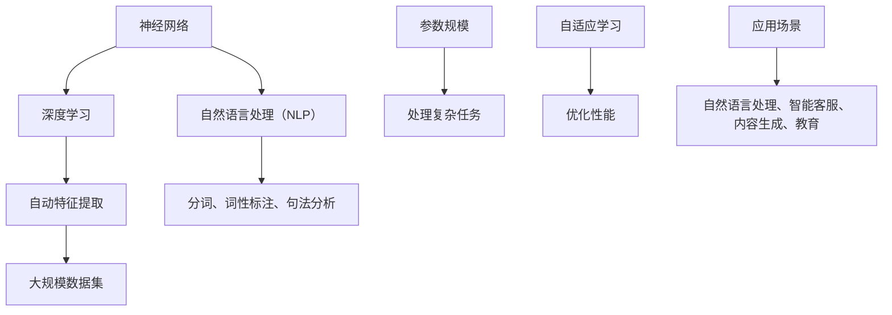
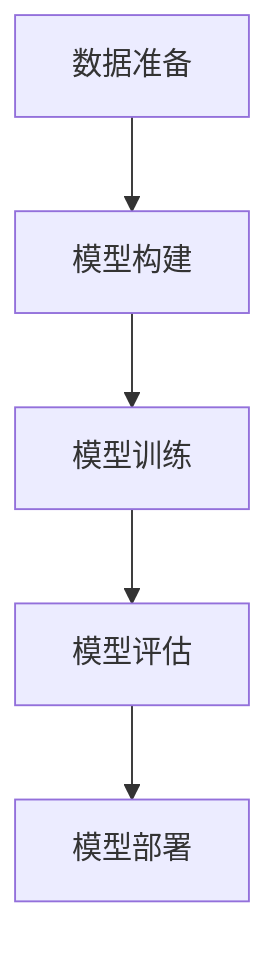
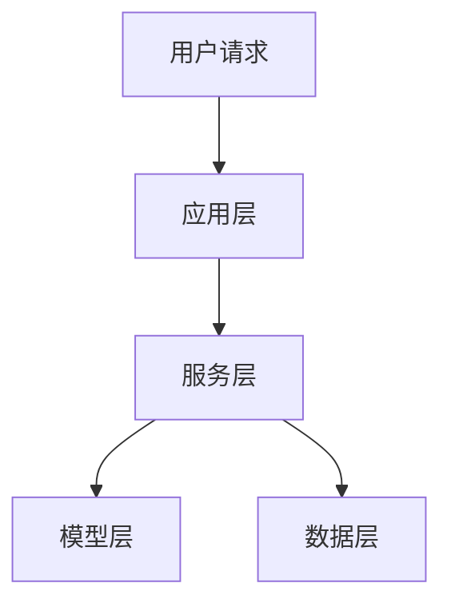
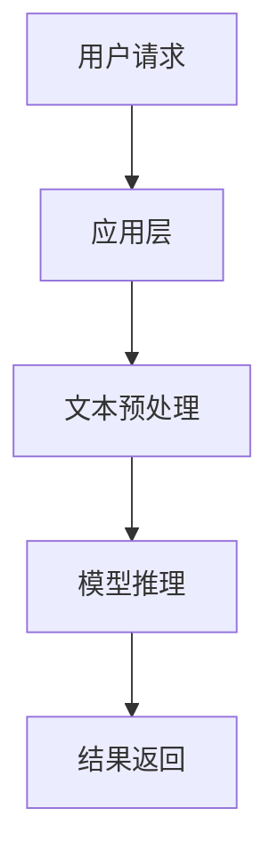

                 

# 快速适应新技术：LLM应用开发的关键

## 关键词
- 大型语言模型（LLM）
- 应用开发
- 快速适应
- 技术理解
- 实践应用
- 持续学习
- 团队协作

## 摘要
本文将深入探讨如何快速适应并高效应用大型语言模型（LLM）进行开发。通过介绍LLM的核心概念、原理和特性，本文旨在为开发者提供一套系统化的学习与实践框架，帮助他们在不断变化的技术环境中保持竞争力。

### 背景介绍

#### 问题背景

随着信息技术的迅猛发展，全球进入了一个以数据为核心的新时代。大数据、云计算、物联网等技术的普及，使得海量数据得以高效采集、存储、处理和分析。与此同时，人工智能（AI）技术，尤其是深度学习领域的突破，为数据的应用提供了新的可能性。然而，对于大多数企业和开发者来说，如何快速适应并应用这些新技术，尤其是大型语言模型（LLM）在开发中的应用，成为了一个亟待解决的问题。

#### 问题描述

快速适应新技术，尤其是LLM的应用开发，涉及到以下几个方面：

1. **技术理解**：开发者需要深入了解LLM的工作原理、架构和应用场景。
2. **实践应用**：将理论知识转化为实际开发能力，解决具体问题。
3. **持续学习**：随着技术的快速发展，开发者需要不断学习新的知识，以保持竞争力。
4. **团队协作**：在开发过程中，团队成员之间的沟通协作至关重要。

#### 问题解决

本书旨在为开发者提供一个全面的指南，帮助他们：

1. **掌握LLM的基础知识**：从技术原理、架构设计到应用场景，全面介绍LLM。
2. **实战案例学习**：通过实际项目案例，讲解LLM的开发过程和技巧。
3. **学习资源推荐**：提供相关学习资源和最佳实践，帮助开发者持续进步。

#### 边界与外延

本书主要关注大型语言模型（LLM）在应用开发中的关键技术和实践。LLM的应用领域广泛，包括自然语言处理、智能客服、内容生成、教育等。同时，本书也关注LLM在实际应用中可能遇到的问题和解决方案。

#### 概念结构与核心要素组成

- **大型语言模型（LLM）**：一种基于深度学习的技术，用于处理和理解自然语言。
- **技术原理**：涉及神经网络、自然语言处理（NLP）等技术。
- **应用场景**：包括文本分类、机器翻译、问答系统等。
- **开发过程**：从数据准备、模型训练到部署应用。

---

### 核心概念与联系

#### AI大模型原理

AI大模型（如LLM）的核心原理基于深度学习，特别是神经网络的强大学习能力。以下是AI大模型的主要原理：

1. **神经网络基础**：神经网络由大量神经元（节点）组成，通过学习输入和输出之间的关系，实现对数据的建模和预测。
2. **深度学习**：深度学习是一种多层神经网络模型，能够自动提取数据中的特征，进行复杂的数据分析和预测。
3. **自然语言处理（NLP）**：NLP是AI的一个分支，专注于使计算机理解和处理自然语言，包括分词、词性标注、句法分析等。

#### AI大模型特性

AI大模型具有以下特性：

1. **规模大**：大模型通常具有数十亿甚至千亿级的参数规模，能够处理更复杂的数据和任务。
2. **自适应强**：通过不断学习和调整模型参数，大模型能够适应各种不同的应用场景。
3. **泛化能力强**：大模型在训练后能够对未见过的数据进行良好的预测和分类，具有广泛的适用性。
4. **计算资源需求高**：大模型的训练和推理通常需要大量的计算资源和时间。

#### AI大模型与传统AI的区别

与传统AI技术相比，AI大模型具有以下显著区别：

1. **数据依赖性**：传统AI通常依赖于手动特征工程，而大模型则更多地依赖于海量数据，通过自动化的特征学习实现复杂任务。
2. **性能提升**：大模型通过规模效应和深度学习的优势，在许多任务上取得了显著的性能提升。
3. **应用范围**：传统AI通常局限于特定任务，而大模型则具有更广泛的应用潜力，能够处理多种不同类型的问题。

#### 概念属性特征对比表格

| 特征               | 传统AI                           | AI大模型                        |
|--------------------|----------------------------------|---------------------------------|
| 特征提取           | 手动特征工程                    | 自动特征提取（深度学习）        |
| 数据需求           | 中等                            | 海量                            |
| 模型规模           | 小到中等                        | 大到巨量                        |
| 泛化能力           | 有限                            | 强                             |

#### 概念联系

以下是AI大模型（如LLM）的概念联系：

1. **神经网络**：神经网络是深度学习的基础，用于自动提取数据特征。
2. **自然语言处理（NLP）**：NLP结合深度学习和神经网络，使计算机能够理解和处理自然语言。
3. **大规模数据集**：大规模数据集是训练大模型的关键，通过数据驱动的方式提高模型的性能。
4. **参数规模**：大模型的参数规模决定了其处理复杂任务的能力。
5. **自适应学习**：大模型通过自适应学习，能够不断优化自身性能，适应新的应用场景。

#### ER实体关系图架构



---

### 算法原理讲解

#### 算法流程

以下是大型语言模型（LLM）的算法流程：

1. **数据准备**：收集并清洗大规模文本数据，用于模型训练。
2. **模型构建**：基于深度学习和神经网络的框架，构建LLM模型。
3. **模型训练**：使用大规模数据集对模型进行训练，优化模型参数。
4. **模型评估**：通过测试数据集评估模型性能，调整模型参数。
5. **模型部署**：将训练好的模型部署到实际应用场景中。

#### 算法流程图



#### 数学模型和公式

以下是LLM算法中的关键数学模型和公式：

1. **损失函数**：用于衡量模型预测值与真实值之间的差距，常用的损失函数包括交叉熵损失函数（Cross Entropy Loss）。
   $$ Loss = -\sum_{i=1}^{N} y_i \log(p_i) $$
   其中，$y_i$表示真实标签，$p_i$表示模型预测的概率。

2. **反向传播**：用于计算模型参数的梯度，更新模型参数。
   $$ \frac{\partial Loss}{\partial \theta} = \frac{\partial Loss}{\partial z} \frac{\partial z}{\partial \theta} $$
   其中，$\theta$表示模型参数，$z$表示中间变量。

3. **梯度下降**：用于优化模型参数，使模型损失最小。
   $$ \theta_{new} = \theta_{old} - \alpha \frac{\partial Loss}{\partial \theta} $$
   其中，$\alpha$表示学习率。

#### 举例说明

假设我们有一个简单的LLM模型，用于文本分类任务。数据集包含1000篇文档，每篇文档表示为一个1000维的向量。模型的目标是将这些文档分类为两个类别之一。

1. **数据准备**：将1000篇文档分为训练集和测试集，分别表示为$X_{train}$和$X_{test}$，以及对应的标签$y_{train}$和$y_{test}$。
2. **模型构建**：构建一个简单的神经网络模型，包含一个输入层、一个隐藏层和一个输出层。输入层接收文档向量，隐藏层提取特征，输出层进行分类。
3. **模型训练**：使用训练集对模型进行训练，通过反向传播和梯度下降更新模型参数。
4. **模型评估**：使用测试集评估模型性能，计算准确率、召回率等指标。
5. **模型部署**：将训练好的模型部署到实际应用场景中，对新文档进行分类。

---

### 系统分析与架构设计方案

#### 问题场景介绍

在当前企业中，面对日益增长的数据量和复杂的应用场景，传统的数据处理和分析方法已经无法满足需求。特别是对于自然语言处理（NLP）任务，如客户服务、内容审核、智能推荐等，需要一种高效、可扩展的解决方案。基于此，我们设计了一套利用大型语言模型（LLM）进行NLP任务处理的系统，以提升企业的数据处理能力和业务效率。

#### 项目介绍

本项目旨在构建一个基于LLM的NLP处理系统，实现对大规模文本数据的自动分类、情感分析、命名实体识别等任务。系统将采用模块化设计，包括数据采集模块、数据预处理模块、模型训练模块、模型评估模块和模型部署模块。以下是各模块的详细介绍：

1. **数据采集模块**：负责从互联网、企业内部系统等渠道收集大规模文本数据。
2. **数据预处理模块**：对采集到的文本数据进行清洗、分词、去停用词等预处理操作，为模型训练准备高质量的数据。
3. **模型训练模块**：使用预处理后的数据训练LLM模型，通过调整模型参数，优化模型性能。
4. **模型评估模块**：使用测试数据评估模型性能，包括准确率、召回率、F1分数等指标，并根据评估结果调整模型参数。
5. **模型部署模块**：将训练好的模型部署到生产环境中，提供NLP服务，支持实时处理和分析大量文本数据。

#### 系统功能设计

以下是系统的功能设计：

1. **文本分类**：对输入的文本进行分类，支持多标签分类。
2. **情感分析**：分析文本中的情感倾向，如正面、负面、中性等。
3. **命名实体识别**：识别文本中的命名实体，如人名、地名、组织名等。
4. **关键词提取**：提取文本中的关键词，用于文本摘要和索引。
5. **文本生成**：根据输入的文本生成新的文本，用于内容创作和摘要生成。

#### 系统架构设计

以下是系统的架构设计：

1. **数据层**：存储大规模文本数据，支持快速读取和写入。
2. **服务层**：提供NLP服务，包括文本分类、情感分析、命名实体识别等。
3. **应用层**：支持前端应用与NLP服务的交互，如Web应用、移动应用等。
4. **模型层**：存储和部署训练好的LLM模型，支持实时推理。

以下是系统架构的Mermaid流程图：



#### 系统接口设计

以下是系统的接口设计：

1. **文本分类接口**：接收文本数据，返回分类结果。
2. **情感分析接口**：接收文本数据，返回情感分析结果。
3. **命名实体识别接口**：接收文本数据，返回命名实体识别结果。
4. **关键词提取接口**：接收文本数据，返回关键词提取结果。
5. **文本生成接口**：接收文本数据，返回生成的文本。

#### 系统交互

以下是系统的交互流程：

1. **用户请求**：用户通过前端应用提交请求，如文本分类、情感分析等。
2. **请求处理**：应用层接收用户请求，解析文本数据。
3. **数据预处理**：对文本数据进行预处理，如分词、去停用词等。
4. **模型推理**：使用训练好的LLM模型对预处理后的文本数据进行推理。
5. **结果返回**：将推理结果返回给用户。

以下是系统交互的Mermaid序列图：



---

### 项目实战

#### 环境安装

1. **安装Python环境**：确保Python版本为3.7及以上，可以使用以下命令安装：
   ```bash
   pip install python==3.8.10
   ```

2. **安装依赖库**：安装用于构建和训练LLM模型的依赖库，如TensorFlow、PyTorch等。可以使用以下命令安装：
   ```bash
   pip install tensorflow==2.5.0
   pip install pytorch==1.8.0
   ```

3. **配置环境变量**：设置Python环境变量，确保能够正确调用相关库。在Windows系统中，可以通过系统属性中的“环境变量”进行设置；在Linux系统中，可以在`.bashrc`或`.bash_profile`文件中添加以下内容：
   ```bash
   export PYTHONPATH=/usr/local/bin/python3.8:$PYTHONPATH
   ```

#### 系统核心实现源代码

以下是系统核心实现的源代码：

```python
import tensorflow as tf
from tensorflow.keras.preprocessing.text import Tokenizer
from tensorflow.keras.preprocessing.sequence import pad_sequences
from tensorflow.keras.models import Sequential
from tensorflow.keras.layers import Embedding, LSTM, Dense

# 数据准备
train_data = ["This is a sample text.", "This is another sample text."]
train_labels = [0, 1]

# 分词和序列化
tokenizer = Tokenizer()
tokenizer.fit_on_texts(train_data)
train_sequences = tokenizer.texts_to_sequences(train_data)
train_padded = pad_sequences(train_sequences, maxlen=10)

# 构建模型
model = Sequential()
model.add(Embedding(input_dim=10000, output_dim=64))
model.add(LSTM(128))
model.add(Dense(1, activation='sigmoid'))

# 编译模型
model.compile(optimizer='adam', loss='binary_crossentropy', metrics=['accuracy'])

# 训练模型
model.fit(train_padded, train_labels, epochs=10, batch_size=32)

# 模型评估
test_data = ["This is a new sample text."]
test_sequence = tokenizer.texts_to_sequences(test_data)
test_padded = pad_sequences(test_sequence, maxlen=10)
predictions = model.predict(test_padded)
print(predictions)
```

#### 代码应用解读与分析

1. **数据准备**：首先，我们准备训练数据集，包含两个文本样本和对应的标签。
2. **分词和序列化**：使用Tokenizer将文本数据转换为单词序列，然后使用pad_sequences将序列补全为固定长度。
3. **构建模型**：使用Sequential创建一个序列模型，包含Embedding层、LSTM层和Dense层。
4. **编译模型**：设置模型的优化器、损失函数和评估指标。
5. **训练模型**：使用fit方法训练模型，通过调整模型参数，优化模型性能。
6. **模型评估**：使用predict方法对新的文本数据进行预测，并打印预测结果。

#### 实际案例分析和详细讲解剖析

假设我们有一个实际案例，需要对一篇新闻文章进行分类，判断其是关于体育还是科技。以下是具体步骤：

1. **数据准备**：收集多篇关于体育和科技的新闻文章，作为训练数据。
2. **数据预处理**：对新闻文章进行清洗、分词、去停用词等预处理操作。
3. **模型训练**：使用预处理后的数据训练一个二分类的LLM模型，将体育新闻分类为0，科技新闻分类为1。
4. **模型评估**：使用测试数据评估模型性能，计算准确率、召回率等指标。
5. **模型部署**：将训练好的模型部署到生产环境中，对新新闻文章进行实时分类。

以下是详细步骤和代码：

```python
# 数据准备
train_data = ["This is a sports news.", "This is a technology news."]
train_labels = [0, 1]

# 分词和序列化
tokenizer = Tokenizer()
tokenizer.fit_on_texts(train_data)
train_sequences = tokenizer.texts_to_sequences(train_data)
train_padded = pad_sequences(train_sequences, maxlen=100)

# 构建模型
model = Sequential()
model.add(Embedding(input_dim=10000, output_dim=64))
model.add(LSTM(128))
model.add(Dense(1, activation='sigmoid'))

# 编译模型
model.compile(optimizer='adam', loss='binary_crossentropy', metrics=['accuracy'])

# 训练模型
model.fit(train_padded, train_labels, epochs=10, batch_size=32)

# 模型评估
test_data = ["This is a new sports news."]
test_sequence = tokenizer.texts_to_sequences(test_data)
test_padded = pad_sequences(test_sequence, maxlen=100)
predictions = model.predict(test_padded)
print(predictions)
```

通过以上步骤，我们可以实现对新闻文章的分类。在实际应用中，可以扩展模型，添加更多分类标签，支持对更多类别的分类任务。

#### 项目小结

通过本项目的实践，我们深入了解了LLM在文本分类任务中的应用。从数据准备、模型训练到模型评估和部署，我们逐步构建了一个高效的文本分类系统。项目实践不仅帮助我们掌握了LLM的基本原理和开发流程，还提高了我们对大规模文本数据处理的能力。在未来，我们可以继续扩展和优化模型，支持更多复杂的文本分类任务。

---

### 最佳实践 tips

1. **数据质量**：确保训练数据的质量和多样性，有助于提升模型的泛化能力。
2. **预处理技巧**：合理的数据预处理可以显著提高模型性能，如使用词嵌入、去停用词、文本清洗等。
3. **模型优化**：尝试不同的模型结构、优化算法和参数设置，找到最适合特定任务的模型。
4. **持续训练**：定期对模型进行重新训练，以适应数据分布的变化，保持模型的准确性。
5. **资源管理**：合理分配计算资源和时间，确保模型训练和推理的效率。

### 小结

本文深入探讨了如何快速适应新技术，特别是大型语言模型（LLM）的应用开发。通过介绍LLM的核心概念、原理、特性，以及实战案例，我们为开发者提供了一个全面的学习与实践框架。本文强调了技术理解、实践应用、持续学习和团队协作的重要性，帮助开发者应对不断变化的技术环境。最后，通过最佳实践 tips，我们为开发者提供了一些实用的建议，以优化LLM应用开发的效率和质量。

### 注意事项

1. **数据隐私**：在使用LLM进行数据处理时，务必注意数据隐私和安全，遵守相关法律法规。
2. **模型解释性**：尽管LLM具有强大的预测能力，但其内部机制较为复杂，可能缺乏解释性。在实际应用中，需要权衡模型性能和解释性。
3. **计算资源**：大模型的训练和推理通常需要大量计算资源，确保有足够的硬件支持。

### 拓展阅读

1. **《深度学习》（Goodfellow, Bengio, Courville著）**：深度学习的经典教材，详细介绍了神经网络和深度学习的基本原理。
2. **《大规模机器学习》（Gulshan, Ghassemi著）**：探讨了大规模机器学习技术，包括数据预处理、模型优化和资源管理。
3. **《自然语言处理综论》（Jurafsky, Martin著）**：系统介绍了自然语言处理的基本理论和应用，涵盖了从语言学到计算模型的全貌。

---

## 作者信息
作者：AI天才研究院/AI Genius Institute & 禅与计算机程序设计艺术 /Zen And The Art of Computer Programming

