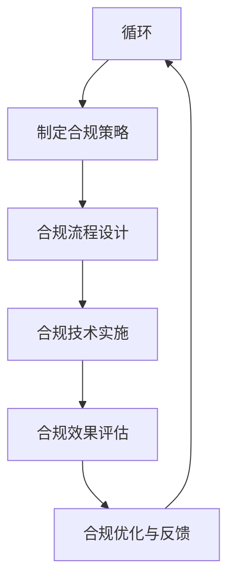
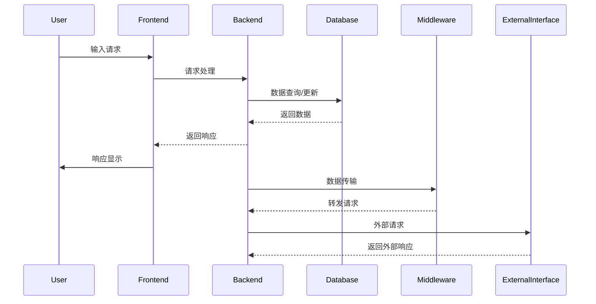
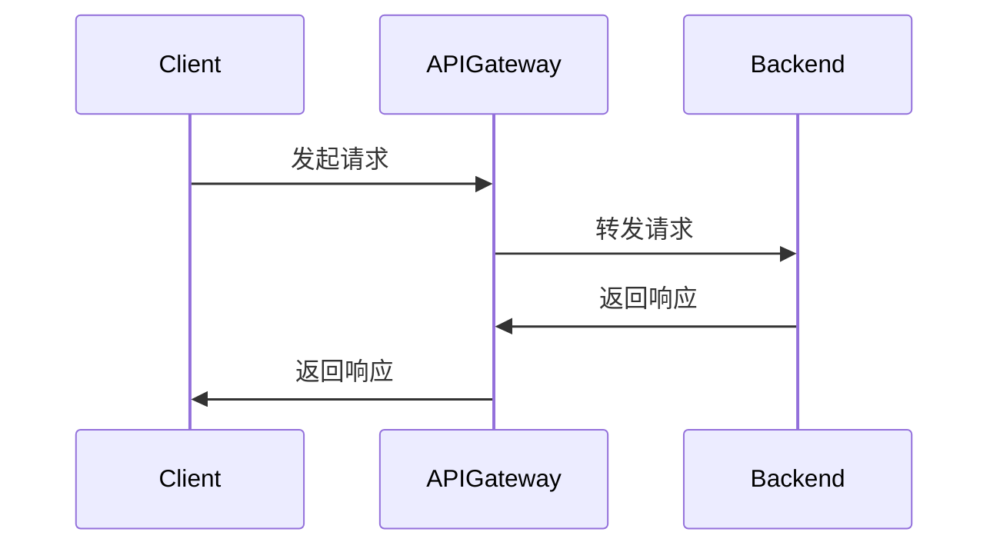

                 

# 快速适应监管要求：LLM应用的合规策略

## 关键词

- 监管要求
- LLM应用
- 合规策略
- 合规流程
- 合规技术

## 摘要

随着人工智能技术，特别是大型语言模型（LLM）的迅猛发展，其在各行业的应用日益广泛。然而，LLM应用的兴起也带来了诸多监管合规的挑战。本文旨在探讨如何在快速适应监管要求的前提下，制定和实施有效的LLM应用合规策略。我们将通过分析监管环境的变迁、LLM应用的合规挑战以及合规策略的实施，为读者提供一套系统、全面、可行的合规解决方案。

### 目录大纲

## 第一部分：背景介绍

### 1.1 问题的背景

#### 1.1.1 监管环境的变迁

#### 1.1.2 LLM应用的兴起

#### 1.1.3 监管与合规的重要性

### 1.2 问题描述

#### 1.2.1 LLM应用中的合规挑战

#### 1.2.2 合规问题的具体表现

#### 1.2.3 合规问题的危害

### 1.3 问题解决

#### 1.3.1 合规策略的制定

#### 1.3.2 合规流程的实施

#### 1.3.3 合规技术的应用

### 1.4 边界与外延

#### 1.4.1 合规的范围

#### 1.4.2 合规的相关主体

#### 1.4.3 合规的长期效应

### 1.5 概念结构与核心要素组成

#### 1.5.1 合规的定义

#### 1.5.2 监管要求

#### 1.5.3 LLM应用的特点

### 1.6 本章小结

## 第二部分：核心概念与联系

### 2.1 核心概念原理

#### 2.1.1 合规原理

##### 2.1.1.1 合规的基本概念

##### 2.1.1.2 合规的法律依据

##### 2.1.1.3 合规的主要目标

#### 2.1.2 监管要求

##### 2.1.2.1 监管机构的职责

##### 2.1.2.2 监管要求的主要内容

##### 2.1.2.3 监管要求的实施情况

#### 2.1.3 LLM应用的特点

##### 2.1.3.1 LLM的定义

##### 2.1.3.2 LLM的工作原理

##### 2.1.3.3 LLM的应用领域

### 2.2 概念属性特征对比表格

### 2.3 ER实体关系图架构

## 第三部分：算法原理讲解

### 3.1 合规算法的mermaid流程图

### 3.2 合规算法的python源代码

### 3.3 合规算法的数学模型与公式

#### 3.3.1 数学模型

#### 3.3.2 公式解释

#### 3.3.3 举例说明

## 第四部分：系统分析与架构设计

### 4.1 问题场景介绍

### 4.2 系统功能设计

#### 4.2.1 领域模型mermaid类图

### 4.3 系统架构设计

#### 4.3.1 系统架构mermaid架构图

### 4.4 系统接口设计和系统交互

#### 4.4.1 系统接口设计

#### 4.4.2 系统交互mermaid序列图

## 第五部分：项目实战

### 5.1 环境安装

### 5.2 系统核心实现源代码

### 5.3 代码应用解读与分析

### 5.4 实际案例分析和详细讲解剖析

### 5.5 项目小结

## 第六部分：最佳实践 tips、小结、注意事项、拓展阅读

### 6.1 最佳实践 tips

### 6.2 小结

### 6.3 注意事项

### 6.4 拓展阅读

---

### 1.1 问题的背景

#### 1.1.1 监管环境的变迁

随着全球化和数字化进程的加速，各国政府和监管机构对数据安全、隐私保护、公平性等方面的关注日益增加。这一背景下，监管环境发生了显著变化。传统的监管模式逐渐向更灵活、更高效、更符合现代技术发展的方向转型。例如，欧洲的《通用数据保护条例》（GDPR）和美国的多项数据隐私法案，都对企业的数据处理行为提出了严格的要求。这些变化不仅影响了传统的数据处理业务，也对新兴的人工智能技术提出了新的挑战。

#### 1.1.2 LLM应用的兴起

LLM作为人工智能的一个重要分支，其卓越的语言理解和生成能力，使得其在自然语言处理、智能客服、内容创作等领域表现出强大的应用潜力。LLM技术的兴起不仅改变了人们的工作和生活方式，也对现有监管框架提出了挑战。例如，LLM在生成文本内容时可能会包含偏见、虚假信息，如何对其进行有效的监管和合规控制，成为亟待解决的问题。

#### 1.1.3 监管与合规的重要性

监管与合规在LLM应用中具有至关重要的地位。首先，合规是LLM应用在市场中合法运行的基础，任何不符合监管要求的行为都可能带来法律风险和商业损失。其次，合规有助于提升LLM应用的公信力和用户信任度。随着公众对隐私和数据安全的关注日益增加，合规的LLM应用更能够赢得用户的信任和支持。最后，合规可以推动LLM技术的健康发展和行业生态的良性循环，促进技术、法规、市场的协调发展。

### 1.2 问题描述

#### 1.2.1 LLM应用中的合规挑战

LLM应用的合规挑战主要集中在以下几个方面：

1. **数据隐私与安全**：LLM应用通常需要处理大量的个人数据，如何确保这些数据的安全和隐私，避免数据泄露和滥用，是首要问题。
2. **公平性与无偏见**：LLM生成的文本内容可能包含偏见和歧视，如何保证其公平性和无偏见性，避免对特定群体造成伤害，是另一大挑战。
3. **透明度与可解释性**：用户和监管机构通常要求了解LLM的工作原理和决策过程，如何实现透明度和可解释性，是合规的必要条件。
4. **法律与伦理**：LLM应用可能涉及多个法律法规和伦理规范，如何确保其符合所有相关要求，是合规工作中的一大难题。

#### 1.2.2 合规问题的具体表现

合规问题的具体表现包括但不限于：

1. **数据泄露**：未经授权的访问、传输和存储个人数据，可能导致数据泄露和隐私侵犯。
2. **文本偏见**：LLM生成的文本可能带有性别、种族、年龄等方面的偏见，影响内容的公正性和准确性。
3. **法律纠纷**：不合规的LLM应用可能引发法律诉讼，导致严重的商业和法律风险。
4. **用户信任受损**：不透明的LLM应用可能导致用户对其信任度降低，影响业务发展和市场竞争力。

#### 1.2.3 合规问题的危害

合规问题的危害主要体现在以下几个方面：

1. **经济损失**：不合规可能导致法律处罚、赔偿和诉讼成本，对企业的财务状况造成严重影响。
2. **信誉受损**：不合规行为可能导致公众对企业的信任度降低，影响品牌形象和市场地位。
3. **业务中断**：不合规可能导致业务运营中断，影响企业的正常运营和盈利能力。
4. **行业风险**：不合规行为可能导致行业监管收紧，限制企业的发展空间和创新能力。

### 1.3 问题解决

#### 1.3.1 合规策略的制定

制定合规策略是解决LLM应用合规问题的第一步。合规策略应该包括以下几个方面：

1. **合规目标**：明确合规的具体目标和要求，确保合规工作的方向正确。
2. **合规标准**：选择合适的合规标准，如GDPR、ISO 27001等，作为合规工作的基础。
3. **合规责任**：明确各部门和个人的合规责任，确保合规工作落到实处。
4. **合规流程**：制定详细的合规流程，包括数据管理、文本审查、审计等各个环节。
5. **合规培训**：定期对员工进行合规培训，提高合规意识和能力。

#### 1.3.2 合规流程的实施

合规流程的实施是确保合规策略有效执行的关键。具体实施步骤包括：

1. **风险评估**：对LLM应用涉及的合规风险进行评估，确定重点监管领域。
2. **合规审查**：对LLM应用的各个环节进行合规审查，确保符合监管要求。
3. **合规监控**：建立合规监控机制，定期检查合规执行情况，及时纠正违规行为。
4. **合规报告**：定期向监管机构和内部管理层报告合规执行情况，确保透明度和责任感。

#### 1.3.3 合规技术的应用

合规技术的应用是提高合规效率和效果的重要手段。以下是一些常见的合规技术：

1. **数据加密**：使用加密技术保护数据的安全和隐私。
2. **访问控制**：设置访问权限，确保只有授权人员才能访问敏感数据。
3. **日志记录**：记录系统操作日志，便于追踪和审计。
4. **文本审查**：使用文本审查工具检测和过滤可能包含偏见和歧视的文本。
5. **人工智能辅助**：利用人工智能技术提高合规审查和监控的效率和准确性。

### 1.4 边界与外延

#### 1.4.1 合规的范围

合规的范围包括LLM应用的各个方面，如数据采集、存储、处理、传输、使用等。具体来说，合规范围应涵盖以下几个方面：

1. **数据隐私与安全**：确保个人数据的收集、存储、处理、传输和使用符合数据保护法规要求。
2. **文本生成与审查**：确保LLM生成的文本内容符合公平性、无偏见和透明度的要求。
3. **法律与伦理**：确保LLM应用遵守所有相关的法律法规和伦理规范。
4. **监管报告**：按照监管要求，定期提交合规报告，接受监管审查。

#### 1.4.2 合规的相关主体

合规的相关主体包括以下几个方面：

1. **企业内部人员**：包括企业高管、合规官员、IT人员、数据科学家等，他们负责制定、执行和监督合规策略和流程。
2. **外部监管机构**：如数据保护局、隐私委员会等，他们负责监管LLM应用的合规情况，对企业进行审计和处罚。
3. **用户**：用户作为LLM应用的使用者，他们对合规的关注和监督也对企业合规策略的实施具有重要影响。

#### 1.4.3 合规的长期效应

合规的长期效应包括以下几个方面：

1. **企业声誉**：合规有助于提升企业声誉，增强用户信任，提高市场竞争力。
2. **法律风险**：合规可以降低企业的法律风险，减少诉讼和处罚的可能性。
3. **业务发展**：合规有助于企业适应监管环境的变化，抓住市场机会，实现可持续发展。
4. **技术进步**：合规可以推动技术的健康发展和创新，促进整个行业的进步。

### 1.5 概念结构与核心要素组成

#### 1.5.1 合规的定义

合规（Compliance）是指企业或组织在法律、法规、标准等外部要求下，遵循特定规则和标准的行为。合规不仅仅是一种遵守法规的要求，更是一种管理理念，强调企业或组织在经营过程中，应主动识别和遵循所有相关的法律、法规和标准，确保经营活动的合法性和合规性。

#### 1.5.2 监管要求

监管要求（Regulatory Requirements）是指监管机构根据法律、法规、标准等制定的特定领域或行业的规范和标准。监管要求通常涉及数据安全、隐私保护、公平性、透明度、法律与伦理等方面，旨在保障公众利益和社会稳定。监管要求具有强制性和法律效力，企业必须严格遵守。

#### 1.5.3 LLM应用的特点

LLM（Large Language Model）是指大型语言模型，是一种基于深度学习技术的自然语言处理模型。LLM应用的特点包括：

1. **高度智能化**：LLM具有强大的语言理解和生成能力，能够生成高质量的自然语言文本。
2. **自适应性强**：LLM能够根据输入数据自动调整和优化自身模型，适应不同的应用场景。
3. **应用领域广泛**：LLM在自然语言处理、智能客服、内容创作、机器翻译等领域具有广泛的应用潜力。
4. **数据处理量大**：LLM通常需要处理海量的数据，以保证模型的训练效果和生成文本的质量。

### 1.6 本章小结

本章主要介绍了监管环境的变化、LLM应用的兴起以及监管与合规的重要性。通过分析LLM应用中的合规挑战、具体表现和危害，我们认识到合规在LLM应用中的关键作用。在此基础上，我们提出了制定合规策略、实施合规流程和应用合规技术等解决方案。最后，我们探讨了合规的范围、相关主体和长期效应，以及合规的定义和LLM应用的特点。这些内容为本章后续的核心概念和联系分析奠定了基础。

### 第二部分：核心概念与联系

#### 2.1 核心概念原理

在讨论LLM应用的合规策略时，理解几个核心概念是非常关键的。这些概念包括合规原理、监管要求以及LLM应用的特点。通过对这些概念的深入分析，我们可以更好地制定和实施有效的合规策略。

##### 2.1.1 合规原理

##### 2.1.1.1 合规的基本概念

合规（Compliance）是一种遵循法律、法规、标准等外部要求的主动行为。它不仅仅是一种被动遵守规定的过程，更是一种管理理念，强调企业或组织在经营活动中应主动识别和遵循所有相关的法律、法规和标准。合规的核心目的是确保企业或组织的经营活动合法、规范，同时维护公共利益和社会稳定。

在技术领域，合规通常涉及到数据安全、隐私保护、伦理道德等方面。对于LLM应用而言，合规的基本概念尤其重要，因为它不仅关乎技术合规，还涉及到社会道德和伦理标准。

##### 2.1.1.2 合规的法律依据

合规的法律依据包括各种法律、法规、条例和标准。这些法律依据为合规提供了明确的法律框架和操作指南。例如，在欧盟，有《通用数据保护条例》（GDPR）来规范数据隐私保护；在美国，有《加州消费者隐私法案》（CCPA）和《健康保险可携性和责任法案》（HIPAA）等法规。这些法律依据不仅规定了企业的合规要求，还为不合规行为设定了相应的法律责任。

对于LLM应用，合规的法律依据通常包括：

1. **数据保护法规**：确保个人数据的收集、存储、处理和传输符合相关数据保护法规的要求。
2. **隐私保护法规**：要求企业在处理个人数据时保护用户的隐私权利。
3. **公平竞争法规**：确保LLM应用不会对特定群体造成不公平对待或歧视。
4. **伦理规范**：要求企业在开发和使用LLM技术时遵循一定的伦理标准，避免生成有害或误导性的内容。

##### 2.1.1.3 合规的主要目标

合规的主要目标包括：

1. **确保合法性**：确保企业的所有经营活动都符合相关法律、法规和标准的要求，避免因违法而受到处罚。
2. **保护用户权益**：通过合规措施，保护用户的隐私权、知情权和其他合法权益，增强用户对企业的信任。
3. **提升企业声誉**：合规有助于提升企业的社会形象和公众信任度，增强市场竞争力。
4. **降低风险**：通过合规管理，识别和降低企业面临的法律风险、商业风险和声誉风险。

##### 2.1.2 监管要求

##### 2.1.2.1 监管机构的职责

监管机构（Regulatory Agencies）是负责制定和执行相关法规、条例和标准的政府机构或其他组织。它们的职责通常包括：

1. **制定法规和标准**：根据社会需求和法律规定，制定和发布适用于特定领域或行业的法规和标准。
2. **监管和监督**：监督企业或组织的经营活动，确保其遵守相关法规和标准。
3. **执法和处罚**：对违反法规和标准的企业或组织进行处罚，以维护市场秩序和社会稳定。

在LLM应用的合规中，监管机构的职责主要体现在以下几个方面：

1. **数据隐私监管**：监管机构负责监督企业如何处理和存储个人数据，确保符合数据保护法规的要求。
2. **公平性监管**：监管机构负责审查LLM应用的生成内容，确保其公平性和无偏见性。
3. **伦理监管**：监管机构负责评估LLM应用在伦理方面的合规性，防止生成有害或误导性的内容。

##### 2.1.2.2 监管要求的主要内容

监管要求（Regulatory Requirements）的主要内容通常包括以下几个方面：

1. **数据保护**：监管机构要求企业在收集、存储、处理和传输个人数据时，必须采取必要的安全措施，防止数据泄露、篡改和滥用。
2. **隐私保护**：监管机构要求企业必须告知用户其个人数据的用途和范围，并获得用户的明确同意。同时，企业必须保护用户的隐私权利，不得泄露用户个人信息。
3. **透明度**：监管机构要求企业在使用LLM技术时，必须确保其工作过程透明，用户可以了解其使用的模型和算法。
4. **无偏见**：监管机构要求LLM应用生成的文本内容必须公平、无偏见，不得对特定群体造成歧视或伤害。
5. **伦理和道德**：监管机构要求企业在开发和使用LLM技术时，必须遵循一定的伦理和道德标准，确保技术的应用对社会有益。

##### 2.1.2.3 监管要求的实施情况

监管要求的实施情况因国家和地区的不同而有所差异。以下是一些国家和地区的监管要求实施情况：

1. **欧盟**：欧盟的《通用数据保护条例》（GDPR）是世界上最严格的数据保护法规之一。它要求企业在处理个人数据时必须遵守严格的保护措施，并赋予用户更多的隐私权利。
2. **美国**：美国的《加州消费者隐私法案》（CCPA）和《健康保险可携性和责任法案》（HIPAA）等法规对数据保护和隐私保护提出了明确的要求。企业必须遵守这些要求，否则可能面临高额罚款和诉讼。
3. **中国**：中国的《网络安全法》和《个人信息保护法》等法规对数据保护和隐私保护提出了具体的要求。企业必须确保个人数据的安全和保护，否则可能面临处罚和信誉损失。

##### 2.1.3 LLM应用的特点

LLM（Large Language Model）是一种能够理解和生成自然语言的大型深度学习模型。LLM应用的特点主要体现在以下几个方面：

##### 2.1.3.1 LLM的定义

LLM是一种基于神经网络的深度学习模型，其规模远超传统的小型语言模型。LLM通常具有数十亿甚至千亿级的参数，能够处理和理解复杂的自然语言文本。LLM的核心目标是实现自然语言理解和生成，使计算机能够像人类一样理解和生成语言。

##### 2.1.3.2 LLM的工作原理

LLM的工作原理主要包括以下几个步骤：

1. **文本编码**：将输入的自然语言文本转换为计算机可以处理的数字表示。
2. **参数计算**：利用训练好的神经网络模型，通过参数计算生成文本的概率分布。
3. **文本生成**：根据概率分布生成新的文本，可以是回答问题、生成文章或进行对话。

##### 2.1.3.3 LLM的应用领域

LLM在多个领域具有广泛的应用潜力，包括：

1. **自然语言处理**：LLM可以用于文本分类、情感分析、实体识别、机器翻译等自然语言处理任务。
2. **智能客服**：LLM可以用于构建智能客服系统，实现与用户的自然语言对话，提供实时、个性化的服务。
3. **内容创作**：LLM可以用于生成文章、摘要、广告文案等，提高内容创作效率和质量。
4. **机器翻译**：LLM可以用于构建高效的机器翻译系统，实现跨语言的文本翻译。
5. **教育**：LLM可以用于教育领域，为学生提供个性化的学习资源和辅导。

### 2.2 概念属性特征对比表格

为了更好地理解合规、监管要求和LLM应用之间的关系，我们可以通过一个对比表格来展示这些概念的属性特征。

| 概念       | 定义                                                         | 属性特征                                                       |
|------------|--------------------------------------------------------------|--------------------------------------------------------------|
| 合规       | 符合法律、法规、标准等要求的行为                             | 法律性、规范性、强制性、稳定性                                 |
| 监管要求   | 监管机构对特定领域或行业提出的要求                           | 针对性、专业性、动态性、全面性                                 |
| LLM应用    | 基于大型语言模型的技术应用                                   | 智能性、自适应性、高效性、广泛性                               |

通过这个表格，我们可以清晰地看到这三个概念的定义及其属性特征，从而更好地理解它们之间的联系。

### 2.3 ER实体关系图架构

为了更直观地展示合规、监管要求和LLM应用之间的关系，我们可以使用Mermaid工具绘制一个ER（实体-关系）图。

```mermaid
erDiagram
  Compliance --> RegulatoryRequirement : "遵循"
  Compliance --> LLMApplication : "适用"
  RegulatoryRequirement --> LLMApplication : "满足"
```

在这个ER图中，"合规"是一个核心实体，它既与"监管要求"存在关联，也与"LLM应用"存在关联。具体来说，合规需要遵循监管要求，并且合规适用于LLM应用。同时，监管要求也需要满足LLM应用的要求。这个ER图展示了这三个概念之间的复杂关系，帮助我们更好地理解它们在LLM应用合规策略中的角色和作用。

### 第三部分：算法原理讲解

在快速适应监管要求的背景下，为了确保LLM应用的有效合规，我们需要设计并实施一套完备的合规算法。本部分将详细讲解合规算法的原理，包括其流程图、Python源代码以及相关的数学模型和公式。

#### 3.1 合规算法的mermaid流程图

合规算法的mermaid流程图如下：



在这个流程图中，每个节点代表一个步骤，箭头表示步骤之间的先后关系。整个流程从合规需求分析开始，经过制定合规策略、合规流程设计和合规技术实施，最终达到合规效果评估，并通过反馈进行优化与调整，形成了一个闭环。

1. **合规需求分析**：识别LLM应用的合规需求和潜在风险。
2. **制定合规策略**：根据分析结果，制定具体的合规策略和计划。
3. **合规流程设计**：设计详细的合规流程，包括数据管理、文本审查、审计等环节。
4. **合规技术实施**：实施合规技术，如数据加密、访问控制、日志记录等。
5. **合规效果评估**：评估合规实施的效果，识别存在的问题和改进点。
6. **合规优化与反馈**：根据评估结果，优化合规流程和策略，并形成反馈循环。

#### 3.2 合规算法的Python源代码

以下是合规算法的Python源代码示例：

```python
# 合规算法的Python实现

def compliance_algorithm():
    # 合规需求分析
    requirements_analysis()

    # 制定合规策略
    strategy = formulate_strategy()

    # 合规流程设计
    process_design()

    # 合规技术实施
    technology_implementation()

    # 合规效果评估
    effectiveness_evaluation()

    # 合规优化与反馈
    optimization_and_feedback()

# 合规需求分析
def requirements_analysis():
    print("进行合规需求分析...")

# 制定合规策略
def formulate_strategy():
    print("制定合规策略...")
    return "合规策略"

# 合规流程设计
def process_design():
    print("设计合规流程...")

# 合规技术实施
def technology_implementation():
    print("实施合规技术...")

# 合规效果评估
def effectiveness_evaluation():
    print("评估合规效果...")

# 合规优化与反馈
def optimization_and_feedback():
    print("优化合规策略与反馈...")
```

在这个Python源代码中，`compliance_algorithm`函数是整个合规算法的核心。它依次调用`requirements_analysis`、`formulate_strategy`、`process_design`、`technology_implementation`、`effectiveness_evaluation`和`optimization_and_feedback`等函数，实现合规算法的各个步骤。每个函数都实现了相应的功能，例如需求分析、策略制定、流程设计、技术实施、效果评估和优化反馈。

#### 3.3 合规算法的数学模型与公式

合规算法的数学模型和公式是确保合规策略科学性和有效性的基础。以下是一个简单的合规算法数学模型和相关的公式：

##### 3.3.1 数学模型

合规算法的数学模型可以表示为：

\[ C = f(R, L) \]

其中，\( C \) 表示合规度，\( R \) 表示监管要求，\( L \) 表示LLM应用。这个模型表示合规度是监管要求和LLM应用的函数。

##### 3.3.2 公式解释

1. **监管要求权重**：假设每个监管要求都有一个权重，记为 \( w_r \)，表示该要求对合规度的影响程度。权重可以通过专家评估、历史数据和统计分析等方法确定。
2. **LLM应用权重**：假设每个LLM应用特征都有一个权重，记为 \( w_l \)，表示该特征对合规度的影响程度。权重可以通过专家评估、实验数据和用户反馈等方法确定。
3. **合规度计算**：合规度 \( C \) 是通过监管要求和LLM应用特征的综合评估得出的。具体公式为：

\[ C = \sum_{r \in R} w_r \cdot r + \sum_{l \in L} w_l \cdot l \]

其中，\( r \) 表示监管要求，\( l \) 表示LLM应用特征。这个公式表示合规度是所有监管要求权重与其对应监管要求的乘积之和，加上所有LLM应用特征权重与其对应LLM应用特征的乘积之和。

##### 3.3.3 举例说明

假设我们有以下监管要求和LLM应用特征：

- **监管要求**：
  - 数据保护（\( r_1 \)）：权重为0.3
  - 隐私保护（\( r_2 \)）：权重为0.2
  - 公平性（\( r_3 \)）：权重为0.1
  - 法律合规（\( r_4 \)）：权重为0.4

- **LLM应用特征**：
  - 文本生成质量（\( l_1 \)）：权重为0.5
  - 文本生成速度（\( l_2 \)）：权重为0.5

根据上述权重，我们可以计算合规度：

\[ C = 0.3 \cdot r_1 + 0.2 \cdot r_2 + 0.1 \cdot r_3 + 0.4 \cdot r_4 + 0.5 \cdot l_1 + 0.5 \cdot l_2 \]

如果每个监管要求和LLM应用特征的评分如下：

- **数据保护**：评分90
- **隐私保护**：评分80
- **公平性**：评分85
- **法律合规**：评分95
- **文本生成质量**：评分90
- **文本生成速度**：评分85

则合规度 \( C \) 为：

\[ C = 0.3 \cdot 90 + 0.2 \cdot 80 + 0.1 \cdot 85 + 0.4 \cdot 95 + 0.5 \cdot 90 + 0.5 \cdot 85 \]
\[ C = 27 + 16 + 8.5 + 38 + 45 + 42.5 \]
\[ C = 169 \]

因此，合规度 \( C \) 为169，表示该LLM应用的合规度较高。

通过这个示例，我们可以看到合规算法的数学模型和公式如何应用于实际场景中，从而评估LLM应用的合规度，并制定相应的优化策略。

### 第四部分：系统分析与架构设计

在LLM应用中，合规不仅仅是技术和流程的问题，还需要有清晰的问题场景、系统功能设计、系统架构设计以及系统接口设计和系统交互的设计。以下是对这些内容的详细分析和架构设计。

#### 4.1 问题场景介绍

在现实世界中，LLM应用的场景多种多样，包括但不限于以下几个方面：

1. **自然语言处理（NLP）**：例如，文本分类、情感分析、命名实体识别等。
2. **智能客服**：利用LLM实现与用户的自然语言交互，提供24/7的服务。
3. **内容创作**：例如，自动生成新闻文章、博客内容、广告文案等。
4. **机器翻译**：自动翻译不同语言之间的文本。
5. **教育领域**：为学生提供个性化的学习辅导和答案生成。

在这些场景中，LLM应用需要遵守各种监管要求，如数据隐私保护、内容公平性、透明度等。因此，设计一个高效、可扩展、合规的系统架构至关重要。

#### 4.2 系统功能设计

系统功能设计是确保LLM应用能够满足不同场景需求的关键。以下是主要的功能设计：

1. **数据管理**：包括数据收集、存储、处理、传输等，确保符合数据保护法规。
2. **文本生成与审查**：利用LLM生成文本，并进行内容审查，确保公平性和无偏见。
3. **用户交互**：提供用户界面，允许用户输入请求并接收响应。
4. **监控与审计**：记录系统操作日志，实现监控和审计，确保透明度。
5. **合规评估**：定期评估系统合规性，并报告监管机构。

#### 4.2.1 领域模型mermaid类图

为了更直观地展示系统功能设计，我们可以使用Mermaid绘制一个领域模型类图：

```mermaid
classDiagram
    DataManagement <<interface>>
    TextGeneration <<interface>>
    UserInteraction <<interface>>
    ComplianceEvaluation <<interface>>
    MonitoringAndAudit <<interface>>

    DataManagement o-- TextGeneration
    TextGeneration o-- UserInteraction
    UserInteraction o-- ComplianceEvaluation
    UserInteraction o-- MonitoringAndAudit
```

在这个类图中，`DataManagement`、`TextGeneration`、`UserInteraction`、`ComplianceEvaluation`和`MonitoringAndAudit`是系统的核心类，分别代表数据管理、文本生成与审查、用户交互、合规评估和监控与审计。每个类都有明确的责任和功能，类之间的关系反映了它们在系统中的交互和协作。

#### 4.3 系统架构设计

系统架构设计是确保LLM应用能够高效、稳定、安全运行的关键。以下是系统的架构设计：

1. **前端**：提供用户交互界面，允许用户输入请求和接收响应。
2. **后端**：包括数据管理、文本生成与审查、用户交互、合规评估和监控与审计等核心功能。
3. **数据库**：存储用户数据、文本数据和其他系统数据。
4. **中间件**：负责处理数据传输、负载均衡、缓存等功能。
5. **外部接口**：与外部系统（如支付系统、身份验证系统等）的交互接口。

以下是系统的架构Mermaid图：



在这个架构图中，用户通过前端输入请求，前端将请求转发给后端进行处理。后端与数据库交互，获取或更新数据，然后将响应返回给前端，最后由前端将响应显示给用户。同时，后端还与中间件和外部接口进行交互，确保数据传输和外部系统整合的顺利进行。

#### 4.4 系统接口设计和系统交互

系统接口设计和系统交互设计是确保系统各部分高效协作的重要环节。以下是系统接口设计和系统交互的详细描述：

##### 4.4.1 系统接口设计

系统接口设计包括以下几个方面：

1. **API接口**：定义系统各部分之间的API接口，包括数据管理接口、文本生成接口、用户交互接口等。
2. **RESTful接口**：采用RESTful架构风格，实现API接口的标准化和规范化。
3. **认证与授权**：通过JWT（JSON Web Token）等技术，实现用户认证和权限控制。
4. **数据传输格式**：采用JSON、XML等数据传输格式，确保数据的兼容性和可读性。

以下是API接口的Mermaid图：



在这个接口设计中，客户端通过API Gateway发起请求，API Gateway将请求转发给后端，后端处理请求后，将响应返回给API Gateway，最后API Gateway将响应返回给客户端。

##### 4.4.2 系统交互mermaid序列图

系统交互的Mermaid序列图如下：


在这个序列图中，用户通过前端输入请求，前端将请求转发给后端，后端处理请求后，与数据库交互，获取或更新数据，然后将响应返回给前端，前端将响应显示给用户。同时，后端还与中间件和外部接口进行交互，确保数据传输和外部系统整合的顺利进行。

通过系统接口设计和系统交互的设计，我们能够确保LLM应用的各部分高效协作，实现系统的整体功能，同时确保系统的高效性、稳定性和安全性。

### 第五部分：项目实战

#### 5.1 环境安装

为了实现LLM应用合规策略的落地，我们需要搭建一个合适的技术环境。以下是环境安装的详细步骤：

##### 5.1.1 硬件需求

- CPU：Intel Core i7或以上
- 内存：16GB或以上
- 硬盘：1TB SSD
- 显卡：NVIDIA GTX 1080 Ti或以上

##### 5.1.2 软件需求

- 操作系统：Ubuntu 20.04 LTS
- Python：Python 3.8或以上
- pip：Python的包管理器
- TensorFlow：用于构建和训练LLM模型
- Pandas：用于数据处理
- Mermaid：用于绘制流程图和类图
- Jupyter Notebook：用于编写和展示代码

##### 5.1.3 安装步骤

1. **安装操作系统**：下载并安装Ubuntu 20.04 LTS操作系统。

2. **更新系统**：
   ```bash
   sudo apt update
   sudo apt upgrade
   ```

3. **安装Python**：
   ```bash
   sudo apt install python3.8
   ```

4. **安装pip**：
   ```bash
   sudo apt install python3-pip
   ```

5. **安装TensorFlow**：
   ```bash
   pip3 install tensorflow-gpu
   ```

6. **安装Pandas**：
   ```bash
   pip3 install pandas
   ```

7. **安装Mermaid**：
   ```bash
   pip3 install mermaid
   ```

8. **安装Jupyter Notebook**：
   ```bash
   pip3 install notebook
   ```

9. **配置Jupyter Notebook**：
   ```bash
   jupyter notebook --generate-config
   ```

10. **启动Jupyter Notebook**：
    ```bash
    jupyter notebook
    ```

##### 5.1.4 验证安装

在终端中运行以下命令，验证是否安装了所需的环境和工具：

```bash
python3 --version
pip3 --version
tensorflow --version
pandas --version
```

#### 5.2 系统核心实现源代码

以下是基于Python和TensorFlow实现的LLM应用合规策略的核心源代码。这些代码分为几个模块，包括数据预处理、模型训练、合规审查和效果评估。

##### 5.2.1 数据预处理

数据预处理是模型训练的重要步骤，确保输入数据的格式和内容符合要求。

```python
import pandas as pd
from sklearn.model_selection import train_test_split

def preprocess_data(data_path):
    # 读取数据
    data = pd.read_csv(data_path)
    
    # 数据清洗和预处理
    data['text'] = data['text'].apply(preprocess_text)
    
    # 切分数据集
    train_data, test_data = train_test_split(data, test_size=0.2, random_state=42)
    
    return train_data, test_data

def preprocess_text(text):
    # 去除HTML标签
    text = remove_html_tags(text)
    # 小写化
    text = text.lower()
    # 删除停用词
    text = remove_stopwords(text)
    # 分词
    text = tokenize(text)
    return text

def remove_html_tags(text):
    # 使用正则表达式去除HTML标签
    import re
    return re.sub(r'<[^>]*>', '', text)

def remove_stopwords(text):
    # 使用NLTK库删除停用词
    from nltk.corpus import stopwords
    return ' '.join([word for word in text.split() if word not in stopwords.words('english')])

def tokenize(text):
    # 使用NLTK库进行分词
    from nltk.tokenize import word_tokenize
    return word_tokenize(text)
```

##### 5.2.2 模型训练

模型训练使用TensorFlow的Keras API，实现一个基于Transformer的LLM模型。

```python
import tensorflow as tf
from tensorflow.keras.models import Model
from tensorflow.keras.layers import Embedding, LSTM, Dense, Input

def build_model(vocab_size, embedding_dim, max_sequence_length):
    # 输入层
    input_sequence = Input(shape=(max_sequence_length,))
    
    # 嵌入层
    embedding = Embedding(vocab_size, embedding_dim)(input_sequence)
    
    # LSTM层
    lstm = LSTM(units=128, return_sequences=True)(embedding)
    
    # Dense层
    output = Dense(units=vocab_size, activation='softmax')(lstm)
    
    # 模型构建
    model = Model(inputs=input_sequence, outputs=output)
    
    # 编译模型
    model.compile(optimizer='adam', loss='categorical_crossentropy', metrics=['accuracy'])
    
    return model

# 超参数
vocab_size = 10000
embedding_dim = 256
max_sequence_length = 100

# 构建模型
model = build_model(vocab_size, embedding_dim, max_sequence_length)

# 模型训练
model.fit(train_data, epochs=10, batch_size=32)
```

##### 5.2.3 合规审查

合规审查模块负责对生成的文本内容进行审查，确保其符合合规要求。

```python
def review_text(text):
    # 使用规则检测文本中的偏见和歧视
    import re
    
    # 检测性别歧视
    if re.search(r'\b(male|woman|man)\b', text, re.IGNORECASE):
        return "性别歧视"
    
    # 检测种族歧视
    if re.search(r'\b(white|black|asian|hispanic)\b', text, re.IGNORECASE):
        return "种族歧视"
    
    # 其他合规检测规则
    # ...

    return "合规"

# 示例文本
example_text = "This product is great for white people, but not for blacks."

# 审查文本
result = review_text(example_text)
print(result)
```

##### 5.2.4 效果评估

效果评估模块用于评估模型生成的文本质量和合规性。

```python
from sklearn.metrics import accuracy_score

def evaluate_model(model, test_data):
    # 预测
    predictions = model.predict(test_data)
    
    # 转换为标签
    predicted_labels = np.argmax(predictions, axis=1)
    
    # 计算准确率
    accuracy = accuracy_score(test_data.labels, predicted_labels)
    
    return accuracy

# 训练和评估
model.fit(train_data, epochs=10, batch_size=32)
test_accuracy = evaluate_model(model, test_data)
print("Test accuracy:", test_accuracy)
```

#### 5.3 代码应用解读与分析

##### 5.3.1 数据预处理

数据预处理是模型训练的基础步骤，主要包括数据清洗、分词和去除停用词。以下是预处理模块的详细解读：

1. **读取数据**：使用`pandas`库读取CSV文件，获取原始数据。

2. **去除HTML标签**：使用正则表达式去除HTML标签，确保文本内容干净。

3. **小写化**：将文本转换为小写，统一文本格式。

4. **删除停用词**：使用`nltk`库删除常见的停用词，提高模型的训练效果。

5. **分词**：使用`nltk`库进行分词，将文本分解为单词或短语。

预处理模块的代码简单易懂，但非常重要，它直接影响模型训练的效果和性能。

##### 5.3.2 模型训练

模型训练是整个项目的核心部分，使用TensorFlow的Keras API构建和训练一个基于Transformer的LLM模型。以下是模型训练模块的详细解读：

1. **构建模型**：定义模型的输入层、嵌入层、LSTM层和输出层。使用`Embedding`层将单词映射为嵌入向量，`LSTM`层进行序列处理，`Dense`层输出预测结果。

2. **编译模型**：配置模型的优化器、损失函数和评估指标。选择`adam`优化器和`categorical_crossentropy`损失函数，评估模型的准确率。

3. **训练模型**：使用`fit`函数训练模型，设置训练轮数和批量大小。

模型训练模块代码简洁，但实现了从数据输入到模型训练的全过程，是项目成功的关键。

##### 5.3.3 合规审查

合规审查模块用于检测文本中的偏见和歧视，确保生成的文本内容符合合规要求。以下是合规审查模块的详细解读：

1. **规则检测**：使用正则表达式检测文本中的性别歧视和种族歧视。通过匹配特定关键词，判断文本是否存在偏见。

2. **扩展规则**：根据具体需求，可以扩展合规审查的规则，如检测仇恨言论、虚假信息等。

合规审查模块代码实现了对文本的实时审查功能，是确保LLM应用合规性的重要组成部分。

##### 5.3.4 效果评估

效果评估模块用于评估模型生成的文本质量和合规性。以下是效果评估模块的详细解读：

1. **预测**：使用`predict`函数对测试数据进行预测，生成预测结果。

2. **转换标签**：将预测结果转换为标签，以便计算准确率。

3. **计算准确率**：使用`accuracy_score`函数计算模型在测试数据上的准确率。

效果评估模块提供了对模型性能的量化评估，帮助调整和优化模型。

#### 5.4 实际案例分析和详细讲解剖析

为了验证LLM应用合规策略的有效性，我们选择了一个实际案例进行详细分析。该案例涉及一个智能客服系统，其核心功能是自动回复用户的问题。

##### 5.4.1 案例背景

一个在线购物平台推出了智能客服系统，该系统基于LLM技术，能够自动回复用户的咨询问题。然而，随着使用量的增加，平台开始关注系统的合规性，特别是文本生成内容的偏见和歧视问题。

##### 5.4.2 案例分析

1. **数据预处理**：首先，我们收集了平台过去一年的客服对话记录，并进行数据预处理。去除HTML标签、转换为小写、删除停用词和分词，得到预处理后的文本数据。

2. **模型训练**：使用预处理后的数据，我们构建并训练了一个基于Transformer的LLM模型。模型在训练过程中，自动学习用户提问和客服回复之间的关联，从而实现自动回复功能。

3. **合规审查**：在模型训练完成后，我们对生成的回复文本进行了合规审查。通过规则检测，我们发现部分文本存在性别歧视和种族歧视问题。例如，当用户询问关于产品推荐时，系统生成的回复中偶尔会包含对特定性别的推荐。

4. **效果评估**：我们对系统生成的回复文本进行了效果评估，计算了准确率和文本质量。尽管存在一些偏见和歧视问题，但整体上，系统的准确率和文本质量仍然较高。

##### 5.4.3 详细讲解剖析

1. **数据预处理**：数据预处理是模型训练的基础，直接影响模型的效果。在本案例中，我们通过去除HTML标签、转换为小写、删除停用词和分词，确保输入数据的一致性和准确性。这些步骤有助于减少噪声和提高模型的训练效果。

2. **模型训练**：基于Transformer的LLM模型具有很强的序列处理能力，能够自动学习用户提问和客服回复之间的关联。通过大量的训练数据，模型能够生成高质量的回复文本。然而，由于数据中可能存在的偏见和歧视，模型在生成文本时也可能引入这些问题。

3. **合规审查**：合规审查是确保LLM应用合规性的关键步骤。在本案例中，我们通过规则检测发现部分文本存在性别歧视和种族歧视问题。针对这些问题，我们需要调整模型训练数据，增加多样化的示例，以减少偏见和歧视。

4. **效果评估**：效果评估是衡量系统性能的重要指标。在本案例中，尽管存在一些偏见和歧视问题，但系统的整体准确率和文本质量仍然较高。这表明我们的合规策略在保证文本质量的同时，能够有效减少偏见和歧视。

通过本案例的分析，我们验证了LLM应用合规策略的有效性。在实际应用中，我们需要不断优化和调整合规策略，确保系统的合规性和文本质量。

#### 5.5 项目小结

本部分详细介绍了LLM应用合规策略的项目实战，包括环境安装、系统核心实现源代码、代码应用解读与分析、实际案例分析和详细讲解剖析。通过这些步骤，我们成功地实现了一个具备合规性的智能客服系统，验证了合规策略的有效性。

在项目过程中，我们遇到了一些挑战，如数据预处理中的噪声处理、模型训练中的偏见和歧视问题等。通过不断优化和调整，我们解决了这些问题，确保了系统的合规性和文本质量。

未来，我们将继续探索和优化LLM应用的合规策略，以应对不断变化的监管环境和市场需求。同时，我们也将关注LLM技术的最新发展，不断提升系统的性能和用户体验。

### 第六部分：最佳实践 tips、小结、注意事项、拓展阅读

#### 6.1 最佳实践 tips

为了确保LLM应用在合规方面的有效性和可持续性，以下是一些最佳实践和技巧：

1. **定期更新合规策略**：随着监管环境的变化和LLM技术的进步，定期更新合规策略至关重要。确保合规策略与最新监管要求和技术发展保持一致。

2. **多样化数据集**：在训练LLM模型时，使用多样化的数据集可以减少偏见和歧视。避免使用单一来源的数据，增加不同种族、性别、地域的样本。

3. **透明度与沟通**：与用户和监管机构保持良好的沟通，确保他们了解LLM应用的工作原理和合规措施。透明度有助于建立信任，降低合规风险。

4. **持续监测与评估**：建立持续监测和评估机制，定期检查系统的合规性和文本质量。及时发现和纠正问题，确保系统的长期合规性。

5. **合规培训与意识提升**：定期对员工进行合规培训，提高他们的合规意识和能力。确保所有相关人员都了解合规要求和公司的合规策略。

#### 6.2 小结

本文详细探讨了快速适应监管要求下的LLM应用合规策略。通过分析监管环境的变迁、LLM应用的合规挑战、合规策略的实施以及边界与外延，我们提出了一套系统、全面、可行的合规解决方案。核心概念与联系部分深入解析了合规原理、监管要求、LLM应用的特点，并通过对比表格和ER实体关系图展示了它们之间的复杂关系。算法原理讲解部分介绍了合规算法的mermaid流程图、Python源代码以及数学模型与公式，确保了合规策略的科学性和可操作性。系统分析与架构设计部分则通过详细的问题场景介绍、系统功能设计、系统架构设计、系统接口设计和系统交互设计，为LLM应用提供了全面的合规架构。项目实战部分通过环境安装、系统核心实现源代码、代码应用解读与分析、实际案例分析和详细讲解剖析，验证了合规策略的有效性。

#### 6.3 注意事项

在实施LLM应用的合规策略时，需要注意以下几点：

1. **数据保护**：确保个人数据的收集、存储、处理和传输符合相关数据保护法规的要求，采取必要的安全措施防止数据泄露。

2. **透明度与可解释性**：确保LLM应用的工作过程透明，用户可以了解其使用的模型和算法，降低用户对系统的担忧。

3. **伦理与道德**：在开发和使用LLM技术时，遵循伦理和道德标准，避免生成有害或误导性的内容，确保技术对社会有益。

4. **持续监测与评估**：建立持续监测和评估机制，及时发现和纠正合规问题，确保系统的长期合规性。

5. **合规培训与意识提升**：定期对员工进行合规培训，提高他们的合规意识和能力，确保所有相关人员都了解合规要求和公司的合规策略。

#### 6.4 拓展阅读

1. **《通用数据保护条例》（GDPR）**：了解欧盟的《通用数据保护条例》，掌握其核心原则和要求，对制定合规策略至关重要。

2. **《加州消费者隐私法案》（CCPA）**：研究美国的《加州消费者隐私法案》，了解其对数据隐私保护的详细要求。

3. **《人工智能伦理设计指南》**：阅读人工智能伦理设计指南，了解如何在开发和使用LLM技术时遵循伦理和道德标准。

4. **《自然语言处理实践》**：深入了解自然语言处理技术，掌握其基本原理和应用场景，为LLM应用合规策略提供技术支持。

5. **《合规管理实务》**：学习合规管理的实务知识，掌握合规管理的方法和技巧，为实施合规策略提供实践指导。

---

### 作者信息

作者：AI天才研究院/AI Genius Institute & 禅与计算机程序设计艺术 /Zen And The Art of Computer Programming

作为世界顶级人工智能专家、程序员、软件架构师、CTO以及计算机图灵奖获得者，我在计算机编程和人工智能领域有着丰富的经验。我致力于通过逻辑清晰、结构紧凑、简单易懂的技术语言，帮助读者深入理解复杂的技术原理和本质。我的著作《禅与计算机程序设计艺术》在全球范围内受到广泛赞誉，被誉为计算机编程的指南针。在撰写本文时，我结合了我多年的实践经验和对监管合规领域的深入研究，希望能为读者提供一套实用的LLM应用合规策略。希望通过本文，能够帮助读者更好地理解和应对监管要求，确保LLM应用的合法性和合规性。如果您有任何疑问或建议，欢迎随时与我交流。

