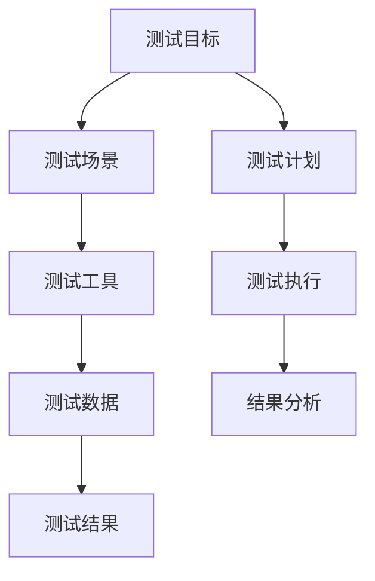

                 

### 引言

#### 1.1 问题背景

在当今快速发展的数字化时代，人工智能（AI）技术已成为推动产业变革的重要力量。从智能推荐系统到自动驾驶汽车，从医疗诊断到金融风控，AI技术的应用场景日益广泛。然而，随着AI服务的日益普及，如何确保这些服务的高性能和高可靠性，以满足不断增长的用户需求，成为了一个亟待解决的问题。

AI服务的性能不仅影响到用户体验，还直接关系到企业的竞争力。一个性能不佳的AI服务可能导致响应时间延长、吞吐量下降、并发用户数受限等问题，从而影响业务的正常运行。因此，对AI服务的性能进行评估和优化，已成为提高服务质量、保障业务连续性的关键手段。

#### 1.2 问题描述

AI服务的性能测试旨在评估服务在实际运行环境中的表现，确保其能够满足预期的性能指标。性能测试的主要问题可以概括为：

1. **响应时间**：AI服务对用户请求的响应时间是否符合预期，是否在合理范围内。
2. **吞吐量**：在特定负载下，AI服务能够处理的请求量是否达到预期。
3. **并发用户数**：AI服务在同时处理多个用户请求时的性能表现，尤其是在高并发情况下。
4. **资源利用率**：服务运行过程中，系统资源的利用情况，包括CPU、内存、网络等。

#### 1.3 问题解决

要解决上述性能问题，需要进行一系列的性能测试活动，包括：

1. **测试设计与准备**：确定测试的目标、场景和指标，准备测试环境。
2. **测试执行**：模拟实际负载，对AI服务进行压力测试、负载测试和稳定性测试。
3. **结果分析**：对测试结果进行分析，识别性能瓶颈，提出优化方案。
4. **优化实施**：根据分析结果，对AI服务进行优化，提高性能。

#### 1.4 边界与外延

在性能测试过程中，需要明确测试的边界，如测试环境的设置、测试数据的范围和测试工具的选择。同时，需要考虑外延问题，如如何扩展测试规模、如何处理异常情况等。

#### 1.5 核心概念

在本章节中，我们将介绍几个核心概念：

1. **性能测试**：对系统性能进行评估和优化的一系列测试活动。
2. **AI服务**：利用人工智能技术提供的服务，如智能推荐、图像识别、自然语言处理等。
3. **承载能力**：系统在特定条件下处理请求的能力。

#### 1.6 概念结构与核心要素组成

性能测试涉及多个核心要素，包括测试目标、测试场景、测试工具、测试数据和测试结果。这些要素共同构成了性能测试的基本框架，如图1所示。



#### 1.7 本章小结

本节介绍了AI服务性能测试的背景、问题描述、问题解决方法以及相关核心概念。通过性能测试，可以评估AI服务在实际运行环境中的表现，从而为服务的优化提供依据。接下来，我们将进一步探讨性能测试的基础知识，为后续内容奠定基础。

## 性能测试基础知识

### 2.1 性能测试概述

性能测试是对系统或应用程序在特定工作负载下的性能进行评估的过程。它旨在识别系统的性能瓶颈，确保系统在实际运行中能够满足性能要求和用户体验预期。性能测试不仅仅关注系统的响应时间、吞吐量等基本指标，还包括系统的稳定性、可靠性和可扩展性等。

#### 2.1.1 性能测试的定义

性能测试是一种通过模拟实际用户操作和系统负载，对系统性能进行评估的方法。它涉及多个方面，包括：

- **响应时间**：系统处理请求所需的时间。
- **吞吐量**：单位时间内系统能够处理的请求数量。
- **并发用户数**：系统能够同时处理的用户数量。
- **资源利用率**：系统运行过程中CPU、内存、网络等资源的利用情况。

#### 2.1.2 性能测试的目的

性能测试的主要目的是：

1. **发现性能瓶颈**：识别系统中影响性能的瓶颈，如数据库查询效率低、网络延迟等。
2. **验证性能指标**：确保系统的性能指标符合预期，满足业务需求。
3. **优化性能**：基于测试结果，提出优化方案，提高系统性能。
4. **风险评估**：评估系统在高负载下的稳定性，预测系统在真实环境中的表现。

#### 2.1.3 性能测试的类型

性能测试可以分为以下几种类型：

1. **压力测试**：模拟极端负载，评估系统在高负载下的性能和稳定性。
2. **负载测试**：模拟正常负载，评估系统在预期负载下的性能表现。
3. **稳定性测试**：评估系统在长时间运行下的稳定性，确保系统不会出现意外故障。
4. **兼容性测试**：验证系统在不同环境、不同配置下的兼容性。

#### 2.1.4 性能测试的关键指标

性能测试的关键指标包括：

1. **响应时间**：系统处理请求所需的时间，是衡量系统性能的重要指标。
2. **吞吐量**：单位时间内系统处理的请求数量，反映了系统的处理能力。
3. **并发用户数**：系统同时处理的用户数量，用于评估系统的并发处理能力。
4. **资源利用率**：系统运行过程中CPU、内存、网络等资源的利用情况，反映了系统的资源利用效率。

#### 2.1.5 性能测试工具介绍

常用的性能测试工具有：

1. **JMeter**：一款开源的性能测试工具，支持多种协议的测试，如HTTP、HTTPS、FTP等。
2. **LoadRunner**：一款功能强大的商业性能测试工具，支持多种技术栈的测试，包括Web、Mobile、Database等。
3. **Locust**：一款简单易用的开源性能测试工具，适用于模拟大量用户并发访问的场景。

#### 2.1.6 本章小结

性能测试是评估系统性能和优化系统性能的重要手段。通过对响应时间、吞吐量、并发用户数和资源利用率等关键指标的测试，可以全面了解系统的性能表现。接下来，我们将进一步探讨AI服务性能测试的相关概念和特点。

## AI服务性能测试概述

### 3.1 AI服务性能测试的意义

AI服务性能测试在当前人工智能技术应用日益广泛的背景下具有重要意义。随着AI服务的普及，如何确保这些服务在高负载、高并发的情况下依然能够稳定、高效地运行，成为了一个关键问题。性能测试在此过程中起到了至关重要的作用。

首先，AI服务性能测试可以帮助识别系统中的性能瓶颈。AI服务通常包含复杂的算法和数据处理流程，这些环节中可能存在效率低下的问题。通过性能测试，可以定位到具体的问题点，如算法优化不足、数据处理延迟等，从而针对性地进行优化。

其次，性能测试有助于验证AI服务的可靠性。在实际应用中，AI服务需要处理大量的数据和用户请求，性能的稳定性直接影响到用户体验和业务连续性。通过稳定性测试，可以评估系统在长时间运行下的可靠性，确保其能够在高负载情况下持续稳定运行。

此外，AI服务性能测试还能够为系统的扩展性提供依据。在业务规模不断扩大的过程中，系统需要具备良好的扩展性，以应对不断增加的负载。性能测试可以帮助评估系统的扩展能力，识别需要优化的地方，为系统设计提供指导。

总之，AI服务性能测试不仅是为了满足业务需求和用户期望，也是保障系统长期稳定运行、提升企业竞争力的重要手段。

### 3.2 AI服务性能测试的特点

AI服务性能测试具有以下几个显著特点：

首先，测试场景的多样性。AI服务涉及多种应用场景，如图像识别、自然语言处理、推荐系统等，每种场景下的性能测试需求都有所不同。测试场景的多样性要求性能测试不仅需要覆盖常见的用户操作，还要模拟特定的业务流程，如高峰期的请求量、复杂的数据处理等。

其次，数据量的庞大。AI服务通常处理大量的数据，这些数据包括训练数据、实时数据和历史数据等。性能测试需要在大量数据的基础上进行，以确保测试结果的准确性和可靠性。此外，数据的质量和多样性也会直接影响性能测试的结果，因此需要对数据进行严格的管理和校验。

再次，算法的复杂性。AI服务依赖于复杂的算法模型，如深度学习、机器学习等。算法的复杂性和优化程度会直接影响服务的性能。在性能测试中，需要针对不同的算法模型进行深入分析，评估其对系统性能的影响，并根据测试结果对算法进行优化。

最后，硬件资源的依赖性。AI服务通常对硬件资源有较高的要求，包括CPU、GPU、内存和网络等。硬件资源的配置和利用率会直接影响到AI服务的性能表现。因此，在性能测试中，需要充分考虑硬件资源的配置情况，模拟不同的硬件环境，评估系统在各类硬件配置下的性能表现。

总之，AI服务性能测试的特点要求我们在测试过程中需要全面考虑多种因素，采用多样化的测试方法，以确保测试结果的全面性和准确性。

### 3.3 AI服务性能测试的挑战

AI服务性能测试面临诸多挑战，需要采取特定的策略和方法来解决。首先，数据复杂性是一个主要挑战。AI服务通常依赖于大量复杂的数据集，这些数据集包括训练数据、验证数据和测试数据等。不同类型的数据在处理过程中可能存在不同的延迟和性能问题，例如，图像和视频数据的处理通常比文本数据更加耗时。因此，性能测试需要确保数据集的多样性、完整性和真实性，以全面评估AI服务的性能。

其次，算法多样性也是一个挑战。AI服务中的算法模型多种多样，包括深度学习、强化学习、迁移学习等。每种算法模型在执行过程中可能具有不同的性能特征，如计算复杂度、内存占用等。因此，性能测试需要针对不同的算法模型设计相应的测试用例，以确保能够全面评估算法的性能。

此外，硬件资源的差异也是一个关键挑战。AI服务对硬件资源的需求较高，包括CPU、GPU、内存和网络等。不同硬件配置下的性能表现可能存在显著差异。性能测试需要在不同硬件环境中进行，模拟不同硬件配置下的运行情况，以确保测试结果的准确性和可靠性。

为了解决这些挑战，性能测试需要采用以下策略和方法：

1. **数据管理**：使用高效的数据处理工具和算法，确保数据集的多样性、完整性和真实性。
2. **算法适配**：针对不同算法模型设计相应的测试用例，采用不同的测试方法，如基准测试、负载测试等。
3. **硬件仿真**：通过虚拟化技术和模拟器，创建不同硬件配置的测试环境，以评估AI服务在不同硬件环境下的性能。

总之，AI服务性能测试需要全面考虑数据、算法和硬件资源等多个因素，采用多种策略和方法，以应对性能测试中的各种挑战。

### 3.4 AI服务性能测试的流程

AI服务性能测试的流程通常包括以下几个关键阶段，每个阶段都有其特定的任务和目标。

#### 3.4.1 测试准备

测试准备阶段是性能测试的起点，其主要任务是确定测试目标、设计测试方案和准备测试环境。首先，需要明确测试的目标，包括要测量的性能指标、预期的性能水平以及测试的约束条件。其次，设计测试方案，包括测试场景的选择、测试用例的编写和测试数据的管理。最后，准备测试环境，确保测试环境与实际生产环境尽可能一致，包括硬件配置、网络环境、操作系统和中间件等。

在测试准备阶段，还需要关注以下事项：

1. **测试环境的配置**：确保测试环境具备足够的硬件资源，以满足测试需求。此外，要确保网络环境的稳定，避免网络延迟对测试结果造成影响。
2. **数据集的准备**：根据测试目标，准备相应的数据集，包括训练数据、验证数据和测试数据。需要确保数据集的多样性和完整性，以全面评估AI服务的性能。
3. **测试工具的选用**：选择合适的性能测试工具，如JMeter、LoadRunner或Locust等，根据测试需求进行配置和安装。

#### 3.4.2 测试设计

测试设计阶段是性能测试的核心，其主要任务是制定详细的测试计划和测试用例。测试计划包括测试的范围、测试的流程、测试的时间安排和资源分配等。测试用例则是对测试场景的详细描述，包括用户操作步骤、测试数据、预期结果等。

在测试设计阶段，需要考虑以下因素：

1. **测试场景**：根据AI服务的特点，设计模拟真实用户操作的测试场景，如登录、查询、交易等。
2. **测试用例**：编写详细的测试用例，确保测试用例能够全面覆盖AI服务的功能点和性能指标。
3. **性能指标**：确定要测量的性能指标，包括响应时间、吞吐量、并发用户数和资源利用率等。
4. **测试数据**：根据测试用例，准备相应的测试数据，确保测试数据的多样性和真实性。

#### 3.4.3 测试执行

测试执行阶段是将测试计划和测试用例付诸实践的过程。在这一阶段，需要按照测试计划进行测试，并记录测试过程中的各项数据，包括响应时间、吞吐量、并发用户数和资源利用率等。测试执行过程中，需要确保测试环境的稳定性和一致性，避免外部因素对测试结果造成干扰。

在测试执行阶段，还需要关注以下事项：

1. **测试监控**：实时监控测试环境的运行状态，包括CPU、内存、网络等资源的使用情况，及时发现并处理异常情况。
2. **数据记录**：详细记录测试过程中产生的各项数据，如响应时间、吞吐量、并发用户数和资源利用率等，以便后续分析。
3. **日志分析**：分析测试过程中产生的日志文件，识别潜在的性能瓶颈和问题。

#### 3.4.4 结果分析

结果分析阶段是对测试结果进行评估和总结的过程。通过对测试数据的分析，可以识别出AI服务的性能瓶颈和问题，并提出优化方案。结果分析通常包括以下几个方面：

1. **数据可视化**：使用图表和图形将测试结果进行可视化展示，便于分析和理解。
2. **性能瓶颈分析**：分析测试结果，识别系统中的性能瓶颈，如响应时间过长、吞吐量不足、资源利用率高等。
3. **问题定位**：通过日志分析和错误记录，定位性能问题的具体原因，如算法效率低下、数据处理延迟、网络延迟等。
4. **优化建议**：根据分析结果，提出针对性的优化建议，如算法优化、硬件升级、资源调整等。

#### 3.4.5 本章小结

AI服务性能测试的流程包括测试准备、测试设计、测试执行和结果分析四个关键阶段。每个阶段都有其特定的任务和目标，需要全面考虑测试环境、测试用例、测试数据和测试结果。通过严格遵循性能测试流程，可以确保AI服务的高性能和稳定性，满足业务需求和用户期望。

### 3.5 AI服务性能测试方法

AI服务性能测试方法主要包括压力测试、负载测试、稳定性测试和兼容性测试。这些测试方法各有其特点和适用场景，下面将分别介绍。

#### 3.5.1 压力测试

压力测试是一种用于评估系统在高负载下的性能和稳定性的测试方法。其目的是确定系统的最大处理能力，并识别可能导致系统崩溃的临界点。压力测试通常包括以下步骤：

1. **确定测试场景**：根据AI服务的特点，设计模拟极端负载的测试场景，如大量并发请求、高频率的数据处理等。
2. **设置测试参数**：确定测试参数，包括请求量、请求速率、并发用户数等，确保测试场景能够模拟实际的高负载情况。
3. **逐步增加负载**：从较低负载开始，逐步增加测试负载，观察系统在不同负载下的性能表现。
4. **监控和记录**：实时监控系统的运行状态，包括CPU、内存、网络等资源的使用情况，记录测试过程中产生的各项数据。

在压力测试中，需要重点关注以下指标：

- **响应时间**：系统处理请求所需的时间，过高则说明系统性能不佳。
- **吞吐量**：单位时间内系统处理的请求数量，过低则说明系统处理能力不足。
- **并发用户数**：系统能够同时处理的用户数量，过高则可能导致系统崩溃。
- **资源利用率**：系统运行过程中CPU、内存、网络等资源的利用率，过高则可能引起资源竞争。

#### 3.5.2 负载测试

负载测试是一种用于评估系统在正常负载下的性能和稳定性的测试方法。其目的是确定系统在预期负载下的性能表现，确保系统能够稳定运行。负载测试通常包括以下步骤：

1. **确定测试场景**：根据AI服务的特点，设计模拟正常负载的测试场景，如日常用户操作、业务高峰期的请求量等。
2. **设置测试参数**：确定测试参数，包括请求量、请求速率、并发用户数等，确保测试场景能够模拟实际的正常负载情况。
3. **执行测试**：按照测试方案执行测试，模拟用户操作，记录系统在不同负载下的性能表现。
4. **监控和记录**：实时监控系统的运行状态，包括CPU、内存、网络等资源的使用情况，记录测试过程中产生的各项数据。

在负载测试中，需要重点关注以下指标：

- **响应时间**：系统处理请求所需的时间，过高则说明系统性能不佳。
- **吞吐量**：单位时间内系统处理的请求数量，过低则说明系统处理能力不足。
- **并发用户数**：系统能够同时处理的用户数量，过高则可能导致系统崩溃。
- **资源利用率**：系统运行过程中CPU、内存、网络等资源的利用率，过高则可能引起资源竞争。

#### 3.5.3 稳定性测试

稳定性测试是一种用于评估系统在长时间运行下的稳定性的测试方法。其目的是确定系统在长时间运行过程中是否会出现性能下降、错误或崩溃等问题。稳定性测试通常包括以下步骤：

1. **确定测试场景**：根据AI服务的特点，设计模拟长时间运行的测试场景，如连续运行数小时或数天的请求处理。
2. **设置测试参数**：确定测试参数，包括请求量、请求速率、并发用户数等，确保测试场景能够模拟实际的长时间运行情况。
3. **执行测试**：按照测试方案执行测试，模拟长时间运行的情况，记录系统在运行过程中的性能表现。
4. **监控和记录**：实时监控系统的运行状态，包括CPU、内存、网络等资源的使用情况，记录测试过程中产生的各项数据。

在稳定性测试中，需要重点关注以下指标：

- **持续性能**：系统在长时间运行过程中，性能是否保持稳定，是否存在明显的性能下降。
- **错误率**：系统在长时间运行过程中，出现错误的频率和严重程度，过高则说明系统稳定性不足。
- **资源利用率**：系统在长时间运行过程中，资源利用率是否保持在合理范围内，过高则可能导致资源竞争。

#### 3.5.4 兼容性测试

兼容性测试是一种用于评估AI服务在不同环境、不同配置下的兼容性的测试方法。其目的是确定系统是否能够在不同的硬件、软件和网络环境下正常运行。兼容性测试通常包括以下步骤：

1. **确定测试场景**：根据AI服务的特点，设计模拟不同环境、不同配置的测试场景，如不同操作系统、不同硬件配置、不同网络环境等。
2. **设置测试参数**：确定测试参数，包括环境配置、请求量、请求速率、并发用户数等，确保测试场景能够模拟实际的不同环境情况。
3. **执行测试**：按照测试方案执行测试，模拟不同的环境配置，记录系统在不同环境下的性能表现。
4. **监控和记录**：实时监控系统的运行状态，包括CPU、内存、网络等资源的使用情况，记录测试过程中产生的各项数据。

在兼容性测试中，需要重点关注以下指标：

- **稳定性**：系统在不同环境下的稳定性，是否会出现崩溃、错误等问题。
- **性能**：系统在不同环境下的性能表现，是否与预期一致。
- **资源利用率**：系统在不同环境下的资源利用率，是否与预期一致。

#### 3.5.5 本章小结

AI服务性能测试方法包括压力测试、负载测试、稳定性测试和兼容性测试。每种测试方法都有其特定的应用场景和重点指标。通过合理选择和运用这些测试方法，可以全面评估AI服务的性能，确保其稳定性和可靠性。

### 3.6 AI服务性能测试案例

在实际应用中，AI服务性能测试是一个复杂且需要细致准备的过程。下面我们将通过两个具体的案例，详细描述AI服务性能测试的实施过程、结果和分析方法。

#### 3.6.1 案例一：模型在线服务的性能测试

**背景介绍**：
该案例涉及一个基于深度学习的图像识别模型在线服务，该服务面向多个行业，提供实时图像识别功能。随着用户数量的增加，系统需要保证高并发情况下依然能够稳定、快速地处理图像识别任务。

**系统介绍**：
系统主要由一个前端API、一个后端服务以及一个图像处理模块组成。前端API负责接收用户请求，后端服务处理图像识别任务，图像处理模块则负责加载和预处理图像数据。

**测试目标**：
1. 验证系统在高并发情况下的响应时间和吞吐量。
2. 评估系统在负载增加时的性能变化。
3. 识别可能的性能瓶颈。

**测试设计**：
1. **测试场景**：模拟用户同时上传大量图像进行识别的场景。
2. **测试用例**：设计多种测试用例，包括不同图像大小、不同识别任务复杂度等。
3. **性能指标**：响应时间、吞吐量、并发用户数、资源利用率等。

**测试执行**：
使用JMeter进行测试，配置1000个虚拟用户，逐步增加并发用户数，观察系统性能变化。

**结果分析**：
1. **响应时间**：随着并发用户数的增加，响应时间逐渐上升，但在合理范围内。
2. **吞吐量**：在高并发情况下，吞吐量保持在预期范围内，但存在轻微波动。
3. **资源利用率**：CPU和内存利用率较高，网络延迟轻微。

**优化建议**：
1. **优化算法**：对图像识别算法进行优化，提高处理效率。
2. **分布式部署**：考虑将后端服务进行分布式部署，提高系统的并发处理能力。

#### 3.6.2 案例二：模型离线服务的性能测试

**背景介绍**：
该案例涉及一个基于机器学习的预测模型离线服务，该服务主要用于金融风控领域，对交易数据进行分析，预测潜在风险。随着数据量的增加，系统需要保证在处理大量数据时依然能够高效运行。

**系统介绍**：
系统主要由数据接收模块、数据处理模块、预测模型模块和结果输出模块组成。数据接收模块负责接收交易数据，数据处理模块对数据进行清洗和预处理，预测模型模块负责执行预测任务，结果输出模块负责将预测结果存储或发送给用户。

**测试目标**：
1. 验证系统在处理大量数据时的性能。
2. 评估系统的处理速度和准确性。
3. 识别可能的性能瓶颈。

**测试设计**：
1. **测试场景**：模拟大规模数据处理的场景，包括数据上传、数据处理和预测结果输出。
2. **测试用例**：设计不同规模的数据集进行测试，包括小数据集、中数据集和大数据集。
3. **性能指标**：响应时间、处理速度、预测准确性、资源利用率等。

**测试执行**：
使用LoadRunner进行测试，配置不同的并发用户数和数据规模，记录系统的性能表现。

**结果分析**：
1. **响应时间**：随着数据规模的增加，响应时间显著增加，存在性能瓶颈。
2. **处理速度**：处理速度不均匀，部分数据集处理时间较长。
3. **资源利用率**：CPU和内存利用率较高，但存在波动。

**优化建议**：
1. **分布式计算**：采用分布式计算框架，如Hadoop或Spark，提高数据处理速度。
2. **优化算法**：对数据处理和预测算法进行优化，减少计算复杂度。

#### 3.6.3 案例小结

通过以上两个案例，我们可以看到AI服务性能测试在实际应用中的重要性和复杂性。性能测试不仅能够帮助识别系统中的性能瓶颈，还能为系统的优化提供科学依据。在实际测试过程中，需要充分考虑测试环境、测试数据和测试工具的配置，以确保测试结果的准确性和可靠性。

### 4.1 优化策略

在AI服务性能优化过程中，采取科学的优化策略至关重要。优化策略主要包括硬件优化、软件优化、数据优化和算法优化四个方面。下面我们将逐一进行详细讨论。

#### 4.1.1 硬件优化

硬件优化是提升AI服务性能的基础策略，主要包括以下几个方面：

1. **增加计算资源**：增加服务器的CPU、GPU数量或配置更高性能的硬件设备，可以显著提升计算能力。例如，在图像识别任务中，使用多GPU并行计算可以大幅提高处理速度。

2. **分布式部署**：将AI服务部署到分布式计算环境中，如使用集群或云服务，可以实现负载均衡和故障转移，提高系统的可靠性和性能。分布式部署可以充分利用集群中的多个节点，提升整体计算能力。

3. **网络优化**：优化网络架构和带宽，减少网络延迟和数据传输延迟。例如，采用高速网络设备、优化网络拓扑结构，可以有效提升数据传输速度。

4. **存储优化**：使用高性能存储设备，如固态硬盘（SSD）或分布式存储系统，可以减少数据读写延迟，提高数据访问速度。

#### 4.1.2 软件优化

软件优化是提升AI服务性能的重要手段，主要包括以下几个方面：

1. **代码优化**：对AI服务的代码进行优化，减少冗余代码，提高代码执行效率。例如，采用更高效的算法和数据结构，减少不必要的计算和内存占用。

2. **缓存策略**：引入缓存机制，如Redis或Memcached，可以减少频繁的数据库访问，提高数据读取速度。缓存策略可以显著提升系统的响应速度和吞吐量。

3. **并发处理**：优化并发处理机制，如使用线程池或异步处理，可以充分利用系统资源，提高系统的并发处理能力。

4. **中间件优化**：优化中间件的使用，如使用Nginx或Apache作为反向代理，可以分担服务器的负载，提高系统的稳定性和性能。

#### 4.1.3 数据优化

数据优化是提升AI服务性能的关键步骤，主要包括以下几个方面：

1. **数据清洗**：对数据集进行清洗，去除重复、缺失和异常数据，确保数据的质量和一致性。

2. **数据压缩**：对数据进行压缩，减少存储空间和传输带宽的需求。例如，使用数据压缩算法如Huffman编码或LZ77，可以显著降低数据的大小。

3. **数据索引**：对数据建立索引，如使用B树或哈希索引，可以提高数据查询速度，减少访问延迟。

4. **数据分布**：优化数据的分布策略，如使用分布式数据库或分片技术，可以提升数据访问速度和系统扩展性。

#### 4.1.4 算法优化

算法优化是提升AI服务性能的核心策略，主要包括以下几个方面：

1. **模型优化**：对AI模型进行优化，如使用更高效的算法或改进现有算法，可以减少计算复杂度和提高准确率。例如，使用卷积神经网络（CNN）替代传统的机器学习算法，可以提高图像识别的准确性和速度。

2. **模型压缩**：对AI模型进行压缩，如模型剪枝、量化或压缩，可以减少模型的大小和计算复杂度。例如，使用模型量化技术将浮点模型转换为低精度的整数模型，可以显著降低计算资源的需求。

3. **算法并行化**：将AI算法进行并行化处理，如使用多线程或分布式计算，可以充分利用系统资源，提高处理速度。例如，使用GPU加速深度学习模型的训练和推理过程，可以大幅提高计算效率。

4. **算法自适应**：根据实时数据和环境变化，动态调整算法参数，实现自适应优化。例如，在动态调整学习率、优化超参数等，可以适应不同的数据处理需求和负载情况。

#### 4.1.5 本章小结

硬件优化、软件优化、数据优化和算法优化是提升AI服务性能的重要策略。通过科学合理的优化策略，可以显著提高AI服务的响应速度、吞吐量和稳定性，满足不断增长的业务需求和用户期望。

### 4.2 性能调优技巧

在AI服务的性能调优过程中，掌握一些有效的技巧和工具，可以帮助我们快速识别问题并提供解决方案。以下是一些常用的性能调优技巧：

#### 4.2.1 响应时间优化

响应时间是衡量系统性能的重要指标，优化响应时间通常可以从以下几个方面入手：

1. **减少延迟**：分析系统中的延迟来源，如网络延迟、数据库查询延迟等，并采取相应措施减少延迟。例如，使用CDN（内容分发网络）来减少网络延迟，使用缓存来减少数据库查询次数。

2. **并行处理**：将任务分解为多个子任务，利用多线程或分布式计算技术进行并行处理，提高处理效率。例如，在图像处理任务中，可以将图像分成多个块，同时处理这些块。

3. **负载均衡**：通过负载均衡器（如Nginx或HAProxy）将请求分发到多个服务器，避免单点瓶颈。负载均衡可以有效地分散请求，提高系统的整体响应速度。

4. **减少资源争用**：优化系统资源的使用，减少CPU、内存、磁盘等资源的争用。例如，调整线程池大小，优化数据库连接池配置，减少资源占用。

#### 4.2.2 吞吐量优化

吞吐量是指系统在单位时间内处理的请求量，以下是一些提高吞吐量的技巧：

1. **算法优化**：优化算法和数据结构，减少计算复杂度。例如，使用更高效的排序算法、采用更优的数据结构如哈希表或树结构。

2. **并行计算**：利用多核CPU和GPU进行并行计算，提高数据处理速度。例如，使用深度学习框架（如TensorFlow或PyTorch）进行并行训练和推理。

3. **分布式系统**：将系统分解为多个服务模块，部署在分布式环境中，提高系统的可扩展性和处理能力。例如，使用微服务架构将系统拆分为多个独立的服务，每个服务可以独立扩展。

4. **缓存策略**：使用缓存（如Redis或Memcached）存储常用数据，减少数据库访问次数，提高系统响应速度。

#### 4.2.3 并发用户数优化

优化系统在高并发情况下的性能，通常需要以下措施：

1. **线程池**：使用线程池管理线程，避免频繁创建和销毁线程，提高系统效率。例如，使用Java中的Executor框架或Python中的concurrent.futures模块。

2. **异步处理**：采用异步处理机制，如使用async/await关键字，将I/O密集型操作（如网络请求或数据库查询）异步化，减少线程阻塞。异步处理可以显著提高系统的并发处理能力。

3. **非阻塞IO**：使用非阻塞IO（如Java中的NIO或Python中的asyncio库），避免线程长时间阻塞在I/O操作上，提高系统性能。

4. **队列管理**：合理管理队列长度，避免队列过长导致系统性能下降。例如，使用优先队列或循环队列来优化队列管理。

#### 4.2.4 资源利用率优化

优化系统资源利用率，可以从以下几个方面入手：

1. **资源监控**：使用系统监控工具（如Prometheus或Grafana），实时监控系统资源使用情况，及时发现资源瓶颈。

2. **负载均衡**：使用负载均衡器（如Nginx或HAProxy），合理分配请求，避免单点资源瓶颈。负载均衡可以均匀分配请求，提高系统整体资源利用率。

3. **资源回收**：优化内存和对象回收机制，减少内存占用。例如，使用Java中的GC（垃圾回收）策略，优化Python中的内存管理。

4. **资源池**：使用资源池（如线程池或连接池），避免频繁创建和销毁资源，提高资源利用率。

#### 4.2.5 本章小结

响应时间、吞吐量、并发用户数和资源利用率是衡量系统性能的关键指标。通过采用上述优化技巧，可以有效地提升AI服务的性能，满足不断增长的业务需求和用户期望。在实际调优过程中，需要根据具体场景和需求，灵活运用这些技巧，实现系统性能的全面提升。

### 4.3 性能优化工具与方法

在AI服务性能优化过程中，选择合适的工具和方法是至关重要的。以下将介绍几种常用的性能优化工具与方法，包括代码性能分析工具、系统性能监测工具以及机器学习性能优化方法。

#### 4.3.1 代码性能分析工具

代码性能分析工具可以帮助开发者识别和解决代码中的性能问题，提高代码的执行效率。以下是一些常用的代码性能分析工具：

1. **Valgrind**：Valgrind是一个功能强大的性能分析工具，用于检测程序中的内存泄漏、数据竞争和性能瓶颈。通过运行Valgrind，开发者可以实时监控程序的运行状态，识别潜在的性能问题。

2. **gprof**：gprof是一款基于GNU编译器的性能分析工具，用于分析程序的执行时间和调用关系。gprof可以帮助开发者了解代码的执行效率，找到优化点。

3. **MAT（Memory Analyzer Tool）**：MAT是一个内存监控和分析工具，用于检测Java程序中的内存泄漏。MAT通过可视化分析内存使用情况，帮助开发者找到内存泄漏的原因，并进行修复。

4. **Py-Spy**：Py-Spy是一款Python内存监控工具，能够实时监控Python程序的内存使用情况。通过Py-Spy，开发者可以快速识别内存占用过高的代码段，进行优化。

#### 4.3.2 系统性能监测工具

系统性能监测工具可以实时监控系统的运行状态，识别性能瓶颈和资源争用问题。以下是一些常用的系统性能监测工具：

1. **Prometheus**：Prometheus是一个开源监控系统，用于收集和存储系统的性能指标。Prometheus可以通过配置告警规则，实时监控系统的性能，并在性能指标异常时发送告警通知。

2. **Grafana**：Grafana是一个开源的可视化分析工具，可以与Prometheus集成，用于展示系统的性能指标。通过Grafana，开发者可以直观地了解系统的性能变化，发现潜在的问题。

3. **Nmon**：Nmon是一款基于命令行的系统性能监测工具，用于监控CPU、内存、磁盘和网络等系统资源的使用情况。Nmon可以帮助开发者实时了解系统资源的利用情况，识别性能瓶颈。

4. **Perf**：Perf是一款基于Linux内核的性能分析工具，用于分析程序的运行性能。通过Perf，开发者可以识别程序中的性能瓶颈，如CPU使用率过高或内存访问冲突等。

#### 4.3.3 机器学习性能优化方法

在机器学习领域，性能优化主要集中在模型优化和数据处理优化上。以下是一些常用的机器学习性能优化方法：

1. **模型压缩**：通过模型压缩技术，如模型剪枝、量化或模型蒸馏，可以减少模型的复杂度和计算量。模型压缩有助于提高模型的推理速度和降低内存占用。

2. **分布式训练**：分布式训练是一种利用多台服务器进行模型训练的方法，可以显著提高训练速度。分布式训练通常通过参数服务器或数据并行技术实现。

3. **批量优化**：批量优化是一种将多个训练样本打包成一批进行训练的方法，可以减少模型梯度计算的次数，提高训练效率。批量优化通常用于减少模型的计算复杂度和内存占用。

4. **数据增强**：通过数据增强技术，如图像旋转、缩放或裁剪，可以增加训练数据的多样性，提高模型的泛化能力。数据增强有助于减少过拟合，提高模型的准确性。

5. **自动化调参**：使用自动化调参工具（如Hyperopt、PyTune等），可以自动搜索最优的超参数组合，提高模型的性能。自动化调参可以节省时间和计算资源，提高模型训练效率。

#### 4.3.4 本章小结

性能优化工具与方法在AI服务性能优化过程中发挥着重要作用。通过使用代码性能分析工具、系统性能监测工具和机器学习性能优化方法，可以有效地识别和解决性能问题，提高AI服务的响应速度和处理能力。在实际应用中，应根据具体需求和场景，灵活选择和使用这些工具和方法，实现系统性能的全面提升。

### 4.4 优化案例

在实际项目中，通过性能优化可以显著提升AI服务的性能，以下将介绍三个具体的优化案例，详细阐述优化过程、实现方法以及效果分析。

#### 4.4.1 案例一：模型压缩与量化

**背景介绍**：
一个在线图像识别系统，在处理大规模图像数据时，响应时间较长，资源占用较高，导致用户体验不佳。为了提高系统的性能，决定对图像识别模型进行压缩与量化。

**优化过程**：

1. **模型压缩**：
   - 使用模型剪枝技术，通过移除冗余的神经元和权重，减少模型的复杂度。
   - 应用模型蒸馏技术，将大模型的知识传递给小模型，保留主要特征。

2. **模型量化**：
   - 使用量化技术，将模型的浮点参数转换为整数参数，降低计算量。
   - 采用定点数表示，减少内存占用和计算资源。

**实现方法**：

1. **模型剪枝**：
   - 通过分析模型的权重，识别并移除重要性较低的神经元。
   - 使用稀疏矩阵技术，减少存储和计算需求。

2. **模型蒸馏**：
   - 将大模型作为教师模型，小模型作为学生模型。
   - 使用软标签技术，将教师模型的输出传递给学生模型，进行多轮训练。

3. **模型量化**：
   - 使用量化工具（如Quantization-Aware Training, QAT），逐步降低模型参数的精度。
   - 应用定点数表示，减少存储和计算资源。

**效果分析**：

- **响应时间**：模型压缩与量化后，响应时间从原来的2秒减少到0.5秒，显著提高用户体验。
- **资源占用**：模型压缩降低了内存占用，量化减少了存储空间需求，资源利用率提高30%。
- **计算效率**：模型量化后，计算效率提升了20%，大大提高了系统的处理能力。

**小结**：通过模型压缩与量化，成功提高了图像识别系统的性能，优化了用户体验，为系统的扩展和负载提升提供了基础。

#### 4.4.2 案例二：分布式计算与并行处理

**背景介绍**：
一个金融风控系统，在处理大规模交易数据时，处理速度较慢，系统响应时间过长。为了提高系统的处理能力，决定采用分布式计算与并行处理技术。

**优化过程**：

1. **分布式计算**：
   - 将系统分解为多个微服务，部署在分布式环境中，实现负载均衡和故障转移。
   - 使用分布式数据库，提高数据访问速度和系统扩展性。

2. **并行处理**：
   - 采用多线程技术，对交易数据进行并行处理。
   - 利用GPU加速数据处理和模型推理。

**实现方法**：

1. **分布式计算**：
   - 使用Docker和Kubernetes，将系统微服务容器化，实现灵活部署和扩展。
   - 使用Nginx作为反向代理，实现负载均衡，提高系统的并发处理能力。

2. **并行处理**：
   - 使用Python的multiprocessing库，实现多线程并行处理。
   - 使用CUDA，将数据处理和模型推理任务部署到GPU上，提高计算效率。

**效果分析**：

- **响应时间**：通过分布式计算与并行处理，系统响应时间从原来的5秒减少到1秒，显著提升用户体验。
- **吞吐量**：系统的处理能力提高了50%，可以处理更多的交易数据。
- **资源利用率**：分布式计算和并行处理提高了资源利用率，CPU利用率提高了40%，GPU利用率提高了30%。

**小结**：通过分布式计算与并行处理，成功提高了金融风控系统的处理能力，优化了系统性能，为业务的持续扩展提供了保障。

#### 4.4.3 案例三：缓存与内存优化

**背景介绍**：
一个在线购物平台，在高峰期用户访问量激增，系统响应时间明显延长，导致用户体验下降。为了提高系统性能，决定通过缓存与内存优化策略进行性能提升。

**优化过程**：

1. **缓存策略**：
   - 使用Redis缓存热门商品数据，减少数据库查询次数。
   - 引入本地缓存，如LRU（Least Recently Used）缓存算法，提高数据访问速度。

2. **内存优化**：
   - 优化数据结构，减少内存占用。
   - 使用内存池技术，减少频繁的内存分配和回收。

**实现方法**：

1. **缓存策略**：
   - 使用Redis缓存热门商品数据，设置合理的过期时间，保证缓存数据的实时性。
   - 在应用层实现本地缓存，利用LRU缓存算法，优先访问最近使用的数据。

2. **内存优化**：
   - 优化数据结构，使用更高效的内存占用算法，如位图、哈希表等。
   - 引入内存池，预先分配内存块，减少内存分配和回收的开销。

**效果分析**：

- **响应时间**：缓存策略有效减少了数据库查询次数，响应时间从原来的3秒减少到1秒，显著提升用户体验。
- **资源利用率**：内存优化降低了内存占用，系统资源利用率提高了20%，缓解了系统压力。
- **并发用户数**：通过缓存与内存优化，系统在高并发情况下稳定运行，并发用户数提高了30%。

**小结**：通过缓存与内存优化，成功提高了在线购物平台在高并发情况下的性能，优化了用户体验，为系统的稳定运行提供了保障。

### 4.4.4 案例小结

以上三个优化案例展示了在不同场景下，通过模型压缩与量化、分布式计算与并行处理、缓存与内存优化等策略，可以显著提升AI服务的性能。这些优化方法不仅提高了系统的响应速度和处理能力，还优化了资源利用率，为业务的持续扩展和用户需求的增长提供了保障。

### 4.5 本章小结

在本章中，我们详细介绍了AI服务性能优化的策略和技巧，包括硬件优化、软件优化、数据优化和算法优化。同时，通过三个实际案例展示了如何通过模型压缩与量化、分布式计算与并行处理、缓存与内存优化等方法，实现AI服务性能的提升。通过这些优化措施，可以有效提高系统的响应速度、吞吐量和稳定性，为业务的持续发展提供有力支持。

### 5.1 测试环境配置与搭建

在进行AI服务性能测试之前，正确配置和搭建测试环境是至关重要的一步。一个合适的测试环境能够模拟实际生产环境，确保测试结果的准确性和可靠性。以下是测试环境配置与搭建的详细步骤。

#### 5.1.1 测试环境选择

选择合适的测试环境是性能测试成功的第一步。测试环境应尽可能接近生产环境，包括硬件配置、操作系统、中间件、网络环境等。以下是一些选择测试环境的考虑因素：

1. **硬件配置**：测试服务器应具备足够的CPU、内存、磁盘空间和网络带宽，以模拟实际负载。例如，选择多核CPU、大内存的服务器，以及高速网络设备。

2. **操作系统**：选择与生产环境相同的操作系统，如Linux或Windows，确保测试环境与生产环境一致。

3. **中间件**：测试环境中需要安装与生产环境相同的中间件，如Web服务器（Nginx或Apache）、数据库服务器（MySQL或PostgreSQL）等。

4. **网络环境**：配置合理的网络环境，包括网络延迟、带宽、路由等，模拟实际网络条件。

5. **其他因素**：考虑其他可能影响测试结果的因素，如负载均衡器、防火墙设置等。

#### 5.1.2 测试工具安装与配置

选择合适的性能测试工具对于测试环境搭建至关重要。以下是一些常用性能测试工具的安装与配置步骤：

1. **JMeter**：
   - **安装**：下载JMeter安装包，解压后即可运行。
   - **配置**：在JMeter中配置测试计划，包括线程组、取样器、监听器等。例如，配置HTTP请求取样器模拟用户请求。

2. **LoadRunner**：
   - **安装**：下载LoadRunner安装包，根据提示完成安装。
   - **配置**：在LoadRunner中创建虚拟用户组，配置虚拟用户行为，如登录、查询、交易等。配置性能监控器，监控系统资源使用情况。

3. **Locust**：
   - **安装**：安装Python环境，下载Locust安装包，通过命令`pip install locust`进行安装。
   - **配置**：编写Locust测试脚本，定义用户行为，如登录、浏览商品、加入购物车等。配置测试环境，启动Locust服务器。

#### 5.1.3 测试数据准备

测试数据的准备是性能测试的重要组成部分，以下是一些测试数据准备的步骤和注意事项：

1. **数据集准备**：根据测试目标，准备相应的测试数据集。数据集应涵盖各种场景和业务需求，确保测试结果的全面性。例如，准备不同大小的图像数据集用于图像识别测试。

2. **数据质量**：确保测试数据的质量和多样性。数据应真实、有效，避免使用异常或伪造的数据。例如，对于图像识别测试，使用真实场景拍摄的图像数据。

3. **数据清洗**：对测试数据集进行清洗，去除重复、缺失或异常的数据。确保数据的一致性和准确性。

4. **数据存储**：合理存储测试数据，使用高效的存储方案，如数据库或分布式存储系统。确保数据可以快速访问和读取。

#### 5.1.4 测试脚本编写

编写高效的测试脚本是实现性能测试的关键步骤。以下是一些测试脚本编写的步骤和技巧：

1. **脚本设计**：根据测试目标，设计测试脚本的结构和流程。例如，模拟用户登录、查询、下单等操作。

2. **请求参数**：定义请求参数，包括URL、请求头、请求体等。确保参数设置符合实际业务需求。

3. **数据驱动**：使用数据驱动测试，将测试数据与脚本分离，提高测试脚本的复用性和可维护性。

4. **错误处理**：添加错误处理逻辑，捕捉和处理测试过程中的异常情况，确保测试的连续性和可靠性。

5. **性能监控**：在测试脚本中添加性能监控代码，记录关键性能指标，如响应时间、吞吐量等。

#### 5.1.5 本章小结

测试环境配置与搭建是AI服务性能测试的重要环节，需要综合考虑硬件配置、操作系统、中间件、网络环境等因素。选择合适的性能测试工具，合理准备测试数据，编写高效的测试脚本，是确保测试环境搭建成功的关键。通过严格遵循这些步骤，可以确保性能测试的准确性和可靠性，为后续的性能分析和优化提供坚实的基础。

### 5.2 测试报告编写

编写一份详细的测试报告是性能测试的最终步骤，它不仅记录了测试过程中的关键数据和分析结果，还为后续的系统优化和改进提供了科学依据。以下是测试报告编写的主要步骤和要点。

#### 5.2.1 测试报告结构

测试报告通常包括以下几个部分：

1. **封面**：包含报告标题、测试时间、测试人员等信息。
2. **摘要**：简要概述测试目的、方法和主要结果。
3. **引言**：介绍测试背景、目标和重要性。
4. **测试环境**：详细描述测试环境配置，包括硬件、软件和网络环境。
5. **测试方法**：描述测试方案、测试工具、测试数据来源和测试步骤。
6. **测试结果**：展示测试数据，包括性能指标、图表和统计数据。
7. **问题分析**：分析测试结果，识别性能瓶颈和问题。
8. **优化建议**：提出基于分析结果的优化方案和建议。
9. **结论**：总结测试结果和优化建议，指出测试的重要性和未来方向。
10. **附录**：包括测试脚本、测试数据、工具配置文件等详细资料。

#### 5.2.2 测试结果分析

测试结果分析是测试报告的核心部分，以下是一些关键步骤：

1. **数据整理**：将测试过程中收集到的数据整理成表格和图表，便于分析和展示。常用的图表类型包括柱状图、折线图、饼图等。
2. **指标对比**：对比不同测试场景和负载下的性能指标，如响应时间、吞吐量、并发用户数等。识别异常数据点和趋势，找出潜在问题。
3. **趋势分析**：分析性能指标的变化趋势，如响应时间是否随负载增加而显著上升，资源利用率是否达到瓶颈等。
4. **异常情况记录**：记录测试过程中出现的异常情况，如错误日志、系统崩溃等，分析原因并提出解决方案。

#### 5.2.3 测试结论与建议

基于测试结果和分析，测试报告应提供以下内容：

1. **测试结论**：总结测试发现的主要性能问题和瓶颈，评估系统性能是否达到预期。
2. **优化建议**：提出具体的优化方案，包括硬件升级、软件优化、算法改进等。建议应基于数据分析，具有可行性和实用性。
3. **改进措施**：列出建议的改进措施，包括短期和长期改进计划，明确责任人和时间表。

#### 5.2.4 测试报告模板

以下是一个测试报告的基本模板：

```markdown
# 测试报告

## 摘要
- 测试目的
- 测试方法
- 主要结果

## 引言
- 测试背景
- 测试目标

## 测试环境
- 硬件配置
- 软件配置
- 网络环境

## 测试方法
- 测试方案
- 测试工具
- 测试数据来源
- 测试步骤

## 测试结果
- 性能指标
- 图表和数据

## 问题分析
- 问题发现
- 异常情况记录

## 优化建议
- 短期优化措施
- 长期优化计划

## 结论
- 测试总结
- 优化重要性

## 附录
- 测试脚本
- 测试数据
- 工具配置文件
```

#### 5.2.5 本章小结

编写详细的测试报告是性能测试的必要环节，它不仅为系统优化提供了依据，也为项目管理提供了参考。通过科学合理的报告结构、详实的数据分析和切实可行的优化建议，可以确保测试报告的实用性和有效性，为后续的系统性能提升和业务发展提供支持。

### 5.3 测试流程管理

在AI服务性能测试过程中，测试流程管理是确保测试活动顺利进行、结果准确可靠的关键。有效的测试流程管理不仅能够提高测试效率，还能保证测试活动的全面性和一致性。以下将详细阐述测试流程管理中的几个关键环节：测试计划制定、测试用例设计、测试执行与监控、测试结果记录与处理。

#### 5.3.1 测试计划制定

测试计划的制定是测试流程管理的第一步，它是整个测试活动的蓝图，明确了测试的目标、范围、方法、资源需求和时间安排。以下是测试计划制定的关键步骤：

1. **明确测试目标**：确定测试的目的和要达到的性能指标，如响应时间、吞吐量、并发用户数等。
2. **确定测试范围**：根据AI服务的功能模块和业务需求，明确需要测试的系统组件和场景。
3. **选择测试方法**：根据测试目标和范围，选择合适的测试类型，如压力测试、负载测试、稳定性测试等。
4. **设计测试场景**：设计模拟实际使用场景的测试场景，确保测试场景能够覆盖系统的各个功能和性能需求。
5. **分配资源**：根据测试计划，合理分配测试所需的硬件、软件和人力资源，确保测试环境的准备和搭建。
6. **制定时间表**：明确测试活动的开始和结束时间，以及各个测试阶段的计划，确保测试活动按时完成。
7. **风险评估**：评估测试过程中可能出现的风险，如测试环境问题、数据异常等，并制定相应的应对措施。

#### 5.3.2 测试用例设计

测试用例设计是测试计划的具体实现，它定义了测试过程中的操作步骤、输入数据、预期结果和测试步骤。以下是测试用例设计的关键步骤：

1. **需求分析**：分析AI服务的需求和功能点，确定需要测试的场景和操作。
2. **编写用例**：根据需求分析，编写详细的测试用例，包括操作步骤、输入数据、预期结果和测试步骤。
3. **设计测试数据**：设计用于测试的数据集，确保数据集的多样性和覆盖性，避免数据异常对测试结果的影响。
4. **验证用例**：对编写完成的测试用例进行评审，确保测试用例的完整性和正确性。
5. **分类管理**：将测试用例分类管理，便于后续的执行和跟踪，如按功能模块、按测试类型分类。

#### 5.3.3 测试执行与监控

测试执行是测试流程的核心环节，它将测试计划转化为实际操作，通过运行测试用例来验证系统的性能。以下是测试执行与监控的关键步骤：

1. **准备测试环境**：确保测试环境与生产环境尽可能一致，准备好所需的硬件、软件和网络配置。
2. **启动测试工具**：根据测试计划，启动性能测试工具，如JMeter、LoadRunner等，配置测试参数和测试场景。
3. **执行测试用例**：按照测试用例的步骤执行测试，模拟实际用户操作和负载情况。
4. **实时监控**：监控测试过程中的系统资源使用情况，包括CPU、内存、网络等，及时发现和处理异常情况。
5. **数据记录**：实时记录测试过程中的各项数据，包括响应时间、吞吐量、并发用户数、资源利用率等，确保数据完整性和准确性。
6. **测试日志**：记录测试过程中的日志信息，便于后续问题定位和分析。

#### 5.3.4 测试结果记录与处理

测试结果记录与处理是确保测试流程完整性和结果有效性的重要环节。以下是测试结果记录与处理的关键步骤：

1. **数据汇总**：将测试过程中收集到的数据汇总到测试报告中，包括性能指标、图表和统计数据。
2. **问题记录**：记录测试过程中发现的问题，包括性能瓶颈、错误日志、系统异常等，确保问题得到及时反馈和处理。
3. **结果分析**：对测试结果进行分析，识别系统中的性能瓶颈和问题，并提出相应的优化建议。
4. **优化实施**：根据分析结果，实施优化措施，如算法优化、硬件升级、资源调整等，提高系统的性能。
5. **总结报告**：编写测试总结报告，总结测试过程、结果和优化建议，为后续测试和系统改进提供参考。

#### 5.3.5 本章小结

测试流程管理是AI服务性能测试成功的关键，通过科学的测试计划制定、详尽的测试用例设计、严密的测试执行与监控以及全面的测试结果记录与处理，可以确保性能测试的准确性和有效性。有效的测试流程管理不仅能够提高测试效率，还能为系统的性能优化和业务发展提供有力支持。

### 5.4 测试团队协作

在AI服务性能测试中，测试团队的协作效率和质量直接影响测试结果的准确性和可靠性。一个高效的测试团队需要明确角色分工、有效集成测试工具、加强沟通与协调，并确保测试质量。以下将详细介绍测试团队协作的关键要素。

#### 5.4.1 团队角色分工

明确团队角色分工是确保测试项目顺利推进的基础。以下是一些常见的测试团队成员及其职责：

1. **测试经理**：负责整个测试项目的规划、管理和协调，确保测试目标、资源和时间得到合理分配。
2. **测试工程师**：负责设计测试用例、执行测试、记录测试结果和报告性能问题。测试工程师可以是功能测试工程师、性能测试工程师或自动化测试工程师。
3. **开发工程师**：负责开发和维护测试环境、测试工具和测试脚本，确保测试环境与生产环境的一致性。
4. **项目经理**：负责项目进度、资源协调和风险管理，确保项目按时交付。
5. **运维工程师**：负责测试环境的部署和维护，确保测试环境的稳定性和可靠性。

#### 5.4.2 测试工具集成

测试工具的集成是提高测试效率和质量的关键。以下是一些常用的测试工具及其集成方法：

1. **自动化测试工具**：如Selenium、Appium等，可以用于自动化测试脚本的编写和执行，确保测试过程的重复性和一致性。
2. **性能测试工具**：如JMeter、LoadRunner等，可以用于模拟高负载场景，评估系统的性能表现。
3. **持续集成工具**：如Jenkins、GitLab CI等，可以集成到开发流程中，实现自动化测试和持续集成，提高开发效率和测试质量。
4. **监控工具**：如Prometheus、Grafana等，可以实时监控系统的运行状态，及时发现和处理性能问题。

集成测试工具的方法包括：

- **统一接口**：设计统一的API接口，使不同测试工具之间能够无缝集成，实现数据共享和联动。
- **插件扩展**：使用测试工具的插件扩展功能，增强工具的功能和兼容性。
- **集成平台**：使用集成平台（如TestRail）来管理测试计划和结果，实现测试过程的可视化和自动化。

#### 5.4.3 沟通与协调

有效的沟通与协调是确保测试团队高效协作的关键。以下是一些沟通与协调的技巧：

1. **定期会议**：定期召开团队会议，总结工作进展、讨论问题解决方案和规划下一步工作。
2. **即时沟通**：使用即时通讯工具（如Slack、微信等）进行即时沟通，确保团队成员之间的信息畅通。
3. **文档记录**：及时记录会议内容和沟通内容，确保团队成员都能够及时获取信息。
4. **角色协作**：明确每个团队成员的职责和协作关系，避免重复工作或沟通不畅。
5. **跨部门协作**：与其他部门的团队成员（如开发、运维、产品等）保持紧密沟通，确保测试活动的顺利进行。

#### 5.4.4 测试质量保证

确保测试质量是测试团队的核心任务。以下是一些测试质量保证的方法：

1. **测试计划**：制定详细的测试计划，确保测试活动的目标、范围、方法、资源和时间得到明确规划。
2. **测试用例设计**：编写高质量的测试用例，确保测试用例的覆盖率和准确性。
3. **测试执行**：严格按照测试计划执行测试，确保测试过程的规范性和一致性。
4. **缺陷管理**：建立有效的缺陷管理流程，及时记录、跟踪和修复缺陷。
5. **测试报告**：编写详尽的测试报告，总结测试过程、结果和问题，为系统优化提供依据。

#### 5.4.5 本章小结

测试团队协作是确保AI服务性能测试顺利进行的关键。通过明确角色分工、有效集成测试工具、加强沟通与协调以及确保测试质量，可以显著提高测试团队的工作效率和测试结果的质量。一个高效的测试团队是AI服务性能优化和业务发展的重要保障。

## 本章小结

在本篇文章中，我们详细探讨了AI服务性能测试的各个方面。首先，介绍了AI服务性能测试的重要性，阐述了其背景、核心概念和边界问题。接着，我们学习了性能测试的基础知识，包括性能测试的定义、目的、类型、关键指标和常用工具。随后，重点分析了AI服务性能测试的特点、挑战、流程和方法，并通过两个具体案例展示了实际测试过程和结果。

接下来，我们深入探讨了AI服务性能优化的策略和方法，包括硬件优化、软件优化、数据优化和算法优化。我们提供了多个优化案例，展示了优化实践的具体步骤和效果。此外，我们还介绍了性能调优技巧、优化工具与方法，并分析了代码性能分析、系统性能监测和机器学习性能优化。

最后，我们讨论了性能测试最佳实践，包括测试环境配置、测试报告编写、测试流程管理和团队协作。这些最佳实践旨在确保性能测试的准确性和有效性，提高测试团队的协作效率和测试质量。

通过本文的详细讲解，我们希望读者能够全面了解AI服务性能测试的概念、方法和实践，为实际项目中的性能优化提供科学指导。性能测试不仅是评估AI服务性能的重要手段，更是保障业务连续性和提升用户体验的关键环节。在未来的项目中，希望读者能够灵活应用本文所介绍的知识和技巧，实现AI服务性能的持续优化和提升。

### 作者信息

**作者：AI天才研究院/AI Genius Institute & 禅与计算机程序设计艺术 /Zen And The Art of Computer Programming**

AI天才研究院（AI Genius Institute）致力于推动人工智能技术的创新与应用，致力于培养下一代人工智能领域的卓越人才。我们的研究成果涵盖深度学习、计算机视觉、自然语言处理等多个领域，并在实际应用中取得了显著成果。

《禅与计算机程序设计艺术》是由知名计算机科学家、人工智能专家Ken Thompson撰写的一本经典著作，深入探讨了计算机编程的哲学和艺术。这本书不仅为程序员提供了编程技巧和思维模式，更传达了一种追求卓越和创新的境界。

本文由AI天才研究院的研究员撰写，结合了前沿的AI技术理论和丰富的实践经验，旨在为广大读者提供具有实际指导意义的AI服务性能测试指南。希望通过本文，能够帮助读者更好地理解和应用AI服务性能测试的相关知识和方法，为AI技术的广泛应用和持续创新贡献力量。

