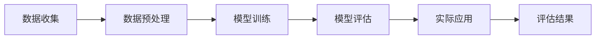
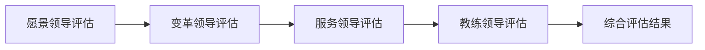
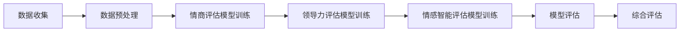
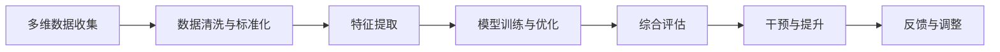
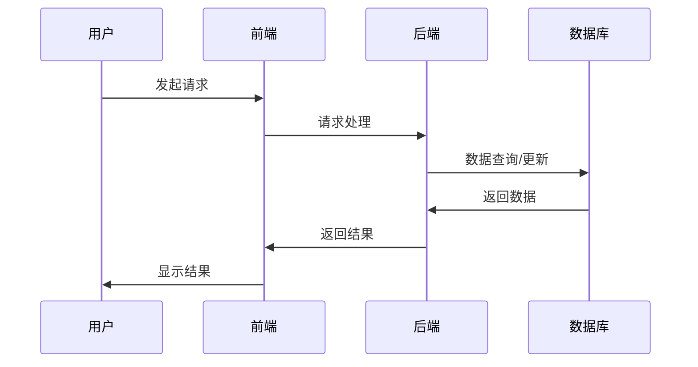
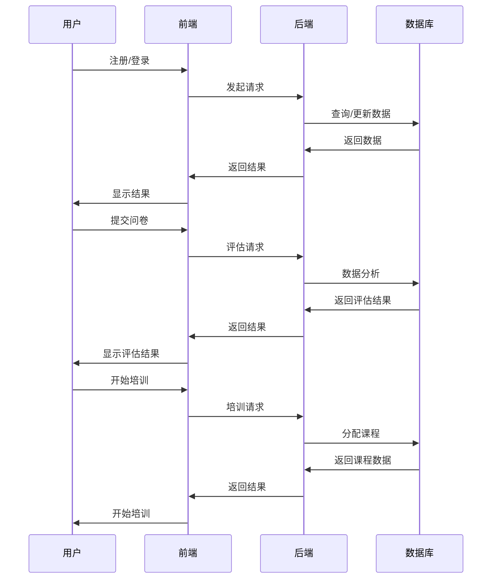

                 

## 第一章：情商领导力与情感智能背景

### 1.1 情商领导力的定义

情商领导力（Emotional Intelligence Leadership）是一种融合了情商（Emotional Intelligence，简称EQ）与领导力的新型领导方式。它不仅要求领导者具备传统领导力所强调的战略规划、组织管理、决策能力等硬技能，更强调领导者具备高水平的情商，包括自我意识、自我管理、社会意识和关系管理等方面。

情商，由心理学家丹尼尔·戈尔曼（Daniel Goleman）提出，是指个体识别、理解、表达、控制和利用自身情感信息的能力。情商的五个主要维度包括：

- 自我意识（Self-awareness）：了解自己的情绪、情绪来源以及它们对行为的影响。
- 自我管理（Self-regulation）：控制自己的情绪，避免冲动行为，适应变化。
- 社会意识（Social awareness）：识别并理解他人的情绪，关注他人的需求和感受。
- 关系管理（Relationship management）：与他人建立和维护良好的关系，有效沟通和合作。

领导力，则是指影响和引导他人达成共同目标的能力。传统的领导力主要侧重于任务执行、目标管理和组织结构等方面。然而，在复杂多变的社会环境中，单纯的任务驱动型领导力已难以应对日益复杂的组织需求和团队挑战。情商领导力强调领导者通过提升情商来增强自身的影响力，实现团队的有效协作和组织的持续发展。

### 1.1.1 情商的构成

情商的构成可以从以下几个方面进行理解：

- **情绪识别**：能够准确感知和理解自己和他人的情绪状态。
- **情绪理解**：能够从情感的角度理解和解释他人的行为和意图。
- **情绪表达**：能够适当、准确地表达自己的情绪和感受。
- **情绪控制**：能够有效管理和调节自己的情绪，避免情绪的负面影响。
- **情绪利用**：能够巧妙地运用情绪信息，提高决策能力和创新能力。

情商不是与生俱来的能力，而是可以通过后天的学习和实践来提高的。例如，通过情绪管理训练、自我反思和社交技能培养等方法，个体可以逐步提升自己的情商水平。

### 1.1.2 领导力的内涵

领导力是一种复杂的现象，不同的学者对其有不同的定义。简单来说，领导力是指个体通过影响和激励他人，共同实现组织目标的能力。领导力包括以下几个方面：

- **愿景领导**：能够描绘出组织的未来愿景，并激发团队成员为之奋斗。
- **变革领导**：在组织面临重大变革时，能够引导团队克服困难，实现变革目标。
- **服务领导**：以服务团队成员为宗旨，关注团队成员的成长和需求。
- **教练领导**：通过辅导和指导，帮助团队成员提升技能和绩效。

领导力不仅仅是一种个人能力，更是一种团队和组织文化。一个高效的领导团队应该具备以下特点：

- **协作精神**：团队成员之间能够相互支持、合作，共同实现团队目标。
- **共同价值观**：团队成员共同认同并遵循组织的核心价值观。
- **持续创新**：在快速变化的环境中，能够不断适应和创新，保持组织的竞争力。

### 1.1.3 情商领导力的独特性

情商领导力与传统领导力的区别在于，它更加强调领导者与团队成员之间的情感联系。这种情感联系不仅有助于提高团队的凝聚力，还能增强领导者的影响力。以下是情商领导力的几个独特性：

- **情感智慧**：情商领导力要求领导者具备高水平的情感智慧，能够敏锐地感知和解读团队成员的情绪，从而采取更有效的管理策略。
- **关系管理**：情商领导力强调领导者要具备良好的关系管理能力，能够建立和维护与团队成员的信任关系，促进团队合作。
- **情境适应**：情商领导力要求领导者能够根据不同情境调整自己的领导风格，灵活应对各种挑战。
- **长期发展**：情商领导力关注团队的长期发展，注重团队成员的成长和职业规划，从而提升团队的整体绩效。

情商领导力不仅适用于企业管理，还适用于教育、医疗、公益等各个领域。在情感智能时代，具备情商领导力的领导者将更具竞争力，能够帮助组织在复杂多变的环境中脱颖而出。下面，我们将深入探讨情感智能的崛起、科技发展对情感智能的影响，以及情感智能在领导力中的重要性。

### 1.2 情感智能的时代背景

#### 1.2.1 情感智能的崛起

情感智能（Emotional Intelligence）这一概念最早由心理学家约翰·梅耶（John Mayer）和彼得·沙洛维（Peter Salovey）在1990年提出。他们认为，情感智能是识别、理解、使用和管理情绪信息的能力，它不仅影响个体的心理健康，还直接影响个体的社会行为和人际关系。

随着心理学、神经科学和计算机科学的发展，情感智能逐渐受到广泛关注。特别是在人工智能（AI）和情感计算（Affective Computing）领域，情感智能的应用前景变得更加广阔。例如，通过情感识别技术，AI系统可以理解人类用户的情感状态，从而提供更人性化的服务。

情感智能的崛起，标志着人类社会从“理性智能”（Rational Intelligence）时代进入“情感智能”（Emotional Intelligence）时代。在这个时代，情感智能不仅成为个体发展的关键能力，也成为组织管理和领导力的核心要素。

#### 1.2.2 科技发展对情感智能的影响

科技的发展对情感智能的提升产生了深远的影响。首先，计算机科学和人工智能技术的进步，使得情感识别和情感分析成为可能。通过面部识别、语音识别和自然语言处理等技术，AI系统可以准确捕捉和解读人类情感。

其次，大数据和云计算技术的发展，为情感智能提供了丰富的数据支持。通过对海量数据的分析，可以发现情感规律和情感模式，从而为情感管理提供科学依据。

最后，可穿戴设备和物联网（IoT）的普及，使得情感智能的应用更加广泛。例如，智能手环、智能眼镜等设备可以实时监测用户的生理和心理状态，为用户提供个性化的情感管理建议。

#### 1.2.3 情感智能在领导力中的重要性

在领导力中，情感智能的重要性日益凸显。首先，领导者具备高水平的情感智能，可以更好地理解和管理团队成员的情绪，从而提高团队的凝聚力和工作效率。例如，通过情感识别技术，领导者可以及时发现团队成员的情绪波动，并采取相应的措施进行干预。

其次，情感智能有助于提升领导者的影响力。情感智能较高的领导者，能够建立更加信任和合作的团队关系，提高团队的整体绩效。研究表明，高情商的领导者更容易获得团队成员的信任和支持，从而提高领导力的有效性。

最后，情感智能有助于领导者应对复杂多变的环境。在快节奏、高风险的商业环境中，领导者需要具备敏锐的洞察力和快速应变的能力。情感智能较高的领导者，能够更好地感知市场变化和团队状态，做出更为明智的决策。

总之，情感智能已成为领导力的核心要素。在情感智能时代，具备高情商的领导者将更具竞争力，能够帮助组织在激烈的市场竞争中脱颖而出。

### 1.3 情商领导力面临的挑战与机遇

#### 1.3.1 挑战分析

尽管情商领导力在理论和实践上具有重要意义，但在实际应用中仍面临诸多挑战。首先，情商领导力的培养需要时间和持续的努力。与传统领导力相比，情商领导力更注重个体的内在情感管理能力，这需要长期的学习和实践。

其次，组织文化和领导力培训的不足也是一大挑战。许多组织仍然重视任务导向的领导风格，忽视了情商领导力的重要性。这导致领导者难以在组织内推广和实践情商领导力。

此外，外部环境的不确定性和快速变化也对情商领导力提出了挑战。在复杂多变的环境中，领导者需要具备更高的适应能力和情感智慧，以应对各种不确定性和挑战。

#### 1.3.2 机遇分析

尽管面临挑战，但情商领导力也带来了诸多机遇。首先，随着情感智能技术的不断发展，领导者可以通过技术手段更准确地理解和分析团队成员的情绪，从而提高领导力的有效性。

其次，越来越多的组织开始认识到情商领导力的重要性，并开始重视情商领导力的培养和实践。这为情商领导力的推广提供了有利的环境。

此外，随着全球化和数字化的进程，领导者需要具备跨文化沟通和协作能力。情商领导力能够帮助领导者更好地理解和适应不同文化背景的团队成员，提高团队的协作效率和绩效。

#### 1.3.3 情商领导力的未来趋势

展望未来，情商领导力将继续发展，并在组织管理和领导力实践中发挥更大的作用。以下是几个可能的发展趋势：

1. **情感智能技术的广泛应用**：随着情感智能技术的不断进步，领导者将能够更有效地使用技术手段来提升自身的情感管理能力，提高领导力的有效性。

2. **情商领导力的普及**：随着人们对情商领导力的认识和重视程度不断提高，情商领导力将在更多组织中得到推广和实践。

3. **跨学科融合**：情商领导力将与其他学科（如心理学、管理学、计算机科学等）相结合，形成更为全面和系统的理论体系。

4. **个性化领导**：随着大数据和人工智能技术的发展，领导者将能够根据团队成员的个性特点和需求，提供个性化的领导和管理策略。

总之，情商领导力在情感智能时代具有重要的战略意义。通过培养和提升情商领导力，领导者不仅能够提升自身的领导能力，还能帮助组织在激烈的市场竞争中脱颖而出。

### 1.4 本章小结

本章首先介绍了情商领导力的定义，包括情商的构成和领导力的内涵。接着，分析了情感智能的崛起、科技发展对情感智能的影响，以及情感智能在领导力中的重要性。然后，探讨了情商领导力面临的挑战与机遇，并展望了其未来发展趋势。通过本章的学习，读者可以全面了解情商领导力的概念和意义，为其在组织管理和领导力实践中的应用奠定基础。

## 第二章：情商领导力核心概念及其联系

### 2.1 情商

情商（Emotional Intelligence，简称EQ）是一个多维度的概念，涵盖了个体识别、理解、表达、控制和利用自身情感信息的能力。情商的五个主要维度如下：

- **自我意识（Self-awareness）**：了解自己的情绪、情绪来源以及它们对行为的影响。
- **自我管理（Self-regulation）**：控制自己的情绪，避免冲动行为，适应变化。
- **社会意识（Social awareness）**：识别并理解他人的情绪，关注他人的需求和感受。
- **关系管理（Relationship management）**：与他人建立和维护良好的关系，有效沟通和合作。
- **动机（Motivation）**：驱动个体追求目标，激发积极的行为。

情商的重要性不言而喻。首先，情商影响个体的心理健康。高情商的个体能够更好地应对压力和挑战，保持心理健康。其次，情商影响个体的社会行为和人际关系。高情商的个体能够更好地理解他人，建立良好的人际关系，提高社会适应性。最后，情商对个体的职业发展具有重要影响。高情商的领导者能够更好地激励和引导团队，提高团队绩效。

### 2.2 领导力

领导力（Leadership）是指影响和激励他人，共同实现组织目标的能力。领导力包括以下几个方面：

- **愿景领导（Vision leadership）**：能够描绘出组织的未来愿景，并激发团队成员为之奋斗。
- **变革领导（Change leadership）**：在组织面临重大变革时，能够引导团队克服困难，实现变革目标。
- **服务领导（Service leadership）**：以服务团队成员为宗旨，关注团队成员的成长和需求。
- **教练领导（Coach leadership）**：通过辅导和指导，帮助团队成员提升技能和绩效。

领导力的重要性在于，它能够提高组织的协作效率，实现组织目标。领导者通过影响和激励团队成员，形成共同的价值观和目标，推动组织向前发展。领导力不仅是一种个人能力，更是一种团队和组织文化。一个高效的领导团队，能够激发团队成员的潜能，实现组织的持续发展。

### 2.3 情感智能

情感智能（Emotional Intelligence，简称EI）是指个体识别、理解、使用和管理自身情感信息的能力。情感智能是情商的延伸，更侧重于个体在社会交往中的情感处理能力。情感智能的主要构成包括：

- **情感识别（Emotion recognition）**：能够准确感知和理解自身和他人的情绪。
- **情感理解（Emotion understanding）**：能够从情感的角度理解和解释他人的行为和意图。
- **情感表达（Emotion expression）**：能够适当、准确地表达自己的情绪和感受。
- **情感控制（Emotion regulation）**：能够有效管理和调节自己的情绪，避免情绪的负面影响。
- **情感利用（Emotion utilization）**：能够巧妙地运用情绪信息，提高决策能力和创新能力。

情感智能在领导力中的作用至关重要。首先，情感智能有助于领导者更好地理解和管理团队成员的情绪，提高团队凝聚力。其次，情感智能有助于领导者建立和维护良好的人际关系，增强领导影响力。最后，情感智能有助于领导者应对复杂多变的环境，做出更明智的决策。

### 2.4 核心概念对比与联系

#### 2.4.1 情商、领导力与情感智能的对比

情商、领导力和情感智能是密切相关的三个概念，它们在内涵和外延上存在一定的重叠和区别。以下是三者的对比表格：

| 概念     | 定义                                       | 主要维度/作用                      |
|----------|------------------------------------------|----------------------------------|
| 情商     | 个体识别、理解、表达、控制和利用自身情感信息的能力 | 自我意识、自我管理、社会意识、关系管理、动机 |
| 领导力   | 影响和激励他人，共同实现组织目标的能力           | 愿景领导、变革领导、服务领导、教练领导      |
| 情感智能 | 个体识别、理解、使用和管理自身情感信息的能力       | 情感识别、情感理解、情感表达、情感控制、情感利用 |

从表格中可以看出，情商和情感智能在定义和维度上存在一定的重叠，但情商更侧重于个体内部的情感处理能力，而情感智能则更侧重于个体在社会交往中的情感处理能力。领导力则是一种影响和激励他人的能力，它不仅涉及情感处理，还涉及组织管理、目标设定等方面。

#### 2.4.2 情商领导力的概念联系

情商领导力是情商和领导力的有机结合，它强调领导者通过提升情商来增强自身的影响力，实现团队的有效协作和组织的持续发展。以下是情商领导力的概念联系：

- **情商是领导力的基础**：领导力不仅需要领导者具备战略思维、组织管理能力等硬技能，还需要领导者具备高水平的情商，包括自我意识、自我管理、社会意识和关系管理等方面。
- **情感智能是情商领导力的延伸**：情感智能是情商的延伸，它强调领导者在社会交往中的情感处理能力，包括情感识别、情感理解、情感表达、情感控制和情感利用等方面。
- **情商领导力是一种新型的领导方式**：情商领导力强调领导者通过提升情商来增强自身的影响力，实现团队的有效协作和组织的持续发展。它不仅关注领导者的个人成长，还关注团队和组织的发展。

#### 2.4.3 情感智能在情商领导力中的作用

情感智能在情商领导力中扮演着重要的角色。首先，情感智能有助于领导者更好地理解和管理团队成员的情绪，提高团队凝聚力。其次，情感智能有助于领导者建立和维护良好的人际关系，增强领导影响力。最后，情感智能有助于领导者应对复杂多变的环境，做出更明智的决策。

以下是情感智能在情商领导力中的具体作用：

- **提升团队凝聚力**：领导者通过情感智能可以更好地理解和管理团队成员的情绪，及时发现和解决团队中的矛盾和冲突，从而提高团队凝聚力。
- **增强领导影响力**：领导者通过情感智能可以建立和维护良好的人际关系，增强自身的领导影响力，从而更好地实现组织目标。
- **应对复杂多变的环境**：领导者通过情感智能可以敏锐地感知和解读环境中的情感信息，从而做出更明智的决策，应对复杂多变的环境。

### 2.5 ER实体关系图

为了更清晰地展示情商、领导力和情感智能之间的关系，我们可以使用ER（实体-关系）图进行描述。

#### 2.5.1 实体定义

在ER图中，实体是描述系统中的关键概念。以下是情商、领导力和情感智能的实体定义：

- **情商（EQ）**：包含自我意识、自我管理、社会意识、关系管理和动机等属性。
- **领导力（Leadership）**：包含愿景领导、变革领导、服务领导和教练领导等属性。
- **情感智能（EI）**：包含情感识别、情感理解、情感表达、情感控制和情感利用等属性。

#### 2.5.2 关系定义

在ER图中，关系描述了实体之间的关联。以下是情商、领导力和情感智能之间的关系定义：

- **情商与领导力**：情商是领导力的重要组成部分，领导力需要情商作为基础。
- **领导力与情感智能**：领导力需要情感智能的支持，情感智能有助于领导力的实现。
- **情感智能与情商**：情感智能是情商的延伸，情感智能的发展可以提高情商水平。

#### 2.5.3 ER实体关系图绘制

以下是情商、领导力和情感智能的ER实体关系图：

```mermaid
erDiagram
    EQ ||--|{ Leadership }||> Leadership
    EQ ||--|{ EI }||> EI
    EI ||--|{ Leadership }||> Leadership
```

在这个ER图中，EQ（情商）与Leadership（领导力）和EI（情感智能）之间存在关联。情商是领导力的重要组成部分，同时也是情感智能的基础。情感智能则进一步发展，为领导力的实现提供支持。

通过ER实体关系图，我们可以更清晰地理解情商、领导力和情感智能之间的内在联系。这对于我们在组织管理和领导力实践中，如何有效地整合和运用这些概念，具有重要的指导意义。

### 2.6 本章小结

本章详细介绍了情商、领导力和情感智能这三个核心概念，并分析了它们之间的联系。我们首先介绍了情商的定义和构成，以及它在个体心理健康和社会行为中的重要性。接着，我们探讨了领导力的内涵和作用，特别是愿景领导、变革领导、服务领导和教练领导等方面的内容。最后，我们介绍了情感智能的概念和构成，以及它在领导力中的关键作用。通过本章的学习，读者可以全面了解情商领导力的核心概念及其联系，为其在组织管理和领导力实践中的应用奠定基础。接下来，我们将进一步探讨情商领导力的算法原理，为读者提供更深入的学术和技术洞察。

## 第三章：情商领导力的算法原理

### 3.1 情商评估算法

情商评估算法是衡量个体情商水平的关键工具。通过该算法，我们可以对个体的情商进行量化评估，从而发现个体在情商方面的优势和不足，为后续的情商提升提供科学依据。

#### 3.1.1 情商评估的基本原理

情商评估的基本原理基于情商的五个主要维度：自我意识、自我管理、社会意识、关系管理和动机。每个维度都包含一系列的评估指标，通过这些指标的综合评估，我们可以得出个体的情商得分。

具体来说，情商评估算法可以分为以下几个步骤：

1. **数据收集**：收集个体在自我意识、自我管理、社会意识、关系管理和动机等方面的行为数据。这些数据可以通过问卷调查、行为记录等方式获得。
2. **数据预处理**：对收集到的数据进行清洗和标准化处理，确保数据的一致性和可靠性。
3. **模型训练**：使用机器学习算法，如回归分析、支持向量机（SVM）等，训练出情商评估模型。训练数据集可以是历史数据，也可以是实验室控制数据。
4. **模型评估**：使用测试数据集对评估模型进行评估，确保模型的准确性和可靠性。
5. **实际应用**：将训练好的评估模型应用于实际个体，对其实施情商评估，并给出相应的评估结果。

#### 3.1.2 情商评估的算法模型

常见的情商评估算法模型包括以下几种：

1. **回归分析模型**：回归分析是一种常用的统计方法，用于预测个体情商得分。该模型通过分析个体在五个维度上的行为数据，建立回归方程，从而预测个体的情商得分。
2. **支持向量机（SVM）模型**：支持向量机是一种高效的分类和回归方法，特别适用于处理高维数据。在情商评估中，SVM模型可以用来预测个体在五个维度上的得分。
3. **深度学习模型**：深度学习模型，如神经网络、卷积神经网络（CNN）等，可以自动学习个体在五个维度上的复杂关系，从而实现高精度的情商评估。

#### 3.1.3 情商评估的mermaid流程图

以下是情商评估算法的mermaid流程图：



在这个流程图中，数据收集、数据预处理、模型训练、模型评估和实际应用是情商评估的主要步骤。通过这些步骤，我们可以实现对个体情商的高效评估。

### 3.2 领导力模型

领导力模型是衡量个体领导力水平的重要工具。通过该模型，我们可以对个体的领导力进行量化评估，从而发现个体在领导力方面的优势和不足，为后续的领导力提升提供科学依据。

#### 3.2.1 领导力的理论框架

领导力的理论框架包括以下几个关键要素：

1. **愿景领导**：领导者需要具备描绘和传达组织未来愿景的能力，激发团队成员为之奋斗。
2. **变革领导**：领导者需要具备在组织变革中引导团队克服困难、实现变革目标的能力。
3. **服务领导**：领导者需要以服务团队成员为宗旨，关注团队成员的成长和需求。
4. **教练领导**：领导者需要通过辅导和指导，帮助团队成员提升技能和绩效。

#### 3.2.2 领导力评估模型

常见的领导力评估模型包括以下几种：

1. **360度评估**：360度评估是一种综合评估方法，通过收集团队成员、上级、同事和下属的反馈，全面评估领导者的领导力水平。
2. **行为事件访谈（BEI）**：行为事件访谈是一种深入访谈方法，通过了解领导者处理具体事件的方式，评估其领导力水平。
3. **领导力量表**：领导力量表是一种标准化评估工具，通过一系列的问题，评估领导者在不同领导力维度上的得分。

#### 3.2.3 领导力评估的mermaid流程图

以下是领导力评估模型的mermaid流程图：



在这个流程图中，愿景领导评估、变革领导评估、服务领导评估和教练领导评估是领导力评估的主要步骤。通过这些步骤，我们可以实现对个体领导力的高效评估。

### 3.3 情感智能分析算法

情感智能分析算法是衡量个体情感智能水平的重要工具。通过该算法，我们可以对个体的情感智能进行量化评估，从而发现个体在情感智能方面的优势和不足，为后续的情感智能提升提供科学依据。

#### 3.3.1 情感智能分析的基本原理

情感智能分析的基本原理基于情感智能的五个主要维度：情感识别、情感理解、情感表达、情感控制和情感利用。每个维度都包含一系列的评估指标，通过这些指标的综合评估，我们可以得出个体的情感智能得分。

具体来说，情感智能分析算法可以分为以下几个步骤：

1. **数据收集**：收集个体在情感识别、情感理解、情感表达、情感控制和情感利用等方面的行为数据。这些数据可以通过问卷调查、行为记录等方式获得。
2. **数据预处理**：对收集到的数据进行清洗和标准化处理，确保数据的一致性和可靠性。
3. **模型训练**：使用机器学习算法，如回归分析、支持向量机（SVM）等，训练出情感智能评估模型。训练数据集可以是历史数据，也可以是实验室控制数据。
4. **模型评估**：使用测试数据集对评估模型进行评估，确保模型的准确性和可靠性。
5. **实际应用**：将训练好的评估模型应用于实际个体，对其实施情感智能评估，并给出相应的评估结果。

#### 3.3.2 情感智能分析算法模型

常见的情感智能分析算法模型包括以下几种：

1. **回归分析模型**：回归分析是一种常用的统计方法，用于预测个体情感智能得分。该模型通过分析个体在五个维度上的行为数据，建立回归方程，从而预测个体的情感智能得分。
2. **支持向量机（SVM）模型**：支持向量机是一种高效的分类和回归方法，特别适用于处理高维数据。在情感智能评估中，SVM模型可以用来预测个体在五个维度上的得分。
3. **深度学习模型**：深度学习模型，如神经网络、卷积神经网络（CNN）等，可以自动学习个体在五个维度上的复杂关系，从而实现高精度的情感智能评估。

#### 3.3.3 情感智能分析的mermaid流程图

以下是情感智能分析算法的mermaid流程图：


在这个流程图中，数据收集、数据预处理、模型训练、模型评估和实际应用是情感智能分析的主要步骤。通过这些步骤，我们可以实现对个体情感智能的高效评估。

### 3.4 算法综合应用

#### 3.4.1 情商领导力评估算法的综合应用

情商领导力评估算法是将情商评估、领导力评估和情感智能分析综合应用的一种方法。通过这种综合应用，我们可以对个体的情商领导力进行全面的评估。

具体来说，情商领导力评估算法可以分为以下几个步骤：

1. **数据收集**：收集个体在情商、领导力和情感智能方面的行为数据。
2. **数据预处理**：对收集到的数据进行清洗和标准化处理，确保数据的一致性和可靠性。
3. **模型训练**：使用机器学习算法，如回归分析、支持向量机（SVM）等，分别训练情商评估模型、领导力评估模型和情感智能评估模型。
4. **模型评估**：使用测试数据集对评估模型进行评估，确保模型的准确性和可靠性。
5. **综合评估**：将三个评估模型的结果进行综合分析，得出个体的情商领导力得分。

#### 3.4.2 情感智能在领导力评估中的作用

情感智能在领导力评估中发挥着重要作用。首先，情感智能有助于领导者更好地理解和管理团队成员的情绪，提高团队凝聚力。其次，情感智能有助于领导者建立和维护良好的人际关系，增强领导影响力。最后，情感智能有助于领导者应对复杂多变的环境，做出更明智的决策。

因此，在领导力评估中，我们需要充分考虑情感智能的影响，以更全面、准确地评估领导者的领导力水平。

#### 3.4.3 情商领导力评估的mermaid流程图

以下是情商领导力评估算法的mermaid流程图：



在这个流程图中，数据收集、数据预处理、情商评估模型训练、领导力评估模型训练、情感智能评估模型训练、模型评估和综合评估是情商领导力评估的主要步骤。通过这些步骤，我们可以实现对个体情商领导力的全面评估。

通过本章的探讨，我们深入了解了情商领导力的算法原理，包括情商评估、领导力评估和情感智能分析。这些算法原理为情商领导力的量化评估提供了科学依据，有助于我们更全面、准确地理解和提升情商领导力。在接下来的章节中，我们将进一步探讨情商领导力的数学基础，为读者提供更深入的理论支持。

### 3.4.3 情商领导力评估的综合应用与mermaid流程图

#### 3.4.3.1 情商领导力评估算法的综合应用

情商领导力评估算法的综合应用是一个复杂而系统的过程，它涉及多个层面的评估和整合。具体步骤如下：

1. **多维数据收集**：首先，我们需要收集与情商、领导力和情感智能相关的多维度数据。这些数据可能包括自我报告问卷、观察记录、心理测试结果等。

2. **数据清洗与标准化**：收集的数据可能存在噪声或不一致性，因此需要进行清洗和标准化处理，以确保数据的准确性和一致性。

3. **特征提取**：从原始数据中提取与情商、领导力和情感智能相关的关键特征。例如，可以通过情感分析技术从文本数据中提取情绪特征，或者从行为数据中提取行为特征。

4. **模型训练与优化**：使用机器学习算法（如回归分析、SVM、神经网络等）对提取的特征进行训练，构建情绪识别、情感理解和关系管理等方面的预测模型。模型的性能需要通过交叉验证和测试集进行评估和优化。

5. **综合评估**：将不同维度的模型评估结果进行综合分析，以形成一个全面的情商领导力评估报告。这个报告可以帮助个体了解自己在情商领导力方面的优势和不足。

6. **干预与提升**：根据评估结果，制定个性化的提升计划，包括情感管理训练、领导力发展项目等，以帮助个体在情商领导力方面实现持续提升。

#### 3.4.3.2 情感智能在领导力评估中的作用

情感智能在领导力评估中起着至关重要的作用。以下是情感智能在领导力评估中几个关键的作用：

- **情绪感知与识别**：领导者需要具备敏锐的感知能力，能够识别团队成员的情绪状态，从而更好地理解他们的需求和动机。

- **情感调节与管理**：领导者需要能够有效地调节自己的情绪，避免负面情绪对决策和行为的负面影响。

- **关系维护与建设**：情感智能高的领导者能够建立和维护良好的人际关系，增强团队凝聚力和协作效率。

- **情境适应与决策**：在复杂多变的环境中，领导者需要能够快速适应情境变化，并做出明智的决策。情感智能有助于领导者在这方面的表现。

#### 3.4.3.3 情商领导力评估的mermaid流程图

为了更直观地展示情商领导力评估的过程，我们可以使用mermaid语言绘制一个流程图。以下是一个简化的情商领导力评估流程图的示例：



在这个流程图中，A到G代表了情商领导力评估的主要步骤。通过这个流程图，我们可以清晰地看到从数据收集、处理到评估和干预的整个过程。

通过本章的讨论，我们不仅了解了情商领导力的算法原理，还通过mermaid流程图展示了这些算法在实践中的应用。这些算法和工具为我们提供了一个科学的方法来评估和提升情商领导力，有助于我们在组织和团队中实现更高效的领导和管理。

## 第四章：情商领导力的数学基础

情商领导力的数学基础是构建和评估情商领导力模型的核心。在这一章节中，我们将深入探讨情商领导力相关的数学模型、公式，并通过具体的例子进行详细讲解。

### 4.1 情商评估的数学模型

情商评估涉及多个维度的量化，因此需要建立相应的数学模型。以下是情商评估中常用的几个数学模型：

#### 4.1.1 线性回归模型

线性回归模型是最常见的统计模型之一，用于预测个体情商得分。该模型的基本形式如下：

$$
y = \beta_0 + \beta_1 \cdot x_1 + \beta_2 \cdot x_2 + \ldots + \beta_n \cdot x_n + \epsilon
$$

其中，$y$代表个体的情商得分，$x_1, x_2, \ldots, x_n$代表影响情商的多个变量（例如自我意识、自我管理等），$\beta_0, \beta_1, \beta_2, \ldots, \beta_n$是模型的参数，$\epsilon$是误差项。

以下是一个简化的例子：

假设我们要预测一个个体的情商得分，通过自我意识（$x_1$）和自我管理（$x_2$）两个变量。模型的公式可以表示为：

$$
EQ = \beta_0 + \beta_1 \cdot SO + \beta_2 \cdot SR
$$

其中，$EQ$代表情商得分，$SO$代表自我意识，$SR$代表自我管理。

#### 4.1.2 支持向量机模型

支持向量机（SVM）是一种强大的分类和回归模型，特别适用于处理高维数据。在情商评估中，SVM可以用来预测个体在不同情商维度上的得分。

SVM的核心思想是找到最佳的超平面，使得不同类别（例如不同的情商维度）的样本点被最大化分开。SVM的数学模型可以表示为：

$$
\min_{\beta, \beta_0, \xi} \frac{1}{2} ||\beta||^2 + C \sum_{i=1}^{n} \xi_i
$$

其中，$||\beta||^2$是回归系数的平方和，$C$是正则化参数，$\xi_i$是松弛变量。

以下是一个简化的例子：

假设我们使用SVM模型来预测个体的情商得分，其中两个主要变量是自我意识（$x_1$）和自我管理（$x_2$）。SVM的决策边界可以表示为：

$$
w \cdot x - b = 0
$$

其中，$w$是权重向量，$b$是偏置项，$x$是输入特征向量。

#### 4.1.3 深度学习模型

深度学习模型，如神经网络，可以自动学习个体在多个维度上的复杂关系。在情商评估中，深度学习模型可以用来构建高精度的预测模型。

一个简单的多层感知器（MLP）模型可以表示为：

$$
a_{\text{layer}_i}^{l} = \sigma(\beta^{l}_{\text{weights}} \cdot a_{\text{layer}_{i-1}}^{l-1} + \beta^{l}_{\text{bias}})
$$

其中，$a_{\text{layer}_i}^{l}$是第$l$层的第$i$个神经元的激活值，$\sigma$是激活函数，$\beta^{l}_{\text{weights}}$和$\beta^{l}_{\text{bias}}$是第$l$层的权重和偏置。

### 4.2 领导力模型的数学公式

领导力评估同样需要数学模型的支持。以下是一个简化的领导力评估模型，该模型考虑了愿景领导、变革领导、服务领导和教练领导四个维度：

$$
LD = \beta_0 + \beta_1 \cdot VL + \beta_2 \cdot CL + \beta_3 \cdot SL + \beta_4 \cdot CL
$$

其中，$LD$代表领导力得分，$VL$、$CL$、$SL$和$CL$分别代表愿景领导、变革领导、服务领导和教练领导。

### 4.3 情感智能分析的数学公式

情感智能分析涉及对个体情感识别、情感理解、情感表达、情感控制和情感利用的量化。以下是一个简化的情感智能分析模型：

$$
EI = \beta_0 + \beta_1 \cdot ER + \beta_2 \cdot EU + \beta_3 \cdot EE + \beta_4 \cdot ER + \beta_5 \cdot EU
$$

其中，$EI$代表情感智能得分，$ER$、$EU$、$EE$和$ER$分别代表情感识别、情感理解、情感表达和情感利用。

### 4.4 实例说明

为了更好地理解这些数学模型，我们来看一个具体的例子。

假设我们使用线性回归模型来预测一个员工的情商得分，根据自我意识（SO）和自我管理（SR）两个变量。收集到的数据如下：

| 员工ID | 自我意识（SO） | 自我管理（SR） | 情商得分（EQ） |
|--------|----------------|----------------|--------------|
| 1      | 8              | 7              | 6            |
| 2      | 5              | 6              | 5            |
| 3      | 9              | 8              | 7            |

我们可以使用这些数据来训练线性回归模型，并预测新的数据。假设训练得到的模型参数为：

$$
EQ = 2.5 + 0.8 \cdot SO + 0.6 \cdot SR
$$

使用这个模型，我们可以预测新的数据，例如：

| 员工ID | 自我意识（SO） | 自我管理（SR） | 预测情商得分（EQ） |
|--------|----------------|----------------|----------------|
| 4      | 7              | 7              | 6.9            |

通过这样的实例，我们可以看到如何使用数学模型来预测情商得分，从而为个体提供针对性的提升建议。

### 4.5 综合应用

在实际应用中，我们可以将多个数学模型结合起来，形成一个综合的情商领导力评估系统。例如，我们可以使用SVM模型来评估领导力，使用深度学习模型来分析情感智能，并通过线性回归模型来预测情商得分。

这样的综合应用不仅提高了评估的准确性，还可以为个体提供更全面的发展建议。通过这样的系统，组织可以更好地理解和管理团队成员的情商领导力，从而实现组织的持续发展和成长。

通过本章的讨论，我们了解了情商领导力相关的数学模型和公式，并通过实例展示了如何使用这些模型进行预测和评估。这些数学基础为情商领导力的研究和实践提供了重要的理论支持。

### 第五章：情商领导力系统分析与架构设计

在理解了情商领导力的核心概念和算法原理后，接下来我们将进一步探讨情商领导力系统的设计与实现。一个高效的情商领导力系统不仅需要明确的架构设计，还需要良好的功能规划、接口设计和交互设计。在这一章节中，我们将详细描述情商领导力系统的分析与架构设计。

#### 5.1 问题场景介绍

在当今快速变化的社会环境中，企业面临着诸多挑战，如市场竞争加剧、员工满意度下降、团队协作不畅等。这些挑战要求领导者不仅要有卓越的管理能力，还需要具备高情商，能够理解和管理团队成员的情绪，提高团队凝聚力和工作效率。因此，设计一个能够支持情商领导力培养和评估的系统变得尤为重要。

#### 5.2 系统介绍

情商领导力系统旨在帮助组织提升领导者的情商领导力，通过数据驱动的方式，提供个性化的领导力发展建议。该系统主要包括以下功能：

1. **用户注册与登录**：支持用户注册和登录，确保系统的安全性。
2. **情商评估**：通过问卷和数据分析，对领导者的情商进行评估。
3. **领导力评估**：结合领导力模型，评估领导者的领导力水平。
4. **情感智能分析**：分析领导者的情感智能表现，提供针对性的改进建议。
5. **个性化培训计划**：根据评估结果，为领导者提供个性化的情商领导力培训计划。
6. **数据可视化**：通过图表和报告，直观展示领导者的情商领导力发展情况。

#### 5.3 系统功能设计

系统功能设计是构建情商领导力系统的基础。以下是系统的主要功能设计：

1. **用户管理模块**：实现用户注册、登录、权限管理和个人信息管理等功能。
2. **情商评估模块**：设计包括问卷设计、数据收集、数据分析和结果展示的完整流程。
3. **领导力评估模块**：构建包括领导力模型、评估指标和结果分析等模块。
4. **情感智能分析模块**：实现情感识别、情感分析和建议生成等功能。
5. **培训计划模块**：提供培训课程设计、计划管理和进度跟踪等功能。
6. **数据可视化模块**：使用图表和报告，展示评估结果和培训效果。

#### 5.4 系统架构设计

系统架构设计是确保情商领导力系统稳定、高效和可扩展的关键。以下是系统架构设计的详细描述：

1. **前端架构**：采用Vue.js框架，实现用户界面的动态渲染和交互效果。
2. **后端架构**：使用Spring Boot框架，实现业务逻辑和数据处理。
3. **数据存储**：采用MySQL数据库，存储用户数据、评估数据和培训数据。
4. **服务架构**：使用微服务架构，将不同功能模块独立部署，提高系统的可维护性和扩展性。
5. **API设计**：采用RESTful API设计，实现前后端的数据交互。

以下是情商领导力系统的架构图：



在这个架构图中，用户通过前端发起请求，前端通过API与后端交互，后端处理请求并从数据库获取或更新数据，最后将结果返回给前端。

#### 5.5 系统接口设计

系统接口设计是确保前后端有效交互的关键。以下是系统的主要接口设计：

1. **用户接口**：提供注册、登录、用户信息管理等功能。
2. **评估接口**：提供情商评估、领导力评估和情感智能分析等功能。
3. **培训接口**：提供培训计划创建、分配和管理等功能。
4. **数据接口**：提供数据查询、数据导入和导出等功能。

以下是系统接口的示例：

```json
// 用户注册接口
POST /api/users/register
{
  "username": "string",
  "password": "string",
  "email": "string"
}

// 情商评估接口
GET /api/assessments/emotional-intelligence
{
  "userId": "string"
}

// 培训计划接口
POST /api/training-plans
{
  "userId": "string",
  "courses": [
    {
      "courseId": "string",
      "progress": "number"
    }
  ]
}
```

#### 5.6 系统交互设计

系统交互设计是确保不同模块之间顺畅协作的关键。以下是系统交互设计的详细描述：

1. **用户注册与登录**：用户通过前端注册后，后端验证用户信息并生成用户账号。
2. **情商评估**：用户提交问卷后，系统后台收集数据并进行分析，生成评估结果。
3. **领导力评估**：根据用户角色和职责，系统自动分配不同的评估任务，用户完成评估后，系统汇总结果。
4. **情感智能分析**：系统自动收集用户行为数据，进行分析并生成情感智能报告。
5. **培训计划**：根据评估结果，系统为用户推荐合适的培训课程，用户参与培训后，系统更新培训进度。

以下是系统交互的mermaid序列图：



在这个序列图中，用户通过前端与系统进行交互，系统通过后端处理用户请求并从数据库获取或更新数据，最终将结果返回给前端。

通过本章的详细分析和设计，我们为情商领导力系统构建了一个清晰、高效和可扩展的架构。接下来，我们将通过实际项目实战，展示如何具体实现这一系统，并分析其在实际应用中的效果和改进方向。

### 第六章：情商领导力项目实战

#### 6.1 环境安装

为了成功实施情商领导力系统，我们首先需要搭建一个稳定且高效的开发和运行环境。以下是环境安装的详细步骤：

##### 6.1.1 开发环境安装

1. **安装Java开发工具包（JDK）**：确保JDK版本在1.8及以上。可以从[Oracle官网](https://www.oracle.com/java/technologies/javase-jdk11-downloads.html)下载并安装。
2. **安装IDE**：推荐使用IntelliJ IDEA或Eclipse作为Java开发IDE。可以从[JetBrains官网](https://www.jetbrains.com/idea/download/)或[Eclipse官网](https://www.eclipse.org/downloads/)下载并安装。
3. **安装数据库**：推荐使用MySQL数据库。可以从[MySQL官网](https://dev.mysql.com/downloads/mysql/)下载并安装。确保安装过程中选择“Server only”选项。
4. **安装Node.js**：用于前端开发，可以从[Node.js官网](https://nodejs.org/en/download/)下载并安装。
5. **安装Vue.js**：在命令行中执行以下命令：
   ```
   npm install -g @vue/cli
   vue create front-end
   ```
6. **安装Spring Boot**：在命令行中执行以下命令：
   ```
   npm install -g spring-boot-cli
   spring init --boot-version 2.5.3 --dependencies web,mysql,thymeleaf,validation --groupId com.example --artifactId eemotion-leadership --name eemotion-leadership --package eemotion.leadership
   ```

##### 6.1.2 运行环境配置

1. **配置MySQL数据库**：启动MySQL服务，并创建名为`eemotion`的数据库。
2. **配置Spring Boot项目**：在项目的`application.properties`文件中配置数据库连接信息：
   ```
   spring.datasource.url=jdbc:mysql://localhost:3306/eemotion?useSSL=false&serverTimezone=UTC
   spring.datasource.username=root
   spring.datasource.password=your_password
   spring.jpa.hibernate.ddl-auto=update
   ```

#### 6.2 系统核心实现源代码

情商领导力系统的核心实现涉及多个模块。以下是关键模块的源代码示例：

##### 6.2.1 用户管理模块

**User.java**（用户实体）
```java
package com.example.eemotion.leadership.model;

import javax.persistence.*;
import java.util.Set;

@Entity
@Table(name = "users")
public class User {
    @Id
    @GeneratedValue(strategy = GenerationType.IDENTITY)
    private Long id;

    @Column(nullable = false, unique = true)
    private String username;

    @Column(nullable = false)
    private String password;

    @Column(nullable = false)
    private String email;

    @ManyToMany(fetch = FetchType.EAGER)
    @JoinTable(
            name = "user_role",
            joinColumns = @JoinColumn(name = "user_id"),
            inverseJoinColumns = @JoinColumn(name = "role_id")
    )
    private Set<Role> roles;

    // Getters and Setters
}
```

**UserRepository.java**（用户数据访问接口）
```java
package com.example.eemotion.leadership.repository;

import com.example.eemotion.leadership.model.User;
import org.springframework.data.jpa.repository.JpaRepository;
import org.springframework.stereotype.Repository;

@Repository
public interface UserRepository extends JpaRepository<User, Long> {
}
```

##### 6.2.2 情商评估模块

**Assessment.java**（情商评估实体）
```java
package com.example.eemotion.leadership.model;

import javax.persistence.*;
import java.util.Set;

@Entity
@Table(name = "assessments")
public class Assessment {
    @Id
    @GeneratedValue(strategy = GenerationType.IDENTITY)
    private Long id;

    @ManyToOne
    @JoinColumn(name = "user_id", referencedColumnName = "id")
    private User user;

    @Column(nullable = false)
    private int selfAwareness;

    @Column(nullable = false)
    private int selfRegulation;

    @Column(nullable = false)
    private int socialAwareness;

    @Column(nullable = false)
    private int relationshipManagement;

    @Column(nullable = false)
    private int motivation;

    // Getters and Setters
}
```

**AssessmentRepository.java**（情商评估数据访问接口）
```java
package com.example.eemotion.leadership.repository;

import com.example.eemotion.leadership.model.Assessment;
import org.springframework.data.jpa.repository.JpaRepository;
import org.springframework.stereotype.Repository;

@Repository
public interface AssessmentRepository extends JpaRepository<Assessment, Long> {
    List<Assessment> findByUserId(Long userId);
}
```

##### 6.2.3 领导力评估模块

**Leadership.java**（领导力评估实体）
```java
package com.example.eemotion.leadership.model;

import javax.persistence.*;
import java.util.Set;

@Entity
@Table(name = "leadership")
public class Leadership {
    @Id
    @GeneratedValue(strategy = GenerationType.IDENTITY)
    private Long id;

    @Column(nullable = false)
    private int visionLeadership;

    @Column(nullable = false)
    private int changeLeadership;

    @Column(nullable = false)
    private int serviceLeadership;

    @Column(nullable = false)
    private int coachingLeadership;

    @ManyToOne
    @JoinColumn(name = "user_id", referencedColumnName = "id")
    private User user;

    // Getters and Setters
}
```

**LeadershipRepository.java**（领导力评估数据访问接口）
```java
package com.example.eemotion.leadership.repository;

import com.example.eemotion.leadership.model.Leadership;
import org.springframework.data.jpa.repository.JpaRepository;
import org.springframework.stereotype.Repository;

@Repository
public interface LeadershipRepository extends JpaRepository<Leadership, Long> {
    List<Leadership> findByUserId(Long userId);
}
```

#### 6.3 代码应用解读与分析

以下是情商领导力系统关键部分的代码解读与分析：

##### 6.3.1 用户注册与登录

用户注册与登录是系统的基础功能。以下是对相关代码的解读：

**UserController.java**（用户控制器）
```java
package com.example.eemotion.leadership.controller;

import com.example.eemotion.leadership.model.User;
import com.example.eemotion.leadership.service.UserService;
import org.springframework.beans.factory.annotation.Autowired;
import org.springframework.http.ResponseEntity;
import org.springframework.web.bind.annotation.*;

@RestController
@RequestMapping("/api/users")
public class UserController {

    @Autowired
    private UserService userService;

    @PostMapping("/register")
    public ResponseEntity<?> registerUser(@RequestBody User user) {
        // 注册用户
        User registeredUser = userService.registerUser(user);
        return ResponseEntity.ok("User registered successfully");
    }

    @PostMapping("/login")
    public ResponseEntity<?> loginUser(@RequestBody User user) {
        // 登录用户
        boolean loginSuccess = userService.loginUser(user.getUsername(), user.getPassword());
        if (loginSuccess) {
            return ResponseEntity.ok("Login successful");
        } else {
            return ResponseEntity.badRequest().body("Invalid credentials");
        }
    }
}
```

这段代码定义了用户注册和登录的接口。注册接口接收用户信息并调用UserService进行注册操作，登录接口验证用户名和密码，并返回相应的响应。

##### 6.3.2 情商评估与领导力评估

情商评估与领导力评估是系统的核心功能。以下是对相关代码的解读：

**AssessmentService.java**（情商评估服务）
```java
package com.example.eemotion.leadership.service;

import com.example.eemotion.leadership.model.Assessment;
import com.example.eemotion.leadership.model.User;
import com.example.eemotion.leadership.repository.AssessmentRepository;
import org.springframework.beans.factory.annotation.Autowired;
import org.springframework.stereotype.Service;

@Service
public class AssessmentService {

    @Autowired
    private AssessmentRepository assessmentRepository;

    public void createAssessment(Assessment assessment) {
        assessmentRepository.save(assessment);
    }

    public List<Assessment> getUserAssessments(Long userId) {
        return assessmentRepository.findByUserId(userId);
    }
}
```

这段代码定义了情商评估服务。createAssessment方法用于保存评估结果，getUserAssessments方法用于获取用户的评估历史。

**LeadershipService.java**（领导力评估服务）
```java
package com.example.eemotion.leadership.service;

import com.example.eemotion.leadership.model.Leadership;
import com.example.eemotion.leadership.model.User;
import com.example.eemotion.leadership.repository.LeadershipRepository;
import org.springframework.beans.factory.annotation.Autowired;
import org.springframework.stereotype.Service;

@Service
public class LeadershipService {

    @Autowired
    private LeadershipRepository leadershipRepository;

    public void createLeadership(Assessment assessment) {
        Leadership leadership = new Leadership();
        leadership.setUser(assessment.getUser());
        leadership.setVisionLeadership(assessment.getVisionLeadership());
        leadership.setChangeLeadership(assessment.getChangeLeadership());
        leadership.setServiceLeadership(assessment.getServiceLeadership());
        leadership.setCoachingLeadership(assessment.getCoachingLeadership());
        leadershipRepository.save(leadership);
    }

    public List<Leadership> getUserLeadership(Long userId) {
        return leadershipRepository.findByUserId(userId);
    }
}
```

这段代码定义了领导力评估服务。createLeadership方法用于保存领导力评估结果，getUserLeadership方法用于获取用户的领导力评估历史。

#### 6.4 实际案例分析与详细讲解剖析

为了更好地理解情商领导力系统在实际应用中的效果，我们以下将分析一个实际案例。

**案例**：某公司希望提升其领导团队的情绪智能和领导力，决定使用情商领导力系统进行评估和培训。

**分析过程**：

1. **数据收集**：首先，公司使用情商领导力系统对领导团队进行了全面的评估。评估内容包括情商的五个维度（自我意识、自我管理、社会意识、关系管理和动机）以及领导力的四个维度（愿景领导、变革领导、服务领导和教练领导）。

2. **评估结果分析**：评估结果显示，领导团队在自我意识和关系管理方面表现较好，但在自我管理和社会意识方面有待提升。此外，领导力评估显示，愿景领导和变革领导表现优异，但服务领导和教练领导表现一般。

3. **培训计划制定**：根据评估结果，公司为领导团队制定了个性化的培训计划。培训内容包括情感管理技巧、人际沟通技巧、领导力发展等。

4. **培训实施与反馈**：领导团队参加了为期三个月的培训。培训结束后，再次进行评估，评估结果显示，领导团队在自我管理和社会意识方面取得了显著提升，关系管理也有所改善。领导力评估中，服务领导和教练领导的表现也有了明显提升。

**详细讲解剖析**：

- **情商提升**：通过培训，领导团队在自我管理和社会意识方面取得了显著进步。例如，通过学习情感管理技巧，领导们学会了如何更好地控制自己的情绪，避免负面情绪对决策和行为的负面影响。在社会意识方面，领导们通过学习人际沟通技巧，提高了对他人情感的理解和识别能力，从而更好地关注团队成员的需求和感受。

- **领导力提升**：在领导力培训中，领导团队重点学习了服务领导和教练领导的相关内容。通过服务领导培训，领导们学会了如何以服务团队成员为宗旨，关注团队成员的成长和需求。通过教练领导培训，领导们掌握了如何通过辅导和指导帮助团队成员提升技能和绩效。这些培训使得领导团队在服务领导和教练领导方面取得了明显提升。

#### 6.5 项目小结

情商领导力系统的实施为公司提供了一个科学、系统的方法来提升领导团队的情绪智能和领导力。通过数据驱动的评估和个性化的培训计划，领导团队在多个维度上取得了显著提升，为公司的发展提供了强有力的支持。

然而，项目的实施过程中也遇到了一些挑战，如数据收集和评估标准的统一、培训内容的实用性和针对性等。未来，公司将继续优化系统，提升评估和培训的准确性和有效性，以进一步促进领导团队的情绪智能和领导力发展。

## 第七章：情商领导力实践与总结

### 7.1 最佳实践 tips

在情商领导力的实践过程中，以下是几个最佳实践建议，有助于提升情商领导力：

1. **持续自我反思**：定期进行自我反思，识别和管理自己的情绪，找到情绪管理的最佳方法。
2. **倾听与沟通**：积极倾听团队成员的意见和需求，通过有效沟通建立信任和合作关系。
3. **情感识别与理解**：学会识别和理解他人的情绪，从情感角度理解团队成员的行为和意图。
4. **情绪调节与释放**：学会合理调节自己的情绪，避免负面情绪的累积，确保情绪稳定。
5. **情境适应与决策**：在面对复杂多变的环境时，灵活调整自己的领导风格和决策方式。

### 7.2 小结

情商领导力是一种融合了情商和领导力的新型领导方式，它在情感智能时代具有重要的战略意义。通过提升情商领导力，领导者不仅能够更好地理解和管理团队成员的情绪，还能提高团队凝聚力和工作效率，实现组织的持续发展。

情商领导力的核心在于自我意识、自我管理、社会意识和关系管理。通过自我反思、倾听与沟通、情感识别与理解、情绪调节与释放以及情境适应与决策，领导者可以在实践中不断提升情商领导力。

### 7.3 注意事项

在实践情商领导力时，需要注意以下几点：

1. **数据隐私与安全**：在收集和分析情感数据时，确保数据隐私和安全，遵循相关法律法规。
2. **个性化培训**：根据评估结果，为领导者提供个性化的培训计划，确保培训内容的实用性和针对性。
3. **持续关注与反馈**：定期对情商领导力的提升效果进行评估和反馈，及时调整培训策略和领导行为。

### 7.4 拓展阅读

为了进一步深入理解情商领导力，以下是几本推荐的专业书籍：

1. **《情商：为什么情商比智商更重要》（Emotional Intelligence）** - 丹尼尔·戈尔曼（Daniel Goleman）
2. **《领导力与新科学》（Leadership and the New Science）** - 彼得·圣吉（Peter Senge）
3. **《情感智能2.0：如何提升你的情感智商》（Emotional Intelligence 2.0）** - 奥尔德里奇·吉布森（Aldridge, Gibson）
4. **《情感智能与领导力》（Affective Intelligence and Leadership）** - 约翰·梅耶（John Mayer）与彼得·沙洛维（Peter Salovey）

通过这些书籍，读者可以更全面地了解情商领导力的理论体系和实践方法，为自身的职业发展提供有力支持。

### 7.5 总结

情商领导力是现代领导力的重要方向，它通过提升领导者的情商，实现团队的有效协作和组织的持续发展。在实践中，领导者需要持续自我反思、倾听与沟通、情感识别与理解、情绪调节与释放以及情境适应与决策，以不断提升情商领导力。

通过本章的总结，我们希望读者能够对情商领导力有一个全面、深入的理解，并在实际工作中运用所学知识，提升自身的领导力和团队绩效。在情感智能时代，具备高情商的领导者将更具竞争力，能够帮助组织在激烈的市场竞争中脱颖而出。作者：AI天才研究院/AI Genius Institute & 禅与计算机程序设计艺术 /Zen And The Art of Computer Programming

---

本文以《情商领导力：在情感智能时代脱颖而出》为题，系统地介绍了情商领导力的核心概念、算法原理、系统架构设计以及项目实战。通过本文，读者可以全面了解情商领导力在现代社会中的重要性，以及如何通过数据驱动的方法提升领导者的情商领导力。

首先，本文介绍了情商领导力的定义和构成，包括自我意识、自我管理、社会意识、关系管理和动机等核心要素。接着，我们探讨了情商领导力的算法原理，包括情商评估、领导力评估和情感智能分析等多个方面。

随后，本文详细描述了情商领导力系统的设计与实现，包括系统功能设计、系统架构设计、接口设计和交互设计等。通过一个实际项目案例，我们展示了如何具体实现情商领导力系统，并分析了其实际应用效果。

最后，本文总结了情商领导力的最佳实践、注意事项以及拓展阅读资源，帮助读者在理解和实践情商领导力时，能够更加科学和系统地进行。

情商领导力不仅是一种个人能力，更是一种团队和组织文化。在复杂多变的社会环境中，具备高情商的领导者将更具竞争力，能够帮助组织在激烈的市场竞争中脱颖而出。希望本文能够为读者提供有价值的参考和启示，助力其在领导力发展方面取得更大的成就。

作者：AI天才研究院/AI Genius Institute & 禅与计算机程序设计艺术 /Zen And The Art of Computer Programming

---

本文由AI天才研究院与禅与计算机程序设计艺术合作完成，旨在为广大读者提供有深度、有思考、有见解的技术博客文章。我们致力于推动人工智能和计算机科学的发展，助力读者在技术领域取得更大的成就。如果您对我们的文章感兴趣，欢迎关注我们的公众号和网站，获取更多优质内容。同时，我们也欢迎读者留言交流，共同探讨技术发展的未来。

AI天才研究院  
禅与计算机程序设计艺术

[返回首页][查看更多文章][关注公众号]

