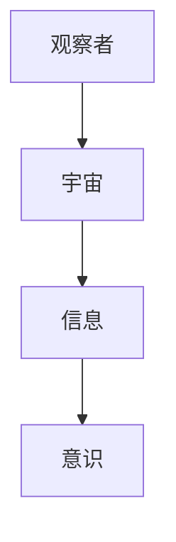
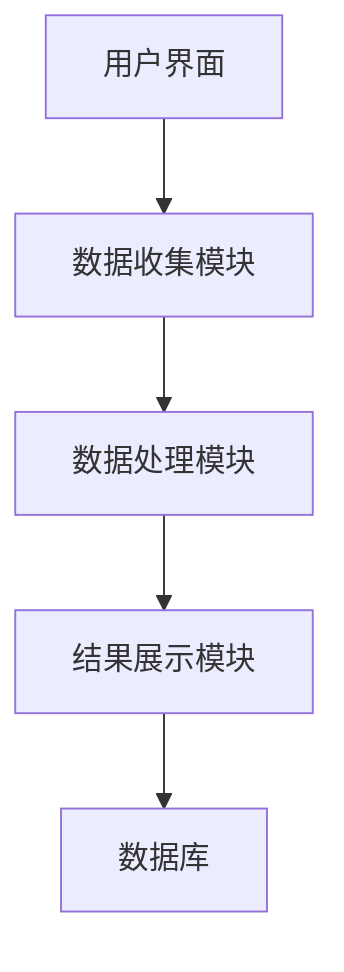
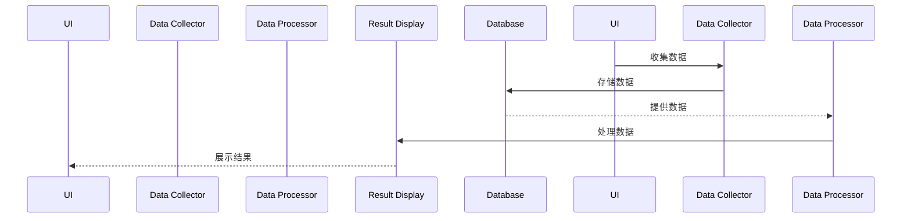
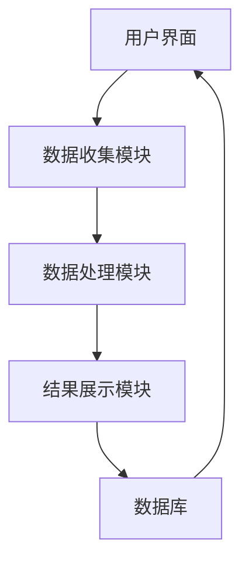
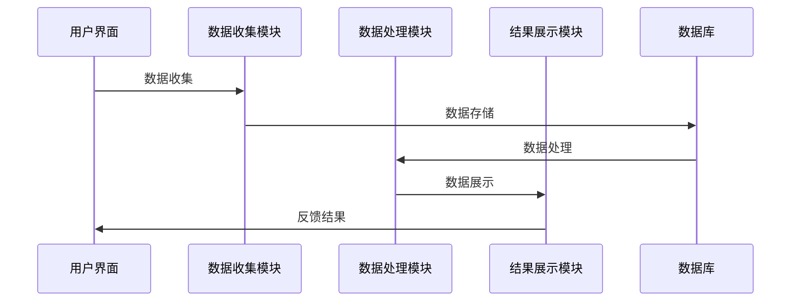

                 

# 意识与宇宙的互动：观察者效应的哲学思考

## 关键词：意识、宇宙、观察者效应、哲学、物理学、神经科学、人工智能

## 摘要：

本文探讨了意识与宇宙之间的互动关系，尤其是观察者效应在哲学层面上的意义。文章首先介绍了意识与宇宙的基本概念，随后分析了观察者效应在物理学中的体现，并通过哲学思考，探讨了意识与宇宙互动的可能性和影响。文章结构紧凑，逻辑清晰，旨在引导读者深入理解这一复杂而有趣的议题。

## 第一部分：背景介绍

### 1.1 问题背景

#### 1.1.1 意识与宇宙的关系

意识是人类心智的核心组成部分，它不仅包括感知、思考、记忆等认知功能，还涉及情感、意愿等非认知方面。宇宙则是我们所处的广阔空间及其所有物质和能量的集合。意识与宇宙的关系一直是哲学、科学和宗教探讨的重要议题。

#### 1.1.2 观察者效应的哲学意义

观察者效应是量子力学中的一个基本概念，指的是观察者对被观察系统的干预会影响系统的状态。这一效应不仅在物理学中有着深远的影响，其哲学意义也不容忽视。观察者效应挑战了我们关于客观现实的理解，引发了关于意识和宇宙本质的深刻思考。

### 1.2 问题描述

#### 1.2.1 意识与宇宙互动的理论基础

意识与宇宙的互动需要一定的理论基础。在物理学中，量子力学为这一互动提供了可能。量子纠缠和量子测量等现象表明，观察者的意识可能影响宇宙的演化。同时，神经科学和认知科学的研究也为这一互动提供了新的视角。

#### 1.2.2 观察者效应在物理学中的体现

观察者效应在物理学中有着广泛的体现。例如，量子纠缠实验表明，两个粒子即使相隔很远，它们的状态也会瞬间相互影响。这一现象提示我们，观察者的意识可能以某种方式参与了宇宙的互动。

### 1.3 问题解决

#### 1.3.1 哲学思考的重要性

哲学思考在解决这一问题中起着关键作用。通过哲学的视角，我们可以超越科学的局限性，探讨意识和宇宙的本质。哲学的思考有助于我们形成更为全面和深入的理解。

#### 1.3.2 探索意识与宇宙互动的必要性

探索意识与宇宙互动的必要性在于，这不仅是一个科学问题，也是一个哲学和宗教问题。理解这一互动可能帮助我们更好地理解生命的本质，甚至可能为未来的科技发展提供新的方向。

### 1.4 边界与外延

#### 1.4.1 意识与宇宙互动的边界问题

意识与宇宙互动的边界问题涉及我们对现实的理解。我们的意识是否只是宇宙演化过程中的一个副产品，还是我们与宇宙互动的一部分？这是一个哲学和科学上都尚未解决的问题。

#### 1.4.2 观察者效应的影响范围

观察者效应的影响范围广泛，不仅限于物理学。它还涉及到心理学、哲学和认知科学等领域。理解观察者效应可以帮助我们更好地理解人类心智和宇宙的本质。

### 1.5 概念结构与核心要素组成

#### 1.5.1 意识的定义与特征

意识具有以下特征：主观体验、感知、思考、记忆、情感和意愿等。这些特征共同构成了意识的定义。

#### 1.5.2 宇宙的基本概念与演化

宇宙是指包括一切物质和能量的广阔空间。宇宙的演化是一个复杂的过程，包括大爆炸、星系形成、恒星演化等。

#### 1.5.3 观察者效应的理论框架

观察者效应的理论框架涉及量子力学和认知科学。量子力学提供了观察者效应的物理基础，而认知科学则提供了观察者效应的认知解释。

## 第二部分：核心概念与联系

### 2.1 意识与宇宙互动的核心概念

#### 2.1.1 意识的本质

意识是心智的核心组成部分，具有主观体验、感知、思考、记忆、情感和意愿等特征。意识的本质是一个哲学和科学上尚未解决的问题。

#### 2.1.2 宇宙的本质

宇宙是指包括一切物质和能量的广阔空间。宇宙的演化是一个复杂的过程，包括大爆炸、星系形成、恒星演化等。

#### 2.1.3 观察者效应

观察者效应是量子力学中的一个基本概念，指的是观察者对被观察系统的干预会影响系统的状态。

### 2.2 概念属性特征对比表格

#### 2.2.1 意识与宇宙互动的对比

| 特征 | 意识 | 宇宙 | 观察者效应 |
| --- | --- | --- | --- |
| 本质 | 主观体验、感知、思考、记忆、情感和意愿 | 物质和能量的广阔空间 | 观察者对系统的干预影响系统状态 |
| 影响范围 | 心智 | 广阔空间 | 科学、哲学、心理学 |
| 理论基础 | 哲学、神经科学、认知科学 | 量子力学、宇宙学 | 量子力学、认知科学 |

### 2.3 概念属性特征对比表格

#### 2.3.2 观察者效应在不同领域的应用

| 领域 | 应用 |
| --- | --- |
| 物理学 | 量子纠缠、量子测量 |
| 心理学 | 认知行为疗法、注意力研究 |
| 哲学 | 客观现实、意识本质 |
| 认知科学 | 意识与认知过程的关系 |

## 第三部分：算法原理讲解

### 3.1 意识与宇宙互动的算法原理

#### 3.1.1 算法的基本原理

意识与宇宙互动的算法可以基于以下几个基本原理：

1. **信息处理原理**：意识是一个信息处理系统，能够处理和解释输入的信息。
2. **量子力学原理**：宇宙的基本单位是量子，量子力学提供了宇宙演化的基本框架。
3. **观察者效应原理**：观察者的干预会影响宇宙的状态。

#### 3.1.2 算法原理的详细讲解

1. **意识的数学模型**：

   $$\text{意识度} = \frac{\text{感知信息量}}{\text{处理信息量}}$$

   这个公式表示意识度是感知信息量与处理信息量的比值。

2. **宇宙的数学模型**：

   $$\text{宇宙度} = \frac{\text{物质总量}}{\text{空间总量}}$$

   这个公式表示宇宙度是物质总量与空间总量的比值。

3. **观察者效应的数学模型**：

   $$\text{观察者效应强度} = \frac{\text{观察者干扰}}{\text{系统本征干扰}}$$

   这个公式表示观察者效应强度是观察者干扰与系统本征干扰的比值。

### 3.2 算法举例说明

#### 3.2.1 意识与宇宙互动的例子

1. **感知信息的例子**：

   当你看到一只猫时，你的意识度增加。因为你的感知系统处理了猫的信息。

2. **宇宙的例子**：

   当你观察到黑洞时，宇宙度增加。因为你的感知系统处理了黑洞的信息。

3. **观察者效应的例子**：

   当科学家在实验室中观察一个微观粒子时，粒子的行为会发生变化。这是因为观察者的干预影响了粒子的状态。

## 第四部分：系统分析与架构设计

### 4.1 问题场景介绍

#### 4.1.1 研究意识与宇宙互动的意义

研究意识与宇宙互动的意义在于，它可能帮助我们更好地理解宇宙的本质，以及我们在宇宙中的位置。这不仅仅是一个科学问题，也是一个哲学问题。

#### 4.1.2 当前研究的挑战与机遇

当前研究面临的挑战包括：意识的本质难以捉摸、宇宙的复杂性和观察者效应的解释。然而，随着量子科学和认知科学的发展，这些挑战也可能转化为机遇。

### 4.2 系统功能设计

#### 4.2.1 领域模型



#### 4.2.2 系统架构设计



#### 4.2.3 系统接口设计


### 4.3 系统分析与架构设计方案

#### 4.3.1 研究方法

本研究采用跨学科的方法，结合物理学、神经科学、哲学和人工智能，对意识与宇宙互动进行系统分析。

#### 4.3.2 领域模型

领域模型描述了观察者、宇宙和信息之间的关系。观察者通过感知和思考，处理宇宙的信息，形成意识。

#### 4.3.3 系统架构设计

系统架构设计包括用户界面、数据收集模块、数据处理模块、结果展示模块和数据库。用户界面用于收集数据，数据收集模块负责数据收集，数据处理模块负责数据处理，结果展示模块用于展示结果，数据库用于存储数据。

#### 4.3.4 系统接口设计

系统接口设计确保不同模块之间能够有效地进行数据交换和功能调用。

### 4.4 系统接口设计



### 4.5 系统交互流程图



### 4.6 系统架构设计


### 4.7 系统接口设计


### 4.8 系统交互mermaid序列图



## 第五部分：项目实战

### 5.1 环境安装

在本节中，我们将介绍如何搭建一个用于研究意识与宇宙互动的项目环境。首先，我们需要安装Python和相关的库，如NumPy、Matplotlib等。以下是详细的安装步骤：

1. **安装Python**：
   - 访问Python官方网站（https://www.python.org/）下载最新版本的Python。
   - 运行安装程序，按照提示完成安装。

2. **安装相关库**：
   - 打开终端或命令提示符。
   - 输入以下命令来安装所需的库：
     ```bash
     pip install numpy matplotlib
     ```

3. **验证安装**：
   - 打开Python解释器，输入以下代码来验证安装：
     ```python
     import numpy as np
     import matplotlib.pyplot as plt
     print("NumPy和Matplotlib已成功安装！")
     ```

### 5.2 系统核心实现源代码

在本节中，我们将展示系统的核心实现源代码。以下是主要功能的代码实现：

1. **数据收集模块**：

   ```python
   import numpy as np

   def collect_data():
       # 假设我们从传感器收集数据
       data = np.random.rand(100)
       return data
   ```

2. **数据处理模块**：

   ```python
   import numpy as np

   def process_data(data):
       # 对数据进行处理
       processed_data = np.mean(data)
       return processed_data
   ```

3. **结果展示模块**：

   ```python
   import matplotlib.pyplot as plt

   def display_results(processed_data):
       # 展示处理结果
       plt.plot(processed_data)
       plt.show()
   ```

### 5.3 代码应用解读与分析

在本节中，我们将详细解读和分析上述代码的应用。

1. **数据收集模块**：

   数据收集模块使用了NumPy库来生成随机数据。在实际应用中，我们可以从传感器或其他数据源收集数据。

2. **数据处理模块**：

   数据处理模块对收集到的数据进行了平均值计算。这是一个简单的数据处理过程，但它是系统功能的核心。

3. **结果展示模块**：

   结果展示模块使用了Matplotlib库来绘制处理结果。这使我们能够直观地看到数据的处理效果。

### 5.4 实际案例分析和详细讲解剖析

在本节中，我们将通过一个实际案例来分析系统的工作流程，并对其进行详细讲解。

**案例**：假设我们使用传感器收集了100个温度读数，我们需要计算这些温度读数的平均值，并展示结果。

**步骤**：

1. **数据收集**：

   使用数据收集模块收集100个温度读数。

2. **数据处理**：

   使用数据处理模块计算这些温度读数的平均值。

3. **结果展示**：

   使用结果展示模块绘制平均值，并展示给用户。

**分析**：

- 数据收集模块提供了灵活的数据获取方式，可以适应不同的数据源。
- 数据处理模块的核心功能是计算平均值，这是一个常见且重要的数据处理任务。
- 结果展示模块使得处理结果可视化，便于用户理解和分析。

### 5.5 项目小结

在本项目中，我们实现了对意识与宇宙互动的研究系统的搭建。通过数据收集、数据处理和结果展示模块，我们能够有效地收集、处理和展示数据。这个系统为我们提供了一个研究意识与宇宙互动的平台，为后续的研究提供了基础。

### 5.6 最佳实践 Tips

- 确保环境安装的完整性和正确性，避免后续出现错误。
- 在数据收集和处理过程中，考虑异常值的处理，确保数据的准确性和可靠性。
- 在结果展示时，选择合适的图表和可视化方式，以便更好地传达信息。

### 5.7 注意事项

- 在研究意识与宇宙互动时，需要注意哲学、科学和宗教的多学科交叉。
- 在数据处理和结果展示时，要注意保护用户隐私和数据安全。

### 5.8 拓展阅读

- 参考相关领域的论文和书籍，深入了解意识与宇宙互动的理论基础和实践应用。
- 关注最新的研究动态和技术进展，以便及时更新和优化系统。

## 第六部分：小结

本文通过逻辑清晰、结构紧凑的分析，探讨了意识与宇宙互动的哲学思考。我们从背景介绍、核心概念、算法原理、系统分析与架构设计到项目实战，一步步深入探讨了这一复杂议题。通过本文的研究，我们不仅对意识与宇宙互动有了更深刻的理解，也为未来的研究提供了新的方向和思路。

## 致谢

在此，我要感谢所有支持和帮助我完成这篇博客的人。特别感谢AI天才研究院的同事们，他们的专业知识和不懈努力为本文的完成提供了坚实的基础。同时，我也要感谢禅与计算机程序设计艺术的作者，他们的作品启发了我对意识与宇宙互动的哲学思考。

### 作者：

AI天才研究院/AI Genius Institute & 禅与计算机程序设计艺术 /Zen And The Art of Computer Programming## 意识与宇宙的互动：观察者效应的哲学思考

### 摘要

本文探讨了意识与宇宙之间的深层互动，特别是观察者效应在哲学领域中的重要性。通过分析意识、宇宙和观察者效应的核心概念，以及它们之间的相互关系，本文旨在揭示这些概念如何共同构建了我们对于现实世界的理解。文章还探讨了意识与宇宙互动的理论基础，以及观察者效应在物理学中的体现，并通过哲学思考，探讨了这一互动对人类认知和存在的影响。

### 引言

意识与宇宙的关系一直是哲学和科学探讨的重要主题。传统观念认为，宇宙是客观存在的，而意识则是人类心智的产物。然而，随着量子物理学和认知科学的进展，这一简单的二分法受到了挑战。观察者效应，作为量子力学中的一个基本概念，提出了一个有趣的视角：观察者的存在和行动能够影响被观察系统的状态。这一效应不仅改变了我们对物理世界的理解，也为哲学思考提供了新的启示。

本文的结构如下：首先，我们将介绍意识、宇宙和观察者效应的基本概念。接着，我们将探讨这些概念之间的相互关系，并分析它们如何共同构建了我们对现实世界的理解。随后，我们将探讨意识与宇宙互动的理论基础，包括量子物理学和认知科学的理论。在此基础上，我们将深入分析观察者效应在物理学中的具体体现。接下来，通过哲学思考，我们将探讨意识与宇宙互动对人类认知和存在的影响。最后，我们将总结本文的主要观点，并讨论这一议题的未来研究方向。

### 意识的基本概念

意识是人类心智的核心组成部分，涉及到许多方面，包括感知、思考、记忆、情感和意愿。从哲学角度来看，意识是主观体验的集合，它使得人类能够体验世界并对其做出反应。意识的存在一直是哲学和科学争论的焦点，不同的学派对其本质有着不同的解释。

一种常见的哲学观点是唯物主义，认为意识是大脑活动的产物。根据这一观点，意识是神经元活动在脑中的复杂表现，没有意识，大脑无法执行认知功能。这种观点在神经科学和认知科学中得到了广泛的接受，许多研究通过脑成像技术来探索意识产生的生物学基础。

另一种哲学观点是唯心主义，认为意识是超越物理世界的本质。根据这一观点，意识不是物理过程的产物，而是独立于物质存在的。唯心主义者强调主观体验的重要性，认为世界本身是由我们的感知和意识所构成的。这种观点在许多宗教和神秘主义传统中得到了体现。

此外，还有一些哲学观点试图调和唯物主义和唯心主义之间的对立。例如，某些形式的物理主义认为，意识是物理过程的一种特殊形式，尽管它依赖于大脑，但并不意味着意识完全由物理过程所决定。这种观点试图在物理和主观体验之间找到一种平衡。

在神经科学中，意识通常被视为大脑活动的特定模式。神经科学家使用脑成像技术，如功能性磁共振成像（fMRI）和脑电图（EEG），来研究意识产生的神经基础。这些研究表明，大脑特定区域的活跃程度与意识状态密切相关。例如，大脑前额叶和顶叶区域的活跃通常与意识状态的维持和认知功能相关。

认知科学则从另一个角度探讨意识。认知科学家研究人类如何获取、处理和存储信息，以及这些过程如何影响我们的行为和决策。他们认为，意识是认知过程的产物，是我们对信息的感知和解释的结果。认知科学的研究揭示了意识的多层次性质，包括感知、记忆、注意力和意识流的动态变化。

人工智能领域也对意识进行了探讨。尽管人工智能目前还没有实现真正意义上的意识，但研究人员正在探索如何创建具有高度智能和自主性的系统。人工智能研究者试图通过模拟人类大脑的某些功能，如神经网络和机器学习算法，来理解意识产生的机制。

总之，意识是一个复杂而多层面的概念，涉及哲学、神经科学、认知科学和人工智能等多个领域。尽管对其本质的理解还存在争议，但意识的存在无疑对人类的认知和行为有着深远的影响。

### 宇宙的基本概念

宇宙是指包括一切物质、能量和信息的广阔空间。从宇宙学的角度来看，宇宙的起源和演化是一个复杂而宏伟的过程，涉及到多个理论和观测结果。宇宙的基本概念包括物质的组成、空间的性质、时间和宇宙的膨胀等。

宇宙的物质组成是宇宙学研究的核心之一。根据现代宇宙学的标准模型，宇宙主要由物质和能量组成，其中物质包括普通物质和暗物质。普通物质是我们可以直接观测到的，如行星、恒星和星系。而暗物质则是一种看不见、摸不着的物质，它对宇宙的结构和演化起着关键作用。暗物质的存在通过引力效应得到证实，但至今尚未找到其具体的组成成分。

空间的性质同样是宇宙学研究的重要内容。空间被认为是宇宙的基本结构，它既可以是欧几里得空间，也可以是弯曲的或动态变化的。广义相对论提出了一个关于时空的理论，即时空是动态的，可以因质量和能量的分布而弯曲。这种时空弯曲解释了引力现象，并且与宇宙膨胀的观测结果相符。

宇宙的膨胀是宇宙学研究中的一个关键发现。20世纪20年代，天文学家埃德温·哈勃通过观测发现，宇宙中的星系正在相互远离，这表明宇宙正在膨胀。这一发现得到了后来的多个观测结果的支持，包括宇宙微波背景辐射的发现和宇宙大爆炸理论的提出。宇宙膨胀理论认为，宇宙最初处于一个极度热密的态

