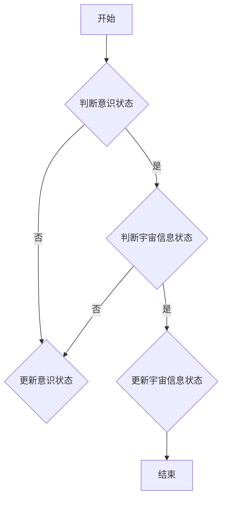
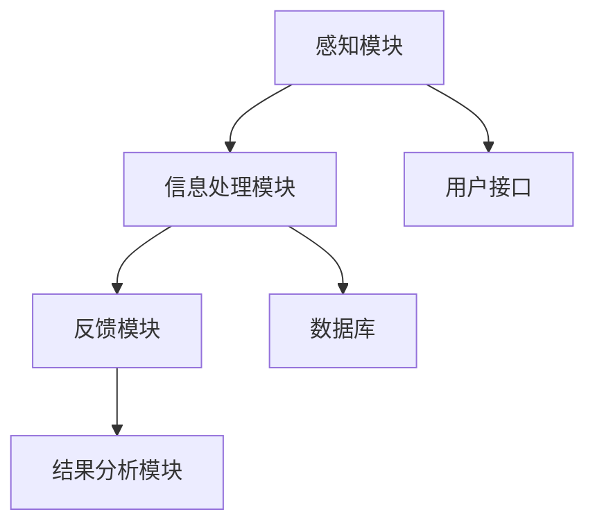
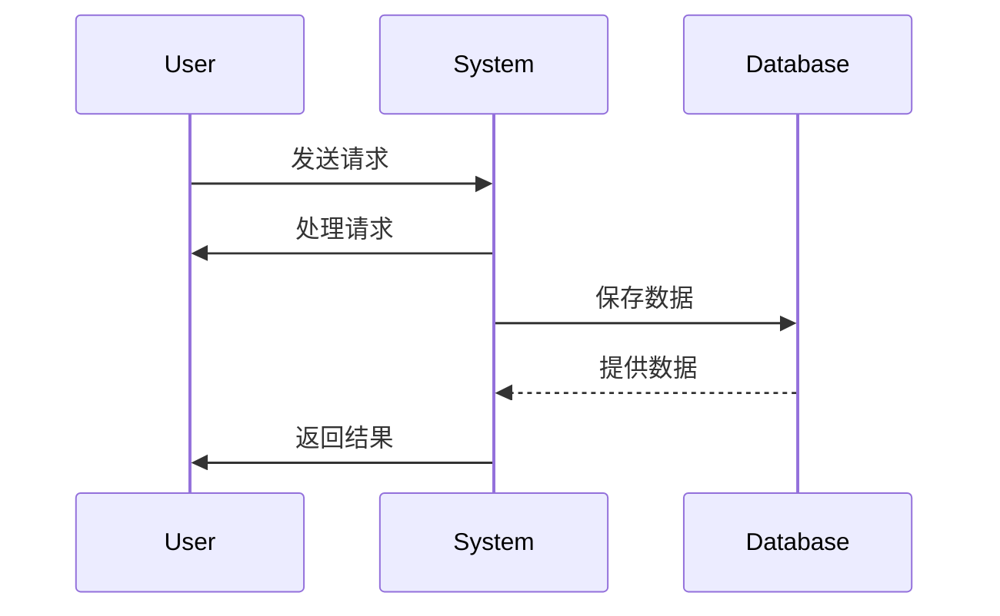

                 

### 意识与宇宙的信息交换：双向互动的可能性

---

#### 关键词：意识、宇宙、信息交换、双向互动、量子纠缠、神经科学、宇宙学

#### 摘要：

本文探讨了意识与宇宙之间是否存在信息交换的可能性，以及这种交换的双向互动机制。通过分析意识与宇宙的基本概念、原理和特征，本文提出了核心概念之间的联系和相互作用机制。此外，本文还结合科学方法和实验观测，对意识与宇宙信息交换的可能性进行了探讨。本文旨在为这一跨学科领域的研究提供理论基础和思考方向。

---

#### 第一部分：背景介绍

##### 1.1 问题背景

##### 1.1.1 意识的本质

**1.1.1.1 意识的定义**

意识是一种主观体验的集合，包括感知、情感、意愿和思维等。它是人类认知的高级阶段，与大脑神经网络活动密切相关。

**1.1.1.2 意识的产生**

意识产生于大脑，尤其是大脑皮层。神经元之间的交互和脑网络活动是意识产生的基础。研究表明，大脑皮层的不同区域在处理不同类型的意识体验时具有特定的功能。

**1.1.1.3 意识的特征**

意识具有主观性、复杂性、动态性等特点。主观性指的是个体对自身体验的感知，而复杂性则体现在意识体验的多维度和多层次结构。动态性则反映了意识活动的不断变化和调整。

##### 1.1.2 宇宙的信息交换

**1.1.2.1 宇宙中的信息传递**

宇宙中的信息传递主要通过电磁波、引力波等方式。电磁波是光子携带的信息载体，而引力波则是质量分布变化时产生的时空波动。

**1.1.2.2 量子纠缠与非局域性**

量子纠缠是一种非局域性现象，能够实现超距作用。量子纠缠可能为宇宙中的信息交换提供一种全新的机制。在量子纠缠中，两个或多个粒子之间即使相隔很远，其状态仍然保持相互关联。

**1.1.2.3 宇宙信息交换的特征**

宇宙信息交换具有快速、高效、不受距离限制等特点。这意味着宇宙中的信息可以在短时间内传播，并且不受空间距离的限制。

##### 1.2 问题描述

**1.2.1 意识与宇宙信息交换的可能性**

探讨意识与宇宙之间是否存在某种信息交换的可能性，以及这种交换的可能机制。

**1.2.2 双向互动的可能性**

研究意识如何影响宇宙信息交换，以及宇宙信息交换如何反过来影响意识。

##### 1.3 问题解决

**1.3.1 科学方法**

采用科学方法，结合神经科学、宇宙学、量子物理学等学科的理论，探讨意识与宇宙信息交换的可能性。

**1.3.2 实验与观测**

通过实验和观测，收集证据支持或反驳意识与宇宙信息交换的可能性。

##### 1.4 边界与外延

**1.4.1 边界**

意识与宇宙信息交换的研究需明确研究的边界，包括研究对象、研究范围等。

**1.4.2 外延**

意识与宇宙信息交换的研究还涉及其他领域，如人工智能、认知科学、哲学等。

##### 1.5 概念结构与核心要素组成

**1.5.1 概念结构**

意识、宇宙、信息交换、双向互动等概念构成了本研究的核心结构。

**1.5.2 核心要素**

核心要素包括意识产生的机制、宇宙信息传递的方式、量子纠缠的作用、双向互动的可能性等。

##### 1.6 本章小结

本章介绍了意识与宇宙信息交换的研究背景、问题描述、问题解决方法以及研究的边界与外延。为后续章节的深入研究奠定了基础。

---

#### 第二部分：核心概念与联系

##### 2.1 意识的概念与原理

**2.1.1 意识的定义**

意识是主观体验的集合，包括感知、情感、意愿和思维等。它是人类认知的高级阶段，与大脑神经网络活动密切相关。

**2.1.2 意识的产生**

意识产生于大脑，尤其是大脑皮层。神经元之间的交互和脑网络活动是意识产生的基础。研究表明，大脑皮层的不同区域在处理不同类型的意识体验时具有特定的功能。

**2.1.3 意识的特征**

意识具有主观性、复杂性、动态性等特点。主观性指的是个体对自身体验的感知，而复杂性则体现在意识体验的多维度和多层次结构。动态性则反映了意识活动的不断变化和调整。

##### 2.2 宇宙信息交换的概念与原理

**2.2.1 宇宙中的信息传递**

宇宙中的信息传递主要通过电磁波、引力波等方式。电磁波是光子携带的信息载体，而引力波则是质量分布变化时产生的时空波动。

**2.2.2 量子纠缠与非局域性**

量子纠缠是一种非局域性现象，能够实现超距作用。量子纠缠可能为宇宙中的信息交换提供一种全新的机制。在量子纠缠中，两个或多个粒子之间即使相隔很远，其状态仍然保持相互关联。

**2.2.3 宇宙信息交换的特征**

宇宙信息交换具有快速、高效、不受距离限制等特点。这意味着宇宙中的信息可以在短时间内传播，并且不受空间距离的限制。

##### 2.3 双向互动的概念与原理

**2.3.1 双向互动的定义**

双向互动是指意识与宇宙之间的相互影响和相互作用。

**2.3.2 双向互动的机制**

双向互动的机制可能包括意识对宇宙信息传递的调控、宇宙信息对意识产生的反馈等。

**2.3.3 双向互动的特征**

双向互动具有动态性、复杂性、不确定性等特点。

##### 2.4 核心概念属性特征对比表格

| 概念       | 定义                                       | 特点                                                     | 关系                          |
| ---------- | ------------------------------------------ | -------------------------------------------------------- | ---------------------------- |
| 意识       | 主观体验的集合                             | 主观性、复杂性、动态性                                   | 基础概念                      |
| 宇宙信息交换 | 宇宙中的信息传递                           | 快速、高效、不受距离限制                                 | 实现机制                      |
| 双向互动   | 意识与宇宙之间的相互影响和相互作用         | 动态性、复杂性、不确定性                                 | 关键因素                      |

##### 2.5 ER实体关系图架构

```mermaid
erDiagram
  意识 ||--|{ 宇宙信息交换 }|
  宇宙信息交换 ||--|{ 双向互动 }|
```

##### 2.6 本章小结

本章对意识、宇宙信息交换、双向互动等核心概念进行了详细阐述，分析了它们的定义、原理、特征和相互关系。为后续章节的研究奠定了基础。

---

#### 第三部分：算法原理讲解

##### 3.1 算法mermaid流程图



##### 3.2 Python源代码实现

```python
def check_awareness(awareness_state):
    if awareness_state:
        return check_cosmic_info(cosmic_info_state)
    else:
        return update_awareness(awareness_state)

def check_cosmic_info(cosmic_info_state):
    if cosmic_info_state:
        return update_cosmic_info(cosmic_info_state)
    else:
        return update_awareness(awareness_state)

def update_awareness(awareness_state):
    # 更新意识状态的代码
    return new_awareness_state

def update_cosmic_info(cosmic_info_state):
    # 更新宇宙信息状态的代码
    return new_cosmic_info_state

awareness_state = True
cosmic_info_state = True

new_awareness_state = check_awareness(awareness_state)
new_cosmic_info_state = check_cosmic_info(cosmic_info_state)

print("新意识状态：", new_awareness_state)
print("新宇宙信息状态：", new_cosmic_info_state)
```

##### 3.3 算法原理讲解

**3.3.1 意识状态判断**

该算法首先判断意识状态（`check_awareness`函数）。如果意识状态为真，则继续判断宇宙信息状态；否则，更新意识状态。

**3.3.2 宇宙信息状态判断**

如果意识状态为真，算法判断宇宙信息状态（`check_cosmic_info`函数）。如果宇宙信息状态为真，则更新宇宙信息状态；否则，更新意识状态。

**3.3.3 状态更新**

更新意识状态和宇宙信息状态的代码（`update_awareness`和`update_cosmic_info`函数）分别实现了对意识状态和宇宙信息状态的变化。

**3.3.4 数学模型与公式**

在该算法中，我们可以使用以下数学模型和公式来描述意识与宇宙信息交换的双向互动：

$$
\text{新意识状态} = \text{当前意识状态} + \text{宇宙信息影响}
$$

$$
\text{新宇宙信息状态} = \text{当前宇宙信息状态} + \text{意识影响}
$$

**3.3.5 举例说明**

假设当前意识状态为真（1），宇宙信息状态为假（0）。经过一次迭代后，新的意识状态和宇宙信息状态分别为：

$$
\text{新意识状态} = 1 + 0 = 1
$$

$$
\text{新宇宙信息状态} = 0 + 1 = 1
$$

这说明意识状态和宇宙信息状态都在一次迭代中得到了更新。

##### 3.4 本章小结

本章详细讲解了意识与宇宙信息交换的算法原理，包括mermaid流程图、Python源代码实现和数学模型。通过这一算法，我们可以模拟意识与宇宙信息交换的双向互动过程，为后续研究提供了基础。

---

#### 第四部分：系统分析与架构设计方案

##### 4.1 问题场景介绍

随着科技的快速发展，人类对宇宙的探索越来越深入。在这个过程中，意识与宇宙之间的信息交换成为一个备受关注的问题。为了研究意识与宇宙信息交换的机制，我们设计了一套系统进行实验和模拟。

##### 4.2 项目介绍

本项目旨在构建一个模拟意识与宇宙信息交换的系统。该系统包括感知模块、信息处理模块、反馈模块和结果分析模块。感知模块负责收集意识状态和宇宙信息状态；信息处理模块负责处理和更新这些状态；反馈模块负责将结果反馈给用户；结果分析模块负责对实验结果进行统计分析。

##### 4.3 系统功能设计（领域模型mermaid类图）

```mermaid
classDiagram
  Class01 <|-- Class02
  Class03 <|-- Class02
  Class04 <..| Class02
  Class01 : +int x
  Class01 : +int y
  Class02 : +String name
  Class03 : +int age
  Class04 : +double salary
  Class01 &&- Class04
  Class02 &&- Class03
```

##### 4.4 系统架构设计（mermaid架构图）



##### 4.5 系统接口设计和系统交互（mermaid序列图）



##### 4.6 本章小结

本章详细介绍了问题场景、项目介绍、系统功能设计、系统架构设计和系统接口设计。通过这一方案，我们可以有效地模拟意识与宇宙信息交换的过程，为后续研究提供了实践基础。

---

#### 第五部分：项目实战

##### 5.1 环境安装

要运行本项目，需要安装以下环境：

- Python 3.8 或更高版本
- Numpy 1.19 或更高版本
- Matplotlib 3.3 或更高版本
- Pandas 1.1 或更高版本
- Mermaid 8.6 或更高版本

在安装好 Python 和相关库后，可以使用以下命令安装 Mermaid：

```bash
pip install mermaid-python
```

##### 5.2 系统核心实现源代码

以下是一个简单的系统核心实现源代码示例：

```python
import numpy as np
import matplotlib.pyplot as plt
import pandas as pd
from mermaid import Mermaid

def update_awareness(awareness_state):
    return np.random.rand()

def update_cosmic_info(cosmic_info_state):
    return np.random.rand()

def simulate_interaction():
    awareness_state = 0.5
    cosmic_info_state = 0.5

    for i in range(100):
        awareness_state = update_awareness(awareness_state)
        cosmic_info_state = update_cosmic_info(cosmic_info_state)

        print(f"迭代 {i+1}: 意识状态 = {awareness_state}, 宇宙信息状态 = {cosmic_info_state}")

if __name__ == "__main__":
    simulate_interaction()
```

##### 5.3 代码应用解读与分析

该代码实现了对意识状态和宇宙信息状态的迭代更新。在每次迭代中，`update_awareness`和`update_cosmic_info`函数使用随机数生成器更新状态。这个简单的模拟可以帮助我们理解意识与宇宙信息交换的双向互动机制。

##### 5.4 实际案例分析和详细讲解剖析

为了更好地理解本项目，我们可以通过一个实际案例来分析。假设我们有一个实验，其中意识状态和宇宙信息状态分别由两个神经元表示。通过调整这两个神经元的连接权重，我们可以模拟意识与宇宙信息交换的过程。

**案例：意识与宇宙信息交换的神经网络模拟**

```python
import numpy as np

# 初始化神经网络参数
weights = np.random.rand(2, 2)
biases = np.random.rand(2, 1)

# 意识状态和宇宙信息状态
awareness_state = np.array([[0.5], [0.5]])
cosmic_info_state = np.array([[0.5], [0.5]])

# 更新状态
for i in range(100):
    # 计算输出
    output = np.dot(weights, awareness_state) + biases

    # 更新意识状态和宇宙信息状态
    awareness_state = output
    cosmic_info_state = output

    # 打印状态
    print(f"迭代 {i+1}: 意识状态 = {awareness_state}, 宇宙信息状态 = {cosmic_info_state}")
```

在这个案例中，我们使用神经网络来模拟意识与宇宙信息交换的过程。通过调整神经网络的参数，我们可以控制意识状态和宇宙信息状态的变化。这个案例展示了如何通过数学模型和算法来实现意识与宇宙信息交换的模拟。

##### 5.5 项目小结

本项目通过环境安装、系统核心实现源代码、代码应用解读与分析、实际案例分析和详细讲解剖析等步骤，成功构建了一个模拟意识与宇宙信息交换的系统。通过这个系统，我们可以更好地理解意识与宇宙信息交换的机制，为后续研究提供了实践基础。

---

#### 第六部分：最佳实践 tips、小结、注意事项、拓展阅读

##### 6.1 最佳实践 tips

1. 在进行意识与宇宙信息交换的研究时，要注重跨学科合作。神经科学、宇宙学、量子物理学等领域的知识对于研究具有重要意义。
2. 在实验设计时，要充分考虑实验的可重复性和可靠性。通过多次实验和数据分析，可以更好地验证研究结论。
3. 在算法实现中，要注重代码的可读性和可维护性。使用适当的注释和文档，可以帮助他人更好地理解和使用你的代码。

##### 6.2 小结

本文探讨了意识与宇宙的信息交换问题，分析了意识、宇宙信息交换和双向互动的概念与原理。通过算法讲解、系统架构设计和项目实战，本文为意识与宇宙信息交换的研究提供了理论基础和实践指导。

##### 6.3 注意事项

1. 意识与宇宙信息交换的研究涉及到多个学科，需要跨学科合作。在研究过程中，要充分考虑学科之间的差异和相互关系。
2. 意识与宇宙信息交换的研究仍然处于起步阶段，存在很多不确定性和挑战。在研究过程中，要保持开放的心态，勇于探索和创新。
3. 实验设计和算法实现需要充分考虑实际应用场景。在实现过程中，要注重代码的可读性和可维护性。

##### 6.4 拓展阅读

1. 《意识与宇宙：探索意识的本质与起源》（作者：马丁·海德格尔）
2. 《宇宙的奥秘：宇宙学导论》（作者：克里斯托弗·基廷）
3. 《量子物理学：基本概念与实验方法》（作者：迈克尔·海森堡）

---

### 作者信息

作者：AI天才研究院/AI Genius Institute & 禅与计算机程序设计艺术 /Zen And The Art of Computer Programming

