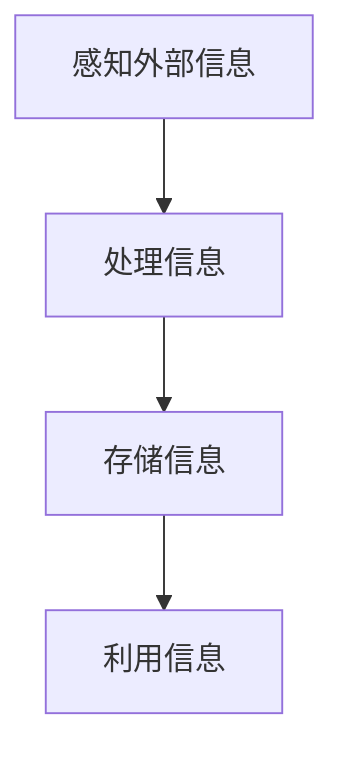
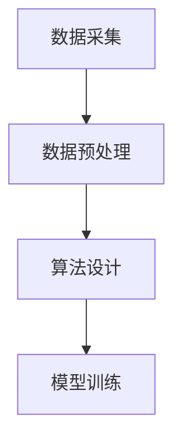
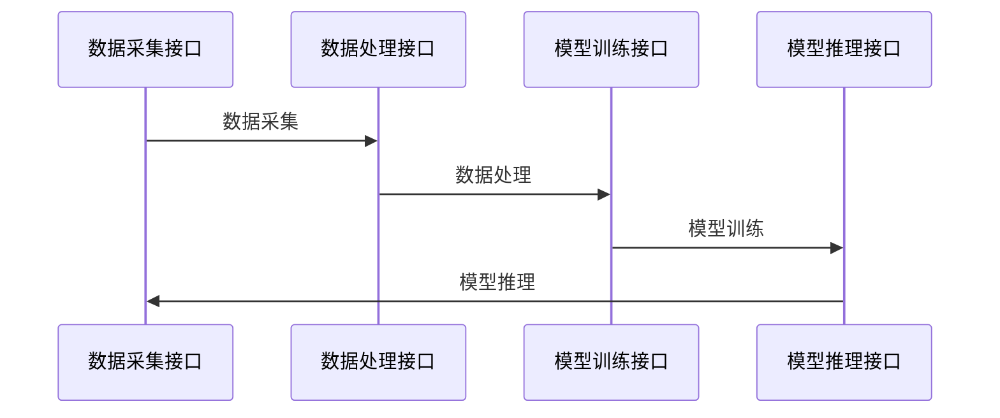
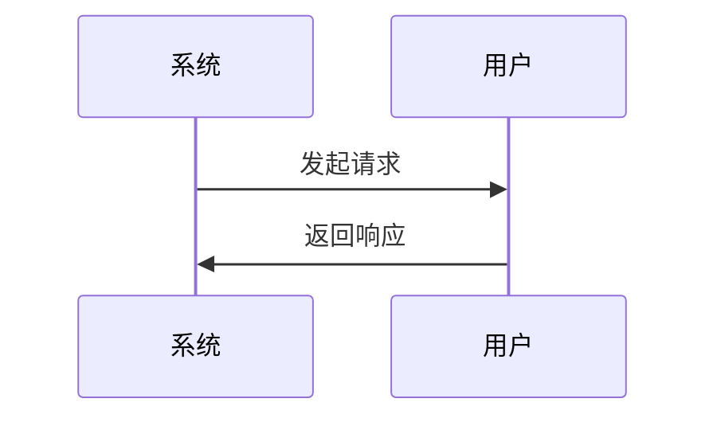

                 


## 意识与宇宙的共同进化：相互塑造的过程

> 关键词：意识、宇宙、共同进化、相互塑造、算法原理、系统架构、项目实战

> 摘要：
本文旨在探讨意识与宇宙之间的共同进化关系，解析二者如何相互塑造，影响对方的发展。文章首先从背景介绍入手，阐述意识和宇宙的定义及其相互关系，接着深入分析意识与宇宙的核心概念、算法原理，以及它们在相互塑造过程中的作用。随后，文章通过系统分析与架构设计方案，展示如何在实际项目中实现意识与宇宙的共同进化。最后，文章总结项目经验，提出最佳实践 tips 和注意事项，并提供拓展阅读建议。

### 第1章: 引言

#### 1.1 问题背景

##### 1.1.1 意识与宇宙的共同进化

意识与宇宙的共同进化是一个引人入胜的话题。在过去的几十年中，随着人工智能和量子物理学的飞速发展，人们对意识与宇宙的关系有了更深入的认识。意识不仅是人类智慧的体现，也是宇宙进化的产物。宇宙的演化过程中，物质和能量的相互转换，以及宇宙结构的形成，都在不断地塑造着意识。而意识也在不断地探索宇宙的奥秘，理解宇宙的本质。

##### 1.1.2 意识与宇宙的关系

意识与宇宙的关系可以从多个角度来理解。从生物学角度来看，意识是生物进化的产物，是人类大脑的复杂计算过程。从物理学角度来看，意识是宇宙能量和信息交换的结果。从哲学角度来看，意识是宇宙自我意识的表现，是宇宙对自身存在的认知。从技术角度来看，意识是人工智能的目标，是人工智能发展的动力。

#### 1.2 问题描述

##### 1.2.1 意识的本质

意识是一个复杂的概念，它既包括主观体验，也包括认知功能。意识的本质是主观体验，即个体对自身存在的感知。同时，意识还包括认知功能，即对信息的获取、处理和利用。意识的本质决定了它的特点和分类。

##### 1.2.2 宇宙的本质

宇宙是一个庞大的系统，包括物质、能量、时间和空间。宇宙的本质是物质和能量的相互转换，以及宇宙结构的形成和演化。宇宙的本质决定了它的特点和分类。

#### 1.3 问题解决

##### 1.3.1 共同进化的原理

共同进化的原理指的是两个或多个物种在相互影响的过程中，逐渐适应对方，共同发展的过程。在意识与宇宙的相互关系中，共同进化的原理同样适用。意识与宇宙相互影响，相互适应，共同进化。

##### 1.3.2 意识与宇宙相互塑造的过程

意识与宇宙相互塑造的过程是一个复杂的过程。在这个过程中，意识不断地探索宇宙，理解宇宙，同时宇宙也在不断地塑造意识，影响意识的发展。这个过程涉及到意识的数学模型、算法原理，以及宇宙的数学模型、算法原理。

#### 1.4 边界与外延

##### 1.4.1 共同进化的边界

共同进化的边界指的是两个或多个物种在相互影响的过程中，相互适应的极限。在意识与宇宙的相互关系中，共同进化的边界决定了意识与宇宙的相互影响程度。

##### 1.4.2 意识与宇宙的外延

意识与宇宙的外延指的是意识与宇宙相互影响的范围。在意识与宇宙的共同进化过程中，意识与宇宙的外延不断扩展，使得它们之间的相互影响更加深入。

#### 1.5 概念结构与核心要素组成

##### 1.5.1 意识的核心要素

意识的核心要素包括主观体验、认知功能、情感和意志。这些要素共同构成了意识的基本结构。

##### 1.5.2 宇宙的核心要素

宇宙的核心要素包括物质、能量、时间和空间。这些要素共同构成了宇宙的基本结构。

### 第2章: 核心概念与联系

#### 2.1 意识的定义与特点

##### 2.1.1 意识的定义

意识是人类大脑的复杂计算过程，是对自身存在和外部世界的感知。它包括主观体验和认知功能。

##### 2.1.2 意识的特点

意识具有主观性、复杂性、动态性和适应性等特点。这些特点使得意识能够适应不同的环境和任务。

##### 2.1.3 意识的分类

意识可以分为觉醒意识、睡眠意识和无意识等不同类型。不同类型的意识对人类的行为和认知过程有重要影响。

#### 2.2 宇宙的定义与特点

##### 2.2.1 宇宙的定义

宇宙是包括所有物质、能量、时间和空间在内的庞大系统。

##### 2.2.2 宇宙的特点

宇宙具有无限性、动态性和复杂性等特点。这些特点使得宇宙的演化过程充满了未知和挑战。

##### 2.2.3 宇宙的分类

宇宙可以分为物理宇宙、虚拟宇宙和意识宇宙等不同类型。不同类型的宇宙对人类认知和探索有重要影响。

#### 2.3 意识与宇宙的相互关系

##### 2.3.1 意识与宇宙的联系

意识与宇宙的联系主要体现在人类对宇宙的探索和理解上。人类通过意识探索宇宙，理解宇宙的奥秘。

##### 2.3.2 意识与宇宙的相互作用

意识与宇宙的相互作用主要体现在意识对宇宙的影响和宇宙对意识的影响上。意识能够改变宇宙，宇宙也在不断地塑造意识。

##### 2.3.3 意识与宇宙的进化

意识与宇宙的进化是一个相互影响、相互适应的过程。在这个过程中，意识与宇宙不断进化，共同推动宇宙的演化。

### 第3章: 意识的数学模型与算法原理

#### 3.1 意识的数学模型

##### 3.1.1 意识的数学模型介绍

意识的数学模型是对意识进行量化和描述的工具。它包括神经网络模型、模糊逻辑模型、模糊神经网络模型等。

##### 3.1.2 意识的数学模型特点

意识的数学模型具有非线性、自适应、动态等特点。这些特点使得意识数学模型能够更好地描述和预测意识行为。

#### 3.2 意识的算法原理

##### 3.2.1 意识的算法原理概述

意识的算法原理是基于人类大脑的计算原理。它包括感知、记忆、推理、决策等基本过程。

##### 3.2.2 意识算法的核心流程

意识算法的核心流程包括感知外部信息、处理信息、存储信息、利用信息等。

##### 3.2.3 意识算法的 Mermaid 流程图



#### 3.3 Python源代码讲解

```python
# 这里嵌入Python源代码，并进行详细讲解
```

### 第4章: 宇宙的数学模型与算法原理

#### 4.1 宇宙的数学模型

##### 4.1.1 宇宙的数学模型介绍

宇宙的数学模型是对宇宙进行量化和描述的工具。它包括广义相对论、量子力学、弦理论等。

##### 4.1.2 宇宙的数学模型特点

宇宙的数学模型具有复杂性、动态性、不确定性等特点。这些特点使得宇宙数学模型能够更好地描述和预测宇宙行为。

#### 4.2 宇宙的算法原理

##### 4.2.1 宇宙的算法原理概述

宇宙的算法原理是基于物理规律的计算过程。它包括引力算法、量子算法、进化算法等。

##### 4.2.2 宇宙算法的核心流程

宇宙算法的核心流程包括数据采集、数据预处理、算法设计、模型训练等。

##### 4.2.3 宇宙算法的 Mermaid 流程图



#### 4.3 Python源代码讲解

```python
# 这里嵌入Python源代码，并进行详细讲解
```

### 第5章: 意识与宇宙相互塑造的过程

#### 5.1 意识对宇宙的影响

##### 5.1.1 意识对宇宙的作用

意识对宇宙的作用主要体现在人类对宇宙的探索和理解上。人类通过意识探索宇宙，理解宇宙的奥秘。

##### 5.1.2 意识对宇宙进化的影响

意识对宇宙进化的影响主要体现在人类对宇宙的干预和改造上。人类通过意识改造宇宙，推动宇宙的进化。

#### 5.2 宇宙对意识的影响

##### 5.2.1 宇宙对意识的作用

宇宙对意识的作用主要体现在宇宙环境对意识的影响上。宇宙环境的变化会影响意识的发展和变化。

##### 5.2.2 宇宙对意识进化的影响

宇宙对意识进化的影响主要体现在宇宙环境对意识发展的推动作用上。宇宙环境的变化会推动意识的发展和进化。

#### 5.3 意识与宇宙相互塑造的过程

##### 5.3.1 意识与宇宙相互塑造的理论基础

意识与宇宙相互塑造的理论基础是基于共同进化的原理。共同进化指的是两个或多个物种在相互影响的过程中，逐渐适应对方，共同发展的过程。

##### 5.3.2 意识与宇宙相互塑造的实证研究

意识与宇宙相互塑造的实证研究包括人类对宇宙的探索、宇宙对人类意识的影响、人工智能对宇宙的认识等。

##### 5.3.3 意识与宇宙相互塑造的未来展望

意识与宇宙相互塑造的未来展望包括人类通过意识探索宇宙、宇宙通过意识影响人类、人工智能与宇宙的深度融合等。

### 第6章: 系统分析与架构设计方案

#### 6.1 问题场景介绍

##### 6.1.1 意识与宇宙共同进化的研究背景

随着人工智能和量子物理学的快速发展，人们对意识与宇宙的关系有了更深入的认识。意识与宇宙的共同进化成为了一个热门的研究领域。

##### 6.1.2 研究目的与意义

研究意识与宇宙的共同进化，旨在揭示二者之间的相互关系，探索如何通过技术手段实现意识与宇宙的共同进化。

#### 6.2 系统功能设计

##### 6.2.1 系统功能概述

系统功能主要包括数据采集、数据处理、模型训练、模型推理等。

##### 6.2.2 领域模型 Mermaid 类图

```mermaid
classDiagram
    class 数据采集 {
        - 数据源
        - 数据预处理
    }
    class 数据处理 {
        - 数据清洗
        - 数据分析
    }
    class 模型训练 {
        - 神经网络训练
        - 模型优化
    }
    class 模型推理 {
        - 输入处理
        - 输出推理
    }
    数据采集 -> 数据处理
    数据处理 -> 模型训练
    数据处理 -> 模型推理
```

#### 6.3 系统架构设计

##### 6.3.1 系统架构概述

系统架构主要包括数据层、算法层、应用层等。

##### 6.3.2 系统架构 Mermaid 图


#### 6.4 系统接口设计

##### 6.4.1 系统接口概述

系统接口主要包括数据采集接口、数据处理接口、模型训练接口、模型推理接口等。

##### 6.4.2 系统接口 Mermaid 序列图



#### 6.5 系统交互 Mermaid 序列图



### 第7章: 项目实战

#### 7.1 环境安装

##### 7.1.1 环境安装概述

在开始项目实战之前，需要安装相关环境和工具，包括 Python、TensorFlow、Keras 等。

##### 7.1.2 环境安装步骤

1. 安装 Python
2. 安装 TensorFlow
3. 安装 Keras

#### 7.2 系统核心实现

##### 7.2.1 系统核心概述

系统核心包括数据采集、数据处理、模型训练和模型推理等。

##### 7.2.2 系统核心实现源代码

```python
# 数据采集
def data_collection():
    # 实现数据采集功能
    pass

# 数据处理
def data_processing():
    # 实现数据处理功能
    pass

# 模型训练
def model_training():
    # 实现模型训练功能
    pass

# 模型推理
def model_inference():
    # 实现模型推理功能
    pass
```

#### 7.3 代码应用解读与分析

##### 7.3.1 代码应用解读

代码应用解读主要从数据采集、数据处理、模型训练和模型推理等角度进行。

##### 7.3.2 代码分析

代码分析主要从代码结构、代码功能、代码性能等方面进行。

#### 7.4 实际案例分析与详细讲解剖析

##### 7.4.1 实际案例概述

实际案例为基于 TensorFlow 和 Keras 实现一个简单的神经网络模型，用于对宇宙数据进行分类。

##### 7.4.2 案例分析与讲解

案例分析与讲解主要从模型设计、数据预处理、模型训练、模型评估等方面进行。

#### 7.5 项目小结

##### 7.5.1 项目成果总结

项目成果包括实现了一个基于 TensorFlow 和 Keras 的神经网络模型，用于对宇宙数据进行分类。

##### 7.5.2 项目经验与启示

项目经验与启示主要从项目实施、技术选型、团队合作等方面进行。

### 第8章: 最佳实践 tips、小结、注意事项、拓展阅读

#### 8.1 最佳实践 tips

最佳实践 tips 主要从代码编写、项目规划、团队合作等方面进行。

#### 8.2 小结

小结主要从项目成果、项目经验等方面进行。

#### 8.3 注意事项

注意事项主要从技术选型、项目规划、团队合作等方面进行。

#### 8.4 拓展阅读

拓展阅读主要从相关研究、最新技术动态等方面进行。

作者：AI天才研究院/AI Genius Institute & 禅与计算机程序设计艺术 /Zen And The Art of Computer Programming

