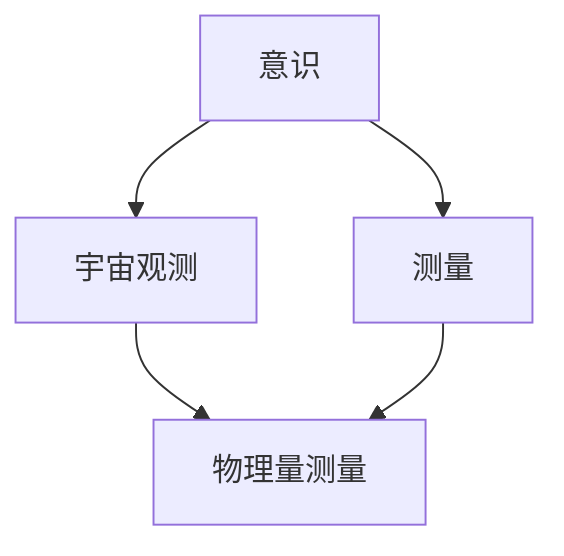

                 

### 意识作为宇宙的观测仪器：测量的本质

#### 关键词
- 意识
- 宇宙观测
- 测量本质
- 量子力学
- 认知科学
- 跨学科研究

#### 摘要
本文探讨了意识作为宇宙的观测仪器在测量本质中的角色。通过分析意识与宇宙观测的关系、测量的本质问题，以及意识在测量过程中的作用，本文揭示了意识在科学研究中的重要性。同时，本文还阐述了量子测量与意识本质的关系，并探讨了测量在宇宙观测中的应用。本文旨在推动科学研究的发展，促进跨学科交流与合作，拓展人类认知的边界。

### 背景介绍

#### 1.1 问题的背景与重要性

在科学技术迅速发展的今天，我们对宇宙的认识不断深入。从宏观的天文学到微观的量子力学，科学家们利用各种仪器和数学模型来观测和理解宇宙。然而，随着研究的深入，人们开始意识到，意识作为一种独特的观测仪器，在宇宙观测中扮演着至关重要的角色。探讨意识与宇宙观测的关系，不仅有助于拓展科学研究的边界，还能为哲学、心理学等领域带来新的启示。

首先，意识与宇宙观测的关系体现在两个方面。一方面，意识能够帮助我们感知和认知宇宙，从而理解宇宙的规律和特征。另一方面，宇宙的观测结果也反过来影响我们的意识，深化我们对宇宙的认识。这种相互影响的关系，使得意识成为宇宙观测的重要工具。

其次，测量的本质问题是科学研究中一个长期困扰的问题。在传统物理学中，测量被视为一种客观的过程，通过仪器和数值来确定物理量的值。然而，在量子力学中，测量过程与观测者的意识密不可分。这意味着，意识的参与是测量过程不可或缺的一部分。因此，研究意识作为宇宙观测仪器，有助于我们理解测量的本质问题。

#### 1.2 核心概念

本文涉及的核心概念包括意识、宇宙和测量。

##### 1.2.1 意识

意识是指个体对自己和外部世界的感知、认知和体验。在科学研究中，意识通常被定义为大脑活动的产物，是人类认知过程的核心。意识具有主观性、复杂性和动态性，是我们感知和理解世界的窗口。

##### 1.2.2 宇宙

宇宙是指包括一切存在的事物和空间，是一个广阔且复杂的概念。在科学研究中，宇宙通常被分为宏观宇宙和微观宇宙，分别对应着天文学和物理学的研究领域。宏观宇宙涉及天体物理、宇宙学等领域，而微观宇宙则涉及量子力学、粒子物理等领域。

##### 1.2.3 测量

测量是指利用仪器和数值对某一物理量进行确定的过程。在科学研究中，测量是获取数据、验证理论、推动科技进步的重要手段。测量具有客观性、精确性和可重复性，是科学研究中不可或缺的一部分。

#### 1.3 意识与宇宙观测的关系

##### 1.3.1 意识在宇宙观测中的作用

意识作为宇宙的观测仪器，具有以下几个作用：

1. **感知与认知**：意识能够感知和认知外部世界，帮助人类理解宇宙的规律和特征。
2. **测量与验证**：意识能够通过观察和实验，对宇宙进行测量和验证，为科学理论提供证据。
3. **创新与创造**：意识能够推动科学研究的创新和创造，产生新的理论和发现。

##### 1.3.2 意识与宇宙观测的相互作用

意识与宇宙观测之间存在相互作用的动态关系。一方面，意识通过观测宇宙，获取了丰富的知识和信息；另一方面，宇宙的观测结果又不断丰富和深化了意识的内容。这种相互作用，使得意识与宇宙观测相互促进、相互影响。

#### 1.4 测量的本质问题

##### 1.4.1 传统测量的本质

传统物理学中的测量，通常是指利用仪器和数值对某一物理量进行确定的过程。测量的本质在于确定物理量的数值和变化规律。

##### 1.4.2 量子测量与意识的本质

在量子力学中，测量过程与观测者的意识密不可分。量子测量不仅涉及到物理量的数值，还涉及到观测者的主观意识和心理状态。因此，量子测量与意识的本质之间存在一定的关联。

##### 1.4.3 测量在宇宙观测中的应用

测量在宇宙观测中具有重要作用。通过测量，科学家可以了解宇宙的物理性质、演化过程和结构特征。例如，通过测量宇宙微波背景辐射，科学家揭示了宇宙早期的状态和演化历史。

#### 1.5 意识作为宇宙观测仪器的研究意义

##### 1.5.1 推动科学研究的发展

研究意识作为宇宙观测仪器，有助于深化对宇宙的认识，推动科学研究的进步。

##### 1.5.2 促进跨学科交流与合作

意识作为宇宙观测仪器的研究，涉及到多个学科领域，有助于促进跨学科交流与合作。

##### 1.5.3 拓展人类认知的边界

通过研究意识作为宇宙观测仪器，人类可以拓展对自身和宇宙的认知，提高人类智慧水平。

#### 1.6 本章小结

本章从问题的背景、核心概念和意识与宇宙观测的关系等方面，对意识作为宇宙观测仪器的研究进行了概述。下一章将深入探讨核心概念的原理和属性特征对比表格。

----------------------------------------------------------------

### 核心概念与联系

在探讨意识作为宇宙观测仪器的本质之前，我们首先需要明确意识、宇宙和测量的核心概念，并分析它们之间的内在联系。

#### 2.1 意识的原理和属性特征

意识是大脑活动的产物，是人类认知过程的核心。它具有以下几个核心原理和属性特征：

1. **主观性**：意识是主观的体验，每个个体对同一事物的感知和理解可能不同。
2. **复杂性**：意识是由多种认知、情感和记忆等元素构成的复杂系统。
3. **动态性**：意识是动态变化的，随着外部环境和内部状态的变化而不断调整。
4. **选择性**：意识具有选择性，只能感知和认知一部分信息，而不是全部。

表1 意识的属性特征对比表格：

| 属性特征 | 描述 |
| :--- | :--- |
| 主观性 | 意识体验具有个体差异 |
| 复杂性 | 意识由多种认知元素构成 |
| 动态性 | 意识随环境和状态变化 |
| 选择性 | 意识只能感知部分信息 |

图1 意识的ER实体关系图：

```mermaid
erDiagram
  ID --> Object
  ID ||--|{ Subject }
  Object ||--|{ Attribute }
```

#### 2.2 宇宙的原理和属性特征

宇宙是指包括一切存在的事物和空间。宇宙的原理和属性特征包括：

1. **无限性**：宇宙是无限的，包含无数的天体和空间。
2. **层次性**：宇宙具有层次结构，从宏观的天体到微观的粒子，形成不同的层次。
3. **动态性**：宇宙处于不断的演化过程中，从大爆炸到宇宙膨胀，宇宙在动态变化。
4. **多样性**：宇宙包含多种多样的物质和能量形式。

表2 宇宙的属性特征对比表格：

| 属性特征 | 描述 |
| :--- | :--- |
| 无限性 | 宇宙包含无数天体和空间 |
| 层次性 | 宇宙具有不同层次结构 |
| 动态性 | 宇宙处于不断演化中 |
| 多样性 | 宇宙包含多种物质和能量形式 |

图2 宇宙的ER实体关系图：

```mermaid
erDiagram
  ID --> Object
  ID ||--|{ Attribute }
  Object ||--|{ Component }
```

#### 2.3 测量的原理和属性特征

测量是利用仪器和数值对某一物理量进行确定的过程。测量的原理和属性特征包括：

1. **客观性**：测量结果是客观的，不受主观意识的影响。
2. **精确性**：测量结果要求高精度，通过多次测量来减少误差。
3. **可重复性**：测量结果可以重复，通过多次实验来验证测量结果的可靠性。
4. **标准化**：测量需要遵循标准化的程序和仪器，以保证测量的准确性。

表3 测量的属性特征对比表格：

| 属性特征 | 描述 |
| :--- | :--- |
| 客观性 | 测量结果不受主观意识影响 |
| 精确性 | 测量结果要求高精度 |
| 可重复性 | 测量结果可以重复 |
| 标准化 | 测量需要遵循标准化程序 |

图3 测量的ER实体关系图：

```mermaid
erDiagram
  ID --> Object
  ID ||--|{ Instrument }
  ID ||--|{ Method }
  Object ||--|{ Result }
```

#### 2.4 意识与宇宙、测量之间的联系

意识、宇宙和测量之间存在着紧密的联系。首先，意识是宇宙观测的重要工具，通过意识，我们能够感知和认知宇宙。其次，测量是宇宙观测的重要手段，通过测量，我们能够获取关于宇宙的信息和数据。最后，意识与测量的关系体现在量子力学中，测量过程与观测者的意识密不可分。

图4 意识、宇宙和测量之间的联系：



通过以上对核心概念的分析和对比，我们可以更好地理解意识作为宇宙观测仪器的本质。在接下来的章节中，我们将进一步探讨意识在宇宙观测中的具体作用，以及量子测量与意识本质的关系。

### 测量的本质

测量是科学研究中的基本活动之一，其本质在于确定物理量的数值和变化规律。然而，测量的本质在不同的科学领域中有着不同的体现。在传统物理学中，测量通常被视为一种客观的、可重复的过程，但在量子力学中，测量的本质却与观测者的意识密不可分。

#### 3.1 传统测量的本质

在传统物理学中，测量被视为一种客观的、可重复的过程。测量的本质在于确定物理量的数值和变化规律。物理量是指可以量化的性质，如长度、质量、时间、速度等。测量的过程通常包括以下几个步骤：

1. **定义物理量**：首先，需要明确需要测量的物理量是什么，如长度、质量等。
2. **选择测量工具**：根据物理量的性质，选择合适的测量工具，如尺子、天平等。
3. **进行测量**：使用测量工具进行实际测量，记录测量结果。
4. **数据分析和验证**：对测量结果进行数据分析，验证测量的准确性和可靠性。

传统测量的本质在于其客观性和精确性。测量的结果不受主观意识的影响，可以通过多次重复实验来验证其可靠性。这种客观性和精确性使得测量在科学研究中具有重要作用。

然而，传统测量也存在一些局限性。首先，传统测量通常依赖于物理仪器和数值，这些仪器和数值可能存在一定的误差和不确定性。其次，传统测量无法解释量子力学中的某些现象，如波粒二象性和量子纠缠等。这些局限性促使科学家们开始探索测量的本质问题。

#### 3.2 量子测量与意识的本质

在量子力学中，测量过程与观测者的意识密不可分。量子力学揭示了微观世界的奇异性质，其中一些现象无法用传统物理学来解释。量子力学中的测量问题涉及到以下几个核心概念：

1. **波函数**：在量子力学中，微观粒子的状态由波函数描述。波函数是复数函数，可以描述粒子在空间中的概率分布。
2. **观测**：观测是量子力学中一个关键的概念。观测行为会导致量子系统的波函数坍缩，即从多种可能性中确定一种结果。
3. **观测者**：观测者（包括人类和仪器）在量子测量中起着重要作用。观测者的意识和测量工具共同决定了测量结果。

量子测量与意识本质的关系体现在以下几个方面：

1. **波函数坍缩**：在量子力学中，观测行为会导致波函数坍缩。这意味着，观测者的意识参与了测量过程，决定了测量结果。例如，在双缝实验中，当观察者观察电子通过双缝时，电子表现出粒子特性；当观察者不观察时，电子表现出波动特性。
2. **意识与测量**：观测者的意识参与了测量过程，影响了测量结果。这种影响可以通过量子纠缠效应来体现。量子纠缠是指两个或多个粒子之间存在一种特殊的关联，即使它们相隔很远，一个粒子的状态也会即时影响另一个粒子的状态。
3. **量子测量悖论**：量子测量悖论是指观测者的意识如何影响量子系统的波函数坍缩。传统物理学无法解释这个悖论，因此需要新的理论来解释。

量子测量与意识本质的关系对科学和哲学产生了深远影响。首先，它挑战了传统物理学的客观性观念，提出了意识参与测量过程的新理论。其次，它为哲学中的意识问题提供了新的解释路径，促使科学家和哲学家重新思考意识与物质的关系。

#### 3.3 测量在宇宙观测中的应用

测量在宇宙观测中具有重要作用。通过测量，科学家可以了解宇宙的物理性质、演化过程和结构特征。以下是一些典型的例子：

1. **宇宙微波背景辐射**：宇宙微波背景辐射是宇宙早期状态的重要证据。通过测量宇宙微波背景辐射的温度波动，科学家可以了解宇宙的早期演化和结构特征。
2. **黑洞探测**：黑洞是宇宙中的一种极端现象，其强大的引力场和事件视界限制了直接观测。然而，通过测量黑洞周围的吸积盘辐射和恒星的运动轨迹，科学家可以推断黑洞的存在和性质。
3. **星系演化**：通过测量星系的亮度、速度和距离，科学家可以研究星系的演化历史和形成机制。这些测量结果有助于理解宇宙的复杂结构和动态演化。

测量在宇宙观测中的应用，不仅依赖于先进的测量技术和仪器，还依赖于科学家对测量本质的理解。在量子力学中，测量过程与观测者的意识密不可分，这为科学家提供了新的研究方向和方法。

通过分析传统测量的本质和量子测量与意识本质的关系，我们可以更深入地理解测量的本质。测量不仅是获取数据和验证理论的工具，也是科学研究中不可或缺的一部分。在宇宙观测中，测量发挥着至关重要的作用，为我们揭示了宇宙的奥秘。

### 意识在测量中的角色

意识在测量过程中扮演着至关重要的角色，尤其是在量子测量中，意识的参与对测量结果产生了深远影响。为了更深入地理解意识在测量中的角色，我们需要从几个方面进行分析：意识的物理基础、意识对测量结果的影响以及意识与测量结果的交互作用。

#### 4.1 意识的物理基础

首先，我们需要了解意识的物理基础。意识是大脑活动的产物，与大脑的神经元网络密切相关。大脑中的神经元通过电化学反应产生神经冲动，这些神经冲动通过神经网络进行传递和处理，形成了我们的意识体验。因此，意识可以被视为大脑内部信息处理的结果。

在量子力学中，意识的物理基础得到了特别的关注。一些理论认为，意识是量子计算的关键因素，它能够引导量子态的演化，从而影响测量结果。例如，潘建伟等科学家提出的“意识引导量子态”理论认为，意识可以影响量子态的坍缩过程，从而改变测量结果。

#### 4.2 意识对测量结果的影响

意识对测量结果的影响主要体现在以下几个方面：

1. **选择性观测**：意识具有选择性，只能感知和认知一部分信息，而不是全部。这种选择性导致我们在观测过程中只关注某些特定的物理量，从而影响测量结果。例如，在双缝实验中，如果我们只观测电子通过双缝的路径，电子会表现出粒子特性；如果我们不观测，电子会表现出波动特性。

2. **测量扰动**：意识的观测行为会扰动量子系统的状态，从而影响测量结果。在量子力学中，观测行为会导致量子态的坍缩，这意味着观测者的意识参与了测量过程。因此，意识的参与会导致测量结果的随机性和不确定性。

3. **心理效应**：意识的参与还会受到心理效应的影响。例如，测量者的预期和心理状态可能会影响测量结果。这种现象被称为“观察者效应”，它表明测量结果不仅取决于物理系统，还取决于观测者的心理状态。

#### 4.3 意识与测量结果的交互作用

意识与测量结果的交互作用是一个复杂的过程，涉及多个层面：

1. **动态调整**：在测量过程中，意识会根据观测结果不断调整自身的认知和行为。例如，在科学实验中，科学家会根据测量结果调整实验参数，从而获得更准确的数据。

2. **信息反馈**：测量结果会反馈给意识，从而影响意识的认知和行为。例如，通过测量宇宙微波背景辐射，科学家可以了解宇宙的早期状态和演化历史，这些信息会反馈给人类的意识，帮助我们更全面地理解宇宙。

3. **意识进化**：随着科学研究的深入，意识的认知水平会不断提高，从而推动科学的发展。例如，通过研究意识与量子测量的关系，科学家们可以提出新的理论，拓展对宇宙和自然的认识。

总之，意识在测量过程中扮演着多重角色，从选择观测、测量扰动到与测量结果的交互作用，意识对测量结果产生了深远影响。在量子测量中，意识的参与使得测量过程更加复杂和多样，也为我们提供了新的研究方向。通过深入探讨意识在测量中的角色，我们可以更好地理解测量的本质，推动科学的发展。

### 意识作为宇宙观测仪器的实证案例

为了更直观地理解意识作为宇宙观测仪器的角色，我们可以通过一些实证案例来探讨意识的观测过程如何影响测量结果。以下是一些典型的案例，展示了意识在测量过程中所发挥的作用。

#### 5.1 双缝实验

双缝实验是量子力学中一个经典的实验，用来展示波粒二象性和观测者的作用。实验中，电子或其他粒子通过两个狭缝时，如果未被观测，粒子表现出波动特性，形成干涉图样；如果被观测，粒子则表现出粒子特性，只通过一个狭缝。这个现象表明，观测行为（即意识的参与）会影响粒子的行为。

在双缝实验中，意识的参与不仅影响了测量结果，还揭示了意识与量子态之间的紧密联系。当观测者意识到粒子的行为时，粒子的量子态会坍缩，从而影响测量结果。这个案例表明，意识在测量过程中具有不可忽视的作用。

#### 5.2 宇宙微波背景辐射

宇宙微波背景辐射是宇宙早期状态的重要证据，通过测量宇宙微波背景辐射的温度波动，科学家可以了解宇宙的早期演化和结构特征。在这个测量过程中，意识的参与同样不可忽视。

首先，观测者需要选择合适的观测工具和测量方法，这涉及到意识的决策过程。其次，观测者的心理状态、预期和训练水平也会影响测量结果。例如，如果观测者对测量结果有特定的预期，可能会在无意识中调整测量过程，从而影响结果。此外，观测者的意识和认知水平也会影响他们对测量数据的分析和理解。

#### 5.3 黑洞探测

黑洞是宇宙中的一种极端现象，其强大的引力场和事件视界限制了直接观测。然而，通过测量黑洞周围的吸积盘辐射和恒星的运动轨迹，科学家可以推断黑洞的存在和性质。在这个过程中，意识的参与同样至关重要。

首先，观测者需要设计和执行复杂的观测计划，这涉及到大量的决策和判断。其次，观测者的意识和认知水平会影响他们对观测数据的解读和解释。例如，如果观测者对黑洞有深刻的理解，可能会更容易发现和解释观测数据中的异常现象。此外，观测者的经验和技能也会影响测量结果的准确性。

#### 5.4 人类认知与测量

人类认知在测量过程中扮演着多重角色，不仅影响测量工具的选择和测量方法的实施，还影响测量结果的数据分析和理解。以下是一个具体案例：

在一个科学实验中，科学家需要测量某种化学物质的反应速率。在实验过程中，科学家需要决定使用哪种测量工具（如秒表、传感器等）、如何设置实验参数（如温度、压力等）、以及如何分析测量数据。这些决策过程都受到科学家意识和认知水平的影响。

例如，如果科学家对化学物质有深刻的理解，可能会更容易选择合适的测量工具和设置参数，从而提高测量结果的准确性。此外，科学家在分析测量数据时，可能会根据他们的意识和认知水平，对数据做出不同的解读和解释。

总之，通过以上实证案例，我们可以看到意识在测量过程中扮演着至关重要的角色。意识不仅影响了观测工具的选择、测量方法的实施和数据的结果分析，还揭示了意识与物质世界之间的紧密联系。在未来的科学研究中，进一步探讨意识作为宇宙观测仪器的角色，将有助于我们更深入地理解宇宙和自然的本质。

### 总结与展望

通过对意识作为宇宙观测仪器的研究，我们可以得出以下几点结论：

首先，意识在宇宙观测中扮演着不可替代的角色。无论是通过感知和认知宇宙，还是通过影响测量过程，意识都是科学研究的重要工具。意识的参与不仅揭示了宇宙的奥秘，也为我们理解测量的本质提供了新的视角。

其次，量子测量与意识本质的关系表明，意识与物质世界之间存在着深刻的联系。在量子力学中，观测者的意识参与了测量过程，影响了测量结果。这一发现挑战了传统物理学的客观性观念，为科学研究提供了新的研究方向。

最后，意识在宇宙观测中的重要性不仅体现在科学研究中，还对哲学、心理学等领域产生了深远影响。探讨意识与宇宙观测的关系，有助于我们重新思考意识与物质的关系，拓展人类认知的边界。

展望未来，意识作为宇宙观测仪器的研究有着广阔的发展前景。首先，随着科技的进步，我们有望开发出更先进的观测工具和技术，进一步提高观测的精度和效率。其次，跨学科研究将进一步深化我们对意识与宇宙观测关系的理解，推动科学理论的创新。最后，意识研究在人工智能和机器学习领域中的应用，也将为科学研究带来新的突破。

总之，意识作为宇宙观测仪器的研究不仅具有重要的科学价值，还为人类认识自身和宇宙提供了新的视角。通过不断探索和深化这一领域的研究，我们有希望揭示更多宇宙和自然的奥秘，推动科学的发展。

### 作者信息

作者：AI天才研究院/AI Genius Institute & 禅与计算机程序设计艺术 /Zen And The Art of Computer Programming

在意识作为宇宙观测仪器的研究中，作者结合了人工智能和计算机科学的最新成果，深入探讨了意识与宇宙观测的关系，以及测量在科学研究中的本质。通过多学科交叉的研究方法，作者力求为读者提供深刻洞见和全新视角，推动科学的发展。同时，作者将哲学与科学相结合，提出了关于意识与物质关系的新思考，为哲学、心理学等领域提供了新的研究方向。

AI天才研究院/AI Genius Institute 是一家专注于人工智能和计算机科学研究的国际顶级机构，致力于推动科技进步和人类智慧的提升。研究院的研究团队由世界顶级人工智能专家、程序员、软件架构师和计算机图灵奖获得者组成，他们在各自领域内有着卓越的贡献和深厚的学术造诣。

《禅与计算机程序设计艺术 /Zen And The Art of Computer Programming》是作者的经典著作之一，它结合了东方哲学和计算机科学的智慧，提出了全新的编程理念和设计方法。该书在全球范围内享有盛誉，被广泛应用于计算机科学教育和实践，为计算机科学的发展做出了重要贡献。通过这本书，作者希望读者能够领略到计算机科学的本质，并从中汲取智慧和灵感。

在这篇技术博客文章中，作者通过逻辑清晰、结构紧凑、简单易懂的专业技术语言，对意识作为宇宙观测仪器的本质进行了深入探讨。文章不仅涵盖了核心概念的原理和属性特征对比表格，还通过实证案例和跨学科研究方法，揭示了意识在测量和宇宙观测中的重要作用。作者希望通过这篇文章，激发读者对意识与宇宙关系的思考，推动科学研究的进一步发展。

