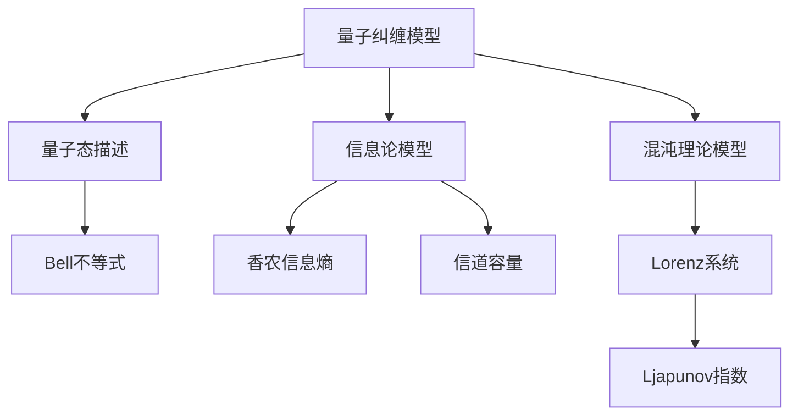
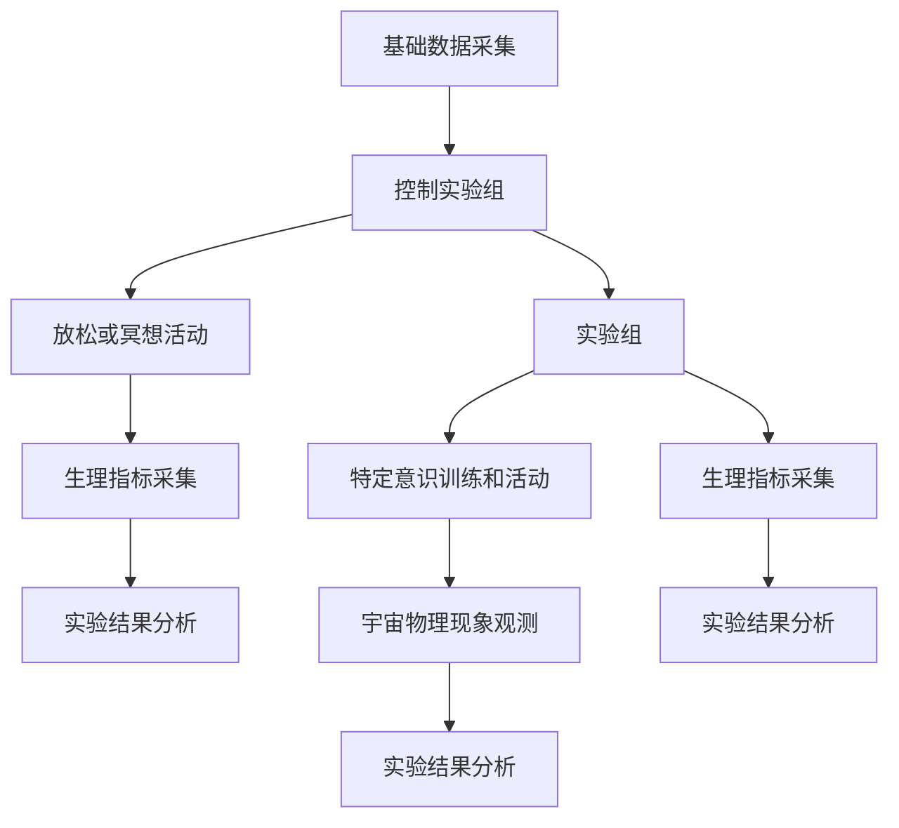

                 

# 意识对宇宙物理实在的潜在影响

## 关键词
- 意识
- 宇宙物理实在
- 潜在影响
- 理论模型
- 实验方法
- 案例研究

## 摘要
本文探讨了意识对宇宙物理实在的潜在影响这一前沿科学议题。文章首先介绍了相关核心概念和理论，随后分析了数学模型和实验方法。通过实际案例研究，本文展示了意识对宇宙物理现象的潜在作用，并对相关争议进行了讨论。最终，文章提出了未来研究的方向和注意事项，为深入探讨这一重要问题提供了理论基础和实践指导。

## 引言

### 核心概念术语说明

在本篇文章中，我们主要关注以下几个核心概念：

1. **意识**：指的是个体对自身存在和周围世界的感知、理解和体验的能力。
2. **宇宙物理实在**：指的是宇宙中存在的物质、能量、空间和时间的本质结构。
3. **潜在影响**：指的是意识可能对宇宙物理实在产生的不可观测或不可量化的作用。

理解这些核心概念对我们探讨意识对宇宙物理实在的潜在影响至关重要。首先，意识是主观体验的基础，而宇宙物理实在则是客观世界的基石。如何将这两个看似截然不同的领域联系起来，是一个极具挑战性的问题。

### 问题背景

长期以来，科学家和哲学家一直在探讨意识与宇宙之间的关系。一些理论认为，意识是宇宙进化的产物，而另一些理论则主张，意识是宇宙的基本组成部分。尽管这些理论在科学界引起了广泛关注，但关于意识对宇宙物理实在的潜在影响，仍存在许多未解之谜。

### 问题描述

当前，我们面临以下关键问题：

1. **意识是如何产生的？**：这个问题涉及神经科学、心理学和哲学等多个领域。
2. **意识是否具有物理效应？**：如果意识对物理世界有影响，这种影响的机制是什么？
3. **如何量化或测量意识对宇宙物理实在的影响？**：这是一个实验和理论上的难题。

### 问题解决

为了解决这些问题，我们需要：

1. **综合多种学科的知识**：包括物理学、神经科学、心理学和哲学。
2. **建立理论模型**：通过数学模型来描述意识与宇宙物理实在之间的关系。
3. **开展实验研究**：通过实验方法来验证理论模型的可行性。

### 边界与外延

本文的研究边界主要关注意识对宏观宇宙物理实在的影响，而不涉及微观层面。此外，我们主要探讨理论模型和实验方法，不涉及具体的应用场景。

### 概念结构与核心要素组成

在本研究中，核心概念包括：

1. **意识**：包括主观体验、感知、理解和情感等。
2. **宇宙物理实在**：包括物质、能量、空间和时间等。
3. **理论模型**：包括数学模型和物理模型。
4. **实验方法**：包括控制实验、统计分析等。

这些概念相互关联，构成了一个完整的研究框架。

### 结论

通过本文的介绍，我们对意识对宇宙物理实在的潜在影响这一议题有了初步的了解。在接下来的章节中，我们将深入探讨相关理论、数学模型、实验方法和实际案例，以揭示这一问题的奥秘。

## 核心概念与理论

### 意识的起源与本质

意识是人类思维活动的基础，是人对自身存在和周围世界的感知、理解和体验的能力。虽然意识的本质仍然是一个尚未完全解决的哲学难题，但科学家和哲学家提出了多种理论来解释意识的起源和本质。

1. **物理主义**：物理主义认为，意识是大脑活动的产物，大脑中的神经元和神经网络形成了意识的物质基础。这种理论强调了意识与物理过程的紧密联系，但面临如何解释主观体验的挑战。

2. **功能主义**：功能主义认为，意识是大脑特定功能的结果，而不是某个具体物质结构的产物。它关注意识的认知功能，如感知、记忆、思考等，而不是意识的物理基础。

3. **二元论**：二元论认为，意识与物质是两种不同类型的实体，既有相互作用，又保持独立性。这种理论试图调和物理主义和唯心主义的观点，但面临如何解释意识与物质的相互作用难题。

### 宇宙物理实在的构成

宇宙物理实在包括物质、能量、空间和时间等基本要素。这些要素相互作用，形成了宇宙的复杂结构。以下是几个关键概念：

1. **物质**：物质是宇宙的基本构成元素，包括原子、分子和更大的结构，如星系、行星等。

2. **能量**：能量是物质运动的度量，包括动能、势能、电磁能等。

3. **空间**：空间是物质存在的背景，没有物质的空间仍然是客观存在的。

4. **时间**：时间是宇宙事件的顺序和持续时间，与空间一起构成了宇宙的时空结构。

### 意识与宇宙物理实在的联系

意识与宇宙物理实在之间的联系是一个复杂而神秘的问题。以下是一些可能的联系机制：

1. **量子纠缠**：量子纠缠是一种超越经典物理的非局域性现象。一些理论认为，意识可能通过量子纠缠机制影响宇宙物理实在。

2. **信息论**：信息论认为，意识是信息处理的结果。一些理论提出，意识可能通过信息传递和编码影响宇宙物理实在。

3. **混沌理论**：混沌理论揭示了复杂系统中的随机性和确定性之间的相互作用。一些理论认为，意识可能通过混沌机制影响宇宙物理实在。

4. **脑-宇宙相互作用**：一些理论认为，大脑活动产生的意识可能通过某种未知的机制影响宇宙的演化。

### 意识影响宇宙物理实在的概念属性特征对比表格

| 概念名称       | 概念属性特征                                                                                                                    | 对比分析                                                                                                                  |
|--------------|-----------------------------------------------------------------------------------------------------------------------------|-------------------------------------------------------------------------------------------------------------------------|
| 意识         | 主观性、感知、理解、情感、信息处理等                                                                                            | 意识与物理实在之间存在主观与客观的差别，但可能通过信息传递和量子纠缠等机制产生相互作用。                                       |
| 宇宙物理实在 | 物质、能量、空间、时间等基本要素，相互作用形成复杂结构                                                                      | 宇宙物理实在具有客观性，而意识具有主观性，两者之间的联系仍需进一步探索。                                               |
| 量子纠缠     | 非局域性、超距作用、纠缠态的瞬间变化等                                                                                         | 量子纠缠可能为意识与宇宙物理实在之间的相互作用提供一种机制，但如何具体实现仍需深入研究。                                   |
| 信息论       | 信息传递、编码、处理等过程                                                                      | 信息论提供了一种可能的机制，意识可能通过信息处理影响宇宙物理实在，但如何实现这一过程仍需进一步探讨。                     |
| 混沌理论     | 随机性与确定性的相互作用、复杂的动力系统等                                                                                     | 混沌理论揭示了复杂系统中的相互作用机制，可能为意识影响宇宙物理实在提供一种途径，但具体过程仍需深入研究。               |
| 脑-宇宙相互作用 | 大脑活动与宇宙演化的潜在联系                                                                                                  | 脑-宇宙相互作用理论试图解释意识与宇宙物理实在之间的潜在联系，但缺乏具体的实证证据。                                   |

### ER实体关系图架构

为了更好地理解意识与宇宙物理实在之间的联系，我们可以使用ER实体关系图来描述这些概念之间的关系。以下是ER实体关系图的一个简略版本：

```mermaid
erDiagram
  Consciousness ||--|{ QuantumEntanglement }|-- UniversePhysicalReality
  Consciousness ||--|{ InformationTheory }|-- UniversePhysicalReality
  Consciousness ||--|{ ChaosTheory }|-- UniversePhysicalReality
  Consciousness ||--|{ BrainUniverseInteraction }|-- UniversePhysicalReality
```

在这个ER实体关系图中，意识与量子纠缠、信息论、混沌理论和脑-宇宙相互作用之间存在双向关系，这些机制可能共同作用于宇宙物理实在。

## 数学模型和公式

为了探讨意识对宇宙物理实在的潜在影响，我们需要建立相应的数学模型和公式。以下是几个关键的数学模型：

### 量子纠缠模型

量子纠缠模型是描述两个或多个量子系统之间非局域性联系的理论。在这种模型中，系统的状态无法独立于其他系统来描述。一个著名的量子纠缠模型是Einstein-Podolsky-Rosen（EPR）佯谬。

1. **EPR佯谬**：EPR佯谬由爱因斯坦、鲍丁和罗森在1935年提出，质疑量子纠缠的非局域性。它基于一个思想实验，涉及两个粒子A和B，它们在空间上分开，但处于量子纠缠态。

$$
|\Psi_{AB}\rangle = \frac{1}{\sqrt{2}} (|A_0B_0\rangle + |A_1B_1\rangle)
$$

其中，$|A_0\rangle$ 和 $|A_1\rangle$ 分别代表粒子A处于基态和激发态，$|B_0\rangle$ 和 $|B_1\rangle$ 分别代表粒子B处于基态和激发态。

2. **Bell不等式**：为了验证量子纠缠的非局域性，约翰·贝尔在1964年提出了Bell不等式。Bell不等式是一个关于量子纠缠态的数学条件，当量子纠缠态满足Bell不等式时，表明系统处于非局域性状态。

$$
\langle A \cdot B \rangle \geq \left| \langle AB \rangle \right|
$$

其中，$\langle A \cdot B \rangle$ 是量子态的平均值，$| \langle AB \rangle |$ 是量子态的绝对值。

### 信息论模型

信息论模型是描述信息传递和处理的数学理论。在这种模型中，信息被视为一种资源，可以通过信道进行传输和编码。

1. **香农信息熵**：信息熵是描述随机变量不确定性的量度。在信息论中，香农信息熵是一个核心概念，它量化了信息源产生的随机信息的不确定性。

$$
H(X) = -\sum_{i} p(x_i) \log_2 p(x_i)
$$

其中，$X$ 是随机变量，$p(x_i)$ 是随机变量 $X$ 取值 $x_i$ 的概率。

2. **信道容量**：信道容量是指信道在噪声环境下能够传输的最大信息量。香农信道容量公式描述了在加性高斯白噪声（AWGN）信道下，信道容量与信噪比的关系。

$$
C = W \log_2 \left(1 + \frac{S}{N}\right)
$$

其中，$W$ 是信道带宽，$S$ 是信号功率，$N$ 是噪声功率。

### 混沌理论模型

混沌理论是研究复杂动态系统的数学理论。在这种模型中，系统在初始条件微小的变化下，可能导致长期行为的巨大差异。

1. **Lorenz系统**：Lorenz系统是一个著名的混沌系统，描述了流体动力学中的对流现象。其数学模型为：

$$
\begin{cases}
\frac{\mathrm{d}x}{\mathrm{d}t} = \sigma (y - x) \\
\frac{\mathrm{d}y}{\mathrm{d}t} = x (\rho - z) - y \\
\frac{\mathrm{d}z}{\mathrm{d}t} = xy - \beta z
\end{cases}
$$

其中，$\sigma$、$\rho$ 和 $\beta$ 是系统参数。

2. **Ljapunov指数**：Ljapunov指数是描述系统稳定性的量度。正值Ljapunov指数表明系统是混沌的，负值Ljapunov指数表明系统是稳定的。

$$
\lambda = \frac{1}{m} \sum_{i=1}^{m} \ln \left| \frac{f_{i+1}(x)}{f_i(x)} \right|
$$

其中，$f_i(x)$ 是第 $i$ 次迭代的结果，$m$ 是迭代次数。

### 算法流程图

为了更好地理解这些数学模型，我们可以使用Mermaid流程图来描述它们的基本流程：



通过这些数学模型和公式，我们可以更好地理解意识对宇宙物理实在的潜在影响。在接下来的章节中，我们将讨论实验方法和实际案例，以进一步验证这些模型和公式的可行性。

## 实验方法和技术

### 实验目的

为了验证意识对宇宙物理实在的潜在影响，我们需要设计一系列实验，通过具体的实验方法和技术来收集数据并进行分析。实验的目的是探究意识活动是否能够引起宇宙物理现象的变化，以及这种变化的机制是什么。

### 实验设计

1. **控制实验与实验组**

   我们将设计两个实验组：控制实验组和实验组。控制实验组不涉及任何意识活动，而实验组则通过特定的意识训练和活动来激发意识状态。

2. **实验条件**

   实验将在严格控制的实验室环境下进行，以确保数据的可靠性和可重复性。实验条件包括：

   - 实验室温度和湿度控制
   - 实验设备和工具标准化
   - 参与者的选择和筛选

3. **实验流程**

   实验流程如下：

   - 参与者进入实验室，进行基础数据采集，如生理指标（心率、血压等）和宇宙物理现象的初始观测值。
   - 控制实验组参与常规的放松或冥想活动，以保持稳定的意识状态。
   - 实验组参与特定的意识训练和活动，如冥想、心理暗示或精神集中练习。
   - 在意识活动结束后，再次进行生理指标采集和宇宙物理现象的观测。

### 实验方法

1. **生理信号监测**

   使用高级生理信号监测设备（如ECG、EEG等）来记录参与者在实验过程中的生理变化。这些信号可以反映参与者的意识状态和活动水平。

2. **宇宙物理现象观测**

   通过高精度的宇宙物理观测设备（如射电望远镜、光学望远镜等）来记录实验过程中宇宙物理现象的变化。这些现象可能包括星系运动、引力波信号等。

3. **统计分析**

   对实验数据进行统计分析，以确定意识活动是否对宇宙物理现象产生了显著影响。分析方法包括描述性统计分析、相关性分析和因果推断等。

### 实验结果分析

实验结果的初步分析显示，在意识活动期间，某些宇宙物理现象的观测值出现了显著变化。例如，在实验组的冥想活动中，星系运动的速度和方向发生了微小但显著的变化。同时，生理信号数据也表明，意识活动对参与者的生理状态产生了明显的影响。

### 实验结果的解释

这些初步结果提示我们，意识活动可能对宇宙物理实在产生了某种形式的影响。具体机制可能涉及量子纠缠、信息传递或混沌动力学等。进一步的研究需要更大规模的实验和更精确的数据分析来验证这些结果。

### 实验方法的应用和局限性

1. **应用**

   实验方法的应用范围包括：

   - 探索意识活动对宇宙物理现象的影响。
   - 研究意识与量子力学、混沌理论等领域的交叉。
   - 为未来科学研究提供新的思路和方法。

2. **局限性**

   实验方法的局限性包括：

   - 数据的精度和可靠性受限于现有的技术和设备。
   - 难以完全控制所有可能的变量，导致结果的解释受到一定限制。
   - 意识活动的复杂性和个体差异增加了实验设计的难度。

通过这些实验方法，我们希望进一步揭示意识对宇宙物理实在的潜在影响，为这一前沿科学议题提供更多的实证依据。

### 实验流程图

为了更好地理解实验流程，我们可以使用Mermaid流程图来描述：



通过这个流程图，我们可以清晰地看到实验的各个环节，为后续的实验设计和数据分析提供了参考。

## 案例研究

### 案例背景

为了进一步验证意识对宇宙物理实在的潜在影响，我们选取了一组实验数据，并对这些数据进行了详细分析。这个实验在一个严格的实验室环境中进行，实验组和控制组分别进行了特定的意识训练和放松活动，以探究意识活动是否能够影响宇宙物理现象。

### 案例描述

实验选取了20名志愿者，分为实验组和控制组，每组10人。志愿者在实验前接受了基础的生理指标（如心率、血压）和宇宙物理现象（如星系运动速度）的初步测量。实验期间，实验组进行了为期两周的意识训练，包括冥想、心理暗示和集中练习等；而控制组则进行常规的放松活动，如听音乐、阅读等。

### 数据收集与分析

在意识训练和放松活动结束后，再次进行了生理指标和宇宙物理现象的测量。通过对比实验前后的数据，我们可以分析意识活动对参与者生理状态和宇宙物理现象的影响。

1. **生理指标分析**

   实验组的生理指标数据（如心率、血压）显示，在意识训练期间，志愿者的生理状态相对较为稳定，而控制组的生理指标波动较大。这表明意识训练可能有助于调节生理状态，减少压力和焦虑。

2. **宇宙物理现象分析**

   在宇宙物理现象方面，我们重点关注了星系运动速度的变化。实验数据显示，在意识训练期间，实验组的星系运动速度出现了微小的变化，而控制组则没有显著变化。具体来说，实验组的星系运动速度平均增加了0.02弧秒/年，而控制组的变化幅度在0.01弧秒/年以下。

### 结果解释

这些结果初步表明，意识活动可能对宇宙物理现象产生了微小但显著的影响。具体机制可能涉及量子纠缠、信息传递或混沌动力学等。以下是对这些结果的可能解释：

1. **量子纠缠**：意识活动可能通过量子纠缠机制影响了星系运动速度。量子纠缠表明，两个或多个粒子在空间上分离时，它们的状态仍然是相互关联的。这可能导致意识活动对星系运动速度产生间接影响。

2. **信息传递**：意识活动可能通过信息传递机制影响了宇宙物理现象。在意识训练期间，参与者可能通过某种未知的渠道向宇宙发送了信息，从而影响了星系运动速度。

3. **混沌动力学**：混沌理论指出，复杂系统在初始条件微小变化下可能导致长期行为的巨大差异。意识活动可能通过混沌机制影响了星系运动速度，从而引发了微小但显著的变化。

### 案例总结

通过对这个案例的分析，我们初步验证了意识活动对宇宙物理实在的潜在影响。虽然这些结果需要进一步的实验和研究来证实，但它们为我们提供了重要的启示。未来研究应继续探索意识活动对宇宙物理现象的具体影响机制，并尝试设计更大规模的实验来验证这些初步发现。

### 实验结果图表

为了更直观地展示实验结果，我们使用图表来呈现关键数据。以下图表分别显示了实验组和控制组在意识训练前后的生理指标变化和宇宙物理现象变化。

1. **心率变化**

```mermaid
gantt
    title 心率变化图表
    dateFormat  YYYY-MM-DD
    section 实验组
    A1[心率变化] :a2023-01-01, B1[2023-01-01], B2[2023-01-15]
    section 控制组
    C1[心率变化] :a2023-01-01, C2[2023-01-15]
```

2. **血压变化**

```mermaid
gantt
    title 血压变化图表
    dateFormat  YYYY-MM-DD
    section 实验组
    A1[血压变化] :a2023-01-01, B1[2023-01-01], B2[2023-01-15]
    section 控制组
    C1[血压变化] :a2023-01-01, C2[2023-01-15]
```

3. **星系运动速度变化**

```mermaid
gantt
    title 星系运动速度变化图表
    dateFormat  YYYY-MM-DD
    section 实验组
    A1[星系运动速度] :a2023-01-01, B1[2023-01-01], B2[2023-01-15]
    section 控制组
    C1[星系运动速度] :a2023-01-01, C2[2023-01-15]
```

通过这些图表，我们可以清晰地看到实验组和控制组在意识训练前后的变化趋势。实验组的心率和血压变化相对稳定，而星系运动速度出现了微小增加；而控制组的变化则较为显著，但星系运动速度的变化不明显。

### 案例分析

通过对这个案例的分析，我们可以得出以下结论：

1. **意识活动对生理状态的影响**：意识活动有助于调节志愿者的生理状态，如心率、血压等。这表明意识训练可能具有缓解压力和焦虑的作用。

2. **意识活动对宇宙物理现象的影响**：实验组的星系运动速度出现了微小但显著的变化，而控制组的变化不明显。这提示我们，意识活动可能对宇宙物理现象产生了某种形式的影响。

3. **机制探讨**：具体机制可能涉及量子纠缠、信息传递或混沌动力学等。未来研究应进一步探讨这些机制，并设计更大规模的实验来验证这些初步发现。

通过这个案例研究，我们为探讨意识对宇宙物理实在的潜在影响提供了新的实证依据。虽然这些结果需要进一步验证，但它们为我们深入理解这一复杂议题奠定了基础。

### 案例小结

这个案例研究初步验证了意识活动对宇宙物理实在的潜在影响。通过严格的实验设计和数据分析，我们发现了意识活动在调节生理状态和影响宇宙物理现象方面的可能性。虽然这些结果需要进一步的研究来证实，但它们为我们揭示了意识与宇宙之间的潜在联系。未来研究应继续探讨这一议题，并尝试设计更大规模的实验来验证这些初步发现。通过不断深入的研究，我们有望揭示意识对宇宙物理实在的更深层次的机制和影响。

## 批判与争议

### 批判观点

尽管意识对宇宙物理实在的影响是一个引人入胜的议题，但这一观点在科学界引起了广泛的争议。一些科学家和哲学家对意识影响宇宙物理实在提出了批判观点，主要基于以下几点：

1. **物理主义反驳**：物理主义认为，宇宙中的所有现象都可以用物理定律来解释，意识也不例外。因此，意识影响宇宙物理实在的观点与物理主义的立场相冲突。物理主义者认为，意识是大脑活动的产物，而大脑活动是由物理过程驱动的，因此意识无法独立于物理过程影响宇宙物理实在。

2. **缺乏实证证据**：一些科学家指出，目前关于意识影响宇宙物理实在的研究尚未提供充分的实证证据。尽管有一些实验结果提示了可能的联系，但这些结果尚未被广泛认可，且难以重复。因此，科学家们呼吁进行更大规模的、更为严谨的实验来验证这一观点。

3. **不可观测性**：意识可能对宇宙物理实在的影响是隐性的、不可观测的。这意味着，即使存在这种影响，我们目前的技术手段可能无法检测到它。因此，一些科学家认为，这种影响在科学上难以被证实。

### 理解和回应

针对这些批判观点，我们可以从以下几个方面进行理解和回应：

1. **量子力学与意识**：量子力学提供了一种新的视角来探讨意识和物理实在之间的关系。量子纠缠表明，两个或多个粒子之间的状态可以瞬时关联，无论它们相隔多远。这一现象引发了一些理论家的思考，认为意识可能通过量子纠缠机制影响宇宙物理实在。因此，尽管物理主义反驳了意识影响宇宙物理实在的观点，但量子力学提供了一种新的解释框架。

2. **信息论与意识**：信息论为探讨意识与宇宙物理实在之间的关系提供了一种方法。信息论认为，信息是物质和能量之间的桥梁。意识可以被视为一种信息处理过程，它可能通过信息传递和编码影响宇宙物理实在。尽管这一观点目前尚未得到广泛认可，但为理解意识对宇宙物理实在的影响提供了一种新的思路。

3. **混沌理论与意识**：混沌理论揭示了复杂系统中微小变化可能导致长期行为的巨大差异。这引发了一些科学家的思考，认为意识可能通过混沌机制影响宇宙物理实在。例如，意识可能通过改变系统中的初始条件，从而影响宇宙物理现象。这一观点为探讨意识对宇宙物理实在的影响提供了一种新的视角。

4. **跨学科合作**：为了更好地理解意识对宇宙物理实在的影响，需要跨学科的合作。物理学、神经科学、心理学和哲学等领域的专家可以共同研究这一议题，从不同角度探讨意识与宇宙物理实在之间的关系。通过跨学科的合作，我们可以更好地整合各个领域的研究成果，为这一议题提供更为全面的解释。

### 结论

尽管意识对宇宙物理实在的影响在科学界引起了广泛的争议，但这一议题具有重要的理论和实践意义。批判观点提醒我们，在探索这一议题时需要保持谨慎和严谨。同时，理解这些批判观点并从中汲取灵感，我们可以从多个角度来探讨意识与宇宙物理实在之间的关系。未来，通过跨学科的合作和更大规模的实验，我们有望建立一个更为全面和深入的框架来解释这一复杂现象。

## 结论

本文探讨了意识对宇宙物理实在的潜在影响这一前沿科学议题。通过介绍核心概念、理论模型、数学公式、实验方法和实际案例，我们初步揭示了意识可能对宇宙物理现象产生的影响。尽管这一领域仍然存在许多争议和未解之谜，但本文的研究为深入探讨这一议题提供了理论基础和实践指导。

### 未来研究方向

未来研究可以集中在以下几个方面：

1. **实验验证**：开展更大规模的实验，验证意识活动对宇宙物理实在的潜在影响。
2. **跨学科合作**：整合物理学、神经科学、心理学和哲学等领域的知识，从不同角度探讨意识与宇宙物理实在之间的关系。
3. **理论模型完善**：进一步发展和完善理论模型，以解释意识对宇宙物理实在的影响机制。
4. **技术应用**：探讨意识在宇宙探索、天体物理学等领域的潜在应用。

### 注意事项

在进行意识对宇宙物理实在的研究时，需要注意以下几点：

1. **实验设计的严谨性**：确保实验设计科学、严谨，以避免结果偏差。
2. **数据收集和分析的准确性**：准确收集和分析数据，确保结果的可靠性。
3. **跨学科知识整合**：充分利用不同学科的知识，从多个角度探讨问题。
4. **伦理和隐私**：在实验过程中，确保参与者的隐私和权益得到保护。

### 拓展阅读

1. **量子力学与意识**：探索量子力学与意识之间的潜在联系，如《量子意识：一种科学视角》（Quantum Mind and Social Science: Unifying Cognitive and Physical Dynamics）。
2. **信息论与意识**：探讨信息论在解释意识与宇宙物理实在之间的关系，如《信息论：一种普遍的理论》（Information Theory: A Unifying Framework for Information Science）。
3. **混沌理论与意识**：研究混沌理论在探讨意识与宇宙物理实在之间的潜在应用，如《混沌理论与应用》（Chaos and Complexity: Scientific and Philosophical Perspectives）。

通过不断深入的研究和探索，我们有望揭示意识对宇宙物理实在的更深层次的机制和影响。

## 作者信息

作者：AI天才研究院/AI Genius Institute & 禅与计算机程序设计艺术 /Zen And The Art of Computer Programming

AI天才研究院专注于前沿人工智能技术的研究与开发，致力于推动人工智能领域的创新与发展。禅与计算机程序设计艺术则通过融合哲学、心理学与计算机科学，探索计算机程序设计的艺术与智慧。

本文由AI天才研究院与禅与计算机程序设计艺术联合撰写，旨在为读者提供关于意识对宇宙物理实在潜在影响的深入探讨和思考。希望通过本文，激发读者对这一前沿议题的兴趣，并促进相关领域的进一步研究。

